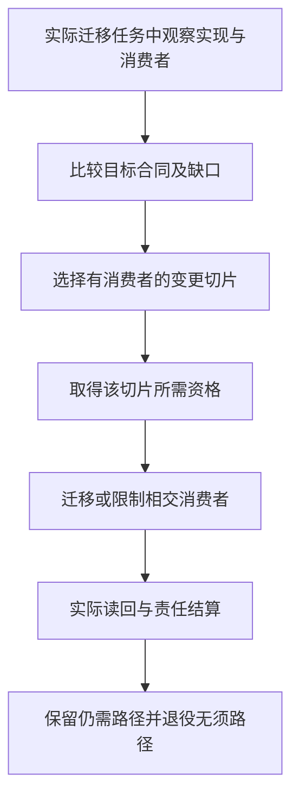

# 仓库迁移与自托管

> **阅读范围**：采用范围内的设计规范；实现状态另查未决 · [共同上下文](主线前沿与准入.md)。

<details>
<summary>本页内容</summary>

- [当前仓库到目标系统的重构总图](#当前仓库到目标系统的重构总图)
- [现有仓库迁移方法](#现有仓库迁移方法)
- [纵向切片与自举计划](#纵向切片与自举计划)
- [自托管、逐步接管与旧机制清零](#自托管逐步接管与旧机制清零)
- [旧来源归属的版本化适配](#旧来源归属的版本化适配)
- [文件组织迁移的有限切片与接受边界](#organization-migration)

</details>


## 当前仓库到目标系统的重构总图

### 1. 目标

迁移不能以“大重写”开始，也不能把目标设计直接当作当前实现事实。先从 exact repository revision 产生 Observed Architecture，再与 Target Design 做 Reconciliation。

```text
TargetDesignGeneration
+ CurrentRepositoryObservationGeneration
→ ReconciliationGeneration
→ preserved | drift | required-unmaterialized | surplus | unknown
→ focused migration slices
```

### 2. 当前观察维度

- public/runtime entrypoints；
-模块和依赖图；
- canonical data/schema/serializer；
- source readers/writers；
- semantic owner 与重复实现；
- direct filesystem/network/process Effects；
- tests/verification/workflows；
- dependency/package/lock；
- generated/control/recovery state；
- release/distribution；
- branch/worktree/ref 和平台 enforcement；
- unknown/dynamic consumers。

### 3. 映射分类

```text
preserve
adapt
refactor-in-place
wrap-temporarily
migrate-data
replace-provider
split-owner
merge-duplicate
retire
investigate
```

每项映射绑定当前 symbol/path/revision、目标责任、消费者、证据和退出条件。

### 4. 迁移原则

先明确新旧合同与相交义务，按风险选择静态保持、独立符合性、隔离影子或实际故障检查，再迁移真实消费者。单一冲突域不设竞争权威writer；每个切片按其实际作用检查保持与读回，旧活动消费者迁移/排空或拒绝，历史责任另处理。不以目录搬迁冒充架构完成，也不为纯移动强制双实现。

### 5. 第一纵向切片

第一产品切片采用“作者定义→同一编译器→独立目标程序→真实消费者→再次修改”，具体范围由本篇[纵向切片与自举计划](#纵向切片与自举计划)拥有。以下存量改写链仍然成立，但只约束实际需要接管已有工程的切片，不是纯生成前置：

```text
精确存量观察 → 显式采纳相关含义 → 对应变更计划
→ 获准的有前像写回 → 读回与所需验证
```

工程允许先向隔离候选生成代码，经既有原生接口接入一个消费者；不要求先把全仓源码逆向成完整业务模型，不要求先有持久控制和任意多文件恢复。反过来，取得生成结果不授予已有工作区写入、Git集成或发布权限。

### 6. 自托管

SEC可用成熟工具开发自己的首个产品切片。自托管采用从只读和低风险子系统逐步扩大；这不是“先让SEC安全修改自己，才有权实现编译器”。修改TCB仍走独立bootstrap。

### 7. 完成定义

不是所有旧代码一次消失，而是每个已迁移责任只有一个 owner、旧路径无 consumer、真实入口使用新路径、证据绑定 current main，且下一普通变更不需要手工旁路。


## 现有仓库迁移方法

### 1. 不预设当前事实

迁移前对精确仓库 revision 重新观测。本文不把任何临时分支、目录或旧文档状态写成永久事实。

### 2. 三个输入

```text
TargetDesignGeneration
ObservedRepositoryGeneration
ReconciliationGeneration
```

观察包括源码、测试、构建、依赖、工作流、运行路径、文档和当前消费者。

### 3. 映射分类

每个当前对象映射为：

```text
Conforms
Partial
Extra
Missing
Conflicting
Unknown
LegacyMigrationCarrier
```

不能因为名称相同判定符合，也不能因为目标中无名称就判定无机制。

### 4. 迁移单元

按真实消费者与不变量选择可独立交付的纵向切片，不按目录整体改造。记录目标责任、现状、前提、候选合同、资格方法、实际切换/回读、失败与恢复、旧支持安排。影子实现和双读/双算是可选方法；没有相应风险不建立它们。

### 5. 实施优先关系

先取得本切片需要的明确输入、身份和错误语义，再接消费者真正需要的查询、生成、检查与作用。只生成纯函数不等待持久控制面；已有工作区修改才需前像与恢复；团队部署才接对应权威与目标端。精确依赖已满足的工作可并行，不以固定十步顺序阻断与之无关的能力。

### 现有仓库迁移闭环



本图仅适用于已经请求的存量迁移；不要求最终架构设计先读取旧仓库，也不要求所有设计都进入写入或部署。

### 6. 影子、差分与替代

具备可比较输入且不会重复外部效果时，影子/差分可以比较规范结果、诊断、失效与性能；对新增行为或已知旧缺陷，旧输出不能自动成为正确Oracle。没有可运行旧实现时可用明确期望、保持证明或独立方法。所需范围未满足不切相交权威消费者，但可以继续无作用设计、保全候选与独立合法输出。

所有方法对应假设、覆盖和代价。实际观察足以暴露不等价，不代表未观察差异必然不存在；接口、资源或数据变化推翻假设时回到对应合同，而不是用更长影子阶段维持旧模型。

### 7. 控制面迁移

期望状态、实时观测和解析结果分开存储。禁止把“默认分支当前是否含某文件”等 live observation 固化为长期 desired state。

### 8. 数据和 Schema

读取、写入、回填、切换和收缩次序由[读写组合](../兼容迁移与退役.md#读写组合与迁移准入)确定；先防止旧写者丢新内容，再启用相交新写。旧字段、事件与恢复路径按支持和保留义务计入，不要求先删所有历史读者。

### 9. 代码移动

代码移动按实际延续合同保持主体和公共行为；名称被原生协议作为身份时须显式重绑定或兼容，不能无条件宣称身份不变。使用准确静态/动态消费者、导入与解析上下文、契约检查和原生入口清点，不通过长期聚合门面维持重复职责。真实外部地址的单目标薄转发依支持合同保留，与重复策略/聚合门面区别处理；具体准入见[物理落位](../../架构/装配/模块与运行实例.md#physical-placement-contract)，实际执行与恢复见[资产重组](../../作者/工程源/资产与非源码.md#placement-change-contract)。

### 10. 失败和回退

每个切换定义：

- 停止条件；
- 观测指标；
- 可安全回退窗口；
- 数据是否可逆；
- 前滚修复；
- 旧写权恢复条件；
- 事件响应。

### 11. 清零

旧机制删除前搜索：源码 import、动态加载、配置、脚本、测试、CI、文档、备份、离线工具、支持流程和外部消费者。清零证据内容寻址并复核。

### 12. 验收

- 迁移绑定 exact revision；
- Target/Observed 差异可追踪；
- 每次只切换有限消费者；
- 新旧差分和故障证据；
- 失败可恢复；
- 旧写权撤销；
- 无隐藏兼容门面；
- 最终消费者清零；
- 迁移完成后重新观测系统符合目标。


## 纵向切片与自举计划

### 实施裁决与不变目标

本章定义实现次序，不以命令或验收方案自动取得产品实施权。当前首期是**结构意图与原生供给的完整开发闭环**：分片JSON直接表达产品决定，捕获真实定义/依赖与必要原生源码，按准确主体选择或创作实现，生成TS目标并由真实消费者使用，再修改同一作者源。实现阶段以已有TS工具链形成种子，不实现新`.sec`文本语言作为前置。解析控制、数组和反馈计算例只在所用方法需要时校准，不要求应用作者迁写其算法。第一个SEC自用单元选已有规则目录与导航的只读派生，不碰权限、采用或证据签发；当前Python文档工具本身不是SEC已自用的证据。事务、账户、消息与服务不是普通工具前置。Java及第二个完整目标语言未选定；采用C/Rust/Wasm等热点供给是局部实现选择，不能被误算成全目标迁移。真实源码和消费位置在实施前捕获，历史HALO仅是线索。

首版不是“18个词都能被parser接受”，也不是整个世界语义。它要让AI完成一项实际的有限开发工作，程序含义、目标、错误和修改链可以解释。没有全语言/全域最优证明不妨碍当前有界选择；核心作者方法未定则不得让实现者临时另造。

### 语言级设计准入，而不是逐关键词打补丁

作者形态、文件与导入、当前合法语法、类型/效果、求值/错误、接口字段、产物关系和一条完整开发轨迹在对应编码前确定。本版选择位置是[作者实施基线](../../作者/可替换表示与适用范围.md#当前作者面实施基线与决策状态)和[完整会话](../../../examples/连续开发/组合结构与任务轨迹.md#作者源从首次创建到下一次修改的固定会话)。结构作者字段由结构规范拥有；只有显式采用计算文本画像时，其基础文法才由对应语言章约束。本节选择产品支持范围，不为结构源另加文本解析步骤。

某构造缺少当前必须的语义/算法/错误规格，先补这一块再实现；缺真实运行数据则在获准实现后取得，不能循环要求“实现前先有实现通过的证据”。未纳入当前能力的时间、并行状态或其他高级画像，保留其义务但不阻止本范围。

### 当前MVP范围与支持清单

这是当前产品的第一条可采用支持范围，不是新增计算语言的开发清单。以一个可复用结构定义、准确原生供给、库/CLI两个消费根和连续修改检验完整性；工作台的更多宿主能力逐项开启。内部首个提交可以更窄；正式声明本MVP时必须覆盖下面明确纳入的内容。可选计算画像与高级领域不能因同处表中就成为第一版的全部前置。

| 对象 | 当前纳入 | 默认实现或处理 | 当前不承诺 |
|---|---|---|---|
| 作者 | AI/脚本直接结构模块、原生files及唯一基础的差异 | 六工具消费同一候选；小定义可以内联，不强建工程 | 强制新文本语言、图形客户端、任意语法猜测 |
| 模块和库 | 结构定义的导入/出口、公开主体、默认参数、准确身份与依赖；原生库沿其真实门面 | 直接结构绑定与原生合同适配，缺省私有；需要表示隐藏时使用所选原生或中立方法 | 任意远程自动获取、核心自建所有class/trait语法、全语言提升 |
| 计算与数据 | 所选需求实际使用的精确值、关系与错误；方法首先来自真实TS或合格其他供给 | 原生类型/对象/控制由其工具链处理，中立接口保留数值、效果与资源合同；既有计算画像可单独启用 | 核心必须先实现所有计算文本构造、未定义同步的共享可变内存或任意宿主执行 |
| 参数化与闭包 | 结构的有型值/主体参数，以及原生供给公开的有限泛型与回调 | 原生工具核内部语义，边界核捕获、错误、调用次数与寿命；选择中立计算时沿其显式泛型规则 | 原生支持被冒称核心已实现所有类型推断，任意资源跨挂起 |
| 要求 | 结构硬要求、条件/量化、默认、公开边界及独立接受引用；计算契约按所选画像 | 联合主体与方法，保留检查或合格消解；不必先部署SMT | 自动求解任意规格、按同类型合并主体、以样本代签全输入 |
| 高层价值 | 已有成品形态范本的一份结构行为、原生实现及库/CLI两根完成真实消费；第二次改默认或边界 | 保持类型/编码/顺序/资源与共享主体；TSV、数组和反馈只作相交额外反例 | 一个范本代表全生态、仅换语法证明收益、强迫先建设三款产品 |
| 真实计算开发 | 对精确产物构建、运行、取得输出、有限定点观察/剖析，再返回源修改 | 使用compute-run扩展和合格Runner，源/产物/输入/环境分别固定；复用成熟调试与测量能力 | 只接内部Execution.run就称公开可用，或以check(cases)替代所有普通运行 |
| 生成与维护 | TS目标、原生TS可靠维护、结构变化后的准确再生成；选择受管目标编辑时启用回源 | 先捕获与确定生成，再优化增量；原生语言服务和有来源映射按需复用 | 逆向是新产品前置、Java前置、任意全语言互译、无来源还原原设计 |
| 修改与错误 | 首次创建、参数修改、直接改受管目标、新组合、错误草稿、陈旧冲突、保存后继续 | 原生源直接改；受管输出改动形成目标草稿，再依法回写原源并重新生成 | 只在输出打补丁却遗失原作者更新；强制全部源转为SEC |
| 采用与自用 | 一个真实外部/目标消费者，并将同一机制用于SEC自身一处可隔离职责 | 先读真实前像，旧/新输出对比，获准后有限采用；自用不获得自授信任权 | 首版完整编译器自宿主、发布治理全接管、事务/多租户/消息同时全交付 |

有限泛型实例可以受实际编译预算限制，但不能暗改合法源的含义：目标可以返回尚不支持或预算不足，不得截断类型或输出Any。该限制属于具体实现支持程度，不取消总体语言的自由。普通无此需求程序不承担这些分析费用。

首个被采用的输出必须有真实消费者，并用封装定义的再次修改检验是否摆脱业务特化。选择的是现有只读规则目录/导航派生这一自用责任；真正代码文件、接口与写集在实施时捕获，不据此另造一个样板程序。包内双模块、网格和工作台都只是对应范围的范本，不是生产采用记录；源与供给的主线选择不因消费位置待捕获而悬置。

### 通用局部控制与即时运行的实施闭包

本节只适用于显式启用中立计算方法的实现任务，使用[局部控制与寿命](../../领域/对象与控制/控制流与存储寿命.md)中的有限语法、绑定、类型和退出算法；它不是结构产品的首期前置。可以按需接通var/while与结构体，再按目标生成直接局部代码；原生实现继续由其成熟工具链处理。对象构造的MustInit/MayInit、before、函数ensure及资源清理必须消费同一出口关系，不各自增加一个return解释器。

按入口执行通过compute-eval复用上述检查与目标方法，再进入已有Runner；成熟运行引擎提供解释/JIT执行，当前不自研字节码VM。调用者可以直接得到选定根的结果，不先生成所有发行目标。需要明确产物或观察时仍用原preview/build/run，不把不同对象的引用混用。

有限同步资源作用域必须实际实现region逃逸检查、close结果和停止责任后，才宣称该能力可用；没有资源的纯模块不受它未完成影响。硬无GC、弱内存、内联汇编和裸机目标各自激活具体ABI、指令与运行义务，不作为本地普通工具的统一开工前置。新增语言组合固定新revision/content，旧基础专用入口保持。

### 决策发生的明确时点

| 时点 | 必须已有的决定 | 可以留给之后的内容 | 当前正向出口 |
|---|---|---|---|
| 开始相交产品编码前 | 作者形式、默认含义、支持范围、完整会话、错误与结果、模块边界 | 需要运行才能取得的成本与符合性证据 | 当前设计选择写入唯一正文；实现按本版而不是临时再选语言 |
| 首个内部端到端提交 | 一小段真实语义到一个后端、诊断与输入身份 | MVP其余构造与库 | 只是内部里程碑，不称产品完成 |
| MVP采用前 | 表内支持均有相应实现、工具与真实消费；再次修改成立；缺项准确 | 未承诺的高级画像和后端 | 有界产品可用声明，记录已执行范围与成本，不宣称普遍更优 |
| 正式稳定兼容承诺前 | 解释版本、公共API、格式、支持矩阵、迁移和回退边界 | 向后兼容增加或显式新版本 | 形成真实发行身份；不是聊天里增加一个版本字符串 |
| 以后新增反例时 | 哪个假设或规则被推翻、影响到谁、暂时合法路径 | 无关范围继续 | 只重开相交决定；旧运行和恢复记录保持其原义 |

这不是固定工期，也不要求全部工作串行；它使“何时定”可以按事件检查。设计、正式发布和权限采用各自有明确状态。设计、实现、实验与生产准入不能用一个“冻结”状态全部取代。

### 首期生产路径

1. 固定本次实现范围、已接受合同和允许写集；修改现有仓库时读取其真实源码及消费者，复用相交能力；新建独立模块不以旧仓库迁移为前置。采用已定产品职责，不让旧目录决定公共语义，也不绕过真实写入保护。
2. 接通同一个入口的结构模块读取、定义/主体/字段与条件绑定、准确原生供给以及TS输出；最早以一个已定义行为和真实原生模块检验，不先编写新的文本编译器。算法先正确全量，内部索引和缓存可替换。
3. 将结构定义、准确原生实现、独立接受要求、合法修改和失败输入接入六工具；连接合格BuildRunner/Runner，让库/CLI实际构建和消费。compute-run只在选择函数计算入口时启用。保留作者原件、候选、产物与运行输入，客户端与编译接合同步实施。
4. 接通本地复合定义、公开主体、参数默认和稳定消费门面，核真实值域、目标布局与实现替换。不规则控制、数组和反馈只在相交供给中检验，不成为每个作者项目的义务。文件/设备作用按真实请求，不引入无关事务或消息；优先成熟正确供给，按全路径成本与硬要求选择热点实现。
5. 完成结构侧参数、公开边界和供给绑定的连续修改；按需验证原生TS原文维护及有来源的目标修改回源，识别共享来源与目标专有控制，不按文本相似猜回写。第二个完整目标语言没有默认排程；若真实热点可用C/Rust等已有供给，则按本次调用边界单独采用，不要求等待另一后端。
6. 在获准环境取得实际运行结果、有限边界值/剖析与来源定位；测完整首次任务、参数变化、非预装组合、库私有表示变更与故障修复。探针制品和原制品分别计量；保存/输出按实际前像和许可。随后在SEC实际一处隔离职责使用相同开发闭环，保留独立期望和旧实现回退。失败进入相交设计修订，不用缩小原要求或手修产物换取绿色。

现有存量写回与恢复能力实际需要时复用。首个纯计算载荷不为“工程完整”制造账户、事务、消息或部署设施。真正选择事务应用时另完成其自身闭环，不以纯计算结果替代保证。

### 两个独立出口：语言可用与工程抽象可用

结构作者可用检验定义、参数、主体及要求能否准确组合；启用计算画像时另验其一般计算构造。任务出口检验真实工作是否从作者、目标、消费者到下一次修改闭合。二者不是必须先算术再做事务的阶梯。高层组合与用户自定义算法使用同一内核；新的普通函数若必须增加核心业务case，视为当前设计/实现反例。

单一原生任务若使用成熟工具已经足够，可以直接走该更小路线；不得为证明SEC必要而强行加入结构层。结构意图产品的采用理由应由共同约束、实现选择、重复维护消除或准确变更带来的实际价值检验，缺少该价值时不能只凭重拼代码宣称收益。对照也可使用成熟库、生成工具和既有知识，不让基线徒手重复所有细节。没有实测时记录预测与书面判断，不制造token、速度或成本数值。

### 语言支持逐项增长

每个前端的保全、解析、类型观察、语义提升和往返，与每个后端的生成、目标检查和运行保持分别声明。TS先行不绑定公共数值与状态；所有额外前端/目标都按实际需求与支持范围进入，不由窄C示例预定；Java暂缓。未来Go/Rust/Python/C++等进入时，按具体值、错误、内存、ABI和模块机制补相交映射，不普查全球关键字后才能动工。

### 成本、返工与重新裁决

作者源角色、公共含义、接口和状态不能因实现者方便随意改变；缓存、线程数、私有IR分片和等价布局可以在对应预算和保持条件下优化。根假设失效就修根，不依赖兼容壳掩盖；没有新证据则按当前基线实现，不把“有更完美可能”作为重复设计整个作者面的触发器。

### 当前路线的片段与目标结构验收

无目录函数、双模块和实际工程中的选定模块共用输入语义；上下文区域另外承担捕获/控制出口，不能由闭合函数测试代签。后端默认普通函数/模块，只有实际必要时产生其他结构；生成、检查、写回与部署分别报告。首期不安排人类编辑器。


## 自托管、逐步接管与旧机制清零

### 1. 自举有四个对象，不是一条权限升级捷径

| 对象 | 目标 | 当前次序和支持条件 |
|---|---|---|
| 产品自用 | 用SEC观察、定义、生成、修改SEC自身一部分工程 | 第一条产品链可用后就选真实隔离单元，不等待整个编译器自宿主 |
| 库自用 | SEC标准库和工程定义使用同样的模块/包/目标机制 | 随库能力推进，不额外引入一套官方特权语言 |
| 编译器自宿主 | SEC能够按其本身实际源形式管理并重建自身的一部分或全部 | 当前外部TS工具链为种子；自身TS源可原生供给。只有另选中立计算时才验证其语言子集，不以改写为`.sec`定义成功 |
| 开发控制自管理 | SEC管理自己的变更、集成、发布及策略 | 待真实作用与恢复能力合格后逐项采用，独立权威不随候选一起升级 |

前三项不会自然授予第四项。自用程序通过，也不表示有权删除旧编译器、修改自己的验收期望或提升生产权限。完整自举不是首个产品能力的循环前置，但保留为明确的演进目标而非无限延期的口号。

### 2. 当前采用顺序与第一对象

**外部工具形成种子。** 沿现有生产责任使用成熟实现语言、工具链与库，先构建能处理当前作者子集的种子C0。无需先把自己翻成.sec才准开始。

**只读自观察。** C0读取自己的一个真实模块，产出签名、依赖、解释与影响；旧人工/成熟工具结论作为有范围对照，不自动成为绝对正确的Oracle。

**隔离模块自用。** 第一个具体责任是已有规则目录和导航的只读派生，不包含权限、身份或证据签发。用准确相同输入比较原成熟流程和SEC所得内容，获准后只切换该消费者；脚本存在不算已经完成自用。不新造无人消费的样板库。实际文件在实施前读取，结果保留可重建的合格旧实现。

**定义与编译器逐模块采用。** 每次检查公开合同、原生边界、性能和恢复后采用；可以继续使用TS原生源，并由结构工程管理其选择和交付。未采用模块不必迁写，部分采用不宣称全部自宿主。可选中立库按真实收益进入。

**编译器全链。** 满足源码子集后执行[种子到固定点](../../编译/内核/确定性与自举.md#编译器自举可信根与版本演进)，比较同一冻结输入、工具、库和目标，不要求每次日常开发执行全阶段。

**控制面渐进采用。** 依次选择变更计划、低风险写入、集成建议与真实发布；每项先有它自己的准入、结算、回退和独立检查。不是把开发控制面一次性交给候选。

### 3. 新语法的引导不能形成环

只有实际选择新计算前端或升级实现语言时，才激活本段引导规则：新编译器源码若用C0尚不认识的语法，先用C0可读源码实现桥接，或用受信外部工具升级种子，再采用新源。可选`opaque`计算画像遵守同一规则，不是结构产品新增文本语言的开工要求。不能要求旧种子先解析只有新编译器才会解释的源码，又称自己已经可重建。

### 4. 采用、退出与失败

每次采用将旧内容、候选内容、输入语料、公开合同、真实依赖和当前许可固定。差分通过后仍要运行普通后续开发任务，观察消费者是否确实切换。发现关键差异时停止相交采用，定位规范变化还是实现缺陷；不改期望以凑字节一致。

旧路径是否删除，由活跃消费者、未结算操作、格式读取与恢复需要决定。危险旧版本可以先撤去新执行权，再保留隔离的历史读取和修复能力。不要永久维护两套竞争写者，也不要删除唯一能救回新系统的可信途径。

### 5. 自用不替代外部产品验收

SEC自身是重要消费者，不是所有目标程序的代表。至少还需要所选范围内的另一真实消费者或独立接口场景，避免只优化自己的编译约定和类型。费用、诊断、目标与多轮维护分别测量；没有运行数据时仅记录设计。

本章只拥有采用次序与对象选择；编译阶段由编译章拥有，独立性与故障判据由验证章拥有，不维护第二套BootstrapEpoch字段表。


## 旧来源归属的版本化适配

迁移时从精确旧版本的真实消费者取得来源合同。旧 Block、独立作者模块和原生单位进入内部归属联合时，保留各自种类、身份、来源与解释，不把必需的旧字段直接改成可空，也不为新函数创建虚假 Block。

旧输入继续执行其原合法性检查；新输入检查真实模块、体解释和公开导入。不能给旧 JSON 更换标签或强制转换类型，就宣称具有完整中立函数语义。归属解释或读取依赖变化时形成新的输入身份；展示记录和会话句柄不影响目标名字。

先提取明确的纯计算交接，再由原作用入口承担真实锁、前像、保存与恢复。采用新入口前核对所有实际消费者；仍有版本、在途操作或恢复责任的旧路径保留，确无责任后退役。源码路径和函数名由具体迁移任务取得，不写成最终架构的永久输入。

<a id="organization-migration"></a>
## 文件组织迁移的有限切片与接受边界

采用同一终态设计不要求一次移动全仓，也不允许只改目录不结算消费者。每个切片固定原commit/tree与实际工作差异，列出准确旧/新位置、责任为何改变或仅名称变化、公开/原生约束、相交消费者与未能核定范围。它是当前迁移的可丢工作材料，不成为新的永久路径注册表。

实际顺序是：读取现有责任与消费者；在独立候选中一起处理名字、位置、导入/导出、module/原生构建与发现配置、局部/跨层测试及文档引用；重建派生图和检查输入；取得对应保持/兼容/真实作用证据；依据前像和权限发布同一切片；读回并保留仍需旧地址/恢复材料；最后退役确实无人使用且无保留义务的旧载体。名字改变不能顺便改变oracle、降低安全门禁或吞掉已知high/未决。

不把已有命名、摘要或控制入口迁移重新从零做一遍；以真实新基线检查遗漏。内部sec前缀、实现代际及长文件名与外部CLI/schema/环境名、历史解码和恢复地址分别裁决。凡保留者须有责任或支持依据；凡迁移者须有明确改善及完整消费者闭包，不因“看起来干净”作全仓批量替换。

纯文档组织交付只允许正文/链接/必要身份与机械投影修改，不能宣布源码已按目标迁移。源码移动的静态结果不宣布运行通过；某平台无法验证保留相交缺项。分支在采用前推进时，重新比较新的组合与相交义务，不复用旧基线全部绿色。其他无关切片可继续，不以某个远端工具不可用阻断设计与可核静态交付。

清零不是物理删除所有历史版本，而是当前路径不再承担未交接职责、仍支持消费者和恢复操作。若新数据无法由旧写者安全解释，切换后不能用旧路径反向写回假装回滚。当前唯一作者、引用延续、合法解析、完整成员、实际读回及恢复责任全部满足，才结束该切片。
