# 领域差异与组合情景

> **阅读范围**：采用范围内的设计规范；实现状态另查未决。

<details>
<summary>本页内容</summary>

- [人工智能、自主系统、数据模型与人类监督](#人工智能自主系统数据模型与人类监督)
- [医疗健康、生命科学与受监管证据](#医疗健康生命科学与受监管证据)
- [协议、标准、生态互操作与长期兼容](#协议标准生态互操作与长期兼容)
- [大型企业存量、单体、服务化与组织演进](#大型企业存量单体服务化与组织演进)
- [实时流媒体、游戏交互与大规模状态同步](#实时流媒体游戏交互与大规模状态同步)
- [开源协作、软件供应链与全球贡献](#开源协作软件供应链与全球贡献)
- [政府公共服务、长期档案与可审计决策](#政府公共服务长期档案与可审计决策)
- [数据库、数据湖、流处理与分析平台](#数据库数据湖流处理与分析平台)
- [物联网、边缘设备、数字孪生与离线同步](#物联网边缘设备数字孪生与离线同步)
- [电子商务、市场平台、库存履约与多方责任](#电子商务市场平台库存履约与多方责任)
- [航空航天、汽车、机器人与网络物理系统](#航空航天汽车机器人与网络物理系统)
- [跨领域机制场景与实例化合同](#跨领域机制场景与实例化合同)
- [金融、支付、账务与不可逆价值转移](#金融支付账务与不可逆价值转移)
- [高性能计算、科学工程、仿真与可重复研究](#高性能计算科学工程仿真与可重复研究)
- [情景名称不替代计算机制](#情景名称不替代计算机制)
- [有限状态反应与其他领域的具体组合](#有限状态反应与其他领域的具体组合)
- [关系结构在计算、资产和事务中的不同使用](#关系结构在计算资产和事务中的不同使用)
- [先覆盖计算机制的正交性](#先覆盖计算机制的正交性)
- [有限对象、流与微分的当前采用边界](#有限对象流与微分的当前采用边界)

</details>


## 人工智能、自主系统、数据模型与人类监督

### 挑战本质

AI 系统的行为由模型、数据、提示、工具、上下文、采样、策略和环境共同决定。输出可能流畅但错误；模型更新会改变行为；人工监督可能因规模、界面和自动化偏见失效。

### 领域对象

```text
Model / ModelRevision / Provider
Dataset / DataLineage / EvaluationSet
Prompt / ContextPacket / ToolContract
Policy / Guardrail / Approval
InferenceAttempt / Output / Citation
AgentPlan / ToolCall / Effect
Evaluation / Drift / Incident / Appeal
```

### 核心约束

- 模型输出是候选或 observation，不是事实、权限或 verdict；
- 模型、提示、采样、工具和上下文全部进入行为 revision；
- 检索来源与生成内容分离；
- 工具调用按确定性 schema、权限和 effect boundary 执行；
- fallback 不扩大数据、权限和效果范围；
- 评测集不能被训练、优化或候选实现污染；
- 人工批准绑定 exact 候选与风险，不能成为永久 blanket consent；
- 漂移和 Provider 变化使旧支持声明陈旧；
- 对个人和群体的影响、申诉和补救独立于平均 benchmark。

### 失败空间

- 提示注入把外部文本变成指令；
- 幻觉引用和来源错配；
- 工具 schema 注入或参数越权；
- 长上下文截断决定性约束；
- 多 Agent 共享同一错误模型却被当独立；
- 自动化偏见使人工只盖章；
- 模型更新导致静默回归；
- 隐私数据进入训练、日志或外部 Provider；
- 奖励黑客和指标优化牺牲真实目标。

### 验证

需要固定与动态 corpus、对抗输入、工具沙箱、来源准确、权限负测、模型/提示/Provider 差分、群体与尾部指标、人工可用性、现场监控、红队和事故回放。模型 benchmark 不能替真实工程结果。

### 对核心的约束

扩展接入与边界检查采用[领域模块合同](../作者/组合/语义扩展与领域接合.md#领域模块与系统定义编译)；本页只定义本领域需要验证的差异。

## 医疗健康、生命科学与受监管证据

### 挑战本质

医疗系统同时涉及人身安全、敏感数据、临床工作流、设备、专业判断、审计和地域法规。技术正确不等于临床安全；模型平均准确不等于个体决策可接受；缺失数据不能被解释为正常。

### 领域对象

```text
Patient / Practitioner / Organization
Encounter / Episode / Order / Result / Observation
Medication / Dose / Contraindication
Device / Calibration / Alarm
Consent / Purpose / Disclosure / Retention
ClinicalGuideline / DecisionSupport / Override
ModelVersion / Dataset / Population / Drift
```

### 决定性约束

- 身份匹配错误属于高危，不可由相似姓名自动协调；
- 临床事实、推断、建议和最终专业决策分离；
- 数据访问绑定目的、角色、患者同意、法域和时段；
- 缺失、未测、检测下限和阴性结果分离；
- 设备时间、校准、单位和来源进入观察身份；
- 决策支持必须显示适用人群、禁忌、证据和未知；
- 模型更新不能静默重解释历史病例；
- 紧急访问需要 break-glass、最小范围、事后复核和患者补救。

### 典型失败

| 失败 | 机制 | 设计闭包 |
| --- | --- | --- |
| 患者记录串错 | 身份解析过度合并 | 多标识符、冲突状态、人工确认 |
| 单位错导致剂量异常 | unit 丢失或错误换算 | typed units、范围、不变量、双重验证 |
| 警报疲劳 | 高假阳性、无优先级和反馈 | risk envelope、可操作性、报警效果验证 |
| 模型对亚群失效 | 数据分布与目标人群错配 | population scope、分层指标、漂移监控 |
| 数据合法读取但用途越界 | capability 当 authority | purpose-bound grant、audit、revocation |
| 系统通过测试但阻碍临床流程 | verification 代替 validation | 真实用户旅程、可用性和现场验证 |

### 验证

除软件测试外，需要危害分析、代表性临床场景、设备物理测试、权限对抗、数据最小化、模型亚群/尾部评测、操作员可用性、恢复演练和持续现场监控。系统不得自动替专业主体接受临床残余风险。

### 对核心的约束

扩展接入与边界检查采用[领域模块合同](../作者/组合/语义扩展与领域接合.md#领域模块与系统定义编译)；本页只定义本领域需要验证的差异。

## 协议、标准、生态互操作与长期兼容

### 挑战本质

协议和标准由多个独立实现、版本、扩展和组织共同演进。语法兼容不等于语义兼容；宽松 parser 可以隐藏错误；扩展协商、降级和中间设备会制造组合状态。

### 领域对象

```text
Protocol / Message / Field / Capability
Endpoint / Peer / Session / Negotiation
Version / Extension / FeatureSet
Reader / Writer / Proxy / Gateway
CompatibilityClaim / ConformanceSuite
Deprecation / Sunset / Migration
```

### 核心约束

- reader、writer 和双向 compatibility 分离；
- unknown field 的 preserve/reject/ignore 语义显式；
- capability negotiation 绑定会话和 peer，不能缓存成全局能力；
- 降级不能绕过安全和完整性；
- parser 接受不等于语义可处理；
- 中间代理可能重写、截断或重排；
- 标准文本、参考实现和现实互操作 Evidence 分离；
- 扩展与实验字段有 namespace、稳定性和退役。

### 失败空间

- 双方均宣称兼容但选择了不同默认值；
- 新 writer 发送旧 reader 忽略后破坏语义的字段；
- 协商降级攻击；
- 代理缓存错误版本能力；
- 枚举新增导致 closed switch 崩溃；
- 规范含糊产生多种互不兼容实现；
- 版本号未变但行为改变；
- 长期兼容层成为攻击面。

### 验证

需要 grammar fuzz、互操作矩阵、黄金向量、跨实现差分、未知字段、乱序/截断/重复、协商攻击、中间代理和版本迁移测试。兼容声明必须绑定 exact reader/writer/extension/environment。

### 对核心的约束

扩展接入与边界检查采用[领域模块合同](../作者/组合/语义扩展与领域接合.md#领域模块与系统定义编译)；本页只定义本领域需要验证的差异。

## 大型企业存量、单体、服务化与组织演进

### 挑战本质

企业存量系统同时承载业务规则、历史兼容、组织责任、数据所有权、人工流程、供应商和不可见消费者。按目录或团队拆服务容易把一个不可分事务、状态机或权限边界切断。

### 重建对象

```text
BusinessCapability / BoundedContext / Responsibility
Application / Module / Service / Database
Contract / Consumer / Producer
ManualProcess / Batch / Report / ExternalIntegration
Owner / SupportGroup / Vendor / KnowledgeSource
MigrationWave / StranglerBoundary / Retirement
```

### 关键问题

- 文件/服务边界与业务领域边界不一致；
- 隐式共享数据库和批处理形成隐藏耦合；
- 无源码消费者、手工报表和外部合作方难以枚举；
- 组织 owner 与语义 owner 混淆；
- 临时双写和兼容 API 永久存在；
- “微服务化”增加网络、运维和一致性成本；
- 供应商组件无法观测内部语义；
- 旧系统缺测试不等于无需求。

### 迁移策略

```text
observe
→ reconstruct responsibilities/contracts/state
→ identify must-cohere and must-separate constraints
→ select bounded seam
→ shadow/read parity
→ route one operation or data ownership
→ monitor and reconcile
→ consumer-zero
→ retire old writer and recovery path
```

服务拆分只有在独立状态、失败、权限、伸缩、发布或演进收益超过跨边界成本时成立。否则保持模块化单体更优。

### 验证

使用生产流量重放、双读差分、账务/数据守恒、故障隔离、依赖断开、组织交接、旧消费者 census、回滚和全量退役读回。成功指标是业务能力和变更局部性改善，不是服务数量增加。

### 对核心的约束

扩展接入与边界检查采用[领域模块合同](../作者/组合/语义扩展与领域接合.md#领域模块与系统定义编译)；本页只定义本领域需要验证的差异。

<a id="game-realtime-pressure-profile"></a>
## 实时流媒体、游戏交互与大规模状态同步

### 挑战本质

游戏／实时交互不是一个需要塞进 Core 的行业枚举，而是对时间、状态、效果、资源、资产、网络、工具链和连续修改同时施压的组合画像。一个游戏可以完全不采用 ECS、rollback、GPU compute 或热更新；采用其中一项也不能据此把该机制升级成所有软件的公共前置。SEC 应保存游戏任务真实需要的区别，再通过既有领域扩展、TargetProfile、ImplementationBinding 和 Provider 接合实现。

官方引擎资料已经给出足够反例：固定 simulation tick 与 render frame 可以不同；client prediction 会回滚并在一帧内重演多个 tick；partial snapshot 与结构变化会改变需要回滚的状态集合；引擎线程 API、scene graph、GPU 同步具有不同线程安全边界；资产 cooking、chunk／patch 和运行中内容更新都有版本与依赖代价。来源及版本边界见[游戏与实时交互机制依据](../依据/来源/计算布局与数值.md#game-realtime-sources)。这些材料只证明问题机制存在，不证明 SEC 已实现对应引擎能力。

### 领域对象与时间轴

~~~text
World / Session / Match / Participant
SimulationTick / RenderFrame / AudioSampleRange / InputSample
AuthoritativeState / PredictedState / InterpolatedState / Snapshot / PredictionHistory
LogicalEntity / ComponentState / StorageLocation / StructuralChange
FrameTask / ReadSet / WriteSet / ThreadAffinity / Fence
AssetSource / ImportedAsset / DerivedAsset / CookedArtifact / ContentGeneration
ShaderVariant / PipelineVariant / DeviceResource / Residency
MediaStream / CodecProfile / EncodedRepresentation / Bitrate / PlaybackBuffer / LiveEdge
ServiceSurface / CapacityPool / AdmissionClass / DegradedMode / RecoveryReserve
SaveSchema / SaveRevision / Replay / ProtocolGeneration
LatencyBudget / MemoryBudget / StreamingBudget / ThermalBudget
AntiCheatObservation / ModerationDecision / Appeal
~~~

这些名字是游戏扩展的领域语义，不成为 Core 新的固定 node kind。通用层继续拥有身份／修订、类型化关系、Effect/Resource、Requirement、TargetProfile、Provider、证据和 mutation；只有第二个不依赖“游戏”名称的领域也需要完全相同含义时，才考虑把相交机制提升到共同 owner。

### 多时基、回滚、效果提交与设备恢复的联合状态图

下图只画会改变正确性、可观察延迟或恢复资格的边。simulation、speculative presentation、irreversible Effect settlement 与 GPU device generation 是四个相交但不同的状态机制：presentation 可以从预测状态提前生成并在 correction 后重建；不可逆 Effect 在满足发布前 commit／admission 后才可尝试，实际 settlement 由尝试后的回执／读回建立；device loss 可以由 OS／driver 在任意时刻异步触发。

```mermaid
flowchart LR
  Input["InputSample @ t"] --> Sim["SimulationTick n"]
  Sim --> Spec["Speculative simulation state"]

  Auth["AuthoritativeSnapshot @ n-k"] --> Admit{"authority + generation valid?\nretained history covers n-k?"}
  Admit -->|yes| Roll["Rollback to n-k"]
  Roll --> Resim["Resimulate n-k+1 … n"]
  Resim --> Spec
  Admit -->|stale / wrong authority| RejectAuth["reject stale snapshot"]
  Admit -->|history miss / outside window| Resync["explicit resync / new baseline"]

  Spec --> Projection["Rebuildable presentation projection"]
  Projection --> FrameAdmission
  Spec --> AudioIntent["AudioIntent: pure / replayable data"]

  Spec --> Intent["EffectIntent: stable key + business preimage + target"]
  AudioIntent --> Intent
  Intent --> AdmitEffect{"pre-publication commit / admission satisfied?"}
  AdmitEffect -->|no| Defer["defer / cancel with speculative generation"]
  AdmitEffect -->|yes| DeliveryClass{"declared delivery / occurrence contract"}
  DeliveryClass -->|non-once| PolicyDelivery["policy-scoped delivery / backpressure / retry"]
  PolicyDelivery --> ExternalFast["actual Effect under declared non-once semantics"]
  DeliveryClass -->|once-only required| PrepareOnce["persist preimage + idempotency / attempt identity"]
  PrepareOnce --> OnceAttempt["external once-only attempt"]
  OnceAttempt --> Observe{"authoritative occurrence result?"}
  Observe -->|proved occurred / committed| Settled["durable settled outcome"]
  Observe -->|proved not occurred / terminal rejection| NotApplied["definitive non-occurrence / rejected"]
  NotApplied --> RetryAfterNo{"policy permits another safe attempt with same logical identity?"}
  RetryAfterNo -->|yes| RetryOnce
  RetryAfterNo -->|no| OnceFailed["definitive failed outcome; no occurrence"]
  Observe -->|occurrence unknown| Uncertain["uncertain settlement"]
  Uncertain --> RecoverChoice{"recovery capability available within policy/budget?"}
  RecoverChoice -->|authoritative readback| Readback["bounded authoritative readback using original operation identity"]
  Readback --> Observe
  RecoverChoice -->|safe same-key retry| RetryOnce["bounded retry: same logical identity, new physical attempt identity"]
  RetryOnce --> Observe
  RecoverChoice -->|neither / budget exhausted| Parked["terminal unresolved / parked; no automatic outgoing transition"]
  Spec -. "禁止：direct irreversible Effect" .-> RejectEffect["reject / defer"]

  InitialQualified["initial q = QualifiedDevice(g) + QualifiedSurface(s) + resources(g,s)"] --> Qualified["CurrentQualified(q): eligible only while no unresolved quarantine intersects requested presentation closure"]
  Qualified -. "read-only state input at the next projection admission; not a control transition" .-> FrameAdmission{"FrameAdmission(projection, CurrentQualified(q), active GpuHolds: provisional or terminal)"}
  FrameAdmission -->|current q present; no intersecting hold| Render["RenderFrame m with q_admitted=q"]
  FrameAdmission -->|intersects; exact Provider non-intersection proof| QualifiedIsolated["install scoped qualified q_safe for the proven-disjoint closure"]
  QualifiedIsolated --> RenderIsolated["RenderFrame m with q_admitted=q_safe"]
  FrameAdmission -->|no current q, or intersects and isolation unproved| AdmissionBlocked["presentation unavailable; no Render/Submit without an admitted qualified q"]
  Render --> Submit["Provider submit attempt(frame,q_admitted)"]
  RenderIsolated --> Submit
  Submit --> SubmitResult{"Provider submit result tagged frame,q_admitted"}
  SubmitResult -->|accepted / enqueued with qualified completion| Fence["Provider completion observation tagged frame,q_admitted"]
  SubmitResult -->|classified loss / error| SubmitSettlement["Provider-specific submit settlement; preserve original q_admitted"]
  SubmitResult -->|acceptance / outcome unknown| SubmitHold["atomically install ProvisionalGpuHold(frame,q_admitted,native closure,attempt); withdraw intersecting closure from presentation admission"]
  SubmitHold --> SubmitUnknown["unresolved submit attempt under provisional hold"]
  SubmitSettlement --> RecoveryScope
  SubmitUnknown --> SubmitProbeChoice{"qualified authoritative observation available within budget while hold remains active?"}
  SubmitProbeChoice -->|yes| SubmitProbe["bounded readback / query using original frame,q_admitted,attempt"]
  SubmitProbe --> SubmitProbeResult{"outcome resolved?"}
  SubmitProbeResult -->|accepted / enqueued with qualified completion; transfer hold custody| Fence
  SubmitProbeResult -->|classified loss / error; transfer hold custody| SubmitSettlement
  SubmitProbeResult -->|still unknown| ProviderQuarantine
  SubmitProbeChoice -->|unavailable / budget exhausted| ProviderQuarantine["GpuProviderQuarantinedUnresolved: promote existing ProvisionalGpuHold to terminal QuarantineHold without reopening admission; retain unknown acceptance; no automatic outgoing transition"]
  Fence --> PresentAttempt["Provider PresentAttempt(frame,q_admitted) using exact retained native objects"]
  PresentAttempt -->|known stale or invalid at use| FrameSettlement
  PresentAttempt -->|accepted| Accepted["presentation request accepted, not displayed proof"]
  PresentAttempt -->|classified loss / error| FrameSettlement["Provider-specific attempt settlement; no retarget across q_admitted"]
  PresentAttempt -->|acceptance / outcome unknown| PresentHold["atomically install ProvisionalGpuHold(frame,q_admitted,native closure,attempt); withdraw intersecting closure from presentation admission"]
  PresentHold --> PresentUnknown["unresolved present attempt under provisional hold"]
  PresentUnknown --> PresentProbeChoice{"qualified authoritative observation available within budget while hold remains active?"}
  PresentProbeChoice -->|yes| PresentProbe["bounded readback / query using original frame,q_admitted,attempt"]
  PresentProbe --> PresentProbeResult{"outcome resolved?"}
  PresentProbeResult -->|accepted; transfer hold custody to accepted-attempt lifetime owner| Accepted
  PresentProbeResult -->|classified loss / error; transfer hold custody| FrameSettlement
  PresentProbeResult -->|still unknown| ProviderQuarantine
  PresentProbeChoice -->|unavailable / budget exhausted| ProviderQuarantine
  Accepted --> ObserveDisplay["optional presentation observation tagged frame,q_admitted"]
  ObserveDisplay -->|proved at promised observation level| Presented["record only that qualified presentation result"]
  ObserveDisplay -->|classified device / surface / frame failure| FrameSettlement
  ObserveDisplay -->|unsupported / unavailable / superseded without failure proof| DisplayUnobserved["display claim unobserved; do not assert displayed or failure; accepted-attempt lifetime continues by Provider contract"]
  Qualified -. "asynchronous revoke of q.device" .-> DeviceLost["q.device generation lost / stale"]
  DeviceLost --> DeviceClose["close old-q obligations under Provider semantics; completion may remain unknown"]
  FrameSettlement --> RecoveryScope{"classified failure from Provider/readback"}
  RecoveryScope -->|device generation lost| DeviceClose
  RecoveryScope -->|surface/swapchain invalid, q_admitted.device still qualified| SurfaceReconfigure["bounded recreate/reconfigure + validate q'=(same device,new surface,new dependent resources)"]
  RecoveryScope -->|single-frame transient, q_admitted still qualified| RetireFrame["retire this frame only"]
  SurfaceReconfigure -->|qualified q'| Qualified
  SurfaceReconfigure -->|device becomes lost| DeviceClose
  SurfaceReconfigure -->|unavailable / budget exhausted| Unavailable["presentation unavailable; retain recovery responsibility"]
  DeviceClose --> RebuildDevice["bounded reacquire + validate q'=(new device,new compatible surface/resources)"]
  RebuildDevice -->|qualified q'| Qualified
  RebuildDevice -->|unavailable / budget exhausted| Unavailable
```



**Rollback admission。** authoritative snapshot 先验证 authority、protocol/content generation、tick 单调性及 retained prediction history。只有保存了 `n-k` 所需状态／输入闭包才进入 rollback/resimulation；过旧、错代或错 authority 的 snapshot 拒绝，历史窗口已丢失则显式 resync，不从不存在的状态重演。

**Speculative presentation。** prediction 的低延迟收益来自 `Spec → Projection → FrameAdmission → Render`；projection 可以提前形成；`Projection` 是 FrameAdmission 的唯一控制触发，`CurrentQualified(q)` 与 active GPU holds（provisional 或 terminal）是该 admission 在同一决策中显式读取的状态输入，而不是需要读者脑补同步的第二条控制边。任何实际 Render／Submit 仍必须消费 admission 产出的 `q_admitted`，因此 presentation 不等待不可逆 Effect 的最终结算，也不绕过物理资源资格。projection、VFX 和允许重建的 UI／pose 可以在 correction 后丢弃并从新 state 重算；这条边不授予外部写入、支付、存档、网络发送或实际音频播放权限。simulation 产生的 audio command 在 commit 前只是纯 `AudioIntent`；真正可听播放属于 Effect。若某产品明确接受 speculative audio 的误预测残留，该选择必须成为独立 Effect policy，而不是由“presentation”名字自动取得。

**Effect admission 与 settlement 分开。** pre-publication gate 只回答“这个 speculative intent 现在是否获准尝试”，检查相交 simulation commit、authority、generation、权限和 policy；它**不要求外部效果已经 settled**。gate 通过后才按 Effect 自己的 delivery/occurrence contract 分流。best-effort、at-most-once 或其他不要求 once-only 的 audio／network／telemetry 等作用可以直接进入 policy-scoped delivery、backpressure 与 retry 路径，并只宣称实际合同允许的送达层级；不为它们制造无意义的 durable idempotency record。要求一次效果时，先持久化业务前像、稳定的 operation／idempotency identity 以及本次 attempt identity，再执行外部 attempt；重试保留原逻辑 identity，每次物理尝试有独立 attempt identity，不能换业务键重做；receipt 或 authoritative readback **发生在 attempt 之后**，并把结果区分为“已发生／已提交”“明确未发生／被终止拒绝”与“发生状态仍未知”。只有第一类进入 settled；明确未发生不是成功，可按已冻结 policy 判断是否允许保留同一 logical identity 创建新的 physical attempt，否则形成确定失败结果。第三类才进入 uncertain recovery。stable event／intent key 仍只提供逻辑身份，**不等于 once-only 已经闭合**。沿[持久化提交与恢复](../运行/持久化提交与恢复.md)和[事务与交付](../领域/状态关系与流/事务与交付.md)保存 consumer／provider durable idempotency state、attempt／receipt 与 readback／reconciliation。远端可能成功而本地 acknowledgement 丢失时进入 uncertain settlement：只有存在 authoritative readback 时才在有界次数／期限内按原 operation/key 读回；只有目标真实支持同键去重且重试预算仍有效时才以**同一逻辑 operation/idempotency identity + 新 physical attempt identity**重试。两者都不可用或预算耗尽时进入 `ParkedUnresolved` 终止态，保留前像、原 attempt／receipt、未知发生状态和所需协调 authority，**当前 recovery graph 不再有任何自动出边**；以后只有新的有权协调决定才能创建一个新的 recovery attempt／状态机实例，而不是让原 parked 状态自行回环。禁止换新业务 key 盲重发。simulation rollback 不撤销已经 settled 的现实 Effect；反过来，选择非 durable delivery semantics 也不能再声称一次效果保证。

**呈现使用点与异步失效。** `PresentAttempt` 是物理 Provider 拥有的一次受限尝试，不是“读一个 generation Bool，再由调用者直接 present”。请求至少绑定 frame identity、所用 simulation／presentation revision、准确 device generation、surface／swapchain generation、image／resource generation 和相交 completion observation；请求保留原生对象，不在设备替换后按同名句柄重新解析。Provider 在实际使用边界检查它能够证明的对象资格，并把该次调用与原 generation 绑定。已知 stale／错代的请求不得提交；旧 completion 只能结算原 `g` 的工作，不能授予 `g+1` 的提交或显示资格。

使用点封装不能阻止 OS／driver 在调用内异步撤销设备，也不提供硬件级原子性的无依据承诺。**submit 本身也先结算结果再产生 completion/fence 资格**：只有 Provider 明确接受／入队且存在相应 completion 合同时才创建该 attempt 的 Fence observation；submit 的 loss／error／unknown 不制造“应该会完成”的 synthetic fence，而进入原 attempt 的 Provider settlement，并按实际错误／未知语义决定 device 恢复、请求退役或进一步 readback。一旦 submit／present 返回 unknown，Provider owner 必须在允许任何后续 projection admission 之前原子安装覆盖本次 exact native use closure 的 `ProvisionalGpuHold`，并撤销相交 q/resource closure 的新帧资格；bounded readback／query 全程在该 hold 下运行。若 probe 后续分类为 loss／error，hold custody 转交同一个 `SubmitSettlement`／`FrameSettlement` owner，结算原 physical attempt、同步与对象寿命后才进入 `RecoveryScope`；若 probe 证明 accepted／enqueued，hold 转交 completion／accepted-attempt lifetime owner，直到 Provider 明确的 reuse-safe 边界才释放。readback 只补充分类证据，不授权跳过 settlement，也不能在 probe 开始前短暂重开旧资源。Provider 必须保留调用前拒绝、实际尝试、已接受、确认失败、接受／完成未知及可取得的真实呈现观察之间的区别；调用前的有效观察不缓存成后续成功。`accepted` 不等于已经显示，GPU queue completion 也不等于屏幕已呈现。若 Present 已明确 accepted、但目标没有 qualified display observation、观察超窗或该帧被后继帧 supersede，结果只是 **display Claim 未证实**；除非 Provider 另给出 device/surface/frame failure 依据，否则不得因此启动恢复。原 accepted attempt 的 image／semaphore／surface 等寿命和可复用时点继续由其真实 Provider 合同结算，不能因“看不到 displayed”提前 free，也不能为了回收资源反推该帧一定失败。调用内 loss／error／unknown 按目标 API 的实际合同结算；错误返回不统一解释为“什么也没有入队”。例如 Vulkan 的部分 surface／out-of-date 错误仍保留已入队同步工作，而是否能签发无入队结论取决于具体错误与 Provider 保证，见[呈现与验收依据](../依据/来源/计算布局与数值.md#presentation-and-experience-sources)。

**Provider 结果仍未知时不得强行分类。** submit 或 present 的物理 attempt 一旦返回 unknown，前述 `ProvisionalGpuHold` 与 admission withdrawal 就已经生效；authoritative readback／query 只能在这层保护下有界执行。若在声明次数、期限或资源预算内仍不能消除未知，进入 `GpuProviderQuarantinedUnresolved` 时只把同一 hold **无缝升级**为 terminal `QuarantineHold` 并发布 quarantine receipt，绝不先释放再重建；历史 `q` 仍作为原 attempt 的证据身份保留，但不能继续作为新 frame 的 `CurrentQualified` 授权。该状态保留原 frame、`q` revision、准确 native handles、physical attempt identity、已观察到的同步对象和“是否接受”未知事实；这些对象不得被释放后复用、改签到新 generation，或因为恢复流程需要前进就猜成失败。当前 GPU recovery graph 对该 quarantine instance **没有自动出边**，也不自动 resubmit／rebuild。

quarantine 不是要求整个系统无限阻塞，但“下一帧不同”本身也不证明物理独立。只有 Provider 合同能对 exact native use-set 给出**非相交证明**——至少覆盖可能共享的 queue/device execution domain、surface/swapchain、image/resource、semaphore/fence 与 teardown/lifetime 关系——调用方才可在一个**新的 qualification/recovery instance**中物化作用域受限的 qualified `q_safe`，其授权范围只包含被证明与 hold 不相交的闭包；没有 current qualified state，或存在相交 hold 但没有该证明时，presentation admission 明确 unavailable，不能沿旧 `q` 继续 Render／Submit。原 quarantine attempt 的对象始终由明确的 retention／isolation owner 持有。若后续得到新的 authoritative result、Provider 提供能安全 teardown/reset 的更强保证，或有权主体决定采用隔离/进程终止等新恢复策略，应创建新的 recovery-attempt 实例并引用原 quarantine 证据；不能回写原状态使其看似当时已经可判定。资源预算不足本身也不能授权提前 free/reuse 一个仍可能被设备使用的对象，而应升级为明确 unavailable／isolation 决策。

**失效与恢复范围。** device loss 从活跃 generation 本身发生，可能在 idle、suspend、encode、submit 或 present 调用内被观察。失效的 buffer／texture／pipeline／fence 不再被新帧消费；按 Provider 实际语义区分工作完成、失败、未决和不再可观察，不能等待旧 fence 必须成功后才开始恢复。迟到的成功或失败回调仍绑定旧 attempt／generation，既不能改签新代，也不能反复启动同一次设备恢复。surface 重配置、窗口遮挡、单帧超时和整个 device 丢失分别决定恢复范围，不因一个通用 `error` 就销毁全部设备状态。

恢复由唯一 owner 先按故障域分流。**device loss** 在预算内重新取得并校验 capability，生成新的 `QualifiedDevice(g+1)`、兼容 surface/resource generations 和新的 frame／attempt identity；后续 submit/present 只从统一的 `CurrentQualified(q)` 状态读取；surface reconfigure 或 device rebuild 成功时以新 `q'` **替换 current qualified state**，下一帧 `Projection → FrameAdmission(q') → Render → Submit(frame,q') → PresentAttempt(frame,q')` 显式携带新 generation，不存在恢复节点跳回旧 `g` 的隐含路径。**surface／swapchain invalidation 且 device 仍合格**时，只做有界 surface reconfigure/recreate，验证 `s+1` 与现有 `g`/资源兼容后生成新 frame；若重配过程中发现 device 已失效则升级到 device recovery。单帧 transient 只退役该 frame。任何新 capability／surface 当时已经不可用都必须拒绝。预算耗尽或 Provider 不可得时，允许明确的 presentation-unavailable／等待有权恢复状态，保留未结算资源责任，不无限重试，不把“放弃观察”当成物理工作已停止。world simulation 不因 GPU 失效自动 rollback；先前已被原生系统接受或已经显示的历史帧也不会被新 generation 追溯抹除。


### 不能合并成一个“实时”开关的机制

| 机制 | 必须显式保留的区别 | 典型失败与恢复 |
|---|---|---|
| 多时基 | input sample、simulation/server tick、render/present、GPU completion、audio sample、monotonic observation；固定/可变 step、pause/time-scale、插值/外推 | 用 render delta 驱动物理导致行为随帧率变化；恢复到固定 snapshot/tick，presentation 单独重建 |
| 输入到显示延迟 | 采样、排队、simulation、render submission、GPU、present/display 各段预算 | FPS 高但输入仍滞后；按真实 stage trace 找瓶颈，不用平均 FPS 代签 motion-to-photon |
| 确定性与重演 | 语义、调度、state replay、bitwise numeric、presentation equivalence 分级 | 相同 seed 但线程消费顺序不同；绑定逻辑随机流、数值/工具链条件和精确 snapshot |
| 权威、预测与校正 | authority、protocol/content generation、prediction、interpolation、snapshot/delta、input history、retained-history coverage、rollback window、reconciliation | snapshot 先核 authority/generation/tick 与历史闭包；高延迟可造成一帧多次重演并需预算 resim，错代/过旧拒绝，超 retained window 不进入 rollback 而显式 resync |
| rollback 中的效果 | pure replay、rebuildable speculative presentation、pure EffectIntent、effect-specific commit、delivery-semantics分流、必要时的durable idempotency/readback、禁止resim至少分清 | event key只给逻辑身份；低延迟best-effort/at-most-once等按声明合同直接交付，只有once-only要求目标侧或consumer durable settlement；远端完成未知时按原identity读回/合格同键重试或park |
| ECS／数据导向 | semantic entity identity、component schema、archetype/slot/chunk 物理位置、结构变化、query read/write set 分开 | 把 slot 当身份导致搬 archetype 后引用错；结构变化使 prediction history 失效；按 stable ID 和 generation 重建索引/历史 |
| Job／scheduler | dependency DAG、read/write conflicts、thread affinity、main/render/audio/network 限制、取消和资源寿命 | work stealing 改可观察顺序或资源提前释放；只有证明可交换的工作可重排，完成 fence 后再回收 |
| 渲染与 GPU | CPU/GPU 双 timeline、device／surface／resource generation、frame／attempt identity、异步 loss、queue/barrier/fence、frame graph、transient alias/residency、shader/PSO permutation 与 driver cache、frame pacing | 已知 stale 在 Provider 实际使用点拒绝；loss／error 只有取得分类依据才进入对应恢复。接受状态一旦 unknown 就先原子安装 `ProvisionalGpuHold` 并撤销相交 q/resources 的后续 frame admission，再做有界 authoritative observation；仍 unknown 时同一 hold 升级为 terminal `QuarantineHold`。只有 exact Provider 非相交证明才能在新资格实例中安装 `q_safe` 继续不相交工作。accepted／queue completion 不代签 displayed，旧 completion 不进入新代 |
| 资产 import/cook | source identity、importer/settings/toolchain/platform、derived/cooked identity、依赖闭包和 chunk | 源没变但 importer/平台变了仍复用旧 cook；按完整 derivation key 失效，不把 cooked artifact 当作者源 |
| streaming 与驻留 | IO、解压、上传、CPU/GPU memory、水位、优先级、backpressure 与 eviction | 视野突变触发 IO/上传尖峰；预算不足按已授权 LOD/降质/拒绝策略，不静默改变玩法语义 |
| 实时媒体传输／自适应码率 | source media、codec/profile、encoded representation ladder、bitrate、segment／timestamp／live edge、throughput/jitter、decode queue、playback buffer、quality/stall/latency policy | **playback buffer 不是 asset residency**；带宽骤降继续高码率会 rebuffer，盲目扩大 buffer 又增加 live latency。representation selector 是反馈控制器，必须复用[反馈控制、收敛、稳定与振荡](../作者/共同语义关系.md#反馈控制收敛稳定与振荡)：声明 observation/filter 状态、升降档条件以及 hysteresis／minimum dwell／switch-rate bound 或等价的可检验稳定性条件，并规定紧急降档、恢复和停止／有界振荡语义；这些值由具体 policy/TargetProfile 决定，不设跨产品魔法阈值。codec/时间轴不兼容时显式重建 decoder/session |
| 热重载／热更新 | old/new generation 共存、live handle generation、schema/状态 migration、safe point、卸载资格 | 新代码解释旧 state、旧 asset 引用被新 generation 覆盖；无法迁移时重启相交 world/session，不假装无缝 |
| 脚本／mod／插件 | capability、sandbox、API/ABI/protocol revision、预算、取消和 provenance | mod 获得宿主全权限或旧 ABI 继续加载；fail closed 到已签发能力，隔离不可信执行 |
| physics／animation | fixed step/substep、solver/integrator、collision ordering、pose graph/blend、root motion 和数值容差 | “同画面”掩盖 simulation divergence；稳定性、确定性和视觉误差分别验证 |
| 大世界坐标与空间分层 | semantic position/coordinate-frame identity、world/local/physics/render spaces、精度画像、origin rebasing或tile/grid表示 | 把float/double或当前origin当语义身份会在远距离、跨系统转换或GPU表示中失真；转换显式记录frame/scale/precision，origin变化不重命名实体 |
| audio | pure/replayable AudioIntent 与实际 audible Effect 分离；sample clock、callback deadline、ring buffer、DSP state、device change；关键 callback 禁止未界定阻塞/分配 | 预测tick不能绕过effect commit直接播放；实际播放按已授权policy结算。underrun/设备切换按sample range/stream generation恢复，不借render frame推断音频完成 |
| save／replay | save schema/revision、content/code/Protocol generation、DLC/mod 依赖、migration、replay exact inputs | 新版本读旧档丢字段，replay 只保存输入却没固定规则/资产；迁移前保原字节与生成闭包，不能重写历史含义 |
| 联机与大规模状态 | lockstep、snapshot/interpolation、prediction/rollback分别作为实现路线；loss/reorder/duplication、带宽/quantization、interest management、ownership、server rewind/lag compensation、join/leave、断线恢复、host/zone迁移、server rollout | 不把一种netcode路线硬编码成Core；旧snapshot晚到、rewind窗口不足、跨zone authority交接或协议代际不兼容时按generation/tick/authority拒绝旧写并显式resync |
| 反作弊与治理 | trusted boundary、telemetry provenance、detector uncertainty、server validation、sanction revision、appeal/review authority、reversal/compensation 分离 | 检测信号不能直接成为最终处罚；false positive/negative 都进入验证。已执行 sanction 的 appeal 读取原 detector/evidence/policy/sanction revision，结论可 uphold/revoke/amend；撤销处罚是新的有权结算动作，恢复可恢复的访问/资格并对不可逆排名、赛事、社交或经济后果显式补救／保留 residue，不能删历史冒充未发生 |
| 竞技公平与策略影响 | CompetitiveFairnessClaim、cohort definition、matchmaking/lag-compensation/input-sampling/degradation policy revision、observable outcome/exposure/latency metrics、appeal/override | “平均FPS/胜率正常”不证明公平；按声明的公平性质对latency、region、platform、input device、refresh/frame pacing等相交cohort做受控simulation/replay与分层线上观察，区分合法差异、技能/选择混杂与策略造成的系统性优势；发现漂移撤销相交policy资格而不篡改历史赛果 |
| 编辑器／PIE／场景协同 | source asset、scene/prefab/world稳定对象身份、未保存overlay、undo/redo transaction、结构感知merge、不可合并binary的lock/ownership、play world与edit world隔离 | 文本无冲突不证明场景语义可合并；play修改不能污染作者源；mine/theirs/base各自保revision，结构冲突或binary并发写进入显式人工/owner裁决 |
| 平台画像与应用生命周期 | desktop/mobile/web/console/VR 的 CPU/GPU、memory、thermal/battery、input/display、filesystem/network、SDK/certification，以及 foreground/inactive/background/suspend/resume/termination 与 device hotplug | 在 PC 合格不能外推主机／移动；resume不是“时间没过去”，后台可能被杀或资源被回收；持久状态、network session、GPU/audio/input资源按实际generation重建；专有认证由外部authority证明 |
| live content／patch | code/content compatibility、catalog/chunk、baseline release、CDN/cache generation、staged rollout/rollback | patch 粒度放大、旧新 bundle 同驻留冲突、CDN 旧内容复活；保 released baseline、精确 generation 和可读回回滚 |
| 验证与性能 | headless reference sim、clean/incremental parity、deterministic replay、property/fuzz、network chaos、CPU/GPU/audio traces、hitch/tail、memory/streaming、save migration | 平均帧率通过但 hitch/rollback 峰值失败；按目标设备和场景分布验收，不设全平台魔法 FPS 阈值 |

### 游戏状态不会把所有东西压成 ECS

ECS 是一种实现候选，不是 SEC 的公共对象模型。语义 entity identity 必须独立于 archetype、chunk、slot、指针和当前线程；component set 与 storage layout 分开。面向对象 scene tree、数据导向 ECS、稀疏组件表、GPU buffer 或混合结构都可以成为 ImplementationCandidate，只要满足同一领域要求。需要确定迭代顺序时把顺序写进合同；不要求时可以让 scheduler 选择合法布局和遍历。

结构变化尤其需要显式 revision：add/remove component 可能改变 query 成员、物理存储、snapshot shape 和 prediction history。Command buffer 只是延迟结构写的一种实现，不能被 Core 固定；真正的共同责任是阶段边界、读写集合、身份保持、提交点和受影响消费者。

### 网络 rollback 不是事务回滚

server-authoritative client prediction 通常把较旧 authoritative snapshot 应用到预测状态，再从该 tick 重演到当前；这与撤销数据库外部效果不是一个机制。snapshot 到达后先核 authority、generation、tick 与 retained history：只有对应历史 state／input closure 仍可取得才允许 rollback；错代／过旧直接拒绝，history miss 进入协议 resync 或新 baseline，不从缺失状态继续 resim。

simulation snapshot 只覆盖声明的可重演状态。低延迟 presentation 可以直接由 speculative state 生成，在 correction 后重建；这不会升级为现实 Effect authority。音频命令、VFX请求等可先作为纯 intent 存在，其中真正可听播放、网络发送、存档、支付、成就和 telemetry 等外部作用先满足自己的发布前 Effect commit／admission；是否需要持久结算及如何解释尝试后结果，再由各自交付合同决定。

需要“只发生一次”的作用不能只靠逻辑 event／intent key 宣称完成：key 是身份，不是 durable settlement。沿[持久化提交与恢复](../运行/持久化提交与恢复.md)与[事务与交付](../领域/状态关系与流/事务与交付.md)保留业务前像、durable idempotency／Inbox或Provider同键保证、attempt/receipt 与 readback/reconciliation。若外部完成未知，使用原 identity 读回；仅在目标保证真实同键去重时同键重试，否则 park／有权协调。已经 settled 的现实 Effect 不因之后 simulation rewind 被“回滚”。

partial snapshots、interest management 和结构变化还意味着“只回滚收到的实体”可能让相互作用对象处于不同历史切面。若算法依赖共同世界状态，必须扩大 rollback closure、保存足够历史或承认近似／校正策略；不能用局部 snapshot 存在证明全局一致。


### 资产、代码与运行状态具有不同 generation

作者资产不是 cooked asset，shader source 不是 pipeline cache，release catalog 也不是 live residency。派生身份至少纳入源 revision、import/cook 方法、配置、工具链与目标平台；依赖成员变化进入负依赖失效。运行中同时保留旧新内容时，handle 绑定 content generation，直到旧消费者和 GPU/IO 使用真实结束后才可回收。

热重载代码或脚本还要迁移 live state：先固定旧 schema/instance generation，生成后继定义和 migration，验证安全点，再切新实例；没有可定义迁移时合法结果是重启相交 world/session，而不是把内存强转成新类型。save/replay 则反向要求长期读取旧 generation，不能为热重载便利删除旧解释。

### 自动优化与开发者控制共同进入同一冻结决定

游戏场景会出现大量可调项：tick/substep、prediction window、worker count、streaming budget、LOD、shader variant、asset chunk、compression、GPU/CPU implementation 等。仍沿[稀疏控制](../作者/组合/稀疏控制与目标限定.md#control-actuation-contract)：作者只固定有需求的项，其余由系统在资格和预算内选择；没有全局“手动游戏模式／自动游戏模式”。运行时自适应只有在原要求允许的 policy 范围内选择，policy 自身先被实现、绑定和验证；不得在帧内临时越过资源、公平、数值、平台或 entitlement／contract 硬约束。降级可以在已授权范围内改变画质、频率、representation或非关键服务可用性，但**entitlement 事实与当前 availability 必须分离**：内存、带宽、容量或故障压力不能把已购买／已授予的 DLC、inventory、feature entitlement 重解释成未购买或未授权；暂时无法服务时保留权利身份并返回独立的 degraded／unavailable 状态。

### 游戏工程其余表面如何落回现有通用机制

以下对象会真实影响游戏工程，但没有一个需要因为“游戏常见”就成为 Core 全局字段。它们要么复用已有跨域机制，要么只在游戏扩展中增加具体语义和 Provider。

| 游戏工程面 | SEC 中的责任落点 | 不能偷换的边界 |
|---|---|---|
| gameplay rules／ability／quest／progression | 状态机、Requirement、Semantic Contract、版本化数据和 Effect | 规则热改要绑定适用 generation；已结算结果不按新规则重写历史 |
| game AI／navigation／planning | 图搜索、有限状态／行为模型、随机与预算、环境 observation | “未找到路径”要区分不存在与搜索预算耗尽；导航网格/模型只是派生物 |
| procedural generation | 显式随机流、生成算法 revision、world seed/region identity、资产/规则输入 | 一个 seed 不足以保证跨版本同世界；生成器与依赖版本必须一起固定 |
| input／controller／haptics | TargetProfile capability、input mapping revision、采样时间、Effect | 按键名不是跨平台语义；dead-zone、layout、触觉设备能力和本地 remap 分开 |
| camera／cinematics | presentation projection、timeline、resource/effect scheduling | 镜头通常不拥有 simulation authority；确实影响 gameplay 时才进入相交语义 |
| HUD／UI／本地化／无障碍 | UI target、locale artifact、输入/焦点/可访问性验证 | 文本翻译、布局和 screen-reader 行为是不同证据；不因游戏实时性省掉无障碍 |
| world partition／open-world streaming | 空间关系、world/local坐标变换、cell/tile/origin generation、资产derivation、streaming/residency budget、优先队列 | cell/sector/origin是实现划分，不成为entity identity；大坐标精度、跨cell关系、加载失败和“尚未驻留”分别处理 |
| matchmaking／lobby／presence | 会话状态、约束匹配、服务 Provider、超时与取消 | 找不到房间不等于无可行对手；搜索范围、region、版本、party 约束进入结果 |
| launch／live-service 联合过载 | [资源准入与过载](../运行/权限与资源管理.md)、[网络限流与熔断](../运行/宿主生态与技术约束.md#网络协议服务发现限流熔断与兼容)、[级联与相变](../运行/保证/系统不变量与组合.md)；共享capacity、admission、load shedding、retry/backoff、circuit breaker、degraded mode、recovery reserve | login、matchmaking、presence、chat分别健康不证明联合容量安全；下游变慢可经队列／超时／重试放大。必须限制重试预算、隔离故障域、允许明确的partial availability，并保留恢复资源，不能无限排队或让“自动重试”制造雪崩 |
| voice／chat／social | 实时流、identity/permission、moderation、privacy 与 retention | media transport 成功不代表内容治理完成；封禁、静音、申诉各自有 authority |
| account／profile／cross-play identity | 外部身份 Provider、stable linkage、平台账号与游戏身份分离 | platform account、person、character/profile 不能合成一个永久 ID |
| economy／inventory／entitlement／IAP | 金融/交易、ledger、Provider receipt、幂等、reconciliation | client显示、平台购买回执、server entitlement与最终账务不是同一状态；资源降级或partial availability不得把已确认entitlement重写成未购买／未授权，只改变独立availability/delivery状态 |
| achievement／leaderboard／competitive result | 事件事实、资格规则、server evidence、revisioned projection | 客户端上报不能直接成为权威结果；规则变更不重算已封存赛果除非合同允许 |
| cloud save／cross-device sync | versioned save、冲突检测、merge/migration、readback | “最后上传”不天然胜出；离线分叉、DLC/mod/账号 generation 都可能阻止自动合并 |
| telemetry／analytics／A-B／feature flag | Observation、Experiment/Policy revision、采样、隐私与 effect | telemetry 是观察不是语义真值；实验分桶不能在 replay 中无记录地漂移 |
| crash／profiling／debug capture | Evidence、trace/span、symbol/build identity、权限和保留策略 | profile 开销本身影响实时行为；dump 可能含敏感数据，不能默认全量长期保存 |
| dedicated server／fleet／region | DeploymentProfile、capacity、health、drain、match/shard/zone ownership、持久世界切片、failover、rolling generation | process alive不等于match healthy；跨区/跨zone迁移需转移authority、session/persistent state与in-flight Effect，不能双主继续模拟 |
| relay／P2P／NAT traversal | Network Provider capability、endpoint generation、trust/encryption | transport 可达不代表 peer 可信；Provider fallback 不能临时改变 authority 模型 |
| build farm／shader farm／DDC | 派生图、content-addressed cache、toolchain/target identity、remote execution evidence | cache hit 只说明 key 相同；若 key 漏工具链/环境输入就是错误复用 |
| package／store／signing／submission | Release artifact、signature、store/provider state、rollout/readback | upload success、store processing、用户可下载是不同状态；平台规则以外部 authority 为准 |
| DLC／season／localization pack | 内容 generation、依赖/兼容矩阵、entitlement、staged rollout | content-only 只有在不改变代码/Schema 合同时才成立；缺依赖不能猜降级 |
| UGC／mods／creator tools | untrusted source、capability sandbox、quota、moderation、provenance | 创作自由不等于宿主全权限；作品内容与执行代码使用不同安全合同 |
| accessibility／safety／parental/social policy | Requirement、platform/user policy、可验证 UI/interaction 行为 | 不能用“核心玩法”优先级自动覆盖硬要求；外部政策与用户选择分别绑定来源 |
| esports／replay adjudication | exact build/config/content、authoritative event log、replay Oracle、appeal evidence | 可观看录像不等于可重演语义；裁判结果和技术 replay 证据分开 |
| XR／AR／特殊显示 | 更严格的 input/present timeline、pose prediction、device capability、thermal/resource budget | motion-to-photon 等指标只对选定设备/场景成立；普通 monitor 证据不能外推 |

游戏 AI、UI、经济、社交或 live service 即使规模很大，也不应让编译内核获得对应业务 enum。真正需要跨域上提的是可复用机制，例如“固定某个外部 Provider revision”“效果只能在 commit 后发生”“派生物由完整输入 revision 决定”，而不是行业名词本身。

### 验证矩阵与故障攻击

最小游戏联合验证不只跑“正常 60 FPS”。按实际目标组合：不同 refresh/tick 比例、CPU/GPU 不平衡、长帧、shader/asset cold path、内存压力、IO stall、packet loss/reorder/duplication/jitter、时钟漂移、prediction correction、rollback 窗口边界、join/leave、旧新协议、热重载 generation、旧 save/replay、device-lost／设备切换、取消与崩溃恢复；对实时媒体再覆盖带宽阶跃、**阈值附近噪声／交替带宽与 buffer occupancy 抖动**、representation/codec 切换、buffer underrun/rebuffer、live-edge 漂移和低延迟/高质量权衡，检查切换频率、dwell／hysteresis 或等价稳定性 witness，证明不会在边界附近无界 ping-pong；紧急降档与恢复仍必须满足已授权 stall/latency/quality policy，不能为了“稳定”拒绝必要降级；对 live service 再覆盖登录／匹配／presence／chat 联合突发、单依赖变慢、retry storm、load shedding、partial availability、恢复 reserve 与分阶段恢复。跨实现采用 clean/full reference 与 incremental/parallel 结果差分。

**跨客户端同步一致性。** 对声明为 lockstep、deterministic replay 或需要跨端同步 state 的画像，在支持矩阵中固定同一 authoritative input/event log、逻辑随机流、规则／content／protocol generation，跨 architecture、OS/platform、compiler/toolchain profile、numeric implementation 与并行配置在声明的同步 tick/checkpoint 比较 canonical semantic state hash 或等价 projection；presentation、允许的平台资源布局和未声明 bitwise 细节不进入 hash。若协议只要求 server authority + client interpolation/prediction，而不要求客户端彼此 bitwise 等同，则比较各客户端对 authoritative state、correction、input acknowledgement 与允许误差的协议义务，不能把“不要求 bitwise”误写成“不检查跨客户端 divergence”。

**反作弊 false-positive、申诉与 sanction settlement Oracle。** 使用已知 clean／known-cheat／ambiguous 的受控回放或独立标注语料攻击 detector，分别记录 false positive、false negative、unknown 和证据不足；检测结果只产生 observation，不自行授予处罚。对已授权并实际应用的 sanction，至少覆盖“原证据维持”“新证据推翻”“检测器／policy revision 被撤销”“申诉主体或授权无效”“部分后果已不可逆”场景，核 appeal authority 读取 exact detector/evidence/policy/sanction revision，产出 uphold／revoke／amend 的可解释决定，并对实际访问、matchmaking、leaderboard／赛事、entitlement／经济或社交后果执行相交 readback。revoke 不能删除原处罚事实；可逆状态恢复、不可逆残留和补偿分别记录。appeal 缺失、超时、处理者与原处罚共享失陷根或补救未实际生效均不能把流程标成 closed。

**竞技公平 Oracle。** 仅对会改变竞争结果的 matchmaking、lag compensation/server rewind、input sampling、tick/refresh adaptation、设备／平台差异和 degraded-mode policy 建立 `CompetitiveFairnessClaim`。用受控 bot/replay 或配对 simulation 固定技能与输入序列，扫描 latency/jitter、region、platform、input device、refresh/frame pacing 等声明 cohort，检查 hit-registration/rewind exposure、input→simulation latency、match quality/wait、degradation eligibility 与结果偏差；再以分层线上 observation 监测 drift。线上平均胜率不是单独充分证据，因为技能、队伍构成、选择与样本量会混杂；需要与受控 Oracle、policy revision 和置信／覆盖边界共同解释。硬公平要求违反时阻断/撤销相交 policy；偏好型公平目标则按其真实权衡和有权决策处理，不把“所有 cohort 指标完全相同”写成通用目标。

需要 bitwise 时固定数值环境；视觉、音频、交互的可计算质量与允许误差用独立 Oracle 检查，但这些检查不代签真实用户体验。

**真实设备、网络与用户验收。** 当产品要求涉及感知延迟、操作手感、prediction correction 的可察觉抖动、视听舒适、XR／AR 体验或无障碍使用时，必须保留真实用户在声明的设备、输入与网络条件下执行代表性任务的验证；人工可用性验证与自动 correctness／performance／fairness 检查互补，不互相替代。按具体 Claim 记录参与者及其招募／覆盖边界、熟练度、相关辅助技术、任务与场景、build／policy／content revision、设备／显示／输入／网络画像、观察方法与预先选定的接受条件。参数未有依据时保持待定，不发明统一毫秒数、样本量或舒适阈值。

| 体验 Claim | 应实际完成的任务与条件 | 独立观察及不能外推的结果 |
|---|---|---|
| 感知响应与操作手感 | 在支持的控制器／鼠标键盘／触摸、显示刷新与网络画像下执行瞄准、移动、交互或相应真实任务；对会改变输入路径的 policy 做可比前后对照 | 同步 stage trace 与任务错误／修正／完成表现，并取得参与者对响应和控制的反馈；平均 FPS、bot 胜率或一次“感觉顺滑”均不能代签 |
| 预测校正与视听／XR 舒适 | 覆盖声明中的 jitter／rollback correction、frame pacing、画音同步、相机／pose 与长短任务场景，使用代表性真实显示和音频设备 | 记录可察觉校正、任务中断、主观不适与退出及其条件；参与者可随时停止，异常不适触发停止与复核，不用继续暴露来凑完整样本；非 XR 结果不能直接证明 XR |
| 无障碍和多样输入 | 由相应用户使用其实际辅助技术／输入映射完成导航、设置、信息理解和核心交互；覆盖与声明有关的经验水平 | 记录任务成功、阻碍、替代路径与必要帮助；单一参与者不代表全部用户，用户测试通过也不替代所声明的技术无障碍符合性检查 |
| 降级与断线恢复体验 | 在允许的 degraded／unavailable、重连、内容补载和设备恢复场景中验证提示、继续／退出及权益显示 | 检查用户是否理解当前状态、能否恢复任务及已付权益是否仍被正确承认；后台协议已恢复不代表用户恢复了可用控制 |

采集应有明确研究目的、适当同意与退出、数据最小化、访问与保留边界；身份、原始声音／视频和敏感反馈不默认进入公开 CI artifact。体验负结果和 cohort 差异保留，不能只报完成者或平均值；受控研究与线上观察分别说明选择、混杂、样本和任务覆盖，不作超出证据范围的因果／统计声称。规则、输入路径、显示／音频链路、关键设备或相关 policy 改变时，只对相交体验 Claim 重验。未取得参与者、设备或现场网络时记录相应未验证范围：仿真、trace、自动 Oracle 与设计仍可推进，但不关闭用户体验验收，见[用户参与评价的依据](../依据/来源/计算布局与数值.md#presentation-and-experience-sources)。

实际设备、网络、相应用户或平台 Provider 不可得时，仍可完成模型、生成、资源／失败设计和仿真，但不得声称真机时延、GPU hitch、主机认证、跨设备确定性或真实用户体验已经通过。游戏画像暴露的新区别若能由现有通用 owner 表达，就只增加领域定义和测试；只有现有接口确实无法保留必要含义时，才按[扩展判据](../作者/组合/语义扩展与领域接合.md#extension-distinction-witness)增加共同机制。

### 对核心的约束

时间与确定性由[计算基础](../领域/计算基础/计算结构与算法.md#interactive-time-determinism)拥有；流、窗口和背压由[状态关系与流](../领域/状态关系与流/背压与事件时间.md)拥有；资产与作者源由[资产与非源码](../作者/工程源/资产与非源码.md)拥有；发布、驻留和运行资源由[发布运行与资源生命周期](../运行/发布运行与资源生命周期.md)拥有；权限、mod、共享资源准入与过载由[权限与资源管理](../运行/权限与资源管理.md)拥有；网络协议、限流与熔断由[宿主生态与技术约束](../运行/宿主生态与技术约束.md#网络协议服务发现限流熔断与兼容)拥有；跨服务级联、降级和恢复优先级由[系统不变量与组合](../运行/保证/系统不变量与组合.md)拥有。扩展接入与边界检查采用[领域模块合同](../作者/组合/语义扩展与领域接合.md#领域模块与系统定义编译)；本节只拥有这些机制在游戏／实时交互／媒体任务中的联合压力画像，不复制它们的底层规范。

## 开源协作、软件供应链与全球贡献

### 挑战本质

开放协作把不受信贡献者、依赖、构建服务、签名、Issue/PR 文本、维护者权限和发布密钥连接起来。社会信任、代码审查和技术签名互不替代。

### 领域对象

```text
Contributor / Maintainer / Reviewer / ReleaseAuthority
Repository / Branch / CandidateTree / Review
Dependency / SourceArtifact / BuildArtifact / SBOM
Signature / Attestation / TransparencyRecord
Vulnerability / Advisory / Patch / Backport
License / Notice / Provenance
```

### 决定性约束

- 外部文本不能成为执行指令；
- candidate 不能修改验证自己的可信根；
- commit 签名不证明代码正确，只证明签名者和内容绑定；
- 构建来源、依赖闭包和制品必须可重建；
- 发布 authority 与合并 authority 分离；
- 维护者离职、密钥泄露和账号接管有撤销与恢复；
- license、notice、source obligation 与二进制发布闭合；
- 漏洞修复需覆盖受支持版本和供应链传播。

### 失败空间

- typosquatting、dependency confusion、恶意维护者更新；
- CI token 泄露、pull_request_target 执行候选代码；
- 缓存或镜像污染；
- review fatigue 与大 diff 隐藏攻击；
- 自动合并绕过独立 Review；
- 重现构建因时间、路径、locale 或网络不稳定；
- 删除 tag/release 后下游仍持有旧制品；
- 许可证变更与传递义务遗漏。

### 验证

需要 fork/外部贡献威胁模型、候选隔离、依赖/构建 provenance、可重复构建、签名和透明日志验证、secret 扫描、权限撤销演练、供应链故障注入和下游 consumer 追踪。

### 对核心的约束

扩展接入与边界检查采用[领域模块合同](../作者/组合/语义扩展与领域接合.md#领域模块与系统定义编译)；本页只定义本领域需要验证的差异。

## 政府公共服务、长期档案与可审计决策

### 挑战本质

公共服务系统影响权利、资格、税费、许可和公共资源。它需要长期解释、法定保存、程序正义、申诉、无障碍、多语言和跨机构数据交换；算法效率不能压过合法性和可追责性。

### 领域对象

```text
Person / LegalEntity / Case / Application
EligibilityRule / Decision / Notice / Appeal
Record / Evidence / Provenance / Retention
Agency / Jurisdiction / DelegatedAuthority
Benefit / Obligation / Payment / Sanction
PublicForm / AccessibilityProfile / LocaleArtifact
```

### 核心约束

- 规则 revision 与决策时适用法域、时间和事实绑定；
- 自动决策必须可解释其事实、规则和裁量来源；
- 个人有通知、纠正、申诉和补救路径；
- 多语言文本不能改变法律 authority；
- 档案完整性、保留、删除例外和法律保留明确；
- 跨机构共享绑定目的、最小字段和责任；
- 无障碍不是界面后处理，而是服务可达性的要求；
- 数字渠道不能使无法使用数字工具的人失去权利。

### 失败空间

- 旧法规继续用于新案件；
- 身份匹配错误导致权益错配；
- 黑箱模型无法解释拒绝；
- 翻译与权威原文不一致；
- 档案迁移丢失来源和签名；
- 自动化批量错误扩大到大量公民；
- 申诉系统依赖同一故障服务；
- 供应商退出后数据和规则不可迁移。

### 验证

包括规则版本回放、历史案件重算、权限与披露测试、无障碍和多语言人工验证、批量 blast-radius 限制、申诉流程演练、长期格式迁移和供应商退出演练。

### 对核心的约束

扩展接入与边界检查采用[领域模块合同](../作者/组合/语义扩展与领域接合.md#领域模块与系统定义编译)；本页只定义本领域需要验证的差异。

## 数据库、数据湖、流处理与分析平台

### 挑战本质

数据平台的正确性跨越模式、事务、事件时间、处理时间、重复、乱序、回填、血缘、隐私、质量和查询语义。数据存在不等于可信，任务完成不等于结果完整。

### 领域对象

```text
Dataset / Record / Schema / Field / Key
Transaction / Snapshot / Commit
EventTime / ProcessingTime / Watermark
Source / Transformation / Lineage / QualityRule
Batch / Stream / Window / Checkpoint
Retention / Deletion / LegalHold
Query / MaterializedView / Index
```

### 核心约束

- schema identity 与文件格式、表名、序列化版本分离；
- exactly-once 不能只靠消息中间件口号，必须闭合 source、state 和 sink；
- event time、processing time、ingestion time 分离；
- late data、duplicate、retraction 和 backfill 有明确语义；
- 血缘连接 exact source revision、transform revision 和 output partition；
- 质量未知不能被空值或丢弃行掩盖；
- 删除需传播到索引、缓存、派生数据、备份和离线副本；
- 查询结果绑定 snapshot 和权限策略。

### 典型失败

| 失败 | 根因 | 控制 |
| --- | --- | --- |
| 重放导致重复入账 | sink 幂等与 checkpoint 不同原子域 | transaction/outbox/dedupe/readback |
| watermark 过早 | 迟到分布假设错误 | explicit lateness policy + retraction |
| 回填覆盖实时结果 | generation 和优先级未定义 | source generation、merge policy、lineage |
| schema 演进静默丢字段 | unknown fields 被 parser 丢弃 | forward preservation、migration、compatibility |
| 删除后数据复活 | 旧备份恢复无墓碑协调 | deletion tombstone generation |
| 指标突然变化 | 定义、分母、过滤或数据质量漂移 | metric contract + lineage + anomaly explanation |

### 验证

需要事务历史模型、乱序和重复生成、checkpoint 崩溃、回填/实时竞争、模式兼容、数据质量变形测试、权限与删除传播、从零重算与增量等价。

### 对核心的约束

扩展接入与边界检查采用[领域模块合同](../作者/组合/语义扩展与领域接合.md#领域模块与系统定义编译)；本页只定义本领域需要验证的差异。

## 物联网、边缘设备、数字孪生与离线同步

### 挑战本质

边缘设备可能长期离线、资源有限、时钟不准、固件异构、物理状态不可完全观察。云端数字孪生只是观察与期望的投影，不能被误当成设备现实。

### 领域对象

```text
Device / HardwareRevision / FirmwareGeneration
Sensor / Actuator / LocalState
DesiredConfiguration / ReportedState / DigitalTwin
Command / Acknowledgement / PhysicalReadback
Connectivity / Clock / EnergyBudget
UpdateBundle / BootSlot / RollbackImage
Fleet / Cohort / DeploymentWave
```

### 关键约束

- desired、reported、observed physical state 分离；
- command delivered、device acknowledged、physical effect completed 分离；
- 时钟不可信时不能用墙钟排序全部事件；
- 离线队列有幂等、过期、冲突和优先级；
- 固件与硬件 revision、bootloader 和配置兼容；
- 更新必须可分批、断电安全和回滚；
- 设备密钥、身份和所有权转移完整；
- 电量、带宽、存储和写擦除寿命进入资源模型。

### 失败空间

- 断线后旧命令晚到并覆盖新策略；
- 数字孪生显示成功但执行器卡住；
- 更新断电导致双槽均不可启动；
- 证书轮换在长期离线设备上失效；
- 批量推送造成网络或后端雪崩；
- 时钟回拨破坏 TTL 和事件顺序；
- 设备转售后旧 owner 仍可控制；
- 传感器漂移长期未被发现。

### 验证

使用硬件 revision 矩阵、断网/重连、断电注入、时钟漂移、长期离线、密钥轮换、批量发布、物理 readback、能源测量和现场 cohort 验证。

### 对核心的约束

扩展接入与边界检查采用[领域模块合同](../作者/组合/语义扩展与领域接合.md#领域模块与系统定义编译)；本页只定义本领域需要验证的差异。

## 电子商务、市场平台、库存履约与多方责任

### 挑战本质

市场平台连接买家、卖家、库存、价格、促销、支付、物流、退货和平台政策。单个订单是跨多个独立系统与组织的长事务，任何局部成功都不能代表最终履约。

### 领域对象

```text
Offer / Price / Promotion / InventoryReservation
Cart / Order / Fulfillment / Shipment
Buyer / Seller / Marketplace / Carrier
Payment / Refund / Return / Dispute
Policy / Eligibility / Tax / Jurisdiction
Promise / SLA / CustomerCommunication
```

### 核心约束

- 展示价格、下单价格、税费和结算价格分离并可追踪；
- 库存可售、预留、实物、在途和安全库存分离；
- order 状态由多个 bounded contexts 共同投影，不能一个字段 last-write-wins；
- 付款成功不等于卖家接单或物流完成；
- 取消、退款、退货、拒付和争议具有不同责任；
- 跨境、税、隐私、商品限制按法域和时间适用；
- 平台排序、卖家权益和消费者保护不能只按转化率优化。

### 失败空间

- 高并发超卖；
- 促销规则组合爆炸和循环折扣；
- 订单状态乱序或重复事件；
- 支付已扣但订单创建失败；
- 地址、仓库或承运商变更后旧承诺失效；
- 退款成功但账务/卖家结算未协调；
- 批量配置错误错误下架或改价；
- 推荐/风控模型对特定群体产生系统性不公。

### 验证

需要状态机模型测试、库存线性化、支付不确定完成、事件乱序、促销性质、跨境规则、批量变更 blast radius、端到端履约和争议恢复。

### 对核心的约束

扩展接入与边界检查采用[领域模块合同](../作者/组合/语义扩展与领域接合.md#领域模块与系统定义编译)；本页只定义本领域需要验证的差异。

## 航空航天、汽车、机器人与网络物理系统

### 挑战本质

网络物理系统把软件决定传播到真实世界。时间、传感器误差、执行器饱和、机械惯性、控制回路、环境边界和故障降级共同决定安全；软件模块各自通过不能证明整机安全。

### 领域语义

```text
PhysicalState / SensorObservation / Estimate
ControlCommand / ActuatorEffect
ControlLoop / SamplingPeriod / Deadline
Hazard / UnsafeControlAction / SafetyConstraint
Mode / DegradedMode / SafeState
Calibration / FaultContainmentRegion
Mission / Route / EnvironmentEnvelope
```

### 关键不变量

- 传感器观测、状态估计和真实物理状态分离；
- command 发出不等于 actuator 已完成；
- deadline miss 是语义失败，不只是性能指标；
- 单位、坐标系、时间基准和精度必须显式；
- 控制器需证明稳定、饱和、延迟和采样边界；
- 失效安全状态与继续服务的降级状态分离；
- 复用软件必须重新验证新环境假设；
- 安全监控不能完全依赖被监控的软件路径。

### 典型失败空间

- 数值溢出和无效转换；
- 传感器漂移、冻结、延迟、乱序和共同失效；
- 控制器积分饱和、振荡和模式切换瞬态；
- 多控制器对同一执行器竞争；
- 通信分区导致旧命令继续生效；
- 仿真环境遗漏真实摩擦、温度、电磁或材料边界；
- 更新中断使设备处于不可启动或不一致版本；
- 诊断和安全通道共享同一电源、网络或时钟。

### 编译与保证

Target Profile 必须携带实时、内存、设备、能源、认证和更新能力。lowering 不能将无限精度、阻塞调用或动态分配静默映射到不支持目标。验证需要模型检查、控制仿真、硬件在环、故障注入、边界值、实时测量、独立安全案例和现场验证。

### 对核心的约束

扩展接入与边界检查采用[领域模块合同](../作者/组合/语义扩展与领域接合.md#领域模块与系统定义编译)；本页只定义本领域需要验证的差异。

## 跨领域机制场景与实例化合同

这些实例保留具体交付、约束、未知处理、恢复和跨边界反例。它们是检验通用设计的开放样例，不是功能白名单，也不是另一份机器场景表的重复投影。新算法和新需求优先由通用定义与组合表达。

### 场景组合规则

选择任意多个实例时，重新计算共享对象、效果、资源、权力及保证边界。必须检查单位/数值、时间/顺序、状态/不变量、权限/披露、效果/恢复、资源/背压、版本/迁移和证据/假设的接缝，而不是叠加若干独立通过。发现新接缝时扩展需求图，不往核心追加行业分支。

设计、实现、特定环境验证和实际采用分开记录。以下情景是验收设计，不报告运行通过；有限机制实验与真实目标能力不能互相替代。

### SC01 纯函数库与编译SDK

**问题机制：** 输入冻结、数值语义、无副作用。

**具体交付与设计：** 类型声明、源码、契约测试、来源映射。单进程纯编译；外部IO由调用者提供的显式端口承担。

**不可省略的条件：** 同一完整输入在固定后端产生相同语义；库不暗读环境。

**证据不足时的推进：** 缺后端只阻断该目标；保留原生表达与未实现诊断。

**失败与恢复：** 无持久写时丢弃未完成结果即可；已发布API按版本兼容。

**组合反例：** 改变注册顺序、配置键顺序及无关插件，比较输出。

**规范归属：** [对应合同](../架构/装配/模块与运行实例.md#核心包接口与依赖方向)。

### SC02 本地CLI与工作区修改

**问题机制：** 文件身份、前像、写集与崩溃恢复。

**具体交付与设计：** 候选目录、MutationPlan、journal、读回。SQLite元数据协调与staging内容发布；无跟随路径能力。

**不可省略的条件：** 只能改owned范围；不能覆盖用户并发修改。

**证据不足时的推进：** 权限或路径身份不明时仍输出候选字节，不原地写。

**失败与恢复：** 保留恢复pin；按journal前滚或恢复已知前像。

**组合反例：** 在文件替换、DB提交及确认切点中止并检查前像。

**规范归属：** [对应合同](../运行/持久化提交与恢复.md#事务化变更读回与恢复)。

### SC03 IDE与未保存缓冲区

**问题机制：** 编辑器覆盖层、磁盘、索引三种revision。

**具体交付与设计：** 语义补丁、诊断、编辑器事务。每次请求冻结overlay版本；编辑器提交和磁盘写回分别准入。

**不可省略的条件：** 不能把磁盘旧内容当编辑器当前前像。

**证据不足时的推进：** 缓冲区版本失联则返回补丁预览与冲突，不猜最新内容。

**失败与恢复：** 撤销IDE事务或重新基于当前overlay生成。

**组合反例：** 同一文件编辑器改动与外部写盘交错。

**规范归属：** [对应合同](../开发/原生维护/导入观察与原生资产.md#编辑器覆盖层索引磁盘与写回协调)。

### SC04 大型多语言单仓

**问题机制：** 模块owner、负依赖、异质后端。

**具体交付与设计：** 分区编译计划、目标制品及验证闭包。按输出可达闭包，显式共享不变量，批量Worker接口。

**不可省略的条件：** 缓存不能漏掉新增文件、内联实现和目录成员变化。

**证据不足时的推进：** 依赖不全时保守扩算；不强行给精确局部保证。

**失败与恢复：** 保留不可变旧构建根，局部失效后重建。

**组合反例：** 新增负依赖成员并比较clean与incremental。

**规范归属：** [对应合同](../编译/查询增量与性能.md#增量编译依赖与缓存正确性)。

### SC05 多租户托管服务

**问题机制：** 租户隔离、并发状态、资源公平。

**具体交付与设计：** 服务模型、权限合同、部署和SLO验证计划。团队控制面、范围化权威状态、按租户资源池和策略。

**不可省略的条件：** 一个租户不得读取或耗尽另一租户的受保护资源。

**证据不足时的推进：** 未完成隔离验证时只允许隔离环境，不提供生产租户资格。

**失败与恢复：** 隔离故障租户，保留全局恢复与控制资源。

**组合反例：** 跨租户缓存键、共享队列饥饿、撤权迟到写。

**规范归属：** [对应合同](../运行/宿主生态与技术约束.md#多租户组织项目工作区与数据隔离)。

### SC06 支付账务与远端不可逆效果

**问题机制：** 守恒、不确定完成、幂等主体与对账。

**具体交付与设计：** 账务事务、出站义务、查询/对账协议。内部账务与outbox同事务；远端稳定效果ID与权威查询。

**不可省略的条件：** 不能把超时当未扣款并盲目重复；不能凭本地回滚抹除远端事实。

**证据不足时的推进：** 无查询能力的结果保留未知，阻断重复不可逆动作，不阻断只读分析。

**失败与恢复：** 对账后前滚、明确补偿或有权人工处置。

**组合反例：** 远端已收款而本地确认丢失；相同key跨主体。

**规范归属：** [对应合同](#金融支付账务与不可逆价值转移)。

### SC07 科研批数据流水线

**问题机制：** 单位、数据血缘、数值误差与可复现。

**具体交付与设计：** 变换代码、输入manifest、单位和误差声明。数据方言表达变换，后端生成纯计算及材料化计划。

**不可省略的条件：** 单位不匹配不隐式转换；输出绑定数据和变换revision。

**证据不足时的推进：** 未知校准系数可用显式假设试算，不能称校准结果。

**失败与恢复：** 回到保留数据快照重算，原始样本不被覆写。

**组合反例：** 独立算术Oracle、单位错配、数值溢出。

**规范归属：** [对应合同](../../examples/领域组合/领域应用与算法.md#科研数据流水线端到端工程设计)。

### SC08 流处理与事件时间

**问题机制：** 乱序、迟到、窗口、checkpoint。

**具体交付与设计：** 流图、状态布局、watermark策略、恢复合同。声明迟到界限和修正语义，状态与消费进度按能力提交。

**不可省略的条件：** 不能把处理时间当事件时间；重放不能重复对外效果。

**证据不足时的推进：** 无完整事件时间信息时提供近似窗口声明或拒绝精确结算。

**失败与恢复：** 从checkpoint恢复并依效果ID去重，已外发修正另发事件。

**组合反例：** 重复、乱序、永久迟到与checkpoint确认丢失。

**规范归属：** [对应合同](#数据库数据湖流处理与分析平台)。

### SC09 机器学习与概率输出

**问题机制：** 随机性、分布漂移、数据污染、评测独立。

**具体交付与设计：** 训练/推理计划、模型与数据版本、评测协议。概率语义方言与固定数据分割；输出分布和失败预算有范围。

**不可省略的条件：** 样本通过不升级为逐输入正确；验证集不被训练流程污染。

**证据不足时的推进：** 对新分布保留准确未知，采用原任务允许的合格模型、隔离或受限运行；不擅自降低硬要求。人工监督仅在实际政策需要且能承担相应责任时采用，不编造置信概率。

**失败与恢复：** 回退合格模型、保留数据血缘、冻结受污染评测资格。

**组合反例：** 不同随机种子、标签污染、分布转移及撤回数据。

**规范归属：** [对应合同](../运行/宿主生态与技术约束.md#机器学习模型数据评测漂移与人工智能安全)。

### SC10 受控自主Agent

**问题机制：** 非可信提案、工具权限、长期工作与注入。

**具体交付与设计：** 设计事务、任务胶囊、工具准入、证据链。候选与效果分离；持久控制器从当前授权编译下一动作。

**不可省略的条件：** 模型输出不能自授权限或修改Oracle后自证。

**证据不足时的推进：** 知识缺口变观测/试验任务；权限缺口只阻断相应效果。

**失败与恢复：** 取消后结算工具效果，恢复任务但不复活旧Grant。

**组合反例：** 恶意文档指令、旧权限重放、工具响应未知。

**规范归属：** [对应合同](../开发/AI协作/需求与作者上下文.md)。

### SC11 高性能计算与科学仿真

**问题机制：** 并行归约、误差、资源与可复现范围。

**具体交付与设计：** 分区图、任务批、数值误差与比较规范。精确和误差有界结果分开；GPU/CPU后端分别声明资格。

**不可省略的条件：** 并行浮点次序差异不能被当逐字节可复现。

**证据不足时的推进：** 缺设备先验证算法和仿真夹具，硬件性能保留待测。

**失败与恢复：** checkpoint与输入数据保留，失败分片可重算。

**组合反例：** 改变线程数与归约顺序，核对误差和总任务成本。

**规范归属：** [对应合同](#高性能计算科学工程仿真与可重复研究)。

### SC12 游戏交互与实时媒体

**问题机制：** 软实时、状态同步、时延与丢包。

**具体交付与设计：** 状态机、网络协议、渲染/媒体配置、退化策略。软实时预算、优先级与预测/回滚方言，保留最终权威来源。

**不可省略的条件：** 平均时延不能替代尾延迟和卡顿约束；权威状态不由客户端任意更改。

**证据不足时的推进：** 网络质量未知时选择可解释退化，不许伪造实时承诺。

**失败与恢复：** 降画质/帧率、丢弃过期帧、同步快照纠偏。

**组合反例：** 抖动、背压、预测误差、断线重连与重放攻击。

**规范归属：** [对应合同](#实时流媒体游戏交互与大规模状态同步)。

### SC13 硬实时固件

**问题机制：** WCET、内存上界、中断与硬件依赖。

**具体交付与设计：** 目标代码、静态资源与调度证明义务。目标专用方言与无动态分配等约束；SEC不进入硬实时循环。

**不可省略的条件：** 控制面快不代表目标满足deadline；平均值不能证明最坏时延。

**证据不足时的推进：** 没实机仍生成受限代码/模型检查计划；实机运行资格待目标证据。

**失败与恢复：** watchdog、安全状态及A/B固件恢复。

**组合反例：** 中断风暴、最坏路径、时钟漂移、deadline miss。

**规范归属：** [对应合同](../运行/宿主生态与技术约束.md#嵌入式实时硬件与物理约束)。

### SC14 机器人与连续物理控制

**问题机制：** 连续状态、采样误差、执行器与危害。

**具体交付与设计：** 混合系统模型、离散实现、SIL/HIL计划。物理/控制方言提供动力学与界限；边界接口暴露不可观测误差。

**不可省略的条件：** 仿真安全不自动推出真实稳定；过期传感器不能继续驱动危险动作。

**证据不足时的推进：** 参数未知构造区间/假设分支并限制试验能量或作用域。

**失败与恢复：** 本地失效安全、人工接管，已发生物理效果单独记账。

**组合反例：** 传感器饱和、样本陈旧、滞回边界与执行器卡死。

**规范归属：** [对应合同](#航空航天汽车机器人与网络物理系统)。

### SC15 设备集群与离线升级

**问题机制：** 连接中断、引导信任、回滚与设备差异。

**具体交付与设计：** 设备画像、签名manifest、分批升级与读回。设备分组按能力协商，A/B或受证明替代恢复机制。

**不可省略的条件：** 更新不能毁掉唯一可启动副本；旧设备不能被假定支持新协议。

**证据不足时的推进：** 未回连设备保持原状态未知，不计升级成功。

**失败与恢复：** 退回已验证分区或恢复bootloader，不重复不可逆熔丝变更。

**组合反例：** 下载/写入/切换中断，旧bootloader与授权到期。

**规范归属：** [对应合同](#物联网边缘设备数字孪生与离线同步)。

### SC16 移动与桌面应用

**问题机制：** 宿主生命周期、权限撤销、安装与本地数据。

**具体交付与设计：** 平台制品、权限需求、数据迁移和卸载合同。宿主适配器处理生命周期，核心保持中立，存储操作可读回。

**不可省略的条件：** 后台被杀不代表工作完成；卸载不应越界删除用户文件。

**证据不足时的推进：** 平台权限缺失提供只读/禁用功能，保留其他功能。

**失败与恢复：** 重启恢复本地journal；撤销权限时停止新效果。

**组合反例：** 挂起/恢复、沙箱变更、权限中途撤回、升级降级。

**规范归属：** [对应合同](../运行/宿主生态与技术约束.md#移动桌面插件扩展宿主与权限)。

### SC17 离线协作与多主候选

**问题机制：** 分区、可交换性、冲突与墓碑。

**具体交付与设计：** 本地候选、合并协议、冲突解释。可交换操作采用证明过的合并；其他以候选或预分配额度运行。

**不可省略的条件：** 同一资源不能因离线各自判断空闲而重复分配。

**证据不足时的推进：** 联网前不能知道的撤销保持未知，缩小可执行范围。

**失败与恢复：** 联网先同步墓碑/撤销，再合并与重新授权。

**组合反例：** 长期分区、删除后旧副本回流、冲突合并循环。

**规范归属：** [对应合同](../运行/宿主生态与技术约束.md#分布式系统一致性复制分区与共识边界)。

### SC18 存量单体与黑盒组件

**问题机制：** 行为保全、不透明边界、逐模块接管。

**具体交付与设计：** 观测模型、原生保留区、替换计划、差分测试。先原生保留与接口适配，再按真实消费者提升语义。

**不可省略的条件：** 导入不等于理解；不能擅自重新生成未建模行为。

**证据不足时的推进：** 无法观察的效果扩大保守边界；新能力仍可独立生成。

**失败与恢复：** 保留旧执行路径与数据前像，验证后逐步切换。

**组合反例：** 反射、动态加载、隐式环境、外部任务及旧消费者。

**规范归属：** [对应合同](#大型企业存量单体服务化与组织演进)。

### SC19 公共协议与SDK

**问题机制：** 生产/消费方向、版本、错误与长期兼容。

**具体交付与设计：** 协议模式、代码库、符合性套件、迁移说明。逐方向能力矩阵；未知字段/枚举行为明确，不凭版本号判兼容。

**不可省略的条件：** 新读者读旧数据不证明旧读者读新数据。

**证据不足时的推进：** 没旧客户端实物可生成兼容夹具，不能宣称全部生态已兼容。

**失败与恢复：** 分阶段发布、协议协商、保留旧解释器到消费者清零。

**组合反例：** 旧写新读、新写旧读、错误码、排序/编码变化。

**规范归属：** [对应合同](#协议标准生态互操作与长期兼容)。

### SC20 数据库模式演进

**问题机制：** 双版本读写、回填、唯一性与数据不可逆。

**具体交付与设计：** 迁移程序、回填计划、验证与收缩条件。扩展→兼容读写→幂等回填→核对→切换→收缩。

**不可省略的条件：** 应用回滚不自动回滚已丢失数据；不能先删旧列再验证消费者。

**证据不足时的推进：** 没有完整消费者观测则不执行不可逆收缩。

**失败与恢复：** 失败继续可重入回填或前滚，唯一备份受保护。

**组合反例：** 回填中止、重复、旧写者、约束冲突与备份恢复。

**规范归属：** [对应合同](兼容迁移与退役.md#数据模式双版本回填切换与收缩)。

### SC21 基础设施声明与调和

**问题机制：** 期望/现实差异、漂移、循环与成本。

**具体交付与设计：** 资源计划、调和策略、删除保护、结算。显式资源身份、幂等创建、读回和收敛条件，非单次编译强制组件。

**不可省略的条件：** 重复调和不得重复创建收费资源；不可无限振荡。

**证据不足时的推进：** Provider读回未知时保留未决，不盲删重建。

**失败与恢复：** 隔离目标资源、停止有害循环并保留恢复资料；实际有权主体按政策决定后续，既有人工路径可以保留但不是所有任务的必经前置。

**组合反例：** 创建成功响应丢失、配额耗尽、外部修改和振荡。

**规范归属：** [对应合同](../运行/发布运行与资源生命周期.md#反馈控制器调和漂移与持续收敛)。

### SC22 医疗和受监管工作流

**问题机制：** 专业责任、可追踪证据、权限与人类决定。

**具体交付与设计：** 工作流、记录模式、验收和外部批准任务。把专业规则作为有来源/版本的外部合同；高风险动作单独准入。

**不可省略的条件：** 技术测试不能替代专业适用性或法定批准。

**证据不足时的推进：** 尚未取得外部证据仍可内部设计/模拟，禁止捏造批准。

**失败与恢复：** 停止受影响服务、保留审计与安全交接。

**组合反例：** 版本化规程、责任交接、错误数据与复核冲突。

**规范归属：** [对应合同](#医疗健康生命科学与受监管证据)。

### SC23 公共服务与长期档案

**问题机制：** 长期解释、权利、保留与删除冲突。

**具体交付与设计：** 档案格式、解释器保留、决策依据和申诉流程。版本化语义及权利策略，外部适用要求单独确认。

**不可省略的条件：** 摘要不等于保留原文；旧备份不能复活已删除敏感资料。

**证据不足时的推进：** 法域或留存要求冲突保留分支，只有有权选择后执行。

**失败与恢复：** 隔离恢复、墓碑/撤销重应用、旧格式可解释迁移。

**组合反例：** 数年后重建、组织消失、规则变更、恢复泄露。

**规范归属：** [对应合同](#政府公共服务长期档案与可审计决策)。

### SC24 电商市场与多方履约

**问题机制：** 库存守恒、业务补偿、多主体利益。

**具体交付与设计：** 订单/库存/履约协议、异常和补偿计划。共享不变量显式协调；跨方效果分阶段确认和对账。

**不可省略的条件：** 总收益不能消除某主体不可补偿损害；补偿不等于事务回滚。

**证据不足时的推进：** 外部履约不可查时冻结相关承诺，不冻结全部目录/分析。

**失败与恢复：** 取消、退款、补发均为新动作且有权限和成本。

**组合反例：** 超卖、部分发货、重复回调、商家/平台责任冲突。

**规范归属：** [对应合同](#电子商务市场平台库存履约与多方责任)。

### SC25 第三方插件与开放生态

**问题机制：** 供应链、宿主能力、语义版本与撤销。

**具体交付与设计：** 扩展manifest、接口、隔离配置、符合性结果。模块注册不执行脚本，显式签发能力，版本/摘要固定。

**不可省略的条件：** 安装插件不能授予全部宿主权限；声明能力不等于具备资格。

**证据不足时的推进：** 无法隔离不可信实现时可只读取其声明或拒绝运行。

**失败与恢复：** 撤销资格、停止新绑定、保留旧数据解释与迁移。

**组合反例：** 恶意安装脚本、同revision换内容、隐藏IO、ABI变化。

**规范归属：** [对应合同](开源协作与支持.md#扩展生态与符合性)。

### SC26 多地域部署与数据边界

**问题机制：** 驻留、网络分区、延迟与权威冲突。

**具体交付与设计：** 地域画像、路由、复制和灾难切换合同。按数据/操作选择一致性和协调域，真实跨域不变量保留。

**不可省略的条件：** 数据位置要求不因性能偏好被覆盖；分区不能双主无条件写。

**证据不足时的推进：** 外部政策未确定时做分支设计，不假定任意跨境传输许可。

**失败与恢复：** 隔离地域、明确故障转移权、切换后对账与读回。

**组合反例：** 地域不可达、双主、旧授权和数据驻留冲突。

**规范归属：** [对应合同](../运行/宿主生态与技术约束.md#许可证法规地域政策与外部权威)。

### SC27 媒体GPU与图形产物

**问题机制：** 并行数值、设备差异、制品质量。

**具体交付与设计：** 渲染/转码图、目标配置、质量与误差比较。使用目标特定转换与质量Oracle，缓存绑定工具链设备输入。

**不可省略的条件：** 像素非逐位一致不自动失败；质量阈值必须属于声明。

**证据不足时的推进：** 无GPU先编译计划与CPU参考，不能声称目标性能。

**失败与恢复：** 保留源素材与任务checkpoint，重建受影响制品。

**组合反例：** 不同驱动/设备、截断输入、显存耗尽和编码兼容。

**规范归属：** [对应合同](../运行/宿主生态与技术约束.md#可观测性性能容量与成本)。

### SC28 数字孪生与仿真反馈

**问题机制：** 模型偏差、实测校准、因果与控制闭环。

**具体交付与设计：** 模型/参数、场景、校准证据与控制建议。模拟观察、现场观察和采纳分离，模型误差显式传播。

**不可省略的条件：** 仿真结果不能自动改现实设备的权威状态。

**证据不足时的推进：** 缺现场数据仍可做敏感性分析与取证设计，结果条件化。

**失败与恢复：** 撤销失配模型资格，停止自动闭环并保留独立监控。

**组合反例：** 参数漂移、共同原因传感器错误、反馈振荡。

**规范归属：** [对应合同](../作者/共同语义关系.md#反馈控制收敛稳定与振荡)。

### SC29 电子硬件与制造交付

**问题机制：** 物理接口、离散与连续约束、外部工具。

**具体交付与设计：** 接口模型、EDA/制造文件、检查和试制计划。通过领域方言与外部工具Provider生成相应制品；物理操作另行授权。

**不可省略的条件：** 软件型检查不能代替电气、热、机械和制造验收。

**证据不足时的推进：** 工具/实物不可得时保留设计和仿真义务，不伪造制造完成。

**失败与恢复：** 保留可追溯版本、隔离缺陷批次、修改后重新试制。

**组合反例：** 管脚/单位错配、热约束、工具版本差异与物料替换。

**规范归属：** [对应合同](../运行/宿主生态与技术约束.md#嵌入式实时硬件与物理约束)。

### SC30 多人组织审批与治理

**问题机制：** 决定权、职责分离、申诉与实际采用。

**具体交付与设计：** 角色合同、审批/发布状态机、审计和交接。逻辑角色可按风险合法合并；候选产生者不能自行越权批准。

**不可省略的条件：** 角色名称存在不等于有人任职或权限生效。

**证据不足时的推进：** 无人具备必要权力时仍可起草/模拟，实际动作等待任命或替代流程。

**失败与恢复：** 撤销失当批准、暂停发布、保留历史与独立申诉。

**组合反例：** 同主体换身份自批、过期批准、组织改组与失联。

**规范归属：** [对应合同](开源协作与支持.md#维护权责与技术决策)。

### SC31 受限数据与不可见外部工程

**问题机制：** 访问边界、信息不对称、本地验证。

**具体交付与设计：** 有限接口、脱敏证据、可在对方执行的验证任务。外部边界Provider返回声明范围的回执，核心保持opaque及残余义务。

**不可省略的条件：** 没有读权限不能靠猜测补全源码或把摘要当全部内容。

**证据不足时的推进：** 无法取得数据仍可设计协议和最小披露Oracle，不声称完成全面审计。

**失败与恢复：** 撤销有问题回执资格，保留可独立运行的边界。

**组合反例：** 伪造回执、过期摘要、隐藏关键依赖和权限撤销。

**规范归属：** [对应合同](../开发/AI协作/需求与作者上下文.md)。

### SC32 跨域物理项目与人工作业

**问题机制：** 长期资源、现场作业、不可逆变更、多方责任。

**具体交付与设计：** 设计制品、任务依赖、检验和签收合同。把物理作业和人工检查设为外部效果/证据Provider；领域语义独立扩展。

**不可省略的条件：** 生成计划不等于现场施工/制造已完成；人工签收不替代被要求的检测。

**证据不足时的推进：** 外部设备和责任未具备仍完成候选设计、模拟、资源与验收方案。

**失败与恢复：** 停工/隔离、实物核验、补救作业和责任交接按合同执行。

**组合反例：** 工作完成未签收、签收无实物、资源中断与设计现场不符。

**规范归属：** [对应合同](../作者/共同语义关系.md#利益相关者权利风险与不可补偿约束)。

### 四种跨场景接缝的具体裁决

**离线协作与支付：** 离线记录支付意图不等于资金已转移。只有独立可验证的预分配额度与授权合同成立时才允许相应有限操作；联网对账之前不签发最终资金状态。网络恢复只触发查证与重新采纳，不盲重放。

**科研流水线与设备控制：** 离线批分析输出带数据窗口、单位、方法与误差；设备控制只接收满足实时新鲜度和物理界限的绑定。算法效果好不能授权控制设备；延迟和模型偏差可能使输出失效。失效时切到已设计的本地安全控制，不把Bun控制面当实时内核。

**IDE编辑与数据库迁移：** 代码补丁以overlay为前像，数据迁移以数据库模式/数据revision为前像。两种前像和提交点不能合并。先生成兼容双版本候选，分别验证，再执行编排；代码撤销不能撤销已经收缩的数据。

**Agent、第三方插件与治理：** Agent可提出安装/发布任务，插件可声明能力，审批者可签发受限授权；三个角色均不能单独闭合最终资格。外部材料不能修改系统政策，缺独立Oracle时仍可设计和隔离测试，不据此发布。

### 组合测试的选择和未知范围

按不可分约束产生非法组合反例；对有限可行参数域执行明确t阶覆盖，并报告实际元组覆盖。成对覆盖不能推导更高阶接缝安全，高风险接缝另加状态模型、故障序列与独立Oracle。未执行的组合留在前沿，不用总体通过率掩盖。方法参考[NIST组合测试资料](https://csrc.nist.gov/projects/automated-combinatorial-testing-for-software)。这些设计实例不是已运行的覆盖数组。

### 局部见证不覆盖整个场景

SC02引用的SQLite案例只覆盖数据库修订竞争与提交后读回，不执行文件staging、路径权限或journal恢复。SC07只覆盖标量变换及单位标签；SC14只覆盖离线采样规则，不连接硬件。机器实例中的 `localWitnessScope`逐项限定含义；所有32场景的现场/完整目标运行仍独立标记。

## 金融、支付、账务与不可逆价值转移

### 挑战本质

资金、额度、头寸、清算和账务不是普通 CRUD。一个 API 成功不等于资金最终结算；一条业务事件不等于会计事实；重试、汇率、舍入、日界线、退款、拒付和外部清算会改变最终责任。

### 领域对象与关系

```text
Account / Ledger / JournalEntry / Posting
Money(amount, currency, scale)
Authorization / Capture / Settlement
Transfer / Refund / Reversal / Chargeback
BalanceSnapshot / AvailableBalance / ReservedBalance
ExchangeRate / ValuationTime
Counterparty / BeneficialOwner / Jurisdiction
```

关键关系包括复式守恒、借贷方向、预授权占用、结算最终性、撤销与冲正、外部清算引用、资金来源和受益人。

### 不可省略的不变量

- 每个 journal entry 借贷平衡；
- 金额必须绑定币种、精度、舍入规则和生效时间；
- authorization、capture、settlement、refund、reversal 是不同状态；
- 幂等键绑定精确业务意图，不能跨金额、收款方或期次复用；
- timeout 不能推出失败或未扣款；
- 余额视图是账本投影，不是第二账本；
- 退款不等于删除原交易；
- 权限和合规不能由支付 Provider 可用性替代。

### 典型失败

| 失败 | 根机制 | SEC 必须如何表达 |
| --- | --- | --- |
| 重试造成双扣 | 外部完成未知、幂等边界错误 | uncertain completion + readback + exact intent key |
| 小数误差 | 二进制浮点或 scale 丢失 | Money 类型、整数最小单位或明确十进制语义 |
| 账面与现实资金不一致 | 外部 settlement 延迟或失败 | observed settlement、reconciliation、residue |
| 退款覆盖原交易 | 历史事件被可变状态取代 | append-only financial events + derived balance |
| 汇率错用 | 估值时间与交易时间混淆 | rate identity、effective interval、valuation claim |
| 月末批处理失衡 | 部分写、重复消费、窗口边界 | checkpoint、dedupe、period close invariant |
| 拒付后责任错误 | 多主体权利与举证链缺失 | stakeholder、evidence、appeal、liability decision |

### 编译与验证

工程编译器应把业务意图降低为领域操作、账务 postings、外部支付 Effect 和对账义务，而不是直接生成 Provider SDK 调用。验证包括模型性质、随机交易序列、故障注入、重复/乱序消息、舍入边界、跨时区日界、外部沙盒与独立账务重算。

### 对核心的约束

扩展接入与边界检查采用[领域模块合同](../作者/组合/语义扩展与领域接合.md#领域模块与系统定义编译)；本页只定义本领域需要验证的差异。

## 高性能计算、科学工程、仿真与可重复研究

### 挑战本质

科学和高性能工程同时追求数值正确、可重复、可扩展和可解释。相同源码在不同硬件、并行顺序、编译器、随机种子和数值库上可能产生不同结果；更快不代表更可信。

### 领域对象

```text
Experiment / Hypothesis / Dataset / Model
Simulation / Solver / Mesh / BoundaryCondition
NumericPrecision / Tolerance / RandomSeed
HardwareProfile / CompilerFlags / LibraryBinding
Run / Checkpoint / Result / Uncertainty
Benchmark / ScalingStudy / ReferenceResult
```

### 关键约束

- 数值误差、模型误差、输入不确定性和软件缺陷分离；
- bitwise reproducibility 与 scientific reproducibility 分离；
- 并行 reduction 顺序和浮点非结合性显式；
- benchmark 绑定数据规模、硬件、编译选项和测量方法；
- 随机结果绑定 seed、生成器和样本分布；
- checkpoint 可恢复性必须演练；
- 结果图表是投影，不是原始数据或分析定义；
- 模型验证与现实实验 validation 分离。

### 典型失败

- GPU/CPU 精度差异改变阈值判断；
- 并行竞态仅在大规模出现；
- 算法收敛于错误局部解；
- 训练/测试数据泄漏；
- 单机 scaling 被推广到集群；
- checkpoint 与代码/模型 revision 不兼容；
- notebook 隐含执行顺序和 ambient state；
- 过滤异常值后未保留决策来源。

### 验证

需要解析解或 reference model、网格/步长收敛、误差预算、跨实现差分、随机统计、规模扩展、硬件矩阵、故障恢复、数据/代码/环境 provenance 和独立复算。

### 对核心的约束

扩展接入与边界检查采用[领域模块合同](../作者/组合/语义扩展与领域接合.md#领域模块与系统定义编译)；本页只定义本领域需要验证的差异。

## 情景名称不替代计算机制

科研、HPC、GPU媒体、游戏、机器人和设备按各自机制参与覆盖；方向列入不证明作者面与后端已经完整。纯计算主路径由[计算结构与算法实现设计](../领域/计算基础/计算结构与算法.md)，不再让事务应用成为这些情景必经的“工程化”阶段。

检查每个情景应问：当前任务需要什么值/形状、算法、数值/时间、资源和失败；哪些现有机制实际承担；哪些未要求；哪些已存在不能安全删除。没有身份平台或数据库本身不是缺陷；没有满足所需精度或设备寿命则是实际缺项。不要为覆盖表看起来完整，要求每个领域都填tenant/audit/outbox字段。

## 有限状态反应与其他领域的具体组合

图像导出、编辑器模式、设备会话和事务等待都可以使用[有限层级状态](../领域/状态关系与流/层级状态与事件.md)，但目标合同不同。渲染与检查正交推进不创建业务数据库；持久审批需要快照与命令提交；设备模式需要实际停止与时间条件；GUI进入状态不能证明屏幕已经呈现。

组合边界读取的是事件来源、前态、上下文、完成/错误、待作用与资源责任，不把所有状态机放到同一个全局actor。与连续控制/仿真组合时，离散配置合法仍不足以证明数值稳定、硬实时或物理安全。简单条件分支继续用函数，不为领域清单数量增加图。

## 关系结构在计算、资产和事务中的不同使用

[有限关系](../领域/状态关系与流/关系查询与维护.md)可分析包资产、依赖边、程序事实和业务表；共同的是重数、缺失、连接和聚合，不是每行都建立实体/授权/审计。存在业务键时由源合同提供，普通值Bag仍可重复。

事务在某快照上计算候选写集，不等于只读查询已经产生业务修改。流查询在时间前沿上持续更新，不等于有限封闭batch已定义所有水位。编译器图分析可以采用有限可达闭包，不等于引入全SQL或数据平台。组合时明确各自的源、时间、权限和结束条件，复用现有BoundaryView与执行协议。

## 先覆盖计算机制的正交性

当前跨域比较以不规则控制、规则数据并行和反馈迭代为基础，不再必须借数据库事务证明每个计算域独立。解析器需要词法位置、分支与绑定；数组变换需要形状、访问域、边界与缓冲；迭代器需要状态、停止与误差。它们共享作者/绑定/产物/运行协议，不共享一张万能执行图。

完整图工具把三种不同行为连起来：有限图遍历与SCC；按分组的确定布局；可选会话/展示及更新取消。它没有说明所有软件都是图工具。若改成数值布局，则引入独立初值、误差、随机性和停止合同；不能把最初的确定整数布局当成完整几何或仿真语义。架构已有位置、领域有具体方法、实现真实存在和效果成立分别记录。

中间件和数据库不是坏设计，只是本次不承担优先交付。计算程序内部的可变工作集、事件循环、数据索引与文件导出仍须完整设计；把它们全部称为“纯函数”会遗漏状态和资源，全部称为“业务事务”又会过度工程化。

## 有限对象、流与微分的当前采用边界

当前有限领域不再只有占位方法：[对象](../领域/对象与控制/对象构造与分派.md)给出作者语法、结构体、构造与分派；[本地流](../领域/状态关系与流/背压与事件时间.md)给出拉取、容量、时间与窗口；[AD](../领域/数值/自动微分与线性化.md)给出明确求导量、API、前反算法与残余。这些是当前可实施的设计选择，不是已安装软件或已验证产品。

完整的已定范围、高级开放项和不引入普遍平台前置的限制，由[独立能力的实施边界](实施/独立能力的实施单元.md#有限对象流与微分的当前采用边界)统一维护；本章不另列一份竞争的实施范围。
