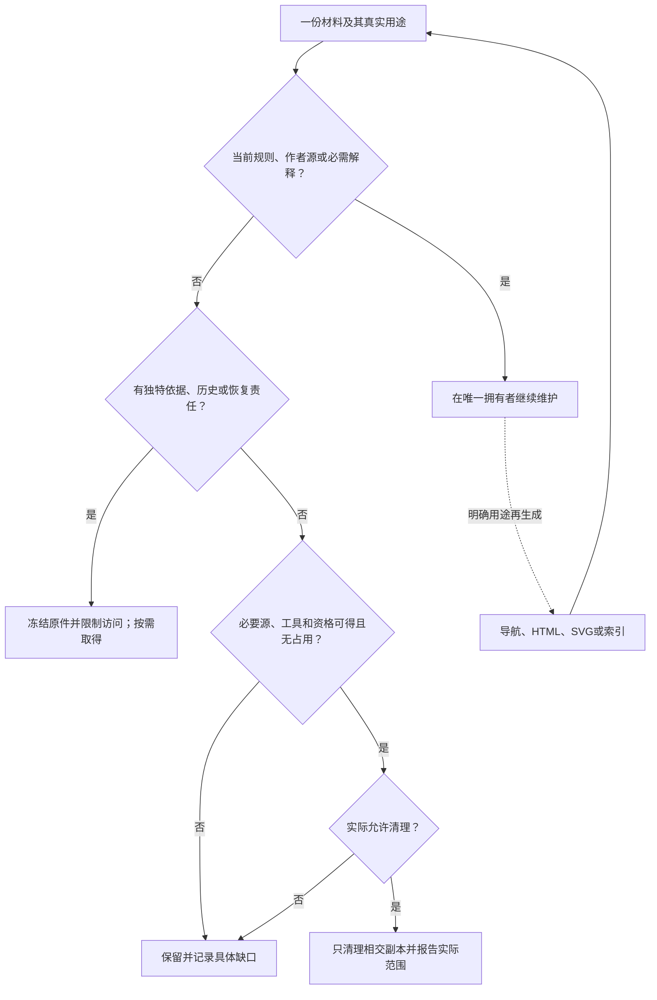

# 交付材料、日常维护与归档

本篇拥有本设计包的现行内容边界与制作材料处理。默认交付一套自足的当前目标设计，融合所有仍正确且属于范围的旧成果；不交付设计改版历史支持系统。产品级版本、GC、备份和权限机制由[存储保留与恢复](../信息/存储保留与恢复.md)等产品规范拥有，不能反向要求本包携带旧地址表、运行账本或历史兼容工具。

## 1. 确定后改变的是用途，不是自动归零

现行规范、作者源、图源、当前理由与准确未决继续维护。旧版仍有效的独立含义必须进入这些当前拥有者，不能只留在旧包或差异报告。原始依据若确有来源、证据或恢复用途，留在对应外部原件处；不默认另做档案包，不要求未来读者沿旧版本拼出设计。重复日志、失败中间包和已经完成用途的制作索引不进入现行交付。

不能用“都进新包了”证明所有旧信息已承接。摘要、文档数量增加、哈希一致和文件名相同各只能证明其实际范围；只有内容/约束对照、准确原件及必要恢复依据共同成立，才知道可以退出什么。

## 2. 本包材料的准确责任

| 材料 | 日常保存位置或处理 | 何时仍需要 | 何时可以清理 |
|---|---|---|---|
| 当前docs、examples、已保留alternatives | 当前SEC树 | 理解、开发、比较、迁移；替代方案仍有独立反例时继续保留 | 经明确语义裁决移交或退役，不能按“已读过”删除 |
| Markdown内图源、原生作者图/原型 | 各自主题拥有者 | 修改含义、重绘、交叉核对 | 被完整后继替代且历史责任妥善移交；不能仅保渲染图 |
| 结构作者、project、实际lock及来源目录 | 原作者工程及其真实来源 | 准确解释与复建；锁不签发权限 | 所选工程退役/迁移且旧使用者与恢复责任结束 |
| 当前源清单、文档ID与当前位置、要求定位 | `.documentation/` | 核对当前内容与入链；不解释旧版 | 不承担产品语义；变更时只更新真实当前消费者，无历轮旧址或父谱系责任 |
| 原始会话、关键输入、当时结果与原报告 | 既有包外原件，仅按明确用途取用 | 来源核查或真实争议；当前理由本身必须已在正文 | 不复制进本包；未承接的独特信息先融合，删除用户原件需另有权限 |
| 制作时的结构核对、修订比较与图文检查 | 工作材料；需交付时只给必要独立结果 | 核验本次实际范围，不构成产品功能 | 无继续用途可退出，不自动维护长期审计包或把旧结果转贴到当前源 |
| 实际发布或签发的PDF/HTML/SVG、测试原始输出 | 按其证据用途归档 | 需要证明当时看见/运行/发出的准确内容 | 证据和支持责任结束后按政策；重生成相似物不是恢复原件 |
| 未承担证据用途的HTML/SVG、目录与搜索索引 | 按需派生，不入默认作者包 | 离线阅读、导航、检索 | 精确源/工具/资格仍可取得，所需等价等级可恢复且无占用时 |
| 临时截图、下载缓存、失败的中间包与工作脚本 | 工作目录；有效方法或错误已记录后选择保留 | 重现制作故障或工具本身确有消费者时 | 无独立信息、运行责任或原件保全义务后可清理 |
| 未结算操作日志、前后像、去重及拒旧记录 | 真实执行系统；不混在普通文档缓存中 | 可能晚到、重试、恢复、调查期间 | 满足该操作真实终结/保留条件，而非“设计已经批准” |

“归档”不等于公开。会话URL、账户线索、秘密及第三方受限材料遵守原访问边界；默认日常包不复制完整私聊。给新协作者提供确实需要的摘要/引用不自动允许披露原件。确需脱敏时建立派生副本并说明损失，原件是否可留由真实权限决定。

## 3. 当前包与依据档案可以分别使用

当前规范、作者范本、图源和最小内容基线全部在`SEC/`内。`SEC/.documentation/`只保存当前职责需要的元数据，`SEC/tools/documentation/check_docs.py`做本地只读核对；这些不是产品的第三、第四份作者文件，也不要求每个目标工程复制。

需要追溯时使用已取得的原件或另行提供的准确记录；没有这类用途就只交付当前包。现行规范不得以档案、旧聊天或上一版正文补齐自己缺失的定义与理由。不存在原始证据时保留其影响，不能伪称已经复原；这种证据缺口也不产生文档旧地址兼容义务。

每次交付以当前源集摘要明确内容身份。它不是签名或采用权，也不能强迫未来助手读取。修改过的工作目录仍可继续开发，但旧清单会准确报告“快照已变化”；更新清单需要重新执行相交核对，而不是只替换版本标签。

文档改版造成的旧文件路径、标题、页码和拆分对应仅属于制作过程。当前交付不提供这些位置的兼容服务；维护者直接更新本版已知链接并核对被移动内容的完整性。判断是“内容是否已承接”，不是“能否通过旧地址找到一个新页”。

## 4. 清理之前完成的具体判断

先说明要删除的是原件、重复副本、派生物还是占用中的恢复资料；再识别它被谁、为何、在哪个版本使用。需要迁移时先取得准确替代副本和解释，验证成员、字节与必要恢复，再由真实有权主体确认责任已经转移，最后只清理明确允许的原副本。

单机两个目录不是独立备份；哈希只能核对已经取得的字节，不能下载或恢复已经失去的原文。保留Git bundle也应实际克隆/读回后才宣称可恢复；外部大对象、LFS和秘密不因bundle存在自动被包含。

以下条件会阻止本次清理：仍有在途或未知外部效果；唯一的原要求、失败依据或解释未承接；仍有旧发行/客户需要；现有身份映射是唯一迁移依据；有实际保全义务；或者重建所需的源、工具、模型、权限和密钥不能取得。拒绝删除只限制相交材料，不强制永久保留所有临时日志。

一旦授权允许清理，按实际范围报告删除/未删除；需要保留墓碑或撤销前沿时继续保护它们。没有删除授权时可整理新交付、转移档案副本并说明建议，不擅自擦除用户的旧包或云端资料。

## 5. 源、归档、派生与退出图

实线表示本包材料的用途判定与保留责任，虚线表示可重建派生；不是产品运行流水线，也不是自动删除授权。

## 6. 为什么选择这种边界

只交付当前设计是本库的范围选择，不是把信息压成最后一份摘要。方案理由、最强替代、反例、独立来源和未决都应融入当前正文；旧版修改经过与导航兼容不因此保留。确有证据责任的外部原件可以独立保存，但不要求每次附带，也不作为正常阅读的条件。

[NASA技术数据管理](https://www.nasa.gov/reference/6-6-technical-data-management/)把识别、控制、保护、访问、分发与保留分开，并讨论退役以后的适用资料用途；这里只借鉴用途分责，不为SEC臆造法定期限或强制审批。详细来源边界和原会话判断见[会话核对](../依据/来源/工程文档规模会话核对.md)。

## 7. 编号与内容身份

外层规范包使用`SEC-077.zip`这类简短编号；编号用于区分交付，不是产品版本或已验证证明。`.documentation/baseline.json`声明当前权威源边界；准确成员、字节数与摘要由封存读取或发行 owner 从该边界和 frozen source bytes 重新捕获为`source-manifest.json`，它是派生 evidence/release artifact，不作为与源码同步维护的 tracked 当前事实。二者都不保存父版本链、旧目录或逐轮工作说明。

需要说明具体修订时在包外给必要报告，不默认另发完整审计ZIP。内部当前内容不得依赖报告才能理解；新的编号不会自动增加旧地址映射、历史别名或备份义务。用户已经保存的旧包和原件不会因为生成新包而被删除。
