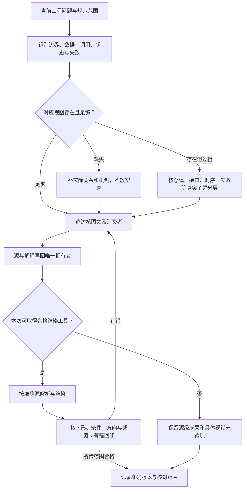

# 图表与阅读派生

> **阅读范围**：本设计包维护；不是SEC运行时接口 · [共同上下文](规格写作与完整性.md)。

本页内容

- [图表与正文的共同维护](#图表与正文的共同维护)
- [可选HTML与阅读摘录：同源派生而非第二套规范](#可选html与阅读摘录同源派生而非第二套规范)
- [图解覆盖、层级和细节的交付责任](#图解覆盖层级和细节的交付责任)

## 图表与正文的共同维护

图是规范的有范围表达，不是装饰，也不是第二份可独立改义的协议。已有机制可以用关系图、流程图、状态图、时序图或ASCII表示；只在它比纯文本更能说明连接或行为时保留。更换图种不能改变对象、责任和条件。

每幅图在所属段落明确**对象、目的、边的含义和省略范围**。正常轨迹可以省略错误分支，但须说明它只是哪个场景的正常轨迹，并指向完整失败合同；声称完整生命周期的图则必须呈现合法停止、未决和相交恢复出口。纯设计和预览能在自己的产物处结束，不被一张“从需求到发布”的图强制继续。

### 怎样从已有规范得到图

先读取该图拥有者的输入、状态、转换、结果和实际消费者；将图中的每个节点映射回这个对象或阶段。对每条箭头逐项问：是引用还是触发，是前提还是数据，是顺序还是候选供给，是事实支持还是授权？条件、次数、批次原子范围或尚未结算责任会改变行为时，必须在边、节点或紧邻说明中保留。

跨对象的候选、产物、检查与运行，不合成一个总状态机。矩形表示一个活动不意味着它常驻或远程，图里有数据库形状也不构成所有工程的前置。折叠分支不得制造直接授权线；加粗、颜色、虚实线及上下位置若没有明确图例，就不承担独立规范含义。

图与正文冲突时，先按真实要求、当前决定和机制事实裁决，再同时修改二者及实际消费者。不能写一句“正文优先”“图仅供参考”后继续保留错误图，也不能为了顺着图而悄悄加强原要求。必要的重复是同一规则的局部解释，不是多页独立维护完整流程。

### 三种核查分别承担什么

| 核查层次 | 实际对象与方法 | 能够声明的范围 |
|---|---|---|
| 结构与语法 | 原始标题/锚点/节点声明、边端点、分支、围栏和真实渲染器解析 | 所检查格式可读取；不能推导行为正确 |
| 渲染与可读性 | 用固定工具实际渲染，检查字形、裁剪、重叠、箭头终点、条件与图例是否可见 | 这份输出在该工具和范围可读；没有渲染就保留未验状态 |
| 语义与轨迹 | 用合法输入、反例、取消/超时、旧结果与无作用任务逐边走查，与正文及调用方比较 | 这次实际检查的关系一致；不等于产品实现或开放世界全部正确 |

标识检测必须在把记录放进按ID索引的字典之前执行。标题、锚点或节点ID重复时先判断是合法引用还是冲突定义；两个不同节点不能因ID相同被静默覆盖。同样不能先做去重再报告“没有重复”。Mermaid允许同ID重复设置文字并采用最后一份文字，这只是渲染规则，不能替规范选择真实节点。[Mermaid节点文字](https://mermaid.js.org/syntax/flowchart.html#a-node-with-text)

渲染使用所选工具的安全配置，不执行图中回调，不将私有工程送到公共在线编辑器。Unicode标签使用支持的明确写法；工具版本、字体和布局问题在实际渲染层处理。不能取得渲染工具时，继续完成可做的源级与语义核查，并准确报告可读性未验证，不安装产品工程或伪造一张“已渲染”证明。[Mermaid使用与安全配置](https://mermaid.js.org/config/usage.html)

### 一个规则改变时，具体回查什么

以“独立复核按实际声明或政策启用”为例，回查原规则、字段默认、状态图中的必经节点、时序图中的消息、流程图的出口、伪代码调用、示例请求及问题状态。若正文已条件化而图仍画成所有产物必须经过Reviewer，就是当前缺陷。

以“取消不等于资源已释放”为例，正常完成路径和取消路径都必须汇合到实际停止、隔离或责任转交条件，再释放能够释放的资源。图中新增一条从Cancel直接到Released的箭头，即使文案没出现“立即释放”，仍改变了承诺。

同次维护以这类规则为单位完成。总览重复完整机制时删并到唯一拥有者；没有相交变化的正确图不为统一风格无谓重画。渲染截图、图清点和每轮修改统计留在实际工作材料，不成为现行正文的永久台账。

## 可选HTML与阅读摘录：同源派生而非第二套规范

Markdown与其中的图源是现行维护内容。HTML只在浏览器图解、导航或离线阅读确有用途时生成，不设为每次修改的必交付项；不因上次有HTML就无限复制。普通MD或ZIP已经够用时不增加额外制品。用户问到的是图不够时补图源，不能用HTML包装代替缺失设计。

生成器从固定包路径与标题区间取得内容；工作核对记录可保存内容摘要和实际提取范围，不能在正文再建立永久渲染账本。HTML可以有封面、导航、折叠、样式及渲染SVG，这些只负责呈现。任何新增条件、算法、参数或例外先改唯一Markdown拥有者，再生成HTML；不在网页里补独有规范。

核对分三层：已选正文经同一种Markdown解释后与HTML的可见文本对应；图节点、边、图例与原图语义对应；实际渲染和所测试视口的可读性另行检查。去除空白的文本相等不证明SVG已逐像素检查，不证明网页包含全部文件，也不证明产品运行。引用源码摘要/范围只定位，不提升权威。

选择性图册必须明示节选范围，不能称为完整工程全文。旧HTML保持其原版身份；新MD发布而未更新HTML时，不再把旧HTML列为当前内容入口。没有需要的HTML不生成，与删除正确图源和减少必要设计不同。

## 图解覆盖、层级和细节的交付责任

图解审查分为**有没有覆盖**与**已经画的是否准确可读**两项。先按当前工程对象检查读者能否找到：产品边界，模块依赖和状态所有者，关键请求时序，数据与版本关系，运行状态与异常恢复，重要算法及跨域组合。一个维度确实相交却没有图或只有总览，需要补相应视图；不以现有图块全部通过代替覆盖。

整体图只回答全局对象和边界；模块图展开真实接口；时序图显示请求、返回、并行、等待与失败；状态图限定同一个状态对象；算法图表达工作集、分支与终止。领域图可保留计算、对象、流、状态或关系自身的结构。图中使用正文同名类型、方法和状态，已有编号只定位，不能引入第二套协议。

当一图的标签、边、循环或横向尺寸已经不能清楚阅读时，按真实子问题拆图，以接口或状态边界连接。关键条件必须留在图或紧邻图例中，不因缩略而消失。抽象层次向下应增加真实细节，而不是用更多盒子重复同一条直线。无需给纯参考目录强制配图，也不以每页张数、节点数或总数量为达标依据。

图的可编辑源码随规范保存，渲染图册可以从其派生并单独交付。图册呈现所选图、必要说明和规范定位；全文阅读版则承接其声明范围内的完整正文。二者用途不同，都不建立新的规则拥有者，也不要求每轮同时生成。修改后重新派生相交图；没有图形渲染器时准确说明视觉欠账，不能将已画图数量当成排版验证。

### 图解：图的覆盖与细节补全，不只检查已有图

每一图有独立阅读问题；缺视图时补实际内容，复杂时分层而非画无界巨图。该过程不增加目标软件的运行要求。

### 文件格式、作者归属与历史证据是不同维度

“MD、HTML、SVG都是投影”只在它们确实由别的完整来源生成时成立。本库人工维护的Markdown拥有其规范或理由；块内Mermaid拥有对应图源；从它们渲染的SVG/HTML是派生阅读物。另一个项目可能人工维护SVG中的布局或把HTML交互原型作为独立设计，那些独特内容必须有自己的作者拥有者，不可因扩展名删除。

派生物一旦成为实际签发、评审、取证或对外交付的对象，其准确字节就同时有相应证据责任；今天重渲染一份相近图不等于恢复当时所见。保留条件见[交付材料与归档](交付材料与归档.md)，不由图册大小或“已经确定”决定。

## 实际按需构建入口

[阅读构建](阅读构建.md)定义当前脚本、依赖准备、完整输入、图源、同版引用、安全呈现和失败时保留旧输出。只维护准确Markdown、图源和独立作者资产；生成器按选定当前内容重建，不依赖历版HTML或手工逐图替换。默认全图渲染，显式文字模式才允许只保留图源；两者不冒称相同交付。
