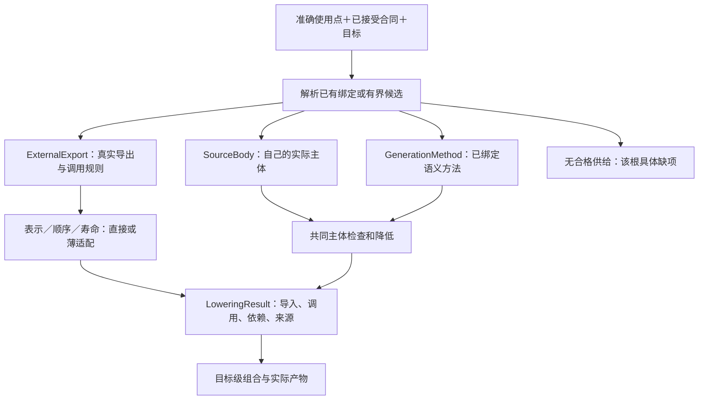
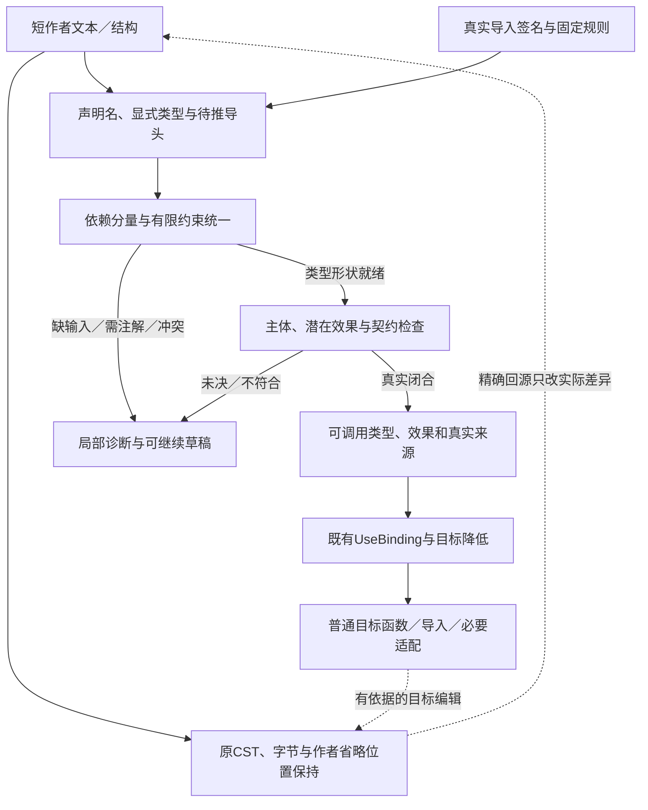

# 编译值服务

> **阅读范围**：采用范围内的设计规范；实现状态另查未决 · [共同上下文](输入与阶段总览.md)。


## 开放编译器内核设计

首个生产范围由[组合与局部具体化](../../作者/组合/抽象与开放定义.md#通用表达与渐进具体化)及[实施路线](../../演进/实施/仓库迁移与自托管.md#纵向切片与自举计划)确定；[同步通用语义画像](../../领域/计算基础/通用计算与任务语义.md#可选同步通用语义画像)仅在所选作者语言需要时启用，不恢复为首期强制前置。优先复用合格的身份、模块链接、诊断、目标构造与宿主接口；不为同一职责重建一套竞争编译器。

初始可以使用正确的全量计算与既有工具执行，不让精细增量、全语言推断和持久状态阻止首个目标输出。必须同时区分证明范围：原生透传可满足明确的原生构建请求，但不证明高层组合生成。产品接合验收要包含一个确由已绑定定义展开并生成的功能及后续修改；不要求所有独特算法先迁入SEC自建语言。所选语言已有一般控制流时须按其规则检查和降低，原生部分由实际语言工具与边界合同处理；目标检查是否执行依本次目的。


### 本文负责什么

本篇是“SEC这个工具如何实际做成编译器”的实现总入口，不替换各阶段的规范owner。既有流水线已经规定方向，但仅给出Parse/Bind/Lowering的名字不足以供开发。本篇固定最小纵向实现、数据形态、关键算法、复用边界和失败行为；[一般程序语义](../../领域/计算基础/通用计算与任务语义.md#一般程序语义与计算表达能力)负责表达能力；[用户定义扩展](../../作者/组合/语义扩展与领域接合.md#用户定义语言语义与编译扩展)负责作者扩展协议。

SEC不是从任意自然语言直接得到唯一正确实现的黑盒。尚未决定的业务含义由人、AI或确定规则形成候选；选定并冻结足够明确的输入后，编译器即可检查并构造候选目标程序。正式采纳、应用或发布另按当前目的、权限和保证处理，不能要求预览先改变已采纳定义。AI可以在前端创作一般程序、领域定义、测试或绑定，但普通编译不依赖再次采样AI。

### 生成目标的可维护性供给

目标维护要求与数值、ABI及资源要求同属已接受输出合同。[TS当前往返范围](../表示/编辑与受管回源.md#managed-edit-roundtrip)不是生成完成以后的可选图示。P4选择规则时核其编辑能力，P5逐区域保留来源及必要补充，P6组合命名/文件后最终确定目标范围，P7仅公布真实支持类别与完整保留根。没有改变现行P阶段数量，也不为普通函数增加一棵作者树。

`LoweringResult.editCorrespondences`允许按声明/区域批量引用对应规则，不为每个token保存重复合同。直接调用可将公开名、常量参数和已知接口映到控制/作者源；不能把上游库内部反编译成空body。用户需要编辑库内部而源码或权利缺失时，返回该实际缺项，原本合法的调用继续可用。

内联、常量折叠、重排和公共子表达式合并各自说明来源基数和信息损失。相同源常量出现于多处时保留出现组；产生纯目标辅助常量时标为generated而非绑定任意同值源。优化没有合格写回方法且损害当前硬编辑保证时，选择仍满足合同的较少优化规则；所有路线冲突时准确返回TargetContractConflict，不先丢映射再宣布生成成功。

回源后的新候选仍经过同一名称、类型、效果、契约和目标检查。生成器内部计算多次不要求作者手动改多份源码；反向规则不是执行任意脚本的授权，也不能覆盖独立接受要求。目标比较结果与代码实际行为的证据继续分开。

### 从作者候选到目标字节的阶段协议

本协议是现有编译责任的可实施接合，不增加一条与原流水线竞争的生成路径。输入为固定候选C、所选输出根R、解释环境E、当前可用实现绑定B及预算；B可为空，由合法解析形成，未指定库不是作者缺陷。作者端按[完成与缺省算法](../../作者/组合/跨软件需求合同.md#11-意图进入同一作者源的完成与缺省算法)处理真正影响行为的未决；后端不直接读取自然语言并猜测函数体。

阶段产物是内部派生数据，不要求作者手写AST、类型表、读集或证明清单。已经在库中定义的语义直接复用；没有唯一实现不阻止合法选择。所选根还只有要求而无行为或合格实现时，能保存设计并完成相应检查，但不能输出任意占位作为完成程序。运行输入尚未传值而参数/合同已经定义，则正常生成参数化程序。

<a id="supply-aware-compile"></a>
### 源码与已有实现怎样共同进入编译

编译输入不是一棵保证有body的源树，而是**作者模块、只读导入模块及其准确使用点的联合**。P0固定它们的内容/工具结果，P1只解析确有作者源的模块，P2统一建立公开符号和调用合同。导入视图使用同一名义身份规则，但没有可编辑的虚构CST、局部变量或函数主体。

实现选择是相交于使用点和目标的`UseBinding`。这是现有Binding的内部读取形式，由`resolveUse`产生，不是要求作者另写的文件：

```text
UseBinding {
  useRef, definitionRef, acceptedContractRef, targetRef
  implementation = SourceBody(bodyRef)
                 | ExternalExport(providerRef, exportRef, callRuleRef)
                 | GenerationMethod(methodRef, fixedInputs)
  argumentAndReceiverPlanRef
  representationAndLifetimeRefs
  adapterRefs                 // 无差额时为空
  dependencyContributions     // 带真实角色与目标
  qualificationRefs, actualReads
}
```

`ExternalExport`的exportRef定位真实入口；callRule引用目标适配器内已实现的调用规则，可以仅为“导入符号然后调用”，也可以规定工厂→更新→结束的有序成员调用。规则使用的所有成员都从同一准确提供者视图解析并记录，不允许仅验证工厂签名就猜其余方法。这个有限序列由同一目标方法生成；它不复制成熟算法，不是运行时逐JSON节点解释的新语言。需要独特算法时正常使用SourceBody。GenerationMethod用现有MethodSpec的Done/Needs/Stopped；返回新语义节点必须重新检查。

### 直接调用的具体解析算法

**S0 固定含义。** 取得实际公开要求、签名、目标交付类型和原使用点；任务只给模糊名称时先回到已有完成协议，不由目标库名反推用户本意。

**S1 收集已知实现。** 已有合格绑定直接使用；确需新选择时，限于当前目标与允许获取范围收集SourceBody、ExternalExport和GenerationMethod，不先生成同义源码，也不搜索全世界。

**S2 检查差额。** 逐项核值表示、数值域、顺序、回调、错误、初始化、可重入性、所有权与交付。无差额直接生成；有可行有限适配则显式纳入；缺失域不缩小原要求。只可调用与可内部优化分别判断。

**S3 固定调用安排。** 接收者和各实参按原源码求值一次；重排使用已得到的值。按调用/会话/应用范围建立状态；Node Hash一类可变上下文不因共享定义就缓存为全局单例。关闭责任和完成失败遵守对应合同。

**S4 发出目标贡献。** 直接生成导入、调用与必要类型；有消费者要求时生成公共门面；新增适配、资源及依赖进入同一LoweringResult。读声明与生成目标调用都不在编译器中实际执行该库。

**S5 组合并返回。** 目标级组合器解决名字、路径、初始化及依赖选择。依赖不能闭合时返回Needs/冲突；独立根分别发布。检查调用形态和生命周期后，外部内部没有可分析源并不阻止合格调用；它只限制需要内部知识的变换。

<a id="fig-supply-dispatch"></a>
### 图解：一个使用点的实现分支

语义缺失与供给缺失分开；不以空函数满足分支。虚线不存在，所有边是当前阶段的数据/控制转移。



### 阶段的输入和输出

| 阶段 | 输入 | 算法与输出 | 停止或保留条件 |
|---|---|---|---|
| P0 输入固定 | 作者字节、导出/合同/工具结果、根、角色与版本 | 固定实际内容和已有绑定，形成作者及导入输入索引与覆盖；作者模块可以为空 | 缺读取或编码非法，保留准确输入与诊断；没有作者文件不等于没有输入 |
| P1 读取 | 实际作者区域及已捕获导入资料 | 作者文本/结构解析为ModuleRevision；外部声明、导出和合同形成ImportedModuleView。没有作者主体的实现不伪造body | 草稿可保存；未知结构不凭外壳合法取得生成资格；错误闭包不生成合格目标 |
| P2 声明与链接 | 作者模块、导入视图、导入锁 | 收声明名、显式类型与HeaderSeed，解析真实引用；按有限依赖求类型就绪视图，尚未闭合的效果保留约束 | 未绑定、歧义、缺注解与非法私有引用可定位；待推导头不成为公开可调用结果 |
| P3 类型/效果/契约 | 实际主体、类型就绪视图、外部合同与要求 | 复用推导摘要完成主体和效果/契约检查；freezeCallableHeaders返回分项封存结果，按根取真实合格调用合同；外部调用不造空body | 类型非法、效果冲突、待补全与证明未知分开；生成根只消费真实闭合范围 |
| P4 实现与展开 | 已检查使用点、已有Binding、目标 | 形成UseBinding：SourceBody正常降低、ExternalExport直接调用或必要适配、GenerationMethod按需展开；新增节点补查 | 必需实现没有合格绑定则该根不生成；超预算时只有存在合法原形式才能保留残留 |
| P5 目标化 | 语义与所选目标能力 | 逐构造选择合法表示，形成带类型/效果/身份的目标程序 | 缺少保持映射的根返回unsupported |
| P6 布局与源码 | 目标程序、公共接口与布局约束 | 分组、分配名称、导入/初始化、打印，产生实际字节及映射 | 路径冲突、公共ABI或顺序冲突拒绝相交产物 |
| P7 所请求的目标检查 | 源码/产物、独立方法与环境 | 调用成熟类型/构建/案例工具，记录主体与真实结果 | 未请求即不执行；失败不改源和期望 |

P0—P6可在所选纯方法支持下内存执行；实际外部进程、读取环境或持久写入按宿主协议准入。P7不反向成为所有预览前置，也不把打印成功直接命名为check passed。

### 处理一个声明的具体顺序

先把名字、已写类型与待推导头写入当前组件；补全类型形状后检查主体和效果，最后冻结公开签名。类型名按真实声明解析，不根据拼写统一不同包实例。函数调用先检查函数表达式，再按源码顺序检查/求值实参并映射到形参；推导结果和潜在效果附着到调用。定义自身的契约入口随函数值保留，动态函数参数仅使用其实际类型上界。

有序分支按语言规则分析；已知不可能的分支只能在保持错误、进展和契约的前提下删除。推断出的效果与公开要求比较，冲突定位到具体调用。删除效果来源或调用边时，对受影响的递归组件按[增量协议](../查询增量与性能.md#查询从读取到缓存发布的具体过程)重新求解，不能从旧集合仅做增加。

### 每个转换的明确保持对象

一个Pass声明读取哪些节点和分析、修改哪些范围、保持哪些观察、失效哪些派生关系。输出中每个发生语义变换的节点指向输入节点及选定规则。没有变化时可以直接返回原不可变结构；物理共享不改变作者写权。

变换先检查前提，再产出目标，最后检查目标的局部结构与保存条件。匹配失败使用其他已经合格的规则或保持原表示；类型不正确、权限不足、业务未决不属于优化匹配失败，不能用“保守回退”掩盖。没有可用原表示或替代路径时返回对应根缺项。

例如过滤和按键选择是否融合，要明确回调次序、异常、非终止、对象读取与中间值可观察性；仅凭pure标签不删除前提。数值特化只能使用固定配置与已经取得的值域依据，生成器不能通过试运行用户函数猜范围。

### 阶段缓存和结果发布

阶段键绑定输入内容、解释/方法版本、所选目标以及真实依赖。诊断位置和来源投影可有独立的消费依赖，但不使用过期位置指向新字节。完成的阶段结果与其读集一起发布；失败可按其准确输入作为诊断缓存，预算/工具失败不能当语义无解。

一份Artifact只在其全部必需成员、路径和关系生成完毕后发布。方法可以返回已完成的独立Artifacts以及未完成根；一个文件内部只有前半段时不把它作为完整目标文件，除非输出合同本身就是对应语法片段。后端不向工作树写入，写回交由明确的apply。

### 可实现基线与替代

首个实现可以采用完整模块解析、全量类型/效果与单一后端，保留真实输出与诊断。随后加入模块/符号查询、并行和缓存，和相同输入的基线比较。初次输出不能仅为固定模板；用户定义的非预装算法与新组合必须走同一流程。另一方面，不要求第一实现已包含任意原生语言的全部观察与逆向映射。

### 合同组合不增加第二条编译链

`sec.object/1`等标识按照[语言组合](../../领域/计算基础/紧凑表示与程序范式.md#合同标识默认语言组合与按需能力)解释。准备阶段先固定语言入口及规则内容，基础与对象声明进入同一ModuleRevision；库引用只增加绑定符号和实际语义需要，不修改当前语法。结构编码独立解码后形成相同领域节点，不先转成另一份作者文本。

按需方法闭包在现有查询工作表内完成：从根和语言必须检查的声明开始，取得类型/效果/检查/降低方法；把新区域和真实依赖排入同一表；记录集合读取；缺方法或输入以当前Needs/Stopped返回。方法需求、目标运行成员和当前授权分别处理，不能对一个未被运行使用的对象定义附加常驻服务。

对象检查中的确定赋值使用MustInit/MayInit与正常可达，细则由对象规范拥有。方法ensure中的`obj.before`按实际符号识别，先检查其有限投影与值类型；生成必要前态capture描述，require之后、方法体之前取值，正常后置使用capture。该描述属于原BodyAnalysis/构造与调用计划，不建立新的作者IR。结构输入使用普通call与同一检查，编译器不得只识别名字before或允许插件跳过本检查。

新增对象方法目标或契约改变会使实际消费其内容的查询失效；未消费对象的纯函数不以整语言组合目录新增为由全部失效。但parser解释本身改变时仍要按真正词法/文法依赖重读，不能用“没调用对象”掩盖同一个字被重新解释。

<a id="当前选定的首个编译实现方案"></a>

### 成品编译值服务的实现方案

本节定义成品编译值服务的数据、接口与算法，实现 P0—P7。职责由[总架构](../../架构/协作与状态边界.md)及[模块合同](../../架构/装配/模块与运行实例.md#最终逻辑模块与公开接口)规定，不依赖旧仓库的 Block 或写流程。解析、类型与区域降低直接消费当前合同；旧代码只按[来源适配](../../演进/实施/仓库迁移与自托管.md#旧来源归属的版本化适配)接入。

#### 编译值服务的边界

`compileFrozen`接收已经固定的作者内容、导出与实现资料、解释合同和本次目标，返回编译结果；它不取得工作区写租约、不保存锁文件、不启动业务、不默认运行全部验证。应用层负责取得输入和必要外部结果，再调用这个纯计算入口。真实工作区保存和应用通过application与execution调用对应提交协议，复用同一计算结果；具体实现的迁移由版本化来源适配承担，不定义产品的基础输入。

当前采用**模块化单体、局部arena、只读阶段结果、同步可挂起的工作步骤**。只有需要硬资源隔离或无法协作取消的第三方过程才放到受控worker。普通函数没有中央数据库、消息总线或完整证据图前置。设计只要求值关系和功能责任；具体实现服从成品的公开模块合同；物理文件可随实际消费者细化，不按每个接口新建一个包。

第一条实现必须贯通：已有库直接生成调用、真实差额适配、内联`.sec`与多模块新主体三种同链输入；共享声明链接、类型/效果、求值顺序、TS打印、精确诊断和预览后继续修改。更广对象、并发流和所有后端仍按发行范围逐项加入；暂不支持的构造返回对应缺项，不解释成`Any`或空实现。

#### 内存数据与真正的所有者

以下名称是既有源、节点、类型与目标表示的**内部编程接口**，不是新的作者格式或永久IR。局部编号只在它所属的模块版本中有效，跨模块或跨阶段传递时必须带所属范围。

| 内部对象 | 具体数据 | 所有者、写入期与发布条件 |
|---|---|---|
| `SourceBlob` | 原字节内容引用；合法解码文本；编码；行首字节表与UTF-16转换索引；来源层 | 内容存储拥有底层字节；输入接管后不再向外暴露可变后备数组。文本错误保留原字节，不能替换编码错误后继续声称同一源 |
| `ModuleRevision` | 模块身份、内容与解释修订、作者模式、导入声明、CST或结构树、局部节点表 | 前端builder私有可变；完成后封存，后续阶段只保存新表或新版本，不改节点种类与孩子 |
| `ImportedModuleView` | 精确模块/提供者引用、公开导出、来源、成员支持范围与合同引用 | 真实导入器构造；只读，无虚构CST或函数体；与ModuleRevision共同进入HeaderIndex |
| `UseBinding` | 使用点和目标的实现联合、表示/调用/寿命、适配与依赖引用 | resolveUse生成的Binding投影，目标降低消费；不序列化成另一份作者源 |
| `DeclId / LocalId / ExprId` | 声明索引、作用域内绑定索引、源码出现索引 | 三个不同类型；不能因整数值相同混用。长期声明映射沿原身份合同，所有局部表达式不领取全局业务ID |
| `HeaderIndex / CallableIndex` | 已确认的公开门面、签名、效果合同和来源；命名空间、导入槽、表示访问者及对应声明身份 | 名称种子和类型就绪视图先供内部分析；主体、效果、捕获和公开引用检查后由freezeCallableHeaders按声明封存。失败/未决项保留在CallableFreezeResult，不伪造为可调用条目；未解析导入不是空模块 |
| `SignatureTypeView` | 类型已确定的形状、实际声明/引用、局部效果变量和已知导入边界；保留每项的就绪状态 | 只供主体/效果分析，不能交给执行器或当作完整公共调用合同。局部效果变量属于本次分析；UnknownImported不等于空效果 |
| `CallableFreezeResult` | 合格headers/callables、逐声明diagnostics/needs、模块规则约束及真实读集 | 封存器一次建立同代只读结果；调用方按根和模块规则选择可用项，不用一个失败声明抹掉所有独立合格项 |
| `TypeStore` | 已解析基础、名义、结构、函数与参数类型；独立的临时类型变量表 | 语义类型驻留在对应解释/模块集合中；统一变量和路径压缩只属于当前检查，不能污染共享已发布类型 |
| `BodyAnalysis` | 表达式类型表、已绑定引用、调用布局、捕获、直接效果、诊断及依赖 | 按模块主体产生；错误标记是分析内部poison，不是公共语言类型。任一生成根仍可达poison时不生成 |
| `CheckedProgramView` | 作者模块及其主体分析、导入视图及其合同资格、实际规则集和按根状态 | 是已有内容的检查视图，不为外部导出生成空BodyAnalysis；不因类型断言或标签产生资格 |
| `LoweringResult` | 新目标区域、新增导入/资源、类型与效果摘要、源映射、声明支持区域的editCorrespondences、未完成义务 | 每个降低器写独立结果；新增中立节点须补查，不能沿用原节点的检查结论 |
| `ArtifactSet` | 实际成员路径、拥有者、字节引用、目标与布局绑定、真实输入/生产者引用 | 全部所需成员准备后封存；检查记录独立引用该产物，不成为其可变字段；返回bytes不别名到仍可写的打印buffer |

`readonly`、对象冻结和内容摘要各有用处，但都不能单独保证后备数组没有其他可写别名。边界接收外部`Uint8Array/Buffer`时，默认在**一次接管点复制**，或使用能实际撤销发送方访问的所有权转移；不接受无同步保护的共享可写buffer作为固定输入。内部可信代码可借读内容，不向插件或调用者返回底层`ArrayBuffer`。大资产用只读流或内容引用，不为整个工程反复深复制。

节点builder封存后，符号、类型与映射表通过只读访问器公开；仅给数组变量标注`ReadonlyArray`不能防止保留builder别名。引用计数/租约负责内容存活，不负责证明调用方有权。具体存储、字节和worker释放由[物理装配](../../架构/装配/模块与运行实例.md#阶段值的物理所有权与取消)承担。

#### 函数边界与返回值

```text
prepareCompile(publicRequest, authorizedContext, snapshotStore)
  -> PreparedJob | PreparationFailure

compileFrozen(prepared: PreparedJob, engine: PureCompilerServices)
  -> CompileOutcome

parseText(blob: SourceBlob, grammar: GrammarBinding, limits: FrontendLimits)
  -> ParsedModule

decodeStructure(blob: SourceBlob, bodyContract: BodyBinding, limits)
  -> ParsedModule

collectHeaderSeeds(modules: ModuleSet, imports: ImportedModuleSet, bindings: ImportResolution)
  -> HeaderSeedsWithDiagnostics

completeCallableSignatures(seeds: HeaderSeeds, rules: SemanticBinding, limits)
  -> SignatureResolution（类型就绪视图、约束、主体摘要、Needs与注解需求）

checkModule(module: ModuleRevision, types: SignatureTypeView,
            existingBodySummaries: BodySummarySet, rules: SemanticBinding, limits)
  -> BodyAnalysis

closeEffects(analyses: AnalysisSet, types: SignatureTypeView,
             importedContracts: ImportedCallableContracts, rules, limits)
  -> EffectSummarySet

freezeCallableHeaders(resolution: SignatureResolution, analyses: AnalysisSet,
                      effects: EffectSummarySet)
  -> CallableFreezeResult

lowerRoot(root: BoundRoot, checked: CheckedProgramView, implementation: BindingSet,
          target: TargetContract)
  -> LoweringResult

emitTarget(lowered: LoweringResult, layout: LayoutAssignment, adapter: TargetPrinter)
  -> ArtifactRootResult
```

这些不是各建一个远程服务。`prepareCompile`在现有应用责任内解码六工具、固定请求和读取范围；其后核心只读`PreparedJob`中的快照。目标打印适配器是已加载、已绑定的确定函数，不给它任意宿主写权限。需要外部原生分析/生成工具时，由核心产生有类型的`NeedInput`（ContentNeed或ToolResultNeed），应用层按实际许可取得相应内容或方法结果，再建立新的准备态输入；不从核心内部偷偷联网、读cwd或启动脚本。

`ParsedModule`总是能携带原内容及诊断；协议结构根本非法时拒绝该结构输入，语法草稿则有错误节点。`collectHeaderSeeds`允许错误主体与待推导头；`completeCallableSignatures`按有限约束取得类型就绪视图，潜在效果在主体分析与closeEffects后才完整封存；`checkModule`不能把未完成头当成合法空签名。`lowerRoot`仅消费该根的实际有效闭包；一个不相交目标缺项可以局部返回，但一个共享模块中的语言错误仍按原模块检查规则影响使用它的根。

#### 一次compileFrozen调用的控制算法

下面是实现过程规格，使用本节已经定义的值，不是另一个可运行参考程序：

```text
建立本次资源scope和空的逐根结果表
取得PreparedJob里的固定根、解释、已有绑定、布局和已绑定的相交Requirement
复用或核对需求组合及保持帧：仅类型/关系合法不授予已满足资格；未解释叶限定相交强声明
按根解析并遍历必要模块：
    命中当前键的合格源解析或导入视图 → 复用
    已捕获作者文本/结构 → parseText / decodeStructure
    已捕获导出/声明与合同 → ImportedModuleView，不创建空body
    未捕获 → 记NeedInput和受影响根，不将缺读取写成源不存在
对作者模块与导入视图共同收声明名、显式签名与待推导头，绑定公开引用
按签名依赖/SCC和固定约束完成函数及被动函数值签名，保留注解需求
仅检查真实主体，使用SignatureTypeView并复用已得摘要，记录局部调用效果变量及导入边界
closeEffects读取这些分析和导入合同，从当前种子闭合局部效果，不请求尚未产生的CallableIndex
freezeCallableHeaders产生合格headers/callables和逐项未完成；不把UnknownImported当空效果
对每个实际请求的源根或目标根：
    必需模块有语法/类型缺陷 → blocked，关联准确诊断
    缺少必要绑定或实现 → blocked，关联具体未决/不支持
    否则将计划中暂定selectedUses按当前候选和CallableFreezeResult核对，形成真实UseBinding；普通主体、直接外部调用或生成方法携带该使用点的输入域、结果/轨迹、帧与资源义务
    只有真实新增/展开区域补查，不因外部无body而重写实现
    核新节点是否新增写入、改变时序、扩大输入限制或撤掉进展；不能把未知合并条件当true
    目标根 → lowerRoot → 校验目标区域 → 分配合法布局 → emitTarget
    源检查根 → 返回对应源分析，不虚构文件产物
按请求的AND/OR组合返回完整根和仍未完成根
目标工具检查仅在请求时由应用调度，不从这里写工作区
将返回内容转入结果保留关系，释放其余临时scope
```

不是每一步遇到第一条错误就终止整个任务：共享损坏输入影响所有消费根；不相交Java缺项不取消已合法TS输出。源模块内部仍执行所选语言规定的检查范围，不能把“函数没被输出”作为隐藏同模块非法声明的理由。预算在工作项推进点计量；到限时把当前未完成部分标中止，已合法且被允许独立返回的根可以保留。

NeedInput由应用按具体缺项取证；返回后必须有新内容、明确不存在/拒绝或终止原因。得到同样的未捕获结果不能无变化地重跑核心。新内容只补已接受的解析请求并形成精确新输入修订；不悄悄换原作者源或取另一版库。缓存先比实际内容和规则，再处理复用。资源finally仅释放已确认不再使用的对象，未停止worker的责任转交给原运行scope，不能用语言级finally删除在途资源。

<a id="concise-author-elaboration"></a>
#### 简洁作者的签名补全与被动函数值构造

这一步是P2/P3现有绑定与类型检查的内部工作，不是另建解释器、IR或自然语言转换服务。普通源码、结构模块和ImportedModuleView都通过它形成共同可调用索引。完整作者规则由[语言合同](../../领域/计算基础/紧凑表示与程序范式.md#compact-author-contract)唯一拥有。

**局部数据。**声明收集产生`HeaderSeed`：声明身份、参数/类型参数、显式结果或`InferFromBody`、已写效果/契约、主体引用与源位置。常量种子另记实际initializer和可选预期类型。它们处于当前分析arena，不是新的持久清单；未完成头不对外表现为合法函数类型。完成的HeaderIndex保存类型与来源（explicit、inferred、imported），BodyAnalysis保存真实捕获、潜在效果、静态构造资格及原源→推导节点对应。

```text
collectHeaderSeeds(modules, importedViews, bindings)
  -> HeaderSeeds + nameDiagnostics + Needs

completeCallableSignatures(seeds, immutableRules, limits)
  -> SignatureResolution（类型就绪视图、主体约束与摘要、待注解/输入、诊断）

checkModule(module, signatureTypes, existingBodySummaries, rules, limits)
  -> BodyAnalysis

closeEffects(analyses, signatureTypes, importedContracts, rules, limits)
  -> EffectSummarySet
freezeCallableHeaders(resolution, analyses, effects) -> CallableFreezeResult
```

**A0 名字和固定输入。**由当前ModuleRevision取得原文、语言、导入和公开身份。省略as时只按语言规定取末段，再做冲突检查。导入模块只消费真实签名，不执行它的源码、getter或初始化。不确定导出合同为Needs，不按名称在全目录试配。

**A1 约束种子。**参数和显式返回进入TypeStore；未写返回的有体fn建立本定义的结果变量；合法未标注lambda建立单态参数/结果变量。类型约束带产生位置与原因，不创建一个用户需要同步的类型模型。契约需良构并且不能改变主体实际类型；不能用require中的未证前提抹掉主体错误。

**A2 依赖和递归。**根据真实绑定建立签名需求图。导入/显式签名是已知边界；无循环部分按就绪工作表推进。递归分量仍有需要从主体求出的调用类型时，报告一条实际检出的循环及需要显式注解的声明，不在这个有限方案中求解高阶多态递归。函数运行递归保留，不执行来推类型。图/类型算法超预算返回局部未完成，不能伪称已证明无类型。

**A3 双向统一。**已知被调签名给出参数和结果约束；预期函数类型向lambda传递；没有预期的单参数lambda从固定运算与主体调用收集约束。以occurs-check完成有限统一。名义身份必须完全符合原规则；匿名记录有合法预期才构造那个名义值。自由类型变量、相等/字段能力未确定，返回ANNOTATION_REQUIRED或原能力诊断。不能自动union、Any、truthiness转换或let全称泛化。

实现A2/A3时的工作表保存当前定义及待解约束，而不是递归重新检查整个模块：

```text
为声明登记名字与显式类型；给合法省略建立当前分析变量
绑定全部真实引用，建立签名依赖及反向等待者
将具有明确调用约束的定义放入就绪队列
每次弹出定义：
    以固定签名/当前变量检查表达式，产生等式、类型需求与效果约束
    每个等式有限统一；发生occurs、名义冲突或不相容结果则记录源定位
    已确定参数/返回时标type-ready，唤醒实际等待者，不将效果待定当pure
    仍有必须先完成的外部输入则记Needs，不以重试重复读取
队列无进展：
    对剩余实际依赖求SCC，递归需要的返回或函数值类型要求显式注解
    无循环但欠预期类型/字段/能力时给局部注解需求
完成主体和效果固定点、公开闭包检查后冻结HeaderIndex
```

`require`不执行；其表达式必须先良构。`ensure`中的result等到所属结果类型就绪再检查，不能反过来据一个宽松后置给任意主体猜类型。已有显式`fn<T>`保留刚性类型参数，未写返回可以推导为那个明确T；这不新增let的隐式多态。时间/节点预算在队列和统一步检查，错误恢复保证推进，循环诊断只说检出的范围，不未经最小化称最小冲突核。

**A4 阶段和捕获。**顶层lambda只建立静态闭包描述及需要的不可变环境，主体另建运行区域。自由引用必须能固定为声明或合格静态值。调用、资源、对象身份、外来可变位置不能借“函数值”在导入时执行。函数内部的运行局部闭包仍允许原有限可变捕获；公共效果只在合格条件下隐藏内部状态，优化继续看实际读写。

**A5 封存与公开接口。**类型形状闭合先产生内部SignatureTypeView，不能将未解效果变量解释为空。checkModule复用已取得的类型摘要，完成主体约束和潜在效果，再由原closeEffects计算固定点并核显式效果上界、回调纯度和相交契约。freezeCallableHeaders只对类型、效果、静态捕获和公开引用都合格的声明发布最终HeaderIndex；其余保留准确未决/错误状态。公开出口包括合法函数值；比较已有接口中的类型、效果、名义身份、具名参数规则与明确要求。变化是候选差异，不自动升级验收。私有类型泄漏按原规则拒绝，不合成新公开类型。

<a id="callable-effect-closure"></a>
##### 类型、效果与可调用资格的无循环封存

**确定的依赖方向：类型形状→主体约束→效果闭合→可调用合同。** `closeEffects`不能以完整`CallableIndex`为前置，因为它正是形成该索引的必要输入。已读取导入可带现成的精确合同；本次作者定义则以局部效果变量参加分析。`SignatureTypeView`允许引用这些变量而不称它们为pure，递归函数不是因为有调用环就永远未完成。

E0固定当前分析代的类型形状、直接效果、调用边、原效果上界及ImportedCallableContracts。导入只取得上界时，输出准确的保守合同；完全未知时保留未知依赖，不创造一个空集。变量的量化域、即时效果与函数值潜在效果沿原语言规则，不因放在同一表中混合。

E1按本次真实调用图求强连通分量。对当前有限并集效果域，从各分量自己的直接种子与已取得外部摘要开始，使用就绪/反向工作表传播；同一声明发生变化才重新排入消费者。高阶参数按其真实已定上界或受约束效果变量处理，不能根据一次调用猜所有未来调用。类型错误、未知外部合同、取消和预算结束分别记录，不将某种计算失败变成效果值。

E2达到当前域的固定点后核显式上界、回调条件、捕获寿命及公开类型/引用。无直接外部作用的互递归可以得到空的外部效果摘要，**但仍可能不终止，不能由空效果推导可推测执行或任意删除**。局部位置的读写依赖继续保留，即使外层公共效果在合法条件下隐藏它们。

E3封存`CallableFreezeResult`。每个条目只引用同一分析代的类型、主体、效果与源。合格项进入HeaderIndex/CallableIndex；未决项带原因和受影响范围。图中一个不相关模块有缺项不取消其他根；同一源模块必须完成的检查、共享初始化或公开类型依赖仍然影响其全部实际消费者，不能用按声明返回隐藏非法模块。

E4规则、边或种子删除时，按[删除固定点](../查询增量与性能.md#删除递归事实与重新求固定点)重新求受影响分量，不让旧标签在环内互相支持。只有调用合同实际变化才继续传播到只读合同的消费者；读主体、来源或规则的消费者按自身读集判断。所有可变工作表只在当前分析代存在，封存结果不共享可变统一变量。

E5接口外壳可以提供一个便利的`analyzeHeaders`调用，但它必须协调完整上述路径并返回分项结果，不能先向compiler发布完整头，再在后台补效果。源中省略的类型和导入别名只进入派生表；新增要求关系不触发自动补写满注解源码。

**反例与正确结果：** `export let f = x => log(x)`的创建可以被动，调用仍保留log效果；两个显式签名的纯互递归函数可以完成效果闭合而没有终止保证；一个缺外部效果信息的声明不被当作pure；对某个类型已确定但效果待定的入口请求执行，返回该入口未完成，不通过先建空CallableIndex开通执行。

**A6 降低与来源。**CallableIndex统一提供fn、静态函数引用和静态lambda根。SourceBody分支消费真实lambda区域，ExternalExport分支可以直接别名或生成必要门面，GenerationMethod仍按原合同。每次调用按原规则进入实际被调合同，不以转发为由移除前后置。源码省略的信息只进入派生表；目标的参数与返回完整不意味着应把完整签名打印回源。

**A7 编辑和复用。**签名/上游合同、原注解、推导规则与实际捕获是依赖。修改字面量通常不改类型；修改被调签名或新增明确注解可能需要重新检查。源映射记录原作者出现及其推导责任；同值显式注解、来源变化和不显式注解不得只按运行字节相同合并。无关模块新增同名字段不影响已经唯一的推导。

图中实线是分析数据依赖，不是运行调用。右侧原源始终由workspace拥有；没有从目标输出回写所有推导字段的边。



#### P1读取的具体步骤

**扫描。** 按冻结UTF-8字节顺序读取，验证Unicode标量和词法范围；token记录种类、起止字节、解码值、前导/尾随trivia区间。最长操作符优先，关键词与上下文修饰按已定词法处理。原整数拼写与规范数值分开，类型检查前不经IEEE754数值转换。词法预算计字节、token和嵌套深度，而不只计最终AST节点。

**解析。** 声明和类型用递归下降；表达式用已固定的优先级表，`if/match/let/lambda`在其文法入口处理，后缀调用与字段按文法结合。命名实参、比较不可串联、块与记录的区分都沿现行文法；parser没有权替规范选择另一种歧义解释。深输入用受限显式工作栈或检查递归深度，拒绝不完整解释为完整程序。

**错误恢复。** 一次错误后至少消费一个token，或退出到外层已拥有的分隔符；同步点按当前产生式选`)`、`}`、`;`或下一个声明入口。保留错误片段和父区域，禁止不前进循环。恢复节点不给`Unit`、`Never`或任意类型；诊断数量到限后停止扩张并明确截断，不以只有前若干错误表示余下无错。

**结构解码。** 同一轮先检查重复键、判别联合、局部键唯一性、孩子顺序和所选体合同，再形成同一种未绑定模块。保留结构作者的局部位置与原字符串，结构树不是直接可执行的表达式。未知体可以保全，但不会被猜成基础函数；结构与文本共享后续检查。

结构文本读取选用已绑定的成熟`jsonc-parser` parseTree/visitor能力，开启disallowComments、关闭allowTrailingComma和allowEmptyContent；有任何语法错误就拒绝这份结构编码，不因其容错返回了树就继续当合法。每个object的直接property按**解码后的键**进入局部Set，重复立即诊断，故`"a"`与`"\u0061"`同键；不先调用普通JSON.parse丢掉重复，再让Zod检查。随后按判别联合构造本模块值，索引数同时检查原token为合同允许的整数词法并落在安全范围，不接受被解析器舍入后的伪整数；中立Int保持字符串；解码字符串另查Unicode标量。对象数据以Map/无原型记录承载，业务字段名不触发原型设置。解析树位置按工具的UTF-16坐标转换回冻结字节；预算与源保全继续生效。该依赖的实际版本、API和许可在实施锁中固定；用现有其他具备同等保全能力的合格解析器替换时，不改变体合同。

#### P2链接与声明先行算法

1. 从已捕获模块清单按显式导入解析请求，得到`resolved / exact-missing / uncaptured`三种结果。`uncaptured`产生具体的补读取需求，不缓存为“不存在”。相对路径规范化、公开包入口和大小写规则按绑定宿主处理。
2. 对实际作者与导入模块建立引用图；作者声明循环按强连通分量收集，导入模块消费其固定公开视图。分量内先收集真实声明名、显式签名和待推导头，再按本章签名补全取得闭合类型，检测同命名空间重复；没有外部body不生成空声明。公开类型闭包检查作用于真正出口，不公开全部私有实现。
3. 名义类型由声明身份与类型实参标识；透明别名展开有自己的循环检测。递归记录通过已登记声明引用继续，不无限计算相互嵌入的结构摘要。
4. 函数参数进入函数作用域；块中每个初始化在引入该绑定之前解析；分支分别建子作用域；lambda捕获从真实自由引用派生。`result`只绑定本函数的后置区域。
5. 构造与字段访问核对表示拥有者，`opaque`不能通过ID或预期类型绕过。具名调用保存`sourceOrder → formalSlot`映射，不把实际参数数组排序。
6. 静态顶层值另建依赖图；被动函数值只解析固定捕获与目标代码引用，其主体另作运行区域检查；允许的常量表达式在原静态范围计算，运行递归不在编译期求值。严格初始化环按原规则拒绝或交给显式画像，不默认填零。签名结果可供其他模块使用，主体错误仍要被报告。

普通工作采用线性图遍历与映射表，邻接关系不额外落数据库。基础扫描、声明图遍历为相应字节/节点/边的线性工作；类型结构统一、模式覆盖、泛型展开和大整数操作不作同样的固定线性承诺。

#### P3双向类型检查和效果闭合

当前实现接口分`infer(expr, env)`和`check(expr, expected, env)`。前者返回类型与约束，后者利用已有预期类型消歧；不能推导的位置给局部诊断，不自动放宽为Any。发生错误时使用内部poison抑制重复诊断，所有仍依赖该标记的生成根都保持未合格。

| 源构造 | 检查过程与输出 |
|---|---|
| 字面量、引用 | 从基础类型或真实符号取类型；引用变量不重新执行初始化；精确值域沿定义 |
| 一元/二元运算 | 按对应运算表约束实参；`+/-/*`整数域、`!`布尔域；比较和相等资格明确；不做JS真假转换 |
| `if`和短路 | 条件检查为Bool；结果分支在相同预期下检查或统一；两个分支的类型和潜在效果都要分析，不提前运行它们 |
| `let/region` | 初始式在旧环境检查，随后扩展环境；同块重复与内层遮蔽分开；最后式是块结果 |
| lambda | 有注解即建立参数；无注解时从预期类型或本章允许的单参数主体约束补齐，不能唯一求得就要求局部注解；捕获与潜在效果进入函数值类型，效果闭合前不发布可调用资格，不当成立即调用 |
| call | 先解析实际被调函数与参数角色；实例化显式泛型并生成有限统一变量；按源码顺序逐项检查，保存最终槽映射；函数值调用没有签名参数名时不接受猜测标签 |
| record/list | 名义构造检查拥有者、字段集合与类型；匿名记录保持字段集合；空列表需要可求得元素类型；列表尾必须同元素域 |
| match | 被匹配值检查一次；模式引入局部绑定；分支结果共同检查；覆盖和不可达检查独立保留预算状态 |
| require/ensure | 在相应函数环境中检查Bool、允许效果及定义性义务；ensure中的result为返回类型；不能因为谓词为Bool就证明其终止或正确 |

显式泛型主体使用刚性参数：对所有允许实参成立才能通过。有限统一采用occurs检查，不能把`T = List<T>`变成一个无限类型。泛型递归的源检查与目标特化终止分开；无限新实例按既定共享实现、残留或不支持策略处理，不执行源码函数获得答案。

效果先记录每个函数主体的直接效果、直接调用边及高阶函数类型上界；构造lambda只累积捕获求值的立即效果，函数体效果保留为潜在效果。对当前有限效果域，按SCC和反向工作表求最小闭合。显式效果上界不满足则诊断；无主体且无已接受实现合同的效果仍未知。删除边或规则改变时从新分量底重算，不能用旧集合只做并集。

函数值必须指向带真实契约入口的可调用值。经参数或列表传递不剥掉前置/后置。默认运行检查先保留；需要删除检查时，才沿既有证明消解规则承担相应前提和依赖。普通编译不启动任意程序终止判定或全域求解器。

#### P4展开之后再检查什么

原`CheckedProgramView`的有效域只覆盖它实际检查的模块版本。展开器如果产生新的表达式、改变调用、引入库或效果，就返回明确的新子区域及依赖；核心对新区域重做绑定、类型和效果闭合，并使实际消费者失效。域专用降低直接产生目标区域时，至少检查其目标合法性、类型/效果接口及该降低声明承担的保持义务。

保持证据和类型检查不能相互替代。一个新输出仅仅复制了`checked:true`、旧schema或旧输入摘要，不取得检查资格；某个目标打印器能成功打印，也不能补足错误的展开。完全保留源区且依赖不变时可复用原结果，不要求无关全量检查。

#### 首期错误发布和资源结束

源检查、目标生成、目标工具检查和实际应用分别保存状态。任务总体状态只从每个请求根及AND/OR关系派生，不能把TS成功与Java缺项压成一个可被误读的`success`。

取消采用相应执行器真实能力：自有算法在token、图工作项、统一和输出成员边界检查预算与信号；第三方同步调用可能不检查信号，因此硬截止期任务使用可终止worker/进程。`Promise.race`超时只结束等待，不证明原计算已经停止，不能据此释放仍在使用的buffer。正常退出按逆序释放阶段占用，已有合法产物是否可返回服从原请求组关系。

函数边界、枚举和算法足以指导对应实现分工，但不把此有界链当成全语言/全后端完成。具体旧代码复用顺序、兼容和切换仅在[版本化来源适配](../../演进/实施/仓库迁移与自托管.md#旧来源归属的版本化适配)规定，目标逐构造实现由[TS后端](../目标/具体降低与领域输出.md#首个typescript后端的逐构造降低)拥有。
