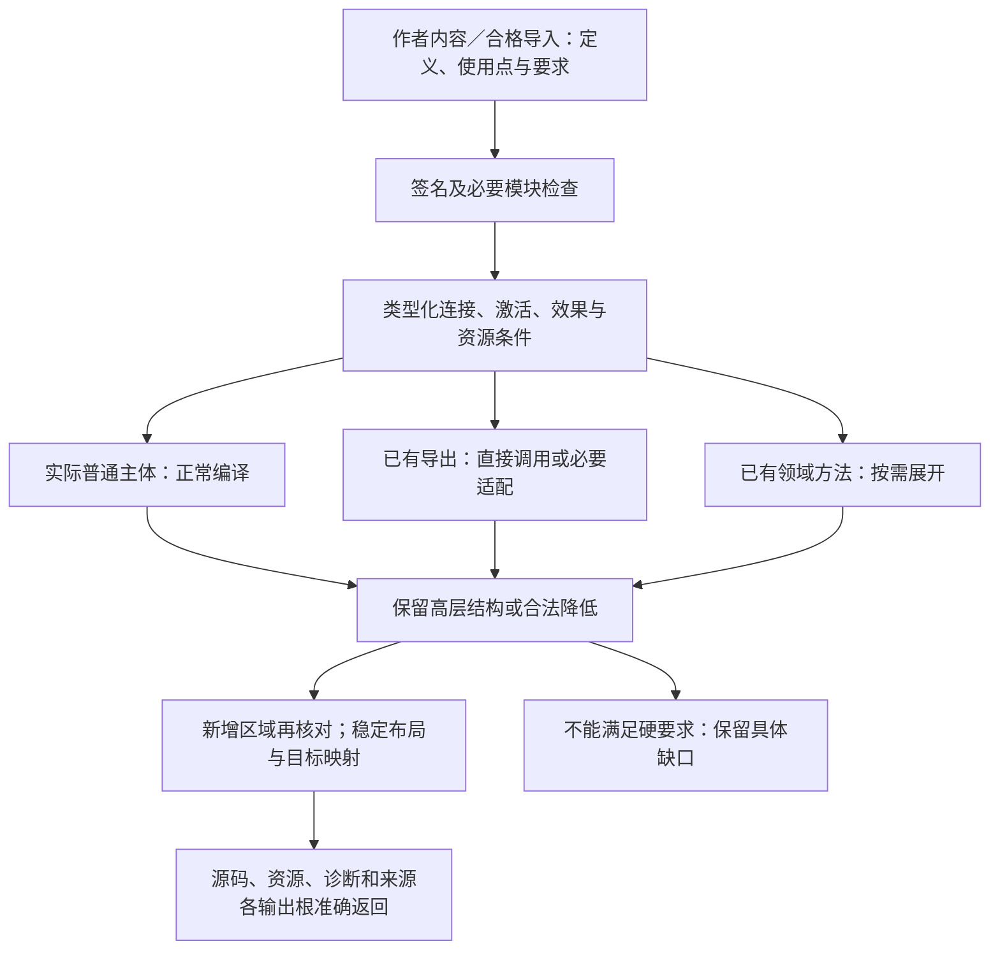
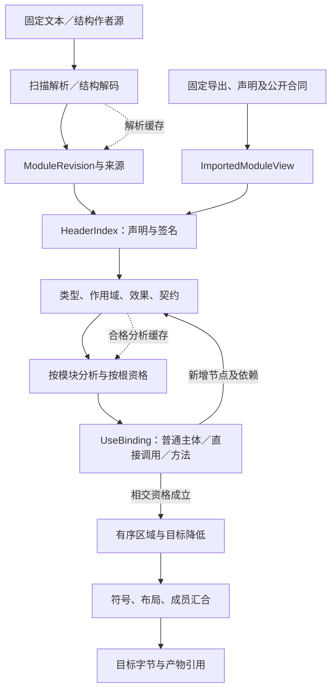

# 编译内核与生成

> **阅读范围**：采用范围内的设计规范；实现状态另查未决。

<details>
<summary>相关主题与上下文</summary>

- [编译触发与作者输入形式分离](#编译触发与作者输入形式分离)
- [功能组合与原生程序的首期编译路径](#功能组合与原生程序的首期编译路径)
- [定义组合在共同编译链中的处理](#定义组合在共同编译链中的处理)
- [要求关系不是第二次自然语言编译](#要求关系不是第二次自然语言编译)
- [两种作者前端怎样汇合到同一编译核](#两种作者前端怎样汇合到同一编译核)
- [契约驱动的组合计划在编译链中的位置](#契约驱动的组合计划在编译链中的位置)
- [生成源码结构与片段目标的责任](#生成源码结构与片段目标的责任)
- [原生模块直接绑定与闭合构建](原生与跨语言编译.md#原生模块直接绑定与闭合构建)
- [多语言前后端语义符合性框架](原生与跨语言编译.md#多语言前后端语义符合性框架)
- [多语言工程转换与目标闭合](原生与跨语言编译.md#多语言工程转换与目标闭合)
- [开放编译器内核设计](编译值服务.md#开放编译器内核设计)
- [按入口准备运行与解释执行策略](运行准备与最小实现.md#按入口准备运行与解释执行策略)
- [最小工作链与代码落位](运行准备与最小实现.md#最小工作链与代码落位)
- [源码编辑合成、保留区与冲突](降低与源码映射.md#源码编辑合成保留区与冲突)
- [状态聚合方言与目标工程生成](生成规则与产物链接.md#状态聚合方言与目标工程生成)
- [生成规则协议与多制品链接](生成规则与产物链接.md#生成规则协议与多制品链接)
- [确定性与可复现编译](确定性与自举.md#确定性与可复现编译)
- [确定性生成范围与剩余实现](确定性与自举.md#确定性生成范围与剩余实现)
- [编译器自举、可信根与版本演进](确定性与自举.md#编译器自举可信根与版本演进)
- [编译流水线与阶段边界](#编译流水线与阶段边界)
- [编译遍管理与插件边界](遍管理与插件.md#编译遍管理与插件边界)
- [诊断、解释与决策追踪](诊断与追踪.md#诊断解释与决策追踪)
- [高层保留、分阶段生成与残留程序](降低与源码映射.md#高层保留分阶段生成与残留程序)
- [降低规则、后端与源码映射](降低与源码映射.md#降低规则后端与源码映射)
- [固定画像下的紧凑源编译](降低与源码映射.md#固定画像下的紧凑源编译)
- [中立作者语义与多目标降低的阶段落实](#中立作者语义与多目标降低的阶段落实)
- [工程画像的选择、计划与降低](领域方法与整体根.md#工程画像的选择计划与降低)
- [计算结构的主路径与条件降低](降低与源码映射.md#计算结构的主路径与条件降低)
- [封装库在编译链上的实际处理](降低与源码映射.md#封装库在编译链上的实际处理)
- [编译内核怎样承担实现选择而不增加作者负担](领域方法与整体根.md#编译内核怎样承担实现选择而不增加作者负担)
- [完成语义与当前开放问题的编译接合](#完成语义与当前开放问题的编译接合)
- [编译分解与自主设计规划的不同输入](领域方法与整体根.md#编译分解与自主设计规划的不同输入)
- [复用成熟实现并把任务展示移出编译真相](领域方法与整体根.md#复用成熟实现并把任务展示移出编译真相)
- [全工程编译：按含义分图、按实际根闭合](领域方法与整体根.md#全工程编译按含义分图按实际根闭合)
- [领域方法的共同调用协议](领域方法与整体根.md#领域方法的共同调用协议)
- [状态领域方法的具体输入输出与目标闭合](领域方法与整体根.md#状态领域方法的具体输入输出与目标闭合)
- [关系领域的检查、计划和合法下推](领域方法与整体根.md#关系领域的检查计划和合法下推)
- [完整计算工程在既有P阶段中的交接](#完整计算工程在既有p阶段中的交接)
- [作者前端的读取分派与共同检查](#作者前端的读取分派与共同检查)
- [对象、流与微分的阶段方法](领域方法与整体根.md#对象流与微分的阶段方法)
- [按键取优定义的生成接合](领域方法与整体根.md#按键取优定义的生成接合)
- [有限并发、顺序流与微分的共同降低接合](领域方法与整体根.md#有限并发顺序流与微分的共同降低接合)
- [作者产品结构进入原编译链](#作者产品结构进入原编译链)
- [开发辅助和完整候选如何回到原编译链](#开发辅助和完整候选如何回到原编译链)
- [从完整产品意图根落实到同一P0—P7](#从完整产品意图根落实到同一p0p7)

</details>

### 分题阅读

- [编译值服务](编译值服务.md)
- [运行准备与最小实现](运行准备与最小实现.md)
- [原生与跨语言编译](原生与跨语言编译.md)
- [生成规则与产物链接](生成规则与产物链接.md)
- [确定性与自举](确定性与自举.md)
- [遍管理与插件](遍管理与插件.md)
- [诊断与追踪](诊断与追踪.md)
- [降低与源码映射](降低与源码映射.md)
- [领域方法与整体根](领域方法与整体根.md)

<details>
<summary>本页内容</summary>

- [公开作者边界与成品目的进入同一阶段](#公开作者边界与成品目的进入同一阶段)
- [编译触发与作者输入形式分离](#编译触发与作者输入形式分离)
- [功能组合与原生程序的首期编译路径](#功能组合与原生程序的首期编译路径)
- [定义组合在共同编译链中的处理](#定义组合在共同编译链中的处理)
- [要求关系不是第二次自然语言编译](#要求关系不是第二次自然语言编译)
- [两种作者前端怎样汇合到同一编译核](#两种作者前端怎样汇合到同一编译核)
- [契约驱动的组合计划在编译链中的位置](#契约驱动的组合计划在编译链中的位置)
- [生成源码结构与片段目标的责任](#生成源码结构与片段目标的责任)
- [编译流水线与阶段边界](#编译流水线与阶段边界)
- [中立作者语义与多目标降低的阶段落实](#中立作者语义与多目标降低的阶段落实)
- [完成语义与当前开放问题的编译接合](#完成语义与当前开放问题的编译接合)
- [完整计算工程在既有P阶段中的交接](#完整计算工程在既有p阶段中的交接)
- [作者前端的读取分派与共同检查](#作者前端的读取分派与共同检查)
- [作者产品结构进入原编译链](#作者产品结构进入原编译链)
- [开发辅助和完整候选如何回到原编译链](#开发辅助和完整候选如何回到原编译链)
- [从完整产品意图根落实到同一P0—P7](#从完整产品意图根落实到同一p0p7)

</details>


- [原生模块直接绑定与闭合构建](原生与跨语言编译.md#原生模块直接绑定与闭合构建)
- [多语言前后端语义符合性框架](原生与跨语言编译.md#多语言前后端语义符合性框架)
- [多语言工程转换与目标闭合](原生与跨语言编译.md#多语言工程转换与目标闭合)
- [开放编译器内核设计](编译值服务.md#开放编译器内核设计)
- [源码编辑合成、保留区与冲突](降低与源码映射.md#源码编辑合成保留区与冲突)
- [状态聚合方言与目标工程生成](生成规则与产物链接.md#状态聚合方言与目标工程生成)
- [生成规则协议与多制品链接](生成规则与产物链接.md#生成规则协议与多制品链接)
- [确定性与可复现编译](确定性与自举.md#确定性与可复现编译)
- [确定性生成范围与剩余实现](确定性与自举.md#确定性生成范围与剩余实现)
- [编译器自举、可信根与版本演进](确定性与自举.md#编译器自举可信根与版本演进)
- [编译遍管理与插件边界](遍管理与插件.md#编译遍管理与插件边界)
- [诊断、解释与决策追踪](诊断与追踪.md#诊断解释与决策追踪)
- [降低规则、后端与源码映射](降低与源码映射.md#降低规则后端与源码映射)

### 阅读入口与实现身份

当前主链见[首期路径](#功能组合与原生程序的首期编译路径)和[最小工作链](运行准备与最小实现.md#最小工作链与代码落位)；原生窄ABI仅是条件性接入；后续源码变换、自举与发布各按请求启用。名称为“参考”的旧段落不代表本包附代码或当前已运行。公共中立语义不继承某个JS宿主的属性模型或旧内部计划格式。


## 公开作者边界与成品目的进入同一阶段

P0/P1固定实际根和解释；P2在定义自己的导入环境验证闭合default、卫生实例化并解析exposes，只对同一准确主体汇合硬要求。静态默认不是实例合成变量，exposes也不是目标函数表。原CallableIndex和领域接口再解释所选公开边界；多个同型主体没有准确映射时不得选第一个。

P3/P4沿原绑定选择方法及目标：公开库允许其合同规定的宿主进口，独立应用必须满足实际环境条件。P5/P6对真正的代码、配置、接口与资源分别降低和检查；P7按输出根封存，不把一个根成功推成整个产品族成功。用例需要保存、安装或运行时才进入原执行边界。

不同成品可以共享相同需求和纯实现；新增CLI只增加相交边界和成员，不重新猜算法。原生和可选计算源同样可被方法消费，结构主面不要求先打印任何文本。公开接口、默认值和采用的目标属于输入，不能在printer中私自选择。具体合同见[结构默认与公开边界](../../作者/结构化源码.md#closed-parameter-defaults)及[按目的产物闭合](../目标/成员布局与完整产物.md#public-boundary-closure)。

## 编译触发与作者输入形式分离

编译内核消费固定的作者/导入输入，而不要求这些输入必须经某一种公开propose信封创建。源可来自完整文件、版本化编辑器缓冲、精确差异或合法结构；读取适配器将它们按原合同捕获，语义检查与目标生成共用既有阶段。

普通编辑及候选创建只完成请求所需的准备与诊断；生成由preview或明确的组合任务触发。generated-edit的再生成是回源一致性检查，只处理相交根并复用合法缓存，不隐含全构建、安装、执行、应用或其他语言校准。阶段复用不得把旧产物标成新内容；无变化调用也不必为满足流程额外创造候选。

从无来源程序推测出一个高层定义属于导入/创作与核验，不属于每次编译的隐藏步骤。已经接受的定义和映射固定后，普通重建不重新让AI选择相同需求的另一解释。当前输入没有足够含义或供给时，返回真实缺口，不输出空实现。


## 功能组合与原生程序的首期编译路径

默认主路径读取固定作者内容与合格导入供给，不要求AI先写完整TS，也不要求已有库先有同义SEC主体。作者ModuleRevision和ImportedModuleView共同建立签名、要求与引用；实际作者主体按语言分析，调用使用点按公开合同与具体目标绑定检查，随后共同生成目标。TS是首目标之一，目标原生检查不定义公共中立语义。

原生模块是并列、受治理的资产：按真实语言和工具解析其物理、符号和类型事实，业务要求独立保存；可证明的映射进入共同语义，其余保留有来源的原生区域和未知。使用成熟TS/Java/其他语言基础设施，不向公共模型暴露厂商AST。无需重新自研各语言完整编译器，也不能以复用TS工具为理由要求所有管理内容都改成.sec.ts。

运行输入检查可以从明确的有限中立接口合同生成，或使用实际绑定的原生校验器；不能从任意高级原生类型推出全部运行验证。相同签名不重复手填，但独立需求不能由当前实现的错误反向覆盖。类型断言、Any、包名和自报效果都不是完整语义保持证据。

展开消费已经确定的定义与参数；搜索只处理真正未决的选择。公共定义可由普通作者组合、局部展开或自定义函数构成。中立行为的直接编译和原生程序的保全绑定共用Definition、Requirement、Binding和变化关系，不建立宽严不同的权限路径。

首次可以用一段小函数检查核心，但不能把固定模板复制或原生算法透传说成已经验证一般作者能力。中立输入不要求列出低层目标AST；可选高级画像的具体实现不作为全部短函数生成的前置。来源与目标保持见[作者合同](../../领域/计算基础/文法类型与求值.md#语言无关的作者合同与当前规格)。


<a id="block-lowering"></a>

<a id="分层block在共同编译链中的处理"></a>
## 定义组合在共同编译链中的处理

B0—B6是普通定义／领域组合进入既有P阶段的视图，不是每个请求再运行一遍的第二编译器。入口、参数、成员和关系来自真实作者ModuleRevision或只读ImportedModuleView及对应合同；没有被作者写出或被合格规则派生的实现分解，不通过block名称猜测。普通主体沿固定语义编译；专用特化是按需供给。

| 阶段 | 正常算法与结果 |
|---|---|
| B0 固定入口 | 固定作者候选、所选输出根、解释与目标，取得定义和公开合同；不先枚举所有库 |
| B1 收签名 | 建立引用与必要声明分量，保留函数递归；未显示的内部源码仍按语言检查范围处理 |
| B2 检查连接 | 对使用点映射参数角色，保留源码求值／激活；处理类型、效果、借用、时间与共同条件；缺口归到准确端点 |
| B3 取得实现 | 已有合格绑定直接使用；普通主体正常编译；目标库／领域方法不以一份同义SEC主体为前置。真正无供给时保留缺项，不把名称当实现 |
| B4 按需具体化 | 已固定且可安全计算的参数用于特化；动态值留给程序；展开预算结束时只在普通主体仍满足要求时回退 |
| B5 变换与目标 | 保留实际阶段、区域和私有高层关系；内联／融合须保持次数、失败、别名、资源和目标结构；新增节点重新检查 |
| B6 汇合与返回 | 输出文件、配置与资源进入原组合器，保留布局和源映射；独立根分别返回，纯生成到此即可结束 |

同一个块只查一次签名，不等于整个实例只运行一次。代码可共享，有状态实例和可观察分配不能按内容摘要合并。公共效果可以抽象内部封闭状态，但内部读写依赖仍由BodyAnalysis消费，不能因此把两次next调用当纯值去重。

<a id="fig-block-compile"></a>

实线表示编译数据依赖；图中的普通主体／合格方法是实现供给，不是作者必须维护的两份程序。预览没有通往磁盘提交的隐含边。



分析不以用户当前看到几层为上限；也不要求先物化整个递归展开树。条件失败顺序、输入所有权或时基在连接中不相容时，返回生产者提供什么、消费者要求什么、有哪些合格适配。参数变化通常只影响相交定义和特化；公开接口或共享关系变化可能影响更大范围，不能以chip边界许诺绝对局部性。


## 要求关系不是第二次自然语言编译

应用层在创作/修改时将实际要求对齐到固定语义与来源；compiler只消费这一结果和真实程序，不重新解释原聊天。既有编译准备态携带Requirement引用及其语义/观察域，来源与分析结果可共享；未解释的要求可以继续保存，但强满足声明不得从中产生。

约束节点不是实现指令：All不编译成先A后B；ForEach不自动并行；“不发布旧结果”不编译成忽略全部失败或永不发布。实现从合格定义、普通主体、领域方法或准确适配取得。域内有直接实现规则可确定构造时正常编译；没有时调用方的开发AI可以创作固定候选，编译器不靠重试自然语言取得隐藏程序。

`resolveUse`必须保留输入域、允许结果/轨迹、错误、帧、数值与资源条件。运行方法选择可以替换，但不能把NoWrite降为结果最终相同、把最终完成降为安全静默、把图的多个前驱合并成一个。要求中存在概率/跨运行性质时，以相应领域方法与验收对象处理，不用一次类型检查或单轨迹生成成功冒领。

需求计划的部分结果不能直接成为执行动作。`LoweringResult`中真实生成的依赖和新增效果继续进入P4—P7及目标组合器；契约未证明与目标不可生成分开，不强迫一般程序先被求解器证明全域终止才输出。


## 两种作者前端怎样汇合到同一编译核

<a id="fig-compiler-data"></a>

### 图解：编译阶段的数据输入、检查及重新进入

箭头表示准确阶段结果；新展开节点重进相交检查，缓存仅代替自己所属阶段。该图省略具体字段，字段由本章类型表拥有。



文本前端先保全token/CST与源范围，再产生基础有序语义；结构前端按[sec.semantic-body/1](../../作者/组合/结构编辑与身份保持.md#结构体格式与精确字段)解码声明、表达式出现、区域与引用。两者在名称/类型/效果/契约阶段共享规则，不各自实现一套“宽松预览”或“图形检查”。源适配器只拥有输入解释与回写，不拥有任意选目标、授权或部署。

**P0/P1：** 固定实际作者角色、内容、语言与体版本；声明先收集，局部key分配不使用目标运行计数或线程先后。对相同物理内容可以共享只读存储，但一次表达式出现只归属一个语法父节点。

**P2/P3：** 作用域检查名字、绑定和区域；类型/模式/效果检查真实调用、短路、闭包与契约。未知语言体保全，已知体中的程序错误形成草稿，错误协议与无权请求先拒绝。结构完整不自动视为类型合格，类型合格不自动视为任务正确。

**P4/P5：** 展开和降低保留求值次数、源顺序与区域激活。仅数据依赖DAG不足以决定目标执行：if未选分支不运行、let初始化完成后后续才可运行、递归保留声明调用。合法优化需独立前提；编译查询并行不将目标程序改为并行。

**P6/P7：** 布局与打印消费明确公开身份和稳定布局，不使用临时端点句柄命名。返回目标字节、实际生产输入、映射和诊断；仅在相应解释和根都闭合时签发该产物。接口能保存结构，不等于后端已经实现这种体。

第一条实现可全模块检查并采用局部CST回写，不必先做增量或远程；所有辅助脚本和静态文档核对都不是本协议的运行实现。新增高层领域继续在相应层保留其结构，不被迫先改写成这些基础表达式。


## 契约驱动的组合计划在编译链中的位置

本节不增加一个全部任务必经的证明器。读取与绑定后取得当前要求和输出根，复用既有类型/效果分析形成稀疏边界；仅在实际连接需要时调用[组合闭合](../../作者/共同语义关系.md#组合边界摘要与义务闭合算法)。单个闭合函数可以直接走目标降低；多组件或跨表示连接则必须保持相应义务。

内部调用责任如下：

| 既有责任的查询角色 | 输入 | 返回和失败边界 |
|---|---|---|
| 边界投影 | 定义、使用点、解释画像和实际依赖 | BoundaryView及读集；不支持的属性为有原因的未知，不补值 |
| 连接判定 | 生产/消费边界、显式映射、要求和检查预算 | 满足、反例或开放义务；新增适配形成可审查候选 |
| 实现选择 | 合格连接、剩余要求、候选与政策 | 固定Binding和完整比较边界，或有限前沿 |
| 目标规划 | 源、固定Binding及所请求输出 | TargetProgramIR/布局、保持关系和未完成输出 |
| 要求判定 | 接受要求、候选/产物、实际方法与环境 | 该层任务结论；不把其他阶段绿色借用过来 |

它们可作为同进程普通函数和查询调用，不需要五个进程、五张数据库表或新的作者JSON。公共核心只依赖接口合同，不直接依赖TS/Java厂商AST；所选域适配自己解释类型、时间、资源或布局。相应版本与方法进入实际查询键。

生成前的静态检查用有限规则和预算结束；生成后，目标工具检查产物是否能被该工具链接受。行为保持、任务满足和真实运行另按对应范围取证。CompCert将编译正确性表述为规定观察范围下的源目标行为关系；该关系本身不说明源程序实现了正确用户需求。[机制参照](https://compcert.org/man/manual001.html)。SEC没有获得CompCert的任何证明结果，也不需要为普通预览先执行全部形式工具。

后端不得重新优化用户目标或隐式更换提供者。它可以在已授权的等价策略范围安排代码，但若新布局改变边界与硬预算，应重新验证对应计划，再发布与之匹配的产物。预算不足而不能保留合法目标时返回缺项，不用未验证的“较快”版本替换。


组合阶段的C3—C5由[前提与进展闭合](../组合前提与进展闭合.md)细化，明确支持来源、循环推理和整体预算；各转换阶段由[结果接纳与分析保持](变换接纳与分析保持.md)细化，明确私有编辑、失败退回和缓存资格。两者使用原BoundaryView/PassResult，不另建作者清单或第二条P0—P7；生产用途与验证候选分别判断，不以缺少尚待生成对象的证据阻止合法验证。

## 生成源码结构与片段目标的责任

编译规则负责保持含义，目标程序表示负责目标合法结构，源码组织负责符号放置、公开表面、导入、实例范围与文件形态；这三类判断不能全部交给printer临时猜测。[目标源码组织与生成策略](../目标/成员布局与完整产物.md)是唯一完整规范。源码组织可作为TargetProgramIR的派生视图融合计算，不增加一个必经持久IR或独立服务。

SEC自己的模块化单体、控制面和端口分区，不直接复制进用户产物。短函数默认输出函数/单模块，不生成Service、Repository、容器或后台；已有工程首先保持其公共路径、调用方式和作者区域。只有实际状态、替换、隔离与部署需求才扩大目标结构。

目标层的“闭合”也分为在已绑定上下文合法、单模块自足、分发依赖齐全以及已在某宿主运行。一个代码区域在外层函数中合法，不意味着可以直接作为完整文件编译；可用虚拟上下文作检查，但回执必须注明条件，不能用虚拟环境替代真实宿主证据。


实际消费所需的精确输入由[绑定与逐根接合](../../架构/装配/源绑定与解释映像.md#qualified-binding-consumption)固定。P0—P7不把说明页迁移、历史链接可达或同签名方法当成解释一致；结构实例化、UseBinding、证据适用和现实写入分别在原拥有者核对。多个根的残余与共享成员由实际关系决定，不为一处资料缺项否定所有独立结果。

## 编译流水线与阶段边界

### 请求含义与入口映射

应用入口先固定目的、输入作用域、输出根、目标/绑定策略、保证要求、允许效果与预算；只有真正进入纯编译子问题的字段传入 `CompileRequest`。语义字段可以是内存类型或已有交换格式，不强迫新增通用网络 API。

| 名称或合同 | 当前职责 | 禁止的解释 |
|---|---|---|
| ApplicationOperation | 用户工作与跨域组合 | 不能拥有所有领域状态或绕过权限 |
| CompilationRequest | 本文旧名；窄义是 CompileRequest，旧文宽义用途由应用请求承接 | 不把部署、发布和模型采纳都当编译 pass |
| CompileRequest | 冻结输入、输出根、目标/绑定锁、编译策略和预算 | 不持有数据库写连接、真实 Grant 或发布租约 |
| output-request/2 | 选定输出和组合组的有限交换投影 | 缺少上下文时不推成一个完整自足应用请求 |
| DesignTransaction | 在明确 owner 下改变生效语义 | 不是为了运行预览而必须制造一次提交 |
| MutationPlan / MutationIR | 物理变更内容、前像、恢复与读回要求 | 不等于已获准执行，不等于目标已经改变 |
| VerificationIR | 声明、方法、动作、环境与结果关系 | 不是第二个工具运行器或自签 PASS |

外部格式版本不能暗改。旧消费者若把 CompilationRequest 同时当规划、执行和部署入口，迁移时先拆出应用投影，再适配旧入口并测试错误/状态映射；不存在真实消费者时不凭文档名新建兼容层。

### 输入的采纳状态与编译合法性正交

固定输入可以来自已采纳定义，也可以来自显式冻结的草稿。两者经过相应语法、类型、绑定与目标检查；前者允许用于其已经授予的用途，后者产物标为候选，仅供预览或另外获准的实验。编译成功本身不改变采纳状态。草稿缺陷只按所选检查/输出作用域报告，不放行本来应检查的非法声明；可以先采用选定模块完整检查作为保守粒度，只有具备可靠依赖后才细化草稿分析。

纯编译不调用 AI 重新决定业务。用户要求探索方案时，应用调用候选生产者，固定新候选后再编译；运行时 AI 调用只是目标程序的显式行为。未决设计不得通过模板默认值、空实现或假测试混入完整结果。

### 按需求展开，不设全工程阶段栅栏

对每个输出根选择合法路线：已解析原生程序可以交原生工具链；公共行为或一般程序可按目标降低；领域语义先调用所需接口；非代码制品沿对应生成规则。并行或融合限于依赖、语义和内存边界允许的范围，不要求所有模块先完成某个阶段才允许其中一个模块进入下一阶段。

传统 Parse/Bind/Type/Lower/Emit 仍可作为某一后端内部实现，不是所有工程必须逐个持久化的全局阶段。多个输出共享查询结果，不能因为经过两个入口就重复解释同一快照；不能为了共享结果而把原生语言差别擦除。

### 规划与执行的接合算法

1. 冻结所选输入、定义/规则目录、目标与策略；建立输出和保证根。未冻结的实时事实只能通过明确观察进入。
2. 解析本次必须的依赖与已选实现。候选替代关系不作为必须执行的边；同优先级语义歧义保留选择问题，不按注册顺序猜测。
3. 只读分析/降低在查询上下文运行。需要工具、观测或下载时返回 `needs-receipt` 义务，由应用创建已有 PurePlan/执行准入，而非纯函数直接 I/O。
4. 执行完成或读回得到不可变回执，形成新的输入扩充和计划 revision；此前纯结果只在依赖仍一致时复用。未知未来摘要使用有生产者/输出槽/版本的引用，解析后再形成消费动作键，不伪造最终值。
5. 每个输出分别形成产物、诊断和保证缺口；未完成其他输出不应污染不相依输出。组发布由组合合同决定是否必须同时就绪。
6. 将实际源码、配置、锁、映射组合为 ArtifactTree；外部工具检查产生对该树的证据。只请求生成时到此返回，不隐含写回或运行。
7. 要求写回/发布时把同一精确结果交已有变更/发布协议。提交后观察可以触发下一次请求，不能在当前计算中热改原输入。

请求只共享组合过程，不共享一个可变“全工程上下文”。重复的可确定子问题按实际依赖去重；目标改变时不复用不再满足合法性条件的降低结果。

### 四类边不可混合

数据依赖与执行前置约束形成当前计划的调度关系。读取当前发布结果所产生的证据只能是其后置边，不能倒灌为该次发布开始前的条件。备选边描述可选择实现，不表示全部执行；失效边描述哪些旧结果变陈旧，不是运行顺序。

调用/类型/数据流允许经领域声明的 SCC 固定点，处理后作为一个有明确终止/预算结果的查询；不能将任意调度环统称固定点。约束选择包含非单调决策时先固定策略或保留搜索前沿，再算该分支的依赖闭包。[适用性](../../演进/适用性与能力协商.md#适用性与最小闭包)规定何时能称最小。

### 结果状态映射

| 当前结果 | 可以宣称 | 不能宣称 |
|---|---|---|
| complete / Ready | 所选生成合同已闭合且对应结果存在 | 已运行、验证通过、写回或部署完成 |
| partial | 一部分明示输出可用；其余保留原因 | 合并为完整请求成功 |
| invalid-input | 给定检查作用域内有确定输入错误 | 所有备选输入都不可行 |
| unresolved / blocked | 缺语义、绑定、前提或取证结果 | 已证明目标不可实现 |
| unsupported-target | 当前选定实现不具备目标能力 | 语言不图灵完备或工程不能表达 |
| budget-exhausted | 本次分析/搜索未完成 | UNSAT 或业务程序必不终止 |
| backend-failed / tool-failed | 指定实现或工具执行失败 | 没有发生物理效果 |

旧 `Ready | Partial | Blocked | Failed` 是展示投影，必须附原始阶段、原因和范围；不能成为另一套事实。Verification 的 PASS/FAIL/未执行/陈旧和操作的结算状态由其 owner 保留，不压进 CompileOutcome。

### 性能、失效与恢复

输入字段具有内容、策略、环境、实时资格等明确角色。查询键只绑定影响该结果的输入，生成结果绑定实际生产者/计划；无关会话凭证、临时路径和租约不污染语义键；路径参与源码映射、环境改变目标行为或权限视图影响可读内容时，对应非秘密输入和隔离域必须进入实际依赖。资格改变重新准入，不因续租重建未改变的 AST；改变工具内容或目标约束则重新检查相应派生物。

冷编译应只解析选定闭包、批量使用语言工具、共享签名与索引；热编译在可证明依赖上缩小工作。保持诊断和必要验证的 pass 融合可避免中间序列化，但不能跨信任边界跳过验证。失败重启利用合格回执和查询缓存，不能重放可能已发生的外部效果。

### 实现与接受条件

现有一般程序链、原生绑定和查询参考保留；它们的具体代码与缺项由[开放内核](编译值服务.md#开放编译器内核设计)维护。本文裁决整体组合，不把文档关系当生产实现。接入时先用一个应用入口组合纯生成与原生直连，再组合外部检查和导出，最后接入已有工作区事务与发布，复用既有实现而非各写第二套 runner。

验收必须观察入口 → 固定输入 → 计划 → 实际结果 → 声明对象 → 所请求物理后像的引用链。禁用不需要的 AI、发布、控制持久化、后端和画像仍能完成纯输出；故意混入旧产物或旧证据应被拒绝/标陈旧；失败局限与调用/共享不变量一致；正常编译不经过设计搜索。

### 本机可执行组合的阶段责任

这里的preview/generate/build/accept/export表示内部职责，不是新增公共工具，也不是当前已经运行的代码。现行公共`sec.preview`按请求组合计划与必要生成，返回所请求的源码/差异和实际产物引用；不能只回内部计划却标为已经生成。源或目标检查由`sec.check`承担，真实保存与输出由`sec.apply`承担，实际部署及业务执行还须各自被请求。

每次外部尝试开始前解析当前授权，返回后检查实际subject与生产者。退出零仅是工具结果之一；源码、工具、依赖、结果形状或必需成员不匹配时不产生合格构建。生成不改旧候选，构建失败保存实际诊断，行为失败不倒改过去类型检查记录。编译器核心不导入应用、真实授权连接或宿主写入对象。

重复计算可以复用合格查询结果，但作者字节、出现/绑定映射、结果语义和证据资格各自跟随真实依赖。相同结构值不意味着原文字节相同；情境修订只有实际影响语义时才重算对应语义，影响授权时重查实际准入。工具与行为检查的缓存必须有独立资格，不能把查询命中数当成已经跳过同等测试的证据。

### 持久准备不是第二条编译流水线

共同应用在结果已满足请求的交付资格后，将同一产物投影交给新目录导出或已有工作区准备。持久准备固定代际、资格要求、作用域、前像和删除集；它尚不采纳，也不执行文件写入。恢复API不能因重启重新解析用户最新输入或调用新模型来“补完”旧意图。

本地准入将采纳引用与待应用操作放入同一SQL事务；物理作用结束后再结算observed。这个联合动作是明确请求的一种路径，不要求所有业务模型采纳都同时写源码；仅保存、预览、构建和验收仍可停止在自身边界。完整语义DesignTransaction与本地应用代际指针的范围不能混称。


## 中立作者语义与多目标降低的阶段落实

本节消费[作者合同](../../领域/计算基础/文法类型与求值.md#语言无关的作者合同与当前规格)，不重新定义文法。实施沿已有前端、定义、查询、绑定、目标与宿主职责进行：

1. 选择明确源语言并解析；将语义节点关联到作者位置，普通内部节点不强制持久全局身份。
2. 收集声明、解析作用域与公开引用；原生事实带其语言/解释版本，不自动转换为作者意图。
3. 检查类型、前置/后置条件的可检查部分、效果与组合；记录尚未实现、未知和证明义务。函数体直接决定行为，不先变成返回代码值的模板。
4. 将选定TargetProfile与本次语义闭包匹配；逐节点取得可保持的类型/控制/错误/效果映射。公共语义不接受目标Number、null或初始化规则的隐式覆盖。
5. 在需要的位置进行合法特化、展开与降低，形成TargetProgramIR与布局；符号、导入、实例和异常策略都由明确目标合同承担。
6. 打印源码；对精确Artifact进行独立类型/行为检查。检查和实际应用由对应请求发起，生成成功不等于任何外部作用已发生。

早期两目标校准不要求为所有语言同时建立完整前端。可以先选共同的Int/Bool/Text、纯函数、记录和列表子域；同一冻结作者候选分别产出TS和第二目标。缺少某目标的表示库、资源协议或验证器时，限制那一目标的保证，不反过来降低作者含义。

允许显式原生编译旁路，但旁路证明的是该语言资产的处理，不是语言无关行为已经定义。未来Code/quote前端若采用，代码值必须携带源/目标语言、阶段和绑定；任意TS Code不能直接拼进Java目标。旧引用与卫生机制可复用，不是默认作者入口。


## 完成语义与当前开放问题的编译接合

编译结果只携带与当前根相关的开放项引用及诊断。U编号属于产品设计状态，不自动映射为每个用户程序中的全局节点。实现里若尚未支持相应构造，源读取层可以给出该位置的能力缺项；不能在返回时仅贴一个全产品“仍有52项”标签。

当库或默认升级时，解析器取得新版本以及被改变的实际语义；用户只是重建旧候选，继续使用旧的精确绑定。若要求改变，重新检查相关根与源接受关系。B0—B6选择实现以后，P4—P7消费确定选择，不再次问模型哪一套语言或算法更好。

错误按来源分发：作者表达错误定位源位置；域定义缺规格定位相应问题；库实现不符定位提供者；目标转换失配定位后端；外部检查失败保留该次方法和环境。更改错误归属不改变原事实，禁止只靠重试或调低保证把它们合成“成功”。


## 完整计算工程在既有P阶段中的交接

本节只补当前P0—P7的调用方，不新建第二条编译流水线。应用固定当前计算入口、模块、公开要求、资源/目标控制与资产；前端仍建立已有ModuleRevision、HeaderIndex和BodyAnalysis；领域方法在需要时提供形状、访问、图、迭代或数值摘要。普通函数无需导入全部计算画像。

实现选择保留普通通用目标作为合格默认：不规则分支、动态长度和显式循环/递归不因不能静态展开而被判为语言错误。规则计算可选择已有高层优化，但转换必须保留错误、进展、数值和内存观察。需要执行作者程序才能取得动态数据时，那是执行阶段而非解析补输入；仅在已定义的有限编译期求值合同和预算内计算静态模型。

`lowerRoot`贡献的是具体公开代码、依赖、入口和来源，不把开发者算法隐藏到未交付Adapter里。`emitTarget`封存源码/资源制品；真实目标构建由BuildRunner产生后继可运行制品，而不是打印阶段追加一个假“已编译”。生成带观察信息的变体要固定观察目的和转换，缓存键消费真实影响因素。

完整计算应用的多个输出根可独立返回；若要求整个可执行包，则入口、资源和运行依赖一并闭合。后端方法调用、外部目标构建与目标程序运行是三个阶段，公共[计算操作合同](../../开发/工具协议/构建运行接口.md#计算构建运行与定点观察的可选操作扩展)明确其触发。不是所有根都创建进程、数据库或永久执行记录。


## 作者前端的读取分派与共同检查

`prepareCompile`使用本区域已固定的前端绑定；新建产品的结构化意图源直接使用已定decoder，明确选择计算文本的区域才使用对应parser。它们返回同一ModuleRevision、源补充、实际读取和诊断，随后共用类型、效果、契约与目标规则。当前不注册host-builder，不在编译时重新选择作者形式。

方法缺失在请求到该阶段时按共同Needs/Stopped协议返回。语义完整且没有后端时仍可保存并查询；只有所需变换和真实目标均满足时才发布产物。已有计算文本协议在其选择范围内保留，六工具入口不变；未采用或未实现的输入能力不进入活动分派表。


<a id="author-product-lowering"></a>
## 作者产品结构进入原编译链

[完整作者源](../../../examples/实现校准/内存编辑器计算范本.md)的apps/product/features等目录只是模块组织，不是新的编译阶段或内建领域种类。P0/P1按原项目定位与语言锁取得28个实际模块；P2先收声明、显式泛型/效果和静态命令构造，再处理依赖；P3/P4沿真实函数引用和所选根检查/解析；P5以后按目标方法生成普通程序及来源，回到原检查与采用。获取返回函数值的`product()`不等于编译期执行了启动器；构造Program的函数留为普通运行入口，除非任务另有合格且明确的部分求值要求。

记录更新在原前端形成`record-update`节点，求receiver类型后检查字段、表示权、资源使用及每值的预期类型。字段判断依赖所属类型的当前字段集合，因此新增/删除字段可以使旧构造或更新检查失效；仅改另一个不相交函数不必全库重新解析。已检查节点降低为有作用顺序的局部绑定与同型构造：receiver一次，更新值按源码次序一次，最后保留其他字段，不能把更新值提前到if/match未选分支。

目标TS的对象展开仅在已确认表示等价时可用；原生getter、proxy、符号属性、不可枚举数据或品牌差异不能套中立记录简化规则。Int保持原精度，Text原语保持标量而不是代码单元；数值暂未越界不证明错误降低合法。具体方法修订、类型/字段布局、原语合同和源映射进入相交缓存键。检测到局部let无明确泛化而被多类型使用时报告真实类型错误，不让某个后端的宽类型掩盖。

首次能力交付须同时有词法/结构读取、类型/效果、目标保持与回源所选子域的实证。当前新增源码和静态文档校验没有生成这些实现证据，不改变原U的未实现状态。


<a id="developer-front-end-reentry"></a>
## 开发辅助和完整候选如何回到原编译链

位置辅助消费原前端的具体语法、名称、声明/主体/效果分析与来源，没有新的“补全类型系统”。普通未完成草稿允许局部查询；已完成的闭合根可生成，含hole/不确定类型的相交根不可借辅助结果当成完整CoreIR。显示的推导签名不写回作者，只有明确的注解动作改变源。

接受author-edit或普通files/edits后，原workspace生成新候选，回原P0—P7的相交阶段；正确结果与真实依赖能复用，计划本身不是降低绕过许可。配置/供给或语义方法升级使对应分析/生成失效，格式变化可能只影响CST和精确位置；作用/错误/数值契约变化不能只更新排版索引。

测试/运行用准确制品，未保存候选通过实际输入映射准备；native passthrough保留真实工具解释而不伪造SEC已理解所有TS语义。目标代码回源仍走原I-R步骤，辅助对目标节点给出的名字不能直接当作者身份。调用图、视图与调试位置可以派生，但不能替代来源链和唯一作者区域。


<a id="intent-root-lowering"></a>
## 从完整产品意图根落实到同一P0—P7

输入是[完整工作台意图源](../../../examples/结构化工作台/说明.md)一类最终产品源，不是先逆向一个现成程序，也不要求作者补上每个目标方法体。直接结构声明沿原Definition/Requirement/Binding/RealizationPlan进入现有编译器；本节给出实际数据与判断责任，不新建第二流水线。

| 既有阶段中的工作 | 输入→结果；算法必须做什么 |
|---|---|
| P0读取 | 固定结构模块字节、外壳和需求体版本；直接解码定义、形参与条款，保留JSON源位置及内容；可选文本前端只有明确启用时才解析DesignDecl，二者不先互相打印；不执行产品作用 |
| P1声明与定义导入 | 取得复合定义参数、SubjectSchema、每个Rule的字段与观察合同；静态逻辑体检查全部局部引用及类型，未知角色/字段/枚举报源位置，不能由拼写补库 |
| P2绑定与需求实例化 | 为选定根创建逻辑Subject身份；use做卫生代换并共享传入角色；有限条件/域绑定及量词次序进入原RequirementTerm，偏好保持其共同作用域；拒绝无界静态展开环，普通函数递归不受此规则误杀 |
| P3静态语义与相交要求 | 检查记录/单位/引用种类、角色同一性、初态/帧/失败/进展；可判定冲突直接定位来源，其余保留义务；偏好不能参与硬条件降级 |
| P4实现解析 | 在原公式的作用域内寻找一套共同满足的直接供给、复合方法或受委派差额合成；固定分支及见证，运行策略须真实实现；共同模型/资源与高层偏好未知不能在局部选型中丢失；返回固定Bindings或精确剩余，不先生成空函数 |
| P5具体化与生成 | 方法消费RequirementTerm、SubjectBinding、TargetProfile和已固定参数，输出中立/目标片段及残余依赖；公共语义用已有CoreIR或领域IR，目标代码仅走相应生成方法 |
| P6相交复核 | 新片段重进实际类型/效果/资源/目标检查，并对应实际采用分支、输入域和方法前提；未采用分支的证据不证明所选实现，若生成引入新条件则回相交选择点；生命周期、权限和恢复前提连接到最终作用边界 |
| P7产物组合 | 按已选根封存源/资源/配置/依赖/来源映射；缺必需UI、宿主、文案或平台方法时该根不成功；其他独立根可以取得自己的准确结果 |

内部设计数据只补原对象的必要字段：`RequirementOccurrence`绑定原Definition/源位置/主体代换/字段/强度；`SubjectBinding`记录逻辑主体到实现实体及其共享/隔离约束；`CoverageBinding`把每个硬义务对应到方法、前提、证据种类和产物位置。它们是分析视图，不是要求作者维护的新清单，也不创建新的存储头。

### 为什么不是只按模块名字套模板

每个方法必须给出输入约束域、消除哪些义务、引入哪些对象/依赖/效果、保留哪些公共关系和哪些前提仍未知。几个函数签名相同不构成替代资格。整个成熟组件总成可以一次消除多个义务；不能为了机械的一规则一类，拆掉成熟组件已成立的共享不变量后再拼装。

例如本例多个需求共用`s.documents`。M02若选一种文档模型，M04编辑器、M05搜索、M06替换、M07语言服务必须通过兼容模型/版本/坐标协议共同消费它；不允许各自选出一个“最佳”提供者，再用Text相同冒充同一模型。资源唯一拥有关系不能因规则合并被去掉。

有限域搜索允许有界求解和按原委派选择可行实现；没有证据不标最优，搜索预算结束不证明世界无解。已有合格锁绑定直接复用；普通重建不在线搜索、不重新运行自然语言模型。设计草稿中可保存未实现义务，但请求完整制品时未知/缺失不能被默默吞掉。

### 一条真实需求如何变成目标结构：FrozenEdits

源`require search.Replace {... preview: search.DisplayedEditsOnly, acceptance: search.DisplayedPlan, stale: search.Reject ...}`约束行为而非调用顺序。绑定后形成：同一文档主体、搜索来源、选中范围、准确快照、替换表达式/策略版本、禁止用可变输入框重算、最后修改前的版本条件和逐项恢复义务。

M06消费这些条件，在目标侧引入以下私有结构，不要求产品源中出现它们：

| 目标内部实体 | 最少保存及其用途 |
|---|---|
| SearchSession | 查询代、范围/覆盖、取消与真实任务引用，判断旧结果是否仍可发布 |
| TextSnapshot | ResourceKey、模型实例、版本、编码/坐标及完整文本依据；不拿预览片段代替源 |
| ReplacePlan | plan身份、精确选中编辑、快照集合、策略/替换表达式版本、前后像与适用范围 |
| PreviewLease | 实际显示的plan及接受代；展示被替换/撤销时不再批准旧可见性 |
| ApplyAttempt | 原意图、目标前提、各资源编辑/保存状态、在途尝试与恢复所需引用 |

具体化规则是：取得相同模型实例的稳定快照；在其坐标上计算替换并检查重叠/零宽；封存计划；用计划渲染；接受绑定这个计划；在真实最终编辑边界检查并施加版本化编辑；逐资源保存及查回。若宿主没有可保持该边界的操作，返回M06的资格缺口，不在文件名里加safe后就生成成功。

模型编辑成功但保存失败时，恢复对象只尝试合格保存，不再重放替换。历史恢复流程仍按旧尝试是否可能晚到处理，不能由“现在未见效果”直接重发。此处消费原恢复规范，不复制成第二算法。

### 源字段变化怎样驱动生成，而不是再次手改流程

将同一源中的`stale: search.Reject`换为`search.RebuildThenConfirm`，意味着：旧计划不可写；重建当前计划并重新显示；取得对新计划的新接受后才允许写。M06需要额外的重建/重显示迁移和消息；旧接受不能批准新计划。搜索算法和文档模型如仍合格则不重写，改变的策略进入其实际缓存键。

若改成“每个已选资源都必须全部保存成功，否则对任何观察者都没有变化”，普通跨文件提供者不具备该事务范围。编译器报告目标能力/合同冲突，不能退回分项保存再报原强要求完成。此变化属于任务含义，不是编译优化。

### 目标工程的完整形状

允许整套成熟工作台总成保留其原文件布局，或在合格独立组合路线生成以下逻辑责任；**这不是要求每条require恰好生成一个文件**：

```text
output/
  package-and-build/       精确依赖、构建配置、平台入口及许可
  application/            启动、能力注册、完整工作台装配
  workspace/              根、资源、模型、快照、保存与恢复
  editor/                 编辑视图、选区、撤销、命令适配
  search/                 查询、结果、预览计划、版本化应用
  language/               服务桥、诊断、辅助和重构
  execution/              任务、终端、测试和调试
  integration/            版本控制及扩展能力/隔离
  interface/              工作台布局、焦点、主题、消息与无障碍
  provenance/             需求到成员/规则/依据的派生映射
```

M01—M14的供给合同与每个源要求之间的关系在[需求定义与供给合同](../../作者/需求规则与供给合同.md#realization-methods)完整列出。生成器可以内联、共享、改变私有数据结构并使用现有组件；不得改变公开效果、共享主体、选择、失败与已接受默认。没有架构价值的转发层不因目录示意而必须生成。

## 不依赖新文本语言的正常编译路径

结构作者直接解码为现行语义，原生源由实际前端提供公开合同和方法，沿同一阶段绑定、选择、降低及组合。可选计算画像有自己的真实读取器和后端才参与；不存在JSON先打印.sec再解析的前置。多载体方法按[供给S0—S8](../../架构/实现供给与替换.md)消费，在[Q0—Q7资格链](../../架构/约束强制与整体一致性.md)中保持输入、证据与现实作用分别成立。
