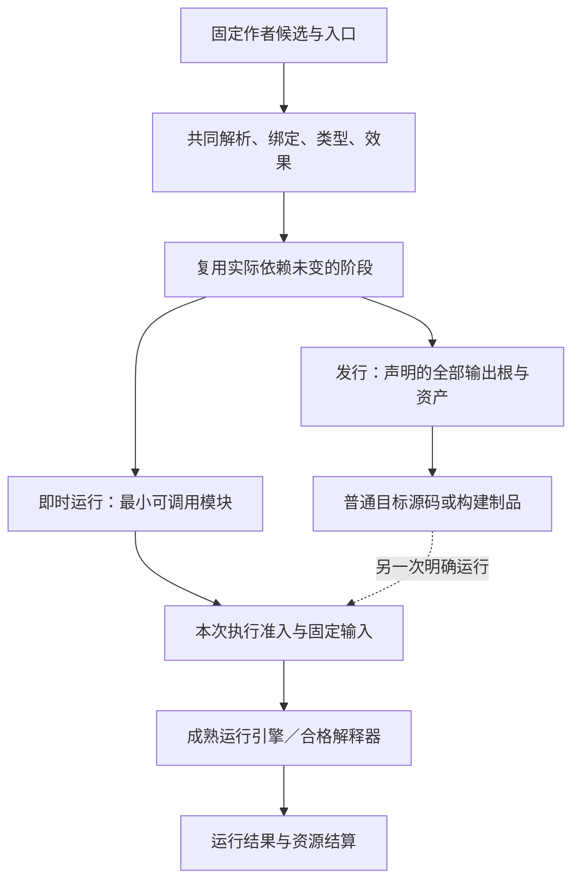

# 运行准备与最小实现

> **阅读范围**：采用范围内的设计规范；实现状态另查未决 · [共同上下文](输入与阶段总览.md)。

<details>
<summary>本页内容</summary>

- [按入口准备运行与解释执行策略](#按入口准备运行与解释执行策略)
- [最小工作链与代码落位](#最小工作链与代码落位)

</details>


## 按入口准备运行与解释执行策略

解释和编译不是两套源语言。当前选择：复用同一解析、绑定、类型/效果和契约检查，按实际入口生成最小可调用制品，再交给成熟运行引擎。首个交互策略复用TS/JavaScript降低与运行，不先开发一套解释器、字节码VM和JIT；直接解释或Wasm/native目标以后可作为满足同一调用合同的执行方法，不是所有后端必须同时实现。

“无需全编译”在此准确表示：不要求先生成整工程全部目标源码、全部部署资源和所有未使用后端；仍要读取所选入口真正需要的依赖，以及语言规则要求检查的模块。模块声明互相影响或初始化有共同义务时，不能按运行样本未经过的分支删掉检查。无体声明可保留，但所选运行根中的行为必须已实现。

### E0—E7：从候选到即时结果

**E0 固定一次运行要求。** 消费[compute-eval](../../开发/工具协议/构建运行接口.md#从候选直接运行的有限扩展)中的精确候选、源入口、参数和请求身份；独立取得执行许可、预算和目标能力。编辑、预览和类型检查不进入此路径。

**E1 形成准备闭包。** 沿签名、类型、真实调用、效果、初始化与公开入口取得固定输入。候选中的未读取内容返回NeedInput，不临时读cwd或latest。只补确需内容，不为一个表达式创建整个工作区目录。

**E2 复用合格阶段。** 模块接口、主体分析、展开、目标方法和代码制品各按实际键复用。改参数数据通常不改变程序制品；改函数体重算真实消费者；规则或ABI变更按相交闭包失效。不能缓存有作用运行结果来跳过本次应发生的动作。

**E3 准备最小可调用制品。** 当前JS策略输出必要模块、入口与运行辅助到隔离内存或获准临时区，使用与发行目标相同的整数、Text、错误、效果和资源规则。TS类型擦除不替代SEC检查。工具需要临时文件却没有相应许可时返回策略缺项，不能偷写工程目录。

**E4 固定调用表。** 制品保存入口、依赖和实际加载语义；不执行含环境隐读的作者模块来“发现入口”。下载、安装、外部生成器与原生模块初始化需要其独立准入。编译期间部分求值只消费已允许静态纯域，不把普通运行需求提前执行。

**E5 运行。** 将可调用制品与已解码的输入交给已有Execution/Runner，保留错误、输出、观察和未结算资源。产生独立RunRecord，记录实际执行策略和输入，而非仅给源码贴executed标签。

**E6 修改后再运行。** 默认每个独立调用创建所需的新运行实例；声明和代码缓存可共享，外部句柄及可变状态不按模块名合并。交互会话需共享状态时，显式持有该运行实例；旧闭包固定旧代码和状态，不在执行中替换。新定义只作用于下一次明确选择，实例迁移按已有协议。

**E7 收尾。** 普通输入和临时制品在最后使用后可回收；返回给会话的值、闭包与活动必须有准确持有者。清空会话释放其根引用，不保证在途设备立即停止。Fault、取消与超预算保留真实未完成责任。

<a id="fig-eval-shared-compiler"></a>

### 图解：日常直接运行与发行复用同一含义

图中的分支是请求目的和执行方法，不能从preview自动跨到运行。直接运行仍有必要的准备，不承诺零解析或零机器编译。



### 交互执行的范围与反例

交互会话可以保存定义序列和结果引用，但其名字解析到明确版本，不回退到宿主全局。覆盖同名函数产生新的作者定义修订；旧运行的闭包和对象继续引用旧实现，只有显式迁移或新的实例使用新代码。函数返回不可编码的资源时，保留有期限且受权的运行句柄，不把地址序列化成JSON或“永久值”。

动态尺寸、运行分支、普通循环在目标程序中执行，不要求在构建时展开全部可能输入。数据驱动特化只有明确守卫和预算；不能因第一次输入是长度10就永久使用长度10的缓冲。JIT或解释器只是执行方式，不自动满足实时、无GC或地址布局的硬要求。

Lua 5.4将源chunk预编译为指令再解释执行，说明“解释性”不等于完全没有编译；SEC可提供同样即时的使用过程而不照搬Lua数值与动态类型。[Lua 5.4 §3.3.2](https://www.lua.org/manual/5.4/manual.html#3.3.2)。当前首选成熟JS引擎，是为了复用已有降低和运行器，不声称它对全部计算最快。需要更强交互延迟、设备或运行控制时再比较实际策略。

### 局部控制与寿命在P阶段中的消费

读取器在已选组合中识别var与有限退出；绑定器建立可变槽、函数出口与循环目标。BodyAnalysis在原位置/捕获信息上取得三类派生关系：每个操作访问哪些位置，函数值潜在访问哪些位置，位置经哪些返回/字段/外部调用可观察。它们由[位置算法M0—M5](../../领域/对象与控制/控制流与存储寿命.md#闭包存储依赖与外部效果投影)产生，不增加作者字段或独立IR。

P3先推断每个值的单态/量化关系和内部访问，再计算有限递归摘要的逃逸与函数潜在效果，最后投影公开效果。局部状态被隐藏后，内部访问关系仍供P4/P5检查CSE、移动、重算和并行。生成器不能仅消费一个publicEffectsEmpty位；摘要不足时保留原顺序和相交效果，不输出可复用“纯闭包”假象。新展开引入捕获、外部调用或返回路径时，相关区域重新执行这些步骤并失效原消解依据。

降低器保持实际词法出口与[清理合并U0—U5](../../领域/对象与控制/控制流与存储寿命.md#控制出口与清理结果的确定合并)：先保存待完成值/错误；对真实取得的资源逆序处理，合并主失败和清理诊断；依scoped或函数边界分别完成Result映射与ensure。目标try/finally只是实现材料，不能把宿主最后return或最后异常当成中立出口规则。

可变局部能够在后端变成SSA或目标变量，这是实现选择，不让作者维护SSA。无法证明某个slot不逃逸时采用托管位置或限制相交纯度，不提前释放；涉及Borrow/Own且没有合格传递规则时，准确限制那项传递。即时策略和发行策略使用同一分析与降低含义。

即时策略和发行策略必须使用同一语言入口与数值/资源合同。局部运行返回6而发行返回5是符合性缺陷，不称“解释器差异正常”；但两者的耗时、优化后内部变量可见性及未承诺物理布局可以不同。所请求保证按实际策略记录。


## 最小工作链与代码落位

```text
现有公共工具请求
→ 应用层固定源、任务与解释，形成PreparedJob
→ 文本parser或结构decoder
→ 同一模块表/签名/绑定/类型/效果/契约
→ 展开并对新增区域补查
→ 当前目标降低、稳定布局、成熟AST打印
→ 每个输出根的结果与实际成员
→ 按请求进行工具检查或交给工作区作用编排
```

纯计算入口复用同一组语义分析与生成函数；工作区作用入口在它之外取得实际租约、前像并执行提交和读回。轻量预览通过不装配写入能力实现，不通过移除真实写入保护或伪造回执实现。


### 输入、身份与链接

输入边界从实际未受信内容解析：文本检查字节/编码与对应文法，结构载荷检查该版本字段。使用JSON传输时拒绝重复键、非JSON数字；直接对象输入检查循环、深度和预算。原生内容由其格式合同处理。字段形状与完整语义分开验证，不将所有作者文件先强制转为JSON，也不以结构通过替代符号绑定。

模块身份、语义revision与内容摘要各有职责。作者冻结操作产生目录锁；锁证明这次要解释的字节，不签发作者权或运行权。模块内部只保存直接导入的身份/revision，快照外层锁保存各模块摘要，避免相互递归导入导致“摘要必须包含对方摘要”的哈希循环。两个模块可互引声明，但不得靠加载时副作用完成循环初始化。

链接从所选输出入口展开导入，按确定的命名空间和局部符号身份建立符号表。先收集声明名、显式签名和待推导头，再完成有限类型补全、主体与效果检查，最后封存调用合同；递归待推导类型需要明确注解，初始化环另行判定。直接导入决定名称可见性，传递导入不自动泄漏；同一作用域内的同名同种类声明冲突，不依加载顺序覆盖。缺失未请求的模块不使无关输出失败。

声明合法性检查仍覆盖选定模块的完整闭包；产出集合从入口沿函数调用图求可达闭包，只生成该集合和实际引用的外部端口。不能因未调用就放过选定模块中的类型错误；也不能因声明存在就索取其运行权限。未经过保持性优化的条件两侧均保守可达。函数内局部编号不依赖其他声明数量；这不是符号级增量checker已经实现。

### 类型、控制流与名称卫生

核心checker对已选类型规则执行可判定的局部结构检查；领域特有推导由领域checker产生有范围的事实。未知的类型推导是未支持/未决，不自动降成Any。名义类型通过显式构造、解构和桥接改变，底层同为整数不能让分数、距离和货币隐式互换。

对声明支持局部变量、赋值、循环和外部调用的命令式来源画像，采用以下读取和绑定要求；这些要求不向基础 .sec 文法增加新构造：词法环境是作用域栈，声明初始化先检查旧环境，再加入新绑定；分支和循环体的局部变量不能泄漏。每个绑定拥有生成局部ID，目标变量名由ID产生，不使用作者字符串拼接源码。

用户操作的body用同一核心检查，再成为独立函数。被调表达式先求值，实参按调用源码顺序各求值一次，再绑定形参槽；体内同名变量不捕获调用者的局部变量。以后需要内联时，必须保持alpha重命名、求值次数、异常顺序和效果顺序，而不是把表达式做文本替换。

递归是程序调用图中的环，不是编译调度器中的无限工作。函数返回检查采用保守结构规则；编译器不应执行作者业务循环来猜测能否返回。真实系统可以支持更多控制流与unreachable分析，但不能把“checker不聪明”改称业务语义禁止。

### 基础前端的判定次序与有界失败

中立前端先固定语法树和声明身份，收集公开签名；随后解析名义类型/别名与可见性，在刚性类型参数环境检查泛型主体，再做表达式类型、分支模式覆盖和效果推导。lambda体的效果记到函数值类型，构造lambda本身不执行该体。步骤可以共享扫描和索引，不要求物理上强制七遍或串行扫全工程。

[模式与泛型的完整规则](../../领域/计算基础/文法类型与求值.md#模式覆盖与分支顺序)由语言章拥有。覆盖矩阵、递归类型查询和特化实例均要记忆化并有预算；达到预算时返回相应未完成范围，不把未遍历当不适用，不因静态分析停止而输出默认分支。普通重复闭合定义可以复用，受影响声明的错误与独立输出的完成范围分开。

源类型成立、行为契约成立和某目标可降低分别有结果。错误泛型不能通过某一组具体调用碰巧运行来蒙混；合法多态递归也不能因为单态化无限膨胀被报告成整个源语言非法。目标策略变化回到实现绑定，不能在后端私自重解释类型。

### 效果分析与外部接口

将每个函数的直接效果集合记为E0，调用边指向其被调函数；有限标签格的最小并集固定点由反向边增量工作队列求出。同一固定图的初算及单调增加，才只把新标签向调用者传播并合并delta；删除种子/调用边及规则变化按[删除递归事实](../查询增量与性能.md#删除递归事实与重新求固定点)重算受影响分量，不从旧闭包只增不减。实现可记录队列取出、边访问与新增事实，并对传播工作设预算。该预算耗尽是分析未完成，不是程序递归非法。函数上界未覆盖闭包时拒绝受限效果声明；后端独立从计划体重算直接/传递效果，拒绝被篡改的分析元数据。

这个结果是依赖边界声明成立时的分析，不是外部原生实现诚实性的证明。未验证外部函数必须保留unknown-effect或相应风险标签；不能把用户随意填写effects=[]当安全认证。提供者是否允许在当前机器做该动作，仍由真实Host能力与权限检查决定。

生成程序的外部端口使用明确参数、返回、异常、同步/异步、数据与生命周期合同。JavaScript宿主可以先检查入口表示及所需端口是否为自有数据函数属性，捕获函数引用后再进入作者程序；拒绝缺失、继承和访问器端口，不隐式传出整个Host作为this。这是一种目标ABI设计，不是所有语言都必须有属性描述符或requiredHostPorts字段。其他后端采用它们真实的导入/调用边界，并保持同一端口含义。

预查能发现确定的缺失，不能保证整个运行无失败或无副作用；运行返回仍需对应表示检查，当前授权不随函数捕获永久固定。JavaScript Proxy的描述符trap和函数闭包依然可能执行代码，Host必须来自相应受信绑定器；仅“冻结函数引用”不是沙箱。

### 降低与后端，不重写成熟语言工具

每个降低选择绑定精确规则实现、适用性、目标能力和保持性质。同一义务存在多个合法实现时，用已选策略确定排序和平局规则；缺少排序依据可报歧义，但不能无限寻求一个全世界唯一最优实现。共享的语义不要求每种目标使用同一TargetProgramIR。

TS源码后端默认复用TypeScript的AST factory和printer；目标构建使用Program/typechecker或完整tsc，而不是仅调用类型擦除或transpile就声称通过。源码观测复用语言前端和模块解析；受限模板继续适用于固定的非程序化小输出，不扩成任意拼接代码。

目标后端设计采用AST factory构造函数、声明、表达式、分支、循环、调用与接口，再由打印器输出；严格类型检查与运行是另行获准的工具动作。不以eval用户字符串代替降低，不为编译普通程序而执行其业务体。该一般整数画像将规范十进制编码降低到bigint，除法向零截断、余数跟随被除数；其他目标画像必须明示数值语义，独立解释和边界验证检查相同合同。

MLIR适合多级降低与异质计算后端，IRDL支持定义类型/操作；但不因此强制将组织、发布和所有业务模型装入MLIR，也不要求TS源码产品先引入C++运行库。正式后端可在需要时桥接MLIR/LLVM；当前TS路径先使用已验证的语言API。依据和非采用理由见[一手依据](../../依据/来源/语言编译与目标工具.md#语言编译与目标工具)。

### 确定性、资源与诊断

同一选定模型、定义包内容、规则、策略、目标、工具链与实际输入闭包，产生同一规范结果。定义声明和导入集合按身份排序；语句、实参和其他有语义顺序的集合不重排。没有程序等价证明时，不把两份不同算法强制规范成同一实现。

编译ActionKey绑定该阶段实际消费的规范计划、输入与真实生产者，不只引用可被复制的上游inputKey；ArtifactDigest绑定实际产物字节，证据资格另绑定环境和方法。后端校验交接计划的类型、控制流、调用和效果一致性，拒绝篡改与非法结构；不凭结构合法反推作者采纳、权限或完整语义保持。校验算法可以与前端复用同一规范，同时用独立方法寻找共同错误，不强制另造第二套语义权威。

目标计划在实际交换或持久边界绑定对应解释版本；同进程内部结构不因版本化需求而强制序列化。更改工具字节而不改版本字符串仍会改变生产者身份。采用JCS时需按其完整编码规则实现，普通排序打印器不能冒充该规范。

Compiler预算约束输入节点/深度、时间、内存和输出规模；触达预算返回budget-exhausted与已完成前沿，不能称UNSAT或语言本身不可表达。受限解释器的执行fuel只是测试宿主预算，不写入未选择预算的目标业务循环。用户编译期过程也可通用可计算，但必须经过隔离、有界执行和回执；不要求先证明其终止才允许定义。

诊断包含阶段、稳定错误码、模块/符号/源位置、需求或目标引用、能继续的输出、所缺事实及恢复动作。语义冲突、未绑定、类型错误、目标不支持、编译超预算、后端故障、目标工具链失败和运行故障各自保留。不能用一个success状态合并这些层次。

### 制品、映射和所有权

生成结果按输出形态返回内联源码或文件集合及必要依赖、来源、生产者和验证义务；ArtifactTree是文件集合的既有形式，不强迫表达式先变成虚假磁盘工程。只有实际作用才增加其操作身份；纯生成不直接写工作区。原生作者区域保留原字节与作者权，生成区域由其上游定义负责；转换所有权要经过显式采纳、差分和恢复策略。

一种受限导出画像只允许创建全新目录，以完整路径预检、独占写入、清单摘要和实际读回决定完成，不能只看incomplete标记消失；这不是原子工作区发布。具体状态机见[工具执行与新目录导出](../../运行/发布运行与资源生命周期.md#编译工具执行与新目录导出协议)。函数级来源映射、节点级定位和编辑往返分别声明与验证；不得把粗粒度映射当成可安全自动修改任意旧源码的位置证据。

### 开发依赖与可验收工作包

| 工作包 | 具体交付 | 前置与验收 | 失败时动作 |
|---|---|---|---|
| 核心纵向链 | 模块链接、一般程序、降低、目标AST、独立运行 | 纯计算不依赖控制服务；工具与运行按目的启用 | 保留源码，定位具体阶段 |
| 正式TS实现与工具适配 | 对照参考输入/输出与错误，正式typed constructors、TypeScript frontend/backend | 使用当前源码和合同；不得宣称仓库已迁入 | 双实现差分，差异进入反例库 |
| 用户定义扩展接口 | 定义包加载、检查、发布/本地使用、基础编辑、协议兼容 | 不要求官方领域注册；数据定义先可用 | 卸载新版本，保持旧revision解释 |
| 高级类型与效果 | 产品/和/递归类型、泛型、闭包、异常、异步和资源表示按目标实现 | 每个构造有语义、降低、Oracle与目标支持范围 | 保留源并给相交缺项；可用供给须符合原要求，不强制原生改写 |
| 增量与优化 | 查询可从完整程序粒度起步，再按真实依赖拆模块、符号与分析失效 | 先有clean基线与观测闭包，不声称当前已符号级增量 | 保守重算或关闭优化 |
| 隔离与团队执行 | 可强制能力的扩展宿主、资源限额、远程端口、撤销与恢复 | 正式Host资格；子进程不等于沙箱 | 不执行未满足隔离的过程扩展 |
| 存量与多制品接入 | 语言原生保全、未知库接线、多文件编辑/组发布 | 引用原有写回事务与保证合同 | 局部拒绝、可恢复，不整体重造工程 |

工作包不是把未实现项藏进“未来优化”：每项已有接口、失败结果和验收方向；当前状态章保存实施/证据义务；本设计包没有恢复旧机器问题账本。不同包可以按依赖并行，不能跳过首条用户定义程序到独立目标的产品闭环只增加场景文章。

### 生产编译服务的值接口与状态转换

内部`CompileRequest`继续由公共请求展开而来；开发者仍可以只交`source`或差异。这里明确它的逻辑组成及缺省来源，不新增一个必须对外序列化的巨型协议：

| 内容 | 精确含义与取得位置 |
|---|---|
| `input` | 固定作者集合、内容读取视图、作者模式与模块归属；内联单位不需要虚构业务app/Block |
| `outputRoots` | 已解析入口及完整成员要求；未给则从公共请求的明确入口或已固定项目默认取得 |
| `targetRefs` | 实际目标合同与版本；没有目标仍可检查源，不猜一份目标产物 |
| `bindings` | 精确语言、库及实现绑定；可以由应用层合法解析形成，不要求作者点名全部轮子 |
| `layout` | 已接受结构策略及需要时的布局基础；与compareTo和观察时间分开 |
| `requirements` | 已接受任务、源合同和当前要求的引用；来源相同的含义不复制多份 |
| `compileBudget` | 已取得任务与宿主预算在本次计算中的份额；无真实数字不在规范写固定上限 |

`PureCompilerServices`提供固定内容的读取、局部内存分配、精确诊断与已绑定目标打印接口；没有任意文件系统、时钟、网络、数据库写连接。对固定目录查询返回“存在”“该范围准确不存在”或“尚未捕获”，不能把第三种映射成第二种。核心新发现所需输入时返回本章[共同方法协议](领域方法与整体根.md#领域方法的共同调用协议)中的ContentNeed或ToolResultNeed；应用执行获准取得后形成PreparedJob的后继，只补此前未固定内容，复用未变分析。已固定同一引用返回不同版本时产生捕获冲突，不原地覆盖。部分捕获合成输入可以用于计算，不冒称原工作区某时刻的原子全景。

输出采用按根的乘积状态，而非竞争的单个枚举。内部结构为：

```text
CompileOutcome = {
  inputRef,
  sourceAnalysis: { modules: ModuleAnalysisResult[], sharedDiagnostics, openRequirements },
  roots: RootResult[],
  actualDependencies,
  resourceUse,
  nextInputs
}

RootResult = {
  rootRef, targetRef?,
  generation: not-requested | blocked | produced | interrupted | tool-failed,
  artifactSetRef?,
  reasons: Reason[]
}
```

`ModuleAnalysisResult`逐模块给出moduleRef、reachedPhase（captured/parsed/linked/checked）、outcome（valid/invalid/incomplete/interrupted）、diagnostics和actualReads。reachedPhase是实际到达的位置，不等于该模块有效；所有必需检查结束且有效才允许其消费根生成。没有用一个全局最高phase替代未完成模块。`Reason`携带已声明代码、对象、源位置或环境角色及可披露原因，区分源码错误、未捕获输入、目标不支持和资源中止。`produced`必须有本根全部必需成员，`blocked`不能携带被换标签的旧产物。合法草稿可以在parsed层发布候选；中断检查不能标checked。多个原因可并存。

公共返回需要的`targetCheck`、原要求满足状态与检查引用，由application关联[相应Obligations/CheckRecord](../../运行/保证/要求证据与裁决.md#intent-root-obligation-closure)后形成RootResult投影，纯compileFrozen不自行产生外部检查结果。ArtifactSet保持内容不可变；追加、撤销或替换检查改变资格，不改产物身份。

总体`complete/partial/failed`若用于展示，是由原请求根组合派生的摘要，不是第二份事实源。任何目标结果都不包含实际部署成功；公共apply/operation按各自对象记录。目标类型失败针对该artifact，不能推翻过去另一份源检查事实，也不能默改源以使摘要转绿。

同进程阶段通过不可变值与显式版本关系传递；不要求每个临时结构有schema、签名、永久摘要或数据库记录。真正跨进程、缓存或长期交换时才按那项边界编码并核内容、生产者和版本。静态类型只约束可信进程内代码，外部对象必须通过实际解码验证，不能`as CheckedProgram`跳过检查。

`DialectAdapter`的decode、signature、check、interfaces、lower、migrate、projectEditor按[领域方法共同协议](领域方法与整体根.md#领域方法的共同调用协议)分别存在。缺编辑器不阻断合格生成，缺lower不返回空成功；能力注册不获得任意执行授权。`Backend`只返回候选文件与映射。`LanguageTool`消费封闭输入和真实许可，返回对具体产物的检查或构建记录；其I/O并非纯核心的隐藏回调。


### 增量、插件组合与原生生态的执行算法

**增量查询。** query identity由查询种类、稳定主体、请求目标及实际参数构成；内容变化通过节点revision而非路径猜测判断。查询依赖包含已读分片、缺失符号/成员的负依赖、成员枚举和规则选择目录。先在冷缓存执行形成保守完整闭包，再与全量基准比较结果和诊断；未观察到的条件路径不能凭一次读集宣布永不相关。循环语义分析按显式SCC进入固定点，普通依赖环有分类诊断。优化不具备保持证据时可关闭，仍须产出正确的未优化工程。

**组合选路。** 构建本次快照的定义索引，对每个请求义务枚举声明适用的提供者，检查类型/Effect/版本/目标约束，按锁和用户策略选择确定路径；可达但未实现的转换生成局部缺口。只对明确等价且可交换的转换允许重排；效果重排、数值近似、时间或并发变更必须由目标政策授权和证据支持。不能依注册先后得到输出，不能因一个低优先级候选坏了就替代已经冻结的合法路径。

**原生库。** TypeScript前端先用其模块解析与类型检查建立真实导入/导出和签名，原生源码与锁依赖保留为目标制品。SEC可直接生成调用现有函数/类的方法表达式；自定义语义Adapter只在需要业务级理解或特殊映射时增加。没有可取得签名时可保留整个原生组件并交目标工具链验收，但不能把未知API自动暴露成类型安全公共端口。ABI、同步/异步、错误、资源与Effect无法由类型推导的部分继续保留未知，并按当前输出/保证判断是否允许。

**维护退出。** 用户定义升级保持旧revision可解释，迁移生成新候选而不热改旧实例。过程插件崩溃隔离到调用它的工作；定义解析崩溃视为编译器缺陷并保留最小重现。供应链撤销使相应生产者和派生证据失去当前资格，但历史事实不能删除。整个SEC不用在线服务也能编译已采纳且依赖齐全的项目；确实需要外部服务的目标行为通过显式依赖表明。

### 当前机制的规范承接与最小化

[快照查询](../查询增量与性能.md#快照查询与增量失效算法)负责复用算法和资源；[原生直接绑定](原生与跨语言编译.md#原生模块直接绑定与闭合构建)负责不依赖业务Adapter的锁、签名与目标构建；[工具执行与导出](../../运行/发布运行与资源生命周期.md#编译工具执行与新目录导出协议)负责有界进程、闭合清单与中止读回。一般类型、权限、业务事务与保证仍由原owner定义，三个实现专题不能互相代签保证。

输入服务限制已经同时覆盖原始UTF-8、解码后的键和值、总大小、节点和深度；直接调用Compiler也不得绕过。失败或完成的Compiler实例不复用其可变分析状态。源对象捕获期间由调用者独占，捕获后使用独立副本；跨线程共享作者状态须先取得一致快照。入口与返回ABI按所选源/目标解释分别检查；源语言中的类型包含关系不能直接改写中立类型规则。采用已有前端与边界检查，不为每个调用建立第二个解释器。

### 编译请求与应用任务接合

应用任务负责用户目的、允许动作与补输入；纯CompileRequest只承担确定输入的分析与生成。两者的输出、保证、操作状态和输入代际按[流水线](输入与阶段总览.md#编译流水线与阶段边界)接合。input-frozen/linked/checked/lowered/emitted描述对应模块或根达到的阶段，不要求全工程逐阶段栅栏，也不要求每种原生输入先转为公共IR。

架构关系图只能帮助检查声明的一致性；真实接合还必须让同一次请求的输入、编译结果、证据、目标前像和读回连续对应。应用层组合既有机制，不重写第二编译器。设计任务只写这项接合及验收条件，不自动执行接合实现。

### 公共工具与编译结果的交接

薄应用层在编译内核外，组合查询、目标后端、严格构建、独立验收与交付。默认查询不加载数据库或调用外部工具；源程序与验收期望分开，实际工具身份、来源字节与目标结果须交叉核对。

公共动作仅使用[六工具合同](../../开发/工具协议/六工具与请求.md)：`sec.propose`形成作者候选；`sec.preview`消费精确候选、解释、目标与布局并返回请求的代码或差异；`sec.check`检查明确对象及独立要求；已协商的`sec.operation`构建或运行指定产物，运行前核真实入口、工具、输入和许可；`sec.apply`保存作者源或写回指定产物，核目标前像、路径范围和当前权利。`sec.query`提供只读定位与结果。这里不另设generate、accept或export公共入口；内部函数可组合这些责任，但不改变公共前提和状态。

每个会话设结果数量与字节预算；调用方释放不再需要的句柄后，纯查询缓存可以继续复用。结果含不可变字节，展示对象为分离副本。并发和授权回调重入明示返回session-busy，而非静默覆盖同一操作。长期服务应按会话/租户分区并以真实调度端口扩展，不把本机互斥锁当跨节点协议。

### 编译器之外的持久消费者

需要跨进程修改工作区时，可选持久宿主保存冻结代际、输入、计划、源树和精确变更意图，恢复读取它们而不是重跑原需求。纯分析不加载持久控制面；载入代际不恢复旧权限或旧证据的当前资格。

胶囊恢复证明精确对象保存与读取，不重新证明其编译含义。目标或政策变化时由应用重新检查资格或创建新代际。代码与状态的持久恢复，与任意扩展过程的沙箱、语义模型编辑及部署生命周期分别验收。
