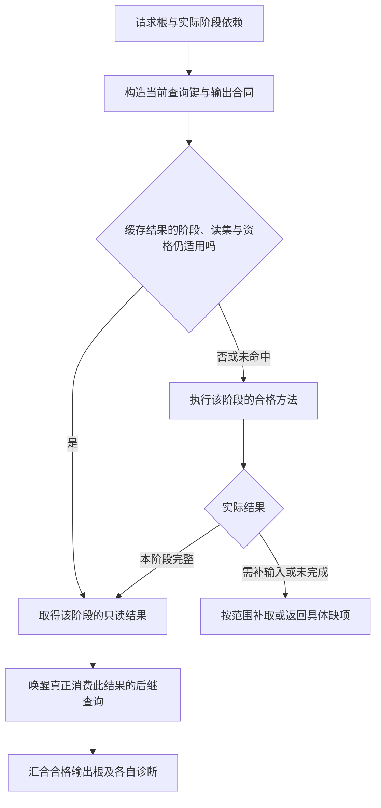

# 遍管理与插件

> **阅读范围**：采用范围内的设计规范；实现状态另查未决 · [共同上下文](输入与阶段总览.md)。


## 编译遍管理与插件边界

### 1. 编译遍

`Pass` 是在某个 IR 内或相邻 IR 之间执行的确定性转换或分析。

```ts
interface PassDefinition<I, O> {
  readonly passId: string;
  readonly revision: string;
  readonly consumes: readonly FactKindRef[];
  readonly produces: readonly FactKindRef[];
  readonly invalidation: InvalidationContract;
  readonly requiredCapabilities: readonly CapabilityRef[];
  readonly deterministic: true;
  run(input: PassInput<I>): PassResult<O>;
}
```

### 2. Pass 图

Pass管理器先解析本次选择的生产者及重写策略，再按消费/产出构造DAG或有明确语义的固定点组件。依赖与显式策略决定顺序，不用注册先后隐式选择哪个实现胜出。

```text
Parse
→ Bind
→ Type
→ ControlFlow
→ Effect
→ ResponsibilityInference
→ ConstraintLowering
```

只有真实依赖存在时才形成边。

### 3. 分析与转换分离

- `AnalysisPass` 只产生事实；
- `TransformPass` 产生新 IR generation；
- `ValidationPass` 产生诊断和资格；
- `ProjectionPass` 产生非权威视图。

分析不能偷偷修改 IR；转换不能把验证失败吞掉。转换只取得实际自足范围的私有写权，输出按其阶段合同验证后才进入新generation；成熟可变Pass可能留下失败半成品，不能把失败解释成自动回滚。实际写域、T0—T7接纳和分析保持见[变换接纳与分析保持](变换接纳与分析保持.md)。

### 4. Pass 输入闭包

每次运行记录实际读取的：

- IR 分片；
- 配置；
- 策略；
- 算法 revision；
- Provider 或工具回执；
- 环境能力。

实际读取记录用于审计；受控确定性查询可用本次真实分支的动态依赖，但分支选择、负条件、枚举成员及环境也必须受追踪。分支控制输入改变时重跑并采集新依赖，不要求旧缓存永远绑定所有未走分支；无法完整拦截读取的提供者采用健全过近似。`ActionKey` 从已证明精确或健全过近似的依赖键材料生成，规则见[可达输入闭包与负依赖](../查询增量与性能.md#可达输入声明依赖证据与负依赖)；不完整的抽样读集不能冒充完整闭包；满足前述受控条件的实际读取不因“单次”二字失去资格。也不得无理由绑定整个工程revision。

### 同一产物的竞争生产者与重叠重写

产出标识同时包含对象、目标和所承诺的表示种类。多个Pass可产出同一位置时，先按已接受的画像选择一个生产者，或声明拥有明确合并代数的组合；不能由最后完成者覆盖。同一输入区域的重写重叠时，登记条件、优先关系和所选策略。固定策略可以给出确定结果，即便规则系统并不合流，但不得称其为注册顺序无关的唯一标准形式。

最小设计选择显式阶段、稳定规则优先关系、相同优先级歧义报冲突；需要固定点才按其专门合同迭代。规则A把形式X改成Y、规则B又改回X时，预算终止仅返回未完成/策略循环诊断，不发布任意迭代中途产物为已规范化结果。用户可以在自己的命名空间选择另一策略，绑定其版本与保持依据，不需要修改核心分派。

结果声称语义等价，须有该重写域的保持依据。类型检查通过只说明目标计划满足该检查，不说明它与原程序行为相同。重叠关键对、迭代次序、删规则和新增更高优先级规则均属于设计验收对象；不能只比较串并行两次恰好相同。

### 扩展定义与验证信任的分工

用户可自由定义新语言及自己的语义，也可提供解释器、分析器、降低和验证器。定义了语义与声称保持已有语义是两种行为：后者要按被消费者要求的保证接受审查，不能由同一插件返回`verified=true`自行完成晋级。

内核重新检查可检查的结构、身份/可见性、类型与效果上界，保护系统全局边界；这些检查不证明任意降低等价。更强保证可使用受信规则集合、可独立检查的证明对象、独立解释/差分/符合性证据及明确适用范围。没有足够依据时仍可保存、分析或生成标明限制的候选，不能冒称满足未取得的发布资格。

沙箱约束能影响什么，不证明算得对；签名说明哪个主体发布，不证明无漏洞；Schema说明结构，不证明含义。解析深度、展开规模、规则搜索及返回体各有预算，拒绝失控只阻断相交扩展任务。没有强宿主就不启用相应不可信过程，但不能因此拒绝全部纯声明定义。

### 5. 固定点组

相互递归分析进入 `FixpointGroup`：

```text
FixpointGroup = {
  lattice,
  transferFunctions,
  seeds,
  widening,
  terminationBudget,
  resultOnNonConvergence
}
```

插件不能加入非单调 pass 到要求单调的固定点组。

### 6. 插件能力

外部 Pass 必须声明：

- 输入输出 Schema；
- 可读取事实类型；
- 能否访问语言扩展；
- 资源上限；
- 确定性和线程安全；
- 沙箱能力；
- 错误和取消；
- 版本和迁移；
- 符合性测试。

默认在隔离进程或沙箱运行；核心进程加载需要更高信任和理由。

### 7. 开放与封闭扩展

允许插件新增：

- 新语言分析；
- 新优化；
- 新诊断；
- 新候选来源；
- 新后端；
- 新验证动作。

禁止插件凭注册动作自行覆盖既有核心知识状态、他人授权边界、已承诺的效果上限、证据裁决或其他模块定义。该限制不禁止用户在自己的命名空间定义新Effect、验证政策、知识领域和编译策略；新定义不能把真实网络写入重新标为纯计算，也不能签发本应由外部主体给予的许可。确需更改核心协议时，经显式版本、迁移、受影响消费者和采纳流程，而不是插件隐式改写。

### 编译遍图与调度



本图描述编译查询调度，不是目标程序的执行图。缓存只能替代其准确阶段和范围的计算；类型结果不能当作目标IR，旧证据不能代替新内容检查。需补输入形成明确后继，不能在同一键内暗换输入。

### 8. 调度

Pass的实际输入/输出、分析保持和效果先由本章确定，再交[递归、并行与远程编译](../递归并行与远程编译.md#4-一条实际可实施的分解算法)的S0—S8执行。它为每个计算键建立唯一工作项，前驱不足则保存续体并挂起；输入齐全且取得资源才进入就绪执行；结束后验证结果，安装真实依赖，再满足等待者与发布输出。

编译器只在依赖和真实修改范围允许时并行。声明互引由签名组件处理，单调固定点由求解组处理；严格等待环是独立故障。每个工作项只写自身结果区，公共命名、布局与最终成员合并由指定拥有者完成。确定性遍不是天然线程安全或远程安全：可变分析缓存、进程环境、目标工具和真实读集仍需要相应合同。

完整正常结果在同一输入与策略下保持承诺的确定性；进度消息、取消、超预算和外部失败单独报告。父任务等待子任务时归还可归还的执行槽，持有内存仍记账，按子任务完成所需资源决定是否可以展开。嵌套工具不能各自创建一个不受上级约束的全核心线程池。远程只处理通过可迁移检查的动作，不将所有Pass默认送到集群。

当前先采用同一调度接口下的正确串行路径，再增加有收益的模块/查询并行和有资格的远程执行；新增部署方式不重解释作者语义。

### 9. 缓存与复用

缓存条目包含：

```text
ActionKey
OutputDigest
SchemaRevision
Provenance
Diagnostics
ResourceMetrics
ValidityConditions
```

缓存损坏、版本不兼容或来源缺失时重算；不能把反序列化失败当作合法 miss 后掩盖供应链问题。

分析保持必须核实际写集、剩余前提及传递依赖，不能只接受插件自报的preserved集合。CFG保持不推出值域或别名保持，删除IR对象后不保留以复用裸地址冒认新对象的缓存；仍成立的保守界也不能伪称精确。新IR、有效分析与来源在同一工作项结果中发布，见[分析保持](变换接纳与分析保持.md#5-分析保持是有依赖的证明不是一个全局布尔值)。

### 10. 验证

- Pass 图对注册顺序不敏感；
- 缺依赖和循环分类明确；
- 串行/并行输出等价；
- 真实读取闭包可审计；
- 插件越权负向测试；
- 固定点收敛与预算终止；
- 缓存命中和重算等价；
- Pass revision 变化只失效消费者；
- 插件撤销传播到派生物和证据。

### 11. 编译期可编程与终止策略

过程型Pass可以用通用语言实现。预算到期可使服务停止等待并返回明确未完成，但不自动证明宿主内核调用、外部进程或远端作用已经终止。需要强回收时选择能强制限制和终止的宿主，保留终止失败与未结算责任；可信同进程不可中断过程只能在相应政策下使用。此限制不拒绝一般计算表达，也不把超时变成无解。

每次过程执行的输入快照、实现内容、工具链、目标、策略与允许的编译期能力进入执行身份；目标程序声明运行时Effect并不使编译器在编译期执行该Effect。编译期网络获取先形成冻结输入/回执，再参与纯转换；动态读取未记录环境的插件不具备确定性缓存资格。

通用骨架可以支持用户Pass，而不是内置所有算法。旧有限参考不证明任意过程插件的安全沙箱；本包只有设计。生产接口与退化方案见[开放编译器内核](编译值服务.md#开放编译器内核设计)。
