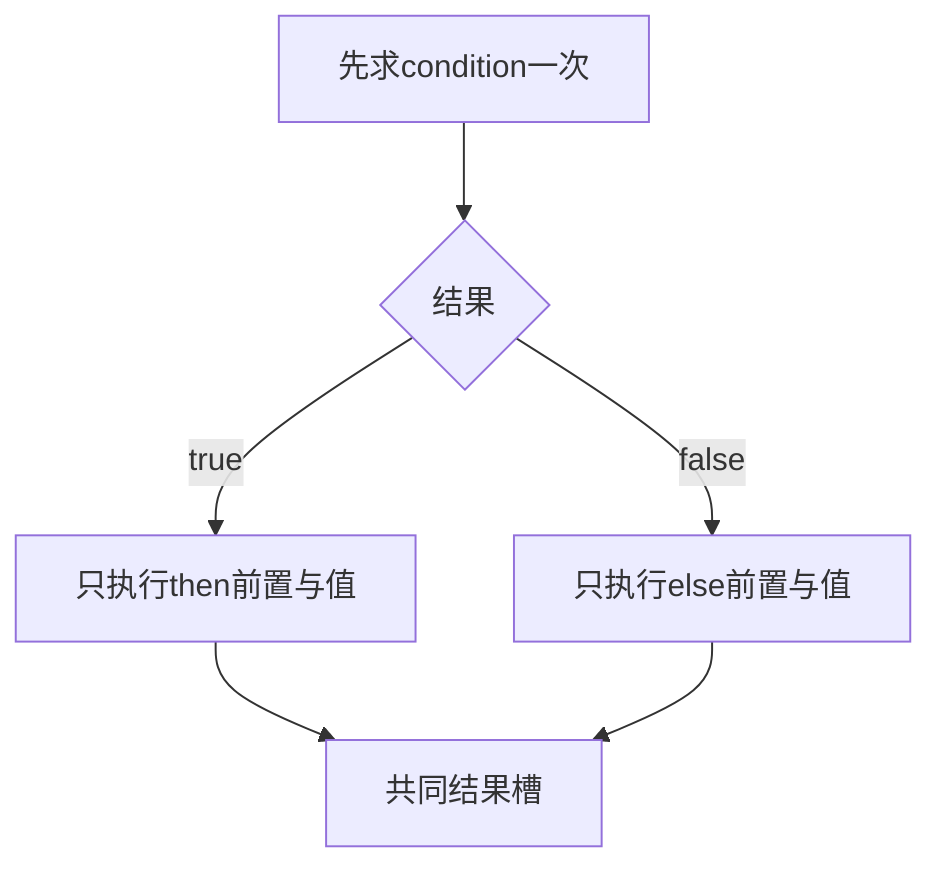
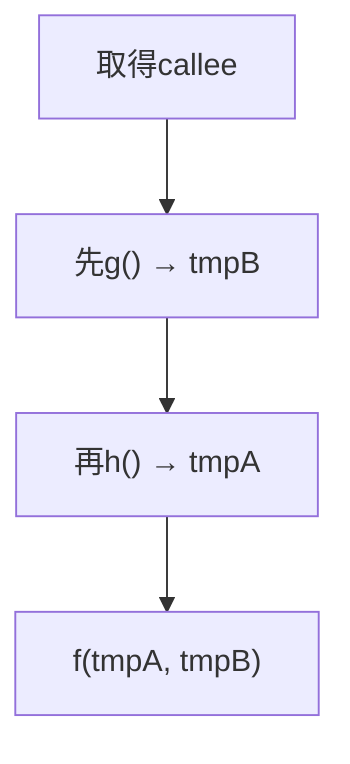
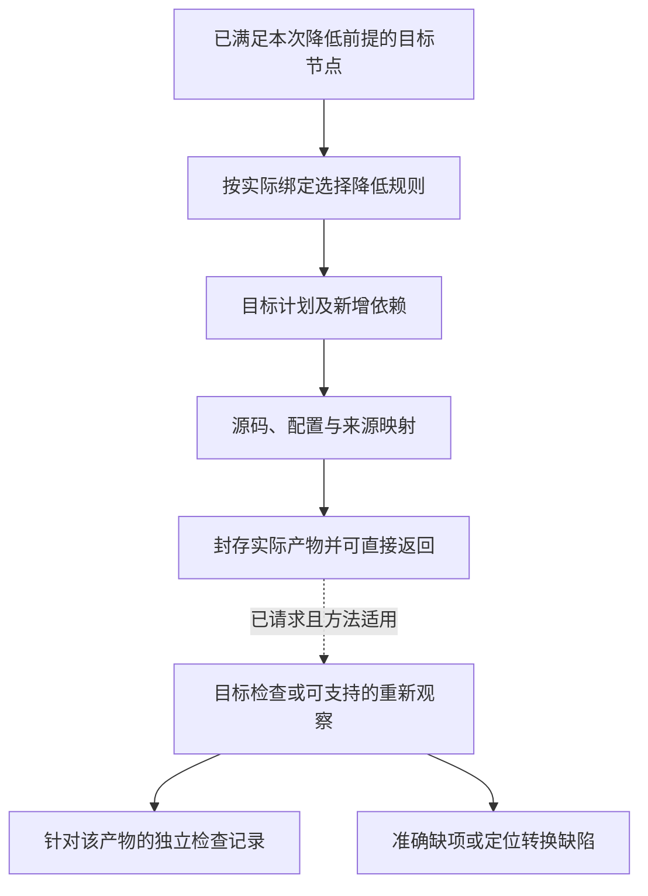

# 降低与源码映射

> **阅读范围**：采用范围内的设计规范；实现状态另查未决 · [共同上下文](输入与阶段总览.md)。

<details>
<summary>本页内容</summary>

- [源码编辑合成、保留区与冲突](#源码编辑合成保留区与冲突)
- [高层保留、分阶段生成与残留程序](#高层保留分阶段生成与残留程序)
- [降低规则、后端与源码映射](#降低规则后端与源码映射)
- [固定画像下的紧凑源编译](#固定画像下的紧凑源编译)
- [计算结构的主路径与条件降低](#计算结构的主路径与条件降低)
- [封装库在编译链上的实际处理](#封装库在编译链上的实际处理)

</details>


## 源码编辑合成、保留区与冲突

### 对应不是重新打印全部源码

作者来源、CST/词法trivia、无修改字节保全、精确位置单位和可写子集统一沿用[编辑往返合同](../表示/编辑与受管回源.md#编辑往返的具体合同)。该合同承担人和AI入口的保全与逆向条件，后端不另定一套恢复规则。

### 编辑算法

解析请求中的稳定对象 → 读取指定作者层及基础 → 匹配相同版本的来源关系 → 构造被支持的语义或文本候选 → 检查重叠、引用和名称捕获 → 在候选中执行可用重解析/检查 → 写回前复验前像 → 提交与读回。

采用原字节局部编辑还是重新打印，由前端映射与目标格式合同选择。仅有一对多来源关系时可以追踪，不能凭旧行号反推唯一作者更新。缓冲与磁盘分歧返回`writable-layer-diverged`或明确的三方候选；没有协调，不用缓冲语义覆盖另一磁盘版本。

### 往返合同

可用等级、非目标区域保全、未知内容、坐标换算与版本失效均归共同合同。重复解码/编码不是独立行为证明；跨语言转换通常只有指定观察下的保持关系，不能宣称无损返回所有作者意图。

### 理由与反证

全量重新生成对纯生成项目简单，但对存量工程会破坏风格、人工逻辑和未理解构造。最小编辑更复杂，因此只对需要保留的区域使用，纯生成区域仍可整体再生。

反证为同名节点误匹配、注释丢失、外部修改被覆盖、人工区域被自动删除、两个生成器写同一位置、代码格式化写入未授权文件。检查必须覆盖这些，而不只看最终能否编译。


## 高层保留、分阶段生成与残留程序

编译器不要求先把全部高层定义完全展开成最细IR才开始每个分析。按照所选输出需求在仍有用的层进行链接、规则检查和局部变换；保持条件明确后才降低。高层定义、一般程序与原生引用可以在同一候选中共存，不把“已经注册”当成目标已支持，也不把未用到的未知方言当成全工程失败。

当前默认顺序是：冻结作者与解释 → 解析显式或由政策允许的选择 → 按需展开和类型/效果检查 → 选择可保持的目标实现 → 产生源码或残留的目标调用 → 由成熟目标工具继续检查。这里的层级是处理阶段，不是要求新增常驻服务。

静态已知、无作用且可在预算内安全执行的组合参数可以提前求值或特化；动态输入保留为目标程序的参数、分支和循环。预算耗尽时，只有所选目标能够表达该残留且保持原观察行为，才允许保留未优化形式；否则报告对应输出未完成。不能把尚未明确的业务意图、缺权限或不合法类型作为“运行时再解决”的合法残留。

运行程序可非终止；生成程序本身也可能递归或超预算。不能为了生成而自动运行任意原生初始化、读取网络、取当前时间或调用模型；获准过程生成器的真实输入和工具执行另按宿主合同承担。类型正确的生成代码不等于与未分阶段版本等义，代码移动、重复求值、错误和资源顺序仍遵守本章原保持条件。

已知定义的专门化可以减少目标运行分派，也可能增加构建时间与代码体积。没有已测收益时可以输出普通通用调用，不能为了“零抽象成本”无界复制代码。MetaOCaml的分阶段生成说明高层抽象可用既有编译后端实现；Halide的形式研究也揭示调度保持并非自动成立，二者都不认证SEC实现。来源归[机制依据](../../依据/来源/语言编译与目标工具.md#语言编译与目标工具)。

同一实现记录作者定义与局部选择的来源；用于诊断的展开轨迹可以按需生成，不要求永久保存全部中间代码。打开一层与最终后端降低不是一回事，已经优化合并掉来源的目标片段不能无条件逆向写回作者源。


## 降低规则、后端与源码映射

<a id="fig-evaluation-regions"></a>

### 图解：分支和具名实参的降低边界

本图显示分支激活，下一图单独说明参数映射；参数最终位置不能决定其求值次序。正常源程序可能失败或不终止，降低不得删掉该区别。



### 图解：源码实参顺序与形参槽映射

本图只说明 `f(b:g(), a:h())` 的求值顺序，不与上图形成先后关系；若g出错，h不执行。



### 1. 降低的职责

降低把高层 IR 中已决定的语义转换为目标画像可表达的结构。每条规则必须说明前置、输出、语义保持、失败和来源映射。

```ts
interface LoweringRule<I, O> {
  readonly ruleId: string;
  readonly revision: string;
  readonly sourcePattern: Pattern<I>;
  readonly targetCapability: CapabilityConstraint;
  readonly preservationClaims: readonly ClaimRef[];
  lower(input: I, context: LoweringContext): LoweringOutcome<O>;
}
```

### 语义保持的观察范围与优化前提

每条降低先确定源与目标共享的观察域：输入值与类型边界、正常结果、业务失败、异常/陷阱、外部动作及因果顺序、终止/发散与所承诺进展。明确不观察的内部名字、临时布局和调度可变化；若目标任务要求时限、内存、反射或精确数值，这些不能再被排除为“实现细节”。

顺序确定程序通常要求指定输入域内的结果与可观察轨迹保持。具有非确定性的程序可能允许目标从原合法轨迹中作精化选择，但只有所采用合同允许精化且保持必需的进展/公平条件时才成立。允许轨迹没有增加，不足以证明没有引入死锁或无限等待；也不能只比成功返回值而忽略目标多了一条失败路径。公开声明写明采用等价、精化、误差包络还是有权接受的改变，不把四者统称完全等价。

优化器不要求为任意程序求解语义等价；它采用小型、带前提的规则与相应分析。不能确认某项规则前提时，保留原计算或选择更保守路线，仍可生成。确需改变已接受含义时返回新的设计选择，而不是在后端悄悄降级。

| 拟作变化 | 必需前提与反例 |
|---|---|
| 删除未使用调用 | 不能丢失可观察效果、陷阱、异常、非终止或约定释放；`spin(); return 1`中的spin无写入也不能直接删除 |
| 提前/推测执行 | 新路径上也必须合法并保持相关观察；将条件内的除法提到条件之前，可能在原本不除法的输入上除零 |
| 公共子表达式合并 | 输入及可观察读取相同、重复结果可替换、身份/分配/错误/时序不变；读取时钟两次不能只因函数无写入合并 |
| 内联、宏展开与融合 | 求值次数和顺序、短路、捕获、资源释放保持；`twice(send())`不能由值传参变两次发送 |
| 代数改写 | 按数值类型检查溢出、舍入、NaN与正负零；浮点加法不能默认结合，`x*0`也不授权删掉计算x的异常 |
| 循环和并行重排 | 冲突/别名/控制依赖、异常优先关系、同步与进展符合；可交换数学运算不等于外部写入可交换 |
| 类型/包装擦除 | 仅擦除无需运行观察的表示；精化检查、反射tag、防伪身份和释放责任不能被静态类型名遮掉 |
| 分配消除或栈化 | 逃逸、资源身份、生命周期和所承诺的资源失败语义保持；降低资源用量也不得破坏明确的上界/生命周期合同 |
| 浮点容差或近似实现 | 误差模型、输入范围和组合后误差有依据；有权采用的近似是明确语义选择，不是优化器发明epsilon |

无外部写入只是部分效果信息。借鉴MLIR时须同时考虑副作用、可推测性与非局部控制流的范围，不能把其接口名字当成SEC完整错误/资源证明。声明来自未受信插件时，必须由所需资格或保守边界约束；插件自称pure不使任意调用可删除。

语义规则、前置分析和目标运行库各自有版本和依赖，结果记录实际选择与保证义务。规则组合不能仅拼接“每条有Claim”的文字：前一条的后置必须满足下一条的前置，误差和效果保持在接合处重新计算，多个正确局部适配也可能在别名/取消/未知数据上不相容。

反例审查采用明确源/目标行为、初态与观察，不等同已经运行。后续实现可用受限形式证明、独立解释、变形关系、目标验证和差分组合；同一前端往返一致只能证明它没有发现不一致，不能单独认证业务符合性。

<a id="control-lifetime-lowering"></a>
### 控制与寿命降低的共同接合

资源、异步和错误的组合保持由[取得责任](../../领域/对象与控制/控制流与存储寿命.md#acquisition-custody)、[控制出口](../../领域/对象与控制/控制流与存储寿命.md#控制出口与清理结果的确定合并)、[任务领取](../../领域/计算基础/通用计算与任务语义.md#task-result-transfer)与[失败边界](../../运行/保证/系统不变量与组合.md#failure-boundary-contract)定义；后端只实现它们，不再选择一套隐含错误优先级。每个受影响激活的私有控制图按以下接合降低：

```text
原次序求值并接住已取得捕获
→ 取得/启动前建立实际责任位置
→ 原生调用；一次记录实际正常/失败/取消事件
→ 成功资源交到已准备拥有者；未交付值留在临时结果位置
→ 停接新工作，排空相交任务与仍在取得的责任
→ 清理本域自有资源并合并原出口
→ 合格正常结果检查ensure，再在交付点移交
→ 交付前失败则弃置仍自有的结果；未知责任留给真实恢复者
```

这个顺序图描述相交义务，不要求每个函数物化全部步骤。普通无外部资源的同步纯函数仍直接调用；只有普通值的局部返回不生成资源票据。原生RAII、受保护栈槽、结构化任务或明确的移动ABI可以承担责任位置，能证明没有相交运行观察的中间记录可擦除；不能以“类型已检查”删除实际防伪、真实停止、调用资格或尚未结算的外部义务。

拥有形状、词法退出目标、捕获移动、结果依赖和效果由semantics提供；方法/目标选择由compiler固定；真实获取/计量/停止由execution与adapter负责。保留这些依赖的分析输入；内联、尾调、融合、标量替换及公共子表达式消除均不能越过真实取得/交付点，不能复制Own领取、提前释放仍被结果使用的资源，或把错误载荷真假变成退出判据。目标不支持所需移交或有界清理时返回具体保持缺项，不能增加默认成功分支。

原生源码保全仍按其原有finally、异常及析构顺序；只有明确转换到本中立合同的部分才使用上述步骤。方法已有合格完整实现时直接引用它，不生成一层同义wrapper；存在差额适配时，生成的控制点与来源说明应能定位到准确取得、退出和交付，不要求作者维护这些派生记录。

### 契约入口、尾调用与特化责任

函数引用默认指向保留实际契约的入口。直接调用优化可以按[契约实现](../../领域/计算基础/文法类型与求值.md#契约怎样成为可运行产物)选用受证的内部入口；间接调用、跨模块和原生导出不能无依据绕开检查。内联、特化与去虚拟化都要保留该入口关系，不让性能优化变成删除require/ensure的捷径。

尾位置的主体调用若仍有待执行ensure、清理、转换或外层错误映射，就不是整个实现的无续体尾调用。可以在满足顺序条件时用显式续体/循环机、共享泛型体或合格目标尾调用保持行为；不能只看语法最后一个调用就抛掉后续责任。无相交后置责任时，普通尾递归可以直接循环化，不强迫所有函数使用蹦床。

类型参数造成的特化节点增长和运行递归分别受预算。共享泛型表示只在类型/表示/调用合同合格时采用；否则报告所选目标策略缺项，而不是导出Any、丢弃递归实例或扩大核心语法。具体表示由目标规范承担，不新增另一份作者模型。

### 2. 降低层次

```text
Design IR
→ Implementation IR
→ Target Program IR
→ Backend IR
→ Artifact Plan
→ Source Artifacts
```

以上是可用降低路线，不是所有输出必须物化的六层。每步只作属于该步的决定；无独立保持义务的中间表示可融合。后端发现所选表示不支持时返回相关设计/绑定缺口，不能自行回头改变责任、契约或实现绑定。

### 3. 语言映射

目标语言差异通过：

- 类型表示策略；
- 错误和结果策略；
- async/cancellation 策略；
- 模块和可见性；
- 泛型与 trait/interface；
- 内存和所有权；
- 反射和元数据；
- 构建与包结构；
- FFI 和原生边界；

显式建模。无法保持的语义产生 `UnsupportedLowering` 或额外运行时/验证要求。

### 4. 生成区域与人工区域

后端生成：

```text
GeneratedArtifact
GovernedAuthoredPatch
OpaqueExternalBinding
MigrationAdapter
```

不得随意重写整个人工文件。生成区域使用稳定标记、结构化节点身份或独立文件；标记仅用于实现映射，不进入语义身份。

### 5. 地址分配

物理路径由 `PlacementPolicy` 决定：

- 责任聚合；
- 语言和构建约束；
- 可见性；
- 循环依赖；
- 变更局部性；
- 测试和部署；
- 人工维护边界。

路径分配结果是 `AddressBinding`，可独立迁移。

### 6. 源码映射

```text
SourceMap =
  IntentRange
→ SemanticSubject
→ DesignElement
→ TargetNode
→ ArtifactNode
→ PhysicalRange
```

映射支持一对多、多对一和生成链。删除或重排后保留历史 revision 映射。

### 7. 格式化

格式化器是受控 Provider：

- 输入精确字节；
- 配置和 revision；
- 允许修改范围；
- 输出和诊断；
- 确定性声明。

格式化不能扩大写集或改变语义。大面积噪声可作为成本和审查风险拒绝。

### 8. 构建文件和依赖

后端生成或修改：

- 包清单；
- 锁定输入；
- 编译器配置；
- 代码生成步骤；
- 测试配置；
- 分发元数据。

安装依赖是运行效果，不在纯 lowering 阶段发生。

### 后端降低与来源映射



源码生成与目标检查是不同结果；重新观察、语义往返只是所选检查方法之一。没有逆向能力不自动否定合法发射，也不能将未经检查的产物标为符合性通过。

### 9. 往返

当本次选择并具备相应往返检查方法时，产物按下面的观测链复核；仅请求生成可在产物返回处结束：

```text
TargetProgramIR
→ Backend Output
→ Reobserved SourceProgramIR
→ Reconstructed SemanticIR
→ Conformance Compare
```

源码结构可以不同；重新观测只校验前端能恢复的身份、类型、效果及相交约束。完整行为符合性按其独立验证义务取得，不能把同一错误前后端的自洽循环当成证明。不具备逆向前端的后端可用其他适用方法，不能仅因此禁止生成。

### 10. 后端扩展

新后端提供：

- 目标画像；
- 类型和行为 lowering；
- 地址和构建策略；
- 源码映射；
- 诊断；
- 符合性套件；
- 分发能力。

不修改核心 IR，除非发现无法表达的新不可约语义。

### 11. 验证

- 每条 lowering 有具体语义保持义务、输入域、规则前提与证据方法；写有Claim不是已证明；
- 黄金向量和差分；
- 生成确定性；
- 格式化前后语义等价；
- 地址移动不改变语义身份；
- 人工区域保护；
- 具备相应方法且本次需要时的生成/重新观测 round-trip；
- 多后端交叉符合性；
- 不支持语义不被静默降级。


## 固定画像下的紧凑源编译

sourceLanguage、源角色和固定上下文决定前端。中立.sec使用中立文法与语义检查；原生.ts使用其锁定的成熟前端；其他原生语言逐项加入。不能将没有标签的所有文本默认给TS解析器，也不能只换后缀就声称语义已迁移。前端可使用成熟解析工具实现中立文法，输出却不是目标厂商AST。

读取、定义解释/分析、目标执行分别处理。函数与端口声明不执行，require/ensure形成相应语义与义务；缺失函数体是未实现规格，不能补空实现通过。有限静态求值与优化仅在具有保持条件且预算足够时进行；安装、网络、随机、getter或原生初始化不成为preview的暗中回退。

名称解析消费显式导入和锁；AI不代替链接器逐一查询ID。记录实际正/负依赖与解释版本，未知含义只限制对应声明；同批缺项聚合诊断，不重新采样一个不等价实现。文本和结构投影共享同一候选，保留作者字节与位置，不要求两份源同步维护。

库名不是语义：只对已绑定符号与其合同进行高层改写。中立纯列表可以采用其允许的融合，原生getter/Proxy与稀疏数组按原合同保持。后端不能用更短结果覆盖作者要求，也不能因某目标暂不支持而撤销作者的合法设计。


## 计算结构的主路径与条件降低

[网格、迭代与数值合同](../../领域/计算基础/计算结构与算法.md)直接进入同一类型/效果与中立目标体系，不先转换成持久Operation。对已解析的库符号保存形状、索引映射、逻辑读写、数值及错误条件；未知原生调用保全边界，不按函数名猜“像一个map”。

当前默认顺序：源与相交库绑定；计算域/值域和边界检查；选择合法算法及目标；在结构仍可用时进行有条件融合/分块/向量化；再规划缓冲、别名和最后使用；生成真实目标并按请求检查。中间表示只在有消费者时物化，不规定每个模块都完整经过全部优化。输出与资源不足的诊断可以早于对应实现，不以占位程序替代。

并行generate需有结果、进展和错误顺序的保持依据；in-place需同时满足外部别名和内部旧值依赖；浮点/随机调整需相应许可。单一用户源加几个库合同不等于所有条件已证明。可以采用成熟优化器，但适配提供的语义接口也进入可信边界。

编译路径按[裁剪协议](../../演进/适用性与能力协商.md#不需要部分的处置与退出协议)不初始化与本次生成无关的数据库、消息、身份或恢复实现。编译器内部解析不等于任意作者顶层执行；证明器、优化器和缓存均为当前请求的条件消费者，不成为普通函数必须使用的设施。


## 封装库在编译链上的实际处理

输入层解析`opaque`及已绑定包出口；声明收集层给出公共签名和私有表示两个可见视图；类型层检查外部不得结构构造或字段访问，并防止公共契约泄露；链接层解析真正的包/类型/实例身份；目标层选择私有布局和合法ABI；缓存分别跟踪公共与实现依赖；输出层保留公共门面，不把源码封装误当恶意宿主安全。

分析器可在有权限范围内检查私有源码；AI的contract查询默认只读公开面。后端内联需要实际实现内容与保持前提，因此实现更新仍使相交产物失效。库名相同但版本/实例不一致时，先统一绑定、显式转换或拒绝连接，不靠“接口长得一样”强转。共同机制见[封装规范](../../作者/组合/模块封装与复用库.md)。
