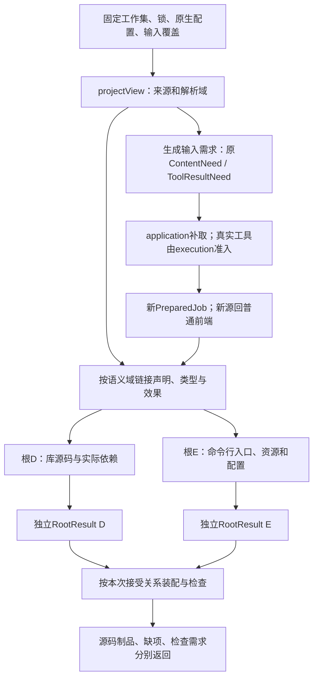
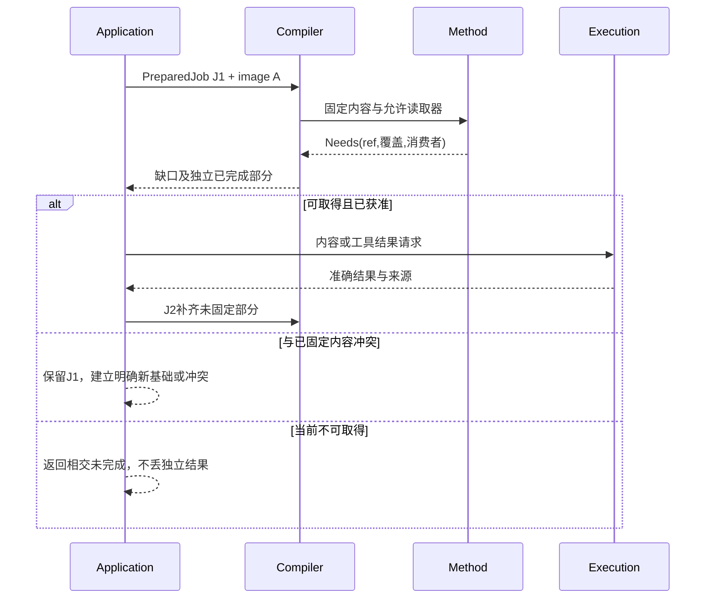

# 领域方法与整体根

> **阅读范围**：采用范围内的设计规范；实现状态另查未决 · [共同上下文](输入与阶段总览.md)。

<details>
<summary>本页内容</summary>

- [工程画像的选择、计划与降低](#工程画像的选择计划与降低)
- [编译内核怎样承担实现选择而不增加作者负担](#编译内核怎样承担实现选择而不增加作者负担)
- [编译分解与自主设计规划的不同输入](#编译分解与自主设计规划的不同输入)
- [复用成熟实现并把任务展示移出编译真相](#复用成熟实现并把任务展示移出编译真相)
- [全工程编译：按含义分图、按实际根闭合](#全工程编译按含义分图按实际根闭合)
- [领域方法的共同调用协议](#领域方法的共同调用协议)
- [状态领域方法的具体输入输出与目标闭合](#状态领域方法的具体输入输出与目标闭合)
- [关系领域的检查、计划和合法下推](#关系领域的检查计划和合法下推)
- [对象、流与微分的阶段方法](#对象流与微分的阶段方法)
- [按键取优定义的生成接合](#按键取优定义的生成接合)
- [有限并发、顺序流与微分的共同降低接合](#有限并发顺序流与微分的共同降低接合)

</details>


## 工程画像的选择、计划与降低

[`sec.transaction/1`](../../领域/状态关系与流/事务与交付.md)扩展基础声明，复用相同词法、表达式、类型和引用，不建立第二编译器。实现步骤为：先收集类型与四类声明；检查聚合键、事件、规则输入输出、受信上下文与阶段作用域；得到保留规则标签与先后含义的DecisionIR；将Operation映射到既有读集/前像/权限见证/变更/原子记录/结果结构；将Subscription映射到既有消息与外部调用合同。

目标选择先判断整个相交组合是否可实现。原子状态、审计和出站记录要有同一提交域；授权见证有相容的有效性；事件编码、订阅解码与顺序可共同成立。每个组件单独勾选可用，不证明组合合格。无法实现的原子要求不降低成无声Saga，未知权限不降成true，不存在端口不生成空函数。

降低后的目标规划包括公共输入/错误、纯业务函数、条件写入、事务内结果记录、模式或迁移候选、必要的Outbox与工作器、真实绑定及来源。仅选纯函数/decision输出时剪除未使用的运行需求。只读源码或计划阶段不执行数据库、联网解析权限或运行用户库；需要外部取证时采用原宿主准入。

生成器可以共享事务处理框架而不共享业务状态。重用同一段代码不合并两个聚合/部署/订阅的实例身份。稳定规则和事件槽参加迁移对应；文件名和私有变量只作目标布局。每个目标自身的异常、整数、文本、初始化与函数契约仍受原保持规则约束。

第一版可使用模块化单体和直接规则分派，不要求通用业务流程引擎、动态解释所有DSL或分布式调度。对规模扩大产生的查询/布局/缓存优化，应先保留正确全量基准，再依据实际成本换内部算法。语言架构不能因后端只支持一个存储品牌而向公共语义添加品牌case。


## 编译内核怎样承担实现选择而不增加作者负担

P0固定本次任务、作者源和实际资产，而不是要求所有输入是JSON。绑定阶段从SEC定义和端口合同得到实现选择槽；R/J协议在真实需要时选合格目标库与整条路线，普通已锁构建直接复用。用户显式选择轮子是可选约束，未选择时由当前授权策略决定，记录实际内容后交给降低阶段。

源检查同时读取对象的类型化控制和当前解释，验证对象合法、硬要求相容、当前目标可保持。控制改变行为时必须修改对应作者语义；仅安排布局时不得修改算法。目标生成消费已选结构，返回可核对的实际代码和其他产物。不能把控制描述符存在、Schema通过和目标真的实施这项控制混成同一状态。

文件处理不全都经过语言parser：源码交前端，配置和资源交合格格式/字节适配器，外部状态交宿主。各阶段输出的依赖与保持范围进入同一候选/Artifact，而非另建“资源工程”。实际外部编译、依赖下载或资产转换仍经过执行准入；纯计划不会因发现一个构建脚本自动运行它。

验证报告只为本次所请求的声明形成；纯预览无需构造运行证据图。缓存依赖、证明关系和恢复日志各有真实触发，遵守[最小证据载荷](../../运行/保证/要求证据与裁决.md#设计判断运行事实与最小证据载荷)。


## 编译分解与自主设计规划的不同输入

[目标与问题总览](../../状态/前沿与登记规则.md#目标到问题的总览)用于设计者选择下一份工作，不是编译一个函数前必须遍历的全产品模型。一次编译只沿实际作者根、绑定与目标求解；本次未用到的领域、问题和远程能力不进入编译键。

P0—P7的阶段结果可以映射成多个查询动作，不能把每个阶段机械实现为全工程栅栏。一个模块需要其他模块签名时等待签名槽，不等待无关后端全部完成。高层展开产生新动作时，先形成稳定输入与唯一结果拥有者，再加入同一调度域；不通过递归启动完整SEC进程来逃逸父预算。

作者源中递归函数保留递归调用边，有限函数体只在对应实例范围检查。模板/泛型不断产生不同实例时，需要有限特化、共享实现或明确未完成出口；查询去重只解决相同键重复工作，不能证明不断出现新键的展开结束。具体反例及处置由[调度规范](../递归并行与远程编译.md#5-同键共享等待环与并行死锁)拥有。


## 复用成熟实现并把任务展示移出编译真相

P0仍固定完整作者输入和真实读取闭包；不接受一个被压缩的任务摘要代替原源码。任务视图和editRef只在应用层降低成已有候选变化，P阶段消费同一语言/结构与检查结果。展示说明重新排版不改变语义键；被折叠的导入或默认变化仍按真实依赖使对应结果失效。

首个TS后端复用锁定API族的AST构造、打印和Program诊断；原生TS读取使用实际Host与语言服务能力。官方旧API路线当前只对应其已说明的6.0及以前API族，不能假定7.1可原样调用。公共核心用窄类型化适配结果，不直接泄露某版SourceFile对象。具体已安装版本在实施时读取，本设计不指定一个伪造安装事实。

SEC保留独立职责：中立语义检查、已选定义展开、任务/契约保持、目标AST的合法构造和实际产物归属。成熟打印器只打印它收到的结构，不会替错误降低补回被删除的分支。只有现有工具确实不能承担的接缝才自研；不重写JS类型检查器、JVM、通用包管理和数据库日志。

每阶段按[复用分配](../../运行/宿主生态与技术约束.md#成熟机制的实际复用分配)选现有能力，按[剩余验证](../../运行/保证/要求证据与裁决.md#成熟成果复用与剩余验证责任)得到本次补证范围。没有请求代码执行时停在准确生成结果，未取得的运行事实保持未取得；已经覆盖的上游内部义务不变成本次全套测试任务。


<a id="whole-project-compilation"></a>
## 全工程编译：按含义分图、按实际根闭合

### 同一编译器接多个项目，而不是把文件全部铺成一个模块

输入是已有PreparedJob及其[projectView](../../作者/工程源/清单模块与绑定锁.md#project-prepared-view)。输出继续使用CompileOutcome、逐模块结果、RootResult、ArtifactSet与Needs；不增加一个需要作者维护的BuildUnit语言，也不创建第二套构建平台。`compiler/root-plan.ts`只把这些已有输入分解为原QueryNode/ActionPlan和有类型前置。

P0—P7仍是共同编译阶段，W0—W6是它之前的输入准备，下面G0—G7只是**多模块多根下怎样调用这些阶段**，不是新的串行管道。当前基础算法允许整模块/相交分量重算，再按实际读集增量收缩；不要求首次实现就完成跨语言细粒度最优调度。

### 七类边分别参与什么判断

| 边 | 实际对象 | 需要的算法与禁止偷换 |
|---|---|---|
| 源拥有/定位 | 工程、源区域、模块出现、实际字节 | 形成唯一来源与捕获范围；不当成编译必须先完成的边 |
| 声明/类型引用 | 模块公开声明、类型参数、允许互引的类型 | 按所选语言完成头、类型约束与合法SCC；不是运行全部模块才能知道类型 |
| 效果与合同依赖 | 已解析调用、直接效果、边界/保持要求 | 进入原单调效果闭包和准确合同分析；未知外部效果不按空集合处理 |
| 严格结果前置 | 某阶段必须取得另一个阶段的实际结果 | 形成当前等待图；没有已定义求解语义的环返回真实路径，不用类型SCC放行 |
| 生成源/资源生产 | 已绑定工具/纯方法→其实际输出→普通解析或装配 | 先有结果才有消费键，新增源再经前端；不能以预期输出文件名代替实际内容 |
| 初始化/运行依赖 | 被选择目标的模块初始化、共享资源、入口寿命 | 用于合法性、目标排程和实际依赖交付；不是让编译器执行目标初始化 |
| 成员与组合义务 | 多根、配置、资源、许可证、共同公开入口 | 按原AND/OR和目标组合器决定完整性；不能把任何一个文件输出称为全工程完成 |

边可以在同一邻接存储里带种类，不要求七套数据库。检环必须保留边种类与实际前置，不能先抹平后仅返回“循环依赖”。同一对模块可能同时有类型互引、运行初始化与资产依赖，其处理结论可以不同。

<a id="fig-whole-project-compile"></a>
### 图：工程输入、共同分析与独立输出根

箭头表示实际结果依赖；D、E不是两个作者程序。声明分量内允许的环已经在H中求解，生成工具的严格前置另行判断。



### 多根下的具体计算过程

**G0 建根需求。** 固定当前请求要求的阶段及根引用。只读声明查询无需后端；源类型检查不要求可运行包；preview需要真实目标闭包；完整发行需要所有指定必需成员。默认目标只来自固定上下文，不取“当前机器恰好装了哪个后端”。按目标与布局组保留多个根，避免把两份独立目标配置合成一份。

**G1 建模块出现。** 从根所需模块开始，按ModuleUse及其resolutionDomain解析实际导入。将字节解析、导入绑定、类型与效果拆成原查询投影。只读某公开接口时允许使用合格的已绑定接口内容；要生成或维护实现时需要相应主体/方法，不能拿声明文件冒充实现。

**G2 处理语言级完整性。** 先完成必要声明种子与类型约束，再检查主体和关闭效果，最终封存可调用索引。整个模块是否合法由其语言规则决定：若语言要求整模块语法/声明有效，未选函数中的语法错误仍阻止这个模块；不能以根不可达就吞掉解析错误。另一个不依赖此模块的根可以继续。严格初始化环、布局不合法和未定义引用分别给原语言诊断，不统一改成“不支持递归”。

**G3 选择和展开。** 沿原resolveUse与实现搜索选择实际合格供给。目标无关前端可以共享；目标条件改变原生解析、数值范围、ABI或可观察表示时，建立相交目标查询而非覆盖共享分析。展开引入的新声明、调用、效果与资产回到原绑定/检查，未检查的新代码不能直接进入emit。

**G4 补取真实输入。** ContentNeed交已绑定解析器；ToolResultNeed交application/execution。生产输出必须带实际内容、成员、方法/输入关系和覆盖；只有文件名列表不形成源内容。成功结果进入新的固定准备态，再调用普通读取器与前端；工具返回错误保留上游源、已完成独立根和其真实失败，不删要求来隐藏缺项。

**G5 规划目标。** 对每个相交目标/布局组收集公开名称、类型、初始化、资源及依赖角色；先解决必须共同决定的布局/冲突，独立文件再打印。返回目标贡献而非直接写用户目录。既有原生源码如果就是该工程的唯一作者，则按深维护/保全合同加入目标或构建输入，不先反编译为.sec再生成一份竞争源码。

**G6 封存与聚合。** 共同组合器核必需成员与实际来源。一个库根完整而一个CLI根缺配置，可以交付库根及CLI缺项；请求原来要求二者共同可发行时，总声明仍未满足。CheckRecord继续与字节制品分离；目标类型检查与行为验证按明确请求发生，不能因生成器没有报错就签发它们。

**G7 结束与连续变化。** 返回逐根结果、最小可用诊断、已取得覆盖和合法继续位置；保留有用源及独立结果。下次修改重算相交解析域/分量/目标成员，未选择动作不启动。当前任务完成范围由原目的决定，不需要把所有未来语言、所有U问题或整个仓库每个文件都编译一遍才允许返回。

### 生成源的循环与引导有明确选择

`工具T需要先编译模块M`，而`M的声明来自T本轮尚未生成的文件`，这是严格前置环。它不是普通函数递归，也不因文件上次存在就自动被解决。当前选择如下：

- 若源范围已经明确包含**固定的、可读取的引导输入**，且生成器可由它独立构建，则本轮先使用该确切输入构建T，再生成新内容，随后用新内容重编译消费者。旧引导内容与新结果分别保留来源；只有实际比较满足本次要求才可说自洽。
- 若T由独立已绑定工具/旧合格制品提供，则把它作为精确外部输入，不要求先用本轮M再造T；更新工具是另一项有范围的变更。
- 两者都不存在，则返回包含M、T与缺少基础的前置路径。可以保存作者草稿及独立根，不能假造空头、任意读取未声明旧输出或无限重复运行生成器。

普通生成器无此环时直接执行原生产协议，不强制两阶段自举。确需自宿主固定点的工具使用[原自举合同](确定性与自举.md#编译器自举可信根与版本演进)，不把所有模板生成都升级成自举工程。

生成器如果根据目录集合决定输出，成员集合与相应不存在性也进入它的输入；仅记录已输出文件摘要会漏掉后来新增模板/源。读取了活动目录但不能固定它时，应明示捕获限制或形成新的准备态，不能沿用“精确固定构建”承诺。

### 原生构建与中立生成可以共存，但不能互相冒充

已具有完整原生构建入口的工程，由实际适配器解释其已支持配置和构建合同；SEC可以一次调用成熟构建器，而不强制把它的每个内部节点拆成自己的工作项。这个选择保留真实构建行为，也减少重复维护。

适配器已取得精确输入/输出闭包时，将其映到原ActionPlan；只具备“按此配置调用工具”的有限能力时，结果记录原生工具实际覆盖，未解析的内部图保持未知。它不能因此宣布SEC已支持精确局部重建、字节可复现或完全跨语言迁移。工具中的插件/脚本仍是真实作用，打开工程不自动运行它们。

原生入口依赖一个新生成的中立库时，先取得并固定该库的完整实际成员，再将其作为原生构建输入。不能让原生构建器自由读取一个会被watch继续覆盖的生成目录。反方向亦然：中立调用通过已绑定的原生公开接口和真实实现交付，不仅有一份看起来正确的类型声明。

### 按根诊断的实际结构

内部诊断关联`producer`、精确`subject`、`basis`、实际源/资产位置、原因、已知覆盖与`affectedRoots`。跨模块链只保存解释当前失败所需的有限见证路径，重复共同原因可以共享；完整依赖图通过原query按需查看，不把全图塞进每条报错。

“未捕获”“精确不存在”“语言非法”“当前不支持”“当前无权”“工具失败”“预算中止”保持不同原因。一个缺失源可能同时影响多个根，修复建议回该源或解析输入；不能给每个下游函数都生成一个需要用户分别修改的伪错误。一个目标失败不扩大成无关源也有错，所有根都成功也不证明未请求的部署和用户目的已经完成。


## 领域方法的共同调用协议

<a id="fig-need-input"></a>

### 图解：动态补输入不修改已固定内容

这是调用时序。Needs是数据需求，不是工具自由执行的命令；解释能力改变时新建准备代际，不热改旧实例。



本节定义最终成品怎样把语言、对象、计算、事务、资源和资产方法装进同一条编译链，而不是只列decode/check/lower几个名字。它复用已有Definition、Binding、QueryKey、SourceMap和Artifact角色；不新增作者IR、业务关键词、公开工具或可随意执行的插件字典。实际装配由[EngineImage](../../架构/装配/源绑定与解释映像.md#engineimage解释装配和更新协议)固定。

### M0：方法合同和装配前检查

每个实际方法以精确内容引用和方法ID确定。进程内采用有类型接口；跨进程或长期缓存才编码，编码合同不能扩大语义。MethodSpec至少说明下列相交数据；不需要的能力不登记假实现。

| 字段/责任 | 确切意义 | 检查与缺省 |
|---|---|---|
| interfaceRef、methodRef | 提供哪一种共同能力，具体方法属于哪个版本内容 | 同名不同内容不覆盖；未知接口不调用 |
| subjects | 能处理的语言/领域种类与版本范围 | 限定实际支持构造，不能只写any |
| phase | decode、headers、check、summary、expand、lower、emit、edit或migrate | 按阶段输入合同；顺序不是任意插件列表 |
| inputContract、outputContract | 类型、归属、有效前态和返回关系 | 注册形状合格不等于输出已经语义正确 |
| reads | 能通过上下文读哪些固定内容/摘要；运行时记录实际读集 | 声明允许读不等于本次已读，不能把全目录都作为依赖；若方法实际查询一个候选集合，其成员范围与目录修订也记入 |
| resultScope | 本次获分配的目标区域、源增量或产物命名范围 | 不得修改兄弟输入、公共头或他人产物 |
| executionClass | fixed-pure或external-tool-result | 纯方法不拿宿主I/O；外部结果走execution |
| properties | 确定性范围、分析保持条件、可中断边界与预算口径 | 无证明不宣称全等/完备/恒定内存；预算不足有明确结果 |
| dependencies | 所需类型定义、接口方法和工具族 | 在装配时固定，运行时缺输入以Needs返回 |
| diagnostics | 真实源/资产位置、责任、严重性和已处理范围 | 公共状态不从任意自由文本推断 |

构造MethodSpec由扩展作者或工具适配维护，普通SEC使用者不填写。基础函数、新算法和普通库定义不需要成为新的MethodSpec；只要可由已有语义表达，直接编译其作者源。

### M1：三个返回分支而非一个万能success

```text
MethodOutcome<T> =
  Done {
    value: T,
    actualReads,
    diagnostics,
    introducedContent,
    preservedAnalyses
  }
  | Needs {
      requests: NonEmptyList<ContentNeed | ToolResultNeed>,
      completedIndependentResults,
      diagnostics
    }
  | Stopped {
      cause: invalid-input | unsupported | cancelled | budget | tool-fault,
      diagnostics,
      completedIndependentResults
    }
```

`Done`表示本方法按其合同返回了数据，不直接表示整个工程通过验证。check方法的value可以包含源错误；expand方法的value可以是仍须复核的新区域。`preservedAnalyses`逐项指向被保持的既有方法结果及保持条件；消费者验证实际输入关系，不允许仅用布尔true延续旧资格。

`introducedContent`记录新增定义、区域、导入、资产及其真实来源关系。新内容会改变闭包，先检查归属、引用、类型和效果，再作为后续合法输入。纯包装器不能签发尚未运行的检查记录，也不能令生成依赖假称已安装。

### M2：Needs准确说明谁应当取得什么

`ContentNeed`字段为：本次basisRef、role、consumerRefs、精确contentRef或已绑定resolver下的resolutionRequest、所需覆盖。role区分作者模块、库接口、语言定义、目标声明、资产或已有布局，不能只给一个任意URL让核心自行下载。

`ToolResultNeed`字段为：本次basisRef、consumerRefs、toolContractRef、固定inputRefs、受类型约束的配置、所需输出形状与覆盖。它描述一个已知工具调用的结果，不包含任意shell字符串的执行指令。需要真实命令行时由已装配adapter从已验证配置构造，execution检查范围后运行。

取得后输入结果为found/exact-absent/denied/unavailable/failed中的真实分支，分别带准确来源与范围。相同name在不同根/版本/语言解析域不是同一请求。两个consumer需要不同版本，可以取得两份并按其包规则使用；不能由于字符串相同强合为一个content。

若ContentNeed取得的新内容需要另一个解释接口，compiler不就地注册方法。application将该需要交bootstrap，经原任务允许的解析与兼容检查产生新EngineImage和PreparedJob后继。旧纯结果仅按实际不变依赖复用；新的外部工具必须另经execution。不存在合格方法时保留明确不支持，不能通过热改全局表伪称一个固定调用完成。

### M3：实际调用序列

1. compiler根据当前节点与阶段查固定image中的接口，核所选方法支持该对象。缺可选summary时可采用已定义的保守规则；没有足够条件的优化保持不执行；缺必须lower则该根不支持，不能输出空目标。
2. 为该调用创建局部result builder、只读输入访问器、实际读集记录器和预算份额。共享内容仍有当前读取范围，方法不获得完整工程的自由访问。
3. 纯方法直接执行；实际外部方法先返回ToolResultNeed。application按照作用目的准备execution，不在编译器内藏一个可随意读cwd或联网的callback。
4. Done返回后检查输出种类、引用归属、作用范围和introducedContent。新增中立节点补绑定/类型/效果；目标区域检查合法性。违反合同归方法实现错误，不改作者要求使其“匹配”。
5. 先安装真实依赖和新区域，再决定哪些分析可保留。无变化时允许复用，改变实际规则或来源时按消费者失效；只比较输出值不够。
6. 返回Needs时保存可独立使用的完整结果，application处理准确缺口并形成PreparedJob后继。相同需求连续未带来任何新事实时结束为相应缺项，不无限重调。
7. 方法失败或中止只丢弃未发布builder。已独立完整的结果按原根关系保留；运行中的外部任务必须等实际停止或责任转交，不因栈展开就释放它的输入。

### M4：静态阶段、运行阶段和适配的三个边界

decode/headers/check不能执行目标函数“试试看它是什么类型”。静态求值只在语言明确允许的子域内执行，预算和失败沿其合同。数据流循环、状态反馈、函数递归分别检查，不由通用PassManager选一个任意遍历顺序解释。

expand与lower只能改变获分配的候选区域。它们可以要求新依赖，但不能凭自己的输出修改发布目录或登记当前权限。需要多领域共同控制一个公共导出时，返回贡献交给共同组合器；局部lower不直接写同一最终文件。

edit/migrate产生作者或格式变化计划，仍受实际base和写权迁移合同；它们不是绕过fork/apply的特殊入口。一个包只有读取和生成能力，没有可靠edit方法，仍可有合格产物，但不能宣称任意逆向修改支持。

### M5：整体生成贡献的汇合

领域生成贡献复用既有ArtifactPlan/LoweringResult角色，必须给出：当前root、所需输入、提供的公开符号/资源、每项输出的逻辑身份与候选路径、初始化与运行依赖、残余义务及来源映射。没有运行依赖就空集合，不填空服务。

共同汇合先检查：请求根的AND/OR关系、输出身份、路径规范化与重叠、公开符号、相同资源实例和版本，以及跨域契约。两个贡献输出同一路径的相同字节，仍需要明确同一生产归属或合并合同；两个不同合同不能通过碰巧同值取得永久共享资格。

有序配置、模板区域与CSS等由对应格式组合器处理；普通文本拼接不是通用组合算法。源、资源、许可证和必要配置形成完整成员以后封存产物根。后续检查追加到EvidenceStore；产物的内容身份不包含不断变化的通过/失败状态。

一个算法源码根可以已经产生，完整应用包因为图标缺失尚未产生。它们分别返回，不给缺资源的包换上已生成算法的状态。新生成的源码作为另一编译输入时，也要有真实来源/解释和阶段边界，不能绕过普通前端检查。

### M6：可独立重现的接缝反例

| 输入/扰动 | 预期 |
|---|---|
| check方法返回类型合法，lower新增一个网络调用 | 新效果和依赖补查；离线硬要求下拒绝该实现，不删原要求 |
| 方法试图修改只读兄弟区域或同一全局Map | 接口与隔离阻止；发现实际越界则隔离方法结果并限制后续使用 |
| 装配A期间发生库升级B | 该请求继续A；新请求可用B；A产生的结果不能贴B的方法身份 |
| ContentNeed先确认某版本缺失，后来同version出现内容 | 结果范围发生冲突，不在原basis原地覆盖；另取合法新基础 |
| 缺生成器，但已有合法结构读取器 | 读取/保全可完成；生成根准确不支持 |
| 缺优化分析但基础降低有定义 | 保持未优化正确路径，不强制全域证明服务器 |
| 两个领域贡献争文件或公共名 | 采用既有明确选择/组合器；没有时报告真实冲突 |
| 上游方法崩溃，工作者留下半份成员 | 未封存成员不发布完整ArtifactSet；作者和其他合格根保持 |

该协议给通用框架一个可实施边界，同时保留领域真正的算法。MLIR接口允许通用变换读取领域提供的语义，而Pass管理限制共享可变状态及分析失效；这些是机制依据，不是SEC自身方法的正确性证明。参见[Interfaces](https://mlir.llvm.org/docs/Interfaces/)与[PassManagement](https://mlir.llvm.org/docs/PassManagement/)。


## 状态领域方法的具体输入输出与目标闭合

本次领域不是新编译器。按[共同M0—M6合同](#领域方法的共同调用协议)装载`sec.statechart/1`实际方法；没有状态输出根不加载它。下表是实现责任而非新增公开工具。

| 方法阶段 | 实际输入 | 当前输出/处理 |
|---|---|---|
| headers/check | 精确普通库模型或statechart-body、回调与类型 | 固定树/顺序/初态/历史/目标、诊断；guard/action继续原类型和效果检查 |
| expand-model | 固定工厂符号、实参、语言/库与预算 | 有限ChartModel或MODEL_NOT_STATIC/预算缺项；不eval宿主代码 |
| summary | 模型、回调和实际活动/输出绑定 | 输入域、稳定状态、未来能力需求、终止条件和真实依赖；纯计划不被当无作用应用 |
| lower | 合法模型、目标及布局/资源合同 | 表/调度代码、回调区域、必要运行依赖和来源；新增区域再次检查 |
| emit | 合法目标表示及根成员 | 普通目标源码；有活动才加driver适配，有持久要求才加存储配置 |
| edit/migrate | 作者或运行快照基础、准确变化与目标模型 | 作者候选或实例迁移计划；实际实例切换仍需宿主准入 |

纯模型工厂可以先从精确绑定的有限构造解释开始，普通运行函数仍正常编译。不可静态确定的拓扑不能假造空模型；有权允许动态模型时选择相应运行库，否则只限制静态图输出。原StaticExpr语法不扩大。

运行解释器与编译期解释器分开：前者按H0—H6处理业务事件，后者产生有限模型与目标代码。两者不能混用当前权限或线程池。宏步循环的运行预算不是生成期查询结束的依据；源图正交也不要求编译器为每个状态启动进程。


## 关系领域的检查、计划和合法下推

[关系规范](../../领域/状态关系与流/关系查询与维护.md)给出有限公开库、Q0—Q7和实现方法表。P1/P2只解析普通作者与真实库符号；P3推导ValueOps并检查字段/回调、Bag/Ordered边界和缺失层次；P4识别合格调用形成RelPlan，保留捕获、作者顺序与来源；选型检查总定义与安全屏障，之后lower贡献普通目标代码或参数化SQL。

已绑定的库名不按字符串识别；解析源码不运行数据库；运行参数未知不阻止生成。纯但可能出错的回调不能无条件进入数据库优化区。SQL布尔、NULL、ALL、空聚合与目标Text/Int分别检查，任何一种不匹配都应限制该下推而不是污染中立模型。需要本地残留时，真实数据转移同样必须满足任务与许可。

新展开的调用、codec和源输入进入真实读集并重新接受相交检查。编译结果是产物而非查询完成；目标ViewState是运行对象，不进入作者候选或所有CompilerQuery。无数据库的资产统计生成普通集合、精确整数和排序辅助即可。


## 对象、流与微分的阶段方法

| 方法 | 输入、计算与输出 | 重新检查及失败 |
|---|---|---|
| checkObject | 模块成员、父链、接口、方法体 → 槽表、构造计划、效果与诊断 | 继承环、构造逸出、读前未写和覆盖不相容定位到源 |
| lowerObject | 已检查对象及目标控制 → 布局、构造、分派代码与依赖 | 真实反射/继承要求不能满足则该目标缺项，不打印同名壳 |
| checkStream / planStream | 流构造与回调、源能力、容量和时间要求 → 有序计划 | 无限输出、无界内存或未知源进展不伪装已满足 |
| lowerStream | 合格计划 → 普通循环/异步入口、必要队列与driver | 不改变错误次序、信用、迟到与End规则 |
| qualifyDerivative | 真实函数、空间、规则、模式与数值域 → 活动区和资格 | 原值成功、路径线性化与数学导数分开 |
| differentiate / lowerAd | 合格区域 → JVP/VJP、残余计划与目标 | 新导数节点重新类型/效果检查，缺规则与资源分别返回 |

所有方法通过现行MethodSpec装配。对象扩展由明确语言画像选择；流和AD沿普通库与领域方法识别，不运行任意作者脚本以猜构造。优化器在构造安全、流时间下界、回调定义域和导数数值政策这些前提内工作；原已检查标签不能直接覆盖新插入的节点。


## 按键取优定义的生成接合

`sec/seq.maxByKey`的值域、求值、结果和算法由[库合同](../../作者/组合/模块封装与复用库.md#有限可复用合同按键取极值并保留来源次序)拥有。编译器识别准确绑定后可保持普通主体，或调用其已有MethodSpec生成私有字典/顺序扫描；不为一个新库函数扩展全局表达式联合，也不要求调用方提供生成模板。

选择方法时检查有限序列、键/排名/平局以及输入前后处理的实际合同。rank与key的回调只有空效果并不足以允许任意重算、调序或提前执行；没有适用保持依据就沿参照调用次数和顺序。最终输出按胜出元素的原位置，不沿键首次出现顺序或字典迭代顺序。原普通程序的自动替换还需要它与该新合同的相容依据，不能看见`hasHigher`名字就重写。只有记录字段读取和精确整数比较的当前范本可直接按相同正常关系校准，资源条件另计。


<a id="completion-aware-lowering"></a>
## 有限并发、顺序流与微分的共同降低接合

下面是原P0—P7内的具体扩展义务，不增加总编译阶段或新的任务服务器。作者源仍使用已有模块、调用、类型与方法选择；只在所选定义确实含相交行为时建立相应运行计划。接口返回类型、失败阶段、结果拥有和停止合同属于被降低语义，不能只保留正常结果公式。

| 相交能力 | 语义检查的精确输入与计划 | 降低、运行与优化义务 | 能力不满足时 |
|---|---|---|---|
| 有限任务域 | 捕获/Own/Borrow/线程亲和性，组合拥有集合，结果可复制性，all/collect/race明确政策，退出与清理依赖 | start之前形成可接回调的登记；await只消费既有任务；退出生成关闭/等待/一次领取或清理路径；禁止把借用帧提前释放 | 可以选择串行或单事件循环的合格方法；不能用裸Promise.all、drop或隐形detach冒充结构保证 |
| 有序流 | 数据ordinal、控制cut、并发/缓冲边界、失败政策、信用与TimeRule | 纯回调可并行但提交按连续前缀；融合须保留普通错误和水位/End顺序；同步回调使用有限排空而非无界递归 | c=1仍可符合；无时间保持依据则有限End结算或准确未最终化，不伪造frontier |
| JVP/VJP | 所选原计算、seed/Space、活动性、规则和数值画像、残余拥有 | 原值与导数故障通道分开；检查和向量化不吞原故障；tape/设备同步/检查点保留真实预算与停点 | 使用可保持语义的较小规则实现或给缺项；黑盒先抛导数错误不自动视为符合 |

检查产生的计划必须把策略和规则修订纳入其方法/画像身份。缓存一个不同故障策略的结果不能仅因输入和数学表达式相同就命中；可复用的原始解析与不受影响纯子结果仍按原查询图共享。并发c及预算改变的是具体执行策略和可完成范围；它们不允许把超预算改成业务Fault。运行记录保存实际被选计划与实际范围，不把设计算例当编译证据。

主动丢弃不可观察且已证明无失败/不终止差异的纯中间值仍可优化；没有证明时保留原计算次序。信息查询的页归并和外部作用RetryBasis属于application/execution，不塞进作者CoreIR；编译器只处理目标程序真的调用的对应方法及效果，不因为开发控制面也有“任务”就混成同一个任务图。

各自的唯一算法见[任务域](../../领域/计算基础/通用计算与任务语义.md#structured-task-lifecycle)、[有序流](../../领域/状态关系与流/背压与事件时间.md#ordered-stream-control)与[微分错误](../../领域/数值/自动微分与线性化.md#ad-fault-precedence)。

## 供给子域与跨实现数据

原P0—P7对结构需求或原生调用均消费相交的[条件方法计划](../有条件实现与公共行为保持.md)。类型或能力已证明的条件可以消去；运行值条件在一次实参求值后检查；guard与所有可达方法的真实输入进入失效键，不能降低时重新按名字选择。

跨实现的数值/字符串/布局/范围、别名和资源由[调用合同](../../运行/跨实现调用与数据寿命.md)处理。只有输出类型相同不足以省略转换；强范围检查先用精确或检查溢出的算术，再构造窄原生表示。调用/回调/释放的代码与数据责任必须产生实际消费点，不以新增一个安全标签代替。更简单的同语言直接调用可消除无真实差额的包装。
