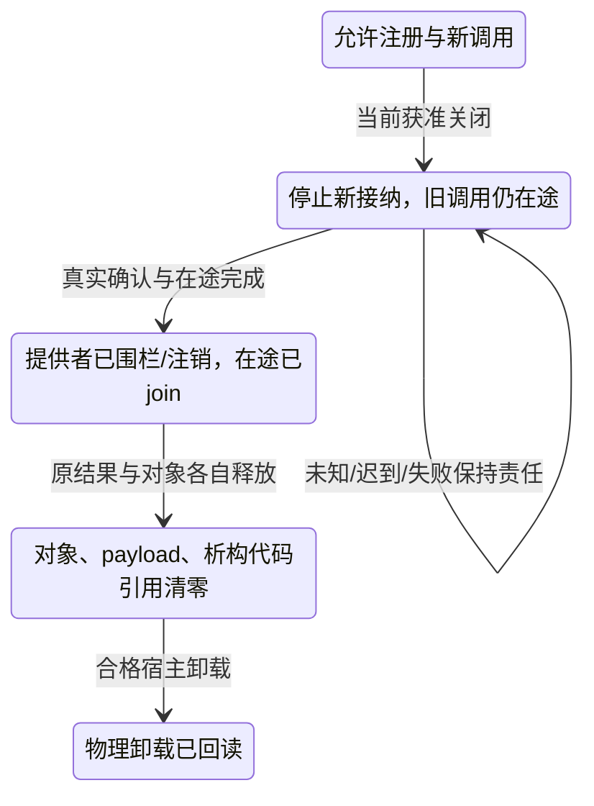

# 外部调用、原子访问与目标供给

本篇拥有[原生编译](../内核/原生与跨语言编译.md)与[使用点采用](采用与导出边界.md)在ABI、回调、原子和真实目标上的映射差额。调用寿命、权限、结算与发布继续消费原运行规范，不建立通用foreign消息隧道或第二原子模型。主要来源为R02、R20—R22、R25、R28—R29、R32，L05—L07，I01—I03及T03，详见[资料](../../依据/来源/Rust与C++映射依据.md)。

## 固定实际外部合同

FFI声明至少在真实使用边界绑定工具/ABI画像、符号及调用约定、参数/返回表示、拥有/借用/释放者、null/有效值、对齐和存活范围、可重入性、线程/同步、回调、错误及异常传播。能够由原声明和工具准确推导的内容不再让作者手抄；未知部分不能用extern或unsafe一笔放行。

ABI画像包含实际目标、编译器/运行库及相关选项、类型布局、异常/RTTI域、链接和动态装载关系。源声明、接口元数据、真实库字节、当前加载实例和当前授权分别固定。路径、PID或一个同名symbol不能代替出生身份；加载一个库也不能把它自报的capability当真实权限。

| 定位与需求 | Rust已有路线及剩余差额 | 当前采用及验收 |
|---|---|---|
| A56 定义C variadic函数 | stable可声明/调用相应C变参入口；需要定义真实ellipsis入口时按c_variadic实际稳定性或native shim判断 | Rust slice/tuple、宏和JS rest不是C ABI入口。纯stable Rust-only与指定ellipsis导出同时固定、且没有合格入口时报告缺项，不隐藏C编译成员 |
| A58 C++ ABI与生态 | CXX等受限bridge、C shim、生成绑定和保留原生模块可复用实际库；成熟前端拥有源语义 | 桥接支持子集不等于Rust直接定义任意C++类/模板/RTTI/异常ABI。真实依赖、工具链、发布成员和源保全明确；禁止native依赖的画像下不能暗中例外 |
| A59 泛型Atomic<T> | 独立atomic库、合格原生原语和明确锁模拟可以覆盖部分值；具体std原子类型与受限generic_atomic并非任意T | 按实际有效值、padding、大小/对齐与进展契约选择。C++std::atomic<T>也有类型和实现限制；拥有资源/任意析构对象不自动可原子复制，缺原语不默认降成锁 |
| A60 atomic_ref/原子视图 | 具体原子类型的from_ptr、唯一借用下的from_mut及相关slice API已提供真实路线；不能说Rust没有原子视图 | 对齐、全访问者同步、生命周期和目标支持逐项核对，不等于任意外部存储/类型可安全共享。活跃原子视图不能与冲突普通写混用，本地租约不能约束未知外部进程 |

R02在1.98列出的可变借用/切片接口不应被误写成“stable已经支持任意用户结构的std::Atomic<T>”。当前具体AtomicBool/AtomicU32等公共入口与generic_atomic item的nightly标记分别解释。源页面本身列出一个方法，不证明该方法在任意对齐和目标上都可用。

## 原生对象、异常与C变参

可以由匹配的C++前端先获得具体签名、布局、选中调用和实例，生成已绑定的普通Rust调用；不要让每个后端重复实现ADL、SFINAE和类布局。实际C++对象由其原生创建/销毁/调整/RTTI供给拥有，Rust侧使用合格opaque句柄和真实借用。需要完整源或无原生依赖时单独判断，不能把opaque保全称作已恢复全部源意图。

C shim和bridge有独立成本：构建工具、语言运行库、异常转译、复制、间接调用、调试映射与分发成员。无差额直接调用，不强加同义facade；真实差额则不能省略适配。调用者不应因缺SEC同名实现而重写成熟库；供给缺失也不能把一个函数名当成实现成功。

变参入口固定默认参数提升、实际目标寄存器/栈约定、参数解释/数量来源、va_list的合法复制与结束。float等提升按相应C ABI，不能将任意字节序列猜成参数，也不能无协议推断参数数目；va_list不是可随意memcpy或跨线程保存的通用数组。未匹配原生入口就返回准确不支持，允许shim时将其作为真实依赖构建和验证。

错误跨边界先确定允许的unwind域。Rust panic、C++异常、Result和TS throw有不同协议；`extern "C-unwind"`允许的传播不代表catch_unwind提供C++类型化catch。R22说明捕获foreign异常可能终止或得到opaque Err，不能借该接口保证某个确定typed错误；panic=abort也不被catch_unwind捕获。需要稳定错误交接时在实际能安全处理的原生侧截获并转译，且原公开合同允许这项变化。

清理再次失败不能丢失首因。异常/错误payload可能持有原库中的析构器或vtable，必须继续保护其代码世代；分配和释放还核allocator/CRT归属，不把跨ABI大小相同当成可相互delete。安全包装必须保持真实不变量，AssertUnwindSafe或类型强转只是声明，不是独立证明。

## 回调、注册与动态卸载

回调既可能同步重入，也可能在任意允许线程和原调用返回后发生。注册前固定捕获拥有/借用、调用域、线程、允许作用、错误边界和有效世代；把函数指针交出去已经建立未来访问责任，不能在注册函数返回后立即释放捕获。

注销分开停止新接纳、提供者确认、在途调用join、释放捕获与退役代码。仅在本地把registered=false、超时或连接关闭，不证明提供者不会再调用。迟到回调必须经有效引用/句柄和generation拒绝；检查generation前就解引用已释放context不是安全方案。不能取得真实停止/围栏时保留原占用或转交未结算责任，不假报关闭。

动态库只在全部相交函数、回调、帧、对象vtable、异常payload、析构器和释放函数不再可能使用时卸载。相同文件名换版也形成新模块世代；新旧类型大小一致不代表旧对象可交新destructor。热替换选择独立新实例、合法状态迁移或保留旧库直至耗尽；回退还要看新作用/数据是否仍可由旧版本解释。目录删除或代码摘要变化不等于物理卸载已完成。

这是原[调用寿命](../../运行/跨实现调用与数据寿命.md)在foreign边界的消费，不给普通同步纯函数增加持久注销日志。

## 原子值、视图与内存模型

原子方法的实际值域不能含未初始化padding、无效bit-pattern或无法合法复制的拥有资源。指针值还保留其provenance和存活条件；把它转换为同宽整数再转换回来是否成立由真实内存模型决定。C++trivially-copyable、Rust库的NoUninit/其他约束、某条硬件指令的位宽支持是不同条件，不能互相代替。

先固定需要的load/store/RMW/CAS集合、比较规则、成功/失败memory order、对齐和进展，再选择硬件、合格库或显式锁路线。CAS可能按表示而非用户`==`比较；NaN、padding和多重表示需明确。失败memory order与成功order各有合法约束，不能随便拷贝同一值。更强顺序不是普遍免费替换，仍核原允许行为、成本、进展和跨语言协议。

atomic保证不被错误撕裂不等于整个算法lock-free，更不等于每个参与者wait-free或墙钟有界。操作无锁也不证明malloc、析构、回收、回调和整个数据结构都无阻塞；公共算法所求范围必须覆盖实际调用链。目标缺复合原子宽度但库能用mutex模拟时，只在原合同允许阻塞与对应共享域时选用，不凭“值最后一样”放行。

原子视图建立前确认存储寿命、对齐、所有潜在访问者及协议。由`&mut T`建立的具体原子视图以唯一借用为前提；不意味着其他未受控alias不存在。原子与非原子可以按语言允许的互斥时间段切换，但并发冲突访问不被本地类型包装合法化。Rust/C++/外部进程共同访问同一存储时，逐项核布局、原语和共享内存协议，不能仅凭同宽原子类型认定ABI一致。

ABA、内存回收和结构不变量独立。CAS成功只能证明该原子比较/写入条件，不证明所指节点仍存活；地址复用要用合格epoch/hazard/引用管理等实际协议处理，并保留读者在途关系。引用计数的内存顺序及最后释放也是算法一部分，不能从“有计数”得出所有跨线程析构安全。

wait/notify要在真实谓词循环和既有原子协议中使用，唤醒不等于条件为真。库的timeout、目标支持和进展边界不超出实际接口。线程内原子、进程共享原子和崩溃后耐久分别判断；进程内锁回退可能无法服务外部进程，原子写入也不自动flush持久存储。JS Atomics限于宿主支持的共享存储类型，Promise或普通对象赋值不是内存屏障。

## X10 目标、SDK与合格工具链

语言计算表达能力不创造芯片、GPU SDK、驱动接口、调试器、操作系统服务或经过许可的工具链。Rust目标分级和厂商C/C++供给是按实际版本/配置核查的外部事实；不对未调查的芯片/资质宣称不支持，也不从另一个目标支持推断本目标可用。

现成原生内核可由Rust/TS协调调用，这是一条诚实的混合路线，不等于纯Rust/纯TS编写了同一内核。框架构建、依赖、分发、设备权限、初始化、停止和回读都属于所选目标的真实成员闭包；相关缺项只阻断依赖该目标的根。

编译器缺陷、目标支持撤销或运行库ABI变化会使相交保证重评，而不抹掉其他已成立成果。R01的Rust 1.98.1修复特定vtable生成问题，说明实际版本是供给输入；不能把语言规范正确或一次编译退出0当成工具版本无缺陷证明，也不能据一项缺陷推断整个语言不可用。

## X11 标准库之外的工程可用性

成熟crate/系统API能够满足的wait/wake、allocator、SIMD或原子访问不应为标准库名称对称重写。需要核依赖政策、许可、支持平台、no_std/操作系统需求、类型与ABI、同步与timeout范围及维护成本。库存在不是所有项目都可采用；不允许该依赖且没有合格替代时就是准确供给缺项，不用不受许可的封装隐藏它。

## TypeScript与不可信原生调用者

TS类型擦除后，公开给任意JS的消费式值、一次性callable、关闭状态和借约不能只靠静态标注。完全受管且已证明的内部调用可以消去冗余检查；公开边界需要真正的数据解码、复制或受保护句柄/私有状态，拒绝关闭后再用、重入竞争和跨await过期借用。无需为每个普通对象都建全局句柄表。

任意JS对象的getter、proxy、toString、迭代器或thenable可能运行用户代码；判断/遍历它本身也可能有作用。纯数据入口优先消费已固定、有限且有明确编码的字节/值，实际解码不执行用户回调；普通对象观察走已声明foreign效果域，不能先偷偷执行再标纯。`as T`、readonly、属性名称和schema字符串都不产生真实所有权或宿主权限。

JS包装、Rust品牌与语言private不能隔离恶意同进程原生模块。确有不可信代码时使用真实进程、Wasm或所选宿主隔离能力，并核它实际提供的权限/资源/停止保证；选Wasm或native模块就明确构建和运行依赖，不把隔离等同于推理健全、无泄漏或全部系统调用能力。

## 再次修改与相交验收

foreign签名、布局、allocator、异常域、回调线程、原子表示/顺序、回收、工具链或部署画像改变时，重核准确绑定、成员、模型和证据。旧运行实例及未注销回调继续原协议，不因新schema或新文件名复活权限。失败的独立原生根不清空已经合格的纯函数/TS根；共同发行需求仍按整体条件返回未完成。

关键验收为V27—V29、V31、V35—V40及两类正常路径：合格C++库经明确桥接可调用并安全关闭；无需原生ABI的普通数据通过现成Rust/TS接口直接完成。负例包括“pure stable Rust-only却偷偷加C变参shim”“mutex冒充lock-free”“本地AtomicView覆盖未知外部写者”“catch_unwind承诺确定C++typed catch”“旧payload仍活却卸载”“只有限展开却承诺任意下游类型”和“未知原生源被标无损回写”。实际实现和运行证据仍按原[验收](../../运行/验收/原生映射与组合.md)取得。
