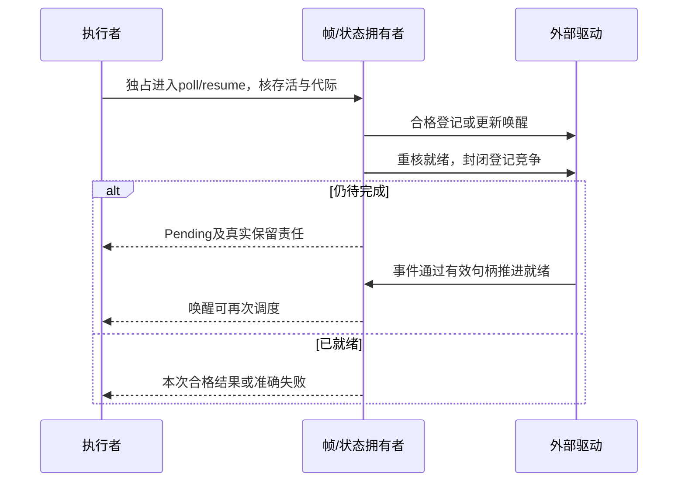

# 数值、失败与可恢复控制流映射

本篇细化[采用边界](采用与导出边界.md)中真实数值观察、错误和可恢复控制流。原领域数值、函数效果、任务和资源合同继续拥有含义；这里规定目标路线何时足够、何时有不可隐藏的差额。不因为C++有某拼写就默认建设全数值体系、通用异常语言或多次恢复续体。来源键见[映射资料](../../依据/来源/Rust与C++映射依据.md)。

## 数值语义与目标格式

数学整数、有界整数、固定浮点格式、目标long double以及软件高精度是不同对象。只在本任务需要的范围固定精度/指数域、舍入、溢出、下溢、NaN、signed zero、subnormal、异常标记和转换；普通程序不配置全部浮点状态。运行与常量求值使用相同被声明的目标含义，不能按构建机类型或库默认值偶然改变。

存储16字节不证明有效精度128位，long double也不统一代表binary128。软件计算可满足数学精度，不自动满足原生参数/返回ABI、目标指令、异常环境、内联和成本。序列化再转换、FFI复制和设备格式分别核对。硬要求缺供给时返回相交不支持，其他普通计算继续。

| 定位与需求 | 已有Rust路线与差额 | 当前采用及验收 |
|---|---|---|
| A53 long double/扩展浮点 | 高精度软件、架构intrinsic/汇编或外部数值内核；原生f128的状态逐item核验 | 指定x87扩展、double-double、binary128及其ABI不能互换。无精确原生要求时复用合格软件即可；有严格格式/成本/异常要求则取得实际供给，不降成f64 |
| A54 类型化栈展开异常 | Result/?适合普通可失败调用；panic_any/catch_unwind是panic协议，匹配FFI域可转译 | Result改变传播签名和控制流；固定回调、C++catch层级、原生unwind或正常路径成本不能称无损。新代码默认显式错误，精确外部展开只在合格域内适配 |
| A55 通用可定制协程 | Iterator、Future、明确状态机、宏/库覆盖常见生成与异步 | 一般resume/yield参数、帧布局、跨挂起借用与调度仍可能要求不同协议；不是所有场景缺能力，也不是稳定原生通用Coroutine已完备。先复用成熟接口，确有差额再选择有限状态机 |
| A57 goto/任意函数内CFG | loop/break/continue/match和CFG结构化可实现算法 | 不可约CFG、dispatch形状或栈/速度硬要求仍需目标证据。高层不必暴露goto；合法跳转保留初始化、清理和效果，不能赌优化器一定消除额外分派 |
| A63 portable SIMD | 稳定架构intrinsics、实际SIMD库和自动向量化；统一std::simd接口及特性状态单列 | 不再说Rust没有SIMD。固定ISA、mask、精度、归约顺序和依赖政策分别核对；自动向量化不保证特定指令，硬性向量要求不准偷偷标量回退 |
| A64 语言级contracts | assert、验证构造器、类型状态、宏、测试或外部验证器可承担实际要求 | C++contracts也不是通用refinement证明器；原生语法/模式/诊断兼容是独立需求。安全检查不能无证明关闭，是否新增公开契约语法按真正作者负担决定 |

A53—A64的事实范围见R21—R23、R27—R31、R33—R34、C09—C11、T01—T04及I03；GNU扩展、标准提案、nightly方向、稳定API和可运行供给分别记录，不作为同一“支持”层级。

### X01 动态浮点环境

R30所读取的Rust x86 MXCSR文档明确限制改变编译器假定为默认的masking、rounding及denormals-are-zero状态；改变后再恢复、源码之间看不到浮点运算，也不能排除编译器重排。该页面本次返回的版本标记为1.97.1，不能凭stable地址声称已逐字取得1.98.1同页；所选后续工具仍核其实际保证。

需要特殊环境时，采用所有相交运算均在合格隔离范围内、退出前恢复原状态的内核，或使用显式软件定向舍入。对应Rust文档给出单个汇编块内运算并恢复的路线；隔离内部不能回调到假定默认环境的普通代码。C++/Clang也要选实际支持动态环境的严格选项，默认优化不能代签。真实线程状态、编译器重排、异常/退出、调用边界和目标ABI均进入证据。

读取/清除异常标记与改变mask/舍入控制不是同一操作。即使寄存器能读，也不能据此把某一标记精确归因到源码附近的表达式；要由选定严格执行范围建立关联。特殊环境方法失败不能污染后续任务的环境，恢复责任不能用“线程最后会退出”代替。

### X02 快速代数浮点

Rust 1.98增加f32/f64 algebraic_*操作，允许其声明范围内的代数优化；结果可以因优化选择变化，但这些方法本身不引入未定义行为。它们不是全部编译器fast-math开关，更不是授权任意改变动态FP环境。[R02]

当前采用按操作/区域绑定允许的重排、融合、特殊值、误差和复现范围；普通严格部分保持原合同。明确接受了某种数值自由，才可选择对应方法；不能从“追求最快”推导NaN、signed zero、subnormal或确定性要求全部撤销。优化方法与原值、导数、统计或概率方法组合时还核同一数值域，不把相同f64签名当理论一致。

## SIMD与代码生成控制

向量宽度、lane类型、mask、shuffle、gather/scatter、内存对齐/有效范围与归约关系分别固定。inactive lane是否允许求值、触发异常或访问内存由所选操作合同决定，不能先无条件访问再mask结果。若原需求规定inactive地址不得访问，目标方法必须真的满足；无此能力就另选合法路线。

归约次序与浮点结果有关。确定性顺序不能被并行树随意改变；允许重结合的任务可以选择树，但保留允许域和误差/复现条件。runtime ISA分派先取得真实CPU/宿主能力，固定合格baseline和可达特化分支；不把编译机支持当运行机支持。缺ISA时是否可标量回退来自原硬条件，不由库作者偷换。

inline、likely、向量化提示、代码段与优化等级只有其工具合同所给强度；提示不是无调用、无分支或精确延迟的证明。限定指令形状、栈界、constant-time或硬时限时，取得准确目标结构及所需实际证据；不能因一组微基准平均更快就消解全部输入约束。

## 错误、效果与契约的保持

调用的效果包括默认表达式、转换、复制、分配、用户getter、回调和清理；不能只给函数主体最后一行贴pure/nofail。已绑定接口提供的是实际可允许上界和出口，不完整分析保持未知。能够通过现有类型、库和明确调用链保持时，无需新建通用代数效果系统；没有合格依据时也不能把隐藏作用默认成空。

Result lowering只在可改写的受管调用链内保持已选错误观察、处理顺序与清理。固定native ABI、回调签名或依赖栈展开的外部代码不能被透明改成Result。TS throw也不是C++ ABI异常；跨域边界按[外部调用](外部调用与原子.md)转译或拒绝，错误payload的代码和析构世代保持至最后使用。

一个错误发生后，已有资源先按真实状态清理；清理再次失败时保留原首因与收尾错误，不伪造正常返回。panic=abort、外部终止或异常逃出noexcept会改变失败语义，不能拿“没有返回Err”证明nofail。catch_unwind只承担其具体panic/ABI合同，不作为万能typed catch；断电、进程被杀等也不由普通异常规则捕获。

### X08 noexcept、无分配和有界执行

noexcept约束异常传播，不能同时代表不分配、不会终止进程、计算必终止或时间有界。函数内部仍可能执行会失败的工作，源语言如何处理越界传播必须保留。原生库若据nothrow选择复制/移动，选择前提和真实cleanup也要匹配；全局panic=abort不等于相同逐函数类型协议。

契约前置、后置、对象不变量和所需old值分别绑定准确语义。只捕获实际需要的前态，成本、并发切面和隐私范围明确；不能为了检查而重复执行有副作用表达式。覆写/替代不擅自加强调用前提或削弱后置；证明消解只能依据适用证据，unknown不等于true。关闭assert或采用不检查模式若移除了裸访问所需唯一安全前提，则不能生成合格产物，除非另有充分保证。

## 可恢复计算的实际状态与资源

默认有限路线为单个活动恢复者的状态机：Created→Running→Suspended/Completed/Failed；取消进入Stopping/Closing，再在真实终结或责任移交后关闭。状态名字是原任务合同的视图，不发布第二套公共终态枚举。完成后不再恢复，Running中不被第二个调用并发resume；被借用或被waker/回调引用的帧不能提前销毁。

帧保存真正跨挂起存活的局部值、初始化位、下一恢复点、资源/借用、参数、yield/resume值和结果；不把全函数临时值永久放入堆。帧可在合法栈/区域/拥有存储中建立；自引用在最终位置建立后才暴露，所需Pin与线程亲和关系按[存储映射](存储与资源.md)执行。手写状态机和宏都要满足这些条件，不能因语法不同忽略成本。

正常Future/Iterator足够时使用它们的成熟驱动；自有适配才承担唤醒交接。检查就绪、登记waker、再检查或等价原子协议必须封闭“完成恰好发生在检查与登记之间”的窗口，内存可见性也要成立。同步登记可能重入，必须按状态协调；generation检查不能替代存储存活，旧waker需要合格拥有/弱句柄，使其不能先解引用已释放帧后才核代际。

取消是停止请求，不是任意机器指令处销毁。不可取消的外部调用、已提交写入和仍待关闭资源保留原操作身份；等待者退出不删除真实作用。处于Suspended也不证明close已完成；异步收尾要有真实owner，缺这条路线时准确拒绝所需使用。结果已完成与取消竞争由同一状态拥有者裁决，不能用迟到取消抹掉已有成功事实。

一般Coroutine可有独立的resume/yield协议，但其采用需真实消费者。stackful引入栈保存/切换、ABI和占用，multi-shot还要求可复制的捕获、资源与效果重放政策，不能直接复制独占资源和发生过的I/O。现有单次Future需求不自动激活这些设施。

## CFG、尾调用与厂商扩展

源CFG保留每条边的值、初始化、借用/所有权、处理器、效果和所需清理。禁止跳入尚未建立的对象状态，离开持锁/资源区域必须执行恰好一次正确清理；生成的手工cleanup不能和Rust原生Drop双重拥有同一资源。异常边、取消边及部分初始化边均是实际控制流，不只核正常return。

可结构化的图输出普通Rust/TS控制；不可约图可用明确状态机或专门目标方法，但dispatch、栈、代码体积、调试位置和优化机会可能变化。只有原要求允许这些变化时才是合格替代；必要时保留原生供给，不默认把控制流语法暴露给所有作者。

### X09 computed goto、尾调用与属性

GNU labels-as-values是厂商扩展，不作为ISO C++一般能力。它与标准goto的析构/作用域行为不能混淆；使用其独立内核要显式保存所需清理。Rust显式尾调用等实验方向不冒充稳定能力；循环、状态机、合格后端tailcall和原生内核是可比较路线。

保证栈不增长、特定解释器dispatch或精确调用约定时，看真实目标和所选版本，不从“编译器通常优化”下结论。尾递归改循环还需保持调用栈可观察行为、异常与清理；无需该观察的普通算法可以用较简单结构化方案。

## 连续变化和验证

数值画像、ISA、优化自由、目标工具、处理器、清理、帧布局、调度或公开契约改变时，相交选择、生成成员和证据失效；旧运行仍绑定原世代。调试/热点优化不能热改未迁移的帧或把旧错误payload交给新析构器。

本篇的正反范围包括：软件高精度与原生ABI不等价、改变浮点控制后回调普通代码、严格归约被重结合、inactive lane非法访问、Result跨固定回调、清理再失败、nofail与abort混淆、丢唤醒、重入resume、取消后异步close、非法CFG、厂商扩展与标准源混用，以及无依据删除安全检查。它们分别进入[组合验收](../../运行/验收/原生映射与组合.md)，不由一次数值样例或目标编译成功证明全部范围。
