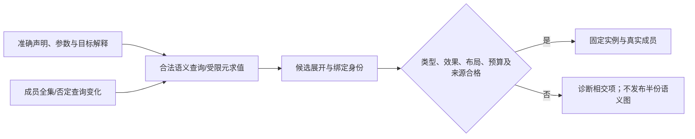

# 泛型、实例化与编译期映射

本篇细化[采用与导出边界](采用与导出边界.md)中的参数、选择、阶段、反射和分发。参数包、kind、反射值等记法表示必要语义区别，不规定新的作者必填字段、官方关键字或常驻运行平台。已有中立定义、真实Rust/TS泛型、HList/GAT、宏和成熟工具足够时直接复用；需要更强原生公共API时如实检查其差额。[来源](../../依据/来源/Rust与C++映射依据.md)的稳定性与具体item范围分别适用。

## 参数结构、常量身份和有限展开

类型、值、类型构造器与异构参数序列是不同参数种类。只有真实使用点需要时检查相应种类、元数、域和约束；普通泛型不承担一个全开放kind演算或运行时类型服务。参数序列保留每项类型和值身份；map、zip、fold和索引在选定实例上执行。空fold的单位元由操作声明，没有默认单位则诊断；zip长度不符和越界索引不能默默截断；大型但有限展开受节点、深度、时间和内存预算，而非伪造固定语义元数上限。

常量参与实例身份时固定类型、规范值/表示关系、模块符号及目标相关解释。符号同名不相同；构建宿主地址不进入可移植身份；浮点/结构值只有在所选常量域允许时才进入相应参数，NaN payload、+0/-0按该域规则区分或规范化，不能凭用户`==`决定全部身份。原作者表示及来源仍可保留，即使语义值已规范化。

尺寸、增长、对齐等静态表达式先在目标定义域计算，再核负值、溢出、合法布局与目标上限。一个已知实例能变成具体数组，不证明未来原生泛型接口也能表达它；嵌套数组/类型级整数路线有自己的布局、借用和API，不自动等同于任何扁平数组形式。

| 定位及需求 | Rust已有路线与实际差额 | 当前映射、边界与验收 |
|---|---|---|
| A24 类型参数包 | 递归HList、泛型trait与宏/具体生成可覆盖任意有限长度；不只有限tuple宏，编译资源仍有限 | 内部异构序列可展开为真实成员；公开原生tuple/调用形状固定时保留差额。空包、异构包和大包均有合法路径，资源超限不是“最多16个”的语义结论 |
| A25 值参数包 | HList/tuple/数组或生成值序列；同类型数组与异构值包不是同一类型接口 | 保留每项值/类型、求值次数和顺序；动态slice不是编译期NTTP包。零参数和边界错误明确，不把额外分配/擦除隐藏 |
| A26 template-template/类型构造器参数 | GAT/关联类型可以通过见证类型编码类型构造器，具名策略可合作适配 | 不再说Rust没有任何类型构造器路线；接受任意不合作外部generic名字与同形原生语法仍不同。校验实际kind/元数及实例结果，不按字符串拼类型 |
| A27 fold expression | 递归HList fold、trait、宏或已知序列生成 | 明确左/右结合、空包单位元与每项效果；字符串拼接、浮点与有副作用运算不得因折叠形式改变顺序。便利语法按真实需要采用 |
| A28 pack indexing | HList类型索引、关联类型或具体宏展开 | 索引是类型/常量还是运行值分别处理；未知长度不返回Any，越界准确诊断。原生直接pack索引拼写固定时才有相应前端差额 |
| A29 非类型模板参数 | stable Rust支持其规定的标量const参数，类型标记/生成覆盖更多具体域 | 任意结构/字符串/浮点值作为原生泛型参数不由此支持；只定义真实需要的常量域、身份和可序列化性。宿主临时指针不伪装为跨构建常量 |
| A30 泛型常量类型表达式 | 类型级整数、generic-array、关联存储、合格嵌套结构或先生成具体尺寸 | 不能说只剩动态Vec；也不能把这些不同原生类型当成同形`[T;N*2+1]`。具体N通过，超目标尺寸拒绝；开放原生API按交付形态判断 |
| A31 完全特化 | 具体impl与互不重叠的其他impl、显式策略/入口可用 | 不再说Rust不能对具体类型实现；与覆盖全部T的blanket impl重叠是另一问题。不同特化改变语义/布局时固定选择，不以优化器猜测 |
| A32 部分特化 | `impl<T> Trait for Vec<T>`等不重叠结构模式有效，关联存储可变内部表示 | C++类模板与函数模板的规则不同，函数模板不能部分特化；重叠偏序与公开字段变化才是关键差额。校验具体候选域，不从模式拼写推出全局开放选择 |
| A33 重叠候选的专门程度选择 | 显式策略、sealed分类、确定入口或生成；nightly specialization不是stable默认 | autoref技巧不普遍在任意泛型单态化时重选更具体实现。同合同快路径归优化；语义例外绑定真实witness，不能按加载顺序或全局得分选 |
| A34 requires/SFINAE式结构探测 | 显式trait、derive、适配、已知类型生成与外部语义工具可用 | TokenStream不等于任意外部T的已解析类型查询；未来不合作类型自动探测有实际抽象差额。使用已有语义查询并区分满足、不满足、未知、预算故障 |
| A35 if constexpr丢弃依赖分支 | 不重叠trait实现、宏/生成和类型策略；cfg仅是配置分支 | 普通if的两边仍须类型正确，优化器不能替类型检查。仅在所选阶段规则允许时延后未选依赖分支；损坏语法及必须先检查的非依赖部分仍诊断 |
| A36 显式实例化 | 具体包装、真实引用/导出符号、crate与代码生成策略 | 实例提供者/构建归属在目标成员里表达，不新建运行时机制。仅声明“已实例化”没有实际符号/成员时，不能交付或用元数据代替链接 |
| A37 extern template | 导出具体非泛型入口供复用、既有跨crate单态化/LTO机制 | 非泛型包装改变开放API、内联和分发形式，不等于保留泛型只抑制代码生成。按实际采用形态声明范围和成本，缺提供者准确失败 |
| A38 consteval | const上下文、inline const、宏或隐藏运行入口的合格封装 | const fn不禁止运行调用；函数级immediate协议与调用形式仍可能不同。只对确需编译期调用的用途强制阶段，运行时调用不冒充静态完成 |
| A39 更广泛泛型constexpr | const fn、const友好结构、真实已知输入生成；所需trait/库操作逐项核验 | build脚本不等于目标类型系统内的透明const求值。共用泛型算法需保持目标字长/数值/错误及阶段；不为简单表生成默认建设任意编译期堆 |
| A40 语义静态反射 | derive/proc宏、显式metadata/trait和成熟语义工具；宏只直接取得所提供token | 任意外部T完整语义不可凭token取得；编译器内部查询与公开作者反射分开。成员集合、访问上下文、解释与预算固定，C++26提案/实现状态单列 |
| A41 reflection splice | 宏生成token、类型化辅助trait和编译器内部有绑定节点生成 | 字符串拼接后重新解析不是天然无损实体引用；保持hygiene、稳定绑定和生成来源。公共splice只有真实用户需求才稳定，不因是编译器就全量暴露 |
| A42 template for | HList map/fold、宏、生成具体成员或函数 | 与A24/A27/A40共享机制，但异构逐项实例化的错误、顺序和预算保留；开放反射序列的原生API固定时保留差额，不重复累计成底层缺口 |

上述比较按R03—R07、R13—R16、R33、L01—L02、C02—C04、C12和T01的相交规则。资料描述某项接口不说明同一版本全部目标都支持，具体供给仍需固定。

## 选择的语义与一致性

匹配、偏序和约束求解采用固定解释及候选域。声明解析、参数代入、约束检查、专门程度判定、效果组合与最终绑定分别保留依赖；不同候选可能共享计算，但不能因为节点已visited就抹去新义务。歧义和无候选不同；未知探测不允许选fallback假成功。源语言的SFINAE、访问、错误时机等仍归其成熟前端，不能用自有策略覆盖。

同一公共使用点的witness/表示只能在已接受的新选择中改变；加载更具体插件不会热改旧EngineImage和旧实例。不同调用若必须共享同一存在见证，不能各挑一个有利实现。归纳支持和负依赖另沿[组合前提](../组合前提与进展闭合.md)，不存在一个对任意开放世界都自动一致的特化开关。

仅优化相同合同的方法时，优化器可在合法自由度中选择快路径，不需把每个硬件分支暴露成作者类型。字段、布局、可用操作、失败或公开行为真的不同，则作为类型/方法族区别处理。Rust不重叠impl、条件trait、关联存储与条件析构的能力不相同；能为某T实现Copy不代表任意重叠Drop规则也成立。实际采用前逐操作核对，不从一个成功例外推整个specialization体系。

## 阶段化求值与反射生成

阶段至少区分本次编译可执行、必须编译期完成和目标运行。内部阶段事实可由已绑定方法和上下文推导，不要求普通函数填写三态标记。编译期执行消费已固定目标语义和真实读集，不能按构建机字长、环境变量、时间或随机状态偶然决定目标常量。需要取得外部内容时先由获准动作捕获，形成新输入修订，而不是纯求值中隐式联网或运行包脚本。

允许临时分配的元方法须有真实预算、初始化、释放和结果逃逸规则。临时容器可以在求值结束前释放，结果只保留可持续的值/结构；不能把编译进程地址、临时引用或私有执行句柄放入目标常量。不同目标数值/舍入规则需要合格模拟或真实工具支持，不能以运行在宿主上替代。

反射查询必须固定声明/类型主体、解释、成员选择和当前被允许的元数据范围；查询“所有成员”本身进入依赖，而不只记录已看到的成员。声明元数据是否可见由源语言与所选查询合同决定，不能仅凭private字样假定所有元数据均不可见；可见元数据又不自动授予读取运行中私有值或生成非法访问的权利。

生成时使用绑定身份和卫生的作用域映射。替换`λx.y`中的y为自由x需要先避免捕获，不能直接变成改变含义的`λx.x`。字符串名字相同不等于符号相同；拼接、克隆和展开保留定义来源、使用点与目标对应。生成器先在候选内建立完整结果，核签名、类型、效果与目标合法性，失败不发布前两个字段而隐藏第三字段错误；旧完整结果可保全但不能当新源码已成功。

### X04 表示族与条件行为

类型族可用关联存储、不同具名类型或固定实例表达实际不同布局与操作。保持公共行为的专用实现不必改变源类型；公开布局或行为变更则不能藏在后端。约束、新插件或所选witness改变时只重算相交实例，但成员全集/排除规则变化属于真实依赖。未知是否匹配不能当成已排除。

### X05 编译期临时容器与宿主

表生成可使用受控构建步骤，简单常量可用现成const函数，开放泛型中同一算法需要静态运行时再选择有能力的元方法。三者的类型上下文、目标模型、错误时机、缓存输入和分发要求不同。临时vector等合格C++常量求值例只支持其工具/语言范围，不使任意Rust库调用都可const，也不需要将所有运行库复制成编译期库。

### X12 开放下游和动态插件

静态展开的完整性只针对已取得实例和成员闭包。动态插件不能靠构建时猜测全部未来类型支持；应选择可继续实例化定义、目标原生泛型、有限实例或显式动态字典。需要额外编译器/JIT时进入实际依赖、隔离、成本和许可；不偷偷在运行时打开编译环境。

## 实例、分发与连续修改

实例身份固定定义修订、规范参数、实际witness、解释及目标相关输入；不把无关格式变化全部当语义失效，也不遗漏约束候选全集。可共享的纯实例计算使用原调度与占用协议，等待者取消不销毁其他消费者需要的生产者。编译器链接去重、COMDAT/LTO或代码布局策略不是源语义等价证明，符号归属和工具选项仍要真实核对。

单态化、字典传递和类型擦除是不同合法路线：前者可能增加编译工作与代码体积，后两者可能增加间接调用、元数据和运行占用，并改变原生API、特化与内联机会。按实际要求选择，不用“泛型已支持”隐藏路线。导出实例没有提供者、符号被删除、库版本或ABI不符时，产生准确链接/交付缺项，不拿类型检查通过代签。

第二次修改由原定义或原生源拥有者保存；相交实例、布局、成员与证据失效，原生成物不成为另一份手写真源。受管回源有映射才使用；没有完整来源时保全原生或显式接管，不能下次生成默默覆盖用户变化。旧发行与正在运行的代码继续绑定原实例和解释，不随新锁热改。

验收覆盖A24—A42各行及V09—V18、V38：空/异构/大pack、常量身份与溢出、固定后加入新特化、探测超预算、未选依赖分支和损坏语法、反射集合新增、局部展开失败、隐式宿主读取、缺实例提供者、有限实例冒领开放原生API。检查、目标编译、链接、运行与真实成本各自提供证据，不能仅凭本篇存在宣布实现。
