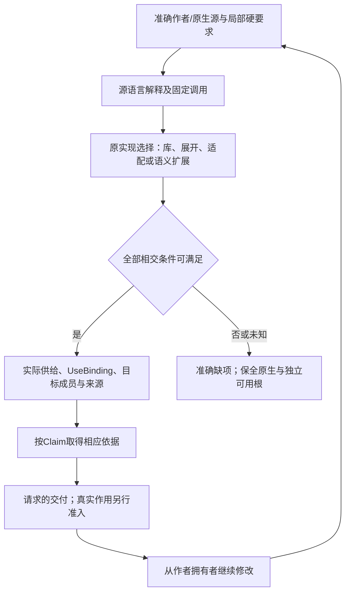

# 使用点采用与原生导出边界

本篇拥有[原生与跨语言编译](../内核/原生与跨语言编译.md)中的能力映射、方案采用和对外形态判断。对象、类型、效果与领域含义仍由原语义规范拥有；本目录只细化它们遇到Rust、TypeScript和外部C++供给时的实际差额，不再定义一套语言内核、IR、公共工具、能力注册表或运行时。

A01—A64和X01—X14是比较命题的定位标记，不是64项独立缺失、产品必做清单或新API。相同机制的不同语法、同一语法的不同效果仍分别保留。M01—M16只帮助定位既有设计分题，不规定16个模块。各篇给出可以采用的有限路线、不可静默降低的条件和验收；规范已设计不等于工具链已接入、生成物已验证或所有平台已支持。

## 1. 先固定需要保持的东西

每个真实使用点分别核以下维度，不用一个“支持”布尔值或加权分数抵消硬要求。

| 维度 | 需要保留的具体区别 | 不能冒充等价的替换 |
|---|---|---|
| 行为和观察 | 合法输入、结果、错误、求值次数与顺序、可观察副作用、概率与跨运行关系 | 最后返回值相同但多执行一次写入；边际分布相同但样本相关 |
| 作者与原生接口 | 可写的定义、推导、调用拼写、未来未知类型、下游编译者、访问规则 | 生成几个具体函数就称拥有同形开放泛型；不同名字的方法就称保持原生运算符接口 |
| 对象与表示 | 身份、子对象、地址、布局、对齐、别名、借用、构造、转移和销毁 | Pin代替移动修复hook；普通JS对象代替C可见稳定地址 |
| 控制和进展 | 调度、线程、取消、异常域、无锁/无等待、必须关闭、栈和时间要求 | mutex冒充无锁；丢弃Future冒充异步close完成 |
| 工程与供给 | 工具版本、目标、构建成员、依赖政策、许可、支持与调试能力 | 原生shim隐藏在生成目录；外部脚本冒充目标语义下的常量求值 |
| 全生命周期成本 | 独立作者决定、适配维护、检查责任、编译时间/内存、代码体积、运行资源、迁移和恢复 | 只看调用字数或一次运行速度，把生成器、unsafe审计、动态检查和用户安装成本移到账外 |

普通程序只承担实际相交的维度，不为每次加法填写完整证书。能够从已绑定定义推导的信息不让作者重复输入；真正需要稳定地址、无堆、精确ABI、特定舍入或开放原生API时，则不能以“通常不重要”为由删除。

## 2. 当前采用顺序不是无限等待

**普通新代码默认直接复用合格语言与库。** 组合和接口、显式复制/更新、泛型工厂、HList/GAT/关联存储、const函数、成熟容器和原生调用都可以是最终方案，不是必须以后替换的低级补丁。是否足够取决于完整要求，而不是名字是否与C++相同。

**编译时能消去的区别在编译时消去。** 已确定的重载、具体参数包、尺寸、反射生成和实现选择可输出普通Rust或TS；后端不必拥有源端每个拼写。消去不能删除运行时仍可观察的地址、分配、错误、求值顺序、原子进展和外部接口。

**外部语言已有的准确语义交给其成熟前端。** 原生C++的查找、重载、访问、模板实例化、布局与异常规则由固定工具链解释后进入绑定；不得让各目标后端重新选择一遍，也不把更简单的自有规则冒称C++兼容。纯保全、正确调用、有限编辑、可优化、可生成到另一目标与逐字回写是不同能力。

**确有差额才增加适配或语义。** 先定位已有库、生成和原生接合分别不能满足的具体条件。局部封装能承担就不改核心；通用分析器必须看见新的类型/效果/关系区别时，沿原DomainDialect、EngineImage和领域接口扩展；跨域解释协议本身不足时才演进相交核心。无可用实现不自动说明需要新本体，存在真实新语义也不能永远塞入opaque字段逃避。

有权请求只设计时，以上交付的是确定的方案及条件；不执行安装、构建、测试或部署。已有足够依据的方案现在选定，不以“尚无全局最优证明”拖延；实际性能、资质和目标行为没有证据时保留其准确未知。

## 3. 从作者内容到目标的实际交接

原Candidate与requirementRefs固定任务、源和硬约束；解释绑定与实际来源决定语言语义。ImportedModuleView/SignatureView承接成熟前端取得的签名、接收者、名称选择、布局及未知。实现选择器在原MethodSpec/BoundaryView上比较可行路线，selectedUses保存规划决定；取得并核验真实供给后才形成UseBinding。资源、权限、字节与证据分别由原拥有者处理，不增加一组必填的同义字段。

1. 捕获准确作者源、原生源及目标要求，保持未知片段和未保存变化；路径、名字和标签不作为内容或权限证据。
2. 按源语言及版本绑定声明、类型、接收者、具体调用、默认值与效果；需要阶段化时只执行已准入且输入固定的过程，保留真实读集及成员全集/否定查询。
3. 在相交义务上判断库、静态展开、原生适配与新语义路线。没有支持依据的区别保持待决；不可比较的成本不凭无单位总分挑胜者；不能交换量词或用未来信息选当前策略。
4. 物化真正的实现与构建成员，检查布局、初始化、清理、调用/异常域、线程、资源和公开形态。类型声明存在但没有链接符号、运行支持或合法桥接时，返回准确缺项。
5. 生成目标成员、依赖和来源对应；Lowering只消费已绑定选择，不能从本机新装插件、动态环境或类型断言改写它。不同独立根分项交付，共同发行条件另核。
6. 按原Claim需要取得静态、目标编译、运行、ABI、并发或成本依据。每一层只支持自身范围；原生库文档、有限例、签名与测试通过不能相互代签。
7. 保存、回源或真实运行遵守原任务目的、前像和准入。第二次变化从真实作者拥有者产生新候选；旧运行、回调、资源和未结算操作仍按原身份完成，不随新源码重解释或消失。

## 4. 四种对外交付不能相互代签

| 形态 | 真正交付 | 剩余责任与成本 |
|---|---|---|
| 可继续实例化的中立定义 | 定义、解释、依赖和适用目标，供相应编译器处理新实例 | 下游确需相应编译器/供给；不能宣称任意Rust源码直接使用同形语法 |
| 有限具体实例 | 固定类型/值下真实可链接或可调用的成员 | 未列出的未来实例不自动支持；实例提供者、符号、构建归属和体积需要明确 |
| 目标原生泛型API | Rust/TS实际能表达的定义、边界与下游规则 | 受目标语言约束；HList、GAT、builder、关联存储或不同入口会改变原生接口，必须如实保留 |
| 动态固定接口/字典 | 已定义元数据、运行分派、对象/模块世代和实际实现 | 擦除、间接调用、分配、装载、权限、卸载和调试成本；不会自动获得所有未知插件能力 |

例如中立定义需要`Buffer<T,2*N+1>`，已知T=u32、N=3可生成`[u32;7]`。它不证明未来任意Rust调用者已获得原生`[T;2*N+1]`接口。依赖固定`std::Vec`的API也不能因另一种容器可用就获得逐实例allocator。增加JIT、编译服务、native模块或Wasm是新的真实依赖，必须进入成员与运行合同，不能隐藏。

## 5. 已选择与条件候选的边界

| 分题 | 当前采用 | 条件性能力及不得遗失的区别 |
|---|---|---|
| M01 对象与继承 | 新代码组合/接口优先 | 真实重复基、虚共享基、构造分派和RTTI图只在相应接口要求下启用；不默认给全部对象继承图 |
| M02 名称、访问与投影 | 模块隐私、opaque、合法访问与准确绑定 | protected/friend/成员指针按源或所选画像；不能把语言可见性当执行授权 |
| M03 调用与运算符 | 精确接收者、显式资源/错误、确定调用 | 重载、默认参数、隐式转换和特殊operator可局部降低；不默认复制全套C++历史查找 |
| M04 参数与常量 | 现有泛型、生成、HList/GAT等合格供给 | 原生pack、值身份和kind便利按实际API/编译负担采用；不默认完整kind calculus |
| M05 特化和探测 | 同合同优化与公开语义分开，选择固定 | 重叠、开放探测、不同表示需要明确候选域和witness；不默认全局开放特化 |
| M06 阶段与反射 | 编译器内部类型查询、求值和有来源生成 | 作者公开语义反射独立决定权限、阶段、预算和编辑；不自动开放任意元程序 |
| M07 实例与分发 | 原构建、目标成员与依赖归属 | 显式实例复用可以有价值；不因extern-template拼写新增运行服务 |
| M08 存储与对象操作 | 所有权、初始化、复制、替换、销毁分别正确 | 原位构造、移动修复和固定地址按使用点保留；不把全部内部状态变成作者关键词 |
| M09 分配与运行域 | 成熟容器、资源协议、明确拥有者 | allocator传播、区域、TLS和异步关闭按真实需求启用；不默认自建所有容器/调度器 |
| M10 布局和访问 | 逻辑、wire、nativeABI、设备访问分离 | 位域、padding复用和volatile局部约束，不强迫普通对象采用自定义布局语言 |
| M11 数值和优化 | 真实格式、误差、舍入、mask、ISA与成本 | 特殊浮点环境及向量路线按目标供给；不默认实现全部格式或保证所有目标等价 |
| M12 错误与契约 | 真实失败、效果与统一清理 | Result足够则采用；typed unwind、契约语法和证明求解分别按用途决定，不默认完整代数效果体系 |
| M13 协程与CFG | Future/Iterator/合格状态机、初始化与清理事实 | 一般resume/yield、stackful或multi-shot各有独立条件，不能由取消责任推出全部必做 |
| M14 外部接口 | 成熟前端、bridge、明确shim与兼容区域 | 真实C变参、C++对象/异常/运行库按精确ABI；不承诺无依赖完整C++实现 |
| M15 原子与回收 | 原模型、实际原语/库及进展条件 | 泛型值、原子视图、共享内存与回收分别核对；不因标准库名字缺少自建第二原子体系 |
| M16 使用点采用 | 原要求、方案、边界、缺项和依据相交裁决 | 无强条件的小操作不建立最大证书；不能用评分抵消硬条件 |

## 6. 原设计受到反证时怎样处理

七个概念能够容纳描述，不证明它们是完备或最小内核；统一载荷不允许抹去Observation、Definition、Authority、Evidence和Verdict的不同效力。AST、SSA、CFG、事件、关系等按实际分析用途保留；状态转移并未因出现弱内存或无限轨迹就被数学上否定，也不必全部换成一个Behavior对象。

固定点方程必须有相应解和求解依据；无种子循环不能自证。绑定、量词、同一见证、控制权和可见历史由原[组合前提](../组合前提与进展闭合.md)及[有限方法](../有限抽象与观察策略.md)检查。单轨迹细化不自动保持非干扰，边际相同不保联合分布；观察范围必须来自原要求，不能由优化器缩小。原[性质保持](../性质保持与开放环境.md)继续拥有这些判断。

检查器与实现同用错误整数模型仍可共同给出错误结论；无I/O、签名齐全且总返回true的检查器也不获得任意证明资格。沿原[解释与证据接纳](../../运行/保证/解释与证据接纳.md)检查真实编码、理论、假设与覆盖，不以重复测试数量消除共同原因。

有限谓词枚举本身可以是合格的有限画像；把它改成string不会自动得到开放语义。真扩展必须同时接合签名、解释、锁、身份、编辑、影响传播、降低与证据，未知节点可保全不等于可优化。新规则和旧快照不能靠改路径或重算hash获得语义迁移；当前Context不成为可变的全局世界或万能缓存键。

外部动作的超时、失败和取消继续保留原身份、回执与恢复；内容身份不签发Grant，源码回滚不回滚现实。局部表达式不因“可建模”就变成持久实体；只有真实审查、协作、保留和恢复消费者才承担相应成本。已有规范足够时复用，不为每个新反例再加一层同义规则。

## 7. 版本、未知与重开条件

Rust稳定、nightly、独立crate、C++标准提案、编译器实现、平台部署和本地测试是不同状态；依据由[映射资料](../../依据/来源/Rust与C++映射依据.md)固定。默认不偷偷打开nightly，也不把GNU扩展当ISO能力。没有调查的SDK/芯片/资质保持未知，不能从搜索没找到推成不支持。

原要求、接口、布局、效果、目标工具或允许依赖改变时，只重评真实消费者；修改全部成员集合或负依赖时则不得只失效原来已知的成员。更少作者负担、编译成本或运行成本要在同任务、同保证、同成熟库条件下比较；没有实测不虚构比例。已有合格方案保持可用，新的反例只推翻确实相交的部分。

完整例、40项条件验收和交叉机制见[原生映射与组合验收](../../运行/验收/原生映射与组合.md)。它们是可落实的设计输入，不是本次已运行的产品测试。有限模型证明和实际目标支持各按自己的边界报告。
