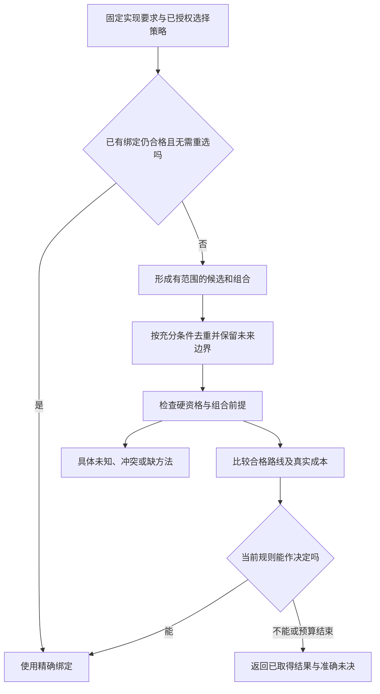

# 实现解析与设计搜索

> **阅读范围**：采用范围内的设计规范；实现状态另查未决。

<details>
<summary>本页内容</summary>

- [从要求形状选择实现，而不是从业务词选择轮子](#从要求形状选择实现而不是从业务词选择轮子)
- [需求到作者变更的可落实计划](#需求到作者变更的可落实计划)
- [候选类别与选择发生的时点](#候选类别与选择发生的时点)
- [正常绑定不经过能力搜索](#正常绑定不经过能力搜索)
- [不确定性传播、冲突消解与保守近似](#不确定性传播冲突消解与保守近似)
- [失败最小化、复现、归因与修复候选编译](#失败最小化复现归因与修复候选编译)
- [实现解析算法](#实现解析算法)
- [等价重写、电子图与受限搜索](#等价重写电子图与受限搜索)
- [约束求解、不可判定分类与不满足解释](#约束求解不可判定分类与不满足解释)
- [领域边界与责任重建算法](#领域边界与责任重建算法)
- [候选生成与设计空间搜索](#候选生成与设计空间搜索)
- [工程意图到设计的合成算法](#工程意图到设计的合成算法)
- [带边界状态的联合搜索与合法剪枝](#带边界状态的联合搜索与合法剪枝)
- [固定输入下的实现选择算法](#固定输入下的实现选择算法)
- [开发者不点名轮子时的正向实现绑定](#开发者不点名轮子时的正向实现绑定)
- [完成语义与选择实现之间的可执行门槛](#完成语义与选择实现之间的可执行门槛)
- [关系计划的合法性先于代价](#关系计划的合法性先于代价)
- [产品需求源不因缺供给而退化成实现源](#产品需求源不因缺供给而退化成实现源)
- [默认绑定与成品边界对方法选择的约束](#默认绑定与成品边界对方法选择的约束)
- [界的核算范围与联合剪枝](#cost-bound-accounting)

</details>


## 从要求形状选择实现，而不是从业务词选择轮子

输入使用已绑定的对象域、结果/结构/轨迹关系、保持帧和资源条件，算法由[共同需求合同](../作者/组合/跨软件需求合同.md#cross-software-intent-contract)完成准确解释。“图像”“编辑器”“业务”只是检索线索，不代替可调用供给的含义。

1. 原绑定仍满足新要求时，直接复用；若只是参数变化，形成相同定义的实际参数变化，不检索世界能力目录。
2. 按固定语义定义身份和已取得的类型/形状建立有范围候选。精确匹配可直接实例化，存在已知保持转换时计入转换和整个资源成本；签名相同但失败、时序或帧不同不能称直接匹配。
3. 对相交约束组合先检查可确定冲突，核消费者前提与输入域；未知结果继续保留为相应资格缺口。任务允许接受有条件实现时记录那项接受，不由方法自称“支持”代签。
4. 缺具体政策而已有构造足够时，产生本项目的最小主体及相交验证；不把“没有官方模板”提升为语言缺项。普通源已经完整时无需额外模板。
5. 逻辑允许多种方案且选择已委派，按真实成本和稳定策略选一种；不得把同一要求的不同形状一律编译成组件流水线。

需求相容、组合可执行、目标可生成与满足运行约束分别有状态。例如本地最新结果可以用单线程会话或合格框架实现，但仅使用“取消”接口不证明旧任务已停止或发布不会竞争。反向关系可以用扫描或索引实现，O(1)目标与内存预算共同影响选择，不能只优化查询而漏掉维护成本。


<a id="executable-intent-plan"></a>
## 需求到作者变更的可落实计划

本节具体实现`planIntentChange`，复用当前EditPlan、RealizationPlan、UseBinding、ReadSet和Obligations。它们是当前任务内部的引用与计划数据，不是新的作者格式或服务。原[联合搜索](#带边界状态的联合搜索与合法剪枝)负责候选合法性和成本；本节负责把所选结果接成可修改、可编译、可再次修改的工程，不能在一个名字后藏入另一套搜索器。

### 计划必须实际携带的内容

| 既有计划中的部分 | 最小充分内容 | 谁产生、谁消费 |
|---|---|---|
| 固定基础 | 原Candidate、独立Requirement的精确来源与接受状态、实际语言/方法绑定、所选根和目标 | application复用原引用；workspace及compiler核对，不复制全部工程 |
| 作者动作 | 准确源/结构/控制/锁使用点，原前像或已读投影，操作及新内容引用 | 合格规则或获准创作取得；workspace通过已有适配写候选 |
| 含义到供给的对应 | 本任务实际要求出现→所选定义/UseBinding或变换、它消解的局部条件和仍需成立的前提 | planner产生；semantics及assurance检查；关联不是证明 |
| 实际读集 | 源切片、类型、规则、合同、成员枚举、负查找和方法选择使用的输入 | 各方法报告并核查，重基/缓存以此判断；未知不能填成空集 |
| 共同边界 | 公共符号/类型、对象域、运行实例/资源边界、目标路径与需要共同检查的规则 | 从真实读写和组合条件取得；不是所有任务一张永久全图 |
| 生成贡献 | 新定义或直接绑定、目标生成方法、真实运行/构建/类型/资产依赖 | resolveUse/lowering补足，目标组合器唯一汇合 |
| 残余与停止 | NeedsInput、NeedsAuthorContent、未接受决定、未知保证及允许独立返回的根 | application给出准确下一步，不让缺失在层间消失 |

“已有全部输入”不必意味着全部产物已预先物化：生成方法引用可以延迟到lowering。但缺源码内容的普通新主体不能以一个拟建函数名宣称EditPlan完成。未写的代码返回`NeedsAuthorContent`，携带应建立的入口、输入/结果合同、允许引用、编辑范围、保持项和本次允许的检查。响应必须是原作者语法中的具体文件/差异；语言组合仍固定，不凭返回文本自动启用插件。

### 具体内存结构与候选绑定的阶段

既有两种计划复用下列内部字段，不对外新增JSON协议；空集合可共享，不为每个小修改分配完整记录树：

```text
EditPlan | RealizationPlan = {
  kind: edit | realize,
  base: CandidateRef,
  requirementRefs: exact accepted/pending source references,
  ruleBindings: the actually consumed immutable rules/methods,
  roots: existing bound output/development roots,
  authorDelta: existing text/structure/control/binding delta,
  sourceSteps: bound MethodSpec calls whose declared result is AuthorDelta,
  selectedUses: provisional occurrence-to-implementation selections,
  reads: ReadSet,
  coupledGroups: action references plus invariant/resource/interface references,
  obligations: existing obligation references and assumption dispositions
}
```

`EditPlan`可以只有一处authorDelta及其基础。`RealizationPlan`还可以包含合格源方法和目标实现选择；sourceSteps必须具有已绑定的方法、真实输入、前提和预算，不能只是以后要执行的自然语言说明。没有方法也没有主体时返回NeedsAuthorContent，不伪造一个空步骤。

`selectedUses`只记录**规划阶段选择**：现有出现的来源引用或本批局部标签、选定定义/供给/目标方法、参数映射及未解前提。它不是已经检查过的UseBinding。新增声明在materialize后取得真实来源映射，经类型/效果封存，再由resolveUse建立当前候选的UseBinding；不从尚未存在的函数名生成假CallableIndex，也不把旧候选的调用资格搬到新候选。已有成熟供给的固定引用可复用，但实际使用点仍在当前要求和目标下核对。

sourceSteps经workspace调用其合格的纯源变更方法取得AuthorDelta；返回Needs时形成明确输入需求，方法不得直接写盘。只生成目标代码的GenerationMethod不放入sourceSteps，而在selectedUses中等待compiler消费。两种阶段不能因都叫“生成”混用。

共同组的成员是本批动作引用；组边是共享类型、原子可见关系、资源/身份或已接受合同，不是仅因文件相邻而建立。检查可以共享，但最终被修改的作者位置仍只有一个拥有者。计划消失时，已经采用的作者内容和真实恢复责任不随之删除。

### 从绑定到可落实结果的处理次序

**固定任务。** 固定当前目的、原要求与写范围。已有精确编辑直接沿原操作，不重新选择算法或重新解释已接受业务。将待实现行为、作者修改与此次现实动作分别标注；独立需求增删只进入确已接受的要求变更，不与普通主体修改合并授权。

**取得实现。** 原绑定合格就复用；准确参数化关系可直接实例化；有合格变更规则就产生差异；否则按原有界供给搜索取得直接调用、薄适配或差额主体。不得为了可满足性削减原输入域，不能将无现成方法等同于语言不可表达。取得的只是普通签名时，按它实际支持的检查和调用资格使用，不凭同名推断全部效果。

**核对前提。** 为选中方法的前提寻找本次确有的输入事实、已接受条件或可核验证明。方法A假定B已保持，B又只假定A已保持，不能据此把两者同时标为成功；联合不变量需要初态及各步保持，进展需要自己的调度/终止条件。有未证明的前提可以保留条件性候选，但只有真正被接受的条件才能限制产品合同。

**闭合组合。** 按实际共享符号、类型、对象身份、资源和输出归属形成共同检查组。All要求共同满足，不是拼接独立通过的文本；Any只保留本次接受的一条完整实现及选择依据，不把所有备选变成前置。一个供给新增依赖，就加入真实闭包并复核其帧、时间和资源。依赖环按所属语义处理，不用通用拓扑排序把全部程序判错。

**构造作者动作。** 每个差异使用已有EditPlan操作与准确来源。引用/调用等机械内容可由规则产生，类型省略和原表示保持；已有完整供给无需同义算法文件。相同作者槽的多个动作若内容、强度或来源冲突，先合成一个有理由的动作或返回冲突，不按最后一项覆盖。只有行为有真实差异的部分才需要新代码。

**输出可落实结果。** 有实际内容和合格方法时返回计划；仅缺实现创作时返回NeedsAuthorContent；只缺已允许输入时返回NeedsInput；缺未委派的可观察决定时返回NeedsDecision。检测到冲突返回参与范围与当前理由，不无依据称为最小冲突核。预算结束返回PlanningIncomplete；有限搜索未找到不宣称世界无解。外部AI由已有application/client按本次授权调用，不进入纯语义函数或固定重建。

**持续修改。** materialize前核基础，变更后检查新增区域与共同要求，再按原任务选择生成/检查。未来新增来源或条件只重新打开相交计划。已有成功代码不因这次未通过而删除；已有作者源也不自动扩写成全部派生合同。实际文件提交/运行不属于计划阶段，只生成对应有类型的后续请求。

### 防止规划器本身无限膨胀

当前采取就绪工作表：每项待落实差额按`(要求出现、对象域、目标、规则修订、当前已知绑定)`定位，已满足内容直接引用，只有实际新增前提/依赖才产生新工作。一次方法返回同样Needs又没有新信息，不自动重复调用；等待明确输入、返回未完成或按已委派规则选替代。精确内容相同不代表两个来源相同；计算可共享而接受关系独立。

有限候选集合、有限输入和所选方法在预算内结束时，本次规划会结束。新的泛型/领域展开无限产生不同实例，不由同键去重保证终止；沿原残留策略、资源界和停止结果处理。没有要求最优时，首个满足全部硬条件且符合稳定选择规则的方案可以结束；明确要求优化时采用原J流程及其可证明剪枝，不给任意加权“综合最优分”。

计划的编辑读集与目标程序效果分别计量；同一个规划器可以只处理一个字面量，也可以处理多个模块。较小实现可以关闭缓存、用现成类型与源工具完整重检查相交模块；不得用必须先构建平台级需求库、持久任务图或新队列服务来延迟首条开发链。

## 候选类别与选择发生的时点

本章的Candidate不是一种统治所有阶段的对象。下表只区分实际职责，不增加运行记录或要求作者填写候选分类。

| 被比较或保存的对象 | 何时产生 | 谁在何时作决定 | 决定之后保存什么 |
|---|---|---|---|
| SEC产品方案备选 | 设计语言、接口、内核边界时 | 本次设计委派内给出一个当前选择；相交协议进入实现前确定 | 正文中的当前选择、必要理由与重开条件；不让运行编译器挑文法 |
| 用户作者候选 | 每次source/files/edits输入 | 预览可直接使用；采用或保存由具体请求和当前政策决定 | 精确作者快照及其基础；候选不再“变成”另一份源码 |
| 实现路线备选 | 当前任务确有自由且未绑定，或要求重新优化 | 固定任务和预算内，在产物最终绑定前决定 | 被选Binding与真实参数、版本、条件；无需保留全部搜索节点 |
| 编译器局部变换 | 已定语义和策略下的编译过程 | 编译算法在保持规则与预算内处理 | 当前实际变换和必要来源；不让作者逐条批准寄存器或内部块选择 |
| 运行期调度选择 | 生成程序明确具有调度/路由策略时 | 目标运行时依据被编译进去的规则选择 | 该规则要求的实际结果/观察；不能重选源语言、业务义务或授权 |
| 写入/恢复选择 | apply及已开始操作的协调时 | 实际宿主基于当前权利、原意图和前像判断 | 稳定操作身份及真实状态；不用“更新方案更好”替换原操作 |

`candidateRef`只表示用户内容的一次确定快照，不表示系统必须同时生成三份实现，不表示作者语言还没定，也不强制每个预览先人工审批。用户只写一份程序，系统只有一个候选是正常情况；修改后再产生一份快照，用于版本和冲突，不是做一次新架构评标。

### 从未定选择到固定Binding的正向协议

先在任务范围中读取实际自由与硬约束。已有绑定仍合格且未请求重新优化时直接使用；没有绑定而只有一个合格实现时依所选政策绑定；多个合格实现才进入有界比较。任务授权系统采用保守默认时，采用已声明的规则而不是重新询问所有参数。会改变任务含义、无可用默认或超出授权的选择，返回精确待决项，并允许无关工作继续。

求解停止的出口明确为：已选可行Binding、当前有限域内不可行、缺少所需事实/决定，或预算结束但已有合格结果。任务只要可行时，可提交该结果；要求最优性却未完成比较时，说明最优性尚未成立，不能降低要求后报告原任务完成。Binding在生成结果前与相应内容、规则和策略固定；运行环境漂移使它不合格时，返回缺项或形成一次新选择，不能在同一个artifactRef中换目标。

默认普通构建不读取在线市场，不调用AI重新设计，不执行全路线择优。动态设备选择若确为程序需要，应当把合法选择集合、条件、失败和观察写成运行策略并绑定其版本；它的存在不等于运行时可以修改已接受业务。

### 决策不会因为可重新评估而永远暂停

“未证明绝对最优”与“无法选定当前方案”不同。允许条件下选择满足硬约束、具有具体取舍的当前方案；记录哪些证据会改变它，继续对应实施。两个物理实现完全等价时可用固定的成本/顺序规则选择，但确定顺序只能在合格候选间工作，不能把不合格项排前取得资格。

反例：调用preview需要先决定“SEC以后究竟用TS还是.sec”；缓存多了一份Java产物后write-output写错对象；运行时据当前热度改了作者指定算法；恢复读到新策略后重算旧业务。分别应在产品基线、明确artifactRef、策略边界和原操作意图处阻断，而不是为每例增加一个新候选系统。

## 正常绑定不经过能力搜索

本章的搜索、求解与候选比较不是普通调用的前置。已经存在的局部定义、显式导入和锁定实现先做确定解析；普通源代码不让AI逐符号调用查询，也不为了“寻找最优”重新比较全球提供者。

默认顺序是：词法局部绑定；源内显式导入及工程锁；当前版本有限基础画像。这里不是按优先级默选同名的不同含义，语言本身允许的遮蔽照其规则执行，真正歧义返回局部候选。名字相同不等于类型/效果合同相同；静态识别生成构造使用已解析符号身份。

一次构建的读取/解析沿实际导入和需要的接口闭包进行。无关新包不扩大该闭包；通配符、自动注册、条件导出和编译期扩展确有全局依赖时要保留目录/选择条件及负依赖，不能为了指标将它们漏掉。严格类型工具需要更大范围时如实记录，不能给出恒定时间承诺。

| 情形 | 系统动作 | 何时需要AI |
|---|---|---|
| 已绑定符号及稳定合同 | 直接链接、缓存或重算，沿闭包检查 | 不需要发现回合 |
| 合同陌生但对象确定 | 取该符号的公开类型、效果、缺省和必要反例 | 需要理解或修改该含义时提供短合同 |
| 未解析或同名歧义 | 聚合本批缺口；给获准的局部修复选项 | 改import、写局部定义、选不同合法语义 |
| 明确要求寻找新能力/替换实现 | 有范围与预算的搜索，形成候选和证据 | 作相应被委派的选择；不得自动安装或换锁 |

将模型侧检索搬成服务端无界检索不是优化。搜索预算、外部请求、数据披露、候选截断和真实覆盖须被记录；未搜索不等于无候选。给定锁的正常生成不依赖AI再次采样，同一请求里的新源码也不能擅自扩大库获取权限。

## 不确定性传播、冲突消解与保守近似

### 1. 不确定性不能被一个 confidence 数字吞并

未知来源可能是未观测、歧义、冲突、不支持、不透明、统计误差、预算耗尽或环境漂移。它们导致的合法处理不同。

### 2. Uncertainty

```text
Uncertainty =
  missing-observation
  | ambiguous-reference
  | conflicting-assertions
  | unsupported-semantics
  | opaque-component
  | statistical-interval
  | search-frontier
  | stale-input
  | common-cause-risk
```

### 3. 传播

每个 pass 声明其对各类 uncertainty 的 transfer：保持、扩大、条件消除、阻断或转换。禁止把 unknown 当 bottom/false 以便继续计算。

### 4. 保守近似

静态分析可以 over-approximate Effect/Impact 以保证安全，也可以 under-approximate 用于探索，但必须标记方向。只有 over-approximation 能支持“没有漏掉危险”的特定 Claim；under-approximation 不能证明 absence。

### 5. 冲突消解

Authority、freshness、scope 和 explicit decision 决定哪些 Assertions 可被采用。多数票、最后写入和最高 confidence 不能自动覆盖 authoritative conflict。

### 6. 精化

新 observation、provider、分析或人工 decision 可以缩小 frontier；只重算依赖该 frontier 的结果。精化不能修改原始 evidence。

### 7. 验证

- conflict 被错误 last-write；
- unknown 被当 empty；
- over/under approximation 混用；
- stale assertion 赢过 fresh lower-authority observation；
- confidence NaN；
- budget exhaustion；
- frontier 缩小后的局部失效。

## 失败最小化、复现、归因与修复候选编译

### 1. 修复不能从错误文本直接改代码

Failure 需要绑定 exact subject、input、environment、claim、attempt 和 evidence。错误字符串相同可能由不同原因产生；同一原因也可能产生不同表象。

### 2. FailureRecord

```text
FailureRecord = exact {
  failureRef,
  subjectAndClaimRefs,
  exactInputAndEnvironmentRefs,
  normalizedFailureClass,
  fingerprint,
  causalCandidateRefs,
  affectedResponsibilityRefs,
  minimalReproductionRef,
  retryPrecondition,
  repairFrontier,
  unknownAndCompetingExplanationRefs
}
```

### 3. 最小复现

对输入、配置、依赖、环境和操作序列做 delta debugging，但每次减少必须保持 failure identity。最小文本不是最小因果闭包。

### 4. 归因

结合 source map、Impact、runtime trace、state transition、fault injection 和 counterfactual。无法唯一归因时保持多个候选，不将所有错误归给最近修改的文件。

### 5. RepairCandidate

```text
RepairCandidate = {
  targetedCauseRefs,
  exactAffectedResponsibilityAndSourceRefs,
  expectedInvariantRestoration,
  preservationObligations,
  riskAndSideEffectEnvelope,
  requiredVerification,
  rollbackAndRetirement
}
```

模板重写、AI patch 和库升级都只是候选。

### 6. 状态

状态链为“候选提议 → 获得授权 → 已应用 → 已重新观测 → 经验证已修复”。writer 成功不能直接标为已修复。

### 7. 验证

- test 自身错误；
- multiple causes；
- stale report；
- repair modifies unrelated code；
- existing user logic；
- partial application；
- repaired one claim but regressed another；
- same fingerprint different environment；
- no causal change retry。

## 实现解析算法

### 1. 问题定义

实现解析对每个 `ImplementationRequirement` 在当前候选闭包中形成可解释的设计候选或动作绑定。设计候选明确假设和缺口；真正执行绑定需要满足该动作的硬约束、证据和目标条件。缺少生产资格不禁止输出实现设计，不能将设计选择和执行资格合成一个布尔值。

### 2. 候选闭包

```text
CandidateClosure(requirement) =
  existing realizations
∪ built-in references
∪ reachable package candidates
∪ registered providers
∪ allowed synthesis candidates
∪ explicit user candidates
```

候选发现按能力关系而非品牌字符串。发现过程记录数据源、查询条件、版本范围、完整性和失败。

### 3. 解析顺序

具体流程由本章[候选搜索与裁决](#候选搜索与裁决)及联合方案算法维护：已有合格绑定直接使用；真正缺少实现选择时才建立有限候选问题。声明、设计绑定与执行资格分别返回，本节不再维护第二幅竞争流程图。
硬约束不能被偏好抵消，但“尚无证据”不等于“已证不满足”。先限定当前动作与声明：设计可保留条件候选；执行仅采用其真实所需资格已经满足的绑定。仅修改偏好不会凭空取得权限。

### 4. 硬资格

至少检查：

- 语义契约覆盖；
- 目标语言、运行时和平台；
- 输入输出和错误模型；
- 效果、幂等、取消和读回；
- 数据、权限和隐私；
- 资源硬上限；
- 许可证与供应链；
- 版本和兼容；
- 当前可获取性；
- 所需符合性证据。

未知条件按具体动作判断：缺真实权限不准执行相应效果；缺业务语义不准声称生成正确；缺生产性能不阻止实现候选及获准基准实验。带假设的设计绑定记录未满足义务，不能冒充当前可执行绑定；硬性安全或权利约束不能被候选偏好抵消。

### 5. 偏好比较

合格候选构成非支配集合。比较维度带单位和依据：

```text
运行时延迟
内存与 CPU
实现和迁移工作量
维护边界
恢复能力
供应商锁定
许可证义务
安全暴露
离线可用性
长期支持
```

只有有权策略可以定义词典序或标量权重。

### 6. 决定确定性

相同：

- Requirement revision；
- 候选闭包及其 revision；
- 资格规则；
- 证据；
- 策略；
- 目标画像；

必须产生相同非支配集合和排序。若现有委派和偏好仍不能决定真实价值差异，算法返回准确的待决候选，由实际有权主体决定；已有合法选择规则时直接使用，不依赖集合遍历顺序，也不默认强制人工。

### 7. 用户控制

用户可以：

- 增加或收紧约束；
- 表达偏好；
- 禁用候选来源；
- 显式选择合格候选；
- 要求自研；
- 接受限定风险。

用户不能通过名称锁定绕过安全、许可证、语义和权限硬约束。

### 8. 多 Requirement 协调

独立逐项最优可能导致全局冲突，例如版本不兼容、重复运行时、共享资源或循环依赖。系统构造联合解析问题：

```text
JointResolution =
  per-requirement eligibility
+ cross-binding constraints
+ cross-dependency constraints
+ target-wide cost vector
```

规模过大时使用分解、冲突回溯和近似，但必须声明完整性边界。

### 9. Binding 失效

以下变化触发局部重解析：

- Requirement 改变；
- 被选候选 revision 或能力改变；
- 相关证据陈旧；
- 目标画像改变；
- 许可证、安全或政策改变；
- 依赖不可获取；
- Provider 成熟度或健康下降。

未绑定的新候选出现是否触发重解析由“持续寻优策略”决定。

### 10. Fallback

运行故障不会直接修改绑定。Fallback 流程先判定：

- 当前失败是实例故障还是候选能力失效；
- 原效果是否可能已发生；
- 是否允许同候选新实例；
- 替代候选是否满足相同硬约束；
- 数据、权限和兼容是否变化；
- 是否需要新批准。

### 11. 解释输出

解析结果提供：

- 候选来源；
- 每项资格结果；
- 被拒绝原因；
- 非支配比较；
- 用户或政策决定；
- 假设和未知；
- 失效条件；
- 可替代候选。

### 12. 验证

- 候选顺序随机化不改变结果；
- 不合格候选永不被偏好复活；
- 联合解析捕获跨绑定冲突；
- 候选撤销只失效真实消费者；
- fallback 不扩大能力；
- 不完整候选闭包不宣称全局最优；
- 决定可以从输入和回执重放；
- 恶意候选声明不能绕过证据。

### 13. 有界求解和具体默认映射

[工程情境组合与能力协商](../演进/适用性与能力协商.md#工程情境组合与能力协商)给出请求闭包、开放事实与候选计划的有限交换格式；[物理实现画像与可逆落位方案](../架构/装配/模块与运行实例.md#物理实现画像与可逆落位方案)给出四种具体实现映射。该有限设计路径处理显式有界DAG和等值条件，不声明能够求解任意约束；当前设计包并未提供相应SEC产品解析器。

生产扩展按以下顺序回溯：先剔除已证伪硬约束，再选择策略允许的候选；展开依赖出现冲突时撤销该候选的暂存绑定和独有依赖，保留共享已证实条件；尝试下一候选直至得到合法闭包或预算耗尽。结果包含已排除候选及理由、未搜索候选和已满足的独立输出。预算耗尽为unknown，不是无解；有可检查冲突核时才给相应不满足声明。

<a id="finite-abstraction-realization"></a>
#### 有限抽象方法进入原实现选择

[有限抽象与观察策略](有限抽象与观察策略.md)唯一维护充分抽象判据、共同合法结果、反例具体化、精化和有限策略构造；本节只规定原实现选择的接入，不再复制第二套求交或固定点规则。普通固定绑定继续直接复用；只有相交任务确实要求合并表示、选择共同实现或验证有限抽象时才激活对应MethodSpec。

方法输入沿原Candidate、requirementRefs、ruleBindings、ReadSet和Obligations取得：准确合法域及枚举依据、完整观察合同、拟议投影、结果或合格结果判定、候选结果/方法的实际编码与绑定、资源预算，以及允许改动的来源范围。隐含状态、环境和连续调用影响合同就进入模型或相应交互方法；缺少可靠枚举时使用合格符号方法、保留具体缺项或已有正确实现，不能只列样例后声明穷尽。

取得见证后将它绑定到原selectedUses/RealizationPlan的真实方法、参数与coupledGroups。类型、效果、阶段、分发、源映射、内存与ABI仍核实际目标；有限查表不提供任意未来T的原生泛型API。未物化的普通主体返回NeedsAuthorContent，缺目标方法保留Unsupported/Needs，数学存在性不冒充源码已经取得。不同抽象类共享参数、状态或资源时必须接受同一组合检查。

失败由原协调器区分：真实冲突、抽象精度不足、无法取得的信息、供给缺失、预算结束。反例支持合法精化才重算相交类；不得放宽原要求、改变所需观察或把私有未来信息变成读取端口。精化停止/复用与有限/开放域的区别由方法正文定义；相同确定性失败不盲重试，已有独立合格结果仍保留。

发布前核要求修订、域/候选集合、解释和实际读集，包括成员全集与否定读取。相同结果只允许共享计算，不继承另一范围的完整性或采用资格。[特化与结构查询](特化与结构查询.md)和[目标能力履行](目标/能力履行与接口差额.md)消费同一接合；参数包、反射、原生导出与资源缺项保持局部，不新增全局求解器。

## 等价重写、电子图与受限搜索

### 1. 何时需要

等价重写和 e-graph 适用于大量局部变换共享等价关系、传统 pass 顺序导致局部最优、且存在清晰语义等价和成本抽取时。它不是默认核心依赖。

### 2. RewriteRule

```text
RewriteRule = exact {
  ruleRef,
  sourceAndTargetPattern,
  semanticPreconditions,
  preservedInvariantRefs,
  effectAndResourceRestrictions,
  proofOrConformanceRef,
  targetProfileApplicability,
  ruleRevision
}
```

### 3. 受限饱和

```text
seed expressions
→ apply eligible rewrites
→ maintain equivalence classes
→ stop at saturation or budget
→ extract hard-valid candidates
→ Pareto/risk selection
```

必须有节点、时间、内存和迭代预算。预算耗尽返回未探索 frontier，不宣称全局最优。

### 4. 等价边界

语法、类型、正常返回值、观察、资源和用户结果的等价不同。无写入函数仍可能异常或不终止，不能自动加入可删除/提前的等价类。每条重写沿[观察与优化前提](内核/降低与源码映射.md#语义保持的观察范围与优化前提)明确适用域；e-graph抽取也不能用成本最小掩盖非法重写。

### 5. 采用门

只有真实 lowering/search 瓶颈、等价 contract、参考结果和性能证据存在时才引入。否则更简单的 deterministic pass 更可维护。

### 6. 验证

- rewrite soundness；
- rule interaction；
- extraction cost unknown；
- saturation explosion；
- target-specific legality；
- effect reorder；
- floating-point 重写；
- clean reference parity。

## 约束求解、不可判定分类与不满足解释

### 1. 目标

SEC的求解器不把所有问题交给一个算法，也不要求先用一个万能分类器判定任意问题的理论与可判定性。先读取可信语言/求解器画像和当前请求，可检查的适用条件就检查，不能确定的保留unknown，再选择有界尝试、明确证明义务或有权决定。普通已绑定模型生成不以这种搜索为前置。

```text
ConstraintProblem
→ declared profile and checkable applicability / unknown frontier
→ exact or bounded attempt | approximation | proof obligation
  | statistical evaluation | authorized decision | scoped refusal
```

### 2. DecisionProcedureProfile

```text
DecisionProcedureProfile = {
  theory,
  inputUniverse,
  propertyClass,
  decidabilityClass,
  soundnessDirection,
  completenessDirection,
  terminationCondition,
  complexityBounds,
  certificateType,
  resourceBudget,
  assumptions,
  unknownSemantics
}
```

不能只凭某个 solver 支持输入语法就推断问题可判定。

### 3. 求解结果

```text
ConstraintOutcome =
  | Satisfied(model, certificate)
  | Unsatisfied(core, certificate)
  | ConditionallySatisfied(assumptions)
  | UndecidableInDeclaredClass(boundary)
  | Unknown(reason, frontier)
  | Timeout(partial, bounds)
  | ResourceExhausted(partial, bounds)
  | Unsupported(theory)
  | NormativeConflict(conflictingConstraints)
  | InconsistentInput(diagnostics)
```

超时不是不满足；崩溃不是无方案；找到一个模型不是全局最优。`UndecidableInDeclaredClass`描述所选问题类，不是当前实例无解；实现结果须把类信息与实例结论分开记录，一个已知可行实例可以属于一般不可判定类。不能仅据类名拒绝它的有效证书或生成。

### 4. 不满足核心

不满足解释至少包含：

- 冲突约束；
- 来源和 authority；
- 哪些是不可放宽项；
- 哪些是偏好或假设；
- 最小性证明等级；
- 放宽候选；
- 放宽影响的主体、风险和合法性；
- 是否存在多个不同核心；
- 新信息能否重新打开问题。

### 5. 不可判定和半判定

对已知不可判定类，系统不得无限尝试后只返回 generic timeout。应返回理论边界并给出可用替代：

- 有界状态；
- 抽象解释；
- 半判定反例搜索；
- 运行时 monitor；
- property-specific proof；
- 限制输入语言；
- 人工 assumption；
- architecture refusal。

### 6. 优化结果

```text
OptimizationOutcome =
  | OptimalWithinFiniteDeclaredSpace
  | EpsilonOrRatioBounded
  | ParetoPortfolio
  | RobustSatisficing
  | BestKnownWithBounds
  | HeuristicCandidate
  | NoDominantSolution
  | OptimizationUndecidable
  | SearchFrontierOpen
```

任何 `optimal` 必须绑定完整候选空间和证明证书。

### 7. 搜索合同

```text
SearchContract = {
  candidateGenerators,
  searchSpaceDefinition,
  exploredAndPrunedRegions,
  pruningWitnesses,
  objectivesAndUnits,
  riskEnvelope,
  time/memory/provider budget,
  incumbentSet,
  lowerUpperBounds,
  unexploredFrontier,
  reproducibilityInputs
}
```

候选生成器变化只使依赖候选完备性的旧决策重新打开，不必使所有规范事实失效。

### 8. 多目标与规范冲突

硬约束先于优化，不同主体与量纲不得默认标量化。非支配方案需要未授权的价值取舍时返回`decision-required`，由有权角色、真实委派或已接受政策处理；旧`HumanDecisionRequired`命名不成为一律禁止AI决定的产品规则。只有证实要求互不相容才给NormativeConflict/Infeasible，否则保留未决与理由。

### 9. 对抗反例

每个求解结果接受：

- 边界值；
- 约束删除；
- 候选新增；
- 单位和上下文变化；
- 策略主体操纵；
- 资源耗尽；
- 不同 solver 差分；
- certificate 独立检查；
- 输入排列和 hash collision；
- 未知理论或不支持操作。

### 10. 验收

- 求解器声明理论和判定等级；
- 不可判定状态可直接表达；
- timeout 保留部分结果和 bounds；
- 硬约束不能被 objective 抵消；
- 不满足核心保留 authority 和放宽后果；
- 最优性声明有边界；
- 外部 solver 结果经独立 checker 或差分验证；
- 无解和无支配解不被包装成低置信推荐。

### 类别诊断与实例结果的边界

类别信息、实例证据与运行监控的保证边界见[形式方法](../运行/验收/方法与独立证据.md#形式证明模型检查运行时保证与可信边界)。搜索层只返回本次实际取得的候选、见证和未决前沿，不复制第二套证明状态。

## 领域边界与责任重建算法

### 1. 目标

从存量工程中重建责任和领域边界，不能依赖目录、类名、包名或团队结构。算法产生候选和证据，最终采用由语义 owner 决定。

### 2. 输入

- SourceProgram 图；
- 状态读写、调用、事件、效果和错误；
- 配置、Schema、测试、部署和运行观察；
- 已接受 Product/Domain Definitions；
- ownership、权限、数据和一致性边界；
- unknown/opaque frontier。

### 3. ResponsibilityCandidate

```text
ResponsibilityCandidate = {
  candidateRef,
  semanticCarrierRefs,
  cohesiveStateAndInvariantRefs,
  operationAndEffectRefs,
  publicDemandAndConsumerRefs,
  sourceAndImplementationBindings,
  competingDecompositions,
  confidenceAndEvidence,
  unknownFrontier
}
```

### 4. 算法

```text
构建 typed source/behavior graph
→ 识别 state/effect/contract/authority anchors
→ 收缩 must-cohere relations
→ 划分可独立 public demand
→ 生成 split/merge/keep 候选
→ 用 invariant/failure/evolution/consumer 约束过滤
→ 对有界歧义分量搜索
→ 输出候选、反例和边界证明义务
```

### 5. 禁止启发式升格

文件共址、命名相似、调用密集、同一 package 和 AI confidence 只能作为候选信号。任何一个都不能独立产生 canonical responsibility。

### 6. Identity continuity

move/rename 保持责任身份；split/merge/replacement 创建新 identity 和 lineage。无法唯一判断时保持 ambiguous，不能为追求稳定强行续接。

### 7. 验证

使用多个无关项目、手工 golden responsibility、rename/move/split/merge、framework implicit behavior、dynamic reflection、opaque library 和 adversarial naming。算法必须能解释每个边界和未知。

## 候选生成与设计空间搜索

### 1. 目标

候选生成把目标、约束、现有工程和能力集合转换为有限、可解释的设计或实现候选。它不宣称枚举无限空间，也不把第一条可运行方案当作最优。

### 2. 候选来源

```text
ExistingImplementation
ReferenceImplementation
StandardLibrary
ThirdPartyPackage
ExternalProvider
Template
RuleBasedTransformation
ProgramSynthesis
AIProposal
HumanProposal
CustomImplementationPlan
```

每个来源产生候选和来源证据，不直接产生绑定。

### 3. 搜索分层

```text
语义架构候选
→ 实现策略候选
→ 具体候选闭包
→ 资格过滤
→ 生命周期成本比较
→ 有权决定
```

避免同时在所有文件、库和架构维度做无界组合。

### 4. 搜索状态

```ts
interface SearchNode {
  readonly partialDesign: DesignDeltaRef;
  readonly satisfied: readonly ConstraintRef[];
  readonly pending: readonly ConstraintRef[];
  readonly violated: readonly ConstraintRef[];
  readonly lowerBounds: CostVector;
  readonly assumptions: readonly AssumptionRef[];
  readonly provenance: ProvenanceRef;
}
```

### 5. 剪枝

SearchNode中的lowerBounds只保存有来源、条件和单位的可靠下界；缺某维界时，该维明确未知，不能把预测成本填成已证下界。源、连接、共享资源或后续策略变化后重新判断其适用性。

候选可因已证实的硬冲突、能力在所声明有限候选域中不可达、或已证明无解的局部结构被剪除。等价规范化和对称消除须保留当前观察与实例身份。**成本支配只在剩余要求及边界状态可比较时成立**，准确条件由下文[联合搜索](#带边界状态的联合搜索与合法剪枝)定义。

估计成本可以安排探索先后，不能冒称下界；预算截止可以放弃继续探索但必须保存不完整范围。安全与许可的硬禁止可排除相应候选，但不是任意风险分数。一个分支没有被探索不是该方案不可能，也不能把状态规格中未知的成本默认成无穷大或零。

### 6. 搜索完整性

```text
SearchCoverage = {
  candidateSources,
  exploredRegions,
  prunedRegions,
  budgets,
  unsupportedDimensions,
  completenessClaim
}
```

预算结束可返回当前非支配候选和未探索前沿，但不能称全局最优。

### 7. 生命周期成本

```text
LifecycleCostVector = {
  initialImplementation,
  migration,
  runtimeLatency,
  resourceUse,
  operationalComplexity,
  maintenanceChangePoints,
  securityExposure,
  providerLockIn,
  recoveryCost,
  retirementCost,
  uncertainty
}
```

成本带单位、测量或推断依据和有效范围。

### 候选搜索与裁决



这是设计与绑定选择图；真正运行仍需当前许可。去重不调用一个假定完备的程序等价算法；未知不能被当成不合格证明或默认合格，选中方案也不自动被称为全局最优。

### 8. 对抗搜索

每个领先候选主动生成攻击：

- 最坏输入；
- 依赖消失；
- Provider 漂移；
- 权限缩小；
- 数据规模增长；
- 并发争用；
- 部分故障；
- 迁移中间态；
- 供应链事件；
- 长期维护和退役。

攻击发现根约束缺失时返回意图或设计阶段重算。

### 9. AI 候选

AI 可生成候选、类比、实现草案和测试，但必须：

- 按实际输入通道解析：文本遵守语言/控制文法，结构交换按其有类型合同检查；JSON Schema只是选择JSON时的结构实现之一；
- 引用现有事实；
- 标明假设；
- 通过硬资格；
- 不拥有搜索完整性声明；
- 不因模型自述自动取得决定权；在已有真实委派范围内可以调用对应决定协议，要求独立复核时另行满足；
- 不绕过安全和许可证检查。

### 10. 去重与等价

候选去重不能只按文本摘要。需要定义：

- 结构等价；
- 语义等价；
- 行为等价范围；
- 实现互换性；
- 仅表示差异。

无法证明等价时保留不同候选，或标记近似聚类。

### 11. 验收

- 搜索预算和覆盖可见；
- 硬约束剪枝正确；
- 当前最佳不冒充全局最优；
- 候选来源可追踪；
- 成本向量有单位和依据；
- 攻击可推翻不稳候选；
- 新候选源以局部插件接入；
- 候选新增只影响相关 Requirement；
- 最终选择由有权 Decision 产生。

## 工程意图到设计的合成算法

### 1. 设计合成不是模板填充

输入目标可能不完整、互相冲突或有多种满足方式。需要寻找/选择设计时，设计合成处理硬约束、未知、候选、反例和权衡；已有完整采纳模型的确定性编译不必先构造搜索问题。

### 2. DesignSearchProblem

```text
DesignSearchProblem = exact {
  acceptedIntentRefs,
  semanticCurrentStateRefs,
  targetProfileRefs,
  hardConstraintRefs,
  preferenceAndRiskPolicyRefs,
  existingArchitectureRefs,
  candidateProviderRefs,
  acceptanceClaimRefs,
  searchBudget,
  unknownFrontier
}
```

### 3. 搜索流程

```text
规范化问题
→ 约束传播
→ 识别可复用现有责任和契约
→ 生成结构/行为/数据/效果候选
→ 组合候选并检查 hard validity
→ 产生反例；仅已证明 UNSAT 时提取核心，其他失败保留有界未知
→ 计算风险与生命周期成本向量
→ 在可比较边界内作有依据的Pareto剪枝；其余仅调整探索顺序
→ 有权政策选定或返回 frontier
→ 冻结 DesignIR
```

### 4. 候选来源

现有实现、标准库、成熟 Provider、参考架构、规则转换、程序合成、AI proposal、用户 custom 和不实施。任何来源都不能跳过资格和验证。

### 5. 设计闭包

候选需闭合本次输出实际依赖的责任、契约、行为、作用与保证条件。未检查、已处理、有依据的不适用和缺少环境事实分别记录；不能把没展开写成不适用，也不能让一个纯函数先证明与它无关的全生命周期事项。通用方法不能判定的条件保留相交义务，不以伪造证明补全表格。

### 6. 反例驱动

每个候选主动生成：异常输入、并发交错、资源耗尽、provider loss、升级、恢复失败、安全攻击、用户误用和环境变化。反例推翻根假设时回退到问题定义，而不是末尾加例外。

### 7. 验证

- 已证明无解的问题返回可复核核心；极小化/最小化等级、方法和预算另报；
- 多个非支配设计保持 frontier；
- 新候选只局部影响相关决策；
- 当前实现不能反向限制目标；
- AI候选内容本身不带授权；有权AI可按当前角色采用合法候选；
- search budget 耗尽返回 bounded unknown。


### 将设计工作集中到仍未决定的差异

高层要求不必指定每个低层步骤。先区分四类内容：由定义和输入唯一确定的事实；被既有政策明确委派的选择；目标允许多种行为而无需进一步区分的自由；会改变当前重要行为但仍未被决定的部分。前两类直接推导或按锁定策略选择，第三类可选一个合法实现，第四类才需要新设计或有权裁决。未提供某个偏好并不自动使问题缺项，但也不允许把未满足的硬要求当无关自由。

求解可以只针对一个已限定参数域或局部程序草案，不要每次建立全工程设计空间。记录所用规格、候选域、预算和检查范围；唯一解、合法但非唯一的选择、已证无解、尚未找到分别返回。数值唯一也不等于规格完整；有限案例通过不能升级成全输入保证。更换求解器或策略可能改变合法选择，必须受实际要求及其绑定控制。

规则库中没有现成模式时，AI可以创建普通局部程序或新的定义候选；不得每次构建重新采样它。接受后的内容成为正常作者资产，继续由同一编译链处理。AI的经验先验可以降低创作工作量，却不能提供尚未给定的私人业务事实；模型不确定也不能回写成来源确定。

[Sketch作者教程](https://people.csail.mit.edu/asolar/sketch2012/)说明程序草案与局部空洞可配合合成；这不是把任意自然语言要求瞬间转为唯一最优程序的证据。求解只是可选实现来源，不是所有普通编译的前置服务。

## 带边界状态的联合搜索与合法剪枝

先固定问题而不是先排序实现名字。比较对象是**能满足当前任务的完整路线**；局部策略只在可继续的条件相当时比较。每个成本说明主体、单位、输入规模、冷热状态、目标环境、统计或上界口径和依据。整体费用、尾延迟、作者维护与内存不能合成没有依据的同一分数。

### 部分方案必须携带什么

现有SearchNode增加的是可派生的比较信息，不新增作者必填字段：已经满足和剩余的义务；连接处的逻辑类型/值域；实际布局和设备位置；资源/实例所有权和寿命；共享库/运行版本；待完成的外部作用及隐私范围；当前成本界与依据。对该任务后续确实不可观察的差异可以消去；不知道是否相关时暂时保留或使剪枝依据为未知。

两个部分方案只有在相同任务、剩余需求及未来上下文下可互换，或者存在已验证的包含/转换关系时，才能进入同一支配组。该判定所需的是：在当前允许的每一种后续完成中，用候选P替代Q不丢失可完成性与已接受观察，且所比较代价不变坏。实现不尝试解决任意程序等价；默认以精确的剩余义务、显式边界属性及有依据的转换提供充分条件。摘要不能证明已经包含后续所需因素时，停止这次支配剪枝而不是扩大假设。一个方案输出CPU行式数据，另一个输出GPU列式数据，不能只凭业务结果类型一样就放在一组。若以显式转换使它们可比，转换及其新前提、作用、传输、内存和错误进入方案。

### 联合规划的顺序

**J1 形成有限初始问题。**从被要求的输出和固定源取得可达实现，明确选择政策、可动参数、被禁止内容和预算。显式Pin合格时可直接验证，不运行无用途搜索；Pin不使违反硬要求的方案获得资格。

**J2 投影接口并建立约束图。**调用组合算法取得输入域、共享资源和待满足项。树状、串行、并行及反馈区分别记录；不要把所有边都变成必须先完成的执行边。无关区域可独立规划，但新增跨域约束使它们重新联合。

**J3 扩展局部选择和适配。**按缺口选择一个未决点，取得当前允许的实现与转换。每次扩展立刻传播硬约束与共同版本条件，记录被违反的具体条件。实际没有实现的接口只形成设计候选，不能组成可执行路线。

**J4 进行合法剪枝。**在同一可替换边界组内，对每个代价维度有可比较的依据时保留非支配前沿。对完成方案给出的可靠上界，只有在某未完成分支的可靠剩余下界已不可能改进所选目标时才剪枝。边界不同、估计置信不足或重要维度缺失，就只改变探索顺序。许可、输入域和数值硬条件始终先判断，不用成本优势补偿。

**J5 计算全路线代价。**使用实际依赖图和资源寿命，计入初始化、传输、编码、同步、目标构建、产物大小及必要迁移；真实共享同一分配/进程/工具的费用才合并。纯计算缓存命中可以省计算，不代表外部作用已经执行。详见[预算组合](查询增量与性能.md#端到端预算的组合规则)。

**J6 选择与返回。**完全探索有限域并有正确比较依据，才可报告该域内相应最优；启发式或预算结束只报告已找到的合法路线及搜索范围。任务只要可行时可立即采用合格路线；关键非等价选择未被委派时返回少量真正不同的备选及影响，不能擅自改业务。所选策略和环境前提进入Binding，后端只落实它。

### 一个局部最优会删除全局优选的反例

以下时间均为人为构造的毫秒值，用于验证算法，不是任何设备的实测。上游A有两种实现：CPU用2 ms且结果留在主机，GPU用3 ms且结果留在设备；下游B只能在该GPU上执行，耗时1 ms。CPU到GPU的必要传输耗时8 ms，其余共同成本相同，比较时两条路线都省略同一共同项。

| 路线 | A及边界 | 必要连接 | B | 这段路线合计 |
|---|---|---|---|---|
| CPU A → GPU B | 2 ms，主机结果 | 8 ms传输 | 1 ms | 11 ms |
| GPU A → GPU B | 3 ms，设备结果 | 无额外迁移 | 1 ms | 4 ms |

只看A就删除GPU方案，会使后面永远找不到4 ms路线。正确流程保留两种边界状态，接上B和实际适配后再比较。GPU源输入的取得若不是共同成本，也必须分别加入，不能用本表漏掉它；结果只在本表声明的成本模型内成立。排序、压缩表示、暖缓存和共享初始化同样可能改变后续成本，不能只记一个“局部最快”。

### 不确定代价和生命周期

估计10±5并不自动是经过证明的[5,15]上界区间。观测均值、统计区间和硬上界分开。只有相同条件下可证明某方案的最坏界优于另一方案的最好界，才可以据此作稳健支配；否则报告不确定并可设计测量，不能制造精确排名。

编译期特化可能每次运行更快但首次更贵。设新方案额外固定代价为C，预计每次节省Δ，且只比较可相加的同量纲成本；在Δ>0时，需要使用次数N满足N·Δ>C才覆盖固定代价。这是条件计算，不是预测N。迁移、回归风险或不同主体付费不能无据折成同一个C；高吞吐、低延迟或小体积的硬要求也不能因此被抵消。

### 稳定采用与撤回

已合法采用的方案默认保持。新候选出现仅使明确订阅重新择优的最优性结论过期，不自动让既有产物失效。比较使用当前需要、迁移成本和可解释的观察窗口；真正要切换时形成新Binding和显式差异。引入迟滞或最短驻留必须由实际抖动与代价确定，不凭空写一个通用百分比。

硬语义、当前权限或支持条件被反证时，立即限制相交的新执行，不能等待经济收益阈值。已经运行的效果与恢复义务沿原身份结算；恢复原事务不能改成最新的“更优实现”。无持久作用的重新计算可以在明确新请求中采用新方案。

默认实现是小范围枚举/工作表和显式绑定，随后再按热点采用动态规划、分支定界或其他域方法。不是每个任务建立万能最优求解器，也不先部署分布式能力市场。PostgreSQL的[规划器说明](https://www.postgresql.org/docs/18/planner-optimizer.html)保留对下游有用的排序等路径信息，并在复杂查询采用有界启发式；它支持边界属性与搜索范围需要明确，不证明SEC或任何启发式总能最优。

## 固定输入下的实现选择算法

输入为实际语义要求R、目标T、已冻结候选目录C、已经接受的选择政策P和搜索预算B。实现者可以用索引取得候选；索引只减少检索工作，不重新决定业务。普通源里的显式符号已绑定时直接使用该绑定，不再次调用AI或全库搜索。

### 候选记录与资格

每个候选记录其实现身份/版本、提供和需要的合同、支持的数值/效果/目标范围、真实依赖、已知成本依据、可用性来源和验证义务。资格分别有“已满足、明确违反、仍需条件”三种结果；不存在用未知默认通过的第四种隐含路径。

**R1 约束规范化。**核对单位、范围、目标角色和硬/软要求。把Require/Forbid/Pin转换为显式选择限制，Prefer保留为合格候选内的排序。不能由搜索器重新解释用户未委派的目标。

**R2 确定候选范围。**从显式绑定、已接受定义提供者和所选目录读取候选；没有发现范围以外的实现不证明它不存在。读取的过滤条件、成员集合和阴性结果进入依赖，以便新增合格实现时正确失效。

**R3 检查单项与组合。**先过滤明确违反硬条件者，再执行[组合边界闭合](../作者/共同语义关系.md#组合边界摘要与义务闭合算法)及其[支持与进展算法](组合前提与进展闭合.md)。条件保证保留其未满足前提；无种子循环不得自证，合法反馈按真实初态/转移/进展方法处理。单项类型合格不能覆盖值域、初始化、权限、共同不变量与共享资源；缺证据仍可形成条件设计，不能成为无条件运行许可。任务要求修订保持独立，不能收紧入口来获得形式合格。

**R4 搜索有界路线。**按已接受的优先序扩展候选，积累真正需要的依赖；有条件/量化/备选的作者输入按[作用域选择规则](#scoped-realization)保留整体关系。遇冲突回退到最近影响该冲突的选择，不整棵丢弃正确工作。循环实现依赖按调用、初始化、静态固定点或运行反馈分类，采用各自规则；没有合格解释时返回相交缺口，而非把所有环统一接受或拒绝。部分方案按J1—J6保留后续可观察边界，只有合格比较才剪枝。每步记录消耗的节点、字节、时间或实际工具预算；耗尽时输出已检路线与未决范围。

**R5 裁决和固定。**用户要求或已经接受的任务/项目政策确定偏好维度与可逆默认，不必由用户每次重填；有限数值偏好依[分层偏序](#preference-partial-order)区分支配、相等、折中与未知。多个合格候选且已委派选择时，先应用优先政策，再在政策允许的等价备选中以稳定规则选取；若差异影响未委派的业务或风险，则返回少量真实备选和要决定的维度。只有一条合格路线时直接绑定，不为仪式增加批准。

**R6 产出可重建绑定。**记录选定实现、参数、规则版本、实际依赖、拒绝原因和剩余验证义务。后端消费它，不再按live目录重新挑选。运行时可用性与授权在实际准入时复查，固定内容不等于永久可用。

绑定的用途与资格保持分开：验证候选可以形成真实可生成的选择以取得证据，不因此成为生产合格路线。生成遍的实际结果经[接纳与失效](内核/变换接纳与分析保持.md)返回；可选优化失败可以保持仍合格的旧选择，明确要求的优化或受影响原方法不允许借回退报完成。

### 搜索结束怎样回答

| 实际状态 | 返回结果 | 后续动作 |
|---|---|---|
| 找到满足硬条件且符合选择政策的路线 | 选定Binding、依据和所需后置验证 | 正常编译；运行前仍准入 |
| 路线可成立但有未证实的环境假设 | Conditional方案与逐项假设 | 可继续设计；相应保证待取得 |
| 所检有限范围内所有候选均有具体矛盾 | 局部冲突集与实际检索范围 | 修改约束、补实现或换目标 |
| 有多种未被政策裁决的非等价方案 | 有限备选及真正未决差异 | 取得明确选择，不任选业务 |
| 预算耗尽 | 已找到路线、当前最优性范围及未探前沿 | 目标只要求可行且已有合格路线时可用；要求最优证明时保留不足 |

“可行”与“已证明最优”分开。若无法统一比较费用、延迟与维护风险，就保留各维度，不制造通用权重。一个比较过程产生的最快方案也不自动满足原生兼容、隐私或恢复要求。

### 例：同一锐化算法选择目标

目标要求精确整数结果、Clamp边界和禁止网络；候选为CPU顺序实现、需要设备的GPU实现和远程API。远程路线因禁止网络被排除；GPU缺设备事实时保留条件方案；CPU在已知范围满足要求则直接选择。若用户Require GPU，CPU不再是回退，返回设备/提供者缺项但保留源候选。增加一个未匹配的排序库不改变这次绑定。

默认先使用完整且简单的有限搜索/规则匹配，再根据真实热点加入索引与学习排序。学习只影响查找顺序，最终资格仍由同一合同检查。更小替代是用户显式Pin一个已经合格的实现；只有真实需要多候选时才进入搜索。

<a id="scoped-realization"></a>
### 有作用域的选择必须产生同一套实现

R3/R4消费[有限结构组合](../作者/结构化源码.md#finite-requirement-composition)及原领域RequirementTerm，保留合取、备选、条件、量化绑定和共同主体；不能先抹掉这些关系再把叶项独立选型。所选结果仍写入原RealizationPlan、selectedUses和最终UseBinding，没有新的求解对象存储或公共工具。

**可满足的关系与可实施的策略。** 针对一个固定设计配置，要求的是“存在一套允许的方法、代码和运行策略，使其对该配置允许的全部输入与环境满足要求”。这不等于“每个输入各能找到一份不同程序”，也不等于“每个测试案例都有某个实现通过”。选择可以包含一个按运行输入调度的真实策略，但该策略本身须先被实现、固定，并遵守观察顺序、权限、状态和因果性；不能让生成程序请求知道未来才能决定的值。

例如要求在尚未取得下一次环境比特前输出与它相同的比特。每个单独未来场景都存在一个对应常量，不说明存在一个允许观察范围内的共同程序。这里不要求任意反应式问题可判定：有明确反证可判定该范围不可实现；没有策略或证明方法就保留缺项，不能将一次逻辑模型冒充可运行代码。相反，若输入已合法到达后才要求输出它，普通回传策略即可，不应因“存在所有输入”而一律拒绝。

**设计见证的作用域。** 有限forEach的每个已固定成员可以有本地exists见证；外层exists只有一个见证，须同时满足所有内部成员。固定后不依赖未取得的后续运行输入。两种排列不能交换；一组共享逻辑主体也不能靠在不同分支偷偷复制成两个实例来解除冲突。仅比较私有数值相同或类型签名相同，不足以合并主体。

**联合搜索的具体执行。** 先核根、域、参数、Rule含义和偏好范围。维护现有工作表中的作用域环境、共同约束、尚未选定分支、局部见证、真实读集及未解义务。all把条件加入同一个分支环境；已固定when只激活对应体；forEach按准确出现实例化；any/exists按已委派有限顺序探查，并在同一分支中核全部共享条件及方法前提。失败只回退依赖该选择的工作，完整输入不变的纯子结果可共享。条件未知、域不完整、语义未定义或预算不足均不作为排除候选的证明。

求解器可以传播条件或延迟枚举，不先扩成可能指数大小的DNF。每一项被剪去的范围需要真实反证或足以比较其**全部后续可观察边界**的依据；某个局部组件更便宜不够。两个分支都能单独工作却分别需要独占同一资源时，R3必须在共同主体处拒绝直接组合，或取得真实的共享/串行适配并重新核约束。方法A假定B、B假定A的圈不能自证，仍需初态、保持与实际前提来源。

**完整性和返回。** 一个分支及其实现共同满足全部硬条件，才能作为可行方案；解释阶段只能证得有限逻辑一致时，结果仍是设计可满足，不是供给已实现。只在声明的候选与域覆盖完整、全部分支均有排除依据时，才返回该范围不满足。方法库空、局部超时或一个后端不支持，不足以宣称需求世界无解。找到可行者但未完成优化时保留可行成果及优化前沿；用户只要可行可以结束，要求最优证明则如实保留那项不足。

**生成与现实作用。** 见证、所选分支、方法参数和共享主体对应随原绑定固定。编译残余不能再挑一次另一个分支，也不能在字段目录/索引升级时换解释。探索时取得外部资料或执行测试，仍先形成原Needs/CheckRequest，经实际准入取得记录再进入后继输入；拒绝的分支不应先把其依赖全部装入用户工作区。丢弃搜索节点可以释放本任务私有临时资源，不能删除共享内容、已经采用的源或在途执行记录。真实应用、安装和发布的权利与最终前像仍在原执行边界核验。

<a id="preference-partial-order"></a>
### 分层偏好比较：未知和折中不会自动降到下一层

本节给R5及quality.Cost一个确定的有限比较算法，不引入通用“最优分”。首先分开硬资格成立、硬条件已违反和仍有假设的候选。需要无条件合格的任务只在第一组作最终选择；其余组可以保留条件方案，不能因性能数字较好越过资格。

一个偏好比较的输入来自原需求及成本记录：准确主体/工作负载、指标与单位、起止/采样/统计口径、越小或越大为优、优先级、约束或测量依据、实际比较范围。这些字段由既有定义和记录提供，不要求产品作者填一份平行成本表。工作负载、目标或统计口径不同的两个数不能硬比；平均、百分位、最坏界与硬期限不能互相顶替。

按priority从小到大比较两个合格候选：

1. 同层所有准则均有足以判定的同口径关系，且每项不劣、至少一项严格更优时，该层形成Pareto支配，决定这对候选的偏好关系。后层不能补偿已经确定的高层损失。
2. 同层全部已证明相等，才进入下一层；全部层相等则保留等价选择。
3. 同层存在互有优劣的折中，保留非支配，不用下一层消掉高层不同取舍。存在缺测、不可比较或重叠区间而不足以证明方向/相等时，保留该层未定，也不跳去下一层。区间有重叠不等于相等，有限样本无显著差异也不等于已证明同成本。
4. 有真实上下界时可以取得支配证明。例如同一指标最小化时A上界严格小于B下界，足以判定该指标A更优；不需要把所有区间任意压成平均值。没有合法全方向依据时只影响探索次序，不用于保证型剪枝。

同一准则通过多个use/forEach重复出现时，按主体、指标、工作负载和解释识别其关系并保留各来源；不因重复次数给它隐含加权。不同主体不是重复准则，若任务要求比较组合总成本，需要显式组合成本合同和共享资源的真实核算，不能直接把几个实例报告相加。

**可行选择与优越性结论分开。** 无法判定排序时，已有委派仍可使用原合格绑定、已声明保守策略或稳定次序选一个可行者；记录选择依据为该策略，不说“已证明更快/更省/最优”。公开业务差别或风险不在委派内时，保留真正需要决定的内容；不是所有未知测量都强迫反复问用户，也不是为保证每次有答案将未知填零。

算例只说明比较机制：M的驻留内存未知、延迟1ms，N为40MB、8ms，内存优先于延迟。缺少M内存时，不由延迟判M更优；若后续同口径确定M为60MB，则N在第一层胜出；若两者内存都确为40MB，则第二层判M更优。这些数字不是本工程实测、阈值或SLA。低内存和低延迟处于同一优先级时，60MB/1ms与40MB/8ms是折中，两者都保留。

偏好变更、工作负载变化或新证据只重开相交比较与绑定；普通重建不重新跑基准。已选内容仍沿准确锁重建，存在更新证据不会改写旧检查和运行来源。

## 开发者不点名轮子时的正向实现绑定

默认输入是可解释的行为/接口要求、实际目标、现有工程依赖、禁止项与已委派的选择策略，不是每个功能的第三方库名称。作者主动指定的库、算法或框架是额外约束；自动实现选择是编译系统的正常责任，不被写成另一个需要作者完成的任务。

**B0 确定选择槽。**分清用户SEC库引用、目标实现依赖、编译期生成器和实际外部服务。用户导入自己的语义库不意味着已选目标轮子。行为未知处不能只凭名称挑实现。

**B1 优先现有合法绑定。**本次含义、目标与硬要求未变，旧绑定合格就重用；不重新联网寻找最新库。变化使绑定失效时，先从本地已允许能力和现有依赖查找。

**B2 形成候选。**先取得当前绑定、目标标准能力、已用第三方库及允许供给中的相交实现，再取得必要组合或新主体候选。没有同名SEC库不是供给缺失；同名原生函数也不是语义相同。记录实际输入/输出、错误、顺序、状态、精度、初始化、部署、ABI和许可/数据限制。可由导出或类型工具准确取得的信息直接复用，行为未知保留，不能由签名推成纯函数。普通已写主体也能直接参选，不被迫先搜索整个世界。

**B3 过滤并组合。**硬要求全部满足；一个库满足接口却要求网络，而任务离线，则不合格。格式、内存、线程和跨组件版本也一并检查。没有模板时仍可正常编译用户写的算法，不强制寻找轮子。

**B4 在授权内选择。**已有绑定合法则保持。新选择默认优先目标标准能力与当前已有合法依赖，再按已版本化策略比较可接受的新依赖、适配和实现成本。“避免不必要依赖”不等于为了零依赖重写成熟解析、排序或数值库；安装、转换、维护、运行和源码交付限制一起判断，不能只计包数。独立观察完全一致且传递边界可直接使用时，不生成无收益的运行转发层。关键业务差异未委派时保留那个差异；实现非唯一而行为已完整时允许选一个合格实现。

**B5 固定与产生候选。**锁记录精确内容与实际发生位置；生成直接调用、真实需要的转换、依赖清单和资源。没有手写包装职责时只建立绑定和派生签名，不生成一份应用作者包装代码。库引用、必要适配、锁和配置的共同结果进入同一候选；原外部实现不转存成竞争的SEC主体。取得/安装依赖需要外部作用时另行准入；设计和预览不伪造安装成功。

**B6 检查与采用。**核对目标代码和对应合同，保留选择理由与未测成本。没有证据宣称性能更优，但可以采用满足已给要求的设计默认。新库后来可用不自动改变当前锁；显式升级、目标改变或旧资格失效时重新选择相交槽。

例：意图已经精确规定稳定升序、不修改输入、等键保持原序。编译器可选合格标准排序或生成算法，不要求作者写实现品牌。若又要求不引入第三方依赖，该条件过滤候选；若要求必须使用现有库Q，则确认Q的语义和版本。Q不满足稳定性时返回具体冲突或显式稳定化适配方案，不能忽略要求或暗改源。契约只说“输出有序”而用户没有给稳定性要求时，不能凭空制造这一额外硬条件；采用定义的缺省并说明其来源。

[最小控制与目标能力](../作者/需求关系与能力边界.md)负责控制冲突和映射；[全工程资产](../作者/工程源/资产与非源码.md)负责由选择导致的配置、锁和资源变化。两处不重新选择同一轮子。

## 完成语义与选择实现之间的可执行门槛

进入B0—B6前由[I0—I8](../作者/组合/跨软件需求合同.md#11-意图进入同一作者源的完成与缺省算法)说明：哪些行为已固定，哪些变动属于已允许的实现自由，哪些字段在目标运行时输入。选型只对真实自由作决定，不能把未说明的业务差别、无当前权限或不知道的外部事实一并当作调参。

相同公开要求下两个实现都合格时，可以依明确委派选择其中一个；不要求AI额外点名库。若一个实现要求更窄输入域，这条条件属于该实现的适用前提：能从原任务证明则采用，不能证明则换实现或明确返回缺项；不能把实现前提提升成用户新require以取得成功。

绑定记录保存实际内容和选择来源，不把完整搜索树变成作者资产。相同意图、不同目标可得到不同布局和依赖；解释、任务和资源限制仍保持。旧绑定因漏洞或硬资格失效时限制相交新采用；只存在更快候选时按现有优化采用规则重评，不在重复构建中自动升级。撤销本地控制不删除已经开始操作的历史绑定。

## 关系计划的合法性先于代价

[关系方法](../领域/状态关系与流/关系查询与维护.md)的候选包括本地完整循环、索引/排序、合格SQL和所选增量引擎。先核源读取许可、值域、空值、重数、错误屏障与所需快照，再比较下推、传输、初始化、内存和后续复用。已有合格绑定继续使用，不每次搜索全部数据产品。

局部输出同型不等于可替换：leftJoin的presence、Ordered的键与方向、回调定义域、源边界和RLS角色都是后续需要的属性。只要缺一项，就不能按某个节点成本小直接剪掉其他路线。目标不能表示NUL或任意Int时，合法编码/本地计算是不同候选；未经授权收窄用户输入不是优化。规则不支持时返回实际缺项，不重新发明数据库。

<a id="intent-realization-ownership"></a>
## 产品需求源不因缺供给而退化成实现源

来自design根的要求已有确定含义时，解析目标是固定满足它的实现，不是生成一张要求用户填写算法的任务表。既有RealizationPlan和selectedUses保持；供给创作可生成新的DefinitionRevision/实现方法并绑定准确需求、输入及证据。它的派生代码或采用的供给版本不是同一产品源的第二份可独立改义镜像。

NeedsAuthorContent必须标明缺的是需求含义还是实现定义：前者需要接受目标/条件，后者可以在已有委派内由实现合成或库适配继续完成。固定构建不重新AI采样，采用后的实现内容受原保留/来源规则保护。不可证明的更广行为不自动变成已证明；只要普通目标生成所需的真实资格已满足，也不要求先证明一般程序全域终止。无方法时留下原义务，不输出空体来满足“源码已生成”。

相交的具体正向步骤见[意图根降低](内核/输入与阶段总览.md#intent-root-lowering)。整个成熟总成可同时满足多个要求，偏好选择要在共享模型、效果、错误和生命周期的联合条件下进行，不按每个关键词独立选一个库然后假定能拼装。

## 默认绑定与成品边界对方法选择的约束

本节消费[结构默认](../作者/结构化源码.md#closed-parameter-defaults)和[成品边界](../作者/成品形态与公共边界.md)，不新建搜索阶段。缺少实参但定义有合法default时，先按定义环境确定值；这个值不因某个实现更便宜就被求解器更换。作者明确开放any/exists才形成实现选择；显式同值与默认同值可以共享部分行为分析，但其采用与升级依赖保留。

匹配方法不仅比较输入/输出类型，还比较行为、错误、顺序、资源、宿主进口与完整目的。用于Library的方法可以保留准确进口；用于独立Command的方法还要取得相应驱动与退出合同。不能将一个只有类型声明的外部模块登记为完整实现，也不能要求每个库重复包装成工作台或拥有同名SEC主体。

候选比较在相同公开目的内进行。handler与自托管server、同步函数与消息worker具有不同环境及生命周期责任，不能因为均能取得一个数值结果就按耗时替换。用户已经允许多个形式时，保留这些区别、成本和残余条件再决策；没有授权扩大网络暴露、安装或资源占用。

同一主体的冲突与同类型不同主体分别判断。多个Emit各自引用同一纯Transform可以形成多个合法交付；若它们必须共用不相容运行单例、ABI或环境，就需要联合适配或准确冲突。默认边界映射有多个候选时不能按字典序破平局，只有已经证明等义的实现选择才可采用既定稳定顺序。

## 多载体方法和当前决策

现有MethodSpec/UseBinding承担[多种供给](../架构/实现供给与替换.md)的选择，不建立另一套注册中心。资格先于成本；比较包含编解码、跨边界、队列和峰值，原生或设备核名不带性能保证。生命周期切换与失败继续原操作，不用方法重选重放副作用。

## 部分适用方法的联合选择

单个候选只在某个值域/shape/平台上合格时，不把该限制升级成作者输入限制。采用[有条件实现H0—H8](有条件实现与公共行为保持.md#guarded-selection)：以真实可定义守卫连接专用与通用方法，联合核完整域覆盖、原错误与求值、效果、资源、同步/异步及成本；所用guard和全部分支固定进入原UseBinding。

纯守卫不能调用目标先试一遍、不能把捕获输入求两次，也不能通过对秘密值分支违反非干扰或常时间要求。高性能成员若实际不更快可以保持通用合格方法；没有强保证的通用方法不能作为安全关键失败回退。已执行未知沿原操作恢复，不换方法再发。待验证方法仍可按明确验证目的生成和隔离检查，结果不自动获得生产资格。


## 性质、信任与证据对联合搜索的限制

R3取得准确要求后按[性质保持与开放环境](性质保持与开放环境.md)解释候选资格，R5比较所用CostEvidence是否通过[自适应确认](../运行/验收/覆盖与收益判据.md#adaptive-confirmation)，R6保留真实证据基础与残余义务。方法可以被沙箱允许执行，却还没有作为推理或生产供给使用的资格。

减少目标允许行为不能自动保持跨运行关系；模型中Int被换成位向量也不能靠新模型的正确证明覆盖旧域。已有直接合格绑定可无搜索使用；方法缺失、特定模板被证明无见证、真正要求冲突、超预算和未解释要求分别返回。即使约束求解器可判定，带程序语法空间的合成也不因此自动可判定；对具体实例可继续尝试合格搜索、枚举、组合或证书，不以类别未知停止可完成工作。

硬约束消解先于代价，但候选选择可能影响共享上下文、观察和联合分布。保持共享公式和有限前沿可以避免不必要展开，不保证任意耦合实例多项式完成。收缩候选空间是方法策略而非修改产品要求；无法找到实现时保留准确义务，不生成假TODO产品。数据反馈、检查次数、推理规则和域变化进入真实证据依赖，不一律把整个目录版本放入每次计算键。

<a id="cost-bound-accounting"></a>
## 界的核算范围与联合剪枝

原J4使用可靠界之前先绑定场景、目标函数、计量单位/主体、方法与输入域、冷热/共存状态、实际调度以及该界覆盖的支出集合。它们引用原成本证据和SearchNode，不新增统一评分。一个估计可用于探索排序，不能因字段叫lowerBound就获得证明资格；缺界的维度保持未知。

**组合先定同一物理支出再算界。** 两个部件各把同一初始化算8份，联合只初始化一次时，8+8不是联合总成本的可靠下界；用16剪掉真实为8的方案会误删。反过来，相同内容的两个独占缓冲仍是两份分配。累计量只对不重复且确属该总量的支出相加；未来批量、折扣或共享可能改变已估部分时，不把未经保持的局部和作为任何完成方案的下界。峰值按同时存活，墙钟按实际关键路径与等待，不能用一个加法覆盖全部维度。

对未完成分支，先证明下界在其允许的每一种后继中成立；对已完成可行方案，所用上界须覆盖同一目标和条件。再按原层级/Pareto关系比较，高层未定不由低层替代。可靠界区间相交只表示当前不能定序，不自动相等；两个分别成立但场景不同的界不得拼成一个联合保证。统计覆盖另由所选统计方法组合，不继承硬界结论。

新增共享边、布局、调度或恢复要求使核算前提变化时，失效相交界与剪枝理由；可重开被该理由排除的候选前沿，不能只调整最后评分。预算结束准确报告搜索不完整及已检可行方案；既有合格方法可按稳定采用规则继续，不为缺最优证明重做全部实现。
