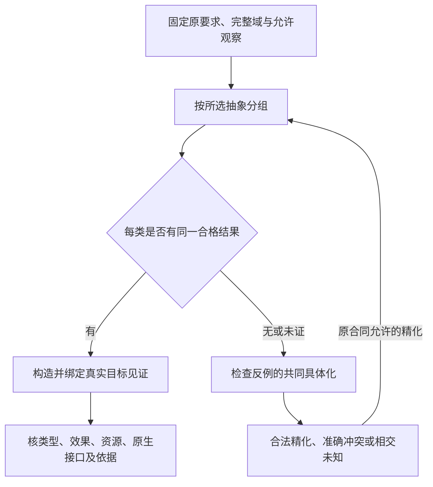
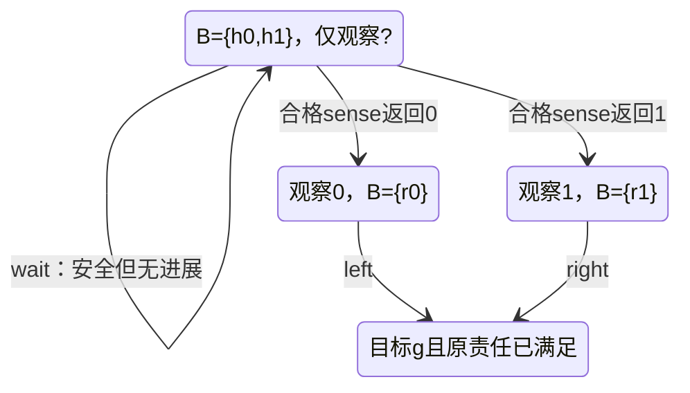

# 有限抽象与观察策略

本篇是[实现选择](实现选择与设计搜索.md)与[组合前提](组合前提与进展闭合.md#causal-choice-realizability)的限定方法正文：给定准确有限模型，构造可检查的抽象见证与因果策略，并说明何时可以证明不存在。它不替换原作者模型、MethodSpec、UseBinding、ReadSet或保证评价，不新增公共工具、语言关键字、全局求解器或必建服务。设计方法存在、工具可执行、目标代码已取得、现实准入和已运行分别判断。

## 输入与责任

原Candidate和requirementRefs固定实际任务，ruleBindings固定解释、观察与允许选择；MethodSpec声明下述有限方法的支持域。实际域、关系、转移、观察和候选集合来自固定输入或已取得供给，进入ReadSet，包括成员全集和否定查询。selectedUses保存规划期选择，经过物化与类型、效果、目标核对后才形成正式UseBinding。返回沿原Needs、ContractConflict、Unsupported及保证结论，不发布另一套通用状态。

| 拥有者 | 具体工作 | 不承担的工作 |
|---|---|---|
| semantics及领域方法 | 解释输入域、合法结果、作用时序、观察、终结与模型对应 | 不从缺失记录猜状态，不把环境选择改成系统控制 |
| compiler实现选择与组合 | 按需构造分组、共同见证、知识图和选定策略；保留真实依赖 | 不以规划结果签发实际权限，不重选已锁定的公共行为 |
| assurance | 核见证、前提、覆盖、反例具体化及保证种类 | 不把超时当无解，不把模型结论当现实映射已成立 |
| 目标与供给适配 | 将选定方法变成实际可用的目标函数、状态与数据路径 | 不凭有数学见证就声称具有源码、原生API或ABI |
| application/execution | 协调缺项及获准的取得/验证/作用，维持原操作与结算身份 | 不让换策略、换版本或取消删除既有副作用 |

已有合格绑定直接复用。普通短函数、精确参数编辑和无交互计算不需要知识集合或持久证明图；只有相应要求真实需要这些分析时才激活本方法。

输入域D、合法结果集合、动作与观察模型必须来自原要求、固定定义或有依据的推导，不能仅因为当前仓库只取得两个候选就把现实合法域缩成两个。承诺至少处理一个输入的任务不能把D改为空集获得vacuous success；真正允许空域的纯确定性合同可以报告该限定结论，交互模型仍要求非空初态。

## 确定性任务的充分抽象

固定合法域D及确定、总定义的要求结果R:D→O。O包含本任务真正要求的返回、错误、作用顺序、表示、资源或泄漏观察，不能为便于证明私自只保留最后一个标量。A:D→Q是拟采用抽象。存在仅依赖A(x)的消费者g，使R=g∘A，当且仅当：

```text
对全部x,y∈D：A(x)=A(y) ⇒ R(x)=R(y)
```

必要性：相同抽象输入不能让确定消费者产生两个不同必需结果。充分性：每个实际抽象类的R值相同，令g取该公共值即可；未由合法输入产生的Q元素不在此结论范围内。

关系x~y当且仅当R(x)=R(y)，给出唯一到类重命名的最粗充分划分。所有充分划分均细化它，但这不决定唯一数据结构、模块数或实现。A=R也可能已经计算了全部答案，没有性能收益；可计算性、总成本、目标表示、维护与回写仍要另核。无限域上这个判据仍表达数学条件，但不承诺通用自动判定。

确定有限任务如果已能完整计算R，可以直接按R(x)分组得到最粗等价类，不要求先枚举全部集合划分；小模型的15种划分枚举只用于独立核对。多结果任务的候选集合若是有限且完整列举，可以逐类求交；符号或无限域找到经核验的共同见证是正向依据，但“暂未找到”不构成空交或无解证明。

有限构造先完整枚举D、计算或取得有依据的A和R，再按A分组检查每组R一致；发现不一致时保留同组输入对及其不同必需结果。比较使用所选值与观察的相等关系，不用显示文本、哈希碰巧相同或浮点近似代替。合格类生成g的具体查表或等价实现，并核其时间、空间和目标成本；不是取得存在结论就自动采用查表。

例：D={0,1,2,3}，R为奇偶。全部15种划分中，4种充分，最粗者为{0,2}|{1,3}。常量抽象被0与1击穿。新增输入或新增观察以后，必须重核相交类，不能沿用旧域的穷尽资格。

## 多个合法结果与共同见证

当原合同确实允许对每个输入任选一个结果时，令L(x)为其合法结果集合。每个实际出现的抽象类q需要：

```text
C(q) = ⋂ { L(x) | x∈D 且 A(x)=q }
C(q) ≠ ∅
```

有限完整域中逐项求交可构造共同见证；空交则保存足以说明失败的输入及约束，不保证该见证是最小基数。每个L(x)非空甚至两两相交都不充分：{a,b}、{b,c}、{a,c}两两相交，三者没有共同结果。

多结果任务一般没有唯一最粗充分划分。L1={a}、L2={a,b}、L3={b}时，{1,2}|{3}与{1}|{2,3}都充分且互不细分；不能全合并。合法默认与稳定选择可以决定实际采用哪一个，不证明另一个错误。跨类还共享资源、输出或存在变量时，逐类见证必须进入原共同组合检查，不能各选一项互不相容的结果。

容差兼容也不自动传递。真实值0、1、2允许误差0.6，对应区间[-0.6,0.6]、[0.4,1.6]、[1.4,2.6]；邻接相交但三者空交。不得按邻接可兼容关系使用并查集，把所有输入合成一个可交付类。值相等、容差、读写兼容与成本近似使用各自真实规则。

本节不能用来删除原要求的随机联合分布、公平轮换、全部分支能力或跨运行非干扰。这些不是“随便挑一个合法值”任务，应使用[性质保持](性质保持与开放环境.md)的相应方法。

## 精化与真实目标交接

一次方法应用先复用已有合格绑定；确有需要时固定完整域和相交观察，构造分组及共同见证。失败后区分真实冲突、抽象精度不足、供给缺失和预算结束。可以在原本可观察、可计算且获准的区别内拆分类，再构造见证；不能用不可见秘密或未来结果精化运行策略，也不能为得到可行解缩小原合法输入。

合法精化必须严格拆分至少一个原等价类，并保持原输入域、允许观察和既有不同类；只改变编码、反复合并/拆分或重复得到同一失败不算进展。在有限D上，严格划分精化最多到单例划分，因此这个结构过程有有限上界；这不保证任意谓词求解、代码生成或外部供给取得会终止，也不能为继续精化私自引入未授权观察。

抽象反例必须能由同一具体输入或历史实现整条路径。具体边s→u、u→u、v→t，合并u/v后出现s→{u,v}→t；第一条边由u见证、第二条由v见证，但不存在这条具体路径。各边分别存在见证不够。具体化超时不能被当成已证明伪反例；实际具体化成功的坏路径才可反驳相应普遍性质。过近似出现坏路径不必是真错，欠近似没发现坏路径不证明普遍安全。

成功见证绑定到真实方法、参数、数据与目标成员；继续核实际源码/工具供给、类型、效果、资源、表示和ABI。有限预实例化不提供外部原生调用者对未来任意T的同形泛型API。数学见证已得但目标实现缺失时，保留存在结论和准确供给缺项，不声称产物已完成，也不抹去已得成果。



## 有限部分观察模型

采用如下明确画像：有限状态X、初态I、有限系统动作U、逐状态启用关系、非确定后继T、观察obs、安全集合S，以及已接受且可观察的终结目标G。系统先根据当前可见历史选择动作，再由环境从该动作允许的后继中选择真实后继，系统取得下一观察。其他先后顺序、连续时间、隐藏动作、并发微步或概率模型不能自动套用本算法。

模型必须包含本任务观察范围内的真实失败、取消、资源与外部作用责任；仅有HTTP完成或本地函数返回，不能被定义成全部责任已结算。I非空；G在所求安全域内且终结判断可由所选观察确定。没有实际观察能力时不能凭一个字段名使G可观察。确需其他目标模型时，另选择相应有依据的方法。

知识状态B是当前观察历史及自身动作仍允许的非空真实状态集合。初态是I与实际首个观察类的交集。承诺覆盖整个初态集合I时，必须核所有可能首个观察对应的非空知识状态，不能只选择一个有利观察；若任务已经固定实际首个观察，可以返回该观察下的条件结论。下一观察z′的更新为：

```text
post(B,a,z′) = { x′ | ∃x∈B：x′∈T(x,a) 且 obs(x′)=z′ }
```

只生成可能且非空的观察后继。相同当前观察可以因记忆不同而对应不同B；相同可见历史不能因隐藏真状态不同偷偷选择不同动作。可用动作必须在B的所有真实可能状态启用。空B表示观察、捕获或模型不相容，不是零风险、不可达目标证明或自动完成。

需继续响应的非终态没有共同可行动作，是进展缺口；合法终态才可以结束。已声明启用的动作没有任何后继时，必须解释其终结含义或报告模型错误，不能利用空全称获得保证。正常终态可在数学检查里补无作用自环，并不要求目标程序真的持续执行它。

## 共同前驱、安全与完成分别构造

对知识状态集合W，Pre(W)包含存在一个共同可用动作a、并且该动作所有可能观察后继都在W的B。Pre中的存在量词属于系统选择，后继的全称量词属于环境；不能交换。先按需建立完整的相交知识图，并保存动作覆盖与后继集合依据。

**持续安全。** 从所有B⊆S开始，重复W←W∩Pre(W)，直到不再变化，得到本有限知识图的最大安全固定点。对其中每个非终态选择始终留在W的共同动作即可保持安全；初始知识状态也必须包含在W。该结果允许永远等待，因此不证明完成。

**保证完成。** 在安全胜区W内，以L0={B∈W | B⊆G}开始，重复L←L∪(W∩Pre(L))。每一轮只读取上一轮的L；首次加入的轮数是rank。给每个非目标状态选择一个使全部后继rank严格下降的共同动作，则有限轮内进入目标。不能在更新中用尚未闭合的同轮互相支持制造下降证明。

安全或完成的正向见证只需要证明它实际选择的共同动作及全部环境后继闭合；声称“不存在任何合格策略”则必须覆盖全部被允许的系统选择。正向构造和全称否定需要的完备性范围不同，不能用一条失败路径代替后者。

安全依据来自闭合归纳，完成依据来自自然数严格下降。完整有限固定点可以对本画像判定初始知识状态是否存在所需策略；负面结论需要保存全动作覆盖与反制关系，不由单条失败样例推出。原模型不完整、枚举被截断或方法不支持时，不发布全域无解结论。

有限轮数没有毫秒单位。墙钟截止还需要动作、通信、观察、排队与收尾的适用上界；概率1完成、公平环境下完成、无限或连续系统、多执行信息流保证都不是本节的自动结论。

## 有无实际观察能力会改变结果

初态可能为h0或h1，观察均为“?”。left在h0到达g、在h1到达bad；right相反；wait保持真实状态。g正常终结，bad违反安全。

没有进一步观察时，wait可以持续安全，却无法保证完成。系统不能分别假定自己处于h0和h1后选择left/right，再把它们称为同一个可执行策略。

另一模型实际提供sense：h0到可区分的r0，h1到可区分的r1；之后按观察选择left/right。rank(g)=0、rank(r0)=rank(r1)=1、rank({h0,h1})=2。正常程序是sense，然后按真实返回分派。



sense的提供者、权限、时序、失败、输入是否在查询后改变、是否会重复原效果及其资源成本，必须真实成立。增加一个假想查询接口、私下拆分隐藏状态或改变图上的名字不解决现实信息不足。不能为获得进展而扩大原动作许可。

## 有限证据、预算和复用

对固定完整封闭域，完整枚举或完备有限状态方法可以支持该域及观察下的全称结论。有限样本、事故库和不完整状态遍历不能获得同一资格。域外输入、新版本、隐藏状态、不同观察、环境映射与检查器可信性仍按实际前提判断；既不能扩大有限证明，也不能因为开放世界一般困难就否定已完整核对的有限结果。

知识状态最多有2^|X|−1个非空集合，有限不等于可承受。默认按需展开小而准确的模型；闭图后的反向工作表传播、建图、集合运算、谓词判定、证据消费和目标生成分别核成本。有真实规模瓶颈再选合格符号/反链方法；不能悄悄降级保证，也不承诺一个通用表示永远最优。

预算结束后，已核初态、选定动作及全部后继的封闭安全子图可以支持自己的范围；具有完整下降关系的子图可以支持对应完成；已具体化反例可以立即反驳相应普遍Claim。未探索的无关候选不抹去这些成果，但依赖未检查边界的结论继续未知，全域不存在仍须完整覆盖或适用完备依据。

域成员、允许结果、转移、启用条件、观察、终结、解释、目标供给和被要求的成本关系变化，分别使真实消费者重评。输出看似相同不等于域穷尽证据可复用，新增未见失败边不能被漏掉。策略与证明不产生Grant；撤权、原操作未结算和当前资源继续由真实作用边界检查，不合成一个全局版本号。

<a id="finite-method-cost-and-boundary"></a>
### 方法成本、精化终止与接入边界

对固定的小模型默认按需建图、位集合编码和动作节点的反向工作表。令N为实际知识节点数、K为节点—动作对数、E为动作到观察后继的边数；在准确完整图已取得、集合索引已建立且每条关系只处理有界次的计数实现下，安全剔除或可达层次传播可按O(N+K+E)核算。模型建图、位集合操作、任意谓词/相等判断、证据解析与目标生成另计，不能凭工作表复杂度宣称全流程线性；朴素逐轮扫描的小实现也合法，但计入其重复扫描。

有限精化的终止依赖每次严格细分和有限可用区分域，不由“反例驱动”这个名字保证。开放域允许经适用方法取得共同见证并支持存在性，但已试候选空交或没有找到见证不证明全域不存在。预算结束保存准确前沿和已有合格候选；再进入须有新条件或相应有界探索策略，不重复确定性失败。普通纯确定任务的合法域可以在原合同允许时为空，结论明确限于该域；这不覆盖本篇交互模型的非空初态前提，也不能把原本承诺处理请求的产品缩成空域。

本篇的持续策略默认具有继续响应义务。只要求状态安全且允许合法停顿/停止的合同，应明确将该行为纳入模型；不能用“非终态无动作”替原需求擅自增加进展要求。公平条件、概率1、多执行关系、连续时间、无限队列和弱内存不能靠有限轮算法自动取得；可以使用有依据的有限抽象或其专门方法，保留准确剩余条件。

实现选择通过[有限方法接入](实现选择与设计搜索.md#finite-abstraction-realization)消费域、见证、coupledGroups和真实目标，组合器通过[策略接合](组合前提与进展闭合.md#finite-observation-strategy)消费模型与进展；[保证评价](../运行/验收/方法与独立证据.md#finite-witness-evidence)独立接纳具体证据。这里的接口关系不创建新公共schema；已有Candidate/MethodSpec/ReadSet/selectedUses/UseBinding继续拥有各自身份。要求原生泛型、特定ABI、成本硬界或外部作用时，不能仅交一张数学策略表代签这些责任。

## 验收输入与依据范围

应核对：奇偶的完整15划分；两个不可比较的充分划分；三集合两两相交而总交空；容差链；整条抽象反例不可共同具体化；无sensor安全但不能完成；有合格sensor的rank下降；空知识状态；非终态无共同动作；启用动作空后继；终结不可观察；新增失败后继；部分预算下已闭合子图；目标见证缺供给或不具备开放原生泛型API。它们是设计验收条件，不是SEC运行通过。

该有限方法依据原理及给定集合推导；部分观察博弈的背景来自Chatterjee、Doyen、Henzinger、Raskin《Algorithms for Omega-Regular Games with Imperfect Information》（2007，https://arxiv.org/html/0706.2619v3）。抽象近似方向参照Cousot的介绍（https://www.di.ens.fr/~cousot/AI/IntroAbsInt.html）；因果与输入输出时序参照Spot ltlsynt官方说明（https://spot.lre.epita.fr/ltlsynt.html）。2026-09-22读取论文与Spot页面，用途限定为模型、观察与策略的相交依据；不把原论文的全部结果或历史未决移植为当前产品结论，不将这些工具设为必需依赖。
