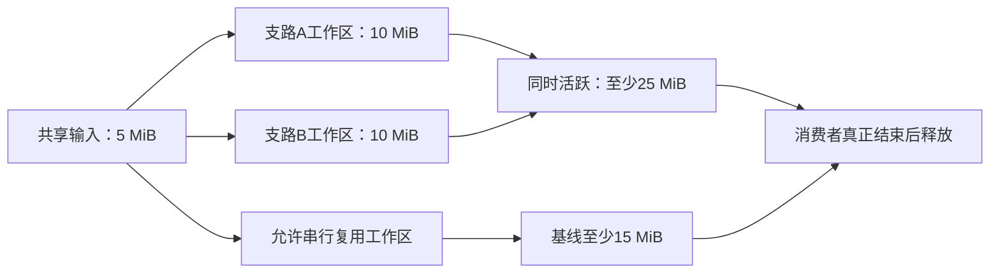
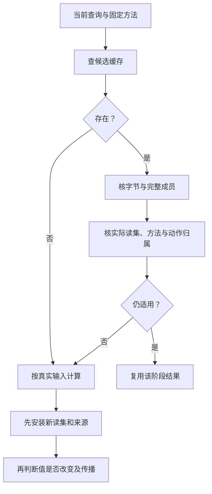

# 查询影响与性能

> **阅读范围**：采用范围内的设计规范；实现状态另查未决。

<details>
<summary>本页内容</summary>

- [需求关系与作者投影的依赖](#需求关系与作者投影的依赖)
- [作者类型推导的真实依赖与差异](#作者类型推导的真实依赖与差异)
- [直接编辑的版本合并与按需分析](#直接编辑的版本合并与按需分析)
- [逆向编辑与内容保留的缓存责任](#逆向编辑与内容保留的缓存责任)
- [作者变化、实现变化与目标成员的失效](#作者变化实现变化与目标成员的失效)
- [位置捕获与语言规则变化的缓存依赖](#位置捕获与语言规则变化的缓存依赖)
- [作者结构、出现身份与缓存相等分别消费](#作者结构出现身份与缓存相等分别消费)
- [端到端预算的组合规则](#端到端预算的组合规则)
- [结果值与契约预算的分域失效](#结果值与契约预算的分域失效)
- [多解析域的增量键与重新归属](#多解析域的增量键与重新归属)
- [可达输入声明、依赖证据与负依赖](#可达输入声明依赖证据与负依赖)
- [变更影响、选择与最小充分闭包](#变更影响选择与最小充分闭包)
- [增量编译、依赖与缓存正确性](#增量编译依赖与缓存正确性)
- [快照查询与增量失效算法](#快照查询与增量失效算法)
- [程序分析查询系统与固定点引擎](#程序分析查询系统与固定点引擎)
- [编译器性能模型与复杂度防护](#编译器性能模型与复杂度防护)
- [编译缓存、远程执行与内容寻址存储](#编译缓存远程执行与内容寻址存储)
- [作者体量、派生体量与模型上下文](#作者体量派生体量与模型上下文)
- [作者交互的成本合同](#作者交互的成本合同)
- [扩展数量与提示范围的非增长验收](#扩展数量与提示范围的非增长验收)
- [把失败定位到产生开销的责任](#把失败定位到产生开销的责任)
- [业务变更的设计影响与运行状态不要共用缓存资格](#业务变更的设计影响与运行状态不要共用缓存资格)
- [编译依赖与目标算法工作不是同一种增量](#编译依赖与目标算法工作不是同一种增量)
- [查询从读取到缓存发布的具体过程](#查询从读取到缓存发布的具体过程)
- [封装下的接口与实现失效](#封装下的接口与实现失效)
- [控制与资产变化的真实增量边界](#控制与资产变化的真实增量边界)
- [省略信息的来源也必须进入真实依赖](#省略信息的来源也必须进入真实依赖)
- [作者表示、布局与研究复用的依赖边界](#作者表示布局与研究复用的依赖边界)
- [共享查询在并行调度中的发布与取消](#共享查询在并行调度中的发布与取消)
- [任务展示、语义读集与验证复用的不同缓存](#任务展示语义读集与验证复用的不同缓存)
- [实现数据流中的缓存发布与资格](#实现数据流中的缓存发布与资格)
- [装配版本和结果资格的分离失效](#装配版本和结果资格的分离失效)
- [状态拓扑、回调与运行快照分开失效](#状态拓扑回调与运行快照分开失效)
- [目标关系增量与编译查询的不同闭包](#目标关系增量与编译查询的不同闭包)
- [代码、数据、计划与观测的分别复用](#代码数据计划与观测的分别复用)
- [即时运行中的代码复用与可变状态](#即时运行中的代码复用与可变状态)
- [稀疏控制变化的实际失效范围](#稀疏控制变化的实际失效范围)
- [需求变化、候选补全与复用边界](#需求变化候选补全与复用边界)
- [信息检索、索引代与披露复用](#信息检索索引代与披露复用)
- [开发反馈的局部复用、取消与结果归属](#开发反馈的局部复用取消与结果归属)
- [默认、公开边界与交付形式的相交失效](#默认公开边界与交付形式的相交失效)

</details>


## 需求关系与作者投影的依赖

已绑定CompletionView只缓存当前Requirement、对象域、语义方法和来源的派生结果，不成为作者真相。查询当前合同可以只取需要的形状；输入缺少的跨域保持条件不能被“没展示”省成不存在。

缓存键区分语义方法修订、所选论域/投影、实际参数、帧和用途。集合查询记录集合依赖，字段或端点查询记录对应角色；模型新增加一条边会改变反向索引，即使屏幕上没有显示那条边。只改排版或图布局不应改变程序键；改变一个源参数而所得例子值相同，也仍然更新真实依赖。

改验收方法不改产物字节身份，但更新该声明支持；编译优化实际依赖该方法结果时，相交生成资格重新处理。NoWrite与终态等值的检查结果不共享同一语义键。原生文件集合未取得完整覆盖，不以若干相同mtime签发全局不变。

当前结果发布中的请求修订属于目标程序运行状态，不进入所有编译查询的全局失效键。持续编辑时，旧计算可完成并结算，却不能用旧候选结果覆盖新修订；原子比较及发布由真实拥有者负责。

<a id="plan-read-projection-invalidation"></a>
### 计划、短源分析与产物使用各自的读投影

同一任务以原ReadSet记录下列读法，不把所有阶段装进一个全工程epoch：

| 变化 | 需重新处理的消费者 | 可以保持的内容 |
|---|---|---|
| 添加一条显式固定，当前有效值与原默认相同 | 接受来源、计划、未来覆盖规则及相应保证 | 未消费来源且实际代码输入不变的产物字节 |
| 函数类型不变但潜在效果改变 | 效果分量、公开调用资格、使用该效果的计划/优化 | 只消费固定类型形状的分析结果 |
| 增加可竞争导出或实现 | 实际读取候选集合/负查找的选择 | 已固定且不要求重新选优的合格绑定 |
| 两个文件不重叠，但共享的图基数/公开合同改变 | 对应计划前提、联合更新及保持检查 | 未读该关系且不共享其他不变量的变化 |
| 只是修改图布局、普通说明样式 | 精确展示与对应位置 | 不消费这些信息的语义和目标计算 |
| 运行中的graphRevision改变 | 使用该数据的索引/预览/发布 | 固定代码及编译查询；除非数据本来就是构建输入 |

计划的写位置不够决定新旧兼容，必须核它实际读过的契约、集合和不存在性。旧读集未知时保守扩大相交范围或重新捕获，不返回无依据的Rebased成功。重执行时按[既有算法](#结果相等仍需更新依赖)先安装新读集再比较结果，避免X与Y当下同值而下一次漏掉Y的变化。

类型形状、效果摘要和最终可调用索引是相关但不同的查询结果；`closeEffects`只依赖类型就绪视图和准确导入边界。不能为了避免循环，去掉真实效果依赖；也不能把未完成效果记成“暂时空，以后再补”。初版可完整重算受影响模块/分量，在同义结果和真实读集成立后再缩小粒度。

## 作者类型推导的真实依赖与差异

函数/函数值的推导键包含源与精确规则、已写类型约束、实际导入签名、名义身份、预期类型和所读主体。没有全局候选类型搜索；无关库多了同名字段不应使原lambda重新选类型。声明种子和待推导变量不能跨请求共享可变结果，ClosedHeaders才按准确内容复用。

仅改优惠20为30，类型结果可能复用而主体/对应/运行结果变化；上游payable参数变化，即使本文件字节未改，也要重新求签名并核公开接口。显式注解与相同推断值可能生成相同目标，却有不同的后续约束责任，不能删除差异。短import移动导致默认别名变化时，绑定和精确编辑索引失效范围与单纯文件展示移动分别处理。

工作集捕获和批次规则不变。查询未闭合只阻塞真实消费者；不存在类型时不能把NeedInput、AnnotationRequired和TypeError混成永久负缓存。原源不需要为了缓存命中保存展开文本。

## 直接编辑的版本合并与按需分析

文本改动先保存在真实可写层，工具按[工作集捕获](../开发/原生维护/导入观察与原生资产.md#text-workspace-capture)取得有限输入。编辑通知只使依赖变旧；除明确启用的诊断/watch外，不逐次发起全工程生成，更不执行目标。允许合并尚未开始分析的连续版本，但不能将未取得的中间状态伪称已验证。

普通查询只计算回答所需阶段，preview处理所选根；generated-edit为验证回源而进行再生成时，使用准确C0/C1和目标规则。旧任务结果可以保存为旧候选结果，只有当前展示仍指向该基础时才能显示为当前；取消等待不释放仍被计算使用的字节。未解决的目标手工草稿对相交生成写出形成冲突，不能被自动watch覆盖。

缓存键使用固定内容、解释、有效控制和实际依赖，不使用watch事件计数替代内容。多个文件在不同时刻取得的内容只获得其实际覆盖资格，不因全部摘要齐全就自称原子工作区。

<a id="supply-invalidation"></a>

## 逆向编辑与内容保留的缓存责任

受管目标修改固定原产物、原作者和当前作者三个对象。来源映射、写回规则、布局与source slices按实际消费进入查询依赖；纯显示图排版不使目标重新编译，隐藏来源变化却可能使旧编辑引用失效。对映射到多处的共同定义，相关出现集合也是依赖，不能只记选中的一个目标位置。

缓存键中不递归加入每次查看/检查时间和前一回执身份；相同实质内容继续复用。写回不是以缓存命中为授权；每次披露和采用仍核当前权限。映射查询只得到精确范围时仍不可推导唯一源修改，写回能力另由[往返合同](表示/编辑与受管回源.md#managed-edit-roundtrip)判断。

承诺长期可编辑的来源与补充进入原内容保留根，不按可重建IR缓存TTL清除。来源确实丢失时返回缺项或恢复准确版本；无来源文件可作为新原生作者接入，不能猜回历史源身份。旧目标改动与当前源无关变化可三方合并；相交语义或规则变化触发真实重算，不把旧映射重新贴到当前头。

## 作者变化、实现变化与目标成员的失效

缓存分别保存作者解析、导入签名/合同、使用点选择、目标生成和实际检查；不能只以SEC源摘要作为全程键。无作者主体的导入根同样具有真实依赖。凡是影响使用点的原生声明、条件导出、方法、表示、初始化或目标规则，都记录在它实际消费的阶段。

| 变化 | 必须重新处理 | 可以继续保留的内容 |
|---|---|---|
| 只有运行输入字节变化 | 相应运行和派生结果 | 程序、导入签名、合法绑定与生成制品 |
| 参数/源码行为变化 | 相交源分析、调用与产物 | 无关模块和提供者内容 |
| 原生声明与实现版本变化 | 相关导入视图、调用资格、依赖与生成/检查 | 未使用该供给的定义；不能假定全部行为等价 |
| 只改变公开类名或文件布局 | 相关目标布局、源映射、ABI消费者和检查 | 真实独立的语义分析 |
| 同代码/签名但资格或安全条件变化 | 采用/执行资格；依赖该依据的优化 | 历史产物字节和原检查事实，不给其继续使用的假许可 |
| 增加未使用的库或方法 | 仅真实查询过该集合的选择结果 | 固定已有绑定和不读该集合的普通构建 |
| 图标/资源内容变化 | 必需成员、打包和真实使用它的运行结果 | 不消费该资源的算法与目标调用 |
| 目标依赖解析改变 | 相关类型身份、ABI、运行和构建结果 | 不依赖这些选择的其他目标 |

默认复用已有合格绑定而不升级。供给缓存保存代码与只读合同，不保存目标运行的可变hash对象、解析游标或连接。同步调用没有可见外部写效果，也不意味着内部状态可跨调用共享。权限撤销限制披露与实际动作，不能改写历史来源。

## 位置捕获与语言规则变化的缓存依赖

编译分析的缓存键包含实际语言规则、函数定义、调用合同及其依赖；捕获/逃逸摘要变化要使相交的效果消解与优化资格失效。把原来的内部闭包改成返回值，虽然签名的某些外观可能相似，也不能复用旧的“位置不外逸”依据。

目标程序运行中的闭包位置不是编译查询缓存。一次运行里的`next()`读写位置，不能因函数定义、参数或外围函数公开效果为空而记忆化。对真正稳定纯计算复用结果时，仍核实际依赖、错误与所承诺资源；不会把所有闭包都禁止优化。

来源目录的重新分类和链接修正不进入程序编译键；采用的新语言规则、工具实现或已消费证明变化才进入相交计算。文档维护的资料状态和目标运行状态不使用同一个“最新”版本。

## 作者结构、出现身份与缓存相等分别消费

基础结构入口带来的缓存输入由[结构作者合同](../作者/组合/结构编辑与身份保持.md#并发版本与缓存的接合)解释。表达式编码的对象字段次序可以不参与语义，但实参列表、字段初始化、短路与分支区域参与；规范摘要不能把它们当无序边集排序。两个同内容调用的源码出现不合并，运行求值共享只由合法变换产生。

重命名或文本格式变化可能保持纯数值分析，却改变引用显示、CST、来源映射、公开导出或诊断。实际读集和映射先更新，再允许不消费这些信息的查询复用。临时查询/端点句柄不进入目标私有名字，公共名及确有消费者的身份仍参与对应生成键。

同一基础上的文本与结构编辑可以比较公共语义；两个首次独立工程的内容即使相同，也不共用权限和作者谱系。相同语义缓存仅在隔离与观察条件允许时复用，不将旧源位置或旧结果资格贴给新候选。正确基线可按整个模块重新检查；短结构输入省的是模型往返，不承诺分析必定只需常量工作。

## 端到端预算的组合规则

<a id="fig-memory-liveness"></a>

### 图解：峰值内存取同时活跃分配，而不是阶段最大值

示例输入5MiB、每支路10MiB工作区；未画出的输出、对齐与运行器开销仍需加入实际预算。



本节拥有相交路线的预算组合，不重新拥有算法语义或授权。预算来自任务要求和已接受画像；每项记录量纲、主体、范围、工作量、上下界/统计/估计性质及来源。没有某项要求的纯函数不填写空预算表；用了具体资源仍须由真实宿主限制。

### 先固定场景再比较

同一比较使用相同输入规模与分布、精度/错误合同、冷热状态、并发与环境、输出实际消费者和观察区间。编译、安装、首次初始化、单次执行、长期维护分别报告；被重复共享的固定成本可以按明确使用次数计算，但不能用预期长期摊销掩盖首请求的硬期限。选型时的假设与测得结果分开，实际数值未取得时采用有条件默认，不填伪造测量。

### 延迟与吞吐

串行无重叠路径的时间等于实际各阶段、转换、等待和同步时间之和。若某些工作合法重叠，依据执行图求关键路径；这个结果只有在假设资源可同时供应、排队可忽略或已纳入时才成立。共享CPU、内存带宽、设备队列或外部配额会产生竞争，不能先取分支最大值后宣称硬截止期满足。

吞吐是稳定负载及服务率的性质，不是单次延迟的倒数；流水线首项、稳态和排空成本分别计算。无法保证上游速率不超过下游，必须有有限缓冲与背压、拒绝或任务允许的丢弃策略。P99不当最坏界；保证每次完成需要相应最坏路径与环境条件。

### 峰值内存与所有权

令a为一次真实物理分配，size(a)是其占用字节；Live(t)为时刻t仍被执行、返回结果、异步设备或恢复责任持有的分配集合。对每个受约束的进程地址空间、内存池或设备分别计算`max_t Σ[a∈Live(t)] size(a)`，再加入该范围的分配器、运行库与其他已知开销。CPU与GPU各有配额时不能合成一个总数代替两个上限；只有另有跨池总预算时再计算对应总量。这里只对真实相同分配去重，逻辑内容相同但分别复制的对象必须分别计数。

例：同一内存池中，两分支各有10 MiB工作区，共享同一5 MiB只读输入，结果内存与运行开销暂且假设为零。并行时需要25 MiB，而不是max(15,15)=15 MiB；按30 MiB相加又重复计了一份共享输入。若合法顺序复用工作区，峰值才可能降到15 MiB。真实结果、设备在途与清理责任非零时另加；这个假设例不构成硬件测量。

释放依据最后实际使用和异步完成；取消仅是请求，不是内存马上可重用。分块只能减少它真正替换的临时区域，完整输入和结果仍驻留时照计。改变布局、并行或缓存选择，要重新计算相交寿命。

### 数值误差传播

误差必须写明空间、范数、输入域、绝对/相对口径和有效路径。设f从X映到Y，g从Y映到Z，精确链为g(f(x))，实现分别为f̃和g̃；Y与Z分别选择对应误差范数。若`||f̃(x)-f(x)||_Y≤ε_f`，且g在包含两种中间结果的区域上满足`||g(y1)-g(y2)||_Z≤L·||y1-y2||_Y`，且`||g̃(z)-g(z)||_Z≤ε_g`在所有实际到达的中间值z上成立，则先在精确g(f̃(x))处分解误差，再由三角不等式得到：

`||g̃(f̃(x))-g(f(x))||_Z ≤ ε_g + L·ε_f`。

ε_f以Y的单位计，ε_g与最终界以Z的单位计；L包含相应尺度换算，不能拿两个不同量纲的误差直接相加。

没有上述共同定义域和稳定性依据，不能机械相加两个局部误差。假设L=20、ε_f=0.1、ε_g=0，则组合界是2，不是0.1；任务要求绝对误差至多1时，当前界不足以证实保证。它未必证明某个具体实现真的超差，可以收紧分析或换方案；不得直接标成已满足。精确整数路线不需要构造浮点误差预算。

相对误差在真值接近零时需要专门尺度；区间失真、离散分支、极端条件数和截断会改变传播，交由相应数值合同。算法模型误差、离散误差、舍入误差和随机估计误差不先合为一个无解释的ε。

### 失效概率与共同原因

只有取得有口径的事件概率界才计算风险。对同一次任务中的失败事件F_i，联合失败概率可用`P(∪F_i)≤min(1,ΣP(F_i))`作保守上界，这不要求独立性；把组件成功率直接相乘则需要实际相应独立或条件概率依据。共同电源、同一错误生成器、共享数据集和相同授权根会使独立假设失效。

没有可靠概率时，保留故障情景、后果与可恢复边界；不能因无数字就当零风险。目标行为和强制权利约束也不通过平均概率抵消。

### 预算结果怎样进入选择和执行

选型用上述组合判断硬预算、比较有依据的成本；动态执行仍使用当前资源准入。静态范围不足可以保存条件设计或选择更保守候选，不能把估计上界签成真实配额。允许流化、降低并发、重算时采用它们并重新计算；不允许外部落盘或降低精度时，资源不足就返回该限制而不偷换方案。

每条测量或上界记录其输入和方法依赖。共享资源、目标布局、上游误差或任务时间窗口改变时，相交组合重新判断，即使源程序的数学返回值保持不变。对不受影响的普通值消费者可以继续复用，预算消费者不能沿用旧结论。

## 结果值与契约预算的分域失效

一次查询可以被不同消费者使用：普通值、输入域/效果摘要、目标布局、成本估计、证据资格和来源定位。它们引用同一实际内容，但比较键与失效前提不同。实现可以使用一条复合结果加投影，不另建六个查询服务。

重新求值后先原子发布本次真实读集，再计算各投影的差异。值不变而输入域缩窄，普通值消费者可以不重算，契约消费者必须重新判定；数学结果不变而从主机转为设备驻留，布局/成本消费者必须更新；同字节但授权资格改变，只影响相应披露/执行，不直接使纯算术缓存内容失真。

当新边连接两个此前分开的组件，更新后的依赖图先重建受影响分量，再传播到旧结果消费者。删除支持依据时按原重算规则处理，不能使用旧绿色证明自己仍有效。未被读取的库新增仍不会导致所有结果失效，涉及候选枚举或不存在线索的查询则记录其实际范围。

缓存发布前核对输入版本与方法身份，异常、取消或未完成分析不进入成功结果。可以缓存完整结束的诊断，必须保留其方法、输入、覆盖与结果类别；执行失败不能成为“该程序没有解”。结果共享不授予读取权，也不替代[动作归属检查](#结果字节与动作归属的两种完整性)。


<a id="project-context-invalidation"></a>
## 多解析域的增量键与重新归属

[projectView](../作者/工程源/清单模块与绑定锁.md#project-prepared-view)中的工程/模块出现用于定位来源与解析，不直接成为每个阶段的大键。已有QueryKey采用以下投影；没有实际消费的域不得被追加为全工程失效开关。

| 查询 | 必须固定的输入 | 不因其存在就纳入的内容 |
|---|---|---|
| 词法/CST | 源字节、编码、词法/语法规则、保留格式约定 | 目标设备、未读的依赖库、操作权限、显示会话 |
| 导入解析 | 导入发生位置与角色、已绑定解析器、锁选择、原生配置继承与条件、实际搜索/不存在观察 | 与该域无关的另一项目锁、未查询目录 |
| 类型/效果 | 声明/主体、名义身份、解释、实际导入摘要、相交约束与已消费分析 | 不改变解释的第二目标标签、其他请求的当前候选 |
| 实现选择/降低 | 真实合格调用、目标能力、稀疏控制、所用方法、实际候选集合与保持前提 | 未枚举也未使用的新方法包、阅读HTML及图排版 |
| 布局/成员装配 | 根需求、实际贡献、目标命名/路径规则、既有布局、必需资源/依赖角色 | 新检查时间、别的输出根的独立运行结果 |
| 检查/作用准入 | 精确声明/主体、实际方法/环境/输入；作用另核当前授权与前像 | 不能把字节缓存命中等同现时允许执行 |

一个ModuleUse改了解析域，但最后找到同一接口和相同类型，仍先安装新的实际读集再判断投影相等。否则旧查找域的目录变化会继续触发，而新域新增遮蔽文件却被漏掉。相同值只是某投影可停止传播的依据，不是撤销此次依赖更新的理由。

### 移动、配置继承和新增文件的处理

模块A从`lib/a.sec`移到`feature/a.sec`，其相对导入`./b.sec`必须在新位置重新解析。只有实际仍绑定同一b且语言合同允许时，才保持相应语义摘要；CST位置与来源映射仍更新。不能仅凭a字节相同复用旧绑定，也不能因路径变化重新生成一切无关数学辅助。

原生配置继承链中上层文件改变，先更新真正消费该选项的resolutionDomain。若只是改变构建输出路径，前端语义可以保持；改变模块解析、严格性或所用库声明，则影响相交分析。未取得选项语义时不能自行分类为“仅格式”；用保守重查或报告适配能力边界。

目录枚举和负查找保留范围版本与筛选规则。新增文件可能遮蔽原解析、增加全部公开根的成员或改变生成器输入；只追踪已读文件hash无法捕捉这些变化。单一显式根不因无关新增文件而失效，但其实际引用或所用候选集合变化除外。

### 共享计算与共享资格分开

合格纯内容可以在相容隔离范围内共享，返回时重新绑定当前来源位置、当前结果消费者与披露条件。两个客户端共享同一计算不意味着共享当前显示选择；一个工作区失去读取权也不使另一获准工作区的数学结果变成错误。不能跨无权边界泄露内容存在性、私有路径、诊断和命中时序。

缓存对来源/名义身份不敏感的子结果可以共享；带私有身份的结果必须保留相应命名空间。复制工程时不能因字节一致把两个私有类型合并；同一工程两目标使用同一中立语义时也不应被任意targetName拆成两份前端。这两种错误方向都由具体读投影解决，不引入万能“严格缓存”全局选项。

最低正确实现可以整域重新解析、整模块检查和整布局组重规划；后续缩小粒度必须与相同输入的干净计算一致，包括失败类别、来源和成员集合，而不仅比较成功代码字符串。缓存丢失允许正确重算；关键作者来源或未结算操作记录丢失不能被当普通缓存失效。

## 可达输入声明、依赖证据与负依赖

### 1. 根修订

任意程序和开放环境的真实输入依赖不能普遍精确计算。SEC 不再把 `ExactInputClosure` 作为所有动作的默认真值，而是编译带证明等级的 `InputDependencyClaim`。

### 2. 依赖证据等级

```text
DependencyEvidenceLevel =
  | ProvenExact
  | SoundOverapproximation
  | BoundedExhaustive
  | StaticApproximation
  | DynamicallyObserved
  | ProviderDeclared
  | Assumed
  | Unknown
```

| 等级 | 可保证 | 不能保证 |
| --- | --- | --- |
| ProvenExact | 声明域内完整正/负依赖 | 域外环境 |
| SoundOverapproximation | 不应漏真实依赖，可多失效 | 最小失效 |
| BoundedExhaustive | 有界状态/路径内完整 | 无界未来 |
| StaticApproximation | 由分析器性质决定 | 动态反射和外部状态 |
| DynamicallyObserved | 当前执行路径真实 | 未执行路径 |
| ProviderDeclared | 合同声明 | Provider 诚实和完整性 |
| Assumed | 在假设下可用 | 假设真实性 |
| Unknown | 无正式复用权限 | 任何局部性结论 |

上述旧枚举混合了结论强度和取得证据的方法，不能当作全序成熟度阶梯。规范解释分开记录 `soundness/completeness/scope` 与 `method/proofOrObservationRefs`；保留旧标签作为可读摘要，不用标签本身授予缓存权限。动态读集若经过受控环境、负依赖记录和确定性验证，可支持相应封闭域内的更强结论；普通抽样跟踪不能。静态分析也只有给出健全性范围时才是健全过近似。缓存安全等级不由“静态/动态”两个词决定。

### 3. InputDependencyClaim

```text
InputDependencyClaim = {
  actionRef,
  rootSubjectRefs,
  positiveDependencies,
  negativeDependencies,
  directoryMembershipDependencies,
  environmentDependencies,
  temporalDependencies,
  authorityAndPolicyDependencies,
  providerAndToolchainDependencies,
  dynamicAndOpaqueFrontier,
  evidenceLevel,
  soundnessAndCompleteness,
  proofOrObservationRefs,
  validityHorizon,
  invalidationTriggers
}
```

### 4. 负依赖

“文件不存在”“没有其他实现”“目录中无额外配置”“环境变量未定义”“没有外部消费者”都是影响结果的输入。它们必须绑定封闭世界边界、枚举方法和 freshness。

没有封闭边界时，只能表示：

```text
not-observed-within-coverage
```

不能表示全局不存在。

### 5. ActionKey 与复用资格分离

```text
ActionKey = digest(
  algorithmRevision,
  normalizedDependencyKeyMaterial,
  included immutable inputs,
  applicable policy/provider/environment semantics
)
```

```text
CacheEligibility =
  dependency evidence permits formal reuse
  and claim validity not expired
  and no frontier trigger occurred
  and result subject remains readable and valid
```

相同 ActionKey 不自动签发可复用，尤其当 dependency claim 只是动态样本或假设。

`normalizedDependencyKeyMaterial` 包含参与计算的依赖身份/版本、负条件、范围选择器和解释规则；审查人员、证书文本、验证时间及无关观察批次不进入它。依赖证据引用单独附在回执，由 CacheEligibility 检查。若新的证据改变了依赖集合或信任政策要求，则重算对应键或重新确认复用；并非忽略证据变化。

### 6. 局部失效

- `ProvenExact`：只失效反向可达闭包；
- `SoundOverapproximation`：允许保守扩大；
- `BoundedExhaustive`：只在有界范围内局部；
- 其他方法标签：只有另外提供满足所需范围的健全性证据时才能正式复用；否则仅 advisory reuse 或重新执行/额外验证；
- `Unknown`：正式结果不得命中缓存。

### 7. 隐藏输入发现

组合使用：

- 静态分析；
- 受信读集追踪；
- 目录和不存在性监控；
- 环境 allowlist；
- syscall/provider tracing；
- clean/incremental 差分；
- metamorphic injection；
- 随机全量重算；
- hostile Provider；
- 跨平台重放。

这些提高置信度，但不能普遍证明开放系统零隐藏依赖。

### 8. 环境和时间

墙钟、随机、locale、timezone、CPU feature、filesystem、network、credentials、remote service 和 rate-limit 只有实际影响结果时进入依赖。若无法封闭，动作必须声明环境敏感和有效期。

### 9. 验收

- 依赖 Claim 有等级；
- 缺失依赖不被命名成 exact；
- absence 有封闭边界；
- 低等级闭包不能签发正式缓存命中；
- clean/incremental 差分发现漏边时使旧 Claim 失效；
- ProvenExact 范围内，无关变化保持结果；健全过近似允许多失效，不能承诺最小失效，但不得漏掉真实影响；
- 动态 tracing 不被推广到所有路径；
- 旧 `ExactInputClosure` consumer 迁移后退役。

### 10. 语义依赖、隔离与实时授权

租户命名空间和读权限决定谁能读取/使用缓存；它们不必无条件改变纯计算的内容键。策略、租户配置或凭据若实际改变计算语义，则相应不可变语义输入必须进入键。实时撤销、配额、可用性和过期检查属于复用/执行资格，不能被旧缓存绕过。

秘密影响输出时，不能为避免暴露而直接漏掉依赖：采用受保护的范围内身份/密钥化机制，或禁用该类缓存。公开低熵秘密的普通哈希也可能泄漏信息。

新增候选对已冻结 Binding 的重放不必产生变化；对正在运行的求解、枚举或最佳候选选择，候选集合成员关系本身就是依赖。应失效对应选择声明，而不是承诺任何新候选都不改变旧结果。

### 共享计算的隔离与派生数据

内容地址不签发读权限。默认按受信执行域、数据分类和已授予读取范围隔离复用；两个调用者各自能读一半输入，不构成一个能读两半的合法共享执行。只有服务已有覆盖完整输入的明确读取权，且每个返回都独立检查当前披露资格时，才能合并计算。

输出、诊断、来源图、向量索引和缓存命中信息都可能包含敏感输入的派生信息。默认继承实际读取数据的限制；解除限制必须由有权、适用的去敏/聚合合同决定，不因为输出是哈希、嵌入或统计量就自动公开。无法精确分离泄露依赖时保守限定共享，不能以性能要求静默降级。

可缓存字节与可向当前主体交付分层。命中后重新检查当前策略；撤权不要求无关纯值全量重算，但阻止新的披露。已经交给客户端或模型的数据不能靠撤权从其记忆中追回；停止后续提供、收窄续做及清理本系统可控副本，外部保留按实际提供者合同记录残余。

私有缓存避免向未授权者提供全局存在性接口、可枚举摘要或精确跨租户命中计数。需要抵抗时序与资源侧信道的画像还需资源隔离/隐藏命中等专门机制；上述命名空间检查本身不证明非干扰。

## 变更影响、选择与最小充分闭包

### 1. 文件变更不是完整影响

影响传播需要语义、配置、权限、资源、验证、数据和外部关系。文件 diff 只是起点。

### 2. Delta

```text
EngineeringDelta = {
  addedRemovedChangedSemanticRefs,
  bindingAndPhysicalChanges,
  policyAuthorityEnvironmentChanges,
  sourceAndArtifactChanges,
  unknownAndCoverageChanges
}
```

Delta identity 有方向并绑定已经验证的 `from → to` 端点 lineage、比较器合同及比较器 revision；交换端点、替换比较器或无法解释任一端点时是不同或不支持的比较，不能沿用旧结果。比较器输出必须采用规范顺序并去重；重复 identity、排序碰撞和不支持的 change kind 均 fail closed。比较器只陈述观察到的变化，不裁决 Compatibility、迁移许可或采用决定。

apply 前的 predicted/expected Delta 是计划约束，不是完成事实。应用后必须从实际目标重新构建 actual Delta，并与预期变化、禁止变化和允许的额外变化逐项对账；缺失、越界或无法解释的变化阻断采用和后续资格。表面结果相同也不能跳过 actual rebuild。

### 3. Impact

```text
ImpactClosure = leastFixedPoint(
  Delta roots,
  typed impact relations,
  purpose and claim policy
)
```

关系必须说明方向、条件、强弱、解释 witness 和 unknown。

传播规则使用本章拥有的稳定 `ImpactPropagationRuleRef` 及 `ImpactPropagationRuleRevisionRef`，至少固定 change kind、读取旧端还是新端、传播方向、适用条件、certainty 转换、停止边界与 Verification requirement 的映射。它们只标识影响传播规则及其修订，不是[需求定义的 `RuleRef`](../作者/需求规则与供给合同.md#1-定义不是营销名称参数也不是任意json)，也不能在两种身份之间强转。删除和断边从旧端点及其 `from` 关系传播；只遍历新图会把已经消失的消费者误判为不受影响。

每个影响结论区分 `definite`、`possible` 与 `unknown`，并返回尚未闭合的 frontier。只有活跃关系全部纳入、固定点收敛、预算未耗尽且 frontier 为空时，结果才是本范围的 CompleteImpact；否则保留准确 certainty 与未决边界，再由目的 owner 选择扩大、取证或阻断。

影响生命周期分别保存 predicted impact、应用后 actual Delta、由它重算的 actual impact、真实 artifact/runtime impact 与最终 residual impact。后一层不能由前一层自报替代；层间不一致使相关选择和证据陈旧。影响分析只转发真实 owner 已签发的 Requirement、Claim 和 Gate 引用，不能自行制造 selector、ActionKey、执行命令或验证通过结论。

### 4. 选择

Verification、recompilation、review 和 migration 各有不同 purpose，不能共享一个简单 `affectedFiles`。它们消费同一 Delta/relations，但生成不同最小充分闭包。

### 5. 空选择

`selected = 0` 必须逐项说明相关义务已由当前合格结果覆盖，或具有完整 `not-applicable` 依据；二者均不满足时是缺口。依赖图不完整或 unknown 时保守扩大、取证或按影响范围阻断。

### 6. 局部性证明

- unrelated change 不改变 ActionKey；
- relevant change 使所有依赖者 stale；
- clean full execution 与 selected execution 结果一致；
- 随机全量抽样可发现漏边；
- hidden input detector 和 mutation tests 校准选择器。
- 删除、断边和规则 revision 变化能从旧端点传播；
- predicted Delta 与 apply 后重建的 actual Delta 不一致时阻断；
- frontier、预算或 certainty 未闭合时不签发 CompleteImpact；

### 7. 验证

覆盖重命名、配置、模式、策略、Provider、环境、测试 Oracle、生成制品、动态导入、负依赖和删除。

### 闭包的有限最小性

本篇leastFixedPoint仅在已固定策略和单调依赖模型内成立；替代实现选择、未知依赖和非单调约束不由同一遍历解决。零新增执行的依据直接见第5节，不再另立相反规则。选择可以是健全过近似，不承诺绝对最小；优化与相同语义的cold完整基线比较。[适用性闭包](../演进/适用性与能力协商.md#适用性与最小闭包)拥有统一定义。

## 增量编译、依赖与缓存正确性

可复用结果以算法/解释规则、实际内容闭包、配置和相关工具语义为键。全局发布代际仅在结果真实依赖它时进入键；不能让无关文件变化触发全部重编译。

依赖包括正引用、成员集合、未找到候选、环境变量缺省与解析路径。对确定性且所有观察都被完整追踪的受控计算，原执行读取的值、分支控制输入、负观察和枚举令牌不变，就可支持该次结果复用；不要求读取尚未执行的所有分支。控制输入改变时重新执行并替换读集。普通采样tracing或能绕过观察API的程序不满足这个前提，需健全过近似、额外隔离或禁用相交缓存。

`ActionKey` 相同是比较对象，不是自动授权。源码结果可复用不代表旧读取权限、旧发布许可或过期外部状态可复用。权限验证与语义计算尽量分开，避免刷新凭证重新编译函数。

[快照查询与失效算法](#快照查询与增量失效算法)规定正读、负读、成员枚举、传递生产者、取消和冷/热比较。符号级检查、持久化与远程复用各有额外闭合义务；其实际支持与待完成范围见[设计状态](../状态/前沿与登记规则.md)。

理由是降低重复工作而不减少正确性。无免费午餐或不可判定性不否定受控构建输入的精确记录；反过来，也不能因为一个密闭纯函数可精确记录就推广到任意开放程序。

反证：新增原先不存在的模块后错误复用；换工具语义仍命中；无关文件改动全部失效；清缓存改变结果。验收采用干净/增量差分、负依赖变形、缓存损坏和未知前沿测试。

## 快照查询与增量失效算法

### 职责与默认落位

本文规定[增量正确性](#增量编译依赖与缓存正确性)的可执行算法；查询的一般语义仍由[程序分析查询系统](#程序分析查询系统与固定点引擎)拥有。查询缓存不是另一个工程事实数据库。调用方可完全关闭缓存，结果应与冷计算一致。

默认是同进程、单所有者、有限LRU、不可变快照和受信分析函数。无需网络、数据库或全项目编译守护进程。共享多消费者、持久缓存、远端执行、符号级增量是可替换的实现层，不能因为出现一个缓存模块就宣称已经实现。

### 四种身份不能混用

`LookupKey`由查询种类、生产者摘要与规范参数产生，用来查找可能复用的条目；它不证明当前依赖未变。`EvaluationKey`另绑定本次实际观测、传递生产者与参数。`ResultDigest`只说明结果字节。`Snapshot.identity`说明此次调用的完整观察切面，作为来源，不将无关快照成员直接塞入每个语义计算键。

因此同一LookupKey在新快照中可以失效；不同完整快照也可以产生同一EvaluationKey。计算结果命中不能把旧权限、外部有效期、运行资格或部署批准一并复用。对此的返回标识明确为计算结果，不签发授权。

### 不可变输入与观察代数

`Snapshot`先检查精确数据类型、键和值的Unicode、节点数、深度与总字节预算，再把每个输入编码成私有不可变字节。读出时解码为新值，不把缓存对象交给调用方改写。可变作者对象在捕获期间由调用方独占；普通可变对象复制不构成跨线程线性化协议。需要并发采纳时沿用既有修订/CAS协议。

`read(key)`返回 `present=false` 或 `present=true,value=...`；不存在不是值null。观测令牌区分absent与present+内容摘要。`members(prefix)`观测排序后的成员身份集合，而不是成员值；只查询成员名的操作不因成员内容改变而重算，却必须在新增或删除成员时失效。成员名再被读取时，值依赖单独记录。

这是受控快照API的完整性承诺，不是对任意进程的文件访问追踪。分析函数读取时钟、环境、随机源、网络、宿主全局变量或未登记文件，会破坏假设；必须把它们显式转成快照输入，或把该查询标为不缓存。不能用一次tracing记录宣布未知程序的全部输入已知。

### 查询、复用与失效的具体步骤

一次请求首先冻结查询定义集合，创建私有pending集合。查询参数是有预算的纯数据；重复活动LookupKey返回 `query-cycle`。它不是程序递归非法：程序调用图的环由专用效果分析处理，普通缓存回调的自依赖不能冒充已定义固定点。

找到缓存候选后，验证其所有传递生产者仍为相同身份，再逐项在本次快照重算观测令牌。全部相等才复用。一个观测变化即可重新运行该查询，子查询可能分别命中；子查询的叶子观测与生产者向父查询传播，避免只检查直接父节点而遗漏祖孙关系。

回调成功后，结果被编码成不可变字节，新的依赖集合替换旧集合。条件分支改走另一输入时，旧分支依赖不能永久粘住，也不能漏掉选择分支的那个输入。每次观察、查询和回调返回后都有预算/取消点。只有顶层请求完整成功才提交pending；异常、预算耗尽、循环与取消不留下新的成功缓存。

LRU只控制重算成本，不拥有唯一权威或恢复事实。条目和结果字节有预算，删除仅导致重算。最小实现可以只缓存成功值；若启用诊断缓存，必须沿下一节的完整语义负结果合同，不能把尚未定义的失败随手塞进成功条目。

### 完整诊断与运行失败分别缓存

类型检查完整结束并发现不合法输入，是一个可重复的分析结果，不是检查器崩溃。其可选缓存条目绑定检查目的、解释/算法版本、实际依赖、覆盖范围、诊断载荷和失效条件，状态保持`completed-with-diagnostics`。它可以复用相同类型错误，不能成为构建成功、搜索无解或其他声明的证据。诊断中的位置与敏感信息按当前源码映射和披露权限重新投影；无法安全分离时对相应主体/范围隔离缓存。

超时、取消、OOM、工具不可用和外部完成未知是执行未完成或效果状态，不作为上述完整语义结果。可缓存它们用于短期退避，但条目明确属于调度/健康状态，不签发UNSAT或否定合法候选；到期、宿主或资源变化可以重新尝试。已经可能产生副作用时，重试由操作恢复协议决定，不由查询缓存自行执行。

若算法有预算相关的近似结果或候选排序，预算与停止策略会影响含义，必须绑定该语义配置及覆盖。只限制运行资源、而不改变完整结果含义的期限和取消令牌属于执行条件，不为每个期限变化制造新语义键；复用资格仍检查本次目的与证据。顶层取消不提交未完成条目，有完整独立子结果的复用需明确它已封闭的范围。

### 生产者变化与并发

公开替换接口只允许引擎空闲时更换已有定义；当前请求不能执行一半就换掉子查询算法。生产者摘要需覆盖语义依赖，包括实现、选项及所依赖工具。受信回调仍可通过宿主反射破坏私有状态，因此这不是恶意插件隔离；真正的不可信执行由宿主协议承担。

单进程方案拒绝顶层重入。团队实现采用不可变定义快照和single-flight：多个消费者共享计算，消费者取消只释放自己的引用；最后一个消费者退出后才请求取消可共享工作。迟到结果只能写其原始EvaluationKey，不能覆盖新修订。跨线程同步、持久租约和远程资格须由对应提供者单独满足，不从本地算法推出。

### 查询粒度与渐进细化

初始默认可以把完整程序编译作为一个查询：程序输入和实际影响结果的选项属于语义参数；预算是否入键按前述结果语义决定。其他无关工作区成员变化不强制重算。该粒度是简单保守实现选择，不是符号级增量能力。

进一步按消费者拆分模块解码、签名目录、函数体检查、效果强连通分量、目标计划和制品查询。局部身份先在实际需要的范围稳定，避免无关声明引发全局编号变化；内联等读取函数体的消费者必须记录真实读取。正、负、成员和工具依赖先保守覆盖，再通过完整与增量对照缩小。

分片、序列化和维护成本超过省下的计算时保持较粗查询。没有实际负载时不填写最佳颗粒度或提速比例；本地语义查询不必为了复用机制先引入整个构建平台。

### 反例与验收

正读变化、缺失变出现、出现变缺失、成员增加/删除、仅值变动、传递生产者变化、条件读集替换、调用方篡改返回值、请求取消、回调失败、依赖循环和LRU淘汰分别设计正反例。有限随机图的效果闭包应与独立同步全扫 Oracle 比较，不用缓存自身生成预期。

如果出现缓存开关改变目标结果、未登记输入、失去原始恢复事实、跨租户复用泄漏、超预算被当UNSAT，就撤销该缓存资格，保留反例并回退冷计算。回退只解决该纯计算结果，不得对已产生外部作用的执行结果盲重跑。

## 程序分析查询系统与固定点引擎

### 1. 统一查询，不统一所有语义

Compiler、Impact、Verification 和 Explain 都需要可缓存、增量和可追踪的查询，但每个查询仍由所属领域定义语义。

### 2. QueryNode

```text
QueryNode = exact {
  queryKindRef,
  normalizedInputRefs,
  dependencyPolicyRef,
  algorithmRevision,
  resultSchemaRef,
  determinismAndResourceContract,
  cyclePolicy,
  diagnosticsPolicy
}
```

### 3. 固定点

递归类型、调用图、数据流和影响传播可形成 SCC。每个 cyclic query 必须声明：

- 状态空间和偏序；
- transfer function；
- monotonicity；
- bottom/top；
- join/widening/narrowing；
- 终止条件；
- 预算耗尽语义；
- 增量更新规则。

没有这些不能把“循环直到稳定”当算法。

### 4. 缓存

Query key绑定实际输入闭包和算法revision。旧固定点不能无条件作新问题的初值：加事实与删事实分别按下一节处理；不同扩宽策略产生的健全近似也不自动视为同一精确结果。完整诊断与执行失败按[负结果合同](#完整诊断与运行失败分别缓存)处理。

### 删除递归事实与重新求固定点

对有限单调并集分析，初始求值从各分量的底和当前种子开始。规则及图不变、输入仅单调增加时，可以传播新增事实；移除种子、删除边、替换规则或改变分量划分时，默认按新的依赖图重划受影响强连通分量，从底重算这些分量和必要下游。不能用只增加标签的队列修复删除。

设计反例：A、B互相传播标签，最初A有直接`network`标签，两者结果均为`{network}`。删除A唯一的直接种子后，方程成为`A=B, B=A`。新最小解是空集；旧的`{network}`也满足这两条方程，所以从旧值只做并集会永远保留无依据的标签。简单引用计数也可能让环内部互相续命，不能省掉对外部支持的判断。

有确切推导支持与删除算法时，可用过删除/重新推导、差量权重等替代全分量重算；必须说明多条独立推导、重复事实和递归环怎样保持，不能只引用一个增量框架名称。负依赖和否定规则要求分层或明确的非单调语义；无法满足该分析画像时返回对应未决/不支持，不把未知当false。

需要widening的分析还绑定扩宽/缩窄策略、稳定遍历次序与预算后结果含义；不同调度的健全过近似可能不相同。若声明精确确定性，就不能把这些结果放在同一精确内容键下。不能收敛只限制相关分析/保证，普通程序递归不因此变成非法。

该设计选择较保守的分量重算作为删除路径，以重复计算换取可检查性；获得实际热点与正确删除算法后再优化。差量维护可参考[Differential Dataflow](https://timelydataflow.github.io/differential-dataflow/)，本包未实现或运行该算法。

### 结果相等仍需更新依赖

重算结果的值相同，只能让声明“仅依赖该值”的消费者提前停止传播；本次读集、分支选择、生产者及来源必须先完整安装。若开关原来读取X，后来改读Y，而二者此刻恰好相同，仍需移除X并登记Y，否则下次Y变化会漏算。位置、解释、权限和证据消费者分别记录其实际依赖，不能跟着值相等一起保留旧依据。

### 5. 取消与并发

相同内容键只提供single-flight候选；执行读取范围和披露条件还须满足[共享计算的隔离](#共享计算的隔离与派生数据)。多个消费者各自取消引用，不能让一个消费者取消其他仍有权且已承担预算的工作。旧revision完成后不得覆盖新结果。

### 6. 验证

- SCC 顺序置换；
- 非单调 transfer；
- widening 失精度；
- 预算耗尽；
- 增量与 clean；
- 并发相同 query；
- stale late completion；
- cache corruption；
- failure reuse。

### 7. 有限实现画像与查询身份

具体值接口、观察代数和提交缓存的算法见[快照查询实现](#快照查询与增量失效算法)。LookupKey用于定位候选，EvaluationKey绑定真实依赖，两者不能混称完整ActionKey。本地起步映射为单所有者顶层请求、有限LRU和成功结果缓存；共享求值、并发取消和远程持久化按上文生产合同设计，不能从这个受限映射推定已经验证。

效果分析的有限集合并集由反向delta工作队列执行；普通查询环仍报query-cycle。只有拥有明确偏序和收敛语义的分析才进入固定点，不自动重试任意递归回调。

### 转换之后哪些分析可以保持

按[Pass接纳规则](内核/变换接纳与分析保持.md)处理新的IR generation：实际差额及可信保持规则决定可复用、可更新与失效的分析，并继续传播到分析的消费者。CFG不变不证明值域/别名/效果/成本不变；保留命题需要新基础上合法的引用，不能复用已删除节点的裸地址。准确无变化可以保留全部适用分析，无法证明的相交部分按需重算，不强制全工程失效。

组合假设的支持闭包也有实际依赖。删除或撤销种子后，相交循环不能靠互相引用保留旧成立标记；新跨分量约束需重新确定实际组合范围。仍有合法公开环境进口的条件结果可以缓存，但不以它取代当前宿主能力和运行授权。新IR、依赖和适用分析在同一工作项发布，不暴露“新IR＋旧过期范围”的瞬时组合。

## 编译器性能模型与复杂度防护

### 1. 优化顺序

```text
消除不必要工作
→ 复用同一有效工作
→ 增量化真实依赖闭包
→ 并行化已证明独立的工作
→ 替换更快机制
```

不能用少分析、少测试、吞未知、扩大 timeout 或削弱恢复换速度。

### 2. PerformanceScenario

绑定真实用户目标、输入规模、环境、正确性结果和阶段分解。记录 wall、CPU、RSS、I/O、网络、启动、等待、执行、cleanup、cache hit/miss、reused/joined/invalidated counts。

### 3. 复杂度风险

- 图/求解器指数爆炸；
- regex/解析器最坏路径；
- 过度细粒度 query 调度；
- 全局 generation 失效；
- 大量小文件和 stat；
- memory retention；
- remote latency；
- serialization 和 digest；
- repeated orientation/analysis。

### 4. Budget

每个 pass 声明输入规模函数、时间/内存上界或已知未知、可取消点、partial result 语义和降级策略。预算耗尽不能生成假完整结果。

### 5. 测量

单次结果不产生 percentile。跨版本比较保持 workload/environment/claim 等价；性能优化也计入维护、迁移、失败、恢复和供应商成本。

### 6. 验证

- worst-case adversarial input；
- small/medium/large；
- cold/warm/cache-off；
- incremental delta；
- parallel contention；
- cancellation；
- memory leak/long session；
- correctness and output parity。

### 7. 结构工作量与耗时分开

反向delta队列可以在稀疏长链上消除重复全扫；记录的边访问数、队列取出数和新增事实不是同一单位，不能把两个不同计数的比例包装成wall-clock加速。改变图密度、标签数、缓存和启动环境后重新测量。全闭包扫描可作为较慢的独立Oracle保留在测试中，不放回常规执行路径。

功能粒度、摘要计算、临时文件与TypeScript启动都可能控制小项目成本；先按真实负载分解，再决定是否长驻、分片或更换语言。缺少吞吐样本不阻止选择可逆默认，也不证明已经达到最佳性能。

## 编译缓存、远程执行与内容寻址存储

### 1. 三个对象

```text
ActionCache: ActionKey → ResultRef
ContentStore: Digest → ImmutableBlob/Tree
ExecutionProvider: ActionPlan → ExecutionReceipt
```

三者不能合并。CAS 中有内容不代表 Action 合法完成；ActionCache 命中也必须验证 result、producer、environment 和 freshness。

### 结果字节与动作归属的两种完整性

内容存储回答“这些字节是否与引用摘要相符”，动作缓存还要回答“这些字节是否确由所要求的输入和方法产生”。攻击者完全可以上传一份字节自洽、摘要正确、但行为错误的输出，再伪造ActionKey→ResultRef；仅校验所有文件哈希仍会接受错误归属。[Bazel远程缓存](https://bazel.build/remote/caching)也把动作结果索引与内容存储分开；SEC必须对自己的归属保证另行设计，不从CAS正确推出计算正确。

读取动作结果先核对键材料、实际输出清单、生成者及可信执行/证据绑定，再核对每份内容。受信本地纯计算可以使用进程与工作区信任边界，不要求每次签名；跨信任域选择授权写入者、可信执行回执或独立重算/验证。签名只认证签发者，不证明该签发者计算无误。未建立相应信任时，外部结果只能是待检查候选，不能悄悄作为正式命中。

对声称字节确定的同一动作键出现两个不同结果时，保留冲突记录，隔离相交缓存映射并调查隐藏输入、非确定性或污染，不按“更新更晚”选胜者。只有合同本来允许多个结果且缓存键与验证规则明确记录该非确定性时，才按那个合同处理；不得在发现冲突后修改确定性承诺以掩盖错误。读取仍受当前披露权限；选择性隔离不让无关工作全部停机。

纯缓存缺失/失效可在输入与预算允许时重算；持久操作结果不是普通缓存条目，缺失不能推导业务尚未发生。两者的回收、重试和证据保留策略不得共用一个LRU或TTL。

### 2. ActionKey

键材料和复用资格唯一沿用[可达输入闭包与负依赖](#可达输入声明依赖证据与负依赖)。只绑定声明中真正影响计算的不可变依赖投影，不把整个 `InputDependencyClaim`（含证书文本、观察时间、审查身份）塞入键。`ProvenExact` 和有作用域证明的健全过近似均可满足缓存安全，但后者不保证最小失效。branch、PR、临时位置、执行时间和无关 generation 默认仅作来源；实际影响输出的路径/时间/策略不能因此漏掉。

### 3. RemoteExecution

远程执行复用现有ActionKey、固定输入、输出与资格合同；完整传输和结算由[远程编译协议](递归并行与远程编译.md#8-远程编译的准入条件)规定。除内容字节外，还要固定实际工具链、执行平台、目标平台、环境和读取权限。输入闭包不全或不能合法传出的动作留在本地；本地方法可用不表示远程平台同样可执行。

远端只有读取指定内容、使用配额及写隔离输出的能力，不取得作者库的write/merge凭证。协调者核对结果属于当前动作、实际成员和环境后才接纳；内容哈希正确不能单独证明动作归属。网络断开表示结果或尝试状态未知，不等于没有执行。只有已隔离的纯计算可以按同一输入重试；真实外部效果沿自己的查询、去重和恢复协议处理。

同键共享也需要执行授权范围与每个接收者的披露资格。两个调用者各自能读半份输入，不允许合并成一份新的执行权限。迟到结果可保留为待核验的不可变内容，但不能直接改变当前请求、布局或作者头。

### 4. 缓存失败

corrupt、foreign、stale、unsupported、partial、cleanup-unclosed 和 trust-unknown 不能当 miss 后无声重跑；需要分类，以免重复外部 Effect 或掩盖供应链问题。

### 5. GC

内容可回收性由 reachability、retention、recovery 和 active lease 决定；年龄/大小只在 eligible 集合内排序。删除缓存只能损失性能，若会损失 authority 或唯一恢复能力，则分类错误。

### 6. 验证

- cache off/cold/warm/remote parity；
- environment 漏入 key；
- negative dependency；
- corrupt CAS；
- cross-tenant leak；
- worker late result；
- cache poisoning；
- GC 与正在执行 Action race；
- remote unavailable fallback 不改变语义。

### 检查消解、公开契约与增量依赖

编译器若根据证明删除运行检查，该证明使用的语义、表示、假设与消解规则成为该优化产物的真实依赖。不能只记录实现函数体，漏掉require/ensure或端口行为合同。条款、规则目录、假设或可信编码变化时，先撤销相交复用资格；可重新证明、保留检查后重建或报告所需保证未满足，不直接沿用旧无检查代码。

纯内容键可以在确实等价的证据替换后保持，但资格与来源要更新；若消解选择或输出字节改变，相关动作键和产物身份也改变。未请求这类优化的checked程序不需要因此加载求解器。绑定一个有名行为契约和只读取函数类型，是不同查询，消费者不能共用一个忽略差异的“接口未变”判断。

## 作者体量、派生体量与模型上下文

“体量是否更大”分开计算，不把不同量纲相加：

| 口径 | 当前预算与缩减方式 | 不能隐瞒的成本 |
|---|---|---|
| 人工/AI维护的作者内容 | 组合定义一次维护，实例只写差异，原生源码不镜像成手写AST | 新概念、特殊规则和独特算法仍需表达；初次建定义可能更贵 |
| 生成物、索引和证据占盘 | 按消费者生成、共享可重建数据、限定缓存和留存 | 额外索引/生成物通常真实占空间；恢复资产不能按缓存淘汰 |
| 编译驻留内存 | 按工作集、模块/查询失效、需要时展开，提供全量正确基线 | 缓存与精细依赖换速度同时耗内存；结果数少不等于常驻少 |
| 本次模型输入输出 | 任务相关合同、实例差异、必要源码与反例；有界读取和增量回应 | 只给摘要可能漏约束；复杂任务仍须读取决定性细节 |
| 完整变更成本 | 比较引入、重复修改、检查、返工、维护与退出 | 接口调用更短不自动意味着总时间、费用或风险下降 |

已经由定义编码的细节可以引用复用；能从合同推导的值不重复决定；政策允许的多种实现也无需用户手选。只有确实影响含义、无法从现有来源确定且未被委派的差异才需要补充。由此可以保持一般计算能力而降低很多任务的作者工作，准确的理论限制见[通用性与简化](../依据/理论/表达证明与搜索边界.md#通用性与简化可以共存)。宏展开可有很多节点，不要求它们全部保存为作者源或塞入提示。

单个很小、只改一次的函数，直接源码可能更简单。共享合同同时驱动运行校验、接口与多个真实消费者、且反复改变时，工程组合才有更强的节省机会。采用前按相同正确性与保证比较，不能拿有已知缺陷的旧程序作为更便宜的合格基线，也不只比较生成代码行数。

粒度先选正确可解释的模块级查询；出现具体重算或冲突成本再细化到符号、字段或条件读集。缓存退出不丢作者信息；删除依赖与同值新依赖仍按本章原算法处理。新功能不必等细粒度缓存完备，公共规则变化引起广泛失效也不能强行伪装局部。

Bazel公开记录分析缓存/增量状态与内存的取舍，说明减少内存与保留复用信息不是同一个目标。本设计借用这一约束，不把其具体比例或实验特性当作SEC的实测收益。机制来源见[资料边界](../依据/来源/设计依据与资料边界.md)。


### 公平成本基线与可退回的抽象

对照中的原生开发者同样可以使用成熟库、函数、宏或已有生成工具。SEC重复实现了这些能力，或仅把库调用换为更短名字，不自动产生新增价值。需要分开测量新增定义的初次制作/验证/维护、每次实例差异、真正减少的跨产物重复、查错与迁移负担；共享成本不能被永久藏在平台侧。

抽象带来的代价不一定只能转移：从源头消除重复副本和不必要同步，可以减少系统总工作；但省字节可能增加依赖、求解和调试成本，必须用相同量纲分别检验。没有统一任务分布和代价定义时，报告各维结果及条件，不捏造“综合架构分”。

选择展开深度是对当前任务的可逆决策，不需要通用最优抽象搜索器。重复且稳定的结构优先命名；持续增加互相作用开关时拆成有合同的局部组成；特殊算法可直接保留紧凑程序。比较抽象、局部具体化和直接原生三条真实路径，若后者更好就保留它。AI专用编码也应测其实际理解与返工，不把字符更少或ID更短当作模型必然更容易。

## 作者交互的成本合同

性能单位是一个同样正确、同样获准、同样需要保证的任务，而不是最短的单个请求。分别记录冷启动schema/画像与陌生合同、上下文读取、AI源或补丁、返回代码/诊断、失败重试、会话恢复、服务端解析/搜索/编译、磁盘与内存、后续维护。不同量纲不相加成任意总分。

字符和UTF-8字节可在文档上精确计算；token依实际分词器，任务耗时/费用/正确率需真实模型实验。压缩JSON空格不是语言简化；隐藏meta字段或把工作移给另一个代理仍要计入完整链路。阶段状态可紧凑表示，但不能省去会改变判断的未知、前提、缺项和实际作用。

作者侧的首期验收：同等目标、上下文和保证下，普通程序可原样作为source输入，不强制第二份AST；已绑定基础画像的普通表达式不新增能力发现往返；单次预览不为流程仪式拆成多个调用；相同内容不以多种表示重复送入模型。协议本身有固定传输开销，不宣称每个单字表达式的完整请求一定比源短。

使用成熟库的原生路线必须能采用相同的简写与库知识。SEC高层源码若和原生同库调用完全相同，就记录相等，不把其生成的循环体当作唯一原生基线。只有多产物共同来源、可靠差异/诊断、局部具体化或实际工具整合减少了真实工作，才记录额外收益。

小任务优先原文/原差异；只有结构操作更贴合任务时才发送图增量。高层库复用不确定时可以直接写普通程序，不要求先寻找复用方案。用户明确需要额外安全或审计保证时，其合理新增成本单独列明，不能靠删除义务满足短输入约束。

## 扩展数量与提示范围的非增长验收

设某次固定任务需要的公开契约闭包保持不变。向未导入、无全局注册、无通配依赖的库集合增加无关定义，不应改变该任务的绑定、输出、固定工具schema或提供给AI的契约正文；已绑定任务仍应有零额外发现轮次。这是声明范围内可验证的非增长性质，不是全部索引、包存储或机器读取永远常数开销的承诺。

反例集合覆盖：冷/暖启动；上下文回收；解释锁升级；重载/别名歧义；隐式全局注册；动态导入；权限变化；批量错误；目录增长；根需求改变；不透明原生接口。其结果分别记录，而非将最好的暖启动路径代表所有情况。

实现默认按锁和实际依赖按需加载；共享解析缓存按实际输入与隔离范围复用；删除支持、同值换来源、负依赖和新约束规则仍沿本章检查。优化为一次批量诊断，不推迟必要的版本/权限判断。全量正确基线保留；没有测到热点之前不先搭分布式搜索或万能最优规划器。

## 把失败定位到产生开销的责任

工具schema增长由传输投影负责；无关合同进入提示由查询/上下文负责；源被重复序列化由作者入口负责；全量库扫描由解析器/索引负责；展开指数膨胀由定义/降低策略负责；目标变慢由语义保持与布局负责。不得一律增加缓存或更长上下文来覆盖这些不同问题。

默认同时保留不增加原生源长度的入口和高层调用入口：只有后者确实减少任务需要表达的独特内容时才选它；没有明显复用收益不强制抽象提取或架构搜索。检验高层合同变更时也要看到其真实消费者，不能仅用一个压缩文本证明跨产物价值。

## 业务变更的设计影响与运行状态不要共用缓存资格

高层operation的编译依赖包含声明、规则、类型、所选策略接口、生成器和目标保证。真实actor授权、当前业务行和去重终态是每次运行的输入，不因代码生成缓存命中而复用为永久许可。订阅过滤可以复用纯计算方法，实际事件选择和交付资格仍绑定其真实事件与订阅修订。

用户只改提示说明时是否影响产物由实际消费者决定；改决定表顺序、字段不变量、事件类型或订阅顺序可能影响行为/数据/恢复，不能以正文改动小而局部忽略。旧请求与旧消息不会因源码新修订自动使用新缓存结果，历史解释需要相应保留。

首期编译按模块完整计算是合法基准，业务运行则采用相应索引和受限事务；二者不是同一个全量/增量选择。性能预算分别计作者内容、AI输入输出、编译与目标构建、热请求事务时长、队列存储与恢复开销。先固定正确含义，不将完整体系的未知包装成一个“全局最优计划器”。

## 编译依赖与目标算法工作不是同一种增量

目标计算的像素、迭代节点、缓存行和工作队列不自动成为SEC持久查询条目。分析需要时可以有高分辨率临时关系，面向AI只投影当前改变；按每个数据元素保存完整身份/证据会改变目标成本而没有必要消费者。

编译增量节省重建，目标增量算法节省目标重复工作，块缓存改善局部性，业务幂等避免重复作用；四者的键、有效期与正确性条件不同。优化器选定布局/随机样本映射/浮点政策会进入其真实生产者身份，不能只比较输出尺寸就复用不相同算法。

性能检查以输入规模与数据域、目标和完整路径为依据，包含传输、初始化、同步、峰值资源及后续修改。不把多做数据库功能当成工程进度，也不凭单核耗时推断整个应用吞吐。无关设施真实未激活与时间/内存已经改善分开取证。

## 查询从读取到缓存发布的具体过程

<a id="fig-cache-proof"></a>

### 图解：缓存复用的内容与动作归属双重检查

内容摘要正确只说明字节自洽；输入、方法、集合和负读取的有效性决定能否复用该阶段结果。



本节将已有LookupKey、EvaluationKey、正负依赖和固定点规则接成一个查询调用过程。请求输入为查询种类、规范化参数、固定源范围、生产者及预算。纯值缓存、当前访问许可和证据资格分别判断。

**Q1 查找。** 先校验当前请求可以读取相应内容，再用种类/参数/生产者形成查找键。找到候选结果后核对每个实际依赖的内容、目录、阴性观察、配置与解释。全部相交条件匹配才复用；失效项记录原因，而不是按仓库总hash使无关结果一起失效。

**Q2 在临时求值上下文记录读取。** read记录存在对象的真实版本；lookup记录缺失回答及其范围；members记录枚举条件和成员；子查询记录其结果及实际生产者/依赖。所有读取固定在当前源切面内，不在同一结果中混用活动工作树的两个时点。不可追踪外部读取使该方法失去相应可复用资格，不能通过用户自述“纯”恢复。

**Q3 求值和循环处理。** 普通依赖递归调用；重复进入正在求值的同一节点时，交给该节点声明的固定点机制或返回循环错误。单调有限事实可以工作表收敛；删除支持、规则替换或组件变化，受影响分量从底重算。扩宽、近似或带否定的方法按自身合同，不用一个通用集合并集冒充。

**Q4 先发布新依赖，再决定传播。** 成功结果的值、生产者、完整新读集和实际求值键作为一个缓存版本发布。只有这个版本可见后，才允许因值相等而停止向只消费值的下游传播；消费来源、诊断、布局或保证的下游按其输入更新。

**Q5 结束与资源。** 顶层成功后发布其结果；异常或取消丢弃未完成的父结果。已完成且独立闭合的子结果可以保留，需有独立正确读集。资源限额触发容量淘汰时只移除可重建缓存，不能删除当前任务仍占用的字节或持久恢复资产。求值引用在正常结束、取消后的实际终结或明确转交后释放。

### 同值不同依赖的轨迹

初次控制条件选择X，得到值5，缓存读集为{flag,X}。控制条件改变后选择Y，而Y目前也是5；重新求值必须发布{flag,Y}。下游仅输出5可以不重算，但后续Y变成6时必须失效。保留旧{flag,X}会漏掉变化；将所有下游都重算则可能正确但成本高。当前选择更新依据并按消费者区分传播。

### 失败缓存的正向规则

完整完成的语法/类型错误，可以以输入、解析/检查版本和覆盖缓存诊断。下一次相同输入直接返回同一失败含义；位置投影仍对应精确字节。时间耗尽、进程崩溃、权限变化或外部不可用，只能缓存为该次尝试观察，不作为输入永远非法的证明。新预算、方法或环境改变时允许新尝试，不能因旧失败无限封锁合法输入。

全量基线和增量版本比较的是值、必要诊断、当前依赖与资格；内部执行次数不同可以合法。并发求值可共享相同授权域内的计算，每个等待者仍独立判断披露和取消；一个等待者取消不释放其他实际使用者需要的资源。

## 封装下的接口与实现失效

模块接口分析按真实公共签名、公开契约和它们的依赖缓存；代码生成、内联、专门化和实现相关证明还读取实际实现。二者使用已有查询系统的不同依赖，不建立第二缓存服务。公开面相同且调用源不变时，接口消费者可以复用；新的实现字节不能被旧动作结果冒充。

opaque表示可以使私有字段变化不要求客户端改源；它不保证零重编译或零布局转换。ABI、序列化、资源寿命、启动与公开性能要求若受到影响，仍记录真实连接与成本。库内新建私有函数不需要把完整内部树送给AI；请求解释某个异常或修改库实现时再按权展开。

库依赖解析和包版本选择由工具承担；正常编译沿锁直接解析。新增无关库不扩大本次契约上下文，源中通配/反射或显式选择全部公开导出的真实集合依赖不被删除。

## 控制与资产变化的真实增量边界

实际依赖含所用控制描述符、被接受的默认、作者显式固定项、提供者与目标数据；不含未使用的全球能力目录。显式require与当前默认同值，仍可能在默认升级时具有不同保持含义，不能仅看值相同删除作者固定。reset移除本层覆盖后，重新取得相交继承与锁，不全局清空所有绑定。

全工程输入还包括构建配置、模板、资源内容、路径成员、格式规则及实际会改变结果的元数据。Git blob、工作区字节和过滤后内容不是天然同一个输入；必须绑定实际消费层。图片内容改变可使对应资源包失效，路径不变不证明没有变化；重命名路径也可能只影响引用与打包，不必重新推导全部无关函数。

签名缓存与实现/产物缓存分别处理。库作者私有修复不强迫所有客户端改源，但已内联旧实现的目标要重建。源码、清单、配置和资源可以共享一个任务，却不共用无区别的哈希或失效规则。证明或性能上下文没有被实际使用时不制造额外图；有真正资格依赖时则不能为了缓存命中忽略。

## 省略信息的来源也必须进入真实依赖

一个参数没有在调用处显式写出，仍可能来自语言缺省、项目设置、库公开合同或一次已接受选择。这些来源及选择目录进入相交查询依赖；不能只散列用户新增的几行代码。源码相同但缺省解释改变时，不得命中使用旧含义的结果。

只增加一个未被当前任务读取的库，当前输入、语言解释和目录查询都未改变时，应保持既有结果与模型上下文。确有通配导入、反射或全目录择优时，目录成员本身是输入，新增成员可以合法触发局部重新判断。目标是否重建、说明来源是否刷新、资格是否重审分别由消费者决定，不因值同样是first就遗失其来源已经变化的事实。

整个系统可先从正确的模块级闭包实施，再拆细查询；短意图不要求实时构造全工程图。性能比较计共享库设计、冷读取、实际上下文、解析、生成、目标构建和后续修复，不能把作者移走的工作全部当成消失。

## 作者表示、布局与研究复用的依赖边界

源文本的CST/位置查询依赖实际字节和解析版本；相同语义的结构查询可在已经证明等价的范围复用，但不能把注释、布局或未知扩展一概排除。结构修改先安装实际新读集，再决定哪些值消费者可以复用。

生成布局查询依赖当前目标程序、公开约束、实际结构策略和被消费的历史布局条目。`compareTo`仅是差异查询输入，不进入无关生成查询。布局基础变化可能只影响文件/名称/位置，不一定需要重新检查未变的语言主体；公共ABI或初始化也变化时则相交检查一起失效。摘要不足时采用完整布局基础作保守依赖，不漏算。

研究复用与产品缓存同样需要来源/前提，但不是同一个存储系统。固定来源命题可以复用，当前环境事实需要新观察；复用一项旧理论不携带旧运行授权。原则与知识入口给的是本次读取依据，不为每个纯计算增加永久图或数据库。

## 共享查询在并行调度中的发布与取消

相同隔离范围、计算键和完整解释对应一个在算工作项；其他消费者订阅其结果。节点短锁仅保护状态和等待关系，执行分析、等待子查询、远程传输及目标工具时释放锁。不同工作线程的等待边进入同一环检测范围；同一线程的调用栈不能代替这项全局关系。

一个等待者取消只解除自己的需求与引用。仍有合法消费者时继续共享计算；全部需求消失时，根据可取消性发起停止，实际资源由完成确认或隔离协议释放。取消请求不证明远端或子进程已经停止。

生产者完成后先验证完整输入与真实读集，发布不可变结果，再原子推进其结果槽并唤醒消费者。若同一确定动作得到不同内容，隔离冲突映射并报告隐藏输入或非确定性，不采用最后写入者获胜。此前完整语义诊断与新成功冲突也应暴露；纯执行故障不自动成为反证。各项正常与失败路径见[结果接纳](递归并行与远程编译.md#9-远程协议的正常与失败路径)。

## 任务展示、语义读集与验证复用的不同缓存

任务投影缓存键至少绑定作者基础、相关语义/库解释、视图协议、映射和披露范围；它只缓存可再次交付的内容。编译查询键与读集按实际语义输入形成，不用投影字符串或显示片段摘要代替。显示同一行`keep=first`可以来自不同库、权限或对象，不得互相认领。

隐藏于AI视图中的实际依赖仍保存在分析端；库合同、目录成员、负读取、编译选项或实际映射改变时，按消费者使相交结论失效。只改视图措辞或输出排序，不重算不相交的目标计算。分析缓存与证据资格分别判断；保留分析仅在该变换确实保持时有效。LLVM Pass管理器的选择性保留/失效机制是参照，不使SEC所有变换都自动获得合法性。[文档](https://llvm.org/docs/NewPassManager.html)。

editRef记录可以短期保留来源映射，在请求处理期间固定需要的原内容；超期无法恢复基础就返回失效。响应省略的是重复展示，不是遗漏真实依赖、恢复前像或当前许可。共享底层内容不合并两个用户的权限；给模型的流量、工具内部解析工作、驻留内存与后续重新定位分别计量。

## 实现数据流中的缓存发布与资格

parser和结构decoder缓存键至少区分实际源内容、解释/表示版本和当前所需解析选项；目标检查另绑定工具API族、完整配置、lib、声明包与模块解析读集。显示摘要、editRef、临时字节地址和当前cwd不作为这些语义身份的替代。相同源码在不同公开拥有者或类型实例中不能错误共享有身份含义的分析结果。

CheckedProgramView只指向它实际检查的版本。展开后新增调用、效果或依赖，先安装新读集并补查相关区域，再发布新的资格；类型相同不允许沿用旧引用和来源，目标printer无权自行宣布分析保留。ModuleRevision和类型表只读发布，临时统一变量不进入共享结果。

短ticket的memo仅复用纯候选结果，命中仍按当前权限披露；过期memo不提供原候选身份保证。byte store入境复制/转移后才计算和消费同一内容，不允许摘要时一份buffer、编译时另一份已被调用方修改的buffer。原有增量删除、同值传播和全量基线继续适用，没启用缓存不影响正确生成。

## 装配版本和结果资格的分离失效

EngineImage固定本次可用方法，QueryKey使用实际读取的源、接口、方法、默认和环境，不将全image目录摘要无条件加入每个查询。方法升级改变其结果键；新增未使用语言不使当前函数失效。Needs请求返回PreparedJob后继，已经固定的引用不被就地换值。

产物字节与来源组成不可变ArtifactSet。CheckRecord独立引用它，检查有效性变化只失效保证/采用等真实消费者；若产物优化确实消解了一个检查，其证明又是编译输入，该证明失效按这条真实依赖重新处理生成。这两条不矛盾：普通后验检查不改字节，参与变换的依据会影响合法实现选择。

单模块phase与validity分别保存。共享签名可在主体检查尚未结束时供合法声明链接使用，但生成根不能借另一个模块的最高phase取得合格。缓存命中更新真实读取、来源和当前可披露关系后再返回，不把权限带进可跨主体复用的内容键。


固定名称调用只依赖实际已绑定定义；自动发现或比较读取的候选集合则保存相应过滤范围/目录修订，新增满足该过滤条件的方法使相关搜索结论失效。已经选定的可行Binding可以按政策保持，最优性结论不能继续冒用旧集合。仅增加一个完全不相交的定义不造成全局失效。

## 状态拓扑、回调与运行快照分开失效

编译缓存的输入是准确模型构造、节点及转移次序、回调内容、输入输出合同、语言和目标策略。外部活动返回是目标实例的运行输入，不是编译缓存的全局可变单例。相同模型两次实例化不合并它们的上下文、计时器或设备。

图形坐标变化仅影响呈现；history深浅、entry/exit、转移顺序、回调或事件匹配改变，则使相交摘要、目标与验证失效。单个guard返回值碰巧相同，不能删除新的读集。节点命名与稳定身份、生成表位置分别处理。

编译期保留有限层级与位集/索引。估算内存还要计入当前配置、history、反应工作副本、内部队列与尚未结算活动，而不是只数图节点。任何存储共享要维持原Snapshot不变；跨微步快照可按持久结构或写集缓冲优化，不需要每次深复制整个图。

## 目标关系增量与编译查询的不同闭包

[关系的D0—D6](../领域/状态关系与流/关系查询与维护.md)使用固定查询和封闭数据批次；本章CompilerQuery仍使用固定作者输入与实际方法。改变谓词、ValueOps、codec、排序或权限不是数据delta，会使相交ViewState需重建/迁移。两种增量可以同处一个产品，但不能共享无含义区别的currentVersion。

目标内连接的双边变化要保留交叉项；distinct保留支持数；外连接在最后匹配消失时产生None；任意归约和不安全delta回调按相交范围全量重算。编译缓存则依旧按真正的输入和读集失效，不从“数据库结果暂时相同”推导全部资格未变。

成本包含实际输入重数、唯一值数、输出基数、长键与大整数、索引、在途批次、旧读者快照和排序空间。相同物理索引才共享成本，相同名字不代表同一个索引。两源连接可能输出乘积大小，不能承诺对所有查询线性或所有删除局部。合法全量重查是默认路线；只有存在准确变化源且长期成本合适才物化。

## 代码、数据、计划与观测的分别复用

编译结果键消费作者源、语言/库、所用方法、目标和影响生成的控制；目标RunRecord另消费可运行artifact、入口、实际输入、环境、Runner和本次随机/时间条件。展示摘要不替代真实键。一个输入数据变化可能无需重编程序，静态参数或被特化尺寸变化则需要对应失效。

图工具的索引/分量依赖图内容，布局另依赖分量和spacing，场景另依赖样式和边出现，编码另依赖格式和资源。只有这些实际读集稳定才复用；不能从“界面只改一个字段”推断所有算法都局部。SCC新增一条回边可能把全部分量合并，完整重算是合法基线。

动态特化缓存有准确守卫和大小预算；守卫包括该优化真正依赖的形状、数值策略、类型、布局、方法及目标。输入尺寸不断变化时可以用合格一般程序，不无限生成新机器代码。缓存命中不是结果符合最新权限，性能测量也要说明缓存、构建和设备热身条件。

采样、完整统计、探针、断点和性能计数器有不同成本。读取完整数组计算范围不是免费的展示；若使用已有可信摘要应标明来源和输入。插桩可能影响调度和分配，profile记录绑定实际制品与方法，不把它强行等同于原制品无观察性能。当前先优化真正测得的瓶颈，没有测量只采用合理可逆默认。

## 即时运行中的代码复用与可变状态

运行准备可复用固定源及实际方法对应的签名、主体、降低和可调用制品。程序参数属于运行输入；它们不使代码缓存无故失效，但会参与实际运行身份。具有obj.Read/Write、外部资源或其他作用的调用，不因参数相同就复用旧结果并跳过本次执行。

闭包缓存至少区分代码版本与运行环境；同一函数名、同一源码字节和相同初值不等于同一可变实例。循环体内与体外的位置分配也不能被内容寻址合并。即时运行只减少实际需要的编译工作，不声称所有小改动都能局部完成，也不将执行速度归因于未计入的目标加载、GC或设备传输。

## 稀疏控制变化的实际失效范围

控制记录由[唯一编码](../作者/组合/稀疏控制与目标限定.md#稀疏控制的持久编码)拥有。查询分别消费作者明确覆盖、有效值及其来源、描述符规则和实际Binding；不能只对最终显示字符串做缓存键。删除一个与默认相同的覆盖，当前代码可能不变，但其未来跟随默认的关系已经改变，必须先安装新读集与来源，才能截断无变化的下游。

仅Java的类形式覆盖不自动失效TS私有布局；共同公开类型、资源或任务要求实际发生变化时，沿真实共享边界传播。业务源码变化没有影响控制解析输入时不改语言锁；控制影响算法候选集合时记录该集合，不能只保存最终选中算法。文档里对控制的解释重排，没有语义消费者时不引起目标重编。

源码路径变化通过声明映射保持控制主体，出现映射不可靠时保留缺口，不把旧控制贴到同名新声明。缓存失效是重新计算相交结果，不授予写入、升级或重解释在途操作的权利。


## 需求变化、候选补全与复用边界

缓存的输入是实际消费的源、规则、绑定和必要观察，不是自然语言任务摘要或画布。需求文字同义改写时，不能仅因字符串变更重编所有目标；相同文字指向新对象、新规则或新授权时，也不能直接复用。

缺少实现的查询若实际枚举某个候选集合，应依赖该范围的成员；新增相关方法可以重新评价缺口。已经锁定的合格Binding不会因无关库新增而自动重选。新候选写好了主体，要安装新读集和来源，再判断哪些分析可复用。

作者任务投影保留定位和必要合同，不替代真实编译闭包。[区间工具](../../examples/实现校准/成熟供给与计算工具.md#interval-product-example)改变adjacent时，源为常量则重生成相交程序，值为运行参数则仅产生新运行；更换输入文件不等于代码改变。改变排序实现后，即使同一小样例结果相同，也要重判真实方法与资源资格。说明图布局改变不使程序重新计算。


<a id="scoped-choice-invalidation"></a>
### 条件需求与实现选择的增量边界

有限组合的绑定、逻辑判断、方法搜索和成本比较是不同查询结果，沿原ReadSet和查询缓存管理。解析可按准确字节共享；解释还依赖结构版本、公开类型和Rule；实例化另依赖根、外层绑定、共享主体及use出现；选型另依赖域、候选范围、方法与接受政策；比较另依赖工作负载、指标和证据。不能因同一段JSON出现两次就共享不同外层参数的完整判断。

静态false分支的结构与类型仍受其定义合同约束，但未选择的目标方法无需参与当前生成。条件参数变化，必需重新判断分支和涉及的读集，不能因上一轮该分支未激活而丢掉使其重开的条件依赖。有限域增加一个成员使对应forEach/exists重新评价；原可行exists见证若仍满足全部条件且任务未要求重选，可继续使用，但不能复用以旧全集得到的无解或最优结论。

只换高优先级成本证据时，先重开相交比较；最终方法与参数未变，原产物仍可能复用。原比较的未定结果即使最终选择相同，也须更新来源和读集。候选集合扩展不能使旧绑定自动升级；明确重新优化才用新集合。选中不同分支造成主体、接口、方法或配置改变时，沿实际共同消费者重编，不能只改一个摘要标签。

已取得完整域的读取资格与跨任务纯计算复用分别检查。拒绝某个候选分支不会自动取消另一任务共用的检查或取得工作；取消等待者不释放仍在用的缓冲。搜索预算耗尽仍返回准确未决前沿和已满足的独立范围。没有足够细的依赖能力时，相交完整重算是合法基线；不得宣传每次变化必定只更新一个JSON字段或恒定数量节点。

<a id="information-query-projection"></a>
## 信息检索、索引代与披露复用

[信息查询](../信息/接入检索与派生.md)复用本章的纯计算与资格分离：索引分片固定源选择、解析/抽取器和覆盖，语义候选可重用；最终返回另外核用户/租户、当前过滤、删除与披露资格。权限变化不必重编译无相交源码，但必须使相关展示资格失效。

需要全量负结果时，只有相应Provider确具完备枚举/检索且快照范围闭合才可说不存在。top-k、摘要或尚未取完的游标只提供候选；索引落后可旁路读取真源，不能强迫停止独立的合法编辑。分页固定选择和Provider切面，无稳定读取能力就报告准确的弱一致和可能重项，不混拼旧页新页为同一全集。

分片发布先完成并核其成员再条件切换索引目录；事件缺口触发相交重扫，不以空事件流认证无变化。语义边、保留边和元数据导航边分别计算，目录移动一般只影响定位索引，除非真实构建/资源规则确实消费该路径。

<a id="reference-role-invalidation"></a>
### 引用变化按消费角色失效，不使用全工程万能摘要

一个信息对象可能同时被导航、源码解释、方法选择和证据评价读取，但每次读取的角色和精确输入不同。维护者移动说明文件时，实际字节摘要必须更新；是否重编译程序，取决于程序读取了什么，而不是文档总体是否换了编号。

| 发生变化 | 必须更新或重核 | 可以保留的结果及条件 |
|---|---|---|
| 相同原内容换存储位置 | 可达性、定位、当前读取资格及有定位依赖的视图 | 精确内容/解释不变的纯计算；不把旧位置失效推成全工程语义失效 |
| 只改变排版、链接或说明词句 | 实际源集、来源说明、相交阅读视图；引用该全文件字节的检查记录 | 只有存在明确分层生产者且已确认其语义输入/输出未变，才复用对应语义计算；没有该能力则保守重读，不按文件后缀或改动行数猜义 |
| 同值结果采用新读集 | 依赖边及其缺席、成员和解释前提 | 值可共享；不能丢掉新依赖后继续沿旧失效集合运行 |
| 合同版本或规则含义变化 | 真实相交UseBinding、生成、保持依据和接受范围 | 无关规则、已固定旧运行、准确支持旧Claim的证据不必重建或抹除 |
| 访问撤销但底层纯值未变 | 当前展示、计数、分页和操作准入 | 有权控制域内合法保留的不可变计算；缓存存在不代替披露资格 |
| 使用点插入、移动、复制 | 快照内位置索引、实际编辑映射及受影响主体 | 有确切映射的旧主体连续性；同形不同发生不能自动合并 |
| 方法目录成员变化 | 曾读取候选全集或缺席条件的选择查询 | 不消费该查询域的既有固定绑定；新增无关方法不使全image所有查询失效 |

若某个语义目录由完整规范机械产生，必须记录真实生产者、准确输入范围和完整字段/默认/失败规则，输出摘要相同才可能共享该纯结果；不能为了缓存命中，手工划掉仍决定含义的自然语言、例外和接受条件。准确原字节仍作为来源保存，语义等价不是字符串规范化的副产品。

本设计库的源清单与当前文档定位仅用于本库核对，不自动成为用户工程的语言锁、运行输入或全部编译查询的全局键；本库没有旧文档地址索引的运行前置。自用工具确实消费某份当前资料时，仅按它自己的实际输入记依赖。把整个设计包散列加入所有ActionKey会造成无关重算；完全忽略确实被方法消费的规范同样不正确。没有足够细的真实依赖模型时，允许保守的相交全量重算，不宣传未经验证的最小失效。

引用取得和消费的执行顺序见[装配接合](../架构/装配/源绑定与解释映像.md#qualified-binding-consumption)；此表不创建另一套全局变更协调器。

<a id="developer-feedback-queries"></a>
## 开发反馈的局部复用、取消与结果归属

描述/补全/引用/签名查询按准确候选、源区域、解释、实际导出/名称集合及位置编码固定。补全只依赖当前作用域并不总成立：新增可竞争导出、缺失文件变存在、import别名和目标能力变化可能使建议过期。输出值相同也更新真实读集。编辑计划还需保留原写集、成员和保持前提，不能仅缓存展示标签。

显示类型、悬停文本、结构轮廓、诊断和目标生成消费不同阶段；简单补全无需等全工程body/所有后端完成。局部结果必须明确未完成范围，完整引用搜索或保持式rename仍需要其真实闭包。方法只能做保守全量时可以先用全量，未实测不承诺某个查询O(1)或固定毫秒。

连续输入可以合并尚未开始的分析，已开始任务可协作取消/降低调度优先级，不把中间候选全记成已验证。每个生产者返回到原请求槽；空全量诊断只有本范围绑定和请求仍有效才替换本范围。纯计算可以跨用户共享不可变值，但公开结果、权限和文档位置按当前主体重新取得，不把共享memo当授权缓存。

反馈排队应有有界容量与公平性：前台局部操作不永久被后台全库检索饿死，后台完整检查也不因无限打字永远无法在已固定旧候选上完成。策略可用明确优先级、合并旧请求和预算，不硬编码未经验证的阈值。大结果分页、诊断截断与查询覆盖使用同一来源机制；按任务恢复独立结果不重建全库HTML或把文档全塞上下文。

## 默认、公开边界与交付形式的相交失效

参数默认由准确复合定义拥有，省略调用与显式同值调用都有来源。结构与类型缓存可以复用不变部分；默认定义升级时只使实际读取它的使用点失效，显式实参不直接依赖该默认值，但仍依赖参数类型和整体定义语义。无实际依赖追踪能力时进行健全扩大重算，不能按表面键未变猜测独立。

exposes键到准确主体的映射进入接口/目标选择键，私有无相交改变不应重排全部公共出口。Library、Command、Worker等共用的Canonical义务可以共享纯分析，Emit、目标、适配、宿主与配置键分别绑定。一个处理器错误状态码改变，只重核相交handler与共同接口；它不能污染不使用该协议的纯库缓存。

主题目录、诊断页面或本设计库的整体摘要不是用户工程的通用编译键。真实规则仍由正文或定义源决定时，它的相交内容必须作为输入；只有合格提取器证明语义输出未变时才能复用，不能笼统以“文档变动”忽略。

## 条件分派、借用与代码寿命的成本和失效

[条件实现](有条件实现与公共行为保持.md)的guard、适用域、同步画像和分支资格是实际方法输入；原始解析不受这些选择影响时可以复用。仅改变F私有代码，重核F及适配/真实消费者；公共域或守卫变化则重新检查覆盖、泄露轨迹及分支集合。运行时临时值不作为持久作者配置，也不让每次调用修改依赖锁。

性能比较包含守卫、传输/复制、等待独占访问、峰值同时存活、回调和旧结果的释放。pin只延长相应寿命，不证明内容稳定；缓存数据若仍可写不能以摘要相同认定是当前快照。保留旧模块的结果可能导致短时双版本成本，不能只测新核稳态耗时。


## 语义影响之外的保证依赖与统计选择

功能结果与保证资格分开缓存。相同源码和返回值可以继续复用某纯计算，但改变观察域、开放链接上下文、随机联合关系、推理理论、未验证公理、测试数据暴露或选择方法时，相关Claim和CostEvidence要按真实依赖重评。不能用逻辑数据流没有跨租户边，推断共享缓存/预算不产生时间或可用性影响；强隔离性质由实际资源边界支持。

类型/模式/单次轨迹分析与[性质保持](性质保持与开放环境.md)的跨运行结论不是同一缓存值。每次消费仍核当前披露资格，保留的旧字节不能越过撤权。重复同一确定报告不是新统计样本；自适应选择按[确认合同](../运行/验收/覆盖与收益判据.md#adaptive-confirmation)处理。

改变一处全局共享语义可能合法影响全部消费者。稀疏读集使不相交部分可复用，但不能在全部根真实耦合时承诺固定小范围重算。缓存策略若超过直接重算成本，可选择当前合格的保守重算，不降低原语义保证。
