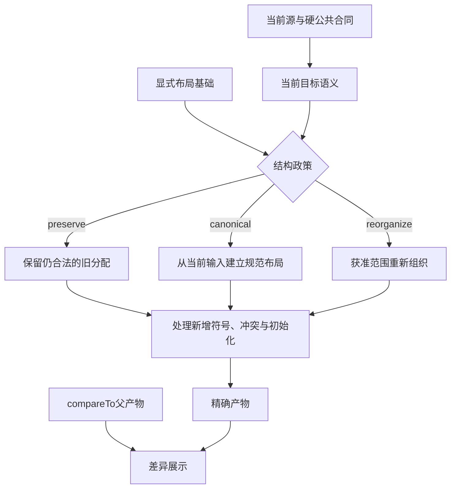
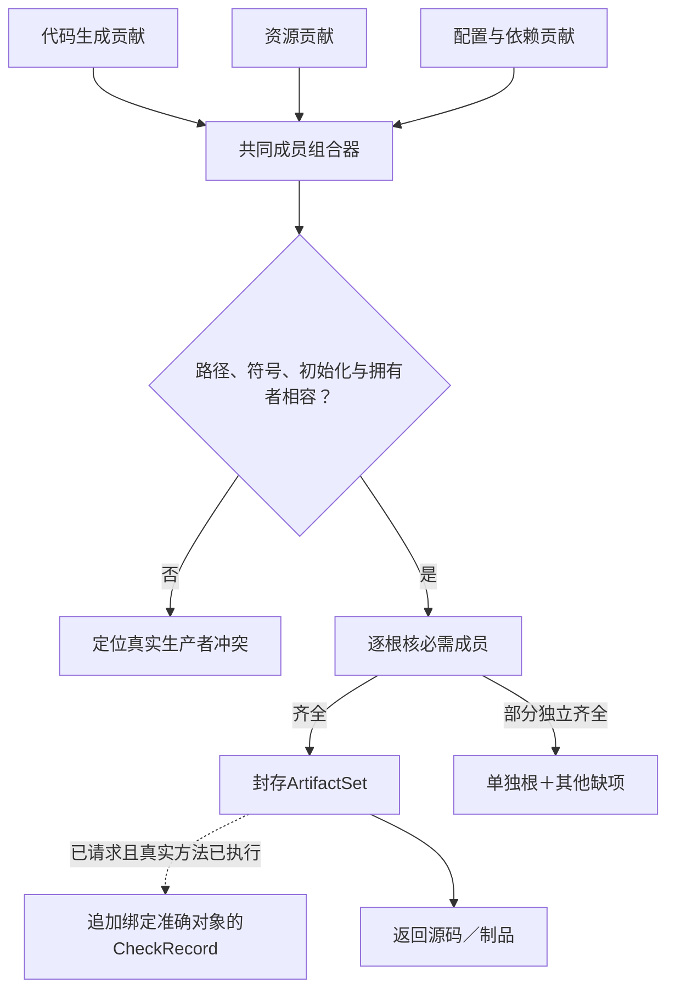

# 目标源码组织与生成策略

> **阅读范围**：采用范围内的设计规范；实现状态另查未决。

<details>
<summary>相关主题与上下文</summary>

- [需求实现计划与目标贡献的同代闭合](#需求实现计划与目标贡献的同代闭合)
- [高层关系生成后的实际保持范围](#高层关系生成后的实际保持范围)
- [源码布局必须保留下游可观察边界](#源码布局必须保留下游可观察边界)
- [本章拥有的设计](#本章拥有的设计)
- [输出为另一种高级源码的含义](#输出为另一种高级源码的含义)
- [复用实现的源码与依赖交付边界](#复用实现的源码与依赖交付边界)
- [实现调用、依赖和资源怎样形成完整目标工程](#实现调用依赖和资源怎样形成完整目标工程)
- [输入到输出的唯一决定链](#输入到输出的唯一决定链)
- [作者结构不直接决定目标排程](#作者结构不直接决定目标排程)
- [选择顺序与稳定性](#选择顺序与稳定性)
- [按输出形态的默认结构](#按输出形态的默认结构)
- [符号放置与依赖生成](#符号放置与依赖生成)
- [实例、数据与资源的具体策略](#实例数据与资源的具体策略)
- [从组合到紧凑代码而不是运行解释器](具体降低与领域输出.md#从组合到紧凑代码而不是运行解释器)
- [原生代码与现有工作区](结构稳定与作者回源.md#原生代码与现有工作区)
- [输出、映射与证据分离](#输出映射与证据分离)
- [中立语义与目标表示的逐项映射](具体降低与领域输出.md#中立语义与目标表示的逐项映射)
- [首个TypeScript后端的逐构造降低](具体降低与领域输出.md#首个typescript后端的逐构造降低)
- [通用局部控制和托管资源的逐构造输出](具体降低与领域输出.md#通用局部控制和托管资源的逐构造输出)
- [统一性验收与反转条件](#统一性验收与反转条件)
- [紧凑作者调用与目标实现不是同一成本](结构稳定与作者回源.md#紧凑作者调用与目标实现不是同一成本)
- [中立行为与原生作者的不同输出保持](结构稳定与作者回源.md#中立行为与原生作者的不同输出保持)
- [有状态工程的目标源码和运行边界](具体降低与领域输出.md#有状态工程的目标源码和运行边界)
- [计算目标布局不是服务模板](具体降低与领域输出.md#计算目标布局不是服务模板)
- [从目标程序得到具体文件树的布局算法](#从目标程序得到具体文件树的布局算法)
- [隐藏表示与目标边界](结构稳定与作者回源.md#隐藏表示与目标边界)
- [自动实现与显式目标控制的优先级](结构稳定与作者回源.md#自动实现与显式目标控制的优先级)
- [省略控制后怎样选定实际产物](结构稳定与作者回源.md#省略控制后怎样选定实际产物)
- [可维护目标与发布目标的编辑保持](结构稳定与作者回源.md#可维护目标与发布目标的编辑保持)
- [跨次生成的结构稳定合同](结构稳定与作者回源.md#跨次生成的结构稳定合同)
- [目标工具复用与投影修改的落位](结构稳定与作者回源.md#目标工具复用与投影修改的落位)
- [产物装配与检查记录分开的最终输出](#产物装配与检查记录分开的最终输出)
- [完整成员、部分根生成与旧输出对账](#完整成员部分根生成与旧输出对账)
- [状态图的普通源码形态与结构稳定](具体降低与领域输出.md#状态图的普通源码形态与结构稳定)
- [关系结果的普通源码与SQL边界](具体降低与领域输出.md#关系结果的普通源码与sql边界)
- [完整计算程序的目标组织](具体降低与领域输出.md#完整计算程序的目标组织)
- [对象、流与导数的具体输出形态](具体降低与领域输出.md#对象流与导数的具体输出形态)
- [对象前态捕获与发行范围的目标保持](具体降低与领域输出.md#对象前态捕获与发行范围的目标保持)
- [需求修订的目标成员与资格闭合](#需求修订的目标成员与资格闭合)
- [开发面怎样消费预览、生成成员与来源](#开发面怎样消费预览生成成员与来源)

</details>

### 分题阅读

- [具体降低与领域输出](具体降低与领域输出.md)
- [结构稳定与作者回源](结构稳定与作者回源.md)

<details>
<summary>本页内容</summary>

- [需求实现计划与目标贡献的同代闭合](#需求实现计划与目标贡献的同代闭合)
- [高层关系生成后的实际保持范围](#高层关系生成后的实际保持范围)
- [源码布局必须保留下游可观察边界](#源码布局必须保留下游可观察边界)
- [本章拥有的设计](#本章拥有的设计)
- [输出为另一种高级源码的含义](#输出为另一种高级源码的含义)
- [复用实现的源码与依赖交付边界](#复用实现的源码与依赖交付边界)
- [实现调用、依赖和资源怎样形成完整目标工程](#实现调用依赖和资源怎样形成完整目标工程)
- [输入到输出的唯一决定链](#输入到输出的唯一决定链)
- [作者结构不直接决定目标排程](#作者结构不直接决定目标排程)
- [选择顺序与稳定性](#选择顺序与稳定性)
- [公共边界、宿主进口和按目的完整](#公共边界宿主进口和按目的完整)
- [按输出形态的默认结构](#按输出形态的默认结构)
- [符号放置与依赖生成](#符号放置与依赖生成)
- [实例、数据与资源的具体策略](#实例数据与资源的具体策略)
- [输出、映射与证据分离](#输出映射与证据分离)
- [统一性验收与反转条件](#统一性验收与反转条件)
- [从目标程序得到具体文件树的布局算法](#从目标程序得到具体文件树的布局算法)
- [产物装配与检查记录分开的最终输出](#产物装配与检查记录分开的最终输出)
- [完整成员、部分根生成与旧输出对账](#完整成员部分根生成与旧输出对账)
- [需求修订的目标成员与资格闭合](#需求修订的目标成员与资格闭合)
- [开发面怎样消费预览、生成成员与来源](#开发面怎样消费预览生成成员与来源)
- [布局变化的原生解释与作者边界](#native-layout-boundary)

</details>


## 需求实现计划与目标贡献的同代闭合

目标组合器消费同一作者候选、已接受要求、精确UseBinding和逐根选择。计划中的责任关联不直接成为产物：需要取得真实SourceBody、ExternalExport或GenerationMethod，发射后收集新增符号、初始化、资源、运行/构建/类型与资产依赖。

新增生成区域仍按其实际类型、效果和保持条件复核，所需类型形状不等于完整调用资格。某个方法可在私有结果上失败或产生不完整区域；不将它混入已发布合格产物，不从共享旧树继续冒充成功。一个贡献改变公开类型、默认初始化或资源寿命时，其他贡献及外部消费者按真实依赖重查，不能仅按文件是否重叠判断独立。

跨图数据和索引的同代约束必须落实在目标程序自己的发布位置，而不是仅在生成ArtifactSet时“同批完成”。生成时正确打包两个函数，不能证明运行时它们读取同一个GraphRevision。相应运行语义由原领域合同和[整体范本](../../../examples/连续开发/全工程连续开发.md#integrated-graph-editor-example)规定，目标维护记录只保留其所需部分，不打包SEC规划器。

原短源的省略位置、注释与来源继续由EditCorrespondence关联；公开函数值可打印为普通函数或合格别名，不将推导字段全写回作者源。所需配套资产未闭合时保留对应根未完成；完整的独立源根可以返回，但不把它标成整个发行已满足。


## 高层关系生成后的实际保持范围

目标方法消费UseBinding携带的输入域、结果/轨迹、帧和资源义务，不只看期望返回类型。关系实例可以被降低成普通循环、会话字段或索引；它不要求把需求树和完整SEC平台一起带到运行时。

NoWrite不能仅以结束时值相同替代，当前结果检查与发布必须在一个真实串行点，逆索引更新与原关系必须形成一致可见状态。生成器新增暂存、线程、异步回调或缓存时，相应内存、取消、错误与潜在观察重新检查，不把高层形状标记当作资格。

目标实现可以不同，要求与公开作用域保持。帧声明没有包括文件时间戳，并不自动要求所有元数据相同；任务已禁止触碰文件时，也不能以最终内容相同而写后恢复。下游需要的具体观察来自[共同需求合同](../../作者/组合/跨软件需求合同.md#cross-software-intent-contract)，不是打印器自己选择。


## 源码布局必须保留下游可观察边界

布局计划消费固定语义、公共接口、已接受约束及联合实现绑定。函数所在文件只是其中一项选择；布局若改变初始化、设备驻留、数据编码、实例寿命或调用开销，就需要相应连接与预算依据。完整判断见[带边界联合搜索](../实现选择与设计搜索.md#带边界状态的联合搜索与合法剪枝)。

生成步骤是：固定不能改变的导出和调用合同；取得当前所选表示/设备/实例；明确真实转换与初始化；安排私有符号和文件；核对资源生命周期；打印并记录实际成员。额外helper不是免费：可能新增依赖、初始化、体积、加载和许可，需要计入实际产物。当前已合格的内联/调用方式默认保持，只有有收益或必要性时改变。

代码格式化、物理拆分和编译器自身模块树不能决定任务语义。纯计算核可以只是一个函数；大内存流水线可以在同进程分阶段；事务共享域也不以一个文件一个服务划分。组合保证要求保持的内容不依赖文件名暗中传递，必须由原公共接口和实际映射维持。

语义输入没有变化却更换布局时，保留作者候选身份并产生新的目标绑定/产物及相应检查；原产物不能只被重贴更快标签。检查消解、缓冲复用和数值缩窄的依据过期时，旧字节仍为历史产物，新的采用需要恢复检查、重建或取得新依据。


## 本章拥有的设计

本章规定SEC最终产出的源码怎样组织到表达式、函数、文件、包与运行实例，并怎样保留公共接口、原生区域、依赖与可观察行为。SEC自身的实现包树由[物理架构](../../架构/装配/模块与运行实例.md)拥有；不能因为编译器有kernel、control和adapter，就要求每个生成程序也有这三层。

这里选择具体默认与替代条件，不固定所有目标使用同一架构风格。一个过滤函数默认就是一个函数；已有应用优先保持已接受结构；新建有状态系统先区分算法内存状态、设备状态与持久事务状态，再按真实功能、寿命和部署边界组织。生成布局不是展示皮肤：导入路径、初始化时机、模块状态、加载次数和公开名称可能改变行为。


## 输出为另一种高级源码的含义

`.sec → TypeScript/Java/其他源码 → 相应工具链和运行时`是源到源编译路线，不是每次业务执行都让SEC重新翻译一次。目标源码可以保留为调试、审查、打包和独立维护的可读产物；取得执行资格与采用产物仍遵守各自合同。

生成的TypeScript通常还要经过目标构建形成JavaScript；Java通常生成供JVM运行的字节码；某些原生目标形成机器对象再链接。解释、AOT、JIT或混合方式由实际目标决定，不强制所有目标都经过可见汇编文件。未来可以有直接IR/字节码后端，但不能为了看起来更底层而无消费者先建设它。

源码生成不是低级或伪编译。实际代价是额外构建阶段、工具锁、调试映射、初始化/ABI、源码体积和目标优化交接；实际收益是复用成熟生态与最终工具链。当前先保留源码后端，出现端到端测量、部署或保密约束才能裁决新增路径。编译阶段多，不必然令每次运行多一层解释；也不保证所有抽象都零成本。

作者语义只定义真实观察义务，后端在其允许自由内选择表示。不能假设目标编译器会替SEC修正错误中立语义或不合理布局。第一层模型允许删除/融合才有资格交给后续优化；目标工具类型通过不证明源到源语义保持。

原生运行库或系统实现可以作为精确绑定的普通依赖。它的存在不等于用户必须保留原生作者文件；“无原生应用作者代码”也不等于“无运行库、无OS、无外部系统”。


## 复用实现的源码与依赖交付边界

同一中立调用在TS目标可产生TS生态的合格库调用，在Java目标可产生Java生态的合格调用；选定库内部代码不必先被改写为`.sec`。调用、封闭类型、必要转换、依赖和资源共同进入ArtifactSet。公共行为与每个目标的实际资格仍需分别成立，不能以函数名称一致就宣称两个实现等价。

交付要求决定允许的形态：

| 已接受的交付 | 可采用的实现形式 | 不能冒称 |
|---|---|---|
| 可构建目标源码及明确依赖 | 生成源调用＋固定库／工具依赖 | 隐藏原宿主解释器或运行库 |
| 要求自包含目标源码 | 普通主体降低，或许可和构建条件允许的目标源码内嵌 | 只写一个外部调用就当源码闭合 |
| 允许FFI或二进制组件 | 显式ABI、平台、装载、生命周期与依赖 | 因JVM能调用C就称C实现已转成Java源码 |
| 只缺某个目标的供给 | 返回独立合格根与该目标缺项 | 修改中立要求或拿另一目标结果代签 |

编译器选择已有实现时，是否包含源码、能否链接、数据是否需要复制、产物能否离线构建都是实际条件；同等条件下成熟供给优先不意味着接受任务不允许的依赖。公开源码结构保持由本章既有规则处理，不把每份供应商内部结构提升为作者永久控制面。


<a id="supply-artifact-composition"></a>
## 实现调用、依赖和资源怎样形成完整目标工程

目标发射器消费UseBinding和实际主体，不要求将全部输入恢复成中立函数体。SourceBody生成自身算法；ExternalExport生成实际调用；GenerationMethod产生有合同的代码与资产。三者统一返回原LoweringResult中的贡献，不各自直接写文件或各自生成package.json。

| 贡献 | 最小内容 | 汇合责任 |
|---|---|---|
| 符号与调用 | 精确提供者/出口、接收者、参数位置、作用域、公开要求 | 按真实符号分配别名，保持原求值顺序；同名不自动同物 |
| 类型与表示 | 边界类型、编码/布局、借用和转换 | 共享合法表示；不能为了统一对象树每步复制 |
| 初始化与状态 | 工厂、触发时点、实例拥有者、销毁或完成 | 共享代码与共享可变实例分别决策；不按配置摘要合并状态 |
| 依赖 | kind、精确解析节点、目标/执行平台、发生位置及必要性 | 每目标一个依赖组合器；缺解析返回真实Needs |
| 文件/资源 | 相对路径、内容/生产者、输出归属、必需或可选范围 | 核同路径竞争、编码/格式和完整成员；保留非拥有区域 |
| 来源与诊断 | 作者/导入/生成规则的位置和实际依据 | 外部无逐token来源就给准确边界，不能伪造源码行 |

依赖的kind至少区分运行、编译类型、构建工具、生成期工具、检查、资产。它们不是六份必须出现的清单：一次目标运行不应带仅用于开发检查的包；只提供类型声明也不代表运行实现已具备。目标标准模块也有宿主/版本要求，但不虚构npm下载或Maven坐标。

### 一个目标只有一个配置与依赖输出拥有者

先收集全部必要贡献，按实际包工具的身份、版本约束、目标条件和共享类型/资源合同合并。已锁选择符合时复用；发生不相容的单例、ABI或版本要求，返回准确冲突。工具允许多版本且消费者不要求共享时可以并存，不能统一按包名强制去重。

需要新解析时返回DependencyResolutionNeed，application调用获准包工具取得真实锁与安装观察后固定新准备输入。SEC在其锁中引用这些实际结果，不自行另算一套版本；printer不能静默选择latest。未执行安装不填“已安装”，未获得平台二进制不填“运行可用”。

公共配置由该目标组合器生成或按成熟格式编辑器修改已有拥有区域。不能让每个库适配器独立覆盖package.json、构建脚本和依赖锁。已有人工字段保持；未知或冲突字段保全并报告。输出根宣称完整前，实际运行依赖、必需文件和入口引用必须按该根目的闭合；库的明确公共宿主进口可保留为消费者合同，独立应用不得把必需宿主伪装成已取得。

### 调用形式的当前选择

函数可直接导入就直接导入；目标允许相同公共出口的重导出就重导出。只在调用方要求独立名字、静态类门面、表示/错误差额、隐藏供应商接口或初始化边界时生成门面。门面不是作者维护的另一个算法，也不是所有库都必须先登记的SEC包装。

需要工厂实例的规则在正确的目标激活范围生成。一次性有状态操作通常按调用创建；会话共享须来自真实合同及拥有者；可复用不可变格式器可按合格规则共享。不能把同步函数的无外部状态合同推导成目标内部无可变临时状态，也不能从库代码共享推导运行对象全局缓存。

无源码主体工程仍可请求目标源码，但这表示公开入口和实际调用源码，不表示已经将底层算法抄入同一文件。标准运行时、外部二进制与可分发源代码的边界必须按交付合同说明。任务要求完全自包含或无运行时而供给不能满足时，选择另一合格路线或明确缺项，不改名为“完全编译”。


## 输入到输出的唯一决定链

```text
作者定义与局部具体化 + 已有原生资产/接口 + 本次输出根
→ 明确行为与实际依赖、所选目标和实现绑定
→ 类型化目标程序及源码组织决策
→ 符号/实例/文件放置，导入与初始化合法性检查
→ 目标AST或所支持的资源生成，打印为代码/文件集合
→ 所请求的目标检查、行为检查及有限保证
→ 仅在实际请求时交给写回/发布合同
```

定义选择与业务意义在此链前段固定。后端不能临时改需求、重选库、添加远程服务或改变权限来凑出可生成结果。前端未知的影响保留为该输出的条件，不用“最优架构”补成未接受事实。

`SourceLayoutPlan`是现有TargetProgramIR与Binding的派生视图，不是新作者源、第二身份注册表或独立服务；实现可以与降低融合。源布局的公共选择和实现锁进入实际输入，内部不一定要序列化计划。计划至少能解释：哪个符号从何而来、放在哪里、谁拥有可变状态、通过什么导入可见、谁负责每项产物以及改变何处会使它失效。


## 作者结构不直接决定目标排程

基础结构是作者表达式和区域，不是目标指令排程。生成时使用共同类型化结果保留callee与实参次序、短路、选择分支、let一次初始化、闭包捕获和调用次数；只有已证明相应条件的优化才改变它们。`if x == 0 then 0 else 10 / x`的除法不能仅因数据输入已到达就移到分支之前。

结构作者里的局部key用于源定位，不成为目标变量名或文件名。保留布局沿既有结构政策；等价文本/结构有同一身份映射、公开名、实际解释与布局时可以要求相同生成结果。首次独立创建不具备这些共同输入时，只检验对应含义与合法产物，不虚构逐字一致。

被重命名的公开参数可能影响具名调用、反射或目标门面；私有同名替换也可能造成捕获。前端必须先交付合法重构，再由后端打印。AST可打印不等于重构正确，目标类型检查通过也不能代替原绑定保持。具体写回规则由[作者编辑](../../作者/组合/结构编辑与身份保持.md#名称重构的正向算法)拥有。


## 选择顺序与稳定性

先满足当前任务明确要求、行为/效果/数值与寿命、权限/数据限制、公开ABI/路径及已接受的原生所有权。互相矛盾时给出冲突，不用某个加权总分交换不可违反条件。

在合法方案内，默认优先保持已有公共表面与合理布局，避免没有收益的拆层与移动，再考虑实际修改局部性、读取/构建/加载成本、代码体积与可读性。无测量依据时采用下面的简单默认，不承诺数学全局最优。已声明等价的备选可按版本化策略稳定选择；字典顺序只能解决等价平局，不能把语义不明的候选变成等价。

历史布局影响未来生成时，必须把该已接受布局或命名映射作为显式输入。不能一边用未记录的历史决定名称，一边声称相同当前模型必然产生相同源码。忽略布局的纯行为键和包含布局/工具/格式的源码键也不可混用。


<a id="public-boundary-closure"></a>
## 公共边界、宿主进口和按目的完整

[成品家族](../../作者/成品形态与公共边界.md#4-形态由多个正交选择确定不是一个万能mode)是按消费方式的规范路由，不是强制目录模板。输出根先给出准确作者导出与逻辑exposes，目标画像给出它们到函数/模块、进程、消息、handler、插件或视图的实际映射；不能读取对象第一项选入口，也不按外层目录名推目标。

**闭合是按目的的。** 规格发布需要准确定义和解释，可以保留明确实现义务；运行库必须有实际实现，同时可以有公开且允许的宿主进口；独立运行应用需要这些进口已提供，或在明确部署合同中可履行。开放库不能因为未打包OS/宿主而被误判为缺实现；仅有函数签名也不能因为“允许进口”伪装成运行库。所有未解决进口都要有真实合同、允许的消费环境和责任，不把无名TODO变成接口。

完整边界由原Artifact/TargetProgramIR派生：公开符号及类型、调用/错误/效果/寿命、所需宿主进口、输出文件与角色、依赖与配置、接口到作者主体的来源。导出类型的实际可见依赖应可取得；一个入口不能公开私有类型而缺少可用表示。生成文档和声明参考消费同一结构，不另让作者维护一次。

适配器只返回自己的实际贡献和必需环境，不各自写公共配置。一个公开Normalize根生成6种适配，不意味着生成6份不同算法；也不意味着必须在6种加载环境中共享同一个运行对象。确定性纯代码可依法复制或共用，状态与权限仍按实际边界分配。

**默认形态不能扩大副作用。** 同步纯库不自动变Promise、服务、后台线程或必填operation context；只有对应合同才增加这些结构。HttpHandler不自动启动监听器；Plugin不自动全局注册；Panel必须有真正的视图、状态和事件实现，不能只交纯计算API。生成源码与打包、加载、安装、运行和退役分别结算。

A0—A7的共同边界判定沿既有编译阶段执行，完整具体例见[多成品合同](../../../examples/成品形态/规则合同.md#5-方法目标成员与失败结果)。实现映射不足时返回该根的准确Needs，不消除已经合格的独立根；共同成员有冲突时仍须联合解决。

## 按输出形态的默认结构

| 输出 | 默认结构 | 何时增加结构 |
|---|---|---|
| 表达式或上下文区域 | 只给该语法类别的文本、必要上下文与候选补丁 | 引用需要新导入/声明时列出相交补丁，不能暗插顶层状态 |
| 单个纯函数 | 普通函数和本地临时变量；必要类型与私有辅助同模块 | 有实际公开消费者、生命周期或复用依据再拆分 |
| 小型或大型计算库 | 公共计算/数据接口及实际算法模块；热循环和局部临时状态在需要位置 | 以访问局部性、独立变化、目标编译和设备接口分区，不按体量自动建服务 |
| GPU/向量/设备计算 | 必要的目标核、薄启动/参数接口和同步资源管理 | 真实跨设备或部署边界才增加进程；不把每个tile当远程任务 |
| 编译器、图算法、解析/压缩程序 | 输入表示、变换/算法、目标输出与局部工作状态 | 新阶段有独立语义或真实优化接口才物化，不能为每个token建持久对象 |
| 已有应用 | 保留原框架入口、公开路径和非受管字节，在明确区域输出 | 实际需求改变时作可审查布局迁移，不自动重建整棵目录 |
| 新建有状态应用 | 按功能与不变量聚合，运行入口连接真实资源 | 只有不同运行实例、信任、扩容/运维与失败域才拆服务 |

单函数不产生Service、Repository、事件总线、依赖容器、SEC客户端或数据库。一个私有helper不自动产生一个文件；一个实体不自动产生一组CRUD端点；一个函数也不自动得到`async`、全量Result包装和operation context参数。

### 一函数与一模块

完整例见[短函数](../../../examples/连续开发/组合结构与任务轨迹.md#一段短代码从组合到具体源码)。要求函数源码并且Item由上下文提供时，仅输出函数及其环境条件。要求自足单模块时，输出必要的Item声明与函数；不另建types.ts、interface.ts、factory.ts与空index.ts。要求函数“一个表达式”而合法实现需多句计算时，不擅自改IIFE导致捕获和错误行为变化；提供保持条件内的表达式表示，或报告形态不满足并提出完整函数形式。

### 有状态应用的结构示意

下面仅在新建应用确有对应责任时成立，不是每个输出都要生成的模板：

```text
src/
  features/orders/contract.ts    真正共享的公开合同
  features/orders/approve.ts     用例及其必须保持的规则
  features/orders/storage.ts     已选择的存储连接，必要时由端口适配
  adapters/http/orders.ts        网络输入校验、错误和协议映射
  app.ts                        组装真实数据库/网络等运行依赖
```

若contract只有一个使用点且没有独立版本义务，可以与实现同文件；若现有框架在路由文件内支持清楚的事务用例，不强制增加一层application service。反之，必须同事务改变的订单、审计与outbox，不能仅因为属于三个名词就部署成三个不能共同提交的服务。成熟框架能直接满足边界时使用其能力；只有真实替换、协议、信任和资源责任才增加适配器。


## 符号放置与依赖生成

先收集当前输出根的声明、类型引用、运行引用、初始化效果、实例依赖与原生绑定；再决定公开面、文件与作用域。声明互引、运行调用环和严格初始化环分开。原生checker需要模块全体时按实际范围检查，不把未输出声明的错误静默隐藏成“项目通过”。

公共名称、导入路径、导出种类与真实消费者绑定；不以是否出现在仓库静态搜索中为唯一依据，反射、框架约定和外部分发消费者按声明保留。新私有名从局部源名与稳定局部身份生成，避开目标保留词和作用域冲突；不要把整个工程哈希作为所有名字后缀。内部AST可使用紧凑局部身份，不将长摘要打印到每个变量名。

名称卫生与求值不同：改局部名要保持绑定，提取函数要保持参数次数、顺序、this和异常，改变公开名要经过接口迁移。生成名称供可读性服务，源身份与来源另保留在映射中；不可用行号作长期对象身份。

### 类型导入与运行导入

类型引用不应无意造成模块运行，运行导入也不能为排序好看而改变初始化顺序。采用TS/ESM时根据目标模块解析与真实依赖生成导入，`import type`仅用于真正无运行值需求的引用；运行检查器或类构造不能被误擦为类型导入。保留副作用导入的已接受顺序，未知依赖不擅自树摇删除。

模块格式、解析策略、文件扩展、包exports/条件和动态导入由目标画像确定。浏览器、Node、Bun和bundler可能要求不同的组合；不能只因tsc类型检查通过，就认为目标宿主一定能加载。ESM的活绑定与初始化顺序不能用对象复制或CJS包装随意替代。普通TS模块机制参见[TypeScript模块参考](https://www.typescriptlang.org/docs/handbook/modules/reference.html)；这里不固定某个未来TypeScript大版本API为永远不变。

公开入口只导出真实API，避免递归barrel泄漏内部或扩大初始化闭包；没有公共入口消费者时不额外生成一层。纯类型和纯声明可以有合法环，strict值初始化环必须处理而非用文件排序伪装解决。


## 实例、数据与资源的具体策略

| 责任 | 默认设计与保持条件 | 必须拒绝或重新选择的反例 |
|---|---|---|
| 局部状态 | 每次调用创建属于该调用的临时状态 | 把去重Set提升为模块单例，导致第二次调用漏结果 |
| 实例状态 | 由明确工厂/构造及拥有者分配；共享由合同决定 | 两个配置相同但有独立寿命的实例因内容相同被合并 |
| 类与函数 | 无身份/生命周期需求优先函数与值；资源、协议或原生框架需要时用类 | 为每个动作生成class和接口，只搬运同一数据 |
| 缺省、空值与存在性 | 保持源定义中的缺失、None、Null和错误含义 | `||`把0/空串当缺失；后端以undefined补未决业务 |
| 数值、文本与集合 | 使用已选精度、溢出、单位、编码和等价关系 | 任意精度整数降成Number，键顺序或NaN规则改变 |
| 错误 | 保留业务结果、异常、陷阱、取消与不确定效果区别 | catch全部返回成功默认值；所有同步调用强改Promise |
| 运行校验 | 在实际不可信边界检查一次或依据有效资格复用 | 仅凭类型擦除认为输入可靠；内部每步重复全量校验 |
| 资源与异步 | 分配、清理、等待和取消按当前拥有者与目标能力 | 取消后还有任务使用资源却提前释放；普通片段强加持久工作流 |
| 事务与外部作用 | 按真正共同不变量安排提交与投递 | 状态写入和要求同事务的审计被拆成无协调服务 |
| 配置与秘密 | 公开静态参数可专门化；秘密与运行凭证按宿主注入 | 把构建时机器环境或令牌写进源码/共享map |

这些规则引用[语言](../../作者/组合/抽象与开放定义.md)、[原生ABI](../内核/原生与跨语言编译.md#原生调用的表示生命周期与失败合同)和[效果恢复](../../运行/持久化提交与恢复.md)的含义，不另造一套目标侧类型或权限系统。


## 输出、映射与证据分离

输出可以是内联源码、文件集合或应用补丁。文件集合给出精确成员、字节身份、路径所有者和实际依赖；表达式不要求伪文件树。只请求函数时不同时生成运行脚本、测试、文档、SBOM和包清单；请求分发/保证或有真实消费者时再派生相应内容。相关法律/许可约束仍按实际分发要求处理。

源码映射保存能解释来源的作者节点、展开路径、生成规则和目标位置。映射用于诊断不等于可靠逆向；它也可能包含私有路径/源码，按权限与分发策略输出。一般情况下映射按需sidecar或引用返回，不把完整工程审计字段插入每个目标语句。

生产者源码摘要、目标配置、布局/格式策略与实际输入决定生成结果身份。目标类型检查、运行案例与真实宿主观察分别绑定对应内容，类型检查成功不是完整行为证明。生成的测试可以表达明确义务，期望不能全部由同一个可能有错的降低器从它的输出推导；独立验收有自己的来源。

若目标依赖共享运行库、框架、数据库或模型服务，必须明确身份和用途。独立运行表示不需要SEC编译控制面持续在线，不表示任何目标都无运行依赖，也不表示移除指定服务后仍保持原业务。交付原生源码与可重建作者源，是不同的迁出能力。


## 统一性验收与反转条件

设计验收至少覆盖：同一函数在无工程上下文返回源码；嵌入有this/return/资源的区域不被错误包裹；相同输入两次调用不共享临时状态；不可信字段读取不被错误循环融合；类型引用不启动模块；运行导入不被错误排序；公开名/路径被保持；新私有对象不使全项目命名漂移；用户文件不被重排；布局规则变化使源码与证据按实际范围失效；缺目标依赖不输出假成功；小片段不启动服务和数据库。

以同一作者源的临时函数→单模块→既有应用为尺度迁移，核心语义与定义身份不需重建，环境绑定和布局需要重新核对。不能以一个例子可生成证明任意领域/目标都能保持。实现尚未满足某条时记作相应未完成能力，不把验收条件的存在伪装成测试通过。

若普通函数仍需要用户学习SEC内部包树、产物必须手改才能运行、相同定义在不同入口有相反行为、或者共享规则产生无意义包装，就重审对应布局与接缝；不以增加通用层来修复所有问题。跨信任、规模或公开协议确需更多结构时允许新增，理由必须来自真实义务而非架构风格名称。


## 从目标程序得到具体文件树的布局算法

<a id="fig-stable-layout"></a>

### 图解：局部变化与稳定目标布局

已有合法布局优先保留；compareTo只参与差异显示，不作为隐含的生成输入。箭头代表生成依赖和选择分支。



输入为已选择的TargetProgram、公开输出根、实际依赖与初始化关系、原生保留区、旧布局（如请求复用）、目标格式与宿主限制。输出是SourceLayoutPlan及其对应源码候选。旧布局若参与稳定选择，就是显式输入，不是隐藏历史。

**L1 固定公开外观。** 解析导出名、调用合同、目标类型与允许的文件位置。先确定不能改变的公开引用，再安排私有实现。原生消费者的真实路径和模块模式进入输入；缺少时形成有限模块输出或准确缺项，不凭cwd推导部署。

**L2 建立声明依赖和初始化组。** 把纯类型引用、运行值引用、实例创建及副作用初始化分开。允许的递归函数可在同一编译单元声明；值初始化环需要目标支持的明确机制，否则诊断。不能靠排序打断真实环，也不能把类型导入当运行值导入。

**L3 选择最小的合格分组。** 单个函数默认留一模块，公共类型仅有一个消费者时可以同文件。真实独立加载、生命周期、信任或共同变化需要时拆分；有共享状态的不变量不能因拆文件转成RPC边界。已有项目的公共布局优先保持，冲突时给出需要迁移的实际引用。

**L4 分配私有名和导入。** 以稳定声明身份、局部角色和确定消歧产生名字；显示名变化只影响相交可读名，未改变身份的无关对象不重命名。导入解析到选定提供者；运行副作用顺序按目标约束保留。工具已明确纯类型用途时可产生type import，否则保留真实值来源。

**L5 放置状态和辅助内容。** 函数局部集合每次调用创建，实例资源按所选实例生命周期创建，共享只在合同允许时发生。辅助函数是否复用或内联按既定策略决定，需比较初始化、函数身份、错误和代码体积；不能只因两个表达式文本相同而合并资源。

**L6 选择表示和打印。** 数值、文本、列表、变体、端口与契约按目标映射完成，布局不重新决定公共语义。打印器消费目标AST和选定风格；格式化仅作用在生成区。明确的注释/指令与来源映射要保留。构建时秘密不进入源码，必要配置作为目标接口输入。

**L7 检查产物闭包。** 核对每个输出名的唯一生产者、路径碰撞、所需导入与资源实际存在、所有公开导出可由目标工具解释。打印完成先返回generated-unchecked；实际类型/行为检查分别绑定产物。文件树本身是候选，直到apply才写入真实位置。

### 正常选择与反例

锐化核只需要一个函数、公共值类型和必要helper，不生成Service/Repository。用户已有网格ABI时复用它，不另建镜像。TS目标内部采用32位临时数值，公共接口要求bigint时边界按所选合同转换；不得把内部表示变化藏到公开签名。

同一函数第二次生成时，公共名字和布局未变则差异仅为实质修改与必要生成。新增一个无关模块不改变全部私有名。修改了目标模块规则或布局政策则可能改变导入路径，必须记录为该绑定的结果，不能宣称所有输入不变。

更大应用默认按实际功能与生命周期聚合；只有目标确有分离部署/资源需要时生成多个服务。这个默认减少无收益组织，但不是所有系统只有一个文件；分组选择与反转理由保存在已有Binding中，开发者可以按需查看和约束。


## 产物装配与检查记录分开的最终输出

<a id="fig-artifact-merge"></a>

### 图解：多生成器到完整制品的汇合

一个根只有所有必需成员齐全才完整；独立库根可以单独交付。不存在最后写入者优先，也不让某目标检查改变另一目标字节。



emitTarget返回指定根的文件/资源贡献，不直接写工作树。共同装配器核对公共名称、路径、初始化、依赖与必需成员后封存ArtifactSet。它的身份来自真实内容与生产输入，不包含会追加或撤销的检查状态；RootResult.targetCheck由应用关联独立CheckRecord形成。

后端输出需要的运行辅助、配置或模板必须作为实际依赖与成员返回，不能把未交付的手写Adapter称为“零原生作者”。反过来，纯函数目标不输出SEC的workspace/compiler/execution等控制组件。运行软件自己的状态归目标运行时，开发平台的候选和权限不成为它的业务身份。

多个lower贡献同一文件必须使用明确组合器；不能按worker完成顺序拼接。领域布局有冲突时回到真实语义与目标控制解决，不让打印器悄悄抹掉一方。最终模块与输入关系见[总架构](../../架构/协作与状态边界.md)。


<a id="artifact-membership-reconciliation"></a>
## 完整成员、部分根生成与旧输出对账

### 产物成员集与物理目录内容不是同一集合

编译器选择的ArtifactSet是固定根、准确输入与目标组合后的成员集合，不是对一个现有输出目录做递归zip。目录里可能有旧目标、人工文件、运行输出、秘密、临时失败文件和其他根的共同成员。只有进入本次交付闭包且允许分发的对象才进入产物；没有出现在本次AI上下文中不等于它可以删除。

原ArtifactPlan/CompositionPlan中的每个成员由组合器保留：逻辑成员身份、实际生产归属、消费根、候选相对路径、对象种类、内容引用、所需元数据、来源及必要性。纯内存可以用值；需长期保存的成员记录按相应精确格式版本编码，不能把本段内部字段悄悄加到已发布的未知清单中。成员身份不等于路径，更不是显示次序。

成员闭包按真正角色生成：源码、运行实现/资源、构建所需配置与工具输入、许可证/法定分发材料，以及本次明确要求的说明。检查样本、调试变体和SEC控制数据不自动跟随运行包；必要私有实现也不能因“private”被漏掉。完全自包含、仅源码可维护和依赖外部运行库是不同交付要求，不能相互改名。

### 根与公共配置怎样组合

同一目标配置/输出拥有域内，共享公共名、初始化、配置文件或资源的根必须先由共同组合器协调；独立域可以并行。默认不把两个画像的package配置合并成一份。需要同目录时必须有一个实际拥有者与兼容的成员规则，而不是让最后结束的打印器覆盖。

只生成根A时，可以返回A的完整制品。若A和未选择根B共享一个受管目录，写出A不取得B成员的删除权，也不自动宣布B已按新候选更新。共享文件确实需要B贡献时，要取得相容B输入并检查组合，或把A作为独立内存/隔离产物返回并指出现有共享目录暂不可完整更新；不能用旧B的几行字假装已核当前B。

本次要求替换整个发行集合时，所有必需根进入同一组合义务；缺一项不能只写部分然后更新“完整发行”指针。允许分组时，每组分别有真实完成状态及原输入关系。原生工具用目录glob自动拾取成员时，构建必须在精确物化树或有等价隔离的范围内进行，不能让未列清单的旧文件悄悄参与。

### 再生成后的三方成员决策

`B`是上次被本拥有者合法采用的精确成员及内容，`D`是本次期望成员，`X`是当前物理对象的实际观察。`missing`、`unreadable`、普通文件、目录和链接分别表示；不能把读取失败当不存在。下面是生成写回计划的判定，不替代execution的最后前像与授权检查。

| B / D / X | 写回计划 | 保持与说明 |
|---|---|---|
| B无此成员，D无此成员，X存在 | 不触碰 | 与本拥有者无关；目录额外成员不成为垃圾 |
| B无，D有，X不存在 | 创建该精确新成员 | 先核父目录/别名/权限；不自动取得其他路径 |
| B无，D有，X已存在 | 冲突或明确采用计划 | 即使字节与D相同，也不凭内容巧合取得旧对象所有权；不得追认成早先操作成功 |
| B有，D有，X与B在所需对象/内容/元数据上相符 | 保留或替换成D | D与B相同则无内容写入；只是权限/属性变化仍按其真实作用处理 |
| B有，D无，X与B相符 | 仅在本次明确清理、无其他消费者/恢复义务时退役 | 根没选中不等于根已经删除；没有清理范围就保留为旧输出 |
| B有，D无，X已不存在 | 记录所需缺失状态 | 不从不存在证明谁删了它；不能复用为其他路径的删除许可 |
| B有，X与B不符 | 保全并报告相交冲突 | 可用受管回源/合法三方合并处理，不能重新生成后覆盖人工修改 |
| X不可准确取得或宿主不能保证要求的前像边界 | 停住该相交作用或选择已接受较弱画像 | 不伪造CAS；独立根/源码仍可返回 |

X恰好等于D，只能直接支持“当前所需内容已存在”这一层观察；是否为原operation完成、是否拥有以及是否可签发强保证，还需原身份、意图和读回范围。响应丢失沿既有恢复规则，不靠表格中的内容相等倒推历史。

规划输出仍为原writes/removals/unchanged与冲突/未决，实际写入交execution；编译器不持有文件删除能力。需要部分接受时，先重新求保留成员及共享合同闭包，不能对写集随便打勾后沿用原检查。

### 移动、大小写与格式区域的具体处理

稳定成员从p移动到q，先核q是否被别的对象/目录占用，再按宿主支持的事务画像安排创建/重命名与旧p退役。大小写不敏感宿主上的`a.ts→A.ts`不能按两个独立路径处理；确需临时名时由同一operation登记、保留恢复并核无碰撞。实现不支持精确元数据/无跟随时返回其保证边界，而非只比字符串。

配置文件只修改本拥有者的已识别区域。未知字段、注释、顺序语义、重复键和编码保全由实际格式编辑能力决定；仅有JSON/YAML值解析器不自动获得无损写回资格。多个库要求修改同一配置，先形成单一配置贡献；没有明确定义的合并规则时返回冲突，不按包名排序后拼接。

旧成员被人工接管后，明确迁移作者关系：可以作为原生源继续维护，或经受管generated-edit回到原作者。两种方式各自保留需要的来源和恢复；不能让它同时被当人工源与可随时覆盖的生成物。

### 产物缩减也要检查真实消费者

删去一个公开出口可能同时退役声明、运行桥接、类型导入、资源与说明；保留出口的其他消费者仍需的共享成员不能删除。后端只看到“这个函数不再使用”不足以决定全目录清理：共同组合器必须核消费根、初始化、运行反射/动态装载等实际已承诺边界。

若动态消费者的完整范围未知，保留所需兼容区域或要求明确更强分析/运行策略；不因静态图中没有边而推断全世界没有消费者。该未知不阻止无相交关系的内部局部优化。增量生成与同一输入的干净生成应在成员、内容、属性、公开接口和允许的布局差异上相容；验证不能只比较文件数。


## 需求修订的目标成员与资格闭合

同一Candidate的多目标输出分别绑定实际目标、方法、布局和输入闭包；生成某个语言不直接更改作者源或另一目标的已有产物。简单库输出采用普通模块和必要辅助，目标仅有类语法也不强迫源出现引用身份。

[区间工具](../../../examples/实现校准/成熟供给与计算工具.md#interval-product-example)的检查必须覆盖精确整数、原输入错误位置、闭区间端点、顺序和输入不变。java的方法若把端点改成有限long而没有已接受的范围依据，或者TS把它改成number而损失精度，不能因能打印源码就标为合格。缺方法返回对应根缺项；完整源和独立产物保留。

控制、异常和资源已有规范继续生效。合并相邻false→true改变程序；仅替换排序库是需保持原行为的实现变更。原布局仍合法则保留，存在必须重组的公开条件才给出相交变更；编辑时不因查看图或diff对象变化而选择另一份程序。

源／接口检查、目标类型检查、案例执行与全任务满足分别记录。生成器可以提供其自检，但不得通过删掉原反例、反向区间策略或输入规模要求取得成功。实际用到的运行辅助和输出格式纳入ArtifactSet；未要求的配置、图标或平台服务不生成。


<a id="developer-artifact-consumption"></a>
## 开发面怎样消费预览、生成成员与来源

preview在小任务默认直接返回可读目标代码及阶段；多文件/多根任务给准确成员差异和可展开源，不把大字符串截断后只留不存在的路径。作者源、目标源码、配置/资源、检查与真实写出分层展示；生成时缺失的目标或工具只影响相关根，普通作者编辑不被要求先补齐所有后端。

改变输出策略先查询或读取当前真实Binding/layout与原源要求，保持无需显式控制的简单路线。目标布局变化、文件移动和类型/运行辅助成员变化按真实差异显露，不能为了让diff好看把实际变化隐藏。没有合法compareTo时可以展示新代码，不伪造diff；源码改义和仅表示变化由具体方法判断。

源到目标定位用于解释、断点和编辑协助，但正向source map不是任意逆变换。开发者在TS生成物上修改时，保全该目标草稿，沿原generated-edit及EditCorrespondence判断可回源位置、共享定义/使用点与控制；无法唯一决定则返回必要选择，不让“看上去同名”的函数成为原作者。回源成功也需准确再生成验证该计划；不跑目标程序代替。

每个输出根保留其真实成员和来源；共同文件必须协调同一值或明确隔离，不能由最后生成根覆盖。代码、声明、运行库、资源、许可和实际构建工具各有角色，不把目录里上次残留物拿来补齐本次产物。write-output按原B/D/X恢复规则执行，源检查通过不授予覆盖用户现场权。下一次编译未消费的旧运行仍需旧成员时，释放等真实拥有责任结束。

## 条件方法与装载依赖的完整成员

原UseBinding包含运行分支时，Artifact必须保留所有可达分支的真实实现、依赖及必要资源。只有依据本次固定目标/配置证明不可能选择的分支，才可删去；一次测试或基准只走F不能证明G成员多余。公开宿主进口仍按所请求成品处理，不因分支存在就无条件打包宿主。

原生制品的依赖不止主库路径；加载器搜索、已加载模块、实际ABI和初始化会影响真正采用对象。按[加载和退出](../../运行/跨实现调用与数据寿命.md)核实际闭包与装载窗口；编译器不通过装载未知库来完成被动解析。新方法已成为未来默认，不删除旧运行或返回对象仍需的模块与释放代码。

## 按消费合同取得真正成员

[成品消费合同与发射](成品消费合同与发射.md)把既有目的范围具体化。声明完整不等于运行库完整，handler不等于监听服务，静态页面不等于完整编辑器，镜像不等于实际硬实时。Artifact成员由真实方法贡献收集，不从形态名称造空目录；公开进口必须有准确客户可满足的合同，不能作为内部缺实现的托辞。

<a id="native-layout-boundary"></a>
## 布局变化的原生解释与作者边界

SourceLayoutPlan的合法性不仅包括名字不冲突，还包括目标工具的真实包/可见性、模块解析、初始化、资源寻址、构建生成位置及发行成员。一个作者概念可生成多个文件，一个文件也可装入多个合格声明；作者身份、生成文件身份和原生符号身份不强制一一对应。运行时递归或反馈可以存在，不能为了生成DAG而改变程序行为。

相同源内容搬到另一目录可能遇到不同上级配置、依赖/包解析和资源地址。布局计划与其实际解释输入进入对应生成/动作绑定；精确哪些输入有影响由目标适配器确定。源树路径仅作为定位时可以保持语义缓存，而路径参与内容、限定名或运行观察时须重算相交结果，不通过统一加入整仓commit掩盖依赖模型缺口。

保持/规范化/重组沿[既有结构策略](结构稳定与作者回源.md)选择；默认保持既定合法布局，不为展示某个功能视图而移动真实源。目标硬约束与显式要求优先，缺失的严格保持基础明确报错；compareTo仍只定义比较，不偷偷成为新布局源。保存生成物时只作用于所选输出成员和真实前像，不扫描目录后删除未选文件。

从目标视图回改作者只在相应语言/区域适配器能准确映射时发生；不同目标共享一个作者时也不能同时反向写成两套源。无法无损回映的编辑可以保全为目标差异，或经明确作者接管迁移，不能悄悄丢失注释/未知区或将派生物升级为默认真源。用户工程原生布局与SEC自身十职责目录没有强制同构关系。
