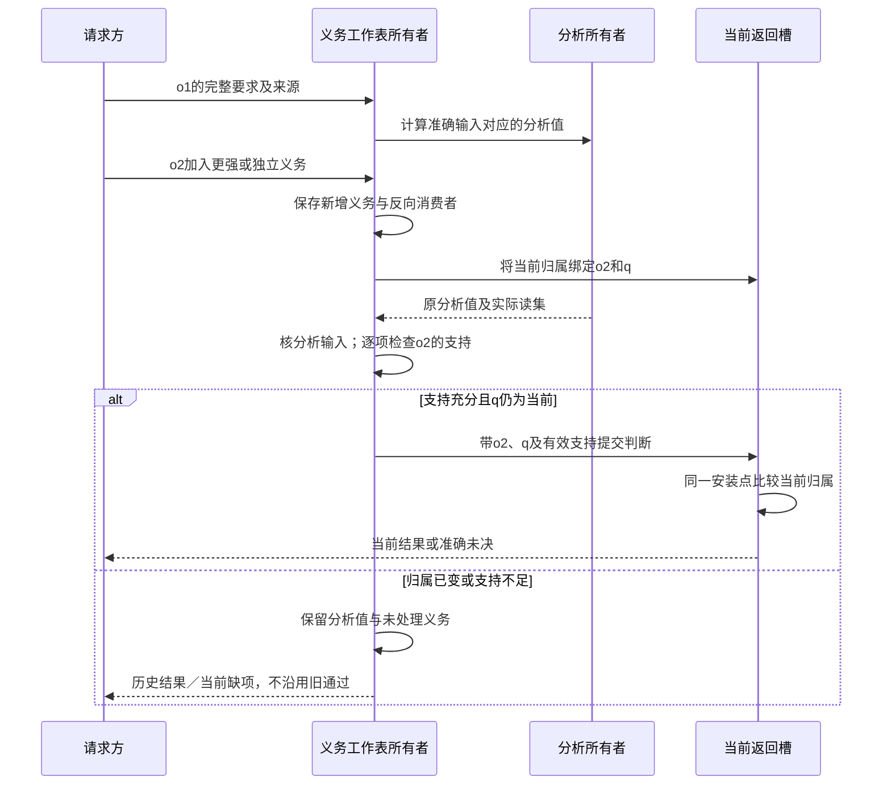
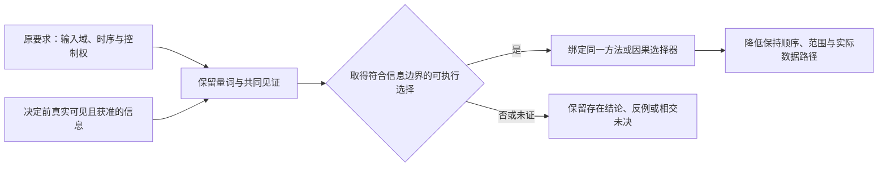

# 组合前提与进展闭合

本篇细化[共同语义的C0—C6](../作者/共同语义关系.md#组合边界摘要与义务闭合算法)中前提求解、反馈检查及整体资源的实际算法。输入仍是已解释的作者内容、BoundaryView、MethodSpec、UseBinding和Claim；结果仍进入原实现计划与保证评价，不新增作者表、证明平台、公共工具或IR。产品作者只维护真实要求和组合，普通已合格库可以直接复用；下面的依赖与证明上下文由系统按需要派生。

## 1. 先确定正在证明哪个命题

一次闭合必须固定主体及其使用点、要求修订、允许输入与环境、阶段、正常/失败分支、观察范围和所求保证。相同类型、规则名和字节不自动表示同一对象；某个实例的结论不能转给同型的另一实例。名为“完成”的返回可以是模型结果、保存结果、设备停止或资源可释放，分别使用原合同。

采用有条件合同的部件A时，已取得的是“在A的假设成立时，A保证某项结果”。这不证明假设成立，也不说明假设由谁提供。组合器要对每个真实前提找出支持来源，保存其范围和剩余条件；若只能得到条件性结论，就按条件性结果返回，不能删去条件以后输出一个绿色标记。

`AssumptionUse`仅是原义务集合的一项内部视图：所需命题、主体/修订与词法绑定、有效阶段和分支、输入/环境域、实际支持引用、支持条件、所用推理规则及消费者。普通函数不必持久保存这些字段；具有独立证明或审查用途的记录才按原Claim协议保存。这里的“支持”不是授权、执行事实或自动的保留根。

<a id="obligation-identity-discharge"></a>
### 义务身份、共享计算与消解

一个节点可以承担多个独立义务。工作表项以本次真实使用点及命题为中心，保留主体/修订、要求来源、量词与见证绑定、条件、输入/环境域、目的阶段、退出分支、观察与单位，以及所需证据强度。它们可引用原Claim/Obligations和固定上下文，不新增公共ID体系或每变量账本。相同源节点或结果摘要只允许寻找可共享计算，不直接命中“全部要求已满足”。

**消解采用两条充分路线。** 默认只共享规范命题与语境完全相同、依赖及支持仍有效的判定，合并后仍保留所有要求来源和反向消费者。跨命题复用时，须有当前接受的规则证明旧结论在新使用域内蕴含新要求，同时闭合旧前提、见证、分支和证据适用性；不能从一个strength整数或名字比较推出。没有这种依据就保留两项，并按需重算。语义相同不等于必须独立执行两次；禁止丢义务也不禁止真正同义消解。

例如，同一服务先检查延迟≤50ms，后来要求≤10ms，已有40ms的合格硬界只支持前者；后来一项必须入队。反向用≤10ms的有效界支持≤50ms，还须是同一对象、域、单位与保证种类。保留至少30天与必须7天内删除是两个可能冲突的义务，不能用“更强的一项”覆盖另一个。实测均值、统计区间和硬界即使数字相同也不可相互消解。

**到达次序不得丢失或削弱义务。** 固定义务及有效支持相同时，消解不能因先后顺序采用不同接受标准。预算不足或采用不同有界分析时，可能得到精度不同的准确部分结果，必须保留各自依据与未处理范围；要求可复现的检查仍固定方法、预算与调度规则。为实际支持判定保存待处理义务与依赖；新增或变强的义务总会触发其未解决前提及反向消费者，已经visited的对象仍可有新工作。同一判定重复到达只增加来源关联；不同命题保留。工作表处理与新义务到达由原拥有者协调，发布仍比较本轮要求/输入修订及支持基础；旧轮结果可保留为历史判断，但不能清掉处理中到达的新义务或签发新要求的当前完成。已反证、待取得、超预算、待执行观察和满足分别处理，不能将所有退出缓存成done。移除或撤销支持后使对应结论失效，循环按C3/C4重算，不靠互相已访问维持资格。

**共享见证保持同一套选择。** 同一个存在变量要求P(w)且Q(w)，必须由同一w满足；分别找到满足P的a和满足Q的b不能闭合。不同词法量词可以有独立见证，域和作用域不能按名称合并。OR只选一条完整且获准的路线；AND不能挑容易的一半。条件未知保留条件义务，不当false；条件确为false只解除其控制的义务，不解除同对象上来自其他来源的要求。物理同一资源的共享核算另按C5，不以义务数量重复收费。


<a id="obligation-publish-sequence"></a>
### 要求增强与旧分析完成的发布竞争

o1、o2表示同一任务的两份准确要求修订，q表示当前返回归属；它们不替代源内容或分析键。保留完整要求与共同见证后，才依据支持判定消费可复用的分析值。



图中的复用不要求重跑相同纯计算，也不允许从“数据相同”直接继承旧要求的通过结论。通知和结果回调不得删除新增义务；同一证据可支持哪些要求，仍按前节同语境或已核蕴含规则判定。

<a id="causal-choice-realizability"></a>
### 选择权、量词顺序与可执行策略

保持同一见证还不够：该见证由谁选择、何时固定、选择前可以观察什么，同样属于原义务的含义。数学上对每种环境各有一个成功答案，不证明编译器能交付同一程序，更不证明运行中的程序能在尚未看到环境变化时选中那个答案。不能由求解器在完整轨迹上“找到了值”，直接得到可执行的UseBinding。

| 当前要求 | 需要保留的选择关系 | 允许的实际落点 |
|---|---|---|
| 固定实现覆盖输入域D | 先选同一M，再核全部承诺输入：`∃M ∀x∈D. Good(M,x)` | M绑定到计划与制品，不为不同测试偷偷换实现 |
| 根据已取得输入选择方法 | 选择函数只能读取该时点真实可用且获准的输入；逐点存在见证还须给出适用域内的可计算选择方式 | 使用已绑定、可执行且覆盖原域的选择器；有限分派或原有条件实现均可 |
| 与开放环境持续交互 | 系统控制自己的策略，环境控制声明为外部的选择；策略只依赖允许观察的历史和当前输入 | 在所选同步/异步、信息和故障模型内验证同一因果策略，不把外部选择改成系统自由变量 |
| 给出存在性或一次轨迹 | 只需为该命题找到一个合格见证 | 可支持存在性、解释或反例；不能升级成任意调度、所有故障或全部输入的保证 |

具体反例：程序必须先不可撤回地输出y，之后环境才任选b∈{0,1}，要求y=b。`∀b ∃y. y=b`成立，但原时序需要的`∃y ∀b. y=b`不成立。把两条测试分别填成y=0和y=1没有交付一个满足原时序的程序。若原合同允许先收到b再输出，则`y=b`是正常的直接方案；这一顺序必须来自原需求，不能为让求解成功而擅自交换。

C2/S1从既有量词绑定、数据依赖、阶段、权限和目标调度合同取得选择上下文；C3传播时同时保持它。无需为每个普通函数新建策略对象。实际处理为：

1. **划分真实控制。** 固定作者/编译时选择、运行时可控制选择、外部输入和仅用于证明的辅助变量。环境值不因求解器可以赋值就成为SEC有权控制的动作；当前无此资料时保留相交未决。
2. **固定决定切面。** 对实际会改变绑定、状态或作用的选择，取得选择发生之前能够读取的值、有效观察、调用顺序及允许记忆。信息尚未到达、无法观察或无权披露时，不添加一个假想读取端口补洞；等待是否允许还要核原期限与资源合同。
3. **检查选择的一致性。** 对确定性策略，在决定点上无法区分的两种允许历史必须给出相同决定；随机策略的选择分布也不能依赖不可见事实，保证按原概率命题判断。某种环境下“有一条幸运执行”不能消解全称安全或活性要求。系统确能控制调度时可以选定调度器，但必须把相应约束落实到真实目标，不能只在模型里删除其他实际可能行为。
4. **取得可执行见证。** 静态选择固定同一方法；动态选择固定真实选择器、输入边和适用范围。仅有非构造性存在结论、有限样本表或求解器状态码，不冒充已经取得覆盖原域的实现。可以继续保留该理论结果或生成有资格的验证候选，不因此禁止独立的普通编译。
5. **原样降低与重新核验。** `resolveUse`保存选择及其观察前提，`compose-target`保留决定顺序与实际数据路径，assurance核生成结果是否仍受同一控制/环境划分约束。目标画像、观察范围、选择器、期限或调度改变，使相交资格重评；不能只因源码和类型不变复用旧策略保证。

证明中的历史、预言或其他辅助变量不因此被一概禁止。它们可以按已接受的逻辑与细化规则帮助证明；隐藏/消去辅助量后仍须得到真实程序的所求性质，且不能把证明中描述未来的变量直接降低为运行时读取未来。辅助变量的有效性与可执行策略的因果性分别检查。



这一区别用于实现选择、资源调度、重试/恢复、流式处理、权限决定与Agent计划，不要求这些领域采用同一个求解器。离线优化允许使用已完整固定的数据；在线策略不能冒领事后最优的结果。成本比较应说明采用同一因果可行集下的最坏界、期望或当前观测，而不是给每条未来轨迹挑一个不同的最便宜方案后称已实现全局最优。

外部校准采用[Spot的ltlsynt官方说明](https://spot.lre.epita.fr/ltlsynt.html)中“先输入/先输出、不可观察输入、存在控制器与实际输出控制器”的区别，以及[Lamport对辅助变量与细化的说明](https://lamport.azurewebsites.net/pubs/pubs.html)。两者于2026-09-22查阅，仅支持这些有范围的机制区别，不证明本系统或任意域综合已经实现，也不将Spot/TLA+设为依赖。当前决定的直接判据仍是上面的量词、信息和可执行见证；实际引入具体工具、改变时序/观察模型或出现相反实例时，重新核其版本及适用条件。

## 2. 前提的来源和用途不能混用

| 实际来源 | 怎样消费 | 不足以证明什么 |
|---|---|---|
| 固定输入及静态分析 | 在准确值、域、解释和读集上证明类型、范围、关系等 | 一次样例不证明全域；外部对象自报只读不证明无其他写者 |
| 上游部件的条件保证 | 同时绑定其真实输入和分支，先处理支持它的剩余前提 | 正常后置不能用于失败、取消或尚未返回的分支 |
| 已检查的归纳或细化依据 | 核适用模型、初态、转移/环境、假设和实际消费者 | 文件存在、工具退出0或供应者自报verified不证明所需性质 |
| 公开环境进口 | 由交付合同明确要求消费环境提供，保留精确输入、能力和寿命 | 隐藏的内部TODO不能改名为宿主进口；安装了一个包不证明设备/权限可用 |
| 原生观察或实际回执 | 只支持该对象、版本、切面及取得时的真实事实 | 点时无效果不证明旧请求不能晚到，仍按原恢复合同 |
| 运行检查或监控 | 检查位置、可观测条件及失败语义必须符合原需求 | 事后告警不证明事前阻止；拒绝原先承诺成功的输入不满足原功能 |
| 政策和接受决定 | 决定允许的实现自由、检查等级、风险和外部依赖 | 声明预算/许可不制造物理容量和现实授权；豁免不伪装成证明 |

一项依赖可以是实现有效性的环境条件，不必全部转成调用者参数。只在实际公开边界由调用方负责时才保留公开进口；内部编译、状态和辅助方法应当自行闭合。规格包可以交付准确未实现要求；独立应用不能因“其库允许进口”就遗漏应用所需的实际供给。完整性按[成品边界](../作者/成品形态与公共边界.md)判断。

## 3. C3的稀疏支持求解

先按C0—C2形成实际需要的义务，不从所有世界定义枚举一个全局全集。以下过程是在C3内执行的工作表，不增加另一套公开阶段。

1. **归一化但不合并不同命题。** 固定主体、量词顺序与见证绑定、选择权/可见信息、阶段、分支、单位、数值画像和环境域。只消除有依据的同义表示；结果相等、轨迹保持、生命周期和常时间分别保留。
2. **登记可直接使用的依据。** 取得已经合格的类型/范围规则、准确输入和适用证据。先核前提与当前目的，不能把所有BoundaryView的保证一律当作初始已真事实。
3. **传播有根据的支持。** 一条规则的全部前提在相同上下文已有可用支持，才建立其结论及依赖。`all`需要全部；`any`保留选定的完整分支、共同见证及[真实选择切面](#causal-choice-realizability)，不能每个消费点偷偷选择不相容分支，也不能用未来信息挑选当前答案。规则失败不删除要求，预算结束不变成反证。
4. **处理剩余分量。** 从尚未获得支持的边构造相交强连通分量，区分无提供者、支持条件未知、已有反证、循环支持与本方法不支持。无种子的`A⇒B、B⇒A`只得到两条条件定理，不得到A或B；转入下一节的有根据循环检查，而不是先假定它们都真。
5. **记录准确最小范围的失败和继续条件。** 给出已处理义务、导致失败的实际边、缺少的输入/方法以及可继续的更小问题。不承诺找到了全局最小冲突核；可以提供经复核足以说明当前失败的一组条件。

有限无环规则可以用计数器和反向依赖工作表线性地处理已访问的节点与边；这里的成本不包含任意谓词求解、原生分析或证明搜索。缓存绑定实际域、解释、推理规则、支持及否定读取。撤销种子或删除支持边时从新的受影响分量重算，不能让旧循环互相引用继续保活“证明”。加入新跨分量关系时，旧分区不再当然独立。

一种更小且正确的实现是整体重算当前相交区域。真实规模和延迟需要出现瓶颈时才增加增量维护；不能为省成本删掉未遍历的前提。

## 4. C4允许有依据的循环，不允许循环自证

### 安全不变量：初态和每个实际转移分别验证

设状态为s，初态关系为Init，共同不变量为I，真实一步转移为T，已接受环境约束为E。有限状态安全检查至少需要：

```text
Init(s)                         ⇒ I(s)
I(s) ∧ E(s, input) ∧ T(s,input,s′) ⇒ I(s′)
I(s)                            ⇒ 所需安全观察
```

这是检查义务，不是所有系统可自动求解的宣称。假设`I(s)`用于证明一步后继，是归纳假设；不能把尚未证明的`I(s′)`作为自身后继的依据。T必须包括实际可达的正常、错误、取消、环境干扰和内部微步；若只对稳定边界声明I，内部暂态可以不满足稳定形状，但必须证明回到下一合法稳定边界或准确退出。不能通过省略失败转移完成证明。

同一拍的A/B代数反馈不能用上一拍的归纳规则强行证明；需要实际固定点语义、存在/唯一性或明确选择关系及实现方法。引入延迟、初值或串行化会改变可观察行为时，须由原允许实现空间支持；没有授权便不能为了打破环私自添加。

### 活性、死锁和时限是另外的义务

保持I不证明任务会开始、会结束或达到截止。对活性还须处理初始触发、就绪条件、队列/等待、有限工作与环境进展。有限状态可检查可达等待环和目标之外的终止分量；更广系统可以采用合格排名函数、时序论证或真实调度分析。公平性只能约束具有相应可执行条件的动作，不会让互相等待且都未启用的动作突然发生。

条件性活性结果必须同时说明环境需要做什么。消费者永不读取、设备永久不响应或进程随时崩溃时，不能仍承诺无条件正常完成；相应的取消、故障结果、期限或降级也必须遵守原公开合同。有限模型中的无死锁不证明实际驱动、无限域或真实时间满足条件。

<a id="finite-observation-strategy"></a>
### 有限观察策略的组合接合

[有限抽象与观察策略](有限抽象与观察策略.md)唯一维护知识状态更新、共同前驱、持续安全最大不动点、保证完成最小不动点及下降rank；本节接入C4，不复制这些算法。原[选择权与因果约束](#causal-choice-realizability)、循环支持、资源组合、概率与开放环境合同仍有效，不把可选有限方法变成每次编译的前置。

`semantics`及领域方法提供准确有限模型、可见性、错误与接受条件；原联合选择调用已绑定MethodSpec；`assurance`按[有限见证接纳](../运行/验收/方法与独立证据.md#finite-witness-evidence)核初态、共同动作、全部后继和所求进展。模型不得省略真实失败、资源或并发行为来进入有限画像；动作域不完整只限制本次证据，不支持世界上不存在其他策略。相同可见历史不得按隐藏真实状态分派。

方法返回原计划可使用的策略见证与真实未决：局部闭合安全区域可支持对应范围，严格下降策略才支持其有限完成；全局无策略须有完备动作/反制依据。预算结束、观察不在模型内、目标不可观察、非终态无动作与模型缺后继分别交给原诊断，不折成一个false。可在预算内继续独立已合格根，不保留CPU槽无界等待。

`compiler`将选定策略接入UseBinding/目标方法，保持观察时点、共同选择与实际数据路径；是否用查表、普通分支或状态机及其空间成本由目标承担，不强制控制运行时。`application`呈现准确结果；`execution`另核当前授权、预算和原操作结算，策略证书不产生Grant。改变模型、动作、观察、合法输入、目标、失败后继或解释时仅重评实际消费者；旧操作和在途资源不随证书失效消失。

小模型默认使用显式可达知识图；具体工作表复杂度、有限精化条件及不强加响应义务的边界由[方法成本与接合](有限抽象与观察策略.md#finite-method-cost-and-boundary)承担。独立符合性验证与来源继续沿[有限观察策略依据](../依据/来源/语言编译与目标工具.md#finite-observation-sources)。

### 具体反馈例：工作器的信用与结果确认

生产端P只在有信用时接受下一项；消费端C只在收到结果后返还信用。初始信用为0、且没有另一条合法授信路径时，两端都等待：局部“收到就处理”合同可以为真，整条服务仍不满足正常进展。不能用“公平调度”掩盖这点。

允许的正常方案可以在已声明容量K内由真实队列拥有者初始授予K个信用；生产、结果认领和确认依次迁移信用。令free为可用信用，pending为已接纳但未交付结果数，delivered为已经交付但确认未结算数，稳定点保持`free + pending + delivered = K`。重复确认按原请求身份拒绝，不重复释放信用；缺确认不能静默重用其槽。

这个不变量只保证信用不复制/丢失；进展还依赖可完成的工作、结果通道与消费者的明确义务。需要有界关闭时另按原取消/结算协议，不把“信用最终回来”的假设当作已获得的驱动终结事实。同步纯库没有该异步信用机制，不应被迫创建它。

## 5. 不能用不可能环境和永不运行获得合格

对承诺处理的合法输入域D，应区分三项：D及需求本来允许的空/非空条件；拟采用环境假设是否相容；拟采用实现是否真正覆盖D中承诺处理的输入。

找出一个满足假设的样例，仅说明有限可满足性，不证明覆盖全部输入。反之，假设互相矛盾使`A⇒G`逻辑成立，也不说明产品可用。若只有特定环境被原任务明确接受，可以给准确的条件交付；不能私自把D收窄到无请求、零数据或无人有权调用，使全部测试无事发生。

工具报告UNSAT还须说明被检查的是“坏状态不可达”“环境条件不相容”还是“当前搜索模板没有见证”。三者结论不同。有限测试、形式证明、结构检查和政策接受保留原证据层次；删除一条假设后的结果变化能帮助诊断空真，但不能自动证明剩余规格完备。

## 6. C5按实际重叠组合资源，而非叠加局部绿色

先确定每份资源的真实拥有者、别名及共同存活区间，再合并预算。共享不可变代码不重复按实例分配计算；两个相同字节的独占临时区不能去重。新旧模块、输入复制、返回载荷、待确认结果、失败收尾以及运行中可达的分支均计入相应峰值。

例如两个各需48 MiB私有暂存的任务，在64 MiB可用预算下不能同时准入；这不是两个各自“低于64”的声明能解决的。没有并发或硬截止要求且资源能独立释放时，可以串行调度并保留48 MiB峰值；若二者另有共享输入和收尾，仍需增加实际用量。串行化违反公开并发/时限条件时不能采用。该数字是设计反例，不是实测预算或平台默认值。

等待者只归还不再使用的执行槽，不释放仍被目标访问的内存。需要额外结算空间才能交付和释放资源的协议，要在准入时保留信用或证明无环推进；不得占满容量后依赖无法获得的下一次分配。真实算法沿[端到端预算](查询增量与性能.md#端到端预算的组合规则)和[调用寿命](../运行/跨实现调用与数据寿命.md#call-lifetime)，本篇不重建资源池。


### 分层重试不能复制尝试和预算

一个逻辑调用、一次SDK调用、一个网络发送和提供者实际接受的动作不是同一计数单位。若三层各允许最多3次尝试且每次都进入下一层，一次逻辑调用可以展开为27次叶调用；这是给定展开规则的反例，不是任意SDK的默认行为。传输重发、语义重试和计费请求分别按其真实维度计量，不能用上层的“尝试次数”替代全部成本。

默认由原逻辑操作的执行协调者拥有语义重试决定。下层SDK的透明重试、备用提供者和并发试探都要进入同一已预留份额及截止范围；处理同一故障并重复同一作用的重试层默认合并；不同层确有独立恢复边界时可以保留，但绑定实际上界与安全合同，不让每层重新获得完整余额。局部安全恢复能避免重跑整条主链，不因统一预算被一概删除。提供者内部尝试不可观察或不可限制时，使用有依据的保守上界/外部限额；没有这种依据就不声明相应硬界已满足。只有无新语义作用的传输重发，才按其自己的传输保证处理，仍不免费免去时间和字节成本。

准许另一次可能到达目标的动作，除当前权限、前像和预算外，还须证明原效果身份及有效去重范围内的重复安全；或者通过原恢复合同确认旧作用确未发生且旧尝试已被围栏/终止、不会迟到执行。单纯关闭连接、进程退出、租约到期或一次未发现记录的查回均不充分。查回已经成功时返回原结果，不再执行；作用仍未知时保留未结算，不换requestId绕开。并发试探先核原合同允许竞跑及实际去重/隔离，所有分支分别预留；最快分支返回后，其他分支的未停止占用和可能作用继续结算。完成选择不消除失败分支成本，取消不把其额度自动退还。

具体预留、去重计量与未知消费仍由[分层预算B0—B5](../运行/权限与资源管理.md#budget-reservation-settlement)拥有；本节只向组合器提供实际展开、重叠和上界义务，不建立第二计费表。调整重试层、SDK配置或并行策略后，重新计算这些依赖；预算不足可以选合格的单次/串行路线或返回准确受阻，不能偷偷增加总额度、延长原期限或从恢复保留继续普通业务。实际适配可参照[gRPC重试官方说明](https://grpc.io/docs/guides/retry/)对逻辑RPC、底层attempt与透明重试的区分（2026-09-22查阅）；不由该特定库行为推断其他SDK、目标业务幂等或当前部署已经具备硬界。

## 7. 结果与后继怎样进入原编译链

`resolveUse`/联合选择消费的是准确支持关系、残余义务及所请求用途。用于隔离验证的已绑定候选可以带待证明命题进入验证产物，但不得携同一记录越级为生产保证；生产或某个更强保证根只接受其用途要求已经满足的分支。验证资格也不能跳过基本结构、目标、安全和现实授权条件。

分解规则与正文不是两份独立权威。组成改变时，只重算实际相交的义务、反向消费者、共享资源及分量；原始接受要求不被方法自报前提替换。生成器不得在降低时重选见证、扩大决定前可读的信息、交换输入/输出顺序、丢掉环境条件或只打包已测试过的分支。保证评价将组合依据绑定本次真实产物、环境和方法；用户界面可以展示准确部分结果，但不能据各部件成功数计算一个伪“整体已完成”。

| 原职责中的实现接合 | 具体输入与工作 | 结果及失败范围 |
|---|---|---|
| `semantics/boundary-view.ts`（拟定） | 已解释定义、使用点与领域方法 | 有类型、分支、域、寿命的原BoundaryView；缺解释准确保留 |
| `compiler/composition-obligations.ts`（拟定） | C2得到的真实连接、接受域与选择上下文 | `bindPremises / propagateSupport / classifyFeedback`，产生原义务集合与支持读集，不签发权限 |
| `assurance/composition-check.ts`（拟定） | 域规则、控制/环境划分、初态/步进/进展模型、实际证据 | `checkJointEvidence`返回支持范围、反例或未知；外部工具需原执行准入 |
| `compiler/resolve-use.ts` | 部分方法、残余义务及共同消费者 | 返回原UseBinding/Needs/ContractConflict/Unsupported；无合法前提不私改要求 |
| `compiler/compose-target.ts` | 固定选择、公共进口、成员与实际调用 | 汇合分根结果，环境合同和共同发行责任不丢失 |

无跨部件假设的已绑定纯函数，可以复用已核合同并正常生成，不走无用途证明搜索。缺一个高级求解器不阻止直接类型/范围分析、已有精确依据或准确的保守路线。

## 8. 依据和验收边界

有根据的循环假设—保证推理可以成立，不能把所有环都禁掉；安全/轨迹细化与死锁检查也不是同一个结论。这里采用的是各域证明规则的适用前提，不要求安装某个唯一求解器。原始研究和实际读取范围见[组合与遍接纳依据](../依据/来源/语言编译与目标工具.md#composition-pass-sources)。

完整连续情景见[从部件合格到整体成品](../../examples/连续开发/从部件合格到整体成品.md)，可观察正反条件见[作者与组合验收](../运行/验收/作者与组合案例.md#composition-acceptance-cases)。这些是实施设计；有限模型复算不代签真实SEC、驱动或所有输入的符合性。


## 9. 组合支持本身还要匹配性质与推理基础

C3的有限支持工作表只传播已经有依据的规则；它不是判断任意域扩展或公理是否健全的通用算法。执行一个插件而没有副作用，不足以接受它声明的推理规则。实际逻辑、编码和未验证步骤沿[证据接纳](../运行/保证/解释与证据接纳.md)检查；成功退出不擦掉假设。

C4归纳式适用于对应状态安全范围；不能把它的单轨迹观察自动外推成非干扰、随机联合分布或对任意链接上下文的保证。[性质保持](性质保持与开放环境.md)给出相交义务。已证明普通功能仍可正常复用，缺少更强关系只阻塞相应Claim，不以全部拒绝获得空真安全。

<a id="domain-summary-contract"></a>
## 10. 领域摘要的方向、覆盖与可实施传递

BoundaryView不是“字段都有值即充分”。领域方法必须声明摘要覆盖哪个输入/解释/出口、具体观察关系、可能行为的保守界、已经有依据的保证、未分析部分及真实依赖。对于可能行为集合的过近似，只能据其排除坏行为来支持相应普遍安全命题；界中有坏状态可能只是伪反例。有限存在见证可支持存在性，不能据此证明所有输入。关系性质、概率与开放上下文继续按其专用保持合同，不转成一条轨迹集合断言。

共同消费者使用三态的支持关系：依据足以满足、存在已核反例、或当前不足。未知不是空效果、不可达出口、零成本或无限容量。一个可能发生的正常出口不表示必定正常退出；可达正常保证也不覆盖Fault、Cancelled、Uncertain或不终止。摘要必须可以携带条件和出口区分，不能先混并后再补日志。

| 领域及原拥有者 | 具体摘要和默认传递 | 何时精化、重算或保留缺口 |
|---|---|---|
| 名称/类型/调用 | 准确绑定、类型参数、签名及被消费默认；连接按实参/形参和名义身份检查 | 解析域、重载候选、负依赖、声明或实例改变，重查相交链接/主体；未知导入不填Any |
| 数值/值域 | 类型化范围或关系、舍入/溢出/错误；顺序计算按实际算子传递，分支合并取包含全部可达值的界 | 独立区间丢失x=y等相关性时，不据其推出等式；选关系域或检查有限联合区域，未知保持 |
| 效果与退出 | 各出口的可能作用上界、确定保证及次序约束；串接仅从真实可达出口连接 | 并集可作为可能效果上界，不证明必定作用、原顺序或无重试；调用/控制流变更重算 |
| 资源/异步/别名 | 取得、借用、移动、暂停、结果交付和结算之间的关系，准确拥有者与存活区间 | 不能只留资源数量；复制Own、跨暂停失去Borrow、旧释放代码仍被使用须独立拒绝/适配 |
| 对象/状态/进展 | 初始化条件、可达转移及出口、框架条件、事件/时间和公平性前提 | 只保存终态不证明中间不变量或活性；拓扑/回调变更重算实际状态方法 |
| 关系/流 | 集合或重数、键与顺序、正负依赖、位置/水位及迟到合同；递归按所选SCC方法 | 删除支持从底或健全删除维护；没有真实时间下界不生成精确frontier，跨源快照不凭本地序号合成 |
| 数值微分/概率 | 原值定义域、导数关系、正则性/条件界、随机流及联合分布假设 | 原值出错不先返回导数；支撑集/边际相同不能替联合保证，非F64导数保持其结果种类 |
| 物理作用/信息/权限 | 目标能力、原操作状态、可读范围/覆盖与当前准入位置 | 切面观察不证明未来授权或旧尝试停止；披露/删除、提交与耐久分开 |
| 成本与调度 | 单位/主体/场景、估计或可靠界、实际资源别名、同时存活与调度前提 | 顺序累计可加，峰值按存活并集，墙钟取实际路径与等待；无共同前提的界不可拼接 |

S0由原领域方法产生上述所需的最小投影，S1由组合器固定实际连接/分支/见证及其选择切面，S2按该域合格传递规则推导支持，S3在摘要不足时精化该域或扩大到有预算的联合检查，S4将结论、条件和读集一同交给C6。不能通过收窄原合法输入、抹掉出口或把相关变量拆成独立样本弥补精度不足。有限联合检查也不足时返回具体未决；其他独立根和已有正确较粗实现保持可用。

精度不足与不健全分开：保守多报可以精化；已经发现漏掉真实行为的摘要失去相交保证资格，不以“近似”继续使用。领域摘要的生成、检查与其采用依据分别由原semantics/compiler/assurance承担；源码签名、解码成功或插件自报均不能签发健全性。当前默认采用各域已经定义的全量/有限规则，摘要精化按真实需要触发，不创建全领域常驻分析器。依据见[摘要与失效](../依据/来源/语言编译与目标工具.md#summary-invalidation-sources)。
