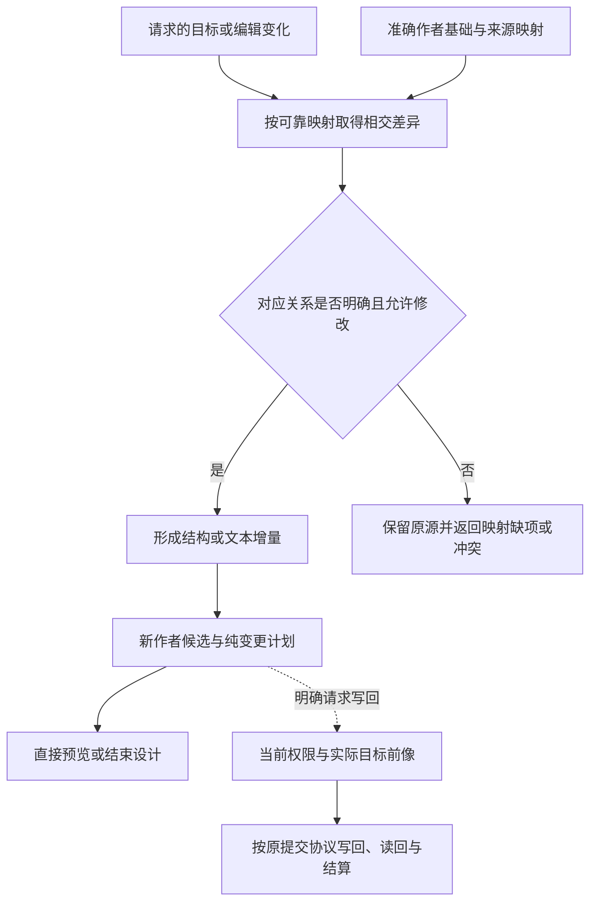

# 编辑与受管回源

> **阅读范围**：采用范围内的设计规范；实现状态另查未决 · [共同上下文](表示族与跨层保持.md)。

<details>
<summary>本页内容</summary>

- [变更中间表示](#变更中间表示)
- [源码映射、语义差异与往返一致性](#源码映射语义差异与往返一致性)
- [无来源恢复与有来源回写采用不同证明目标](#无来源恢复与有来源回写采用不同证明目标)
- [编辑往返的具体合同](#编辑往返的具体合同)
- [简洁作者与完整目标之间的编辑保持](#简洁作者与完整目标之间的编辑保持)

</details>


## 变更中间表示

### 1. 目标

`MutationIR` 描述如何把当前工程修订转换为目标工程修订。它是纯数据和可验证计划，不直接写文件、运行命令或调用远端。

### 2. 变更计划

```ts
interface MutationProgram {
  readonly mutationId: string;
  readonly baseObservation: ObservationRef;
  readonly targetProgram: TargetProgramRef;
  readonly semanticDelta: SemanticDeltaRef;
  readonly operations: readonly MutationOperation[];
  readonly readSet: readonly RevisionPrecondition[];
  readonly writeSet: readonly WritableTarget[];
  readonly ownershipProofs: readonly RegionOwnershipProof[];
  readonly requiredEffects: readonly EffectRequirement[];
  readonly resourceBounds: readonly ResourceBound[];
  readonly verificationObligations: readonly ClaimRef[];
  readonly recoveryModel: RecoveryModelRef;
}
```

### 3. 操作类型

```text
CreateArtifact
DeleteArtifact
MoveArtifact
ReplaceRange
InsertSyntaxNode
DeleteSyntaxNode
UpdateSyntaxNode
UpdateConfiguration
UpdateDependency
ApplySchemaMigration
RegenerateRegion
PreserveRegion
RebindSourceMap
```

优先使用结构化语义编辑；字节范围替换只在有稳定前像和语言合同支持时使用。

### 4. 人工区域保护

```text
RegionOwnership =
  Generated
| GovernedAuthored
| OpaqueExternal
| MigrationTemporary
```

`Generated` 可由相同生成器重建；`GovernedAuthored` 只能在明确契约和精确修改范围内改动；`OpaqueExternal` 默认不可写；临时迁移区域有退出条件。

### 5. 前置条件

每项写入绑定：

- 语义对象 revision；
- 物理内容摘要；
- 可写层；
- 路径能力；
- 所有权；
- 生成器 revision；
- 相关配置；
- 不变量和冲突域。

实际执行前再次进行 CAS 和权限准入。

### 6. 最小变更

最小变更不是最少字符，而是在硬约束下优化：

- 语义正确；
- 人工区域保留；
- 公共兼容；
- 可审查；
- 可恢复；
- 生成确定；
- 变更范围；
- 格式噪声；
- 迁移成本。

不同量纲保持成本向量。

### 7. Import 与命名

Import 修复由语言后端或前端提供结构化能力，不能靠字符串拼接。需要处理：

- 名称冲突；
- 类型/值命名空间；
- 相对路径和包导出；
- 循环依赖；
- side-effect import；
- 条件导入；
- 格式和排序；
- 公开 API 重导出。

### 8. 移动与身份

移动文件只更新物理绑定和受地址影响的引用。语义身份、责任和历史来源保持。若语言或外部协议把路径作为公共身份，移动需要兼容迁移而非普通 rename。

### 从目标差异到结构化变更



本图不承诺任意生成源码都有唯一逆向。预览路径不修改工作树；有写回请求时才进入真实作用分支。

### 9. 冲突

```text
MutationConflict =
  BaseRevisionChanged
| WritableLayerDiverged
| OwnershipChanged
| OverlappingWrite
| GeneratedSourceMismatch
| SemanticPreconditionFailed
| PathCapabilityLost
| TargetNoLongerApplicable
```

冲突返回重新观测、重新规划、三方合并或人工决定候选，不直接强制覆盖。

### 10. 计划纯度

生成 `MutationIR` 时不得：

- 创建真实临时目录；
- 修改工作区；
- 安装依赖；
- 运行有副作用脚本；
- 获取实时写租约；
- 持有 Provider 会话；
- 绑定绝对 deadline。

需要物理计算的规划步骤通过已准入 `PlanningComputation` 产生不可变回执。

### 11. 验证

- 计划确定性；
- 修改前像完整；
- 人工区域不被覆盖；
- 同一变更重复规划等价；
- 授权和 Provider 重启不改变计划；
- 目标变化使相关操作陈旧；
- 结构化编辑应用后重新解析符合；
- 故障点可以由运行时恢复；
- 空变更只有在目标已满足时合法。


## 源码映射、语义差异与往返一致性

### 职责与能力范围

来源映射回答某个结果从哪里来；逆向编辑还要回答目标变化能否唯一、合法地回到作者源。前者不自动提供后者。生成后重新观察可以检查解析、身份或类型的特定符合性；行为和外部效果保持仍需要对应观察合同与独立依据，不能由同一前后端自洽直接证明。

映射可以连接意图范围、语义对象、设计元素、实现绑定、目标节点、制品节点和物理源码范围；没有使用某层的路线不强制制造空节点。一对多、多对一及迁移边均合法，每条边明确类型、两端版本、生产者、精度和信息损失。

```text
MappingEdge = {
  mappingId, from, to,
  kind: realizes | generated-from | represents | lowered-to | observed-as,
  precision: exact | range | aggregate | approximate,
  producerAndRuleRef, provenanceRef, lossDescription
}
```

近似关系可以帮助导航和提出候选，不凭它覆盖源码。写回要求当前目标版本、明确写入范围、映射能力及前像检查；精确到一个源码范围也不等于能从它恢复唯一高层操作。

### 知识状态与目标值不可混用

`unknown/opaque/unresolved`是分析或工程知识状态，不是程序里的Option.None、null、空列表或Result.Err。函数明确返回None是业务行为；工具不能读取一个对象是观察缺口。把后者填成前者，会使生成的程序在真实数据上走错误分支。

缺信息时可以保全原文、返回受限候选、保留具有明确目标语义的运行输入或端口；不能生成一个默认空值来满足类型检查。真实“可空业务数据”用其语义类型表达，外部失败按对应错误协议表达。中立源、原生观察和目标计划均保留这层区别，接口投影可以简短但不能擦掉关键unknown。


## 无来源恢复与有来源回写采用不同证明目标

当前语言转换可以服务三种不同任务：保留来源的编辑回写、无来源程序的行为重建、已有行为的高层抽象与重构。前者使用下述EditCorrespondence；后两者按[恢复协议](../../开发/原生维护/导入观察与原生资产.md#recovery-purpose)取得真实模型并产生带范围的候选。没有原作者C0时，不伪造C0以套用I-R算法。

编译会丢失一些区别，因此从唯一目标字节找回所有历史原文并无普遍唯一解；恢复同义程序又是另一问题，不能由原文不唯一直接判为不可行。记录、证明或静态条件只有在其实际支持域内才转移；新提出的抽象可能更适合维护，但它是有权接受的新表达，不是被发现的隐秘需求。

普通生成缓存不能以两个程序在少量案例上相同就合并作者身份。新抽象采用前后保留关系、未覆盖行为和来源；旧程序具有的错误也不自动成为用户希望保留的需求。修改错误与保持语义必须分别声明。


## 编辑往返的具体合同

每个支持编辑的前端/投影必须声明：作者来源、输入格式与解释版本、可读取和可写子集、位置坐标、保全补充数据、视图版本及失败方式。作者来源可为原生文本或结构化模块，但同一区域不能两个来源独立写入而靠“最终同步”消除冲突。

读取得到的是语义视图以及重建所需补充：原始字节、CST/词法trivia、注释与排版、未知字段、错误节点和身份对应。可重建补充不必重复存一份；无法从语义恢复且需要保全的内容必须保留。未修改的原生导入再导出，默认返回原字节；格式化、编码转换和模式迁移是明确变化，不是无操作保存的副作用。

投影后的修改只在声明可写域内应用。更新作者源后再读取，应得到同一接受后的变化及允许的规范化；规范化不得删除用户信息或改变业务含义。没有修改的视图写回不得改变作者源。跨语言生成只检查其声明的保持关系，不要求语法回到原样；不能把有损降低强称为双向同构。

用户修改一个由两个定义共同生成的helper时，来源边可定位两个来源，但不能任意挑一个修改。工具按下述I-R流程解释范围、尝试合法局部特化或给出准确冲突；当前承诺范围内必须实现正向回源，不以可生成和调试替代它。真正超出范围的改动保留目标草稿；原生补丁或区域接管需要明确选择，不能静默降级。两个相似函数、重复常量和格式变化不能仅靠名称或文本相等合并身份。


<a id="compact-source-roundtrip"></a>
## 简洁作者与完整目标之间的编辑保持

简洁源的省略不是程序内容丢失。固定原CST、精确解释、已取得类型约束和实际转换，使生成器能够形成完整目标，而作者仍只维护短表达。HeaderIndex/BodyAnalysis里的推导字段与SourceMap/EditCorrespondence中的来源分开：前者描述这次结果，后者说明一个目标改动能否准确回源。

例如目标中的优惠`20n`变为`30n`，对应到offer中唯一业务字面量；回写后仍保留原import省略和lambda，不将它展开为新的fn、属性表或需求文件。目标显示`bigint`，若其类型由pricing参数合同推导，修改该拼写不能自动改全库类型；先确定是合法的目标表示控制还是源行为变化，无法唯一确定时保留目标草稿与具体冲突。

给原作者源增加恰好相同的显式类型，是增加约束的真实编辑；它可能不改变目标字节，但后续规则变化时有意义。反过来，自动格式化不能移除作者原有注解。移动导入文件时，工具需要保存原别名或改绑定引用；相同短文本不能掩盖不同解释修订。

这不是承诺所有推导都有唯一逆。I-R仍处理原源C0、目标G0、当前源C1及本次实际变化；只有相应规则支持的区域映射，其他内容可保全而不猜测。

<a id="managed-edit-roundtrip"></a>
### 受管生成物的编辑回源：固定基础、差异规则与再生成

当前TS生成目标必须为承诺可编辑的区域输出足够的对应关系。`MappingEdge`只说明来源，新增的**EditCorrespondence是原映射的一项有类型能力**，不是第二份程序或所有节点必有的元数据。它由实际降低器产生，目标组合器解析最终布局后封存；workspace消费它准备作者变化，只有execution能真正写回。

| 内容 | 保存方式及责任 |
|---|---|
| 来源基础 | 原作者候选、输出根、精确语言/生成器/供给/布局；引用已有不可变内容，不重复手写原源 |
| 目标基础 | 原ArtifactSet、成员路径、内容身份、声明/出现与精确位置；不能修改旧产物对象本身 |
| 对应关系 | 目标区域到原定义/使用点/控制/资产的角色；一对多、多对一、隐式生成与缺项明确 |
| 写回能力 | `value`、`binding-rename`、`expression`、`public-control`、`asset`、`presentation`或`navigation-only`；精确规则修订、输入前提、可改范围 |
| 必要补充 | 原切片、身份与别名、被消去的结构或常量、命名与布局决定；能引用已有记录就不复制 |
| 保持与覆盖 | 需要重生成的目标出现组、不可改部分、顺序/效果/资源条件，以及未覆盖分支 |

底层内容摘要只证明字节身份，写回规则才说明怎样处理差异。标准source map可导出作调试/导航，但不能代替上述补充。[ECMA-426](https://tc39.es/ecma426/)并不定义高层修改的唯一解释。

#### I-R0—I-R8：一次目标修改怎样回到准确作者

**I-R0固定两个基础。** 由artifactRef取得原作者C0、目标G0和映射M0；由请求base取得当前作者C1。固定实际内容和读取权。G0不变；将用户目标改动作用于其副本形成T*。缺任何必需补充就返回具体缺项，不能用最新版规则解析旧映射。

**I-R1取得目标差异。** 在G0上解码精确有序文本改动，保留未修改字节。语法错误可保存为待修目标草稿，不能先退回旧合法生成物。对解析成功的区域计算绑定/结构差异，不能把全文件格式化当成全程序改义。

**I-R2对齐所有者。** 将每个差异分到作者行为、公开控制、原生作者区域、资产、纯呈现或未知。数值相同、名字相同和位置接近不构成共同来源。跨多个拥有者的批次先收齐关系，不能先改一半再发现其他部分不可写。

**I-R3选择唯一可解释的写回。** 常量改变通过精确解码返回源槽；重命名保持实际绑定并更新真正的引用；目标公开名进入已有目标控制；受支持表达式按源语义重建；格式和非语义注释进入目标呈现补充。编译指令、三斜线引用、抑制注解、`pure`标记和sourceURL等可能影响工具或运行，不当普通注释忽略。

**I-R4处理共享与局部范围。** 一个作者位置产生多个目标出现时，编辑一个目标出现不自动改全部使用者。`occurrence`范围先尝试安全的使用点特化/现有参数与私有定义，保持其他出现；`definition`范围才提出改变所有真实消费者的候选。无法保持局部作用域、状态共享、栈/资源或公开合同则返回ScopeConflict；不得强行复制资源或从两个可行作者解释中随机挑选。

**I-R5形成源候选并重基。** 先在C0得到明确变化P，再将P与C0→C1的实际差异三方比较。无关变化保留，同一源槽或共享约束冲突给准确冲突。合并后重新核任务、导入、效果和当前消费者；不能因为文本不重叠就假定语义无冲突。原要求没有允许的行为变化保留为待接受，不通过写回放宽它。

**I-R6再生成并检查。** 此步骤只服务本次已解释目标差异的对应验证，默认重用固定输入的相交缓存与根，不启动所有目标、构建工具、运行案例或工作区写入；它不是每次普通作者propose的前置。旧映射只在C0/G0的旧解释下解码；当前C1采用了新规则时，先核规则迁移与新的对应条件，不把M0重贴给新生成器。在已接受的当前规则下生成T'；存在并发变化时，比较基线是C1的生成结果加上明确移植的目标差异，而非要求整个T'逐字等于旧G0上修改的T*。逐编辑核规定的等式、绑定与变更范围，核C1中不相交的现有目标和资产保持。TS字面量`12n`映回中立Int 12后应重新生成`12n`；`12`不默当bigint，错误或需明确类型变化。布局/注释补充独立检查字节保持；仅类型检查通过不证明任意目标算法与源等价。

**I-R7发布分支候选。** 全批可解释且检查满足对应范围，发布C2、T'及映射；源草稿有语义错误时可以保留但不声称回源完成。未知目标差异保存在准确目标草稿与定位中，不默默遗漏。没有一份候选可以把部分已丢弃差异标成全部成功。

**I-R8采用。** 保存C2或写T'仍走原apply前像/请求身份/权限。外部工作树已经改变就重基或冲突。旧C0、G0及必需来源按实际保留承诺持有；不是为了逆向给所有生产目标包上传完整私有源。

#### TS首批写回规则的具体实现域

I-R3先使用产物记录的准确规则，不根据函数名或生成变量前缀猜测。首批规则共用目标parser/type checker与原作者绑定，返回已有semantic-change、文本差异或control-change；不是每个项目都编写一个反编译器。

| 目标变化类别 | 匹配前提 | 写回动作与拒绝条件 |
|---|---|---|
| bigint字面量 | 原映射指向中立Int表达式；新节点是有定义的整数常量；符号一元运算已解析 | 解码为数学整数并打印现行Int字面量。小数、Number、任意表达式不按数值近似提升 |
| Bool/Text字面量 | 对应真实源常量/参数，正确解码转义；Text满足中立标量域 | 改对应值并按原上下文转义；目标孤立代理、编码非法或语义指令字符串不静默替换 |
| 标识符 | 符号明确，原源绑定或目标控制存在；不是属性字符串碰巧同名 | 使用既有rename或public-name控制；捕获、公开冲突及动态反射关系未闭合则拒绝该保持重构 |
| 比较与布尔表达式 | 运算数是已映射Int/Bool/Text中的合格组合；目标运算含义与中立运算相同 | 保留左右求值与短路，将目标运算映回同一中立构造；JS真值、数值强转和对象身份变化不通过拼写映射 |
| 算术与函数调用 | 使用有实际绑定的运算或已登记的Callable；参数/接收者只求值一次 | 复用原参数角色及求值顺序，新调用先解析真实导入并取得效果/生命周期；未知调用不补纯效果 |
| 条件表达式与闭合返回主体 | 条件是Bool，分支有明确激活域；当前函数的return归属和结果类型固定 | TS条件表达式映成if，分支计算留在原分支；含额外finally、label、yield/await或未知清理时不套纯表达式规则 |
| 新局部值与纯计算块 | let/const/var的绑定、捕获和可变位置在当前受支持域，作用域不会泄露 | 建立新源绑定和原次序，沿现行局部控制规则还原；重复定义/被捕获var不能简单值替换 |
| 目标辅助变量 | 补充记录给出精确生产关系及其消解条件 | 未改辅助部分从原源重建；修改影响真实生产式时改那一式。任意删除/挪动辅助语句不能无条件折叠回源 |

在一棵目标变化树上自底向上匹配：叶节点解码后按父规则组合，保存目标绑定到源绑定的映射和本次真实读集；有未支持子节点则整个相交父变化Pending，不把子树抹成零或未定义。一个文件的无关完整区域仍可检查，但整批未接受变化不自动部分采用。

完整函数体替换采用相同受限构造解码，不从几个输入输出样例归纳主体。能表示但当前没有写回规则的目标行为，允许开发AI依据原任务提出明确的中立实现候选；它走普通创作与验收，不假称为自动精确逆向。规则实现/目标工具尚未具备时仍是实现义务；上述公开支持范围不能仅靠一个表格被认证完成。

#### 准确的往返定律和失败范围

设固定环境E下的生成是G(S,E)。这里的承诺域由编辑类别、输入子集与保持合同决定，不是任意程序等价判定器。

* 无改动的往返保持原作者字节；没有显式格式化就不重印整个文件。
* 写回成功的变化Δ，必须由新源重新产生对应的目标变化及明确允许的规范化；不相交部分按其字节/绑定/行为/资产合同保持。
* 保留原定义身份不等于保留全部公开行为；行为变化和目标结构变化各自需要实际接受关系。
* 使用同一生成器再生成，是对应与稳定性的检查，不单独证明运行正确。规则需要独立推导的前提、目标检查和相应结果例。
* 一份可能正确的提升仍是候选，不能将“猜得合理”改名为精确还原。没有映射的源码可由原生编辑正常维护，不必恢复虚构的高层意图。

#### 当前必须具备的正向编辑类

| 编辑 | 正常完成 | 必须处理的反例 |
|---|---|---|
| 唯一来源的字面量/参数 | 解码到原槽、核值域、更新当前候选、再生成 | 重复数字、截断、数制不同、规则升级 |
| 绑定重命名与公开名 | 按符号/槽身份回源或控制，更新对应消费者 | 局部捕获、字符串反射、同名不同符号 |
| 普通表达式/闭合函数体 | 对受支持TS子域映回既有中立构造，保留求值/错误/捕获 | 任意JS动态行为被猜成纯函数，条件内计算被提前 |
| 模块与导入变更 | 形成模块位置/声明与包边界候选，共同核路径和依赖 | 路径相同但解析条件不同，生成私有名被当成API |
| 共享生成的一处特例 | 依据确切使用点形成可保持的局部特化 | 更改一处却影响全部调用、复制状态/资源 |
| 非源码和呈现 | 依其唯一拥有者回写；独立呈现只保存必要差额 | 全文件副本成为第二真相、注释中的指令被忽略 |

不得将这些普通类别全部标成“未来再做”同时宣称当前TS工程闭环完成。高级混合区域可以有准确未覆盖状态；其编辑率按已公布类别与真实任务逐项记录，不用任意百分比或一个最弱任务证明“逆向极强”。

#### 来源保留、损失与退出

原源、锁、规则与编辑补充是可重复编辑的依赖。声明持久可回源时，保存操作要把它们纳入保留根；不能仍按普通计算缓存随时回收。仅交付目标源码的分发可以排除私有源，但应准确表明那份分发物不独自携带回源能力。链接、加密和访问限制不因来源可定位而失效。

优化将信息合并或删除时，生成器要么保存足够补充并提供写回规则，要么将受影响类别标成不可逆。在当前维护目标承诺的操作范围内，不允许静默选择后一种优化；硬性能要求与回源要求冲突时显式裁决。发布目标可以选择不同策略，但保留的维护来源仍可用于以后生成，不表示能从任意发布二进制自动恢复。

源码接管仍然是显式所有权转换，不是缺映射后的默认成功出口；尚未接管的手改产物保留在待回写分支中，不在下次构建直接被覆盖。

### 基础结构编辑如何使用本合同

[结构作者的E0—E6与CST回写](../../作者/组合/结构编辑与身份保持.md#读取器绑定器与共同检查的实际过程)是本往返要求在基础中立域的一项具体实现设计。解码器提供有序出现、绑定键和区域；文本前端提供相同语义及原字节/CST；相交改动比较绑定和激活，而不仅比较类型或格式后的源码。

输入是原内容B、映射M、增量Δ；产出B'、新映射M'与准确诊断。无操作B'=B；有操作时回读满足Δ和保持范围。中立结构与源字节并不是双射，因此不能用仅有语义树的打印器认证原文恢复。不同首次身份的结构对照允许有明确alpha对应，但公开/名义类型身份、效果和独立任务要求仍保留。

基础作者模型不是优化后的目标模型。把外部分支的计算复制进共同前置、把两个调用合并、从隐藏局部键跨作用域取值，属于需要真实保持判断的变换；这些变化不能由序列化规范化默认执行。其他语言或领域的转换继续按其特有合同承担，不以基础体合格代签全域往返。

### 字节、文本与节点坐标

每个物理范围明确文件内容摘要、缓冲或磁盘修订、起止端点的半开区间，以及单位：UTF-8字节、UTF-16码元、Unicode标量或其他指定编码。面向人的字素簇移动不直接成为源码偏移。换行约定、CRLF、BOM与非规范Unicode分别保全；把代理对当作一个码元或把一个字素当一个字节均可能错改后续范围。ECMA-426的JavaScript/CSS列使用UTF-16码元，WebAssembly映射列使用字节；采用的工具协议决定转换，不能统一猜测。

转换使用同一份冻结原文，不能在新缓冲上换算旧偏移。输入法组合期间可以保留未完成文本，不立即把临时字符序列当作最终语义批次。最后有效模型仅供标明陈旧的诊断和导航，不得覆盖当前错误文本。

稳定节点身份与物理位置索引分别失效。文件前部多一行可能要求更新后续全部偏移，但不因此使后续所有函数语义失效；一次内联改变多个来源范围则按真实消费者扩大。重命名若影响公开协议、反射或动态查询，不能仅因稳定ID没变就判为无语义变化。

### 共同编辑、重基与写回

人和AI沿[共同变化合同](../../开发/工具协议/候选修改与批量.md#语义增量临时身份与前提)提交变化。候选同时绑定读取基础、当前作者层和写入集合；编辑器未保存缓冲不等于磁盘，更不等于版本库提交树。

重新读取后，必要输入不变可以复用；相交范围外变化可重新映射；前像或解释规则改变则重基或返回冲突。三方比较使用明确的基础、本地候选与当前源，不在读取不到基础时编造差异。原子组、隐藏依赖与权限检查仍归共同变化合同，映射器不签发授权。

写回前先在候选中执行可用的重解析、绑定与检查，再复验实际目标前像，沿相应宿主的提交或恢复协议执行。没有可用逆向前端时，可采用原生工具和其他验收方法检查目标；不为满足“必须往返”而造第二个无效前端。只读查看和设计预览不因此必须写磁盘或运行目标。

### 差异与冲突的解释

语义差异区分新增、删除、变化、移动、重新绑定、来源变化、未知和冲突；物理差异记录字节、节点、配置、依赖和制品。格式噪声可以折叠查看，但不能从精确前像与回执中丢掉。布局若属于业务空间或顺序就是语义；装饰性编辑器布局仅影响其实际消费者。

支持程度按解析、身份、类型、行为、效果、完整指定合同分别说明。某等级通过不替另一等级签发结果。后端信息损失、人工编辑破坏结构、前端不支持、格式器删标记、目标外行为和映射版本错配分别定位，不能统一以“重新生成”覆盖。

设计反例包括：无修改保存改变注释；emoji之前插入导致UTF-16定位错位；未知扩展被旧编辑器删除；共享helper逆向到错误来源；输入法草稿被旧模型覆盖；手改区域被格式器吞掉；生成器升级后旧映射仍写入；重命名改变反射名称却被标为无影响。验收比较原字节保全、身份和所声明语义，不以文件可解析替代这些条件。

机制依据见[表示与优化依据](../../依据/来源/语言编译与目标工具.md#语言编译与目标工具)。这些是设计合同与反例，不是本包已运行的往返实验。
