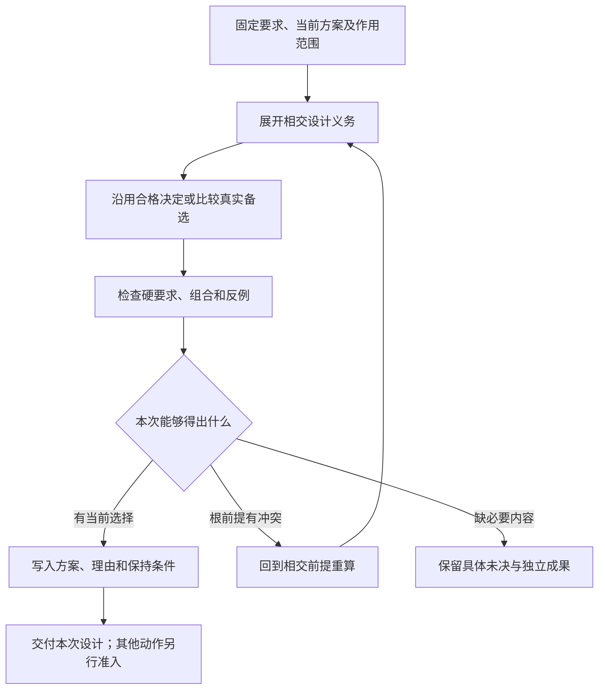
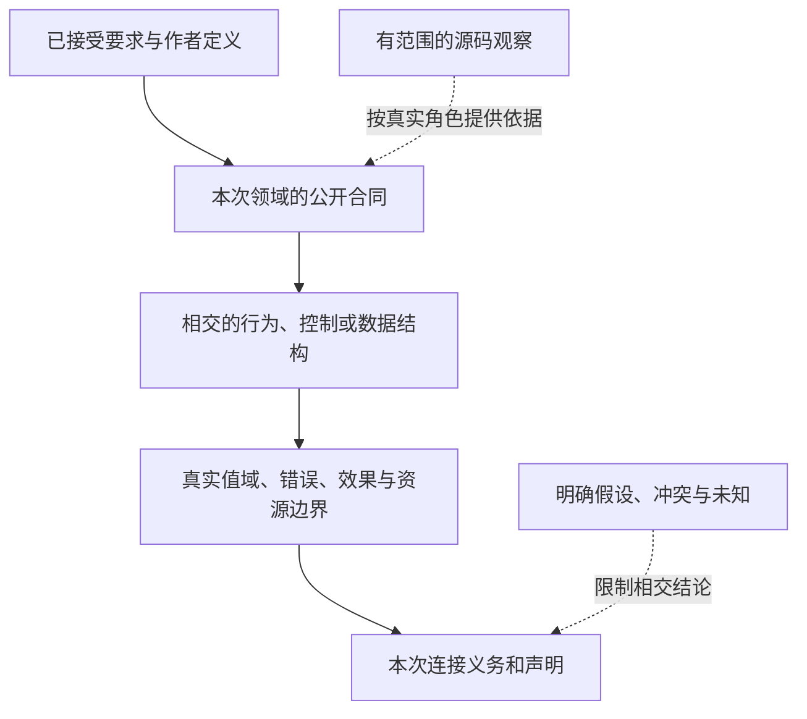

# 需求语义与实现选择

> **阅读范围**：采用范围内的设计规范；实现状态另查未决 · [共同上下文](表示族与跨层保持.md)。

<details>
<summary>本页内容</summary>

- [契约、策略、权限、验证与支持语义](#契约策略权限验证与支持语义)
- [实现需求、候选与绑定中间表示](#实现需求候选与绑定中间表示)
- [工程设计中间表示](#工程设计中间表示)
- [工程语义中间表示](#工程语义中间表示)
- [工程语义图](#工程语义图)
- [意图中间表示](#意图中间表示)
- [类型、数据布局、单位与资源语义](#类型数据布局单位与资源语义)
- [行为、状态、并发、时间与效果语义](#行为状态并发时间与效果语义)
- [领域方言、接口与中间表示扩展](#领域方言接口与中间表示扩展)
- [状态模型到控制流的保持条件](#状态模型到控制流的保持条件)
- [关系表示的重数、缺失与求值保持](#关系表示的重数缺失与求值保持)
- [局部可变位置与结构化退出](#局部可变位置与结构化退出)
- [对象、流和导数不能只比较最终数值](#对象流和导数不能只比较最终数值)

</details>


## 契约、策略、权限、验证与支持语义

### 1. 一个万能 Contract 会失真

不同边界需要不同 payload，但共享可寻址承诺的 envelope。

```text
ContractDefinition = exact {
  contractRef,
  contractKind,
  semanticScopeAndResponsibilityRefs,
  payloadGrammarRef,
  producerAndConsumerRefs,
  authorityAndInformationCeilings,
  compatibilityEvolutionRetirementRefs,
  contractRevision
}
```

### 2. Contract 种类

- Domain public operation/result；
- durable schema；
- capability port；
- external protocol；
- policy；
- verification/assurance；
- support；
- migration/compatibility。

它们通过 typed refs 组合，不合并为巨型 DTO。

### 3. Policy

Policy 是有权主体在明确范围内选择的可执行约束或排序规则。它有 issuer、subject、operation、effect、时间、法域、revision 和 deny semantics。自由文本 policy 只能是 authoring input。

### 4. Permission 与 Grant

Permission 描述可授予的能力范围；Grant 是对具体 principal、subject、operation、effect、资源和 epoch 的当前授权。策略存在不等于 Grant 已签发。

### 5. Verification Requirement

Contract 只能声明需要证明什么，不能因为写了 `verifiedBy` 就产生 PASS。结果必须来自独立 Evidence 和 Verdict。

### 6. Support

SupportContract 定义平台/版本/环境、已知限制、响应和维护期。ImplementationBinding 或一次测试不能自动产生支持承诺。

### 7. 验证

- contract identity 与文件路径分离；
- policy deny 优先；
- grant 过期；
- declaration 与 execution result 分离；
- unknown contract version fail closed；
- support 环境与验证环境错配；
- 一个内部 DTO 无独立 consumer 时不升级为 Contract。


## 实现需求、候选与绑定中间表示

### 1. 目的

`ImplementationIR` 把工程设计中的“需要什么能力”转换为“由哪个精确实现提供”，同时保留资格、限制、替代和失效条件。它不把“工具已安装”“用户偏好某库”“曾经成功运行”误当成有效绑定。

### 2. 对象分离

```text
Requirement  需要满足的语义和非功能条件
Provision    某候选声明可以提供的能力
Candidate    可被评估的精确实现修订
Eligibility 候选是否满足全部硬约束
Decision     有权选择哪个合格候选
Binding      Requirement 到 Candidate 的稳定解析结果
Allocation   当前执行为该绑定保留的资源
Grant        当前执行对效果的授权
```

这些对象具有不同生命周期，不能合并成一个 Provider 记录。

### 3. 实现需求

```ts
interface ImplementationRequirement {
  readonly requirementId: string;
  readonly semanticContract: ContractRef;
  readonly requiredCapabilities: readonly CapabilityConstraint[];
  readonly targetConstraints: readonly ConstraintRef[];
  readonly effectConstraints: readonly EffectConstraint[];
  readonly securityConstraints: readonly ConstraintRef[];
  readonly qualityClaims: readonly ClaimRef[];
  readonly compatibility: CompatibilityRequirement;
  readonly fallbackPolicy?: FallbackPolicyRef;
  readonly provenance: ProvenanceRef;
}
```

行为需求来自已冻结设计，不从某个实现库的偶然行为反推含义。作者另行明确接受的库/算法固定、禁止项或外部兼容约束，也进入相应targetConstraints和Binding输入；它们不必须先证明是外部兼容需求才能有效。某库名称既不补足未知行为，也不覆盖独立硬要求。

### 4. 候选

候选来源包括：

- 当前工程已有实现；
- SEC 内建参考实现；
- 标准库或成熟第三方库；
- 外部 Provider；
- 模板或生成器；
- AI 或搜索生成的候选；
- 自研实现计划。

```text
ImplementationCandidate = {
  identity,
  revision,
  provisions,
  targetCompatibility,
  knownEffects,
  resourceProfile,
  securityProfile,
  licenseAndSupplyChain,
  maturity,
  evidence,
  limitations,
  lifecycle
}
```

候选声明不是事实；关键能力由符合性证据支撑。

### 5. 资格

资格逐项返回：

```text
Satisfied
NotSatisfied
Unknown
NotApplicable
Stale
```

任何硬条件为 `NotSatisfied` 时候选淘汰；关键条件为 `Unknown` 时默认不进入生产绑定，可进入实验或影子验证。

### 6. 解析决定

```ts
interface ResolutionDecision {
  readonly decisionId: string;
  readonly requirement: RequirementRef;
  readonly eligibleCandidates: readonly CandidateRef[];
  readonly selected: CandidateRef;
  readonly rejected: readonly CandidateRejection[];
  readonly objectiveComparison: ParetoComparisonRef;
  readonly authority: AuthorityRef;
  readonly assumptions: readonly AssumptionRef[];
  readonly validity: ValidityCondition;
}
```

决定只在合格候选间比较。排序、流行度、调用者提示和 fallback 不能绕过资格。

### 7. 绑定

```text
ImplementationBinding = {
  requirementRef,
  candidateRef,
  provisionRef,
  adaptationPlan,
  semanticVersionRange,
  exactCandidateRevision,
  targetProfile,
  conformanceEvidence,
  limitations,
  invalidationInputs
}
```

绑定是编译输入，不是运行实例。Provider 进程重启只影响执行绑定，不改变实现绑定，除非能力 revision 或符合性发生变化。

### 8. 适配

适配器只处理：

- 类型和协议表示；
- 错误映射；
- 生命周期和取消；
- 资源与配额；
- 身份和回执映射；
- 安全能力句柄。

适配器不能重新定义产品语义、放宽硬约束或自行选择 fallback。

### 9. Fallback

Fallback 是重新解析：

```text
Binding invalid
→ Re-evaluate requirement against current candidates
→ Hard eligibility
→ New decision
→ New binding
```

不能在调用失败后暗中换 Provider。新绑定不得扩大权限、数据范围或降低验证标准。

### 10. 局部失效

候选更新只使实际绑定它的 Requirement 及其反向消费者陈旧。候选注册表新增不应重编无关目标；只有策略要求“每次发现新候选都重求最优”时，相关决策失效。

### 11. 验证

- 不合格候选永远不能被偏好选中；
- 候选声明与真实符合性差分；
- Provider 漂移和撤销传播；
- fallback 权限与效果不扩大；
- 同一 Requirement 在相同候选闭包下解析确定；
- 候选闭包不完整时不宣称全局最优；
- 许可证、安全和供应链条件进入硬资格；
- 绑定的 exact revision 可重新获取或明确不可用。


## 工程设计中间表示

### 1. 目的

`DesignIR` 表示为满足意图和工程约束而形成的设计候选。它比 `SemanticIR` 更接近实现结构，但仍不绑定具体库版本、文件路径或实时 Provider。

### 2. 设计候选

```ts
interface DesignCandidate {
  readonly candidateId: string;
  readonly goals: readonly GoalRef[];
  readonly architecture: ArchitectureGraph;
  readonly responsibilityAssignments: readonly ResponsibilityAssignment[];
  readonly contracts: readonly ContractDefinition[];
  readonly behaviorModels: readonly BehaviorModel[];
  readonly dataModels: readonly DataModel[];
  readonly concurrencyModel: ConcurrencyModelRef;
  readonly errorModel: ErrorModelRef;
  readonly effectRequirements: readonly EffectRequirement[];
  readonly implementationRequirements: readonly ImplementationRequirementRef[];
  readonly verificationObligations: readonly ClaimRef[];
  readonly assumptions: readonly AssumptionRef[];
  readonly residualUnknowns: readonly KnowledgeGap[];
  readonly costVector: LifecycleCostVector;
}
```

### 3. 架构图

架构图使用类型化边：

```text
contains
requiresSemantic
calls
reads
writes
publishes
authorizes
observes
validates
migratesFrom
```

物理部署和代码目录是可选 realization，不是设计节点身份。

### 4. 完整性

对所声明的设计范围，固定当前选择与明确未决；下列事项按真实相交性闭合，未涉及的能力不制造空协议：

- 目标和非目标；
- 责任和 owner；
- 输入、输出、失败和不变量；
- 状态、并发、一致性和时间；
- 数据、保留、迁移和删除；
- 效果、权限、资源和恢复；
- 外部依赖和退出；
- 安全、隐私和供应链；
- 验证声明和证据方法；
- 未知、假设、残余风险和复审条件。

### 5. 设计分支

不同候选可以共享子图。设计搜索不复制整个系统，而构造差异：

```text
Candidate = BaseDesign + DesignDelta
```

`DesignDelta` 必须说明新增、修改、删除、假设和验证影响。

### 6. 冻结

需要机读交换或正式接受时，使用[设计冻结合同](../../演进/实施/主线前沿与准入.md#7-设计冻结)，引用准确候选、目标范围、实际决定与未决。该拥有者规定字段和可选的真实签名；本节不再维护一份名字相同、字段不同的回执。

固定内容身份、接受一项设计与授权实现是三件事。普通设计以准确正文、当前选择和剩余义务交付即可；冻结不会自动授权编码、运行或发布，也不妨碍独立的阅读、比较与后续设计。

### 设计候选形成



本图是设计过程，不是产品必须执行的多候选搜索。文档中的当前决定足以记录设计；机器冻结回执和签名只在实际交换或政策需要时产生。

### 7. 设计搜索与反例

按候选真实范围检查下列相交事项；这里只规定需考虑的维度，不强制运行求解器、实验或所有生命周期设施：

- 约束求解；
- 失败场景模拟；
- 对抗反例；
- 生命周期成本；
- 迁移可行性；
- 供应商退出；
- 极端资源和并发；
- 组合边界检查。

反例如果推翻责任或核心约束，候选被淘汰或返回上游重算，不能只追加例外。

### 8. 物理实现自由度

`DesignIR` 可以规定：

- 必须同事务；
- 必须隔离；
- 必须可替换；
- 必须可取消；
- 必须有读回；
- 必须满足某延迟或资源上限。

但在没有真实需要时，不规定具体文件、类、框架和供应商。实现解析在自由度包络内选择。

### 9. 变更局部性

新增一个目标或约束时，只重新合成：

- 直接受影响责任；
- 与其共享不变量的边界；
- 依赖的实现需求；
- 相关验证义务。

若影响所有候选，系统应能指出是哪个根约束造成，而不是无解释全局重写。

### 10. 验收

- 所需硬约束分别记录已满足、不满足或未知；候选可以保留未知，但需要该保证的实现采纳不得把未知作为通过；
- 每个设计对象有规范 owner；
- 每项效果、权限和恢复闭合；
- 每个未知有影响范围；
- 备选和淘汰理由可追踪；
- 成本比较不混合量纲；
- 设计可降低为有限实现需求；
- 设计变化产生精确 `DesignDelta`；
- 冻结回执绑定 exact candidate。

### 冻结层次与候选预览

本篇“冻结”分为字节/引用固定与有权采纳后的设计基线。前者只固定待解释输入，可以用于预览、实验和诊断；后者才包含适用硬约束和授权决定。第4、6节的完整性要求按拟采纳范围与请求保证实例化，不要求一个纯函数先填写全套运维、隐私与发布材料。没有某项风险不制造假字段；风险未知则保留其前沿，不能伪写已满足。

DesignCandidate可保存架构与行为提案，但与SemanticIR的已采纳定义共享引用和差异，不是第二套同时生效的行为数据库。普通重建不先生成DesignCandidate；原生内容可保全并走原工具链，不为套用本篇流程强行推断业务意图。具体请求边界统一见[流水线](../内核/输入与阶段总览.md#编译流水线与阶段边界)。


## 工程语义中间表示

### 1. 目标

`SemanticIR` 表示跨语言、跨框架、跨实现仍稳定的工程意义，是意图、源码事实和领域定义的协调结果。

### 2. 核心对象

```text
SemanticIR = {
  subjects,
  responsibilities,
  contracts,
  operations,
  dataModels,
  states,
  behaviors,
  effects,
  policies,
  invariants,
  qualityClaims,
  relations,
  knowledgeStates,
  provenance
}
```

### 3. 责任

```ts
interface Responsibility {
  readonly identity: ResponsibilityRef;
  readonly purpose: StatementRef;
  readonly ownedState: readonly SubjectRef[];
  readonly operations: readonly OperationRef[];
  readonly providedContracts: readonly ContractRef[];
  readonly requiredContracts: readonly ContractRef[];
  readonly invariants: readonly ConstraintRef[];
  readonly allowedEffects: readonly EffectTypeRef[];
  readonly lifecycle: LifecycleRef;
}
```

责任不等于目录、类、包或服务。实现可以跨文件；一个文件也可能实现多个责任。

### 4. 契约

契约只有在存在独立消费者、失败语义和演进责任时成立：

```text
Contract = {
  identity,
  revision,
  inputs,
  outputs,
  failures,
  invariants,
  authorityBoundary,
  effects,
  compatibility,
  consumers
}
```

内部 DTO 和普通函数参数不自动升级为公共契约。

### 5. 行为与状态

行为由数据流、控制流、状态转换、错误流和效果声明构成。语言特有实现细节可以保留为 opaque realization，不进入跨语言行为核心。

状态模型必须区分：

- 领域状态；
- 执行状态；
- 验证状态；
- 生命周期状态；
- 界面投影状态。

不能把它们合并为一个 `status` 字段。

### 6. 数据模型

语义数据模型表达：

- 实体身份；
- 值对象；
- 关系和基数；
- 不变量；
- 生命周期；
- 一致性边界；
- 隐私和保留分类；
- 查询和事件语义。

物理表、索引和序列化属于实现或目标 IR。

### 7. 效果

```text
EffectKind =
  ReadSource
| WriteSource
| SpawnProcess
| NetworkCall
| ReadSecret
| WriteData
| PublishArtifact
| ChangeAuthority
| HumanNotification
| CustomDomainEffect
```

效果声明包括目标范围、幂等性、可读回性、可补偿性、所需授权和资源。设计阶段声明“需要什么效果”，不绑定实时句柄。

### 8. 知识与冲突

每个重要语义对象保留：

- 定义来源；
- 源码观测；
- 推断候选；
- 有权采纳；
- 冲突和替代；
- 未知覆盖；
- 适用 revision。

`SemanticIR` 不是把所有输入强行融合为单一真值的数据库。

### 局部存储与公开效果不是同一投影

既有有序区域保存位置身份、读写、捕获、控制目标和清理关系；公开接口只投影调用者能观察的效果。一个私有计数器未逸出时，可以隐藏整个调用的内部状态效果，但不能抹去这个区域里两次闭包调用的写后读依赖。目标优化读取实际关系及对应保持资格，不读取一个“pure=true”代替全部条件。

内部的退出记录沿[控制与寿命](../../领域/对象与控制/控制流与存储寿命.md#控制出口与清理结果的确定合并)保存待完成结果、主错误、清理诊断及尚需结算的责任。scoped业务Result和函数Fault/Cancel在各自边界组合；这不是新的作者错误类型全集，也不是所有程序要带的永久日志。

结构展开、内联或重构改变捕获和调用者时，类型可能仍相同，但公开效果消解与noescape依据已经失效；须重新分析相交区域。物理共享只读类型信息不改变这项语义；同内容闭包不自动共享运行位置。


## 工程语义图



这是语义关联投影，实线表示本次分析所需的内容关系而非时间线。一个程序不必同时创建状态机、数据模式和永久责任图；观察也不会自动升级为已接受意图。

### 9. 局部性

语义对象以稳定身份和类型化关系组织。源码地址纯作定位时，移动只改变 realization binding；若路径参与模块解析、资源查找、对外路由或身份定义，则相应语义也变化。消费者可以依赖契约、内联实现、常量、效果或部署配置，不能把“仅契约变化才失效”作为通用规则。

传播与复用按 [可达输入闭包与负依赖](../查询增量与性能.md#可达输入声明依赖证据与负依赖) 的实际正、负、成员依赖和证据等级判断。局部性是有范围的合同，不是稳定 ID 自动带来的定理。

### 10. 验证

- 规范 owner 唯一；
- 责任状态和操作闭合；
- 契约输入输出和失败完整；
- 状态转换不违反不变量；
- 效果均有权限和验证义务；
- 未知不参与肯定证明；
- 物理路径不被无意当作语义身份；确以路径定义的对象显式记录该约束；
- 相同语义经不同语言前端可映射到共同对象；
- 语言特有语义未被错误丢弃。


## 意图中间表示

### 1. 定位

`IntentIR` 保存用户、产品和工程主体提出的目标候选，不把自然语言直接当作可执行规范。它允许歧义、冲突、未知和多个解释分支，但禁止把实现细节误写成已接受目标。

### 2. 结构

```text
IntentProgram = exact {
  intentRef,
  actorAndAuthorityRefs,
  outcomeAndNonGoalCandidates,
  scopeCandidates,
  hardConstraintCandidates,
  preferences,
  requiredAndForbiddenCapabilityCandidates,
  acceptanceClaimCandidates,
  stakeholderAndRiskCandidates,
  assumptions,
  unresolvedTermsAndReferences,
  alternativeInterpretations,
  sourceAndProvenanceRefs,
  validityAndRevision
}
```

### 3. 语义层次

| 层次 | 允许 | 禁止 |
|---|---|---|
| raw utterance | 原始文本、图、表、点击和 API | 直接授权 Effect |
| parsed intent | 候选动作、对象、约束和范围 | 自动选择唯一解释 |
| normalized intent | 术语绑定、量纲、否定、时间和法域 | 把未知补成默认 |
| accepted intent | 有权主体裁决后的目标和非目标 | 混入 Provider、路径、临时环境 |

### 4. 歧义

```text
IntentKnowledgeState =
  exact
  | ambiguous { alternatives }
  | conflicting { witnesses }
  | incomplete { missing }
  | unsupported { construct }
  | rejected { constraint }
```

系统只能在安全且不影响目标的默认值上自动补位；会改变不可逆结果、权利、成本、作用域或技术路线的歧义必须保留或交给有权主体。

### 5. 意图等价

两个自然语言表达只有在规范化 outcome、scope、constraints、acceptance、stakeholders 和 authority 相同后才可视为等价。字符串相似和嵌入相近不能建立语义身份。

### 6. 降低

```text
IntentIR
→ Product/Domain Definitions
→ Requirements / Claims / Preferences
→ 已采纳模型的确定性编译，或在确有未决设计时形成 DesignSearchProblem
```

降低必须生成来源映射和未解析 frontier。后续设计不能反向修改原始意图，只能提出 `IntentRevisionProposal`。

### 7. 验证

- 否定、条件、例外和量词；
- 同名对象不同 scope；
- 用户要求与法律冲突；
- “尽量快”缺少质量边界；
- 要求具体框架但框架不合格；
- 多轮会话中目标变化；
- 模型生成的解释被错误当作用户确认。


## 类型、数据布局、单位与资源语义

### 1. 类型不只是字符串

类型需要 identity、构造、约束、表示、兼容、所有权、序列化和目标能力。相同名称不保证兼容，不同名称也可能表示同一语义。

### 2. TypeAlgebra

```text
Type =
  Primitive
  | Record
  | Variant
  | Optional
  | Sequence
  | Map
  | Set
  | Tuple
  | Function
  | Reference
  | ResourceHandle
  | Quantity<Unit>
  | Opaque<Provider>
  | DomainTypeRef
```

### 3. 语义类型与物理布局

Semantic Type、Logical Data Model、Serialization Schema、ABI Layout、Database Layout 和 UI Representation 分离。Backend 通过 lowering 选择布局，不能让当前语言表示反向定义语义。

### 4. 单位和范围

`Quantity<Unit>` 绑定维度、单位、转换和有效范围。温度、时间、字节、速率、货币、概率和计数不能依赖字段名猜测。转换必须检查溢出、精度、舍入和法域/时间。

### 5. 资源句柄

文件、连接、锁、进程、凭证和设备是有身份和生命周期的资源句柄，不是普通数字或字符串。它们不能被序列化复制后冒充有效 capability。

### 6. 兼容

区分 source、binary、wire、storage 和 semantic compatibility。增加 optional field 只有在默认语义、旧 reader 和未知字段保留正确时才兼容。

### 7. 验证

覆盖 NaN/Infinity/-0、整数溢出、Unicode、重复字段、大小端、alignment、nullable、union exhaustiveness、unknown field、schema round-trip、跨语言映射和单位转换。


## 行为、状态、并发、时间与效果语义

### 1. 行为不能只用调用图表示

工程行为包含状态、事件、并发、时间、资源、权限、外部 Effect、异常和恢复。调用关系只是一个观察视图。

### 2. BehaviorModel

```text
BehaviorModel = exact {
  operations,
  stateMachines,
  eventsAndMessages,
  preconditionsAndPostconditions,
  partialOrderAndSynchronization,
  effectsAndCompensations,
  deadlinesAndTemporalProperties,
  failureAndRecoveryTransitions,
  resourceAndAuthorityRequirements,
  observablesAndClaims
}
```

### 3. 并发语义

明确 sequential、commutative、idempotent、exclusive、serializable、causal 或 eventually-convergent。不存在默认“线程安全”。共享可变状态必须明确拥有或协调责任、一致性模型和冲突政策。承诺线性化的操作定义其线性化点；采用合格的可交换合并或其他模型时定义其实际顺序、合并与可观察保证，不为所有共享状态虚构同一个线性化点。

### 4. 时间属性

支持 deadline、timeout、minimum/maximum duration、eventually、until、rate、window 和 freshness。墙钟、单调时钟、逻辑时钟和事件时间分别建模。

### 5. Effect

Effect 描述对外部可观察状态的变化，包括文件、数据库、网络、进程、设备、发布、凭证和人工通知。Effect 不能被普通函数返回值替代。

### 6. 恢复

每类failure定义相交的效果进展、结果确定性、恢复能力和下一动作权限。无效果、已知部分效果与完成未知描述发生情况；可补偿、前向恢复或不可恢复描述处理能力，不能混成一个互斥列表。需要哪个有权主体由政策决定，人工不是所有未知的默认出口。异常类型本身不拥有业务失败语义。

### 7. 验证

使用状态机、模型检查、线性化历史、故障注入、时间虚拟化和物理测试，覆盖 race、deadlock、livelock、starvation、ABA、消息重复、时钟漂移和资源枯竭。

### 8. 行为主体不是封闭状态机菜单

`operations` 可以具有一般程序体：类型化值、绑定、可变局部、条件、循环、函数调用与递归，具体语义归[一般程序语义与计算表达能力](../../领域/计算基础/通用计算与任务语义.md#一般程序语义与计算表达能力)。状态机、规则表和领域算子是可选择的高层表示，不是唯一可用行为。图灵完备性只描述理想资源下的可计算函数表达，不代表上述时间、安全或并发性质都可自动判定。

行为元数据说明约束与观察，不能代替行为本身。用户定义的纯操作先降低为普通函数，被调用表达式先求值，实参按源出现顺序各求值一次，再按已解析形参角色传入；不得按形参声明次序重排实参求值，也不得因宏式展开复制Effect；词法绑定使用新身份，不能捕获调用方变量。外部调用以明确端口发生；纯函数的传递调用闭包含Effect时必须报告，不允许只检查当前函数的表面语句。


## 领域方言、接口与中间表示扩展

### 1. 共享协议不排除独有中间表示

领域方言共享适用的身份、来源、修订、关系和验证边界，可以增加领域类型、操作、属性、不变量和接口，也可以保留专有IR。禁止的是另造相互矛盾的身份/权限事实，不是禁止第二种语义表示。不能为了统一容器而丢失连续、概率、并发或目标语言特有含义。

### 2. DialectPackage

```text
DialectPackage = exact {
  dialectRef,
  namespace,
  schemaAndSemanticRevision,
  typeAndOperationDefinitions,
  attributesAndTraits,
  interfaces,
  verifierRules,
  parserPrinterAndCanonicalization,
  loweringAndInteropContracts,
  compatibilityMigrationRetirement,
  conformanceCorpus
}
```

### 3. Interface pass

通用 pass 只访问 interface，例如 `Effectful`、`Stateful`、`Ownable`、`Lowerable`。方言可以提供实现，但不能改变接口语义。一个 pass 需要方言专有信息时，应成为该方言 pass，而不是在 Core 中添加 `if dialect`。

### 4. Unknown dialect

未知方言必须保留 identity、raw form、scope 和 opaque boundary。只读转发可以保持字节；需要理解语义的变换返回 unsupported，不能丢弃或猜测。

### 5. 版本和卸载

加载新方言不能改变旧 snapshot 的含义。方言卸载后，旧模型可作为 opaque 保存，但不能继续执行需要其 verifier/lowering 的操作。

### 6. 跨方言关系

跨方言转换通过显式桥接 dialect/interface 和 lowering receipt。自由字符串和路径不建立类型等价。

### 7. 验证

- dialect 加载顺序置换；
-名称和 predicate collision；
-未注册属性；
-未知 dialect round-trip；
-旧版本迁移；
-同一 generic pass 处理两个无关 dialect；
-方言不能签发其 Fact authority；
-卸载后禁止误执行。

### 8. 用户可定义性与目标合法性

方言不等于系统团队预先编写的行业目录。已有语义的组合定义可由用户自己提供，直接降低成普通函数/数据；新元语义通过声明、验证器、接口、转换和符合性语料引入。声明成功只说明对象形状成立；能够运行还需要目标所接受的操作和可用转换，完整转换后的残留非法操作必须被拒绝。

[用户定义语言语义与编译扩展](../../作者/组合/语义扩展与领域接合.md#用户定义语言语义与编译扩展)拥有定义包、过程扩展与原生逃生口的详细合同；[一般程序语义](../../领域/计算基础/通用计算与任务语义.md#一般程序语义与计算表达能力)拥有不依赖内置行业的计算底座。未知方言可以保留和传输，但不得借此宣称已完成类型、优化或生成理解。


## 状态模型到控制流的保持条件

[状态领域](../../领域/状态关系与流/层级状态与事件.md)在公共作者模型中保留层级、声明顺序、转移域、history、激活与回调身份。把它展开成目标分支/循环后，要保持输入标签、选择前态、退出/动作/进入次序及稳定提交；只比较终态名不够。

exit和entry之间配置可能暂时不满足稳定不变量，仍不能暴露为Stable。并行region逻辑上活跃，不表示动作可交换；不得按目标线程先后决定它们共享C的更新。纯动作产生的命令和真正I/O也保留阶段关系，不能把网络发送提到未完成宏步中。

结构体与文本构造可以形成相同ChartModel；原生SCXML保留事件匹配、脚本和失败语义时可能是另一画像。转换者要逐项说明公共域，不把本画像的回滚或强类型Done偷偷用于解释全部SCXML。


## 关系表示的重数、缺失与求值保持

关系IR保存有序的操作输入与回调出现，结果本身可为无序多重集；这两种顺序不混同。SQL NULL、Option.None、外连接无行、解码错误和未取得输入，只有明确映射才能互转。默认ValueOps的相等是原类型相等，不能由原生排序规则静默覆盖。

关系变换必须对任务接受域保持重数、结果、错误/非终止和读取权限。无外部效果不是下推许可；增量代数的相消项可能访问新完整查询不会访问的值，因此回调定义性是额外前提。不能把负权重抵消当成异常也能抵消。当前正确回退是对受影响节点按新输入重算，完整机制由[关系规范](../../领域/状态关系与流/关系查询与维护.md)拥有。


## 局部可变位置与结构化退出

同一目标程序表示中增加可变位置、读取/写入、循环目标和函数出口；它们的含义由[控制与寿命](../../领域/对象与控制/控制流与存储寿命.md)定义。位置身份不等于内容摘要；相同值的两个局部槽不能随意合并。闭包按值捕获let，按位置捕获var；可达闭包延长托管环境的寿命，不延长Borrow域或外部授权。

将位置转换成SSA时，在控制合流和循环回边保留需要的phi/块参数；逃逸位置不能只剩一次初始值。Normal、Return、Break、Continue、Fault和Cancel携带所属控制目标和越过的清理边界，不能统一变成普通Result数据。loop无界的目标运行不是编译图无限展开；无体、无正常后继和语义不明也不是同一种状态。

表达式重排、内联、尾调用和死代码消除都要保持已有出口与清理顺序。调用资源作用域产生的close及其失败由实际效果记录，不能因为主体纯或结果未用而删掉；GC可回收与外部资源Closed分别解释。


## 对象、流和导数不能只比较最终数值

对象保持关系包括引用身份、别名、初始化可见性、槽分派、错误和已发生字段更新；目标用class或结构不是单独的等价证明。[对象规范](../../领域/对象与控制/对象构造与分派.md)中的构造区域在Ready之前不可逸出。

流保持关系包括数据出现、顺序、信用、容量、时间域、进展性质、迟到与终止。窗口和队列不是无序Bag；失败或取消不能降低成End。[流规范](../../领域/状态关系与流/背压与事件时间.md)产生的严格frontier与估计watermark在IR中使用不同判别。

AD保持原值计算及所选导数量。前向、反向与检查点可以不同，但累加、分支激活、随机固定和残余寿命必须保持。[AD规范](../../领域/数值/自动微分与线性化.md)的PointDerivative、PathLinearization和替代梯度不能共用一个无标签成功值。

新增领域节点只在其支持范围参与分析；图册和任务摘要不是新IR，显示折叠不会删除真实字段、状态和资源。
