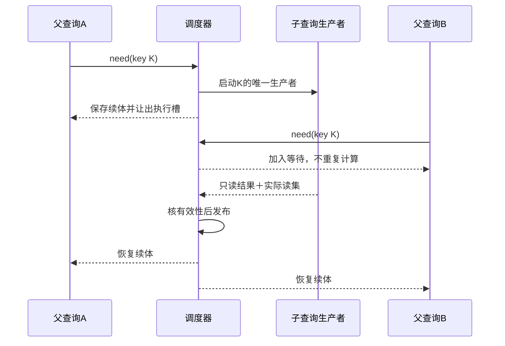
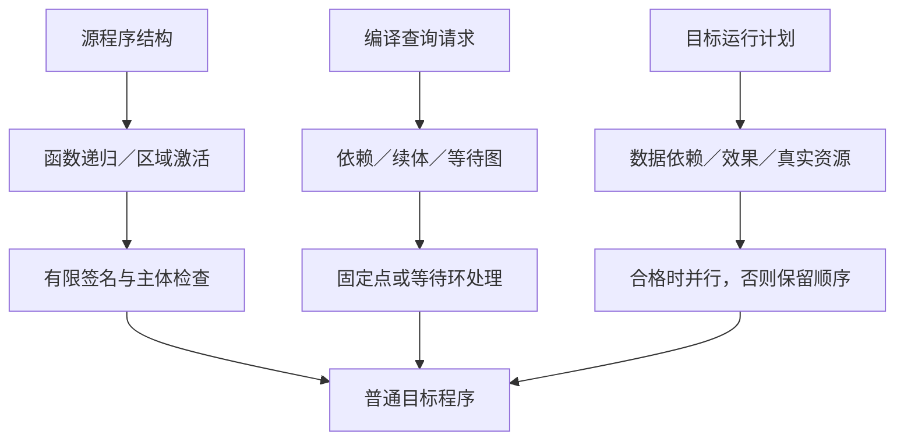

# 递归、并行与远程编译

> **阅读范围**：采用范围内的设计规范；实现状态另查未决。

本页内容

- [1. 六种经常被混称的递归与并行](#1-六种经常被混称的递归与并行)
- [2. 三张关系视图，不是一棵万能任务树](#2-三张关系视图不是一棵万能任务树)
- [3. 任务身份、输入和输出](#3-任务身份输入和输出)
- [4. 一条实际可实施的分解算法](#4-一条实际可实施的分解算法)
- [5. 同键共享、等待环与并行死锁](#5-同键共享等待环与并行死锁)
- [6. 父子任务怎样共享预算而不互相堵死](#6-父子任务怎样共享预算而不互相堵死)
- [7. 并行输出的确定性与稳定布局](#7-并行输出的确定性与稳定布局)
- [8. 远程编译的准入条件](#8-远程编译的准入条件)
- [9. 远程协议的正常与失败路径](#9-远程协议的正常与失败路径)
- [10. 本地和远程竞速不是默认策略](#10-本地和远程竞速不是默认策略)
- [11. 明确的多模块轨迹](#11-明确的多模块轨迹)
- [12. 速度、粒度与升级选择](#12-速度粒度与升级选择)
- [13. 设计复核、关闭范围与反转条件](#13-设计复核关闭范围与反转条件)

本章拥有同一编译请求怎样分解、共享、等待、执行、取消和接收远程结果的调度合同。语义由[编译内核](内核/输入与阶段总览.md)及领域定义拥有，计算键与复用由[查询与性能](查询增量与性能.md)拥有，实际资源和授权由[宿主准入](../运行/权限与资源管理.md)拥有。它不建立第二个编译器、全局状态库或新的开发者工具。

默认采用单机、固定输入、只读阶段结果和一个逻辑协调者。串行执行是有效基线；同机并行可以逐项加入；远程执行只在真实收益和授权成立时启用，作者源与公共语义不随部署方式改变。

## 1. 六种经常被混称的递归与并行

| 对象 | 合法含义 | 当前处置与边界 |
|---|---|---|
| 作者函数递归 | 目标运行时再次调用函数 | 先收声明与签名，检查有限函数体；保留调用边，不在编译时执行未来所有调用 |
| 模块、类型、效果的循环依赖 | 声明互引、类型布局或分析方程 | 分别处理签名SCC、类型是否合法、效果固定点；不是一见环就启动无限子编译 |
| 嵌套结构与库展开 | 组件引用组件、域定义降低为子结构 | 相同实例键共享；带参数变化的新实例受节点、深度、时间与大小预算约束；预算结束是未完成，不是程序无意义 |
| 编译查询递归 | 一个分析需要其他查询结果 | 通过同一请求的查询表建立依赖，未完成结果挂起续体；合法固定点由专用求解组拥有 |
| 并行编译 | 无冲突的当前就绪工作同时进行 | 先确认依赖、独立输出和资源，按就绪队列执行；不要求所有模块经过同一全局阶段栅栏 |
| 分布式编译 | 合格的编译动作在其他机器计算 | 传递固定内容和明确工具/执行环境，返回隔离产物；不是让远程节点独立编辑作者工程 |

增量回答“哪些旧结果还能用”，并行回答“哪些当前工作可同时做”，远程回答“在哪里做”。三个维度正交。全量冷编译也可以并行；增量计算也可以完全串行。目标程序包含并行算法，不要求编译它时必须分布式；编译器使用多核，也不改变目标程序的线程语义。

语言画像、后端能力和阶段可否执行仍由显式支持决定。本章不新增`parallel`语法、无限`spawn`工具或默认云端服务。

## 2. 三张关系视图，不是一棵万能任务树

**作者/语义关系图**保留调用、类型、数据流、效果、约束和反馈，各种边有各自解释。

**当前动作依赖图**只包含本次必须先取得的结果。可合格处理的循环语义先交相应SCC或求解组，再以组结果作为调度依赖。严格完成前置中的无基础环不能以“语义递归合法”为理由放行。

**任务父子与资源归属**说明谁提出子任务、预算从哪里继承、谁接收与取消。它可以是树或引用关系，但不能替代真实数据依赖。两个父任务可能共同依赖同一个查询；一个父任务也可能等待不属于其展开子树的公共签名结果。

当前数据结构选用模块索引、局部节点区、只读阶段结果、键到工作项的表、依赖与等待邻接表、就绪队列和每请求的资源计数。宿主总资源池同时限制所有请求，各请求预算在其内部限制父子展开；每个请求不独占全部物理容量。内存中即可承担；需要跨进程恢复时才保存原动作身份及已固定内容。不将每个AST节点写入运行数据库。

## 3. 任务身份、输入和输出

沿用已有QueryNode/ActionKey/ActionPlan，不再创建另一种永久产品身份。一个调度工作项按需要保留：

| 数据 | 具体含义与来源 |
|---|---|
| 请求根与阶段 | 指向冻结作者候选、目标根和当前编译阶段；调度器不改作者内容 |
| 计算键 | 方法及版本、确实影响结果的内容依赖、目标/解释/布局选择；隔离范围参与复用资格 |
| 前驱与结果槽 | 等待哪些精确结果，每个结果由哪个选定生产者提供 |
| 状态与续体 | 当前处于等待、就绪、运行、验证、结果可用或终结；等待者保存下一步而非占用工作线程 |
| 资源描述 | CPU槽、可估计/可限额内存、临时空间、设备、期限；来自宿主和方法能力 |
| 效果类别 | 只产生隔离计算结果，或需要真实外部作用；不从函数名猜测 |
| 输出拥有者 | 临时结果槽、目标成员及合并规则；不能多个工作项同时写同一最终文件 |
| 尝试与结果 | 逻辑动作可有重试，尝试身份用于迟到、取消和费用结算；不改变计算的数学含义 |

普通源中的声明名不是这些内部字段的输入表。结构变化后重算实际依赖，不因同一个display name就复用不同程序。

已完成输入都固定时可以在准入前形成完整ActionKey。需要生成源或动态依赖发现时，先执行有边界的发现动作，取得实际内容、成员与负条件，再形成后续消费动作的键。一个未解析引用不能冒充最终摘要；发现动作读取活动文件时必须沿观察协议取得新的准确输入范围。

## 4. 一条实际可实施的分解算法

**S0 固定根。**取得作者、语言/库/后端、输出与布局基础，明确分析/生成/检查目的。远程、写入、安装和执行许可分别取得。

**S1 建立模块与签名。**解析所选模块；声明允许互引时，先完成该声明组件的签名收集。签名未就绪的消费者等待对应结果，不读取半构造符号表。

**S2 展开必要查询。**从输出根请求类型、效果、组合与降低。查到已完成且合格结果则复用；同键正在运行时建立等待关系，不重复创建计算；新键建立唯一工作项。

**S3 分类循环。**对当前等待边检查环。领域已声明的固定点进入一个求解组；严格需要先有结果却没有基础的循环返回诊断。普通运行递归仍然只是有限函数体里的调用关系。

**S4 创建就绪前沿。**前驱完成、输出范围可独立、实现线程安全或有隔离、资源可供应时进入就绪队列。顺序敏感的规则保留显式依赖。默认以稳定拓扑位置和工作项身份作平局规则，动态成本估计只影响调度，不改变语义。

**S5 执行与挂起。**领取一次资源配额，运行到完成、需要未完成依赖或受控退出。等待依赖时保存续体、释放CPU槽和可释放占用；仍活着的内存和句柄继续计费。

**S6 验证与发布。**工具完成后检查输入/方法归属、输出成员、字节、格式、诊断及所请求保证。一个原子状态转换发布只读结果和真实读集，再唤醒等待者。输入变化或旧尝试不能直接更新当前请求头。

**S7 汇合输出。**每个输出根只接收自身闭包中的合格结果。布局规划先固定共享名称和初始化约束，独立文件再并行打印。最终组装验证成员与冲突；只有合同要求一起成立的组才共同发布。

**S8 结算与释放。**纯计算失败可以在预算内重新执行固定动作；保存已完成且可复用结果，分类其余失败。等待、取消、失联与真实运行终止分别记录。实际修改工作区仍由原写回协议执行一次，不在worker完成回调中直接写用户文件。

以上步骤是同一调度器内的算法，不是九个服务或九次AI调用。小输入可在当前线程内顺序执行，保留同样的结果与失效规则。

## 5. 同键共享、等待环与并行死锁

### 图解：父查询挂起、共享子结果与恢复

父等待时交还执行槽，但保留的内存继续计量；取消一个等待者不自动取消其他消费者仍需要的生产者。

查询表的每个键有唯一当前生产者。锁只保护查询表和状态转换；不在持表锁时执行用户Pass、等待其他查询或调用外部工具。

请求Q时：已有结果就检资格并返回；已有生产者就登记当前工作项到Q的等待边；不存在就创建生产者。加入等待边前检查它是否会形成当前活动等待环。跨线程环同样检查，不能只看一个线程的调用栈。

例如Q(A)等待Q(B)，而Q(B)又等待Q(A)。若它们属于预先有语义的单调固定点，交该组计算；否则结束相交查询并返回包含真实路径的循环错误。不能两个worker永久阻塞，再让线程池无限增大来掩盖问题。

固定点组拥有格、底、种子、转移、变化判定和预算。有限高度单调组默认从底按稳定工作表迭代；删除旧依据时按新图重算。带扩宽、近似或非单调的组有自身策略，不能仅因都叫SCC而自由并行更新。组可顺序求解而与其他独立组并行。

普通`sum(tail)`的运行递归不产生针对所有列表尾部的编译任务。`expand<T> → expand<List<T>>`若不断产生新类型键，则不能靠同键去重结束；应采用已允许的共享表示、残留泛型或报告该策略预算结束，不假造有限展开。这是计算表达能力与某个生成策略可结束性的区别。

Rust编译器指南给出了不可变查询结果、同键等待和并行循环检测的机制，但其并行页明确注明部分信息过时。本设计只采用这些机制教训，不用该页断言2026年某个发布版默认线程行为。参见[来源](../依据/来源/构建分发与迁移.md#构建内容分布式与迁移)。

## 6. 父子任务怎样共享预算而不互相堵死

本机每个编译会话只有一个资源预算域，内部与外部并行不得重复声明自己独占全部核数。子任务从父作用范围取得许可，从同一实际资源池取得配额，消耗计入总请求；递归层数不重置时间、费用或节点预算。

反例：四个worker分别运行四个父任务；每个父任务创建子任务后继续持有CPU槽并阻塞；所有子任务都在队列里。即使依赖图没有环，系统仍不能推进。

当前选择是**等待时挂起续体，不占执行槽**。父任务完成可释放的阶段后再派生子任务；不可恢复的局部状态需要保留时，内存仍计入活跃集。不能只退还CPU、却让四个父任务保留所有内存，再声称已经保证进展。

准入前检查正在等待的父工作集与准备运行子项的共同容量。容量不足时，优先执行能释放共同资源的就绪工作，或者在允许范围压缩、释放可重建中间量、降低并行度。必须落盘才能继续时取得相应许可；没有合格动作则返回资源缺项或结束分支，而不无限排队。远程容量也需要实际预留或提供者保证，本地数字不能创造远程资源。

外部目标构建器具有自身并行时，适配器优先共享其支持的jobserver；否则把外部工作作为一个声明需求的资源组，并显式限制其内部并发。不同时给四个子构建各发`-j8`并称总量只有8。

[Ninja手册](https://ninja-build.org/manual.html#_gnu_jobserver_support)明确说明其jobserver支持有版本、参数和平台条件。适配器逐项核对实际工具，不仅设置一个环境变量就宣布共享成功；未支持时使用单层并行作为正确回退。当前没有实现这些适配器。

## 7. 并行输出的确定性与稳定布局

### 图解：程序递归、查询等待与目标并行不互相代替

三种环由各自语义处理。编译器可并行检查两个分支，不因此允许目标程序同时执行两个分支。

工作窃取、完成顺序和worker编号只决定何时运行，不参与公开符号、私有稳定名、文件位置与相同输入的结果选择。

局部节点由所属模块稳定定位，跨模块引用由声明身份和精确版本链接，不使用全局自增编号的分配先后决定打印名字。共同命名冲突在已冻结符号和布局表上按稳定规则解决；两个任务不能在各自局部都占用同一个最终公开路径。

诊断保留模块/源位置、阶段、错误身份、来源和必要子诊断。完整诊断批次按固定键合并；提前返回的进展流可以有不同到达顺序，但不能冒称完整诊断字节可复现。不同算法因循环打断得到不同解释时，需固定断环政策或将此诊断限定为非规范进展；排序已经产生的不同内容并不能使它们等价。

有预算时，并行和串行可能完成不同数量的可选检查。结果必须说明完成范围，不能把所有调度都能得到同一完整成功写成无条件保证。内存地址、时间、机器路径确实进入源可观察语义的特殊画像，应保留其规则并相应限定可复现声明。

## 8. 远程编译的准入条件

一个工作项可远程执行，需要同时取得：

| 条件 | 具体检查 | 不成立时 |
|---|---|---|
| 可携带输入闭包 | 作者/生成输入、工具、依赖、配置和成员范围固定；负依赖有实际解释 | 先本地发现或保留本地执行；不把活动目录随便上传 |
| 可重放方法 | 只读固定输入，写隔离输出；声明的非确定信息已经固定或按合同处理 | 独立的真实效果协议，不能作为纯编译动作自动重试 |
| 执行平台合格 | 工具能在worker运行；目标平台和执行平台分别指定 | 换合格worker或本地，不用目标架构代替工具架构 |
| 数据和能力允许 | 当前上传范围、秘密、许可证约束、区域、网络和预算被允许 | 保留离线合法路线或报告对应限制 |
| 输出与结果有验证方式 | 精确输出集合、摘要、生产归属和必要检查可核对 | 返回待验证候选，不能仅信任worker的success |
| 可结算资源 | 超时、取消、进程退出和费用有提供者协议 | 限制该提供者或隔离未结算尝试 |

目标是Java并不要求worker必须运行JVM应用；它只要能合法执行当前生成/检查工具。反过来，一个构建期小工具若是在本机编出的x86二进制，不能直接发往任意ARM执行节点。Bazel的远程规则明确区分host、execution与target平台，并指出隐含进程状态和本地环境依赖会破坏远程动作。[依据](https://bazel.build/remote/rules)。

首期远程边界选择已经闭合的模块、后端单元、目标构建动作或合法检查，不传整棵可变AST逐字段远程调用。小查询保持本地以避免通信超过计算。不可拆的强连通分析可以作为一个本地或单节点任务；需要更大内存不意味着能任意拆成正确的分布式算法。

## 9. 远程协议的正常与失败路径

**准备：**协调者固定ActionPlan和输入树，校验当前读取/发送许可，解析执行平台和所需工具版本。worker只取得相应内容与隔离输出权限，无作者树、合并、发布或签名根凭证。

**传递：**按内容寻址只传缺失内容；检查大小、成员、路径和敏感性。压缩包检查不等于目标语义检查。输入树含指针而没有实际内容时，先按取得协议处理，不能作为完整输入。

**执行：**worker校验内容与环境，建立独立目录和资源限制，运行精确命令或受信方法；读取不在闭包中的对象时按方法合同拒绝或返回缺依赖，不静默继承该机器环境。

**回传：**只回传声明产物、相关副产物和有界日志。结果绑定动作、尝试、工具、环境和实际清单；秘密不因进入日志而变成可披露数据。

**接收：**协调者核对内容完整性及动作归属，执行所要求的独立检查。合格结果发布到该动作的只读槽；归入当前请求前还检查它是否仍为所需输入/目标。纯计算的旧结果可以作为缓存候选重新检资格，但旧尝试无权推进当前请求头。

**终结：**提供者确认退出或隔离后释放相应租约和占用。响应超时不等于远程程序已退出。临时输出可回收，当前使用的输入与在途恢复内容保留实际责任。

| 事件 | 当前决定 |
|---|---|
| 上传或连接失败、尚未准入执行 | 在总预算和允许平台内重试/改本地；不改变作者语义 |
| 已准入但结果响应丢失 | 纯隔离动作先按同身份查回；无法取得时可重算同输入；真实外部作用按自身去重/恢复，不套此规则 |
| 返回部分输出或清单不符 | 对该输出组拒绝成功；保留合格独立根，不发布半个文件组 |
| 哈希正确但执行归属未知 | 保留候选，补受信生产关系或独立验证 |
| 同一确定键有不同语义诊断或输出 | 隔离相交缓存/结果，登记非确定性或隐藏输入；不以较快或较新获胜 |
| 一支为资源耗尽，另一支合法完成 | 记录失败成本和方法边界，允许合格结果完成任务；资源失败不是相反的语义判断 |
| 当前取消/撤权 | 停止新派发，撤回可撤回尝试，保留实际结果与在途占用；历史字节存在不等于当前有权使用 |

## 10. 本地和远程竞速不是默认策略

可重放隔离动作可以设计本地/远程竞速，但默认关闭，因为它重复消耗资源。只有实际尾部延迟目标、容量和政策允许时启用。两个分支有不同尝试身份，共用固定逻辑动作，写各自隔离输出；一个合格结果被接收后请求取消另一个，但等实际停止才回收其仍在用的资源。

不能直接采用“第一个返回任何结果就赢”：传输错误、资源结束、语义诊断和合法产物有不同含义。同一确定方法的语义失败与成功冲突，或者两份不同输出，都需处理，不被一次快的成功隐藏。

Bazel的动态执行展示了本地/远程竞速，也专门规定先完成失败时整体失败及资源浪费问题。本章采用明确分类和结果资格，不无条件复制它的策略和默认等待时间。[来源](https://bazel.build/remote/dynamic)。

## 11. 明确的多模块轨迹

设根程序包含`common`、`image`、`report`三个模块，`image`与`report`都引用`common`，另有一张只作资源保全的图标。请求同时生成TS与Java源码，未要求运行目标程序。

解析三个模块可并行；`common`的公开签名计算一次，两个消费者共同等待。双方各自的主体检查能在其输入就绪后开始，不等另一个无关模块全部完成。共同效果或布局约束先在其真实组件内处理。本例明确选择双目标（不代表当前实施前置），固定所需接口和布局后，可并行进行TS与Java降低；图标内容取得是独立资产任务，只在需要完整包的根汇合。

若TS和Java都需要同一个与目标无关的类型结果，就只计算一次。目标数值映射、初始化和ABI不同则产生不同键，不能为共享而擦掉差异。改一个Java特有控制只影响相交Java路线；修改`common`的公开效果需要重新检查双方消费者；修改图标只影响真正打包它的根。

某Java后端缺一项必要映射时，TS可作为独立产物返回，整个双目标请求仍有Java缺项。要求两份共同交付的组不发布为完整成功。worker完成不直接写工作区，最终只有明确`apply`取得当前前像后才发生写入。

这条轨迹在一个线程、多线程或合格远程动作下都使用同一作者内容和动作合同，不要求AI学会三个开发模式。

## 12. 速度、粒度与升级选择

有n个确定任务，任务v在参考单核上的工作为w(v)，总工作W为其和，依赖最长路径的工作为S。在p个同质执行槽、成本不变且忽略额外开销的理想模型中，完成时间不小于`max(W/p, S)`。这是下界，不是实际预测；内存、通信、排队、同步和设备竞争通常增加成本。

远程选择比较同一任务的本地等待与执行，和远程的序列化、缺失内容传输、排队、执行、回传、验证及隐私/许可成本。没有数据时不设“文件超过某行就上云”的阈值，也不保证增加机器必然更快。极细任务优先合批在本机执行；粗而独立的闭合任务才可能适合远程。

当前演进次序：正确串行基线；明确的共享查询与受控单机就绪队列；按测得瓶颈增加并行；跨任务共享内容与远程缓存；确有收益时采用远程执行；最后才评估分布式全局分析。第一步不需要先实现第五步，但前几步不依赖不可序列化全局可变对象，避免将来为隔离推翻公共语义。

ThinLTO先形成全局摘要索引，再以独立后端并行处理模块，说明“存在全局分析”与“后续可并行”并不矛盾。它的活动文档标为24.0.0git，本章只借机制，不将该开发文档当成SEC安装版本。[资料](https://clang.llvm.org/docs/ThinLTO.html)。

## 13. 设计复核、关闭范围与反转条件

复核必须覆盖合法推进和失败：同键多等待者；父任务释放CPU但仍占满内存；跨worker等待环；生成器无限产生新键；两目标抢同一路径；外部工具内部再开全部线程；远程输入缺工具；执行平台与目标平台混淆；撤销其中一个等待者但另一个仍需结果；旧尝试迟到；同键不同输出；取消后资源仍在使用；诊断到达顺序改变但完整结果应稳定；新增资产使旧包不再完整。

本章给出了默认结构、算法、状态与退出，可关闭相应“只有方向、没有调度协议”的设计子缺口。具体并发数据结构、每个Pass可并行声明、宿主适配、远程协议实现、故障与成本证据仍由[U058—U064](../状态/编译与目标.md#u058)登记，不因正文存在全部关闭。

若真实任务几乎无独立工作，则保留串行；若序列化与通信吞掉收益，则保留本地；若新语义需要全局共享不可隔离的过程，则采用对应联合算法而非假拆；若恶意worker无法取得足够信任，结果只作为待验证候选。没有远程功能不削弱中立语言表达能力，有远程功能也不允许绕开原任务范围。
