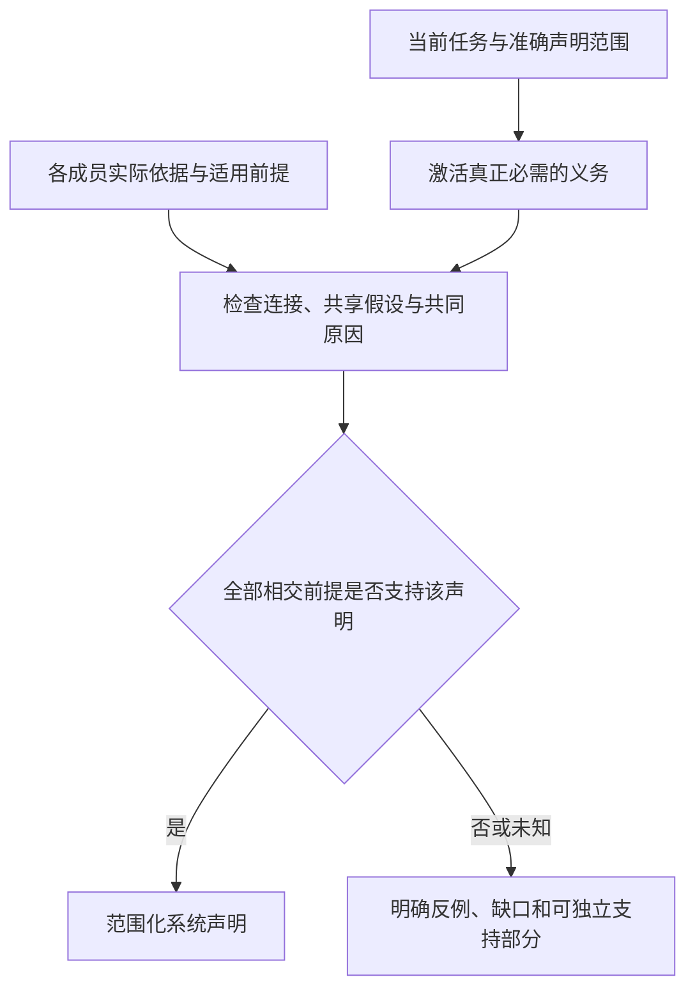

# 系统不变量与组合

> **阅读范围**：采用范围内的设计规范；实现状态另查未决 · [共同上下文](要求证据与裁决.md)。

<details>
<summary>本页内容</summary>

- [全局不变量分层与唯一所有权](#全局不变量分层与唯一所有权)
- [局部演进条件与核心迁移边界](#局部演进条件与核心迁移边界)
- [架构适应性与适用性裁剪证明](#架构适应性与适用性裁剪证明)
- [系统保证案例与组合证明](#系统保证案例与组合证明)
- [项目定义编译与系统组合保证](#项目定义编译与系统组合保证)
- [系统故障隔离、降级与恢复总模型](#系统故障隔离降级与恢复总模型)
- [风险、危害、控制与残余风险接受](#风险危害控制与残余风险接受)
- [局部演进与自举采用的证据对象](#局部演进与自举采用的证据对象)

</details>


## 全局不变量分层与唯一所有权

### 为什么需要分层

“所有规则都写成全局不变量”会把局部业务差异强加给所有操作；“所有规则都留在模块内部”又无法发现组合冲突。SEC 将不变量按约束作用范围和变更权限分层。

### 五层不变量

| 层级 | 作用范围 | 典型内容 | 变更权限 |
| --- | --- | --- | --- |
| 内核不变量 | 所有系统定义 | 身份不可混淆、未知不伪装、权限不放大 | 内核演进 authority |
| 系统组合不变量 | 一个系统代际 | owner 唯一、公开合同闭合、跨域隔离 | 系统定义 authority |
| 领域不变量 | 一个领域及其实例 | 账户守恒、状态合法、业务约束 | 领域定义 authority |
| 操作不变量 | 一次操作闭包 | pre/post、幂等、效果、资源、恢复 | 操作 owner |
| 部署画像不变量 | 指定环境 | 平台能力、法域、SLO、隔离、支持 | 部署/支持 authority |

### 规范结构

```text
InvariantDefinition = {
  invariantRef,
  ownerRef,
  subjectUniverseRef,
  propositionOrPropertyRef,
  applicabilityRef,
  proofObligationRef,
  severityAndFailurePolicy,
  invalidationInputs,
  exceptionsOrOverridePolicy,
  revision,
  retirementCondition
}
```

每条不变量必须能回答：它约束谁、何时适用、怎样被证明、失败后阻断什么、谁能修改、哪些输入变化会使旧证明陈旧。

### 不变量冲突

不变量不能用文档顺序或“更具体优先”随意覆盖。冲突处理顺序为：

1. 检查是否实际作用于不同 subject/context；
2. 检查是否存在合法 refinement；
3. 检查是否一个是硬约束、另一个只是偏好；
4. 检查 authority 是否有权声明例外；
5. 无法消解时返回 `conflicted`，阻止依赖该冲突且要求一致定义的采纳/输出；冻结草稿、解释冲突和已证明独立的子集可以继续，不能把一处冲突扩大成全局停止。

### 继承与细化

状态限制与行为可替换不是同一个子集判定。某领域限制更窄的合法状态时，需要标明适用对象与是否改变公开合同；可以规定更严格的路径字符集，但路径字符串不因此取得执行权限。部署画像可收窄可选提供者，却不能把不合格提供者称为已合格。

实现替换一个既有调用合同，不能减少原来承诺接受的输入；对仍被接受的输入，其返回、错误、效果、资源和进展应符合原合同允许的行为。输出后置条件可以更强，实际输入前提不能在不告知消费者时变强；要缩小输入域，按明确的版本/能力变更处理。取消、异常和并发时序也属于已承诺行为，不能仅检查成功返回类型。

权限约束依具体能力集合、对象和目标判断，不用一个没有定义的大小关系排序所有授权。每个细化规则声明自己保持什么、需要哪些可检查前提，以及未知时阻止哪一种替换。已声明的可判定片段可以静态检查；更强性质采用相应证明、独立验证或保留未证状态，不承诺通用自动判定器。

### 证明组合

不变量证明按所选Claim的类型化依赖图组合。先判每个子义务对当前主体/目的是否适用：required且applicable的义务必须有合格证据，unknown不能冒充不适用；确有不适用依据时按父组合规则消解该分支，而不是要求它同时“适用且满足”。组合关系和共同原因条件仍须成立，所有绿色子节点不能自行签发父Claim。



这是支持关系，不是各部件保证的无条件传递。没有作用的纯程序不必建立恢复案例；已要求的整体性质也不能由若干部件分别通过代签。

### 保证被用于删除运行检查时

验收或证明结果若参与移除运行guard，其生产者、实际命题、定义域、假设和编码进入目标产物依赖。失效不仅使一个报告变灰，还使依赖该消解的产物失去对应的当前资格；选择重新证明、恢复检查或限制采用范围，不擅自修改已运行的程序。

[契约实现策略](../../领域/计算基础/文法类型与求值.md#契约怎样成为可运行产物)不要求每次预览做全量证明。能够保留的检查可留在目标；只有当前输出承诺确需静态消解时才要求那份证据。缓存键和制品摘要能定位字节，不能单独证明是谁使用了哪些输入、是否正确编码了Text和函数前提；对应[缓存归属](../../编译/查询增量与性能.md#结果字节与动作归属的两种完整性)需要独立核对。

真实执行事实、历史证据和当前采用资格仍是不同对象。证据被撤销不自动清除旧事实，不把独立离线产物虚构成已经被在线停止，也不让旧内容恢复当前权限。

### 防止第二定义

- README 只生成摘要，不拥有全局不变量；
- 测试名称不拥有被测不变量；
- 数据库 constraint 是实现机制，不自动成为业务定义；
- Provider schema 不能重新定义上游 invariant；
- 代码注释和错误文案不成为规范来源。

### 局部演进

修改一条领域不变量使依赖它及其选择规则的设计、计划、绑定和证据陈旧。新增一条匹配规则也会改变“应检查哪些不变量”，按[目录依赖](../../作者/工程源/身份断言与采纳.md#不变量目录也是提交依赖)处理，不能只失效早已知道它名字的消费者。只有内核不变量改变时，才需要评估所有系统定义；即便如此，也按实际可达依赖重算，而不是无条件重建所有数据。

### 验收

- 全部不变量有唯一 owner；
- 没有通过 README、测试、数据库或 Provider 建立平行定义；
- 冲突给出当前可核对的见证；子集极小与最小基数分开，超预算时不冒称最小；
- refinement给出适用的判定方法与覆盖；不能判定时明确未证，不能由Schema通过代替行为证明；
- 不相关不变量变化不改变无关系统定义片段；
- 每条高风险不变量有破坏它的具体反例设计，以及与性质适配的证据方法；真实故障注入只在其确能检验该性质且有权安全执行时进行。没有运行实验不应阻止写清其设计，任意跑一组故障也不算证明。


## 局部演进条件与核心迁移边界

### 可成立的局部性

设一个编译结果由固定解释规则的函数 `F` 计算，输入集合为 `D`。若变化 `Δ` 与完整依赖集合不相交，且解释规则、被调用库、目标策略不变，则 `F(D)` 不因这次变化改变。这是依赖确定性而非对未来的预言。

实现必须跟踪正依赖、负依赖、目录成员、模块解析、环境与生成器输入。精确集合可复用无关结果；保守上界可能多重编译但不能错误复用；只有动态样本的依赖不能宣称覆盖全部运行路径。

### 正常扩展

新增后端、库适配器、方言、验证器或 IDE 投影通常只增加该扩展及引用它的配置。新增语法而既有语义不变，需要版本化 parser 与对应 pass，不要求修改全部领域和运行权限。

### 必须允许的大变化

身份解释、公共类型语义、持久模式、内存模型、目标 ABI、事务原子性或安全信任边界改变，可能影响大量消费者。优秀架构的作用是列出变化闭包、保留旧解释能力、双版本验证和逐区域切换，不是禁止必要的大改。

### 反证与测量

无关注释变化造成全项目语义失效，是身份粒度过粗的证据；隐藏配置变化但 ActionKey 不变，是漏依赖证据；更换库而错误语义改变，是适配合同不完整；新方言必须改所有通用 pass 的领域分支，是扩展接口失败。

这些应进入变形测试和真实工程基准。不能只列“局部演进”不测编译重用，也不能为了命中率省略安全所需依赖。验证失败后修正依赖 owner，不继续维护旧最小闭包的好看数字。

### 理由

完全全量重建简单但成本高；完全乐观复用可能错误。选择可信依赖加保守退化，保留 clean build 作为参考。核心变化的迁移机制是最后安全网，不是每次新增文件都要运行的统一世界模型编译器。


## 架构适应性与适用性裁剪证明

### 问题

通用系统最容易走向两个失败极端：为小项目强制启用所有企业级机制，或为了保持简单而在高风险场景缺失必要控制。SEC 通过适用性编译，让同一语义定律按真实关系闭包产生不同规模的系统画像。

### 适用性函数

本章不另定义通用最小闭包算法。固定路线上的单调闭包、候选选择与未知边处理唯一见[适用性与最小闭包](../../演进/适用性与能力协商.md#适用性与最小闭包)。可选机制未启用不等于其全部风险消失；是否属于本次保证由Claim的适用条件、目的和相交关系决定。

未选中、尚未检查、条件不成立和合格复用分别记录。无需为全球未访问能力逐项生成不适用证书；也不能用没有遍历到对象来消解已经声明的义务。

### 系统画像

| 画像 | 最小必需闭包 | 默认不生成 |
| --- | --- | --- |
| 纯函数库 | 意图、类型、行为、约束、单元性质 | Grant、Journal、远程资源、部署控制 |
| 本地源码变更 | 工作区观测、Plan、写入准入、CAS、读回、验证 | 分布式共识、多租户控制 |
| 团队仓库 | 候选树、Review、合并、主分支健康 | 生产发布和法域控制，除非实际需要 |
| 多租户云服务 | 租户隔离、身份、网络、数据、资源、公平性、审计 | 设备实时约束 |
| 嵌入式安全系统 | 实时、内存、设备、危害、现场验证、升级恢复 | 云端弹性与网页接口 |
| 离线隔离环境 | 离线物化、信任元数据、审计、重连协调 | 在线 Provider 自动发现 |
| AI 辅助工程 | 输入污染、模型/数据边界、按实际作用启用隔离和现行委派政策 | 模型自报成为authority；不一律要求人工点击 |

### 适用性传播

关闭feature不自动使其风险验证不适用。应评价该Claim明示的主体、动作目的和适用谓词；存在性不可达只是其中一种证据，不是唯一条件。例如未请求部署可以使本次部署读回义务不适用，但不能证明系统从无该功能。关闭后仍有遗留数据、旧写者或共享影响时，相交义务仍然成立。Provider缺失通常是unsupported/blocked，未知适用性仍为unknown。

### 成本裁剪

适用性裁剪应同时减少：

- 运行时依赖；
- 上下文和术语；
- 资源和验证动作；
- 安装与网络；
- 权限和攻击面；
- 文档视图；
- 迁移负担。

但不能删掉会改变结果的 blocker、unknown、recovery 或证据边。

### 反过度设计门

一个新机制进入系统定义前必须给出可核查的设计论证；这里的论证可以是规则推导、反例分析与条件选择，不强制先实现该机制或搭建运行证据图。具体需要说明：

1. 有当前或明确触发条件下的真实 consumer；
2. 现有机制无法自然承担；
3. 缺失会产生可观察失败；
4. 给出维护/迁移代价与所避免损失的依据；没有可信同单位估计时保留条件性取舍，不伪造净收益证明；
5. 不会建立第二 truth；
6. 可以按画像裁剪，不强迫无关用户承担。

### 验收

同一最小程序在本地、团队、云、离线和高安全画像下产生不同但合法的最小闭包；关闭一个可选能力不会改变无关核心语义；画像升级只增加相关合同与证据，不要求重写业务模型。


## 系统保证案例与组合证明

### 保证对象不是整个宇宙

保证必须针对明确请求、产物、Claim、环境与生命周期。模型有来源、程序可编译、制品可运行、可以安全写回、可以发布和用户效果正确是不同承诺。任何根图都不能成为所有普通编译的统一强制清单。

### 分级组合

| 目标 | 适用保证 |
|---|---|
| 保存/解释草稿 | 输入完整性、范围和披露安全 |
| 编译源码 | 解析/类型/目标合法性、生成规则和来源闭合 |
| 可构建目标工程 | 工具链、依赖和资源闭合，真实构建 |
| 已有工程变更 | 前像与写集、权限、并发、journal、恢复和读回 |
| 业务可用结果 | 独立验收、错误路径、数据和组合行为 |
| 特定平台支持 | owning环境的物理与制品证据 |
| 生产发布 | 当前政策、精确制品、风险、迁移和运行读回 |
| 安全关键/法律画像 | 按已确定适用性的专门论证和有权责任 |

### Claim与Evidence

`ClaimDefinition`包含主张、主体范围、适用条件、所需方法、有效期和可反驳条件。`EvidenceRecord`包含实际执行主体、输入/产物摘要、方法revision、环境、观察结果、覆盖和限制。`Verdict`对适用Evidence作判断，不由被验证产物自己签发。

结果至少保留满足、不满足、不适用、未知、陈旧五种区别。动作未运行、没有选中测试、工具不可用、环境不适用不能被合并成满足。不适用必须由条件证明，不由执行器没有准备好决定。

### 组合义务

组件保证只有在前置假设、类型、协议、错误、资源、时序和权限接口兼容时才可组合。单个组件通过不证明两者组合通过。构造跨边界Claim：并发状态变更与通知、源码写回与索引、数据库提交与制品发布、缓存命中与撤销权限、生成代码与独立Oracle。

测试用例可以由模型派生，但验收不能只由实现使用的同一条错误规则决定。保留独立例子、参考实现、性质、差分、故障和真实用户场景。多个测试若共享相同规格、工具或模型，应记录共同原因，不把数量当独立性。

组合证据采用[支持工作表与循环证明](../../编译/组合前提与进展闭合.md)：初始事实不包含未闭合的部件自报保证，循环前提由实际归纳/时序规则或联合检查处理。相容假设和正常功能必须另核；条件不可能导致的空真不等于产品满足，结构可读与验证器成功也不证明需求完整。对生成被测候选和生产消费分别评价资格，检查失败不能倒过来改原要求。

### 理论边界如何实际使用

不可判定性用于限定主张范围：受限语义可证明，有界探索可给反例，开放行为可近似或监控。它不自动禁止普通编译。多上下文模型、风险包络和ArchitectureRefusal仅在相关设计请求与效果政策中适用；不作为纯代码生成的必需软件层。

### 复用与失效

结果复用同时检查动作身份、输入依赖证据、方法、环境、产物完整性、freshness和请求Claim范围。相同key不允许把样本测试扩大为全称证明。新的相关输入、方法撤销、Oracle改变、环境漂移和证据损坏分别使受影响结果陈旧。缓存缺失允许重算，不改变业务真值。

### 取消、清理与状态

测试断言通过但测试环境未结算时，断言观察可以保存；它不能自动成为允许复用或发布的完整执行证据。取消由各动作进入结算/读回，不能覆盖已发生效果。候选健康与合并后主分支健康分开，树相同最多允许复用仍等价的部分证据。

### 必要性与验收

小型纯函数无需全部生产门禁。高风险写入缺少恢复证据则不能因为其他测试多而放行。该模型的代价是Claim定义、环境与证据管理；只有实际承诺需要的义务被选中。测试选择器、聚合器与被验证候选必须保持所需信任边界。

选择器、required-policy、缓存有效性判断、报告解析或Evidence接纳器本身是候选变化时，不能用候选自己算出的“应跑集合/已通过集合”证明其正确。至少有一个不依赖该候选判定路径的受信基线：例如上一受信修订、固定合同样本、独立简单参考计算或故意损坏/缺失/冲突的负例；它直接检查完整发现、分母、保守失效、权限/代际、报告完整性、退出状态与资源结算。独立cold/reference检查可以使用不同实现，不必调用被审查selector。基线自身的版本、输入与适用范围进入TCB；它只能支持被实际覆盖的控制面性质，不能由“验证系统自测通过”推广为整个保证体系正确。

### 保证义务必须有证据生产路径

每项要被判断为已满足的Claim必须有适合它的依据：明确前提下的推导或形式证明、可检查的静态分析、真实观察、实际执行结果，或对应责任主体的有效声明。依据不同，能够支持的范围不同。设计选择可以在没有运行程序时作出，真实已执行、性能和物理结果不能由设计判断代签。需要执行取证的任务引用其Oracle、环境与动作前提；发布前与发布后声明分离。没有相应依据时记录具体未知及取得路径，不通过增加Claim或图节点制造成立。具体有限任务图、反证优先和陈旧规则见[证据缺口驱动的设计与取证闭环](要求证据与裁决.md#证据缺口驱动的设计与取证闭环)。

组合保证不能仅将模块通过位求AND：共享资源、权限、时钟、数据模式、故障相关性和外部副作用可能在组合后改变前提。组件分别通过而边界不满足时，需要组合Claim和反例任务；一个跨域失败只撤销其影响闭包，不取消没有共享前提的独立设计成果。


## 项目定义编译与系统组合保证

### 统一系统的可检查对象

统一不等于一个全知图，也不等于每个阶段都采用相同数据结构。要验证的是：SEC 工程源、项目模型、前端、后端、库、宿主工具和验证结果在接口处共享一致的身份与语义合同。

需要区分：

```text
ProjectDefinition：本 revision 中被选定的可构建程序
Observation：对源码、配置和运行状态的观察
DesignCandidate：未采纳的另一方案
DomainModule：语言或领域语义扩展
```

多个观察和候选的冲突不能自动改写 ProjectDefinition。另一方面，ProjectDefinition 的确定性也不意味着对全部外部现实有唯一知识模型。

### 跨层组合检查

源码解析得到符号和类型，绑定器提供准确版本的实现，后端按具体 TargetProfile 降低，构建器检查目标源码，写回器使用当前前像，验证器绑定实际产物。任一层以名称或文件存在代替完整身份都会破坏组合。

关键组合声明包括：

| 边界 | 必须保留 | 反例 |
| --- | --- | --- |
| 源码到模型 | 名称作用域、类型、控制流和来源 | 局部同名变量被合并 |
| 原生方言到公共层 | 声明域中的可观察语义 | int 溢出被丢掉 |
| 公共层到目标层 | 错误、数值、顺序和实际能力 | async 被改为同步并改变行为 |
| 目标层到制品 | 文件归属、依赖、入口和构建配置 | 只输出函数而缺依赖 |
| 制品到写回 | 前像、编辑权限、原生保留区 | 外部修改被覆盖 |
| 测试到结果 | 工具版本、环境、输入和产物 | 旧产物测试通过被套到新产物 |

### 所需证据

类型与结构检查是基础；受控语言子集可做转换规则证明；其他部分用差分、变形、边界、故障和实际工具链测试。测试成功不证明全部上下文等价；无法证明全部等价也不意味着已有语义清晰的转换不能执行。

生成与部署采用不同门禁。生成候选源码可以存在未验证状态；实际覆盖原工程、执行数据库迁移或发布生产服务需要更高保证。不能把生产发布所需证据强加给每次编辑器补全。

### 必要性与反证

组件各自通过测试不能排除边界类型错配，因此保留组合保证。反方是维护全面组合矩阵成本过高；应从实际相交的构造与目标计算矩阵，不要求每个项目测试全部平台。

反向验收必须包含：无 AI 编译、无容器编译纯函数、保留未知原生模块、不支持目标产生局部诊断、目标工程脱离 SEC 运行、原型与正式产品状态分离。任何一个被根模型阻断，说明抽象层次再次失衡。


## 系统故障隔离、降级与恢复总模型

### 故障不是异常文本

SEC 将故障表示为对操作、状态、资源、权限、证据和恢复的结构化影响。一个组件失败不应无界扩散；一个组件成功也不能掩盖其共享依赖或下游失败。

<a id="failure-boundary-contract"></a>
### 失败发生、错误载荷与处理边界

系统故障模型消费实际发生的退出，不从错误对象外形反推是否失败。边界的有限结果须有独立判别：正常值、方法声明的业务失败、实际异常/缺陷、已观察取消；接受未知、物理未停止和未结算责任另按原操作合同保存。`Success(undefined)`与“抛出undefined”不是同一事件，`false`、`null`、`0`或空字符串也不能作为无错误哨兵。宿主允许抛任意值时，接纳真实异常事件并在可保留的本地范围保持其值/身份；`instanceof Error`失败不把它变成成功。

| 边界 | 应执行的处理 | 不得替代的判断 |
|---|---|---|
| 业务分支 | 用其已声明的Result/条件继续、拒绝或产生新候选 | 返回业务Err不自动等于基础设施缺陷 |
| 资源/任务拥有者 | 保持主退出，结算捕获、在途取得与未交付结果，附独立清理失败 | 清理成功不撤销已发生业务作用，取消请求不证明停止 |
| 提供者/ABI适配 | 在真实调用边界捕获允许捕获的异常，转换为已绑定通道并保留来源 | 不能凭异常名字、HTTP状态或文案决定“未接受”“可以重试” |
| 请求/故障域出口 | 隔离相交失败，产生有界可披露诊断，交付准确结果与残余责任 | 不能把缺陷写日志后返回默认成功，或让无关根一律失败 |

**不全局禁止try/catch，也不要求所有函数改成Result。** 原生源码仍按其语言解释；生成或实现层可以使用异常边界、类型化结果和原生析构。只有确实恢复、转换到公开合同、管理自身资源或隔离故障域的地方承担处理责任；中间纯转发层不重复包装、逐层记录再抛、添加无语义价值的catch。重试属于原尝试/幂等及预算协议，fallback属于已绑定替代条件，不能让catch成为任何失败都可换实现的入口。读取某个异常码只在该提供者保证其含义及来源时有证据价值，字符串`AbortError`不是取消权威。

主体异常与清理故障分别保留；清理次序由[出口合并](../../领域/对象与控制/控制流与存储寿命.md#控制出口与清理结果的确定合并)规定，并发任务的多失败保留任务/因果关系，不为显示排序发明总因果顺序。未知载荷本身可能含循环、getter、敏感数据或资源，日志不得在锁内任意调用其toString/序列化方法，也不能深遍历以猜测释放责任。对外投影有大小、深度、披露和失败界，投影失败用预留的最小诊断记录或准确的观测缺口承接，不取代原失败、不无限递归写日志。

可捕获异常机制不保证处理abort、进程被杀、不可控OOM或未定义行为；无法在进程内维持的义务由真实隔离、耐久意图和恢复拥有者承担。以上是SEC边界设计；ECMAScript的任意抛值和完成记录只提供一个具体反例，参见[异常与取消交接依据](../../依据/来源/语言编译与目标工具.md#failure-and-handoff-sources)。

### 故障域

```text
FaultDomain = {
  ownedState,
  publicOperations,
  failureModes,
  isolationBoundary,
  sharedDependencies,
  blastRadius,
  degradedModes,
  recoveryAuthority,
  recoveryResources,
  observabilityChannel
}
```

### 隔离机制

- 语义隔离：一个领域不能写另一领域私有状态；
- 权限隔离：Grant 按 subject/effect/time 收窄；
- 资源隔离：预算、池、优先级和恢复保留；
- 进程隔离：独立进程/容器/沙箱，但不把进程当语义边界；
- 数据隔离：租户、法域、分类、加密和生命周期；
- 发布隔离：cell、分批、金丝雀、feature flag；
- 证据隔离：验证器、日志和状态通道不与被测对象共命运；
- 恢复隔离：备份和恢复工具不依赖同一故障面。

### 降级原则

降级只能删除非必要能力，不能改变核心真值：

```text
DegradedMode = {
  trigger,
  stillSupportedOperations,
  refusedOperations,
  consistencyAndFreshnessChanges,
  dataLossBoundary,
  durationAndExit,
  userVisibility,
  validationEvidence
}
```

禁止把 `unknown`、过期数据、弱验证或扩大权限包装成降级成功。

### 恢复优先级

```text
保护人员和不可逆数据
→ 停止继续损害
→ 保留证据与恢复资产
→ 建立当前事实
→ 恢复控制面和观察能力
→ 恢复最小服务
→ 验证状态与一致性
→ 分阶段恢复其余能力
→ 完成根因修复与旧风险退役
```

### 级联与相变

资源池、队列、重试、缓存、负载均衡和控制器可能形成正反馈。必须测试：

- 超时导致重试风暴；
- 慢节点增加队列，队列增加超时；
- 缓存失效引发后端雪崩；
- 恢复操作争抢正常资源；
- 监控和状态页依赖故障服务；
- 自动伸缩与限流振荡；
- 降级模式增加数据不一致；
- 多 cell 共享控制面导致共同故障。

### 完成条件

每个关键领域拥有明确定义的故障域和恢复 owner；高风险服务至少有一次从控制面、数据面、网络、Provider 和资源耗尽故障中恢复的物理演练；恢复过程不删除唯一证据或备份；降级状态对用户可见且有退出条件。


## 风险、危害、控制与残余风险接受

### 风险对象

风险不是一个严重度数字。它是特定条件下，一条因果链通过现有控制仍可能造成某类损失的结构化主张。

```text
RiskDefinition = {
  riskRef,
  affectedSubjectsAndStakeholders,
  initiatingConditions,
  causalMechanisms,
  consequenceDimensions,
  likelihoodEvidenceOrUnknown,
  detectability,
  timeToHarm,
  blastRadius,
  reversibility,
  preventiveControls,
  detectiveControls,
  containmentAndRecovery,
  residualRisk,
  acceptanceAuthority,
  reviewAndInvalidation
}
```

### 风险与危害分离

- **危害**：系统状态或条件具有造成损失的潜力；
- **风险**：危害在给定暴露、控制和不确定性下导致损失的可能性与后果；
- **事故**：损失已经发生；
- **漏洞**：可能被利用的弱点；
- **缺陷**：实现或设计偏离要求；
- **未知前沿**：尚不能判断是否存在危害或控制有效性。

它们不能共用一个 `severity` 字段。

### 控制层级

优先顺序：

```text
消除危险
→ 以更安全机制替代
→ 物理/架构隔离
→ 自动预防控制
→ 自动检测与遏制
→ 人工程序
→ 警告与恢复
```

警告框和文档说明不能替代可行的物理限制。

### 非补偿边界

以下风险默认不能由成本或性能收益抵消：

- 未授权访问与效果；
- 不可逆用户数据损失；
- 人身或重大基础设施危害；
- 法律明确禁止；
- 关键恢复能力被删除；
- 租户隔离被打破；
- 证据伪造或候选自证；
- 未知高危 Effect 被当作安全。

### 评估方法选择

不强制所有风险拥有精确概率。根据证据选用：

| 证据状态 | 合法方法 |
| --- | --- |
| 完整频率数据与稳定机制 | 概率分布、置信区间、尾部分析 |
| 只有上界/下界 | 区间与保守边界 |
| 场景可枚举 | 事件树、故障树、模型检查 |
| 对手主动适应 | 威胁模型、攻击图、红队 |
| 新系统数据不足 | 类比、先验、敏感性、信息价值实验 |
| 不可量化价值冲突 | 有权主体的显式政策裁决 |
| 机制未知 | 保留 unknown 并限制高风险 Effect |

### 残余风险接受

接受风险必须绑定：

```text
exact system/feature/environment revision
+已验证控制
+未解决风险与损失范围
+接受 authority
+受影响主体和申诉/补救
+期限、触发器和撤销条件
```

创作、测试执行或能力提供的身份不自动获得替业务、安全或受影响主体接受风险的权力；同一人或AI若另有真实有效的委派，则按该具体角色处理，不按“开发者”类别绝对禁止。独立性及不可委派权利仍由相应合同限定。

### 风险变化

下列变化使旧风险结论陈旧：新用户群、新法域、新数据分类、新攻击面、新 Provider、新并发规模、新依赖、新部署拓扑、新事故、控制绕过、证据过期和恢复演练失败。

### 完成条件

高风险能力必须有因果模型、至少一个最强反例、预防与检测控制、物理故障测试、恢复路径、残余风险接受和重新评审触发器。风险登记不能使用同一段通用控制文案覆盖所有不同风险。


## 局部演进与自举采用的证据对象

“内部实现改变但客户端不改源码”绑定公开合同、实际使用点、目标和允许观察；检查不透明边界、直接/间接依赖、内联、ABI与序列化。只比较函数形状或版本标签不足。公开输入、错误、效果和资源承诺未变时，可以对相交使用域取得替换依据；未知则保留具体义务，不承诺任意未来需求都局部化。

MVP验证载荷要有真实外部消费和一个可隔离的SEC自身使用点，分别保留旧路径和期望。计算、事务及其他领域按任务选择，计算载荷不代表产品只能开发计算库。新封装例是当前设计，不据此声称模型输入或维护成本已经下降。

编译器多阶段构建的输出是编译器产物关系；阶段固定点只支持对应稳定性，不自动支持无后门、无缺陷或全域语义健全。对照既包含共同支持域的行为，也包含新能力与已确认修复的独立期望。候选可以自测，但不得弱化原验收或给自己签发根权限。详细种子与失败处置由[编译器自举](../../编译/内核/确定性与自举.md#编译器自举可信根与版本演进)拥有，不再复制另一份阶段表。
