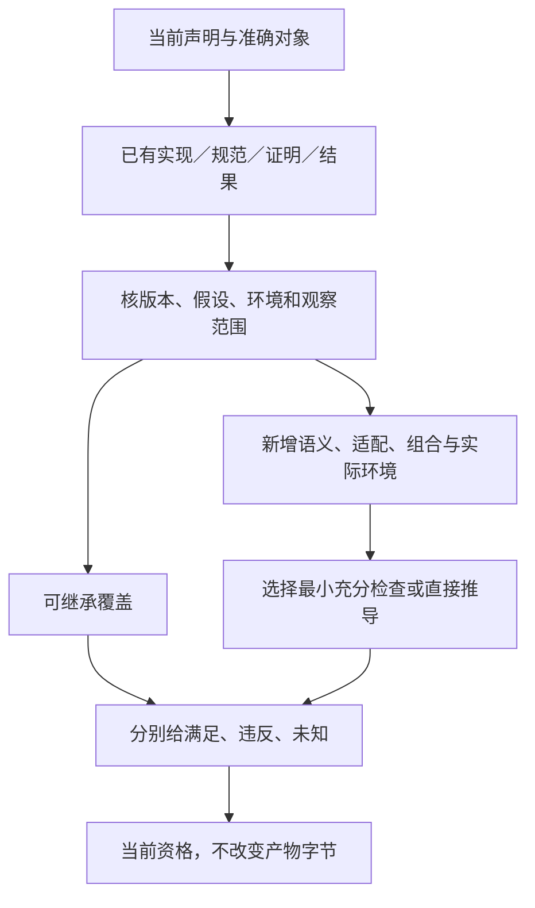

# 保证证据与验收

> **阅读范围**：采用范围内的设计规范；实现状态另查未决。

<details>
<summary>相关主题与上下文</summary>

- [要求含义与验收方法不互相定义](#要求含义与验收方法不互相定义)
- [一项要求跨多个实现贡献的闭合检查](#一项要求跨多个实现贡献的闭合检查)
- [全工程总装的可依赖结论分别绑定什么](#全工程总装的可依赖结论分别绑定什么)
- [多作者表示的声明必须绑定相同观察范围](#多作者表示的声明必须绑定相同观察范围)
- [作者覆盖与工程整体性的验收义务](#作者覆盖与工程整体性的验收义务)
- [全局不变量分层与唯一所有权](系统不变量与组合.md#全局不变量分层与唯一所有权)
- [局部演进条件与核心迁移边界](系统不变量与组合.md#局部演进条件与核心迁移边界)
- [开放世界覆盖前沿、挑战过拟合与残余未知](覆盖成熟度与验收范围.md#开放世界覆盖前沿挑战过拟合与残余未知)
- [成熟度、实施、采用与退役证据](覆盖成熟度与验收范围.md#成熟度实施采用与退役证据)
- [架构适应性与适用性裁剪证明](系统不变量与组合.md#架构适应性与适用性裁剪证明)
- [系统保证案例与组合证明](系统不变量与组合.md#系统保证案例与组合证明)
- [项目定义编译与系统组合保证](系统不变量与组合.md#项目定义编译与系统组合保证)
- [系统故障隔离、降级与恢复总模型](系统不变量与组合.md#系统故障隔离降级与恢复总模型)
- [系统终局验收与反向否证](覆盖成熟度与验收范围.md#系统终局验收与反向否证)
- [证据缺口驱动的设计与取证闭环](#证据缺口驱动的设计与取证闭环)
- [原任务要求与候选合同的满足判定](#原任务要求与候选合同的满足判定)
- [需求、设计、实现、验证与效果追踪](#需求设计实现验证与效果追踪)
- [风险、危害、控制与残余风险接受](系统不变量与组合.md#风险危害控制与残余风险接受)
- [编译诊断与保证等级](#编译诊断与保证等级)
- [工程作者闭环的声明分解与独立判断](#工程作者闭环的声明分解与独立判断)
- [计算工程是独立完整的验收范围](覆盖成熟度与验收范围.md#计算工程是独立完整的验收范围)
- [从检查请求到可采用结论的判定过程](#从检查请求到可采用结论的判定过程)
- [MVP的作者闭环不是语法与生成成绩相加](覆盖成熟度与验收范围.md#mvp的作者闭环不是语法与生成成绩相加)
- [局部演进与自举采用的证据对象](系统不变量与组合.md#局部演进与自举采用的证据对象)
- [设计判断、运行事实与最小证据载荷](#设计判断运行事实与最小证据载荷)
- [意图支持、语义符合与现实达成分别结论](#意图支持语义符合与现实达成分别结论)
- [目标追踪和并行编译的两类闭合声明](覆盖成熟度与验收范围.md#目标追踪和并行编译的两类闭合声明)
- [成熟成果复用与剩余验证责任](#成熟成果复用与剩余验证责任)
- [实现设计对应的证据对象](#实现设计对应的证据对象)
- [产物不可变与检查可追加的共同合同](#产物不可变与检查可追加的共同合同)
- [状态图的支持与完成声明按对象限定](覆盖成熟度与验收范围.md#状态图的支持与完成声明按对象限定)
- [关系任务的剩余验证义务](覆盖成熟度与验收范围.md#关系任务的剩余验证义务)
- [完整计算工程的三条横向验收](覆盖成熟度与验收范围.md#完整计算工程的三条横向验收)
- [约束覆盖、装载与合规声明](#约束覆盖装载与合规声明)
- [信息结构与证据绑定的不同结果](#信息结构与证据绑定的不同结果)
- [完成边界的证据不能互相代签](#完成边界的证据不能互相代签)
- [开发者测试面：发现、选择、固定期望、运行与复跑](../../开发/测试发现与执行.md#开发者测试面发现选择固定期望运行与复跑)
- [开发检查、案例发现与失败后再修改](../../开发/测试发现与执行.md#开发检查案例发现与失败后再修改)

</details>

### 分题阅读

- [系统不变量与组合](系统不变量与组合.md)
- [覆盖成熟度与验收范围](覆盖成熟度与验收范围.md)
- [测试发现与执行](../../开发/测试发现与执行.md)

<details>
<summary>本页内容</summary>

- [要求含义与验收方法不互相定义](#要求含义与验收方法不互相定义)
- [一项要求跨多个实现贡献的闭合检查](#一项要求跨多个实现贡献的闭合检查)
- [全工程总装的可依赖结论分别绑定什么](#全工程总装的可依赖结论分别绑定什么)
- [多作者表示的声明必须绑定相同观察范围](#多作者表示的声明必须绑定相同观察范围)
- [作者覆盖与工程整体性的验收义务](#作者覆盖与工程整体性的验收义务)
- [证据缺口驱动的设计与取证闭环](#证据缺口驱动的设计与取证闭环)
- [原任务要求与候选合同的满足判定](#原任务要求与候选合同的满足判定)
- [需求、设计、实现、验证与效果追踪](#需求设计实现验证与效果追踪)
- [编译诊断与保证等级](#编译诊断与保证等级)
- [工程作者闭环的声明分解与独立判断](#工程作者闭环的声明分解与独立判断)
- [从检查请求到可采用结论的判定过程](#从检查请求到可采用结论的判定过程)
- [设计判断、运行事实与最小证据载荷](#设计判断运行事实与最小证据载荷)
- [意图支持、语义符合与现实达成分别结论](#意图支持语义符合与现实达成分别结论)
- [成熟成果复用与剩余验证责任](#成熟成果复用与剩余验证责任)
- [实现设计对应的证据对象](#实现设计对应的证据对象)
- [产物不可变与检查可追加的共同合同](#产物不可变与检查可追加的共同合同)
- [约束覆盖、装载与合规声明](#约束覆盖装载与合规声明)
- [信息结构与证据绑定的不同结果](#信息结构与证据绑定的不同结果)
- [完成边界的证据不能互相代签](#完成边界的证据不能互相代签)

</details>


当前大型工程检验由 [Code-OSS 锚点](../../../examples/原生维护/Code-OSS搜索替换.md)提供实际对象；[C01—C42](../../../examples/原生维护/Code-OSS搜索替换.md#validation-cases)是有输入和预期的验证设计，不是已运行成绩。单个策略函数生成成功不能关闭整个跨文件搜索/预览/应用需求；只读源码事实、设计推导、宿主能力、执行结果与净收益分别满足本章相应证据责任。

- [全局不变量分层与唯一所有权](系统不变量与组合.md#全局不变量分层与唯一所有权)
- [局部演进条件与核心迁移边界](系统不变量与组合.md#局部演进条件与核心迁移边界)
- [开放世界覆盖前沿、挑战过拟合与残余未知](覆盖成熟度与验收范围.md#开放世界覆盖前沿挑战过拟合与残余未知)
- [成熟度、实施、采用与退役证据](覆盖成熟度与验收范围.md#成熟度实施采用与退役证据)
- [架构适应性与适用性裁剪证明](系统不变量与组合.md#架构适应性与适用性裁剪证明)
- [系统保证案例与组合证明](系统不变量与组合.md#系统保证案例与组合证明)
- [项目定义编译与系统组合保证](系统不变量与组合.md#项目定义编译与系统组合保证)
- [系统故障隔离、降级与恢复总模型](系统不变量与组合.md#系统故障隔离降级与恢复总模型)
- [系统终局验收与反向否证](覆盖成熟度与验收范围.md#系统终局验收与反向否证)
- [风险、危害、控制与残余风险接受](系统不变量与组合.md#风险危害控制与残余风险接受)


## Claim 身份、所有权与裁决边界

Requirement/Invariant 是要求本身，Claim 是把要求绑定到一个准确 subject、revision、适用域和验证目的后的可验证陈述；两者不能只靠相似字符串或同名 Gate 隐式关联。长期 Claim 至少需要能够追溯：

```text
Claim = exact {
  claimRef,
  claimRevision,
  requirementOrInvariantRef,
  requirementRevision,
  ownerRef,
  subjectRef,
  subjectRevision,
  applicabilityScope,
  requiredAssurance,
  consumerRefs,
  lifecycleAndInvalidation
}
```

这些字段是语义责任，不要求所有调用都复制完整对象。公共 API 可以传稳定引用或由冻结上下文解析，但解析结果必须唯一、revision-bound 且可检查；自由 `claimId`、Gate 名、文件名或 workflow context 不能长期代替 owner、subject 与 Requirement 绑定。

**Owner 分离。** Requirement owner 有权改变“什么必须成立”；Claim owner 负责准确 subject 上的声明与生命周期；Assurance owner 把 Claim 编译为 Proof Obligation、选择或接纳 VerificationMethod、判断 Evidence 资格并签发范围受限的 Verdict。执行器、runner、Provider、Evidence producer 和下游 merge/release consumer 均无权通过自身成功状态修改 Claim 或扩大已证明范围。

**Claim 与 Gate 不同。** Gate/Action 是实现某个 Proof Obligation 的执行或聚合单元，可以被多个 Claim 复用；一个 Claim 也可以由多个异构方法共同支持。Gate 的 owner、`requiredForClaims`/ `supportedClaims` 投影或 owning environment 不能反向成为 Claim identity。当前实现若仍以字符串 Claim ID 与 Gate ID 关联，应视为兼容投影；在声明完整 Claim ownership/adoption 前，不把该形状写成终态公共语义。

**Evidence 与 Verdict 不同。** Provider observation、静态 finding、proof certificate、TestCase result、runtime readback、人工 Review 都是有范围的 Evidence。Assurance 只有在 subject/revision、method qualification、applicability、environment、coverage、independence 与 invalidation 条件闭合后才能签发 Verdict；`exit 0`、workflow green、CodeQL 无 finding、solver `unsat`、snapshot 相同或 reviewer 点击通过均不自动证明未声明的 Claim。

方法选择、Provider 与 TestCase 的具体边界见[验证责任、所有权与方法选择](../验收/方法与独立证据.md#验证责任所有权与方法选择)。本篇只拥有 Claim/Evidence/Verdict 的保证责任，不建立第二 Action scheduler、Provider registry 或 Test inventory。


## 要求含义与验收方法不互相定义

`Constraint`拥有要求的关系与适用域，现有`Assurance.plan`返回的义务/检查请求与`CheckRecord`拥有怎样检查及实际覆盖。类型检查、SMT、模型检查、代码审查、运行监控和统计方法不是互斥的需求种类；同一要求可以由多种方法共同支持，换方法不改变程序必须做到什么。决策主体和当前授权又是独立责任，不能把“人工确认”当作证明工具或者默认通用后备。

`Assurance.plan`先沿准确Requirement构造与其声明相同的义务：值关系查输入输出；NoWrite查实际作用域及相关调用；SameValue查准确前后投影；当前结果发布查修订与原子接纳；进展查条件、调度与终止；逆关系查全体边及更新；多运行要求查相应比较域。方法只能检到终态的，不能签发全过程没有写入。有限监控没有发现坏事件，也不能证明任意未来都有进展。

组合保证要反查空域、永不返回、永不发布、删掉全部输入、跳过失败和消除观察等伪成功。需求本来允许不终止的函数不得被新增全局进展约束改变；确实要求完成的任务也不能用安全性逃避。没有相应依据时准确标记未定或不满足，是否可返回未验证产物由原请求决定。

这直接消费[需求组合合同](../../作者/组合/跨软件需求合同.md#cross-software-intent-contract)，不复制另一套逻辑节点定义。


<a id="intent-root-obligation-closure"></a>
## 一项要求跨多个实现贡献的闭合检查

一次生成沿原Obligations、CheckRecord与RootResult处理，不新增总保证数据库。需求计划为每个实际要求出现关联拟承担的定义、方法、适配和依赖；这一关系用于找责任和产生检查，不能本身证明满足。某个方法负责一个局部性质，目标组合器负责跨贡献的符号、初始化、资源与资产关系。

**Q0范围。** 取得准确根、版本、原输入域、效果帧、进展前提和本次返回目的。实现者不得通过禁止所有输入、删除输出或永不返回来使逻辑条件空真。运行和开发操作的对象域分别绑定。

**Q1分配。** 对每个当前要求出现列出本次真正承担它的贡献，以及需要共同成立的前提。相同公式可以共享分析；独立来源和允许修改权不同，继续保持独立引用。不为所有无要求的局部表达式产生永久记录。

**Q2组合。** All检查每项及交互，Any检查本次接受的完整分支。方法A依赖B、B依赖A不能凭环自证；对状态不变量取得初态及全部允许转移保持，对进展取得实际前提。仅列出几项样例、对某个实现的随机测试或一个上游签名，不代签全输入和物理时间界。

**Q3选择方法。** 继承仍适用的成熟合同、已有静态或运行依据，缺的部分按本次声明选方法；没有合格检查方法时保持Unknown，不删除准确要求。生成期可确定的类型/布局/资源矛盾直接阻止该不合格实现；尚未实测的吞吐或已请求的条件性设计可以返回准确未验证产物，不称为任务满足。

**Q4发布。** 模块分析、可调用资格、生成产物、要求满足与实际运行仍是不同结果。没有目标编译器时，可以先返回合格源分析；有源码产物但未运行，不给运行成功；独立一根可返回而AND任务未全部完成，必须同时说明。并非把所有状态按最低或最高标签折成一个“绿色”。

**Q5改变。** 新要求、方法、输入域、规则或证据变化时，只重核真实消费者。检查撤销不改变ArtifactSet字节；若证据被用于某次降低以省略运行检查，则该生成方法资格也失效。产物字节相同不能复活旧权限或旧保证，满足当前要求也不能把新模型说成恢复了历史原意。

### 修复位置随真实原因返回

| 原因 | 返回给开发AI的最小修复位置 |
|---|---|
| 缺少业务决定或要求冲突 | 原要求出现、决定来源与具体差异；不要求重写正确实现 |
| 短源类型欠约束 | 当前参数/声明的注解位置；不强迫全文件展开 |
| 原要求已明确而实现错误 | 对应普通主体/领域方法及实际反例 |
| 生成器引入额外写入或错误顺序 | 对应UseBinding/LoweringResult生产者，不修改原用户要求 |
| 输出资源或类型依赖不全 | 目标贡献和composeTarget结果，不把业务函数判成语言无解 |
| 旧基础、旧图索引或旧回调迟到 | 对应候选/数据修订/运行请求，保持当前版本 |
| 实际工具、权限或设备不可用 | 当前环境/动作准入，不在作者程序里填假值 |

以上字段沿现有diagnostics、origin、impact和state返回，不要求用户学习内部结果联合。一次任务同时存在不同原因时逐项归属；相同文本“失败”不成为自动重写整工程的依据。


<a id="whole-project-evidence"></a>
## 全工程总装的可依赖结论分别绑定什么

[全工程编译](../../编译/内核/领域方法与整体根.md#whole-project-compilation)和[连续开发](../../开发/用途与任务范围.md#whole-project-development)复用原义务/结果合同。新增开发能力只有其精确输入、调用者、实际适配和验证共同闭合时才可声明支持；模块表或协议解码本身不够。

| 声明 | 必需对象及依据 | 不能推出 |
|---|---|---|
| 全工程输入已取得 | 实际项目出现/解析域、作者层、必需成员和覆盖；未取得部分显露 | 每个外部插件/动态消费者都已知，或跨文件观察天然原子 |
| 本次根可生成 | 声明/主体/效果、真实实现及必需生产依赖、根/阶段完整结果 | 未选根可用、所有环境可运行、AND任务已完成 |
| 产物成员完整 | 精确ArtifactSet和实际依赖角色、配置/资源/许可/入口及组合关系 | 活动生成目录任意额外文件安全，未选旧根可删除 |
| 可以安全保存/更新 | 原拥有关系、B/D/X比较、当前前像与真实宿主准入/恢复结果 | 多文件全局原子、现场X=D就证明历史操作已执行 |
| 调试位置可解释 | 运行制品及全部转换的固定来源、真实暂停/线程和位置映射 | 任意目标改动可无损回源，优化变量必可恢复 |
| 暂停读取不执行代码 | 当前DebugDriver的实际读取方法、效果界限和范围证据 | 任意DAP variables或属性显示都无作用，单线程停即全堆快照 |
| 控制命令准确完成 | 精确会话/暂停/配置代、控制范围、实际发送/确认/事件/查回 | 本地串行队列等于目标原子CAS，响应超时等于未执行 |
| 开发者收益 | 同任务、同供给、首次与再次编辑、全部阅读/诊断/维护/失误成本 | 函数字符少、图多、静态校验多就整体更快 |

当前调试协议只闭合其有限设计，不把未实现适配写成合格能力。新协议方法和旧方法共存时，分别检查协商、拒绝、实际作用和返回；旧客户端忽略未知字段不算兼容。案例在[W01—W38](../验收/实现与运行案例.md#whole-project-acceptance)，实际执行以后才附结果。


## 多作者表示的声明必须绑定相同观察范围

基础结构协议与文本前端共享语言规则，但“结构能解码”“类型检查通过”“增量改对了绑定”“目标行为保持”“实际写回安全”是分别需要支持的声明。完整规范在[结构作者](../../作者/组合/结构编辑与身份保持.md#连续开发与独立复核情形)，本节规定汇总结论的边界。

对同一基础、同一声明映射和同一编辑，比较目标对象、绑定、求值次数、分支激活、错误与保持范围；公共身份、任务、效果或资源不能从比较中alpha擦除。首次分别创建的同义模块允许局部身份不同，但不能因此签发同一谱系或相同布局。无修改往返另检查原字节，不用“输出能编译”代替。

反例中源和改后程序都类型正确但结果不同，必须暴露重构失败。错误草稿被完整保存是保存功能成功，不是完整生成成功；协议非法时准确拒绝又不等于语言不能表达。当前文档内的JSON解析、链接核对和手算只支持其实际对象，不是结构读取器、CST编辑器或后端已运行的证据。


## 作者覆盖与工程整体性的验收义务

声明某画像支持中立全作者时，应至少有一个没有用户维护原生应用源文件的完整工作单元：自定义行为、公开合同、库/宿主绑定、目标生成、采用和下一次变更均来自同一作者事实。目标生成文件及提供者内部源码不算应用作者回退；用一个预编好的原生业务函数代替全部独特逻辑则不满足该项。声明范围与实际所需外部效果分别记录，不把纯算法样例冒充有状态应用。

声明高层工程简化时，应比较同一真实变化：中立高层方案与享有同样成熟库的原生方案，均包含正确性、接口/配置/存储等真实消费者、失败、后续修改和迁出。基础语言更短、产生式闭合、模板生成更多行、或静态类型通过都不能单独证明该项。高层表面尚未定义时记录设计缺项，不用“可编码成函数”消除义务。

这些是设计验收义务。简单片段不因完整应用验收存在而装载数据库或等待所有画像成熟；被声明完成的画像却必须承担其实际范围。


## 证据缺口驱动的设计与取证闭环

### 设计职责与边界

本篇拥有“缺证据之后如何继续工作”的合同；Claim、Evidence、Verdict 的含义仍由[声明与证据](../验收/方法与独立证据.md#声明证据裁决与独立复核)拥有，设计冻结仍由[设计闭包](../../演进/实施/主线前沿与准入.md#设计闭包冻结与未来义务)拥有。缺少运行证据不能推出机制不可设计，也不能推出机制已经正确。工作产出必须是有条件的设计、实现、实验或事实采集之一，不得只把问题写入待办后无限等待。

新任务先识别尚缺的是事实、选择权、实现、测试结果、外部采用还是理论关系。设计者能构造接口和实验，不能构造第三方已经授权、用户已经采用或未发生过故障的事实。缺少这些事实时仍要把授权流程、采用实验、故障协议及替代分支设计完。

### 一个缺口的完整记录

`KnowledgeGap` 继续使用既有身份；新增信息是其工作分解投影，不建立第二套知识库。每条记录至少包含：精确命题和主体revision；当前观察与来源；会改变结论的取值范围；直接依赖的动作与声明；可用候选；默认基线及注入假设；反例；产生证据的动作；环境与权限；预算；独立判据；失败与取消处理；到期和重开触发。

只写“性能待测”不合格。合格记录需要说明测的是哪个操作、输入分布、冷/热状态、候选版本、宿主、总工作量、吞吐或尾延迟；默认实现是什么；什么测量结果会使它换实现；换实现如何兼容、如何撤销。没有业务预算时先记录测量值和候选间差异，不杜撰“必须快30%”的阈值。

### 缺口不直接阻断工程，动作前置条件才阻断动作

同一命题可以对不同动作产生不同影响。数据库掉电耐久性未验证：可以继续设计提交协议、实现内存模型、在临时目录运行进程中止测试；不能据此宣称已经通过掉电试验。目标硬件尚未取得：可以完成类型、单位、时序预算、失效控制和仿真适配；需要该硬件证据的上线动作仍待条件。许可证未选择：可继续内部设计、依赖来源盘点与许可兼容分析；不能自行把用户代码按某许可证对外发布。

`BlockingGap` 必须带 `blocks(action, claim, scope, reason)`，不能成为一个传播到所有设计活动的全局红灯。传播沿真正的必要依赖边；共享目标、相似名字和同一个文档目录不是阻断边。一个被阻断的外部效果不会默认阻断同工程的只读模型导出。反例推翻共同根约束时才扩大范围。

### 五种证据缺口的可实施答案

| 缺口 | 当前必须交付的设计 | 立即可执行的取证 | 外部条件到位后的取证 | 失败后的分支 |
|---|---|---|---|---|
| 物理落位 | 纯库、本地、团队、离线边缘四种实例化；状态owner、端口、事务与迁移 | 依赖规则、接口类型、有限负载、同宿主隔离试验 | 当前仓库依赖、真实业务负载、目标部署成本 | 合并或拆分执行单元；不改语义身份 |
| AI净收益 | 四入口任务协议、独立验收、固定预算、多次维护变更、失败分类 | 任务夹具、评分器反例、人工构造变更及接口可用性 | 被授权的真实模型调用、盲评与人工时间记录 | 对该任务改入口、退回源码或缩小自动化范围 |
| 事务可靠性 | 明确线性化点、围栏、幂等、读回、恢复、GC与资源保留 | 有限状态探索、真实多进程SQLite、中止与丢失确认 | 目标OS、介质、掉电、远程存储与并发规模 | 缩小承诺、换Provider、禁止危险效果并保留恢复 |
| 通用覆盖 | 开放模块、情境组合、能力协商、目标合法性、原生保留及跨域边界合同 | 异质领域插件、缺插件与混合输出试验、组合反例 | 真实第二/第三领域消费者和目标后端 | 局部新方言；表达不了不可约差异时升级核心合同 |
| 治理采用 | 角色和权限矩阵、证据签发与撤销、发布流程、申诉及无人任职分支 | 无权/过期/自签/角色冲突的模拟策略试验 | 权利人决定、真实账号配置与发布读回 | 保留内部设计；不伪造批准、不自动外发 |

“失败后的分支”是设计的一部分，而不是事后补丁。失败可以推翻当前选择，不能使已有独立成果消失。每条分支保存输入、结果和退出条件。

### 证据生产图与防循环

历史有限机器投影见[旧assurance-plan范围](../../../examples/合同历史与范围.md#示例与检查的使用)。当前按实际保证形成适用计划，不强迫纯预览建立完整图。`AssurancePlan` 引用精确声明、行动和取证任务；它不携带权限、不自签Evidence。每个任务指定输入、前置声明、产出声明、方法revision、独立Oracle、环境、限制与失败处理。每项需要取得的依据应能追到明确的推导/分析方法、实际任务或外部供给者；没有方法或供给者时保留具体缺项，不永久排队，也不要求已有静态论证再虚构一次运行。

对固定计划先检查重复ID、悬空引用、同一任务把自身产出作为不可替代前置、无种子的任务环。若某证据必须执行后才能产生，则它属于该次执行的结算门，不属于开始门。自举的种子是小范围受信规则、独立已有证据或隔离试验许可，不能以“最终系统会证明自身”循环授权。

计划修订不可改变既有Evidence的内容；它只改变当前请求的资格计算。方法、Oracle、环境或政策变更后检查复用条件。任务完成且退出码为零不自动产生满足裁决；必须核对结果、主体、环境、方法、样本与Oracle。

### 明确的准入判断

准入条件来自当前受信政策与真实能力服务，不来自候选自带的 `safe=true`。对应检查只应返回 `conditions-met`、`await-evidence`、`refuted`、`stale` 或 `invalid-plan` 一类资格结果，不签发运行Grant；这里规定返回责任，当前包不提供参考检查器。

有条件推进不等于豁免硬条件。前置缺少时可以将请求分解为：无危险效果的设计；受许可隔离环境中的试验；需要特定证据的效果执行。可接受残余风险由拥有该风险决定权的主体签发范围化记录，含不可触碰约束、损害预算、过期、撤销和补偿。不可补偿权利约束、无法限制的不可逆效果，不因“研究”或总分很高而越过。

适用的反证与正证冲突时不按数量投票。先查主体、版本、环境、方法和假设是否相同；真实适用反例使相应全称主张不成立。不同范围的结果分开保存，不能挑好看的结果覆盖失败。

### 取证方法选择及其不可替代部分

推导建立前提到结论的公开关系；类型检查排除指定类型错误；有限状态探索覆盖明确状态图；性质或变形测试覆盖抽样与变换；差分测试查实现分歧；故障注入检查特定切点；目标试验暴露宿主行为；现场研究估计真实效果。它们是方法种类，不是一个后者自动支配前者的总排序。

模拟不代替目标物理环境；普通进程中止不代替掉电；生成代码运行不代替用户目标正确；外部文档不代替SEC适配实现；同一生成规则产生的实现与Oracle共享缺陷。至少保持一个独立固定判据，并记录它与被测实现共享的规范、库、模型和作者。独立并非“换一个文件名”。

### 预算、活性和资源枯竭

取证任务有尝试次数、执行时间、资源、外部成本和恢复余量。确定性失败立即归因并改设计；瞬时失败只在预算内重试；环境不可得转为等待外部条件并释放临时资源。等待记录有下次触发，不持有全局锁。预算耗尽产生已有结果、缺口和可继续工作，不能伪装不满足证明。

多个证据任务共享昂贵环境时，单航班只合并精确等价动作；不同主体或不同不可见条件不能合并。取消一个订阅者不取消其他仍被授权的订阅者，但无订阅者的效果任务仍须结算。恢复预算不被普通搜索耗尽。

### 设计闭合的实际判据

一项问题的设计处置完成，要求：约束与默认假设显式；至少一个具体可实施分支；接口、数据与状态转换明确；正常、失败、取消、恢复与迁移完整；取证动作和独立判据可执行或已明确外部条件；没有无owner的重要缺口；新反证有确定回退位置。该判据不要求实验先成功，但也不把未经推导的愿望称为设计。

本篇最强反例是“所有分支都依赖无法取得的条件”。处理不是永远挂起：寻找缩小效果范围、改变目标、替换Provider、人工步骤或保留原生系统的分支；如果接受目标与硬条件确实冲突，给出具体冲突和可放松条件，不能伪造一个可实现方案。新发现可用机制后重新打开该结论。


## 原任务要求与候选合同的满足判定

本节解决“候选及其检查都合法，但做的已经不是原任务”。它复用已有Requirement、Contract、Claim和真实验证方法。默认按引用和现有上下文记录关系，不要求作者复制一份源码或为每个局部表达式创建要求文件。

### 已接受要求的身份与变化

任务接受依据绑定原始来源、解释修订、作用范围和有权采纳关系。自然语言先形成明确候选，未明确的决定按已有委派采用可逆默认或保留待决，不从来源里自动提取无法验证的私人事实。参数值、主体、规模和时点属于要求时保留其单位与量纲。

源码中的require/ensure可以直接作为被接受的要求来源，也可以只是实现自己的调用合同。被接受的那一版在实现编辑期间保持可解析；修改同文件不自动同步改掉接受依据。任务明确要求改变合同且当前主体有权时，一次候选可以包含两类差异并形成新接受版本，不需要所有日常改动都重新人工批准。

实现的源码、目标、检查器和案例有自己的身份。编辑期望、删除检查或收紧require，并不自动转成原目标已满足。检查器可以证明目标保持新源码含义，但那个结论不消除新源码与旧要求之间的缺口。

### T0至T6的判定过程

**T0 绑定所问结论。**明确是设计处置、源结构、生成保持、任务行为、实际部署还是用户效果；取得要求R、候选C及相应目标/环境。只问源类型时不额外要求所有业务案例；但返回不能写成任务已经完成。

**T1 归一化实际义务。**把所请求保证的接受输入、结果关系、错误、保持范围、资源和环境条件映射到对应定义与消费者。一般语句不能完全形式化时保留其有权审查与验证设计，不给它虚构一个证明式。语义未知的内容不因成功解析就取得事实身份。

**T2 比较合同变化。**检测显式输入域、前置/后置、错误、作用、期限和独立案例变化。可直接判断的相同、放宽或收紧使用类型/范围/逻辑规则；任意公式无法判定时返回具体未决，既不默认为等价，也不阻止保存新设计。函数体变化也可能违反不变要求，不能仅比较条款文本。

**T3 闭合实现责任。**从要求到实际提供该行为的实现连接生成证明或检查义务，调用[组合算法](../../作者/共同语义关系.md#组合边界摘要与义务闭合算法)。只有引用边没有满足依据，不算覆盖；同一依据可支持多个声明时按真实依赖复用，而不复制多份证据制造独立性。

**T4 选取相应方法。**直接推导、案例、差分、证明、运行观察与主体确认各处理其支持范围。每个方法先验证编码和解释对应当前含义，再使用结果。后置检查可能保留运行入口；运行guard只把非法调用挡住，不能让任务承诺接收的合法输入被拒绝后仍称成功。

**T5 独立形成各层结果。**发布源相容、目标保持、要求满足/违反/未知以及环境条件的分别状态。任务若只要求设计，完整设计和已说明的验证方案可以完成该目的，不要求未来环境先出现；若要求实际交付性能，则估计或文档不能完成那项要求。要求可按当前任务范围部分完成，但完整请求尚未满足必须直接可见。

**T6 关联变化与再检查。**输入、合同、任务解释、方法、策略、目标和环境变化只使对应结论失效。强化一个检查可以增加证据，删除独立要求则需要新的接受动作。历史结果保存旧语义；已发生作用不能重写成没有发生。

<a id="scoped-obligation-evidence"></a>
### 条件、量化和备选怎样绑定保证

T1/T3保留[结构要求的作用域](../../作者/结构化源码.md#finite-requirement-composition)，不能只登记每条叶规则的名字。证据对应准确主体、域、外层绑定、实际分支/见证、方法、假设和输出根。相同Rule在产品A与产品B上出现两次，不由A的局部记录自动证明B；同一准则的重复转述也不变成两次独立实验。

all需要所有有效子项及其共同边界；any需要至少一个完整候选在相同外部约束下成立，不允许从每个失败分支拼出一部分证据。exists的见证保持原量词位置；外层选择不能偷用未来输入，内层见证也不能被提升为所有成员通用。forEach的全量结论要绑定真实完整有限域；只读取前十项或查询范围不明时不能作全称结论。能提供形式证明的域方法可以不枚举，但其编码、域和证明假设必须支持原命题，不能由有限样例代替。

静态false只关闭相应条件义务，不制造功能存在或禁止的结论。未知条件仍待解释，未运行检查也不能填false。方法自己的假设只能由独立输入、已接受环境条件、真实构造或合格推导支持；两个方法互相引用假设不形成证据。现有代码通过收窄合法输入、消除触发事件、永不输出或删除验收来满足安全禁令时，仍由T2核原输入、正常功能与进展，不接受空真结果替代整个请求。

运行检查适合它真正能保证的范围。检查必须在相关作用前实际执行且能够阻止违规时，才可以支持对应的预防保证；传出秘密后再报警不是“没有泄漏”。已通过某一时刻检查不证明共享环境在作用时仍相同；需要原权限、版本与条件作用边界。不能因静态条件写作true就授予运行权限，也不将所有设计性质改写成运行时if来回避构造义务。

最后分别返回语法/绑定有效、有限逻辑一致、统一策略可实现、供给存在、目标保持、实际效果及偏好比较的原结论。它们不是必须顺序填满的八张表；任务只问其中一项就回答其准确范围。任何解析器、模型或样例都不自动签发后面的结果。

### 一个不可用来蒙混通过的修复

任务R规定输入x为0至255，输出min(255,x+16)。候选C只计算x+16并声明`require x≤239`。C可以在自己收窄的域内给出合法8位值，却不接受R中的240至255。T2/T3将缺口定位为“入口域收缩及饱和行为缺失”。把ensure改成`result≤271`或仅保留输入0的测试，都不会修改R。

合法修复有两类：保持R，补齐饱和计算；或在真正获准改变目标时形成R'，明确拒绝过亮输入、更新消费者和迁移条件。两者不能被合并成一个未解释的“优化成功”。设计阶段可以比较这两条方案，不制造运行成绩。

### 按需形成任务结论

如果仅给定一个作者函数并要求生成，它本身就是当前语义输入，不要求凭空创建另一份业务规格。若用户另外给出了要求，服务必须保留该独立来源并据此判断对应任务。API可以通过现有context/base持有任务关系，不新增每次调用必填的巨型信封。没有关系可恢复时，只能回答实际已检查层级，不猜测用户原意。

条件进展是：对有限要求集合和相交关系，在预算内每一义务要么取得范围明确的结果，要么返回具体缺项与继续问题；不存在“反复改变规格直到通过”的自动修复循环。对不可判定性质允许未知，但不使已经能完成的编译、保存和设计工作失去可用性。


## 需求、设计、实现、验证与效果追踪

### 追踪不是编号连线

传统追踪矩阵容易退化为“每个需求填一个设计文档和测试文件”。SEC 要追踪的是因果闭包：需求为什么存在、由什么设计满足、由什么实现承载、怎样证明、在哪些环境成立、何时失效、用户实际是否获得结果。

### 追踪图

```text
StakeholderNeed
→ AcceptedOutcome
→ Requirement
→ Invariant / Claim
→ DesignElement
→ ImplementationRequirement
→ ImplementationBinding
→ Source/Artifact Symbol
→ VerificationAction
→ Evidence
→ Verdict
→ DeploymentObservation
→ UserOutcomeValidation
→ Support / Retirement
```

### 追踪边类型

```text
TraceRelation =
  derives
  | refines
  | satisfies
  | realizes
  | verifies
  | validates
  | supports
  | contradicts
  | invalidates
  | supersedes
  | retires
```

不同关系不能统一叫 `linkedTo`。`verifies` 不等于 `validates`，`realizes` 不等于 `satisfies`，文档引用也不等于实现证据。

### 状态分层

| 层 | 合法状态 | 不能推出 |
| --- | --- | --- |
| 需求 | proposed / accepted / rejected / superseded | 已设计 |
| 设计 | specified / unresolved / conflicted | 已实现 |
| 实现 | absent / partial / implemented | 已验证 |
| 验证 | not-run / unsupported / failed / passed / invalidated | 已部署 |
| 部署 | not-deployed / deployed / degraded / withdrawn | 用户有效 |
| 实际效果 | unknown / observed-positive / observed-negative / mixed | 永久有效 |

### 覆盖判据

一条需求只有在以下闭包完整时才可声称“设计覆盖”：

```text
accepted requirement
+ unique design owner
+ explicit satisfying design relation
+ failure and reversal conditions
+ verification obligation
+ unresolved frontier not intersecting claimed scope
```

“文档中出现相同关键词”不是覆盖。

一条需求只有在以下闭包完整时才可声称“现实满足”：

```text
设计覆盖
+ implemented producer and consumers
+ exact subject evidence
+ owning-environment verdict
+ deployment readback
+ intended-user validation
+ no active invalidation
```

### 变化传播

当需求、设计、实现、环境或证据变化时，追踪图用于精确失效：

- 需求改变：失效依赖它的设计和后续证据；
- 设计改变但合同不变：只失效实现一致性与设计证明；
- 实现改变：不自动改写需求和设计；
- 环境改变：使相应物理验证和支持声明陈旧；
- 用户结果变差：触发 validation failure，不能用 implementation PASS 抵消。

### 反向追踪

任何源码、依赖、配置、测试、制品或运行资源都必须能回答：

```text
谁需要它？
满足什么设计？
若删除会失去什么？
谁验证它？
何时可退役？
```

无法回答的对象进入 `orphan-candidate | unknown`，不能直接删除。

### 防止指标造假

覆盖率只表示追踪关系在声明范围内完整，不表示需求正确。必须同时报告：

- 未采纳需求；
- 未决冲突；
- 不适用证明；
- 未知前沿；
- 实现缺失；
- 验证未运行；
- 部署缺失；
- 用户效果未知；
- 已被 supersede 但仍有消费者的旧对象。

### 完成条件

每个支持能力至少有一条端到端追踪链和一条反向删除链；任何节点变更能自动定位受影响证据；不存在用 Issue、PR、文件存在、测试名称或文档链接冒充实现和现实效果的关系。


## 编译诊断与保证等级

### 分开六个结果

语法/类型合法；目标合法可生成；原工具链可构建；选定测试通过；声明性质获证明；现场用户结果有效。它们不是同一个 PASS。

`CompileOutcome` 返回生成物与诊断。存在可选分析未知不必阻止普通生成；必需引用或目标操作不合法则阻止相应目标。安全关键画像可以要求额外证明或测试，但该要求由明确策略选择，不是所有工程的默认门槛。

不可判定性只约束一般性质判定，不否定编译。一个语言支持无限循环，编译器仍可把循环按语义生成到另一语言。无法证明某程序安全，不等于已证明它不安全；搜索预算耗尽不等于问题无解。

### 验证组合

类型和链接检查 → 目标构建 → 规则测试/契约测试 → 边界和异常 → 差分/性质测试 → 按风险选择证明、故障与现场验证。证明必须声明支持语言子集、外部调用和工具假设；普通测试也不能夸大为形式证明。

多个后端可能共享同一生成器错误，验收设计因此加入独立数学期望、不同方法或外部观察；增加后端数不等于独立证据。没有实际AI参与的实验不能被报告为AI作者正确率，有限整数例也不能替所有领域的Oracle。

### 理由与反证

把所有结果压成 VerifiedSolution 会夸大成功，也会让无关未知阻断可用编译。把所有限制都删掉又会伪装能力。采用多轴结果让作者知道哪里可用、哪里需要补库或验证。

反证：0 个测试等于通过；未解析模块被丢掉后生成成功；TS 类型检查绿即宣称 Java 全语义等价；模型输出理由被当证据。发现这些要修结果分类而非增加空泛免责声明。


## 工程作者闭环的声明分解与独立判断

对[工程画像](../../领域/状态关系与流/事务与交付.md)，验收分成源解释、纯决定、目标映射、原子存储、权限见证、交付与连续变更七类相关声明。源中的标签可以产生测试义务与覆盖定位，但不能由生成器将自己的输出同时写成唯一正确答案。

| 声明 | 可取得的证据 | 不足以替代它的结果 |
|---|---|---|
| 决定顺序和数据含义 | 独立规格期望、边界输入和高层/降低差分 | 只检查源码语法 |
| 状态/审计/事件/结果同提交 | 实际事务读回、故障切点与并发竞争 | handler类型正确 |
| 原子域内不变量 | 相交谓词与真实写者/隔离检查 | 只对单行CAS做正常路径测试 |
| 权限与隐私 | 当前见证、拒绝优先级、跨域错误披露反例 | 源写了authorize |
| 消息顺序与未知完成 | 重复/乱序/迟到、停放、目标去重及观测 | Outbox行存在 |
| 版本切换 | 旧事件、旧拒绝结果、等待中过程的升级与回退 | 新空库上全部通过 |
| 真正简化 | 同库同保证的首次及多轮任务成本 | 声明行数比手工展开少 |

独立于目标生成器的方法可以复用成熟工具；不要求所有声明都有形式证明。但缺少的证据影响对应保证，不许由源Schema或有限样例自动晋级。纯函数预览不执行数据库故障验证；要声明持久闭环则不能只拿函数成绩。

当前文档中的错误顺序、CAS额度反例和消息边界是书面分析，不是已执行测试。获准实施后先实现最小合法闭环，再按实际目标取证；继续设计本身不授权写软件。


## 从检查请求到可采用结论的判定过程

保证服务接收声明C、精确主体S、方法或可接受方法集M、环境E、假设A、覆盖要求K和当前预算。它产出实际Verdict、使用的证据和仍未满足的条件。声明来自被接受的要求或明确检查请求；主体可以是源、目标产物、部署或真实运行状态，彼此不能代换。

### 正向判定步骤

**V1 固定声明和主体。**解析量化范围、输入域、误差/顺序、实际版本与所需阶段。源类型检查不需要后端，目标案例必须有对应产物；已部署声明需要真实部署对象。没有主体时请求补齐，而不是检查一个方便取得的近似对象。

**V2 解析证据义务。**按适用条件取得必须子义务、组合关系和方法资格。给每项义务指定真实生产者、输入、预期可观察输出和失败类别；发布后才能产生的读回安排到发布后，不形成循环准入。规则选择本身也是依赖。

**V3 优先复核可复用材料。**核对旧证据的主体、方法、假设、环境、覆盖、来源和撤销状态。按[义务消解](../../编译/组合前提与进展闭合.md#obligation-identity-discharge)只复用同语境或有合格蕴含依据的判定，保留所有来源、独立义务和共同见证；产物相同、节点已访问或一个更大的strength数字均不够。合格材料可以直接满足对应义务，不制造一次“又执行了”的记录；后来变强的要求重核支持而可复用原分析值。没有任何需新增运行的项时，整体仍可因合格复用达到所需保证；零条结果本身不能证明通过。

**V4 执行缺失或失效的方法。**直接可判定结构用规则检查；案例读取独立期望；证明编码按源语义保持域、错误和顺序。外部工具调用经过执行准入。时间、内存或方法能力不足返回相应不足，不把它们归成命题为假。

**V5 汇总但保留维度。**先处理真实反证和非法证据，再处理必需未满足义务；只有适用必需义务及其组合条件都满足，才给该声明当前资格。required、applicable、supported、executed/reused、verdict和freshness是不同字段角色，不由一个最差标签吞掉全部信息。输出可以紧凑，但需要时能解释每项依据。

**V6 发布和失效。**结果与证据绑定实际输入和方法，后续源/规则/环境变化产生新裁决或失效引用，不改历史。证据用于删除运行检查时，其失效影响对应产物采用资格；它不会使已经运行的程序自动恢复检查。

### 结果与下一动作

| 方法实际结果 | 保证服务的结论 | 下一步 |
|---|---|---|
| 精确规则检查成立 | 该结构/有限性质成立 | 继续相交阶段 |
| 取得合法反例 | 被反驳的具体声明不成立 | 修含义、实现或边界后重新验证 |
| 有限案例全部满足 | 该案例覆盖内满足 | 不扩大为所有输入保证 |
| 正确编码和假设下的证明 | 假设绑定的相应命题成立 | 环境假设需要时另行取得 |
| 方法超时、崩溃、不支持 | 未判定或工具失败 | 换合格方法、调整获准预算或保留不足 |
| 环境或证据身份不符 | 材料不适用于该主体 | 取得正确材料，不更改主体以匹配旧结果 |

### 全部安全禁令通过仍可能不合格

对纯生成任务，测试一个永远返回blocked的实现不能证明产品完成。应给有限合法输入，要求返回正确产物或与真实前提对应的失败。对工具协议，始终pending虽然没有越权，也违反其在预算下结束的责任。对事务，合法授权与匹配前像下永远拒绝所有写入，也没有实现其正向功能。

安全与进展各自有实际假设。[Lamport对安全、活性和公平性的定义](https://lamport.azurewebsites.net/tla/safety-liveness.pdf)说明这些性质需要分别表达。本设计只要求选定能力在声明条件下的正常可达与终结，不借公平性假设消除真实永久故障，也不声称任意作者程序都会终止。

验收计划同时包括成功轨迹、不变范围、最强反例和恢复后的普通后继操作。检查方案本身可以详尽，不进入每次AI作者请求。性质不能用所选方法判断时，记录可用更小保证及其缺口，而不是强行升级成通过。


## 设计判断、运行事实与最小证据载荷

设计者现在就决定数据、算法、默认、边界和替代，不需要等待另一个实现替自己做设计。对某个隐藏表示是否应允许局部替换，可以用类型和使用约束推导；对错误重试是否会重复作用，可以用明确协议与书面轨迹反驳；对某设备是否达到某吞吐，只能由对应环境的真实测量或已适用的保证支撑。把这几类问题统一推给“后续证据”是设计缺项，把它们统一用直觉宣布完成是虚假事实。

### 按本次结果决定保留什么

| 当前目的 | 必要依据与记录 | 不要求的设施 |
|---|---|---|
| 审查/形成设计 | 实际要求、当前假设、采用机制、反例、权衡及明确未决 | 不创建产品实现、运行器或每条设计的运行图 |
| 纯内存分析/生成 | 固定输入和规则，返回结果与必要诊断；会话内实际依赖 | 不初始化持久数据库，不默认保存全部分析图和每次表达式轨迹 |
| 选择使用缓存 | 结果输入、方法、真实依赖、完整性和资格 | 不把缓存存在当成任何真实业务已经执行 |
| 请求验证 | 对应主体、方法、范围、真实结果及可复核位置 | 不要求无关领域或所有平台的证明；没有运行就写未执行 |
| 实际修改/外部作用 | 足以识别原请求、目标、前后像、尝试和结算的记录 | 不记录无关私密数据，不把算法内部每个节点变成持久操作 |
| 特定保证/发布 | 只建立当前声明需要的组合关系、当前资格与恢复材料 | 不建立全世界证据图；不以图很全替代实际方法 |

临时图只在对应分析需要时构造：名字绑定可以有符号索引，增量有依赖图，组合保证有其证据关系。实现可以使用局部集合、单结果记录或共享查询机制，不要求每个能力新建独立图数据库。图是内部算法表示，不是作者每次必须维护的内容。某个领域根本不需要图结构时不制造一份图。

### 形成和释放的正向路径

先固定本次要宣称的结果及观察者；选择足以支持它的最小方法；完成分析或获准执行；将实际结果绑定到必要输入和方法；返回准确阶段。只要没有返回引用、缓存或在途责任需要该内容，就可以回收临时推导。仍有操作恢复义务时转交其持久拥有者，不因分析会话结束而丢失前像；没有独立保存要求时不将所有旧实验放入当前设计包。

例如，编译一个纯函数并返回源码，保持输入、规则和输出引用即可解释本次结果；用户没有要求实际运行，就不构造运行任务图。后来要求测运行时间，才在明确输入和环境中执行并保存那次结果。设计默认采用标准库可由当前合同与取舍决定，不必声称已实测最优；目标实测不佳则按设计的替换接口修正，不重新制造全套作者协议。

本规范没有要求每项设计先实现，也没有允许省略真实作用的必要恢复信息。详尽说明仍保留在唯一规范；每次用户和AI上下文只取得当前任务的相关部分。


## 意图支持、语义符合与现实达成分别结论

对一项生态能力，至少分别回答：当前作者形式能否表达要求；本次输入是否已经给出足够确定的含义或合法自由；是否存在实际选定实现；该实现是否在所需范围保持语义；本次运行是否完成；结果是否满足用户接受的任务。多个输出可以处于不同阶段，不能用其中一个高等级结果替换其他对象。

完整且允许多个实现的合同不因实现非唯一而判为语义歧义。存在未解释的独立自然语言要求，则只能说明生成了某个明确候选，不能说已经形式验证那段自然语言。无函数体但绑定合格实现可以生成；只有规格可满足而没有生成路径时，应说明设计可行/实现未闭合，而不是发明返回值。

为防止生态规模掩盖缺口，验收含四条互不替代的路径：已知高层定义仅改参数；用户创建此前未预装的局部逻辑；修改一个封装库而下游公共用法保持；同一任务联动源码、控制和资源并持续再改。具体实现和实测尚未取得时，只登记对应设计和待验范围，不引用历史Schema数量作为新协议的证明。

该检查不要求每个小函数建设证据数据库。只有实际声明需要的来源、方法与结果被保留。设计问题登记是本次文档维护的工作资料，不是生成目标程序必须携带的风险清单。


## 成熟成果复用与剩余验证责任

<a id="fig-reuse-residual"></a>

### 图解：继承已有成果与本项目剩余义务

上游证明、规范、测试与接受的信任基础各有范围；图不把成熟名声转成整产品的已验证。



已有V3先检查合格复用，本节补齐的是**上游成果怎样真正消除本工程的重复工作**。目标不是再认证整个TypeScript、SQLite或标准库，也不是因品牌成熟取消所有接合检查。验证单位为当前任务的一项声明及其使用范围，不是代码行数、组件星数或测试总数。

### 可继承的五类成果

| 实际取得内容 | 可以怎样使用 | 不能推出什么 |
|---|---|---|
| 固定规范与明确语义 | 作为当前解释、连接和反例的依据；条件不变时复用推导 | 文档中的软件已经在本机安装或按此正确实现 |
| 数学定理与证明 | 在前提和翻译均成立时消解所覆盖义务，无须每次重新证明 | 任意同名函数、换数值域或新模型也自动满足 |
| 成熟代码/二进制 | 作为明确选中的实现与信任基础，避免重写其内部 | 这个具体输入、配置、环境和所有上层组合都已被上游测过 |
| 上游测试和缺陷记录 | 校准可信范围、已知反例和需要加的本地边界用例 | 有限测试等于全称定理；自己的新Adapter零风险 |
| 本工程既有结果 | 对同主体、方法、实际输入及仍有效条件复用 | 旧结果可换标签给新版本或新产物 |

直接采用成熟实现通常只需边界资格、正确集成与实际任务符合性，不以重新做其全部测试为常规准入。具体任务要求独立认证、受监管或敌对部署时，再按该范围增加工作，不把这种强画像推给一个本地纯函数。

### V-R0至V-R7：从总义务中确定真正剩余的工作

**V-R0 固定声明。**写明要确认的是源类型、目标行为、任务结果、边界保全、实际提交还是性能。没有要求的保证不为扩张验证图而制造。

**V-R1 划分责任。**将该声明与真实生产者、转换、调用和消费者对齐。能用普通表或引用说明时不用图数据库；只有组合推理确实需要时形成稀疏关系。

**V-R2 取得复用资格。**固定上游实现/API族/配置和相关规范或证据；明确当前选择是被证明、被测试、受信采用还是未知。核重要已知限制与当前任务是否相交，不默认进行全源审计；实际需当前安全状态时按许可获取对应信息。

**V-R3 对齐前提。**检查值域、求值/错误、整数/浮点、线程、VFS、ABI、依赖版本和所需环境。只检查相交项；未改变且已有资格的关系直接复用。形式证明的源模型若不同，先检查翻译；不能把错误模型的正确证明作为完成。

**V-R4 划出残余。**已覆盖的原组件内部义务引用继承依据；保留新语言到目标的语义映射、包装/变换、跨组件共同条件、显式修改、实际宿主输入和原任务满足。它是带前提的义务消解，不是从一个测试数字减去另一个数字。

**V-R5 选择最小充分方法。**字面结构可检查时用结构检查；有直接推导时记录推导；边界案例、差分、回放、目标类型或故障试验只用于它们能回答的问题。已接受信任基础内无需重新证明上游算法；不适用的方法不运行，不伪称通过。没有单一方法覆盖声明时组合必要方法或保留明确开放部分。

**V-R6 执行与归属。**仅执行本次许可允许的方法。设计阶段可完整给出方法与期望，但执行状态保持未运行。结果分别标记继承依据、当前分析、当前执行或有条件信任，不将它们压成一个绿色节点。普通确定结果由合格规则处理器判定；只有实际政策要求独立角色/方法时才另行复核，不默认再找第二个AI读同一套输出。

**V-R7 复用与失效。**输入、API族、配置、源合同、Adapter、环境或漏洞前提变化时，重新打开真正相交的义务。仅展示版式改变不使计算证据失效；库内部变更可能不影响公开合同，但旧内联产物和依赖其性质的证明仍要处理。保留历史实际记录，不将资格失效写成历史未发生。

结果可以为：`复用既有组件合同；本次检查新Adapter；尚未运行目标`，而不是“全部未验证”或“成熟库所以全部通过”。在精确输入和已存在结果足够时，本次可以零新增执行；没有依据又没执行时则仍是未核验。

### 完整例与最强反证

**原生透传路径。**对不修改的TS源码，使用合格官方工具取得诊断和输出。无需再实现一个TS类型系统。SEC仍需确保读取的是冻结文件、实际选项正确、输出属于该请求且没有漏副产物。新Host错误地漏读一个声明文件，不能被TS工具的成熟度抵消。

**新中立降低。**`.sec`的`if x==0 then 0 else 10/x`降到TS。如果SEC把除法提前，TS完全可能正确编译这个错误目标。应验证分支激活的转换与相应边界输入；重复跑TS的内部解析测试没有解决这个接缝。证明目标语言正确不等于证明SEC的源到目标关系。

**存储接合。**SQLite已有多种I/O、崩溃和资源故障测试。选择合格配置时不重造其日志算法；SQLite事务外的文件替换、邮件效果或原请求身份仍由SEC的协议承担，不能把它们写成同一个由数据库自动保证的原子域。[上游测试范围](https://www.sqlite.org/testing.html)。

**已有证明。**CompCert的证明支持其规定源与目标观察下的转换，手册同时说明预处理/部分前端以及汇编链接等信任范围。复用其中适用的结论无需重演证明，但它不会覆盖新加的SEC前端，更不提供全部时间、内存和业务目标保证。[正确性与信任边界](https://compcert.org/man/manual001.html)。

**少量代码仍可能高风险。**十行包装如果交换参数、改变错误或在响应超时后重放付款，比一大段已验证的纯算法更值得检查。所以“剩余很少”只能在义务与影响已划清后判断，不用自研行数给统一减免比例。

### 设计产出与实际产品状态

本节直接给复用与验证设计，不建立一个需先实现的认证平台。实施者可在所用能力的合同位置记录上游绑定、接受范围和本地接缝用例；普通消费方不用维护该表。实际版本与运行证据尚未取得时记清缺项，不为说明“真实”而在设计任务中开发参考产品。


## 实现设计对应的证据对象

“已读取仓库代码”支持这些文件在该提交的事实，不支持当前工作区可写、测试通过或新作者语言可运行。新接口、算法和反例属于设计。当前将源分析、逐目标生成、目标工具检查和实际应用分维记录；CompileOutcome的展示摘要不是一份更强的完成证明。

实施时按[新增接缝判据](../验收/实现与运行案例.md#实现接合的独立判据与故障切点)检查：纯入口无写入、旧归属保持、新模块合法、目标求值顺序、字节拥有权、VFS完整输入、引用重放和结果归属。上游TS、JSON解析库或数据库已覆盖的内部机制沿V-R协议复用；源任务、目标映射和宿主环境不因此免查。有限设计例没有相应运行，就不能登记运行通过。


## 产物不可变与检查可追加的共同合同

ArtifactSet只保存真实产物内容、来源和目标。每份检查记录另外固定subjectRef、methodRef、input/basis、覆盖、实际结果及条件。assurance可以追加新的支持或反证，也可以判断旧依据失效；它不直接改artifact，也不由“有一次passed”形成永恒合格。

示例：C2生成A2，源检查有效；目标工具尚未运行时，A2可以按权限查看，但目标检查是not-requested。随后E2通过，只增加E2→A2关系。E2因方法错误失效时，A2字节仍然存在，采用资格需要重评；原来针对A1的E1不能转贴到A2。若另一次合格检查E3仍覆盖本次要求，允许复用，不因为一份证据失效就否定所有独立支持。

源分析逐模块保留phase、有效性和未知；父根按真实依赖与AND/OR要求聚合，不通过最大阶段或最低等级抹去范围。设计中的接口闭合只支持相应设计选择，不能因此签语言健全、宿主掉电和AI收益。


## 约束覆盖、装载与合规声明

对指定要求集分别记录：文本是否有明确归属，执行者是否实际取得相交规则，处理入口是否具有对应机制，以及是否有实际符合性依据。四项不能由同一个“已固化”值代替。需求追踪到章节只能支持定位，仍须检查正常路径、反例、范围和真实消费者。

一次文档交付可以对已取得的REQ全集完成适用判定、对实际修订的规则完成相交语义审查、对全包进行结构检查。它不因此证明全部历史对话已经取得、所有算法均正确或所有客户端都将遵守。详尽设计与未实现状态可以同时成立；不以缺少运行替现在可证明的文字矛盾辩护。

同一任务违反范围而产生的结果，不因另一个Reviewer同意而获得权限；对用户要求的评价也不能靠修改该要求使候选自洽。规则更改或压缩发生后，按实际依赖重新判断资格，已经发生的作用继续作为原事实保存。


<a id="information-evidence-binding"></a>
## 信息结构与证据绑定的不同结果

信息登记完整、内容摘要匹配、来源签名有效、报告格式合格、测试无发现和目标满足Claim，是不同结果。[配置基线](../../信息/对象关系与配置基线.md#baseline-selection)固定被测主体、工具、依赖、环境与解释，不因新版本使用相同名称就迁移通过结论。相同字节也只允许复用其真正字节性质，来源、安装、权限或运行状态性质须独立核对。

对本设计库的迁移，文件/区间、标题、锚点、引用、图源、示例和明确纠错分别核对。结构通过不意味着旧正文的所有理论与算法已证明正确；完整目录也不证明未来所有信息已被发现。产品级检索、权限、配置、删除与恢复的书面案例由[验证方法](../验收/信息与完成边界案例.md#information-acceptance)拥有，只有真实运行记录才可标执行通过。


<a id="completion-evidence-boundaries"></a>
## 完成边界的证据不能互相代签

任务启动/结果领取核实际登记和所有权移交，物理停止核真实工作者及其借用；不能仅以await返回或取消确认作证。有序流核Data/Fault/Frontier/End的实际对外序列和credit，而非只核成功值集合。AD核实际原值与导数的阶段与资格，有限差分只能在其适用输入与数值误差内提供独立线索。信息页核固定源切面、覆盖、比较器、预取保留和当前披露；局部返回不能证明全局不存在。外部操作恢复核准确旧尝试及晚到排斥/真实去重，不只核对象现在是否存在。

这些观察属于[CPL案例](../验收/信息与完成边界案例.md#completion-boundary-cases)的后续符合性方法；本设计阶段只能交付算法、反例和可复算的有限数学/顺序证据。文档结构、字节、源码围栏和ZIP检查仍仅验证相应工件属性，不能把它们转换成45项产品案例已运行。

## 部分域方法与跨实现适配的证据

子域方法F的测试不自动证明全域D。条件组合还要检查纯守卫g的定义域、完整覆盖、通用分支G、求值/错误、表示和资源；适配转换必须绑定实际版本。候选生成与隔离测试是取得方法资格的路径，生产资格不作为生成该被测候选的循环前置；测试需执行仍经原授权。

调用结果相等不证明数据访问合法，取消结果不证明底层已停止，模块引用数为0也不证明没有仍需其析构的输出。有限范围算例、模型检查、原生工具的动态检查和真正目标测试分别提供证据；不互相冒领。具体责任见[条件实现](../../编译/有条件实现与公共行为保持.md)和[调用寿命](../跨实现调用与数据寿命.md)。


## 同一要求在不同证据和环境中的接纳

T4、V-R3与V-R6共同使用[解释与证据接纳](解释与证据接纳.md#evidence-acceptance-steps)：检查实际公式及含义、推理规则、公理、工具选项、残余步骤和来源，不以成功退出或沙箱许可代签支持。原明确假设可以在接受政策允许时提供条件性结果；未验证与已证明不能合并。

跨目标结果按[性质保持](../../编译/性质保持与开放环境.md)逐项消费，功能、非干扰、联合分布和上下文保证分别判断。样例支持不会自然升级为全域性质；测试反例可能否定候选，也可能暴露原结构没有承接独立意图，回到实际拥有者修复而非让生成器改期望自证。

成本与AI收益声明须读取[探索/确认及数据暴露](../验收/覆盖与收益判据.md#adaptive-confirmation)。原有同库、同预算和完整维护成本比较继续执行；尚未取得的统计证据不制造精确胜率，不阻止任务允许的可行交付。
