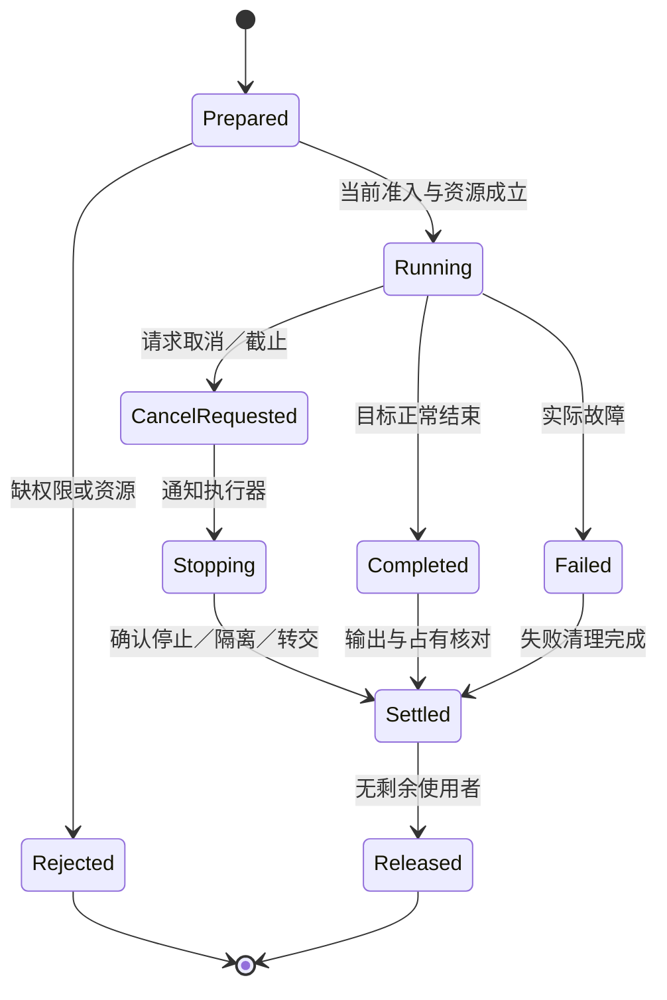
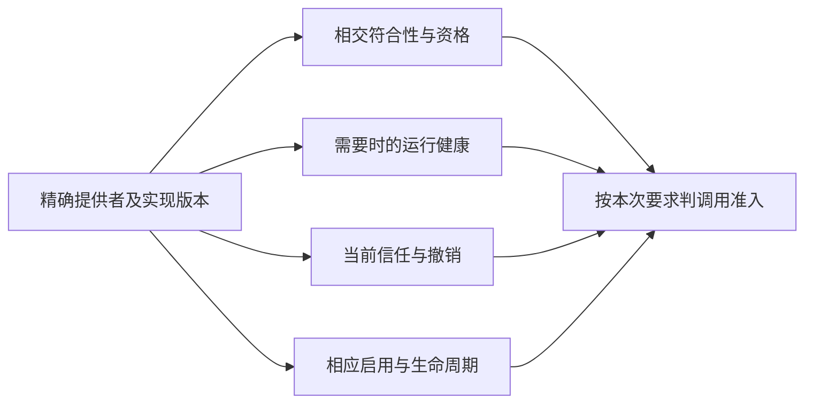
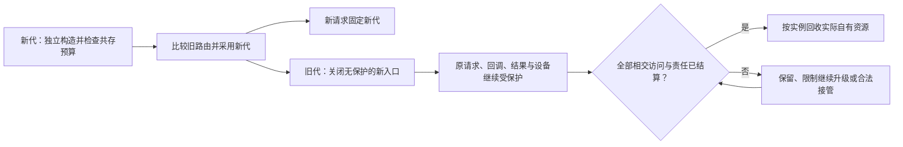
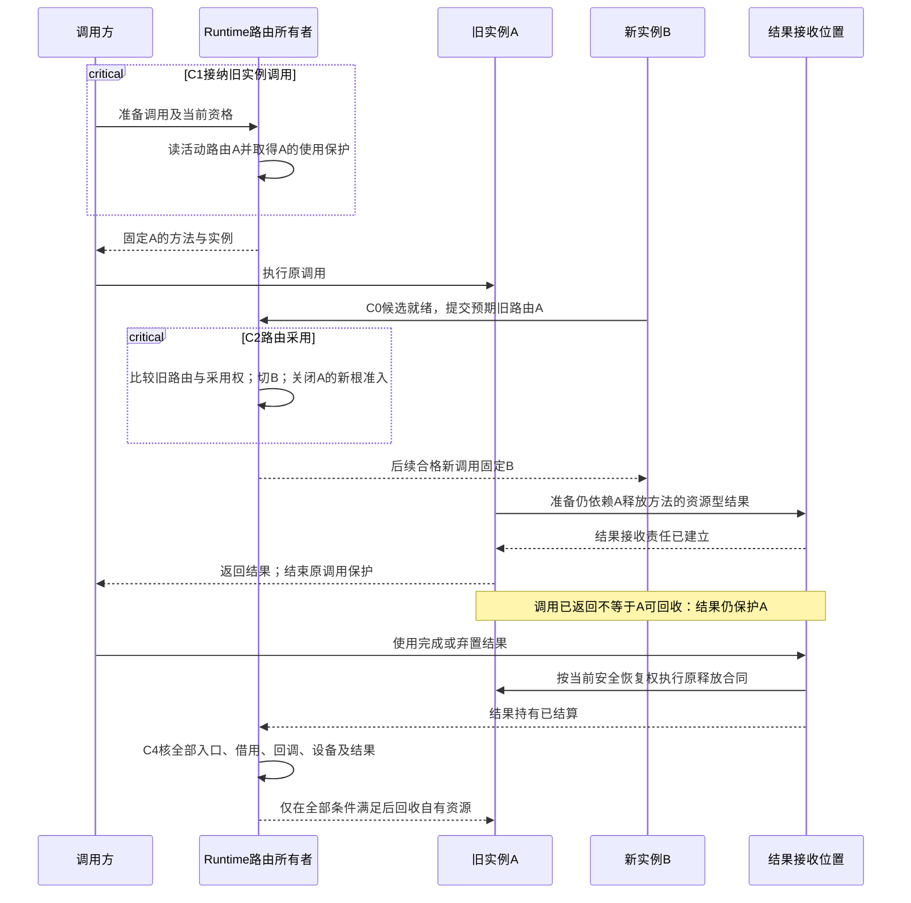
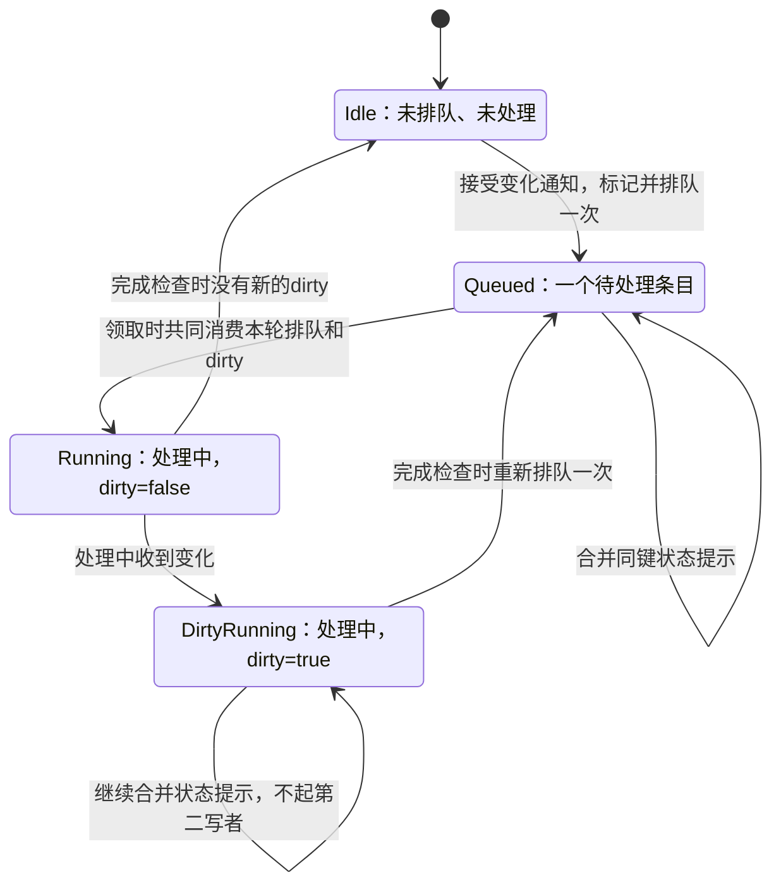
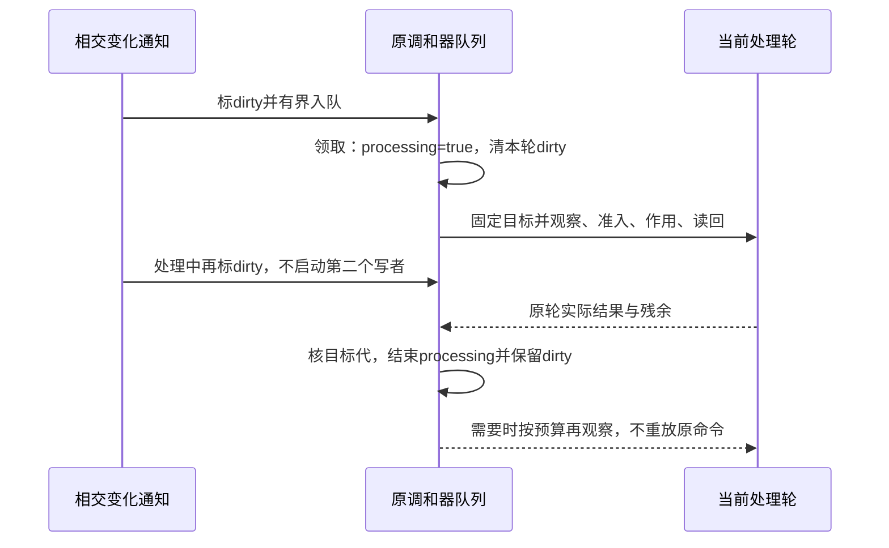

# 发布运行与资源生命周期

> **阅读范围**：采用范围内的设计规范；实现状态另查未决。

<details>
<summary>本页内容</summary>

- [当前计算运行主线与结果寿命](#当前计算运行主线与结果寿命)
- [SEC自身可搬移发行集与文档发行](#sec自身可搬移发行集与文档发行)
- [从源候选即时运行与运行实例结束](#从源候选即时运行与运行实例结束)
- [采用合格路线与证明已经运行](#采用合格路线与证明已经运行)
- [反馈控制器、调和、漂移与持续收敛](#反馈控制器调和漂移与持续收敛)
- [调试驱动、目标控制与引用失效](#调试驱动目标控制与引用失效)
- [外部能力 Provider 运行时](#外部能力-provider-运行时)
- [多制品组合、生成与原子发布](#多制品组合生成与原子发布)
- [工作区创建、接入、修复、重置与销毁](#工作区创建接入修复重置与销毁)
- [缓存、物化、隔离、回收与资源出生登记](#缓存物化隔离回收与资源出生登记)
- [编译工具执行与新目录导出协议](#编译工具执行与新目录导出协议)
- [进程树、端口、浏览器、容器与数据库资源](#进程树端口浏览器容器与数据库资源)
- [依赖单写、物化、缓存与离线构建](#依赖单写物化缓存与离线构建)
- [工程订阅与部署的状态接合](#工程订阅与部署的状态接合)
- [发布与运行调和的正向闭环](#发布与运行调和的正向闭环)
- [非源码成员也参与精确交付](#非源码成员也参与精确交付)
- [开发系统与生成程序的部署分界](#开发系统与生成程序的部署分界)
- [状态实例终止与模型发布分别完成](#状态实例终止与模型发布分别完成)
- [运行适配的登记、停止与资源终结](#运行适配的登记停止与资源终结)
- [开发运行循环：参数、交互、重启、观察和关闭](#开发运行循环参数交互重启观察和关闭)
- [从运行/调试结果继续开发，而不是重启一切](#从运行调试结果继续开发而不是重启一切)

</details>


## 当前计算运行主线与结果寿命

<a id="fig-run-lifetime"></a>

### 图解：请求完成与物理资源结算分离

状态图只描述一次实际运行；逻辑取消与资源释放有中间责任，不能从超时直接进入Released。



当前优先本地计算的构建、运行、输出与观测；下面数据库、容器、云和持续调和是条件能力，不是每个程序的部署需求。完整接口由[compute-run扩展](../开发/工具协议/构建运行接口.md#计算构建运行与定点观察的可选操作扩展)拥有，这里定义宿主消费。

先固定artifact及入口，读取参数与真实工具/环境；建立操作身份并取得本次资源份额；在隔离输出区构建或调用；保存结果、成员和当前执行状态；按请求取得观察；结算后释放。一次运行可完全在本地进程/worker内完成，不需要联网服务或数据库；所需内存、文件和设备仍需真实能力。

多个独立计算可以并行，但输入共享不能导致别名写冲突，未停止的消费者继续占用缓冲。每个应用会话的可见结果绑定当前输入和选项版本；旧运行可完成为历史结果，不可更新新画面。取消请求和实际停止分开，RunRecord的结束分类沿真实Runner能力。纯计算输出可放弃，已发出的外部作用不能用删除记录撤销。

构建得到的可执行制品与生成源码是两份有生产关系的ArtifactSet；实际运行数据不是新的作者头。依赖缺失时报告真实缺项，不自动安装；需要安装则独立授权后继续相应准备。运行成功但结果超出任务误差，仍可准确记录执行成功而需求未满足；二者不互相改写。

观察器只读实际可得状态，不以有格式化方法为由调用未知getter。一个被优化掉的源值不能用旧运行或重新计算值填充；重跑与原运行分开。需要观察变体时固定其产物与原来源关系，不能在start中无记录地换代码。

## SEC自身可搬移发行集与文档发行

SEC自身的开发构建与可交付发行是两项不同操作。`bun run build`继续生成源码仓库内部使用的`dist/`开发制品；`bun run release:build`由`src/bootstrap/release/build-release-set.ts`进入`adapters/release/release-set.ts`，从一个已经冻结的Git commit/tree构建`build/release-set/`。两者不能用同一个“build成功”状态互相代替。

发行集只有两个成员根，且二者必须来自同一个`sourceCommit + sourceTree`：

```text
build/release-set/
├─ release-set-manifest.json
├─ runtime/
│  ├─ runtime-package-manifest.json
│  ├─ package.json
│  ├─ bun.lock
│  ├─ .bun-version
│  ├─ LICENSE / NOTICE / REUSE.toml / LICENSES/...
│  ├─ THIRD_PARTY_NOTICES.json
│  ├─ THIRD_PARTY_LICENSES/...
│  └─ dist/
│     ├─ index.js
│     └─ 运行所需策略、registry与compose资源
└─ documentation/
   ├─ documentation-package-manifest.json
   ├─ .documentation/baseline.json
   ├─ .documentation/source-manifest.json
   ├─ .documentation/requirements.json（存在REQ源时派生）
   ├─ .documentation/figures.json（可选缓存，不是规范源）
   └─ source-manifest声明的完整权威输入
```

### Runtime package

冻结源码先按锁文件在隔离源树中准备构建输入；portable构建把SEC CLI实际导入的普通JavaScript包依赖直接bundle进Bun-target `dist/index.js`。这里的`.js`是TypeScript作者源码经Bun生成的发行载荷格式，不是第二份作者源码，也不表示运行包重新采用JavaScript作为作者面。SEC当前dependency owner依赖受信的Bun CLI调用合同，用该调用执行受管`bun install`、native TypeScript与类型依赖generation。[Bun官方单文件可执行文档](https://bun.com/docs/bundler/executables#act-as-the-bun-cli)明确支持从1.2.16起以`BUN_BE_BUN=1`让编译后的程序执行Bun CLI；因此`process.execPath`变成SEC程序并不能推出必须额外携带第二份Bun，也不能据此排除原生发行。原生接入仍须将工具调用模式、经过验证的可执行身份、子进程环境和资源/内嵌文件定位一起设计，核对受管安装、native启动、再次调用与退出；不能只改build标志，也不能让该环境变量误传播到本应运行SEC入口的子进程。Bun-hosted bundle保持当前实现基线；原生路线是有上游能力依据而尚未完成SEC整链验证的候选，平台矩阵、体积、更新与验证成本按实测比较，不能预设重复runtime成本。官方能力于2026-09-20核对，不代签SEC原生运行结果。

发行根**不复制普通`node_modules`**，因此不会把仓库安装目录伪装成SEC受管dependency generation。`package.json`、`bun.lock`和`.bun-version`仍保留：只有`generatedRuntime`分类要求的`yaml`、TypeScript/native与类型包声明进入portable package；Knip、Jscpd、Prettier及普通CLI依赖均不作为运行时安装依赖复制。普通CLI依赖已在bundle中；需要native TypeScript、类型包或YAML受管generation的操作继续通过既有dependency owner创建/复用generation，其安装、缓存、过期、恢复和退役合同不由发行器另造一套。

portable `package.json`只保留发行身份、bin、唯一`sec`脚本和dependency owner需要的依赖声明；不携带源码`source`入口，也不生成package-source-launcher shim。源码开发、postinstall、测试、审计等脚本不带入运行包。portable `sec`脚本由bin artifact路径机械生成并直接调用`dist/index.js`，因此`bun run sec`与直接运行bin绑定同一发布artifact。移动整个`runtime/`目录后，入口仍从自己的package root解析身份和运行资源，不向上寻找另一个仓库的`package.json`。

bundle实际消费的第三方package从Bun metafile反推；每个进入bundle的package必须有name、version、license和可分发license文件。发行器复制这些license字节并生成`THIRD_PARTY_NOTICES.json`。缺license证据时发行失败，而不是只在源码仓库有依赖声明就宣称分发义务完成。

### Documentation package

文档发行不遍历“看起来像文档”的目录，也不要求Git tree长期携带派生快照。它严格读取同一冻结tree中的`.documentation/baseline.json`和声明范围内的实际权威源：重复JSON key、未知根字段、逃逸/别名成员、超预算或读取漂移均拒绝。release owner重新枚举实际成员、逐字节计算长度/SHA-256和集合摘要，在stage内生成`.documentation/source-manifest.json`；随后把stage当sealed package再次按manifest完整验真。源/派生/缓存按[身份域合同](../维护/文档身份与重组协议.md#documentation-identity-domains)区分。baseline是纯输入且已属于源成员；source-manifest只绑定本次捕获的权威输入，不能以工作树旧投影或两个相等的摘要字符串代替重新捕获。requirements从同一REQ源在stage内重建；可选figures仅在实际存在并被本次发行选择时作为无规范效力的字节附件。实际携带的全部文件由外层文档包manifest绑定，缓存更换不改变源身份，但改变其所属制品身份。`REUSE.toml`和`LICENSES/`作为manifest成员原字节保留，因此MPL-2.0、CC-BY-4.0等文件级许可不会被折叠成一个错误的总许可。

### 共同manifest、发布与恢复

`runtime-package-manifest.json`和`documentation-package-manifest.json`分别绑定物理成员路径、字节数、SHA-256和可执行位；共同`release-set-manifest.json`再绑定两个成员manifest的原字节digest、file count及共同source commit/tree。readback重新枚举物理目录；额外顶层文件、隐藏残留、symlink、成员篡改、manifest重复字段或跨提交混用都拒绝。`.documentation/**`是文档包正式成员，不得因上传工具默认忽略隐藏路径而丢失。

构建先在目标父目录的独立stage依次完成文档、runtime及readback，再持有publication lease切换目录。不让Promise.all的失败快返遗留仍写共享stage的兄弟任务；以后并行化须先满足共同取消/终态结算合同。已有accepted结果作为精确preimage备份；候选切换后readback失败时先隔离失败候选并恢复旧根。并发写者改变目标、恢复备份身份不符、清理无法确认或lease结算失败都保留为失败/cleanup finding，不用“新目录已经出现”代替完成。完全相同的重试可以复用已发布结果，但本次新stage仍须退役，不能留下成功路径残渣。

正式release验证先固定默认分支exact head并完成full verification，之后才运行`release:build`；构建后再次比较Git HEAD以及`release-set-manifest.json`中的source commit/tree。上传release-set时必须显式包含hidden files。CI只是该发布流程的一个消费者；本地构建和源码正确性不以GitHub Action可用为前提。

## 从源候选即时运行与运行实例结束

[compute-eval](../开发/工具协议/构建运行接口.md#从候选直接运行的有限扩展)明确请求准备某个源入口后运行。准备出的制品和实际RunRecord分别保存，准备失败不产生已运行结果。原compute-run只接已可调用制品。获取依赖、临时写盘、进程和设备仍要实际准入，预览不暗中触发。

运行实例拥有本次状态根、闭包和实际资源。代码可以与其他运行共享，可变对象与全局会话配置只有显式共享才相同。实例结束先停止新准入并结算在途使用者，关闭实际资源，再释放根引用；宿主GC何时收集剩余不可达值不是业务完成条件。输出或会话继续持有闭包时，原代码与其环境继续有效，不热改在途解释。

## 采用合格路线与证明已经运行

发布输入是精确产物、当前被要求的保证与环境条件。组合检查只能说明在这些条件下具有相应设计/生成资格；实际应用和运行必须取得真实目标状态及读回。代码可加载、端口连通、任务结果满足和用户目标达成都有各自观察对象，不合并成“部署绿色”。

新绑定比旧绑定更快时，先判断是否更改公开表示、状态、运行资源和在途责任；按迁移合同切换。允许只读或影子比较时不重复真实外部效果；对不能安全双执行的操作采用精确事件/结果或其他合格验证途径。既有操作继续绑定原代码与语义，除非显式迁移具备相应保证。

真实环境失去某项假设时，区分停止新准入、保留只读、缩小支持范围、重新生成带检查版本和隔离受影响实例。该处理由实际控制能力执行；离线独立产物没有回连与约束机制时，SEC不能只改元数据就声称它已经停止。历史制品和旧证据按其范围保全，新资格从当前事实形成。

## 反馈控制器、调和、漂移与持续收敛

### 1. Desired 与 Current 分离

控制器只消费已接受目标和独立观察的当前状态。它不能根据当前容易实现的状态改写目标，也不能把成功写入当永久收敛。

### 2. ReconciliationCycle

```text
observe exact current
→ compare with desired generation
→ compute pure delta
→ admit bounded actions
→ execute and settle
→ read back
→ classify converged/degraded/blocked/oscillating
→ schedule next observation
```

### 3. 多控制器

每个字段/状态或 Effect 的写协调与冲突规则须明确；可用作用域内单写、ownership partition 或已验证的 typed conflict resolver。可交换状态可多源更新，但控制器不能靠未分析的 last-write-wins 竞争来假定收敛。

### 4. 外部漂移

外部人工修改、Provider 自动作业和其他系统写入必须保留来源。策略可以接受、覆盖、忽略、报警或停止，但不能把所有差异都称为错误。

### 5. 稳定性

使用 idempotency、hysteresis、rate limit、backoff、fencing、deadband 和 safe state。重试/auto-scale 可能形成正反馈，资源和最大动作频率进入合同。

### 6. 版本变化

新旧 controller 并存时只允许一个有效 writer 或显式分区；desired/observation schema 兼容和 rollout 需独立验证。

### 7. 验证

持续漂移、乱序观察、两个 controller、快速目标变化、网络分区、资源耗尽、外部 override、恢复动作冲突、版本切换和长期振荡。


<a id="debug-driver-lifecycle"></a>
## 调试驱动、目标控制与引用失效

### 消费者与驱动接口

[有限调试工具合同](../开发/工具协议/交互调试接口.md#debug-session-contract)是开发者入口；本节拥有其真实执行与状态转换。`execution/debug-session.ts`维护一次会话/命令归属，`adapters/debug/`实现已选成熟调试器端口，`application`只协调请求、固定内容和返回。与普通RunRecord/operation共用原资源与结算，不另建调试权限数据库。

`DebugDriver`必须给出以下真实方法，未支持的方法返回明确能力缺项而非空成功：

| 方法 | 输入 | 返回/保持 |
|---|---|---|
| `prepareLaunch` / `prepareAttach` | 固定制品/入口/输入或真实runtimeTarget、调试能力、当前准入与限额 | 有类型的实际启动/连接计划；不会在纯准备里已经运行目标 |
| `connect` | 已准入计划及原operation/尝试身份 | 驱动会话和有序、有限的结构事件；返回连接建立不等于目标就绪 |
| `replaceBreakpoints` | 明确配置代、按真实源分组的完整位置集合 | 每项实际位置/验证状态或未决；空集合实际清除本拥有者该源断点 |
| `control` | 已核当前状态/暂停/配置的有限控制联合、实际线程/runScope、pendingControl和请求身份 | 已发送/完成/失败/未决；不接受任意DAP方法名或shell字符串 |
| `readPaused` | 当前PauseRef、帧/值选择、预算与披露范围 | 带暂停与观察范围的有限内容，或陈旧/不支持；不执行用户getter |
| `reconcile` | 原意图、最近可信会话/目标身份、待决命令 | 当前可验证事实与仍未知范围；没有查回能力不得伪造读回 |
| `close` | launch/attach归属、明确结束方向、当前许可 | 调试连接、目标、子资源分别结算；不从会话terminated推断进程树结束 |

接口规范由execution拥有，具体SDK/DAP类型留adapters内部。Dap sequence、threadId、frameId、variablesReference等底层编号均映射为本会话下的受限引用；它们不直接成为全平台稳定身份，也不跨新暂停复用。

### 实际启动和控制步骤

**D0 固定与准入。** 核已协商协议、制品与工具内容、源映射、入口/参数、目标身份和目的。选择本次实际Runner/调试器配置；不继承任意工作区调试脚本、环境或扩展安装。附加现有进程分别核可披露数据、暂停/控制及终止权。

**D1 建立驱动。** 在当前资源和秘密范围内启动独立适配进程或连接已经接受的受信服务。记录本次拥有与借用资源；端点不是任意用户URL。握手核实际能力、路径/坐标约定及消息/输出大小。没有安全读取变量的方法时，降低为无法展开该值，不能通过表达式求值补功能。

**D2 配置。** 按驱动实际就绪时点设置断点，消费每项实际位置与验证状态；配置完成是否允许目标继续由required条件与真实适配保证决定。目标启动、模块加载和断点配置可能交错，不能写死“连接完成就已在入口停住”。需要用户代码前停住的能力不足则不宣称支持。

**D3 接收状态。** stopped/continued、线程出生/退出、断点变化、输出、会话结束和目标退出各更新相应对象。线程ID复用建立新出生身份；续跑使相交PauseRef失效；只有一个线程停止时不假设全堆冻结。输出流可以在明确限额下截断，控制状态流丢失则使状态不再可信，不能悄悄丢弃后继续签发暂停引用。

**D4 读取/发命令。** 命令接受与本地状态更新串行，驱动I/O在其外进行；不要持有全局查询锁等待目标。读取返回后再次核暂停/来源是否仍相容，过期结果不作为当前值；单步、继续和暂停都有真实执行效果，不在传输重试中重复发出。反向请求启动终端/进程也要重新通过原execution边界，不能由调试器请求自动授予。


D4还消费公开合同的单个pendingControl：本会话未结算命令阻止第二条独立状态改变，继续/单步接受时先撤掉旧暂停的活读取资格；发送前检查最新本地前提及实际驱动可承担的控制范围。runScope=thread不支持就拒绝；必需断点未verified不允许继续。动态强配置只在实际全目标暂停边界进行；附加前的执行历史不属于它的保证。命令响应丢失保留pending/未决并查回，不能清空槽给第二条next制造双执行。

**D5 结束与查回。** launch会话终止需要分别核目标退出、子进程和驱动结算；attach默认只解除本次连接。对失联保留最后可信状态与可能已发生的命令。可安全重连时先核同一目标出生身份、适配能力与实际控制资格；旧PauseRef全部作废。不能确认同一目标或实际状态时返回unsettled，不能自动附加同PID的新进程。

### 宿主保证、运行观察与持久边界

本地有序消息和单控制者减少竞态，但不替代宿主真实控制边界。多个调试器、目标自发恢复、信号或远端消息缺口都可使本地paused过期。声称原子“仅对这个暂停单步”需要适配器能实际履行；有限原生协议只能提供较弱观察时，拒绝依赖强保证的命令或按已接受范围使用，不通过注释伪造保障。

运行中读取的对象可能含秘密和任意规模数据。默认给定数量、字节、深度、时间预算并保留截断/不可读原因，不全量收集堆、环境或每步日志。观察本身的暂停和读取成本计入这次运行，不能拿被调试执行的耗时代表无调试性能。

短本地会话可以只保留内存状态和有限输出；没有跨崩溃恢复承诺时，断开后报告失去的会话范围。真实外部写入的业务后果仍归目标作用合同，调试记录不能恢复其未建的幂等协议。确需可恢复命令时复用原持久意图/结果，并保存准确目标/工具/输入；不因有调试日志就认为控制命令恰好一次。

DAP是消息与能力机制，不定义本产品全部启动参数、权限或沙箱。具体驱动需锁定实际协议/工具修订，使用其真实启动、暂停、变量、配置与结束能力。[官方说明](https://microsoft.github.io/debug-adapter-protocol/overview)作为这些机制的来源；本节未指定或运行任何实际调试器实现。

## 外部能力 Provider 运行时

### 1. 定位

Provider 是语言工具、编译器、求解器、测试器、模型、远程服务、数据库或 Host 能力的实现载体。Provider 提供能力，不拥有 SEC 的产品语义、权限规则和验证裁决。

### 2. 能力分解

```text
ProviderDefinition   供应者身份和协议
Provision            声明可提供的能力
ProviderRevision     精确实现修订
ProviderBinding      Requirement 到 Provision 的解析
ProviderSession      一次可调用运行会话
ProviderReceipt      调用观测和结果
```

会话重建本身不改变稳定实现绑定；实现/能力合同、所用目标与依赖语义变化可使绑定重评。授权、撤销、健康与实时资源变化也可使当前调用资格失效，但不因此改写历史 Binding 的语义身份。

### 3. 成熟度

本篇不定义另一套 Provider 成熟度直线链。合同、符合性和范围化资格沿用[能力依赖图与局部插入](../作者/共同语义关系.md#能力依赖图与局部插入)；健康为 healthy/degraded/unavailable/unknown，信任为 eligible/revoked/unknown，生命周期为 active/retiring/retired。各值绑定精确实现与作用域，可以独立变化。发现候选不自动取得任一资格。

### 4. 会话合同

```ts
interface ProviderSession {
  readonly sessionId: string;
  readonly providerRevision: string;
  readonly provision: ProvisionRef;
  readonly environment: EnvironmentRef;
  readonly grant: CapabilityRef;
  readonly limits: readonly ResourceBound[];
  invoke(request: ProviderRequest): Promise<ProviderOutcome>;
  query?(operation: ExternalOperationRef): Promise<ReadbackOutcome>;
  cancel?(operation: ExternalOperationRef): Promise<CancelOutcome>;
  close(): Promise<SettlementReceipt>;
}
```

### 5. 完成语义

Provider 必须声明：

- 调用是否幂等；
- 幂等键范围和保留期；
- 超时后效果可能性；
- 查询或读回方式；
- 取消是否真正停止效果；
- 迟到响应处理；
- 重复和乱序；
- 会话丢失恢复；
- 外部错误映射。

无读回且不可幂等的破坏性 Provider 不能取得要求可判定恢复或防重复效果的调用资格；可以如实记录其发现/实现状态，但不能用泛化“成熟度高”放行不满足的保证。

### 6. 适配器

适配器负责协议、类型、错误、取消、资源和回执映射。适配器不能：

- 放宽 Requirement；
- 隐藏未知完成；
- 根据错误自行选择其他 Provider；
- 把日志文本当结构化结果；
- 获得超过会话 Grant 的 Host 权限。

### 7. 沙箱

本地Provider的边界由实际信任、资源和故障隔离要求选择，不以“本地”一律决定进程数。已获准的可信纯方法可同进程直接调用；worker可承担并行或可中止计算，但名称本身不证明文件、网络和秘密隔离。不可信代码、需限制宿主权能的插件，以及进程内无法满足的硬资源/故障界，才使用确实提供相应保证的受限进程、容器或解释器。未知模块的顶层初始化也算执行，必须在合格边界内进行，不能先加载到主进程再检查。

需要沙箱的提供者按本次要求验证实际具备的边界：

- 只读或限定文件能力；
- 网络目标白名单；
- 受控环境变量和秘密代理；
- 进程树、CPU、内存、磁盘和时间限制；
- 输出大小限制；
- 系统调用或容器边界；
- 关闭时进程树结算。

列表是相交保证的核对范围，不宣称每种宿主都支持全部能力。缺少本次必需边界时返回不支持或改选有权且合格的方式；不以降级成普通子进程冒充沙箱，也不强迫无此要求的短纯调用支付隔离、序列化与守护成本。

### Provider 生命周期



本图是准入输入关系，不是提供者必须依次晋级的成熟度阶梯。各项按本次真实要求消费；历史符合性不代替当前权限，健康变化也不改写原产物。
该图是独立证据共同参与准入，不是从已发现到已退役的必经状态机。恢复健康不自动解除安全撤销；新资格证据不自动重新激活已退役实现。

### 8. 健康与漂移

健康信号包括：

- 能力发现；
- 合同握手；
- canary；
- 错误率和时延；
- 结果差分；
- 资源异常；
- 版本和证书；
- 安全或供应链事件。

运行健康不是语义符合性替代。漂移只使真实使用该 Provider 的 Binding、计划、证据和候选陈旧。

### 9. 升级和撤销

新 revision 作为独立候选：

```text
发现
→ 来源和签名验证
→ 合同测试
→ 所需符合性与故障检查
→ 必要时隔离影子或有限流量
→ 限定切换
→ 观察
→ 旧会话排空
→ 旧 revision 退役
```

恶意或撤销事件立即阻止新会话，终止可安全终止的活动，轮换泄露秘密，并重建受污染派生物。

<a id="runtime-generation-cutover"></a>
### 路由切换、在途固定与旧实现回收

新实现可被选用、某次调用已固定它、旧实现已不再接纳新工作、以及旧代码/资源已可释放，是四件不同的事。这里精化原EngineImage、ProviderSession和Runtime的接纳/释放接缝；不新建一个掌管所有对象的版本管理器，也不改写每次方法的公开参数。

**C0 准备候选。** 原装配工厂先构造独立只读新代，取得真实依赖、接口/数据兼容性与相交符合性；按[取得责任](../领域/对象与控制/控制流与存储寿命.md#acquisition-custody)保护部分初始化和未交付句柄。新旧代码、缓冲、连接、在途结果与恢复材料共存的峰值先受宿主实际池及本次预算约束。准备失败只结算新代确实取得的资源，旧代的调用和恢复责任不被清空。

**C1 读路由和取得保护是同一接纳动作。** 既有Runtime入口按真实路由域选择活动代，在同一短协调段或等价合格原语中核生命周期并取得使用保护，然后才返回固定方法/实例引用。反例是先读A的指针，更新者切到B并释放A，读者才对A加计数。单线程重入也不能把外部getter/回调插在这两步之间；跨线程必须使用真实同步及发布可见性，不把普通赋值称为原子保护。保护可以在PreparedJob/会话入口取得一次，内部安全借用复用它，不要求每个纯函数深层调用重复登记。

**C2 单点采用。** 新代全部准备就绪后，按预期旧路由和当前采用权，在同一拥有者内切换默认路由并关闭旧代的无保护新入口；必要的根保护与退出观察位置预先准备。切换冲突保持当前已采用者，重新评价是否仍需该候选；切换结果未知先读回原操作，不再盲发另一次。只有真实共享一个提交点的路由集合才一起原子；跨进程/多目标按原分项发布与围栏处理。默认路由只影响允许选择它的新准备态，不能替换锁定旧解释的工程。明确保留的历史入口是独立的接纳根及资源责任；只撤默认路由不等于关闭了实例全部入口。若实例整体已经Closing，则不能通过另起入口名称重新接纳无保护新工作。

**C3 旧请求完成原合同。** 已固定A的请求、回调、设备完成、结果弃置和释放方法继续使用A的实际实例，不回查currentProvider来找B的析构器。排空禁止新的无归属根，不禁止原接纳任务完成其已绑定、有限且仍获准的子调用/清理；这些派生使用须在父保护释放前完成登记或转交，不能让计数先归零再“复活”子任务。尚未开始的独立冷任务不能仅凭旧闭包名自动取得新作用权。新请求确需旧解释时，只能进入明确保留且仍合格的旧版本入口，或重新装配获准的新实例；已经进入回收的旧实例不重新开放。保留历史入口意味着其根保护尚在，不可同时宣称旧版本已排空。

**C4 先断未来访问，再判可回收。** 原请求、借用、回调栈、设备使用及仍依赖A代码/分配器的返回对象全部结束或被真实有权接管后，才释放A实际拥有的部分。结果就绪和调用数归零各自不足；一个仍须由A释放的结果就是独立保留原因。永久纯字节不需要不必要地pin整个运行实例；仅保留它真正依赖的内容与解释依据。共享宿主池与外部已接受业务仍归原拥有者。不可加载/卸载的宿主可保留到进程退出，或在允许的独立进程边界替换；不能把移出Map宣称为已卸载代码、已擦除秘密或已停止设备。

**C5 有界演进与失败恢复。** 同时存活代的数量、真实占用和准备队列由既有预算/调度控制；旧代迟迟不退出时，优先等待、取消尚未采用且无独立义务的候选、限制进一步升级，或合法隔离/转交。不能为腾内存提前free旧代，也不能每次配置消息都开一个新Runtime。合并的是尚未执行的状态请求，不是已经采纳的操作、审计、补偿或未结算责任。旧A→B→新A仍是不同运行代，迟到回调按实例比较而不是名称相同就接纳；退役失败保留原实例及准确残余，恢复不重复执行已完成析构。

**撤销和回退不由pin授权。** pin只保证所需实现/资源的寿命；安全撤销仍在真正效果消费点阻断新越权作用。继续清理、读取或补偿也使用当前允许的恢复权，不能为了“保证释放”运行已不可信的原代码；没有安全回收能力时保留隔离与未结算。回退是新的有权采用，先核新数据格式、已发生作用、外部依赖和恢复方向；版本A仍在磁盘不证明可恢复业务前像，已销毁实例也不能被状态字段复活。



实现默认可用已有入口短锁和作用域引用；只有测得读路径竞争且目标有合格原语时，才换等价的无锁/epoch/RCU方案。RCU资料支持“移出可见路径后等待旧读者，再回收”的机制，不证明跨异步悬挂引用、外部作用或所有宿主都已满足条件；[来源与取舍](../依据/来源/构建分发与迁移.md#dynamic-lifecycle-sources)记录这些限制。

<a id="runtime-pin-handoff-sequence"></a>
### C协议的调用保护与结果交付时序

A、B分别表示两个实际运行实例，不是可重复使用的版本标签。根保护、派生子使用、回调/设备访问和资源型结果是不同持有关系；实现可以合并等价的内部计数，但不能遗漏任何真实使用。下图的admit、pin、release均为C1—C4语义步骤，不增加公共API。



结果保护必须在调用保护释放前建立；接收未知则保留原保护，不能在两个保护之间出现零持有窗口。采用B失败不改变A的路由责任；A的清理失败也不撤销已经独立成立的B，但必须保留A的残余并限制共存占用。上图未绘出的安全撤销仍约束每次真实效果，pin只保证寿命，不授权执行已不可信的代码。

### 10. Fallback

Provider 故障后先确定外部效果状态，再重新解析候选。Fallback 需要新的 `ProviderBinding` 和可能的新批准，不能复用旧会话权限。

### 11. 验证

- 合同黄金向量；
- 错误、超时、重复、乱序；
- 取消和进程树；
- 资源耗尽；
- 会话丢失和重建；
- 漂移检测；
- 沙箱逃逸；
- 供应链撤销；
- fallback 不扩权；
- Provider 与参考实现差分。

<a id="reconcile-wakeup-state-detail"></a>
### 调和队列的唤醒状态投影

本图仅展开[R0—R4](#reconcile-wakeup-handoff)中的排队、处理中和dirty标记，不替代外部操作状态。Idle/Queued/Running/DirtyRunning是三项已有事实的阅读投影，不要求新增持久枚举。状态提示可合并，独立业务命令、回执与未结算操作不得按此丢弃。



领取与完成的状态修改必须和通知标记使用同一协调域。通知先于完成时，完成者观察dirty并重新排队；通知后于完成时，由Idle进入Queued，均不得丢失再次观察的机会。关闭新准入、队列容量、期限和背压是正交条件：它们不由Idle推定成立；关闭后已接纳工作仍须按R4结算。异步D1结果不能将已经改变的D2目标标为收敛，外部接受未知仍沿原操作身份查询。

## 多制品组合、生成与原子发布

### 1. 问题

完整工程输出包含源码、配置、Schema、资源、锁文件、清单、测试和制品。多个 producer 直接写 live tree 会产生路径冲突、部分 generation、旧文件残留和不可恢复状态。

### 2. CompositionPlan

```text
CompositionPlan = exact {
  exactInputAndBindingRefs,
  artifactIntentDag,
  artifactOwnerAssignments,
  desiredTreeAndDeletionSet,
  pathCollisionAndPlatformProofs,
  stagingAndPublicationPolicy,
  verificationClaims,
  recoveryAndReadbackPlan
}
```

### 3. ArtifactIntent

每个 artifact 声明逻辑身份、目标路径、producer、source inputs、expected bytes/digest、mode、ownership、preservation、dependencies 和删除规则。相同路径、ancestor/descendant、大小写/Unicode 等价碰撞在写入前拒绝。

### 4. Desired tree

组合的语义是生成完整 desired artifact tree，而不是依次 merge 写入。旧 generation 中失去 owner 的对象只有在 provenance 和前像匹配时进入 deletion set；人工、未知和外部对象默认保留并阻断冲突。

### 5. Staging

所有 producer 在隔离 staging 或内容寻址树中执行。staging 仍是物理 Effect，需要资源、Provider、cleanup 和 readback。不能把“operation-owned temp”称为纯计划。

### 6. Publication

优先原子 tree/generation switch；无法原子时使用 append-only journal、per-artifact CAS、checkpoint 和可恢复 publication。Lock、manifest、provenance、baseline 和 completion proof 必须从同一 accepted result 投影。

### 7. 验证

- 第 N 个 producer 失败；
- 路径 collision；
- source/provider 在 plan 后变化；
- 旧 artifact 删除；
- 磁盘满、权限、cross-device；
- publication 中断；
- unknown/manual 文件；
- read-only chmod 伪保护；
- repeated composition true no-op。

### 8. 发布回执 /2 的状态与证据

历史`sec.publication-receipt/2`的有限结构见[旧发布投影](../../examples/合同历史与范围.md#示例与检查的使用)。以下前后像与读回含义仍有当前消费者，不将旧状态表作为全部目标的协议。operationId 经受信操作记录解析到目标、manifest 和授权范围；不能把任意字符串当作受控操作。expectedMetadataRevision 表示提交预期前像（null 表示预期不存在），metadataRevision 表示已确认实际提交的后像（未知或尚未提交为 null），二者不得混用。

| state | 所表达的事实及最低结构条件 |
|---|---|
| prepared | 计划/暂存已准备，实际提交后像为 null；不持有最终目标读回 |
| content-published | 不可变内容已在选定内容层可用，元数据尚未提交；不等于目标发布成功 |
| committed | 实际元数据提交 revision 已确认；最终读回可以尚未完成 |
| readback-complete | 实际 revision 非空，至少一项与本操作/manifest/revision 相符的权威读回，未结算残余义务为空 |
| recovery-required | 记录已知提交后像或未知；保留全部未决效果/残余，不能自动归为“失败且未发生效果” |

readbackRefs 是最终目标状态的证据引用；暂存内容读回另附准备记录。residueRefs 只表示未结算义务；已经批准长期保留的资产归属 manifest/保留记录，不伪装待清理垃圾，也不阻止合法完成。空 contentRefs 可用于无额外内容的合法清单，但 manifest、提交和读回本身仍须存在并被验证。

Schema 可拒绝“没有任何读回引用却完成”等结构矛盾；非空引用不是证据真实性。上下文检查还要核对实际内容集合、操作目标、提交 revision、读回范围及残余结算。这些是后续检查器的关系验证义务；当前设计包不附该检查器。引用非空、Schema匹配或静态关系一致，均不表示已上传、已完成CAS/fsync、已获权限或已经恢复。

/1 中 metadataRevision 在提交前含义不明，不能自动当作实际提交或前像。升级需依据原操作/读回材料分开填写；没有材料则保持待恢复/待澄清，不能补造已提交事实。旧回执和幂等身份按原版本保留。

### 跨模型、制品与现场的接合

同代际不是强制所有对象使用相同字符串revision，而是锁定所选源/规则/目标到产物的合法关系。组合使用每项实际产物摘要；验证绑定实际subject；Mutation引用这份组合结果和当前目标前像；发布读回绑定真实后像。缺少其中关系时不得仅靠“属于同一个工作”宣布一致。

模型采纳与物理发布是不同事务。模型头提前推进不等于现场更新，物理效果完成也不能自行采纳另一个模型；持久控制投影分别展示desired、compiled、verified、applied、deployed引用及差异原因。已有足够回执与清单时只建立关联视图，不再保存可手工改写的全量BuildBundle。

## 工作区创建、接入、修复、重置与销毁

### 1. 一个 `init --reset` 不能拥有全部语义

创建新工程、接入存量工程、修复控制面、清理派生状态和销毁工程具有完全不同的权限、影响和恢复边界。

### 2. 操作分型

```text
WorkspaceLifecycleOperation =
  Create
  | AttachReadOnly
  | AdoptIncrementally
  | RepairControl
  | ResetDerived
  | DestroyOrReinitialize
```

### 3. Create

本地创建只进入空或明确可创建的根；已有内容走Attach而非覆盖。创建可以只产生内存工程、设计材料或作者清单，不强制模板、目标或持久控制库。确有多文件初始化时先形成暂存集合，按宿主提供的原子目录/引用切换或可恢复文件协议发布；分别说明观察者和中止状态，不能仅因叫staged就承诺整体原子。相同身份与相同意图的重试可读回后无操作完成；已存在的不同内容返回already-exists或冲突，不自动认领。

### 4. Attach/Adopt

Attach 只读 inventory 和 unknown；Adopt 逐步签发 source ownership、mutation、verification 和 migration，不一次接管整个目录。

### 5. RepairControl

只重建可派生且 ownership 已证明的控制/索引表面；不能覆盖有效 authoring source 或把当前错误状态写成 canonical。

### 6. ResetDerived

只删除 provenance 证明为可重建派生物的对象。source、manual、policy、evidence、recovery、unknown 和 identity-bound control 保留。

### 7. Destroy

显式高风险操作：说明精确目标、拥有者、内容范围、影响及不可逆部分，取得实际政策与主体授权，明确备份选择、恢复资产和目标读回。需要确认或冷静期时由风险政策规定，不把每次清理都当永久人工审批。句柄/no-follow、前像、日志按真实宿主执行；不支持相应保证时停止受影响删除，不能靠方法名字获得安全。任何主体均须具有当前能力，人或AI类别不额外授予或取消执行权。

### 8. 验证

- 非空陌生目录；
- 部分 SEC 状态；
- 旧版本工作区；
- symlink/reparse；
- 并发外部编辑；
- reset derived 保留关键状态；
- destroy 部分失败；
- template 不污染 Core；
- idempotent create；
- Windows/Linux 物理读回。

## 缓存、物化、隔离、回收与资源出生登记

### 1. 目录名不决定生命周期

`.tmp`、cache、ignored、stopped、old 都不能自动授权删除。跨操作、跨崩溃或外部可见且具有清理义务的资源，需要足够定位拥有者、物理身份、用途、保留和恢复责任；短生命局部对象由词法所有权、区域或会话管理，不为每次内存分配创建持久记录。

### 2. BirthRegistration

```text
ResourceBirthRecord = exact {
  resourceRef,
  producerAndOperationRef,
  physicalIdentity,
  resourceClass,
  contentOrGenerationRef,
  ownerAndLease,
  retentionAndRecoveryRole,
  terminalAndRetirementObligations,
  createdByAdmissionRef
}
```

只有实际绑定已创建资源、提交点与恢复根的记录才能用于创建崩溃恢复；先有一行计划但尚不知道资源物理身份时，不能据此认领任意同名对象。可采用受限的操作命名空间、目标幂等创建或目标可查询身份；不具这些能力时保留无法结算的分支，不靠名字和mtime猜拥有者。

### 3. 分类

```text
immutable-content-addressed
rebuildable-derived
active-ephemeral
identity-bound-control
recovery-authority
diagnostic-retained
external-provider-cache
unknown
```

### 4. Eligibility 与 Priority 分离

owner 先给出 `eligible | blocked | unknown`；容量/性能策略只在 eligible 集合中按 bytes、last-use、rebuild cost、sharing、reserved space 和 pressure 排序。

### 5. Materialization

依赖、工具链、浏览器和镜像按精确内容代际物化；活动绑定的切换原子性由适配器说明。已有完整合法内容无需重复下载或构建，但当前请求确需的撤销/信任元数据仍按新鲜度政策取得；内容存在不自动产生当前执行资格。

### 6. 缓存隔离

共享缓存限于可按实际输入重建的结果，不保存活跃授权、凭证或会话控制状态。可重建内容仍可能敏感，按[共享计算和派生数据隔离](../编译/查询增量与性能.md#共享计算的隔离与派生数据)处理。坏缓存可隔离并重算；若条目也是唯一恢复资产或必要事件证据，就不是可任意丢弃的缓存。回收沿[垃圾回收协议](持久化提交与恢复.md#垃圾回收)，不能仅凭名字删除。

### 7. 验证

资源创建窗口崩溃、活动 owner、外来同级对象、缓存投毒、跨会话污染、磁盘压力、隔离区恢复、垃圾回收与读取者竞态、离线复用，以及禁用缓存、冷缓存和热缓存的等价性。

## 编译工具执行与新目录导出协议

### 范围与状态责任

本篇定义编译工具适配和“导出到不存在的新目录”的小型本地设计，不替代已有工作区的[事务化变更](持久化提交与恢复.md#事务化变更读回与恢复)。纯编译按请求返回内联代码或ArtifactTree，不因产生源码就修改用户工程。新目录导出、现有目录提交、部署和外部效果分别有自己的完成点。

工具运行、制品树和导出驱动是三个可组合责任。当前默认本地方案按受信 POSIX 宿主规定；Windows 等宿主需要对应能力，不能拿 Linux 下的局部检查冒称所有平台可用。

### 有界工具执行

工具请求包含命令及参数数组、捕获输入字节、执行期限、输入/输出预算和明确环境。默认不经shell，不自动安装依赖；清除Node启动注入相关环境变量，TypeScript由显式已安装路径提供。更强隔离由工具画像选择，不将这些环境设置当沙箱。

输入写入受控临时文件，避免同步写stdin与未读stdout互相阻塞。stdout与stderr同时非阻塞读取，累计字节上限对两者之和生效。读取循环以单调时间计算剩余预算；超时、输出超限和异常都终止并回收当前进程组，不能只杀主进程却留下持有管道的子进程。

初始系统进程创建在某些平台不能立即中断，所以服务端必须把创建时延和失联恢复单独计入；当前回收也不能杀死已经逃离该组的恶意daemon。进程组用于清理受信工具，不用于安全隔离。需要约束恶意扩展时使用有实际文件/网络/秘密/进程能力限制的沙箱，条件不足则不执行该扩展。

工具非零退出、超时、输出超限、不可用与输出格式错误分开记录。确定性类型错误不反复重试；可重试故障必须有预算与幂等边界。完整工具结果回读并与输入、真实生产者绑定，不用最后一行stdout充当未经核验的成功证书。

### 写入前置与路径规则

导出只接收已捕获的相对路径→bytes映射，拒绝已有目的目录。写任何文件前校验完整成员集：绝对路径、反斜杠、盘符、上级穿越、空片段、控制字符、保留设备名、尾空格/点均拒绝。NFC+大小写折叠只用于检测路径及目录前缀冲突，不偷偷改写作者文件名。

A/x与a/y在Linux可分别存在，但在某些目标文件系统会合并目录，因此当前可移植导出预先拒绝这种别名。保留标记名的大小写别名也拒绝。要求精确保留这些平台特有名字的工程必须明确选择平台路径画像，而不是用该保守导出器静默破坏。

该普通路径适配画像的目的父目录必须处于受信、协作控制范围；独占需要由宿主实际取得，不能由请求字符串声明。采用普通路径API的适配方案，不提供敌对并发者面前的无跟随文件句柄保证；恶意进程在父目录中替换组件时，须使用现有能力对象/无跟随文件系统协议。校验符号链接不是绕过该信任前提的方法。

### 写入与读回状态机

状态为未创建→目录已占有且incomplete→部分文件已写→全部文件和回执已写→内容读回相符→移除incomplete→最终读回完成。每个文件以独占创建方式写入、flush并fsync；POSIX目录条目也请求fsync。回执记录版本、所有文件路径/长度/摘要和耐久范围，不声称存储控制器断电可靠性。

`.sec-export.json`是闭合清单；`.sec-incomplete`只是未完成提示。没有标记但也没有完整回执，不算成功。读回遍历实际文件和目录成员，拒绝多出、少了、长度/摘要不符、符号链接和空的额外目录。先在允许incomplete模式下读回，再移除标记并检查一次。

进程在准备、某文件写后、回执写后或移除标记后退出时，重新读回分别报告未完成或已完成。最后一种是“动作已完成但调用者没收到响应”，重试必须读回，不再次覆盖。前几种不自动删除残留或接管别人的目录；可以报告清单差异，由原拥有者显式恢复或重新导出到另一新目录。

### 内容完成不等于类型检查或发布完成

导出器只证明其范围内的字节清单。`--check`额外在写入前完成闭合目标检查，并保存独立target-check记录；不带该选项仍可以合法导出待检查源码。导出回执的bytes-exported不能被当成类型检查通过，也不包含目标程序运行和生产发布。

ABI预检发现缺失端口时可在作者程序副作用前失败，但已存在端口的运行异常、错误返回或实时撤权仍可能发生在前序效果之后。要原子化这些动作，需要事务型Provider；不能由本篇文件导出协议或Host快照替代分布式事务、幂等日志和补偿。编译取消也不能抹除已完成外部作用。

### 文档ZIP的快照封装

文档打包与目标工程导出共享“闭合成员、先冻结再验证”的原则，但不共用业务授权。制作流程记录当前成员和摘要，捕获精确文件字节到临时快照，核对捕获过程与预期一致；检查该冻结副本，再从同一副本生成ZIP并逐成员读回。该成员记录是制作期材料，不要求当前设计包携带名为CHECKSUMS的文件或某个历史检查器。

不能先校验活动源目录，稍后重新读取可能已变化的文件来打包。源在捕获过程中改变则拒绝与冻结清单不符的输入；完整捕获后原目录又变动，不改变已经冻结的包，也不能将包说成“最后时刻活动目录”的内容。将该包应用到仓库前仍需检查当前修订。

同宿主相同字节使用固定ZIP元数据可以重复封装；跨压缩器、跨工具链、签名和来源认证是其他声明。临时ZIP只有完整读回后才替换明确指定的输出文件；失败不破坏此前已经存在的输出包。

### 默认选择与更小替代

小型纯库可以仅返回内联函数/表达式或内存文件集合，完全不启动工具或写磁盘。需要用户直接运行源码时启用本导出协议；现有工作区变更采用更强事务机制。不能为所有只读调用强加数据库、出站队列或目录fsync。

如果反例表明当前父目录信任、进程清理、文件系统或输出规模假设不成立，应选择相应宿主适配并重跑其切点。已有参考进程中止测试不代替硬件掉电、网络文件系统、Windows或敌对并发写入测试。

### 应用执行准入、重试与实际后像

应用把工具和运行权限置于输入包之外。默认没有宿主适配器就拒绝效果；CLI 中的 purpose 只限定本次任务允许做到哪里；本地工具、运行和新目录写入还需要当前宿主许可，目的不能自行签发权限。它不是公司级IAM，不会授予第三方账户权限。运行原生代码必须视为运行受信代码；进程组清理不是文件/网络/秘密隔离。

宿主冻结Node可执行字节、TypeScript编译器、实际标准库、后端/校验器/运行器以及已选择的非秘密环境。调用前后重新校验漂移。精确文件路径用于加载，内容相同的工具搬迁不应仅因位置而改内容身份；LANG、TZ与实际影响行为的配置仍被绑定。环境变量不从候选继承，NODE_OPTIONS/NODE_PATH不被传递。检查无法发现恶意宿主在运行中改写后又复原的行为，需更强沙箱、只读挂载或可信执行环境时另启对应实现。

新目录导出有稳定操作身份，绑定精确结果、目的地、完整预期字节树及要求。首次调用发现目标已存在即冲突；再次调用不得把预先存在的目录追认为本操作成功。已开始的同一操作重试先重新取得读回权限，核对实际成员与应用保存的预期内容，不只核对目录自带的清单。目标、内容或保证要求改变时必须使用新操作；不允许相同操作ID变更含义。

在完成标记移除之前失败，报告需恢复且保留残留，不自动删除；标记移除后返回路径失败，但精确读回已完整，则记录completed-after-error，而非盲目再写。即使攻击者同时改了文件和目录清单，应用仍检查自己的预期清单。该保证仅在受信本地目录和仍存活的短会话内成立，跨进程重启必须从受权持久操作记录恢复，不能用自报JSON替代。

取消发生在动作开始前则不开始效果。效果已经完成后才观察到取消，记录完成事实及迟到取消；不得把完成改成未发生。运行中强制停止可能留下外部效果，当前目标运行不提供业务补偿。导出使用既有回执恢复，已存在工作区的事务更新仍由独立协议承担。

#### 原生重建输入与受信边界

原生绑定清单的规范化值及实际用户源码保存在结果中，并随产物写入 `native-bindings.json`。仅有生成桥接不足以说明端口为何这样绑定；后续重建必须同时校验清单、源树、计划、工具和目标。该清单来自显式输入，不能授予读取库或运行代码的权限。构建工具字节前后核对只在受信宿主中检测漂移；目标进程可以执行用户原生代码，不据此声称恶意代码沙箱或独立第三方认证。

## 进程树、端口、浏览器、容器与数据库资源

### 1. 物理测试和执行环境由资源组成

单个 PID 或临时目录不能代表完整执行环境。子进程、端口、浏览器上下文、数据库、容器、网络和缓存都有独立生命周期。

### 2. ExecutionEnvironment

```text
ExecutionEnvironment = exact {
  workspaceAndStagingRefs,
  processGroupOrJobRef,
  portAndSocketLeaseRefs,
  browserExecutableAndContextRefs,
  databaseSchemaTenantAndTransactionRefs,
  containerImageInstanceAndVolumeRefs,
  environmentAndSecretRefs,
  networkCapabilityRefs,
  immutableSharedResourceRefs,
  cleanupAndReadbackPlan
}
```

### 3. 端口

禁止“探测空闲端口→释放→稍后 bind”。端口 owner 持有 socket/lease，直到安全交接或直接监听。

### 4. 进程树

direct child 退出不代表 grandchildren 结束。Windows 使用 Job Object 或等价；POSIX 使用 process group、signal 和 reaping。无法证明时结果不 settled。

### 5. 浏览器

可选 browser capability 只有在 applicable Claim 需要 DOM/CSS/layout/interaction 时准备。not-applicable 路径必须零下载、零探测、零启动。

### 6. 容器

image、container、runner registration、credential、cache、volume、logs 和 Evidence 分离生命周期。删除 container 不等于删除 cache；stopped 不等于 reclaimable。

### 7. 数据库

每个 Action 使用独立 schema/database/tenant 或已证明 snapshot isolation，结束后验证连接、事务和数据 residue。

### 8. 验证

端口检查后使用竞态、孙进程泄漏、浏览器配置污染、容器登记漂移、数据库残留、取消或超时、资源误共享、清理失败和 Provider 能力未知。

## 依赖单写、物化、缓存与离线构建

### 1. 依赖状态分层

```text
Requirement
Candidate
ResolutionDecision
Lock/Binding
Immutable Package Content
MaterializationGeneration
Active Binding
Provider Cache
```

package/lock 只是决定载体，不能代表已安装或可运行。

### 2. 单写

同一可变 workspace/解析闭包的 package/lock 状态只有一个提交协调 owner；共享前像的竞争写须原子串行化或 CAS 检验。不同隔离工作区或互不共享锁状态的解析闭包可并行，不能把局部单写扩大为全平台只允许一项依赖工作。其他作者可产生候选，再由同一提交边界采纳。

### 3. 内容存储

包按 exact version/integrity/source/registry identity 进入 CAS。install scripts、native build 和 network 是 Effect，需 sandbox、authority 和 receipt。

### 4. 物化

在独立 generation 完成依赖树、链接、native artifact 和 runtime validation，再原子切 active pointer。失败保留旧 accepted generation。

### 5. 离线

锁文件和离线 artifact bundle 闭合完整依赖、toolchain、metadata 和 trust。完整本地 generation 时零网络；缺失只获取 missing closure。

### 6. 缓存

下载 cache、build cache、active materialization 和 rollback generation 分离。GC 不删除 active/offline pin/recovery。

### 7. 验证

注册表漂移、完整性不匹配、安装后脚本、本机二进制接口、部分安装、离线制品缺失、缓存损坏、并发写入者、回滚和旧代际退役。

## 工程订阅与部署的状态接合

源码发布只是新的定义/处理版本可被采用。运行数据、幂等终态、事件编码、订阅偏移和实际交付分别保有原身份；部署成功不推导旧数据已迁移或历史消息已按新合同处理。

[subscription](../领域/状态关系与流/事务与交付.md#交付语义顺序与幂等)在运行绑定中取得消息源、端口、交付身份、顺序和有限重试。默认有序键停放时只阻断相交键，不停止整个租户或应用；需要跨键顺序时另有共同协调合同。工作器租约和数据库记录还必须由实际目标约束迟到确认；没有端点去重不承诺网络外部作用一次。

选择不含订阅的输出根时不创建投递器。删除已部署订阅则不是“从输出根去掉，所以旧义务不存在”；退役要明确排空、转移、授权跳过或停放，保留所需恢复资料和隐私边界。只关闭线程不关闭业务责任。

开发者可以用成熟调度/流程提供者承载长期任务，不要求SEC自己建设分布式工作流服务。即使采用可重放引擎，也应记录非确定输入和外部活动结果，不能在重放时重新生成身份、重新调用AI或重发不可重复作用。Temporal的[Side Effects说明](https://docs.temporal.io/develop/go/workflows/side-effects)区分记录结果与回放再执行；它不是外部副作用恰好一次的保证。

## 发布与运行调和的正向闭环

发布输入是已经选定的Artifact集合、实际目标和布局、相应检查要求、当前许可与旧目标状态。一个发布动作只承担自己的交付层次：上传包、切换版本引用、启动实例、业务读回是不同结果。计划同时说明哪些层次是这次必需，哪些未请求。

### 发布路径

**D1 冻结交付内容。**从产物引用固定实际字节、成员集合和依赖，不重新读取活动工作树替换输入。检查秘密、原生保留区和路径在实际范围内；清单基于同一份捕获内容生成，不自报一个摘要后打包另一份字节。

**D2 准备目标。**读取当前版本、能力和资源，选择目标真正能承担的切换机制。新目录交付可以写入独立候选目录；已有工作区按前像/恢复协议；支持单一版本指针的目标可准备不可变版本后原子切换那一指针。多目标没有共同提交能力时明确逐目标状态，不宣称整个集合瞬时原子。

**D3 执行当前请求。**取得当前权限、预算及必要协调后应用所选计划；状态只随实际观察更新。准备完成未切换不能显示已生效；上传完成未启动不能显示业务健康。

**D4 读回和交付。**按请求声明的层次读取真正产物、活动引用、实例或业务检查。内容已匹配但目标健康未取得时，返回对应部分完成。失败选择恢复、回退或向前修复，先检查数据与接口是否仍允许回退，不能把所有发布都定义为可逆。

**D5 保留与退役。**正在使用、用于恢复或受明确留存要求约束的版本继续保存。无引用且满足回收条件后按代际删除；归档、已停止执行和物理消除不是同一状态。单一编译任务不要求持久发布服务。

### 调和循环怎样推进而不抖动

循环输入为固定目标D、独立当前观察C、实际差异规则与允许动作政策。每次观察先检查自身范围和时效；不完整观察只限制对应判断。若在所要求的等价关系下D与C相同，则记录该时点收敛，并按已接受监测计划再观察；不是宣布永远一致。

存在差异时，先分类为受管理漂移、外部有权变化、未知或不属于本控制器的字段。政策决定保留外部变化、形成新的采纳候选、或恢复既定目标。生成纯Delta和动作计划后，重新准入并只执行本步预算允许的步骤；读回新C再判断，而不是根据成功返回码直接重试同一动作。

离散状态使用精确状态条件，不凭任意阈值近似。连续测量确需抑制噪声时，由领域合同定义误差带、采样间隔和进入/退出阈值；这些参数是明确政策输入，不是通用“最佳迟滞系数”。响应滞后长于循环周期时，等待对应在途操作的读回，不启动相互抵消的动作。

固定D和规则下，重复动作既未推进任何受管理条件又产生相反变化，或者来源显示另一个合法写者竞争时，循环进入冲突/振荡诊断，停止自动对抗并返回决定点。独立领域可以继续运行，不要求整个平台停机。相同失败、输入和环境不变时复用已有结果；真正状态改变才开启新尝试。

<a id="reconcile-wakeup-handoff"></a>
### 变化通知、调和排队与再次观察的交接

变化通知只是重新观察的触发，不能签发新的目标、重放一个业务命令或证明某次作用已完成。控制器的协调键按真实对象实例及字段/作用冲突域确定；目标版本、控制器进程号与attempt只是本轮输入，不能因它们改变就为同一冲突域创建第二个独立写者。对象删除后同路径重建也不是同一个实例。

**R0 建立可解释观察。** 复用[快照—事件握手](../开发/工具协议/客户端与并行会话.md#快照与事件之间的无缺口接合)：从准确切面及相交事件位置继续，或者在有界缓冲保护下捕获；轮询也可以承担本次要求。断档、历史过期、重连换了范围或权限后，先标相交观察未知并重取，而不是把“没有事件”当成状态相同。各来源游标只按其合同比较，不将任意字符串版本号取数值最大值；多来源没有共同顺序时保留各自切面。不因重建派生视图而删除真实operation、未结算责任或作者草稿。

**R1 合并唤醒而不漏掉变化。** 既有调和器对每个协调键保留队列归属、是否正在处理、是否需要再观察、当前观察缺口和原在途操作引用。到达通知时在短协调段标dirty；尚未排队且未处理才入队，正在处理则只保留dirty。领取时同段确认唯一处理者并清除本轮以前的dirty；结束时同段解除processing，若处理期间又dirty则只重新排队一次。因此事件先于结束和事件晚于结束两种次序都不会丢唤醒。等待/运行的用户逻辑、远端调用和日志均在锁外；队列长度的非同步快照不能用来决定是否已经安全入队。

**R2 固定本轮判断，保留变化后的义务。** 领取后固定已接受目标、政策/解释、观察范围和本轮身份，再观察、纯规划及逐步准入。实际写入仍比较真实目标前像、当前权限和必要围栏；本地dirty标记不是跨系统原子性。已接受目标改变后，旧轮可以保存其真实结果，但不能把新目标标为已收敛；更新当前投影须比较仍是本轮目标与对象实例。原操作已经执行、接受未知或仍可能晚到时，先按原身份查回/结算，不能仅因队列开始新轮就获得新尝试许可。相反目标也不删除过去效果，是否取消、补偿或前滚另按该效果合同判定。

**R3 有界容量和进展。** 同键通知可以合并为一次“需再观察”，不能合并彼此独立且不可重建的业务命令、完成回执或唯一数据。等待键数、字节、活动调用、退避计时器和重同步成本共同受预算限制。键数超出容量时，只有在有权且能够重新枚举的范围内，才退化为该范围的待重同步标记；不能丢若干对象后还宣称观察完整。无法重建的输入须背压、保留到原耐久介质或准确停止相交接纳。重同步本身受限速与有限恢复份额控制，不让溢出触发无限全量扫描。

重复通知而真实基础未变，不重放已核确定性失败或在途写入；按既定退避/再观察政策处理。合并延迟若采用debounce，必须有本次要求允许的最大等待或可报告期限，持续事件不能永远把执行向后推；没有公平资源与稳定目标时也不能承诺最终收敛。排队、退避和重同步不刷新原业务deadline。控制器不得为让指标看似收敛而擅改已接受目标、成本单位或隐藏外部合法写者。

**R4 退出、崩溃与恢复。** 关闭先停普通唤醒准入，已接纳工作明确排空、取消或移交；关闭后的提交者取得拒绝/停止语义，不被静默记成已接受。纯dirty队列在可重取权威状态的模式下无需每事件持久化，重启先建新观察基础；实际作用必须保留原操作与恢复者。旧控制器未确认退出且目标缺围栏时，不启动竞争写者来假装可用；独立只读观察可继续。悬挂通知的清理与旧代资源沿原代际结算，不用全局reset清除无关控制器。



该协议复用`execution/reconcile.ts`与原操作存储；`entry/application`只提供实际目标/结果投影，`adapters`提供有范围的观察与读回，不再设一条可直接改作者头的全局事件总线。单次纯调用没有持续调和需求，不因本节启动队列或订阅服务。client-go的dirty/processing交接和Kubernetes的带位置Watch分别作为两个独立参照，采用范围见[依据](../依据/来源/构建分发与迁移.md#dynamic-lifecycle-sources)。

### 运行资源的生命周期

计划声明实际拥有的进程、设备、端口、临时目录和内容引用；创建后由拥有者跟踪最后使用。退出先停止新工作，等待可结束的使用者，超时后按真实宿主能力停止/隔离或转交。取消信号不是设备栅栏，收到信号不提前回收仍被使用的缓冲。

纯生成只持有短期读取和内存；目标应用自行使用其真实运行依赖，不需要回连SEC控制面。长期运行调和仅在用户或部署政策选择时启动，不因为用户说“持续设计”就在当前聊天后台执行产品操作。

## 非源码成员也参与精确交付

交付清单包含实际请求的源、资源、配置、二进制和必要元数据；构建提供者还声明主要输出、副产物和真实依赖。只检查主源码成功，不能说明缺少图像或配置的应用包完整。源包、部署包和恢复包分别按其消费者选择内容，缓存和秘密不能无条件打包，活动恢复记录也不能被当无用缓存删除。

普通文件按[全资产合同](../作者/工程源/资产与非源码.md)和现有前后像协议写回；数据库、远端对象与运行服务使用各自快照和变更接口。一次应用并不会使这些独立系统天然共同原子。每个结算结果说明实际完成的对象、未完成责任以及读回范围；装有一份自洽manifest的目录仍要核对是否属于本次真实请求。

## 开发系统与生成程序的部署分界

一次SEC部署选择自己的EngineImage、应用入口、存储与执行Provider。一次目标应用部署选择那份ArtifactSet的程序、资源、运行辅助、配置和目标权限。两者可以在同一机器，但不共享“全部成功”的状态或默认凭证。

目标应用不需要为了运行普通函数而部署SEC控制面；需要事务、消息、GPU或外部服务时，构建产物明确包含运行连接与适用条件。发布器读取实际成员，不从设计截图或生成主文件推断整个应用完整。

替换SEC实现时先形成新装配，限定新请求切换；旧请求与在途作用有存活/恢复拥有者。关闭一个开发会话不取消已被目标系统接受的长期业务，停止目标业务也不能删除SEC尚需结算的历史记录。

## 状态实例终止与模型发布分别完成

发布新的模型产物只改变新实例或明确采用范围；运行实例继续固定原模型。逻辑根进入终态后停止普通事件，新活动不启动，旧活动与计时器进入取消/结算。该过程中可以保留终态路径供观察，不能据此保留所有状态资源继续运行。

部署控制从产物版本取得模型/回调及必要Provider依赖，选择保留旧实例、稳定切面迁移或停止后重建。迁移涉及活动接管时有真实目标前提，不能把快照内容复制当成接管成功。纯短实例结束可直接释放，跨故障或外部动作责任仍按对应协议保留。

<a id="task-adapter-completion"></a>
## 运行适配的登记、停止与资源终结

目标入口若创建有限子任务，应使用[任务域](../领域/计算基础/通用计算与任务语义.md#structured-task-lifecycle)的登记后启动和退出合同。宿主适配工厂可能同步完成，不能先调用再把handle登记；工厂可能已启动却抛出/断连时，失败不等于未运行，已捕获资源保持在未结算登记。对原生已经热启动的Promise/Future，先承认真实启动事实，再核能否接管；无法停止且无合法接收者时，报告准确剩余责任，而不是构造一个“尚未启动”的Deferred。

一个目标退出、一个流订阅结束、一个等待客户端离开和某次外部尝试关闭不是同一个提交点。程序主入口返回后，域仍需结算已启动子任务、未领取输出和活动借用；发出cancel的成功响应不允许回收仍被原生线程或设备使用的缓冲。真实附加运行不因本客户端取消就获得杀死整个外部进程的权力，原debug/attach范围不变。

外部结果恢复采用[RetryBasis](持久化提交与恢复.md#attempt-finality-and-retry)。状态查询可以如实显示当前模型、文件或资源内容，但不能因当前为前像就重复具有通知/收费/版本增量等额外作用的写入。分项纯制品生成可重新计算，不把它与已发送的发布或部署动作统一重跑。


<a id="developer-runtime-cycle"></a>
<a id="launch-orchestration-runtime"></a>
## 开发启动图、readiness与复合运行结算

客户端的DeveloperLaunchProfile/compound配置最终只协调现有Operation，不建立第二运行状态机。application固定启动图后，execution为每个实际Effect节点分别准入、分配资源、启动和结算；纯依赖边、gate和readiness判断可以在内存中编排。

```text
LaunchGraphRun = exact {
  graphAndProfileRevisionRefs,
  rootRequestAndAuthorityRefs,
  nodeOperationRefs,
  resourceReservationRefs,
  readinessObservationRefs,
  gateDecisionRefs,
  failureAndCancellationPropagation,
  cleanupAndResidualRefs,
  terminalSummary
}
```

图的terminal summary只是所有child事实的投影，不把“部分服务仍运行”“cleanup未结算”“borrowed dependency仍健康”等压成一个exit code。要求全部ready的场景只有所有required readiness在同一有效窗口成立才进入ready；某服务随后失去ready产生新Observation，不能让历史graph-ready永远有效。

资源在启动前按需要reserve，handoff后由真实child/session接管；失败节点只释放其实际拥有且不再被其他child使用的资源。并行启动中某节点失败时，协调者按policy发起stop/cancel，但必须等待各child真实settlement或明确residual，不能先回收端口、目录、secret lease再让旧进程继续运行。

复合图本身不获得任意shell、文件、网络、数据库或云权限。每个node的Grant是根任务授权的相交子集；两个child各自拥有不同秘密/网络范围时，compound不能把它们合并成一个更宽的共享环境。需要共享credential或service时由真实SecretBinding/ProviderSession提供最小共同能力。

重启单一child形成新的runtime generation，后继依赖若绑定旧endpoint/session/ready evidence则相交失效；不强迫无关siblings重启。restart-all也不是恢复旧状态：有持久数据库、消息、外部设备或用户session时按其领域恢复合同处理。

## 开发运行循环：参数、交互、重启、观察和关闭

运行选择由被选入口、参数和真实环境组成，不使用全局“最近一次主程序”。应用同一制品可以有多个不同参数实例；参数变更产生新运行，不修改作者。库函数、CLI与服务沿原入口合同准备。显式指定程序依赖的cwd/env、文件和秘密引用；对不存在默认值的参数返回局部输入问题，不让模型猜合理值后直接作用。

交互由[sec.process-session/2](../开发/工具协议/交互进程接口.md#process-session-contract)承担；`execution/process-input.ts`复用本operation的输入顺序与记录，`adapters/process/`提供真实字节write、输入关闭、信号与pty尺寸方法。写者先取得本运行输入队列，确认接收额度/序列后再送驱动；实际短写按已知偏移继续，未知部分不盲重发。输入/输出/控制分别有预算与结算，驱动不能在全局锁内等待目标读取。

服务启动分准备、进程已起、启动条件/健康检查满足、就绪、运行退化、停止与结束。端口被占用、仅进程存在、只返回HTTP成功和完整任务要求分别判断；就绪探测本身按真实网络/数据作用授权。CLI正常exit与服务就绪不是同一成功字段；客户端离开也不代表服务应自动退出，取决于本次拥有/附加和已选运行目的。

“重启”是一个明确组合：准备新制品/输入；选择允许的旧新并存、先停后起或合格热更新；处理端口/文件/数据/子进程及所需检查；实际启动/切换并结算旧实例。普通本地开发可选先停后起，但旧运行未停不能假装资源空闲；需要不中断就绪则必须有真实代理/端口/状态切换能力。准备新版本失败时可以继续使用明确标旧版本的运行，不自动销毁唯一可用实例。它不是一个无条件可重试的restart命令。

调试、测试调试、日志和profile共享准确来源，却不共享所有能力。有限debug仍只允许原控制和合格读取；任意求值/值修改/时间倒流/热替换保持独立范围，不因为开发者看到变量就获得写权。覆盖或profile要另一个插桩制品时先生成准确新artifact，其性能不能回填为旧运行的数值。发生故障时可导出按权限删去秘密的复现输入/源/环境/日志切片，缺外部状态明确记录，不能宣称可完全重演。

关闭动作沿拥有者处理：运行本地任务可以取消；附加会话默认分离；共享检查仅撤去本客户端等待；生成草稿可放弃；已发生外部作用查回。未结算对象留精确operationRef与责任，不要求开发者手动追所有内部fd，也不因UI已关就吞掉未知完成。

<a id="developer-run-trace"></a>
## 从运行/调试结果继续开发，而不是重启一切

原compute-build/run/eval、进程会话与调试合同继续使用。开发入口帮助选择已有准确制品、入口、参数、工作目录、环境角色与观察画像；它们可以从当前真实配置取得，不要求作者重复填写。缺参给与真实类型对应的输入位置；禁止把错误的参数强转、猜入口main或继承全部宿主秘密来让程序勉强启动。

一次开发用例记录作者候选、生成制品、构建制品、实际运行、测试/观察和后续修复候选的关系。普通运行/REPL式即时求值也只在原compute-eval已选、具有准确入口和本次许可时发生；选择一个值用于hover不触发执行。交互输入、输出终止、进程退出和实际后台子任务继续分开，客户端退出与真实工作停止不互代。

断点来自旧制品时，切到新源应显示准确旧源或提供显式重新绑定候选，不把偏移直接挪用；保留断点的逻辑意图可以尝试沿来源重映射，但要求验证的新断点不能拿旧验证代签。热替换、任意内存写、求值getter和时间倒流不因新增开发导航被默认支持。修改运行环境或debug配置形成新准备结果，旧运行仍按原环境结算。

性能剖析先确定任务要优化的阶段：冷启动、编译、加载、计算、跨边界拷贝、同步、I/O、输出或真实尾延迟。将样本归到精确制品与源/方法，既保留热点也保留采样缺口和观察开销；没有依据不因某一函数名字显眼就改原算法。比较新旧候选用同等输入/环境、资源和接受条件，先检查意义保持；增快平均值却扩大错误、内存、尾延迟或迁出成本要明确。

调试/测试的失败最小化在获准副本上维持同一故障性质与必要环境；仅让错误码相同不总是同一根因。复现资料导出先核源码、路径、输入、日志、内存和工具数据的披露；自动净化不保证不可识别。修复可以同一次任务继续，但不能改独立期望或源约束后声称旧缺陷已修好。取消/失联按[真实尝试依据](持久化提交与恢复.md#attempt-finality-and-retry)查回，不重新运行有副作用程序充当状态查询。

## 调用结果、返回对象与实现模块的独立结算

跨原生、Wasm、工作器和设备的调用按[具体生命周期](跨实现调用与数据寿命.md#call-lifetime)执行。调用提交前建立可接受同步回调的登记；结果、未来访问关闭、回调/队列占用和输出拥有权分别结算。输出对象仍需A的释放函数时，未来调用切到B不允许卸载A。

需要有界关闭但提供者既不能停止也不能隔离/移交时，不能承诺该关闭能力；原持有资源和未结算事实保留。原生模块的装载和初始化也是获准作用，不在编译或测试发现的“只读”路径暗中执行。验证用途候选可以在真实隔离边界运行以取得证据，但不能被标为已批准生产方法。
