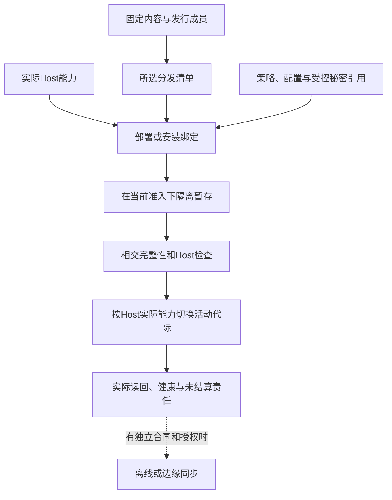
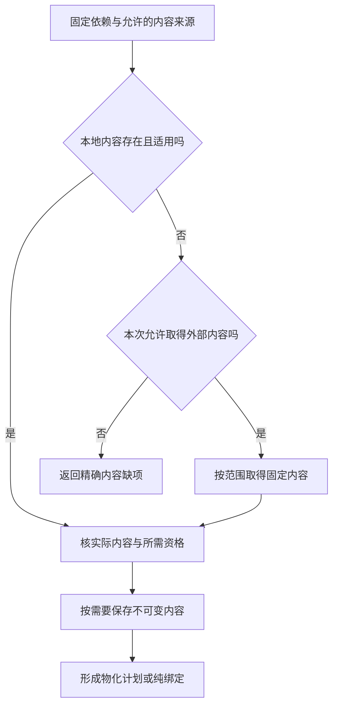
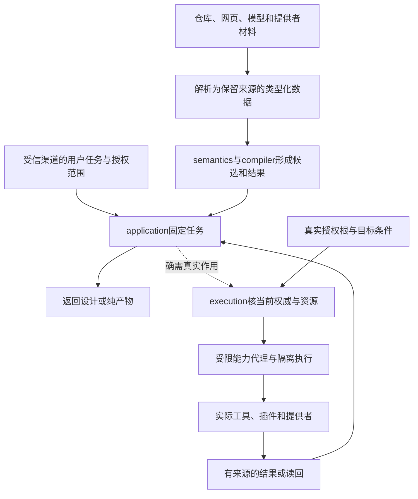

# 宿主生态与技术约束

> **阅读范围**：采用范围内的设计规范；实现状态另查未决。

<details>
<summary>本页内容</summary>

- [窄原生内核与C/Rust的条件接入合同](#窄原生内核与crust的条件接入合同)
- [成熟机制的实际复用分配](#成熟机制的实际复用分配)
- [提供者合同在组合点怎样落地](#提供者合同在组合点怎样落地)
- [Host 运行时、分发、离线与远程执行](#host-运行时分发离线与远程执行)
- [Web、浏览器、前端、样式、可访问性与运行证据](#web浏览器前端样式可访问性与运行证据)
- [云、容器、无服务器、远程执行与隔离](#云容器无服务器远程执行与隔离)
- [供应商锁定、退出、替代与业务连续性](#供应商锁定退出替代与业务连续性)
- [依赖解析、物化与垃圾回收](#依赖解析物化与垃圾回收)
- [分布式系统、一致性、复制、分区与共识边界](#分布式系统一致性复制分区与共识边界)
- [可移植、互操作、标准、协议与生态采用](#可移植互操作标准协议与生态采用)
- [可观测性、性能、容量与成本](#可观测性性能容量与成本)
- [多租户、组织、项目、工作区与数据隔离](#多租户组织项目工作区与数据隔离)
- [存储、模式、日志与缓存](#存储模式日志与缓存)
- [安全、隐私、供应链与信任](#安全隐私供应链与信任)
- [密码、密钥、秘密、身份认证与信任轮换](#密码密钥秘密身份认证与信任轮换)
- [嵌入式、实时、硬件与物理约束](#嵌入式实时硬件与物理约束)
- [数据平台、事务、模式演进、质量、血缘与治理](#数据平台事务模式演进质量血缘与治理)
- [机器学习模型、数据、评测、漂移与人工智能安全](#机器学习模型数据评测漂移与人工智能安全)
- [构建、发布制品、清单、签名与来源证明](#构建发布制品清单签名与来源证明)
- [移动、桌面、插件、扩展宿主与权限](#移动桌面插件扩展宿主与权限)
- [网络、协议、服务发现、限流、熔断与兼容](#网络协议服务发现限流熔断与兼容)
- [能源、环境、可持续性与硬件资源](#能源环境可持续性与硬件资源)
- [许可证、法规、地域、政策与外部权威](#许可证法规地域政策与外部权威)
- [固定内容与可信更新的双重边界](#固定内容与可信更新的双重边界)
- [一个提供者从声明到可用能力的接入过程](#一个提供者从声明到可用能力的接入过程)
- [首个可执行接合的成熟工具边界](#首个可执行接合的成熟工具边界)
- [提供者方法在固定装配中的采用](#提供者方法在固定装配中的采用)
- [计算开发的成熟运行与调试复用](#计算开发的成熟运行与调试复用)
- [环境与依赖的开发操作：准备可用条件，不篡改工程含义](#环境与依赖的开发操作准备可用条件不篡改工程含义)

</details>


<a id="native-kernel-boundary"></a>
<a id="窄原生内核与crust的当前接入合同"></a>

## 窄原生内核与C/Rust的条件接入合同

本节是实际选中原生内核后的条件规格，不预定下一语言。C范例用于说明定宽数值、缓冲和ABI的完整边界；Rust或其他供给按真实公开接口接入。当前TS主线、SEC核心实现和用户目标不因此迁写；没有此类消费者，不创建相应模块、编译任务或生态。

### 有限原生内核的条件范围

采用同步、无回调、无共享可变全局的有限内核；值域先包含Bool的明确0/1编码、固定宽度整数、字节/元素缓冲、长度、状态码和不透明句柄。需要数学Int或完整Text时使用实际大数/编码库或判定该目标不合格，不自动截断到C的int或Rust的usize。一个目标中的机器整数宽度、字节序、对齐、调用约定和工具标志都必须固定。

例如`max_u32`的跨边界合同可采用以下C声明；它是接口范本，不是本轮实现：

```c
uint32_t sec_max_u32(const uint32_t *data, size_t length,
                    uint32_t *out_value, uint8_t *out_present);
```

输入是U32元素序列，输出最大值和是否存在；空输入正常返回`out_present=0,out_value=0`，非空全零则返回`out_present=1,out_value=0`。状态固定为0=成功、1=可检查的必需指针为空、2=长度的字节表示溢出。先检查这些条件且失败不写输出；真实可达性/对齐/存活仍是调用方必须满足的前提，不假装全部伪造指针都能安全返回错误。其他宿主故障不伪装成此三值结果。`length=0`允许data为空且不解引用；否则输入必须在整个同步调用期间真实有效、对齐、已初始化且稳定。out指针必须真实有效可写、彼此不重叠且不别名输入；这些是ABI前提，不声称C能安全检查任意伪造地址。受管调用器在传入前验证其可知的长度/范围/别名并取得合法借用；不可信跨进程输入先解码，不能把外部整数当成可信指针。

内核不保存输入、不分配输出、不启动后台任务；扫描成功后统一写两个输出。预知失败不写输出，若宿主故障或越权代码破坏了前提，不以返回约定声称已经回滚。借用在真实调用返回后结束；强制超时无法确认停止时仍保留输入占用。这个接口只检验精度、缓冲和ABI，不引入自己的数组框架或分配器。

### 布局和资源不依赖目标默认

C提供者使用精确宽度类型可用性检查；传size_t前核宿主长度可以表示。C标准库、头文件、编译器与实际flags是构建输入，不凭后缀认定ABI。结构布局按字段、宽度、对齐和padding规定，不用`memcmp`推导业务相等，不使用未初始化padding作为输出。禁止有符号溢出、悬空借用和未经定义的指针关系作为优化捷径。

Rust提供者可导出`extern "C"`入口，边界结构按明确`repr(C)`和字段合同；普通Rust布局没有这种承诺，外层repr(C)也不改变内层默认布局。Vec/String/Result/trait对象不直接过边界，改用准确切片、状态码或拥有者句柄。资源由其实际分配者提供释放入口；不能交给另一侧任意free。panic/异常不可穿过普通ABI；unwind/abort策略固定，不能承诺abort仍可被调用方恢复。[Rust布局](https://doc.rust-lang.org/reference/type-layout.html)用于核这些前提，不据此宣布所有类型都能FFI。

异步、回调和长期缓冲按[跨实现调用N0—N8](跨实现调用与数据寿命.md#call-lifetime)接入原execution/资源机制：提交前登记；结果、未来访问关闭、在途帧和回调分别结算；输出拥有权和其释放代码保持到真正最后使用。pin不等于只读，取消不等于停止，返回结果不等于可以卸载模块。上面的无回调同步窄核仍可沿普通栈寿命使用，不被强制升级为异步框架。

### 原生源码能维护才升级为工程支持

C读取使用真实编译命令、include、宏、目标和工作目录；同一文件在不同配置下可能有不同AST，不能任选一次编译称全域覆盖。复用[Clang compilation database](https://clang.llvm.org/docs/JSONCompilationDatabase.html)获取相应输入，读取不等于执行构建。

改写按语义匹配加原文本切片，宏展开、条件编译与头文件共享分别确认写回位置；宏调用中的一次变化不能误改所有宏使用者。[Clang Transformer](https://clang.llvm.org/docs/ClangTransformerTutorial.html)提供AST约束与源码编辑结合的成熟机制，但单次重构规则不认证任意C/C++到中立源的逆向。

Rust源码维护复用其真实语法/宏/名称工具，展开后节点的来源歧义保留。只有取得普通编辑、依赖、构建、生成和再次修改的范围证据，才称Rust工程支持；能调用一个Rust二进制只记供给接入。没有当前消费者就不主动建立整套Rust后端。

## 成熟机制的实际复用分配

当前采用“先复用实现，定边界后适配，只自研独立差额”的实施原则。成熟算法的说明、实际软件包、形式定理、上游测试和本机观测是不同资产；取得一种不冒称取得其他种。下表是本设计的实际责任选择，不是实际安装或运行记录。

| 责任 | 当前默认复用 | SEC仍要实现的差额 | 允许重造的触发 |
|---|---|---|---|
| TS/JS原生读取、符号、实际类型 | 锁定API族的官方编译器/语言服务 | 受控Host读取、版本/来源与中立映射 | 所需版本无接口、无法隔离输入或有已证实不可接受成本 |
| TS目标AST、打印与检查 | 同一适配API族的factory/printer和单独请求的Program诊断 | 合法目标AST、映射、布局和真实结果归属 | 现有工具明确不支持相交目标；不因为想统一名称而重写类型检查器 |
| Java等目标编译与执行 | 所选发行版的成熟工具链 | 中立类型/效果/错误到目标的映射、参数与日志、实际产物 | 目标任务与现有工具根本不相容时重新选路线 |
| 原生安全编辑 | 支持当前语言的成熟CST、语言服务或版本化编辑能力 | 冻结前像、SEM变更到编辑的适配、保存所有权与并发检查 | 工具缺保全能力；换适配而非自动重写整门语言 |
| 版本库、依赖和常规构建 | 已有VCS、包解析器与构建器 | 真实输入输出闭包、角色、权限与结果适配 | 原工具合同不能满足需求；不自己维护第二套依赖解析真相 |
| 字节摘要、归档、基础编码 | 成熟库及其合法模式 | 选择算法/参数、输入大小与路径保护、生命周期 | 存在不可弥补接口或合规条件，不自制密码算法 |
| 需要持久化的本地操作 | 合格SQLite等实际存储提供者 | 正确事务边界、文件/远端交接、前后像与恢复 | 真实并发/部署要求超出其能力；纯预览无需启用数据库 |
| 排序、容器、专业数值、解析和数据转换 | 满足精度、输入、顺序、错误与许可范围的现有库 | 确实不同的语义、ABI、资源或目标连接；已有共同表示不重复转换 | 现有供给在本任务范围不能满足要求，且更小适配不成立；缺同名SEC封装不是重造理由 |
| 数据流/低层优化框架 | 只在选中相应目标时复用MLIR/LLVM等合格机制 | 领域语义、Pass前提和实际转换 | 首个源码后端没有需求时不引入整个低层框架 |
| 结构解释与任务投影 | 复用真实格式解码、类型/解析算法和数据结构 | 结构意图、阶段检查、任务满足、投影回写和跨资产连接；仅在选用计算文本时承担该文法解释 | JSON结构和TS语法都不自行解释产品要求；可选.sec读取器不是全工程前置 |

复用原生CST编辑或语言服务时，先确认动作覆盖域、版本化文档、权限与工作区范围，再接入同一候选流程。工具只提供字符串格式化而不保持原作者注释时，可用于明确生成物，不能用于无修改往返。官方工具返回一个建议也不成为自动应用许可。

### 版本与调用方式先确定，安装事实后取得

一个TS适配器当前至少绑定API族、实际package内容、选项、标准库声明、模块解析与Host输入。2026-09-08读取的官方Compiler API页面注明当前内容描述6.0及以前，7.1将采用不同API。故首条旧factory/Program路线绑定兼容API族；未来7.1使用单独版本适配，公共SEC模型不直接泄露旧AST类，也不把更新网页当作已安装版本。[官方说明](https://github.com/microsoft/TypeScript/wiki/Using-the-Compiler-API)。

正常过程是读取现有工具链及项目约束，优先复用已存在且合格的安装；没有则形成明确依赖选择，安装与运行另取得许可。不同API族不共享不成立的缓存或节点句柄；升级只重审相交适配与消费者。仅需语法读取时不强迫创建全Program；需要跨文件类型时不能用单文件transpile冒充。

### 复用不变成重复验证整个上游

正式采用按[剩余验证协议](保证/要求证据与裁决.md#成熟成果复用与剩余验证责任)核定：上游承担什么、使用条件是否成立、SEC修改了哪一层、还剩哪个接缝。允许把成熟库作为当前任务的明确信任基础而不是重新证明其全部内部，但不能将这种信任选择描述成形式定理或全测试覆盖。项目没有相应安全保证要求时，不默认运行上游全量测试、多个模型审查和全部故障矩阵。

接口与表示能直接满足时使用直接绑定，而不是默认先做薄包装；确有跨目标、权限、内容身份或表示差别时才增加必要适配。采用单位可以是一组共享合同的函数，类型/布局/调用转换复用一次，个别方法例外单独保留；不为每个原生函数手写同名Port。新增适配的返回、取消、错误、值域和资源要单独审查，不能因里面调用成熟函数就忽略外层。具体准入由[语义与供给分工](../作者/组合/模块封装与复用库.md#semantic-supply-boundary)拥有。

## 提供者合同在组合点怎样落地

一个提供者在单项测试中成功，不保证在当前使用点合格。绑定器提交的是所需语义、接受域、目标表示、错误/效果、资源和当前信任范围；提供者返回支持的精确合同、内容与方法版本、环境前提和可用证据，不使用自由文本`compatible=true`覆盖全部维度。

核对流程是：解析接口与版本；比较当前使用域；取得必要适配；验证适配前后行为与成本；核对外部能力和当前可用性；最后生成完整Binding。若只支持输入子域，可以形成限定绑定，不对外宣称完整替代；若任务必须覆盖更宽域，继续找实现或报告缺项。已存在正确但无优化接口的提供者可采用基线，不强迫写原生作者代码补上相同算法。

适配可能复制、转码、排队或跨进程调用，必须计入资源、失败和隐私。零复制只有布局、寿命与同步满足才成立。某接口由厂商C++或其他语言实现，不使应用作者必须维护一块原生区域；但只有接口而没有真实实现，仍然是能力缺项。

每种适配器只将相应工具事实映射为现有模型，不把宿主AST、专用数值或账号权限提升为公共语义。宿主版本升级优先检查它的相交边界与方法依赖，再扩大实际采用；不以“工具成熟”跳过新组合检查。

## Host 运行时、分发、离线与远程执行

### 1. 运行时中立核心

领域模型和纯编译器不直接依赖 Bun、Node、操作系统或云 SDK。物理能力由窄端口提供：

```text
FileSystemPort
ProcessPort
NetworkPort
ClockPort
RandomPort
SecretPort
ContentStorePort
ExecutionSandboxPort
```

### 2. Host 画像

```text
HostProfile = {
  operatingSystem,
  architecture,
  runtime,
  filesystemCapabilities,
  processCapabilities,
  sandboxCapabilities,
  networkCapabilities,
  resourceControls,
  installedToolchains
}
```

Host 画像是观测和绑定输入，不是核心编译语义。

### 3. Bun 与 Node

当前 TypeScript 实现可优先使用 Bun 作为产品运行时，但：

- 领域和应用层只依赖标准 TypeScript 和端口；
- Bun 专用 API 位于 Host Adapter；
- 需要作为 Node SDK 被其他工具导入的模块，明确声明 Node 兼容；
- 外部生态包通过兼容和契约测试决定，而不是假设全部可用；
- 原生扩展和进程行为隔离验证；
- 运行时切换只改变 Host Binding 和符合性证据。

不为了抽象而支持所有运行时，也不让 Bun 专用能力扩散到核心。

### 4. 进程执行

子进程绑定：

- 精确可执行文件和摘要；
- 参数和工作目录；
- 环境白名单；
- 标准流限制；
- 进程树；
- 超时、取消和 kill 语义；
- 资源限制；
- 沙箱；
- 退出和效果读回。

父进程退出后不得留下无归属子进程产生效果。

### 5. 文件系统差异

必须适配和测试：

- Windows 大小写、保留名、短名和文件占用；
- POSIX 权限、符号链接和原子 rename；
- 网络共享和同步盘；
- 路径长度和 Unicode；
- 不支持目录原子交换的文件系统；
- 文件锁语义；
- 崩溃后的刷盘保证。

抽象只能暴露实际能力，不能假装所有 Host 等价。

### 6. 分发制品

```text
DistributionPackage = {
  content-addressed artifacts,
  manifest,
  target host constraints,
  dependency closure,
  SBOM and licenses,
  signatures and provenance,
  configuration schema,
  migration plans,
  support and retirement
}
```

安装器使用已验证字节，不在目标机器无记录重建不同制品。

### Host、运行时和分发绑定



本图限定为已请求的安装或部署。只有Host确实提供相应原子切换时才宣称原子；否则采用明确的阶段、前像与恢复。秘密引用不等于把凭证字节写进产物。

### 7. 安装更新修复卸载

```text
Downloaded
→ Verified
→ Staged
→ PreflightPassed
→ Activated
→ ReadbackVerified
→ PreviousDraining
→ PreviousRetired
```

更新失败可回到旧活动 generation 或前滚。数据和配置迁移与程序制品分开管理。

### 8. 离线画像

离线包包含：

- 精确依赖和工具链；
- 信任根、撤销和漏洞快照；
- 模型和 Provider 能力；
- 策略和许可证；
- 有效期；
- 离线操作日志；
- 重联协调规则。

离线不意味着授权永久延长。无法确认的新高风险效果默认阻止。

### 9. 远程执行

只有在共享算力、隔离或团队协作带来真实收益时启用。协议明确：

- 候选和输入内容身份；
- 远端环境；
- 租户和权限；
- 调度和资源；
- 日志和证据；
- 取消；
- 网络分区；
- 迟到结果；
- 数据驻留；
- 结果完整性。

远程 runner 不拥有规范状态；结果进入控制面前验证摘要和适用性。

### 10. 重联

离线或分区节点重联：

```text
重新认证
→ 协调 epoch、策略、密钥和依赖
→ 查询未确认操作
→ 解决重复和冲突
→ 重新验证本地候选
→ 恢复允许能力
```

### 11. 验收

- 核心无 Bun/Node/OS 直接依赖；
- Host 能力真实而非虚构统一；
- 进程树结算；
- 文件系统故障测试；
- 安装原子切换和读回；
- 离线权限过期；
- 远程结果完整性；
- 分区和迟到结果；
- 同一制品跨环境提升；
- 卸载不删除用户工程和保留数据。

## Web、浏览器、前端、样式、可访问性与运行证据

### 1. Web 不是 TypeScript 的附属语法

HTML、模板、DOM、CSS、资源、路由、浏览器 API、可访问性和运行时渲染具有独立语义。AST、模板树、渲染 DOM 和运行时 DOM Observation 必须分开。

### 2. Web Source Program

```text
WebSourceModel = {
  documentTemplateComponentNodes,
  attributesPropertiesSlotsFragments,
  routeAndResourceBindings,
  cssRulesSelectorsSpecificityCascade,
  customPropertiesMediaContainerQueries,
  eventAndStateBindings,
  accessibilityRolesStatesLabels,
  dynamicOpaqueRegions,
  sourceSpansAndOwners
}
```

### 3. CSS

CSS 不是 key-value。selector、specificity、cascade origin/layer/order、inheritance、custom property、pseudo state、animation 和 media/container query 都可能改变结果。

### 4. Runtime Evidence

computed style、layout、paint、focus、keyboard、form、hydration、navigation 和 browser capability 通常需要真实浏览器。browser 未执行不能支持需要 browser 的 Claim。

### 5. Framework

React、Vue、Svelte、Angular、Next 等作为领域 Provider/Adapter，不能进入 Core switch。动态表达保留 unknown/opaque，不执行任意应用代码猜 DOM。

### 6. Governed mutation

rename component/prop/class/token、bind event、add accessibility contract 等通过统一 Mutation，保护人工和 vendor 区域。

### 7. 验证

服务端渲染、客户端渲染和水合；动态选择器、层叠顺序、资源地址、焦点与键盘、屏幕阅读器、浏览器版本、不适用时浏览器零成本和框架升级。

## 云、容器、无服务器、远程执行与隔离

### 1. 部署机制不是语义 authority

Kubernetes、容器、serverless、VM 和远程 worker 只是运行/物化 Provider。它们不能决定工程责任、业务成功、验证适用性和实现选择。

### 2. CloudExecutionProfile

```text
CloudExecutionProfile = exact {
  providerRegionAccount,
  computeAndIsolationModel,
  imageRuntimeAndKernelRefs,
  networkAndIdentityPolicy,
  storageAndConsistency,
  scalingAndLifecycle,
  quotasAndBilling,
  observabilityAndAudit,
  availabilityAndDisasterRecovery,
  portabilityAndExit
}
```

### 3. 容器

image identity、runtime config、container instance、volume、secret、network、runner registration 和 cache 分离。容器不是安全边界的自动证明。

### 4. Serverless

冷启动、并发模型、执行时限、重试、事件重复、临时文件、连接和 provider-specific semantics 明确进入 Target/Provider contract。

### 5. 远程执行

worker 只读取内容寻址输入并写声明输出；无仓库凭证和 ambient network。结果绑定 worker image、host capability 和 cleanup。

### 6. 可移植性

使用 capability contracts 和 adapters 隔离 Provider，但不假装所有云能力等价。退出方案包含数据、身份、网络、日志和运维迁移。

### 7. 验证

镜像漂移、容器逃逸、配额耗尽、区域故障、重试重复、无服务器执行超时、存储一致性、跨租户泄漏、远程工作节点失陷和 Provider 退出。

## 供应商锁定、退出、替代与业务连续性

### 1. 锁定是多维的

API、数据、身份、运维、人员技能、合同、成本、性能、支持和生态都可能形成锁定。使用抽象接口不等于可退出。

### 2. ExitPlan

```text
ExitPlan = exact {
  providerAndCapabilityRefs,
  dependencyAndDataInventory,
  alternativeCandidates,
  semanticAndOperationalGaps,
  exportAndMigrationMechanisms,
  credentialAndIdentityTransition,
  serviceContinuityAndDualRun,
  costTimeAndRiskEnvelope,
  triggerAndDecisionAuthority,
  verificationAndRetirement
}
```

### 3. Provider disappearance

服务终止、价格变化、许可变化、安全事件、地区不可用和账号封禁都是触发器。关键能力必须有数据备份、替代机制或明确接受的单点风险。

### 4. 抽象边界

只抽象真实需要替换的 capability。过早统一所有 Provider 会损失特有能力和增加最低公分母成本；完全无边界会使退出不可能。

### 5. 业务连续性

退出期间需要双运行、数据同步、流量切换、错误处理、回滚和用户沟通。兼容层有明确结束时间。

### 6. 验证

离线导出、替代 Provider、凭证撤销、大规模数据迁移、语义不匹配、混合运行、性能或成本回归、退出期间 Provider 不可用和旧集成退役。

## 依赖解析、物化与垃圾回收

### 1. 对象分离

依赖管理至少区分：

```text
DependencyRequirement
DependencyCandidate
ResolutionDecision
LockedDependency
Artifact
Materialization
ActiveBinding
UsageLease
GarbageCollectionDecision
```

名称、版本范围、下载结果、解压目录和当前活动依赖不是同一个对象。

### 2. 需求和候选

```ts
interface DependencyRequirement {
  readonly requirementId: RequirementId;
  readonly ecosystem: EcosystemId;
  readonly packageIdentity: PackageIdentity;
  readonly versionConstraint: VersionConstraint;
  readonly requiredCapabilities: readonly CapabilityRef[];
  readonly targetProfiles: readonly TargetProfileRef[];
  readonly licensePolicy: PolicyRef;
  readonly trustPolicy: PolicyRef;
  readonly optional: boolean;
}
```

候选包含来源、版本、制品摘要、签名、许可证、平台、传递依赖和撤销状态。注册表标签和版本字符串不能代替内容身份。

### 3. 解析

解析先应用硬条件：

- 版本范围；
- 目标平台和 Runtime；
- 能力和 ABI；
- 许可证；
- 安全和信任；
- 撤销与漏洞策略；
- 离线可用性；
- 组织允许来源；
- 依赖图一致性。

再对合格候选比较更新成本、兼容、体积、性能、维护和退出成本。

解析结果必须可复现：

```text
ResolutionKey = digest(
  requirements,
  indexes and registry snapshots,
  policy revisions,
  target profile,
  existing lock state,
  resolver revision
)
```

### 4. 锁定

`LockedDependency` 记录：

- 规范包 identity；
- 精确版本；
- 内容摘要；
- 来源 URI 与 registry snapshot；
- 签名和证明引用；
- 许可证结论；
- 传递依赖边；
- 解析器和策略 revision；
- 允许的平台与能力范围。

锁文件是解析决定的序列化，不是唯一事实。下载字节必须再次核对摘要。

### 5. 制品获取



取得内容、将内容放到执行环境、运行代码是三个动作。签名、许可证和检查按真实政策与来源风险应用；有内容摘要不自动得到可信性，形成计划也不表示已经安装或执行。
下载、解压和安装属于受准入效果。网络响应成功不能替代最终制品摘要和物化读回。

### 6. 不可变内容库

内容库以摘要寻址并禁止原地修改。对象元数据记录：

- 字节长度和分块摘要；
- 来源和首次观察；
- 签名、SBOM 和许可证；
- 扫描结果与适用范围；
- 引用者；
- 租约和保留；
- 加密和数据分类；
- 损坏和撤销状态。

同一字节可以共享；不同租户是否可共享由安全、许可证和隐私策略决定。

### 7. 物化

```ts
interface MaterializationPlan {
  readonly lockedGraph: LockedGraphRef;
  readonly targetHost: HostProfileRef;
  readonly layoutPolicy: LayoutPolicyRef;
  readonly isolationRoot: PathCapabilityRef;
  readonly expectedBytes: ByteCount;
  readonly fileCountCeiling: Count;
  readonly verificationSteps: readonly VerificationActionRef[];
}
```

物化产生新的物理视图，不改变制品身份。它必须处理：

- 文件名和路径限制；
- 大小写冲突；
- 符号链接和目录穿越；
- 可执行位和权限；
- 压缩炸弹；
- 磁盘不足；
- 并发物化；
- 中断和恢复；
- 防病毒或文件占用；
- 原生二进制平台匹配。

共享物化代际的身份由实际制品闭包、物化算法及其会改变结果的语义参数决定。attempt、时间戳、工作区、分支、projection/cache 路径、消费顺序和 provenance receipt 都不进入该代际键；它们保留为本次操作或来源事实。需求绑定仍属于具体工程与环境，不能因两个绑定复用同一字节代际就合并它们的 owner、requirement、manifest 或 provenance。

消费者按真实写入和重定位合同选择访问方式：可直接读取不可变位置时使用 direct read；Provider 给出可认证且寿命充分的 immutable locator 时可直接绑定；消费者需要私有可写视图时使用 copy-on-write projection；会改写、重排或执行不受信步骤时使用 isolated materialization。能力不足必须返回不支持，不能在这些方式之间隐式 fallback。

### 8. 活动绑定

```text
ActiveBinding =
  project/environment scope
+ locked graph revision
+ materialization ref
+ runtime/toolchain profile
+ activation epoch
```

切换采用新 generation 暂存、验证和原子活动指针更新。不能在共享目录中逐文件覆盖并假设消费者不会观察中间态。

只要真实消费者仍通过 pathname 使用某个 generation，持久 UsageLease 就必须覆盖 locator 发布、消费者取得、实际执行、最终读回和 projection 退役。不能先释放 generation 再向调用方传递裸路径，也不能用进程是否仍存活或事后的 drift check 代替跨进程路径寿命保证。

publisher、consumer admission 与垃圾回收消费同一协调互斥域和 durable hold set。发布完成但调用方尚未取得、消费者崩溃后待恢复、验证或可复现性仍需旧代际时，各自 hold 继续存在；释放必须绑定原 owner 和 fencing。相同 generation identity 若观察到不同 manifest、Merkle 根或实际字节，候选进入 quarantine 并报告 Provider nondeterminism 或 generation conflict，不能覆盖已有代际。

### 9. 缓存与离线镜像

离线包或镜像必须携带：

- 完整锁图；
- 所有制品字节；
- registry 和信任元数据快照；
- 签名、透明日志证明和撤销信息；
- 许可证和 SBOM；
- 适用 Host 范围；
- 创建时间和过期策略。

离线使用不能把陈旧安全元数据自动视为最新。超出允许陈旧窗口时，系统明确降级、阻断或要求有权风险决定。

### 10. 更新和漂移

依赖更新是新候选解析，不是原地改变旧绑定：

```text
new index observation
→ candidate closure
→ hard eligibility
→ resolution decision
→ locked graph
→ materialize
→ conformance and regression
→ bounded cutover
→ old binding drain
```

运行中发现物化字节与锁定摘要不一致时，立即隔离，并使使用该制品产生的候选和证据进入陈旧或不可信状态。

### 11. 垃圾回收

可删除条件不是“最近没访问”，而是：

```text
GCEligible(artifact) =
  no active binding
∧ no execution lease
∧ no recovery dependency
∧ no verification or release retention
∧ no legal hold
∧ no offline package reference
∧ retention window expired
∧ not required to interpret supported history
```

垃圾回收分为标记、计划、准入、删除和读回。删除失败或部分完成保留显式状态。

标记从 typed roots 出发：活动绑定、durable consumer、未完成恢复、验证/发布保留、法律保留、离线包与历史解释分别说明为什么仍可达。进程退出、缓存压力或普通访问时间不能清除这些根。标记完成后到物理删除前，GC 必须在同一协调域复核 hold-set 的比较交换条件与物理围栏；期间出现新 hold、代际变化或身份不一致即放弃本次删除。这样 mark-and-sweep 的快照不会与新消费者取得路径发生竞态。

### 12. 恢复与历史解释

旧工程 revision、验证证据或发布制品可能需要旧依赖解释器。系统可以保留：

- 旧字节；
- 旧锁图；
- 兼容解释器；
- 迁移器；
- 只读容器镜像。

但不得因此维持旧依赖的新执行权限。历史可解释性与活动可用性分离。

### 13. 安全和供应链事件

发现恶意或撤销制品时：

1. 阻止新解析和新绑定；
2. 定位活动绑定和派生制品；
3. 停止或隔离高风险执行；
4. 撤销相关证据和资格；
5. 轮换可能泄露的秘密；
6. 选择修复、替代或移除候选；
7. 重新构建和验证；
8. 清理被污染的物化与缓存；
9. 保留事件证据。

### 14. 并发和故障测试

- 两个进程同时下载同一摘要；
- 下载完成但元数据提交失败；
- 制品写入后进程崩溃；
- 解压中磁盘耗尽；
- Windows 文件占用阻止切换；
- 旧活动绑定在新指针切换后继续运行；
- 垃圾回收与新租约竞态；
- 发布 locator 后、真实 pathname consumer 取得前发生租约释放；
- 同一 generation identity 产生不同 manifest 或 Merkle 根；
- GC 标记后新增 durable hold，旧删除计划必须被 CAS 拒绝；
- registry 标签被重写；
- 离线镜像信任元数据过期；
- 恢复旧备份后已撤销制品重新出现；
- 同摘要对象出现字节损坏；
- 跨租户共享泄露私有依赖。

### 15. 验收条件

- 需求、解析、锁定、制品、物化和绑定分离；
- 所有活动依赖可追溯到字节摘要和来源；
- 解析可复现或明确记录不可重现输入；
- 物化无路径逃逸和中间态泄漏；
- 更新不原地篡改旧 generation；
- 离线包可独立验证；
- 撤销能传播到活动绑定和证据；
- 垃圾回收不会删除恢复和历史解释依赖；
- generation identity 不受 attempt、workspace 或 projection 路径污染，需求绑定也不被共享字节合并；
- consumer 的 durable hold 覆盖其真实 pathname 使用和最终读回；
- generation conflict 被隔离，GC 与新 hold 的竞态由共同协调域和 CAS 阻断；
- 删除经过准入和读回；
- 并发、崩溃和空间耗尽路径可恢复。

## 分布式系统、一致性、复制、分区与共识边界

### 1. 分布式不是“多进程”

节点具有独立故障、网络不可靠、时钟不一致、状态复制和部分可见。任何全局状态都必须说明一致性模型和权威线性化点。

### 2. 核心对象

```text
DistributedProfile = exact {
  nodeAndFailureDomainRefs,
  communicationAndDeliveryContracts,
  consistencyAndReplicationModel,
  leaderOrAuthorityProtocol,
  membershipAndEpoch,
  partitionAndDegradedBehavior,
  stateTransferAndRecovery,
  resourceAndBackpressure,
  observabilityAndEvidence
}
```

### 3. 一致性选择

线性一致、因果一致、快照隔离、最终一致和 CRDT 等各有前提、代价和适用操作。不能把“最终会一致”作为所有业务的默认答案。

### 4. 共识边界

只对需要全序、唯一 leader、配置成员或不可分决定的最小状态使用共识。大对象、缓存、日志和可派生投影不应全部塞入共识路径。

### 5. Epoch 与 fencing

leader、lease、membership 和 configuration 有 epoch；旧 leader 晚到必须被 fencing 拒绝。墙钟 TTL 不能单独保证唯一写者。

### 6. 分区

每个 operation 明确在分区时选择：拒绝、只读、局部接受、排队、降级或冲突记录。选择由业务 invariant 决定，不由基础设施默认。

### 7. 验证

网络分区、消息重复/乱序、leader change、split brain、clock skew、state transfer、snapshot corruption、backpressure、滚动升级和跨区灾难。

## 可移植、互操作、标准、协议与生态采用

### 1. 通用不等于最低公分母

SEC 保留共享语义，同时允许 Target/Provider 特有能力。可移植性必须声明在哪些能力和环境之间成立。

### 2. PortabilityProfile

```text
PortabilityProfile = exact {
  sourceAndTargetEnvironmentCells,
  requiredCommonSemantics,
  allowedAdaptersAndRuntimeSupport,
  unsupportedOrDegradedFeatures,
  dataProtocolAndIdentityMappings,
  conformanceEvidence,
  migrationAndExitCost
}
```

### 3. 标准采用

先拆能力和真实 consumer，再评估标准/实现的语义、版本、互操作、许可、安全、维护和退出。标准存在不等于所有实现兼容。

### 4. 互操作

协议双方需要 schema、语义、错误、顺序、权限、数据和版本兼容。能解析消息不代表理解相同业务含义。

### 5. Adapter

Adapter 只做边界转换，不拥有目标语义和全局 fallback。信息损失、默认值和 unsupported 明确可见。

### 6. 验证

多个独立实现的符合性、往返一致性、未知字段、版本协商、错误映射、大规模与边界情景、安全、性能和混合版本部署。

## 可观测性、性能、容量与成本

### 1. 可观测性不是日志堆积

遥测用于回答工程操作、编译阶段、效果、资源、验证和用户结果是否符合声明。每个事件和指标有 Schema、单位、维度、采样、保留和 owner。

### 2. 关联身份

```text
RequestRef
ApplicationOperationRef
CompileRef
ActionKey
PlanRef
ExecutionRef
AttemptRef
ProviderOperationRef
VerificationSessionRef
EvidenceRef
ReleaseRef
```

不同身份不能用一个 trace ID 替代，但可在同一链中关联。

### 3. 事件

结构化事件至少记录：时间来源、主体、状态转换、输入/输出摘要、资源、错误码和覆盖。正文、源码和秘密默认不进入遥测。

### 4. 指标

关键指标：

- 观测文件和字节；
- 各 pass 时延；
- cache hit/miss 和原因；
- 反向失效闭包大小；
- clean/incremental 差异；
- 候选数和求解状态；
- 编译成功、未知和不满足；
- Provider 错误与不确定完成；
- 事务恢复；
- 验证选择、复用和 Flake；
- 资源当前、峰值、泄漏；
- 用户等待和人工批准。

### 5. 遥测覆盖

```text
TelemetryValue
+ Coverage
+ Freshness
+ Sampling
+ PipelineHealth
```

缺数据不等于零错误。关键读回和审计需要独立通道。

### 6. 性能基准

基准按工作负载画像：

- 小型单包；
- 中型多包；
- 超大单仓；
- 多语言；
- 高生成代码；
- 冷缓存；
- 热增量；
- 大候选空间；
- 故障恢复；
- 低资源设备。

记录硬件、运行时、工具链、数据集和统计方法。

### 7. 延迟分解

端到端墙钟时延使用同一计时域中的完成时刻减接收时刻；图中并行阶段按关键路径分析。阶段工作量求和、CPU 时间和墙钟时延分别报告，嵌套 span 不能重复相加。只有确认全部阶段严格串行且互不重叠时，阶段和才等于总时延。计量合同见[质量属性与工程场景](../产品/术语与质量属性.md#3-性能模型)。

平均值不足，至少观察 p50、p95、p99、尾部原因和取消比例。

### 8. 容量

容量模型基于：

- 文件、符号、关系和候选规模；
- 变化率；
- 并发操作；
- 缓存工作集；
- Provider 配额；
- 验证矩阵；
- 恢复冗余；
- 多租户或离线画像。

用测量校准，不凭空设精确阈值。

### 9. 成本

成本归因到操作、项目、Provider 和阶段。包括计算、存储、网络、模型调用、外部服务、人工审查和恢复。成本优化不能折价正确性、安全和隐私硬约束。

### 10. 性能回归

回归门绑定基准数据集、噪声模型、置信区间和实际影响。单次波动不自动阻止；稳定尾延迟或资源增长需要根因和预算决定。

### 11. 剖析

支持：

- pass 级 CPU 和墙钟；
- 内存分配和保留；
- I/O 和子进程；
- 依赖图热点；
- 无效失效；
- 缓存序列化；
- Provider 等待；
- 测试选择和环境启动。

剖析数据也受隐私和租户边界。

### 12. 验收

- 关键状态转换可关联；
- 遥测缺失可见；
- 性能基准可复现；
- 冷/热和 clean/incremental 分开；
- 容量保留恢复余量；
- 成本有单位和来源；
- 高基数受控但不丢关键身份；
- 性能优化通过语义和故障回归；
- 运行目标绑定具体画像。

## 多租户、组织、项目、工作区与数据隔离

### 1. 多租户是部署画像，不污染核心

本地单人 SEC 不承担多租户成本；云画像激活组织、成员、项目、租户隔离、计量和审计领域。

### 2. 业务对象

```text
Organization
Membership
RoleAssignment
Project
Workspace
RepositoryBinding
Environment
ServicePrincipal
ProviderConnection
```

它们有独立 identity、ownership、transfer、suspension、deletion 和 audit。

### 3. 隔离维度

数据、缓存、索引、消息、文件、进程、网络、secret、模型上下文、Evidence、日志和资源配额分别隔离。仅在数据库行加 `tenant_id` 不足。

### 4. 权限

组织管理员、项目 owner、开发者、reviewer、operator、billing 和 service principal 分离。管理员物理能力不能自动取得语义和数据授权。

### 5. 生命周期

用户离开、项目转移、组织冻结和删除时，候选、批准、凭证、证据、数据、备份和外部 Provider binding 有明确处理。

### 6. Noisy neighbor

共享资源使用 per-tenant quota、fairness、rate limit、cost attribution 和 blast-radius cell。一个租户不能耗尽恢复资源。

### 7. 验证

跨租户缓存、索引、消息和模型上下文；不安全的直接对象引用；角色变化、成员移除、项目转移、备份恢复、共享 Provider 凭证和配额绕过。

## 存储、模式、日志与缓存

### 1. 数据分类

```text
CanonicalDefinition   规范定义
CurrentState          当前权威状态
ImmutableContent      内容寻址对象
Journal               效果准备与恢复历史
Evidence               验证与保证制品
DerivedIndex           可重建索引
Cache                  可丢弃加速结果
Telemetry              运行观测
Secret                 受专门保护材料
```

不同数据具有不同一致性、保留、删除和恢复要求，不能全部放入一个事件日志或 JSON 目录。

### 2. 存储端口

```ts
interface ContentStorePort { put(bytes: Uint8Array): ContentRef; get(ref: ContentRef): Uint8Array; }
interface StateStorePort { compareAndSwap(key: StateKey, expected: RevisionRef, next: StateValue): Outcome<RevisionRef>; }
interface JournalPort { append(record: JournalRecord): Outcome<JournalOffset>; read(stream: StreamRef): readonly JournalRecord[]; }
interface CachePort { get(key: ActionKey): CacheEntry | undefined; put(entry: CacheEntry): Outcome<void>; }
```

领域层依赖语义端口，不依赖数据库 SDK。

### 3. 模式演进

对需要滚动共存和有状态数据迁移的场景，可采用：

```text
expand → backfill → verify → switch-read → switch-write
       → observe → consumer-zero → contract
```

这不是所有变更的必经链。可丢弃缓存可按兼容规则重建；没有并存读写者且有原子迁移/恢复保证的小型状态变更可直接切换。是否双读、双写或分批搬迁取决于真实消费者与不变量；启用的每个阶段必须有 revision、检查点、恢复和退出证据。永久竞争双写不是完成状态。

### 4. 未知字段

持久对象携带 schema revision。兼容读取保留未知字段，避免旧写者删除新数据。封闭代数遇到未知 variant 返回不支持，不能按默认分支解释。

### 5. Journal

Journal 只用于需要持久准备、因果审计和崩溃恢复的操作。它不是所有领域当前状态的唯一真值。记录必须：

- 追加或具有防篡改保护；
- 绑定操作和前像；
- 可幂等重放；
- 有完整性摘要；
- 与当前目标读回协调；
- 支持隐私和保留策略。

### 6. 缓存

缓存键、依赖证据与实时资格沿用[可达输入闭包与负依赖](../编译/查询增量与性能.md#可达输入声明依赖证据与负依赖)。只有实际改变计算结果的租户/权限/策略/数据语义进入键；隔离域、访问控制、撤销和有效期单独检查。缓存值带 Schema、来源、有效条件和摘要；丢弃缓存不应丢失唯一权威事实或恢复材料。

### 7. 查询与索引

索引和物化视图只加速权威数据。查询结果绑定快照、过滤、排序、分页游标和权限。稳定分页使用不可变快照或明确一致性级别。

### 8. 删除与恢复

删除产生墓碑并传播到缓存、索引、备份恢复和离线同步。备份恢复先应用删除知识。秘密和隐私数据的备份保留、加密和销毁单独治理。

### 9. 备份

定义：

- 备份对象和排除项；
- 一致性点；
- 加密和密钥；
- RPO/RTO；
- 恢复顺序；
- 完整性检查；
- 定期演练；
- 旧 schema 迁移；
- 恢复后的证据重建。

### 10. 验收

- Canonical/Current/Journal/Cache 分离；
- CAS 防丢失更新；
- schema 双版本测试；
- migration 可恢复；
- 未知字段往返；
- 缓存权限隔离；
- Journal 重放幂等；
- 墓碑防复活；
- 备份恢复演练；
- 损坏检测和隔离。

## 安全、隐私、供应链与信任

### 1. 保护对象

SEC 处理源码、工程意图、凭证、模型上下文、执行能力、制品、验证证据和发布权限。安全设计覆盖输入、编译、扩展、执行、存储、供应链、恢复和界面。

### 2. 威胁主体

- 恶意项目源码和构建脚本；
- 被污染依赖、插件、模型或 Provider；
- 越权用户或 Agent；
- 跨租户攻击者；
- 失陷 Host 或 runner；
- 供应商账号和更新渠道；
- 错误配置和内部误操作；
- 响应丢失、重放和旧凭证。

### 3. 信任区域

```text
UntrustedInput
SandboxedProvider
ApplicationControl
TrustedKernel
EvidenceVerifier
SecretStore
PromotionAuthority
```

跨区接口最小、类型化、带能力句柄和审计。

### 4. 源码与提示注入

仓库文件、注释、README、测试数据和外部网页都是数据，不因包含命令而成为系统指令。AI 工具调用由独立策略和 Schema 决定。

### 5. 秘密

秘密使用引用而非明文传播：

- 最小作用域；
- 短期凭证；
- 运行时注入；
- 不进入 IR、日志和缓存；
- 使用审计；
- 轮换、撤销和泄露响应；
- 离线节点的过期策略。

### 6. 供应链

按本次依赖/工具/插件/模型/制品所承诺的支持与安全范围，取得适用的材料并记录缺项：

- 来源；
- 内容摘要；
- 签名或证明；
- 许可证；
- SBOM；
- 漏洞状态；
- 构建来源；
- 维护状态；
- 撤销和替代。

版本标签不能替代内容身份。纯本地自建模块不因此被要求存在外部签名、SBOM服务或维护评级；这些材料缺少时限制依赖它的声明，不默认禁止无相交风险的设计和生成。

### 7. 构建可信

从冻结源码和工具链生成内容寻址制品。验证后在环境间提升同一字节。构建服务本身有身份、隔离、日志和证明。

### 信任边界



Schema合格只形成可解释数据，不把材料提升成命令或授权。compiler不直接推进权威头和Journal；真实写入由execution及对应提交所有者完成，返回内容仍按来源与披露范围处理。

### 8. 隔离

单用户宿主在真实受保护边界提供明确安全上下文，内部纯函数不为“未来多租户”逐层传递庞大信封。多租户画像的存储、缓存、索引、消息、遥测和模型上下文闭合其访问与披露范围；共享计算不得合并不同请求的授权，沿[共享计算的隔离](../编译/查询增量与性能.md#共享计算的隔离与派生数据)。

### 9. 审计

审计事件具有：主体、操作、权限链、目标、前像、效果、结果、读回、时间来源和完整性。审计不保存不必要秘密；高价值日志发送到独立受保护存储。

### 10. 漏洞响应

```text
发现
→ 确认和范围
→ 遏制
→ 撤销能力和证据
→ 修复候选
→ 独立验证
→ 发布与轮换
→ 可信重建
→ 复盘和控制更新
```

紧急修复可缩短流程，但不能跳过身份、权限、最小验证、读回和后续完整审计。

### 11. 验收

- 威胁模型对应实际部署；
- 最小权限和沙箱负向测试；
- 跨租户测试；
- Prompt 注入和数据外泄对抗；
- 依赖摘要、签名和 SBOM；
- 秘密扫描和轮换演练；
- 审计防篡改；
- 供应链撤销传播；
- 失陷环境可信重建；
- 安全事件不使用同一可疑证据自证。

## 密码、密钥、秘密、身份认证与信任轮换

### 1. 密码机制服务于具体 Claim

哈希、签名、加密、MAC、证书和硬件密钥证明的性质不同。使用“已加密”不能说明身份、完整性、机密性、前向安全和授权全部成立。

### 2. CryptoProfile

```text
CryptoProfile = exact {
  protectedSubjectAndThreatModel,
  algorithmAndParameterRefs,
  keyTypeAndUsage,
  keyGenerationStorageAndCustody,
  identityAndCertificateBinding,
  rotationRevocationAndExpiry,
  protocolAndNonceRequirements,
  migrationAndAlgorithmAgility,
  verificationAndAudit
}
```

### 3. 身份认证与授权

认证证明 principal identity；授权决定其可执行操作。session、token、device、service account 和 human identity 分离。

### 4. 轮换

新旧 trust roots 并存需要有界 window、双验证或 cross-sign、consumer migration、revocation、cache/session refresh 和 readback。旧根不能因新根存在自动退役。

### 5. 加密敏捷性

算法和参数可能退役。协议保留 version/negotiation，但防 downgrade；持久数据迁移和历史签名验证需要独立策略。

### 6. 验证

随机数重复、弱随机源、密钥用途错误、过期证书缓存、撤销延迟、算法降级、密钥备份不可用、跨租户秘密、轮换竞态和旧制品验证。

## 嵌入式、实时、硬件与物理约束

### 1. 物理世界改变工程边界

实时系统受 deadline、jitter、memory、power、温度、传感器、执行器、总线、故障模式和认证约束。通用软件假设不能直接外推。

### 2. TargetProfile

```text
EmbeddedTargetProfile = exact {
  cpuArchitectureAndFeatures,
  memoryAndStorageLimits,
  schedulerAndTimingModel,
  interruptAndConcurrencyRules,
  ioBusAndPeripheralCapabilities,
  powerThermalEnvironmentalEnvelope,
  bootUpdateAndRecovery,
  safetySecurityAndCertification,
  toolchainAndBinaryFormat,
  observabilityLimits
}
```

### 3. 实时 Claim

deadline、WCET、jitter 和 response time 需要 owning hardware、scheduler 和 workload Evidence。平均时间不能证明硬实时。

### 4. 资源

静态内存、栈、堆、DMA、句柄、能量和带宽使用不同核算模型。动态分配和 GC 可能在某些 profile 禁止。

### 5. 安全

传感器错误、执行器失效、单点故障、失效安全、冗余、watchdog 和安全状态进入 Hazard/Safety Case。

### 6. 更新

固件 A/B、bootloader、签名、防回滚、断电恢复、兼容和设备 fleet rollout。更新失败不能使设备不可恢复。

### 7. 验证

HIL/SIL、真实设备、极端温度/电源、时钟漂移、总线错误、memory corruption、deadline miss、interrupt storm、断电升级和 old bootloader。

### 8. 无实机证据时仍可实施的设计

先固定控制器输入单位、采样来源、年龄上限、输出安全状态、时钟域和调度假设。连续模型到采样实现的转换须记录采样周期、量化、延迟、执行器保持行为和允许误差；没有这些条件不能把连续安全声明直接给离散代码。控制算法、硬件适配、运行监控和发布资格分别拥有接口。

无实机时实现离线算法和软件在环任务：边界值、陈旧/丢失/乱序采样、数值溢出、迟滞、执行器失联和不满足包络时的输出。硬件在环任务再绑定设备、固件、负载、中断、电源、温度和观测精度；实验本身必须隔离危险输出。达不到最坏响应预算时改调度、降低功能、使用专用控制器或拒绝危险运行，不用平均延迟证明硬实时。

SEC可生成制品和验证/部署计划，不能把其通用编排进程假定为硬实时控制回路。采样阈值等离线算法的性质，不包含目标设备的时序、故障和安全资格；可以先设计算法与验证路线，但不能据此直接驱动真实设备。

## 数据平台、事务、模式演进、质量、血缘与治理

### 1. 数据是工程语义的一部分

数据库表、事件、特征、索引、缓存和数据产品有 identity、owner、schema、质量、权限、生命周期和消费者，不能只作为实现细节。

### 2. DataAsset

```text
DataAsset = exact {
  semanticIdentity,
  physicalBindings,
  schemaAndSemanticRevision,
  ownerAndSteward,
  producerConsumerLineage,
  qualityAndFreshnessClaims,
  privacySecurityAndResidency,
  retentionDeletionAndLegalHold,
  compatibilityAndMigration,
  observabilityAndIncidentRefs
}
```

### 3. 事务与一致性

每个业务 invariant 绑定实际事务边界、隔离级别和外部 Effect。数据库事务不能覆盖消息和远程 API，需要 outbox、saga 或 reconciliation。

### 4. 模式演进

```text
expand
→ backfill
→ verify
→ switch-read
→ switch-write
→ observe
→ contract
```

每步有版本、兼容、回滚、资源和读回。双写只在有界窗口和一致性证明下使用。

### 5. 数据质量

完整性、正确性、唯一性、一致性、及时性、代表性和偏差分别建模。质量规则有总体、窗口、阈值、抽样和 owner；未观测不能写成零错误。

### 6. 血缘

记录 source、transform、environment、code/data/model revision 和 output。字段级 lineage 只在真实影响/合规消费者需要时物化。

### 7. 验证

模式漂移、部分回填、双写分叉、变更数据捕获缺口、迟到事件、重复键、隐私删除、备份复活、质量监控失败和消费者迁移漏计。

## 机器学习模型、数据、评测、漂移与人工智能安全

### 1. 模型输出是候选，不是事实

模型可能随机、偏差、幻觉、被注入、数据过期和分布外失败。SEC 只把模型作为受约束 Provider，其输出进入 proposal/inference，不能自动取得 authority。

### 2. ModelBinding

```text
ModelBinding = exact {
  modelAndProviderIdentity,
  versionOrContentRef,
  taskAndCapabilityProfile,
  promptAndToolContract,
  contextAndDataPolicy,
  evaluationAndSafetyEvidence,
  costLatencyResourceEnvelope,
  knownLimitationsAndUnsupportedDomains,
  driftMonitoring,
  fallbackAndRetirement
}
```

### 3. 数据

训练、微调、检索、评测和运行数据有来源、许可、隐私、质量、代表性、时间和删除义务。模型版本号不能代替数据/行为闭包。

### 4. 评测

benchmark、golden、adversarial、tool-use、long-context、cross-domain 和真实任务分别。防止 contamination、overfitting、grader bias 和代理指标。

### 5. 漂移

Provider 更新、模型别名、系统提示、工具、数据和政策变化都可改变行为。旧 Evidence 绑定 exact closure，漂移后降级。

### 6. 安全

prompt injection、data exfiltration、tool misuse、jailbreak、indirect injection、model inversion、unsafe autonomy 和 human overreliance。物理工具权限由外部 broker 控制。

### 7. 验证

同输入非确定性、Provider 别名漂移、上下文截断、检索投毒、秘密泄露、评分器共享同一模型、分布漂移、回退到更弱模型和撤销。

## 构建、发布制品、清单、签名与来源证明

### 1. 源码验证不等于制品验证

Release 必须从 exact clean source tree、toolchain、dependency 和 profile 构建 immutable artifact，并在仓库外 clean 环境安装和运行。

### 2. ReleaseSnapshot

```text
ReleaseSnapshot = exact {
  repositoryAndTree,
  buildPlanAndToolchain,
  inputClosure,
  artifactAndPackageDigests,
  fileInventoryAndModes,
  runtimeAssetInventory,
  dependencyLockAndSbom,
  provenanceAndAttestation,
  signatureAndIssuer,
  cleanInstallAndSmokeEvidence,
  promotionDecisionRef
}
```

### 3. Staged build

build 在隔离 root 完成；失败不覆盖 accepted artifact。package 使用 allowlist，排除源码外私有状态、证据、临时文件和秘密。

### 4. Reproducibility

同输入生成 byte-equivalent 或明确允许的非确定字段。签名通常在可复现 artifact 后产生，签名差异不应掩盖内容差异。

### 5. SBOM/Provenance

SBOM、license、build provenance 和 artifact manifest 来自同一 staged generation。它们支持供应链 Claim，不证明功能正确。

### 6. Promotion

发布/部署只消费 immutable artifact identity 和 required Evidence。Git tag、版本号、上传成功和 workflow 名称不能自动 promotion。

### 7. 验证

脏工作树或未跟踪源码、未声明运行依赖、资源缺失、归档路径穿越、干净安装、不同工作目录、Windows 与 POSIX 启动器、重复构建等价、签名不匹配，以及失败构建保留旧制品。

## 移动、桌面、插件、扩展宿主与权限

### 1. 平台能力差异

移动和桌面系统在文件、进程、后台执行、网络、通知、设备、签名、沙箱、商店和更新上有不同约束。Web、Node 或容器成功不能替代原生平台 Evidence。

### 2. HostExtensionProfile

```text
HostExtensionProfile = exact {
  platformAndVersion,
  packageAndSignatureModel,
  sandboxAndEntitlements,
  lifecycleAndBackgroundLimits,
  filesystemAndDataContainers,
  networkAndDeviceCapabilities,
  updateAndRollback,
  interProcessOrExtensionProtocol,
  userConsentAndPrivacy,
  supportAndDistribution
}
```

### 3. 插件边界

插件注册能力和接口，不获得宿主内部状态、用户数据或全局写权。每个调用经 capability token、scope、resource、deadline 和 output validation。

### 4. 更新

商店、自动更新和企业分发是不同 Provider。签名、版本、rollout、rollback、数据迁移和旧插件兼容需独立验证。

### 5. 桌面自更新

更新程序本身处于高权限和不可逆路径，需要 staging、签名、原子切换、恢复和旧版本退役，不能覆盖运行中的二进制后假设成功。

### 6. 验证

entitlement 缺失、后台被杀、文件权限、OS upgrade、plugin crash、sandbox escape、signature revoke、store delay、offline update 和 user consent。

## 网络、协议、服务发现、限流、熔断与兼容

### 1. 网络失败不是一个异常

DNS、连接、TLS、认证、代理、路由、超时、半开、丢包、乱序、重复、截断、服务端提交和客户端确认分别建模。

### 2. ProtocolContract

```text
ProtocolContract = exact {
  endpointAndPrincipal,
  transportAndSecurity,
  messageSchemaAndSemanticVersion,
  requestResponseStreamSemantics,
  idempotencyAndOrdering,
  timeoutDeadlineAndCancellation,
  retryAndBackoff,
  rateLimitAndQuota,
  errorAndPartialResult,
  compatibilityAndDeprecation,
  observabilityAndReadback
}
```

### 3. 服务发现

发现结果有来源、TTL、健康、区域、版本和权威。first-found 不能替代 capability/eligibility resolution；stale endpoint 不应无限缓存。

### 4. 限流

客户端和服务端 rate limit 分离；retry 必须尊重 Retry-After 和 parent budget。token bucket 等补充资源使用 ReplenishingRate 语义。

### 5. 熔断

熔断防止故障放大，但会产生新的降级状态和恢复探测。不能把 open circuit 当业务失败，也不能让所有租户共享一个错误熔断域。

### 6. 兼容

协议字段兼容不等于业务语义兼容。未知字段、枚举、错误、流控制和版本协商必须有明确策略。

### 7. 验证

域名解析漂移、传输层安全证书轮换、代理、半开连接、响应截断、服务端已提交但客户端超时、重试风暴、限流窗口重置、协议模式变化、回退端点和熔断器振荡。

## 能源、环境、可持续性与硬件资源

### 1. 资源优化不能只看计算账单

能耗、碳、散热、硬件寿命、水、网络和供应链是可选但真实的工程约束。只有产品、法域或组织目标激活时进入 ApplicableClosure。

### 2. SustainabilityClaim

```text
SustainabilityClaim = exact {
  workloadAndOutcome,
  environmentAndHardware,
  energyAndResourceMeasurements,
  temporalAndGeographicFactors,
  embodiedAndOperationalBoundary,
  uncertaintyAndDataSource,
  comparisonBaseline,
  reboundAndExternalityRefs
}
```

### 3. 不伪精确

缺少可靠电力、硬件和地域数据时使用区间/未知，不把云账单或 CPU time 直接换算成精确碳排。

### 4. 工程机制

消除重复计算、提高利用率、休眠、批处理、数据生命周期、硬件适配和更小模型可能降低资源；但缓存、并行和加速器也可能增加总能耗或反弹需求。

### 5. 决策

可持续性是成本/风险向量的一部分，不能抵消安全、正确性和权利；也不能被局部性能自动覆盖。

### 6. 验证

同工作负载 before/after、不同硬件、idle/peak、cache/remote execution、data retention、model size、rebound effect、measurement missing 和 provider claims。

## 许可证、法规、地域、政策与外部权威

### 1. 外部权威不是产品自己定义

法律、许可证、行业标准、合同、平台政策和组织制度具有独立 issuer、法域、版本、有效期和解释边界。SEC 只能观察、绑定和采用，不能伪装成内部 Product 决定。

### 2. ExternalAuthorityBinding

```text
ExternalAuthorityBinding = exact {
  authorityRef,
  issuerAndJurisdiction,
  sourceAndVersion,
  applicabilitySubjectsAndOperations,
  effectiveAndExpiryDates,
  obligationsProhibitionsAndExceptions,
  interpretationDecisionRefs,
  evidenceAndAuditRequirements,
  changeAndAppealProcess
}
```

### 3. License

源代码、依赖、模型、数据、字体、图像和生成制品分别有许可。兼容性取决于使用、分发、修改、链接和地域，不由 SPDX 字符串单独决定。

### 4. 数据地域

存储、处理、访问、备份、日志和支持人员位置分别建模。云 region 名称不能自动证明法律驻留。

### 5. 政策冲突

多个法域或合同冲突时，返回冲突、适用范围和人工/法律裁决，不由技术系统暗选更宽松规则。

### 6. 变化

外部规则变化只使实际适用的 Policy/Support/Delivery closure stale；不能让所有项目全局失效。

### 7. 验证

许可证不兼容、传递依赖义务、政策过期、区域故障转移、备份跨境、用户删除请求、法律保留、外部来源不可用和解释变化。

## 固定内容与可信更新的双重边界

依赖解析固定具体内容不等于允许它永久执行。获取到的同名新包不能悄悄替换锁定字节；相同旧字节也可能因撤销或新的风险政策失去本次资格。内容复现、发行者身份、发布渠道信任与当前可用资格分别判断。名称解析先限定受信来源和命名域，不让公共同名包覆盖私有锁定依赖。

需要安全自动更新的画像，采用成熟的受保护根、版本单调性、元数据有效期及目标哈希/大小校验机制，并在下载/解压前限制长度、深度、成员数量与路径。缓存可减少内容下载，不能跳过真正要求的新鲜信任元数据。元数据过期而离线时，按已接受政策限制执行或只保留设计/解释能力，不自行把旧签名当作当前许可。

正常根轮换与根失陷恢复分开。正常轮换按原根与新根要求校验；失陷根不能独自签发“自己已经安全”的证明。若失陷已超过既定阈值或所有受保护根丢失，需要已设计的独立恢复渠道/有权重新绑定，并收窄旧端点资格；这一步保留风险和信任变化，不能声称无外部依据恢复全部原保证。根或构建基础设施失陷还可能污染控制程序、工具与已生成制品；恢复校验从独立可信的软件/宿主基线开始，不能只换密钥就沿用未核对的旧执行环境。受影响下游按真实依赖重新判断，不靠控制端换钥匙自动宣称全部产物安全。

[TUF 1.0.36](https://theupdateframework.github.io/specification/v1.0.36/index.html)提供更新元数据、角色及防回滚/冻结检查的机制参照；它不替SEC决定所有权、目标程序行为或真实根失陷后的社会授权。本设计不自创加密协议，也不要求离线普通源文件先成为软件更新仓库。

## 一个提供者从声明到可用能力的接入过程

Provider的名字或接口形状，只产生待检候选；接入过程的输出是被限定到具体主体、版本、环境和保证范围的可用绑定。该协议由当前应用调用，不要求所有普通源解析先建立提供者注册中心。

**H1 确认所需能力。**从实际请求提取需要解析、生成、执行、存储、读回或恢复中的哪一种能力。一个包提供多个能力时分别限定作用，避免安装一个编译器就同时获得网络和发布权限。

**H2 取得真实身份与内容。**在当前允许范围读取本地工具或显式包内容，固定版本与实际字节；远程获取作为独立动作准入。配置、标准库、模块解析和初始化属于真实闭包，不能只记录一个版本号。只有需要来源认证的声明才要求对应认证材料，普通本地自用不虚构公共签名门槛。

**H3 验证合同形状与行为边界。**检查输入/输出、错误、同步/异步、数值、所有权和支持画像。通过静态形状不自动证明行为；已有可信约定或实际验证只能提升相应能力。不能验证的内部保留opaque合同，依赖强保证的动作继续待满足。

**H4 选择执行方式。**受信纯库可同进程；需要资源隔离或不受信过程时使用实际宿主支持的权限、文件、网络、秘密和资源边界。进程与容器名称不代替这些限制。若宿主不能满足任务隔离要求，返回缺项或选择另一合格提供者，不静默扩大权限。

**H5 发布绑定与使用。**把已取得的内容/环境、适用检查、限制和有效条件形成不可变绑定。每次调用仍按当前权限与能力状态准入。运行可用性与静态内容身份分别变化；能力暂时离线不删除其历史解释。

**H6 替换与退出。**新提供者对相同合同检查，准备相应迁移和运行资源；切换时新请求使用新绑定，旧请求结算后释放旧能力。安全撤销可立即阻止新作用，但已发生责任继续读回/协调。取走凭证不意味着业务数据或外部操作已经消失。

例：读取TS源码只需对应解析能力，类型检查可能需要实际标准库与配置；运行生成代码另需执行能力；发布到远端又需要单独的目标权限。四步可以由同一物理工具提供，但资格和动作不能合成一次“安装成功”。

正常无外部需求的纯函数不经过H2的网络获取、不建立常驻Host进程。只有真实跨工具边界存在时保留薄适配；没有独立语义就复用最窄成熟接口，避免层层转发和重复解析。

## 首个可执行接合的成熟工具边界

AST／Printer 适配先固定 TS6 API 族，实际工具、安装与内容由环境和锁确认。新 API 族通过窄适配层独立接入，公共核心类型不写成 ts.Node。

结构JSON读取采用成熟jsonc-parser的tree/visitor能力，严格配置且检查错误，再由SEC判别联合与重复键规则解码；不因它支持注释或容错就扩大当前作者编码。此依赖是设计选型，实际版本、许可与资源符合性在实施时固定。其API只承担词法/具体树，不能代替作用域、opaque或任务检查。

外部TS目标检查消费[封闭CompilerHost](../编译/目标/具体降低与领域输出.md#虚拟compilerhost与目标检查)。库不在捕获输入、无法协作取消或输出不完整时，按真实缺项处理；不关闭检查来制造成功。数据库与VCS的成熟能力继续服务于其真实边界，不因新编译入口就重新实现它们。

## 提供者方法在固定装配中的采用

Provider供给先按接口、精确内容、环境与消费者核资格，再进入EngineImage或实际执行绑定。纯解析/打印方法可以同进程复用成熟库；需要I/O的语言工具以ToolResultNeed经execution调用；恶意插件不因接口宣称pure就取得宿主全局。

通用HeadStore与QueryCache不强迫实现事务应用专用的Outbox接口。文件、关系存储、消息交付、设备与目标工具有各自作用合同；bootstrap按本次产品画像选择，未使用的驱动不初始化。成熟实现的保证按实际配置继承，自己的装配/转换/跨系统接缝继续承担剩余验证。

实际版本由安装与锁确认，不以依赖清单声明代签安装成功。新的工具 API 族留在窄适配层，公共类型和任务输入不随具体 SDK 自动改变。

## 计算开发的成熟运行与调试复用

当前不构建新的通用调试器或性能数据库。目标构建、加载和执行使用所选语言现有工具；源码/运行映射复用其可用debug信息、source map和调试接口；采样和计数器依真实平台能力。每个Adapter需声明支持的启动、输入、输出、暂停、取消与观察范围，缺少能力时不伪装成模拟结果。

DAP通过能力协商使不同调试器共享操作方式，同时launch和attach有不同生命周期和参数；不在协议中的适配器创建由宿主负责。此事实支持SEC分开运行入口、启动权限与具体调试能力，不能据此宣称采用DAP就拥有所有调试。[DAP Overview](https://microsoft.github.io/debug-adapter-protocol/overview)。

LLVM调试信息支持源变量与实际位置的关联，并强调优化使值不可得时不能显示不可能的状态。SEC应接入实际可用信息；编译为TS的路径通常使用对应运行器/source map，而不是无条件引入LLVM。需要值采集变体就固定新制品；不能把调试副产物当原源或业务数据。[LLVM source debugging](https://llvm.org/docs/SourceLevelDebugging.html)。

Halide等数组/图像工具可在相交子域复用其算法/调度与目标实现；JAX类追踪/JIT要求则在真实Adapter处处理。动态形状、作用或不规则控制不能被适配器能力倒推成整个SEC语言限制。现有工具不适用时优先使用合格一般实现；不为复用一个名称引入不相干生态。[Halide](https://halide-lang.org/)、[JAX JIT](https://docs.jax.dev/en/latest/jit-compilation.html)。


<a id="developer-environment-setup"></a>
## 环境与依赖的开发操作：准备可用条件，不篡改工程含义

依赖需求、候选、锁、内容、物化、活动绑定和使用租约仍由前述合同拥有。本节只补开发者从“打开工程”“增加一个依赖”“在新机器复现”到这些对象的具体调用，不能把相同规则再登记一份。

### E0—E6 正常准备流程

E0从实际根、语言/目标、工具配置和本次动作计算所需能力；E1检查已安装/已绑定的准确工具、依赖、目标平台与输入，并区分未配置、缺内容、版本不合、权限、失联；E2提供最小修复计划及真实成本/作用；E3按任务选择保留原绑定、仅解析新候选或物化固定内容；E4在合格隔离区取得、验证、安装/生成；E5检查真实输出与所需入口能力；E6建立本次实际绑定，保留仍被旧运行使用的环境，再结算临时资源。

不把缺运行时报告成源代码错误，不因某调试适配缺失阻止纯源检查。没有网络时已具备内容的任务继续；缺内容列出准确制品、提供者和需要的权限，不诱导下载任意最新版。安装界面可一次汇总多个缺项，但每种实际作用、失败和重试范围独立。凭据由安全宿主注入；普通配置/日志只包含引用与必要状态。

### 修改依赖与按锁物化是两种动作

“添加/升级/移除”先改实际依赖要求，求解本次允许的候选并生成锁/调用方/配置变更；预览传递变化、许可、安全、API/ABI、平台和错误语义。选择已有合法绑定可以不访问注册表。不能仅因新的包版本可解析就自动升级未请求依赖；必须被解算带动的相交变化明确列出。移除依赖同时检查源码导入、生成器、测试工具、脚本及资源消费者，不只看运行import。

“按锁准备”不改要求或锁；锁与声明不一致则返回差异，用户可选择重新求解或修正声明。准备方法要固定真实包管理器、平台和必要flags；原生锁仍由原工具拥有，SEC不得另写一份会漂移的等义锁。同一文件里缺少工具不应触发重建整个工程。

安装并非无害读取。npm v10的ci说明明确包含移除已有node_modules，而锁不匹配时失败且不改锁；它说明“冻结解析”不代表“现场无变化”。实际方法可能还有脚本、网络、原生构建和共享缓存写入。可选新隔离根后切换或停用本次拥有的旧环境再改；没有隔离/停机条件时准确报告影响，不破坏其他会话仍使用的环境。禁止脚本后如包需要它们才能可用，返回缺能力而非安装成功可运行；不能绕过项目必需检查凑绿色。

### 内部计划和外部通路

宿主`prepareEnvironment(intent, projectView, selectedProfile)`只计算需取得内容、将运行的准确工具/脚本、读写根、网络/秘密引用、预算、产物校验及可恢复切点。结果沿原Needs/Conflict/可用计划分类；`executePreparedEnvironment`经原execution和注册ProviderSession调用。参数由受信绑定序列化为argv/cwd/env，不拼接自由shell文本；确实需要shell的原生脚本依其真实脚本合同执行，不声称没有shell。

这两个函数是客户端/宿主的内部实现接口，不是本版新增的六工具参数。SDK或既有命令客户端可以直接接入；只有六工具而无宿主安装能力的远端不能假造`operation(kind:install)`。它仍可交付精确缺项和已有源，后续收到真实宿主结果再捕获后继context。环境准备的回执不将旧候选强行标为使用新版本：新绑定形成新准备输入，仅相交依赖失效。

物化未知/失败先按原意图查回；有来源不明的目录不冒认完成。用户要求退出时停止本次准入、结算临时根和使用租约，不清别人缓存、不撤销仍被其他工作使用的绑定。软件卸载、锁删除和工程删除是不同请求。
