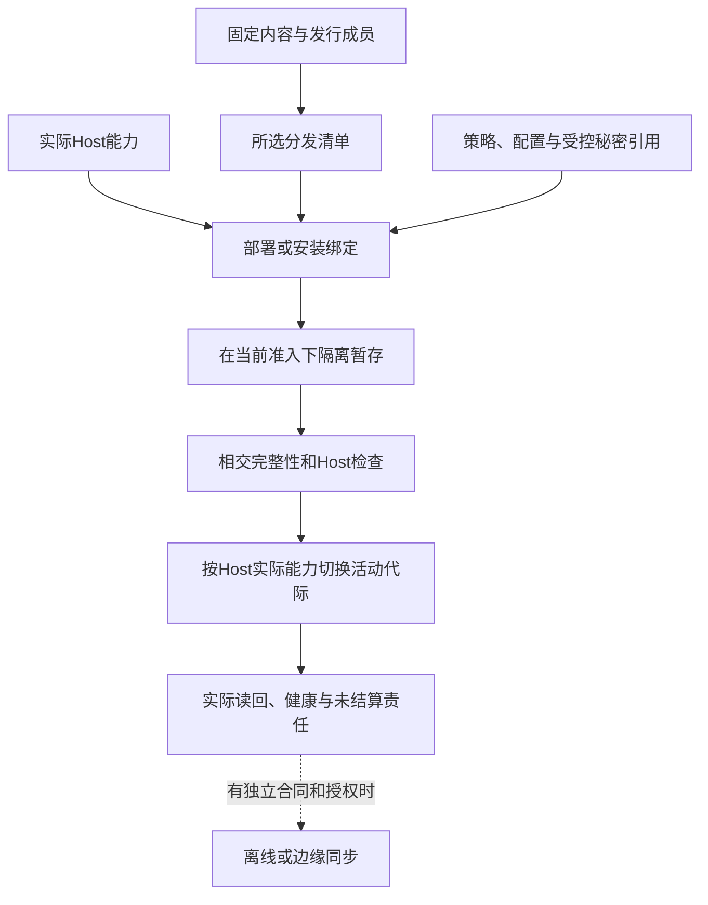
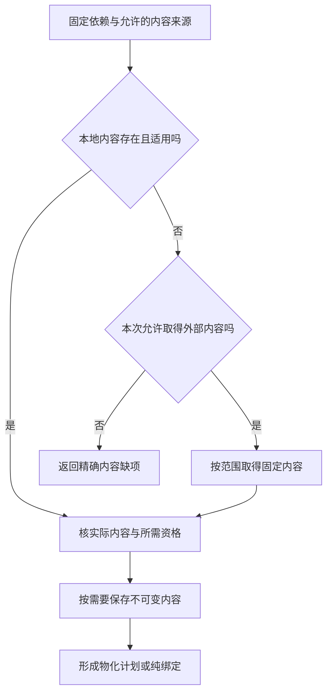
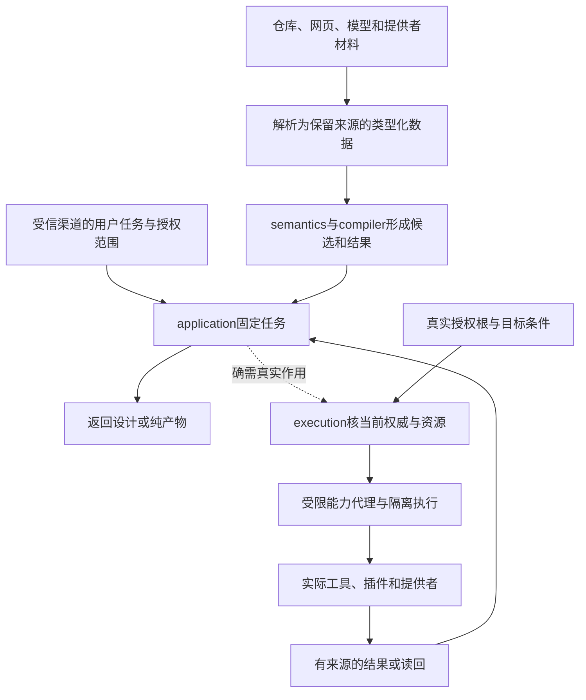

# 宿主生态与技术约束

> **阅读范围**：采用范围内的设计规范；实现状态另查未决。

<details>
<summary>本页内容</summary>

- [窄原生内核与C/Rust的条件接入合同](#窄原生内核与crust的条件接入合同)
- [成熟机制的实际复用分配](#成熟机制的实际复用分配)
- [提供者合同在组合点怎样落地](#提供者合同在组合点怎样落地)
- [Host 运行时、分发、离线与远程执行](#host-运行时分发离线与远程执行)
- [Web、浏览器、前端、样式、可访问性与运行证据](#web浏览器前端样式可访问性与运行证据)
- [云、容器、无服务器、远程执行与隔离](#云容器无服务器远程执行与隔离)
- [供应商锁定、退出、替代与业务连续性](#供应商锁定退出替代与业务连续性)
- [依赖解析、物化与垃圾回收](#依赖解析物化与垃圾回收)
- [分布式系统、一致性、复制、分区与共识边界](#分布式系统一致性复制分区与共识边界)
- [可移植、互操作、标准、协议与生态采用](#可移植互操作标准协议与生态采用)
- [可观测性、性能、容量与成本](#可观测性性能容量与成本)
- [多租户、组织、项目、工作区与数据隔离](#多租户组织项目工作区与数据隔离)
- [存储、模式、日志与缓存](#存储模式日志与缓存)
- [安全、隐私、供应链与信任](#安全隐私供应链与信任)
- [密码、密钥、秘密、身份认证与信任轮换](#密码密钥秘密身份认证与信任轮换)
- [嵌入式、实时、硬件与物理约束](#嵌入式实时硬件与物理约束)
- [数据平台、事务、模式演进、质量、血缘与治理](#数据平台事务模式演进质量血缘与治理)
- [机器学习模型、数据、评测、漂移与人工智能安全](#机器学习模型数据评测漂移与人工智能安全)
- [构建、发布制品、清单、签名与来源证明](#构建发布制品清单签名与来源证明)
- [移动、桌面、插件、扩展宿主与权限](#移动桌面插件扩展宿主与权限)
- [网络、协议、服务发现、限流、熔断与兼容](#网络协议服务发现限流熔断与兼容)
- [能源、环境、可持续性与硬件资源](#能源环境可持续性与硬件资源)
- [许可证、法规、地域、政策与外部权威](#许可证法规地域政策与外部权威)
- [固定内容与可信更新的双重边界](#固定内容与可信更新的双重边界)
- [一个提供者从声明到可用能力的接入过程](#一个提供者从声明到可用能力的接入过程)
- [首个可执行接合的成熟工具边界](#首个可执行接合的成熟工具边界)
- [提供者方法在固定装配中的采用](#提供者方法在固定装配中的采用)
- [计算开发的成熟运行与调试复用](#计算开发的成熟运行与调试复用)
- [环境与依赖的开发操作：准备可用条件，不篡改工程含义](#环境与依赖的开发操作准备可用条件不篡改工程含义)

</details>


<a id="native-kernel-boundary"></a>
<a id="窄原生内核与crust的当前接入合同"></a>

## 窄原生内核与C/Rust的条件接入合同

本节是实际选中原生内核后的条件规格，不预定下一语言。C范例用于说明定宽数值、缓冲和ABI的完整边界；Rust或其他供给按真实公开接口接入。当前TS主线、SEC核心实现和用户目标不因此迁写；没有此类消费者，不创建相应模块、编译任务或生态。

### 有限原生内核的条件范围

采用同步、无回调、无共享可变全局的有限内核；值域先包含Bool的明确0/1编码、固定宽度整数、字节/元素缓冲、长度、状态码和不透明句柄。需要数学Int或完整Text时使用实际大数/编码库或判定该目标不合格，不自动截断到C的int或Rust的usize。一个目标中的机器整数宽度、字节序、对齐、调用约定和工具标志都必须固定。

例如`max_u32`的跨边界合同可采用以下C声明；它是接口范本，不是本轮实现：

```c
uint32_t sec_max_u32(const uint32_t *data, size_t length,
                    uint32_t *out_value, uint8_t *out_present);
```

输入是U32元素序列，输出最大值和是否存在；空输入正常返回`out_present=0,out_value=0`，非空全零则返回`out_present=1,out_value=0`。状态固定为0=成功、1=可检查的必需指针为空、2=长度的字节表示溢出。先检查这些条件且失败不写输出；真实可达性/对齐/存活仍是调用方必须满足的前提，不假装全部伪造指针都能安全返回错误。其他宿主故障不伪装成此三值结果。`length=0`允许data为空且不解引用；否则输入必须在整个同步调用期间真实有效、对齐、已初始化且稳定。out指针必须真实有效可写、彼此不重叠且不别名输入；这些是ABI前提，不声称C能安全检查任意伪造地址。受管调用器在传入前验证其可知的长度/范围/别名并取得合法借用；不可信跨进程输入先解码，不能把外部整数当成可信指针。

内核不保存输入、不分配输出、不启动后台任务；扫描成功后统一写两个输出。预知失败不写输出，若宿主故障或越权代码破坏了前提，不以返回约定声称已经回滚。借用在真实调用返回后结束；强制超时无法确认停止时仍保留输入占用。这个接口只检验精度、缓冲和ABI，不引入自己的数组框架或分配器。

### 布局和资源不依赖目标默认

C提供者使用精确宽度类型可用性检查；传size_t前核宿主长度可以表示。C标准库、头文件、编译器与实际flags是构建输入，不凭后缀认定ABI。结构布局按字段、宽度、对齐和padding规定，不用`memcmp`推导业务相等，不使用未初始化padding作为输出。禁止有符号溢出、悬空借用和未经定义的指针关系作为优化捷径。

Rust提供者可导出`extern "C"`入口，边界结构按明确`repr(C)`和字段合同；普通Rust布局没有这种承诺，外层repr(C)也不改变内层默认布局。Vec/String/Result/trait对象不直接过边界，改用准确切片、状态码或拥有者句柄。资源由其实际分配者提供释放入口；不能交给另一侧任意free。panic/异常不可穿过普通ABI；unwind/abort策略固定，不能承诺abort仍可被调用方恢复。[Rust布局](https://doc.rust-lang.org/reference/type-layout.html)用于核这些前提，不据此宣布所有类型都能FFI。

异步、回调和长期缓冲按[跨实现调用N0—N8](跨实现调用与数据寿命.md#call-lifetime)接入原execution/资源机制：提交前登记；结果、未来访问关闭、在途帧和回调分别结算；输出拥有权和其释放代码保持到真正最后使用。pin不等于只读，取消不等于停止，返回结果不等于可以卸载模块。上面的无回调同步窄核仍可沿普通栈寿命使用，不被强制升级为异步框架。

### 原生源码能维护才升级为工程支持

C读取使用真实编译命令、include、宏、目标和工作目录；同一文件在不同配置下可能有不同AST，不能任选一次编译称全域覆盖。复用[Clang compilation database](https://clang.llvm.org/docs/JSONCompilationDatabase.html)获取相应输入，读取不等于执行构建。

改写按语义匹配加原文本切片，宏展开、条件编译与头文件共享分别确认写回位置；宏调用中的一次变化不能误改所有宏使用者。[Clang Transformer](https://clang.llvm.org/docs/ClangTransformerTutorial.html)提供AST约束与源码编辑结合的成熟机制，但单次重构规则不认证任意C/C++到中立源的逆向。

Rust源码维护复用其真实语法/宏/名称工具，展开后节点的来源歧义保留。只有取得普通编辑、依赖、构建、生成和再次修改的范围证据，才称Rust工程支持；能调用一个Rust二进制只记供给接入。没有当前消费者就不主动建立整套Rust后端。

## 成熟机制的实际复用分配

当前采用“先复用实现，定边界后适配，只自研独立差额”的实施原则。成熟算法的说明、实际软件包、形式定理、上游测试和本机观测是不同资产；取得一种不冒称取得其他种。下表是本设计的实际责任选择，不是实际安装或运行记录。

| 责任 | 当前默认复用 | SEC仍要实现的差额 | 允许重造的触发 |
|---|---|---|---|
| TS/JS原生读取、符号、实际类型 | 锁定API族的官方编译器/语言服务 | 受控Host读取、版本/来源与中立映射 | 所需版本无接口、无法隔离输入或有已证实不可接受成本 |
| TS目标AST、打印与检查 | 同一适配API族的factory/printer和单独请求的Program诊断 | 合法目标AST、映射、布局和真实结果归属 | 现有工具明确不支持相交目标；不因为想统一名称而重写类型检查器 |
| Java等目标编译与执行 | 所选发行版的成熟工具链 | 中立类型/效果/错误到目标的映射、参数与日志、实际产物 | 目标任务与现有工具根本不相容时重新选路线 |
| 原生安全编辑 | 支持当前语言的成熟CST、语言服务或版本化编辑能力 | 冻结前像、SEM变更到编辑的适配、保存所有权与并发检查 | 工具缺保全能力；换适配而非自动重写整门语言 |
| 版本库、依赖和常规构建 | 已有VCS、包解析器与构建器 | 真实输入输出闭包、角色、权限与结果适配 | 原工具合同不能满足需求；不自己维护第二套依赖解析真相 |
| 字节摘要、归档、基础编码 | 成熟库及其合法模式 | 选择算法/参数、输入大小与路径保护、生命周期 | 存在不可弥补接口或合规条件，不自制密码算法 |
| 需要持久化的本地操作 | 合格SQLite等实际存储提供者 | 正确事务边界、文件/远端交接、前后像与恢复 | 真实并发/部署要求超出其能力；纯预览无需启用数据库 |
| 排序、容器、专业数值、解析和数据转换 | 满足精度、输入、顺序、错误与许可范围的现有库 | 确实不同的语义、ABI、资源或目标连接；已有共同表示不重复转换 | 现有供给在本任务范围不能满足要求，且更小适配不成立；缺同名SEC封装不是重造理由 |
| 数据流/低层优化框架 | 只在选中相应目标时复用MLIR/LLVM等合格机制 | 领域语义、Pass前提和实际转换 | 首个源码后端没有需求时不引入整个低层框架 |
| 结构解释与任务投影 | 复用真实格式解码、类型/解析算法和数据结构 | 结构意图、阶段检查、任务满足、投影回写和跨资产连接；仅在选用计算文本时承担该文法解释 | JSON结构和TS语法都不自行解释产品要求；可选.sec读取器不是全工程前置 |

复用原生CST编辑或语言服务时，先确认动作覆盖域、版本化文档、权限与工作区范围，再接入同一候选流程。工具只提供字符串格式化而不保持原作者注释时，可用于明确生成物，不能用于无修改往返。官方工具返回一个建议也不成为自动应用许可。

### 版本与调用方式先确定，安装事实后取得

一个TS适配器当前至少绑定API族、实际package内容、选项、标准库声明、模块解析与Host输入。2026-09-08读取的官方Compiler API页面注明当前内容描述6.0及以前，7.1将采用不同API。故首条旧factory/Program路线绑定兼容API族；未来7.1使用单独版本适配，公共SEC模型不直接泄露旧AST类，也不把更新网页当作已安装版本。[官方说明](https://github.com/microsoft/TypeScript/wiki/Using-the-Compiler-API)。

正常过程是读取现有工具链及项目约束，优先复用已存在且合格的安装；没有则形成明确依赖选择，安装与运行另取得许可。不同API族不共享不成立的缓存或节点句柄；升级只重审相交适配与消费者。仅需语法读取时不强迫创建全Program；需要跨文件类型时不能用单文件transpile冒充。

### 复用不变成重复验证整个上游

正式采用按[剩余验证协议](保证/要求证据与裁决.md#成熟成果复用与剩余验证责任)核定：上游承担什么、使用条件是否成立、SEC修改了哪一层、还剩哪个接缝。允许把成熟库作为当前任务的明确信任基础而不是重新证明其全部内部，但不能将这种信任选择描述成形式定理或全测试覆盖。项目没有相应安全保证要求时，不默认运行上游全量测试、多个模型审查和全部故障矩阵。

接口与表示能直接满足时使用直接绑定，而不是默认先做薄包装；确有跨目标、权限、内容身份或表示差别时才增加必要适配。采用单位可以是一组共享合同的函数，类型/布局/调用转换复用一次，个别方法例外单独保留；不为每个原生函数手写同名Port。新增适配的返回、取消、错误、值域和资源要单独审查，不能因里面调用成熟函数就忽略外层。具体准入由[语义与供给分工](../作者/组合/模块封装与复用库.md#semantic-supply-boundary)拥有。

## 提供者合同在组合点怎样落地

一个提供者在单项测试中成功，不保证在当前使用点合格。绑定器提交的是所需语义、接受域、目标表示、错误/效果、资源和当前信任范围；提供者返回支持的精确合同、内容与方法版本、环境前提和可用证据，不使用自由文本`compatible=true`覆盖全部维度。

核对流程是：解析接口与版本；比较当前使用域；取得必要适配；验证适配前后行为与成本；核对外部能力和当前可用性；最后生成完整Binding。若只支持输入子域，可以形成限定绑定，不对外宣称完整替代；若任务必须覆盖更宽域，继续找实现或报告缺项。已存在正确但无优化接口的提供者可采用基线，不强迫写原生作者代码补上相同算法。

适配可能复制、转码、排队或跨进程调用，必须计入资源、失败和隐私。零复制只有布局、寿命与同步满足才成立。某接口由厂商C++或其他语言实现，不使应用作者必须维护一块原生区域；但只有接口而没有真实实现，仍然是能力缺项。

每种适配器只将相应工具事实映射为现有模型，不把宿主AST、专用数值或账号权限提升为公共语义。宿主版本升级优先检查它的相交边界与方法依赖，再扩大实际采用；不以“工具成熟”跳过新组合检查。

## Host 运行时、分发、离线与远程执行

### 1. 运行时中立核心

领域模型和纯编译器不直接依赖 Bun、Node、操作系统或云 SDK。物理能力由窄端口提供：

```text
FileSystemPort
ProcessPort
NetworkPort
ClockPort
RandomPort
SecretPort
ContentStorePort
ExecutionSandboxPort
```

### 2. Host 画像

```text
HostProfile = {
  operatingSystem,
  architecture,
  runtime,
  filesystemCapabilities,
  processCapabilities,
  sandboxCapabilities,
  networkCapabilities,
  resourceControls,
  installedToolchains
}
```

Host 画像是观测和绑定输入，不是核心编译语义。

### 3. Bun 与 Node

当前 TypeScript 实现可优先使用 Bun 作为产品运行时，但：

- 领域和应用层只依赖标准 TypeScript 和端口；
- Bun 专用 API 位于 Host Adapter；
- 需要作为 Node SDK 被其他工具导入的模块，明确声明 Node 兼容；
- 外部生态包通过兼容和契约测试决定，而不是假设全部可用；
- 原生扩展和进程行为隔离验证；
- 运行时切换只改变 Host Binding 和符合性证据。

不为了抽象而支持所有运行时，也不让 Bun 专用能力扩散到核心。

### 4. 进程执行

子进程绑定：

- 精确可执行文件和摘要；
- 参数和工作目录；
- 环境白名单；
- 标准流限制；
- 进程树；
- 超时、取消和 kill 语义；
- 资源限制；
- 沙箱；
- 退出和效果读回。

父进程退出后不得留下无归属子进程产生效果。

### 5. 文件系统差异

必须适配和测试：

- Windows 大小写、保留名、短名和文件占用；
- POSIX 权限、符号链接和原子 rename；
- 网络共享和同步盘；
- 路径长度和 Unicode；
- 不支持目录原子交换的文件系统；
- 文件锁语义；
- 崩溃后的刷盘保证。

抽象只能暴露实际能力，不能假装所有 Host 等价。

### 6. 分发制品

```text
DistributionPackage = {
  content-addressed artifacts,
  manifest,
  target host constraints,
  dependency closure,
  SBOM and licenses,
  signatures and provenance,
  configuration schema,
  migration plans,
  support and retirement
}
```

安装器使用已验证字节，不在目标机器无记录重建不同制品。

### Host、运行时和分发绑定



本图限定为已请求的安装或部署。只有Host确实提供相应原子切换时才宣称原子；否则采用明确的阶段、前像与恢复。秘密引用不等于把凭证字节写进产物。

### 7. 安装更新修复卸载

```text
Downloaded
→ Verified
→ Staged
→ PreflightPassed
→ Activated
→ ReadbackVerified
→ PreviousDraining
→ PreviousRetired
```

更新失败可回到旧活动 generation 或前滚。数据和配置迁移与程序制品分开管理。

### 8. 离线画像

离线包包含：

- 精确依赖和工具链；
- 信任根、撤销和漏洞快照；
- 模型和 Provider 能力；
- 策略和许可证；
- 有效期；
- 离线操作日志；
- 重联协调规则。

离线不意味着授权永久延长。无法确认的新高风险效果默认阻止。

### 9. 远程执行

只有在共享算力、隔离或团队协作带来真实收益时启用。协议明确：

- 候选和输入内容身份；
- 远端环境；
- 租户和权限；
- 调度和资源；
- 日志和证据；
- 取消；
- 网络分区；
- 迟到结果；
- 数据驻留；
- 结果完整性。

远程 runner 不拥有规范状态；结果进入控制面前验证摘要和适用性。

### 10. 重联

离线或分区节点重联：

```text
重新认证
→ 协调 epoch、策略、密钥和依赖
→ 查询未确认操作
→ 解决重复和冲突
→ 重新验证本地候选
→ 恢复允许能力
```

### 11. 验收

- 核心无 Bun/Node/OS 直接依赖；
- Host 能力真实而非虚构统一；
- 进程树结算；
- 文件系统故障测试；
- 安装原子切换和读回；
- 离线权限过期；
- 远程结果完整性；
- 分区和迟到结果；
- 同一制品跨环境提升；
- 卸载不删除用户工程和保留数据。

## Web、浏览器、前端、样式、可访问性与运行证据

### 1. Web 不是 TypeScript 的附属语法

HTML、模板、DOM、CSS、资源、路由、浏览器 API、可访问性和运行时渲染具有独立语义。AST、模板树、渲染 DOM 和运行时 DOM Observation 必须分开。

### 2. Web Source Program

```text
WebSourceModel = {
  documentTemplateComponentNodes,
  attributesPropertiesSlotsFragments,
  routeAndResourceBindings,
  cssRulesSelectorsSpecificityCascade,
  customPropertiesMediaContainerQueries,
  eventAndStateBindings,
  accessibilityRolesStatesLabels,
  dynamicOpaqueRegions,
  sourceSpansAndOwners
}
```

### 3. CSS

CSS 不是 key-value。selector、specificity、cascade origin/layer/order、inheritance、custom property、pseudo state、animation 和 media/container query 都可能改变结果。

### 4. Runtime Evidence

computed style、layout、paint、focus、keyboard、form、hydration、navigation 和 browser capability 通常需要真实浏览器。browser 未执行不能支持需要 browser 的 Claim。

### Browser runtime binding

真实浏览器观察不能只绑定URL或当前源码。一次浏览器开发/验证至少把browser process/context、DevTools target/session、frame/document navigation generation与script execution context分开，再把DOM/AX/network/layout/tracing等Observation映射到相交artifact/source。

```text
BrowserRuntimeBinding = exact {
  browserProviderAndVersion,
  browserProcessAndContextRefs,
  targetAndSessionRefs,
  frameTreeAndDocumentGeneration,
  executionContextRefs,
  loadedArtifactAndSourceMapRefs,
  domAccessibilityNetworkAndTraceCoverage,
  emulationAndPermissionProfile
}
```

CDP的TargetID、SessionID、FrameId、NodeId、AXNodeId、ExecutionContextId、RemoteObjectId等都只在对应Provider/会话/代际中定位对象；导航、frame replacement、execution-context destroyed、target crash/detach后按实际事件失效，不能因数值/字符串相同跨代复用。运行DOM和AX tree是Observation，不回写成模板/作者源码。

浏览器协议同时包含只读观察和有Effect的控制：navigate/reload、DOM mutation、Runtime.evaluate/callFunctionOn、权限/设备模拟、文件输入、下载、脚本注入等都按真实Effect分类。拿到DevTools session不授予任意浏览器命令；需要纯检查的工具只开放对应窄能力。

### 可访问性是多层Evidence，不是一个扫描分数

可访问性要求、静态语义、浏览器可访问性树、交互行为、视觉呈现、实际assistive technology输出和用户完成任务能力是不同层。一个自动扫描器、AX tree快照或WCAG checklist都不能单独代表“产品可访问”。

```text
AccessibilityRequirement
→ Source/Component semantics
→ Rendered DOM/CSS
→ AccessibilityTree Observation
→ Keyboard/Pointer/Touch interaction Observation
→ Visual focus/reflow/contrast/motion Observation
→ AssistiveTechnology Observation
→ UserTask Evidence
→ Accessibility Verdict
```

每层绑定准确browser/OS/device、viewport/zoom、locale、theme/high-contrast、reduced-motion等user preference、输入方式、辅助技术及revision。AXNode、accessible name、role/state是browser accessibility mapping的运行Observation，不等于作者写的ARIA属性，也不能从一棵AX tree推断屏幕阅读器在所有OS/版本上的最终输出。

**名称与语义。** accessible name可以来自visible text、label、`aria-label`、`aria-labelledby`及host-language规则。视觉标签存在不证明accessibility name正确；反过来，用ARIA覆盖名称还可能隐藏descendant content。静态ARIA属性合法只说明结构要求的一部分，仍需核browser计算后的name/role/state与实际交互。

**键盘与焦点。** “可focus”不等于“可完成任务”。验证Tab/Shift+Tab、组件内部arrow/escape/enter/space等实际模式、focus order、focus trap退出、modal恢复位置、动态内容后的focus relocation和disabled/hidden变化。focus顺序可以不同于视觉布局，但必须保持含义和可操作性；focus indicator还需真实可见且不被author-created overlay完全遮挡。

**视觉和用户偏好。** resize/reflow、text spacing、zoom、non-text contrast、high contrast/forced colors、reduced motion、orientation和dynamic viewport分别观察。`prefers-reduced-motion`匹配本身不证明应用已停止非必要motion；实际运行状态和动画/transition脚本都需验证。

**辅助技术与平台。** screen reader、braille、switch、voice control、screen magnifier、OS accessibility API和移动TalkBack/VoiceOver等是不同Provider/环境。只有任务要求相交能力时运行相应组合；不要求普通纯编译加载辅助技术。模拟AX tree适合快速检查结构，但真实AT互操作问题必须由相应Provider/人工/自动化Evidence补齐。

**自动工具。** axe/Lighthouse/静态lint/ACT规则等finding进入原Verification Evidence并带规则版本、页面状态和coverage。无finding只表示其规则和实际扫描状态中未观察到相应问题；人工判断、完整键盘流程、屏幕阅读器输出和产品任务仍可能失败。

Accessibility Verdict绑定目标标准/规则版本、conformance scope、页面/流程集合、环境矩阵、自动/人工方法与已知未覆盖。部分页面AA通过不能被聚合成整个产品AA；标准不适用项必须给理由，未测不等于not-applicable。

### 5. Framework

React、Vue、Svelte、Angular、Next 等作为领域 Provider/Adapter，不能进入 Core switch。动态表达保留 unknown/opaque，不执行任意应用代码猜 DOM。

### 6. Governed mutation

rename component/prop/class/token、bind event、add accessibility contract 等通过统一 Mutation，保护人工和 vendor 区域。

### 7. 验证

服务端渲染、客户端渲染和水合；动态选择器、层叠顺序、资源地址、焦点与键盘、屏幕阅读器、浏览器版本、不适用时浏览器零成本和框架升级。

## 云、容器、无服务器、远程执行与隔离

### 1. 部署机制不是语义 authority

Kubernetes、容器、serverless、VM 和远程 worker 只是运行/物化 Provider。它们不能决定工程责任、业务成功、验证适用性和实现选择。

### 2. CloudExecutionProfile

```text
CloudExecutionProfile = exact {
  providerRegionAccount,
  computeAndIsolationModel,
  imageRuntimeAndKernelRefs,
  networkAndIdentityPolicy,
  storageAndConsistency,
  scalingAndLifecycle,
  quotasAndBilling,
  observabilityAndAudit,
  availabilityAndDisasterRecovery,
  portabilityAndExit
}
```

### 3. 容器

image identity、runtime config、container instance、volume、secret、network、runner registration 和 cache 分离。容器不是安全边界的自动证明。

### 4. Serverless

冷启动、并发模型、执行时限、重试、事件重复、临时文件、连接和 provider-specific semantics 明确进入 Target/Provider contract。

### 5. 远程执行

worker 只读取内容寻址输入并写声明输出；无仓库凭证和 ambient network。结果绑定 worker image、host capability 和 cleanup。

### 6. 可移植性

使用 capability contracts 和 adapters 隔离 Provider，但不假装所有云能力等价。退出方案包含数据、身份、网络、日志和运维迁移。

### 7. 验证

镜像漂移、容器逃逸、配额耗尽、区域故障、重试重复、无服务器执行超时、存储一致性、跨租户泄漏、远程工作节点失陷和 Provider 退出。

<a id="iac-declarative-control-boundary"></a>
## IaC、声明式控制与字段所有权

Terraform/OpenTofu、Kubernetes、Pulumi及云控制器都可以成为基础设施Provider，但声明配置、Provider本地/远端状态、远端现实、计划和一次apply必须分开。不能因为工具称自己“declarative”就把这些对象压成一个current state。

```text
InfrastructureControlBinding = exact {
  desiredConfigurationRef,
  toolAndProviderRevisionRefs,
  providerStateSnapshotRef?,
  observedRemoteStateRefs,
  planRefAndMode,
  plannedPreconditionsAndUnknowns,
  applyOperationAndAttemptRefs?,
  authoritativeReadbackRefs?,
  driftObservationRefs,
  ownershipAndCoordinationRefs
}
```

### Configuration、state、remote 与 plan

configuration是作者/输入；Terraform类state是工具维护的**管理知识/绑定投影**，不是远端资源本身，也不是作者配置。refresh会从实际Provider读取远端并产生新的state观察；`refresh-only` apply可以只更新state和outputs而不修改远端。反过来，远端被人工/其他控制器改动会形成drift，但不能让一次refresh自动决定“接受漂移还是恢复desired”，该选择仍由Requirement/Policy/Operation拥有。

普通plan通常会取得当前远端观察再提出动作；`refresh=false`、offline plan或Provider读能力不足产生较弱前提和unknown，不能与已刷新plan等价。saved plan必须绑定其configuration、state/remote观察、variables、provider/tool schema与计划模式；应用saved plan不重新把它解释成另一个latest plan。未保存plan重新运行时结果可以因远端drift、Provider升级或数据源变化而改变。

plan生成本身通常不应修改被管理resource，但可能读取远端、运行Provider/data source、消费API配额、访问敏感数据或执行受信范围内的辅助Provider逻辑；是否纯由实际Provider合同决定，不能把命令名字`plan`当纯度证明。

### Apply、state lock 与现实Effect

state lock只协调遵守同一backend/lock协议的state writer；它不能阻止云控制台、其他IaC workspace、Kubernetes controller或直接API修改远端资源。拿到state lock不等于业务Effect authority。真实apply继续走Operation/Attempt/Effect/Readback；部分成功、远端超时、Provider crash和state写入失败分别结算。

apply若消费saved plan，仍在Effect前核当前Grant、目标账号/区域、Provider资格及计划允许的前提；计划文件不是可携带到任意环境的永久执行票据。state成功写回不证明所有远端Effect成功；远端资源成功变化而state落盘失败同样必须保留unsettled/recovery。

### Field ownership 不是权限ownership

Kubernetes Server-Side Apply类机制可以通过field manager记录“某workflow依赖并管理哪些字段”，用于检测协作者之间的字段冲突。它属于Provider协调事实：

```text
DeclaredFieldManagement = derived {
  remoteObjectAndApiRevision,
  providerManagerIdentity,
  fieldSetAndGranularitySchema,
  operationKind,
  sharedOrExclusiveClaims,
  observedManagedFieldsRevision
}
```

它不是SEC semantic owner、resource owner或Capability Grant。`fieldManager:"x"`通常由客户端声明，不能以该字符串认证主体。两个manager把字段断言成同值时可以共享management；后续改值可能冲突。force-conflict是一次真实写入/ownership-transfer Effect，必须有当前授权，不能因控制器自称owner自动获得。

省略一个先前管理字段可能释放管理权，并在没有其他manager时导致字段删除或恢复默认；因此“manifest没写字段”不能一律解释为“不改”。field schema从atomic到granular等变化也可能改变冲突/ownership含义，mapping必须绑定API schema revision。

### Drift、接受与调和

`desired != observed`只产生drift relation；策略可以选择restore desired、adopt observed、局部接管、报警或保留unknown。adopt observed会形成新的作者/配置候选或有权state adoption，而不是直接把remote readback写进canonical source。多个controller可按真实field/资源边界协调；没有安全划分时保留冲突而不是last-write-wins。

### 验证

覆盖state陈旧、refresh误定位账号/区域、saved plan过期、provider/data source变化、state lock丢失、远端人工写入、两个workspace控制同资源、partial apply、远端成功而state失败、state成功而readback不一致、SSA共享字段、force ownership transfer、schema granular/atomic变化、controller与人工manager竞争和destroy/refresh-only模式误用。

## 供应商锁定、退出、替代与业务连续性

### 1. 锁定是多维的

API、数据、身份、运维、人员技能、合同、成本、性能、支持和生态都可能形成锁定。使用抽象接口不等于可退出。

### 2. ExitPlan

```text
ExitPlan = exact {
  providerAndCapabilityRefs,
  dependencyAndDataInventory,
  alternativeCandidates,
  semanticAndOperationalGaps,
  exportAndMigrationMechanisms,
  credentialAndIdentityTransition,
  serviceContinuityAndDualRun,
  costTimeAndRiskEnvelope,
  triggerAndDecisionAuthority,
  verificationAndRetirement
}
```

### 3. Provider disappearance

服务终止、价格变化、许可变化、安全事件、地区不可用和账号封禁都是触发器。关键能力必须有数据备份、替代机制或明确接受的单点风险。

### 4. 抽象边界

只抽象真实需要替换的 capability。过早统一所有 Provider 会损失特有能力和增加最低公分母成本；完全无边界会使退出不可能。

### 5. 业务连续性

退出期间需要双运行、数据同步、流量切换、错误处理、回滚和用户沟通。兼容层有明确结束时间。

### 6. 验证

离线导出、替代 Provider、凭证撤销、大规模数据迁移、语义不匹配、混合运行、性能或成本回归、退出期间 Provider 不可用和旧集成退役。

## 依赖解析、物化与垃圾回收

### 1. 对象分离

依赖管理至少区分：

```text
DependencyRequirement
DependencyCandidate
ResolutionDecision
LockedDependency
Artifact
Materialization
ActiveBinding
UsageLease
GarbageCollectionDecision
```

名称、版本范围、下载结果、解压目录和当前活动依赖不是同一个对象。

### 2. 需求和候选

```ts
interface DependencyRequirement {
  readonly requirementId: RequirementId;
  readonly ecosystem: EcosystemId;
  readonly packageIdentity: PackageIdentity;
  readonly versionConstraint: VersionConstraint;
  readonly requiredCapabilities: readonly CapabilityRef[];
  readonly targetProfiles: readonly TargetProfileRef[];
  readonly licensePolicy: PolicyRef;
  readonly trustPolicy: PolicyRef;
  readonly optional: boolean;
}
```

候选包含来源、版本、制品摘要、签名、许可证、平台、传递依赖和撤销状态。注册表标签和版本字符串不能代替内容身份。

### 3. 解析

解析先应用硬条件：

- 版本范围；
- 目标平台和 Runtime；
- 能力和 ABI；
- 许可证；
- 安全和信任；
- 撤销与漏洞策略；
- 离线可用性；
- 组织允许来源；
- 依赖图一致性。

再对合格候选比较更新成本、兼容、体积、性能、维护和退出成本。

解析结果必须可复现：

```text
ResolutionKey = digest(
  requirements,
  indexes and registry snapshots,
  policy revisions,
  target profile,
  existing lock state,
  resolver revision
)
```

### 4. 锁定

`LockedDependency` 记录：

- 规范包 identity；
- 精确版本；
- 内容摘要；
- 来源 URI 与 registry snapshot；
- 签名和证明引用；
- 许可证结论；
- 传递依赖边；
- 解析器和策略 revision；
- 允许的平台与能力范围。

锁文件是解析决定的序列化，不是唯一事实。下载字节必须再次核对摘要。

### 5. 制品获取



取得内容、将内容放到执行环境、运行代码是三个动作。签名、许可证和检查按真实政策与来源风险应用；有内容摘要不自动得到可信性，形成计划也不表示已经安装或执行。
下载、解压和安装属于受准入效果。网络响应成功不能替代最终制品摘要和物化读回。

### 6. 不可变内容库

内容库以摘要寻址并禁止原地修改。对象元数据记录：

- 字节长度和分块摘要；
- 来源和首次观察；
- 签名、SBOM 和许可证；
- 扫描结果与适用范围；
- 引用者；
- 租约和保留；
- 加密和数据分类；
- 损坏和撤销状态。

同一字节可以共享；不同租户是否可共享由安全、许可证和隐私策略决定。

### 7. 物化

```ts
interface MaterializationPlan {
  readonly lockedGraph: LockedGraphRef;
  readonly targetHost: HostProfileRef;
  readonly layoutPolicy: LayoutPolicyRef;
  readonly isolationRoot: PathCapabilityRef;
  readonly expectedBytes: ByteCount;
  readonly fileCountCeiling: Count;
  readonly verificationSteps: readonly VerificationActionRef[];
}
```

物化产生新的物理视图，不改变制品身份。它必须处理：

- 文件名和路径限制；
- 大小写冲突；
- 符号链接和目录穿越；
- 可执行位和权限；
- 压缩炸弹；
- 磁盘不足；
- 并发物化；
- 中断和恢复；
- 防病毒或文件占用；
- 原生二进制平台匹配。

共享物化代际的身份由实际制品闭包、物化算法及其会改变结果的语义参数决定。attempt、时间戳、工作区、分支、projection/cache 路径、消费顺序和 provenance receipt 都不进入该代际键；它们保留为本次操作或来源事实。需求绑定仍属于具体工程与环境，不能因两个绑定复用同一字节代际就合并它们的 owner、requirement、manifest 或 provenance。

消费者按真实写入和重定位合同选择访问方式：可直接读取不可变位置时使用 direct read；Provider 给出可认证且寿命充分的 immutable locator 时可直接绑定；消费者需要私有可写视图时使用 copy-on-write projection；会改写、重排或执行不受信步骤时使用 isolated materialization。能力不足必须返回不支持，不能在这些方式之间隐式 fallback。

### 8. 活动绑定

```text
ActiveBinding =
  project/environment scope
+ locked graph revision
+ materialization ref
+ runtime/toolchain profile
+ activation epoch
```

切换采用新 generation 暂存、验证和原子活动指针更新。不能在共享目录中逐文件覆盖并假设消费者不会观察中间态。

只要真实消费者仍通过 pathname 使用某个 generation，持久 UsageLease 就必须覆盖 locator 发布、消费者取得、实际执行、最终读回和 projection 退役。不能先释放 generation 再向调用方传递裸路径，也不能用进程是否仍存活或事后的 drift check 代替跨进程路径寿命保证。

publisher、consumer admission 与垃圾回收消费同一协调互斥域和 durable hold set。发布完成但调用方尚未取得、消费者崩溃后待恢复、验证或可复现性仍需旧代际时，各自 hold 继续存在；释放必须绑定原 owner 和 fencing。相同 generation identity 若观察到不同 manifest、Merkle 根或实际字节，候选进入 quarantine 并报告 Provider nondeterminism 或 generation conflict，不能覆盖已有代际。

### 9. 缓存与离线镜像

离线包或镜像必须携带：

- 完整锁图；
- 所有制品字节；
- registry 和信任元数据快照；
- 签名、透明日志证明和撤销信息；
- 许可证和 SBOM；
- 适用 Host 范围；
- 创建时间和过期策略。

离线使用不能把陈旧安全元数据自动视为最新。超出允许陈旧窗口时，系统明确降级、阻断或要求有权风险决定。

### 10. 更新和漂移

依赖更新是新候选解析，不是原地改变旧绑定：

```text
new index observation
→ candidate closure
→ hard eligibility
→ resolution decision
→ locked graph
→ materialize
→ conformance and regression
→ bounded cutover
→ old binding drain
```

运行中发现物化字节与锁定摘要不一致时，立即隔离，并使使用该制品产生的候选和证据进入陈旧或不可信状态。

### 11. 垃圾回收

可删除条件不是“最近没访问”，而是：

```text
GCEligible(artifact) =
  no active binding
∧ no execution lease
∧ no recovery dependency
∧ no verification or release retention
∧ no legal hold
∧ no offline package reference
∧ retention window expired
∧ not required to interpret supported history
```

垃圾回收分为标记、计划、准入、删除和读回。删除失败或部分完成保留显式状态。

标记从 typed roots 出发：活动绑定、durable consumer、未完成恢复、验证/发布保留、法律保留、离线包与历史解释分别说明为什么仍可达。进程退出、缓存压力或普通访问时间不能清除这些根。标记完成后到物理删除前，GC 必须在同一协调域复核 hold-set 的比较交换条件与物理围栏；期间出现新 hold、代际变化或身份不一致即放弃本次删除。这样 mark-and-sweep 的快照不会与新消费者取得路径发生竞态。

### 12. 恢复与历史解释

旧工程 revision、验证证据或发布制品可能需要旧依赖解释器。系统可以保留：

- 旧字节；
- 旧锁图；
- 兼容解释器；
- 迁移器；
- 只读容器镜像。

但不得因此维持旧依赖的新执行权限。历史可解释性与活动可用性分离。

### 13. 安全和供应链事件

发现恶意或撤销制品时：

1. 阻止新解析和新绑定；
2. 定位活动绑定和派生制品；
3. 停止或隔离高风险执行；
4. 撤销相关证据和资格；
5. 轮换可能泄露的秘密；
6. 选择修复、替代或移除候选；
7. 重新构建和验证；
8. 清理被污染的物化与缓存；
9. 保留事件证据。

### 14. 并发和故障测试

- 两个进程同时下载同一摘要；
- 下载完成但元数据提交失败；
- 制品写入后进程崩溃；
- 解压中磁盘耗尽；
- Windows 文件占用阻止切换；
- 旧活动绑定在新指针切换后继续运行；
- 垃圾回收与新租约竞态；
- 发布 locator 后、真实 pathname consumer 取得前发生租约释放；
- 同一 generation identity 产生不同 manifest 或 Merkle 根；
- GC 标记后新增 durable hold，旧删除计划必须被 CAS 拒绝；
- registry 标签被重写；
- 离线镜像信任元数据过期；
- 恢复旧备份后已撤销制品重新出现；
- 同摘要对象出现字节损坏；
- 跨租户共享泄露私有依赖。

### 15. 验收条件

- 需求、解析、锁定、制品、物化和绑定分离；
- 所有活动依赖可追溯到字节摘要和来源；
- 解析可复现或明确记录不可重现输入；
- 物化无路径逃逸和中间态泄漏；
- 更新不原地篡改旧 generation；
- 离线包可独立验证；
- 撤销能传播到活动绑定和证据；
- 垃圾回收不会删除恢复和历史解释依赖；
- generation identity 不受 attempt、workspace 或 projection 路径污染，需求绑定也不被共享字节合并；
- consumer 的 durable hold 覆盖其真实 pathname 使用和最终读回；
- generation conflict 被隔离，GC 与新 hold 的竞态由共同协调域和 CAS 阻断；
- 删除经过准入和读回；
- 并发、崩溃和空间耗尽路径可恢复。

## 分布式系统、一致性、复制、分区与共识边界

### 1. 分布式不是“多进程”

节点具有独立故障、网络不可靠、时钟不一致、状态复制和部分可见。任何全局状态都必须说明一致性模型和权威线性化点。

### 2. 核心对象

```text
DistributedProfile = exact {
  nodeAndFailureDomainRefs,
  communicationAndDeliveryContracts,
  consistencyAndReplicationModel,
  leaderOrAuthorityProtocol,
  membershipAndEpoch,
  partitionAndDegradedBehavior,
  stateTransferAndRecovery,
  resourceAndBackpressure,
  observabilityAndEvidence
}
```

### 3. 一致性选择

线性一致、因果一致、快照隔离、最终一致和 CRDT 等各有前提、代价和适用操作。不能把“最终会一致”作为所有业务的默认答案。

### 4. 共识边界

只对需要全序、唯一 leader、配置成员或不可分决定的最小状态使用共识。大对象、缓存、日志和可派生投影不应全部塞入共识路径。

### 5. Epoch 与 fencing

leader、lease、membership 和 configuration 有 epoch；旧 leader 晚到必须被 fencing 拒绝。墙钟 TTL 不能单独保证唯一写者。

### 6. 分区

每个 operation 明确在分区时选择：拒绝、只读、局部接受、排队、降级或冲突记录。选择由业务 invariant 决定，不由基础设施默认。

### 7. 验证

网络分区、消息重复/乱序、leader change、split brain、clock skew、state transfer、snapshot corruption、backpressure、滚动升级和跨区灾难。

## 可移植、互操作、标准、协议与生态采用

### 1. 通用不等于最低公分母

SEC 保留共享语义，同时允许 Target/Provider 特有能力。可移植性必须声明在哪些能力和环境之间成立。

### 2. PortabilityProfile

```text
PortabilityProfile = exact {
  sourceAndTargetEnvironmentCells,
  requiredCommonSemantics,
  allowedAdaptersAndRuntimeSupport,
  unsupportedOrDegradedFeatures,
  dataProtocolAndIdentityMappings,
  conformanceEvidence,
  migrationAndExitCost
}
```

### 3. 标准采用

先拆能力和真实 consumer，再评估标准/实现的语义、版本、互操作、许可、安全、维护和退出。标准存在不等于所有实现兼容。

### 4. 互操作

协议双方需要 schema、语义、错误、顺序、权限、数据和版本兼容。能解析消息不代表理解相同业务含义。

### 5. Adapter

Adapter 只做边界转换，不拥有目标语义和全局 fallback。信息损失、默认值和 unsupported 明确可见。

### 6. 验证

多个独立实现的符合性、往返一致性、未知字段、版本协商、错误映射、大规模与边界情景、安全、性能和混合版本部署。

## 可观测性、性能、容量与成本

### 1. 可观测性不是日志堆积

遥测用于回答工程操作、编译阶段、效果、资源、验证和用户结果是否符合声明。每个事件和指标有 Schema、单位、维度、采样、保留和 owner。

### 2. 关联身份

```text
RequestRef
ApplicationOperationRef
CompileRef
ActionKey
PlanRef
ExecutionRef
AttemptRef
ProviderOperationRef
VerificationSessionRef
EvidenceRef
ReleaseRef
```

不同身份不能用一个 trace ID 替代，但可在同一链中关联。

<a id="distributed-trace-causality"></a>
### 分布式Trace、Context传播与因果边界

trace/span用于把跨进程Observation关联起来，不成为Request、业务对象、operation、Effect或Evidence的替代身份。W3C `traceparent/tracestate`、OpenTelemetry `SpanContext`等只在其协议命名域描述追踪位置；外部调用者还可以伪造合法格式的trace header，因此“同TraceId”不构成认证、授权或同一业务意图证明。

```text
TraceCorrelationView = derived {
  telemetryProviderAndRevision,
  traceAndSpanContext,
  parentRef?,
  linkRefs,
  relatedRequestOperationAttemptRefs,
  resourceAndEntityObservationRefs,
  propagationCarrierAndTrustBoundary,
  samplingAndRecordingState,
  startEndTimeAndClockDomain,
  attributesEventsAndStatus,
  coverageAndLoss
}
```

这个View没有独立业务authority。parent只表达该tracer建模的一条直接父关系；batch、queue、scatter/gather、异步续作和跨安全域重启trace时使用link或其他有类型关系，不能为了保持一棵树伪造唯一业务parent。一个span也可以只记录部分工作，span ended只说明tracer不再向该span记录数据，不证明子进程、远端Effect、异步设备、队列消息或原Operation已经settled。

**传播不是信任传递。** incoming trace context、tracestate、baggage和其他carrier先按来源/边界验证或净化；跨不可信边界可以重启trace并保留有来源link。Baggage只是应用自定义传播数据，默认不放secret、credential、PII或授权决定；收到的baggage不能生成Principal、Grant、tenant ownership或执行范围。向外部服务传播内部trace/baggage也要按披露政策过滤。

**Sampling与缺失。** sampled flag、head/tail sampling、drop、export failure和collector loss进入Coverage；未看到span不能推出调用未发生，sampled=1也不保证整条trace最终被完整保存。关联图做“不存在调用”“全部消费者”等否定结论时仍需要对应封闭枚举能力，不能拿trace数据替代。

**时间与因果。** 每个span时间绑定实际clock domain与同步质量。不同主机wall-clock数值大小不能单独决定因果顺序；优先使用明确parent/link、message/event identity、operation/attempt关系和Provider已证明的顺序。duration只在相应时钟/测量保证内解释，NTP/PTP校时、clock jump和monotonic/wall转换分别记录。

**上下文生命周期。** thread-local/async-local/context object只是当前执行传播机制；task detach、callback、pool reuse、process fork/exec和environment-variable propagation都可能造成上下文丢失或串线。context被复制不延长原业务Grant、deadline、lease或resource lifetime；真实能力仍由各owner重新取得/衰减。

### 3. 事件

结构化事件至少记录：时间来源、主体、状态转换、输入/输出摘要、资源、错误码和覆盖。正文、源码和秘密默认不进入遥测。

### 4. 指标

关键指标：

- 观测文件和字节；
- 各 pass 时延；
- cache hit/miss 和原因；
- 反向失效闭包大小；
- clean/incremental 差异；
- 候选数和求解状态；
- 编译成功、未知和不满足；
- Provider 错误与不确定完成；
- 事务恢复；
- 验证选择、复用和 Flake；
- 资源当前、峰值、泄漏；
- 用户等待和人工批准。

### 5. 遥测覆盖

```text
TelemetryValue
+ Coverage
+ Freshness
+ Sampling
+ PipelineHealth
```

缺数据不等于零错误。关键读回和审计需要独立通道。

### 6. 性能基准

基准按工作负载画像：

- 小型单包；
- 中型多包；
- 超大单仓；
- 多语言；
- 高生成代码；
- 冷缓存；
- 热增量；
- 大候选空间；
- 故障恢复；
- 低资源设备。

记录硬件、运行时、工具链、数据集和统计方法。

### 7. 延迟分解

端到端墙钟时延使用同一计时域中的完成时刻减接收时刻；图中并行阶段按关键路径分析。阶段工作量求和、CPU 时间和墙钟时延分别报告，嵌套 span 不能重复相加。只有确认全部阶段严格串行且互不重叠时，阶段和才等于总时延。计量合同见[质量属性与工程场景](../产品/术语与质量属性.md#3-性能模型)。

平均值不足，至少观察 p50、p95、p99、尾部原因和取消比例。

### 8. 容量

容量模型基于：

- 文件、符号、关系和候选规模；
- 变化率；
- 并发操作；
- 缓存工作集；
- Provider 配额；
- 验证矩阵；
- 恢复冗余；
- 多租户或离线画像。

用测量校准，不凭空设精确阈值。

### 9. 成本

成本归因到操作、项目、Provider 和阶段。包括计算、存储、网络、模型调用、外部服务、人工审查和恢复。成本优化不能折价正确性、安全和隐私硬约束。

### 10. 性能回归

回归门绑定基准数据集、噪声模型、置信区间和实际影响。单次波动不自动阻止；稳定尾延迟或资源增长需要根因和预算决定。

### 11. 剖析

支持：

- pass 级 CPU 和墙钟；
- 内存分配和保留；
- I/O 和子进程；
- 依赖图热点；
- 无效失效；
- 缓存序列化；
- Provider 等待；
- 测试选择和环境启动。

剖析数据也受隐私和租户边界。

<a id="runtime-memory-observation"></a>
### 11.1 运行内存、Heap snapshot与Leak诊断

内存工具观察的是某个Runtime/VM/allocator/device在特定采集方法下的状态，不建立“对象永久身份”或“系统总内存真值”。至少把managed heap、native/external allocation、stack、mapped file、shared memory、GPU/device memory和OS/process统计区分；某Provider只覆盖其中一部分时必须公开。

```text
RuntimeMemoryObservation = derived {
  runtimeInstanceAndGenerationRef,
  memoryProviderAndRevision,
  captureModeAndConfiguration,
  snapshotOrTimeWindow,
  pauseGcAndSafepointBehavior,
  heapRootAndReachabilityModel,
  objectGraphOrAllocationProfileRefs,
  nativeExternalAndDeviceCoverage,
  sourceAndStackMappingRefs,
  samplingPrecisionAndDroppedData,
  overheadAndPerturbation,
  coverageAndUnavailableRegions
}
```

**对象ID与地址是局部引用。** heap node/object id、RemoteObjectId、address、handle只在实际VM/context/snapshot/generation合同内解释。moving/compacting GC、free/reallocate、runtime restart和snapshot重建都可能复用或改变地址；不能拿裸地址跨代认作同一语义对象。需要跨snapshot比较时使用Provider声明的稳定追踪能力、分配来源/业务identity或有条件的对象映射，并保留不确定。

**snapshot会扰动现场。** 某些heap snapshot工具会在采集前触发GC、暂停目标或让调试器/console额外持有对象；instrumentation、allocation tracking和sampling也有不同开销。采集后看到的reachable set不能冒充“采集前原样内存”，比较必须绑定相同或明确可换算的方法。

**shallow、retained和实际进程内存不同。** shallow size描述对象自身的某种堆占用；retained size依赖该snapshot的root/reference/dominator模型，表示若相应对象及其仅由它保活的对象不可达时可能释放的范围，不等于RSS下降、native allocator归还OS、GPU释放或业务成本。JS wrapper很小也可能保活大块native/external资源。

**Leak是跨状态Claim。** 一次snapshot只能给候选retain path/异常对象。MemoryLeakClaim至少需要固定工作负载/steady-state或生命周期期望、多个时间点/循环、GC政策、基线、增长/不释放模式、retainer/owner关系和排除的合法cache/pool。单次“大对象”或“retained size大”不能直接签leak；反之sampling没看见也不能证明无leak。

**GC与资源释放分离。** managed object unreachable/collected只支持相应GC事实；file descriptor、socket、transaction、GPU allocation、native buffer、subscription等是否释放继续由原Resource/Effect lifecycle读回。finalizer/destructor/weak reference回调若承担现实Effect，必须按对应runtime合同观察，不以“GC最终会做”代替确定清理。

OOM也按实际内存域分类：managed heap limit、native fragmentation、address space、commit/quota、container cgroup、GPU/device memory、stack或其他资源不足都可能表现为内存失败。heap snapshot正常不排除其他域耗尽。

### 12. 验收

- 关键状态转换可关联；
- 遥测缺失可见；
- 性能基准可复现；
- 冷/热和 clean/incremental 分开；
- 容量保留恢复余量；
- 成本有单位和来源；
- 高基数受控但不丢关键身份；
- 性能优化通过语义和故障回归；
- 运行目标绑定具体画像。

<a id="runtime-reliability-incident"></a>
## 运行保证、告警、事故与恢复

可观测性提供Observation，不直接形成“系统健康”的万能布尔值。运行保证链至少区分：

```text
Measurement / TelemetryCoverage
→ SLI evaluation
→ SLO / ErrorBudget state
→ AlertCondition / AlertInstance
→ NotificationDelivery
→ Incident declaration
→ Mitigation operation
→ Recovery observation
→ Incident closure
→ Postmortem / CorrectiveAction
```

每个箭头都可能缺失或失败。measurement缺失、采样丢失和collector故障不能转换成“指标正常”；没有alert只表示所选alert方法未产生相应实例。SLO违反是范围化结果，不自动证明用户事故或根因；严重incident也可能发生在现有SLI未覆盖区域。

### Alert 与 Notification 分离

AlertCondition绑定明确query/rule、输入时间窗、阈值、evaluation schedule、数据完整度与rule revision；pending/firing/resolved等状态是该规则实例事实。grouping、deduplication、routing、silence和inhibition只改变**通知处理**，不能改写原measurement、AlertCondition或SLO结果。

```text
AlertInstance = exact {
  subjectAndRuleRevision,
  measurementAndCoverageRefs,
  evaluationWindow,
  stateAndStateTransition,
  observedAt,
  providerRefs
}

NotificationAttempt = exact {
  alertRefs,
  routeAndReceiver,
  groupingOrSuppressionRefs,
  deliveryAttemptAndReceipt,
  acknowledgementObservation
}
```

acknowledged只说明某主体或系统确认收到/处理通知，不是问题恢复；silenced/inhibited只说明当前通知策略抑制页面。alert限制、采样丢失或通知失败必须暴露coverage/overflow，不能让“页面没响”变健康证据。

### Incident、Mitigation 与 Recovery 分离

Incident是实际影响范围的受管协调对象，可引用多个alert、用户报告、外部状态和未知，不要求由单个alert创建。declaration、severity、owner/commander、影响范围和状态变化有自己的authority；自动化可以按已接受政策操作，不要求一律人工。

Mitigation/rollback/failover/feature disable等都是独立Operation：执行成功不等于问题恢复，必须重新观察被要求的服务/用户状态；恢复Observation也不自动证明根因已知或所有残余已清除。Incident关闭需要本次政策要求的恢复与交接成立，不能由“alert resolved”单字段触发。

Postmortem绑定真实timeline、impact、contributing factors、evidence和unknown，不改写历史。Root-cause claim仍按证据资格评价，允许多个因素和开放未知。CorrectiveAction进入正常Requirement/Candidate/Operation流程；写在postmortem里不自动授权实现或证明完成。

### SLO / Error Budget 只约束其定义范围

SLO绑定SLI定义、subject/user population、时间窗、目标、数据缺失政策和revision。error budget可影响发布/变更准入，但不能覆盖安全、合规、数据完整性等硬约束。改SLI、窗口、过滤或缺失数据政策会使相交比较陈旧，不能通过换分母“恢复”budget。

### 验证

覆盖telemetry断流、部分采样、pending/firing/resolved、flapping、silence/inhibition、通知丢失/重复、receiver故障、incident无alert、alert无incident、mitigation失败/部分成功、rollback引入新故障、恢复后复发、根因未知、postmortem action未完成及旧SLO定义与新版本混算。

## 多租户、组织、项目、工作区与数据隔离

### 1. 多租户是部署画像，不污染核心

本地单人 SEC 不承担多租户成本；云画像激活组织、成员、项目、租户隔离、计量和审计领域。

### 2. 业务对象

```text
Organization
Membership
RoleAssignment
Project
Workspace
RepositoryBinding
Environment
ServicePrincipal
ProviderConnection
```

它们有独立 identity、ownership、transfer、suspension、deletion 和 audit。

### 3. 隔离维度

数据、缓存、索引、消息、文件、进程、网络、secret、模型上下文、Evidence、日志和资源配额分别隔离。仅在数据库行加 `tenant_id` 不足。

### 4. 权限

组织管理员、项目 owner、开发者、reviewer、operator、billing 和 service principal 分离。管理员物理能力不能自动取得语义和数据授权。

### 5. 生命周期

用户离开、项目转移、组织冻结和删除时，候选、批准、凭证、证据、数据、备份和外部 Provider binding 有明确处理。

### 6. Noisy neighbor

共享资源使用 per-tenant quota、fairness、rate limit、cost attribution 和 blast-radius cell。一个租户不能耗尽恢复资源。

### 7. 验证

跨租户缓存、索引、消息和模型上下文；不安全的直接对象引用；角色变化、成员移除、项目转移、备份恢复、共享 Provider 凭证和配额绕过。

## 存储、模式、日志与缓存

### 1. 数据分类

```text
CanonicalDefinition   规范定义
CurrentState          当前权威状态
ImmutableContent      内容寻址对象
Journal               效果准备与恢复历史
Evidence               验证与保证制品
DerivedIndex           可重建索引
Cache                  可丢弃加速结果
Telemetry              运行观测
Secret                 受专门保护材料
```

不同数据具有不同一致性、保留、删除和恢复要求，不能全部放入一个事件日志或 JSON 目录。

### 2. 存储端口

```ts
interface ContentStorePort { put(bytes: Uint8Array): ContentRef; get(ref: ContentRef): Uint8Array; }
interface StateStorePort { compareAndSwap(key: StateKey, expected: RevisionRef, next: StateValue): Outcome<RevisionRef>; }
interface JournalPort { append(record: JournalRecord): Outcome<JournalOffset>; read(stream: StreamRef): readonly JournalRecord[]; }
interface CachePort { get(key: ActionKey): CacheEntry | undefined; put(entry: CacheEntry): Outcome<void>; }
```

领域层依赖语义端口，不依赖数据库 SDK。

### 3. 模式演进

对需要滚动共存和有状态数据迁移的场景，可采用：

```text
expand → backfill → verify → switch-read → switch-write
       → observe → consumer-zero → contract
```

这不是所有变更的必经链。可丢弃缓存可按兼容规则重建；没有并存读写者且有原子迁移/恢复保证的小型状态变更可直接切换。是否双读、双写或分批搬迁取决于真实消费者与不变量；启用的每个阶段必须有 revision、检查点、恢复和退出证据。永久竞争双写不是完成状态。

### 4. 未知字段

持久对象携带 schema revision。兼容读取保留未知字段，避免旧写者删除新数据。封闭代数遇到未知 variant 返回不支持，不能按默认分支解释。

### 5. Journal

Journal 只用于需要持久准备、因果审计和崩溃恢复的操作。它不是所有领域当前状态的唯一真值。记录必须：

- 追加或具有防篡改保护；
- 绑定操作和前像；
- 可幂等重放；
- 有完整性摘要；
- 与当前目标读回协调；
- 支持隐私和保留策略。

### 6. 缓存

缓存键、依赖证据与实时资格沿用[可达输入闭包与负依赖](../编译/查询增量与性能.md#可达输入声明依赖证据与负依赖)。只有实际改变计算结果的租户/权限/策略/数据语义进入键；隔离域、访问控制、撤销和有效期单独检查。缓存值带 Schema、来源、有效条件和摘要；丢弃缓存不应丢失唯一权威事实或恢复材料。

### 7. 查询与索引

索引和物化视图只加速权威数据。查询结果绑定快照、过滤、排序、分页游标和权限。稳定分页使用不可变快照或明确一致性级别。

### 8. 删除与恢复

删除产生墓碑并传播到缓存、索引、备份恢复和离线同步。备份恢复先应用删除知识。秘密和隐私数据的备份保留、加密和销毁单独治理。

### 9. 备份

定义：

- 备份对象和排除项；
- 一致性点；
- 加密和密钥；
- RPO/RTO；
- 恢复顺序；
- 完整性检查；
- 定期演练；
- 旧 schema 迁移；
- 恢复后的证据重建。

### 10. 验收

- Canonical/Current/Journal/Cache 分离；
- CAS 防丢失更新；
- schema 双版本测试；
- migration 可恢复；
- 未知字段往返；
- 缓存权限隔离；
- Journal 重放幂等；
- 墓碑防复活；
- 备份恢复演练；
- 损坏检测和隔离。

## 安全、隐私、供应链与信任

### 1. 保护对象

SEC 处理源码、工程意图、凭证、模型上下文、执行能力、制品、验证证据和发布权限。安全设计覆盖输入、编译、扩展、执行、存储、供应链、恢复和界面。

### 2. 威胁主体

- 恶意项目源码和构建脚本；
- 被污染依赖、插件、模型或 Provider；
- 越权用户或 Agent；
- 跨租户攻击者；
- 失陷 Host 或 runner；
- 供应商账号和更新渠道；
- 错误配置和内部误操作；
- 响应丢失、重放和旧凭证。

### 3. 信任区域

```text
UntrustedInput
SandboxedProvider
ApplicationControl
TrustedKernel
EvidenceVerifier
SecretStore
PromotionAuthority
```

跨区接口最小、类型化、带能力句柄和审计。

### 4. 源码与提示注入

仓库文件、注释、README、测试数据和外部网页都是数据，不因包含命令而成为系统指令。AI 工具调用由独立策略和 Schema 决定。

### 5. 秘密

秘密使用引用而非明文传播：

- 最小作用域；
- 短期凭证；
- 运行时注入；
- 不进入 IR、日志和缓存；
- 使用审计；
- 轮换、撤销和泄露响应；
- 离线节点的过期策略。

### 6. 供应链

按本次依赖/工具/插件/模型/制品所承诺的支持与安全范围，取得适用的材料并记录缺项：

- 来源；
- 内容摘要；
- 签名或证明；
- 许可证；
- SBOM；
- 漏洞状态；
- 构建来源；
- 维护状态；
- 撤销和替代。

版本标签不能替代内容身份。纯本地自建模块不因此被要求存在外部签名、SBOM服务或维护评级；这些材料缺少时限制依赖它的声明，不默认禁止无相交风险的设计和生成。

### 7. 构建可信

从冻结源码和工具链生成内容寻址制品。验证后在环境间提升同一字节。构建服务本身有身份、隔离、日志和证明。

### 信任边界



Schema合格只形成可解释数据，不把材料提升成命令或授权。compiler不直接推进权威头和Journal；真实写入由execution及对应提交所有者完成，返回内容仍按来源与披露范围处理。

### 8. 隔离

单用户宿主在真实受保护边界提供明确安全上下文，内部纯函数不为“未来多租户”逐层传递庞大信封。多租户画像的存储、缓存、索引、消息、遥测和模型上下文闭合其访问与披露范围；共享计算不得合并不同请求的授权，沿[共享计算的隔离](../编译/查询增量与性能.md#共享计算的隔离与派生数据)。

### 9. 审计

审计事件具有：主体、操作、权限链、目标、前像、效果、结果、读回、时间来源和完整性。审计不保存不必要秘密；高价值日志发送到独立受保护存储。

### 10. 漏洞响应

```text
发现
→ 确认和范围
→ 遏制
→ 撤销能力和证据
→ 修复候选
→ 独立验证
→ 发布与轮换
→ 可信重建
→ 复盘和控制更新
```

紧急修复可缩短流程，但不能跳过身份、权限、最小验证、读回和后续完整审计。

### 11. 验收

- 威胁模型对应实际部署；
- 最小权限和沙箱负向测试；
- 跨租户测试；
- Prompt 注入和数据外泄对抗；
- 依赖摘要、签名和 SBOM；
- 秘密扫描和轮换演练；
- 审计防篡改；
- 供应链撤销传播；
- 失陷环境可信重建；
- 安全事件不使用同一可疑证据自证。

## 密码、密钥、秘密、身份认证与信任轮换

### 1. 密码机制服务于具体 Claim

哈希、签名、加密、MAC、证书和硬件密钥证明的性质不同。使用“已加密”不能说明身份、完整性、机密性、前向安全和授权全部成立。

### 2. CryptoProfile

```text
CryptoProfile = exact {
  protectedSubjectAndThreatModel,
  algorithmAndParameterRefs,
  keyTypeAndUsage,
  keyGenerationStorageAndCustody,
  identityAndCertificateBinding,
  rotationRevocationAndExpiry,
  protocolAndNonceRequirements,
  migrationAndAlgorithmAgility,
  verificationAndAudit
}
```

### 3. 身份认证与授权

认证证明 principal identity；授权决定其可执行操作。session、token、device、service account 和 human identity 分离。

<a id="tls-peer-identity"></a>
### 3.1 TLS/PKIX服务身份、会话恢复与0-RTT边界

TLS握手、PKIX路径、应用服务身份、证书状态、mTLS客户端身份和业务授权是不同资格。建立加密channel只证明所选TLS/transport合同；不能把“证书链能验证”“握手成功”或“mTLS成功”压成一个`authenticated=true`后交给业务。

```text
TlsPeerAuthenticationObservation = derived {
  connectionAndHandshakeGeneration,
  tlsProviderAndRevision,
  endpointSniAndAlpnRefs,
  referenceServiceIdentifierRefs,
  presentedCertificateChainRefs?,
  trustAnchorBundleAndValidationProfileRefs,
  pathValidationResult?,
  presentedIdentifierAndMatchResult?,
  certificateValidityAndRevocationObservations,
  serverAndClientAuthenticationResults,
  authenticationMode,
  resumptionPskTicketAndOriginalContextRefs?,
  earlyDataOfferAcceptanceAndReplayPolicy?,
  negotiatedProtocolCipherAndKeyProperties,
  verifiedPeerIdentityMappings,
  coverageUnknownAndFailure
}
```

**服务身份来自可信reference，不从证书倒推。** 客户端先由配置、URL/协议或受信发现建立预期service identity，再按实际协议规则与leaf certificate的presented identifiers比较。RFC 9525语义下DNS服务名使用相应subjectAltName类型，不能因为Common Name或任意subject文本“看起来像域名”就认同。一个证书含多个SAN也不代表它们是同一个SEC主体；只说明该证书在相应验证条件下可呈现多个identifier。

**PKIX path与name match分开。** certificate path validation核trust anchor、issuer链、有效期、约束/用途及所选撤销政策等PKI条件；service identity matching核本次reference identifier是否与presented identifier符合应用协议。有效CA签发的别的域名证书不能通过name match；名字匹配但链不可信/过期/撤销也不能通过完整peer authentication。

**证书状态是有时间和方法的Observation。** CRL、OCSP/stapling、平台/组织撤销列表和其他机制分别绑定issuer、响应/列表revision、thisUpdate/nextUpdate或等价freshness、验证结果与fail-open/fail-closed政策。OCSP的`good/revoked/unknown`只支持相应状态查询，不签业务authorization，也不能在响应过期后无限缓存。Provider无法取得实时撤销信息时准确保留未检查/未知/按政策接受的资格，不伪造“not revoked forever”。

**mTLS authentication不等于business Principal Grant。** client certificate/SVID等首先建立相应peer credential identity；只有显式IdentityMapping把它绑定到本业务Principal/tenant/role并且当前Policy/Grant允许，才能产生对应业务作用。证书subject/SAN里的任意文本字段不能自行声明管理员、租户或on-behalf-of关系。

**connection与认证代际。** full handshake、post-handshake authentication、PSK/session resumption和externally provisioned PSK是不同authentication mode。TLS 1.3 resumption可以使用先前连接建立的PSK，不要求每次都重新呈现完全相同的certificate链；因此ticket/PSK要绑定原authentication context、SNI/reference identity、ALPN/协议、发行与有效窗口、当前应用政策。证书/信任根/授权后来撤销时，是否允许已有connection或ticket继续使用由明确session/revocation policy决定，不能因旧handshake曾成功而永久放行。

**active connection不是永恒证书判定。** 证书到期/撤销、trust store更新、身份映射变化或业务Grant撤销不会逆向改写历史握手；它们使未来连接、重新认证或当前高风险Effect的资格按实际政策陈旧。需要即时断连接/禁用ticket时产生真实控制Operation并读回，改元数据不能远程杀死已经建立的socket。

**0-RTT是独立风险边界。** TLS 1.3 early data可以在完整新握手完成前基于PSK发送；标准明确没有天然的跨连接non-replay保证。只有应用操作本身允许重放或部署具备相应anti-replay/idempotency/业务去重合同，才允许0-RTT产生相交Effect。GET/“safe”命名、TLS库自动重发或ticket single-use都不能替代本业务Effect的防重复要求。0-RTT被server拒绝后，客户端是否重发也由应用语义决定，不能盲重放。

**TLS终止和代理。** gateway/mesh/proxy终止TLS后，下游连接认证的是代理到后端的peer，不自动继承原客户端certificate身份；端到端caller信息必须通过受信、抗伪造且有版本的映射/凭证链传递。反过来，后端看到mTLS sidecar也不能把sidecar进程身份直接冒充最终用户。

验证至少覆盖错误SAN但有效链、正确SAN但错误trust anchor、expired/revoked/unknown状态、wildcard/IDN/profile差异、SNI/reference mismatch、mTLS错误identity mapping、ticket在证书/Grant撤销后重用、session resumption跨ALPN/服务范围、0-RTT replay、TLS termination代理以及信任根轮换中的旧活连接。

### 4. 轮换

新旧 trust roots 并存需要有界 window、双验证或 cross-sign、consumer migration、revocation、cache/session refresh 和 readback。旧根不能因新根存在自动退役。

### 5. 加密敏捷性

算法和参数可能退役。协议保留 version/negotiation，但防 downgrade；持久数据迁移和历史签名验证需要独立策略。

### 6. 验证

随机数重复、弱随机源、密钥用途错误、过期证书缓存、撤销延迟、算法降级、密钥备份不可用、跨租户秘密、轮换竞态和旧制品验证。

<a id="accelerator-runtime-boundary"></a>
## GPU、加速器、异步队列与设备内存

GPU/加速器供给继续是现有实现Provider和Target能力，不进入核心语言开关；运行时需要额外表达host与device之间的异步完成、地址空间和队列依赖，否则“API调用已返回”会被错误解释为“计算已完成”。

```text
AcceleratorExecutionBinding = exact {
  devicePhysicalAndLogicalRefs,
  driverRuntimeAndCompilerRefs,
  deviceContextAndGeneration,
  kernelOrGraphArtifactRef,
  queueOrStreamRefs,
  deviceAllocationAndResidencyRefs,
  submissionAttemptRefs,
  eventFenceAndDependencyRefs,
  completionObservationRefs,
  numericAndExecutionProfile
}
```

device ordinal、stream handle、event handle、device pointer都只在相应进程/context/device generation中有效，不跨进程重启、device reset、context destroy或allocation lifetime复用。CPU可见pointer值相同不证明是原device allocation；managed/unified/shared memory也要按实际一致性和同步合同判断。

### 提交成功、设备开始和设备完成分离

kernel launch、async copy、graph enqueue等先形成submission attempt。Provider返回成功通常只说明参数/提交在该API层被接受；实际设备执行、错误暴露、输出可读取和资源可释放分别需要event/fence/stream synchronization或等价权威Observation。某些API还会在后续调用才报告之前异步工作的错误，因此错误归属需保留原submission链，不能把后一个查询误认成故障来源。

单个stream/queue内部可有FIFO或Provider声明的顺序；不同stream之间不假定全序。跨stream依赖必须有event/fence、显式wait或目标平台真实同步边；host线程调用顺序不能自行证明device执行顺序。default stream的隐式同步语义属于具体CUDA/HIP/provider revision，不能提升成跨平台通用规则。

### 设备内存与结果寿命

host→device copy完成、kernel使用结束、device→host copy完成和allocation可释放是不同边界。异步operation仍持有buffer时，host/device任一侧提前free或复用都属于use-after-lifetime风险；取消host等待也不自动取消已经提交的device work。进程或task预算只有设备实际停止、隔离或转交后才释放相交资源。

profile/trace事件继续进入ObservationIR；GPU timestamp、hardware counter和kernel sample绑定实际device/clock domain、driver/profiler revision及采样开销。CPU wall time、enqueue latency和device execution time分开，不能用任一者代替另两者。

### 验证

覆盖多stream乱序、event依赖遗漏、device reset、driver/runtime升级、异步错误迟报、OOM、allocation复用、host退出但kernel仍在跑、unified-memory迁移、跨device peer访问、GPU/CPU数值差异、profiler改变时序以及同一kernel在不同device能力下不支持。

## 嵌入式、实时、硬件与物理约束

### 1. 物理世界改变工程边界

实时系统受 deadline、jitter、memory、power、温度、传感器、执行器、总线、故障模式和认证约束。通用软件假设不能直接外推。

### 2. TargetProfile

```text
EmbeddedTargetProfile = exact {
  cpuArchitectureAndFeatures,
  memoryAndStorageLimits,
  schedulerAndTimingModel,
  interruptAndConcurrencyRules,
  ioBusAndPeripheralCapabilities,
  powerThermalEnvironmentalEnvelope,
  bootUpdateAndRecovery,
  safetySecurityAndCertification,
  toolchainAndBinaryFormat,
  observabilityLimits
}
```

### 实机、烧录、启动与探针身份

嵌入式target不能只用板型名定位。至少区分board/device physical identity与revision、debug/flash probe、当前power/reset state、firmware artifact、flash layout、一次flash attempt、flash readback/verify、boot instance和运行中的外围设备状态。

```text
HardwareDeploymentBinding = exact {
  boardAndPhysicalDeviceRef,
  boardRevisionAndTargetProfile,
  probeAndTransportRef,
  firmwareArtifactAndMemoryLayout,
  flashOperationAndReadbackRefs,
  resetAndBootInstanceRef,
  attachedPeripheralAndFixtureRefs,
  runtimeObservationRefs
}
```

OpenOCD/JTAG/SWD等只是Provider。`program`、erase/write、verify、reset/halt/run可以在一次工具命令中串联，但分别形成Effect/Observation；flash verify只支持目标存储内容在其可观察范围匹配，不证明bootloader实际采用、设备成功启动、外设安全或业务功能正确。probe断连、board换机、掉电重启和boot counter变化都会使旧暂停/寄存器/内存句柄失效。

### 3. 实时 Claim

deadline、WCET、jitter 和 response time 需要 owning hardware、scheduler 和 workload Evidence。平均时间不能证明硬实时。

### 4. 资源

静态内存、栈、堆、DMA、句柄、能量和带宽使用不同核算模型。动态分配和 GC 可能在某些 profile 禁止。

### 5. 安全

传感器错误、执行器失效、单点故障、失效安全、冗余、watchdog 和安全状态进入 Hazard/Safety Case。

### 6. 更新

固件 A/B、bootloader、签名、防回滚、断电恢复、兼容和设备 fleet rollout。更新失败不能使设备不可恢复。

### 7. 验证

HIL/SIL、真实设备、极端温度/电源、时钟漂移、总线错误、memory corruption、deadline miss、interrupt storm、断电升级和 old bootloader。

### 8. 无实机证据时仍可实施的设计

先固定控制器输入单位、采样来源、年龄上限、输出安全状态、时钟域和调度假设。连续模型到采样实现的转换须记录采样周期、量化、延迟、执行器保持行为和允许误差；没有这些条件不能把连续安全声明直接给离散代码。控制算法、硬件适配、运行监控和发布资格分别拥有接口。

无实机时实现离线算法和软件在环任务：边界值、陈旧/丢失/乱序采样、数值溢出、迟滞、执行器失联和不满足包络时的输出。硬件在环任务再绑定设备、固件、负载、中断、电源、温度和观测精度；实验本身必须隔离危险输出。达不到最坏响应预算时改调度、降低功能、使用专用控制器或拒绝危险运行，不用平均延迟证明硬实时。

SEC可生成制品和验证/部署计划，不能把其通用编排进程假定为硬实时控制回路。采样阈值等离线算法的性质，不包含目标设备的时序、故障和安全资格；可以先设计算法与验证路线，但不能据此直接驱动真实设备。

## 数据平台、事务、模式演进、质量、血缘与治理

### 1. 数据是工程语义的一部分

数据库表、事件、特征、索引、缓存和数据产品有 identity、owner、schema、质量、权限、生命周期和消费者，不能只作为实现细节。

### 2. DataAsset

```text
DataAsset = exact {
  semanticIdentity,
  physicalBindings,
  schemaAndSemanticRevision,
  ownerAndSteward,
  producerConsumerLineage,
  qualityAndFreshnessClaims,
  privacySecurityAndResidency,
  retentionDeletionAndLegalHold,
  compatibilityAndMigration,
  observabilityAndIncidentRefs
}
```

### 2.1 数据使用目的、处理资格与派生义务

`DataAsset`中的privacy/security字段不能缩成一个“sensitive=true”。同一数据可在某个目的、主体、接收方、法域和时间范围内合法处理，而在另一用途不合格。具体法律、合同、组织政策或用户选择仍由 `ExternalAuthorityBinding` / Policy / Grant 提供；本节只规定工程上必须保留的绑定。

```text
DataUseBinding = exact {
  dataAssetAndFieldScopeRefs,
  dataSubjectOrPopulationScopeRefs?,
  processingPurposeAndOperationKinds,
  authorityPolicyConsentOrOtherBasisRefs,
  controllerProcessorRecipientRefs,
  regionAndTransferConstraints,
  minimizationAndRequiredDataProjection,
  retentionDeletionAndLegalHoldRefs,
  derivedDataAndLineagePropagationPolicy,
  deidentificationOrDisclosureControls,
  validityRevocationAndRecheckTriggers,
  auditAndEvidenceRefs
}
```

这是现有权限/数据/外部权威的组合投影，不是新的Grant系统。数据可读不意味着允许任意目的处理；用户/系统同意某用途也不产生超出该范围的文件、模型、网络或发布权限。若某法域允许不依赖consent的其他处理基础，也由对应ExternalAuthority准确表达，不能把“没有consent”统一解释成允许或禁止。

**同意、授权和历史事实分开。** consent/opt-in/opt-out是有主体、版本、范围、取得方式、有效时间和撤回状态的Observation/authority input；撤回首先使未来相交使用资格陈旧，并触发实际政策要求的删除、停止共享或其他操作。它不能把已经合法发生的披露、付款、训练Run或第三方读取从历史中抹去，也不能由产品擅自决定哪些过去处理必须物理撤销。

**最小化发生在收集与每次消费。** “数据库已有这一列”不是读取理由；query、AI context、日志、export、telemetry和debugger各自只取得本目的必要投影。把全记录先取到应用层再丢字段不等于数据最小化，尤其在跨租户、模型或第三方Provider边界。

### 2.2 派生数据、索引、统计、Embedding与模型训练

原始记录、清洗表、特征、embedding、索引、缓存、日志、聚合、训练Dataset snapshot、模型weight和下游报告分别有identity与lineage。上游删除/更正/撤权不自动说明每个派生物必须删除，也不自动说明它们可永久保留；具体传播由适用Authority/Policy和Transformation属性决定。

派生物至少能回答：是否仍可链接到个人/源记录；是否包含原值或可逆编码；生成方法和source revision；谁可使用；删除/更正是否要求重算；已外传到哪些不可控边界。Lineage不足时不能宣称“全部副本已删除”或“该模型从未使用此数据”，只能给已观察范围。

训练数据发生删除/更正后，可能的处置包括未来训练排除、重训练、经过验证的machine-unlearning/模型修复、限制模型用途、保留历史模型但撤销新使用资格，或在适用规则下无需改旧模型。哪条成立由真实权威与方法证据决定；从训练集删一行不能自动签发weight中影响已经消失。

### 2.3 去标识化、伪匿名化与匿名性Claim

去掉姓名、替换ID或普通hash并不自动形成匿名数据。去标识化方法必须绑定发布/使用场景、攻击者可获得的辅助信息、直接/准标识符、变换、可逆密钥或映射、数据效用、重识别风险和后续组合风险。

```text
DeidentificationAssessment = exact {
  sourceDatasetAndRevision,
  transformationAndMethodRevision,
  releaseOrUseContext,
  directAndQuasiIdentifierTreatment,
  attackerKnowledgeAndLinkageModel,
  residualReidentificationRiskEvidence,
  utilityAndDistortionEvidence,
  protectionOfReversalKeysOrMappings,
  validityAndReassessmentTriggers
}
```

pseudonymization仍可能由密钥、映射表或外部数据重新链接，继续按相应敏感等级和权限治理。synthetic data、聚合和差分隐私也各自有方法/预算/泄漏条件；不能只因输出不是原始行就自动公开。无法在给定use/release场景达到所需风险边界时，选择受保护查询接口、受控环境、更强形式化隐私或拒绝公开，而不是修改“anonymous”标签。

### 2.4 数据主体/记录主体请求是有覆盖的工作流

访问、导出、更正、删除、限制处理等请求是否适用以及期限/例外由外部权威决定；SEC只把被要求的动作工程化。一个请求至少区分requester/代表关系、subject matching、适用Authority、requested scope、身份核验、数据发现coverage、第三方/hold冲突、每个目标操作、导出/响应Artifact和最终residue。

```text
DataRightsOperation = exact {
  requestAndAuthorityRefs,
  requesterSubjectAndRepresentationRefs,
  requestedActionAndScope,
  identityMatchingAndVerificationEvidence,
  discoveredDataAndCoverage,
  conflictExceptionAndHoldRefs,
  plannedAndExecutedOperations,
  responseOrExportArtifactRefs,
  externalUncontrolledCopyRefs,
  settlementAndResidue
}
```

姓名/邮箱相同不足以把两个人的数据合并；无法唯一匹配时保持冲突或扩大有权取证。导出成功不证明全系统已发现全部数据，删除主库不证明缓存/索引/备份/第三方已结算，更正业务记录也不改写不可变审计历史。响应Artifact只包含当前请求有权披露的数据，不能为了“完整导出”泄露其他主体。

### 2.5 验证

覆盖purpose改变、consent撤回与在途操作、最小读取投影、跨Region复制、共享Provider、日志/telemetry残留、缓存/索引/备份复活、第三方副本、同名主体误匹配、partial discovery、legal hold冲突、de-identification后外部数据重识别、hash低熵ID、训练集删除但旧模型仍部署、machine-unlearning证据不足以及导出包含他人数据。

### 3. 事务与一致性

每个业务 invariant 绑定实际事务边界、隔离级别和外部 Effect。数据库事务不能覆盖消息和远程 API，需要 outbox、saga 或 reconciliation。

### 4. 模式演进

```text
expand
→ backfill
→ verify
→ switch-read
→ switch-write
→ observe
→ contract
```

每步有版本、兼容、回滚、资源和读回。双写只在有界窗口和一致性证明下使用。

### 5. 数据质量

完整性、正确性、唯一性、一致性、及时性、代表性和偏差分别建模。质量规则有总体、窗口、阈值、抽样和 owner；未观测不能写成零错误。

### 6. 血缘

记录 source、transform、environment、code/data/model revision 和 output。字段级 lineage 只在真实影响/合规消费者需要时物化。

### 7. 验证

模式漂移、部分回填、双写分叉、变更数据捕获缺口、迟到事件、重复键、隐私删除、备份复活、质量监控失败和消费者迁移漏计。

### 数据库工作台、会话、计划与行编辑的Provider接合

通用 `DataAsset/Schema/Migration/Operation/Observation` 足以拥有数据库开发事实；本节只规定专业客户端/Provider怎样接合，不另建数据库authority。

```text
SchemaIntrospectionSnapshot = exact {
  providerServerAndDatabaseRefs,
  sessionOrSnapshotRef,
  effectivePrincipalAndNamespaceRefs,
  metadataMechanismAndRevision,
  objectAndRelationObservations,
  providerSpecificExtensionRefs,
  visibilityAndCoverage
}

QueryPlanObservation = exact {
  statementAndParameterRefs,
  databaseSchemaAndStatisticsRefs,
  sessionPlannerAndRoleRefs,
  plannerProviderAndRevision,
  estimatedOrExecutedMode,
  planTreeRef,
  estimatesAndActualObservationRefs,
  executionEffectsIfAny,
  measurementOverheadAndCoverage
}
```

Introspection只描述当前可见metadata；名字相同不自动等于同一DataAsset。系统catalog能提供Provider专有信息，但不能把内部OID/物理地址无条件升级成跨restore/cluster稳定identity。

query plan属于一项有条件的Observation。planner statistics、table规模、配置、参数、cache/prepared-plan状态、索引与server revision都是相交依赖；显示plan不能直接写回作者源码。`EXPLAIN ANALYZE`实际执行statement，继续按原Effect/transaction合同结算；为了“只测计划”包在数据库transaction里rollback，只能撤销该事务真实覆盖的数据库作用，不会自动撤销外部函数/网络Effect。

row editor只能在Provider证明updatable target与强row locator时降低成DML。逻辑key优先；物理row-version locator明确短寿命，并绑定table/snapshot/transaction。更新后重新读回新的逻辑值、generated/default/trigger结果和locator；旧row-version引用失效。批量row edit需要明确每行/批次原子域，不能因GUI表格一次按Save就宣称跨行全原子。

schema comparison消费两个固定schema observations/author definitions生成TransformationView；真正migration使用既有兼容矩阵、MigrationPlan/Operation和readback。introspection刷新、schema diff生成、DDL执行、metadata refresh是四步，不用一个“Synchronize”状态合并。

数据导入/导出同样复用Artifact与Operation；文件/clipboard只是载体。导出中未授权列、masked值、截断分页和未稳定排序必须保留；导入的parse成功不证明constraints/triggers/外部effects成功，完成以后按目标数据库权威读回。

## 机器学习模型、数据、评测、漂移与人工智能安全

### 1. 模型输出是候选，不是事实

模型可能随机、偏差、幻觉、被注入、数据过期和分布外失败。SEC 只把模型作为受约束 Provider，其输出进入 proposal/inference，不能自动取得 authority。

### 2. ModelBinding

```text
ModelBinding = exact {
  modelAndProviderIdentity,
  versionOrContentRef,
  taskAndCapabilityProfile,
  promptAndToolContract,
  contextAndDataPolicy,
  evaluationAndSafetyEvidence,
  costLatencyResourceEnvelope,
  knownLimitationsAndUnsupportedDomains,
  driftMonitoring,
  fallbackAndRetirement
}
```

### Model interchange与执行绑定

模型“格式兼容”不等于运行实现、数值或评测等价。外部模型表示作为ModelBinding的输入投影，至少固定表示规范版本、模型自身版本、operator/opset语义、扩展域、shape/dtype约束和目标backend能力。

```text
ModelInterchangeBinding = exact {
  modelArtifactRef,
  interchangeFormatAndRevision,
  irOrSerializationRevision,
  operatorSetAndExtensionRefs,
  declaredInputsOutputsAndConstraints,
  targetCompilerRuntimeAndDeviceRefs,
  unsupportedOrImplementationDefinedSemantics,
  conversionAndLossEvidence
}
```

ONNX的IR version、operator/opset version和model version是不同轴，不能拿onnx package release或文件摘要替代。StableHLO的portable-artifact compatibility只在其声明窗口、受支持feature与规范语义内成立；unsupported dialect/features、backend不支持的algorithm和数值accuracy等仍单独处理。格式checker通过不证明模型accuracy、安全、性能或目标设备支持。

### 2.1 模型生命周期身份不能被registry alias压平

`ModelBinding`只回答“本次任务允许采用哪个模型/Provider能力及其适用证据”，不替代训练、制品、注册表、部署和单次推理的真实身份。至少区分：

```text
TrainingDefinition / TrainingRun
DatasetRevision / EvaluationDatasetRevision
ModelArtifact / WeightClosure
PortableModelRepresentation
RegistryEntry / ModelVersion / MutableAlias
ServingArtifact / ServingGeneration
InferenceAttempt / OutputObservation
```

同一逻辑模型名可以有多个权重和部署；同一权重又可经不同tokenizer、pre/postprocess、quantization、adapter/LoRA、runtime compiler、hardware engine和generation parameters得到不同实际行为。Registry中的version/tag/alias只是外部管理事实，特别是mutable alias不能作为长期证据主体。

```text
ServingGeneration = derived {
  exactModelArtifactRefs,
  tokenizerAndPrePostProcessRefs,
  adapterOrFineTuneRefs,
  quantizationOrCompiledArtifactRefs,
  runtimeProviderAndRevision,
  hardwareAndExecutionProfile,
  promptToolAndSafetyPolicyRefs,
  batchingCachingAndRandomnessPolicy,
  deploymentAndRoutingGeneration
}
```

它仍由现有Artifact/Provider/Deployment对象组成，不新建另一套模型仓库。`InferenceAttempt`必须绑定一次实际ServingGeneration、input/content refs、随机/采样条件、路由/fallback、batch位置和attempt identity；返回文本/embedding/logits等是Observation或Artifact，不能只用model alias解释。

### 2.2 可移植模型格式只拥有表示语义

ONNX、StableHLO等可移植表示只承担各自规范描述的graph/program和operator semantics。它们不拥有训练数据、模型registry、部署采用、线上权限或评测Verdict。模型文件引用external tensor data时，artifact identity覆盖完整外部数据闭包；只hash主 `.onnx` 文件会漏掉真实权重。

格式版本、IR version、opset/extension set和转换工具revision分别参与兼容。转换/优化/量化后即使预测样本看似一致，也形成新的representation/artifact及相交验证义务；不能因“还是同一个模型名”复用旧性能/数值/安全Evidence。

### 2.3 Serving与一次Inference

模型服务器启动成功不等于指定ServingGeneration已ready，health/readiness、权重加载、warmup、routing和真实traffic adoption分别观察。动态batching可以让多个请求共享一次设备执行，但每个request/attempt仍保留自己的输入、授权、取消和输出映射；共享GPU kernel不合并业务身份。

fallback是新的resolution：主模型失败后切较小模型、旧模型、另一Provider或规则系统时，必须保留实际selected binding和能力/安全差异。返回一个“成功回答”不能把fallback伪装成主模型结果。

streaming/token输出具有时间与取消边界：已发送token无法因后续取消从消费者撤回；cancel accepted不证明device/provider计算立即停止。最终usage/cost、工具调用和外部Effect各按真实Provider回执结算。

### 2.4 训练Run与再现

TrainingRun绑定训练代码/配置、初始model/weights、精确dataset revision、数据顺序/采样、random seeds及不可封闭随机源、distributed topology、hardware/runtime、optimizer状态、checkpoint和输出artifact。记录seed不等于训练必然bit-reproducible；GPU nondeterminism、数据服务、库算法和并行归约等仍按真实依赖说明。

checkpoint只表示训练状态快照，不自动成为可发布模型；resume产生同一训练谱系中的新attempt/generation，并保留从哪个checkpoint、哪些数据和环境继续。训练metric不是线上SupportClaim，offline evaluation也不直接代替production distribution。

### 模型定义、可移植表示、权重、引擎与Serving不是同一主体

“模型版本”至少可能指作者/训练定义、某次训练Run产生的具体权重、ONNX/StableHLO等可移植计算表示、目标编译器生成的engine/executable、registry alias、Serving deployment以及单次InferenceAttempt。它们不能共享一个latest/modelVersion字符串。

```text
ModelExecutionBinding = exact {
  modelDefinitionRef,
  trainingRunAndDatasetRevisionRefs?,
  weightArtifactRef,
  portableIrArtifactAndSemanticVersionRefs?,
  compilerAndTargetEngineRefs,
  servingDeploymentAndEnvironmentRefs,
  runtimeProviderAndDeviceRefs,
  inferenceAttemptAndInputRefs,
  outputObservationRefs
}
```

ONNX的IR version、opset/domain version和具体model version彼此独立；解析一个ModelProto不证明当前runtime支持其全部opset/extension，也不证明转换后数值特性满足原Claim。StableHLO等portable artifact同样只在其正式兼容窗口、规定序列化路径与已规范语义内提供可移植性；pretty-print、任意MLIR bytecode、未规范扩展或实现定义数值精度不能自动继承兼容保证。

模型格式转换是Transformation，必须保留原/目标语义范围、量化/精度、shape/dynamic behavior、custom op、随机语义和不支持项。转换器成功只证明它产生了目标表示，不证明目标runtime输出等价；按Claim需要做reference/differential/tolerance验证。

registry的`production`/`best`/alias只是当前选择指针。alias移动不改写历史InferenceAttempt和评测；Serving rollout成功也不说明所有节点、accelerator cache、batcher或长期连接已经采用新weight/engine。运行请求绑定实际deployment/engine/weight observation，无法取得时不能按控制面期望版本补造。

### 3. 数据

训练、微调、检索、评测和运行数据有来源、许可、隐私、质量、代表性、时间和删除义务。模型版本号不能代替数据/行为闭包。

### 4. 评测

benchmark、golden、adversarial、tool-use、long-context、cross-domain 和真实任务分别。防止 contamination、overfitting、grader bias 和代理指标。

### 5. 漂移

Provider 更新、模型别名、系统提示、工具、数据和政策变化都可改变行为。旧 Evidence 绑定 exact closure，漂移后降级。

### 6. 安全

prompt injection、data exfiltration、tool misuse、jailbreak、indirect injection、model inversion、unsafe autonomy 和 human overreliance。物理工具权限由外部 broker 控制。

### 7. 验证

同输入非确定性、Provider 别名漂移、上下文截断、检索投毒、秘密泄露、评分器共享同一模型、分布漂移、回退到更弱模型和撤销。

## 构建、发布制品、清单、签名与来源证明

### 1. 源码验证不等于制品验证

Release 必须从 exact clean source tree、toolchain、dependency 和 profile 构建 immutable artifact，并在仓库外 clean 环境安装和运行。

### 2. ReleaseSnapshot

```text
ReleaseSnapshot = exact {
  repositoryAndTree,
  buildPlanAndToolchain,
  inputClosure,
  artifactAndPackageDigests,
  fileInventoryAndModes,
  runtimeAssetInventory,
  dependencyLockAndSbom,
  provenanceAndAttestation,
  signatureAndIssuer,
  cleanInstallAndSmokeEvidence,
  promotionDecisionRef
}
```

### 3. Staged build

build 在隔离 root 完成；失败不覆盖 accepted artifact。package 使用 allowlist，排除源码外私有状态、证据、临时文件和秘密。

### 4. Reproducibility

同输入生成 byte-equivalent 或明确允许的非确定字段。签名通常在可复现 artifact 后产生，签名差异不应掩盖内容差异。

### 5. SBOM/Provenance

SBOM、license、build provenance 和 artifact manifest 来自同一 staged generation。它们支持供应链 Claim，不证明功能正确。

### 6. Promotion

发布/部署只消费 immutable artifact identity 和 required Evidence。Git tag、版本号、上传成功和 workflow 名称不能自动 promotion。

### 7. 验证

脏工作树或未跟踪源码、未声明运行依赖、资源缺失、归档路径穿越、干净安装、不同工作目录、Windows 与 POSIX 启动器、重复构建等价、签名不匹配，以及失败构建保留旧制品。

## 移动、桌面、插件、扩展宿主与权限

### 1. 平台能力差异

移动和桌面系统在文件、进程、后台执行、网络、通知、设备、签名、沙箱、商店和更新上有不同约束。Web、Node 或容器成功不能替代原生平台 Evidence。

### 2. HostExtensionProfile

```text
HostExtensionProfile = exact {
  platformAndVersion,
  packageAndSignatureModel,
  sandboxAndEntitlements,
  lifecycleAndBackgroundLimits,
  filesystemAndDataContainers,
  networkAndDeviceCapabilities,
  updateAndRollback,
  interProcessOrExtensionProtocol,
  userConsentAndPrivacy,
  supportAndDistribution
}
```

### App安装、签名、设备与运行实例

移动/桌面调试至少区分可交付app artifact、签名/entitlement/provisioning资格、目标device/emulator实例、一次安装代、一次进程/scene运行实例和用户数据容器。包名/bundle id是命名合同，不足以识别某次安装或运行。

```text
AppInstallationBinding = exact {
  platformAndDeviceInstanceRef,
  appArtifactRef,
  packageOrBundleIdentity,
  signatureProvisioningEntitlementRefs,
  installedGenerationAndUserProfile,
  dataContainerAndPermissionState,
  launchAndProcessInstanceRefs,
  debuggerAndLogObservationRefs
}
```

ADB serial、simulator id或平台device id只按各Provider命名域定位目标；设备重启、模拟器重建、用户/profile变化和重新安装会使相交运行句柄失效。install receipt只证明相应Provider接受/完成其安装语义，不证明应用已经启动、服务ready、UI可用或测试通过；incremental/streaming install还要按Provider声明区分“可启动”与“完整物化”。

Apple类provisioning把App ID、签名certificate、允许设备/分发渠道、有效期和entitlement授权连接起来；签名字节有效不等于当前device/profile/entitlement都允许执行。安装、卸载、注册设备、创建/刷新provisioning和launch都是不同Effect。

### 3. 插件边界

插件注册能力和接口，不获得宿主内部状态、用户数据或全局写权。每个调用经 capability token、scope、resource、deadline 和 output validation。

### 4. 更新

商店、自动更新和企业分发是不同 Provider。签名、版本、rollout、rollback、数据迁移和旧插件兼容需独立验证。

### 5. 桌面自更新

更新程序本身处于高权限和不可逆路径，需要 staging、签名、原子切换、恢复和旧版本退役，不能覆盖运行中的二进制后假设成功。

### 6. 验证

entitlement 缺失、后台被杀、文件权限、OS upgrade、plugin crash、sandbox escape、signature revoke、store delay、offline update 和 user consent。

<a id="extension-marketplace-lifecycle"></a>
## 插件Marketplace、安装代际、启用与运行权限

已有 `HostExtensionProfile` 继续拥有扩展宿主差异；Marketplace只是发现/分发Provider。插件listing、publisher、package bytes、version/channel、installed copy、enabled scope、loaded instance、activation和实际Grant必须分开。

```text
ExtensionInstallationBinding = exact {
  extensionLogicalIdentity,
  marketplaceOrSourceRef,
  publisherIdentityAndTrustRefs,
  packageArtifactVersionSignatureAndProvenanceRefs,
  hostProductVersionAndCompatibilityEvidence,
  extensionDependencyRefs,
  requestedCapabilityAndDisclosureProfile,
  installationGeneration,
  enabledScopes,
  loadedHostProcessAndInstanceRefs,
  actualGrantAndSandboxRefs,
  updateChannelAndPolicy,
  stateDataAndRetentionRefs,
  revocationBlockAndRetirementState
}
```

### discover / install / enable / load / activate 分开

Marketplace search result、评分、下载量、推荐或publisher描述只是discovery metadata。选择Install后才取得具体package bytes并核source/integrity/signature/compatibility；安装到目录不表示enabled，enabled不表示已经加载，loaded也不表示当前workspace触发了activation或获得所有请求权限。

扩展包声明的capability/permission/requested access是请求，不是Grant。若宿主插件模型像传统IDE那样给予扩展广泛宿主权限，SEC应把该事实视为高信任Provider边界并通过进程/容器/工作区trust等实际机制限制；不能用manifest中的“readonly”自证沙箱。

### 版本、更新、channel和兼容

stable/pre-release/custom channel与具体ExtensionVersion分开；channel移动不改旧package identity。auto-update只是生成/采用新安装候选的policy，仍核host compatibility、签名/provenance、组织allowlist、撤销和数据迁移。更新后要求restart/reload的宿主在旧extension host仍运行时不能提前声明新代active；新旧代码可短暂并存时分别有generation。

插件依赖解析沿已有dependency graph；Extension Pack只是一次选择多个独立插件的便利集合，不把成员合成同一信任主体。一个成员失败/撤销不能被pack整体“已安装”掩盖。

### disable / uninstall / block / revoke / data retention

disable阻止新的activation或使用范围，是否立即卸载已加载代码取决于宿主真实能力；需要restart的场景在restart/settlement前旧代码仍可能在内存。uninstall删除package/materialization，不自动删除插件创造的workspace文件、用户settings/cache/database或外部云资源；这些按各自owner和retention处理。

Marketplace blocklist/revocation、publisher certificate revoke、组织policy deny可使新加载资格失效；已在运行的恶意/不可信实例按实际隔离/终止能力处理，并审计它已获取的数据和Effect。Marketplace下架也不能召回用户已下载副本。

### 签名、信誉与功能正确性分开

package signature支持来源/完整性Claim，不证明插件代码安全、API兼容、性能或功能正确；Marketplace审核、publisher trust、install count/rating也不是产品验证。插件可通过签名但包含恶意逻辑，也可因宿主API变化在签名不变时失效。

### 验证

覆盖local archive与Marketplace来源、签名失败、publisher变更、host升级、pre-release切换、dependency缺失、auto-update中断、enabled但未loaded、loaded后disable需restart、workspace/global scope差异、blocklist晚到、插件崩溃/输出洪泛/秘密访问、卸载保留状态、旧host进程残留和扩展数据迁移失败。

## 网络、协议、服务发现、限流、熔断与兼容

### 1. 网络失败不是一个异常

DNS、连接、TLS、认证、代理、路由、超时、半开、丢包、乱序、重复、截断、服务端提交和客户端确认分别建模。

### 2. ProtocolContract

```text
ProtocolContract = exact {
  endpointAndPrincipal,
  transportAndSecurity,
  messageSchemaAndSemanticVersion,
  requestResponseStreamSemantics,
  idempotencyAndOrdering,
  timeoutDeadlineAndCancellation,
  retryAndBackoff,
  rateLimitAndQuota,
  errorAndPartialResult,
  compatibilityAndDeprecation,
  observabilityAndReadback
}
```

<a id="network-observation-boundary"></a>
### 网络抓包、代理与Service Mesh只是有位置的观察

pcap/eBPF/socket stats、reverse proxy、sidecar/service mesh、load balancer、TLS terminator和application access log都可以提供网络Observation，但它们观察的层和位置不同。packet、transport connection、HTTP/QUIC stream、application request、Provider attempt和business Effect必须分别映射，不能因为共享五元组、连接或trace id就合并。

```text
NetworkObservationBinding = derived {
  captureProviderAndRevision,
  capturePointAndNetworkNamespace,
  interfacePathDirectionAndPeerObservation,
  transportProtocolAndConnectionGeneration,
  encryptionTerminationAndVisibilityScope,
  streamOrMultiplexingRefs,
  packetByteAndReassemblyCoverage,
  proxyHopAndRetryAttemptRefs,
  applicationProtocolMappingRefs,
  relatedOperationAttemptRefs,
  clockDomainSamplingAndLoss
}
```

**packet不是message。** TCP可以重传或收到duplicate segment；分段、合并、offload和中间设备会让packet数量与应用send/read次数无一一对应。TCP ACK说明相应传输层序列空间已被peer接受，不证明HTTP handler执行、数据库提交、消息消费或业务Effect完成。

**connection不是request。** HTTP/2在同一TCP connection上并发多条stream，QUIC同样在connection内复用stream，而且QUIC connection可在地址/端口改变时迁移路径；因此五元组变化不必然是新connection，connection相同也不必然是同一应用请求。stream id只在相应connection generation内解释。

**代理改变观察拓扑。** NAT、ingress、mesh sidecar、gateway、HTTP proxy和TLS termination可能使服务端看到的peer地址/证书/connection属于代理而非原始caller。可信forwarded identity需要准确代理信任链和协议合同；不能从`X-Forwarded-*`、PROXY protocol、自报header或sidecar metadata直接创建Principal。一个下游request可因proxy retry/hedging形成多个upstream attempts，必须关联而不能误报多个用户意图。

**加密和可见性。** 抓到密文只支持相应packet/transport事实；没有解密材料和合法披露范围不能推断HTTP字段、payload或业务语义。TLS终止点能看到明文也不自动获得长期存储、调试或导出权限。key log、pcap和完整payload都可能含credential/PII，按secret/data-use/retention规则治理。

**捕获缺失。** capture point只看到经过该位置的流量；NIC offload、sampling、buffer drop、filter、namespace、kernel bypass、QUIC encryption和代理拓扑都可能形成缺口。`no packet observed`只在固定capture coverage内成立，不能普遍推出调用或Effect不存在。

网络时间戳继续绑定capture clock domain；多个探针不同步时不按wall-clock直接重建全局顺序。应用级因果优先用operation/message/event/trace的有类型关系，packet时间只作相交Observation。

### 3. 服务发现

发现结果有来源、TTL、健康、区域、版本和权威。first-found 不能替代 capability/eligibility resolution；stale endpoint 不应无限缓存。

### 4. 限流

客户端和服务端 rate limit 分离；retry 必须尊重 Retry-After 和 parent budget。token bucket 等补充资源使用 ReplenishingRate 语义。

### 5. 熔断

熔断防止故障放大，但会产生新的降级状态和恢复探测。不能把 open circuit 当业务失败，也不能让所有租户共享一个错误熔断域。

### 6. 兼容

协议字段兼容不等于业务语义兼容。未知字段、枚举、错误、流控制和版本协商必须有明确策略。

### 7. 验证

域名解析漂移、传输层安全证书轮换、代理、半开连接、响应截断、服务端已提交但客户端超时、重试风暴、限流窗口重置、协议模式变化、回退端点和熔断器振荡。

## 能源、环境、可持续性与硬件资源

### 1. 资源优化不能只看计算账单

能耗、碳、散热、硬件寿命、水、网络和供应链是可选但真实的工程约束。只有产品、法域或组织目标激活时进入 ApplicableClosure。

### 2. SustainabilityClaim

```text
SustainabilityClaim = exact {
  workloadAndOutcome,
  environmentAndHardware,
  energyAndResourceMeasurements,
  temporalAndGeographicFactors,
  embodiedAndOperationalBoundary,
  uncertaintyAndDataSource,
  comparisonBaseline,
  reboundAndExternalityRefs
}
```

### 3. 不伪精确

缺少可靠电力、硬件和地域数据时使用区间/未知，不把云账单或 CPU time 直接换算成精确碳排。

### 4. 工程机制

消除重复计算、提高利用率、休眠、批处理、数据生命周期、硬件适配和更小模型可能降低资源；但缓存、并行和加速器也可能增加总能耗或反弹需求。

### 5. 决策

可持续性是成本/风险向量的一部分，不能抵消安全、正确性和权利；也不能被局部性能自动覆盖。

### 6. 验证

同工作负载 before/after、不同硬件、idle/peak、cache/remote execution、data retention、model size、rebound effect、measurement missing 和 provider claims。

## 许可证、法规、地域、政策与外部权威

### 1. 外部权威不是产品自己定义

法律、许可证、行业标准、合同、平台政策和组织制度具有独立 issuer、法域、版本、有效期和解释边界。SEC 只能观察、绑定和采用，不能伪装成内部 Product 决定。

### 2. ExternalAuthorityBinding

```text
ExternalAuthorityBinding = exact {
  authorityRef,
  issuerAndJurisdiction,
  sourceAndVersion,
  applicabilitySubjectsAndOperations,
  effectiveAndExpiryDates,
  obligationsProhibitionsAndExceptions,
  interpretationDecisionRefs,
  evidenceAndAuditRequirements,
  changeAndAppealProcess
}
```

### 3. License

源代码、依赖、模型、数据、字体、图像和生成制品分别有许可。兼容性取决于使用、分发、修改、链接和地域，不由 SPDX 字符串单独决定。

### 4. 数据地域

存储、处理、访问、备份、日志和支持人员位置分别建模。云 region 名称不能自动证明法律驻留。

### 5. 政策冲突

多个法域或合同冲突时，返回冲突、适用范围和人工/法律裁决，不由技术系统暗选更宽松规则。

### 6. 变化

外部规则变化只使实际适用的 Policy/Support/Delivery closure stale；不能让所有项目全局失效。

### 7. 验证

许可证不兼容、传递依赖义务、政策过期、区域故障转移、备份跨境、用户删除请求、法律保留、外部来源不可用和解释变化。

<a id="provider-protocol-mapping-contract"></a>
<a id="platform-runtime-subidentity"></a>
## 平台内部运行子身份、异步提交与完成

一个平台级 `runtimeTargetRef` 只定位“哪个浏览器/设备/板卡/加速器运行域”，不能替代其内部会被销毁、复用和异步完成的子对象。领域Provider按实际需要签发短寿命子引用；它们仍归现有Target/Execution/Observation，不进入新的全局identity registry。

### 浏览器

浏览器至少区分 browser process/target、page/frame/document generation、worker/isolated world、execution context、remote object、navigation/load attempt。frame名字、URL、tab标题、底层整数context id都不是永久身份；跨进程导航、reload、iframe replacement或worker重建后旧execution/object引用必须失效。

```text
BrowserExecutionRef = derived {
  runtimeTargetRef,
  browserProviderRevision,
  targetSessionRef,
  frameAndDocumentGeneration,
  executionContextBirthRef,
  sourceOrArtifactRefs,
  capabilityAndDisclosureScope
}
```

DOM snapshot、Accessibility tree、computed style、network request、console/runtime object与JS evaluation分别是Observation/Effect。`evaluate/callFunctionOn`只有Provider能证明side-effect-free并启用相应限制时才能进入只读inspect；否则是真实运行Effect。导航后即使frame/url看似相同，也不能把旧RemoteObject/ExecutionContext复活。

### 移动平台

移动端区分physical/emulated device、OS/runtime generation、安装的package/bundle artifact、signing/provisioning identity、install generation、app process birth、scene/activity/session和日志/crash observation。安装成功不等于应用已启动、ready、登录或业务健康；同一bundle/package的新安装也不能继承旧进程句柄。

```text
MobileRuntimeRef = derived {
  deviceAndOsGeneration,
  installedArtifactAndInstallGeneration,
  signingOrProvisioningRefs,
  appProcessBirthRef?,
  applicationLifecycleRef?,
  debugOrObservationProviderRef
}
```

真机与emulator分别保留hardware capability、sensor/network/storage/permission差异。crash symbolication还需匹配该次发布binary与dSYM/符号制品；同bundle id、版本显示名或当前源码路径不足以证明来源。

### 嵌入式与板卡

板卡/芯片、board revision、debug adapter、JTAG TAP/SWD DAP、target core、flash bank/address map、boot mode、firmware image、flash attempt、reset/boot generation分别保存。adapter连接成功不证明连到预期TAP/核心；flash write调用返回也不证明目标从该image成功boot。

```text
EmbeddedRuntimeRef = derived {
  physicalDeviceAndBoardRevision,
  adapterAndTransportRef,
  targetCoreAndAddressMapRef,
  firmwareArtifactRef,
  flashOperationRef,
  resetOrBootGeneration,
  observationCapabilities
}
```

烧录、erase、reset、fuse、bootloader更新和真实执行器输出都是Effect；读寄存器/JTAG观察也受设备、halt state和一致性范围约束。掉电、看门狗重启、boot-bank切换后旧内存地址/暂停引用不再是当前状态。

### GPU / accelerator

device、driver/runtime revision、context、stream/queue、allocation generation、kernel dispatch、event/fence和completion是不同对象。host API“成功返回”通常只表示命令已接受/排队，不表示kernel、copy或free已完成；某些错误直到后续event/query/synchronize才暴露。

```text
AcceleratorDispatchRef = derived {
  deviceAndRuntimeGeneration,
  contextRef,
  streamOrQueueRef,
  allocationGenerationRefs,
  kernelAndBinaryArtifactRefs,
  dispatchAttemptRef,
  completionEventOrFenceRef?,
  synchronizationAndErrorObservationRefs
}
```

同一stream内的顺序保证不能外推到其他stream/queue；device-wide synchronize又比单event/stream更强。allocation地址可复用，裸pointer不能跨free/reallocate识别同一对象。异步free/memcpy/launch都必须把资源寿命延伸到最后真实使用和完成边界；host侧future取消不等于device work已停止。

### 共同规则

这些子引用全部是Provider-local或由现有运行owner派生的短寿命身份，不允许用PID、context整数、地址、stream handle、device列表序号、bundle id或URL直接生成全局稳定身份。任何异步Provider至少区分 `accepted/enqueued`、`started`（若可知）、`completed`、`failed`、`completion-unknown`，并定义哪个readback/synchronization能支持每个状态。只有需要该平台时才启用相应profile；普通纯函数不承担这些字段。

## 跨生态Provider、协议投影与运行决策的共同边界

成熟生态应直接复用，但“能连上一个工具”不能让外部协议对象取代SEC主体、权限、证据和效果模型。Provider本身**继续由**[外部能力 Provider 运行时](发布运行与资源生命周期.md#外部能力-provider-运行时)的 `ProviderDefinition / Provision / ProviderRevision / ProviderBinding / ProviderSession / ProviderReceipt` 唯一拥有；本节不再定义第二份Provider能力或生命周期对象。长期互操作只补一项映射合同，短本地适配器可将其实现为普通函数和值，不要求注册中心或网络服务。

```text
ProtocolMapping = exact {
  internalSubjectAndSchema,
  externalProtocolAndVersion,
  direction,
  identityAndCoordinateMapping,
  stateAndEnumMapping,
  preservedSemantics,
  approximatedSemantics,
  omittedOrUnsupportedSemantics,
  defaultsIntroduced,
  roundTripGuarantees,
  conformanceEvidenceRefs
}
```

LSP/DAP/BSP、SCIP、SARIF、OpenTelemetry、SPDX/CycloneDX、SLSA/in-toto、OCI、ReqIF/SysML、OpenLineage、CloudEvents/CDEvents、MCP/A2A/ACP等都只能通过有版本映射接合。协议解码成功不等于语义无损；外部session/task/symbol/build-target/event id不自动升级为SEC canonical identity。内部信息更丰富时允许有损投影，但必须公开损失，不能为了最低公分母削弱内部保证。 `ProtocolMapping`只描述映射并引用外部符合性证据，不能用自己的字段给自己签证；同一载荷导出再导入得到相同字节也不证明遗漏的authority/evidence/unknown语义已恢复。外部协议缺字段时引入的default必须标记为派生默认，只能服务该映射用途，不能反写为原作者/外部源曾明确提供的事实。

四类常被误合并的运行决定继续分开：

- **运行变体：** artifact包含功能、配置/flag允许、一次evaluation选择variant、用户实际exposure和实验统计是不同事实。评估只有在所选Provider及其hooks/扩展合同明确无Effect时才可走纯query；可能记录遥测、修改上下文或执行其他外部逻辑的评估必须按真实Effect走execution/admission，或消费已经取得的Observation，不能把“flag读取”这个名字当纯度证明。
- **策略：** policy source/revision、evaluation input、decision、enforcement point和最终Effect分离；`allow`只是一项固定输入上的决定，不是enforcement receipt或Effect receipt。
- **运行身份与凭证：** human/service/workload/device/session和credential分开；短期凭证绑定issuer、用途、有效期、lease/renew、revocation和注入边界，SecretRef也不证明明文凭证仍有效。
  SPIFFE SVID/Trust Bundle可作为workload认证Provider，Vault类lease可作为动态credential生命周期Provider；SVID认证成功不签业务授权，lease id只在Provider命名域中定位租约。renew/revoke是实际Provider操作；force-revoke后本地记录被清掉也不能证明下游秘密引擎成功撤销。
- **事件：** 现实occurrence、event record/envelope、message delivery、consumer processing和business effect分离；外部事件信封中的source/id只在该协议命名域中定位记录，不能直接当现实occurrence、投递尝试或业务Effect身份。
  CloudEvents中`source + id`可用于识别/去重该producer语义下的event record，但一个现实occurrence可以生成多个不同event，重复投递也可能复用同一event id；因此event identity、occurrence identity和delivery attempt继续分离。CDEvents只把CI/CD生命周期观察标准化到CloudEvents传输，`build finished`/`test finished`事件仍不是GIFT Evidence或Gate verdict。

数据lineage也必须保留有方向的实际来源边。一项Run同时有多个inputs和outputs时，不能默认建立所有输入到所有输出的笛卡尔积；能取得逐target来源的Provider事实就保存精确边，只有事件边界级信息时明确记录较弱的“同一次运行成员”关系，不升级为数据依赖。

运行保证、告警与事故的状态和证据边界由[运行保证、告警、事故与恢复](#runtime-reliability-incident)统一拥有；协议Provider只映射对应外部事件，不在本节复制第二套事故状态。

Provider符合性继续消费既有Provider对象及其精确Revision/Session/Receipt，至少覆盖支持/不支持、版本协商、错误映射、陈旧输入、取消、超时、资源限制、部分输出、权限撤销、崩溃/重联、迟到结果、清理、数据披露和映射损失；有外部Effect时还覆盖响应丢失、重复请求、查询/去重和重试资格。符合性只证明Provider边界按声明工作，不证明目标程序正确。

<a id="vulnerability-exploitability-boundary"></a>
## 漏洞存在、可利用性、缓解与VEX

组件清单、漏洞匹配、产品可利用性、缓解控制、风险接受和修复状态是不同事实。SBOM/SCA发现某组件或CVE只产生相交存在/匹配候选；VEX类材料表达**某产品上下文中的exploitability assertion**，仍需绑定准确artifact/component、配置与调用可达性、环境、分析方法、issuer、有效期与证据。

```text
VulnerabilityContextAssessment = exact {
  productAndArtifactRefs,
  componentAndVulnerabilityRefs,
  configurationAndReachabilityContext,
  assessmentState,
  justificationAndMethod,
  mitigatingControlRefs,
  evidenceRefs,
  issuerAndAuthority,
  validityAndInvalidation
}
```

这是assurance/input projection，不新建漏洞真值数据库。`not_affected`、`code_not_reachable`或`protected_by_mitigating_control`不是永久属性：依赖升级、feature启用、配置变化、动态加载、目标差异或缓解撤销会使相交判断陈旧。供应商VEX与独立分析可以冲突并同时保留，由当前Resolution/assurance规则裁决；不能因为格式只显示一个state就覆盖反证。

漏洞严重度、可利用性、业务影响和修复优先级也不压成一个分数。补丁升级可能引入兼容/可用性风险；“不修”需要真实接受权和剩余风险，不因VEX文本存在自动允许发布。

<a id="package-registry-publication"></a>
## Package/Registry发布、可移动标签与退役

依赖解析与制品构建已经产生固定Artifact，但把它发布到npm/crates.io、私有registry或其他包索引是新的外部Effect。至少区分：

```text
RegistryPublicationBinding = exact {
  registryAndNamespaceRef,
  packageLogicalIdentity,
  artifactAndManifestRefs,
  packageVersionIdentity,
  publicationOperationAndAttemptRefs,
  immutableVersionReceipt?,
  mutableChannelOrTagRefs,
  ownerAndCredentialRefs,
  visibilityAndPropagationObservations,
  deprecationYankOrWithdrawalRefs,
  provenanceSignatureAndSBOMRefs
}
```

package/version、artifact bytes、registry record和tag/channel是四种身份。npm类`latest/beta`、容器tag、channel名可以移动；不能把tag当内容身份或历史version。某registry声明version不可覆盖时，已发布同名version即形成长期外部事实，失败重试前必须查询原publication identity/bytes，不能用同version重新上传不同内容。

### Publish、tag、deprecate/yank、unpublish不是一个动作

publish创建version record；dist-tag/channel改变解析默认或人类入口；deprecate/yank通常保留原版本字节但改变新解析/告警行为；unpublish/delete在允许的registry中改变可取得性，同时可能仍有镜像、缓存、lockfile和下游副本。每类都经独立Operation/Grant/Readback，不能把“撤回latest”冒充“删除版本”，也不能把deprecate当修复了已安装用户。

Cargo/crates.io类yank允许既有lock继续使用而阻止新的解析选择；npm deprecate给安装者警告但仍可安装；这些只作为具体Provider语义，公共模型保留“解析资格变化”和“内容可取得性变化”两个轴。

### Namespace/owner 与发布授权

registry package owner/team、OIDC trusted publishing、API token、2FA/OTP等是Provider授权机制，映射到现有principal/Grant/SecretBinding。能构建artifact、能merge代码或拥有package名字不自动获得publish权；反之registry owner也不能修改源码authority。owner transfer、token revoke与package version历史分别结算。

### 传播、镜像与最终读回

publish响应成功后仍可有registry index、CDN、mirror、search、lockfile cache和企业代理传播延迟。要求“已公开可安装”时必须从声明的解析端点取得相应readback；不能只凭上传HTTP 200。删除/unpublish同理不能承诺已传播副本被抹除。供应链签名/provenance支持来源Claim，不证明package API兼容或功能正确。

### 验证

覆盖响应丢失后版本已创建、同version不同bytes重试、mutable tag竞态、owner/token撤销、2FA challenge、private/public namespace混淆、镜像延迟、deprecate/yank/unpublish区别、已有lock继续取yanked版本、下游缓存保留已撤版本、provenance与registry artifact不匹配以及发布后才发现secret泄漏。

## 固定内容与可信更新的双重边界

依赖解析固定具体内容不等于允许它永久执行。获取到的同名新包不能悄悄替换锁定字节；相同旧字节也可能因撤销或新的风险政策失去本次资格。内容复现、发行者身份、发布渠道信任与当前可用资格分别判断。名称解析先限定受信来源和命名域，不让公共同名包覆盖私有锁定依赖。

需要安全自动更新的画像，采用成熟的受保护根、版本单调性、元数据有效期及目标哈希/大小校验机制，并在下载/解压前限制长度、深度、成员数量与路径。缓存可减少内容下载，不能跳过真正要求的新鲜信任元数据。元数据过期而离线时，按已接受政策限制执行或只保留设计/解释能力，不自行把旧签名当作当前许可。

正常根轮换与根失陷恢复分开。正常轮换按原根与新根要求校验；失陷根不能独自签发“自己已经安全”的证明。若失陷已超过既定阈值或所有受保护根丢失，需要已设计的独立恢复渠道/有权重新绑定，并收窄旧端点资格；这一步保留风险和信任变化，不能声称无外部依据恢复全部原保证。根或构建基础设施失陷还可能污染控制程序、工具与已生成制品；恢复校验从独立可信的软件/宿主基线开始，不能只换密钥就沿用未核对的旧执行环境。受影响下游按真实依赖重新判断，不靠控制端换钥匙自动宣称全部产物安全。

[TUF 1.0.36](https://theupdateframework.github.io/specification/v1.0.36/index.html)提供更新元数据、角色及防回滚/冻结检查的机制参照；它不替SEC决定所有权、目标程序行为或真实根失陷后的社会授权。本设计不自创加密协议，也不要求离线普通源文件先成为软件更新仓库。

## 一个提供者从声明到可用能力的接入过程

Provider的名字或接口形状，只产生待检候选；接入过程的输出是被限定到具体主体、版本、环境和保证范围的可用绑定。该协议由当前应用调用，不要求所有普通源解析先建立提供者注册中心。

**H1 确认所需能力。**从实际请求提取需要解析、生成、执行、存储、读回或恢复中的哪一种能力。一个包提供多个能力时分别限定作用，避免安装一个编译器就同时获得网络和发布权限。

**H2 取得真实身份与内容。**在当前允许范围读取本地工具或显式包内容，固定版本与实际字节；远程获取作为独立动作准入。配置、标准库、模块解析和初始化属于真实闭包，不能只记录一个版本号。只有需要来源认证的声明才要求对应认证材料，普通本地自用不虚构公共签名门槛。

**H3 验证合同形状与行为边界。**检查输入/输出、错误、同步/异步、数值、所有权和支持画像。通过静态形状不自动证明行为；已有可信约定或实际验证只能提升相应能力。不能验证的内部保留opaque合同，依赖强保证的动作继续待满足。

**H4 选择执行方式。**受信纯库可同进程；需要资源隔离或不受信过程时使用实际宿主支持的权限、文件、网络、秘密和资源边界。进程与容器名称不代替这些限制。若宿主不能满足任务隔离要求，返回缺项或选择另一合格提供者，不静默扩大权限。

**H5 发布绑定与使用。**把已取得的内容/环境、适用检查、限制和有效条件形成不可变绑定。每次调用仍按当前权限与能力状态准入。运行可用性与静态内容身份分别变化；能力暂时离线不删除其历史解释。

**H6 替换与退出。**新提供者对相同合同检查，准备相应迁移和运行资源；切换时新请求使用新绑定，旧请求结算后释放旧能力。安全撤销可立即阻止新作用，但已发生责任继续读回/协调。取走凭证不意味着业务数据或外部操作已经消失。

例：读取TS源码只需对应解析能力，类型检查可能需要实际标准库与配置；运行生成代码另需执行能力；发布到远端又需要单独的目标权限。四步可以由同一物理工具提供，但资格和动作不能合成一次“安装成功”。

正常无外部需求的纯函数不经过H2的网络获取、不建立常驻Host进程。只有真实跨工具边界存在时保留薄适配；没有独立语义就复用最窄成熟接口，避免层层转发和重复解析。

## 首个可执行接合的成熟工具边界

AST／Printer 适配先固定 TS6 API 族，实际工具、安装与内容由环境和锁确认。新 API 族通过窄适配层独立接入，公共核心类型不写成 ts.Node。

结构JSON读取采用成熟jsonc-parser的tree/visitor能力，严格配置且检查错误，再由SEC判别联合与重复键规则解码；不因它支持注释或容错就扩大当前作者编码。此依赖是设计选型，实际版本、许可与资源符合性在实施时固定。其API只承担词法/具体树，不能代替作用域、opaque或任务检查。

外部TS目标检查消费[封闭CompilerHost](../编译/目标/具体降低与领域输出.md#虚拟compilerhost与目标检查)。库不在捕获输入、无法协作取消或输出不完整时，按真实缺项处理；不关闭检查来制造成功。数据库与VCS的成熟能力继续服务于其真实边界，不因新编译入口就重新实现它们。

## 提供者方法在固定装配中的采用

Provider供给先按接口、精确内容、环境与消费者核资格，再进入EngineImage或实际执行绑定。纯解析/打印方法可以同进程复用成熟库；需要I/O的语言工具以ToolResultNeed经execution调用；恶意插件不因接口宣称pure就取得宿主全局。

通用HeadStore与QueryCache不强迫实现事务应用专用的Outbox接口。文件、关系存储、消息交付、设备与目标工具有各自作用合同；bootstrap按本次产品画像选择，未使用的驱动不初始化。成熟实现的保证按实际配置继承，自己的装配/转换/跨系统接缝继续承担剩余验证。

实际版本由安装与锁确认，不以依赖清单声明代签安装成功。新的工具 API 族留在窄适配层，公共类型和任务输入不随具体 SDK 自动改变。

## 计算开发的成熟运行与调试复用

当前不构建新的通用调试器或性能数据库。目标构建、加载和执行使用所选语言现有工具；源码/运行映射复用其可用debug信息、source map和调试接口；采样和计数器依真实平台能力。每个Adapter需声明支持的启动、输入、输出、暂停、取消与观察范围，缺少能力时不伪装成模拟结果。

DAP通过能力协商使不同调试器共享操作方式，同时launch和attach有不同生命周期和参数；不在协议中的适配器创建由宿主负责。此事实支持SEC分开运行入口、启动权限与具体调试能力，不能据此宣称采用DAP就拥有所有调试。[DAP Overview](https://microsoft.github.io/debug-adapter-protocol/overview)。

LLVM调试信息支持源变量与实际位置的关联，并强调优化使值不可得时不能显示不可能的状态。SEC应接入实际可用信息；编译为TS的路径通常使用对应运行器/source map，而不是无条件引入LLVM。需要值采集变体就固定新制品；不能把调试副产物当原源或业务数据。[LLVM source debugging](https://llvm.org/docs/SourceLevelDebugging.html)。

Halide等数组/图像工具可在相交子域复用其算法/调度与目标实现；JAX类追踪/JIT要求则在真实Adapter处处理。动态形状、作用或不规则控制不能被适配器能力倒推成整个SEC语言限制。现有工具不适用时优先使用合格一般实现；不为复用一个名称引入不相干生态。[Halide](https://halide-lang.org/)、[JAX JIT](https://docs.jax.dev/en/latest/jit-compilation.html)。


<a id="developer-environment-setup"></a>
## 环境与依赖的开发操作：准备可用条件，不篡改工程含义

依赖需求、候选、锁、内容、物化、活动绑定和使用租约仍由前述合同拥有。本节只补开发者从“打开工程”“增加一个依赖”“在新机器复现”到这些对象的具体调用，不能把相同规则再登记一份。

### E0—E6 正常准备流程

E0从实际根、语言/目标、工具配置和本次动作计算所需能力；E1检查已安装/已绑定的准确工具、依赖、目标平台与输入，并区分未配置、缺内容、版本不合、权限、失联；E2提供最小修复计划及真实成本/作用；E3按任务选择保留原绑定、仅解析新候选或物化固定内容；E4在合格隔离区取得、验证、安装/生成；E5检查真实输出与所需入口能力；E6建立本次实际绑定，保留仍被旧运行使用的环境，再结算临时资源。

不把缺运行时报告成源代码错误，不因某调试适配缺失阻止纯源检查。没有网络时已具备内容的任务继续；缺内容列出准确制品、提供者和需要的权限，不诱导下载任意最新版。安装界面可一次汇总多个缺项，但每种实际作用、失败和重试范围独立。凭据由安全宿主注入；普通配置/日志只包含引用与必要状态。

### 修改依赖与按锁物化是两种动作

“添加/升级/移除”先改实际依赖要求，求解本次允许的候选并生成锁/调用方/配置变更；预览传递变化、许可、安全、API/ABI、平台和错误语义。选择已有合法绑定可以不访问注册表。不能仅因新的包版本可解析就自动升级未请求依赖；必须被解算带动的相交变化明确列出。移除依赖同时检查源码导入、生成器、测试工具、脚本及资源消费者，不只看运行import。

“按锁准备”不改要求或锁；锁与声明不一致则返回差异，用户可选择重新求解或修正声明。准备方法要固定真实包管理器、平台和必要flags；原生锁仍由原工具拥有，SEC不得另写一份会漂移的等义锁。同一文件里缺少工具不应触发重建整个工程。

安装并非无害读取。npm v10的ci说明明确包含移除已有node_modules，而锁不匹配时失败且不改锁；它说明“冻结解析”不代表“现场无变化”。实际方法可能还有脚本、网络、原生构建和共享缓存写入。可选新隔离根后切换或停用本次拥有的旧环境再改；没有隔离/停机条件时准确报告影响，不破坏其他会话仍使用的环境。禁止脚本后如包需要它们才能可用，返回缺能力而非安装成功可运行；不能绕过项目必需检查凑绿色。

### 内部计划和外部通路

宿主`prepareEnvironment(intent, projectView, selectedProfile)`只计算需取得内容、将运行的准确工具/脚本、读写根、网络/秘密引用、预算、产物校验及可恢复切点。结果沿原Needs/Conflict/可用计划分类；`executePreparedEnvironment`经原execution和注册ProviderSession调用。参数由受信绑定序列化为argv/cwd/env，不拼接自由shell文本；确实需要shell的原生脚本依其真实脚本合同执行，不声称没有shell。

这两个函数是客户端/宿主的内部实现接口，不是本版新增的六工具参数。SDK或既有命令客户端可以直接接入；只有六工具而无宿主安装能力的远端不能假造`operation(kind:install)`。它仍可交付精确缺项和已有源，后续收到真实宿主结果再捕获后继context。环境准备的回执不将旧候选强行标为使用新版本：新绑定形成新准备输入，仅相交依赖失效。

物化未知/失败先按原意图查回；有来源不明的目录不冒认完成。用户要求退出时停止本次准入、结算临时根和使用租约，不清别人缓存、不撤销仍被其他工作使用的绑定。软件卸载、锁删除和工程删除是不同请求。
