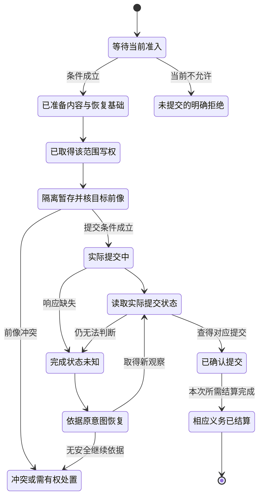
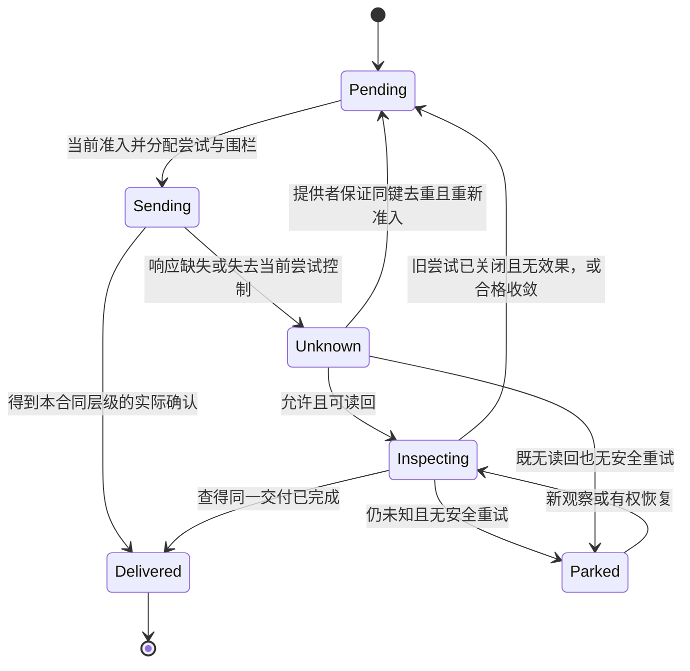
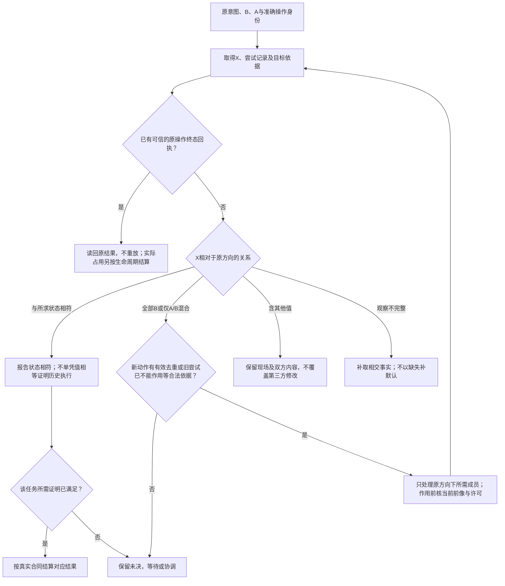

# 持久化提交与恢复

> **阅读范围**：采用范围内的设计规范；实现状态另查未决。

<details>
<summary>本页内容</summary>

- [任务合同改变时的持久关系](#任务合同改变时的持久关系)
- [事务化变更、读回与恢复](#事务化变更读回与恢复)
- [分布式事务、消息、重试、补偿与幂等](#分布式事务消息重试补偿与幂等)
- [分支、引用、工作树、候选与收口](#分支引用工作树候选与收口)
- [外部效果、不确定完成与权威读回](#外部效果不确定完成与权威读回)
- [文件系统无跟随能力对象与安全删除](#文件系统无跟随能力对象与安全删除)
- [迁移、升级、修复与恢复事务](#迁移升级修复与恢复事务)
- [幂等授权与出站交付协议](#幂等授权与出站交付协议)
- [提交恢复状态机与故障切点](#提交恢复状态机与故障切点)
- [核心数据存储与提交协议](#核心数据存储与提交协议)
- [备份恢复与权威重新加入](#备份恢复与权威重新加入)
- [源码写回与目标运行的边界](#源码写回与目标运行的边界)
- [持久控制面与运行协调](#持久控制面与运行协调)
- [数据库、内容寻址存储、日志与索引设计](#数据库内容寻址存储日志与索引设计)
- [高层变更的物理履约与参与者范围](#高层变更的物理履约与参与者范围)
- [依真实前后像选择恢复动作](#依真实前后像选择恢复动作)
- [最终所有者和跨存储发布顺序](#最终所有者和跨存储发布顺序)
- [层级状态的稳定宏步提交与恢复](#层级状态的稳定宏步提交与恢复)
- [物化关系的新代、输入边界与结果原子性](#物化关系的新代输入边界与结果原子性)
- [信息档案与原持久协议的接合](#信息档案与原持久协议的接合)

</details>


[Code-OSS 分项恢复](../../examples/原生维护/Code-OSS搜索替换.md#apply-recovery)将本章前后像与查回合同用于编辑器：模型编辑、磁盘保存及保存参与者分别结算。多模型撤销分组不提供多文件磁盘原子性；模型为意图后像而磁盘尚为前像时，只在当前守卫成立下继续保存，不重放整份替换。断电耐久性只按实际提供者能力声明。该实例不把持久队列或数据库强加给普通内存预览。


## 任务合同改变时的持久关系

持久保存原操作的目标、前后像、输入和方向，还要能解析该操作实际采用的行为/要求与实现版本。操作恢复不重新使用最新要求来计算另一份后像。相同逻辑请求内容变化，按已有幂等冲突处理；不能通过切换提供者或删除验收记录复活成新业务。

对作者采纳，候选和要求源可以在同一变更中修改，但接受关系要与所许可的修改原子一致。最终提交复核正读、负读、成员/规则范围和相交要求版本。只是修改实现时，原任务要求仍参与判断；读取到另一份新政策时根据其真实生效规则重评，不让旧候选自授予权限。

历史业务操作已经合法完成以后，新要求可以使未来采用资格变化，却不改写旧事实。需要把旧数据转到新合同，形成明确迁移。已准备但未完成操作遇要求或授权变化时，保持原意图并按当前准入、回滚或隔离条件继续，不把所有未完成操作无条件执行到底，也不清空恢复资产来追随新版本。

纯计算没有持久作用时，可以丢弃无消费者的派生缓存并在新请求重新计算；这一自由不推广到付款、消息、文件修改或仍被独立引用的证据。

## 事务化变更、读回与恢复

### 1. 目标

事务运行时把纯 `MutationIR` 安全地应用到真实工程。它不能在部分提交、崩溃、超时或响应丢失时报告虚假成功。

### 2. 状态机



本图突出选定提交协议的提交与未知分支；准备、写权、配额和媒体故障按下方完整分支合同处理。省略画线不表示不存在该错误，状态名也不能创造跨文件或跨系统原子性。确认提交后发现产物或业务问题，按新前像作前滚修复或明确补偿，不回到“从未发生”。正式检查与发布按另行要求处理，不是本图中的无条件后置阶段。

### 3. 准备日志

不可安全重复的写入前持久化：

```text
PreparedIntent = {
  executionId,
  exact plan,
  target roots,
  readSet,
  writeSet,
  preimages,
  expected semantic delta,
  staging plan,
  recovery strategy,
  authorityRefs and historical decision bindings,
  deadline,
  integrity checksum
}
```

对本节要求耐久意图的作用，日志写入并读回成功后才能执行；日志保存历史决定与引用，不把可执行凭证或旧grant当永久许可。恢复时由当前权威重新准入，纯候选不受这套效果日志前置约束。

### 4. 唯一写者与围栏

冲突域按语义写集、物理写集和外部效果计算。写者获得 Lease 和单调 `FencingToken`。目标适配器拒绝旧 token，防止失联旧主晚到覆盖。

### 5. 暂存

所有可暂存制品先写到 operation-owned 隔离根：

- 路径不可逃逸；
- 内容摘要和大小验证；
- 不执行生成文件；
- 与目标位于兼容文件系统或有明确复制恢复协议；
- 暂存资源记账；
- 崩溃后可识别归属和回收。

### 6. CAS

提交前同时检查：

- 物理字节前像；
- 语义对象 revision；
- 可写层；
- 所有权；
- 路径能力；
- 写租约和围栏；
- 目标仍适用；
- 相关策略和权限。

任一变化返回冲突并停止新效果。

### 7. 多文件提交

若 Host 支持目录或快照级原子交换，使用并验证。否则采用 journaled commit：

1. 记录提交顺序和每项状态；
2. 为每个替换保留前像或可恢复副本；
3. 每步完成后持久化并读回；
4. 崩溃恢复根据日志和目标状态继续或前滚；
5. 不把逐文件 rename 称为全局原子。

### 8. 读回

提交响应只是观察。终态由目标工作区重新读取：

- 路径和内容；
- 语义重新解析；
- 实际 Delta；
- 生成器和配置；
- 目标不变量；
- 外部发布状态。

### 9. 不确定完成

```text
UncertainCompletion
→ 检查持久日志
→ 查询目标和外部幂等记录
→ 重新观测
→ ConfirmedApplied | ConfirmedNotApplied | PartiallyApplied | StillUnknown
```

没有有效重复抑制的非幂等作用，只有确认未应用且重试安全才重发；仍在目标承诺的幂等窗口内，可用原键与原载荷按提供方合同查询或安全重复，不要求先证明未应用。两条路径都重新检查本次许可与剩余预算。

### 10. 回滚与前滚

若后继写者已修改目标，旧事务不能盲目恢复前像。优先：

- 对尚未公开的暂存直接丢弃；
- 对可安全逆转且无后继写入的本地变更回滚；
- 对部分提交生成前滚修复；
- 对外部不可逆效果生成补偿；
- 无法判定时保留现场与未结算责任，由实际有权主体按政策恢复、取得新观察或继续停放。

### 11. 验证失败

应用后验证失败不自动回滚。根据影响、可逆性和后继状态决定：

```text
hold candidate
forward repair
safe rollback
compensation
quarantine
authorized recovery or explicit unresolved responsibility
```

### 12. 故障矩阵

必须注入：准备前/后崩溃、写权丢失、暂存耗尽、CAS 冲突、每个文件提交后崩溃、读回不一致、验证器崩溃、日志损坏、旧写者迟到、恢复器重复运行和 Host 重启。

### 13. 验收

- 每个非终态有合法恢复下一步；
- 重放终态不重复效果；
- 部分提交可识别；
- 旧围栏不能写；
- journal 和目标状态可协调；
- 读回决定完成；
- 实际 Delta 可追踪；
- 后继写者阻止危险回滚；
- 资源和临时对象最终结算；
- 有权恢复者取得本次恢复所需的完整依据，仍遵守披露范围；角色不默认限定为人。

### 14. 本地持久写回配置

持久工作区适配器和文件宿主适配器共同承担本合同的可选本地落位。共同应用层先执行与新目录导出相同的资格检查和产物投影，再持久准备；不重写编译器、原生桥接或验收解释器。未选择写回的内存预览不导入SQLite或本模块。

本节配置的支持范围是一个受信POSIX本机根目录中的普通独立文件；配置是目标设计，不表示本包附有实现。合作写者经同一个作用域锁；外部编辑器不受该锁强制约束。前像检查能发现已观察到的外部修改，不能消除检查与rename之间的所有非合作竞态。需要抵抗这种竞态的画像必须使用真正的目标能力/句柄、隔离工作树或快照交换；不得把该配置的有限故障论证升级为敌对文件系统安全证明。

#### 数据与状态分别归属

本地小型恢复画像默认在`.sec/state/control.sqlite`保存以下五类逻辑记录（可按实现合并表）：`meta`保存根身份与当前头，`generations`保存不可变应用胶囊，`operations`保存精确意图与方向，`files`保存读集、写集和前后字节，`events`保存有序尝试与结算。小载荷暂时同库，是为了让内容、引用与准备意图处于同一真实事务；并不合并其语义，也不规定所有生产画像都使用同一个数据库。

头含`revision / desired / observed / observedRevision / active / fence / managed`。`desired`是本地已采纳代际引用，不是已经实现的文件树；`observed`是最近一次成功读回的代际，不是持续监控或部署事实。读回操作在合作锁内重读已管理文件，显示是否仍匹配；返回历史头不能代替本次读回。未跟踪的原生文件不自动成为该保证的一部分。

#### 准备、准入和结算

准备工作区操作接收结果引用、明确根、操作ID、预期头修订、逐文件前像和明确删除集；具体客户端函数名可以映射，不能重定义这些前提。相同操作ID只允许相同意图；修改代际、目标或资格要求要产生新意图。准备检查全部路径和载荷预算，冻结调用方输入，持久保存代际、前后字节与意图，然后返回；此时不采纳代际，也不改工程文件。

前像为缺失值`null`，或`sha256 + bytes + mode`；缺失本身是负依赖。新文件必须明确预期不存在，覆盖必须明确旧值，删除必须显式列出。调用方可以额外提交只读依赖。路径清单不是权限；检查器仍要取得受信宿主授权。`sec.workspace-observation/1`绑定根的规范路径、设备与inode；CLI拒绝误用另一根的观察。它是有限观察合同，不是有签名的外部证明。

准入在锁内重新检查全部前像、预期修订和活动操作，分别取得本地代际采纳与文件应用许可，再用一个SQL事务写入`desired`、递增revision/fence及活动意图。若该事务中止，全部数据库变更回滚。**数据库原子性不覆盖工程文件**。准入后出现故障，desired可以前进而observed保持旧值，且active阻止同一根继续接纳冲突操作。

应用先对完整声明读集作恢复预检，再按稳定路径顺序逐文件执行。每步允许当前内容等于前像或已达后像；两者都不等则停止，保留第三方字节。实际替换使用目标同目录临时文件，写入并请求fsync后再次检查权限与前像，再replace并请求目录同步。返回值含实际写入数和已匹配路径数；已经匹配不是再次执行。

全部声明文件与读依赖满足后，再读回并在单个SQL事务内更新observed、managed和终态。文件写回过程不执行目标文件中的程序，也不从字节相等推断已经理解业务语义。语义往返、业务不变量和真实部署仍需各自生产者；物理字节符合只支持本配置声明。

#### 恢复判定

| 持久状态或现场 | 合法动作 | 禁止动作 |
|---|---|---|
| prepared、没有准入 | 重新核对后准入，或显式abort | 因有准备记录就认定模型已采纳 |
| applying、每个作用点仍为前像或后像 | 取得当前许可，续做尚未达后像的文件 | 新建另一个操作重写全部文件 |
| 已替换、未记逐项回执 | 用意图中的后像读回并继续 | 因缺回执就恢复旧字节 |
| 已全部写完、最终SQL结算未提交 | 重读全部声明域并结算 | 将旧observed当作未发生写入的证明 |
| applied、响应丢失 | 读回并返回原终态与当前是否匹配 | 重放物理写入；把后来漂移改回旧值 |
| 任一文件既不是前像也不是后像 | recovery-required，展示具体路径和原操作 | 覆盖人工修改或猜测来源 |
| 数据库版本未知、内容摘要不匹配、根身份改变 | 停止，走显式迁移/可信恢复 | 自动重新初始化、导入未认证回执 |

#### 回滚不是时间倒流

prepared可abort；已经准入的未结算操作可以显式请求rollback。回滚方向先持久化，崩溃后必须沿同一方向恢复，不能默认又前滚。逆序检查每个写路径：等于前像则跳过，等于该操作后像才恢复持久前像，两者都不等拒绝。删除的旧内容来自保存的前像，不从其他文件猜测。

回滚成功使用**新的递增revision**恢复上一代引用，不把修订号调小；事件保留原采纳、部分作用与回滚过程。已settled的操作不能原地回滚，要基于当前头创建新的逆变更，避免覆盖后继合法写入。

回滚保证仅限明确文件及模式。新建但已为空的目录保留，不递归删除；目录ACL、所有者、扩展属性、符号链接和跨文件系统目录替换不在本节配置范围。目录清理和复杂元数据恢复必须另有归属记录与当前权限。

#### 权限、取消与恢复预算

采纳不蕴含文件写权，写权不蕴含采纳；恢复、回滚和代际加载也分别取当前权限。每个新文件作用前再次授权，临时文件就绪后替换前再检查。缓存和胶囊不保存永久许可。授权回调是受信宿主；跨服务实时撤销仍需目标端强制协议，不能把一次回调当全时段保证。

准入前取消不改变头。中途取消保留已发生字节和恢复记录；完成后才观察到取消，不降级真实完成。恢复尝试上限由所选宿主预算画像提供并绑定操作，次数不使用无条件全局常量。画像明确已开始尝试次数、剩余时限、I/O与恢复空间；缺少有效预算时允许状态读取和有权补齐预算，不自动重复写入。耗尽后返回有界停放与监督恢复条件，重复拒绝聚合为有界状态，不能通过删旧意图解除责任。文件数、保存载荷与操作数量另有上限；这些是本地默认预算，不是系统表达力限制。磁盘配额、I/O错误和物理介质故障仍需宿主提供。

#### 故障证据与强度

测试直接终止子进程，覆盖准备事务前/后、准入事务前/后、临时文件持久后、replace后回执前、逐项日志后、最终读回后、结算事务前及响应丢失。恢复进程没有原应用句柄，也不重跑编译器。另测两进程竞争、人工冲突、删除恢复、连续两次变更和回滚再崩溃。各故障方法只对实际执行的环境和切点提供依据。进程中止不等于主机掉电，SQL事务通过不等于普通文件整体原子。

#### 已确认的人工前像与历史生成代际

用户可以在准备新变更前明确接受已有人工编辑作为前像。回滚恢复的是该已接受前像，不一定是上一个生成代际的字节。恢复后再次比较历史 managed 清单；只有它确实匹配，才把旧 observed 绑定到新修订。否则保留恢复后的 desired 引用，把 observed 清为空、observedRevision置0，并让当前读回显示不匹配。不得因为操作名叫回滚就伪造“已恢复到旧制品”。反例是：第一代应用后人工修改，第二代以人工内容为已确认前像；第二代失败回滚恢复人工内容，不得签发第一代生成制品已恢复。历史案例ID无需作为本设计包的运行入口。

## 分布式事务、消息、重试、补偿与幂等

### 1. 跨系统 Effect 通常不可原子

数据库、消息、支付、部署和外部 API 不能假设共享一个 ACID 事务。SEC 必须显式建模部分完成和补偿。

### 2. DistributedOperation

```text
DistributedOperation = exact {
  operationRef,
  participantAndAuthorityRefs,
  stepDag,
  messageAndIdempotencyKeys,
  localTransactionBoundaries,
  deliveryAndOrderingContracts,
  compensationOrForwardRecovery,
  readbackAndReconciliation,
  deadlineAndRetryPolicy,
  terminalAndResidueSemantics
}
```

### 3. 消息语义

at-most-once、at-least-once、effectively-once 和 exactly-once scope 分开。消息去重不等于业务 Effect 幂等；consumer 需要 durable idempotency record 与业务前像。

### 4. Saga

补偿不是回滚：可能不可完全恢复、依赖新状态、失败或产生新外部性。每个 compensation 有独立授权、风险和验证。

### 5. Outbox/Inbox

需要数据库状态与消息一致时，使用 outbox/inbox 或等价机制；仍需处理重复、乱序、迟到、清理和 schema evolution。

### 6. 不确定完成

外部完成未知时，按实际端点合同使用原 operation/idempotency identity 读回，或在真实同键去重保证内重试。两者都不具备时保留未决并进行有权协调，不用新身份盲重发；timeout本身不证明失败或未执行。

### 7. 验证

网络分区、重复、乱序、消息丢失、consumer crash、补偿失败、旧消息晚到、schema mismatch、duplicate external effect、clock skew 和 poison message。

## 分支、引用、工作树、候选与收口

### 1. Transport 不是语义

branch 名、PR、commit history 是协作 transport。正式候选由 base tree、candidate tree、Work Package 和验证代际定义。

### 2. 生命周期

```text
prepare candidate
→ freeze candidate tree
→ verify/review
→ integrate expected tree
→ read back new main
→ close PR disposition
→ worktree closeout
→ branch/ref CAS deletion
→ prune/readback
→ terminal receipt
```

### 3. Closeout

远端 merge 成功不是开发 operation 完成。local main、worktree registry、物理目录、local/remote refs、recovery bundle 和 control projections 都需明确终态。

### 4. Recovery

删除 ref 前生成 durable recovery，绑定 exact SHA/tree、owner、purpose、expiry 和 retirement。recovery ref 不能永久保留，也不能在无法恢复时盲删。

### 5. CAS

remote ref 使用 expected SHA lease，local ref 使用 expected object identity。prepare/finalize 之间变化必须拒绝。

### 6. Worktree residue

registry 已注销但目录删除失败时，保存外部 durable authorization，允许有界 resume；没有授权的历史 orphan 永不自动 adopt/delete。

### 7. 验证

压缩合并、强制推送、脏根工作区、关联工作树、Windows 待删除状态、关闭但未合并、恢复制品损坏、管理员旁路、本地主分支分叉和重复收口。

## 外部效果、不确定完成与权威读回

### 1. Provider 返回值不是现实终态

网络、云、支付、GitHub、部署平台和设备可能在返回前、返回后或超时期间完成 Effect。完成判断必须依赖权威状态查询或独立 observation。

### 2. ExternalEffectReceipt

```text
ExternalEffectReceipt = exact {
  operationAndAttemptRef,
  providerPrincipalEndpointRegion,
  requestAndIdempotencyIdentity,
  submittedPayloadDigest,
  providerResponseObservation,
  authoritativeReadbackMethod,
  readbackSubjectAndResult,
  consistencyAndFreshness,
  unknownAndResidue,
  terminalClassification
}
```

### 3. 终态

```text
confirmed-succeeded
confirmed-failed-no-effect
confirmed-partial
completion-unknown
requires-authorized-reconciliation
compensated
```

`requires-authorized-reconciliation`表示需要实际有权的协调与决定，不必然是人工。读取曾使用`requires-human-reconciliation`的旧协议时，仅在已声明版本映射内保留原限制；新规范不静默扩大旧客户端权限。

### 4. 重试

重试依据必须同时覆盖原意图、原尝试和真实作用边界。可采用仍有效的目标端同业务身份去重；也可在已排除旧尝试以后仍会生效的前提下，由权威读回确认所要求范围内未发生Effect，再经当前准入发起新尝试。仅收到404、空列表、X=B、超时或取消已受理，均不能单独建立后一依据。更换request ID可能创建重复业务对象；提供者接受某个键字段，也不等于它兑现了同意图去重合同。


<a id="attempt-finality-and-retry"></a>
#### 旧尝试关闭与可继续动作

`execution`在原ExternalEffectReceipt、意图和尝试记录上计算有限的`RetryBasis`，不新增一个业务结果库。需要的输入是：原业务身份/载荷、所有仍可能作用的尝试及转交子操作、准确端点/主体/地域、实际作用种类、权威观察切面、目标去重或最终拒旧能力、当前恢复许可与预算。已存回执缺少其中的依据时保持未知；不能为兼容旧编码把“没有该字段”补成已终止。

这里的**尝试关闭**是“该尝试及其已转交工作不可能在此后再产生本次要保护的作用”，不是“客户端已结束等待”。可以由目标侧不可逆的终态承诺、真实撤销提交排斥、已加入并确认停止的本地工作，或在最后作用点真正执行的拒旧协议提供。仅换本地租约、停止发新请求、断开套接字、收到取消请求的确认、读一次强一致对象列表，都不能代替这个未来约束。即使目标用单调围栏，已经越过最终准入点的工作仍须结算；围栏是否排斥它由真实目标协议决定。

| 内部依据 | 需要实际成立的条件 | 允许继续什么 | 不允许推出什么 |
|---|---|---|---|
| `TargetDeduplicates` | 相同意图、受信命名域及全部作用仍处于目标真实去重窗口，载荷完全匹配 | 按同业务身份、同合同继续调用；产生新的调用尝试但不造新业务意图 | 请求体看起来一样或本地缓存过结果就有目标去重 |
| `ClosedNoEffect` | 所有旧作用尝试已关闭；覆盖所要求效果的权威观察在关闭后取得，或由同一终结证明同时包含无效果 | 当前资格/前像复核后，为原意图发起新尝试 | 当前资源不存在证明过去没发通知，或瞬时未见证明以后不生效 |
| `ProtectedConvergence` | 原任务明确只要求某种可收敛状态；目标比较/版本协议涵盖该要求，全部可观察附带效果也符合允许的重复合同 | 在该有限要求内推进相同目标值，保留其他历史效果的未知 | 值最终相同就有exactly-once、费用不重复或历史执行证据 |
| `WaitOrReconcile` | 上面均未成立；包括只取得点时不存在/前像、拒旧未覆盖远端、去重已过期 | 继续有界权威观察、等待实际终态，或由有权者形成明确补偿/新协调 | 默认重发、用新键绕过去重窗口、把人工确认当无效果证明 |

`ProtectedConvergence`不是默认弱化。普通覆盖文件也可能触发watcher、增版本或计费；这些是任务所约束的效果时必须包含在依据中。旧尝试已经完成又被别的主体删除资源时，当前“不存在”不撤销历史完成。需再次创建是新的、有权的业务意图，不是原意图恢复。

具体恢复次序为：**F0**取得可信原意图及相交尝试集合；**F1**先读取原终态/去重合同，能直接读结果就不写；**F2**把`observedAbsent`和`attemptsClosed`分别归类，必要时请求目标停止并等待其实际终结；**F3**在关闭以后捕获所需无效果观察，或验证目标去重/收敛合同的准确范围与期限；**F4**在本地短原子段内占有原意图的新尝试、重新核当前权限/前像和依据有效性；**F5**按原载荷发送并分项结算，响应再次丢失就记录这个新尝试，不能回到“不存在所以重发”的循环。等待期间不持有业务提交锁，真实已付费用和仍使用的资源不退回。 使用有期去重时，窗口必须覆盖旧尝试可能到达并被执行的范围，不能只在新请求发出瞬间尚未过期就认为安全。网络延迟无可靠上界而提供者又不拒绝过期意图时，客户端无法自行保证此覆盖；应取得旧尝试关闭、使用真正长期识别/拒旧能力，或保留未决而不自动重发。

F4的短协调只比较已取得依据、原意图与本地代际并登记下一尝试；外部查询、取消和网络等待在锁外。真实写入前仍由原最终作用边界核有效许可、围栏/前像与目标去重条件，不能把登记时成立的本地检查当成随后任意写入的永久许可。

所有未来尝试的准入和旧尝试集合更新必须由同一操作拥有者串行化；关闭集合后另一执行者重新发送旧尝试，会破坏F3的前提。跨端点没有共同拒旧/去重时，停止自动重发而不是声称本地锁已解决远端重放。在途外部工作不能被枚举或关闭时，选择`TargetDeduplicates`或保持未决；没有要求纯计算逐次持久化这些记录。

**最小反例：** t0提交A，t1客户端超时，t2目标强一致查询仍不存在，t3客户端提交B，t4与t5两个创建分别完成。t2的观察可以完全正确，错误在于把“当时没有”推成“A以后不会发生”。修复的成功轨迹一是A/B共用仍有效的目标业务键，另一是取得A不可再作用的终态后再核无效果；仅多等几秒或多查几次不是第三种证明。

依据与限制见[重试、晚到和保留期](../依据/来源/存储关系与交付.md#retry-finality-sources)。恢复方案是SEC的合同选择，不宣称各提供者已经具备这些能力。

### 5. 无读回 Provider

外部系统没有可靠查询时，先检查是否有真实、仍有效的同业务身份去重或其他安全重试合同；具备时可以按该合同继续。查询和安全重试均不可用时，保留完成未知与残余责任，不盲目重放；由实际有权主体取得其他合格观察、采用补偿或接受相应风险。人工确认只在政策要求且能提供决定性依据时使用，不能让点击确认变成外部未发生的证明。

### 6. 验证

提交后超时、重复响应、最终一致性延迟、Provider 模式漂移、地域或主体绑定错误、批处理部分完成、补偿失败、读回陈旧和外部人工变化。

## 文件系统无跟随能力对象与安全删除

### 1. 字符串路径不是写入或删除能力

高风险 I/O 需要一个经过授权、保留物理身份且限制作用域的 capability，而不是重新拼接绝对路径。

### 2. PhysicalPathCapability

```text
PhysicalPathCapability = exact {
  rootLogicalRef,
  retainedRootPhysicalIdentity,
  allowedRelativeScope,
  allowedOperations,
  objectKindPolicy,
  symlinkReparseHardlinkPolicy,
  expectedPreimageRefs,
  deadlineAndResourceRefs,
  authorityAndAttemptEpoch
}
```

它不可通过序列化复制后扩大，也不能跨 attempt 自动复用。

### 3. No-follow traversal

逐级打开 retained parent，不跟随未知 symlink/junction/reparse；每个 leaf 验证种类和身份；操作前 CAS，操作后 readback。词法 `path.resolve` 不能替代此证明。

### 4. 安全删除

```text
inventory
→ classify owner/liveness/retention
→ determine reclaim eligibility
→ authorize exact identity
→ optional quarantine handoff
→ bounded physical settlement
→ ENOENT/object-identity readback
→ receipt or residue
```

年龄、目录名、ignored、大小和磁盘压力只能在已证明 eligible 集合中决定优先级。

### 5. Quarantine

用于将 operational terminal 与慢删除分离。quarantine 是 owner-bound durable 中间态，不是垃圾箱；保留 recovery、GC authorization、expiry 和 resume。

### 6. 平台

Windows EBUSY/EPERM/long path/reparse 和 POSIX unlink/openat/inode/mount 分别实现。一个平台测试不能替代另一个。

### 7. 验证

根对象替换、祖先符号链接、叶节点硬链接、大小写或 Unicode 别名、删除竞态、未知子对象、只读对象、目录非空、跨设备边界、注销后崩溃和重复调用。

<a id="本地参考的较弱保证必须显式标识"></a>

### 路径与合作锁画像的保证边界

采用路径与合作锁的Workspace画像时，须检查根设备/inode，拒绝控制文件混入输出以及不允许的符号链接、硬链接、文件/目录冲突与可移植名称碰撞；读文件比较读取前、文件描述符与读取后的身份和属性。这种画像不是完整的句柄能力实现，不承诺阻止恶意父目录替换、路径重定向或不合作编辑器的最后时刻竞态。需要更强保证时采用相应隔离或句柄机制，不能从路径检查通过推导该保证。

操作临时文件由持久意图和确定名称定位；只有内容与模式匹配已登记前/后像才可自动清理，未知或部分临时数据保留现场并进入有权的恢复分析；只有实际政策要求时才转人工，不一律unlink。回滚后空目录有意保留，不按目录名递归删除。更强画像应实现受约束句柄遍历、排他工作树或原子快照，再用同一并发与故障语料验证。

## 迁移、升级、修复与恢复事务

### 1. 统一骨架，专用语义

升级、数据迁移、依赖替换和自动修复都使用同一 Operation/Plan/Admission/Journal/Readback 骨架，但每种操作有不同 correctness、compatibility 和 recovery 义务。

### 2. MigrationTransaction

```text
MigrationTransaction = exact {
  migrationRef,
  oldAndTargetGenerationRefs,
  compatibilityDecisionRefs,
  operationDag,
  perStepPreimageAndPostcondition,
  irreversibleStepRefs,
  checkpointAndJournalRefs,
  compensationOrForwardRecoveryRefs,
  verificationAndCutoverRefs,
  backupAndRecoveryAssetRefs,
  terminalState
}
```

### 3. 计划必须零写

`plan` 和 `dry-run` 不修改 source、control、lock、provenance、artifact 或数据库。需要保存计划时，由独立 `save-plan` Effect 操作拥有目标和 readback。

### 4. 安全变换

JSON/path 拒绝 prototype pollution、非普通对象和未知字段；文本替换绑定 old digest、expected match count 和 result digest；regex 有复杂度预算；数据库和代码迁移使用结构化 Provider，不能用字符串定位模拟语法。

### 5. 恢复资产

backup 必须来自 exact observed state，有 manifest、digest、范围、保留和 restore drill。恢复失败时保留唯一备份和 durable `recovery-required`，不能在 `finally` 删除。

### 6. 自动修复

修复只针对精确 Failure/Claim/Responsibility，修改最小影响闭包。已有人工实现不能被模板整体覆盖。`applied` 只说明 Effect 提交，`repaired` 需要新 revision 的 required Verification。

### 7. 验证

- plan 零写；
- stale source/plan；
- 第 N 步失败；
- restore 中途失败；
- 外部 writer 新增数据；
- irreversible step；
- retry/replay；
- unsupported operation 不能伪通过；
- rollback 与新 schema 不兼容；
-修复后验证未执行。

## 幂等授权与出站交付协议

### 适用对象与唯一责任

本合同约束有持久状态和外部交付义务的业务操作，也约束模型采纳等内部写操作。它区分一次业务提交、一次调用尝试、一个结果读取和一次外部发送，不能用一个请求ID替代所有身份。

本合同不重新定义产品状态机，不要求纯函数引入幂等数据库，也不保证所有网络通道恰好一次。

### 幂等域

默认键为 `(工作区或租户的稳定命名域, 受信幂等主体, 客户端请求ID)`，操作种类与全部影响意图的语义载荷进入版本化请求摘要。相同键同载荷按当前披露权限返回原结果；相同键不同操作、实体、前置版本或语义理由产生`IdempotencyConflict`。主体来自真实调用上下文，默认是承担该意图的稳定用户/服务主体；代理尝试身份单独审计。被授权接手同一意图的另一执行者不因换Agent、令牌或会话而获得重新执行的理由。

不同协议若确需独立键空间，先显式声明生产者命名域/格式版本，不能临时将方法名插入键来绕开本合同。命名域迁移保留旧记录的精确解释，不静默重算旧键。未被承诺为等价的理由变化属于新载荷；纯显示注释是否排除由合同明确。

幂等键不能只由租户和文本请求ID组成，否则两个主体可能互相冲突或读到彼此结果。也不能直接把正文中的 `principal` 当可信身份。真实主体必须来自受信认证上下文，请求 Schema 不能通过自填主体取得身份。

### 三种授权不能混同

初次执行检查业务动作权限；重复结果读取检查当前披露权限；未完成操作需要继续执行时重新进行效果准入，已完成操作不因读回失败而变成可重放。初次授权结果不永久授权未来读取，同样，当前拒绝读取也不意味着旧操作从未提交。

单机画像将动作角色、政策revision与业务状态读取置于同一数据库事务。生产外部授权系统必须明确撤销新鲜度和提交点协议。将一个过时缓存判断粘进事务不能宣称已经解决权限竞态。

### 提交原子集

```text
一次业务提交
  = 条件状态更新
  + 业务审计
  + 出站事件
  + 幂等请求结果
```

上述集合只包含本次真实要求的记录；没有业务审计或外部交付义务时不创建空审计或outbox。有这些义务时，所要求集合必须同事务可见。回复必须在提交后；没有提交的内存结果不能先发送给用户。只在提交之后异步调用外部通知，避免慢网络锁住业务事务。数据库原子性来源、隔离条件和耐久假设见机制依据 [S1](../依据/来源/存储关系与交付.md#单独的来源定位)[S2](../依据/来源/存储关系与交付.md#单独的来源定位)。

#### 顺序

1. 严格解析、认证调用上下文并确定幂等命名域；不得通过可猜键跨主体查找。
2. 在适当一致性边界内部查询受信作用域的原记录；对外返回是否存在、冲突或结果前，先应用当前披露规则，再核对或报告规范摘要关系。已提交的同请求进入结果读回；读许可不足时不给出可区别隐藏记录状态的额外诊断，不改写旧提交事实，也不因无新写权而重执旧动作。
3. 记录不存在才进入新动作准入；取得当前业务写权限、证据和审批，固定其提交点及撤销条件。
4. 在提交事务内再次占有/检查同一键，读取前像、适用规则目录和不变量，处理并发先提交者。
5. 同事务保存条件状态更新、必要审计、出站事件和幂等结果；冲突不产生部分提交。
6. 原子提交后，再按当前披露条件返回结果；响应丢失沿同一键查询，剩余外部交付独立结算。

新写许可、旧结果读取许可和恢复/重试许可不互相代替。并发操作返回的错误也按披露边界处理，不暴露另一个主体的载荷。“新请求发现已经处理”与“同请求读回原结果”仍是不同业务情况。

### 出站交付状态



Delivered只表示选定交付确认层，不自动表示最终用户收到。租约到期不证明旧发送未发生；新围栏仅能限制参加该协议的写者，不能单独防止外部重复副作用。Parked保留义务而非强制某个人工角色。
有限参考把未知发送继续保留在 `sending` 与到期时间中，没有实现网络提供方读回。生产合同应显式记录发送尝试和结果不确定性，不能把租约过期等同于“外部未收到”。

`eventId`标识稳定业务事件；`deliveryToken`标识某次占有；`worker`标识执行主体。接管使令牌单调增加。旧工作者即使迟到，也不能确认或覆盖新工作者的状态。令牌阻止本地旧写，不阻止已发到外部的重复消息。

### 时间与恢复

持久租约使用具有明确 epoch 和来源的时间合同。跨进程重启不能比较失去共同基准的单调时钟值。墙钟前跳可能导致提前接管、后跳可能延迟恢复；因此重复交付安全来自稳定事件身份与接收方幂等，不来自“时钟永远正确”。

同一受控时钟域内的时间推进检查，只覆盖该时间域的过期、接管与令牌关系。跨时钟偏移、失联节点和远端撤权，需要各自的宿主合同与依据，不能从一次本地逻辑时间检查推出。

### 清理与保留

幂等去重窗口必须覆盖本协议允许的重试、队列延迟、离线续做和恢复重放范围，或由更长期的目标端去重/显式拒旧机制接管。仅选一个方便的TTL，不足以证明删除记录后旧作用不会再发生。窗口不能取得有限上界时，在“保留紧凑拒旧记录、拒绝超期请求、借助目标长期去重、明确放弃无限期保证”之间选择，不伪造通用有限保留期。

域代际用于拒绝旧命名空间时，由受信端持久维护其可接受下界；它不是每次令牌刷新或重启就生成的新重试键。旧备份不能把已拒绝的代际重新开放。超期请求没有原结果可读时返回`deduplication-window-expired`及未知边界，不等于未执行；产生新意图必须先做相应业务协调。

日志压缩可将大响应移走而保留必要的键、请求摘要、终态或响应定位，但不能因此永久保留无用个人内容。幂等、审计、出站消息和删除义务各有保留政策；来源摘要和墓碑本身也可能敏感。恢复后先沿[隔离恢复](#备份恢复与权威重新加入)取得足够的拒旧依据，再开启交付。

同一键安全重复可以在上次完成未知时成立；它要求真实目标端合同、相同意图及仍有效的去重范围，不从HTTP动词或客户端缓存名字推导。重复结果的状态码或观察时间可以不同，业务意图的重复抑制不等于回包字节永远相同。[RFC 9110 §9.2.2](https://www.rfc-editor.org/rfc/rfc9110#section-9.2.2)提供此处的协议依据，不替代具体业务和保留期设计。

### 成本与替代

数据库状态表加审计和outbox适合当前单机一致性要求；把所有历史改为事件溯源不是必要前提。高吞吐系统可采用分区、批量投递与有界并行，但不得改变每聚合版本序、权限与幂等域。

对只需短期、可重复副作用的操作，内存去重更轻，但不能宣称跨崩溃有效。对外部本身具有强幂等语义的接口，可复用其键合同，仍需绑定真实主体、端点和保留期。[S3](../依据/来源/存储关系与交付.md#单独的来源定位) 对自动重试的限制只提供协议边界，不替 SEC 推导业务幂等。

### 关键反例

同租户不同人相同请求ID；同请求换操作；授权撤销后读缓存；审批与取消并发；状态提交而审计未提交；通知成功但确认丢失；旧worker接管后迟到；时钟大幅跳变；幂等记录被回收；恢复旧备份；跨租户消费；令牌整数溢出。

模拟时钟参数不构成远程时钟验证。事务、重复、竞争、进程退出和围栏分别按实际方法及环境验证；进程故障不能代签掉电、介质或跨节点时钟保证。

## 提交恢复状态机与故障切点

### 规范归属

原[核心提交协议](#核心数据存储与提交协议)拥有内容与元数据的顺序，本篇将其展开为实施状态、边界错误和故障试验。模型事务与外部效果是两个相关但不同的状态机；不能用一个 `done` 字段同时表示数据库提交、消息已发、远端效果已完成。

### 模型操作的状态与转换

`proposed → prepared → content-ready → committed` 是含CAS内容的写入路径；纯元数据变更可以从prepared进入committed。`prepared/content-ready → aborted` 仅在围栏和提交排斥条件成立后允许。`committed`不可回退成aborted；业务撤销是新的操作。发生介质损坏或无法判断外部状态时进入恢复分支，而非把历史记录改成未发生。

准备事务登记 `operationId, requestDigest, scope, baseRevision, authorityRevision, fence, expectedWriteSet, contentPins`。同一幂等键不同requestDigest返回冲突。相同请求重试先读记录，已提交返回原结果；未提交继续时重新检查当前权限、前像和围栏。外部返回给无权调用者的结果必须仍经过披露授权，幂等查询不是数据泄漏通道。

提交在线性化点之前同时检查：当前写scope的围栏；权威revision/许可；精确前像或受支持的不变量冲突规则；准备状态；完整内容可达性；请求摘要；事务内约束。然后在同一个DB事务写模型变化、操作结果和outbox。任何一项失败，DB事务不产生部分模型变化。权威撤销若发生在提交之后，它不抹除已提交事实，但禁止后续新效果；发生在提交之前则由同域revision检查拒绝。

围栏token的意义是存储拒绝旧owner，不是计时器认定旧进程已死亡。发出新token与受保护存储比较必须有同一可线性化排序，不能从应用时间戳猜测。租约用于安排进度和活性，围栏用于迟到写入的安全性。

### 响应丢失与两类重试

DB提交后到响应前中止：恢复者查询operationId；结果存在就返回原结果，不再重复更新。提交前中止：若没有已提交记录，按准备、内容和权限重新选择继续或取消。请求是否提交不能仅靠客户端超时判断。

数据库冲突属于可重新计算的计划；外部效果未知属于必须读回的结算。两者不能用同一 `retry()`。所有重试都携带预算和诊断，有限确定性失败不能指数退避后无限重放。

### 出站交付状态机

`pending → dispatching → acknowledged`；响应丢失进入 `outcome-unknown`。如果远端支持稳定幂等键与权威查询，可以用相同业务效果ID重复询问/投递并确认；若不支持，则保留未知、停止可能重复的不可逆投递并要求有权处置。至少一次消息传递不能推导任意远端恰好一次效果。

队列消费者资格与领取代次要在结算时检查；旧领取者不能把新尝试标为成功。outbox与模型同事务，但远端ack不在本地事务里。顺序有业务含义时携带聚合revision；接收者检测缺口、重复与超前，不按到达时间猜顺序。

### 内容库、GC和恢复

内容发布后、DB引用前中止：存在带准备pin的孤儿，可以后续继续或回收。DB可见引用前必须确认目标内容合同满足。GC看到无引用不是立即删除权；其隔离代次与新引用提交排斥。取消准备先使未来提交不能成功，再移除pin，最后择机回收。读者需要的恢复根、证据根和租约pin不得因磁盘满而误删。

远端CAS允许内容暂未物化时，主体状态应明确pending-materialization，不能复用完整制品状态。备份包含DB快照和该快照可达内容，不要求复制无关缓存。恢复后核对外部已发生效果与权限变动，避免从历史备份重复执行。

### 故障切点与明确Oracle

| 切点或攻击 | 注入 | 必须观察到的结果 |
|---|---|---|
| 准备前 | 进程立即结束 | 模型、操作与outbox均无新增 |
| 准备提交后 | 进程中止 | 准备可解释，模型未变，可恢复/取消 |
| DB写模型后、写outbox前 | 强制中止或异常 | 全事务回滚；不能有模型变而outbox无记录 |
| DB提交前 | 强制中止 | 旧头与旧值完整 |
| DB提交后、响应前 | 强制中止 | 新头、操作结果和outbox一起存在；重试不重复 |
| 同前像双进程写 | 同时提交 | 至多一个成功，另一个冲突，不丢更新 |
| 不同请求共用幂等键 | 重放 | 摘要冲突，不返回另一个请求的成功 |
| 旧围栏 | 先换代再提交 | 旧owner被拒绝且无模型变化 |
| 权限revision变化 | 撤销后提交 | 新效果被拒绝，历史查询按披露政策 |
| 远端ack丢失 | 已收而本地未知 | 幂等可查询时正确读回；否则保留未知 |
| 磁盘/配额不足 | 内容或事务失败 | 不宣称成功，保留唯一恢复材料 |
| 媒体损坏 | DB或blob被破坏 | 完整性检查阻止提升，进入隔离恢复 |

每个试验记录OS、文件系统观测、数据库版本、PRAGMA、进程数量、注入点、原状态、最终读回与清理。SIGKILL/进程强制结束只证明当前进程中止情形；无证据时不能推广到主机掉电、控制器缓存失效或远程网络盘。

### 安全性、活性与有限模型

安全不变量：同操作至多一个模型提交；提交与outbox一致；旧围栏不写；前像冲突不丢更新；未提交操作不获得提交结果。活性另需假设：存储最终可用、重试有调度、权限仍足够、外部读回可得。缺这些条件时正确结果可以是等待、取消或保留责任的有权恢复，不保证无限期网络分区下所有任务完成；取消仍不等于外部已停止。

采用有限状态探索时，公布变量范围、转换、实际访问范围、截断与失败轨迹。有限实例检查只支持对应范围，不是对无界进程数或任意实现的证明。验证方案包含移除围栏检查、把outbox移出事务的故障变体；实际执行后应检出所针对反例，否则不能用“正常通过”支持关键设计。

## 核心数据存储与提交协议

### 三类数据不可混淆

权威模型、操作状态和提交记录保存在事务元数据存储；不可变源码/模型/制品大对象保存在内容库；可重建索引和缓存只加速读取。生产实现必须验证存储介质、fsync、锁与恢复合同，不能因为文件有摘要就假定它已经持久落盘。

启用跨重启恢复与持久操作时，首个本地参考部署选择单机SQLite元数据与本地内容库，便于对应本地项目、原型测试和离线运行；仅内存查询、设计整理或不需要持久恢复的嵌入式实例不创建该层。生产多节点写入不是这个部署的隐含能力，必须换用有明确一致性与故障合同的Provider。SQLite具体事务/隔离以其官方文档及实际测试为准；本设计没有把两种存储变成一个跨系统原子事务。

### 关键记录

模型头、实体revision、关系索引、已提交语义事务、幂等结果、出站事件、制品manifest、blob引用、准备中pin、执行journal、Evidence索引分别具有单一owner。模型历史不可原地改义；删除用tombstone和可解释的保留策略。

### 内容与数据库的安全顺序

1. 先在事务存储登记准备操作、目的、对象摘要和保留pin，防止并发GC误删。
2. 在owned staging路径写内容并校验摘要，flush/fsync文件；按物理Host合同发布到不可变对象名；目录耐久能力单独处理。
3. 重新读回对象身份、大小和摘要；内容相同可复用，内容不同且同地址视为损坏，不能覆盖。
4. 在数据库原子事务中检查前置条件、登记blob引用和manifest、更新可见模型/制品头、写幂等结果与outbox，移除或转换准备pin。
5. 提交成功后再向调用者确认。确认丢失按操作ID读回，不重复效果。

若步骤2后、步骤4前崩溃，对象可能成为已登记孤儿，但不会有数据库已承诺引用缺失内容。若DB提交后磁盘或硬件丢失已刷写数据，则进入介质损坏恢复，不得声称协议消除了所有物理风险。

### 为什么不先提交引用再写文件

那种顺序会暴露指向不存在内容的生效模型。用“后台稍后补文件”隐藏缺口会让读者把暂缺误当不存在或损坏。对于允许异步内容到达的远程系统，应显式使用待物化状态，不能复用完整发布状态。

### 垃圾回收

强内容闭包按[目的性保留边](../信息/存储保留与恢复.md#retention-types)解释：普通文档超链接、mentions和单纯来源叙述不是GC强边；活动读取、发布、复验、恢复和真实hold分别取得所需根。提供者只理解部分关系时，不能擅自把未理解边当弱边；按本节的未知闭包规则处理。

回收范围仅含已登记内容及实际可达引用、准备pin、读者租约、执行、证据和恢复保留。年龄、大小、目录名和磁盘压力只为已经有资格的集合排序，不授予删除权；未知/foreign文件不被认领。小型内存结果由所有者/arena释放，无持久回收协议。

默认内容元数据以`Live → Reclaiming → Removed`状态与代际CAS协调引用发布和回收。生产者先确认字节可用，再在发布引用的同一元数据事务里取得pin或根引用；`Reclaiming`对象不接受新pin。收集器在同一协调域内确认没有根与pin，标记回收，再在其专用代际命名空间删除并读回；写者遇到回收中对象要等待，或在确认旧删除尚未开始且撤销可原子生效时取消回收，或重新提供新代际完整内容，不能在检查后无保护地提交引用。物理存储必须按实际对象版本条件删除，或为不同代际使用不同路径；只有内部整数代际、但最后仍无条件删除同一个摘要路径时，旧收集器仍会删除后来重建的相同内容。宿主不支持这两种方式，就在旧回收完成前禁止重用该物理位置。

发布根保护其完整可达内容，而不只是清单自身。新根准入须确认其传递引用都已有有效持久根保护或取得准备pin，且没有成员处于Reclaiming/缺内容；无相交引用变化的已保护子树可复用其保护，不能只给顶层清单加pin就假称子节点安全。未知引用种类无法给出完整闭包时，拒绝该完整发布保证或保守保留相交域。

标记基于固定的根/pin目录代际；进入Reclaiming前，在同一元数据协调域复查该代际或等价写屏障。若遍历后新增了根而没有重验，旧“不可达”结论无效。默认保守重启受影响标记/重新检查；高并发可采用有证明范围的并发追踪屏障，不按墙钟先后猜根可见性。新根遇到已开始回收的成员，须等待并重新供给或拒绝本次发布；增加根目录版本不能撤销已经执行的物理删除。

读者先取得有效租约/pin再取内容；租约续期失败后不能假定远端对象永远存在，应重新取得保护或返回陈旧/缺内容。活动恢复意图与唯一回滚前像用明确持久根保护，不因执行者失联或普通读租约超时被删除。准备中止须保证后续发布失败后才能释放最后保护。

标记遍历遇到未知引用种类、损坏索引或不完整扩展时，保守保留相交域并报告不能确认；不能把遍历失败解释为不可达。共享blob的物理删除要满足所有实际引用与各自保留义务；删除一个租户的逻辑索引不能删掉另一个有权租户的内容，反之还有共享副本就不能声称已经物理擦除全部字节。

为减少停顿可以分代标记、并行清扫或外置CAS，但需保留上述引用发布屏障和读者规则。默认宁可延迟释放，也不靠“先检查无引用、稍后删除”制造丢数据竞态。

### 临时引用与恢复根不能使用同一到期规则

候选和产物的短查询引用可以到期，活动计算的输入必须先经原子占用保护，未结算操作的前后像、意图和必要依赖由恢复根保护。占用与原先根集合的变化仍参与[垃圾回收](#垃圾回收)的协调，不把已经进入Reclaiming的内容凭一份旧清单重新认领。

引用到期后可以按当前许可重新解析或从持久作者源重建，但新解析不继承旧权限；运行中的占用转为孤立时，必须有确认终止、租约/目标隔离或新的恢复拥有者后才能释放。无法确认不受控工作进程是否仍使用资源，不可直接删除其唯一恢复内容；同时需要有限配额和人工可审的残留状态，不能永久pin所有历史。

内容可重建不等于具体操作结果可丢失。清理纯缓存只影响复算成本；清理幂等结果前必须满足重试/离线窗口或目标拒旧合同，否则相同旧请求可能重放真实效果。上述管理在宿主内部执行，不要求AI每次预览传入pin、lease或GC字段。

### 事件与消息

模型提交和outbox同事务。发布器可重复投递，消费者按事件身份去重或以幂等状态转换处理。事件到达顺序不等于模型语义顺序，消费者必须按前提revision判断。系统不宣称对任意外部邮件、支付或远端副作用具备恰好一次。

### 备份与恢复

备份属于需要恢复能力时启用的生命周期，不是每次设计编辑的前置。manifest绑定一致数据库切面、blob根和实际内容、格式/解释版本、必要密钥可用性、控制域与删除/撤销观察位置。备份完成只在这些依赖实际可取得并经过读回后成立；只保存摘要、只复制正在写的数据库文件或漏掉恢复密钥都不够。

完整的隔离、拒旧、权威重新加入与外部结算由[备份恢复与权威重新加入](#备份恢复与权威重新加入)规定。唯一恢复副本不能在失败finally中删除；备份存在、可读、能重建和能安全重新执行分别记录。

### 故障测试

在准备登记、内容写一半、fsync前后、对象发布、DB提交前后和确认前后逐点中断；模拟磁盘满、权限、同名损坏对象、GC竞争、重复请求、外部内容库超时和数据库锁；验证只有明确完整的头对读者可见，所有中间态可解释并有唯一后续动作。

### 模型提交、目标事务与文件导出的边界

作者模型的追加记录与选定快照、目标应用的事务状态、文件导出的完成标记是不同对象。状态、审计、幂等结果与Outbox仅在相应任务需要且提交域支持时共同提交。生成目录的 `.sec-incomplete` 只表示导出尚未完成，不是物理原子发布日志，也不承担任意工作区写入协议；各对象按自己的完整性条件报告结果。

生成目标数据库只接受新建或相同语义摘要，真实语义变化返回MigrationRequired。原有持久数据迁移、备份/恢复、跨进程许可与内容库GC仍按本合同单独实施。SQLite进程中止验证不推出磁盘掉电、网络盘和所有操作系统下的物理耐久性。

### 当前取证与提交状态细化

本篇继续拥有权威元数据、CAS、journal与提交顺序的整体合同。[提交恢复状态机与故障切点](#提交恢复状态机与故障切点)细化操作身份、准备/提交/确认分界、前像/围栏/权限重检、出站记录与中止切点；[物理实现画像与可逆落位方案](../架构/装配/模块与运行实例.md#物理实现画像与可逆落位方案)给出具体表、Provider及迁移映射。

同一数据库事务、并发竞争和进程中止的局部验证，不能代替外置内容、文件发布、垃圾回收、备份或远端身份权限验证。各路径按其声明分别取得证据；进程退出不等于硬件掉电。

## 备份恢复与权威重新加入

恢复默认进入`isolated-restoration`：可校验与解释保全内容，但不接受旧租约、不自动派发旧outbox、不把旧授权当当前授权。先在隔离位置读回manifest与完整内容闭包，验证格式和可用解释器；缺内容、损坏或未知引用均保留具体范围，而不是自动初始化空库。

一致内容不等于最新权威。恢复还需要从没有随这份备份一起回退的可信来源取得所需的拒旧依据：当前协调域的写权/围栏下界、已生效撤销与删除前沿、信任根接受范围，以及相关外部作用状态。来源可以是仍存活的权威服务、受保护持久见证、独立备份链或经有权程序重新建立的控制域；不能让备份内部的旧签名或旧计数器自证“截至现在完整”。

若全部最新拒旧信息也一起丢失，就不能同时承诺继续旧写权、拒绝所有旧重放和无需外部协调。保留源代码设计/分析能力；需要恢复写入时，明确评估可能丢失的完成、删除和撤销，隔离旧执行端，由有权主体建立新控制代际及端点接受规则。无法隔离旧写者的目标保持受限，不能只把本地整数加一便宣称围栏安全。

重新加入按目标分别进行：取得新能力；核对当前物理前后像；以原稳定业务事件身份查询尚未结算效果；能够证明已完成的只补结算；允许同键安全重复的按目标窗口处理；既不能查询也不能去重的非幂等作用保留未知，由实际有权主体按明确风险选择业务协调或补偿，人工仅在对应政策要求时参与，不自动新建ID重发。已恢复的数据库是意图与历史证据，不是现实终态。

恢复后开放读写可以分批：仅依赖已核对区域的设计/查询先开放；涉及未核实授权、已删敏感内容或未结算外部效果的范围继续隔离。新控制代际和旧业务事件ID分工不同，前者不能让后者获得重复执行机会。

### 删除与离线前沿

删除记录必须说明覆盖哪些存储、副本、派生物、备份和外部提供者。逻辑禁止访问、删除索引、使证据失效与物理擦除不是同一终态；受保留义务约束或无法控制的副本继续标记，不声称已完成全部删除。墓碑/摘要可能仍可关联个人，也要限制披露和保留，不能称其天然匿名。

恢复旧备份时先取得其备份位置之后、达到本次所需新鲜度的删除/撤销记录，再开放相关数据。只有旧备份本身时，不知道“以后是否删除”就是未知，不能空集代替。删除来源丢失的场景按上述隔离和有权重建处理，不承诺无依据的自动修复。

在线/离线成员维护被接受的同步前沿。删除墓碑只有在声明的有效成员已确认，或旧成员/旧请求被端点代际规则可靠拒绝后才可压缩；无法限定离线期限和旧副本重新加入时，选择持续保留拒旧信息或让旧副本重新登记/全量协调，不能有限TTL后无条件允许旧写者加入。重新登记不抹掉其本地草稿；草稿作为待重新校验的候选导入，旧删除目标和旧权限不自动复活。

派生索引、AI上下文切片与缓存沿真实来源处理失效和删除。已经披露到系统外的内容只能按可控制范围和提供者合同处理，不能承诺从他人记忆删除；某输出确有独立合法保留依据时单独记录，不能仅以“是派生物”豁免。

## 源码写回与目标运行的边界

SEC 编译、SEC 写回和生成程序运行是三个不同操作。

编译产生制品树，不覆盖用户工程。写回读取当前前像、授权写集、生成计划，在需要时使用暂存、逐步日志、CAS、恢复资源和读回。生成程序按自己的目标运行时执行业务；默认不让每个条件语句、数据库调用或本机操作回到 SEC 服务器批准。

纯函数生成可只在新输出目录写文件；多文件覆盖、数据库迁移或部署需要更强策略。不是所有操作都需要同样成本的持久会话。读取敏感源码有独立读取权限，它不授予修改权；写入授权绑定目标和前像，不混入纯程序。

端口的程序效果合同决定生成代码如何访问能力；编译 Host 的工具权限决定 SEC 本次能否启动编译器、安装包或写回。拥有后者不能自称目标程序运行安全。

理由：没有安全写回会伤害存量工程；把生产控制面强加给所有生成业务又违背可独立运行目标。反证为编译命令暗中执行迁移、生成物默认联网 SEC 才能调用纯函数、超时被当未执行而重复不可逆动作。

### 语义源码写回的准入与隔离

语义源码写回沿用本篇的 Operation、Plan、Admission、Journal 和 Readback，不另立 Mutation 状态机。Admission 必须同时绑定受信上下文给出的主体、本次操作、语义目标、规范来源 owner、获准物理区域、必须保持的内容、禁止的效果、实际 Provider 与允许产出的 Claim，以及作为前像的工作区修订。任何一项未知、歧义、陈旧或冲突都在写前阻断；读取、观察、路径可达、编译成功或调用方自报字段都不能补签写权。

操作目录只接收调用方有权选择的输入；owner 能从已固定事实导出的路径、区域、保持义务、权限边界和结算字段由 owner 自己产生并读回，调用方不能提交这些派生字段来扩大作用域。没有受支持的操作定义、目标无法映射或 Provider 不具备所需能力时，必须在产生任何暂存或外部效果前返回明确 unsupported。

写回映射必须闭合“已采纳语义 owner → 对精确 Source Program 的当前观察 → 唯一语义映射 → 物理路径和区域证明”。Source Program observation 只提供可验证前像，不能创建语义 owner、授权或采用关系；同名、相似结构和旧映射都不能替代当前唯一映射。若映射只能确定到多个区域，保留冲突并停止写入。

变换只消费冻结的权威输入和明确保持范围，在隔离环境产生候选输出。除 Admission 明确列出的效果外，不得借变换隐式安装依赖、运行构建或脚本、访问网络或启动不受管子进程；时间、内存、进程、网络和输出预算共同约束执行。候选仍须经过前像核对、暂存、CAS、提交和读回，隔离成功本身不表示写回成功。

## 持久控制面与运行协调

### 1. 目的

控制面管理“希望系统做什么”“现实现在是什么”“下一步合法动作是什么”。它使长任务独立于终端、IDE、网页和模型会话存活，并在崩溃后恢复。

### 2. 三类事实

```text
DesiredDeclaration   有权主体声明的目标和约束
LiveObservation      当前仓库、环境、Provider 和执行事实
ControlResolution    将二者解析后的当前合法状态
```

不得把可实时重算的观察写进长期 desired state。

### 3. 核心记录

```text
WorkDefinition
CandidateGeneration
ApplicationOperation
PurePlan
AdmittedExecution
ExecutionAttempt
VerificationSession
Review
PromotionAuthorization
CurrentResolution
```

每个对象独立身份和生命周期。

### 4. 候选

一次工作可有多个不可变候选 generation，但同一写作用域只允许一个活动可变 authoring root。新候选从明确父 revision 产生，不原地改写已验证候选。

### 5. 按动作实例化的状态机

下图是需要重新设计并修改工程的工作流，不是每次编译的必经流程。已有已采纳模型可直接进入规划/纯计算；保存草稿不经过验证与提升；验证任务也不先取得它将产出的证据。每个持久工作只保存当前实例所需阶段、失败分支和下一步前提。

不同对象没有共同的一个“已完成”状态。按本次实际目的实例化原协议，不再绘制从声明强制走到执行、独立复核和提升的总状态机。

| 本次目的 | 正常结束对象 | 需要进一步动作时 |
|---|---|---|
| 设计或编辑 | 完整候选与准确未决，可保留错误草稿 | 新的明确请求才进入生成或实际作用 |
| 预览生成 | 相应根的具体产物与诊断 | 检查、构建、应用分别使用其真实对象 |
| 实际写入或外部执行 | 本次结果及资源/恢复责任 | 按原意图读回、恢复或有权处置，不以重新生成替代 |
| 检查 | 精确对象的方法结果和支持范围 | 独立复核仅在该声明或政策要求时执行 |
| 正式采用或发布 | 在真实准入下形成采用记录及未结算责任 | 不从先前图中经过了某个框推导授权 |

作者快照、产物、检查记录与操作状态分别由原模块拥有；图的简化不能将它们合成一个状态枚举。

### 6. 下一转换编译

```text
NextTransition = compile(
  desired declaration,
  current observations,
  state machine,
  authority,
  resource and policy,
  evidence
)
```

该函数纯且确定。物理执行由 runtime 完成后产生新观察，再重新编译下一步。

### 7. 租约与围栏

Coordinator、writer、runner 和 Reviewer 使用不同租约。租约过期不自动证明任务停止；新 owner 使用单调 fencing token，旧 owner 的迟到写入被拒绝。

恢复记录分别保留当前 active owner 与最早尚未完成结算的 recovery owner。接管者取得新围栏后可以成为 active owner，但必须继承并引用原 recovery identity；连续接管不能用中间接管者或新 attempt 覆盖最早恢复责任。只有原作用已经权威读回并完成结算，recovery owner 才能被清除。

对可变 runtime-state 根，根目录的 `ChangeTime` 变化不足以否定此前按无跟随能力、成员身份和发布协议确认的合法 child publication；恢复应核实际 child identity、内容与围栏。sealed generation 仍要求完整不可变，不能把这条局部稳定性扩大成对密封内容的修改许可。

恢复确认、接管确认和最终释放都是可能失败的持久 Effect，归 acquisition owner 结算。内层借用者只使用已经取得的能力，不重复拥有确认或释放；确认响应丢失时按原 acquisition identity 读回，不能新建身份重做并宣称旧责任已经消失。

### 8. 验证会话

`VerificationSession` 协调针对一个 exact candidate 的 Claim 闭包：

- 选择动作；
- 单航班复用；
- 环境租约；
- 结果和证据；
- 取消等待者；
- 独立复核；
- 汇总 Verdict。

它不拥有测试定义或候选内容。

### 9. 恢复

重启后：

1. 读取权威状态和 journal；
2. 验证记录完整性；
3. 重新观察外部目标和活动 lease；
4. 标记失联 attempt；
5. 编译合法下一转换；
6. 查询不确定效果；
7. 恢复、前滚、取消或人工处理。

不得从进程列表或内存快照猜测完成。

### 10. 集成和提升

合并/发布操作绑定 exact candidate、目标前像、证据和一次性授权。响应丢失后读回目标。成功后产生新的主分支或环境主体，再运行健康 Claim。

### 11. 事件

控制事件带单调序号、对象 revision、actor、转换、原因和来源。事件流支持客户端恢复，但当前状态由权威存储拥有；不要求全系统事件溯源。

### 12. 局部失效

输入、候选、权限或 Provider 变化只使依赖的计划、准入、会话和授权陈旧。工作定义和无关候选保持。

### 13. 验收

- 客户端断开任务继续；
- 重启后状态可恢复；
- desired/live/resolution 分离；
- 旧 coordinator 无法写；
- 不确定效果按目标合同查回，或在真实去重保证内使用原身份重试；两者均无时保留未决；
- 同一候选验证复用安全；
- 候选变化使旧授权陈旧；
- 合并后主分支读回；
- 每个非终态有下一动作、等待条件、超时/取消或恢复分支，不能把等待外部事件伪称立即可执行；
- 控制面不复制领域决策。

### 14. 缺口调度与取证任务

控制面接收[证据缺口驱动的设计与取证闭环](保证/要求证据与裁决.md#证据缺口驱动的设计与取证闭环)的任务DAG，调度器只选择依赖证据已满足且实验自身权限/预算充足的任务。缺少环境时保留输入、失败原因、重试策略与替代环境要求；确定性合同错误不自动重试，环境重试扣减同一预算。生产证据缺失时仍允许设计和隔离实验，不能由全项目Blocked位吞掉可推进的子图。

任务的“产生证据”与实际操作的“完成”是不同身份。进程丢失后按操作id查询；本次结算依赖本次读回，不回灌成已发生动作的开始前条件。具体提交/确认/不确定完成见[提交恢复状态机与故障切点](#提交恢复状态机与故障切点)。

### 共用协议与产品闭环的组合责任

本控制面协调长期请求，不成为第二套编译器、验证器或影子业务数据库。CompileRequest、MutationPlan和VerificationIR由各owner产生；控制面复用同一操作准入/执行/结算协议，普通纯SDK不依赖本模块。请求规范与需要外部回执时的恢复算法由[流水线](../编译/内核/输入与阶段总览.md#编译流水线与阶段边界)唯一维护。

所需未来值可由生产者、计划revision和输出槽引用，消费时绑定真实回执及摘要；不能提前伪填最终结果身份。调度前置、数据依赖、替代选择和后置证据分类型；未知效果依原操作合同查回或安全同键重试；没有相应依据时保留未决。长期工作完成投影引用真实模型、制品、保证、写回与部署状态，不以单个最新revision覆盖它们。

### 本地应用宿主的持久子域

`Workspace`是本控制设计的一个有限适配，不是新增全局控制中心。应用胶囊包含精确输入、计划、描述性情境、源文件、构建回执、原生绑定和有限验收；按字节摘要保存，加载时重新核对绑定。恢复只能从受信本地库按身份读取，不能把用户上传的JSON结果变成证据。再次加载获得新短会话句柄，不获得旧执行许可；纯分析仍不要求持久库。

本地采纳仅表示该工作区接受某个已冻结应用代际作为目标。它不实现完整Fact/Assertion编辑协议、多人审查、Git合并或部署晋级，也不把候选结果中的`adoption:not-observed`改写成伪造的历史成功。新当前状态由控制库引用给出，旧结果保持不可变。

恢复路由按持久状态、物理读回和当前权限选择；具体写回算法由[事务化变更](#事务化变更读回与恢复)唯一拥有。本模块不再复制文件替换或资格判断。新的工作区不能在另一根复制库后自动认领：根身份变化要显式迁移并重验前像。恢复目标不可读时保留未知；库损坏时保留故障，不猜测曾经完成。

默认一个本地工作区是保守冲突域，独立工作区不共享锁。一个工作区内进一步按子树或语义写集并行，须证明公共不变量、目录前缀和读集枚举无冲突，再缩小锁域。多机画像使用真实共享权威和目标围栏，不在网络文件系统上复制本地flock语义。

## 数据库、内容寻址存储、日志与索引设计

### 1. 不同数据需要不同存储语义

```text
Canonical definitions/state
Immutable blobs/trees
Append-only operation journal
Evidence records
Derived indexes/caches
Large diagnostics
Secrets
```

不能全部塞进一个 JSON 文件或同一数据库表。

### 2. 建议分层

- 事务数据库：identity、revision、authority、state machine、bindings；
- CAS：不可变内容、artifact、source snapshot、evidence payload；
- append-only journal：operation transition、checkpoint、audit；
- derived index：全文、图、reverse dependency、search；
- secret store：credential；
- object storage：大制品和保留 workspace。

### 3. 数据模型

本持久宿主按记录种类保存必要的schema revision、主体、拥有者、字节/摘要、有效范围和保留责任。实际由操作创建时记录created-by operation，存在后继关系时记录predecessor；导入记录的创建活动未知则明确未知，不伪造操作或前驱。动态时间通常不进入semantic digest，但作为实际含义、观察或有效条件的时间仍是其对象的真实输入。

### 4. 并发

普通非交换 canonical state 使用 optimistic CAS/transaction 与作用域内提交协调；显式支持可交换合并的状态可按其合并及不变量合同多写，不能冒充对任意业务都安全；journal 先于 Effect；index 异步构建但不能被当 source of truth。读模型携带 source generation 和 freshness。

### 5. GC

CAS blob 通过 roots/reachability/leases/retention/recovery 判定；数据库 tombstone、journal retention 和 legal hold 独立。cache 可删但不得包含唯一 Evidence/authority。

### 6. 迁移

expand/backfill/switch/contract；备份恢复后执行 schema/data migration 和 tombstone reconciliation。

### 7. 验证

内容寻址碰撞或读回错误、事务冲突、日志缺口、索引陈旧、备份恢复、模式迁移、秘密泄露、超大载荷、垃圾回收竞态和跨租户访问。

### 8. 语义分层不强迫物理多库

定义、日志、不可变字节和派生缓存有不同语义，但不因此要求四个存储服务。小型本地恢复画像选择一个SQLite文件内的不同记录：代际不可变BLOB和操作前后像与准备记录在同一事务内插入，让关键内容和意图在同一事务边界接受检查，避免另设CAS引入的跨存储引用窗口；真实耐久仍依赖宿主。它用容量上限换取简单正确性，不宣称适合无限大源码树。默认`DELETE`日志与`synchronous=EXTRA`，不是`OFF`或内存日志；每次打开显式配置并检查数据库格式与完整性。

规模超过单库载荷或恢复预算时，先在相同内容接口后换不可变内容存储：出生登记→内容写入/同步/读回→同一事务记录可用引用和pin→依赖查询；垃圾回收须保护未结算意图、回滚前像、已采纳/已观察代际和保留证据。不得先把BLOB移走再希望恢复器能下载回来。跨存储原子性必须按真实协议证明，不从一个数据库的事务继承。

操作的可变状态、不可变请求和有序事件分开。请求摘要、索引成员、前后字节/模式和代际摘要分别复核；它检测错误或漂移，不抵抗攻击者同时替换数据库及校验根。秘密与长期凭证不进入胶囊；当前本地库不加密，宿主负责保护目录、备份和访问权限。

备份需要对数据库取得一致快照并保存应用格式和根身份；生产可采用SQLite Online Backup API，不能假定复制一个正在写的文件就有一致备份。当前没有提供任意恢复点/异地灾备实现。恢复到不同根、旧策略或旧tombstone域时，必须建立迁移意图、隔离原写者、重新读回目标并重新授权，不能直接开启旧active操作。该迁移应安排专门验证，不从进程终止实验推定成立。

## 高层变更的物理履约与参与者范围

[工程operation](../领域/状态关系与流/事务与交付.md#原子提交与重新计算的准确顺序)采用本章幂等、原子集与恢复，不建立平行协议。单根前像CAS足以保护该根的条件更新，不自动保护跨行谓词、唯一性、额度或其他写者。相交关系必须通过合格事务隔离、范围保护、共享根或等价目标约束保持；不参与该协议的写者必须被目标约束/权限纳入，否则缩小保证范围。

自动重试保持原请求ID、内容和expect版本，重新取得当前数据、规则与授权见证并重算纯决定；不能自动改成最新expect以争取成功。确定性业务Err按已选画像保存拒绝终态时，只提交结果且复核其依赖，不写成功审计/状态/事件。未认证请求和基础设施失败不是业务Err。

状态原子提交、投递确认与外部接收效果是不同边界。数据库Outbox避免状态与交付义务分离丢失，不替外部邮件/支付提供effectively-once。接管租约可约束本地记录的写者，不能取消旧工作者已经送到端点的请求。

保持历史幂等结果需要保存原版本结果解释；只保存一个旧source revision、再运行当前源码不构成恢复。delete保留拒旧前沿，退役订阅保留其未结算义务；恢复/GC不得用源码文件已删除推断所有消费者和业务责任归零。

## 依真实前后像选择恢复动作

<a id="fig-recovery-values"></a>

### 图解：按真实B、A、X恢复，而非重新生成目标

B为原前像，A为原后像，X为当前观察。先核归属和当前权限；不完整观察不通过默认值补齐。



本节为已有准备、准入、逐文件应用、结算和反向恢复补齐操作选择表。它不替换各目标的物理协议；数据库提交与普通文件写入仍是不同原子域。

### 恢复所需输入

恢复者先从可信持久意图取得原逻辑请求身份、内容代际、目标根身份、路径/键集合、前像B、预期后像A、已选方向、最后已确认阶段及恢复资产。核对意图和引用内容完整性后，取得当前披露与恢复权限、冲突域协调和真实目标观察X。不能从活动作者源码重新生成A，否则恢复的将是另一次需求。

元数据缺失时先判它是可重建缓存、可从可信结果日志恢复的索引，还是证明业务意图所需的不可替代状态。前两者可以依已有来源重建；最后一种缺失时返回需要权威重建，不把目录存在当成原操作已完成。

### 按观测谓词选择行动

下表在原意图与目标归属已经核对后使用，按上到下处理。条件里的“相同”包含本次协议要求的字节/值、成员集合、模式与根身份，不仅是路径存在。进入新的正向/反向作用前，先通过[旧尝试关闭与可继续动作](#attempt-finality-and-retry)。已有可信的原操作终态回执可以按其真实范围查回，不为读取历史结果再执行一次操作；操作结果结算与仍在用的资源释放分别判断。没有原回执或其他足够依据时，X=B或X=A只是现场观察；任务若只承诺当前状态且已满足其全部条件，可以准确结算这一较弱结果，但不能据此宣布历史执行恰好一次、旧工作已停止或资源已可释放。

| 当前观察 | 正向恢复 | 反向恢复 |
|---|---|---|
| 原意图或目标归属不可信/不匹配 | 停止写入，保全现场，重建可信关系 | 相同；备份文件不能夺取目标写权 |
| X不可完整读取或作用是否发生仍未知 | 依目标合同读回/同键协调，暂不写覆盖 | 相同，未知不是可回滚前提 |
| B与A相同且X满足该值 | 不需要重复写值，记录条件已满足；历史执行仍按真实记录解释 | 同样处理，不伪造一次曾经发生的写入 |
| 所有受检对象已为A | 读回结算或补齐丢失的结算记录 | 在当前许可与比较保护下按意图恢复B |
| 所有受检对象仍为B | 在当前准入后按原意图应用A | 读回确认B，结束对应反向恢复 |
| 每项分别为其B或A，属于允许的中断混合 | 只处理仍为B的项，逐项比较并读回 | 只处理仍为A的项，按已保存反向方向进行 |
| 至少一项既非B也非A，或出现未允许的成员/模式改变 | 返回冲突及可披露差异；有权形成新意图后再改 | 相同；不把回滚理解成强行覆盖人工内容 |

受检的只读依赖也参与判断：它变化可能使A不再可采用，即使写集仍是B也不能直接继续。最后的比较必须由实际原子目标或相应协作协议承担；仅在检查后无锁写入，仍存在检查/使用竞态。本地协作锁不宣称阻止任意不合作管理员或敌对文件系统。

### 准入、写入和结算的具体交接

准备只持久保存意图与前后像，不改变目标头。准入在可承担的存储事务中验证期望修订、规则目录与围栏，记录目标代际和活动操作。文件执行按原计划处理临时字节、单文件替换与读回；多文件过程可能有中间态，读者是否会看到它由所选发布机制决定。全部相交条件满足后才更新已观察代际和结果。

操作完成以后响应丢失，新请求先按同一逻辑身份查原结果，再根据当前披露权返回；没有写权但有读权时可以读结果，不要求再次取得写入准入。重新执行只有目标幂等/比较协议保证时才允许。同键异载荷产生请求身份冲突，不能通过更换内部操作种类绕出去。

### 回滚不是历史修订倒退

回滚以当前观察为前提，按已保存B恢复对应数据；修订与围栏继续推进。B可能包含当时人工已编辑的内容，不等于上一份生成物，因此恢复后重新核对“已观察代际”。不能直接把旧标签贴回去。已经完成的业务需要撤销时形成新的有权反向操作，不把过去结果改成从未发生。

临时文件只清理由本意图明确拥有且仍满足记录身份的对象。陌生文件、后来创建的成员和已被其他任务使用的资产保全。恢复失败留下明确拥有者、剩余对象和允许下一动作；候选与历史不会因清理失败丢失。

### 可复核的三条轨迹

1. 写入A后、响应前退出：新进程读取同一意图，观察X=A，完成读回后返回原操作结果，没有第二次业务作用。
2. 两文件只写完第一份：X=(A1,B2)，在仍满足前提和权限时只继续第二份；期间B2被人工改成C2，则转冲突而不是覆盖。
3. 反向恢复中断：方向已持久为rollback，恢复者继续将仍为A的对象转到B，不因默认路线而重新正向应用。

这些是协议轨迹设计。外部系统不提供必要观察、去重或原子能力时，明确停留在未知/恢复条件，不能借一张决策表创造不存在的物理保证。

## 最终所有者和跨存储发布顺序

成品HeadStore的提交由execution唯一调用，workspace只生成含前像的保存计划；compiler只发布不可变结果。多个模块不能各自直接更改同一个“当前”指针。一个后端物理同库时允许短事务合并元数据，但作者、检查、内容与在途记录的不同用途仍保留。

外置ContentStore的顺序固定为stage与pin、验证、不可变publish、再提交可见引用。引用提交失败时，准备对象按明确窗口保留再回收；提交已发生而回执丢失时依据事前操作身份读回。内容发布不同时证明真实工作树已经写入，文件部分修改按原B/A/X和方向恢复。

恢复在旧解释已被升级时仍处理原操作固定的数据和实际目标；新image不重新生成原A。旧解释不宜再运行时，可以使用独立的格式读取/恢复处理器，在真实权限下处理原数据；没有这种能力保留具体未结算和修复路径，不执行未经允许的旧程序。备份不恢复已撤权力，具体权威前沿协议继续有效。

## 层级状态的稳定宏步提交与恢复

有持久状态机要求时，复用现有提交域保存：stable snapshot、精确模型/回调、被接受输入的结果、必要命令及相关性。纯宏步在锁外计算，CAS前像相交核验后提交；没有持久要求的内存实例不采用此协议。

宏步中间的退出/进入工作态不作为外部当前头。回调故障丢弃私有计划，原稳定内容保持；预算中断可保留受控续体，但其模型、输入、方法和前像必须一致，不将它标为Stable。提交成功响应丢失则按原输入身份读回；命令发出后的不确定性按提供者处理，不从初态重放全部entry。

恢复不得通过新的模型工厂重新猜旧步骤。旧活动/计时器的activation、逻辑请求与原输入继续有效；失去原解释时进入明确恢复缺项，不默换最新版。源图删除也不会删除待结算记录。

## 物化关系的新代、输入边界与结果原子性

目标关系ViewState的原子成员是实际维护状态、公开结果引用和输入位置。计算先在私有新代进行；重数/排序/错误或预算失败时原代与offset保持。内存替换或真实同库事务可以完成相应发布；外部源offset不能共同提交时，使用已有接收、幂等读回和重复消费合同，不能虚构跨源事务。

响应丢失后按原批次/边界读回。旧快照被回收而只有未来delta时，不从空状态继续；取得新源快照并建立新纪元。上下游更新必须按闭合批次取旧/新侧，leftJoin同时删除两边不能残留属于旧左行的None。查询定义/codec变化通过[关系迁移规则](../领域/状态关系与流/关系查询与维护.md)处理，不由恢复者重写原计划或倒退权限。


<a id="information-custody-restore"></a>
## 信息档案与原持久协议的接合

[信息保留与恢复](../信息/存储保留与恢复.md)提供目的、层级、删除和移交范围；本章仍拥有根发布、读占用、物理删除及恢复拒旧的实际顺序。冷归档状态不撤销当前配置对旧revision的合法选择，热缓存也不升级为权威；取回旧字节与恢复旧执行权必须分别判定。

组合manifest只记录已构成的精确成员，不能把自身最终摘要又写回同一被摘要载荷而要求自引用固定点。成员可能有循环的逻辑关系，其主体ID/关系revision不等于字节对象循环；按具体格式将自摘要或签名放在分离封装。备份/资料导出时同样适用。

删除传播到逻辑头、索引、派生、可控制备份和外部副本时逐项结算。某层不支持删除或存在具体保全责任不能由另层“已删除”遮蔽；删除前沿与密钥撤销先于允许旧备份重新披露。清理索引可以重建，已接受理由、原始观察和活动恢复意图不能从索引凭空重造。
