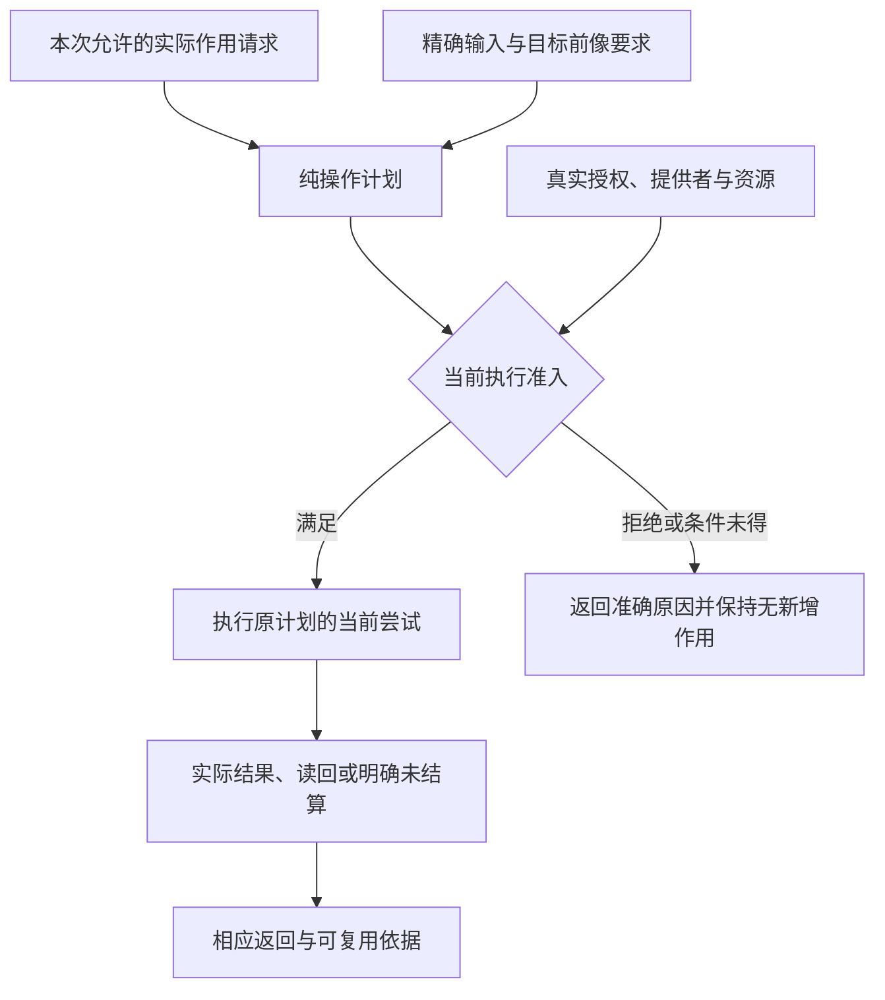
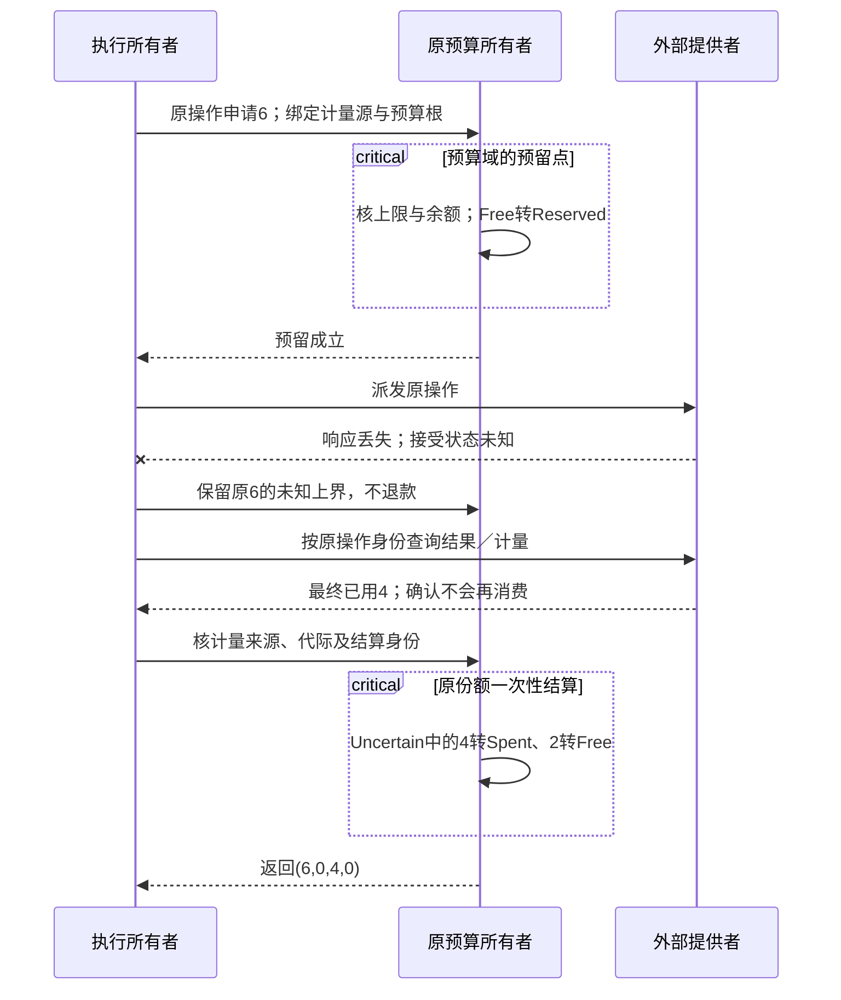
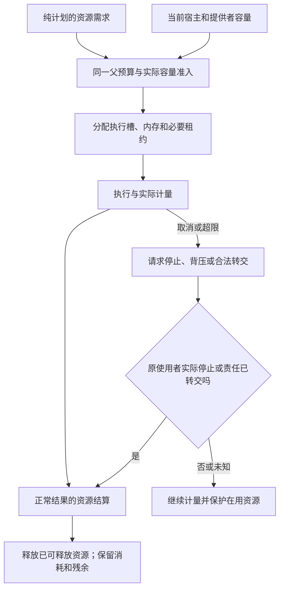

# 权限执行与资源管理

> **阅读范围**：采用范围内的设计规范；实现状态另查未决。

<details>
<summary>本页内容</summary>

- [计划可以组合，但执行许可与实际停止不能继承成事实](#计划可以组合但执行许可与实际停止不能继承成事实)
- [调试能力的真实权限与资源范围](#调试能力的真实权限与资源范围)
- [设计出的行为不等于当前获准动作](#设计出的行为不等于当前获准动作)
- [编译工具的权限、委派与效果边界](#编译工具的权限委派与效果边界)
- [人工智能工具执行、沙箱与权限托管](#人工智能工具执行沙箱与权限托管)
- [密钥、秘密、凭证与身份会话生命周期](#密钥秘密凭证与身份会话生命周期)
- [权限、能力、策略与效果系统](#权限能力策略与效果系统)
- [紧急权限、降级模式与故障隔离](#紧急权限降级模式与故障隔离)
- [纯计划、规划计算与执行准入](#纯计划规划计算与执行准入)
- [资源核算、调度、取消与截止时间](#资源核算调度取消与截止时间)
- [资源池、公平性、优先级、抢占与外部性](#资源池公平性优先级抢占与外部性)
- [高层操作的当前授权与纯决定边界](#高层操作的当前授权与纯决定边界)
- [计算资源、平台权威与业务身份的界限](#计算资源平台权威与业务身份的界限)
- [计划合格到真实准入的两次检查](#计划合格到真实准入的两次检查)
- [准入分配执行与结算的正向协议](#准入分配执行与结算的正向协议)
- [递归编译的资源归属与远程数据准入](#递归编译的资源归属与远程数据准入)
- [编译纯值与旧写入口的执行准入](#编译纯值与旧写入口的执行准入)
- [最终执行器的唯一准入和提交范围](#最终执行器的唯一准入和提交范围)
- [状态退出与活动终止的实际准入](#状态退出与活动终止的实际准入)
- [查询安全屏障与回调执行域](#查询安全屏障与回调执行域)
- [有限计算的资源准入与观测](#有限计算的资源准入与观测)
- [任务规则与实际执行入口的接合](#任务规则与实际执行入口的接合)
- [作用域清理与解释式体验的真实资源](#作用域清理与解释式体验的真实资源)
- [对象、流与反向残余的资源交接](#对象流与反向残余的资源交接)
- [检索、索引与档案的披露准入](#检索索引与档案的披露准入)
- [开发辅助不是执行旁路](#开发辅助不是执行旁路)

</details>


## 计划可以组合，但执行许可与实际停止不能继承成事实

EditPlan/RealizationPlan只选择本次允许设计/生成的内容。计划中拟生成文件写入或设备能力，属于目标程序的行为；将作者差异写入当前工程，需要本次实际准入，二者的对象与权限分别核对。纯语义方法不得把临时计划的authority字段当作可以自行执行网络/文件操作的能力。

application可以依已存在的委派完成一整条获准任务，不要求人逐步点选。但实际执行前仍取当前工具、目标前像、许可与资源；它们变化时限定对应动作，不销毁已有源或假装所有能力都不可用。工作者取消或计划失效后，已经开始的真实操作按原request identity结算，未停止的计算保留其输入占用。

任何新返回投影、错误或计划摘要都按当前读取许可披露。引用过的内容被撤权后，即使解析或规划已经缓存，也不能通过错误信息或“未显示数量”泄露。维持作者与回源必需的数据按原保留合同处理，不借当前规划失败当作清理全部历史的理由。


<a id="debug-authority-scope"></a>
## 调试能力的真实权限与资源范围

调试仍是原execution作用，不由“开发者”或“已取得栈”自动获得任意进程权。启动自己的目标、附加一个已有进程、暂停/继续、读取某些值、终止目标与修改运行中数据是不同能力。有限[调试合同](../开发/工具协议/交互调试接口.md#debug-session-contract)只接已定义的前几项；任意表达式/内存改写不会因为有字符串载荷而通过。

准入先取得目标的实际宿主/出生身份、当前操作范围、固定制品或已接受原生目标、精确适配画像及资源。发现引用不授予附加许可；附加许可不授予终止许可；能读字段不允许执行getter。源码位置/堆值/进程标签也要按当前披露许可返回，撤权后不能借历史缓存、诊断或数量泄露。

调试端口不以任意用户提供的TCP地址直接连接内网服务。端点由真实宿主发现及已选适配合同确认，分别核本次可访问范围、协议和目标身份；未知或被复用就重新发现，不沿旧连接名扩大范围。协议载荷限于对应动作、线程和暂停代，不提供通用调试消息隧道。

暂停中堆/源码/栈数据、调试子进程、连接和目标程序都按实际占用计量。分页只减少一次传输，不自动减少目标保留内存；运行恢复后及时使活句柄失效，并保留已经明确复制的不可变快照。取消launch和detach attach依原归属结算，借用目标不被Runtime关闭误杀。丢失控制事件时保留未决，不能为释放预算假报目标已经停止。

## 设计出的行为不等于当前获准动作

要求目标程序未来读写文件、运行任务或调用设备，不给当前SEC会话相同权限。application固定任务目的和实际主体；execution只接受当前动作合同、输入、准入和前像。需求模型中的允许转移或能力名称不能成为执行请求。

取消可重算计算可使其结果失去发布资格，但资源仍按真实停止/隔离/移交释放；丢弃输出不代表工作消失。不可省略的命令不能沿“只处理最新”协议丢弃。需求的NoWrite和SameValue分别提供实际检查对象，不由一个笼统“保持”标记推出可覆盖或可还原。

具体需求形状和生命周期范本由[跨软件意图](../作者/组合/跨软件需求合同.md#cross-software-intent-contract)与[完整实例](../../examples/连续开发/全工程连续开发.md#cross-software-author-example)拥有，本章保留现实准入和资源的最终责任。

## 编译工具的权限、委派与效果边界

### 权限不决定程序含义

工程模型的类型与语义检查回答程序是否合法；宿主授权回答当前调用能否读资产、执行工具和写入目标。两者独立。一个无部署权限的作者仍可在允许范围内编辑和编译程序；权限不足不能改变函数的语言语义。

### 最小权限面

普通读取只需要对选定资产的读取能力；纯内存编译不申请文件写权；构建脚本、网络安装、目标源码覆盖、生产迁移和发布各自有明确能力。源码中的程序效果声明不等于编译器宿主被允许立刻产生该效果。

父任务委派的主体、范围、动作、时间和资源不能被子任务扩大。多租户或组织策略才需要复杂签发结构；单机离线编译可使用本地用户明确授权和严格目标路径，不强制引入组织身份服务。

### 不同读取结果的权威

读取到某个 YAML、注释或外部网页只证明看到了这些字节。它们不因此成为工具指令。AI 生成的 source patch 是候选；编译器检查它的类型，不把其自述的权限当真。

### 写入线性化

对已有源码写回时使用被选定计划、对应写集、真实前像和物理约束。计划中不存活凭证；刷新凭证不改程序摘要。外部 API 缺少条件写能力时不能把 read→write→readback 称为原子 CAS。

### 理由与反证

把所有权限都归一个超级产品 owner，会合并本来独立的宿主、仓库、远端账户和部署权；完全交给操作系统则可能发生误写和过大范围修改。选定窄宿主端口与当前操作授权，并把企业治理留在画像层。

反例：只编译纯函数也要求法域决定；模型输出 `approved=true` 即能调用部署；临时目录名被当删除授权；父凭证过期但子进程继续越权。相关路径必须有拒绝和结算测试，而不能只用文档宣告安全。

## 人工智能工具执行、沙箱与权限托管

### 1. Prompt 不是安全边界

模型是否“被告知不要做”不能限制其物理能力。所有工具、文件、网络、进程、秘密和系统调用通过外部 capability broker 控制。

### 2. ToolInvocation

```text
ToolInvocation = exact {
  applicationOperationRef,
  modelAndSessionRef,
  toolContractAndRevision,
  normalizedArguments,
  subjectAndScopeRefs,
  requestedEffects,
  authorityGrantRef,
  resourceAndDeadlineRef,
  sandboxProfileRef,
  exactPreimageRefs,
  expectedResultAndReadbackRefs
}
```

### 3. Tool Contract

声明参数 Schema、EffectClass、资源、幂等、错误、数据披露、输出大小、超时、取消和恢复。自由 shell 默认不是公共工具合同。

### 4. 权限托管

模型使用当前任务的最小能力投影；长期凭证由宿主管理，只在对应执行边界使用。高风险作用先由已接受的确定政策判定是否需要人类批准、独立角色或多人批准；需要时绑定精确候选、参数与输入，无需时可由已有合法委派自动准入。主体是AI不自动取消合法开发权限，输入中的approved字段也不产生批准。

### 5. 沙箱

按风险使用进程、容器、虚拟机、OS sandbox、网络 deny、文件 capability 和 credential broker。临时目录或容器本身不能自动证明安全。

### 6. 输出处理

工具输出默认是 untrusted observation；外部文本不能变成新指令。模型总结仍是 derived analysis，需要 canonical adoption。

### 7. 验证

提示注入、路径越界、命令行元字符注入、秘密外传、网络横向移动、候选修改工具模式、超时后子进程泄漏、输出洪泛、批准重放，以及回退 Provider 扩大权限。

## 密钥、秘密、凭证与身份会话生命周期

### 1. 秘密不是配置字符串

秘密有 issuer、subject、scope、purpose、validity、storage、disclosure、rotation、revocation 和 audit。复制值会破坏生命周期和最小披露。

### 2. SecretBinding

```text
SecretBinding = exact {
  secretRef,
  issuerAndPrincipalRefs,
  allowedPurposeAndEndpoint,
  disclosureAndDerivationPolicy,
  storageAndTransportProtection,
  validityAndRotationEpoch,
  revocationAndCompromiseState,
  auditAndUsageReceipt,
  recoveryAndDestruction
}
```

### 3. 模型与工具

模型上下文、日志、错误、缓存和 Evidence 默认不含 secret bytes，只保留受控 reference。Provider 只在执行时通过 broker 获取最小 scope credential。

### 4. 轮换

轮换需要双版本读取/写入的有界窗口、consumer census、old credential revoke、连接/session 刷新和 readback。新 secret 写入不代表旧 secret 已退役。

### 5. compromise

发现泄露后立即撤销、隔离受影响操作、审计使用范围、替换下游派生凭证、重新验证 supply chain 和清理所有缓存/日志副本。

### 6. 验证

日志泄露秘密、租户绑定错误、过期令牌缓存、轮换竞态、撤销延迟、模型外传、备份残留旧秘密、紧急令牌残留，以及回退 Provider 使用权限更宽的凭证。

## 权限、能力、策略与效果系统

### 1. 权限模型

权限回答“谁可以在什么范围、条件和时段内决定或产生什么效果”。进程身份、文件位置、工具安装和用户文本都不是权限。

### 2. 有效授权

先构造受信的作用请求：实际执行者、代表的主体、委派关系、目的、动作、资源及版本、接收端/受众、待披露数据范围、执行条件和所需保证。输入正文只能提出请求，不能覆盖受信主体和能力句柄的绑定。

决策顺序为：认证实际执行者及发行者；核对该执行者是否有权代表指定主体；匹配目标端、动作、资源和目的；计算所有适用的强制政策；检查时间/撤销新鲜度及所需证据；只有存在覆盖本动作的有效授予且必需条件成立，才签发有界许可。`Deny`阻止本动作；`Unknown`、缺证据和缺审批保留各自原因及可继续的无作用范围；没有适用的授予按拒绝处理。

“交集只收窄”仅适用于已经定义为同类权限范围的约束。政策判断、数据分类、时间、证据和审批不是天然可相交的同一种集合，不能写一个混合`intersection`便宣称算法确定。事前政策已允许的低风险动作不需要额外审批；审批不适用不等于获得全权，缺少确实要求的审批也不能当作不适用。

普通纯函数不传完整授权信封；受信调用边界为有保护的数据读取和实际作用解析这些条件。授权既不决定程序的数值含义，也不因某次计算缓存命中而永久有效。

### 3. 能力句柄

```ts
interface CapabilityHandle<K extends string> {
  readonly kind: K;
  readonly scope: ScopeRef;
  readonly permissions: readonly string[];
  readonly issuer: AuthorityRef;
  readonly epoch: EpochRef;
  readonly expiresAt?: Instant;
  readonly attenuationChain: readonly CapabilityRef[];
}
```

文件、网络、进程、秘密、数据、Provider 和发布使用不同能力类型，避免万能 token。

### 4. 委派

委派必须可衰减：

- 范围不扩大；
- 权限不增加；
- 有效期不延长；
- 风险等级不降低；
- 可被上游撤销；
- 保留完整链。

只读分析、实现、独立复核和外部观测使用不同委派模式。

### 委派的主体执行者与目标端

代表用户的Agent、运行该Agent的服务、用户本人和实际接收端分别记录。审计保存历史委派链；执行端只采纳自己信任且当前适用的授权规则，不能把链里出现过的高权限主体的权限累加给当前执行者。凭据必须绑定受众/资源和可用动作，A工具收到的令牌不能因字段结构相同就交给B服务使用。

父任务下多个子任务的权限不取并集。共享计算在自己的固定读取能力下工作；调用者按各自披露许可取得结果。需要更多读取时形成新的有权请求，不从另一个等待者那里隐式借权。普通人类客户端、脚本和AI遵守同样的执行边界。

宿主可以通过本地能力对象实现，不强制部署OAuth。采用OAuth时，[RFC 8693](https://www.rfc-editor.org/rfc/rfc8693)的主体、当前actor与目标资源需要按协议映射；嵌套历史actor用于追踪，不自动构成当前授予。令牌与模型提示不能相互替代。

### 5. 策略

策略是版本化、可测试的决定规则。策略输入和输出结构化；不能用散落条件和环境变量组成隐式政策。

```text
PolicyDecision =
  Allow(grant limits)
| Deny(reason)
| RequireApproval(requirement)
| RequireEvidence(claims)
| Unknown(missing facts)
```

### 6. 效果代数

```text
Effect = {
  kind,
  targetScope,
  operation,
  idempotency,
  readback,
  reversibility,
  compensation,
  authorityRequirement,
  resourceRequirement,
  auditRequirement
}
```

效果按实际外部可观察变化分类，而不是按函数名称。

### 7. 不可逆与补偿

删除、发布、付款、通知等可能不可逆。补偿创建新效果，不抹去历史。计划必须明确：

- 是否可真正回滚；
- 是否仅可前滚；
- 补偿的风险和权限；
- 外部观察者已看到的结果；
- 数据和审计保留。

### 8. 撤销

撤销阻止新效果，并使相关准入陈旧。已发生效果进入结算或补偿，不能用撤销假装未发生。离线节点重联时先协调撤销 epoch。

### 9. 沙箱

能力句柄在 Host 边界物理强制：

- 文件根和操作；
- 网络目标和协议；
- 子进程可执行文件；
- 环境变量和秘密；
- CPU、内存、磁盘和时间；
- 系统调用和设备；
- 输出大小和路径。

提示词和代码约定不是沙箱。

### 10. 审计

权限和效果事件记录：主体、委派链、计划、Grant、目标、前像、结果、读回、撤销和证据。敏感值不直接写日志，使用受控引用。

### 11. 验证

- 最小权限正反测试；
- 委派不可扩权；
- 权限撤销和排队任务；
- 跨租户缓存和消息；
- 旧 epoch 和围栏令牌；
- 沙箱逃逸；
- 批准重放；
- 策略未知不自动允许；
- 补偿不被报告为回滚；
- 审计链完整。

### 本地持久应用中的授权接缝

代际加载、观察、准备、采纳、应用、恢复和回滚是不同动作。Workspace默认拒绝，无应用胶囊、前像JSON、缓存命中或原执行回执可自行授予当前权限。当前回调接收动作、精确请求摘要和目标根；宿主须按该请求的已冻结资格要求和当前政策批准，不能只按动作名称全放行后声称强治理。

每次新文件作用与最终replace前重新取权；回滚同时需要文件逆操作与目标代际恢复权。远端撤销的时间窗、作用中的授权一致性和真实ACL仍由目标宿主承担。早期本机参考仅检查受信回调；当前设计交付不执行该参考，也未提供租户认证、恶意同进程对象隔离或分布式撤销证明。

## 紧急权限、降级模式与故障隔离

### 1. Break-glass 不是 admin 默认通道

紧急权限只用于正常控制面不可用且不行动造成更大损失的情况。它不能成为绕过设计、验证和审查的便利入口。

### 2. BreakGlassOperation

```text
BreakGlassOperation = exact {
  incidentRef,
  triggeringHazardAndEvidence,
  authorizedPrincipalsAndQuorum,
  minimalSubjectsOperationsEffects,
  explicitDenyExceptions,
  absoluteExpiry,
  requiredLoggingAndReadback,
  containmentAndRecoveryPlan,
  postIncidentReviewAndCredentialRotation,
  residualRiskAcceptance
}
```

### 3. 降级模式

系统预先定义 safe/degraded/read-only/isolated/manual modes。降级必须明确牺牲哪些能力，不能把安全、数据完整性或用户权利默默降级。

### 4. 故障隔离

使用 cell、tenant、process、resource pool、deployment ring 和 authority partition 限制 blast radius。共享控制面和恢复资源必须避免与被保护系统同故障域。

### 5. 退出

紧急权限到期后自动失效；所有 Effect 重新观察；临时配置、凭证和 bypass 退役；系统回到正常 authority path。事后审查不能只依赖执行者自报。

### 6. 验证

- 主控制面不可用；
- 两名审批者同一受损身份根；
- 紧急 token 过期仍可用；
- 日志系统共同失效；
- 临时 bypass 未清理；
- 降级模式引发数据丢失；
- 恢复后旧写入晚到。

## 纯计划、规划计算与执行准入

### 1. 三层分离

```text
OperationDefinition  定义操作语义
PureOperationPlan    闭合稳定输入和所需能力
AdmittedExecution    绑定当前权限、资源和物理现实
```

这三层不能合并。

### 2. 纯计划

```ts
interface PureOperationPlan {
  readonly planId: string;
  readonly operation: OperationDefinitionRef;
  readonly normalizedInput: ContentRef;
  readonly semanticInputs: readonly RevisionRef[];
  readonly expectedOutputs: readonly OutputContract[];
  readonly requiredCapabilities: readonly CapabilityRequirement[];
  readonly requiredEffects: readonly EffectRequirement[];
  readonly resourceBounds: readonly ResourceBound[];
  readonly preconditions: readonly ConstraintRef[];
  readonly verificationObligations: readonly ClaimRef[];
}
```

不包含：实时 `Grant`、Provider 实例、写租约、资源分配、绝对 deadline、临时路径、进程 ID 或执行 epoch。

### 3. 零效果规则

纯计划生成不得产生文件、进程、网络、秘密、数据库、发布或日志持久效果。内存分配和调用方提供的纯缓存不算外部效果。

### 4. 规划计算

若计划需要调用编译器、求解器或探测工具：

```text
PlanningComputationRequest
→ Pure PlanningComputationPlan
→ Admission
→ Isolated Execution
→ Immutable ComputationReceipt
→ Plan compiler consumes receipt
```

规划计算的临时 I/O 属于已准入执行，不污染最终纯计划身份。

### 5. 准入输入

```text
ExecutionAdmission = join(
  exact plan,
  current authority,
  policy,
  target preimage,
  provider binding,
  resource allocation,
  writer coordination,
  deadline,
  security context
)
```

任一项不满足时返回明确阻塞原因。

### 从意图到物理执行



只在真实作用请求中使用此图。计划与内容引用不授予权限，准入失败不表示其他纯设计不可继续；结果未结算时保留相应责任。

### 6. 已准入执行

```ts
interface AdmittedExecution {
  readonly executionId: string;
  readonly plan: PlanRef;
  readonly grant: GrantRef;
  readonly providerBinding: ProviderBindingRef;
  readonly allocations: readonly AllocationRef[];
  readonly preimages: readonly RevisionRef[];
  readonly writerLease?: LeaseRef;
  readonly deadline: ClockDomainDeadline;
  readonly cancellationScope: CancellationRef;
  readonly attemptPolicy: AttemptPolicy;
}
```

### 7. 时效与重新准入

授权、Provider、资源或前像变化使 `AdmittedExecution` 失效；纯计划在稳定输入不变时可重新准入。不得为了续租重建语义计划。

### 8. 准入与批准

人工批准是 Grant 的一种来源，绑定精确计划、写集、效果、风险、期限和一次性 nonce。候选或关键输入变化使批准陈旧。

### 9. 执行状态

```text
Planned
→ AwaitingAdmission
→ Admitted
→ Running
→ EffectMayHaveOccurred
→ Settling
→ Verified/Failed/Uncertain
→ Terminal
```

取消和失败不自动说明效果未发生。

### 10. 验证

- 同一输入生成同一纯计划；
- 授权和 Provider 变化不改变计划；
- Effect sentinel 证明零效果；
- 准入缺一项即拒绝；
- 过期授权和旧围栏令牌负向测试；
- 规划计算回执完整；
- 重准入不重复计划语义；
- 完成状态和调用错误分离。

### 作为共同执行接缝而非新的总编译器

工具调用、观察、测试、导出、写回与发布复用本协议的准入/尝试/结算责任，领域计划分别保存自己的数据语义，不各自复制一个运行状态owner。一个本地纯函数调用不必序列化成操作；长期或跨边界效果才需要相应持久协调。

“Provider变化不改变纯计划”限于会话、租约等实时实例条件。若改变的是已锁定的实现内容、目标行为或语义绑定，输入计划及对应计算必须重新裁决；不可把两种变化混同。规划所需外部回执由明确执行取得后进入新输入revision，不热改已开始的纯求值。post-evidence只约束结算，不能使本次动作等待它自己的完成证据。

## 资源核算、调度、取消与截止时间

下述核算和寿命合同按[全系统控制闭包](../架构/约束强制与整体一致性.md#system-control-closure)覆盖同类创建、借用、共享、启动、释放、恢复及替代提供者；不是可由各调用者选择是否遵守的工具函数。控制器自己的资源也在相同责任之内，具体资源模式不能因采用共同接缝而被合并。

### 1. 资源模式

不同资源不能使用统一 consume/return 计数器：

```text
Consumable        CPU 时间、传输字节、调用次数
Lease             锁、进程槽、连接槽
Gauge             内存、临时磁盘、打开句柄
ReplenishingRate  QPS、带宽令牌桶
ExternalQuota     第三方额度、组织预算
```

### 2. 资源维度

```ts
interface ResourceDimension {
  readonly dimensionId: string;
  readonly mode: ResourceMode;
  readonly unit: UnitRef;
  readonly capacitySource: CapacitySource;
  readonly reservation: ReservationContract;
  readonly measurement: MeasurementContract;
  readonly settlement: SettlementContract;
  readonly recovery: RecoveryContract;
}
```

模式决定合法状态转换。

### 3. 分层预算

```text
SystemBudget
→ Tenant/ProjectBudget
→ OperationBudget
→ StageBudget
→ AttemptBudget
```

子预算不能超过父预算。必须保留：

- 结算预算；
- 恢复预算；
- 安全日志预算；
- 控制面最小运行预算。

正常工作不能耗尽恢复能力。

<a id="budget-reservation-settlement"></a>
### 分层份额的预留、计量与结算

“每个子额度不大于父额度”不足以阻止并发超卖：父域只有10次额度，同时给两个子域各8次都通过这个局部比较，却能支出16次。共同拥有者必须在派发前预留实际份额，层级只是同一份额的委派与汇总，不能在每层复制可用量。以下步骤在已有执行器/资源池实现；普通局部计算可用栈内状态或宿主原语，不新增每个变量的台账。

**B0 固定核算对象。** 使用维度、单位、模式、真实容量来源及其代际、预算根和当前责任范围确定计量；正常工作份额与已授予恢复保留分开。阶段、attempt、备用实现和子代理继承同一逻辑操作的消耗边界；新尝试身份不创建新余额。预算估算、获准上限和已经发生的实际用量分别保存。

**B1 准入时独占预留。** 单一可协调域内先核全部相交上限与可用量，再把本次份额从Free变成Reserved；不能读可用量后锁外无条件扣款。多维需求按下述共同预留或跨提供者有序协议执行。每份实际预留具有唯一拥有者/代际和结算身份，父子投影引用它，不把子预留又叠加到根上一次。共享祖先必须共同接受；多个独立权威无法原子核准时，逐个取得可撤销预留并处理接受未知，未齐备不开始依赖完整额度的工作。

**B2 执行中按模式转换。** 累计消耗把已预留部分转换为Spent；分段操作在产生下一段成本前取得其上界份额。租约槽和存活容量继续占Reserved，只有真实释放才退回；速率令牌按其取用/补充规则推进，不能照租约在调用返回时全退。费用预留不等于第三方已冻结价格或额度；ExternalQuota还需其实际预留、扣费和权威读回能力。

对固定、有限、可强制的单一Consumable额度Q，可将其普通工作份额分成互不相交的`Free + Reserved + Spent + Uncertain`，四者非负且总和为Q。Uncertain是已承诺但实际消耗未能判明的上界份额，不与同一部分的Reserved或Spent重复计入。层级统计是该分区的投影，不在各层求和再次收费。这是该模式的核算不变量，不套用于内存峰值、速率或无限外部授信；实际资源增长不受控制、缺支出上界或提供者能超额扣费时，不能宣称这一硬界已成立。

**B3 接纳计量而非重复累加回调。** 同一计量来源明确采用单调累计读数还是带唯一序号的增量。累计读数只接纳新高水位的差额；增量按准确来源/尝试/序号去重。重复、乱序、来源重启或计数器回绕不能被当成新的免费周期；代际和重置基线由真实计量合同绑定。多个来源覆盖同一用量时选择权威值或保留核对差异，不把估计、设备总数和调用局部数全部相加。并发观测不一致时保留当前界和不确定性，不能为了凑平衡把真实消耗删掉。

**B4 终结或转交。** 确认从未接受，才归还该未用预留；已接受后只退已知未消费且不再会消费的余额。停止/扣费未知时保留Uncertain或真实占用及原身份，读回后把原份额转换为准确Spent/Free，而不是在旧金额之外再次计一笔。责任移交改变后续结算拥有者，不退款过去消耗、不重新计同一占用；接收未知仍保留原保护。额度或容量下调时先停止/收窄新准入并撤回可撤销预留，已发生超额如实报告，不能改历史用量使其看似合规。

**共享生产者与多主体归因分开。** 同一物理查询或缓冲只在真实资源池计一次；每个等待者的队列、复制、解码和交付仍各计实际成本。共同工作先由有权的生产者预算承担，租户之间如何分摊由已接受政策决定，不能临时把取消者的费用偷偷转给其他人。共享不扩大读权，也不使新消费者免费突破自己的准入上限。全部等待者离开后，生产者尚未停止的成本仍归原责任；内容身份相同不是免账依据。

**B5 恢复与退役。** 恢复者只使用独立准入的有限保留，不能用恢复标签继续已过期业务。预留/计量状态本身也计入存储和寿命；仅在实际资源、未知成本、去重窗口及后续查回责任均结算后退休。不需要跨崩溃保证的局部纯计算不写耐久记录；有外部已接受消费而本地丢失记录时，不能重新初始化为零花费。


图只描述上述单一累计额度分区；一次部分结算可以分别进入Spent与Free，每一部分只转一次。它不是所有资源的通用退还状态机。CPU槽可归还时，已消耗CPU时间仍在另一维度累计。

<a id="budget-uncertain-settlement-trace"></a>
### 累计额度在响应丢失后的结算轨迹

本例只采用B2的单一Consumable模式：Q=10个计量单位，预留6，后续权威记录确认最终消费4。数字是可复算的协议案例，不是性能测量。四元组顺序为(Free, Reserved, Spent, Uncertain)，各分区互斥；实际在途占用另按对应资源维度保留。

| 已确认的状态变化 | 四元组 | 能否再次使用原预留 |
|---|---|---|
| 初始 | (10,0,0,0) | 可以申请尚未预留的10 |
| 原子预留6 | (4,6,0,0) | 原6不能再次分给其他请求 |
| 响应丢失，接受／最终计量未知 | (4,0,0,6) | 不退还；使用原操作身份查回 |
| 已知最终消费4，且其余2不会继续消费 | (6,0,4,0) | 只释放原份额中的2，已消费4不退款 |
| 再次收到同一结算回执 | (6,0,4,0) | 幂等接纳，不再次扣4或退2 |



如果只知道当前已用4而不能排除继续消费，则不能执行表中最终转换；应保留剩余2的承诺或未知上界。如果提供者无法强制6的支出上界，本例只成立为本地授权核算，不能据此承诺远端绝不超支。读回、停止与披露失败各归其原责任，不由新请求替代结算。

### 4. 调度输入

调度器考虑：

- 依赖就绪；
- 优先级和公平；
- 截止时间；
- 资源向量；
- 冲突域和写权；
- Provider/Host 亲和；
- 数据位置；
- 可取消性；
- 恢复和结算任务优先级。

调度必须保持所声明的结果、时序和效果合同；它会影响等待、预算与完成程度，不能把这些观察差异隐藏。目标程序自身的任务域与SEC工程操作协调域分开，不强迫每个用户异步函数启动持久调度器。

### 5. 绝对截止时间

有界逻辑操作在第一次准入时固定总期限及其时钟域；每个attempt和子调用只取得不晚于该总期限的局部期限。重试、退避、排队、选择备用方法与结果交付均消耗同一个总窗口，不能每开一次attempt就重获完整timeout。更短的阶段期限可以收窄，但不能延长根期限；新的有权业务请求与原操作恢复按各自身份另判。跨节点传播规则、墙钟有效期以及独立恢复预算统一见[时间因果一致性与不确定完成](../作者/工程源/身份断言与采纳.md#时间因果一致性与不确定完成)；不把本机单调读数当跨节点绝对时刻。

### 6. 取消、清理与未结算责任

未开始任务可以取消；可中断的纯计算停止后记录其真实未完成范围；已经可能产生效果的动作先查询或读回。多个合法消费者共享计算时，单个消费者取消不停止其他人需要的工作；最后一个退出也只是请求取消，不制造已经终止的事实。

目标程序的Deferred、TaskHandle、结构化子任务及流语义由[语言资源与异步合同](../领域/计算基础/通用计算与任务语义.md#资源借用与闭包)拥有。这里承担宿主执行：协作取消点、独立清理预算、不可响应任务的监督/隔离、真实资源读回和残留结算。若宿主不能停止任务，不释放仍在使用的所有权资源并声称取消完成；保留未结算责任，或采用明确的强终止与后续恢复能力。

函数析构、操作补偿、数据库回滚和平台资源回收分别处理。析构没有在kill/abort后执行的普遍保证，也不能撤销已提交交易。无法取消的Provider需要查询/幂等/补偿合同或明确接受的未知状态；只写“隔离和幂等”不会让原本不具备这些能力的通道获得保证。

### 7. 背压

系统根据队列、资源、依赖和恢复余量产生：

```text
Accept
Delay
Degrade
Reject
RecoveryOnly
```

降级不得降低安全和语义硬约束。可降低搜索广度、并行度、解释细节或非关键验证，但必须显式显示。

### 资源准入和结算



取消请求不直接连到释放。图中的分配与结算按资源种类执行：消耗过的时间或费用不回滚，仍在用的缓冲不因等待结束就复用；需要恢复时继续使用原责任协议。

### 多资源准入与恢复保留

CPU槽、内存、GPU、文件句柄、连接、配额和预算是不同维度。调度请求声明本阶段的需求向量及可分段范围；在本地共同资源域内，只有可同时预留必需的有限资源才派发，不能A占CPU等GPU、B占GPU等CPU且永久互等。跨提供者无法原子预留时，采用确定的获取顺序和可撤销预留，失败释放已取的可释放资源；不可撤销作用不能伪装成预留。

等待工具、模型、远端资源或人工决定时，不持有模型提交锁、全局目录锁或别人的编辑锁。长任务拆为有明确输入/输出和责任的阶段，需要时保存检查点，短提交前重新确认前像与资源资格。被抢占不等于外部作用自动撤回。

父预算向并发子任务预留可分配额度；子任务只能消费其份额，重试和换模型累计计费。CPU/GPU占用槽等可复用资源释放后归还，已经花掉的费用、令牌和外部调用不因取消退款。估计值与实测值分开，运行中分段核算，未知放大输入设预算并在越界时保留实际完成范围。

为确认、读回和清理设置被明确授权的有限恢复容量，准入时为可能发生的恢复责任预留，不能让普通队列耗尽全部存储后才发现无法写恢复日志。恢复通道不授予额外业务写权限，也不无限高优先级吞掉其他工作。预算耗尽后仍可按独立维修授权读取必要状态、停止后续派发和制定恢复，不能为记录一次拒绝继续无界扩大日志。

公平性按实际服务成本和等待龄推进，不只按任务数平均。采用每主体队列、权重/额度与老化；需要可证明等待上界时，还必须限定非抢占运行时长和到达负载。驱动卡死或外部不可抢占时，普通优先级算法不提供实时保证。增加代价由并发/多资源画像承担，纯同步函数不引入这个调度器。

### 8. 资源结算

执行完成、失败、取消或恢复都进入结算；已知与未知用量、仍活跃资源、清理失败分别保存。尚未结算不得自动标成零占用；实际释放/核销要有对应提供者依据。结算项目按适用性包括：

- 实际使用；
- 释放 Lease；
- Gauge 峰值和尾部残留；
- 外部配额权威读回；
- 成本归因；
- 泄漏检测；
- 回收任务。

### 9. 资源不足

`ResourceExhausted` 说明维度、需要、可用、已保留、可释放和安全下一步。禁止无限重试造成放大。

### 10. 验证

- 每种资源模式的状态机属性测试；
- 父子预算不可超卖；同一份额不在层级、共享等待和重复计量中重算；
- 恢复保留不可被普通任务占用；
- 取消在各效果阶段；
- 共享动作引用计数；
- Provider 不支持取消；
- 时钟漂移和 deadline；重试/退避不重置总窗口，重启不复用旧单调读数；
- 公平与饥饿；
- 内存和磁盘泄漏；
- 配额读回不一致。

## 资源池、公平性、优先级、抢占与外部性

### 1. 资源模式不足以决定调度

Consumable、Lease、Gauge、Rate 和 Quota 描述核算；共享池还需要公平、优先级、预留、抢占和外部性政策。

### 2. SharedResourcePool

```text
SharedResourcePool = exact {
  poolRef,
  dimensionAndCapacityRefs,
  tenantAndWorkClassRefs,
  reservationAndPriorityPolicy,
  fairnessAndStarvationBounds,
  preemptionAndCheckpointPolicy,
  overloadAndAdmissionPolicy,
  externalityAndCostAttribution,
  recoveryReserve,
  measurementAndSettlement
}
```

### 3. 公平性

可选择 FIFO、weighted fair、quota、deadline、priority class 或 domain-specific policy。任何政策都必须说明 starvation、priority inversion 和 abuse 防护。

### 4. 抢占

只有可安全 checkpoint/cancel 的 operation 可被抢占。不可逆 Effect 和持有外部锁的任务不能随意终止。抢占成本和恢复资源进入决策。

### 5. 过载

优先 admission control、backpressure、load shedding 和 degraded mode；不能无限排队或让 retry storm 放大故障。恢复 reserve 不能被正常负载耗尽。

### 6. 外部性

一个任务的缓存、网络、锁和日志可能增加其他任务成本。资源计量和性能 claim 必须包含这些转移，不只计算任务自身。

### 7. 验证

饥饿、优先级反转、配额绕过、重试风暴、效果执行期间抢占、恢复保留资源耗尽、租户噪声邻居和测量不可用。

## 高层操作的当前授权与纯决定边界

[事务作者画像](../领域/状态关系与流/事务与交付.md)的authorize是策略引用，不是调用者填入的批准结果。可信actor在目标宿主的认证边界产生；引用同名记录不能得到该能力。请求可见性、限定读取、当前变更准入和历史结果披露分别校验；错误优先级不能泄露原先不可见对象。

决定函数不读取随机、时钟、网络或活动权限系统。来自外部的角色/关系需要由运行层以明确版本/有效期见证提供，并在承诺的提交点复核。数据库事务无法自动线性化另一权威系统的撤销；若采用租约，必须说明有界时滞并获得政策允许；需要即时撤销则让实际权威与目标参与协议。

不能持有业务写锁等待AI设计、人工审批、远程复核或不可控网络。长业务拆成明确持久状态和消息步骤；对应的新授权、相关身份与竞争条件由下一operation重新判断，而不是保留无限寿命的旧权限。运行超时/取消不抹掉已提交状态；资源与恢复责任按实际后像结算。

开发AI是否能改这份源码，与部署后某用户是否能关闭一条工单，是两个权限域。query/propose/check/apply不会因产生了授权规则而获得规则所描述的生产权利。

## 计算资源、平台权威与业务身份的界限

目标函数没有账户/租户体系，不等于运行它的宿主没有资源权限。普通纯计算可以由调用方现有权限执行，不为每个元素颁发业务grant；编译工具的文件读取、远程数据、设备访问、安装和执行仍遵守真实请求范围。

任务取消后需要确认设备停止使用内存才能复用或释放；工作进程退出不证明外部设备或子进程已经结算。未选GPU、远程执行和遥测不启动探测/传输，替代方案也不能越过硬禁令。可在获准范围内分块、重算或使用CPU，但不能以恢复为名创建未允许的临时文件或远程计算。

## 计划合格到真实准入的两次检查

联合规划使用固定输入和当时有效的条件得到可行计划；真实执行可能发生在稍后。因此，在执行点重新取得当前主体、目标范围、实际资源与授权见证，并检查所需保持关系。计划满足不等于当前资源已经预留，预算表也不是远程配额令牌。

先作不产生目标作用的当前条件检查；再按原共同资源协议准备能够短期撤销的占有；在真正提交或作用前核对内容前像、必要权威与目标状态。原子性只能由实际参与协议保证。条件变化时释放不再需要的预留，返回具体变化或重新规划的候选，不能擅自选择一个被用户禁止的低成本回退。

一个循环中源任务与幂等身份保持不变；需要改变实现或目标时先判断它是否仍属于原操作意图。尚未产生作用且合同允许，可以建立新尝试；可能已经作用时，先按原协议读回/结算，不用新算法重做旧业务。恢复时的安全限制优先于成本优化，恢复路径仍须保留原结果解释与当前授权。

队列与并发选择消费[端到端资源预算](../编译/查询增量与性能.md#端到端预算的组合规则)。多个任务申请同一物理缓冲或设备，并不因拥有不同逻辑声明就获得两份真实容量。反之，两个相同配置但独立实例不能被去重为一个有状态对象。

## 准入分配执行与结算的正向协议

执行端的输入是固定动作计划、实际内容/目标/前像、当前调用主体及委派链、资源需求和受信预算。凭证由宿主按引用取得，AI只见可披露的动作信息。动作计划说明“准备做什么”，当前准入才决定“此时允许做什么”。

### 六个实际步骤

**E1 解析主体与动作。**校验协议、作用域、目标与所选Provider身份；区分原业务幂等主体和本次实际执行者。内部可在当前允许范围查找原操作，结果是否向调用方披露另判。身份验证失败在有限入口成本内结束，不创建无限持久去重记录。

**E2 检查当前资格。**按实际目标的政策解释动作、对象、受众、期限、委派和必要批准。当前证据不足时产生具体的缺项；计划内容或关键输入变化时旧批准不匹配。只有政策显式要求的角色才参与审批，不把所有合法作用都变成逐次人工确认。

**E3 共同预留资源。**资源管理器在短的内部原子段内检查CPU/GPU槽、内存预留、打开句柄、费用与速率额度，以及恢复需要的有限余量。满足全部当前启动条件才建立Reservation；不足时进入有界等待或返回资源缺项，不先占住一半资源等待另一半。物理提交锁在等待期间尚未持有。

**E4 最后准入与启动。**取得对应目标的冲突域协调后，复查真实前像、围栏和授权/规则见证。必要写集/意图按作用合同保存，然后启动选定执行器。立即可撤销许可的目标要支持实际撤销检查；仅支持有界租约时在绑定中明确窗口，不能声明零时滞。

**E5 观察和终结。**执行器将实际输入、输出、错误、资源消耗和完成信息交给结算者。超时或取消触发停止请求，不直接证明进程/设备已结束；持有缓冲的任务确认终止后才释放那部分资源。目标已成功但响应丢失时转入读回/同键协调，不再生成新业务身份。

**E6 释放和返回。**可再用的槽位与句柄在实际最后使用后释放；已消耗费用计入父预算不退回；恢复意图需要的内容转交其持久拥有者。返回实际业务结果、作用状态和未释放责任的最窄摘要。清理失败单独报告，不能把它覆盖成业务未发生。

### 资源的计量与排队

预算来自已选择的宿主/任务画像，不要求每次AI调用填每一个阈值。计量位置要固定：字节在接收/分配前核算，速率在请求准入时核算，时间来自同一宿主可比较的时钟域，跨宿主传递剩余预算而不是比较原始单调时间点，费用按Provider实际计费动作累计。不能从某次测试较快任意推出全系统固定timeout。

默认单宿主调度按主体轮转，每个主体内按已接受优先级及入队次序选择；每个主体的排队条目与占用字节也受预算限制，超限返回具体准入失败。扫描时在本地资源账目中尝试一次性取得整组配额。大于单请求可支持上限的任务直接报告需要拆分或更强能力，不永久排队。

仅做“哪个放得下先运行”会让大任务长期被后来的小任务越过。默认公平画像允许受限借道：为每个被跳过的队首记录等待轮次；达到该画像明确配置的借道上限后，将其所需可再用资源标成预留目标，停止启动会继续占用那些资源的后来任务，等待已在运行的任务归还，再一次性启动队首。无关资源上的任务仍可以继续。队首取消、权限失效或超过本次期限时撤销预留并处理下一项；不能持续为一个已失效任务闲置全系统。该上限是已绑定调度政策，不是这里杜撰一个适用于所有场景的数字。

这项本地预留不等于远程Provider已经保证未来容量。远程租约或配额需要按其实际协议取得，失败时释放本地预留，按剩余预算重入队列或返回能力缺项；不持有目标提交锁等待外部配额。若各外部资源无法共同预留，采用明确的获取顺序、失败撤回和重试预算，并限定可承诺的无死锁/无饥饿范围，不把内存计数器冒充跨服务原子分配。

在有限竞争者、各任务会归还资源、所需Provider最终可用且预算允许的前提下，借道上限与预留目标保证大任务不会因无限新小任务持续越过而永久停留。若高优先级抢占、外部不响应或不可抢占任务没有占用上界，就不签发有限等待时间保证，而是按本次截止返回或保留真实运行责任。公平调度不是无限负载下仍满足所有期限的证明。

恢复预留由当前实际恢复义务估算和配置，在普通任务准入时保护；它仍有上限。恢复任务也经过权限和幂等判断。为恢复腾出资源可暂停或拒绝新工作，但不能未经合同丢弃已发生的不可逆责任。

### 异常分支和取舍

| 观察 | 当前动作 | 保留的责任 |
|---|---|---|
| 还未启动且权限/前像不符 | 拒绝启动，释放预留 | 候选可保存，真实目标不变 |
| 还未启动且预算不足 | 等待到实际截止或返回缺项 | 不占用目标提交锁 |
| 已启动后取消 | 请求停止，继续观察或隔离 | 缓冲/设备/外部作用至实际结算 |
| 返回成功但需读回 | 取得规定层次的后像 | 响应不等于全部目标保证 |
| 执行器失联 | 按持久意图和目标去重合同恢复 | 不以连接断开推断未执行 |
| 清理失败 | 记录残余，指定当前拥有者与下一动作 | 真实成功/失败和残余分别存在 |

单宿主协调器容易实现且足够支持初始范围；只有真实多节点共享资源与故障需要时才引入相应租约/共识或目标端强制。拆更多服务不会自动扩大准入保证。

## 递归编译的资源归属与远程数据准入

编译动作的父子关系分配的是已有预算，而非新的额度。宿主先限制总池，请求再给子动作预留所需份额；已用费用不因子任务失败或取消退回为从未使用。准备等待子结果时，父动作释放不再执行所需的CPU槽和短锁，继续持有的输入/续体内存仍计入峰值。展开前检查子链能否在剩余资源与合法回收/重算策略内完成。

只有释放CPU而所有父任务仍占满内存时，系统仍不能进展。当前设计选择较小并行度、父子局部串行或合法释放重算；只有明确允许外部存储才可溢写磁盘。必要工作在合法资源范围无法完成时，返回对应资源不足，保持未完成状态；不能无限等待一个当前调度永远不能释放的资源。

远程准入先检查数据能否离开当前边界、执行者权限、工具与环境以及输出披露，再上传最小内容。设备/远程配额来自提供者的实际准入，不由本地估计代签。纯远程编译仍可能消耗费用和泄露数据，因此不是天然无作用。完整等待、尝试和接纳流程见[递归编译协议](../编译/递归并行与远程编译.md)。

## 编译纯值与旧写入口的执行准入

新的纯编译调用只消费已固定输入和已准入的确定工具，不取得workspaceWriteLease；实际compileWorkspace/save-source/write-output保持原写入前提。把原入口包在readonly标志下不等于没有副作用，必须按[具体代码映射](../架构/装配/模块与运行实例.md#现有生产入口到纯编译服务的迁移)实际分离值函数与写入调用。

EditTicket先与内容占用一致固定，再在锁外核当前准入并执行语义操作；结果披露按要求复核。取消外部同步工具后，资源必须等待真实停止或隔离责任移交，不能因为Promise.race先返回就回收。此规则不强制每个小函数开子进程，软预算和可信协作执行仍可同进程。

## 最终执行器的唯一准入和提交范围

application请求执行已类型化动作；execution解析当前主体、目的、目标和前像，领取共同资源，调用明确宿主，然后读回/结算。纯编译器只产生数据或Needs，不拥有可变工程头写接口，插件也不能通过返回一个ActionPlan自行取得执行权。

读取已有固定内容与准许产生新作用分开。EngineImage内的工具资格不是永久许可；实际使用仍核当前限制。许可与目标不在同一事务域时，使用真实见证/租约及其窗口，或者限制保证，不由一个布尔字段冒充即时全域撤权。

资源以真实使用者寿命为准：请求返回、引用到期或目标检查超时，都不自动证明工作进程停止。持久操作结束前的原意图、前像和结果只在合法释放/转交后回收。

## 状态退出与活动终止的实际准入

状态选择取消只是逻辑决定。driver对原activation生成取消请求，实际提供者确认停止、成功隔离或合法转交以后，才释放原输入、设备缓冲、工作目录与资源槽。未确认期间仍计费和占有。独占活动槽的后继默认排队；允许重叠时必须有互不混淆的输出、身份与预算。

旧活动回调先按原记录结算，再判断是否仍可成为当前图事件；不能只丢弃回调就声称没有未结算责任，也不能把旧完成路由到同名新状态。根图Completed可以与settlement Pending并存。实际取消不响应时，计算控制可停止/隔离pure reducer；它与业务cancel事件是两个对象，不能替对方签发已处理。

模型里的ProviderRef、效果和策略是需求及绑定，不授予当前权限。启动、重试、续接和输出读取按真正目标检查；只设计状态模型时不自动发任何启动命令。

## 查询安全屏障与回调执行域

先取得执行主体真实可读的源域，再运行关系谓词、比较器和归约。用户filter不是权限；把会在秘密值上失败的回调下推到访问控制之前可能泄露内容。使用RLS时核当前连接的owner/BYPASSRLS与实际策略，缓存命中也要复核披露范围。

没有许可的数据本地化不是合法回退；逻辑只读的SQL执行也不自动获得网络、外排或设备权限。编译预览只形成源码，不连接数据库。聚合、存在性、索引和诊断沿原敏感性处理；本规则不冒称消除所有时间侧信道或统计推断。完整来源、游标、内存与停止合同见[关系规范](../领域/状态关系与流/关系查询与维护.md)。

## 有限计算的资源准入与观测

纯源解析/生成仍可在已有固定输入和任务预算内执行。计算start则按真实Runner取得进程、内存、设备、可读数据和隔离输出；不把“离线”当作无限本地文件权限，不把“纯计算”当作不会超时或耗尽资源。任务没有网络需求时，不为库默认联网；新依赖下载与实际安装另作可审计准入。

资源准入按整次工作集和阶段保持：输入及输出、工作区、观察引用、设备迁移和仍在运行的旧任务都计入。只让出CPU但仍占满内存不能保证子计算可运行；采用既有挂起、共享计量、正确串行或资源失败分支。可重建结果可以释放后再算，不可重读输入和未停止设备不能视为可随时丢弃。

观察权限和执行权限不相等。能运行一个函数不代表允许披露其全部输入；summary、样本、日志和剖析栈也按数据范围过滤。暂停后句柄仅对应那个状态，恢复后不能沿旧句柄取得另一对象。能力不足不擅自执行程序中的表达式来显示值。当前尚未实现的交互调试要报告范围，不借规则名声称全支持。

## 任务规则与实际执行入口的接合

执行器使用既有TaskSpec、Admission、目标引用与资源协议。规则装载记录只说明采用了哪些约束，不能单独授权操作。真实入口按顺序核：当前主体与委派范围、任务目的、操作类别、目标与必要前像、读写和披露、实际能力、预算及所需复核；成立后才执行。

设计任务的文件处理可写本套文档与临时交付区域，不因此获权执行产品例子或修改在线仓库。将动作改名为check、使用另一个工具、子代理或缓存，不改变实际Effect及准入责任。新授权须通过真实有权渠道取得并建立新的关系；候选修改AGENTS或规范不会给同一动作自动扩权。

可结构检查的限制在宿主执行前拒绝，不靠模型自觉；无法从工具字段判定的语义正确性，由对应分析与审查承担。运行器不会因为模型声称“已读全部规则”跳过本来要求的检查，也不为每个纯查询创建独立的规则审计服务。

## 作用域清理与解释式体验的真实资源

词法名字失效、托管值不可达和外部资源已关闭是三个事件。执行端记录自己实际取得的worker、文件和设备；目标程序的局部变量不逐个登记为SEC任务。目标resource.scoped只有在真实close方法、借用与结束合同成立时提供保证；不得仅凭作用域退出释放未停止的设备缓冲。

compute-eval与已编译制品运行具有相同作用许可、数据披露和资源限制。它不放开eval任意宿主字符串，也不继承整个进程环境。控制取消可在循环回边等安全点执行；第三方同步代码不响应时隔离/终止真实执行单元，并在确认停止后回收输入，Promise超时不替代停止。

## 对象、流与反向残余的资源交接

目标对象Ready是可调用状态，不授予新的网络或设备权限。可重算区域不能读取未固定的可变对象；跨执行者共享须有实际同步或隔离。

流准入同时计数据条目、字节、在途输出和worker工作集。未知膨胀的原生回调若不能在分配点受控，硬内存任务需要可隔离执行或相应已知上界；不能在已经越界后报一个错误就称预算从未被突破。控制消息也有处理预算。

AD的tape与流输入借用进入同一实际资源核算。取消只撤销新准入和发布资格，停止、隔离或有权转交后才能释放已不再被使用的内存；保留一项未结算责任不意味着必须创建数据库。


<a id="information-disclosure-admission"></a>
## 检索、索引与档案的披露准入

读索引、返回片段、显示命中计数、导出派生物以及移动至新存储，都是各有范围的读取/披露/写入动作。信息角色、目录、签名或文档accepted状态不签发Grant。实际入口按[信息查询协议](../信息/接入检索与派生.md)选择有权范围，返回和续页在可控制边界复核；无权对象的存在性本身可能不可披露，失败细分可内部记录但对外按政策合并。

语义缓存可复用不等于可向当前主体返回；缓存时延、引用摘要和邻接也要按实际威胁模型处理。没有可证明的时序隔离时不承诺恒定时间，可改用控制域分区或说明较弱保证。档案取回预算计下载/解压/读取成本；压力只允许清理已合格缓存，不能突破恢复根或其他主体保留责任。

秘密引用与秘密值分开。元数据迁移不复制秘密值到Markdown、索引、AI上下文或普通归档；必须披露时使用原秘密Provider的具体目的与当前权限，不能把“全量整理”理解为全量收集秘密。

<a id="developer-operation-permissions"></a>
## 开发辅助不是执行旁路

语法/类型/来源读取、合格静态补全与候选物化可在原读取/作者许可内完成，不要求为每个字段单独审批。插件加载、动态测试发现、包安装及安装脚本、格式工具自定义代码、框架配置求值、debug evaluate、CI/发布和真实外部作用则按实际执行合同准入。按钮名叫“帮助”“发现”或“修复”不改变效果类别，用户源码、测试输出和建议command不签发运行权。

普通快捷动作可在当前任务已授权且前提仍相符时连续进行；不能因为设计支持强保护就一律反复问人。权限收缩或需增加读取/网络/秘密/工作区写集时明确说明相交缺项，独立无作用工作继续。当前授权变化不改历史已执行事实，也不授权回收仍需恢复的内容。

CLI请求文件、日志、诊断、终端控制序列和外部文档先作为数据处理；stdout不接受目标输出冒充工具最终结果。入口/执行输出分开通道或由实际协议分帧。案例、symbol索引和完成计数同样受披露规则约束，不能以错误分组/排序泄露无权名字。计划/候选/短引用均不是持久能力令牌。

## 实现加载和共享分配的实际权限

静态读取源码/元数据与装载库不同；初始化、动态链接和能力探测经原执行准入。固定主文件摘要不单独固定依赖解析，路径级撤权也不关闭已打开句柄、原生帧和已转交任务。采用[加载合同](跨实现调用与数据寿命.md)中实际可验证的对象、搜索范围和隔离；无能力时不提升保证。

跨线程/进程传递只暴露准确被授权的数据范围。包装一个池化缓冲的切片，不允许因此发送整个池。pin、readonly标注和TS品牌都不能防止恶意同进程访问；在不可信边界使用合格隔离和返回校验，而不是把普通Node工作线程当作OS安全沙箱。常时间或非干扰要求还限制guard及分支所暴露的轨迹。
