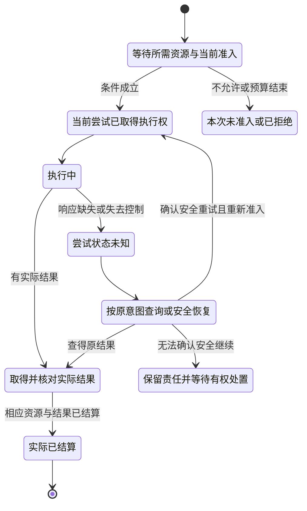

# 会话集成与结果复用

> **阅读范围**：验收设计；未作为产品测试运行 · [共同上下文](方法与独立证据.md)。

<details>
<summary>本页内容</summary>

- [验证会话、候选树、主分支健康与合并授权](#验证会话候选树主分支健康与合并授权)
- [验证会话、结果复用与主分支健康](#验证会话结果复用与主分支健康)
- [验证基础设施污染、缓存隔离与可重现性](#验证基础设施污染缓存隔离与可重现性)
- [验证结果、适用性五态与聚合](#验证结果适用性五态与聚合)

</details>


## 验证会话、候选树、主分支健康与合并授权

### 1. 单一会话编排

以下针对请求明确包含集成到受保护分支的画像。设计、纯查询和未请求合并的候选检查不以本流程为前置；独立审查、一次性授权和主分支读回按实际项目政策裁剪，不删除真实必需义务。

```text
orient
→ freeze WorkPackage and CandidateTree
→ compile one trusted plan
→ base/candidate differential
→ execute/reuse/join Actions
→ assemble Evidence
→ independent Review
→ issue single-use merge authorization
→ merge expected tree
→ new-main health readback
→ closeout
```

### 2. FreezeSession

绑定本次任务引用、base tree、candidate tree、verifier bundle、test plan、profile和environment；已有工作包可引用，不强迫新建另一张表。相交输入改变时创建新一代结论，旧会话记录不篡改；仍被合法消费者使用的共享执行不因一个候选变化而一律取消，合格独立结果可复用。

### 3. Base/Candidate

先确认相同声明、计划、环境及确定性假设，再比较base与candidate：基线通过而候选失败是回归证据；反向是修复证据。相同fingerprint只表示可疑同类失败，不独自证明原因相同或可以豁免；结合实际基线观察与已接受的已知缺陷政策。无需为认定旧问题强制另建MainHealth账本，已有可信记录可引用。新fingerprint触发相交范围再分类；阻断与否由该集成所需声明和风险决定，不能因此停掉无关设计。随机或不稳定检查另用相应统计与重试规则。

### 4. MainHealth

```text
healthy | degraded | locked
```

degraded绑定实际失败、责任、修复和允许范围。所需主分支资格未知时不能显示healthy；对要求该资格的合并保持锁定或待决，不把未知改成已经故障，也不阻断无关读取、设计或补证。MainHealth是本画像的操作投影，底层仍保留未知、失败和政策禁止的区别。

### 5. Merge authorization

一次性、绑定 exact candidate/base/main、required evidence 和 review。head/tree/policy 变化后失效。PR 绿色、admin 能力和文档不能替代。

Review 输入不是一个 GitHub `APPROVED` 布尔值。会话先取得只读 `ReviewStabilityReceipt`，再由受信 review-method bridge 形成结构化 `ReviewReport`；报告显式绑定 `reviewMethodRevision`、coverage mode、required/reviewed/unreviewed surfaces、findings 与 terminal。IntegrationAuthorization同时保存 stability revision/receipt digest 和 ReviewReport revision/report digest，任一变化都使授权 stale。只有当前报告 `terminal=clear` 且 required surface 与当前 ScopeAuthorization逐项相同才可继续。

GitHub/Codex/human 都只是 provider；provider 的 quota/auth/capacity 状态不进入 Finding。自动 reviewer 的启动归 provider/GitHub 生命周期所有，VerificationSession不通过 PR Conversation重复发送 `@codex review` 或 locator comment。新 provider若不能给出可验证 coverage，只能得到 incomplete/unresolved，而不能因为“没有报错”自动提升为 clear。

### 6. New-main

远端合并后从 exact main 读回 tree、required main-only claims、平台 enforcement 和 closeout。candidate Evidence 只有输入闭包完全等价时复用。

### 7. 验证

变基、强制推送、基线失败、审查缺失、管理员旁路、合并响应丢失、树不匹配、托管检查缺失、本地主分支分叉和分支或工作树残留。


## 验证会话、结果复用与主分支健康

### 1. 设计目标

验证系统必须在高并发和失败条件下复用相同工作，同时防止陈旧证据、环境污染、候选自证和平台状态误报。需要跨进程共享、等待与恢复时，验证会话保存相应持久协调状态，不依赖某个CI页面或进程存活；简单同步检查可以返回结果而不建立持久会话。

### 2. 验证会话

```ts
interface VerificationSession {
  readonly sessionId: VerificationSessionId;
  readonly candidateRef: CandidateRef;
  readonly claimClosure: readonly ClaimRef[];
  readonly policyRevision: PolicyRevision;
  readonly environmentRequirements: EnvironmentRequirementRef;
  readonly selectedActions: readonly VerificationActionRef[];
  readonly actionStates: ReadonlyMap<ActionKey, VerificationActionState>;
  readonly reviewRequirements: readonly ReviewRequirementRef[];
  readonly aggregateState: VerificationAggregateState;
  readonly stateRevision: RevisionRef;
}
```

会话协调多个动作和消费者，但不拥有 Claim 语义、测试实现或最终发布权限。

### 3. 动作身份

```text
VerificationActionKey = digest(
  claim semantics,
  action-scoped candidate input content,
  normalized dependency key material,
  verification definition,
  toolchain and test-data revisions,
  environment profile,
  applicable policy,
  isolation profile
)
```

以下内容默认不进入动作键：

- CI run number；
- 临时 runner identity；
- 日志 URL；
- 排队时间；
- 与该动作无关的仓库文件；
- 全局文档或工作区 generation。

它们进入执行回执和来源，不污染计算身份。完整 CandidateRef 绑定会话和组合证据，只有动作确实消费全候选时才把完整候选内容放入动作键；局部动作按 [可达输入闭包与负依赖](../../编译/查询增量与性能.md#可达输入声明依赖证据与负依赖) 处理。

### 4. 共享执行

同一 `ActionKey` 可以使用 single-flight：

```text
first requester
→ create execution
subsequent requester
→ attach waiter
execution completes
→ immutable result shared
```

每个等待者保留自己的：

- 取消意图；
- 权限和可见性；
- 超时；
- 结果投影；
- 消费会话。

一个等待者取消不能终止其他合法消费者仍需要的共享执行。最后有效登记撤离与关闭新加入在同一协调点完成；新等待者不能接入已关闭实例。实际算法复用[共享生产代际](../../编译/递归并行与远程编译.md#shared-producer-generation)，原执行状态机继续表达尝试与观察，不再另建一套取消拥有者。只有没有其他合法消费者且动作可取消时，原协调器才向准确实例请求终止；旧结果、旧计费和旧清理不能作用于新代。

### 5. 合法复用

既有结果复用必须同时满足：

- `ActionKey` 完全相同；
- 结果完整性可验证；
- Evidence 未撤销；
- 适用范围覆盖当前 Claim；
- 环境和测试数据仍可接受；
- 隔离和独立性条件仍成立；
- 结果未超过声明的有效窗口；
- 安全事件未使来源不可信。

确定性失败可以复用以避免重复昂贵计算；瞬时基础设施失败只有在错误分类允许时重试，不能长期缓存为候选不满足。

### 6. 执行状态机



这是已经请求执行的单次尝试生命周期，不是设计任务的必经图。租约到期和客户端超时不证明工作停止；Parked不是已完成，也不强制人工角色。业务结果仍可能是失败，正常退出不签发任务满足。
状态更新使用CAS；执行租约携带其目标实际强制的围栏。旧执行者的迟到结果不得覆盖新尝试已确认的状态。已完成是执行事实；后续证据撤销或资格失效写入独立资格状态，不撤销历史事实。确需逆转业务效果时建立新操作，按当前前像、权限与恢复协议执行。

### 7. 环境身份与隔离

验证环境至少绑定：

- 操作系统和架构；
- Runtime 和工具链 revision；
- 容器或环境制品摘要；
- 环境变量白名单摘要；
- 网络、文件系统、时钟和资源能力；
- 测试数据 generation；
- 租户和安全域；
- 清理和销毁策略。

候选代码默认不能修改验证定义、Oracle、证据存储或协调状态。执行环境销毁失败会使后续共享资格下降或被禁止。

### 8. 环境租约与恢复

协调器为每次物理尝试签发：

```text
ExecutionLease {
  actionKey,
  attemptId,
  environmentRef,
  fencingToken,
  deadline,
  heartbeatPolicy,
  resultWriteCapability
}
```

协调器崩溃或 runner 失联时：

1. 从持久状态读取动作；
2. 判断租约是否仍有效；
3. 查询环境和结果存储；
4. 检查不可变结果是否已提交；
5. 已提交则验证完整性并结算；
6. 未确认则进入恢复或创建新尝试；
7. 新尝试获得更高 fencing token；
8. 旧尝试晚到结果被拒绝或保留为非权威 Observation。

### 9. 结果与证据

动作执行完成先产生 `VerificationResult`，再由证据编译器绑定：

```text
Result
+ Claim
+ Candidate
+ InputClosure
+ Environment
+ Coverage
+ Method
+ Integrity
→ Evidence
```

runner返回精确对象上的实际方法结果，不能自行更改原声明或给自身增加授权。普通确定检查可由已接受的规则处理器核适用性并形成对应Verdict；仅当实际保证或政策要求独立复核时，由相应Reviewer检查方法、完整性、共同缺陷与残余未知。第二个AI不是全部检查的固定前置。

### 10. 会话聚合

```ts
type VerificationAggregateState =
  | { kind: 'pending' }
  | { kind: 'running' }
  | { kind: 'blocked'; blockers: readonly BlockerRef[] }
  | { kind: 'unknown'; reasons: readonly UnknownReason[] }
  | { kind: 'not-satisfied'; failedClaims: readonly ClaimRef[] }
  | { kind: 'satisfied'; evidence: readonly EvidenceRef[] }
  | { kind: 'stale'; changes: readonly ChangeRef[] }
  | { kind: 'invalid'; diagnostics: readonly DiagnosticRef[] };
```

聚合不能把以下状态压成通过：

- 没有选到动作且没有完整义务选择/解除证据；
- 仅凭动作不适用就跳过其他必需义务；
- 环境不可用；
- 结果完成未知；
- 证据陈旧；
- 本次明确要求的独立Reviewer尚未完成；
- 必要覆盖不足。

### 11. 候选健康与主分支健康分离

候选通过只证明候选在指定基准和环境下满足声明。合并后必须建立新的 `MainHealthObservation`：

```text
VerifiedCandidate
+ MergeAuthorization
+ ExpectedMainPreimage
→ MergeAttempt
→ AuthoritativeMainReadback
→ MainHealthVerification
```

主分支健康至少检查：

- 合并策略要求保留 ancestry 时核对祖先关系；Squash/Rebase 则核对精确目标树、预期改动与合并基线，不能仅凭原提交不是祖先判定未集成；
- 合并结果是否包含预期内容；
- 合并队列或同时变更是否改变依赖；
- 默认分支上的门禁是否实际运行；
- 构建和关键测试是否绑定合并后 revision；
- 生成制品摘要是否与发布候选一致；
- 控制面和文档投影是否同步；
- 失败时是否停止后续提升。

PR 绿灯不能替代主分支读回。

### 12. 服务器端不可绕过控制

最低要求：

- 禁止未验证直接写默认分支；
- required checks 绑定 exact candidate；
- 更新候选后重建其组合资格；仍匹配动作键、范围和实时资格的不可变局部结果可以复用，不把全部历史结果销毁；
- 本次明确要求独立复核时，Reviewer/producer按所需独立性分离；
- 合并授权一次性且绑定预像；
- force push 和规则修改需独立权限；
- 合并后自动启动主分支健康；
- 发布只消费已验证内容寻址制品。

本地 hook、脚本约定和聊天确认不属于安全边界。

### 13. 成本与资源

验证会话记录：

- 队列时间；
- 执行时间；
- CPU、内存、磁盘和网络；
- Provider 配额；
- 缓存命中和复用；
- 环境创建与销毁；
- 失败分类；
- 人工复核时间。

资源优化不能减少必要 Claim、隔离和独立性。可以通过影响选择、动作复用、分层环境和抽样独立重算降低成本。

### 14. 对抗与故障测试

- 两个会话并发请求同一动作；
- 一个等待者取消，另一个继续等待；
- runner 在结果写入前后崩溃；
- 心跳丢失但动作仍运行；
- 新尝试完成后旧尝试晚到；
- 结果对象写入但确认响应丢失；
- 测试环境残留上个候选状态；
- 候选试图修改测试或证据；
- 测试选择为空；
- Provider 和工具链 revision 漂移；
- Evidence 撤销后发布资格仍存在；
- 合并响应丢失；
- 主分支包含候选但健康门禁未运行；
- 同一缓存结果跨租户复用；
- 独立复核者共享同一错误实现。

### 15. 验收条件

- 会话是持久对象并可恢复；
- single-flight 不破坏取消语义；
- 复用条件可机器判定；
- 旧 runner 不能覆盖新尝试；
- 环境身份、清理和隔离进入证据；
- Result、Evidence、Review 和 Verdict 分离；
- 候选健康与主分支健康分离；
- required checks 不可绕过；
- 撤销局部传播到会话、资格和发布；
- 每个非终态有明确的观察/恢复责任与可请求下一步；资源或权威失效时可以保持待恢复，不能无条件承诺一定到达成功终点。


## 验证基础设施污染、缓存隔离与可重现性

### 1. 验证器也会失败

测试缓存、fixture、浏览器、数据库、端口、时钟、并发、随机种子、网络和 runner 状态会改变结果。验证基础设施必须作为被验证系统的一部分治理。

### 2. VerificationEnvironment

```text
VerificationEnvironment = exact {
  hostRuntimeToolchainRefs,
  resourceAndFixtureRefs,
  cacheNamespaceAndPolicy,
  networkAndCredentialPolicy,
  clockRandomSeedAndLocale,
  isolationAndCleanupContract,
  environmentRevision,
  readbackAndSettlementRefs
}
```

### 3. 缓存

cache bytes不能授权PASS。off/cold/warm在相同有效输入与检查方法下应得到等价的规范结论；损坏缓存必须被识别并丢弃，能在真实当前条件下重算时再取得结果，不能重算则报告不可用/未完成。不能要求corrupt路径无条件返回与健康路径相同的成功。上一Session不污染下一Session，身份绑定的控制状态不进入共享cache。

### 4. Fixture

可复用 immutable prefix 与 scenario-local mutable suffix 分离。COW/reflink 只是实现机制，不能替代 fixture identity 和隔离证明。

### 5. Flake

flake 先分类环境、竞态、非确定性、外部依赖、资源和真实随机行为。盲目 retry 会隐藏缺陷。相同失败 fingerprint 且无因果变化时不重复昂贵路径。

### 6. 可重现

保留 exact input、seed、environment、provider、toolchain、fixture 和 failure fingerprint。包含敏感数据时使用受控引用。

### 7. 验证

长测试套件污染、并行竞态、缓存损坏、时间与区域设置、随机种子重放、网络不可用、清理失败、运行镜像漂移和测试顺序依赖。


## 验证结果、适用性五态与聚合

### 1. 三个正交维度

```text
Applicability = applicable | not-applicable | unknown
ExecutionResult = passed | failed | not-run | unsupported | invalidated
ExecutionMode = executed | reused | not-executed
```

`not-applicable` 是选择结论，不是执行结果。required 且既无有效新执行证据、也无合格复用证据时不能 PASS；复用保留原执行结论并新增当前适用性记录，不伪造一次新执行。

### 2. VerificationResult

```text
VerificationResult = exact {
  requirementAndClaimRef,
  applicabilityAndProofRef,
  exactSubjectAndInputClosure,
  producerAndEnvironmentRefs,
  executionMode,
  executionResult,
  actionAndEvidenceRefs,
  resourceCleanupReadbackRefs,
  invalidationLineage,
  boundedDiagnostics
}
```

### 3. 聚合

顺序无关、fail closed：

- 任一 required failed → failed；
- required not-run/unsupported/invalidated → 不能 passed；
- applicability unknown → 不能 passed；
- 无适用义务时，须证明选择闭包完整且相关义务不适用；
- 有适用义务但全部由有效证据复用解除时，可以新增执行数为零；
- 区分候选义务总数、适用义务数、已解除义务数、新执行数和复用数，不能用“零测试”代替这些判断；
- cleanup/readback failure 进入结果；
- stale reuse 变 invalidated。

### 4. 投影

CLI、Check、Artifact、Dashboard 和文档只投影同一 machine result，不创建不同绿色定义。

### 5. 验证

平台跳过、零选择、复用结果陈旧、清理失败、Node 与 Bun 环境互相替代、Windows 与 Linux 互相替代、输出顺序置换和 Provider 缺失。
