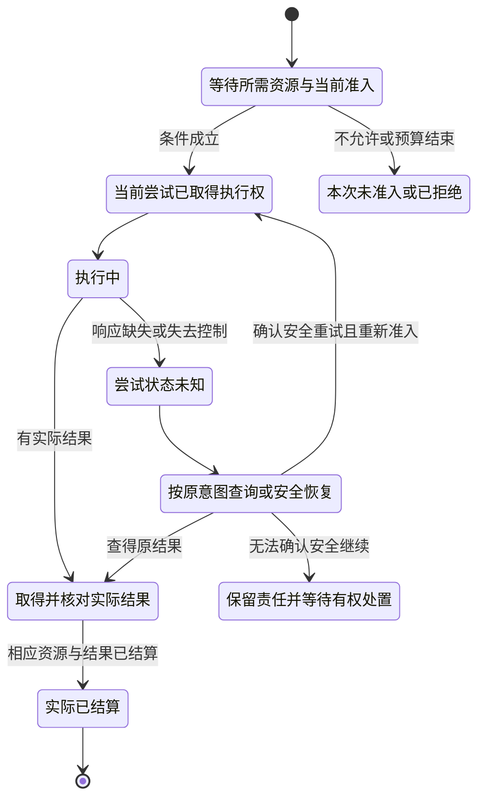

# 会话集成与结果复用

> **阅读范围**：验收设计；未作为产品测试运行 · [共同上下文](方法与独立证据.md)。

<details>
<summary>本页内容</summary>

- [验证会话、候选树、主分支健康与合并授权](#验证会话候选树主分支健康与合并授权)
- [验证会话、结果复用与主分支健康](#验证会话结果复用与主分支健康)
- [验证基础设施污染、缓存隔离与可重现性](#验证基础设施污染缓存隔离与可重现性)
- [验证结果、取得状态与聚合](#验证结果取得状态与聚合)

</details>


## 验证会话、候选树、主分支健康与合并授权

### 1. 单一会话编排

以下针对请求明确包含集成到受保护分支的画像。设计、纯查询和未请求合并的候选检查不以本流程为前置；独立审查、一次性授权和主分支读回按实际项目政策裁剪，不删除真实必需义务。

```text
orient
→ freeze WorkPackage and CandidateTree
→ compile one trusted plan
→ base/candidate differential
→ execute/reuse/join Actions
→ assemble Evidence
→ independent Review
→ issue single-use merge authorization
→ merge expected tree
→ new-main health readback
→ closeout
```

### 2. FreezeSession

绑定本次任务引用、base tree、candidate tree、verifier bundle、test plan、profile和environment；已有工作包可引用，不强迫新建另一张表。相交输入改变时创建新一代结论，旧会话记录不篡改；仍被合法消费者使用的共享执行不因一个候选变化而一律取消，合格独立结果可复用。

### 3. Base/Candidate

先确认相同声明、计划、环境及确定性假设，再比较base与candidate：基线通过而候选失败是回归证据；反向是修复证据。相同fingerprint只表示可疑同类失败，不独自证明原因相同或可以豁免；结合实际基线观察与已接受的已知缺陷政策。无需为认定旧问题强制另建MainHealth账本，已有可信记录可引用。新fingerprint触发相交范围再分类；阻断与否由该集成所需声明和风险决定，不能因此停掉无关设计。随机或不稳定检查另用相应统计与重试规则。

### 4. MainHealth

```text
healthy | degraded | locked
```

degraded绑定实际失败、责任、修复和允许范围。所需主分支资格未知时不能显示healthy；对要求该资格的合并保持锁定或待决，不把未知改成已经故障，也不阻断无关读取、设计或补证。MainHealth是本画像的操作投影，底层仍保留未知、失败和政策禁止的区别。

### 5. Merge authorization

一次性、绑定 exact candidate/base/main、required evidence 和 review。head/tree/policy 变化后失效。PR 绿色、admin 能力和文档不能替代。

### 6. New-main

远端合并后从 exact main 读回 tree、required main-only claims、平台 enforcement 和 closeout。candidate Evidence 只有输入闭包完全等价时复用。

### 7. 验证

变基、强制推送、基线失败、审查缺失、管理员旁路、合并响应丢失、树不匹配、托管检查缺失、本地主分支分叉和分支或工作树残留。


## 验证会话、结果复用与主分支健康

### 1. 设计目标

验证系统必须在高并发和失败条件下复用相同工作，同时防止陈旧证据、环境污染、候选自证和平台状态误报。需要跨进程共享、等待与恢复时，验证会话保存相应持久协调状态，不依赖某个CI页面或进程存活；简单同步检查可以返回结果而不建立持久会话。

### 2. 验证会话

```ts
interface VerificationSession {
  readonly sessionId: VerificationSessionId;
  readonly candidateRef: CandidateRef;
  readonly claimClosure: readonly ClaimRef[];
  readonly policyRevision: PolicyRevision;
  readonly environmentRequirements: EnvironmentRequirementRef;
  readonly selectedActions: readonly VerificationActionRef[];
  readonly actionStates: ReadonlyMap<ActionKey, VerificationActionState>;
  readonly reviewRequirements: readonly ReviewRequirementRef[];
  readonly aggregateState: VerificationAggregateState;
  readonly stateRevision: RevisionRef;
}
```

会话协调多个动作和消费者，但不拥有 Claim 语义、测试实现或最终发布权限。

### 2.1 验证义务、运行位置和作用阶段

`environmentRequirements` 保存方法实际要求的能力和隔离条件；本次执行环境保存已经观察、准入的真实工具链、provider、资源与物理边界。`local` 或 `hosted` 是运行位置的选择，不能单独证明满足要求，也不能决定 Claim、Oracle 或权限。组合入口显式传递所选环境，共享会话准备不得用缺省值把未选择的远端环境写进身份。SEC 自身仓库的本地默认、具体命令与旧拓扑退出由[仓库接合规则](../../开发/AI协作/规则装载与任务恢复.md#repository-local-verification-placement)承担，不要求其他目标工程复制该控制面。

协调、独立验收及候选执行的责任保持分离，部署可在同一计算机按序进行。只有相应方法、凭证不可达、禁止写入域、干扰模型或其他硬要求确实需要时，才拆分进程、沙箱或宿主。候选运行域不能取得结果签发和发布凭证；同机部署不等于同权限，多个机器名称也不等于实际隔离。真实隔离后端不可用只阻断依赖它的 Action，不由会话自动新建远程执行器或改用较弱方法。

准备读取并固定必要事实、计划和预期环境，返回准确准备结果或尚缺输入，不执行候选检查、不签发通过、不发布或合并。执行入口消费同一准备 owner 及当前准入，按 `RequiredClosure ∩ MissingOrStale` 复用、执行或 join，并完成物理结算后才交给证据裁决。发布和集成继续由各自授权及 Effect owner 负责；不能把准备命令改为调用一个兼做执行与合并的总入口。命令返回必须区分准备、等待、已执行结果和最终作用，已准备不等于所需环境已经具备。

运行位置改变时重核实际输入、来源与隔离；旧 Action、Session、持久请求及恢复回执保持原身份。满足同一计算与保证前提时按下节规则复用，不仅凭相同源码或重命名 provider 判断等价。旧远端操作继续按准确来源恢复，新的本地请求不能被原 hosted-only continuation 隐式消费；只读续接只说明已保存输入与证据的观察范围，不能恢复活的资格或产生执行效果；显式验证在原证据 owner 发布和读回后结束，后续集成另行准入。能力缺失应准确阻断相交阶段，不伪造终态，也不撤销已有独立准备结果。

### 3. 动作身份

```text
VerificationActionKey = digest(
  executable verification definition and revision,
  exact executable subject/input closure,
  normalized dependency key material,
  concrete method/provider/checker/comparator inputs,
  toolchain and test-data revisions,
  execution-affecting environment profile,
  applicable execution policy,
  isolation profile
)
```

ActionKey 只标识可共享的物理计算：两项义务若最终要求完全相同的可执行检查、输入、工具、Oracle／比较器、环境和隔离，可以 single-flight 同一个 Action，即使 obligation/selection identity 不同。每项 Evidence 接纳关系另保留准确义务与选择修订，并核对选择属于该义务、义务属于所求 Claim；因此改变谓词、覆盖或资格会使相应接纳失效，但只有它改变物理观察输入时才要求新的 ActionKey。反过来，相同 method 名却换了 Oracle、测试数据、执行环境或其他实际计算输入，ActionKey 必须变化。义务和选择的唯一结构见[方法规范](方法与独立证据.md#verification-obligation-selection)，本会话不再定义第二套 owner。

以下内容默认不进入动作键：

- CI run number；
- 临时 runner identity；
- 日志 URL；
- 排队时间；
- 与该动作无关的仓库文件；
- 全局文档或工作区 generation。

它们进入执行回执和来源，不污染计算身份。完整 CandidateRef 绑定会话和组合证据，只有动作确实消费全候选时才把完整候选内容放入动作键；局部动作按 [可达输入闭包与负依赖](../../编译/查询增量与性能.md#可达输入声明依赖证据与负依赖) 处理。

### 4. 共享执行

同一 `ActionKey` 可以使用 single-flight：

```text
first requester
→ create execution
subsequent requester
→ attach waiter
execution completes
→ immutable result shared
```

每个等待者保留自己的：

- 取消意图；
- 权限和可见性；
- 超时；
- 结果投影；
- 消费会话。

一个等待者取消不能终止其他合法消费者仍需要的共享执行。最后有效登记撤离与关闭新加入在同一协调点完成；新等待者不能接入已关闭实例。实际算法复用[共享生产代际](../../编译/递归并行与远程编译.md#shared-producer-generation)，原执行状态机继续表达尝试与观察，不再另建一套取消拥有者。只有没有其他合法消费者且动作可取消时，原协调器才向准确实例请求终止；旧结果、旧计费和旧清理不能作用于新代。

### 5. 合法复用

既有结果复用必须同时满足：

- `ActionKey` 完全相同；
- 结果完整性可验证；
- Evidence 未撤销；
- 适用范围覆盖当前 Claim；
- 环境和测试数据仍可接受；
- 隔离和独立性条件仍成立；
- 结果未超过声明的有效窗口；
- 安全事件未使来源不可信。

确定性失败可以复用以避免重复昂贵计算；瞬时基础设施失败只有在错误分类允许时重试，不能长期缓存为候选不满足。

### 6. 执行状态机


```mermaid
stateDiagram-v2
  [*] --> Waiting
  state "等待所需资源与当前准入" as Waiting
  state "当前尝试已取得执行权" as Admitted
  state "执行中" as Running
  state "取得并核对实际结果" as Observing
  state "尝试状态未知" as Unknown
  state "按原意图查询或安全恢复" as Recovering
  state "保留责任并等待有权处置" as Parked
  state "实际已结算" as Settled
  state "本次未准入或已拒绝" as Rejected
  Waiting --> Admitted: 条件成立
  Waiting --> Rejected: 不允许或预算结束
  Admitted --> Running
  Running --> Observing: 有实际结果
  Running --> Unknown: 响应缺失或失去控制
  Unknown --> Recovering
  Recovering --> Observing: 查得原结果
  Recovering --> Admitted: 确认安全重试且重新准入
  Recovering --> Parked: 无法确认安全继续
  Observing --> Settled: 相应资源与结果已结算
  Settled --> [*]
```

这是已经请求执行的单次尝试生命周期，不是设计任务的必经图。租约到期和客户端超时不证明工作停止；Parked不是已完成，也不强制人工角色。业务结果仍可能是失败，正常退出不签发任务满足。
状态更新使用CAS；执行租约携带其目标实际强制的围栏。旧执行者的迟到结果不得覆盖新尝试已确认的状态。已完成是执行事实；后续证据撤销或资格失效写入独立资格状态，不撤销历史事实。确需逆转业务效果时建立新操作，按当前前像、权限与恢复协议执行。

### 7. 环境身份与隔离

验证环境至少绑定：

- 操作系统和架构；
- Runtime 和工具链 revision；
- 容器或环境制品摘要；
- 环境变量白名单摘要；
- 网络、文件系统、时钟和资源能力；
- 测试数据 generation；
- 租户和安全域；
- 清理和销毁策略。

候选代码默认不能修改验证定义、Oracle、证据存储或协调状态。执行环境销毁失败会使后续共享资格下降或被禁止。

### 8. 环境租约与恢复

协调器为每次物理尝试签发：

```text
ExecutionLease {
  actionKey,
  attemptId,
  environmentRef,
  fencingToken,
  deadline,
  heartbeatPolicy,
  resultWriteCapability
}
```

协调器崩溃或 runner 失联时：

1. 从持久状态读取动作；
2. 判断租约是否仍有效；
3. 查询环境和结果存储；
4. 检查不可变结果是否已提交；
5. 已提交则验证完整性并结算；
6. 未确认则进入恢复或创建新尝试；
7. 新尝试获得更高 fencing token；
8. 旧尝试晚到结果被拒绝或保留为非权威 Observation。

### 9. 结果与证据

动作执行完成先产生 `VerificationResult`，再由证据编译器绑定：

```text
Result
+ Claim
+ Candidate
+ InputClosure
+ Environment
+ Coverage
+ Method
+ Integrity
→ Evidence
```

runner返回精确对象上的实际方法结果，不能自行更改原声明或给自身增加授权。普通确定检查可由已接受的规则处理器核适用性并形成对应Verdict；仅当实际保证或政策要求独立复核时，由相应Reviewer检查方法、完整性、共同缺陷与残余未知。第二个AI不是全部检查的固定前置。

### 10. 会话聚合

```ts
type VerificationAggregateState =
  | { kind: 'pending' }
  | { kind: 'running' }
  | { kind: 'blocked'; blockers: readonly BlockerRef[] }
  | { kind: 'unknown'; reasons: readonly UnknownReason[] }
  | { kind: 'not-satisfied'; failedClaims: readonly ClaimRef[] }
  | { kind: 'satisfied'; evidence: readonly EvidenceRef[] }
  | { kind: 'stale'; changes: readonly ChangeRef[] }
  | { kind: 'invalid'; diagnostics: readonly DiagnosticRef[] };
```

聚合不能把以下状态压成通过：

- 没有选到动作且没有完整义务选择/解除证据；
- 仅凭动作不适用就跳过其他必需义务；
- 环境不可用；
- 结果完成未知；
- 证据陈旧；
- 本次明确要求的独立Reviewer尚未完成；
- 必要覆盖不足。

### 11. 候选健康与主分支健康分离

候选通过只证明候选在指定基准和环境下满足声明。合并后必须建立新的 `MainHealthObservation`：

```text
VerifiedCandidate
+ MergeAuthorization
+ ExpectedMainPreimage
→ MergeAttempt
→ AuthoritativeMainReadback
→ MainHealthVerification
```

主分支健康至少检查：

- 合并策略要求保留 ancestry 时核对祖先关系；Squash/Rebase 则核对精确目标树、预期改动与合并基线，不能仅凭原提交不是祖先判定未集成；
- 合并结果是否包含预期内容；
- 合并队列或同时变更是否改变依赖；
- 默认分支上的门禁是否实际运行；
- 构建和关键测试是否绑定合并后 revision；
- 生成制品摘要是否与发布候选一致；
- 控制面和文档投影是否同步；
- 失败时是否停止后续提升。

PR 绿灯不能替代主分支读回。

### 12. 服务器端不可绕过控制

最低要求：

- 禁止未验证直接写默认分支；
- required checks 绑定 exact candidate；
- 更新候选后重建其组合资格；仍匹配动作键、范围和实时资格的不可变局部结果可以复用，不把全部历史结果销毁；
- 本次明确要求独立复核时，Reviewer/producer按所需独立性分离；
- 合并授权一次性且绑定预像；
- force push 和规则修改需独立权限；
- 合并后自动启动主分支健康；
- 发布只消费已验证内容寻址制品。

本地 hook、脚本约定和聊天确认不属于安全边界。

### 13. 成本与资源

验证会话记录：

- 队列时间；
- 执行时间；
- CPU、内存、磁盘和网络；
- Provider 配额；
- 缓存命中和复用；
- 环境创建与销毁；
- 失败分类；
- 人工复核时间。

资源优化不能减少必要 Claim、隔离和独立性。可以通过影响选择、动作复用、分层环境和抽样独立重算降低成本。

### 14. 对抗与故障测试

- 两个会话并发请求同一动作；
- 一个等待者取消，另一个继续等待；
- runner 在结果写入前后崩溃；
- 心跳丢失但动作仍运行；
- 新尝试完成后旧尝试晚到；
- 结果对象写入但确认响应丢失；
- 测试环境残留上个候选状态；
- 候选试图修改测试或证据；
- 测试选择为空；
- Provider 和工具链 revision 漂移；
- Evidence 撤销后发布资格仍存在；
- 合并响应丢失；
- 主分支包含候选但健康门禁未运行；
- 同一缓存结果跨租户复用；
- 独立复核者共享同一错误实现。

### 15. 验收条件

- 会话是持久对象并可恢复；
- single-flight 不破坏取消语义；
- 复用条件可机器判定；
- 旧 runner 不能覆盖新尝试；
- 环境身份、清理和隔离进入证据；
- Result、Evidence、Review 和 Verdict 分离；
- 候选健康与主分支健康分离；
- required checks 不可绕过；
- 撤销局部传播到会话、资格和发布；
- 每个非终态有明确的观察/恢复责任与可请求下一步；资源或权威失效时可以保持待恢复，不能无条件承诺一定到达成功终点。


## 验证基础设施污染、缓存隔离与可重现性

### 1. 验证器也会失败

测试缓存、fixture、浏览器、数据库、端口、时钟、并发、随机种子、网络和 runner 状态会改变结果。验证基础设施必须作为被验证系统的一部分治理。

### 2. VerificationEnvironment

```text
VerificationEnvironment = exact {
  hostRuntimeToolchainRefs,
  resourceAndFixtureRefs,
  cacheNamespaceAndPolicy,
  networkAndCredentialPolicy,
  clockRandomSeedAndLocale,
  isolationAndCleanupContract,
  environmentRevision,
  readbackAndSettlementRefs
}
```

### 3. 缓存

cache bytes不能授权PASS。off/cold/warm在相同有效输入与检查方法下应得到等价的规范结论；损坏缓存必须被识别并丢弃，能在真实当前条件下重算时再取得结果，不能重算则报告不可用/未完成。不能要求corrupt路径无条件返回与健康路径相同的成功。上一Session不污染下一Session，身份绑定的控制状态不进入共享cache。

### 4. Fixture

可复用 immutable prefix 与 scenario-local mutable suffix 分离。COW/reflink 只是实现机制，不能替代 fixture identity 和隔离证明。

### 5. Flake

flake 先分类环境、竞态、非确定性、外部依赖、资源和真实随机行为。盲目 retry 会隐藏缺陷。相同失败 fingerprint 且无因果变化时不重复昂贵路径。

### 6. 可重现

保留 exact input、seed、environment、provider、toolchain、fixture 和 failure fingerprint。包含敏感数据时使用受控引用。

### 7. 验证

长测试套件污染、并行竞态、缓存损坏、时间与区域设置、随机种子重放、网络不可用、清理失败、运行镜像漂移和测试顺序依赖。


## 验证结果、取得状态与聚合

### 0. 机器责任分层

当前机器合同必须区分三件不同的事实：

- `VerificationGateResult` 继续由 #176 拥有物理 gate/result 真值：是否适用、是否实际执行/复用、`passed|failed|not-run|unsupported|invalidated`、owning environment 与 cleanup/invalidation 投影。它不因为 `passed` 或 `reused` 就取得“当前 Claim 已满足”的权限。
- `VerificationActionTerminal`／受信 terminal artifact 继续由 #179/Action owner 拥有准确物理 producer/attempt 结算；ActionKey 是可共享计算身份，不等于某次 attempt。
- `VerificationEvidenceUse` 由独立 evidence-use owner 拥有“某份既存 Evidence 在当前 exact Claim、subject、ProofObligation 与 VerificationMethodSelection 下能否参与裁决”。它引用 producer result/Evidence，不写回 immutable producer，也不拥有最终 Verdict。

没有可解析的 exact obligation/selection revision 时不能签发 `qualified` Evidence Use；不能拿 gateId、方法名字、历史 PASS 或相同 ActionKey 代替该绑定。当前 `VerificationGateResult` V1 与 Evidence V4 保持字节兼容，后续 consumer 只能通过显式 Evidence Use 逐步切换，不能让旧 projection 暗中变成第二资格 truth。 `VerificationEvidenceUse` 的 content digest 只证明记录内容身份，不证明其中 qualification 仍当前有效；本包不提供“读取 record 即得到 Verdict 输入”的投影。持久化 EvidenceUse 在真正参与裁决前必须由后继 live qualification resolver 重新核 Evidence、subject、obligation、selection、coverage、freshness、producer/cleanup 与 invalidation，再签发当前消费 authority。

### 1. 五个相互独立的判断维度

验证不能把“是否适用、有没有方法、这次怎样取得、物理执行如何结束、方法对命题得出什么”压成一个 status。当前 canonical 结果使用以下五个维度；Evidence 的 freshness、coverage、qualification 与 invalidation lineage 继续由保证关系独立维护：

```text
Applicability         = applicable | not-applicable | unknown
MethodCapability      = supported | unsupported | unknown
AcquisitionMode       = executed | direct-evaluated | reused | not-acquired
AcquisitionSettlement = not-started | completed | cancelled | timed-out
                      | resource-exhausted | infrastructure-failed | completion-unknown
MethodConclusion      = supports | contradicts | indeterminate | not-produced
```

含义严格分开：

- `not-applicable`是义务选择结论，不是执行结果；`Applicability=unknown`不能伪造成测试失败。
- `MethodCapability=unsupported/unknown`说明当前所选方法在该环境下能力不足或未知；通常对应`not-acquired + not-started + not-produced`，不能写成命题被反驳。
- `executed`表示实际取得了VerificationAction的一个物理attempt；`direct-evaluated`表示无外部Effect、无需Execution准入的DirectEvaluation；`reused`表示本次没有新producer而尝试消费历史Evidence；`not-acquired`表示本次没有取得可用观察。
- `completed`只说明生产者按自己的协议终结。一个solver可以`completed + indeterminate`；方法正常完成并得到当前命题反例可以`completed + contradicts`。
- cancel、timeout、资源耗尽、基础设施失败和完成未知均保留自己的物理事实。除非方法合同已经在该异常结算前独立提交了可核、足以支撑结论的不可变结果，否则对应`MethodConclusion=not-produced`，不能降成`contradicts`。
- `supports/contradicts`只是方法对准确义务产生的方向性结论，不是最终ClaimVerdict；它们都必须经当前主体、义务、选择、覆盖与资格的QualifiedEvidenceUse才能参与聚合。
- `reused`不产生新的producer；历史Evidence继续拥有原VerificationAction attempt或DirectEvaluation producer，本次只记录sourceEvidenceRef并重新判断资格/适用性。
- stale/invalid Evidence 不改写原生产时的MethodConclusion或AcquisitionSettlement，只让当前QualifiedEvidenceUse不存在或失效。

### 2. VerificationResult

```text
VerificationResult = exact {
  requirementAndClaimRef,
  proofObligationRef, proofObligationRevision,
  methodSelectionRef, methodSelectionRevision,
  applicabilityAndProofRef,
  methodCapability,
  exactSubjectAndInputClosure,
  acquisition:
    | {
        mode: executed,
        producer: {
          kind: verification-action-attempt,
          actionRef, actionKey,
          attemptRef, fencingToken,
          settlementReceiptRef?
        },
        settlement: AcquisitionSettlement,
        producerEnvironmentRefs
      }
    | {
        mode: direct-evaluated,
        producer: {
          kind: direct-evaluation,
          evaluationRef, evaluationRevision
        },
        settlement: AcquisitionSettlement,
        producerEnvironmentRefs
      }
    | {
        mode: reused,
        sourceEvidenceRef,
        settlement: not-started
      }
    | {
        mode: not-acquired,
        settlement: not-started,
        reasonRef
      },
  methodConclusion,
  resourceCleanupReadbackRefs,
  invalidationLineage,
  boundedDiagnostics
}

QualifiedEvidenceUse = exact {
  evidenceRef,
  subjectRef, subjectRevision,
  proofObligationRef, proofObligationRevision,
  methodSelectionRef, methodSelectionRevision,
  qualificationRef
}
```

Result固定exact obligation/selection，因此即使Claim和主体未变，Oracle、方法合同、环境要求或证据资格规则改变，也不能把旧Result误当成本次选择的结果。`executed`分支绑定具体attempt而不只绑定可重试的ActionKey；attemptRef与fencingToken区分租约丢失后的新attempt，已取得终态时用settlementReceiptRef绑定权威结算，completion-unknown可以没有终态receipt。`direct-evaluated`中的evaluationRef标识本次准确求值实例，evaluationRevision固定规则/证明器、输入闭包与会改变结果的解释上下文。

`reused`分支只有sourceEvidenceRef，不成为新的producer；原Evidence继续指向自己的VerificationAction attempt或DirectEvaluation producer。VerificationResult也不反向包含Evidence，从而保持Producer Result → Evidence的单向关系。assurance在当前subject/obligation/selection/coverage/freshness全部匹配后另产生QualifiedEvidenceUse；该关系是“这份历史或新Evidence现在能否被此义务消费”的当前资格，不改写Evidence本体。部分输出若不足以满足方法的sound conclusion，可以作为Observation保留，但不能把`MethodConclusion`提升为supports/contradicts。

### 3. 聚合

顺序无关、fail closed：

- applicable 且 required 的义务只有在方法能力受支持，并存在绑定当前exact subject/obligation/selection的QualifiedEvidenceUse时，才允许相应MethodConclusion参与裁决；
- 当前合格Evidence中的`supports`只有在其coverage与qualification足以解除该ProofObligation时才解除它；方法支持方向本身不等于最终Claim满足；
- 当前合格Evidence中的`contradicts`才使对应required义务不满足；历史上曾contradicts但当前stale/invalid或选择不匹配的Evidence只保留历史事实，不得继续失败当前义务；
- `indeterminate`、`not-produced`、MethodCapability unknown/unsupported、Applicability unknown 均不能产生满足或反驳；
- cancel、timeout、resource-exhausted、infrastructure-failed、completion-unknown 保持其执行事实，并使依赖该次未产出合格结论的义务继续未解除；
- 无适用义务时，须证明选择闭包完整且相关义务确为not-applicable；
- 全部适用义务由当前QualifiedEvidenceUse指向的历史Evidence解除时，可以新增执行数为零；
- 区分候选义务总数、适用义务数、已解除义务数、新Action attempt数、DirectEvaluation数、复用Evidence数和未取得数，不能用“零测试”代替这些判断；
- cleanup/readback failure 按实际方法和资源合同影响Evidence资格或producer结算，不自动改写已提交的MethodConclusion；
- stale/invalid Evidence 保留原历史结论与生产者事实，并通过qualification／invalidationLineage阻止新的QualifiedEvidenceUse。

### 4. 投影

CLI、Check、Artifact、Dashboard 和文档只投影同一 machine result，不创建不同绿色定义。

### 5. 验证

平台跳过、零选择、复用结果陈旧、清理失败、Node 与 Bun 环境互相替代、Windows 与 Linux 互相替代、输出顺序置换和 Provider 缺失。
