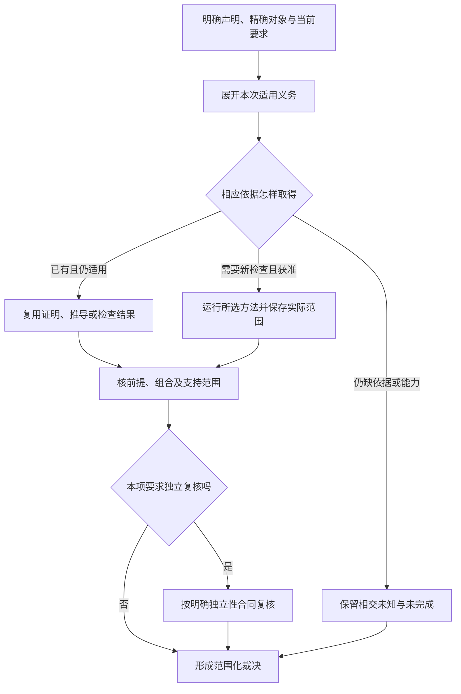
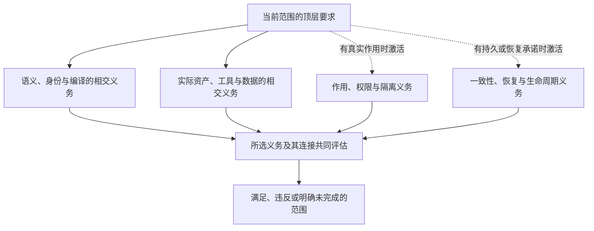

# 验证方法与故障设计

> **阅读范围**：验收设计；未作为产品测试运行。

<details>
<summary>相关主题与上下文</summary>

- [全工程装配、编译、连续开发与调试的接合验收](实现与运行案例.md#全工程装配编译连续开发与调试的接合验收)
- [需求计划、简洁作者和组合实现的联动验收](作者与组合案例.md#需求计划简洁作者和组合实现的联动验收)
- [跨软件意图抽象的验收，不以同一商业例替代](作者与组合案例.md#跨软件意图抽象的验收不以同一商业例替代)
- [简洁作者面的联合符合性](作者与组合案例.md#简洁作者面的联合符合性)
- [直接编辑、恢复与展示同源的验收边界](作者与组合案例.md#直接编辑恢复与展示同源的验收边界)
- [TS工程往返的有限正向验收](实现与运行案例.md#ts工程往返的有限正向验收)
- [Block闭包与逐层开发的验收对象](作者与组合案例.md#block闭包与逐层开发的验收对象)
- [完整语言组合的有限验收组](作者与组合案例.md#完整语言组合的有限验收组)
- [结构作者与重构的独立期望设计](作者与组合案例.md#结构作者与重构的独立期望设计)
- [本次根接合的验收设计](#本次根接合的验收设计)
- [生成器验证独立性与故障注入](#生成器验证独立性与故障注入)
- [共同原因独立性与多验证者组合](#共同原因独立性与多验证者组合)
- [危害分析、安全案例与运行时监控](#危害分析安全案例与运行时监控)
- [可信计算基、自举与候选自证防护](#可信计算基自举与候选自证防护)
- [声明、证据、裁决与独立复核](#声明证据裁决与独立复核)
- [安全、隐私、合规与供应链保证案例](#安全隐私合规与供应链保证案例)
- [实验、灰度发布、现场证据与因果推断](测试生成与形式方法.md#实验灰度发布现场证据与因果推断)
- [形式证明、模型检查、运行时保证与可信边界](#形式证明模型检查运行时保证与可信边界)
- [性能、容量、尾延迟、资源与成本真值](测试生成与形式方法.md#性能容量尾延迟资源与成本真值)
- [性质、模型、故障、模糊、变形、差分与突变测试](测试生成与形式方法.md#性质模型故障模糊变形差分与突变测试)
- [契约到求解器的语义保持](#契约到求解器的语义保持)
- [恢复演练、备份可恢复性与灾难验证](测试生成与形式方法.md#恢复演练备份可恢复性与灾难验证)
- [测试生成、选择与故障体系](测试生成与形式方法.md#测试生成选择与故障体系)
- [用户旅程、可访问性、国际化与实际效果验证](#用户旅程可访问性国际化与实际效果验证)
- [系统保证、认证与发布资格](#系统保证认证与发布资格)
- [覆盖张量、适用性与未知前沿](覆盖与收益判据.md#覆盖张量适用性与未知前沿)
- [跨语言、跨后端与 Provider 符合性](覆盖与收益判据.md#跨语言跨后端与-provider-符合性)
- [验证与用户确认的分离](#验证与用户确认的分离)
- [验证会话、候选树、主分支健康与合并授权](会话集成与结果复用.md#验证会话候选树主分支健康与合并授权)
- [验证会话、结果复用与主分支健康](会话集成与结果复用.md#验证会话结果复用与主分支健康)
- [验证基础设施污染、缓存隔离与可重现性](会话集成与结果复用.md#验证基础设施污染缓存隔离与可重现性)
- [验证结果、适用性五态与聚合](会话集成与结果复用.md#验证结果适用性五态与聚合)
- [必要性实验与生成收益验收](覆盖与收益判据.md#必要性实验与生成收益验收)
- [怎样从协议设计得到可复核的验收案例](#怎样从协议设计得到可复核的验收案例)
- [自主发现与编译调度的独立验收设计](实现与运行案例.md#自主发现与编译调度的独立验收设计)
- [复用路径的接缝验收与任务投影反例](实现与运行案例.md#复用路径的接缝验收与任务投影反例)
- [实现接合的独立判据与故障切点](实现与运行案例.md#实现接合的独立判据与故障切点)
- [成品总装的独立复核轨迹](实现与运行案例.md#成品总装的独立复核轨迹)
- [有限状态画像的差分与故障切点](领域语义案例.md#有限状态画像的差分与故障切点)
- [有限关系的算法和故障判据](领域语义案例.md#有限关系的算法和故障判据)
- [计算构建运行与观察的复核切点](实现与运行案例.md#计算构建运行与观察的复核切点)
- [私有函数抽取的独立期望](领域语义案例.md#私有函数抽取的独立期望)
- [规则装载、上下文恢复与文档交付的反例](信息与完成边界案例.md#规则装载上下文恢复与文档交付的反例)
- [有限对象、流与微分的可区分判据](领域语义案例.md#有限对象流与微分的可区分判据)
- [语言组合与对象入口的独立核查](领域语义案例.md#语言组合与对象入口的独立核查)
- [局部控制、资源寿命与即时运行的有限验收](实现与运行案例.md#局部控制资源寿命与即时运行的有限验收)
- [作者控制、保存与目标消费的联合验收设计](领域语义案例.md#作者控制保存与目标消费的联合验收设计)
- [需求抽象的正常关系与实现基线对照](领域语义案例.md#需求抽象的正常关系与实现基线对照)
- [需求作者方式与完整交付的验收](覆盖与收益判据.md#需求作者方式与完整交付的验收)
- [全体系信息结构的有限验收设计](信息与完成边界案例.md#全体系信息结构的有限验收设计)
- [CPL：任务、信号、导数、页与作用完成边界](信息与完成边界案例.md#cpl任务信号导数页与作用完成边界)
- [完整开发面DEV01—DEV48：正常操作、能力不足和恢复](开发面案例.md#完整开发面dev01dev48正常操作能力不足和恢复)
- [作者成果与语法接合的书面验收](领域语义案例.md#作者成果与语法接合的书面验收)
- [全开发面DF验收设计](开发面案例.md#全开发面df验收设计)
- [推理链和执行隔离分别接纳](#proof-trust-consumption)

</details>

### 分题阅读

- [作者与组合案例](作者与组合案例.md)
- [实现与运行案例](实现与运行案例.md)
- [领域语义案例](领域语义案例.md)
- [开发面案例](开发面案例.md)
- [信息与完成边界案例](信息与完成边界案例.md)
- [测试生成与形式方法](测试生成与形式方法.md)
- [会话集成与结果复用](会话集成与结果复用.md)
- [覆盖与收益判据](覆盖与收益判据.md)

<details>
<summary>本页内容</summary>

- [本次根接合的验收设计](#本次根接合的验收设计)
- [生成器验证独立性与故障注入](#生成器验证独立性与故障注入)
- [共同原因独立性与多验证者组合](#共同原因独立性与多验证者组合)
- [危害分析、安全案例与运行时监控](#危害分析安全案例与运行时监控)
- [可信计算基、自举与候选自证防护](#可信计算基自举与候选自证防护)
- [声明、证据、裁决与独立复核](#声明证据裁决与独立复核)
- [安全、隐私、合规与供应链保证案例](#安全隐私合规与供应链保证案例)
- [形式证明、模型检查、运行时保证与可信边界](#形式证明模型检查运行时保证与可信边界)
- [契约到求解器的语义保持](#契约到求解器的语义保持)
- [用户旅程、可访问性、国际化与实际效果验证](#用户旅程可访问性国际化与实际效果验证)
- [系统保证、认证与发布资格](#系统保证认证与发布资格)
- [验证与用户确认的分离](#验证与用户确认的分离)
- [怎样从协议设计得到可复核的验收案例](#怎样从协议设计得到可复核的验收案例)

</details>


本章覆盖整个SEC的验证方法、共同工程与各领域接合；按实际任务选择被测范围。先核全工程W、信息I及[完成边界CPL](信息与完成边界案例.md#completion-boundary-cases)，Code-OSS是其中一个原生工程范本，不是所有任务的唯一入口。

[Code-OSS 具体故障与连续修改案例](../../../examples/原生维护/Code-OSS搜索替换.md#validation-cases)覆盖打开模型零命中抑制磁盘结果、范围截断、旧预览迟到、版本门槛、已改未保存、未知结果及重试非幂等替换。所列是设计预期；执行时绑定真实产物/输入/宿主，检查前后像与未作用资源，不能拿图源校验或 ZIP 校验代替这些行为验证。

- [实验、灰度发布、现场证据与因果推断](测试生成与形式方法.md#实验灰度发布现场证据与因果推断)
- [性能、容量、尾延迟、资源与成本真值](测试生成与形式方法.md#性能容量尾延迟资源与成本真值)
- [性质、模型、故障、模糊、变形、差分与突变测试](测试生成与形式方法.md#性质模型故障模糊变形差分与突变测试)
- [恢复演练、备份可恢复性与灾难验证](测试生成与形式方法.md#恢复演练备份可恢复性与灾难验证)
- [测试生成、选择与故障体系](测试生成与形式方法.md#测试生成选择与故障体系)
- [覆盖张量、适用性与未知前沿](覆盖与收益判据.md#覆盖张量适用性与未知前沿)
- [跨语言、跨后端与 Provider 符合性](覆盖与收益判据.md#跨语言跨后端与-provider-符合性)
- [验证会话、候选树、主分支健康与合并授权](会话集成与结果复用.md#验证会话候选树主分支健康与合并授权)
- [验证会话、结果复用与主分支健康](会话集成与结果复用.md#验证会话结果复用与主分支健康)
- [验证基础设施污染、缓存隔离与可重现性](会话集成与结果复用.md#验证基础设施污染缓存隔离与可重现性)
- [验证结果、适用性五态与聚合](会话集成与结果复用.md#验证结果适用性五态与聚合)
- [必要性实验与生成收益验收](覆盖与收益判据.md#必要性实验与生成收益验收)


## 本次根接合的验收设计

下表给未来实施者明确的输入、方法和期望，不是本包已经执行的测试，也不额外生成软件载荷。

| 检查对象 | 构造输入或扰动 | 独立期望 |
|---|---|---|
| 任务与候选关系 | 固定0至255的接受域，将候选require改为至多239 | 类型检查可单独成功，但任务域违反准确可见；原接受版本不移动 |
| 连接值域 | 上游x+16，下游接受0至255 | 255导致271是书面反例；任务要求饱和时选择明确饱和修复 |
| 循环保证 | A以B为假设、B以A为假设，删去唯一初始/环境依据 | 不生成自证明；加入合法初态与保持规则后能重新判断 |
| 计划剪枝 | 局部2/3 ms，两种边界，后续8 ms传输及1 ms处理 | 保留不同边界，完整4 ms候选不被局部2 ms剪掉；数字仅作构造 |
| 资源组合 | 共享5 MiB输入，两分支各10 MiB工作区 | 在声明无其他分配前提下，并行25 MiB、顺序复用15 MiB；非max各自峰值 |
| 误差组合 | 上游界0.1，下游精确且L=20 | 可用组合界2；任务界1尚未获证，不能仍用0.1 |
| 分域失效 | 值不变，来源/布局/授权条件变化 | 只刷新依赖这些投影的结论，保持无关值缓存，不能忽略真实读集 |
| 新关系 | 在旧独立区域之间新增共同资源或公开约束 | 重算新连通范围，不用旧独立证明认证新组合 |
| 续做与优化 | 旧操作可能已作用，新的更快绑定出现 | 原操作先按原意图结算；不以新绑定重放外部效果 |
| 正常进展 | 合法闭合源、合格目标、资源足够且提供者响应 | 请求到达所需生成/检查结果；不会因未启用全平台保证而永久pending |

每个案例还应验证诊断主体、版本、位置和保持范围。性能、角色权限或目标能力需要真实环境时，先固定测量与故障方案，在获准运行后另存实际结果。书面推导与实际执行结果分别记录。


## 生成器验证独立性与故障注入

### 证明对象

验证链分别判断：模型被正确保存；规则链接合法；生成器保持所选语义；多制品相容；目标工具链能够构建；运行状态满足业务不变量；失败后没有混合提交。一个阶段通过不能签发后面阶段的结果。

测试义务可以由模型生成，独立期望不能全部从生成代码反抄。源模型本身选错业务目标时，生成器忠实生成也会得到错误产品，需要另行用户确认。

### 分层验证的输入与独立期望

| 对象 | 输入与独立期望 | 不能据此证明 |
|---|---|---|
| 函数编译 | 独立整数、布尔、控制流期望 | 完整项目导入与实际外部作用 |
| 结构前端 | 合法结构与独立语言期望，不依赖同一文本解析错误 | AI组织整个工程的成功率 |
| 结构与链接 | 完整合法形状及单个引用错误 | 全部模块业务含义正确 |
| 多制品生成 | 固定模型、规则、成员与生产关系 | 未覆盖的语言和框架 |
| 目标运行 | 明确状态、错误与结果期望 | 实际身份系统、网络和部署均成立 |
| 提交恢复 | 隔离环境中的并发与各提交切点 | 未执行的断电、介质和网络文件系统保证 |
| 来源保全 | 原字节、精确范围与变更映射 | 未取得历史内容的含义全部等价 |

### 结构合同的静态检查边界

Schema定义哪些字段和局部值形状合法，不自动查真实对象、授权、跨对象不变量或副作用。JSON Schema 2020-12中`format`可以仅是注解；只有采用并实际执行相应断言词汇/检查器，才能报告那些格式被校验。即使URI格式合法，也不证明目标存在、有权访问或与声明版本相同。

静态验证记录所用方言、检查器、是否启用格式断言和未实现词汇。结构层拒绝的载荷不能作为跨引用或业务规则已受检的证据；格式断言失败也不等于网络读取失败。合同示例只承担其明确的结构范围。

### 负测试必须击中目标

构造不符合 Schema 的记录再期望链接失败，可能只检验了缺字段，而没有检验引用类型错误。负例应使用完整合法形状，只改变待测条件，并检查具体错误码。例如把规则符号当类型，必须得到 `reference-kind-mismatch`，而不是任意异常。

增加一个负测试不意味着新建一个运行服务。测试与被保护合同建立直接关系；不以测试数量或执行次数代替覆盖范围。

### 真实并发与崩溃

在独立连接或执行者之间使用屏障，使相交操作和同请求重试竞争；检查最终状态、版本、幂等结果以及实际要求的审计和交付成员，不只检查返回值。

按准备、单项写入、提交、读回和结算的位置设计中断。进程崩溃方法可以在隔离进程的指定切点直接退出，随后由另一个观察者读取；未提交内容不可被当成成功，提交后响应丢失应能按原身份取得原结果。

进程退出测试只覆盖指定软件与文件系统环境中的进程故障。掉电、同步调用和介质保证需要相应故障模型与实际方法；一个进程切点不能代替它们。测试工具也须遵守本次执行许可和隔离范围。

### 生成器与验收共同原因

生成的API说明、客户端和服务共享模型，三者一致仍可能共同错误。因此需要针对所声称性质选择不同错误来源的校验：已有业务政策、独立实例、适用的故障设计、不同来源的状态/事件预期、快照重建或目标独立运行。列举的方法不是每次设计或纯计算请求都必须执行的一套流水线；选择依据和未覆盖共同原因要明确。

共同原因分析须明确实际独立性。缺少独立实现、形式证明或真实 AI 运行时，不能给出对应层次的保证。

### 来源和动作键攻击

加入无关模型描述，服务和DDL不应改变；修改授权角色，业务绑定必须改变；更换规则代码不能保持旧producer身份；额外 `sitecustomize.py` 即使不在清单中也不能被忽略；篡改内容后仅修改文件名不应通过验证。

摘要只能检测相对于给定清单的偏离。攻击者同时掌握产物和受信清单签发者时，摘要不能提供信任；发布准入按实际政策核来源、构建者、适用检查与授权；需要独立裁决的范围必须另取得该依据，不能让摘要或自行签名代替。普通确定结果不一律新增独立Reviewer。

### 通过与开放结果

实际测试记录单独保存输入、工具、方法、环境、结果和范围；当前设计规范不携带其执行日志。结构检查、源码保全、参考算法对照和实际产品符合性分别报告，未执行不记为通过，不用一个 passed 字段覆盖不同责任。

### 生成规则变异的验收设计

在授权的隔离目标中，可以分别移除版本检查、主体级幂等条件、必要授权、已要求的出站事件和交付围栏。独立期望应当击中被破坏的业务或恢复条件；语法错误、导入失败和任意崩溃不算识别该目标缺陷。

若为了检验语义验收而绕过隔离候选的分发摘要检查，必须明确记录该实验边界；正常分发仍执行其原内容与信任检查。识别一组变异只支持该组范围，不能证明所有生成错误可检测或全部期望独立。


## 共同原因独立性与多验证者组合

### 1. 验证者数量不是独立性

多个 reviewer、模型、runner 或实现若共享决定性错误来源，只能增加重复证据，不能显著增加独立性。

### 2. IndependenceAssessment

```text
IndependenceAssessment = exact {
  claimRef,
  evidenceAndReviewerRefs,
  sharedCodeModelDataPromptOracleRefs,
  sharedInfrastructureAndAuthorityRefs,
  sharedAssumptionsAndIncentives,
  independenceDimensions,
  residualCommonCauseRisk,
  mitigationRefs
}
```

### 3. 组合

Evidence 聚合先按 claim coverage 和 independence clusters 分组。同一cluster中的真实重复运行可以提供重复性或特定波动的信息，但复制同一报告不增加观测，相关重复也不自动增加独立样本量或降低误差。有效统计信息按采样、共享随机性和相关结构判断；不同文件、种子标签或验证者数量不能当作完全独立投票。

### 4. 异构证明

高关键 Claim 优先组合不同机制：

- 规范与形式证明；
- 参考实现与差分；
- property/model/fault 测试；
- owning environment physical execution；
- 外部状态 readback；
- 人工架构/安全审查；
- 用户 Validation；
- 现场监控。

### 5. Reviewer 合同

reviewer 对 exact candidate 只读，不能修改 candidate、oracle、test plan、merge authority 和自己的 independence receipt。作者自审可作诊断，不能满足独立复核。

独立审查拆成两个不可互相冒充的机器对象：

```text
ReviewStabilityReceipt
  = exact head/tree + reviewer principal/independence + provider observation provenance
    + complete GitHub review/thread snapshot

ReviewReport
  = StabilityReceiptRef + review method revision + required/reviewed/unreviewed surfaces
    + structured findings + deterministic terminal
```

`ReviewStabilityReceipt`只证明“谁在什么 exact revision 上形成了稳定独立观察”，不证明审查范围完整、finding 严重度或最终是否允许集成。`ReviewReport`才拥有这些裁决；merge authorization同时绑定两者的 revision/digest，禁止从 raw PR comment、review state 或“看起来没有问题”直接签发集成权限。

当前 GitHub provider bridge 只接受两种 whole-change-set 方法：独立 human `APPROVED`，或 policy 中受信 GitHub App 对 exact head 的 clean review。该 bridge 明确声明 `exact-head-change-set` coverage，才能把 ScopeAuthorization 已冻结的 changed-path surface 投影为 reviewed；普通 reducer不得自己把 required surface 填成 reviewed。未来 provider 只能通过新的 method revision/coverage contract 接入，不能复用名称相似的旧结果。

Finding 至少绑定 owner/invariant/evidence/severity/status。当前 reducer 中 open `p0/p1/p2`均阻塞，`advisory/nit`永久非阻塞；非 open finding不得继续 blocking。`accepted-risk`在没有独立 RiskAcceptance authority 验真前只能保持 unresolved，单个摘要引用不能自行解除阻塞。required surface 未覆盖为 incomplete；head/tree、scope、policy、source receipt 或 review method 漂移使既有报告失效。

Provider 可用性与 Review finding 分离。quota、billing、auth、rate-limit 等外部诊断只能由 Provider Capability owner归一为 bounded `reasonCode + digest`；原始文案是可丢弃 transport diagnostic，不写入架构文档、Work Package、ReviewReport或长期 checkpoint。Provider unavailable 只阻止/等待对应 reviewer，不等价于候选存在 finding，也不能通过反复写 `@bot` 评论重试。PR Conversation保持被动协作表面，不承担 SEC 自动化命令总线。

### 6. 验证

- 三次同模型采样；
- 不同品牌共享同一基础模型；
- 两个 backend 共享错误 spec；
- 不同 runner 共享损坏 cache；
- 人工 reviewer 只读 AI 摘要；
- 外部物理 readback 与所有软件证据冲突；
- 新发现共同原因后 aggregate 自动降级。


## 危害分析、安全案例与运行时监控

### 1. 高风险系统需要显式危害模型

功能需求和安全测试无法自动发现所有危险控制动作。涉及物理设备、资金、健康、基础设施、不可逆数据和自动决策时，必须建立损失、危害和控制约束。

### 2. HazardModel

```text
HazardModel = exact {
  lossRefs,
  hazardStates,
  controlActions,
  unsafeControlActionConditions,
  causalScenarios,
  safetyConstraints,
  detectionAndMitigation,
  safeStatesAndShutdown,
  residualRiskAcceptance
}
```

### 3. RuntimeMonitor

无法静态证明的约束编译为独立监控：输入、采样、阈值/模型、延迟、动作、fail mode、资源和旁路。监控不能与被监控系统共享全部故障域。

### 4. 安全停止

safe shutdown 仍是 Effect，需要保存关键状态、限制作用范围、避免重复和证明实际进入安全态。停止不一定总比继续更安全。

### 5. 变化

环境、设备、负载、算法、人员和法律变化都会使安全案例 stale。复用旧软件到新 Target 必须重新验证假设。

### 6. 验证

故障注入、极端环境、传感器错误、控制延迟、错误顺序、权限误用、恢复失败、monitor down、common cause 和 human override。


## 可信计算基、自举与候选自证防护

本节拥有自举检查与独立性，阶段算法由[编译器自举](../../编译/内核/确定性与自举.md#编译器自举可信根与版本演进)拥有。产品自用、库自用、编译器自宿主和控制自管理的次序由实施规范承担；它们不是四份权限，也不共用一个“全部自举成功”标签。

可信计算基按实际声明求依赖闭包：编译正确性依赖实际解析/分析/生成与相应证明工具；权限声明依赖真实策略和执行边界；内容身份依赖编码与摘要；最终采用依赖当前独立判断。不能为了把TCB写小，就删除声明实际需要的工具；没有相交义务的模块也不进入全系统共同TCB。

### 候选作为被测对象，且可以正常自测

候选可以执行自身检查以发现问题。取得独立保证时，应在当前接受的执行与比较范围里把候选作为SUT：它的代码、工作流、提示、输入与期望修改都是数据和待接受变化，不能自行改变真实权限、隐藏失败或将新期望升级为唯一Oracle。

正常矩阵比较旧检查器×旧输入、新检查器×旧输入、旧检查器×新输入、新检查器×新输入。具体语法范围不同时，旧×新可以是有类型的不支持预期或显式迁移；不是每格都必须通过，也不是任一拒绝都取消整个自举。

### 自举检查记录

记录绑定种子、源码、工具链、库、被测语言范围、比较规则、实际输出/诊断、独立来源、采用权限与恢复资产。沿已有执行/证据记录派生，不在普通设计前置一个必需BootstrapEpoch数据库。签名仅在真实政策要求时使用，字段存在不增加可信度。

自生成固定点说明同一构建关系在检查范围内稳定；类型通过说明所检查的类型规则成立；同一套语料通过说明那些输入的行为满足期望。三者不能共同自动推出所有程序正确或免疫被污染种子。需要更强信任声明时，采用独立实现、不同来源工具、翻译验证或更有力的证明，并单列假设。

### 故障与后继任务

检查候选改期望、删失败、依赖替换、跨阶段ABI、种子缺失、新语法引导循环、预算结束、失去权限、回退不能读新格式。成功后仍检查一次普通后继任务，以及候选未经独立采用时不能控制自己的发布。差异有明确原因和下一步，不用固定点成功取消任何真实反例。

不要求全部UI、日志和传输进入所有声明的TCB；若诊断被机器用于准入，它就实际进入对应可信闭包，不能仍因名字叫formatter而排除。旧不安全执行器可以停止新执行，必要的历史读取与恢复路径仍单独处理。


## 声明、证据、裁决与独立复核

### 1. 验证对象

验证回答：某个精确主体修订，在指定环境、覆盖和时间范围内，是否满足某项声明。

```text
Claim(subject, proposition, scope, assumptions)
```

### 2. 对象分层

| 对象 | 作用 |
| --- | --- |
| `Claim` | 定义要证明的命题 |
| `Gate` | 决定哪些动作必须执行 |
| `VerificationAction` | 执行一个检查 |
| `Observation` | 工具或环境返回的事实 |
| `Result` | 动作对输入的结构化结果 |
| `Evidence` | 将结果与声明、环境和覆盖绑定 |
| `Review` | 独立检查证据和方法 |
| `Verdict` | 在范围内对 Claim 的裁决 |

任何一层不能自动跳到下一层。

### 3. 裁决状态

```text
Satisfied
NotSatisfied
NotApplicable
Unknown
Stale
Invalid
```

未运行、零测试、环境不可用和 Provider 超时不能成为 `Satisfied`。

### 4. 证据方法族

- 设计模型和不变量；
- 类型与静态分析；
- 形式证明或可检查证书；
- 构建、SBOM 和来源证明；
- 单元、属性、契约、集成和端到端测试；
- 故障、并发和对抗测试；
- 部署读回、遥测和运行审计；
- 独立实现或独立环境复核。

不同方法不构成通用强弱阶梯，必须比较声明、范围、前提和方法。

### 声明到裁决的证据链



本图是依据与裁决的处理关系，不要求一次任务做完所有验证方法。独立性由真实声明与政策决定；裁决不改候选字节，也不自动执行采纳、权限提升或发布。

### 5. Evidence DAG

```text
Evidence
  references exact subject revision
  references exact action key
  references input and environment closure
  references method and result
  references coverage
  references upstream evidence
```

证据内容寻址并签名或完整性保护。

### 6. 独立性

独立性关注共同缺陷和权力分离。关键维度：

- 候选产生者是否能修改验证；
- 验证器是否共享同一实现；
- 测试数据是否由被测实现生成；
- 环境是否可被候选污染；
- Reviewer 是否有独立读取候选和证据能力；
- 发布者是否能修改 Verdict。

### 7. 声明支配

`Evidence A` 仅在以下条件下支配 `B`：

- 命题相同或更强；
- 主体和环境覆盖；
- 输入 revision 可比较；
- 覆盖不更弱；
- 方法证明能力不更弱；
- 独立性和完整性仍成立。

### 8. 陈旧和撤销

源码、配置、依赖、环境、政策、模型、Provider、测试数据或方法变化后，相关证据和 Verdict 局部陈旧。安全事件可撤销历史证据的可信资格。

### 9. 合并和发布授权

发布前准入闭合当前能够获得、且本次发布必要的材料：

```text
exact candidate
+ required satisfied claims
+ independent review
+ current branch/environment preimage
+ one-time promotion authorization
+ declared readback/recovery protocol
```

发布动作发生后，按稳定 operation identity 取得读回，将实际目标状态、结果和未结算事项纳入结算；结算后才能签发“本次发布已完成”的声明。本次发布后的读回不得作为同一次发布开始前的必要输入。已有前一次发布的健康证据可以是本次前置，但必须绑定其真实主体，不能用历史读回代替本次结果。

CI 页面“绿”不是合并权限。证据计算只产出当前声明状态，不产出执行 Grant。

### 10. 验收

- 声明、结果和裁决分离；
- 证据可离线验证；
- 零测试不能通过；
- 关键声明独立复核；
- 证据复用合法；
- 陈旧传播准确；
- Reviewer 无候选写权；
- 发布后读回；
- 证据撤销传播到认证和发布状态。

### 11. 证据任务与未满足结果

生产证据的动作自身也有前提。任务图把输入声明、任务、Oracle、产出声明和需要这些声明的动作连接起来；环只有在存在明确外部种子或迭代边界时才可执行。缺失证据先产生采集/实验任务，不默认转为无解；多个正样本不能投票抹掉同范围反证。结构检查和有限裁决见[证据缺口驱动的设计与取证闭环](../保证/要求证据与裁决.md#证据缺口驱动的设计与取证闭环)。

独立性不能用两个不同字符串或两个进程证明。真实部署须核验主体、写权限、数据来源和共同依赖；测试中的主体标签只是夹具，不能换取真实发布资格。


## 安全、隐私、合规与供应链保证案例

### 1. 四个独立维度

Security、Privacy、Compliance 和 SupplyChain 相关但不能互相替代。没有攻击不代表没有隐私伤害；合规不保证安全；签名不保证内容无恶意。

### 2. AssuranceCase

```text
AssuranceCase = exact {
  claimHierarchy,
  argumentRelations,
  evidenceRefs,
  assumptionsAndContext,
  rebuttalsAndDefeaters,
  coverageAndFreshness,
  residualRisk,
  responsibleAuthority,
  invalidationAndReview
}
```

### 3. Security

威胁主体、资产、信任边界、攻击面、权限、秘密、sandbox、network 和 incident response。控制必须有 enforcement evidence。

### 4. Privacy

目的限制、最小化、数据主体、同意/法律基础、可见性、推断、保留、删除、跨境、申诉和社会影响。加密只是其中一个控制。

### 5. Compliance

法域、适用范围、义务、例外、证据、审计期和变化。法律文本是 ExternalAuthority，产品需要 project adoption 和具体映射。

### 6. SupplyChain

source/dependency/build/runner/artifact/signature/SBOM/provenance/发布路径。内容寻址和签名证明身份与完整性，不证明实现正确。

### 7. 验证

提示注入、依赖混淆、恶意更新、秘密泄露、跨租户缓存、非受信构建、许可证不兼容、隐私推断、数据删除失败和控制旁路。


## 形式证明、模型检查、运行时保证与可信边界

### 1. 根修订

任何证明只在形式模型、逻辑、公理、配置、工具和环境假设下成立。SEC 不再使用“证明闭合”表示物理世界绝对正确，而使用 `AssumptionBoundAssurance`。

### 2. ProofObligation

```text
ProofObligation = {
  claimRef,
  formalModelOrProgramRef,
  propertyClass,
  assumptionsAndTrustedAxioms,
  proofSystemOrModelCheckerRef,
  boundedUniverseOrTheorem,
  certificateOrCounterexample,
  independentCheckerRef,
  implementationMappingRef,
  configurationAndTargetProfile,
  excludedPhysicalChannels,
  invalidationRefs
}
```

### 3. AssumptionLedger

每个保证包列出：

- 逻辑公理；
- 模型抽象；
- 未建模环境；
- compiler/linker/loader；
- proof checker；
- boot、firmware、microcode、hardware；
- DMA、memory model 和 side channels；
- 初始化和配置；
- human procedure；
- adversary model；
- 有效期和再验证触发。

假设不是脚注，而是顶层保证输入。

### 4. 可判定性分类

```text
ProofOutcome =
  | ProvedWithinModel
  | RefutedWithWitness
  | BoundedChecked
  | SoundOverapproximation
  | WitnessSoundUnderapproximation
  | StatisticalSupport
  | AssumptionDependent
  | UndecidableInDeclaredClass
  | ResourceBoundedUnknown
  | UnsupportedLogic
```

这些名称是阅读摘要，可同时成立，并非互斥的真值等级。完整结果保留主体、结果、模型/边界、近似方向、假设、方法/编码与覆盖；关键判断见[证明结果方向](#证明结果的方向与组合)。

### 5. 方法边界

| 方法 | 能证明 | 不能自动证明 |
| --- | --- | --- |
| 定理证明 | 模型中普遍性质 | 模型完整、现实假设成立 |
| 模型检查 | 有限/可抽象状态空间性质 | 无界开放世界 |
| 抽象解释 | 依 soundness 方向的保守性质 | 无假阳性且完全 |
| translation validation | 特定编译运行的关系 | 所有 future compiler runs |
| 测试/模糊 | 已执行样本和反例 | 不存在未测试缺陷 |
| runtime monitor | 已观察 trace 的可监控性质 | 无限未来活性和未观察通道 |
| 统计验证 | 分布假设下的概率支持 | 分布外和稀有未知事件 |
| 用户 Validation | 特定主体/场景的实际效果 | 所有用户和未来环境 |

### 6. 自举和 Trusting Trust

候选若修改 compiler、checker、validator、test oracle 或 trust registry，不能用修改后的路径独自证明自身。使用：

- 旧代际验证；
- 外部冻结 checker；
- 多样化双编译；
- 二进制 translation validation；
- 独立 Provider；
- 所需的有权角色与独立授权；政策明确要求人工或多方时保留该条件，不由主体名称替代真实权限；
- post-merge readback。

### 7. 组合证明

组件保证使用其实际输入域、外部假设、正常/错误分支、保持范围及环境组成，而不是相加单测绿色。[组合边界摘要与义务闭合算法](../../作者/共同语义关系.md#组合边界摘要与义务闭合算法)拥有连接生成、C0—C6和循环处理；本节只规定所用验证方法的责任。

方法消费投影后的精确义务、所用规则和依赖，输出满足/违反/未知及可复核范围。无环组合可逐条证明前提供给；状态反馈检查初态与一步保持，进展另有公平性或下降条件；递归程序使用合格的递归推理规则。把两条尚未成立的Claim互相作为证据，不构成合法循环证明。小而有限的组合可以联合验证，不强迫一定分解为假设—保证；大系统也不能仅因组合过大就取消边界检查。

检查以下反例：各函数类型正确但值域不相容；相同布局的数据单位不同；两个条件保证缺同一个环境见证；上游近似误差被下游放大；两条方法依赖同一错误翻译；运行检查发生在不可逆作用之后。每种方法还要有合法成功输入，避免只会返回拒绝。

### 8. 现实映射

证明链：

```text
Specification
→ Model
→ Source
→ Binary
→ Loaded Configuration
→ Physical Environment
→ Observed Operation
```

每个箭头有独立 conformance 义务。任何层缺失只能得到 open assumption。

### 9. 运行时保证

静态无法闭合的环境性质可由 runtime shield、safety envelope、rate limit、watchdog 和 circuit breaker 管理。但 monitor：

- 可能失败；
- 可能共享故障域；
- 可能观测过晚；
- 可能被绕过；
- 可能引入新控制不稳定。

因此 monitor 也有 Claim、资源、权限和恢复。

### 10. 顶层结果

```text
AssuranceOutcome =
  | ProvedAndAssumptionsValidated
  | ProvedWithOpenAssumptions
  | BoundedVerified
  | RuntimeShielded
  | PhysicalEvidenceOnly
  | ConflictingEvidence
  | TCBUnclosed
  | MappingUnvalidated
  | AssuranceInsufficient
```

### 11. 验收

- proof 配置和实际执行配置一致；
- 所有假设机器可追踪；
- binary/build/load identity 可读回；
- proof checker 与 candidate 分离；
- side-channel scope 明确；
- 组合证明检查 shared dependencies；
- 有界结果不外推；
- 形式证书不能自动替代真实用户 Validation。

### 类别诊断与实例结果的边界

`UndecidableInDeclaredClass` 只表示有依据的问题类别元信息，不是当前实例无解证书，也不是可普遍执行的分类算法。具体实例可返回已证满足、已证不满足、明确有界搜索结果、超预算或未知；只有实例证据支持 UNSAT。运行监控仅在目标性质可观察且能及时阻止/限制危害时补充保证，不把所有静态未证性质自动迁往运行时。


## 契约到求解器的语义保持

证明适配器也是一个有保持义务的编译器。它消费精确作者语义、证明目标、假设和实际库合同，将定义性、正常结果与错误映射到逻辑；不能因目标和求解器都把类型叫Int/Bool/Text，就直接替换运算符。其版本、逻辑、编码规则、目标观察范围和可信核进入对应证据依赖。

### 整数除法的书面反例与正确映射

SEC基础Int的商向零截断；SMT-LIB Ints的div/mod采用欧几里得余数，即除数非零时余数在0与绝对除数减一之间。于是SEC对a=-5,b=2的结果是商-2、余数-1；直接SMT div/mod是商-3、余数1。符号相同不等于含义相同。[原始定义](https://smt-lib.org/theories-Ints.shtml)为2.7页面，最后更新2026-01-16；本节没有运行求解器。

在已建立b≠0的分支，先取非负整数m=div(abs(a),abs(b))；a与b异号时q=-m，否则q=m；再令r=a-b*q。这里的abs与非负div来自数学整数，不得在定宽宿主上先溢出。这样表示的是SEC商余；不把div0的任意逻辑解释当成源语言的合法结果。源计算错误、契约检查错误、未正常终止和正常返回需要分别建模；使用部分正确性时明确其量词，不由后置条件推出总终止。

对浮点、位向量、文本索引、集合相等、外部原语同样逐项给出编码关系。没有可信映射时仅该证明方法unsupported/unknown；源程序仍可在合格目标上生成和执行，不要求所有程序先经过SMT。

### Text到逻辑的字符域与错误编码

SEC Text采用完整Unicode标量：0..D7FF与E000..10FFFF。当前核对的[SMT-LIB UnicodeStrings 2.7](https://smt-lib.org/theories-UnicodeStrings.shtml)把字母表定义为0..2FFFF，且这个整数区间包含代理码位；它既遗漏一部分合法标量，又包含SEC不接受的值。理论页关于Unicode哪些平面“尚未分配”的说明不是本设计依据；这里仅使用其实际定义的字母表。完整标量定义见[Unicode 17.0 D76](https://www.unicode.org/versions/Unicode17.0.0/core-spec/chapter-3/)。

书面反例：SEC合法文本`"\u{30000}"`含一个标量，超出该String字母表；而0xD800不能作为SEC Text成员。直接把Text映射成同名String，可能漏掉真实输入，也可能产生无效反例。默认可用有精确元素约束的整数序列或等价代数表示来保留完整域：每个元素满足0≤c≤0x10FFFF且c不在0xD800..0xDFFF。所选求解器需真正支持对应序列或代数编码，不假设所有工具内建同一种Seq。仅在证明相交的输入、量化变量和构造结果都落在公共子集时才使用该String理论，并同时排除代理码位；只限制入口而任由中间构造超域仍不充分。长度、索引、拼接、比较和编码都必须经过该映射，不把UTF-8/UTF-16编码长度当标量长度。

该理论`str.at`越界返回空串，`str.to_int`/`str.from_int`也有其特殊错误值与符号限制；这不等于SEC库的Option/Result、越界错误或整数解析合同。每个操作显式编码正常分支与错误分支，证明器接口采用结构化逻辑构造，不把源文本的`\n`、引号和反斜线原样拼进SMT字符串。不能通过缩窄源语言Text来适应某个验证工具；不支持这个映射，只限制对应证明方法。

### 泛型函数值与反例的可信接合

逻辑模型里的函数值必须包含实际可用的合同/定义范围，不能只有一个总函数符号而丢掉源前置、失败和潜在效果。未实现端口可以作为带来源的假设，但不因放进函数变量就获得可执行定义或无假设证明。函数类型没有声明全称行为时，模型不得把某个具名函数的ensure赋给所有同型实参。

`SAT`首先是该逻辑模型的满足见证，不自动是原生执行中的事故；需要核对变量取值可解码、先决条件、路径与错误映射。`UNSAT`只在编码覆盖、假设一致且所查公式确为所需反证条件时支持对应性质。对不透明原生实现或未观察分支，保留具体化缺口。序列字符、负商余、非正常返回与闭包合同应出现在共同的映射清单，不能各工具只校准自己的正向例子。

证明摘要绑定的应是已生成的公式/编码和真实输入，不是只有源文件摘要；否则同一源被错误翻译两次，身份仍可能看起来正确。无需所有低风险任务都启用逻辑后端，独立已知期望仍是合法的较小方法。

### 契约本身也要有定义

`require b != 0`放在需要计算a/b的条款之前，可以建立后者的定义域；`a/b > 0 && b != 0`不能靠逻辑合取可交换性变成安全的短路顺序。空列表首项、溢出与错误编码也一样。静态良构性检查独立于函数主体，不能让“函数体是空的”掩盖规格自身的除零或越界。[Dafny规格良构性](https://dafny.org/dafny/DafnyRef/DafnyRef#sec-well-formedness-of-specifications)是机制参照，不要求SEC继承其全部文法。

没有实现的声明可作为带标签的外部假设参与条件性推导，但不能与别的未证声明相互引用后签发无假设证明。递归模块应使用有依据的归纳/模块化规则并追踪剩余验证条件。证明前提互相矛盾时，蕴含式成立并不说明存在可接受输入；任务若承诺可执行实例，还要相应可用性依据，不能因无法普遍判定可满足性而阻止所有草稿。

### 证明结果的方向与组合

以下集合判据针对能由单条完整行为违反的性质，先按具体化合同解释到同一个观察域。令R为声明范围内的真实可达行为集合，A为分析近似，B为违反性质的行为集合；多轨迹非干扰或概率分布不能未经相应关系提升而直接套用：

- 声明R⊆A且A∩B为空，才由此支持该范围安全；A∩B不为空可能是假阳性，需要具体化见证。
- 声明A⊆R时，找到A∩B中的具体行为支持真实违反；没有找到只说明本次欠近似未包含违反，不能证明R∩B为空。
- 有界完整搜索只对公开的边界和枚举覆盖成立。统计支持、假设依赖、工具不支持和资源耗尽是其他坐标，不因换一个结果标签合并。

这些集合关系在正确抽象与具体化合同下成立；不是任意分析器自报sound就得到保证。`WitnessSoundUnderapproximation`替代旧的“CompleteUnderapproximation”叫法，明确可以漏掉尚未探索的行为。

实例证据至少保留claim/subject、result、domain/bounds、approximationDirection、assumptions、method/encoding与coverage；字段只在有消费者时使用，短纯检查可返回紧凑投影。分类枚举是摘要，不是互斥穷尽的全世界理论标签。一份结果可以同时是“有界”“依赖假设”“已有见证”，不能只剩其中一个。

<a id="finite-witness-evidence"></a>
#### 有限见证、共同策略与反例的接纳

[有限抽象构造](../../编译/实现选择与设计搜索.md#finite-abstraction-realization)与[有限观察策略](../../编译/组合前提与进展闭合.md#finite-observation-strategy)复用本节已有claim/subject、domain/bounds、approximationDirection、assumptions、method/encoding和coverage，不新增一个与Evidence竞争的证书系统。具体方法可以返回紧凑表、图或合格证明引用；记录名字不是其正确性的依据。

| 被消费的结论 | 对应可复核对象 | 不能据此扩大为 |
|---|---|---|
| 固定有限抽象可保留确定结果 | 完整合法域、投影与结果映射、每一抽象类结果一致的见证，及其准确编码 | 任意新输入、另一个观察合同或目标ABI都等价 |
| 存在共同合格结果 | 当前抽象类中的所有输入，以及同一个实际结果满足它们的依据 | 分别存在局部结果即可合成；选中默认即唯一正确 |
| 该抽象/候选域没有共同结果 | 空交所需的输入集合与规则；否定全部候选时另有完整候选域或适用完备判定 | 整个原任务无解；任意其他表示也不可行 |
| 持续安全策略 | 初态覆盖、同一知识状态使用同一动作、每一可能具体状态的启用性、全部后继留在已核安全区域 | 自动完成、具有截止界或满足多轨迹保密性质 |
| 有限完成策略 | 上述安全对应，加准确接受终态、所有非终态选择的严格下降rank和全部后继检查 | 每轮都有实际耗时上界，或外部设备一定服从模型 |
| 本有限动作/观察模型没有相应策略 | 完备败区/反制及动作覆盖，或适用的无策略证明；保留共同策略的量词 | 一条坏执行反驳全部策略；概率1成功也不可能 |
| 一个候选反例是真实违反 | 同一具体输入/状态/历史的可解码值、条件和相容转移，违反原Claim的依据 | 其他主体、修订、来源或目标的实际事故已经发生 |

正面证书可以只覆盖所需初态可达的封闭区域，不要求先完成所有无关候选的搜索。独立检查该区域所有可能后继、作用和接受条件后，即可支持它覆盖的Claim；剩余搜索超预算不取消这个结论。反过来，区域边界未检查或被当作“不会发生”，就不能给出同样结论。负面存在见证也可以在搜索尚未穷尽时成立；“没有解”的全称否定需要相应完整性。证书检查失败、模型不匹配、结果陈旧、预算结束和命题被反驳分别记录，不能由失败退出码推断其一。

**反例须按命题的量词具体化。** 对抽象路径逐步核可达状态和关系能否由同一个具体历史满足；每条抽象边分别有见证，不意味着整条路径有共同见证。只有证明该共同具体化不可能，才称伪反例并用于相交精化。一次求解超时或缺少原生模型只能形成未知，不能据此删除反例或确认事故。对“所有策略均失败”，需反制/策略量词证据；对超性质可能需要成组执行；对概率性质可能需要联合分布或耦合证据。本方法的有限单轨迹校验不能替它们签发结论。

**精化不能变更任务或权限。** 先前摘要过宽可以改进精度；先前摘要漏掉真实行为则撤销它支持的相交结论，并重新检查消费者。方法不得把新增的私有状态变成控制器可读字段，不得放宽误差或把必须完成换成允许永久等候。必要的新观察、内存或查询由原计划列出真实供给及义务，当前没有就准确保留缺口。

验收输入应包含以下明确预期，而不是只生成“成功”样例：

| 输入或变化 | 预期 |
|---|---|
| D={0,…,7}，要求只返回奇偶，A也只保留奇偶 | 完整检查得到两项g；信息可充分压缩，但不宣称查表最优 |
| 相同D与常量A，结果仍要求奇偶 | 0与1构成同抽象不同必需结果的反例 |
| 同一抽象类的合法结果为{a,b}、{b,c}、{a,c} | 返回三项空交；任何两两通过都不能给共同见证 |
| 误差≤0.6的0、1、2被按“相邻可兼容”合并 | 不能使用传递闭包；整体结果域为空 |
| 隐藏x0/x1、只可wait安全、选错动作失败 | 安全策略成立；保证完成不成立，不能把wait称成品 |
| 同模型增加获准且模型完整的区分查询 | 查询后按实际观察选择；新查询的供给、成本与错误仍需要消费 |
| 非终态宣称动作启用，转移集合却为空 | 模型不完整/非法或需显式定义停止，不允许空真通过 |
| 有闭合的正面策略区域，其他无关搜索超预算 | 保留已核区域支持；其余unknown，不全绿也不全抹除 |
| 域增加新成员、目标变强或加入失败后继 | 相交见证失效并补算；相同输出摘要不保留旧覆盖 |
| 旧证书被重编码、权限已撤销或原操作尚未结算 | 继续按原身份、迁移、作用与恢复规则处理，不从本方法取执行权 |

本表是设计验收条件，不是已经运行的产品测试。具体执行时绑定真实方法与当前源、目标和环境；有限数学复算仅证明复算模型中的相应结果。来源与适用方法沿[有限观察策略依据](../../依据/来源/语言编译与目标工具.md#finite-observation-sources)及本篇既有证明方向处理。

### 证据不会自动跨到另一个目标

具体输入、反例和当前处置见[跨语言控制与组合案例](跨语言控制与组合案例.md)及[系统组合挑战](系统组合挑战与反例.md)。这些书面案例不是已运行的产品证据；固定模型的完整枚举仍可在其真实域内提供完整结果。

一个中立源性质的证明可以供多个目标复用，但每个目标仍需自己的合法降低及边界条件。函数证明依赖输入是中立不可变值；原生对象若含getter、可变别名或不合法Unicode，就必须先完成所选转换。一次TS执行通过不成为Java运行证据；数值结果相同也不删除目标、源映射和环境依赖。

检查设计应覆盖负商余、零除数、空输入、短路重排、空域前提、后置失败前已有外部作用、递归循环假设和错误求解编码。它们是待实施的反例协议。

### 契约实现策略与优化失效的检查

检查一个导出函数的直接调用、经参数传递、返回闭包、容器保存和原生调用，必须观察同一具体函数的require/ensure仍在对应边界成立。原始程序、优化程序与逻辑模型不能共享“先剥掉契约再比较”的错误基础；语义层还要检查闭包创建未提前执行主体效果。

分别取四类见证：前置不成立；主体正常但后置不成立；后置自身求值失败；内部尾调用完成后仍有外层后置待执行。保证结果要包含错误类别和发生顺序，不能只比最终整数。移除检查的规则需要对它的前提做反向例；必要依据失效时撤销对应优化产物资格，不把历史执行重写成没有发生。

以上是设计验收义务，不是当前已有测试程序或运行成绩。复杂性质可采用形式或独立运行方法；成本不应倒逼每个小函数引入一个额外平台服务。


## 用户旅程、可访问性、国际化与实际效果验证

### 1. 技术通过不等于用户成功

用户旅程横跨安装、理解、配置、操作、错误恢复、协作、升级和退出。每一步可能因认知、语言、辅助技术、网络和权限失败。

### 2. JourneyClaim

```text
JourneyClaim = exact {
  actorAndContext,
  startingState,
  intendedOutcome,
  requiredOperations,
  allowedTimeAndEffort,
  accessibilityAndLocalizationNeeds,
  failureAndRecoveryPath,
  successObservables,
  privacyAndTrustExpectations
}
```

### 3. 可访问性

键盘、焦点、屏幕阅读器、对比度、缩放、字幕、错误提示、认知负担和动作时间按界面类型验证。自动扫描不能替代真实辅助技术和用户测试。

### 4. 国际化

文本、日期、数字、时区、排序、地址、姓名、输入法、双向文本和复数等由 locale profile 处理。技术 identifier 不翻译；用户内容和协议语义分离。

### 5. 实际效果

上线后按任务需要观察完成率、错误恢复、支持请求、退出、少数群体差异和长期维护。用户明确选择的指标可以是目标或阈值；代理指标和实测结果分别解释，不能以代理分数改善代替真实要求满足。

### 6. 验证

新手/专家、离线/高延迟、屏幕阅读器、键盘-only、不同 locale、错误恢复、权限不足、升级迁移和卸载/数据导出。


## 系统保证、认证与发布资格

### 1. 顶层保证



这是义务分解，不是组件证书自动向父节点传播。虚线是条件激活；条件不成立不生成对应设施，已经成立的硬要求不能靠改线型取消。各子项与连接都满足后才关闭相应父范围。
任何硬分支失败不能由其他分支通过抵消。

### 2. 保证包

```text
AssurancePackage = {
  exact candidate,
  target claims,
  input and environment closure,
  design references,
  threat and failure models,
  verification plan,
  evidence DAG,
  independent reviews,
  residual unknowns,
  residual risks,
  promotion authorization,
  post-promotion readback
}
```

保证包内容寻址，可离线验证。

### 3. 组合保证

系统保证不是组件通过的简单与：

```text
ComponentClaims
+ BoundaryClaims
+ CompositionClaims
+ EnvironmentClaims
+ OperationalClaims
```

需要专门证明跨边界身份、重试、权限、缓存、版本、恢复和写权。

### 4. 风险接受

残余风险记录概率依据、影响、检测、缓解、owner、期限、复审触发和接受权限。接受不等于消失，也不能永久通配。

### 5. 认证

认证绑定：

- 精确实现 revision；
- 能力范围；
- 目标画像；
- 环境；
- 证据和方法；
- 有效期；
- 撤销条件。

认证不是品牌永久标签。

### 6. 发布资格

发布分为两个时间不同的判断，不能在执行前要求尚未发生的最终读回。

**准入判断**：候选内容冻结，发布前必需 Claim 满足，适用的独立复核、供应链/许可/签名要求闭合，目标前像与当前策略有效，授权绑定精确候选、目标和幂等操作范围。内容暂存读回可在此阶段存在，但不是目标已发布证据。

**完成判断**：同一制品进入目标后，建立实际提交 revision 和权威读回，处理残余义务，再依据画像运行 canary/运行观察。无法确认提交或读回时，保留 committed-but-unverified 或 recovery-required，不补造发布成功。

授权一次性消费的含义是只授权一次逻辑提升操作；丢失响应后的同一幂等操作查询/恢复不应被误判为另一次未授权发布。新的不同载荷或不同目标不得复用该授权。

### 7. 主分支与生产健康

PR 候选通过不代表合并后的主分支或生产制品通过。合并和部署后建立新的主体 revision，并运行最小不可省略健康验证。

### 8. 持续保证

源码、依赖、策略、环境、Provider、模型、数据、验证器和真实事故变化使相关 Claim 局部重评。未受影响证据保持。

### 9. 反保证攻击

发布前主动检查：

- 测试只覆盖易状态；
- Oracle 与被测实现同源；
- 遥测缺失被当作健康；
- 权限在缓存或队列中丢失；
- Provider 成功未读回；
- 恢复路径从未演练；
- 旧机制仍有隐藏消费者；
- 数据或供应链证据已陈旧；
- AI/Agent 自证；
- 生产部署重建了不同字节。

### 10. 验收

- Claim 分解完整；
- 证据绑定 exact revision；
- 组合边界有独立 Claim；
- 残余风险有权接受；
- 发布授权不可重放；
- 合并和部署后读回；
- 撤销和陈旧传播；
- 保证包可独立校验；
- 生产效果与设计状态分开报告。

### 11. 保证包的阶段

保证包有准备阶段和完成阶段。前者只能包含发布前已产生的证据及未来读回义务；后者引用实际提交和读回。阶段由已发生的事实推进，不把 `post-promotion readback` 空字段当作前置成功。空制品清单可以有合法内容身份；“无额外文件”与“没有清单/没有提交证据”不同。


## 验证与用户确认的分离

### 1. 两个不同问题

```text
Verification: 系统是否正确实现了被接受的定义？
Validation: 被接受的定义及其实现，是否在预期使用环境中产生正确用户结果？
```

系统可以完全符合错误需求，因此二者不能合并为一个 `passed`。

### 2. 对象

```text
VerificationClaim = property over exact engineering subject
ValidationClaim = stakeholder outcome over context of use
```

Validation 绑定用户类型、任务、环境、数据、辅助技术、组织流程和时间尺度；Verification 绑定规范、实现和技术环境。

### 3. 证据

Verification 可使用静态检查、证明、测试、模型检查和 physical readback；Validation 使用真实或代表性用户、工作流、可用性、可访问性、现场试点、业务和社会效果。模拟只能在其代表性边界内支持 Claim。

### 4. 失败处理

- Verification failed：实现不符合定义；
- Validation failed：定义、实现、交互或环境不满足真实结果；
- Validation unknown：样本、环境或长期效果不足；
- 两者均通过：只对声明的 exact scope 成立，不自动外推全部用户和环境。

### 5. 反馈

Validation 发现目标错误时，产生 Intent/Definition revision proposal，不能直接修改实现测试使其绿色。新目标会使相关设计、实现和证据按反向闭包 stale。

### 6. 验证场景

- 单元测试全绿但用户无法完成任务；
- 目标用户依赖屏幕阅读器而测试未覆盖；
- 性能在实验环境合格但真实数据规模失败；
- 产品符合内部需求但违反外部法律或用户权利；
- 短期指标改善、长期留存或维护恶化。


## 怎样从协议设计得到可复核的验收案例

本节规定测试设计方法，不要求当前设计任务实现或运行测试软件。输入为某条规范的数据、正常步骤、分支条件、保持范围和外部假设；输出为案例规格及其判断依据。

**第一步，建立独立期望。**对可手算的小域写出输入、允许结果、错误顺序和应保持不变的对象。对更大域明确代数性质、差分关系或外部标准；参考实现若与被测实现共享同一算法/生成器，保留共同原因，不能当唯一独立依据。

**第二步，覆盖正常转换。**每个公共操作至少有一个满足全部条件的进入与结束轨迹。对复用路径也检查它返回了正确主体的结果；对空输入和零变化分别给明确结果。仅列拒绝案例不证明合法任务可完成。

**第三步，按分支变量构造反例。**逐个改变来源版本、输入范围、规则选择、权限、预算、结果身份或目标状态，说明首先失败的位置。取边界值、相等边界和交叉条件，不只随机制造异常。多个变量共同决定一条安全规则时加入其组合；未覆盖组合明确列在范围之外，不以案例数量证明全域。

**第四步，插入中断与竞争。**在意图前、意图后、实际作用后但响应前、结算后安排中断。每个切点记录可能真实发生的内容，再用恢复协议推导后继，而不是假定异常一定回滚。并发案例描述各线程读取/写入的顺序及原子边界，分别验证最终不变量和独立工作能否前进。

**第五步，检查反向失效。**故意删掉关键检查或制造错误来源，预期案例应能发现具体故障。例如删除新读集发布使同值换依赖遗漏；把partial当complete使缺文件产物通过；取消后提前释放缓冲使仍在使用的任务失去资源。这些是待执行的破坏设计，不因为写出来就称已经检出。

**第六步，记录方法的观察范围。**返回值测试不覆盖所有副作用，进程退出不等于掉电，单宿主锁不证明跨机器一致，结构Schema不证明权限有效。每种方法写出不能观察的对象及补充方法；没有方法时保留未知，不以“未来验证”隐去它对应的决策影响。

四组可独立核对的轨迹：闭合函数成功生成且源/工作树不变；锐化[10,20,30]得到[0,20,40]及原地错误反例；同值从X改读Y后Y变化触发失效；写入完成响应丢失后通过原身份读回。它们分别检查表达、计算、增量和作用接合，不要求一个任务同时运行全部组。


<a id="proof-trust-consumption"></a>
## 推理链和执行隔离分别接纳

[解释与证据接纳](../保证/解释与证据接纳.md#evidence-acceptance-steps)把原Claim/Evidence/Verdict及可信计算基落实为E0—E7。证明材料需要固定实际逻辑签名、公式、定义与未验证公理/步骤；能够在沙箱中安全运行不等于推理可信。成功退出也可能只有部分证明，适配器不能只解析退出码。

原整数、Text和错误映射检查继续有效；新增理论不能由实现者改写独立接受要求并用修改后的规则自证。成熟无证书工具可以按允许的信任条件使用，不伪造独立内核证书；新公理须保留为假设，不以definition名称自行升级。两份证据共享错误编码时，增加数量不增加独立性。统计重复与择优另按[探索和确认](覆盖与收益判据.md#adaptive-confirmation)处理。

单轨迹反例和集合近似不能覆盖全部性质。非干扰和分布需要相应关系或联合观察；是否可在开放环境使用由[性质保持](../../编译/性质保持与开放环境.md)确定，不能由单次目标测试代签。
