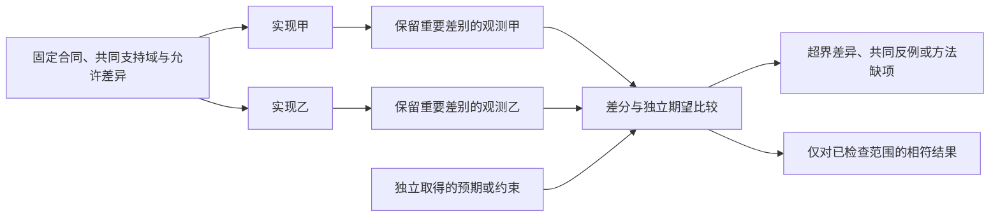

# 覆盖与收益判据

> **阅读范围**：验收设计；未作为产品测试运行 · [共同上下文](方法与独立证据.md)。

<details>
<summary>本页内容</summary>

- [覆盖张量、适用性与未知前沿](#覆盖张量适用性与未知前沿)
- [跨语言、跨后端与 Provider 符合性](#跨语言跨后端与-provider-符合性)
- [必要性实验与生成收益验收](#必要性实验与生成收益验收)
- [需求作者方式与完整交付的验收](#需求作者方式与完整交付的验收)
- [自适应探索与最终确认](#adaptive-confirmation)

</details>


## 覆盖张量、适用性与未知前沿

### 1. 覆盖不是一个百分比

覆盖需要同时回答主体、对象、生命周期、环境、故障、权限、资源、接口和 Claim。行覆盖率只是一种低层证据。

### 2. CoverageTensor

```text
CoverageTensor = applicable(
  ProductCapability
  × ActorAndStakeholder
  × SubjectDataState
  × OperationLifecycleEffect
  × AuthorityTrustBoundary
  × EnvironmentScaleTopology
  × FaultAndEvolutionState
  × InterfaceAndClaim
)
```

### 3. 坐标状态

```text
satisfied
not-applicable { proof }
required-unmaterialized
bounded-unknown
unsupported
violated
```

不要求暴力展开完整笛卡尔积。通过关系可达性、风险和 Claim 选择适用坐标。

### 4. Coverage Frontier

记录已覆盖机制、未覆盖机制、来源独立性、环境、负面证据、freshness、下一观察和 stop condition。禁止 `coverage=100%` 隐藏 unknown。

### 5. 空选择

任何 selector 返回零动作时，必须证明所有 required 坐标 not-applicable；否则 aggregate unknown/invalidated。

### 6. 演进

新环境、故障、用户、Provider 或事故只打开相关坐标和反向可达 Claims。核心模型若无法表达新坐标，进入 meta-model gap。

### 7. 验证

- Windows-only requirement 在 Linux；
- browser 不适用；
- 低流量环境不代表峰值；
- 少数用户群未覆盖；
- recovery 从未演练；
- negative evidence 缺失；
- 新 fault class 到来后旧 verdict 降级。


## 跨语言、跨后端与 Provider 符合性

### 1. 目的

通用工程编译器必须证明不同前端、后端和 Provider 对公共语义的实现一致，而不是只证明各自“能运行”。

### 2. 符合性对象

```text
ConformanceTarget = {
  contractRevision,
  subjectRevision,
  targetProfile,
  capabilityScope,
  environmentProfile
}
```

认证只在该范围内有效。

### 3. 前端符合性

前端测试：

- 语法和诊断；
- 名称绑定；
- 类型关系；
- 模块解析；
- 控制流和效果；
- 语言特有扩展；
- 不支持边界；
- 源码映射；
- 增量/干净等价。

权威编译器结果可作为观察，但仍需映射正确性。

### 4. 后端符合性

跨目标语言时，从同一已采纳公共行为/可移植语义分别降低到各自 `TargetProgramIR`；只有后端确实接受同一目标表示时才共用同一个 TargetProgramIR。输出源码不要求同形，但须在各自声明语义范围满足：

- 公共契约；
- 状态和错误；
- 数据序列化；
- 并发和取消；
- 效果与权限；
- 资源上限；
- 重新观测语义；
- 分发和运行目标。

### 5. Provider 符合性

Provider 套件检查：

- 能力声明；
- 输入输出 Schema；
- 错误映射；
- 幂等和读回；
- 取消；
- 配额和资源；
- 安全沙箱；
- 版本和漂移；
- 失败和恢复。

### 6. 黄金向量

黄金向量包含规范输入、期望结构、允许差异和声明。禁止仅保存某实现输出字节作为永恒 Oracle；向量需要来源和版本。

### 跨实现符合性



两个实现相同也可能共享错误。没有独立期望时只取得范围内的一致性观察；规范化不能删除本次需要检查的顺序、错误或作用，有限样本不证明全域等价。

### 7. 差分测试

```text
Frontend A vs Frontend B
Backend A vs Backend B
Provider vs Reference
Incremental vs Clean
Old Revision vs New Revision
```

差异先规范化，再按语义层分类：表示差异、合法实现自由度、行为差异、错误差异或未知。

### 8. 变形测试

典型关系：

- 重命名局部变量不改变语义；
- 非身份性的文件移动保持对象身份；实际路径消费者和来源映射按依赖更新，不预设行为不变；
- 等价表达产生等价 IR；
- 无关配置变化不改输出；
- 顺序无关集合打乱结果不变；
- 添加未使用候选不改变冻结绑定的重放；正在重新择优的解析以候选成员集为依赖，可能得到不同合法选择；
- 同一目标不同后端满足相同 Claim。

### 9. 认证等级

```text
SyntaxConformant
SemanticSubsetConformant
FullSemanticConformant
RoundTripConformant
FailureConformant
ProductionQualified
```

等级可组合但不自动上升。全语义不代表故障恢复已验证。

### 10. 版本升级

新语言、运行时或 Provider revision 重新跑受影响符合性；未变化能力和证据可按依赖复用。破坏差异产生有明确支持域的迁移、旧入口拒绝和必要保留计划。

### 11. 验收

- 认证范围精确；
- 差异有语义分类；
- 参考实现不成为唯一无审查真值；
- 公共语义及扩展协议已能表达的目标不修改核心；不能表达的新语义显式提案并迁移，不强行伪装符合；
- 不支持子集明确；
- 故障语义也验证；
- 增量和往返纳入；
- 认证可撤销；
- 真实项目影子验证。


## 必要性实验与生成收益验收

### 1. 必要性是条件判断，不是永久标签

一个设计若能被更简单的机制替代且不失去已接受行为、保证或生命周期收益，就不应仅因“世界级”而保留。每次新抽象须同时指明真实消费者、失败见证、现有方案为何不足、替代成本、验收和撤销条件。

所谓极尽设计，要求在当前证据下深入这些差异，并保留独立反例；不要求把全部可能出现的设施物化为当前系统。

### 2. AI 表达方式对照实验

比较四个入口：面向任务的结构化操作；候选文本 DSL；完整低层 IR；直接目标源码。任务同源、语义同难度、提供相同库/文档/工具预算；保持模型版本与采样配置可追踪。顺序随机化并使用未见任务，避免作者针对自己设计的入口优化。

采集真实成功/失败、错误类型、人工修正、语义漏项、重跑次数、上下文、工具调用和成本。没有执行就保持 not-run；少量样本只能支持其覆盖内的个案比较；样本分位数如需报告应给出 n 与算法，不能包装成可靠总体尾部分位或普适优劣。

若结构化 API 调用过碎，允许批量事务、领域宏操作和模型片段；若 DSL 更准确，保留它作为该任务的首选前端。不能把某个任务的偏好或局部实验结论扩大为所有任务的技术要求。

### 3. 生成收益实验

选定同一产品变更，在传统工具链、AI 直接写源码、SEC 三条路径中比较。保持用户结果、测试、运行环境与维护周期一致。至少观察首次实现和两次非平凡后续变更，才能发现生成器维护与迁移成本。

数据包括独立设计决定数、需要手工更新的事实位置、生成后手改、缺陷逃逸、验证成本、迁移风险、工具/人时和未解决需求。减少行数、增加行数、更多文档或更多门禁都不是单独成功证据。

### 4. 设计反证集

| 设计 | 最强反例 | 对应行动 |
| --- | --- | --- |
| 结构化模型为共同源 | 新算法表达比原生语言复杂且没有跨目标收益 | 保留原生区域或引入可选表达前端 |
| 高层领域规则 | 模板隐含事务或权限与实际不符 | 收窄适用合同或增加必要语义，不伪装通用 |
| AI 自动设计 | 模型一致通过检查却误解真实目标 | 对照用户验收、独立语料与来源，而非堆更多同源测试 |
| 统一生成 | 多 generator 竞争同文件或库版本 | 共同生成计划和冲突裁决，删除第二 writer |
| 增量复用 | 新负依赖改变输出但 cache key 未变 | 修复依赖观测，失效范围取可信保守闭包 |
| 分级治理 | 低风险投影偷偷进行高风险效果 | 物理能力隔离和准入，而非给 UI 加警告 |
| 模型无须 AI 重建 | 生成器仍联网补缺口 | 将补充阶段拆为候选采纳或显式运行依赖 |
| 表达载体可替换 | 换 JSON 字段顺序改变行为 | 区分无序对象与有序规则；修复规范编码 |
| 统一类型 | 无界整数成本不可接受 | 在目标画像中显式选择定宽及溢出语义，而非默认改变 |
| 来源保全 | 只有路径映射，正文未保存 | 保留独立机制、条件、反例和当前取舍；原始证据按实际义务另行留存 |

### 5. 保证等级和代价

解析通过证明形式可接受；模型校验证明所检查结构与合同满足；生成测试证明有限输入的输出；系统验收支持声明任务；生产监控支持实际运行范围。任何较低级别都不能因“测试很多”升级。

治理开销同样测量：一次语义编辑需要读取多少内容、多少批准、多少无关重编译、多少重复验证、多少恢复状态。发现没有实际消费者的对象，应删除生成/执行路径，必要的历史解释仍保留。

### 6. 现有证据怎样使用

有限函数与结构化决策表说明表达前端和生成后端可以分离；有限状态聚合说明部分事务规则可以复用。R2中的手工模型不是AI设计结果，生成目标代码也不是全工程综合完成。

[来源及适用限制](../../依据/来源/设计依据与资料边界.md)说明外部方法可以支撑的命题。采用实验结果时另绑定实际输入、程序、环境和记录；有限原型不能代替真实AI对照与生产成本测量。定义实验不构成执行授权。

### 7. 可直接实施的收益比较协议

实验单位是“一个工程任务及其后续变更轨迹”，不是一次成功生成、一个token或一个测试。任务包冻结需求、既有工程字节、业务验收、允许外部资料、隐私/权限边界、时间和金钱预算；任务作者保存独立预期，执行者不能修改验收。分层包含新工程、存量修复、接口/模式迁移、性能约束、故障恢复和无法完整形式化的人类判定。实际采用的直接原生、意图复用和需要新供给的路径分别对同一分层比较，不能只挑最适合生成的任务后声称普适收益。

任务执行顺序随机化；重复试验固定或记录模型版本、采样、工具版本与运行预算。模型更新视为新批次；已有经验引起的顺序效应记录为混杂。无法共享秘密工程时，在相同评价合同下就地执行，返回可公开的摘要与失败分类，不能据脱敏摘要宣称原工程全部正确。

每次记录：初始建模、人类澄清、规则扩展、生成、工具执行、等待、独立验证、返工、维护、迁移、故障恢复，以及停止时仍不满足的需求。人时以分钟、费用以实际币种、延迟以声明时钟范围分别统计；只有明确汇率和人时估价时才能合成同单位总成本，不能把毫秒、token和安全风险直接相加。安全/合法性硬要求是准入约束，不用成本权重抵消。

任务失败、超时、拒绝和环境不可用保留在分母内；环境不可用另列原因。对照的是配对任务差异及其分布，不先删失败再平均。预先固定样本量/预算或有明确控制规则的顺序停止；小样本报告逐任务值，不造稳定总体P99和精确胜率。人工判定记录盲化程度、分歧和裁决来源，不把一个作者的偏好变成客观Oracle。

输出 `study-manifest`、逐任务运行记录、制品及环境摘要、独立Oracle结果、返工轨迹、成本明细和差异报告。证据不足以选全局赢家时按任务画像采纳：结构化意图仍为当前新产品作者的采用路线，但不因这是现行选择就预先判它胜出；批量变化是操作机制，直接原生源码是正常对照与适用路线。公平比较不混淆传输格式与语义能力；若同要求、同供给和连续维护下持续没有净收益，修改相交抽象/适配，或在该任务直接使用原生实现与工具，不以沉没设计成本强制采用。该协议是待执行的验收设计，不是收益实证。

### 8. 架构开销和语言热点的比较协议

同一精确输入同时跑纯调用、本地协调和所需团队路径，冷启动、热缓存、失效重编、并发竞争和故障恢复分别计时。测CPU、峰值内存、磁盘/网络字节、序列化、队列等待及端到端响应，不能只比较核心循环。候选Go/Rust/WASM需包含跨边界复制、批量化、失败恢复和工具链维护成本。

验收阈值来自目标工程的延迟/吞吐/资源预算和成本容忍，不由文档任意设百分比。没有真实负载时用声明的合成分布检验伸缩趋势与最坏输入，明确其与生产的差异。候选不达标时可切换批量、索引、数据布局、Worker或语言实现；先定位控制总耗时的瓶颈，禁止把任何慢项都改成微服务。


## 需求作者方式与完整交付的验收

本范围检查[操作选择](../../开发/用途与任务范围.md#authoring-route)与[完整区间工具](../../../examples/实现校准/成熟供给与计算工具.md#interval-product-example)，不要求每个任务同时运行全部方法。案例期望来自接受合同和独立推导，不从当前生成器拷贝唯一答案。

| 攻击输入或顺序 | 合格观察 | 错误实现会怎样暴露 |
|---|---|---|
| 已知源只改false→true | 不要求先创建block或查全目录；形成准确新候选 | 多余主面步骤造成额外往返 |
| 没有现成区间函数 | 普通主体仍能创作和编译，不新增全局kind | 用模板未覆盖冒称语言不能表达 |
| 非法区间在原输入第二项 | Reversed(1)，不发布前缀成功 | 排序后验证或悄悄修复端点 |
| 默认和要求不同 | 显示行为差异，不将默认提升为授权 | 代码自洽但违反任务 |
| 后端用有损数字代替Int | 明确不满足或采用精确实现 | 小样例正确掩盖域外截断 |
| C2失败，C1通过 | C1保持原身份，C2报告真实错误 | 旧绿色贴新候选 |
| 只请求预览 | 返回所选根，不运行和写入 | 编译链顺手部署 |
| 新运行先结束、旧运行迟到 | 根据准确候选与输入发布，旧结果只结算原责任 | 函数名相同就覆盖当前结果 |
| 共享库内容改变但接口相同 | 调用方源可保持，实际内联产物重新检查 | 仅看签名漏掉实现依赖 |
| 源／控制／资产并发变化 | 整批候选及真实前像逐域处理 | 不同文件就误称独立原子 |
| 简短任务视图未显示一份资产 | 未改资产保全，不默认删除 | 将投影当完整作者模型 |
| 新技术只作为问题提出 | 记录比较，采用理由由设计者负责 | 提示中的名词直接进入REQ与主路线 |

预期结果、属性关系与代价分别核对。区间输出幂等、有序和两两分离尚不足以证明正确：还要检查输入集合的并和所选分组边界。语言类型通过不证明它满足这个业务条件；多个目标相同也可能共享同一错误。

成熟排序和数值工具可按真实前提复用上游保证，新增解析、表示、顺序、控制和产物接合承担残余验证。文档中逐条走查可完成设计判断，不冒充已运行上述场景；真实可用性与成本需实际客户端、后端及工作量证据。


<a id="adaptive-confirmation"></a>
## 自适应探索与最终确认

原比较协议已有随机顺序、固定样本量或受控停止、失败分母和共同原因。它们继续有效；还必须把**被反馈用于选择的证据**与**最后确认该选择的证据**分开。一份留出集反复向实现作者或优化器返回结果，会参与候选形成；不因文件仍叫holdout就继续视为未暴露。

### 一次错误率不代表整个搜索的错误率

作为独立计算例，假设100个候选实际上均无优势，每次独立检验仍有0.05概率误报，则至少一次误报的概率为`1−(1−0.05)^100≈0.994079`。这不是实际SEC误报率；现实候选常相关，不能把公式当普遍频率。它说明一次检验阈值不能不加条件地复用于“反复搜索直到出现更快结果”。候选内已固定样本数，也不控制跨候选的择优偏差。

### S0—S6：使用已有study与CheckRecord完成接合

**S0确定所求结论。** 区分当前观测最好、特定负载可用、总体优于基线、估计某分位数、符合硬期限或证明全局最优；分别使用实际合格方法，不从有限样本跨级。

**S1划分探索与确认。** 按任务/数据相关的独立单位固定对照、来源、环境、预算及候选选择规则。先允许探索数据广泛用于生成、调参和诊断；需要确认的材料由实际权限与工作分工避免被该轮适配消费。不是每个确定性回归测试都要建立统计留出。

**S2记录真实反馈。** 以原证据引用关联候选、被看过的数据/摘要/错误、模型或规则变化、选择次数及暂停/终止规则。缓存同一报告没有增加样本；复跑有相关性就保留其相关来源。没有必要持久保存每个无关token，但不能丢掉改变统计解释的反馈。

**S3冻结候选后确认。** 默认采用一个已固定候选在新确认数据/运行块上的预定比较；若要重复选择或边看边停，采用有适用依据的多重比较、顺序推断或可复用留出方法。没有这些能力就按准确的探索结果报告，不伪造校正后的置信度。

**S4处理确认失败。** 可以回到探索改进，但再次使用已看过的确认结果就改变其独立性。用新的独立确认范围或原预定的合法方案，不在同一集上反复修到绿。没有新增预算时可以保留合格基线或按委派选可行者，不虚报收益。

**S5评价完整成本。** 冷启动、热身、调度、缓存、编码、内核、正确性/安全检查和失败收尾都属于真实端到端比较。速度提升以降级输入、泄露秘密或隐去失败取得时不合格；分布漂移、机器降频、共同资源污染需要重新解释批次。

**S6采用与失效。** 原Assurance评价支持的具体范围，原比较算法才消费对应CostEvidence；确认范围、统计方法、原理、候选或数据暴露变化按读集重核。保留可行性与排序不足的区别，不强迫等待未来统计证据才交付普通合格实现。

### 净收益比较不能把建库和规则创作藏到另一边

任务仍以原“首次交付＋后续变更轨迹”为单位，但明确分层：已有定义内参数变化；已有定义的未见组合；需要新需求关系；有准确关系但缺实现供给；真实宿主接合。每组使用同等可用库、资料、授权和正确性要求，记录规则/字段合同、适配器、检查器、确认、回源、迁出和维护成本。当前范本不断被作者看过，不足以成为未见任务泛化的证据。

批次中一次供给成本与后续复用次数分别报告；只在实际复用发生或显式假设场景中摊销，不能用无限未来用户替今天的失败买单。若某类任务长期只有更多中间对象且无实际收益，优先取消该处机械镜像或非必要中间层，保留意图接受与直接原生通路。改变产品作者主面属于明确设计决定，不能依据一个慢任务或一份新批评静默重写全局路线。

已有可判定逻辑的完整枚举或确定性单例验证，不受上述随机显著性公式约束；精确证明也仍需自己的编码与信任条件。自适应数据分析的一手依据见[材料](../../依据/来源/语言编译与目标工具.md#adaptive-evidence-sources)，没有把相关工具作为所有项目的前置。
