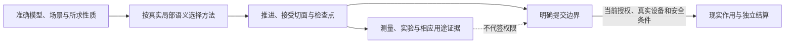

# 仿真与科学工程

模型、场景、推进方法、时间、资源、观察、实验及现实接口分别承担自己的责任。统一的是准确输入、绑定、接合、输出与证据，不是一套固定行业Simulator。以下为设计规范；实际实现和支持资格另按原保证记录取得。

| 规范 | 责任 |
|---|---|
| [时间推进与状态恢复](时间推进与状态恢复.md) | 接受/拒绝步、同刻事件、并行前沿及完整检查点 |
| [历史、接触与拓扑](历史接触与拓扑演进.md) | 延迟、记忆、不光滑、重网格与材料历史 |
| [联合仿真与现实控制](联合仿真与现实控制.md) | 耦合、守恒、通信误差、真实期限与授权 |
| [测量、校准与实验](测量校准与实验.md) | 测量对象、相关误差、可识别性、用途与累计作用 |
| [模型族的适用性](模型族与适用边界.md) | 不同模型的实际合同、方法候选、失败和验证 |

[定量合成](../计算基础/定量合同与误差传播.md)拥有跨模型误差与资源计量；[物理对象与制造](../物理对象制造与寿命.md)拥有现实物料和寿命。数值工具仅是实际方法供给，领域模型、校准与用途不能由库名代替。

图中的模型回退不逆转现实作用。无真实作用的离线计算可以在模型结果或源码生成结束；缺某个设备只阻断依赖该设备的动作/保证。
