# 仿真模型族与适用边界

不同模型族可以共享时间、输入、资源和观察接口，不因此共享全部推进、状态或验证语义。[仿真规范入口](README.md)区分正式机制与下列适用性目录。方法名仅指候选路线，不证明已经接入或验证。

以下逐族图展开本篇已列对象、方法选择、失败与验证边界，不为这些候选方法补造已发布算法或已取得保证。运行统一消费[接受步、检查点与退出责任](时间推进与状态恢复.md#simulation-progress-and-checkpoints)；实际设备作用另走[现实控制入口](联合仿真与现实控制.md#real-control-response-boundary)。各族的模型检查通过、数值／统计结果、实际设备符合与任务用途资格分别判断。

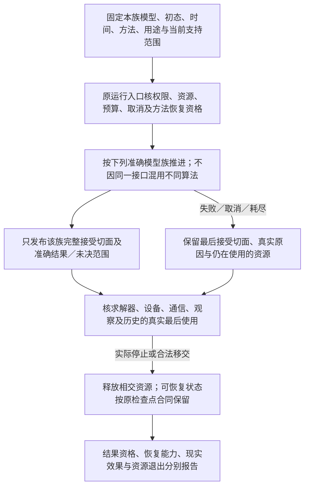
```mermaid
flowchart TB
  model["固定本族模型、初态、时间、方法、用途与当前支持范围"] --> admit["原运行入口核权限、资源、预算、取消及方法恢复资格"]
  admit --> attempt["按下列准确模型族推进；不因同一接口混用不同算法"]
  attempt --> accepted["只发布该族完整接受切面及准确结果／未决范围"]
  attempt -->|失败／取消／耗尽| retained["保留最后接受切面、真实原因与仍在使用的资源"]
  accepted --> last["核求解器、设备、通信、观察及历史的真实最后使用"]
  retained --> last
  last -->|实际停止或合法移交| release["释放相交资源；可恢复状态按原检查点合同保留"]
  release --> report["结果资格、恢复能力、现实效果与资源退出分别报告"]
```

## 连续时间ODE

```mermaid
flowchart LR
  state["连续状态、导数、初值、输入与事件"] --> method["按刚性及误差／停止要求选择显式、隐式或多速率积分"]
  method --> step["在原时间域按接受／拒绝步及事件定位推进"]
  step -->|发散／步长过小／非法初值| fail["分别报告；不把未到终点当完整轨迹"]
  step --> verify["解析解、步长收敛、守恒及独立实现核对"]
  verify --> qualification["只对所用模型、步长策略及输入域说明资格"]
```

**模型与时间：**连续状态、导数、初值、输入和事件

**必要合同：**积分步长、刚性、误差与停止条件

**方法候选：**选定显式/隐式或多速率积分器

**失败边界：**发散、步长过小、非法初值分别报告

**验证：**解析解、步长收敛、守恒与独立实现

## 微分代数DAE

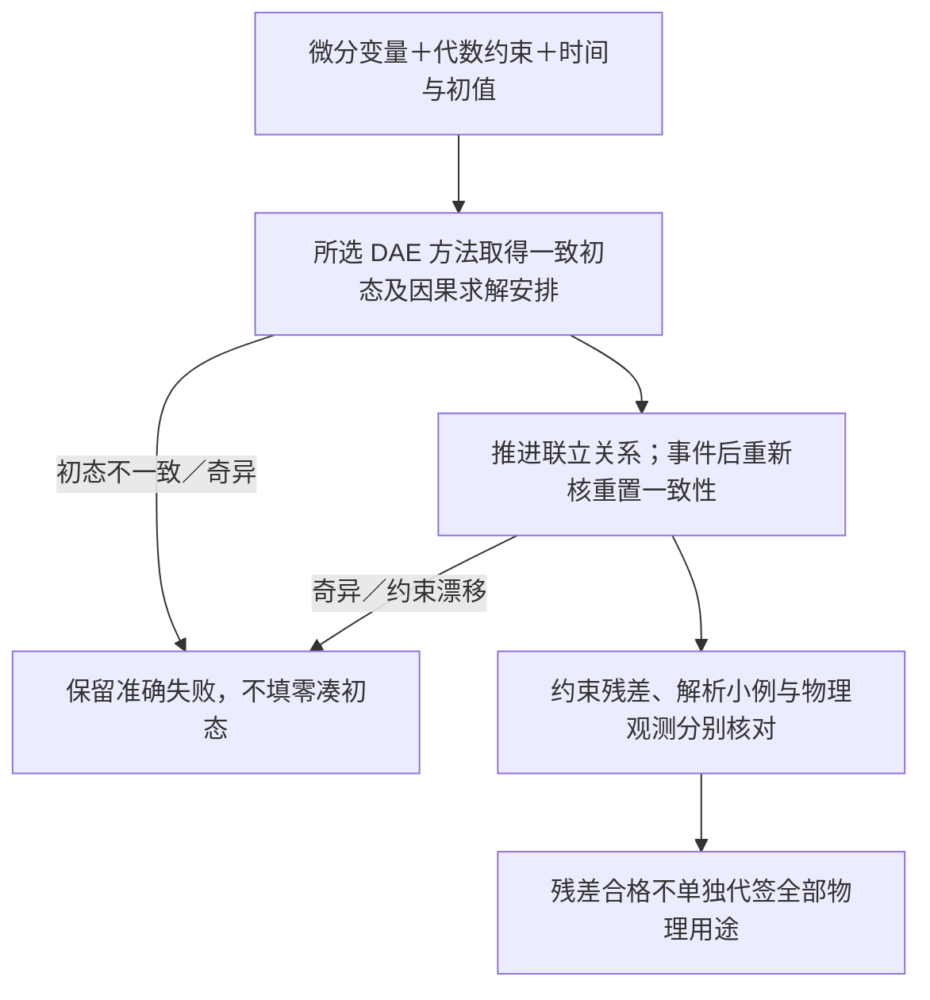
```mermaid
flowchart TB
  equations["微分变量＋代数约束＋时间与初值"] --> initial["所选 DAE 方法取得一致初态及因果求解安排"]
  initial --> solve["推进联立关系；事件后重新核重置一致性"]
  initial -->|初态不一致／奇异| fail["保留准确失败，不填零凑初态"]
  solve -->|奇异／约束漂移| fail
  solve --> verify["约束残差、解析小例与物理观测分别核对"]
  verify --> accepted["残差合格不单独代签全部物理用途"]
```

**模型与时间：**微分变量、代数约束和一致初值

**必要合同：**方程结构、约束、初始化与事件后重置

**方法候选：**适合该结构的DAE求解与一致性处理

**失败边界：**奇异、初态不一致和约束漂移不当成功

**验证：**约束残差、解析小例及物理观测

## PDE与场仿真

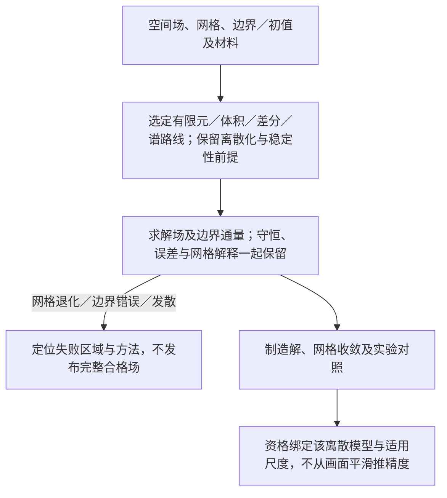
```mermaid
flowchart TB
  field["空间场、网格、边界／初值及材料"] --> discretize["选定有限元／体积／差分／谱路线；保留离散化与稳定性前提"]
  discretize --> solve["求解场及边界通量；守恒、误差与网格解释一起保留"]
  solve -->|网格退化／边界错误／发散| fail["定位失败区域与方法，不发布完整合格场"]
  solve --> verify["制造解、网格收敛及实验对照"]
  verify --> scope["资格绑定该离散模型与适用尺度，不从画面平滑推精度"]
```

**模型与时间：**空间场、网格、边界、初值和材料

**必要合同：**离散化、稳定性、边界、守恒与误差

**方法候选：**有限元/体积/差分/谱等为明确候选

**失败边界：**网格退化、边界错误与发散有准确诊断

**验证：**制造解、网格收敛与实验对照

## 刚体与多体动力学

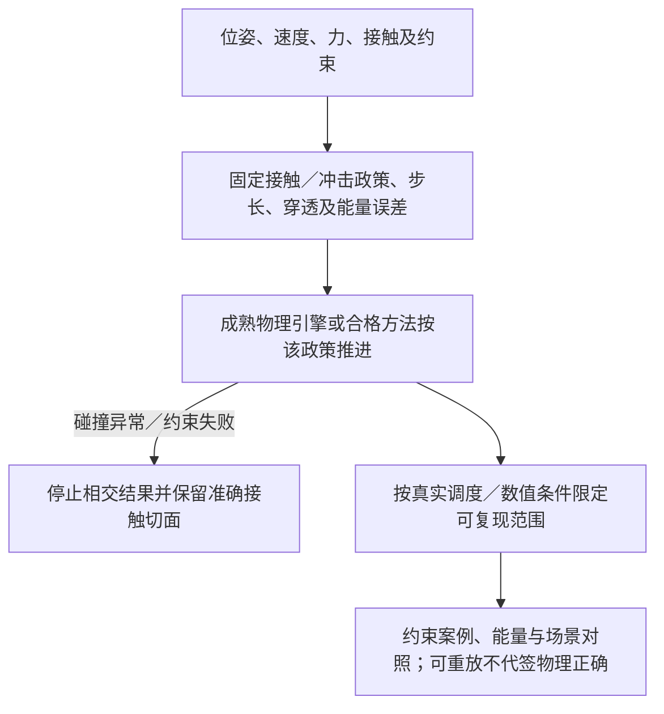
```mermaid
flowchart TB
  bodies["位姿、速度、力、接触及约束"] --> law["固定接触／冲击政策、步长、穿透及能量误差"]
  law --> engine["成熟物理引擎或合格方法按该政策推进"]
  engine -->|碰撞异常／约束失败| fail["停止相交结果并保留准确接触切面"]
  engine --> replay["按真实调度／数值条件限定可复现范围"]
  replay --> verify["约束案例、能量与场景对照；可重放不代签物理正确"]
```

**模型与时间：**位姿、速度、接触、约束和力

**必要合同：**接触处理、步长、穿透与能量误差

**方法候选：**成熟物理引擎或合格领域算法

**失败边界：**碰撞异常、约束失败与非确定性可复现范围明确

**验证：**约束案例、能量检查和场景对照

## 固体、软体与材料

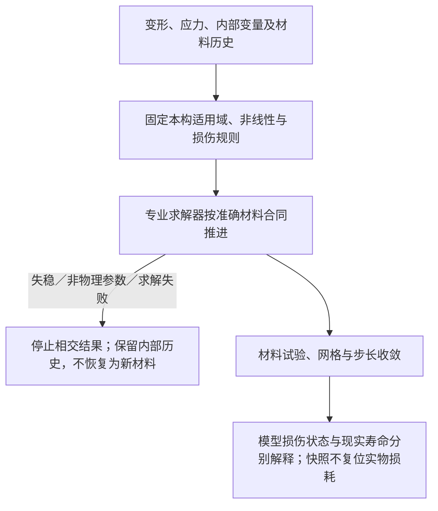
```mermaid
flowchart TB
  material["变形、应力、内部变量及材料历史"] --> law["固定本构适用域、非线性与损伤规则"]
  law --> solver["专业求解器按准确材料合同推进"]
  solver -->|失稳／非物理参数／求解失败| fail["停止相交结果；保留内部历史，不恢复为新材料"]
  solver --> verify["材料试验、网格与步长收敛"]
  verify --> qualification["模型损伤状态与现实寿命分别解释；快照不复位实物损耗"]
```

**模型与时间：**变形、应力、内部变量与材料模型

**必要合同：**本构适用范围、非线性与损伤规则

**方法候选：**专业求解器按模型合同适配

**失败边界：**失稳、非物理材料参数或求解失败停止相交结果

**验证：**材料试验、网格与步长收敛

## 流体、热与输运

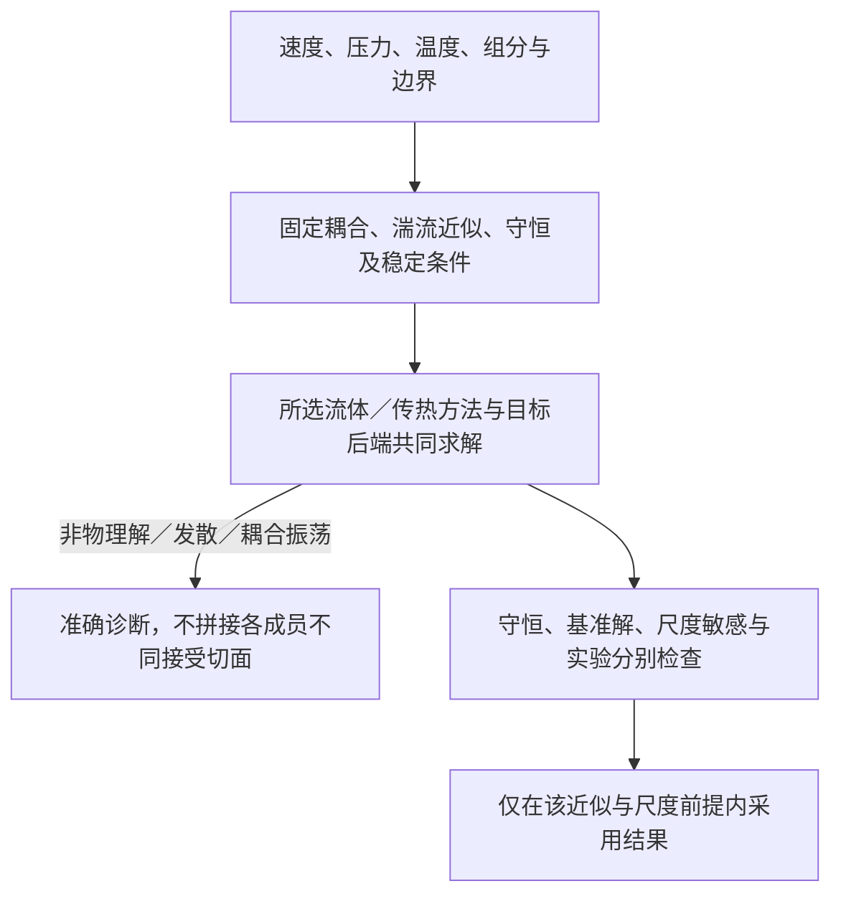
```mermaid
flowchart TB
  fields["速度、压力、温度、组分与边界"] --> coupling["固定耦合、湍流近似、守恒及稳定条件"]
  coupling --> solve["所选流体／传热方法与目标后端共同求解"]
  solve -->|非物理解／发散／耦合振荡| fail["准确诊断，不拼接各成员不同接受切面"]
  solve --> verify["守恒、基准解、尺度敏感与实验分别检查"]
  verify --> domain["仅在该近似与尺度前提内采用结果"]
```

**模型与时间：**速度、压力、温度、组分及边界

**必要合同：**耦合、湍流近似、守恒和稳定约束

**方法候选：**选定流体/传热方法及目标计算后端

**失败边界：**非物理解、发散和耦合振荡显式

**验证：**守恒、基准解、尺度敏感与实验

## 电磁、电路、声学与波

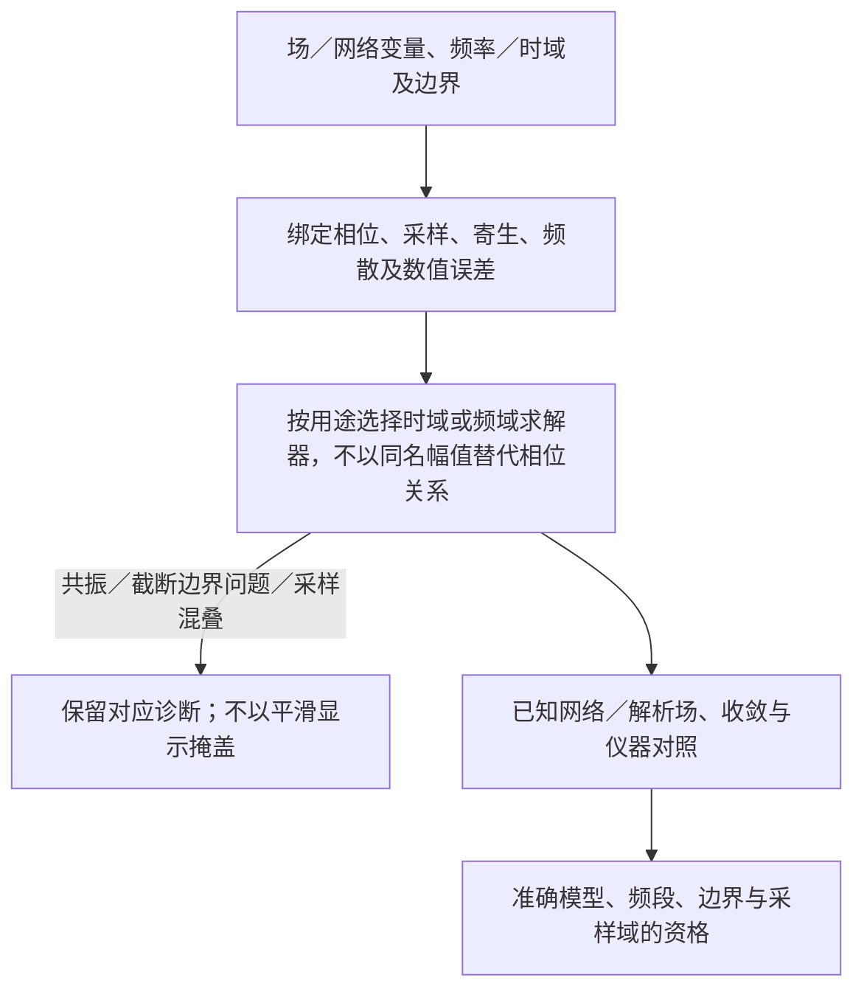
```mermaid
flowchart TB
  wave["场／网络变量、频率／时域及边界"] --> contract["绑定相位、采样、寄生、频散及数值误差"]
  contract --> method["按用途选择时域或频域求解器，不以同名幅值替代相位关系"]
  method -->|共振／截断边界问题／采样混叠| fail["保留对应诊断；不以平滑显示掩盖"]
  method --> verify["已知网络／解析场、收敛与仪器对照"]
  verify --> scope["准确模型、频段、边界与采样域的资格"]
```

**模型与时间：**场、网络变量、频率、时域和边界

**必要合同：**相位、采样、寄生、频散和数值误差

**方法候选：**时域或频域领域求解器

**失败边界：**共振、截断边界或采样混叠不能静默掩盖

**验证：**已知网络/解析场、收敛与仪器对照

## 粒子、N体与分子系统

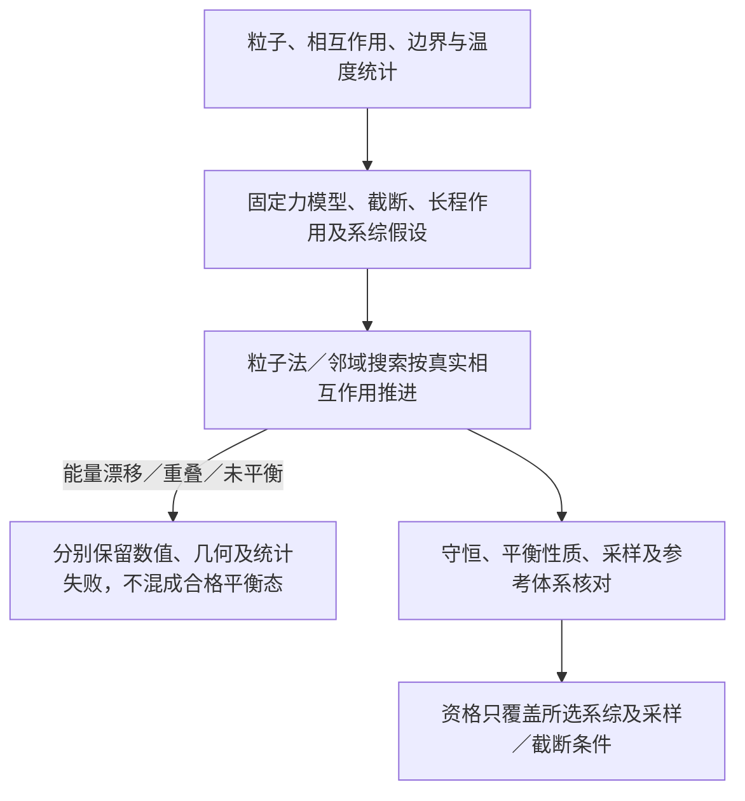
```mermaid
flowchart TB
  particles["粒子、相互作用、边界与温度统计"] --> policy["固定力模型、截断、长程作用及系综假设"]
  policy --> advance["粒子法／邻域搜索按真实相互作用推进"]
  advance -->|能量漂移／重叠／未平衡| fail["分别保留数值、几何及统计失败，不混成合格平衡态"]
  advance --> verify["守恒、平衡性质、采样及参考体系核对"]
  verify --> qualification["资格只覆盖所选系综及采样／截断条件"]
```

**模型与时间：**粒子、相互作用、边界与温度统计

**必要合同：**力模型、截断、长程作用和系综假设

**方法候选：**粒子法、邻域搜索及专业物理方法

**失败边界：**能量漂移、重叠、统计未平衡有诊断

**验证：**守恒、平衡性质、采样与参考体系

## 随机微分与随机过程

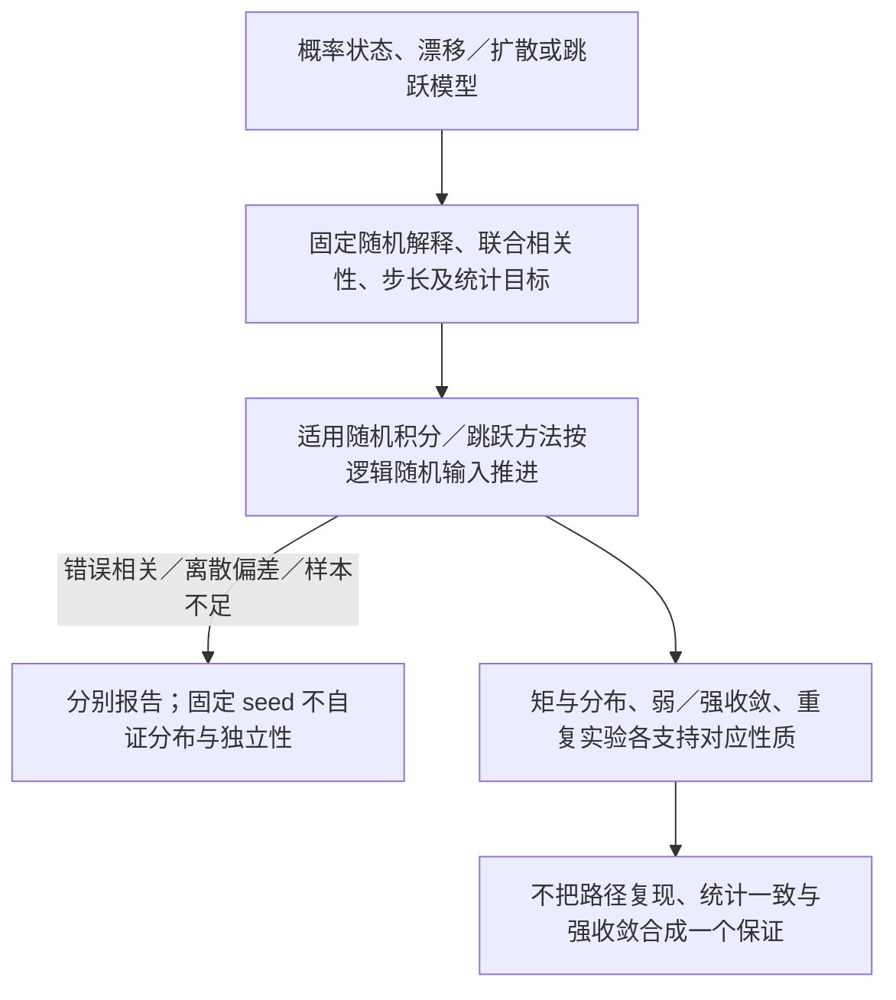
```mermaid
flowchart TB
  process["概率状态、漂移／扩散或跳跃模型"] --> interpretation["固定随机解释、联合相关性、步长及统计目标"]
  interpretation --> sample["适用随机积分／跳跃方法按逻辑随机输入推进"]
  sample -->|错误相关／离散偏差／样本不足| fail["分别报告；固定 seed 不自证分布与独立性"]
  sample --> verify["矩与分布、弱／强收敛、重复实验各支持对应性质"]
  verify --> scope["不把路径复现、统计一致与强收敛合成一个保证"]
```

**模型与时间：**概率状态、漂移扩散或跳跃过程

**必要合同：**随机解释、相关性、步长与统计目标

**方法候选：**适用随机积分和跳跃过程算法

**失败边界：**错误相关、离散偏差或样本不足显式

**验证：**矩与分布、弱/强收敛及重复实验

## 离散时间与同步系统

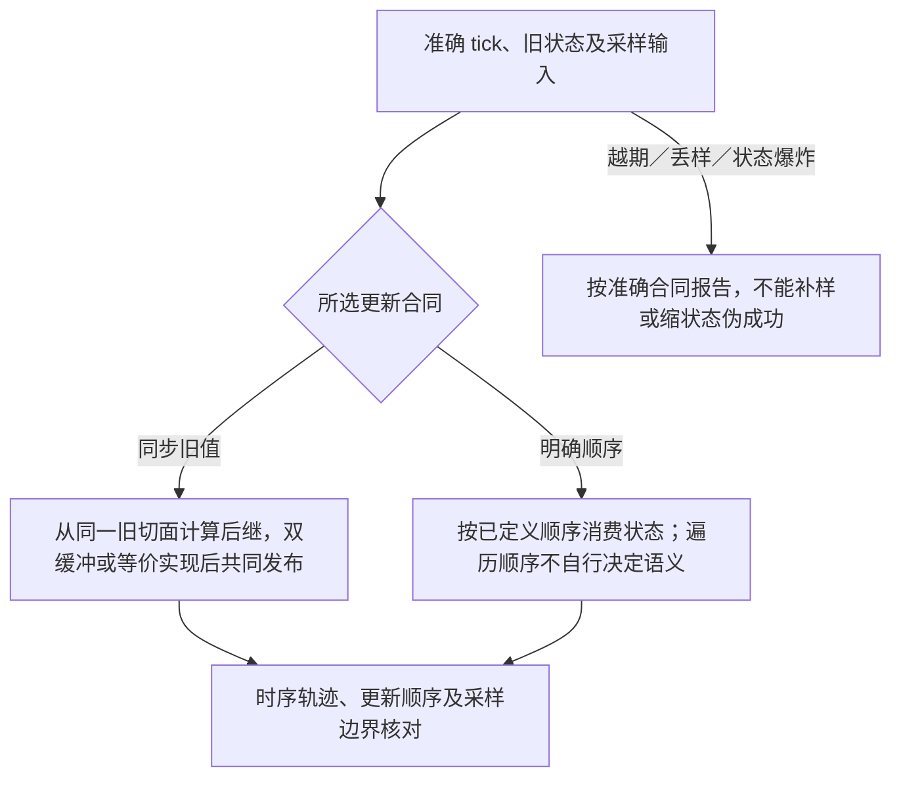
```mermaid
flowchart TB
  tick["准确 tick、旧状态及采样输入"] --> mode{"所选更新合同"}
  mode -->|同步旧值| next["从同一旧切面计算后继，双缓冲或等价实现后共同发布"]
  mode -->|明确顺序| ordered["按已定义顺序消费状态；遍历顺序不自行决定语义"]
  next --> verify["时序轨迹、更新顺序及采样边界核对"]
  ordered --> verify
  tick -->|越期／丢样／状态爆炸| fail["按准确合同报告，不能补样或缩状态伪成功"]
```

**模型与时间：**tick、旧状态、新状态与采样输入

**必要合同：**同步旧值或明确顺序更新，不能由遍历顺序决定

**方法候选：**定步更新、双缓冲或同步数据流

**失败边界：**越期、丢样和状态爆炸按合同处理

**验证：**时序轨迹、更新顺序与采样边界

## 离散事件与排队

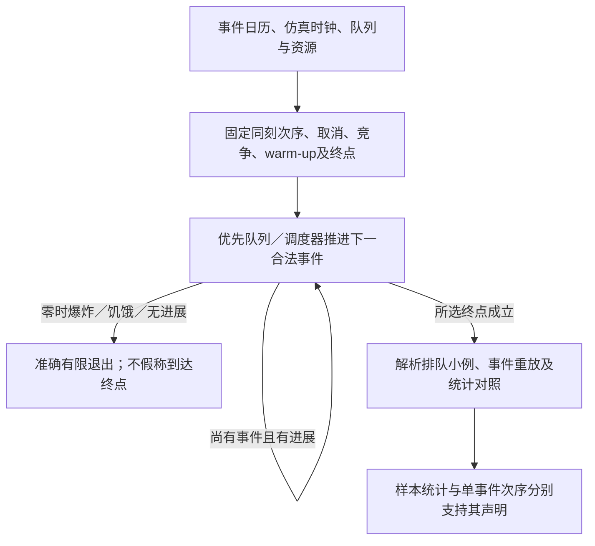
```mermaid
flowchart TB
  calendar["事件日历、仿真时钟、队列与资源"] --> order["固定同刻次序、取消、竞争、warm-up及终点"]
  order --> event["优先队列／调度器推进下一合法事件"]
  event -->|尚有事件且有进展| event
  event -->|零时爆炸／饥饿／无进展| fail["准确有限退出；不假称到达终点"]
  event -->|所选终点成立| verify["解析排队小例、事件重放及统计对照"]
  verify --> scope["样本统计与单事件次序分别支持其声明"]
```

**模型与时间：**事件日历、仿真时钟、队列和资源

**必要合同：**同时间次序、取消、资源竞争、warm-up和终点

**方法候选：**优先队列、调度器与随机到达/服务模型

**失败边界：**零时事件爆炸、饥饿或无进展报告

**验证：**解析排队小例、事件重放和统计对照

## 混合系统

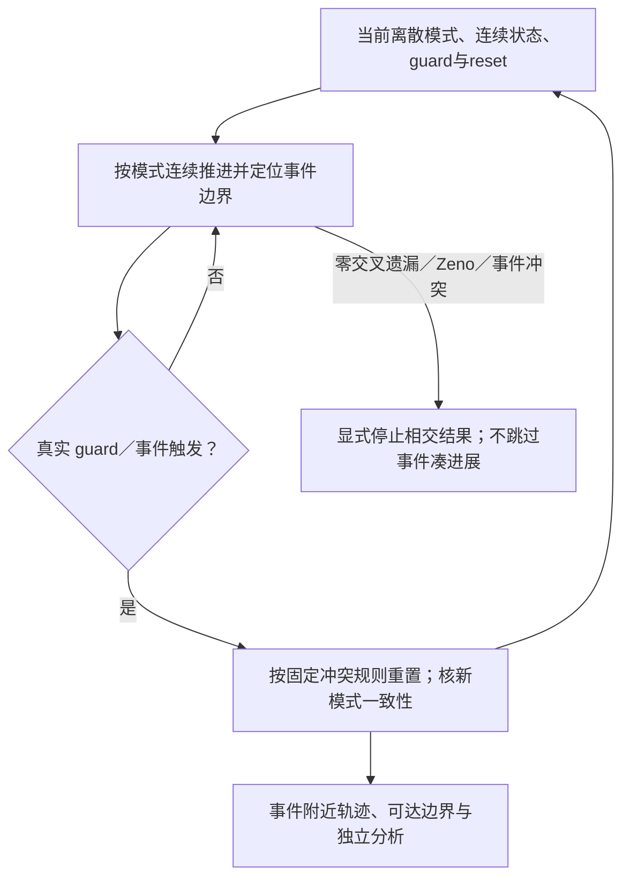
```mermaid
flowchart TB
  mode["当前离散模式、连续状态、guard与reset"] --> continuous["按模式连续推进并定位事件边界"]
  continuous --> guard{"真实 guard／事件触发？"}
  guard -->|是| reset["按固定冲突规则重置；核新模式一致性"]
  reset --> mode
  guard -->|否| continuous
  continuous -->|零交叉遗漏／Zeno／事件冲突| fail["显式停止相交结果；不跳过事件凑进展"]
  reset --> verify["事件附近轨迹、可达边界与独立分析"]
```

**模型与时间：**连续演化、离散模式、guard与reset

**必要合同：**事件定位、重置一致性和模式切换

**方法候选：**连续求解器与事件/模式管理组合

**失败边界：**零交叉遗漏、Zeno行为和冲突事件显式停止

**验证：**事件附近轨迹、可达边界与独立分析

## 系统动力学

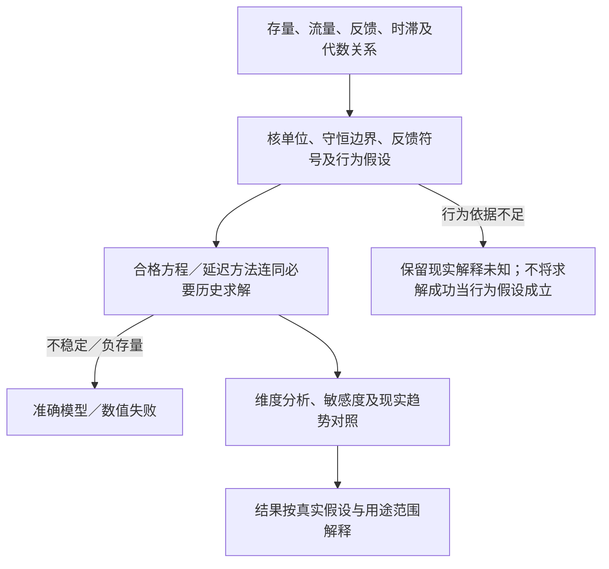
```mermaid
flowchart TB
  stocks["存量、流量、反馈、时滞及代数关系"] --> dimensions["核单位、守恒边界、反馈符号及行为假设"]
  dimensions --> solve["合格方程／延迟方法连同必要历史求解"]
  solve -->|不稳定／负存量| numeric["准确模型／数值失败"]
  dimensions -->|行为依据不足| unknown["保留现实解释未知；不将求解成功当行为假设成立"]
  solve --> verify["维度分析、敏感度及现实趋势对照"]
  verify --> scope["结果按真实假设与用途范围解释"]
```

**模型与时间：**存量、流量、反馈、时滞与代数关系

**必要合同：**单位、守恒、反馈符号和行为假设

**方法候选：**方程及延迟模型由合格方法求解

**失败边界：**不稳定、负存量或行为假设无证据需区分

**验证：**维度分析、敏感度和现实趋势对照

## 基于个体与群体

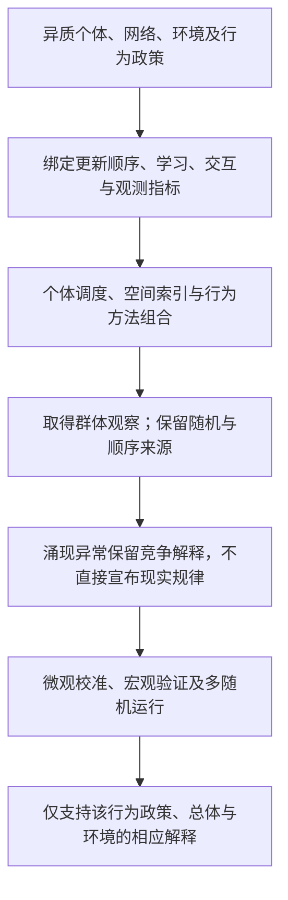
```mermaid
flowchart TB
  agents["异质个体、网络、环境及行为政策"] --> rules["绑定更新顺序、学习、交互与观测指标"]
  rules --> scheduler["个体调度、空间索引与行为方法组合"]
  scheduler --> emergence["取得群体观察；保留随机与顺序来源"]
  emergence --> alternatives["涌现异常保留竞争解释，不直接宣布现实规律"]
  alternatives --> verify["微观校准、宏观验证及多随机运行"]
  verify --> qualification["仅支持该行为政策、总体与环境的相应解释"]
```

**模型与时间：**异质个体、网络、环境与行为政策

**必要合同：**更新次序、学习规则、交互和观测指标

**方法候选：**个体调度、空间索引和行为模型组合

**失败边界：**涌现异常不直接当现实规律，保留竞争解释

**验证：**微观校准、宏观验证、随机多运行

## 元胞自动机与格点

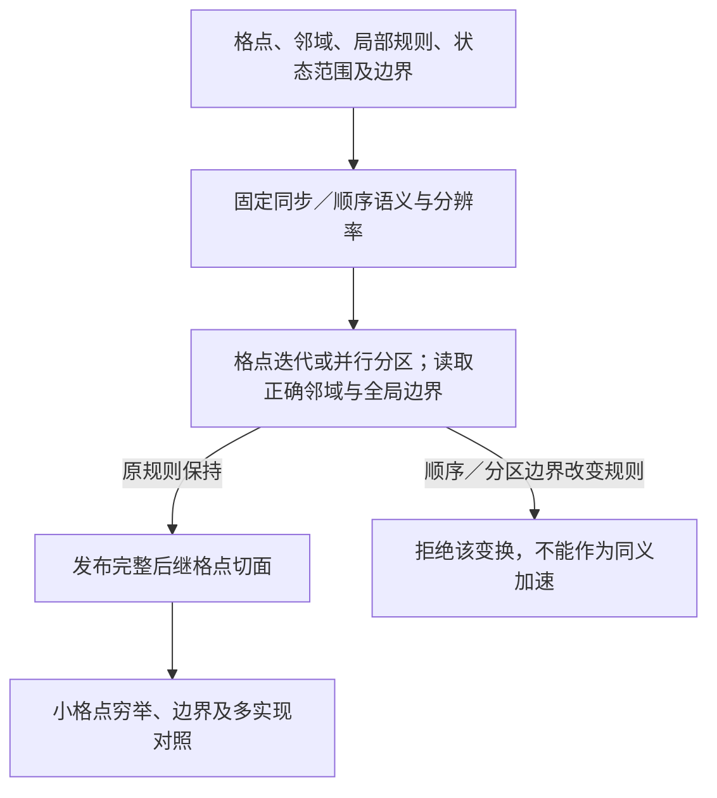
```mermaid
flowchart TB
  lattice["格点、邻域、局部规则、状态范围及边界"] --> update["固定同步／顺序语义与分辨率"]
  update --> partition["格点迭代或并行分区；读取正确邻域与全局边界"]
  partition -->|原规则保持| next["发布完整后继格点切面"]
  partition -->|顺序／分区边界改变规则| reject["拒绝该变换，不能作为同义加速"]
  next --> verify["小格点穷举、边界及多实现对照"]
```

**模型与时间：**离散格点、邻域、局部规则与边界

**必要合同：**同步规则、边界、分辨率和状态范围

**方法候选：**格点迭代或合格并行实现

**失败边界：**更新顺序或分区边界不可改变原规则

**验证：**小格点穷举、边界测试和多实现对照

## Monte Carlo与参数扫描

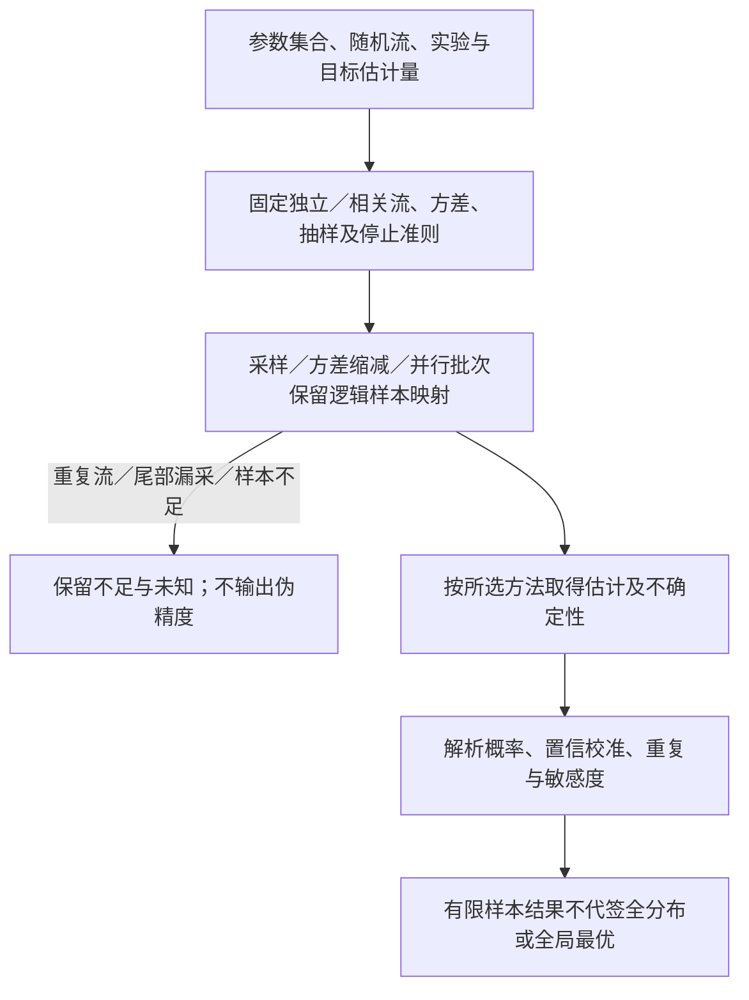
```mermaid
flowchart TB
  experiment["参数集合、随机流、实验与目标估计量"] --> design["固定独立／相关流、方差、抽样及停止准则"]
  design --> batches["采样／方差缩减／并行批次保留逻辑样本映射"]
  batches -->|重复流／尾部漏采／样本不足| insufficient["保留不足与未知；不输出伪精度"]
  batches --> estimate["按所选方法取得估计及不确定性"]
  estimate --> verify["解析概率、置信校准、重复与敏感度"]
  verify --> scope["有限样本结果不代签全分布或全局最优"]
```

**模型与时间：**随机流、参数集合、实验和估计量

**必要合同：**独立/相关流、方差、抽样与停止准则

**方法候选：**采样、方差缩减、批次与并行实验方法

**失败边界：**重复流、尾部漏采、样本不足不输出伪精度

**验证：**解析概率、置信校准、重复与敏感度

## 网络与分布式故障

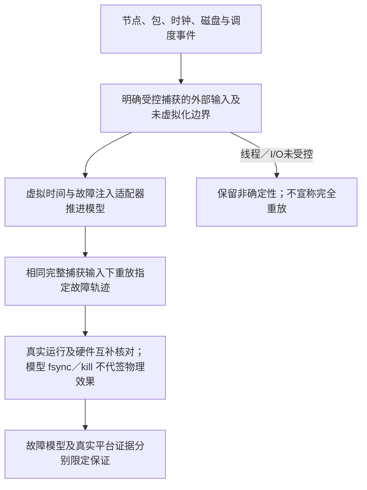
```mermaid
flowchart TB
  system["节点、包、时钟、磁盘与调度事件"] --> capture["明确受控捕获的外部输入及未虚拟化边界"]
  capture --> simulate["虚拟时间与故障注入适配器推进模型"]
  simulate --> replay["相同完整捕获输入下重放指定故障轨迹"]
  capture -->|线程／I/O未受控| unknown["保留非确定性；不宣称完全重放"]
  replay --> compare["真实运行及硬件互补核对；模型 fsync／kill 不代签物理效果"]
  compare --> scope["故障模型及真实平台证据分别限定保证"]
```

**模型与时间：**节点、包、时钟、磁盘和调度事件

**必要合同：**所有声称确定的外部输入应受控捕获

**方法候选：**虚拟时间和故障注入适配器

**失败边界：**未虚拟化线程/I/O保留非确定性，不能假称完全重放

**验证：**重放故障、真实运行和硬件互补测试

## 处理器、协议与设备仿真

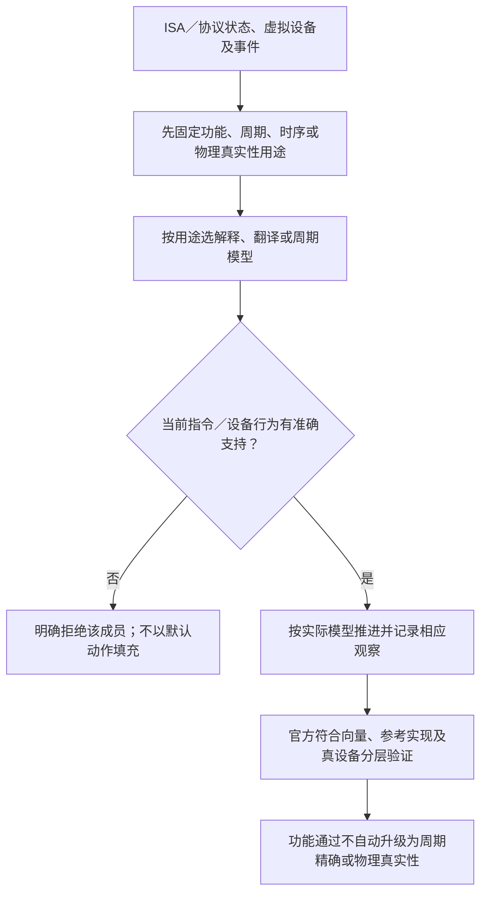
```mermaid
flowchart TB
  machine["ISA／协议状态、虚拟设备及事件"] --> purpose["先固定功能、周期、时序或物理真实性用途"]
  purpose --> method["按用途选解释、翻译或周期模型"]
  method --> supported{"当前指令／设备行为有准确支持？"}
  supported -->|否| reject["明确拒绝该成员；不以默认动作填充"]
  supported -->|是| advance["按实际模型推进并记录相应观察"]
  advance --> verify["官方符合向量、参考实现及真设备分层验证"]
  verify --> scope["功能通过不自动升级为周期精确或物理真实性"]
```

**模型与时间：**ISA/协议状态、虚拟设备和事件

**必要合同：**功能、周期、时序和物理真实性分别标记

**方法候选：**解释、翻译或周期模型按目的选择

**失败边界：**未支持指令和设备行为准确拒绝

**验证：**官方符合向量、参考实现及真设备

## 状态空间探索与形式模型

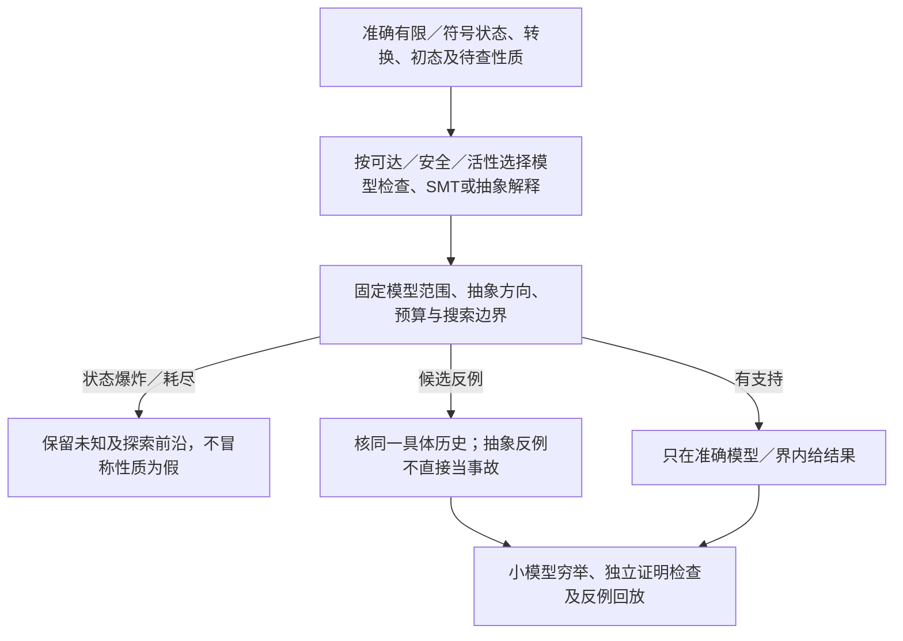
```mermaid
flowchart TB
  property["准确有限／符号状态、转换、初态及待查性质"] --> method["按可达／安全／活性选择模型检查、SMT或抽象解释"]
  method --> search["固定模型范围、抽象方向、预算与搜索边界"]
  search -->|状态爆炸／耗尽| unknown["保留未知及探索前沿，不冒称性质为假"]
  search -->|候选反例| witness["核同一具体历史；抽象反例不直接当事故"]
  search -->|有支持| proof["只在准确模型／界内给结果"]
  witness --> verify["小模型穷举、独立证明检查及反例回放"]
  proof --> verify
```

**模型与时间：**有限或符号状态、转换与待查性质

**必要合同：**可达性、安全性、活性与模型边界明确

**方法候选：**模型检查、SMT或抽象解释按性质选用

**失败边界：**状态爆炸、抽象反例与未知保留

**验证：**小模型穷举、证明检查和反例回放

## 联合仿真与多尺度耦合

```mermaid
flowchart TB
  members["各独立模型、接口、时钟与交换量"] --> coupling["固定通信步、插值、代数环、守恒及误差传播"]
  coupling --> rollback{"所选主算法需要回滚？"}
  rollback -->|是| qualification["先核全部相交成员完整恢复资格"]
  rollback -->|否| method["FMI等交换接口＋准确主算法；接口名字不提供耦合算法"]
  qualification -->|具备| method
  qualification -->|缺失| fail["拒绝该路线；不重复推进不可回滚成员"]
  method --> verify["耦合步收敛、能量交换、同步及失联核对"]
  verify --> boundary["局部收敛不代签整体稳定；模拟回滚不撤回现实效果"]
```

**模型与时间：**多个独立模型、接口、时钟与交换步

**必要合同：**通信步、代数环、插值、回滚资格和误差传播

**方法候选：**FMI等交换接口加显式主算法

**失败边界：**各局部收敛仍可整体不稳定；不回滚真实外部效果

**验证：**耦合步收敛、能量交换、同步与失联

## 实时与MIL/SIL/PIL/HIL

```mermaid
flowchart TB
  level["绑定本在环级别：真实模型／软件／处理器／硬件"] --> time["显式仿真时钟到墙钟映射；核期限与危险接口"]
  time --> execute["受控设备适配在真实准入内执行"]
  execute -->|过载／越期| safe["按定义安全动作处理；不补跑危险历史指令"]
  execute --> observe["真实组件、时序与输出观察"]
  safe --> readback["核实际安全态及原效果结算"]
  observe --> verify["逐级验证、真机时序、隔离及急停演练"]
  readback --> verify
  verify --> scope["软件在环通过不代签硬件在环或现场安全"]
```

**模型与时间：**模型、软件、处理器、硬件和墙钟

**必要合同：**各在环级别的真实组件、期限与危险接口明确

**方法候选：**仿真时钟到墙钟映射及受控设备适配

**失败边界：**过载不快速补跑危险历史指令；设备进入定义安全态

**验证：**逐级验证、真机时序、隔离与急停演练

## 数字孪生与在线同化

```mermaid
flowchart TB
  physical["真实对象与准确身份"] --> measurement["测量、时钟对齐、校准与不确定性"]
  measurement --> estimate["状态估计／同化更新模型；观测、估计、预测各自保留"]
  estimate --> prediction["在合格用途域形成条件预测"]
  measurement -->|过期／漂移／失联| downgrade["降级预测／控制资格，显示不确定增长；不以模型补测量事实"]
  prediction --> verify["留出观察、预测校准及真实对象对照"]
  verify --> qualification["仅对该身份、工况、校准及时效声明资格"]
```

**模型与时间：**现实对象、测量、估计、模型与预测

**必要合同：**身份、时钟对齐、校准、漂移与不确定性

**方法候选：**状态估计/同化与模型演化分责

**失败边界：**观测过期、漂移或失联时降级预测/控制资格

**验证：**留出观察、预测校准及真实对象对照

## 训练环境与合成数据

```mermaid
flowchart TB
  scenario["场景、观察、动作、奖励、传感及重置"] --> policy["固定随机化范围、标签来源及训练／评价隔离"]
  policy --> generator["场景生成＋仿真＋传感模型组合"]
  generator --> data["合成输入与标签保留真实生成来源和域"]
  data -->|奖励漏洞／数据污染／域差异| fail["保留准确缺陷；不通过重置或删失败样本消除"]
  data --> verify["未见场景、标签核验及现实迁移评价"]
  verify --> scope["模拟训练成绩不代签现实泛化或现场动作许可"]
```

**模型与时间：**场景、观察、动作、奖励、传感及重置

**必要合同：**随机化范围、标签来源、训练/评价隔离

**方法候选：**场景生成、仿真与传感模型组合

**失败边界：**奖励漏洞、数据污染和域差异保留

**验证：**未见场景、标签核验与现实迁移评价

## 可微仿真与代理模型

```mermaid
flowchart TB
  model["原模型、参数、导数请求及代理训练数据"] --> qualification["固定所求导数量、非光滑点与代理适用域／误差"]
  qualification --> method["准确选择 AD、伴随、有限差分或代理路线；不同导数量不互换"]
  method --> result["原值、梯度／估计及误差身份分别绑定"]
  result -->|错误梯度／分布外／模型偏差| fail["分别诊断，不补零或冒充精确梯度"]
  result --> verify["适用梯度检查、误差包络与高保真模型对照"]
  verify --> scope["只有准确模型和输入域中的资格；代理好拟合不证明所有新工况安全"]
```

**模型与时间：**模型、参数、梯度、代理训练数据与误差

**必要合同：**导数对象、非光滑点、代理适用域明确

**方法候选：**自动微分、伴随、有限差分或代理方法

**失败边界：**错误梯度、分布外输入和模型偏差分别诊断

**验证：**梯度检查、误差包络与高保真模型对照

## 量子与异质计算模拟

```mermaid
flowchart TB
  quantum["量子态／电路、噪声、测量与硬件约束"] --> representation["按任务选择状态向量／张量网络等表示；固定近似与资源边界"]
  representation --> resources{"当前规模、复杂度与内存预算满足？"}
  resources -->|否| frontier["返回准确前沿／未完成；不截断后假称全规模支持"]
  resources -->|是| simulate["按选定噪声／测量合同求模拟结果"]
  simulate --> verify["小规模精确对照、统计测量及硬件比对"]
  verify --> scope["模拟、统计与真实硬件资格分开；表示存在不保证任意规模可算"]
```

**模型与时间：**量子态/电路、噪声、测量与硬件约束

**必要合同：**表示方法决定资源和近似边界

**方法候选：**状态向量、张量网络等按任务选择

**失败边界：**内存或复杂度超预算给前沿，不假称全规模支持

**验证：**小规模精确对照、统计测量与硬件比对
