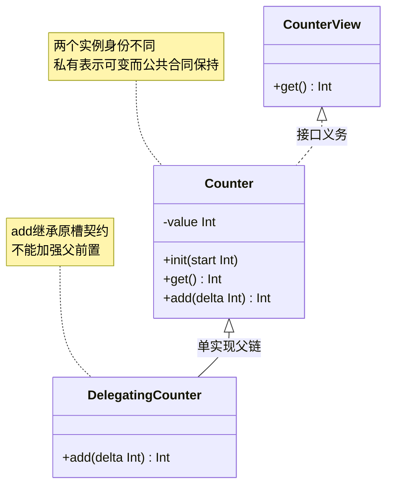
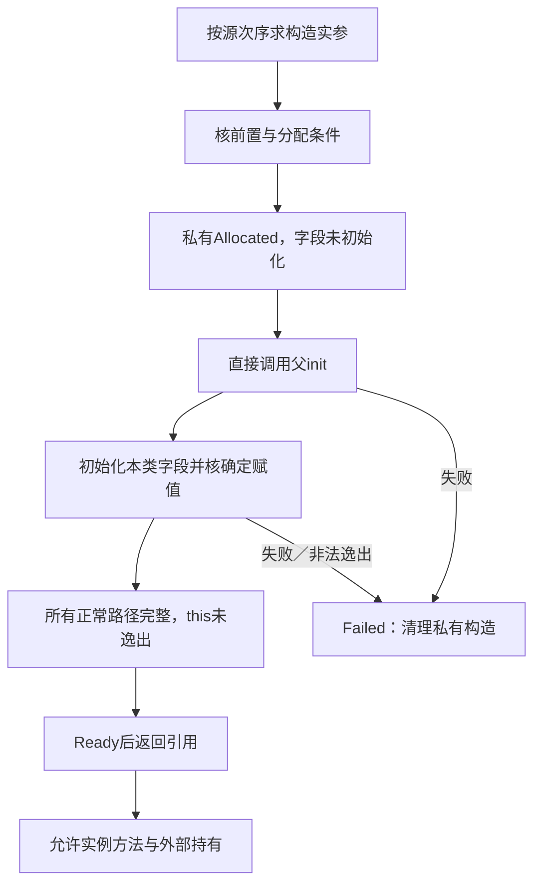
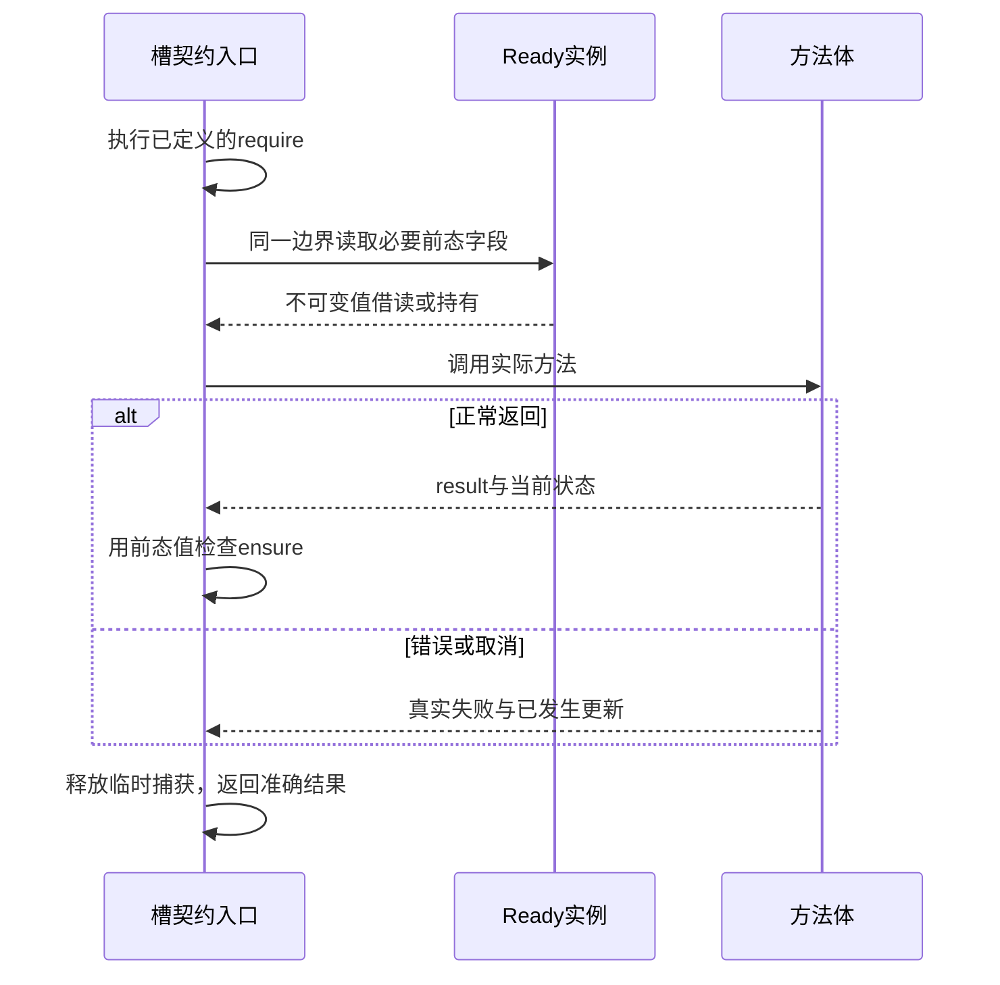
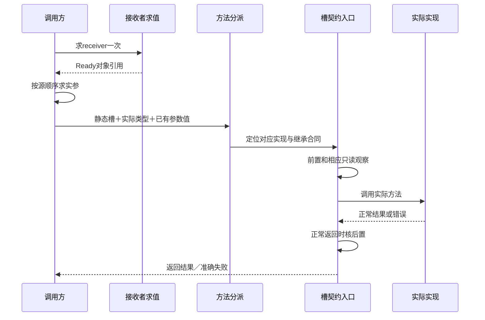
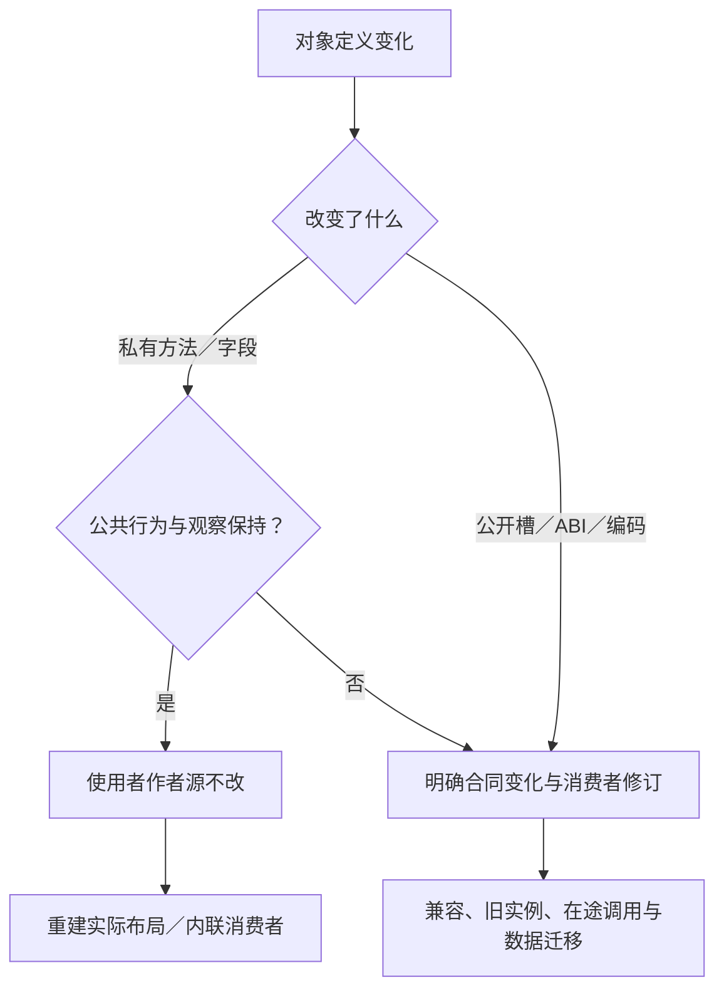

# 对象构造与动态分派

> **阅读范围**：采用范围内的设计规范；实现状态另查未决。

<details>
<summary>本页内容</summary>

- [范围与当前取舍](#范围与当前取舍)
- [谁需要编写对象内容](#谁需要编写对象内容)
- [直接作者表面](#直接作者表面)
- [类型、接口与封装](#类型接口与封装)
- [构造算法：分配不是发布](#构造算法分配不是发布)
- [方法调用、覆盖与契约](#方法调用覆盖与契约)
- [静态数据与目标实现](#静态数据与目标实现)
- [独立反例与完成范围](#独立反例与完成范围)
- [采用理由与重新裁决](#采用理由与重新裁决)
- [结构作者体与文本编辑的对应](#结构作者体与文本编辑的对应)

</details>


本章拥有`sec.object/1`对象语义合同，即对象能力的第1兼容代；它不是文件扩展名、独立语言服务或每个类必须填写的模式。合同规定作者表面、构造、引用、分派、契约与保持。明确选择计算文本区域的[默认语言组合](../计算基础/紧凑表示与程序范式.md#合同标识默认语言组合与按需能力)已经纳入本有限语法；旧基础专用模块保持原解释。普通库导入不能切换解析规则，无对象的程序不生成对象运行设施。对象仍是同一`.sec`语言、同一ModuleRevision和同一类型/效果体系中的声明与表达式。

## 范围与当前取舍

有限范围支持单实现父链、多接口、私有表示、公开只读字段、可变实例字段、唯一构造入口、泛型类、实例方法、类关联静态方法、显式覆盖及引用相等。默认对象属于一个逻辑执行所有者；单线程事件循环中的重入仍按真实调用次序处理。跨执行者共享可变对象需要已有资源与同步合同，不从“有类”推导自动线程安全。

不将实现继承作为所有复用的要求：值记录适合透明数据，普通函数和模块适合无状态算法，组合适合独立行为；对象用于确实存在实例身份、封装状态或动态分派的地方。多实现继承、默认接口方法、反射改写、元类、动态增加字段、弱引用、析构顺序和运行时换类未进入此有限画像。原生输入具有这些含义时保全原语义，不强制改写成此子域，也不把有限画像宣称成完整Java/Python/JavaScript兼容。

## 谁需要编写对象内容

对象语法可用，并不意味着应用作者必须把每项需求写成类。使用已有封装时只写其参数、连接与必要行为；是否需要私有类、字段、方法表和捕获由该定义的实现或合格目标策略承担。完整选择过程由[需求封装](../../作者/组合/模块封装与复用库.md#需求封装的调用与具体化协议)拥有，不在此另建意图层。

确实需要作者表达的是对外可观察的实例独立性、共享状态、动态覆盖或特定互操作；这些也可以先由一个合格高层封装提供。没有适用封装而开发者正在定义这种行为时，才直接使用本章构造。只要求Java输出一个类容器，使用目标结构控制，不自动引入本章引用身份语义。

同一值可用目标class装载，也可用结构与函数实现；合格选择不改变公开的相等、别名、生命周期与错误。只隐藏类名不等于这些观察已经消失，替换实现仍须保持真实合同。库作者、应用使用者可以是同一AI在不同操作中的角色，不把内部复杂工作排除在总成本之外。

## 直接作者表面

基础的`fn/type/let/export/require/ensure`保持原义。组合文法提供`class/interface/init/new/this/super/var/set/override/static/final`这些明确构造；用户写class，不再给每个定义选择画像。这仍是实际新增的前端责任，不能用“上下文词”否认复杂度。原基础专用解释遇到扩展构造时报告解释差异，可在明确升级候选中采用新组合，不猜读。`import "sec/object"`仅在使用该模块的命名效果或`before`契约内在函数时需要；普通类和可推导效果不要求该导入。

```sec
import "sec/object" as obj;

export interface CounterView {
  fn get() -> Int !{obj.Read};
}

export class Counter : CounterView {
  var value: Int;

  export init(start: Int)
    require start >= 0
  {
    set this.value = start;
    ()
  }

  export fn get() -> Int !{obj.Read} = this.value;

  export fn add(delta: Int) -> Int !{obj.Read, obj.Write}
    require delta >= 0
    ensure result >= 0
  = {
    set this.value = this.value + delta;
    this.value
  };
}

export fn demo() -> Int !{obj.Alloc, obj.Read, obj.Write} = {
  let c = new Counter(2);
  c.add(3)
};
```

`obj.Read/Write` 同时承担对象字段与逃逸托管可变位置的读写上界，`obj.Alloc`承担对象实例分配；这些是已定义的效果符号，包名是设计合同而非已安装软件。效果可以按基础规则从有主体的函数推导；上例显式写出只是展示接口。`new` 的参数按源码出现顺序求值；参数求值已经产生的作用不由构造失败撤销。运行结果应为5，同一 `c` 的后续读取仍为5；创建另一个 `Counter(2)` 得到独立身份和状态。

### 文法增量

下面仅定义扩展位置。`Identifier`是基础`Ident`的别名；`Type/Expr/Params/TypeParams/Effects/Arguments`使用基础规则。`LocalBinding`为`"let" Ident [":" Type] "=" Expr ";"`，`Contract`为`{Pre} {Post}`，沿前置在前、后置在后的顺序。代码块仍以最后一个表达式产生值，不新增隐式 `return`。

```ebnf
ObjectDecl    = ClassDecl | InterfaceDecl ;
Contract      = { Pre } { Post } ;
LocalBinding  = "let" Ident [ ":" Type ] "=" Expr ";" ;
ClassDecl     = [ "export" ] [ "final" ] "class" Identifier [ TypeParams ]
                [ ":" Type { "," Type } ] "{" { ClassMember } "}" ;
InterfaceDecl = [ "export" ] "interface" Identifier [ TypeParams ]
                [ ":" Type { "," Type } ] "{" { MethodSignature } "}" ;
ClassMember   = FieldDecl | Initializer | MethodDecl ;
FieldDecl     = [ "export" ] ( "let" | "var" ) Identifier ":" Type ";" ;
Initializer   = [ "export" ] "init" "(" [ Params ] ")" [ Effects ] Contract ObjectBlock ;
MethodDecl    = [ "export" ] [ "static" ] [ "override" ] [ "final" ]
                "fn" Identifier "(" [ Params ] ")" "->" Type
                [ Effects ] Contract "=" Expr ";" ;
MethodSignature = "fn" Identifier "(" [ Params ] ")" "->" Type
                  Effects Contract ";" ;
ObjectBlock   = ExecutionBlock ;
FieldWrite    = "set" ( "this" | Expr ) "." Identifier "=" Expr ";" ;
SuperInit     = "super" "(" [ Arguments ] ")" ";" ;
NewExpr       = "new" Type "(" [ Arguments ] ")" ;
```

`FieldWrite` 左侧的 `Expr` 必须是能产生当前可写实例的单个接收者表达式；解析器使用现有后缀表达式规则在最后一个字段访问处分离，不靠字符串切分。接收者先求值一次，再求右值一次，再写字段。字段访问权限仍按词法定义者判断。`SuperInit` 只允许在派生类唯一 `init` 的首个可执行位置；其余位置拒绝。`ObjectBlock`复用[局部控制文法](控制流与存储寿命.md#局部控制的确定文本)的ExecutionBlock。有限语句还包含局部var/set及while/break/continue/return；构造器的每条正常return仍须完成全部确定赋值并返回Unit，不能用提前return跳过Ready条件。未列入的任意语句不自动开放。

有限画像每类恰有一个 `init`，无隐式零参数构造、重载或默认参数。初始化入口默认模块私有；`export init`允许经过可见类公开构造或被外部子类调用。导出类可以只通过公开工厂返回实例，不要求公开其初始化入口。`export var` 暂不接受：写操作由公开方法承担，避免把可变表示无条件暴露。`export let` 提供只读公共字段，属于永久公开合同。`static override`、构造 `final/override`、类有多个具体父类、接口有字段或方法主体都拒绝。私有方法不分派，公开实例方法默认可覆盖，`final` 封闭其覆盖；`final class` 封闭继承。静态方法没有 `this/super`，按普通函数检查。此范围不提供可变静态字段和有作用的静态初始化。

## 类型、接口与封装

<a id="fig-object-structure"></a>

### 图解：类型身份、实例和方法槽分离

静态类型提供可用合同，动态类型提供槽实现；字段布局属于实例表示，不能用类名等于对象身份。图省略派生类初始化器；实际代码仍须显式满足构造与父初始化规则。



模块读取器将ObjectDecl加入固定语言组合的Module声明联合，将NewExpr、this及合法super成员引用加入该画像Primary。对象块替换该画像的BlockExpr；未选画像的原始文法逐字不变。`super.method(...)`仅在实例方法中使用，静态解析到父链实现，但仍执行该方法槽契约，不动态跳回当前覆盖。

类名表示非空对象引用，不是按字段相等的值记录。不存在隐式null；可选引用使用 `Option<C>`。对象 `==` 比较同一运行实例身份，两个字段值相同的实例仍可不等。序列化、深复制和结构相等须通过明确库合同提供；跨进程恢复不会自动复活原内存地址身份。

类的类型参数默认不变。父关系在声明处固定，不能随某次调用改变；禁止继承环。接口只继承接口。多个继承路径指向同一方法槽身份时只继承一次；不同来源的同名要求必须在参数类型、名字、返回、效果与契约上兼容，且由一个明确实现履行。仅同名或同形不能默认为同一槽；无法合并时要求显式门面适配，不按导入次序挑选。

类字段默认为私有，以声明类和字段角色定位；子类不能直接读父类私有字段。子类可声明同名私有字段，它与父字段是不同槽，但本类访问不得因布局变化改指另一槽。公开签名不能泄漏不可命名的私有名义类型。私有方法静态解析到声明者；公开虚方法解析到槽，运行时按实际接收者类型选择实现。

本画像的方法不增加独立方法泛型；泛型类的类型参数可以用于成员，通用无状态算法继续使用模块级泛型函数。这避免在有限ABI里假装已经统一了所有语言的泛型虚方法。需要它时扩展该合同，而非输出 `Any`。

## 构造算法：分配不是发布

对象内部阶段为 Allocated、Initializing、Ready、Failed；这是目标运行的局部状态，不为每个对象创建SEC开发任务或持久日志。

1. 解析实际类型与构造入口，按源码次序求实参；核参数前置与目标容量。
2. 分配不可向普通代码取得的构造中引用，字段使用“未初始化”内部标志，不填用户可观察的零或空值。
3. 派生类先计算 `super` 实参并直接进入父初始化器；父完成后初始化本类字段。父 `init` 不经虚表分派。
4. 按确定赋值分析检查每条正常路径：本类所有字段恰在使用前初始化；`let` 恰写一次，`var` 在Ready后才可继续写。
5. 构造中的 `this` 只能用于已定义的字段写与已经初始化的字段读取；不能返回、存入外部对象、传给函数、捕获到可能逸出的闭包或调用实例方法。纯模块/静态帮助函数和独立子对象构造可以使用，不把当前 `this` 传入。
6. 所有初始化正常结束才将最派生实例置Ready并返回。失败则销毁/回收私有构造内容，不返回半对象；外部输入求值已经发生的作用保持其真实结果。

构造前置只能读取实参，不能读取尚未初始化的this；初始化器后置只观察已完成的本类及可见父字段，不调用方法。只有最派生初始化全部完成才对外返回Ready。

当前构造主体只承担本对象/子对象内存建立与可定义纯计算，不直接取得文件、锁、GPU或外部活动。需要这些资源时，工厂先按已有资源协议取得它们，再采用带明确拥有/借用合同的资源扩展；不能凭构造失败宣称所有外部资源自动回滚。

这一选择有意比若干原生语言严格。Java可在初始化期间动态调用覆盖方法；SEC有限构造选择禁止这种入口。导入Java程序时必须保留Java实际含义，不能把这个限制当作已有Java源码的等价变换。[JLS实例创建](https://docs.oracle.com/javase/specs/jls/se25/html/jls-12.html#jls-12.5)

### 确定初始化的有限检查算法

初始化器正常结果必须为Unit。无具体父类的类不能调用`super`；有父类时恰有一次首位置`super(...)`，父实参先按源码次序检查与求值，父完成才进入本类初始化。接口不产生构造调用。父的泛型实参在此已经代入，不在虚调用时重新推断。

检查器为当前类字段维护`MustInit`、`MayInit`与`NormalReachable`，这些是局部分析状态，不是作者字段。入口时本类字段均未初始化；父完成的字段仍通过其可见性规则使用。每条语句依次处理：先检查接收者和右值，读取字段必须属于MustInit；随后写本类字段。初始化阶段字段若已属于MayInit，拒绝可能的第二次初始化，包括var；Ready之后var的写入采用普通更新合同。局部临时let不因分析丢失其真实求值。

分支正常后继的MustInit取交集、MayInit取并集；已证明不存在正常后继的分支不参与正常合流，不能仅凭作者说“这里一定抛错”排除该分支。匹配分支使用同样规则并检查覆盖；回调、循环或方法调用不能作为可能初始化字段的黑盒。当前构造不允许通过任意实例方法初始化this，因此不需求解开放世界的写入分析。到每个正常出口，本类全部字段在MustInit中，所有let字段恰初始化一次；不终止路径不伪造Ready，也不因此要求通用终止证明。

`this`的允许出现仅是合法字段访问的接收者；不能作为普通值送入返回、另一个对象/记录/列表、闭包捕获或任何调用。`super`仅有规定的父初始化用途。字段值本身可传给纯帮助函数；这些值不能携带构造中的this别名。分析的拒绝范围在诊断中定位到实际路径；不因一个字段未确定赋值就给它补零。

区分反例：`if p then { set this.x = 1; () } else (); this.x`在读取处拒绝；两个分支都各初始化x一次可以合流；一分支初始化x而另一个不初始化，合流后再写x应拒绝“可能二次初始化”，不能只看MustInit缺x就放行。后端若使用目标默认值填充物理内存，该值仍不得向程序观察到。

## 方法调用、覆盖与契约

<a id="fig-object-construction"></a>

### 图解：构造完成前的this与发布边界

这是目标对象的局部生命周期。构造主体不能通过闭包、回调或容器提前泄露this；失败不发布半对象。



调用先求接收者一次，再按源码次序求实参。Ready检查后，以静态可见签名找到槽、以实际类型找到实现，然后进入该槽的契约入口。参数槽重排只能重排已求值的值。把方法保存为函数值时，接收者在取方法时固定一次；调用该函数值时仍使用原接收者与槽，不重放取得接收者的表达式。

覆盖必须显式写 `override`，有限规则采用相同参数类型和公开参数名、相同返回类型、不更大的效果上界。覆盖实现继承槽的全部已接受要求，不仅是显式require/ensure；函数体或任务已经确定的公开行为也不能被较弱注解取消。不得另外增加前置或更换原后置。图中的DelegatingCounter仅展示委派到super.add的合法形态，不声称任意限幅都与精确加法等价。不同接口合同的蕴含目前不能直接判定时，提供显式适配方法或保留未满足义务，不假设签名相同即可替换。父类提供者返回子对象时，父类型的调用仍然经过该槽的相同合同。

方法体内部可以逐次修改 `var`。每次 `set` 是一个字段更新，不是全方法事务。后续出错、后置失败或取消不自动还原之前更新。需要强异常保证时，先计算新值、完成可失败检查，再在无外部重入的所属执行段内更新；需要多对象原子性则使用对应机制，不由class关键字签发。

契约中的普通`this.field`在其实际检查边界读取。跨前后关系使用下节明确的`obj.before`，不要求作者手工新增一个隐藏参数，也不推导已经保存整个历史堆。共享可变状态需要真实同步或明确快照；单逻辑所有者也不能在捕获中调用用户getter或启动外部工作。

### 前态契约：一个明确入口而非整堆快照

`sec/object`导出`before`，它是**只允许出现在实例方法ensure中的契约内在函数**，沿普通调用语法解析，但由绑定身份识别；不增加全局关键词、不在运行库调用处临时反射对象。局部函数或另一个包恰好名为before不获得该含义；它不能作为普通函数值传递，也不能借包装函数把调用移出后置检查。

例如，已经导入该模块为`obj`的方法可以写：

```sec
export fn add(delta: Int) -> Int
  ensure this.value == obj.before(this.value) + delta
  ensure result == this.value
= {
  set this.value = this.value + delta;
  this.value
};
```

该片段属于拥有私有value字段的类；不是独立模块，也不额外声明值域限制。它规定正常完成的状态变化与返回关系，不能被理解为字段更新的自动回滚。公开槽采用此合同后，覆盖仍继承同一要求。

有限入口只接受`this`上当前方法可见的字段投影；字段结果必须是可冻结的中立不可变值，并可继续投影不可变记录字段。拒绝嵌套before、result、方法/getter、索引、算术、对象/资源引用、闭包和任意用户函数。需要更复杂前态计算，先捕获所需字段值，再在ensure内作既有纯表达式运算；表达式仍须满足定义性。父私有字段不能因before绕过权限；构造器没有Ready入口前态，当前不接受before。

处理顺序确定为：绑定槽和完整契约 → 校验投影及类型 → 所有require成功 → 在方法体前取得必要前态值 → 执行方法体 → 正常返回后检查ensure → 释放临时保留。相同投影可以在这个边界内去重；源中没有before，就不建立前态表。不可变值可以共享已有存储，不深复制整个对象图；捕获必须在所选逻辑所有者/同步边界内完成，不能产生拼接自不同并发时刻的假快照。

字段capture属于原方法分析和降低计划。目标生成在方法体前保存局部值，ensure用它替代before出现；文本和结构输入都使用同一实际符号和相同顺序。正常、异常和取消路径都结算捕获寿命；方法中途更新后出错，前态值只用于解释或指定诊断，不把已发生更新撤销。具体检查器与目标的符合性仍需要实现，这份确定合同不冒充现成库。

<a id="fig-object-prestate"></a>

图展示前置通过后的必要捕获与收尾；前置失败直接结束，不调用主体。只保存本方法实际读取的不可变字段值，错误不进入自动回滚。



### 局部名字与对象存活

对象引用可以保存在不可重绑的let里，对象仍按方法合同变化；局部名字消失不销毁仍被其他对象或闭包持有的实例。默认托管对象不公开析构时点，循环图需要合格回收实现。外部资源不靠一般对象的GC时机关闭：通过[资源作用域](控制流与存储寿命.md#资源作用域的有限库合同)取得、转移和关闭，其取消与未结算另由实际宿主承担。

## 静态数据与目标实现

<a id="fig-object-dispatch"></a>

### 图解：一次虚方法调用的确定时序

接收者与实参只求值一次；契约属于稳定方法槽，覆盖实现不能省略它。



共同表示使用 `ObjectTypeDecl`、`FieldSlot`、`MethodSlot`、`ConstructorPlan`、`NewObject`、`ReadField`、`WriteField`、`InvokeSlot`。它们是既有模块的领域节点：保存归属、可见性、类型、父关系、构造阶段、效果、调用源位置和真实依赖，不新建对象语言数据库。

检查器先收类型和成员，解析父图与接口，验证槽冲突，执行构造确定赋值及逸出检查，再检查方法效果、契约和覆盖。新增子类会影响真正查询“所有可能目标”的去虚拟化分析；已封闭的类和明确直接调用不因无关库新增而全部失效。

TS/Java可以生成对应类、私有字段与方法。目标为没有同等class语法的语言时，可以用结构、接收者参数和虚表保持已承诺行为。显式要求继承某个Java类、特定运行时反射或ABI时，该要求另入目标资格；结构加函数不一定满足。[Rust动态分派表示](https://doc.rust-lang.org/reference/types/trait-object.html)

生成器保留静态方法、公开名字和初始化关系；不得把构造计划重排成会读取未初始化字段的目标初始化器。只在类布局不被公共ABI或序列化观察时，私有表示改变才能使调用方作者源不改；可能仍需重编译、重新布局或数据迁移。旧制品的对象不与新制品的类身份无条件互换。

## 独立反例与完成范围

<a id="fig-object-change"></a>

### 图解：私有实现与公共契约变化分别传播

接口保持不等于无需重编；公开布局、序列化或反射存在时需要相应迁移，不能以字段private代签。



| 输入或改动 | 必须得到的结果 |
|---|---|
| `new Counter(2)`后add(3) | 返回5；另一实例保持自己的值 |
| 构造器调用被覆盖的实例方法 | 构造阶段拒绝；不能生成可能观察子类未初始化字段的调用 |
| 父字段和子字段同名 | 各按声明槽处理，不按目标字段字符串合并 |
| 覆盖add增加delta大于0的前置 | 拒绝；父合同允许delta=0 |
| 方法第一条set成功，第二条计算报错 | 返回错误并准确保留已发生更新，不宣称回滚 |
| 只改私有表示且公开行为保持 | 调用者作者源不变；布局消费者与产物仍依真实依赖更新 |
| `final`类被继承或静态方法写override | 定义错误，不让目标语言碰巧接受代签 |
| 通过旧原生反射直接写私有字段 | 不属于普通中立契约；适配需保留或明确禁止该观察 |

完整对象扩展、方法体检查与目标实现仍需符合性；本章已确定的是有限作者、构造和分派方案。多继承、动态反射改写、跨线程共享与资源析构的更广语义继续作为明确扩展，不因表面有class而关闭。

## 采用理由与重新裁决

相对只提供“生成成class”的控制，本方案能直接表达身份、状态和分派，避免目标结构替代业务含义。相对全嵌套对象builder，直接写法保留常见成员结构和较短修改；代价是增加一个需要解析、类型检查与编辑映射的有限画像。相对一次性复制全部主流语言对象体系，先固定可保持的单继承与接口范围，并保留原生精确接入。若真实消费者要求未覆盖能力，优先扩展相交语义和目标，不能让对象作者转成永久不可维护的原生补洞，也不能无条件破坏已接受契约。

## 结构作者体与文本编辑的对应

结构入口选择 `representation:"sec.object-body/1"`，不往原`sec.semantic-body/1`里塞未定义字段。外壳继续使用真实模块、导入、声明身份和出口。

| 对象 | 必需字段与默认 | 读取与编辑约束 |
|---|---|---|
| ClassBody | typeParams默认空；parent可缺；interfaces有序且默认空；fields有序；initializer唯一；methods有序；final默认false | parent解析到一个类；接口解析到接口；所有引用服从可见性 |
| FieldSlot | key、name、type、mutable；publicRead默认false | publicRead且mutable拒绝；写入权限不能由已知key绕过 |
| Initializer | params有序；body；requires/ensures默认空；public默认false；effects缺省为推导 | 父初始化、确定赋值、this逸出由同一个检查器判断 |
| MethodSlot | key、name、params、returns、body；effects可推导；public/static/override/final显式布尔默认false | 槽身份由继承解析确定，名字不代替来源；覆盖契约不复制成可独立修改的要求 |
| InterfaceBody | typeParams与parents默认空；methodSignatures有序 | 签名有准确效果上界与契约，无body和字段 |

对象区域使用有序`object-region.items`，项为基础let、`object-write(receiver,field,value)`或仅构造开头合法的`super-init(arguments)`；末尾expression必需。表达式增加`object-new(type,arguments)`、`object-read(receiver,field)`、`object-invoke(receiver,slot,arguments)`和词法this/super引用。参数数组保留求值次序，已解析槽与源位置是派生信息，不能用它们跨私有边界。普通基础表达式作为子节点复用；新编码未知时保全/拒绝解释，不假装基础解码器支持。

文本与结构都形成相同类、槽和有序区域。重命名字段按绑定更新类内真实使用；公开方法改名还须处理接口和消费者；继承变化重新建立分派与构造计划。修改派生结构时回写唯一作者源，不同时维护一份独立class描述。

### 混合模块与普通函数中的对象表达式

固定组合的模块继续使用一个dialects别名和原定义表；例如已固定组合的`s`可以解释`s:function`、`s:type`和新增`s:class/s:interface`。别名是绑定，不是按s字母硬编码；不要求一个文件再复制一份对象模块。类与接口分别以ClassBody/InterfaceBody作其body，`representation`为`sec.object-body/1`。

普通函数只包含基础表达式时保留`sec.semantic-body/1`。其主体使用new、this、对象读写或槽调用时，采用`sec.object-body/1`的函数体分支：params、returns、typeParams、effects、requires、ensures及expression与原FunctionBody同型；普通有体fn可按简洁作者合同省returns，内部类型仍须闭合。expression允许基础表达式与本章对象节点组合。对象方法及接口签名本身仍按本章显式规则，不能将普通fn省略迁到未定义的成员格式。对象块的items顺序保留，基础块也可作为子区域；同一字段不能同时用两种列表竞争定义。接口签名无主体，构造器只在类成员中出现，不允许把init当顶层普通函数。

两种编码的纯基础交集使用相同含义；编码版本由实际body决定，不能把含object-new的树谎标成旧基础体。同一个方法不必先复制出一份基础函数再绑定回类。before是已绑定的契约call，this由对象表达式规则解释，捕获计划是分析结果而非额外序列化字段。

导入公开对象类型可以需要其类型语义方法，却不改变导入方的词法。能传递某种引用不等于能够解释任意未知对象操作；缺具体类型方法时，保全签名并给相交分析缺项，不猜成记录或Any。基础专用旧模块与新组合的跨模块消费，按真实公开类型/效果与目标合同检查，不以同名或相同/1自动兼容。
