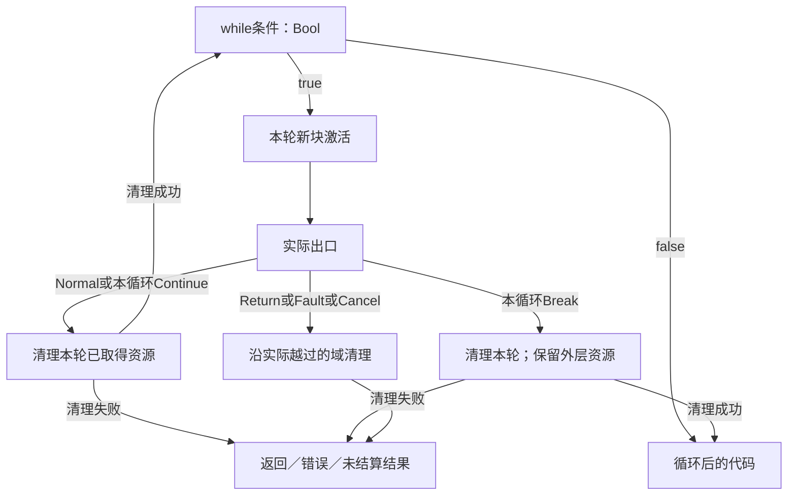
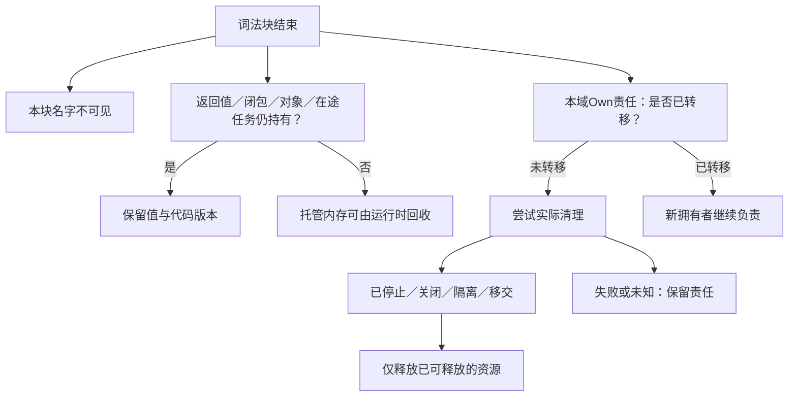

# 控制流与存储寿命

> **阅读范围**：采用范围内的设计规范；实现状态另查未决。

<details>
<summary>本页内容</summary>

- [当前采用与兼容范围](#当前采用与兼容范围)
- [局部控制的确定文本](#局部控制的确定文本)
- [K0—K6：检查与执行](#k0k6检查与执行)
- [名字、存储与资源的寿命不是同一条线](#名字存储与资源的寿命不是同一条线)
- [闭包存储依赖与外部效果投影](#闭包存储依赖与外部效果投影)
- [内存管理：默认托管，确定资源作用域，受限底层区域](#内存管理默认托管确定资源作用域受限底层区域)
- [控制出口与清理结果的确定合并](#控制出口与清理结果的确定合并)
- [模块实例、全局配置与应用状态](#模块实例全局配置与应用状态)
- [底层区域的边界，而非整个语言一起变成不安全](#底层区域的边界而非整个语言一起变成不安全)
- [设计关闭范围与反例](#设计关闭范围与反例)

</details>


本章拥有通用工具作者的局部命令式控制、名称与存储的区别、托管内存、资源作用域和必要的底层访问合同。基础值与模块仍由[语言规格](../../作者/可替换表示与适用范围.md)拥有；类的构造、字段和分派仍由[对象规范](对象构造与分派.md)拥有；异步活动和宿主真实停止仍由[资源执行](../../运行/权限与资源管理.md)拥有。它们在同一类型、效果、编译和执行系统中接合，不产生另一种作者语言或内存服务。

## 当前采用与兼容范围

当前通用语言组合增加有限局部控制：复用已有`var/set`，增加`while/break/continue/return`。它们解决循环、局部累积、提前结束和错误分支的直接表达，不为链表、排序、网络和每种业务增加关键词。没有循环的函数仍使用原表达式。基础专用解释及已经固定的旧规则不改义；新组合绑定新的精确语言与结构方法修订，不凭`/1`相同假装兼容，不根据看到了某个词自动升级。

局部控制属于共同函数执行，不要求创建类；现有`sec.object/1`作为通用组合入口的定位角色不变。组合解析器可以直接包含有限规则，不要求动态插件。作者不逐函数选择控制版本。四个新增词的解析、作用域和目标责任必须共同实现，不能仅因关键词少就称语言完整。

## 局部控制的确定文本

下列文法扩展已选通用组合中的块；沿用基础`Expr/Type/Ident`和对象`FieldWrite/SuperInit`。基础专用文法保持。`LocalBinding`的原含义不变。`ExprStatement`允许执行表达式并丢弃普通结果；未消费的Result给出可定位诊断建议，不能自动改其业务处理。

```ebnf
LocalVariable = "var" Ident [ ":" Type ] "=" Expr ";" ;
LocalWrite    = "set" Ident "=" Expr ";" ;
WhileStmt     = "while" Expr ExecutionBlock ;
BreakStmt     = "break" ";" ;
ContinueStmt  = "continue" ";" ;
ReturnStmt    = "return" [ Expr ] ";" ;
ExprStatement = Expr ";" ;
Statement     = LocalBinding | LocalVariable | LocalWrite | FieldWrite
              | SuperInit | WhileStmt | BreakStmt | ContinueStmt
              | ReturnStmt | ExprStatement ;
ExecutionBlock = "{" { Statement } [ Expr ] "}" ;
```

`{}`继续只表示空记录，不能因新增块把旧表达式改成Unit。非空块最后有未带分号的表达式时以它为正常结果；只有语句的块正常结果是Unit。块内先解析一项Expr，后见分号则为ExprStatement，否则必须是该块最后的Expr。`Ident :`仍区分记录起始；块和记录的原消歧继续适用。`while`条件结束于同层级的主体`{`，若条件内部需要块或记录表达式则显式括号化，不靠类型反推语法。

`return`结束最近的词法函数、方法或lambda；不穿越回调边界。省略值等于返回Unit，须符合返回类型。`break/continue`只指向同一函数内最近的词法while，不从lambda跳出外层循环；顶层、无循环处或初始化器的非法位置均诊断。while体的正常结果必须为Unit；非Unit结果显式丢弃或作为外部累积，不能隐式成为循环返回值。return/break/continue路径不产生正常体结果。当前无标签跳转、任意goto、生成器yield或非局部continuation，不冒领这些能力；它们需要自己的控制与资源展开合同。`SuperInit`仍只在派生初始化器的首个允许位置，不因Statement联合而在其他块合法。

```sec
export fn gcd(a: Int, b: Int) -> Int
  require a >= 0 && b >= 0
= {
  var x = a;
  var y = b;
  while y != 0 {
    let remainder = x % y;
    set x = y;
    set y = remainder;
  }
  x
};
```

对`gcd(48,18)`，状态依次为`(48,18)→(18,12)→(12,6)→(6,0)`，返回6；`gcd(0,0)`返回0。`let remainder`每轮新建，两个外层var是本次调用的局部存储；不是模块全局、对象字段或持久工作任务。这是依据规定步骤的书面预期，不是运行记录。

## K0—K6：检查与执行

**K0 绑定。**先收模块声明，再建立函数参数和块作用域。每个局部声明的初始化在旧环境求值，成功后才引入名字；同块重名拒绝，嵌套块可遮蔽。`let`绑定不可重赋值；`var`绑定可重赋值但类型固定；函数参数默认不可重赋值。初次声明须提供初始化，不以隐式零、null或未初始化槽满足类型。公开顶层仍只有纯静态`let`，不开放隐式共享的顶层var。

**K1 类型与效果。**var从注解或初始化取得一个单态类型，不无条件泛化共享可变单元。`set x=e`先计算e，成功后更新x；e失败则原x不变，但e已经产生的外部作用不撤销。字段写仍先求接收者，再求右值。条件为Bool；每个正常return满足函数返回类型。静态类型检查包括不可达代码，但已证明无正常后继的路径不参与正常赋值合流。对象初始化中的循环不能证明必然执行一次；循环后MustInit使用入口与各正常出口的可靠交集，MayInit保留可能写入，沿用对象字段恰初始化一次的要求。

**K2 控制目标。**建立函数出口栈与本函数的循环目标栈。检查lambda时建立新控制边界，不继承外层break/return目标。中间表示的出口是`Normal(value)`、`Return(value,function)`、`Break(loop)`、`Continue(loop)`、`Fault(error)`或`Cancel(reason)`，不是把所有出口编码成普通Result。用户Result.Err仍是正常返回的数据。

**K3 求值。**while先检查条件，false返回Unit；true执行新的循环体激活。体Normal或指向本循环的Continue重新检查条件；Break离开本循环；Return、Fault和Cancel继续向所属边界传播。不可把先执行体一次的do-while当成本循环。每轮体内的局部存储新建，循环外var继续保留当前值。编译过程检查有限循环体，不执行未来迭代。

**K4 收尾。**出口跨过资源作用域时先形成待完成出口值，再执行该域要求的清理；返回值保持有效引用。本域内的continue不清理仍属外层的资源；离开本轮体则清理本轮资源。正常返回在相交作用域已完成收尾后，进入原函数后置检查；清理失败时不伪报正常完成。方法状态已更新后出现错误，不因return或ensure存在就自动回滚。

**K5 降低。**目标有合法循环、局部变量和退出时直接生成；无同类指令时使用控制块和出口值。返回、跳转、分支、捕获和清理的绑定关系保留。循环回边是取消/预算检查位置之一，不承诺每个普通算术操作都触发调度。不能将图形节点拓扑排序当目标执行次序。

**K6 继续修改。**绑定与出现保持准确身份；修改循环条件只影响真实依赖。抽取含return/break/continue的区域不能直接包成另一个函数。原有限私有函数抽取只接受没有外向控制出口的完整表达式；复杂抽取需显式出口代数与回填规则，未定义时返回该重构缺项而允许正常直接改源。

<a id="fig-local-control-exits"></a>

### 图解：退出先到所属边界，不等于立即释放一切

实线是目标程序的控制传播；资源清理仅发生在真正越过的作用域。图省略循环体中不改变出口的普通表达式。



## 名字、存储与资源的寿命不是同一条线

| 内容 | 可见范围 | 取得与保留 | 结束条件 |
|---|---|---|---|
| 顶层函数、类型及模块私有名 | 本模块；只有export可经公开入口引用 | 模块编译/实例保存代码与类型，不执行函数体 | 对应代码或运行实例没有使用者后可卸载；活跃闭包仍固定原版本 |
| 顶层let静态值（含合法函数值） | 本模块或公开导出；不是所有模块的全局变量 | 纯常量按有限规则求值；lambda仅建立静态捕获描述，不执行主体；内联/共享由后端按合同决定 | 不承诺退出模块便逐个析构；可回收时机由实际代码/运行引用决定 |
| 参数、局部let | 词法函数／块；初始化后可见 | 普通不可变值或句柄绑定 | 名字出作用域，值可能因返回、闭包或其他引用继续存活 |
| 局部var | 所属词法块 | 每次激活一份可变槽；默认只在本逻辑执行者中访问 | 不再有合法引用后可回收；并不要求放在机器栈上 |
| 闭包捕获的let | 闭包可达期间 | 保存值；对象值保存的是对象引用，不自动深复制 | 所有持有者结束后可回收 |
| 闭包捕获的var | 绑定对应的共享位置，而非构造时数值快照 | 逃逸时可将局部槽提升到托管环境；非逃逸可栈化 | 闭包仍活着，位置仍需有效；捕获作用域退出不等于释放该槽 |
| 对象字段 | 由对象可见性与实际引用决定 | 实例及其字段图由运行时持有 | 不可达后按目标管理机制回收；循环引用也要有合格处理 |
| Own资源 | 精确所有者与许可操作 | 获取成功建立唯一释放／转移责任 | 关闭已确认或责任已合法转移，而非只看变量是否仍可见 |
| Borrow视图 | 所属借用域与原所有者许可 | 不延长资源生命，不能伪造拥有者 | 域结束或所有者失效即不可再访问 |
| 异步输入和设备缓冲 | 任务及相应借用者 | 挂起帧、工作者、观察器仍使用时保留 | 确认最后使用、停止、隔离或移交后才能释放 |
| 源文件和资源文件 | 工程拥有者与实际请求 | 内容身份、保存与发行规则 | 文件删除不是内存析构；缓存回收不是删作者资产 |

`let c = new Counter(0)`禁止将c重新绑定到另一对象，但不禁止`c.add(1)`按其合同修改对象。要取得不可变快照，调用真实复制/投影操作，不能把let或readonly当深度不可变证明。

局部var闭包按引用捕获，必须保留共享位置。需要快照时先`let snapshot = x`，闭包只捕获snapshot。循环体内声明的var每轮是新位置；循环外var被所有相关闭包共享。可变捕获的读写采用既有`obj.Read/Write`效果符号作为托管可变存储的公开效果上界；对象规范与本章共同解释该符号，不再另造state效果系统。局部状态的公开效果隐藏必须满足下节的位置与捕获算法；它不删除内部读写依赖，也不能把逃逸计数器闭包标成纯函数。

跨任务传送这类共享位置不自动安全。默认拒绝未经同步的可变共享；可用显式状态实例、所有权转移或合格同步容器。Own/Borrow不是普通可复制捕获：在普通可多次调用闭包中捕获它们时，按已有移动/借用与调用次数规则检查；当前无法表达或证明的捕获准确拒绝，不靠自动装箱延长外部资源权限。

## 闭包存储依赖与外部效果投影

可变位置的三项信息分别维护：**位置在本次激活中何时创建；哪个表达式/闭包会读写它；它是否可能被当前调用之外观察。**前两项由绑定与效果分析取得，第三项由具体逃逸和调用关系判定。公开效果行可以隐藏已封闭的内部状态，内部数据/效果依赖却不能因此消失。

### M0—M5：位置与捕获的有限算法

**M0 分配分析身份。**每个局部var在语义上属于声明及其运行激活；分析使用有限的分配位置和上下文摘要，不为每次运行创建开发平台ID。循环内声明会在运行中产生不同位置，循环外的位置则跨本次循环保持。

**M1 建立依赖。**对读取、写入、别名、记录字段、容器、闭包捕获及方法调用记录所引用的位置集合。函数创建的立即行为和其函数值的潜在行为分开。不能因为闭包被一个let绑定，就把它的捕获位置变为不可变值。

**M2 标记外逸。**返回闭包、存入外部可达对象/全局、传给会保留参数或无法确定捕获行为的调用、启动跨域任务、交给原生回调，均保守保留相交位置的可观察性。递归函数摘要通过有限工作表闭合；超出能力时保持“可能外逸”，不猜成安全。已声明且有适用依据的noescape合同可用于缩小范围。

**M3 检查单态与区域。**var位置保持一个固定类型，不作隐式全称泛化；普通let值不因绑定不可重赋值而自动得到多态可变存储。显式`fn<T>`继续沿基础规则实例化；转为普通函数值时以实际预期类型和调用域确定实例。Own/Borrow的可消费性与区域不因装入闭包而被抹掉。公共类型中没有足够信息时返回对应缺项，不输出Any。

**M4 在正确边界隐藏效果。**只有某位置在本次调用中新建、没有来自调用方的别名，且所有访问与捕获均在本次调用内完成、没有外部可观察的重入/任务/回调路径时，才可从这个调用的**公开效果**中消去该位置的Read/Write。其他外部效果、失败、非终止、已要求的资源边界和被返回值中的潜在效果都保持。摘要隐藏不是程序重写，也不赋予内部两个状态操作交换、删除或合并的资格。

**M5 给每个变换自己的前提。**CSE/缓存比较必须包含实际可观察存储和调用次数；重排检查读写冲突；提升还检查定义域、失败和终止；复制检查资源与结果身份。不能从“公开效果为空”直接取得这些资格。只有独立的保持证明可以消掉内部位置或将全部计算折叠成常量。

### 不逃逸的计数器仍不能合并两次调用

```sec
export fn localCount() -> Int = {
  var n = 0;
  let next = () => {
    set n = n + 1;
    n
  };
  next() + next()
};
```

第一次调用next返回1，第二次返回2，原结果为3。n及next不离开本次调用，整个localCount可以在上述前提下没有外部可观察状态效果；但next仍读写n，不能把它的两次调用做成一次并得到2，也不能把第二次的结果用于两处而得到4。该数值是语义推导，不是执行记录。

若改为返回next，则每次调用该返回闭包都使用同一捕获位置，返回函数类型必须保留潜在Read/Write；localCount的旧无外逸分析不再适用。另一个函数每次重新创建自己的位置，可以产生相互独立的计数器，不能仅因源码相同就共用一份全局槽。

闭包类别取决于真实捕获使用而非单个关键词。Rust把捕获方式与Fn/FnMut/FnOnce调用能力分别规定；OCaml的值限制也处理函数返回值背后可能存在的可变状态。SEC借此核对组合风险，当前不照搬隐式HM泛化或新增一套闭包关键字。[Rust闭包](https://doc.rust-lang.org/reference/types/closure.html) [OCaml 5.3多态限制](https://ocaml.org/manual/5.3/polymorphism.html)

MLIR将内存效果与可推测执行所需的定义域、终止等性质分开。SEC的公开空效果同样不是“可任意提前执行”的许可证。[Effects and Speculation](https://mlir.llvm.org/docs/Rationale/SideEffectsAndSpeculation/) 这也约束SQL下推、AD重算、流并行和目标内联，不只约束普通函数。

## 内存管理：默认托管，确定资源作用域，受限底层区域

**普通不可变值与一般对象默认托管。**TS/JVM后端使用实际运行时的垃圾回收；不自研另一套全堆GC。不将引用计数直接作为循环对象的完整答案。无GC目标只有在分区、所有权、循环处理或实际运行库能保持所需程序时才支持该输出。最后一次合法使用后允许回收；一般语言不承诺某个固定时刻调用用户可观察的析构器。

**外部资源采用确定拥有责任。**文件、映射、设备内存、流游标和微分记录不能只依赖GC finalizer。已有Own/Borrow规则继续作为类型责任；默认局部var只存普通值和托管引用，Own只能通过明确的移动与作用域操作更新，不让覆盖旧值悄悄丢掉释放责任。

**性能或系统任务可以选择受限区域和ABI。**region/arena、对齐缓冲、固定地址、原子或volatile具有不同合同。这里规定边界与默认，不假称所有机器后端已经实现。原生C/Rust/汇编等保留精确输入和ABI；新中立底层操作按[能力映射](../../作者/需求关系与能力边界.md#底层能力的具体落位与支持边界)进入，不因未知就默填普通Int行为。

作用域、寿命与析构的分离有成熟机制依据：[Rust析构与drop scopes](https://doc.rust-lang.org/reference/destructors.html)明确不同控制出口的drop范围；[Lua 5.4 §3.3.8](https://www.lua.org/manual/5.4/manual.html#3.3.8)区分词法关闭与GC。它们不替SEC的新组合和宿主可靠性担保，SEC也不要求照搬Rust全部标注或Lua动态类型。

### 资源作用域的有限库合同

沿既有Own/Borrow模型定义库内在操作`resource.scoped(acquire, body)`，不增加using/defer语法或全局资源管理平台。接口记法是签名规格：`acquire: () → Result<Own<R>, E>`；`body: Borrow<R, region> → Result<T, E>`；结果为`Result<T, ScopeFailure<E>>`。释放方法和其错误来自Own绑定的真实Provider，region由检查器引入而不要求作者手写。T不得直接或经容器/闭包包含这个region的Borrow。此规则由已绑定类型与调用方法实现，普通同名函数不取得线性保证。有限检查器为本次借用引入新region，沿返回值、记录/容器、闭包捕获、字段写入和外部调用传播region依赖；返回含该region的值、写入外部可达字段、或交给未声明noescape的调用均拒绝。当前有限noescape判断沿实际类型、捕获与调用效果传播；遇到可隐藏引用的未知外部对象或无合格声明的回调，拒绝该借用传递而不是假定无逃逸。局部借用可在域内组合，不靠运行GC延长region；复杂借用无法在本范围证明时返回具体缺项。

`ScopeFailure<E>`区分Acquire(E)、Body(E)、Cleanup(有序清理失败集合)和BodyAndCleanup(E,集合)。不可捕获的计算Fault或控制取消沿运行错误通道传播，但附带清理失败；不强行转换成任意用户E。本同步scoped只向body提供Borrow，不允许由此制造Own转移。需要向外转移时在外层使用具有移动合同的Own操作，成功后原责任进入Moved；不能从scoped返回一个借用值当转移成功。

**S0**求acquire表达式与参数；获取未成功不登记资源，失败不调用close。

**S1**成功后注册Own与当前有效借用域，再调用body；使用前检查尚Open、拥有者和访问范围。

**S2**body正常、返回业务Err、Fault或协作取消时，按嵌套取得逆序执行每项真实清理；仅已取得且未Moved的资源参加。有限同步close须具有结束或隔离合同；无此能力的阻塞close使用宿主异步清理记录，不能让调用栈无限等待并声称已释放。

**S3**清理成功才得到Closed；close失败保留准确Failed或Unknown及尚未结算责任。不能使用新请求身份盲重试可能已关闭的外部句柄。安全重试、读回和隔离由该Provider的合同选择。

**S4**先保存body待返回值，完成清理后返回对应联合；body与清理都失败时两者均保留，主失败不被后来的close覆盖。尚Open的资源不因函数已经返回一个错误就被假称释放。

**S5**非响应任务或设备仍在用资源时，不进入释放；宿主保留占用并隔离/移交。强杀进程、abort或断电不保证语言清理执行，耐久外部作用沿既有恢复合同处理。

scoped的body是词法回调；其中return只返回该回调的Result，然后执行scoped清理；其中break不能跳出调用方的while。需要结束外层控制时，先返回明确数据，再由外层处理，不能让内联优化改变词法目标。

同步scoped不是跨await借用许可证。异步使用走已有任务域：域停止新工作、等待子任务实际结束或转交，再清理域资源；流取消与AD残余采用相同拥有关系，但各自保留结果语义。scoped失败与目标运行请求的operation状态不共用一个字段。 登记、单次领取、未采用Own和合法监督移交按[有限任务域](../计算基础/通用计算与任务语义.md#structured-task-lifecycle)执行；移交不能使父栈Borrow在父帧退出后继续有效。相交任务已完成但结果尚未领取时，完成槽仍是该资源拥有者；清理前先判所有权转移，不按handle引用数猜结果是否可销毁。

<a id="fig-lifetime-three-boundaries"></a>

### 图解：名字消失、内存可回收、资源已关闭分离

边表示保留或释放的实际条件；普通值可由返回值继续持有，外部资源关闭必须有其真实完成条件。



## 控制出口与清理结果的确定合并

本节只细化既有出口和资源合同，不新增try/finally/defer语法。`Result.Err`是正常数据，`Fault`和`Cancel`是执行通道，`Return/Break/Continue`包含词法目标；清理产生自己的完成结果。四种信息不能覆盖成同一个异常字符串。

每个需要收尾的激活临时保存一个待完成出口和有序清理诊断；只有真实可恢复作用才另有持久记录。返回的普通值保持其合法引用，不在清理结束前销毁。返回表达式只求值一次；保存对象引用不是复制其整个堆，清理对该对象的合法改变仍可被随后观察。

### U0—U5：收尾与出口合并

**U0 确定离开范围。**依实际控制目标列出被越过的激活，不按“遇到break就清理全部”处理。资源scoped的body是独立函数边界，body中的return先在该回调完成；不能被提升成调用方return。

**U1 固定待完成出口。**记录已经取得的值、错误或取消原因及其所属目标。目标语言的finally/defer返回值不能替换它。此处尚未把“即将Return”当成调用已经成功。

**U2 逆序收尾。**仅对本范围实际成功取得且仍拥有的资源，按获取的逆序调用相应清理方法。每个结果独立记录Closed、Failed、Unknown或责任转交。一个清理失败后继续处理其余可安全独立处理的项，不能无条件停止而泄漏外层资源；存在真实依赖时尊重它，不释放仍被失败子任务使用的父缓冲。

**U3 合并而不掩盖。**若全部应完成清理已确认成功，保留原出口；有清理失败时，原Fault/Cancel仍为主原因并附加按发生顺序的诊断。原出口是Normal/Return/Break/Continue而清理失败时，转为明确的Cleanup故障，不执行原来的成功返回或跳转。清理未能确认停止时，把实际资源义务移交到具有结束合同的运行拥有者；等待者可以得到未结算结果，但不得标记资源已释放。

**U4 完成函数边界。**正常Return的值只有在本函数应完成的收尾成功后，才进入已有ensure；ensure正常才发布正常返回。ensure失败沿其错误通道返回，已经关闭的资源不会再次关闭。运行中已经发生的字段或外部修改不会被这套收尾机制伪装成回滚。非正常Fault/Cancel不执行只针对正常结果的后置条件。U3的Cleanup是内部合并结果：scoped在自己的边界先按U5将可表示的清理失败映射为Result，然后返回调用方；调用方可以正常返回该业务Err并检查其自身ensure。不能把内部Cleanup标记穿透所有调用方，也不能在scoped尚未完成映射时提前检查调用方结果。

**U5 回到现有scoped结果。**acquire失败映射Acquire；body正常返回的Result.Err映射Body；仅清理错误映射Cleanup；body业务Err与清理错误一起映射BodyAndCleanup。body的Fault/Cancel保持执行通道并附清理结果，不伪造用户E。不得把当前同步库扩成跨await任意借用。

| 待完成出口 | 清理结果 | 对外或后继 |
|---|---|---|
| Return(7) | 全部已关闭 | 对固定值7执行函数后置，随后返回 |
| Return(7) | 关闭失败 | Cleanup故障；不返回成功7 |
| Fault(F) | 关闭C失败 | F保持主原因，保留C；不把F覆盖成C |
| Cancel(K) | 工作未停止 | 保持取消请求与未结算责任，不直接释放 |
| Break/Continue | 全部成功 | 只到原词法循环目标 |
| 业务Result.Err(E) | 关闭C失败 | scoped返回BodyAndCleanup(E,C)，不丢任一原因 |

例如先取得A再取得B，主体失败F，B关闭失败C而A仍能安全关闭：处理顺序为关闭B、记录C、关闭A，最后返回F并附C；B剩余责任另由实际拥有者保留。如果B仍引用A的缓冲，不能继续释放该缓冲，而应把相交责任共同移交。该依赖来自资源合同，不由句柄先后猜测。

### 跨目标不能直接借用宿主的错误优先级

Python的finally中return可以压过正在传播的异常；Go的defer在登记时保存调用参数，并可能修改具名结果。这些都是相应语言的真实规则，不是SEC需要同时采用的默认。[Python finally](https://docs.python.org/3.14/reference/compound_stmts.html#finally-clause) [Go defer](https://go.dev/ref/spec#Defer_statements)

目标生成器可以利用成熟的异常/清理机制实现本节，但必须显式保存待完成出口和清理结果：不在目标finally中无条件return，不让后来清理失败覆盖原Fault，也不把Go具名结果的延迟改写套到SEC已经确定的返回值。原生输入仍按其原语言解释；“映射到中立操作”和“保全原生函数”是不同能力。

## 模块实例、全局配置与应用状态

模块顶层函数/类型是代码定义，顶层let是已允许的静态纯值或[被动函数值](../计算基础/紧凑表示与程序范式.md#compact-author-contract)，不执行函数体；`export`只是可见性，不表示所有模块都共享一份运行中可变状态。不允许隐式顶层var、任意I/O初始化或导入时读取全局环境。工具需要配置时，将配置作为实际入口参数或明确的不可变实例依赖。需要进程级缓存、会话或计数器时，由应用构造一个有明确寿命的状态对象，再传给真实消费者；同一实例可共享，不因模块导入而偷偷再造一份。

所谓“全局”必须指出边界：一次调用、一份运行实例、一个会话、一个进程或一个设备。当前通用作者默认前两种明确值传递；更长共享由实际实例拥有者管理。热更新固定旧闭包的代码和环境，新调用采用新版本；不能在同一闭包内只换代码不换布局。

正常结束运行实例时，停止新调用，等待或转交在途活动，关闭实例拥有的外部资源，再释放对托管值和代码的根引用。退出模块词法范围不启动一轮任意全局析构；系统exit、abort、崩溃和掉电不保证语言清理。共享存储要求的持久结果按其自身提交与恢复协议，不由“全局变量”提供。

## 底层区域的边界，而非整个语言一起变成不安全

内存区的有效访问至少依赖：所属分配与代际、地址范围、长度、对齐、可读写权限、元素表示、初始化范围和活跃借用。地址数字相同不等于同一分配；地址回收后重新分配不能复活旧视图。

默认不向普通作者暴露随意free、任意整数转指针或绕过所有权的指针算术。确有系统任务时使用已固定目标ABI和受限能力：公开带范围的Borrow、明确的读写操作、布局和线程合同；原始指针只能在持有所需能力的边界内使用。越界、未初始化和失效代际准确拒绝或由目标明确的不安全承诺承担，不能获得安全核心的全部保证。

例如设备借用缓冲后，UI取消不使这份分配可复用；长度乘积溢出不能产生一个小分配后继续大范围写入；volatile访问也不代替原子同步。这些不是管理层可以略过的实现细节，而是编译保持的实际条件。

## 设计关闭范围与反例

本章闭合有限局部控制、普通值/槽/闭包的寿命、同步资源作用域及底层边界选择。原基本语义和对象构造之外的标签goto、栈切换、信号处理、任意内联汇编、弱内存细节及无GC目标的完整实现，仍由相交能力声明负责，不能因一个接口形状而标成已支持。

设计与后续符合性至少核：while零次和多次；break/continue的最近目标；lambda中的return不逃外函数；右值失败不覆盖旧槽；每轮捕获与外层共享；逃逸闭包不悬空；let对象仍可有合法可变字段；var不泛化成两个类型；返回值引用不得借用已关资源；获取失败不close；主体失败不被清理失败覆盖；异步取消不提前回收；无GC目标不能对循环对象只计引用；编译和直接运行的错误与资源含义一致。

## 原生、Wasm和设备边界的访问计划

本章Own/Borrow规则在跨实现时由[数据访问与N0—N8](../../运行/跨实现调用与数据寿命.md)落实。保持对象不被GC与防止别名写入是不同条件；转移的是实际分配及其别名资格，不是包装对象名称。可复制值可选独立快照；暴露可变别名的接口不能通过各自复制悄悄改变关系。

借用清理必须等真实帧、回调和设备最后访问。结果若继续拥有原生分配，其释放函数所在代码同时存活；结束一次调用不意味着可以卸载该代码。句柄检查与增加占用要和退休互斥，不能在旧地址已释放后补引用计数。较小同步无保留调用仍可在原栈帧中直接结算，不要求新持久日志。
