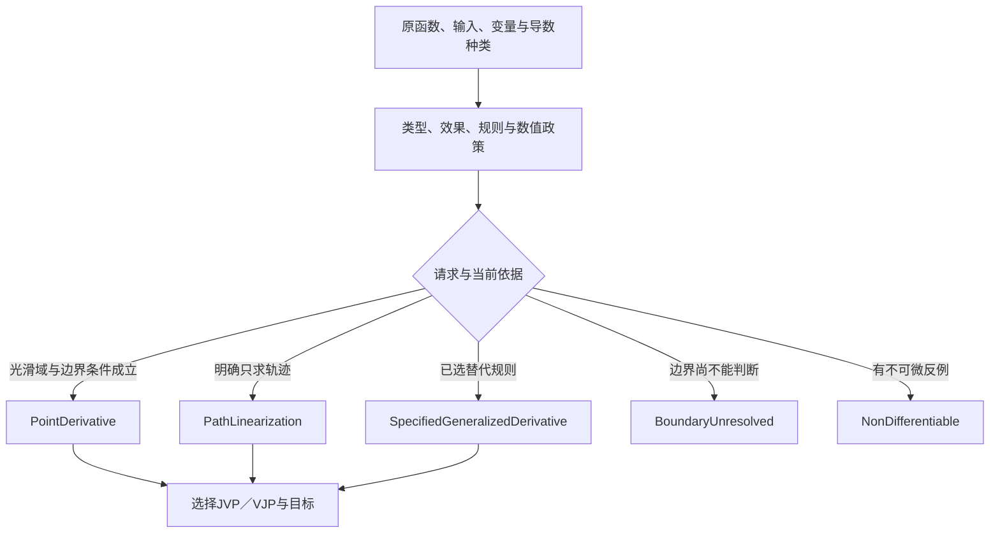
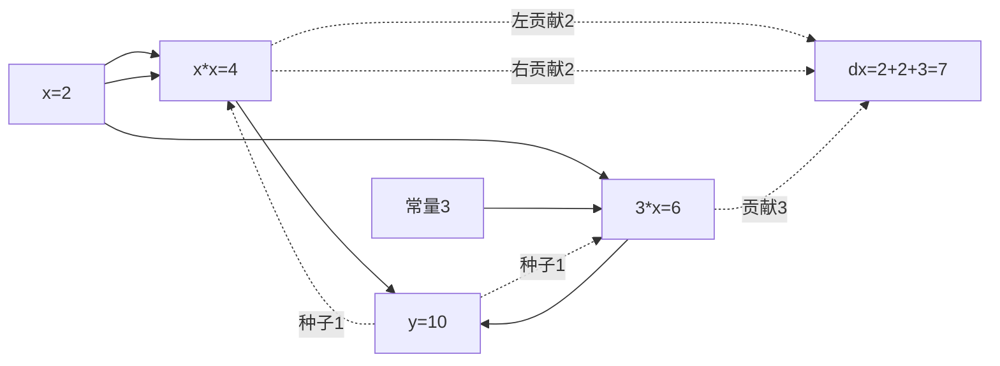
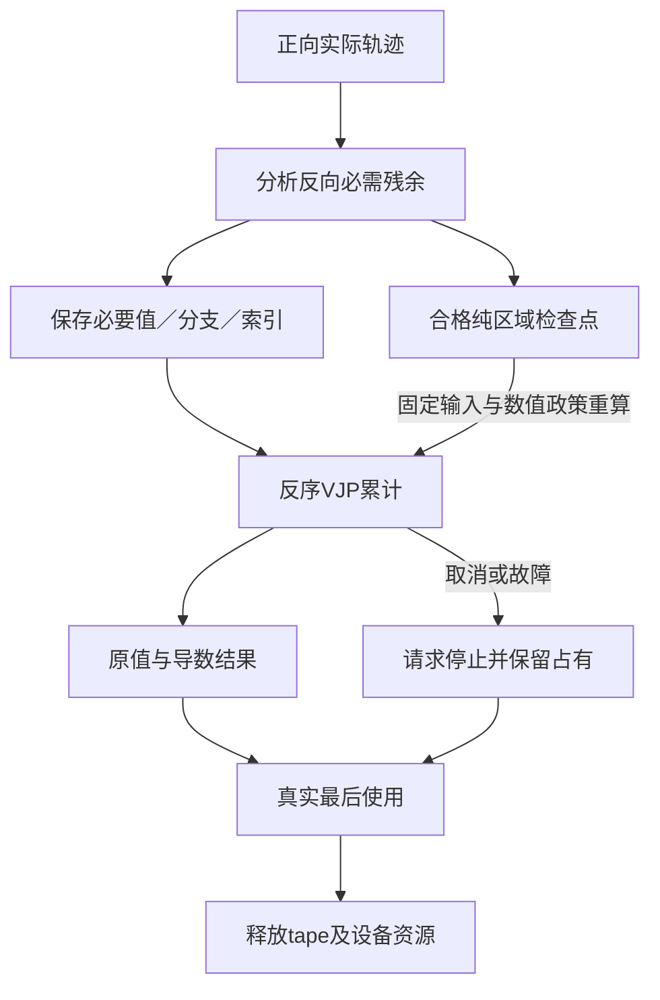

# 自动微分与数值线性化

> **阅读范围**：采用范围内的设计规范；实现状态另查未决。

<details>
<summary>本页内容</summary>

- [要计算的到底是什么](#要计算的到底是什么)
- [有限API与作者写法](#有限api与作者写法)
- [原函数资格与方法选择](#原函数资格与方法选择)
- [前向算法：每个原值连同切向量推进](#前向算法每个原值连同切向量推进)
- [反向算法：保存必要残余，反序累计](#反向算法保存必要残余反序累计)
- [分支、不可微点与数值故障](#分支不可微点与数值故障)
- [循环、状态、随机与其他扩展](#循环状态随机与其他扩展)
- [内存、检查点、设备与取消](#内存检查点设备与取消)
- [实现接合与升级](#实现接合与升级)
- [独立复核与剩余范围](#独立复核与剩余范围)
- [原计算与导数计算的失败顺序](#原计算与导数计算的失败顺序)

</details>


本章拥有可选择的 `sec.autodiff/1` 与普通库 `sec/ad`：原函数与导数的区别、有限类型与API、前向/反向算法、分支、状态随机性、tape寿命、检查点与目标保持。没有求导要求就不生成导数、tape或新的运行设施。中立 `Int` 继续是精确整数，不因为使用微分就被悄悄转换为浮点。

## 要计算的到底是什么

先固定原函数、输入域、输入/输出空间、求导变量、被固定的参数和导数定义。前向导数、转置作用、标量梯度、复数导数、有限差分和某个统计估计量不是同一对象。

有限画像先支持实值标量与有限、形状明确的实值容器；基础数制通过 `sec/f64` 的名义类型 `F64` 与显式运算提供。F64采用选定目标的IEEE二进制64位舍入运算；普通`+`等基础Int运算不被此库导入重载。`f64.fromInt`只在整数能够精确且有限表示时取得值，否则返回明确数值转换故障；不以宿主number字面量隐式填充中立Int。

AD生成的量通常是所选实函数模型的导数在浮点中的计算，不是“浮点离散映射处处的精确数学导数”。原程序舍入、溢出和分支都要记录相应数值政策。两个结论分开：**实模型的导数关系正确**与**这次浮点结果具有怎样的数值误差**。没有误差分析就不签发精确误差界。

### 导数资格有明确区分

- **PointDerivative**：在声明输入点与域上满足所选数学导数要求；守卫和不可微点需要对应条件。
- **PathLinearization**：沿本次选择的可微运算轨迹传播得到的线性映射；不自动证明跨分支的整个函数在该点可微。
- **SpecifiedGeneralizedDerivative**：用户或库明确指定的次梯度、直通估计等替代量，不能贴成普通导数。

普通 `valueAndGrad` 请求PointDerivative；控制或边界条件无法支撑时返回具体 `BoundaryUnresolved`，不是默默返回另一种量。需要本次路径线性化时显式选择 `linearizePath`。已存在可信的光滑域合同可继承，不要求每次运行重新证明全部数学。

## 有限API与作者写法

| 定义 | 签名与结果 | 使用条件 |
|---|---|---|
| `valueAndGrad` | `(F64)->F64 !{}, F64 -> Result<ScalarGradient, AdError>` | 单实变量标量输出，PointDerivative，默认有限数值 |
| `jvp` | 函数、原输入、同形切向量、显式空间见证 -> 原值与输出切向量 | 输入/切向量结构和值域匹配 |
| `vjp` | 函数、原输入、输出余切向量、空间见证 -> 原值与输入余切向量 | 以一次正向与一次反向为生命周期，不向外泄露默认tape |
| `linearizePath` | 函数、输入、指定模式与空间 -> 标记为PathLinearization的结果 | 不从路径结果推导全函数可微 |
| `withRule` | 精确函数定义、原值规则、JVP/VJP规则及条件 | 注册规则进入EngineImage与实际依赖，不授予正确性 |

`ScalarGradient`至少包含primal和gradient；其函数/输入/模式/数值政策及结果资格由类型化结果和运行记录关联，普通作者不用手填一张证明表。`AdError`区分PrimalFailure、UnsupportedDerivative、BoundaryUnresolved、NonDifferentiable、ShapeMismatch、NumericFailure、BudgetExceeded与Cancelled。只有有反证的非可微才能返回NonDifferentiable；不知道不能冒称不存在导数。

高维空间通过 `Space<X,DX>` 实现零元、线性相加、缩放和结构校验；余切采用名义包装 `Cotangent<DX>`，不把切向量和余切的物理数组相同当成角色相同。坐标单位和配对固定在Space中，标量gradient采用该声明坐标的标准内积；不暗中选择其他几何度量。标量、固定形记录与有限列表可以由合格方法派生。动态列表长度在实际输入处核对，不能将未选的形状特化当成源语言限制。容器梯度保持字段和位置，不因稀疏物理表示而丢掉必需的零项；需要稀疏梯度时另声明输出表示。

精确的通用入口按下列签名实现；所用记录和名义包装由库公开，名称不是附加工具：

```text
jvp<X,DX,Y,DY>(f:(X)->Y !{}, x:X, dx:DX,
  input:Space<X,DX>, output:Space<Y,DY>)
  -> Result<{primal:Y, tangent:DY}, AdError>
vjp<X,DX,Y,DY>(f:(X)->Y !{}, x:X, dy:Cotangent<DY>,
  input:Space<X,DX>, output:Space<Y,DY>)
  -> Result<{primal:Y, cotangent:Cotangent<DX>}, AdError>
```

Space的派生合同至少定义结构/形状校验、zerosLike、add、scale与余切配对；输入点、方向和输出种子的结构都需验证。`withRule`构造一份DerivativeRule声明值，只有明确被当前装配采用才生效，不通过导入顺序修改全球导数表。函数体中的f64故障由此次求导边界分类为原值或反向数值失败，已发生外部作用不会被一个Result抹掉。

```sec
import "sec/f64" as f64;
import "sec/ad" as ad;

export fn polynomial(x: f64.F64) -> f64.F64 =
  f64.add(
    f64.mul(x, x),
    f64.mul(f64.fromInt(3), x)
  );

export fn inspectAtTwo() -> Result<ad.ScalarGradient, ad.AdError> =
  ad.valueAndGrad(polynomial, f64.fromInt(2));
```

这段现有函数语法通过普通库表达 `x²+3x`。在x=2处，原值10，导数7；这些整数在选定运算中可精确表示。这是独立数学预期，不是本次已经运行的结果。没有新增嵌套作者前端，f64库只是明确的数值操作；以后增加浮点字面量或运算符便利写法，须独立定义而不由此范本暗增。

## 原函数资格与方法选择

<a id="fig-ad-qualification"></a>

### 图解：请求的导数与可给出的结论分别判断

路径线性化不是对所有分支的导数证明；边界无法确定和确证不可微是两种结果。



编译器先链接真实定义和捕获，建立类型、效果与求导活动分析；与求导无关但原程序确实执行的计算仍保留。把停止梯度标记当成“删除该运算”会改变原值和错误，是不合法的。

有限默认接受没有外部效果的可见函数，或拥有明确导数规则的外部数学原语。纯函数可能出错或不终止；求导运行的终止与预算仍由实际输入和程序承担。读取时间、网络、文件、可变外部对象与隐式随机源不直接进入重算区域。

函数通过参数或对象槽动态选择时，需要它实际可能采用的导数方法与对应契约；静态集合已闭合可以生成相应分派。开放的原生函数指针没有导数规则就报告准确缺项。不能用数值采样猜一个导数后将其记为正式规则，也不能把一个函数签名当作完整导数。

选择前向或反向的依据是输入、输出自由度与所需JVP/VJP，不以“反向更先进”一律使用。标量输出、大量输入常适合反向；少量方向的JVP可以前向。已有合格绑定直接复用；计算计划选择不改变请求的导数量。

JAX对JVP和VJP的定义、前反模式及组合有明确接口，可作为实现依据；Enzyme可在其实际支持的LLVM程序范围生成导数。它们不替SEC的类型/效果翻译、ABI、分支资格和用户目标自动担保。[JAX自动微分](https://docs.jax.dev/en/latest/notebooks/autodiff_cookbook.html) [Enzyme](https://enzyme.mit.edu/)

## 前向算法：每个原值连同切向量推进

F0固定函数、输入、求导变量、数值和结果合同，检查空间和方法。F1按原求值顺序执行运算，同时传播切向量：常数切向为零；输入切向由请求给出；加法相加；乘法使用 `dy = b·da + a·db`；其他运算只用已绑定规则。F2保留原分支、调用和错误次序；原值失败先返回PrimalFailure，不生成伪正常导数。切向先失败时按[双通道裁决](#ad-fault-precedence)保存导数故障并继续有资格的原值路径，不在F1抢先返回导数错误。F3核请求的可微条件和数值结果，返回准确资格。

切向量不是额外一次原函数调用。多个使用点各自贡献，传递同一个输入变量时不能因只看到一个节点就丢掉其中一项。原函数不使用某个输入，零导数也要由实际依赖和求导规则取得，不能因为输入被某个黑盒吃掉就猜为零。

## 反向算法：保存必要残余，反序累计

R0在原函数的正常求值顺序中形成有限执行轨迹，记录每项反向规则真正需要的残余值、实际分支、循环次数与必要索引。R1原值完成后建立输出余切种子；标量梯度种子为1。R2按依赖反序应用VJP，将贡献**累加**到输入出现对应的余切槽。R3引用和共享值按真实绑定归并贡献，函数重复调用按真实激活区分；不能按源码相同把两次调用合成一次。R4返回后释放不再需要的tape与设备内容；中途失败同样进入实际清理。

对 `x*x + 3*x`：乘法两个输入均指x，贡献各为x；另一项贡献3，所以x=2时2+2+3=7。错误地覆盖累计槽可能只留下2或3，类型检查不会自动发现。

默认 `vjp` 在一次调用内消耗tape，避免先交付一个可以无界重复使用的pullback再忽略内存。真正需要重复pullback的能力应当返回明确拥有、次数/寿命和取消合同的句柄；当前不以普通可复制函数值隐藏设备资源。

## 分支、不可微点与数值故障

<a id="fig-ad-reverse"></a>

### 图解：x平方加3x的正向与反向贡献

实线为原值，虚线为余切贡献。两个乘法输入都指x，反向必须累加，不能后写覆盖。



`abs(x)`在x=0不可微；默认普通梯度返回NonDifferentiable。用户明确要求0或某个次梯度时，结果带替代导数身份，不与普通导数混用。

程序在某个点碰到分支边界，并不必然不可微。例如两个分支均为x²，整个函数可能光滑。无法证明边界关系时返回BoundaryUnresolved；有可靠等价/极限规则时才关闭该义务，不将保守不支持写成数学不存在。

对输入直接与精确阈值比较，可以根据点和域取得明确分支内部条件。比较涉及舍入累积值时，浮点比较结果不自动证明理想实模型的符号；需要相应误差/区间依据，或请求仅PathLinearization。此区别避免在阈值附近把错误分支的导数当成用户要求。

未选择分支的原运算和导数不提前运行。`if x>0 then log(x) else 0`在负值点的执行不应先对log负数求值。反向模式也不能先计算所有局部导数、再用零乘掉非法项，因为NaN和计算故障不一定被零抵消。

F64可存NaN/无穷的目标行为由数值画像明确；本AD默认有限输入、中间值与梯度。出现NaN、溢出或非法除法按实际阶段返回NumericFailure或PrimalFailure，不夹断成一个看似有限的梯度。数学上存在导数，不代表有限精度下已经得到足够准确的数值；估计、界和未确定分别呈现。

## 循环、状态、随机与其他扩展

有限实际循环可以记录次数并反传；源程序有递归不意味着编译阶段展开无限调用。超过轨迹/时间/内存预算，停止本次求导并返回未完成，不返回半条梯度作为完整结果。

内部可变数组可在有合法别名与写入分析时转为版本化值；旧值需要被保留或重算。无法证明原地写不破坏反向依赖时保留独立缓冲或拒绝该变换。对象读取若要参与求导，应先固定为明确输入或不可变快照；不能在反向阶段重新读取已经改变的对象。

固定次数迭代的导数，与对已收敛方程使用隐式微分不是同一量。选择后者须声明方程、解的条件、Jacobian可解性和误差范围；不因为它省tape就自动替换前者。当前有限画像默认微分实际程序，不自动采用隐式求导。

随机性若作为显式固定样本输入，可以求条件路径导数；对期望的梯度、重参数化或得分估计必须另有数学合同。固定seed本身也不足以证明不同分块和设备的抽样映射相同。状态、随机或副作用无法合法回放时，不使用检查点重算。

复数微分、分布导数、离散搜索的替代梯度和跨通信自动微分不是此实值有限范围的自动附带能力。缺项保留在对应模式/目标，不阻止独立的普通函数生成。

## 内存、检查点、设备与取消

tape成本由实际活跃残余、索引、控制轨迹、对齐与设备复制构成，不只按源码算子个数计量。活动分析可删去无需反向的残余，但不能删除原程序确实执行的效果或错误。释放依据真正最后使用和设备完成；取消等待结束不证明设备已经停止访问tape。

检查点在固定输入、规则、分支和数值政策下重算局部原值，用时间交换存储。只有重算合法且不会产生第二次外部作用时采用；同一个函数名称和相同输出摘要不足以证明中间舍入、随机样本与状态相同。JAX的rematerialization明确是重算与保存残余之间的取舍，不是无成本释放全部反向内存。[JAX检查点](https://docs.jax.dev/en/latest/gradient-checkpointing.html)

资源不足时可按已允许方案切换前向方向数、分块或检查点；若原任务指定精确VJP或禁止重算，不能换成近似数值差分凑一次成功。回收失败、目标崩溃、取消和结果已返回各自保留资源结算状态。新请求不重置已经消耗的预算。

## 实现接合与升级

<a id="fig-ad-tape"></a>

### 图解：反向残余、检查点与实际释放

保存和重算是互有代价的合法选择；取消等待不等于设备已不再访问tape。



semantics提供活动域、数值与导数资格；compiler选模式并生成成对原值/导数区域、残余与来源；adapters接合格数学库或AD后端；目标调用管理自己的tape。assurance分别检查导数规则、源变换保持、浮点结果与任务误差；不为每个标量建立永久证据节点。

一项导数规则升级会使真正消费它的导数产物失效；普通原值程序未变时不必全部失效。改变函数、数值模式、checkpoint或捕获，需要按真实依赖重建；新版本不能继续使用旧tape。原值和梯度结果绑定同一次实际输入，不能混用上次成功原值与本次梯度。

## 独立复核与剩余范围

| 情形 | 独立预期或检查 |
|---|---|
| x²+3x，x=2 | 值10、导数7；两个x使用点均贡献 |
| 常函数 | 对声明变量导数零，原函数错误语义仍保留 |
| abs在0 | 默认NonDifferentiable；明确次梯度另列结果种类 |
| 边界两分支都是x² | 不凭边界标签就断言不可微；可证明则通过，否则BoundaryUnresolved |
| 未选分支含非法log | 不执行该分支或其导数 |
| jvp输入切向量形状错误 | ShapeMismatch，不广播补零 |
| 反向tape超额 | BudgetExceeded，原输入和已经产生的实际作用如实处理 |
| 检查点重读变化对象 | 拒绝重算资格，固定快照或保存残余 |
| finite difference与AD不一致 | 分析步长、舍入、不可微点和规则，不以二者同源结果代签 |

现成求导器和测试可复用，但新增类型映射、导数资格、控制流、原地数组、目标数值和资源接缝仍需自己的符合性。当前已经给出有限API与算法；实际库、变换和后端尚待实现核验。更广数学与目标不是永久关闭，也不作为普通工具的前置。

<a id="ad-fault-precedence"></a>
## 原计算与导数计算的失败顺序

已有F0—F3/R0—R4的原计算优先，具体按下列阶段执行；不能只在说明里说“PrimalFailure优先”，实现却在第一个切向溢出处提前退出。输入/方法不合格与运行中出错分别处理，未实际执行的原程序不伪报成功或失败。

**A0 启动前检查。** 检查已选AD模式、类型/形状、seed/Space、函数及导数规则的可用性与资源资格。明确的结构不支持、无权调用或seed形状错误可在运行前返回相应错误，不为了得到一个PrimalFailure先执行不合格函数。有限默认的seed/输入数值表示也在此核验；原程序中尚未执行的表达式不能通过静态猜测宣告其运行失败。

**A1 前向JVP双通道。** 原值计算使用原语义次序，切向值独立保存为`Valid(tangent)`或`Unavailable(首个导数故障定位)`。原值所需计算不从切向通道读取。实际切向运算出现NumericFailure、所走路径的导数规则失败或边界未决时，记录第一个该模式/规则遍历中的导数故障；依赖它的后续导数不继续计算，不用0、NaN或未初始化值冒充切向。原值路径继续按原规则运行，直到真实完成、原值Fault、调用方取消或宿主预算终止。

**A2 裁决。** 原值Fault返回PrimalFailure及真实定位，可以将已观察导数问题保留为次要诊断，但不得让它取代原故障。原值正常完成才检查导数通道：无故障返回准确的primal/tangent，有故障返回对应AdError且不宣称梯度成功。原值未结束即取消、超预算或目标失联，只报告实际的中断与已知范围；不为追求错误优先无限继续原程序，也不把“尚未看见原失败”当原值成功。原程序自身除零/非有限结果归PrimalFailure；仅变换产生的切向/反向数值失败归NumericFailure，其阶段信息保留。

**A3 反向VJP。** 原计算与残余捕获先按R0结束；只在其成功并且seed有效后进入反向。残余存储预算耗尽是本次AD运行不能完成，不说明原数学函数无定义。R2中的多个导数失败按所选反向计划的固定依赖/遍历处理，不冒称其出现顺序必与JVP或源码行号相同。共享贡献累加的每一次运算仍受数值政策约束；部分反向结果不能包装为成功cotangent。

**A4 规则边界。** 可将导数故障编码为有类型内部值，或使用真正保持同含义的目标异常捕获，但仅捕获已经声明为导数通道的故障；不能吞掉取消、内存耗尽、进程崩溃或原计算异常。自定义导数规则不得影响后续primal分支、写共享状态或自行开始未授权效果。只能获得一个会先失败且丢失原计算状态的黑盒JVP时，不宣称它支持该错误优先画像；可以用合格的分离规则/可保留残余方案，或准确返回能力缺项，不靠再跑一个可能有不同外部观察的f猜回来。

**A5 活动性与优化。** `stopGradient`以及已证明与所需导数无关的值不创建无用切向计算；不能故意先算一个已知不需要的导数，再因它溢出拒绝整个请求。反过来，不能在变换后通过消掉有可观察失败的原值运算伪造成功。若普通程序按顺序算y再以其构造后续式，必须保留原求值约束。JVP/VJP融合、向量化、设备内核和检查点均要保留本画像的两通道与中断范围；数学公式相同不是错误语义等价的证明。

**可复算反例。** f依次计算`y=2*x`、`z=1/(x-x)`、`y+z`，x=1且有限切向seed dx=1e308。原第一步y=2可表示；切向第一步2e308超过本画像有限F64范围；随后原计算分母为0，必须得到PrimalFailure而非提前NumericFailure。若f只有`2*x`，原值成功而切向失败，则为NumericFailure；若后续原计算不终止，到达实际预算则BudgetExceeded，而不是声称原值通过。这个例子说明两阶段裁决，不是高精度近似的经验测试。

JAX checkify的直接资料说明原值检查和变换后导数计算检查是不同对象；它不为SEC规定这里的优先顺序。本合同的依据、目标适配限制及有限差分验证边界见[信号和微分错误分层](../../依据/来源/对象流与微分.md#ordered-signal-and-ad-error-sources)。已有正常例`x*x+3*x`、未选非法分支、分段边界及残余生命周期全部继续适用。
