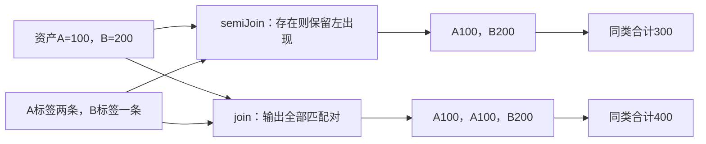
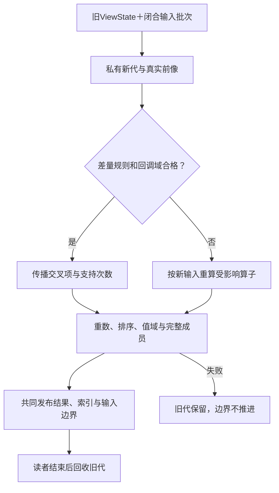

# 关系查询与增量维护

> **阅读范围**：采用范围内的设计规范；实现状态另查未决。

<details>
<summary>本页内容</summary>

- [范围与本次决定](#范围与本次决定)
- [1. 三种容易混淆的查询与三种顺序](#1-三种容易混淆的查询与三种顺序)
- [2. 值、相等、规范遍历和封装](#2-值相等规范遍历和封装)
- [3. 有限公开库与普通作者方式](#3-有限公开库与普通作者方式)
- [4. 正常执行与静态提取，不靠运行任意工程脚本](#4-正常执行与静态提取不靠运行任意工程脚本)
- [5. 当前选定的正确基线算法](#5-当前选定的正确基线算法)
- [6. 优化与源到SQL映射必须保持哪几个区别](#6-优化与源到sql映射必须保持哪几个区别)
- [7. 数据源、权限、快照与分页](#7-数据源权限快照与分页)
- [8. 增删维护：先定义状态差量，再选择增量算法](#8-增删维护先定义状态差量再选择增量算法)
- [9. 有限递归与删除：一个可实施子域](#9-有限递归与删除一个可实施子域)
- [10. 与整个SEC的实际交接](#10-与整个sec的实际交接)
- [11. 成熟实现的实际复用与剩余验证](#11-成熟实现的实际复用与剩余验证)
- [12. 可独立核对的正常与反例表](#12-可独立核对的正常与反例表)
- [13. 当前选择的代价、未完成范围与重开条件](#13-当前选择的代价未完成范围与重开条件)
- [资料、采用位置与范围](#资料采用位置与范围)

</details>


本章拥有有限关系查询的作者合同、值与缺失语义、正常求值、计划变换、源适配、完整结果、增删维护与退出。它消费[基础语言](../../作者/可替换表示与适用范围.md)、[结构作者](../../作者/组合/结构编辑与身份保持.md)、[共同模块](../../架构/装配/模块与运行实例.md)与[领域方法](../../编译/内核/领域方法与整体根.md#领域方法的共同调用协议)。`sec.relation/1` 与库 `sec/relation` 按本章的有限合同解释。

## 范围与本次决定

本章规定：有限不可变输入上的多重集、过滤、映射、内外连接、存在与反存在、集合运算、分组归约、确定排序与截取；相交的数据库只读适配和有界增量维护。输入可以是工程资产清单、依赖记录、表格数据或已经取得的数据库快照，不以数据库、业务身份或持续服务为前置。

本领域已有计算方法的基线是普通调用与正确的本地完整求值；产品可以直接引用对应关系需求而不展开此实现；有可检查的规则时再优化，已有合格数据库或增量提供者可以复用。不重新制造通用SQL数据库，不要求手写关系树，不让普通库导入变成一次查询或联网。基础语言词法、两份EBNF和六个工具均不因本章变化；新增的是库、领域检查与适配合同，不用“零关键词”冒称零实现成本。

不将本章有限批次协议冒称任意流查询、时间窗口、任意递归Datalog、概率查询、全部SQL方言或跨节点强快照。具体高级缺项继续留在U039/U040；已有基础语言能够直接写出的算法不受这些库覆盖范围封锁。

## 1. 三种容易混淆的查询与三种顺序

**开发查询**是`sec.query`对作者、引用、影响和当前工具结果的读取。**程序查询**是目标程序按本库计算数据的行为。**编译查询**是编译器按输入键复用分析结果。它们可以共用一些不可变内容设施，但不共享行更新、权限、缓存键或完成状态。

| 顺序 | 当前含义 | 不能代替什么 |
|---|---|---|
| 作者与回调求值顺序 | 固定语言决定实参求值，库决定遍历及回调的参照次序 | 无序结果不授予任意重排会失败的计算 |
| 关系结果 | `Bag<T>`表示值到非负整数重数的有限映射，不承诺输入行的业务顺序 | 不等于List，不自动按主键唯一 |
| 结果呈现顺序 | `Ordered<T>`保存已明确的排序关系；`toList`才得到位置有意义的列表 | 数据库扫描顺序、哈希桶顺序和worker先后都不成为作者排序 |

把列表转换成关系是明确的无序化动作。需要保留输入位置时，继续使用`sec/seq`，或在转换前显式把位置作为值字段。不得把`Bag`反打印成普通列表并让下游误认位置有业务含义。

两个相同值可有重数2；这不要求创建两个永久全局实体。需要分别更新两条物理记录时，源适配器使用真实行键与版本，再将替换降低为旧值-1、新值+1。没有来源身份而只有两个完全相同值时，不声称可以区分“删哪一物理行”。

## 2. 值、相等、规范遍历和封装

### 2.1 精确的有限多重集

对固定行类型T，`m_R(v)`表示值v在关系R中的重数，取非负数学整数，只有有限个非零项；`|R|=Σ_v m_R(v)`按重数计数。内部允许压缩为值/重数对。物理哈希不是相等证明，碰撞后仍按相应值规则比较。

当前默认值操作可为Unit、Bool、Int、Text、Bytes及其有限无环的列表、Option、Result、公开记录与和类型组合派生。记录的类型身份、字段身份及顺序来自固定类型合同；匿名结构按其规范字段角色，不用运行对象地址。Text按Unicode标量精确比较，不做大小写折叠或规范化；Int按数学值比较，不按十进制字符串字典序。不同名义类型不因布局相同相等。函数、资源、原生动态对象以及未开放操作的opaque值，不自动获得默认比较或编码。

**`ValueOps<T>`**是有类型的值操作见证，承担equal、compare、encode与版本/表示依据；可由固定类型派生，也可由有权定义者显式提供。compare为全序，等价类与equal及规范编码一致；encode不是摘要。默认顺序：Unit唯一；Bool为false在前；Int数值升序；Text逐标量、Bytes逐字节，前缀在前；列表逐元素；Option中None在Some之前；变体按固定声明角色及字段；记录按固定字段角色逐项比较。外部需要别的业务相等时，先显式投影成规范业务键；业务排序使用显式排序键。值见证必须实现T已接受的值相等，不能把作者仍能用字段或函数区分的两个T值合并。例如Text中的A与a不能仅因某见证忽略大小写而被rows合成一个值；需要忽略大小写去重时，先定义规范化键及保留代表值的政策。见证用于实现既定语义，不是隐式改变相等的第二套语言。

ValueOps的逻辑接口为`equal:(T,T)->Bool !{}`、`compare:(T,T)->Int !{}`、`encode:(T)->Bytes !{}`；compare只接受-1、0、1，0当且仅当equal；规范编码相同当且仅当值相等。其语义身份与解释/表示版本由实际绑定保存，不要求普通作者填hash。相等函数必须反身、对称、传递，比较必须全序一致；所有实际比较/编码必须在声明域内有定义、确定且无外部效果。不同编码不自动代表不兼容语义，但union等跨Bag使用前要有明确兼容见证或重新编码，不能拿两个独立字典直接混桶。

这份见证不要求每次用户填写。闭合具体类型的`rows`可由编译器生成普通比较/编码函数或字典传递；没有有限具体类型的泛型代码使用`rowsWith`显式传递ValueOps，或等待对应实例化。此为库方法的合格性要求，不增加未经设计的核心Eq/typeclass语法，不在不满足时退成Any或运行反射猜测。任意自定义见证的全序/纯净/终止性不能靠有限采样认证；缺可信合同只限制依赖这些性质的操作与优化，原生或普通顺序算法仍有自己的路径。

### 2.2 无序结果仍有可解释的错误次序

本库参照实现按ValueOps规范顺序遍历不同值，按重数展开相同值的逻辑出现。节点按作者调用和有序子输入先完成后使用；回调依该节点规定的遍历顺序执行，返回正常值或第一项实际失败。`rows`先求其List实参并检查值结构，再无序化；它不能删除上游构造List时的作用。

过滤、映射、连接、分组等回调必须满足空外部效果上界，但仍可能有契约失败、除零、非终止或资源耗尽。未证明相关定义性时，保留参照求值或等价的有序屏障，不能以“纯”批准任意代数重写。保持错误范围与顺序是最低规则；实际资源不足和取消按运行控制返回，不把预算通过当作程序终止证明。

默认每个对外结果在该根完整计算后发布。可以在内部流化和复用缓冲，但不将半份列表、部分重数或尚未完成的求值结果冒充完整关系。确需流式对外输出采用独立流合同，不在本章偷偷增加一项默认流语义。

### 2.3 四种缺失不合并

| 情况 | 当前表示和处理 |
|---|---|
| 行中值有意不存在 | 类型中的`Option.None()`，是正常数据 |
| 外连接没有匹配行 | 整个右行`Option.None()`；真实右行可以是`Some({field:None()})` |
| 行解码缺少必需字段或类型不对 | 输入/提供者格式错误，不补None |
| 没有权限、输入没取全、快照丢失 | 对应方法/执行缺口，不伪造空关系 |

本库布尔条件为Bool；Option不自动转成Bool。`Option.None()==Option.None()`只在相应类型具有合格相等时按值为真，不采用SQL三值逻辑。来源本来就是SQL语义时，通过SQL画像保全；中立程序使用本章合同，二者不能因为都叫NULL而合并。

## 3. 有限公开库与普通作者方式

以下为完整的本次导出组。表内T/U/K/A为类型变量，`Bag<T>`和`Ordered<T>`为本库抽象值，回调除写明外均为空外部效果。涉及输出值的比较/编码沿第2节；派生不了时使用显式见证或给对应方法缺项，而非暗增类型能力。

| 函数与逻辑签名 | 精确含义与参照处理 |
|---|---|
| `rows<T>(xs: List<T>) -> Bag<T>` | 对闭合合格值类型建立关系；保留重数，舍弃业务顺序 |
| `rowsWith<T>(xs: List<T>, values: ValueOps<T>) -> Bag<T>` | 显式值见证入口；隐私、版本与可信范围随实际见证 |
| `filter<T>(q: Bag<T>, p: (T)->Bool) -> Bag<T>` | 逐逻辑出现判断；只保留true，重数不变 |
| `map<T,U>(q: Bag<T>, f: (T)->U) -> Bag<U>` | 每项产生一个输出；相同输出累加重数，不自动distinct |
| `mapWith<T,U>(q, f, values:ValueOps<U>) -> Bag<U>` | 输出U无法从固定类型派生时显式给出合格见证；其他语义同map |
| `flatMap<T,U>(q: Bag<T>, f: (T)->Bag<U>) -> Bag<U>` | 按父重数累加子关系；已捕获源可用，不隐式执行每行远程查询 |
| `flatMapWith<T,U>(q, f, values:ValueOps<U>) -> Bag<U>` | 所有返回Bag必须与指定U见证兼容；空输入也明确输出的值语义 |
| `join<L,R>(left: Bag<L>, right: Bag<R>, on:(L,R)->Bool) -> Bag<{left:L,right:R}>` | 左规范次序外循环、右次序内循环；保留每个匹配对，重复数相乘 |
| `leftJoin<L,R>(left, right, on) -> Bag<{left:L,right:Option<R>}>` | 每个左出现检查全部右出现；有匹配输出Some；没有才输出一次None |
| `semiJoin<L,R>(left, right, on) -> Bag<L>` | 每个左出现按右顺序找到首个真即保留一次；多个右匹配不复制左行 |
| `antiJoin<L,R>(left, right, on) -> Bag<L>` | 同样查找，只有无匹配才保留；未完成右域不能证明无匹配 |
| `unionAll<T>(a:Bag<T>, b:Bag<T>) -> Bag<T>` | 先求a再b，结果重数相加 |
| `distinct<T>(q:Bag<T>) -> Bag<T>` | 正重数变成1，零仍零；不修改行值 |
| `intersectAll<T>(a,b) -> Bag<T>` | 每值重数取min |
| `exceptAll<T>(a,b) -> Bag<T>` | 每值重数取max(a-b,0)；不是删除该值的全部出现 |
| `groupBy<T,K,A>(q, key:(T)->K, reduce:(Bag<T>)->A) -> Bag<{key:K,value:A}>` | 先在规范遍历中计算键，按键建立非空组；按键规范次序调用reduce，每组恰一输出 |
| `groupByWith<T,K,A>(q,key,reduce,keys:ValueOps<K>,values:ValueOps<A>) -> Bag<{key:K,value:A}>` | 显式给键和聚合结果的见证；组合结果见证由本库派生，组内T使用输入见证 |
| `count<T>(q:Bag<T>) -> Int` | 返回总重数；空关系为0 |
| `sumInt<T>(q:Bag<T>, value:(T)->Int) -> Int` | 按逻辑出现求整数并精确相加，空为0；不隐式跳过Option |
| `minInt<T>(q,value) / maxInt<T>(q,value) -> Option<Int>` | 非空取相应极值，空返回None |
| `meanRatio<T>(q,value) -> Option<{numerator:Int,denominator:Int}>` | 空None；非空分子为精确和、分母为总重数，不暗选浮点/舍入，不要求约分 |
| `fold<T,A>(q, initial:A, step:(A,T)->A) -> A` | 按规范关系遍历顺序折叠，初值先求；未给合并法和保持依据时不并行归约 |
| `orderBy<T,K>(q, key:(T)->K) -> Ordered<T>` | 键按规范次序计算；按键升序。不同完整行同键视为欠指定，返回OrderAmbiguous；相同行重复不形成歧义 |
| `orderByDescending<T,K>(q,key) -> Ordered<T>` | 显式降序；其余同orderBy，不借未声明默认参数扩语法 |
| `orderByWith<T,K>(q,key,keys:ValueOps<K>) / orderByDescendingWith<T,K>(q,key,keys) -> Ordered<T>` | 泛型或封装排序键显式传见证；同键歧义规则不变 |
| `take<T>(q:Ordered<T>, n:Int) -> Ordered<T>` | n非负，保留前min(n,总重数)项；无序Bag不能直接截取 |
| `toList<T>(q:Ordered<T>) -> List<T>` | 按指定次序展开重数，得到完整新列表 |
| `canonicalRows<T>(q:Bag<T>) -> List<T>` | 明确要求按ValueOps值顺序导出，不伪称原输入顺序；只在调用者确实接受该次序时用 |

省略见证的便利函数仅在输出/键类型闭合且派生已确定时成立；显式With版本是同一合同的普通库函数，不是另一个编译入口。已有Bag携带相应值操作的固定绑定，filter、join、leftJoin和同型集合运算可以复用或组合它。flatMap返回的每份Bag仍核兼容，不以首次实际回调结果决定空输入时的类型语义。任意泛型主体不因某次使用可行就默认对所有类型可行。

聚合的空输入是本库的明确选择，不从SQL函数名称继承。`groupBy(empty,...)`没有组，因此结果为空；对整个关系执行`count/sumInt`则分别返回0。需要即使无数据也保留一项的报表，以维度关系左连接聚合结果后显式填值，不能让groupBy自行发明分组。

没有提供right/full Join专名，不妨碍组合：交换左右可以表示右外连接；完整外连接可以由左外连接与右反连接等构造，组合必须保留类型、行重数和错误顺序。当前不将这些派生规律当成可无条件重排不完整回调的证明。需要方便入口时可由用户库封装，不新增核心语法。

### 3.1 一个完整作者程序：包资源按种类统计

目标：只统计带`release`标签的资产，每条资产只计一次，即使它有重复的匹配标签；按种类求字节数并明确排序。资产清单本身存在的重复项不偷偷去掉，它是否应按id唯一是独立来源合同。

```sec
import "sec/relation" as rel;

export type Asset = { id: Text, kind: Text, bytes: Int };
export type Tag = { assetId: Text, name: Text };
export type Total = { kind: Text, bytes: Int };

export fn releaseTotals(assets: List<Asset>, tags: List<Tag>) -> List<Total> = {
  let selectedTags = rel.filter(rel.rows(tags), (t: Tag) => t.name == "release");
  let selected = rel.semiJoin(
    rel.rows(assets), selectedTags,
    (a: Asset, t: Tag) => a.id == t.assetId
  );
  let groups = rel.groupBy(
    selected, (a: Asset) => a.kind,
    (g: rel.Bag<Asset>) => rel.sumInt(g, (a: Asset) => a.bytes)
  );
  let report: rel.Bag<Total> = rel.map(groups,
    (g: { key: Text, value: Int }) => { kind: g.key, bytes: g.value }
  );
  rel.toList(rel.orderBy(report, (r: Total) => r.kind))
};
```

这里使用现有函数、记录、块、lambda、导入与泛型库类型；没有隐藏SQL字符串、目标代码生成脚本、数据库或审批流程。类型与词法绑定由基础前端获得，关系方法只增加自己的合格性检查。若某类回调无法被目标SQL表达，仍可生成普通目标循环或合法本地处理；不能要求用户重新用原生源码实现同一个算法。

输入资产是A=image/100、B=image/200、C=text/50。标签是A/release两次、B/release一次、C/draft一次。预期只有`{kind:"image",bytes:300}`。把semiJoin误换join，A被计两次，结果400；在错误的400后加distinct并不会修复总和。输入为空，结果为空而不是一条虚构种类。资产值域若要求bytes非负，放在真实Asset输入约束或数据提供者合同，不从字段名猜出。

修改标签选择只改谓词；要每份标签关联都计费，则明确将半连接改为内连接并对应调整后续选择，这是真实任务变化。修改目标库或算法而保持半连接语义，是实现变化。CSV列结构或图标没有变化时不重写它们。

## 4. 正常执行与静态提取，不靠运行任意工程脚本

### 4.1 值语义与派生计划

库函数先拥有上节普通、严格的参照含义：参数表达式遵循中立语言求值；已构造关系是不可变值。编译器在已绑定的库调用上提取`RelPlan`，保存实际函数绑定和捕获，不按名字猜`filter`。RelPlan是本领域既有语义的一份临时分析表示，不成为第二份作者源或新世界IR。

能静态获得闭合调用结构和回调表达式时，生成静态计划及目标循环。不能静态获得时，保留普通库调用及合法运行实现；不能为了提取计划在编译期执行任意用户函数。受限静态求值由MethodSpec明确允许的输入和预算承担。

`rows`接收运行时List参数完全合法，值以后到达不等于编译还缺数据。对真实数据库读取，先由源能力取得类型化快照或执行计划，再调用同一逻辑核；普通List参数不会仅因名称叫table就变成远程表。

### 4.2 计划节点和字段

节点的有限tag为Input、Filter、Map、FlatMap、Join、LeftJoin、SemiJoin、AntiJoin、UnionAll、Distinct、IntersectAll、ExceptAll、Group、ScalarAggregate、Order、Take、Collect。每项保存：输入引用及其顺序、结果类型/ValueOps、相交回调的准确绑定与捕获、表达式出现和来源。Input另有槽身份与模式，Join类有谓词，Group有key/reduce，ScalarAggregate有kind/参数，Order有key/direction，Take有n。

派生摘要保存重数/键/缺失/顺序、可能失败与定义性、源一致性、披露域、估计基数、资源与方法依据。它不是作者必须填写的字段全集。节点不得带新产生的权限、`verified:true`或随意SQL脚本使自己通过。结构体可以直接表达这些节点，回调复用`sec.semantic-body/1`中相应有限子域及可见绑定；不接受任意字符串当可执行条件。

### 4.3 Q0—Q7：固定输入到完成结果

**Q0 固定。**固定任务、源函数、EngineImage、参数/输入槽、输出根、解释/值操作、当前许可和预算。区分只生成与实际执行，不读取不相交来源。

**Q1 链接。**检查字段与别名的作用域、回调类型/效果、比较见证、必需输入和显式排序；同名字段以左右角色区分。只有正式来源或获准方法可以给来源覆盖与唯一性结论。

**Q2 建摘要。**沿节点建立重数、空值、键、顺序、定义性与故障关系。`semiJoin`不能被摘要成普通join；`None`不能被摘要成未取得数据。只有有依据的性质才供优化消费。

**Q3 选实现。**现有合格绑定优先；候选包括普通循环、桶索引/排序算法、被允许的SQL或成熟引擎。先硬过滤，再按完整成本比较。缺方法限制该候选，不改用户值域或私自安装依赖。

**Q4 取得输入。**纯参数已经固定时直接用。真实源执行需要当前准入、精确模式与快照/读取合同。需要多页时绑定同一切面；多来源只有分别固定的向量时，只保证该向量计算，不虚构全局同时快照。

**Q5 求值。**根据选定计划取得正确完整结果；失败时原输入、旧维护快照和已发布结果不变。主线程取消不能自动说明外部游标/设备已停止。

**Q6 完成。**结果必须匹配类型、重数、所需顺序和成员范围。有限结果不存在、为空、缺输入、被拒、超预算、源错误和语义错误分别呈现，不用一个空List包住所有状态。

**Q7 交接。**仅发布完整结果或标明的设计候选；需要新维护状态时按下节原子代际发布。要写报表、触发操作或部署，继续由原execution负责；查询本身不是审批、提交或消息确认。

算法在有限输入、每个实际回调结束、提供者配合与预算足够时完成；对任意回调不保证终止。尚未能证明总终止不阻止生成普通程序，只限制改变求值路径的优化与某些目标方法。

## 5. 当前选定的正确基线算法

<a id="fig-relation-operators"></a>

### 图解：存在匹配与重复配对是两种行为

固定A有两条release标签；半连接保留左出现一次，内连接输出两次。排序与聚合随后执行，不能在错误总和后补distinct修复。



### 5.1 表示与索引

输入关系保存规范值/非负重数、ValueOps版本和必要来源。计算实例的数据与索引由目标运行拥有，不进入SEC作者候选库。初次实现可以使用普通目标语言的表、数组与有序索引，不先实现分布式数据流引擎。

哈希索引只加速定位，保留真实键值比较；没有哈希可用但有全序时用排序/树；两者均不能可靠取得则给具体能力缺项，而不是按打印字符串猜相等。键和行可以共享只读内容，但相同内容不使不同资源实例合并。中间重数可能很大，使用精确计数并在输出展开前核数量与字节预算，不溢出成负值。

### 5.2 各算子的正常算法

| 算子 | 当前基线 | 可选优化与所需前提 |
|---|---|---|
| filter/map | 按规范逻辑出现遍历，调用回调，按结果汇总 | 相同实参的纯成功结果可共享；改调用顺序/删除失败需要独立条件 |
| join | 左右双循环，谓词按左后右出现顺序调用，匹配输出 | 可安全取得等值键时建立桶，仍核残余谓词；预取右键不能触发原来在空左输入下不发生的失败 |
| leftJoin | 每个左出现记matched，遍历结束仍未匹配才输出None | 桶索引可用但必须保持每个匹配及无匹配行，不能只取首项 |
| semi/anti | 每个左出现扫描右域，到首个真即可结束该左检查 | 可信等值索引支持存在判断；谓词错误不能被当无匹配 |
| union/intersection/difference/distinct | 以相同ValueOps核键与重数，按精确定义计算 | 分区可并行，但编码/比较和结果故障保持 |
| groupBy | 计算每行键，形成非空组，再按键序执行reduce | 已知聚合族可使用局部状态；任意reduce保留组值并完整重算 |
| sum/count/min/max/meanRatio | 依公开规则处理重数，空集和Option明确 | 总和/计数可分块结合；整数表示必须覆盖实际中间范围 |
| orderBy | 先按规范关系顺序计算键，排序时只比较已得键；检查同键不同值 | 可利用同合同的已排序源；没有相应比较证据时不能免排或免查 |
| take/toList | 先完成上游，随后截取/展开所需完整结果 | top-k在保持上游定义性、顺序完整性和源读取条件时采用 |

如果N、M按重数计，双循环最多检查N×M个配对；输出自身也可能有N×M个出现，不能保证所有join线性。等值哈希实现的期望工作可分为读取、建桶与实际匹配输出，但最坏碰撞、长键、任意精度运算、序列化和源传输另计。排序比较规模为O(N log N)不代表每次比较常数成本。压缩重数减少物理存储，不消除实际要求完整输出时的展开成本。

### 5.3 结果与资源的归属

每次求值私有地构建新结果；只有相应输出根完成后发布。已发布Bag不可修改。中间内存可在所有消费者和实际外部使用结束后释放；重复引用相同值不强制深复制。

内存不足时先选择原任务允许的更小并发、合格迭代/重算或外排。外排写文件必须在目标运行许可、目录与保留合同内；不能因为查询是逻辑只读，就暗中获得落盘和上传权限。无合格路线则返回ResourceLimit，保持旧结果；不静默截断、降精度、采样或丢重复。

数据库取消后还要关闭/确认游标和会话；超时只停止调用方等待不是服务端已经停止。运行结果可以在条件允许时缓存，但不保存凭证原文；更新权限后先重新判断披露资格，再决定是否复用内容。

### 5.4 实现者直接消费的接口与结果

沿既有MethodSpec提供下列逻辑接口，不新增顶层运行服务。类型名仅表示本域内部责任，未来代码可按成品目录落位。

| 方法 | 固定输入 | 具体输出与失败 |
|---|---|---|
| `checkRelation` | 已绑定模块、库调用、捕获、ValueOps与源模式 | `RelPlan`及重数/缺失/顺序/定义性摘要，或准确语义诊断；缺真实输入返回原Needs |
| `qualifyPlan` | RelPlan、要求、可用目标方法与源能力 | 合格物理路线、必须保留的求值/安全屏障、codec和读集；没有方法返回对应根缺项 |
| `lowerRelation` | 合格路线、固定布局和目标 | 按原Contribution合同输出目标区域、依赖、必要辅助及来源；新区域重新接受相交检查 |
| `evaluateBatch` | 固定Bag输入、参数、Plan与资源 | 完整结果/准确错误/预算或取消，不更改旧结果；不在纯函数中取得数据库凭证 |
| `prepareDelta` | 旧ViewState、闭合DeltaBatch、Plan/codec | 私有新状态、结果差量、将要提交的输入边界，或保持旧代的错误；自己不更新公开头 |
| `publishView` | 合格新代与准确旧代、实际宿主 | 在原提交机制中切换结果/状态/边界，或冲突/未结算；不重做作者解释 |

HashJoinState至少包含两侧值/重数、合格键到值桶和版本；Semi/Anti另记右支持；Outer记录匹配与None支持；GroupState保存键到成员/聚合状态；OrderedState保存已得排序键、同键计数和需要的后继。未启用增量时不创建这些持久状态。同一内存池中的共享值只计实际分配一次，生成结果/索引引用尚活跃时不提前释放。

### 5.5 主例真正生成什么

对`releaseTotals`，字段读取、精确Text相等和Int相加在已校验有限值域内没有业务异常。取得这些条件后，可将关系组合降低为：建立release标签的assetId集合；遍历资产，每个已有输入出现只在id存在时加入kind的精确整数和；将不同kind及和组成结果；按明确的Text比较排序并输出。重复的标签只影响集合支持，不重复计费；重复资产按其输入重数继续计入。

TS目标可以使用普通Set/Map和BigInt，ValueOps中必要的Unicode标量比较由已绑定辅助实现；不能用UTF-16字符串比较暗换顺序。Java目标用相应集合与BigInteger及合格比较。公开`releaseTotals`、Asset/Tag/Total映射和布局保持；辅助代码同模块或已选库按实际需要安排，不强制生成一套查询服务、SQL连接或运行时JSON计划解释器。

数据库目标可生成参数化的EXISTS/分组查询，但只在Text、整数和聚合域映射合格时下推；不能为凑SQL而改变完整源值域。需要在本地排序时，只传合法可披露结果。文件输出属于另一个明确的资产动作，纯函数只返回值。

## 6. 优化与源到SQL映射必须保持哪几个区别

### 6.1 重写的具体条件

| 常见变换 | 可以采用的条件 | 会改变结果的反例 |
|---|---|---|
| filter下推 | 字段作用域正确、谓词在新求值域内定义且保持安全屏障 | 右侧过滤移过leftJoin会丢左侧无匹配行 |
| map/filter融合 | 保持调用次序或已知相交回调总且无观察差别 | 先filter掉x=0，再map 10/x，不等于先map |
| join重排 | 内连接的重数与类型保持；回调、错误、快照与资源条件合格 | 换顺序改变异常或引入未许可源读取 |
| join改semiJoin | 消费者只观察左行是否有匹配，不观察匹配次数或右值 | 标签重复导致sum从300变400 |
| 消除join | 真实唯一性、全存在性、空值、可见范围和副作用均满足 | 物理外键存在但权限过滤隐藏右行，不能删除可见性筛选 |
| 先聚合后连接 | 分组、键与重复倍数在整个连接中保持 | 连接多对多使计数/总和被倍增，不能只比字段类型 |
| top-k/limit下推 | 排序、并列处理、上游全部相关校验与外连接语义保持 | 严格`take(orderBy(map(...)),0)`仍要求先算上游；不能直接LIMIT 0吞掉原失败 |
| 共用中间结果 | 同源快照、参数、捕获、方法和读取/披露域合格 | 两个用户分别能读一半输入不是联合读取许可 |

估计基数、选择率和成本用来排序候选，不当成公理。真正硬资源上限只用可靠界或实际准入。合法计划保存空值、值域、顺序、输出位置、快照与已有索引等未来边界，不根据单算子更快删除全路线更优方案。

### 6.2 SQL布尔与源表达式的错误顺序

SEC的`x != 0 && 10 / x > 1`有左到右短路。SQL的布尔表达式可能由规划器重排，不能直接以字符串相同认为等价。`CASE`在某些表达式可保留分支，但常量折叠、聚合预计算及原生函数仍可能提前失败；不能宣布“全部包CASE就安全”。

当前SQL下推优先采用可证在当前输入域内总定义的受限表达式：字段、参数、合格数值运算、明确比较及总模式分支。不能证明或不支持的回调保留在本地有序阶段；源读取本身必须在原任务的数据和隐私约束内。没有可行本地回退时，报告该目标能力缺项，不能要求用户缩小原合法输入以迎合优化器。

### 6.3 Option、外连接与SQL NULL

普通SQL `=`遇NULL不是中立Option的值相等。对明确的单层`Option<NonNullScalar>`编码，本库的None相等需要适当的null-safe比较，例如已选PostgreSQL方言的`IS NOT DISTINCT FROM`；嵌套Option或记录缺失要按层保留tag/存在位，不能一律压成一个NULL。

leftJoin结果中的“无右行”必须有独立的右行presence标记。生成右子查询时添加受控TRUE标记；外连接后只有标记缺失才构造None。不能用一个可空业务字段判断是否匹配，否则真实右行所有字段为空时会被误认为不存在。优化器不得删除这个标记又失去区分。

`count(leftJoin(...))`对每个无匹配左出现也计1；统计右匹配次数需要显式选择右存在项后count。`NOT IN`含NULL的语义不等于本库antiJoin；降到`NOT EXISTS`或合法等价形式，并使用选定的相等规则。缺字段、无权和源失败继续不编码为NULL。

### 6.4 重复、空集与数值

`unionAll`生成UNION ALL；`distinct`才引入DISTINCT；intersection/difference的ALL版本对应重数min/截断减法，方言没有正确支持时采用本地或合格改写。不能全体使用UNION/EXCEPT默认去重。

PostgreSQL的sum无输入返回NULL，而本库sumInt返回0；相应生成必须按本合同处理空集。min/max仍返回Option；sumInt/count的投影不能原样使用会忽略NULL的SQL列聚合，需先保持源字段合法性和Option映射。均值保留精确分子/分母或在显式数值画像下转为近似。不能把目标AVG的自动精度和空值处理冒充中立契约。

数学Int不自动落成数据库bigint。PG numeric同样存在实际位数和资源限制，不以“任意精度”名称抹掉这些范围。若本次值域与中间和在合格目标域内，可下推；否则选择本地精确实现，或在真正无法满足任务时报告目标缺项，不把数值截断当结果。

### 6.5 文本、相等与排序

本库Text可含U+0000，PostgreSQL字符类型不能存该字符。源域确实排除此值时可以使用相应text映射；完整Text需要字节编码或其他合格表示，不能把NUL删掉。数据库编码、排序规则与其版本、字符尾空格行为都进入实际映射；`char(n)`、不确定排序规则和普通text不能互相假冒。

本库默认按Unicode标量而非自然语言规则排序。可在已验证UTF-8/二进制比较映射中实现；否则本地排序。用户要求语言学排序时，显式绑定该排序合同，并考虑升级的可观察变化。不能把当前进程locale隐式加入结果。

`orderBy`先计算完整键并检查不同记录同键；同键不同值拒绝欠指定输出，用户可扩充键为含tie-breaker的记录。键相同且整行相等的多份出现仍按重数保留。后端有可信唯一性证据可以避免重复检查，数据库扫描的偶然顺序不能当证据。已有需求只要求若干合法顺序之一时，可以选择另一个显式画像，不放宽本画像的确定结果。当前拒绝不完整键而不默认补内部行ID，是为了让可观察次序不依赖隐藏物理身份；直接用完整行补平局虽可确定，却会让新增无关字段改变输出，故只在作者明确使用canonicalRows或把字段纳入键时采用。代价是某些orderBy需要作者补一个真实平局键；不要求对已经唯一的分组键重复声明。

### 6.6 SQL与本地混合计划

只将合法子树下推，保留其输入参数、输出编码、残留计算、快照和数据披露范围。值用绑定参数，标识符来自已经解析并引用的模式/列与目标引用器；不能用AI字符串直接拼接SQL标识符或命令。任意原生SQL函数的IMMUTABLE/LEAKPROOF等标签是需核范围的提供者声明，不是SEC凭空产生的证明。

存在合格的现有数据库时复用其规划、索引与查询执行；引入Calcite一类框架须计入JVM/桥接与部署成本，普通TS库不为复用而启动不必要平台。没有数据库时，目标生成普通循环、表或排序代码。生成SQL不等于执行SQL，仍由当前运行Driver取得数据许可与资源。

## 7. 数据源、权限、快照与分页

### 7.1 逻辑纯与真实读取分开

`RelationKernel`是已经定义的纯数据变换。`SourceBinding`描述每个运行输入怎样取得：准确字段/类型与codec、真实来源和版本策略、可用能力、读取范围、相等与排序语义、输出完整性和生命周期。它不是每条源行的永久工程ID。

读取器处理路径或表，不向AI默认暴露完整原始数据。作者只改查询或源的明确控制；旧合格绑定可以复用。网络请求、文件扫描、数据库游标和向外发送分别是实际作用，不因结果最终是只读Bag就自动获准。

### 7.2 完整快照的具体规则

纯输入List已经在当前函数调用中固定。文件源按实际捕获字节和成员建立输入；分块读取绑定内容版本。数据库单条语句是否提供所需一致性按实际引擎画像；多次语句/多页读取若要同一切面，采用合格快照事务或导出快照。Read Committed下每条语句各自一致，不能推出多条语句共享一个快照。

多个独立来源只取得各自固定版本时，结果明确绑定这个版本向量。原任务要求同一全局切面，则使用具备相应协调的提供者，或者返回该一致性缺项；不能用相同墙钟标签证明强快照。快照仍存在也不维持永不过期的读取授权。

任一必需分片丢失时，不把实际取得行当成完整Bag。允许部分结果的另一个请求可以返回明确范围；当前完整关系根继续未完成。校验发现原生不合法值时，不通过过滤掉它们取得“成功”。

### 7.3 权限必须在用户回调之前成立

普通用户过滤条件不是访问控制。先取得当前执行主体可读的源域，再在其上执行作者谓词、比较器与聚合。一个会在秘密值上报错的回调，即使最终输出行被过滤，也可能泄露内容；因此谓词下推不能越过未经证明可穿越的安全屏障。

使用PostgreSQL RLS时核实际角色与owner/BYPASSRLS规则，不能以“表上配置过policy”代表当前连接一定受约束。输出聚合、缓存索引、存在性、错误文本和日志保留来源敏感性；count或groupBy不自动获得去标识授权。现在的设计提供信息流边界，不宣称完全消除时间/资源侧信道或多次合法聚合的推断；高保密场景继续使用相应隔离或专门隐私机制。

### 7.4 分页

只有明确的稳定顺序和源快照才能作为持续游标基础。游标绑定查询/参数、源版本向量、排序/codec、授权范围、位置及期限；它不包含长期凭证。多个完全相同行跨页时，位置可以带同键桶内已消费重数，不将相同行位置当新全局身份。

快照到期、排序规则升级或权限改变，返回需要重新同步；不能静默继续最新源。首次实现可以保留有限结果或使用既有目标游标，不要求先实现跨提供者永久分页。分页不是事件水位，后续持续更新采用下一节的代际协议。

## 8. 增删维护：先定义状态差量，再选择增量算法

<a id="fig-relation-delta"></a>

### 图解：增量新代、回调安全与发布边界

公式成立不授权执行原新查询不会调用的危险配对；不满足差量回调域时对相交新输入完整重算。



### 8.1 当前较小方案与启用条件

默认先采用正确全量计算。确有重复查询、数据变化和相应资源收益时，才维护中间结果。成熟增量系统可承担维护，适配必须核其支持的输入更新、外连接、非单调算子与重建语义，不以“支持materialized view”代签全部规则。

**数据差量、编译缓存失效与源代码修改是三件事。**数据差量保持查询、ValueOps、默认和方法固定；修改谓词、排序、权限或源编码时，不能继续把旧维护状态当作同一算法的输入差量。可取得保持依据时转换状态，否则从新定义重建，旧结果留在自己的版本下。

### 8.2 状态与批次

`ViewState`由目标程序或所选数据提供者拥有，包含固定查询/值操作/源模式身份、上一个已发布输入边界、必要关系与索引、当前结果、仍在使用的资源。它不是SEC的作者HeadStore。

`DeltaBatch`包含实际来源和连续位置、基于哪个已发布边界、到哪个闭合边界，以及按值计数的正负变化。更高层upsert必须先在该源自己的键空间读取旧值，再转换为撤销旧值与加入新值；一张未知旧表不能凭新的upsert值恢复完整差量。

当前基线是**有限、已封闭的批次**。同批各源的变化完整后一起计算，避免一半新一半旧。批内可合并同值正负项；中间计数可临时为负，最终各源及物化关系必须非负。重复批次按真实来源位置与批次身份判定，不能对相同payload的两次合法插入一概去重。断档、乱序、跨代际、删除数量超过已存在数量或源重置均有明确缺项/错误，不能夹零继续。

### 8.3 连接必须包含同时更新的交叉项

在同一匹配与映射不变、闭合批次和线性多重集内连接下：

\[
\Delta J=(\Delta A\Join B)+(A\Join\Delta B)+(\Delta A\Join\Delta B)
\]

也可用避免双算的顺序形式：

\[
\Delta J=(\Delta A\Join B)+(A'\Join\Delta B),\quad A'=A+\Delta A
\]

若初态A/B都空，同一批次各加入一条同键记录，正确输出新增一对。只计算前两项会错误得到空；把两项都和新侧连接又会重复计数。自连接同样把两个使用点当成两个逻辑别名；一条输入增量须进入两个位置，不能因为它们物理共用源就漏掉一条边。

这条代数只适用于相应内连接及固定函数，且涉及的回调必须在实际delta计算域内总定义，或已采用能保持完整求值错误和进展的有限方案。固定且无外部效果并不够。left/anti/distinct/group不是同一线性算子，不能统一套用。

**反例：**旧A只有x=0，旧B为空；同一批次删除A的x=0并在B增加一行。新完整join仍为空，谓词根本不执行。若差量实现直接计算A⋈ΔB，谓词含`10/x`就会产生源程序没有的错误，虽然另一差量项最终会抵消该配对。不得先执行这些错误再宣称计数和为零。当前无法证明delta调用域安全时，对受影响算子从新输入完整重算；旧成功缓存可以复用，但不能用代数抵消错误或非终止。

### 8.4 非线性算子的当前维护算法

| 算子 | 保存什么 | 批次更新怎么计算 |
|---|---|---|
| filter/map | 原值重数，必要的纯函数成功结果 | 固定回调下对变化值计算有符号贡献；相同输出合并；若旧依赖/方法变化则重建 |
| distinct | 每个输出值的支持重数 | 只在0→正数发+1，正数→0发-1；2→1不删除结果 |
| semiJoin | 每个受影响左值对应的右匹配支持计数 | 批次前后比较是否大于0，乘左侧实际重数；右侧重复不倍增左输出 |
| antiJoin | 同上 | 只有支持数为0时保留左值；从0→正数撤销左值，从正数→0恢复 |
| leftJoin | 左重数、实际匹配及支持计数 | 按受影响键/左值分别重算旧和新输出，再取差；第一匹配出现时撤销None，最后匹配消失时加入None |
| intersect/except | 两边值重数 | 对变化值重算min与截断减法，新旧差作为输出，不把一次删除变成删除所有重复 |
| count/sumInt | 分组支持数、精确计数/和 | 按变化贡献维护；组支持数归零时删除组输出；全局空输入的0另按全局聚合合同 |
| min/max | 相应值频次有序索引，或可重取的完整组 | 删掉唯一最值后取下一个；只有旧min和count无法决定新min，不能猜 |
| 自定义group reduce/fold | 受影响完整组或可重取来源 | 当前默认重算该组并取新旧差；只有用户提供并验证的合并/撤销法才采用更强增量 |
| order/take | 完整候选排序索引或可重查的固定输入 | 修正受影响值和排序资格，删除首项时补真实后继；只缓存旧top-k不足以支持任意删除 |

同一批次同时删左行、删右匹配，只发布新状态真正存在的结果，不能临时新增一条属于已删左行的None。受影响范围由真实条件和索引决定；任意不等连接可能需要扫描较大集合，不能普遍承诺单键局部更新。

### 8.5 D0—D6 原子推进

**D0 核输入。**验证本批来源、连续边界、查询/codec/权限条件和预算。只收到某来源半份变化时等待、限界或返回未完整，不发布“最新”。

**D1 私有准备。**固定旧ViewState，建立新代工作区。可以使用持久结构/写时复制；无须深复制全部数据，不能原地破坏唯一可用旧结果。

**D2 源变化。**规范化同值差量及upsert前像，检查最终重数和来源不变量。删除不存在行是错误，不表示零变化。

**D3 算子传播。**按固定计划更新，每个算子使用自己的delta规则；两输入节点核同批旧/新边界，处理交叉项。先核回调在delta扩展域上的定义性与错误保持，无法满足的节点按新输入完整重算。规范完整求值的首个语义错误由相应方法保持；内部探测失败不能直接变成用户程序失败。自定义或暂不支持增量的节点在相交区域全量重算。

**D4 输出检查。**核新关系非负重数、排序/唯一键条件、结果范围与资源。诊断或取消时丢私有代，不提交源offset。

**D5 发布。**维护状态、结果可见引用与输入边界共同切换。内存指针可以原子替换；耐久场景使用所选提交域。跨系统offset不能共提交时，按原消费恢复协议保留接收/回放关系，不假称全局原子。

**D6 后续。**旧引用仍合法的读者可读原结果；新读者看到新代。完成回收需要实际读者/资源结束。响应丢失按原批次和边界读回；状态丢失但源还在时，从固定快照重建并建立新纪元，不能将部分旧delta续在空状态上。

不具备可信连续变化源时，不启用准确增量承诺；完整重查可成为正常实现。持续流的frontier、水位、时间窗口、乱序恢复与跨节点一致性继续由U040及所选提供者完整设计，不从这个有限batch协议直接推广。

## 9. 有限递归与删除：一个可实施子域

本次给出一项独立的有限递归合同：固定有限节点域及边集合的可达性。它使用现有图/函数能力，不新增关系核心的任意递归语法。

输入节点与边按明确身份和范围检查。默认非自反可达关系只包含路径长度至少1的结果，图中确有环时会产生相应自达；需要自反闭包时显式加入所有节点的零长度对，不能只为观测到的边端点加入。

正向算法从直接边开始，以delta frontier连接边并去掉已见的对，直到没有新对。节点域有限、纯关系不产生域外新节点时至多有|V|²个不同对；这是关系终止依据，不是对任意用户递归程序的停机保证。

若来源保存重复边，先以支持数大于零得到有效边集合；支持2→1不改变图，1→0才是删边。只新增有效边ΔE时，设旧可达集R与新边集E′：初始前沿取`(ΔE ∪ (R∘ΔE)) \ R`；每轮将前沿加入R，再取`(前沿∘E′) \ R`，去重后继续，直到为空。这里∘是路径连接，初始式保留了“旧路径之后接新边”，不能只从新边的起点传播。删除边或改变规则时，当前默认对受影响闭合子域从底状态重建；不能用“A支持B、B支持A”永久保留已失去基边的可达结论。有效支持计数/删除重推可作为后续优化，但必须保留不同推导共享、循环和真正最后支持的规则。带否定、聚合或无界生成的递归另有范围，不当成普通最小不动点。

原生SQL递归查询要核UNION与UNION ALL、终止域及输出排序。执行器探索次序不成为作者承诺；要求有序结果仍明确排序。数据库递归方法不可用时可生成有限本地算法，不新建完整Datalog运行平台。

## 10. 与整个SEC的实际交接

| 现有责任 | 本领域交入什么 | 它返回什么／怎样失败 |
|---|---|---|
| workspace | 函数、查询组合、控制及相交资产的唯一作者候选 | 普通文本/结构修改与来源；不能将运行行数据写成作者源 |
| semantics | 库调用、捕获、字段、值操作、重数/缺失/顺序与定义域 | 合格模型或具体语义诊断；没有方法不伪造支持 |
| compiler | RelPlan、源/目标绑定、总定义屏障、布局与预算 | 普通源码、参数化SQL、必要辅助/配置和准确产物；不执行数据库 |
| assurance | 原任务、逻辑模型、目标codec、具体产物与上游资料 | 单项保证及来源；只测本地接缝，不重跑无关数据库全套测试 |
| application | 当前设计/生成/运行目的，所需SourceBinding和目标 | Needs进入既有补输入流程；没有许可不隐式拉数据 |
| execution/adapters | 实际读取、查询执行、游标、维护状态和资源 | 准确结果、缺项与停止/恢复；schema解析不取得数据授权 |

不增加第七工具。`sec.query`的contract/impact视图只显示本次关系涉及的输入、重复、缺失、顺序和映射；它不是让AI手工遍历全库。普通源码可以直接编辑；已有editRef时只改当前谓词、排序键或参数。展平/连接/聚合的图视图仍保留调用绑定与错误区域，不能把图上相邻两节点自动当成可换序。

目标无序关系可在私有实现中用压缩表；公开toList必须按所选顺序输出。生成目标文件布局服从既有preserve/canonical/reorganize；选择新查询计划不随意重命名公开函数或全工程文件。SQL常量值参数化，参数槽身份固定；只改变值不重写不相交依赖清单与资源。

全资产报表由生成规则拥有的区域更新；人工README、未改图标、原数据集字节保持。对外导出CSV/JSON时类型/编码和完整成员分别检查，数据值中的文本不能变成公式或命令；确有表格消费时选择已声明的目标格式安全策略，不无条件篡改原数据值。

## 11. 成熟实现的实际复用与剩余验证

| 已有成果 | 当前复用决定 | SEC新增责任 |
|---|---|---|
| 成熟关系数据库 | 已绑定且语义适配时使用其扫描、索引、规划、事务与查询 | 空值/重复/文本/数值/顺序/权限及查询实际生成 |
| Apache Calcite | JVM生态、跨源规划确有消费者时可适配其关系代数与规则 | 中立类型与错误、调用语义、具体源和安全屏障；不默认引入JVM |
| Materialize/Differential类系统 | 需要持久增量且已有合格提供者时复用变更数据与索引安排 | 输入边界、模式/权限变化、非线性算子与结果接纳 |
| 目标语言集合/排序库 | 复用符合值语义的表、数组和排序 | 值比较、重数、调用顺序及目标精度 |
| 上游规范/测试 | 引用已证明或测试的准确范围，不重造全部上游机制 | 本章新库的语义差、适配和整个任务满足 |

不能从名字推论更新语义。ClickHouse所引说明规定：其incremental materialized view的join由特定输入侧新增触发，右侧单独改变并不自动更新结果。因此它不能无适配承接本章双边任意增删的维护承诺；可以在明确的附加刷新/静态右侧合同中使用。这是能力范围选择，不是说该产品错误。

来源只证明相应机制存在和其公开边界；没有由本包运行这些软件。内部数据库测试已覆盖的日志算法不再作为SEC必须重测全部对象；本项目要验证生成SQL、正确角色、快照衔接和新增增量适配。

## 12. 可独立核对的正常与反例表

下列为设计推导的输入和期望，不是运行测试报告。实际实现要以此类独立期望及相交上游断言核对，不把同一生成器输出作为唯一oracle。

| 场景 | 精确输入／变化 | 必须得到的结果 |
|---|---|---|
| 半连接与重复 | A资产100有两个匹配标签，B资产200一个 | semi统计300；join统计400；两种含义不能混 |
| 真正左外连接 | 左A、B；右只有A的一条active=false；只匹配active=true | 两条左行的right均None |
| 错误filter移动 | 先按id左连接，再filter右active=true | 得空；不能宣称与上一行等价 |
| 右行自身为空值 | 一条真实右行其各可空字段都是None | 结果为Some(该行)，不是没有行的None |
| 组与空输入 | 空数据，按kind分组 | 零组；全局sumInt仍为0 |
| ALL差集 | A为[x,x,x]，B为[x,x] | exceptAll为[x]，不是空或三份 |
| 不完整排序 | 两条不同记录都score=10，key只有score | OrderAmbiguous；加入明确id键后稳定排序 |
| 短路与映射 | x=0，先filter x!=0，再map 10/x | 正常空结果；不能提前除法 |
| 空take也有前态 | take的第一个实参先执行会失败的order/map | 不因n=0直接吞掉上游失败 |
| 同批双边插入 | 空A/B各加入同键一行 | join新增一对；只看两个旧侧得到空是错 |
| 自连接交叉项 | 一种值重数1增加到2，两别名自连接 | 输出重数从1到4，delta为+3 |
| distinct支持 | x的支持从2删至1，再删至0 | 第一次不撤结果；第二次才-1 |
| 最后外连接支持 | 左A不变，唯一右匹配删除 | 撤Some(旧行)，加入None；不能只撤旧配对 |
| 同批删除两侧 | 左A及唯一匹配右行同时删除 | 新结果空，不残留A/None |
| 最值删除 | 组值[2,7]删2 | min为Some(7)，不是旧2或None |
| 差量抵消不抵消错误 | 旧左x=0、旧右空；删左同时增右，谓词含10/x | 新完整结果为空且无谓词调用；不允许为相消delta配对执行除零 |
| 自定义相等偷改语义 | 原Text A与a、回调可直接返回原Text | 不能用忽略大小写的ValueOps合成一条；先显式形成业务键与代表值政策 |
| 新边前的旧路径 | 旧边a→b，新增b→c | 新可达含a→c；初始只传播新边而不连接旧前缀会漏算 |
| 来源断档 | 已处理至e4，直接取得以e6为base的变化 | 不推进当前结果或offset；补缺口/重建 |
| 谓词升级 | 原筛release改成prod，数据本身不变 | 查询版本变，重建/合格迁移；不得只等待下一条数据 |
| 权限反例 | 秘密行会让作者回调报特定错误，但不在合法读域 | 回调不得处理该行；结果/日志不泄露其存在 |
| 跨页变化 | 第一页之后源改变，旧快照不在 | 明确重同步，不拼成伪完整快照 |
| 编码反例 | Text包含U+0000或超出目标整数范围 | 选择合格编码/本地计算或准确缺项，不删除/舍入 |
| 无查询需求 | 编译一个普通纯函数 | 不初始化关系索引、SQL连接、增量维护或数据库 |

## 13. 当前选择的代价、未完成范围与重开条件

当前设计刻意保留正确完整求值作基线，对一般纯但可能失败的回调设置优化屏障；这是避免借成熟SQL引入语义偏差的代价。ValueOps与规范遍历可能增加比较/编码成本，只有实际需要时实例化；已有合格顺序和索引可以复用。需要任意对象或高频原生句柄的程序不被强迫转为Bag值。

有限算子、普通作者例、正确算法、目标映射条件、闭合批次增量、快照/权限和退出已经给出具体设计。实际库、比较/编码派生、领域方法、SQL适配、维护与符合性仍开放。语言无关不表示每种数据库都支持同一全集；引入一个不支持的源/目标时不抹掉独立可生成结果。

高级义务继续保留：任意递归/否定/聚合的完整作者语言；时间窗口与乱序frontier；SQL全部复杂类型、语言学比较、UDF和所有方言；任意对象值见证的自动证明；跨源强一致维护与隐私统计；高级top-k增量和成本模型。遇到具体需求时按原问题扩大对应范围，不将未来清单作为普通查询编译前置。

重开条件：固定ValueOps仍无法解释真实值；无序化改变了未授权观察；便捷库迫使AI维护第二份逻辑；SQL方法以名字相似代替保持；增量失去支持仍残留行；非线性算子被当线性；结果不完整被发布；目标查询需要构建另一套状态/权限系统。新证据出现时改相交规则和消费者，而不是继续添加无消费者的兼容开关。

## 资料、采用位置与范围

以下原始资料用于定位命题及其记录范围；PostgreSQL链接固定18系列，不能被当作本包安装版本。未分析PDF、未复制上游代码或完整网页。

| 来源 | 支持本章哪项判断 | 不扩大成什么 |
|---|---|---|
| [PG18表表达式](https://www.postgresql.org/docs/18/queries-table-expressions.html) | 外连接与过滤位置、列作用域、自然连接的模式风险 | 不把所有等值接口当相同行为 |
| [PG18表达式求值](https://www.postgresql.org/docs/18/sql-expressions.html) | SQL不承诺源式左到右短路，CASE也有范围 | 不认证SEC下推或以CASE包裹万能修复 |
| [PG18比较](https://www.postgresql.org/docs/18/functions-comparison.html) | NULL三值与null-safe比较、复合空值差别 | 不把Option全部压成SQL NULL |
| [PG18聚合](https://www.postgresql.org/docs/18/functions-aggregate.html) | 空sum、count与顺序敏感聚合 | 不直接覆盖本库已选空集行为 |
| [PG18集合组合](https://www.postgresql.org/docs/18/queries-union.html) | ALL与去重的区别 | 不把set与bag混为通用集合 |
| [PG18排序](https://www.postgresql.org/docs/18/queries-order.html)、[LIMIT](https://www.postgresql.org/docs/18/queries-limit.html) | 显式次序与截取条件 | 不借偶然扫描顺序发布稳定分页 |
| [PG18字符](https://www.postgresql.org/docs/18/datatype-character.html)、[数值](https://www.postgresql.org/docs/18/datatype-numeric.html) | 目标字符/数值有真实值域与排序/资源条件 | 不认定同名类型即中立同义 |
| [PG18隔离](https://www.postgresql.org/docs/18/transaction-iso.html)、[行安全](https://www.postgresql.org/docs/18/ddl-rowsecurity.html) | 语句快照、角色与安全屏障 | 不认证跨源强快照或任意连接权限 |
| [PG18递归WITH](https://www.postgresql.org/docs/18/queries-with.html) | 递归求值、重复消除和输出序分开 | 不证明任意递归终止 |
| [Calcite关系代数](https://calcite.apache.org/docs/algebra.html)、[Adapter](https://calcite.apache.org/docs/adapter.html) | 关系树、规则、执行约定与局部下推 | 不要求TS客户端启动JVM或认为规则全适用 |
| [Materialize差量连接](https://materialize.com/blog/maintaining-joins-using-few-resources/) | 数据/时间/有符号重数与共享索引成本 | 不把索引免费或局部差量等同全语义支持 |
| [ClickHouse增量视图](https://clickhouse.com/docs/concepts/features/materialized-views/incremental-materialized-view) | 部分产品的join更新只由特定输入触发 | 不把该机制当作本库双边增删维护 |
