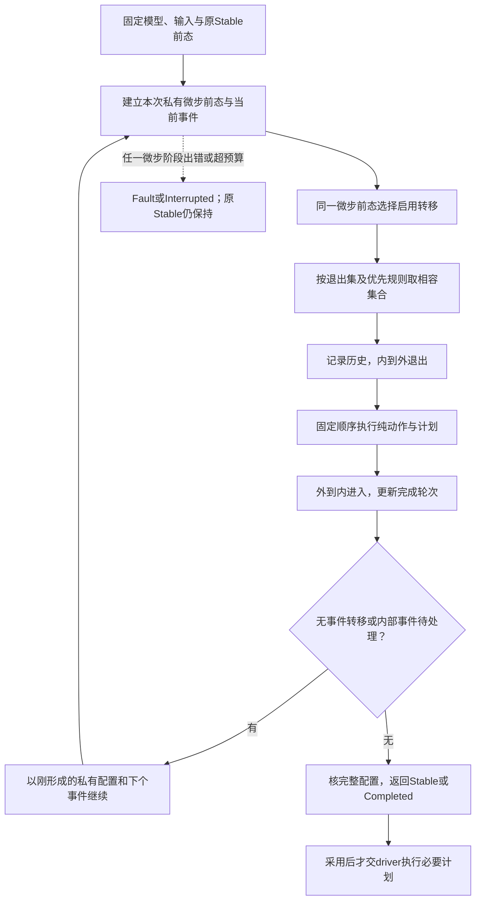
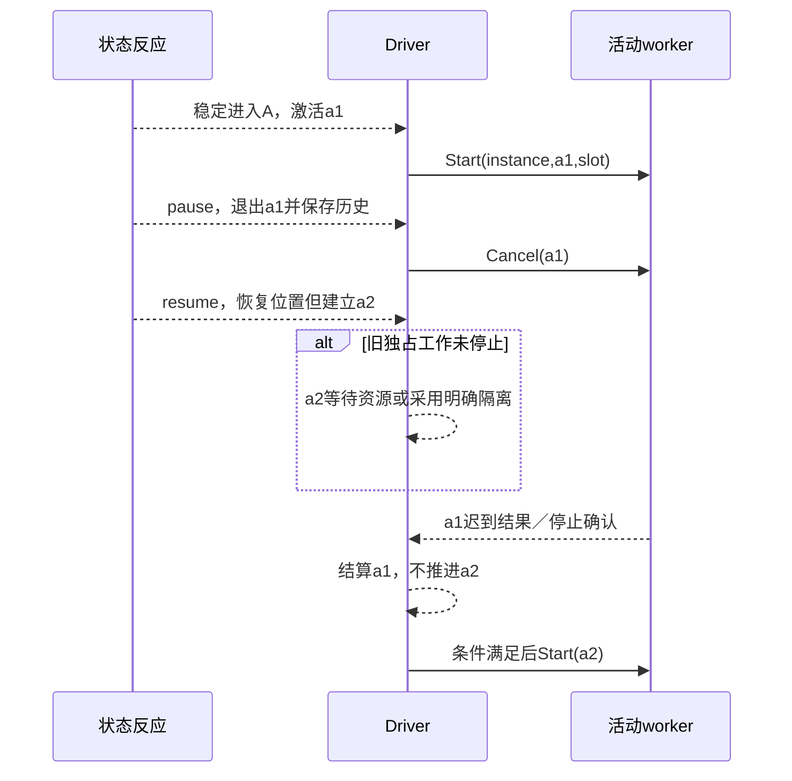

# 层级状态与事件反应

> **阅读范围**：采用范围内的设计规范；实现状态另查未决。

<details>
<summary>本页内容</summary>

- [1. 选择的范围与为何现在完成](#1-选择的范围与为何现在完成)
- [2. 成熟成果怎样复用，哪些接缝由SEC承担](#2-成熟成果怎样复用哪些接缝由sec承担)
- [3. 作者如何写，普通程序不增加关键词](#3-作者如何写普通程序不增加关键词)
- [4. 工厂、静态模型与动态模型不混同](#4-工厂静态模型与动态模型不混同)
- [5. 模型、实例与外部责任的数据](#5-模型实例与外部责任的数据)
- [6. 结构、转移与历史的有限解释](#6-结构转移与历史的有限解释)
- [7. 从输入事件到稳定结果的可实现算法](#7-从输入事件到稳定结果的可实现算法)
- [8. 回调和作用的正向合同](#8-回调和作用的正向合同)
- [9. 一次完整作者变化与准确结果](#9-一次完整作者变化与准确结果)
- [10. 活动、计时器、暂停与实际释放](#10-活动计时器暂停与实际释放)
- [11. 内存、持久与实际动作的实现边界](#11-内存持久与实际动作的实现边界)
- [12. 目标生成、性能与调试](#12-目标生成性能与调试)
- [13. 升级、迁移和旧事件](#13-升级迁移和旧事件)
- [14. 对照例、失败切点与尚未实现范围](#14-对照例失败切点与尚未实现范围)
- [15. 取舍与反转条件](#15-取舍与反转条件)

</details>


本章拥有有限层级状态、正交区域、显式初态、终态、历史、守卫、局部数据、一步与多步反应，以及相应生成和演进合同。它是[共同语义](../../作者/共同语义关系.md)中的按需领域，使用[基础语言](../../作者/可替换表示与适用范围.md)、[六工具](../../开发/工具协议/六工具与请求.md)和[成品模块](../../架构/装配/模块与运行实例.md)。

## 1. 选择的范围与为何现在完成

本章不再只说“以后采用状态机库”。直接给出有限节点、事件选择、结果、取消与历史的处理；实际实现可以使用合格既有引擎或生成的表驱动代码。源程序中一个普通if或递归函数，不因此转换成状态机，也不要求数据库或消息系统。

采用 **`sec.statechart/1`** 作为当前未发布领域合同，`sec/statechart`作为拟定普通库说明符；名称须通过既有精确绑定取得，本文不宣称包可安装。它可以组织图像导出、编译阶段交互、设备模式、协议会话或事务应用，不以工单/账号为基础对象。

本次默认语义是：一个实例的一次事件反应由一个逻辑拥有者推进；可以同时有多个活跃区域；状态和动作按固定规则解释。**图的正交区域、目标计算线程、SEC编译查询并行，是三种不同的并行。**真正外部任务可以并行运行，但它们以输入事件回到实例，不在同一状态上下文中任意竞争写入。每个实例的driver在接受边界形成明确序列；回放使用已经记录的顺序，不用线程时序或外部时间戳重新排序。纯内存应用不因此获得跨崩溃重放保证。

基本状态拓扑采纳SCXML的层级、正交、历史和结构冲突思路；数值、回调、失败和外部作用采用下文明确的SEC合同。它不是“所有SCXML都直接兼容”，也不是把UML、SCXML、Sismic、XState的同名机制混为一种。更强实时、分布式同步、任意动态修改图、任意原生脚本和全部SCXML I/O处理器不在本画像的完成声明中，仍按U038/U040/U013记录具体扩展。

## 2. 成熟成果怎样复用，哪些接缝由SEC承担

| 候选机制 | 当前采用方式 | 需要核对的边界 |
|---|---|---|
| [W3C SCXML 1.0](https://www.w3.org/TR/2015/REC-scxml-20150901/)与[勘误](https://www.w3.org/2015/08/scxml-errata.html) | 为层级、终态、历史和转移规则提供固定参照；规范性正文与示意算法分别使用 | 附录D是实现指南，不替代规范；本画像的事件和错误政策有明确差别 |
| [Qt SCXML](https://doc.qt.io/qt-6/qtscxml-index.html) | 已选择Qt/C++目标且满足合同，可直接复用相应编译/运行能力 | 检查数据模型、invoke和动态内容等[官方支持限制](https://doc.qt.io/qt-6/qtscxml-scxml-compliance.html)，不向每个TS或Java程序引入Qt |
| [Sismic 1.6.3](https://sismic.readthedocs.io/en/1.6.3/execution.html) | 适用于对应语义子域的参考或可选提供者 | 同源竞争与正交动作次序不是SCXML默认；名字相同不足以替换 |
| [XState调用生命周期](https://stately.ai/docs/invoke) | 可复用状态拥有活动的设计方法或合格目标实现 | 回调不再交给旧状态，不等于外部工作已停止；本次活动页面标v6 alpha，不作为已采用稳定版本 |
| [W3C实现报告及断言清单](https://www.w3.org/Voice/2013/scxml-irp/) | 针对采用的规则映射已有断言，减少重造基础用例 | 该报告说明实现性与互操作，不是SEC符合性认证 |

采用现成引擎的准入顺序：固定精确版本与能力范围；比较本章实际用到的转移、回调、失败和生命周期；无差异的部分直接复用；有限适配写明保持关系；差异无法保留则换提供者或生成合格代码。不得为保留某个库而偷偷修改原状态规则。当前选择的是算法与边界，不指定未经取得的已安装轮子或收益数字。

## 3. 作者如何写，普通程序不增加关键词

### 3.1 一条完整的中立库源

下面描述一个导出准备过程：渲染与检查两个区域可分别推进；暂停后按深历史恢复；两个区域都完成才进入ready。此图本身只接收事件，不偷偷启动渲染器、检查器或线程。

```sec
import "sec/statechart" as sc;

export fn exportFlow() -> sc.Model<Unit, Unit, Unit> =
  sc.model(sc.compound("job", "idle", [
    sc.atomic("idle", [sc.on("start", "active")]),
    sc.compound("active", "work", [
      sc.history("resumePoint", "deep", "work"),
      sc.parallel("work", [
        sc.compound("render", "rendering", [
          sc.atomic("rendering", [sc.on("render.done", "rendered")]),
          sc.final("rendered")
        ], []),
        sc.compound("inspect", "checking", [
          sc.atomic("checking", [sc.on("inspect.done", "inspected")]),
          sc.final("inspected")
        ], [])
      ], [])
    ], [
      sc.on("pause", "paused"),
      sc.on("cancel", "cancelled"),
      sc.done("work", "ready")
    ]),
    sc.atomic("paused", [
      sc.on("resume", "resumePoint"),
      sc.on("cancel", "cancelled")
    ]),
    sc.final("ready"),
    sc.final("cancelled")
  ], []));
```

这些是普通模块、函数、参数、列表和库调用。`Model<C,E,O>`中的C是上下文值类型，E是外部/显式内部事件负载类型，O是应用输出值类型；本例三者都为Unit，表达没有这些附加数据。不能把这个例子误读为永久只支持无负载事件。

声明返回的是模型值，不是目标源码字符串。`model`校验结构，非法时产生模型构造诊断而不是半合法模型。模型在运行时构造也是普通合法用法；静态代码生成只有在模型拓扑能在实际预算内取得时，才把它专门化为表/分派代码。静态模型工厂的处理见第4节，不能为了调用这个例子暗改顶层let的纯静态限制。

`start/pause/render.done`等是**此模型定义的应用事件名**，不是新的SEC关键字、全局工具或官方业务名单。`sc.done("work", ...)`是带类型的引擎完成触发器，不是与任意外部字符串`done.state.work`比较。调用方自己发送一个相同字符串不能伪造完成通知。

### 3.2 构造库的完整有限面

以下签名均带当前C/E/O类型参数，未单写的类型变量由结果或所在模型推导。库名是解释绑定，不通过函数名字的文本匹配识别。没有隐式默认参数；帮助函数的简写是库合同，不在每次升级改变。

| 导出 | 参数与返回 | 确定含义 |
|---|---|---|
| `model` | `Node<C,E,O> -> Model<C,E,O>` | 根必须为compound；核有限、唯一标识、目标、初态、历史、回调及闭包，构造只读模型 |
| `atomic` | `(Text, List<Transition<C,E,O>>) -> Node<C,E,O>` | 无子节点、无初态；entry/exit/活动默认空 |
| `compound` | `(Text, Text, List<Node<C,E,O>>, List<Transition<C,E,O>>) -> Node<C,E,O>` | 参数依次为ID、显式初态ID、有序子节点与有序转移；初态为其直接真实子状态，不取“文件里第一项”猜 |
| `parallel` | `(Text, List<Node<C,E,O>>, List<Transition<C,E,O>>) -> Node<C,E,O>` | 有限非空正交区域；每个直接子节点为compound，所有区域同时活跃 |
| `final` | `Text -> Node<C,E,O>` | 无出边和活动的终态；可显式附纯entry/exit处理；终态不等于资源已释放 |
| `history` | `(Text, Text, Text) -> Node<C,E,O>` | ID、`"shallow"/"deep"`、首次恢复fallback；是compound的伪子节点，不进入活跃配置；shallow的fallback是同父的直接真实子状态，deep可为同父的真实后代；不能再指history |
| `on` | `(Text, Text) -> Transition<C,E,O>` | 精确应用事件名与单目标；external结构转移，守卫恒真、动作空 |
| `local` | `(Text, Text) -> Transition<C,E,O>` | 事件与目标；internal结构转移，仅在源compound到严格后代时保留源的激活，其余按external处理 |
| `stay` | `Text -> Transition<C,E,O>` | 有事件但无目标，只执行附加动作；不退出或重入源 |
| `done` | `(Text, Text) -> Transition<C,E,O>` | 指定状态的引擎完成事件与目标；不是外部应用事件 |
| `always` | `Text -> Transition<C,E,O>` | 无事件转移，单目标；可以用when增加守卫 |
| `internal` | `(Text, Text) -> Transition<C,E,O>` | 显式内部队列事件名与目标；名字空间与外部事件分开 |
| `targets` | `(Transition<C,E,O>, List<Text>) -> Transition<C,E,O>` | 明确替换目标集合；空列表为无目标，非空集合必须可共同活跃，禁止重复/祖先后代相互包含 |
| `when` | `(Transition<C,E,O>, Guard<C,E>) -> Transition<C,E,O>` | 为该转移设置一个守卫；重复when拒绝，避免不明覆盖 |
| `actions` | `(Transition<C,E,O>, List<Action<C,E,O>>) -> Transition<C,E,O>` | 设置有序动作；重复设置拒绝，需要合并时由作者明确组成列表 |
| `enter` / `leave` | `(Node<C,E,O>, List<Action<C,E,O>>) -> Node<C,E,O>` | 设置有序entry/exit；history不接受；重复设置拒绝 |
| `activity` | `(Node<C,E,O>, Text, ActivityBinding<C,E>) -> Node<C,E,O>` | 声明由该状态激活拥有的活动槽；同节点槽名唯一，history/final不接受；见第10节 |
| `after` | `(Node<C,E,O>, Text, Duration) -> Node<C,E,O>` | 声明状态的计时槽与非负时长；同槽唯一；默认从本次稳定发布的约定时间戳计时；history/final不接受 |
| `timer` | `(Text, Text, Text) -> Transition<C,E,O>` | 计时拥有状态ID、slot与目标；只匹配对应活动计时通知，不匹配外部同名字符串 |
| `activityEvent` | `(Text, Text, Text, Text) -> Transition<C,E,O>` | 活动拥有状态ID、slot、映射事件名与目标；只匹配该槽经验证的活动通知 |
| `bindActivity` | `(Provider<I,R>, (C,Frame<E>)->I !{}, (ActivitySignal<R>)->Option<NamedEvent<E>> !{}) -> ActivityBinding<C,E>` | 固定请求/返回类型与纯映射，再隐藏I/R；不存在Any强制转换；没有消息时返回None |
| `named` | `(Text,E) -> NamedEvent<E>` | 构造名称与负载；不是输入消费ID、发送权或引擎Done |

`Node`、`Transition`、`Model`是库定义的隐藏表示值，可保存在普通模块并复用；不要求每个调用创建工程数据库实体。`when/actions/enter/leave`是纯的有限模型构造，不执行回调。函数捕获只能包含模型允许的不可变值与精确符号，不能把活数据库连接、当前权限或资源租约塞进可复制模型。

Text ID在一个模型内全局唯一，大小写敏感，符合基础Ident词法；事件名是非空Text，可包含点，不作SCXML式前缀匹配。ID改名通过真实引用重构；显示标签由呈现层保存，改标签不改变转移优先级。模型全序由根先序遍历、children顺序和各节点转移列表确定，不由源码构造函数实际求值先后或画布位置决定。节点的构造出现不同于运行激活；一份子模型复用两次必须实例化为不同子身份/命名空间，不能共享可变快照。

### 3.3 图、结构和成熟格式的接入

图形位置不是语义优先级。树中children及转移列表的稳定顺序才参与本画像的次序；画布拖动不改变顺序，重新排序需要明确语义增量。

结构作者的体使用现有`Definition/Region/Reference`机制，包含`representation=sec.statechart-body/1`、context/event/output类型、root、nodes、transitions及callback引用。nodes以稳定局部ID索引，每项必有kind和children顺序（非组合节点为空），compound还必有initial；transitions以source归属的有序列表保存trigger/target/mode/guard/actions；entry/exit/activities/timers仅在实际使用时存在。kind决定可用字段，不使用一个任意JSON执行字典。解码后形成与库构造相同的模型；无需打印成.sec再解析。

直接结构输入的顶层字段恰为`representation`、`contextType`、`eventType`、`outputType`、`root`、`nodes`和`transitions`。前三个类型使用既有TypeTerm，root指向nodes中唯一根；外层定义及作者版本由既有模块合同保存。节点树不能循环或被两个父节点同时拥有；表中节点均须属于该根，库中尚未组合的节点不混进已完成模型。

| 结构位置 | 字段与缺省 |
|---|---|
| nodes[id] | kind为atomic/compound/parallel/final/history；children和transitions为有序ID数组，默认空；compound必有initial；history必有historyKind与fallback，其他kind不接受它们 |
| 节点回调 | entry/exit为有序回调表达式，省略为空；回调采用既有Expr/Reference和闭合捕获，不再手写一份同义代码。history不接受回调 |
| 节点activities | 有序`{slot,binding}`列表；binding来自精确类型化活动值/引用；每个slot唯一 |
| 节点timers | 有序`{slot,duration}`列表；Duration是明确定义的值，不能省单位；活动和timer各自槽域不得借未定义名称混用 |
| transitions[id] | source、trigger、targets必需；mode为external/internal，默认external；guard省略等于Bool真；actions省略为空。source需与节点有序列表的归属一致 |
| trigger | 有判别联合：external/internal含name；done含state；activity含owner/slot/name；timer含owner/slot；always不含其他字段。不是一张可以同时包含所有成员的任意Map |

final没有转移、activity或timer；parallel的直接区域必须compound且非空；history没有children或transitions。所有重复对象键、同列表重复ID及不适用字段拒绝。未知版本仍可原字节保全，不被执行。形状合法但缺回调实现的作者草稿可以保存；完整Model输出必须满足该图的结构与回调闭包。字符串ID只是模型定位，不能借它访问别的模块私有定义或签发系统事件。

SCXML可以是选择的原生领域输入/输出格式，而非当前所有工程的新管理形式。成熟解析器负责XML读取和定位，禁止外部实体、隐式网络及任意脚本执行；精确映射表逐项比较事件匹配、默认初态、数据模型、错误处理、invoke与本画像。发生差别可以保全SCXML自己的语义画像或报告不能转换，不能改义后宣称导入成功。默认冲突选择、source activation、数据/效果失败的兼容条件见第6、8、10节。未知标签有字节保全，但不是可执行支持。

## 4. 工厂、静态模型与动态模型不混同

前述例子用`export fn`，没有把函数调用放进基础语言禁止的顶层StaticExpr。它首先是一个正常纯函数；普通调用在运行时构造并校验模型。

要求静态代码生成时，compiler固定工厂符号、语言/库/回调与预算，经已装配的领域方法取得模型。第一实现可识别并解释精确绑定的本节纯构造及有限闭合参数；用户包装函数只有在限定的无作用解释器中可处理时才展开。每一步记录实际读取，不能调用JavaScript eval、任意模块初始化、端口或外部函数。递归构造仍受工作量/内存限制；终止未证不等于可以无限等。

若模型依赖运行参数或静态求值超出能力，原纯函数可以继续生成；要求静态专门化的输出根报告`MODEL_NOT_STATIC`或实际预算缺口。用户允许时可选目标中的模型解释运行库，不偷偷降成一个动态解释器后仍称“无运行库静态生成”。错误模型不作为空图输出。结构作者已经直接提供有限模型时无需工厂求值。

本章新增的是可注册的领域方法和普通库，不是又一套代码生成语言。没有状态图的编译请求不装载该库、解释器、计时器或驱动。

## 5. 模型、实例与外部责任的数据

| 数据 | 必要内容 | 拥有者与更新规则 |
|---|---|---|
| `ChartModel` | 精确模型/回调版本；树、声明顺序、祖先索引、初态、history、转移、活动/计时槽及输入输出合同 | semantics建立只读模型；compiler产生表与代码；运行不修改模型 |
| `ChartSnapshot<C>` | modelRef、instanceId、逻辑修订、当前C、合法活跃配置、history记录、各真实活跃状态的activation、当前完成轮次及其有效标志 | 一次纯反应创建后继；是否持久由目标宿主决定，SEC作者候选不是此状态 |
| `ReactionWork` | 本次事件、私有候选C与配置、内部FIFO、待发命令、动作序列、预算和阶段 | 单次计算私有；宏步结束才发布，失败不覆盖旧快照 |
| `Ingress<E>` | 事件类别、名称/来源、负载、接收次序；系统事件还含实际激活/活动/计时身份 | 目标运行适配器校验，传给纯反应；调用者不能凭字符串伪造Done、停止确认或Timer |
| `ResourceLedger` | 已实际启动或取消的活动、计时器、清理和结果状态、原请求及提供者 | 仅存在相应运行责任时由目标driver持有；不存进逻辑history |
| `ReactionResult` | 新快照/未改变、消费判定、命令候选、诊断与可选有界轨迹 | 纯内存返回，或由持久宿主共同提交；不是已经执行命令的回执 |

有限图拓扑不意味着状态空间有限：C、事件负载、队列和计时域可能无限。静态检查拓扑与符号，并不能据此声称穷尽了整个应用行为。

一个模型可有多个实例。快照里的modelRef与逻辑ID经真实接口验证；导入快照不能恢复权限、设备句柄或另一个实例的资源。公开返回终态状态，与驱动器仍有未结算活动可同时成立，二者不合成一个绿色done。

## 6. 结构、转移与历史的有限解释

### 6.1 合法配置

根模型有一个compound根。激活任意节点时，其真实祖先都活跃；活跃compound恰有一个真实直接子分支，活跃parallel的全部区域活跃；atomic/final没有活跃子节点；history从不成为活跃节点。一个转移的多目标必须能同时存在于这种配置中。

保留一个不可命名的虚拟容器作为作者根之外的算法公共祖先；它没有回调、运行资源或业务身份。根自身有外部重入时域为这个容器，因而根与其后代都重新激活；任何目标仍不得逃出作者模型。static ID和snapshot activation分开：退出再进入同一ID是一次新激活，即使C与目标路径都相同。

### 6.2 选中和结构冲突

每次选择固定微步前的C、配置和当前事件。按模型顺序遍历活跃叶，从叶到祖先寻找第一条事件匹配且守卫为真的转移；同一源的转移按其列表顺序检查。祖先被多个叶找到只进入候选一次。守卫在本次选择中按实际需要至多求一次，其纯性允许缓存，不允许将错误/超预算当false。

先依据当时history展开有效目标；internal且源为compound、有效目标都为严格后代时，转移域为源；其他有目标的转移使用包含源与有效目标的最小**严格compound祖先**，不能把parallel误作同一种独占容器。退出集合为域内当前活跃的严格后代；无目标集合为空。

候选退出集合相交时竞争：后代源优于其祖先源；无此关系按最初选择顺序保留前者。无目标转移不因empty退出集合与另一转移形成结构冲突，其动作仍参与既定动作次序；这可能与退出整个区域的动作同时出现。它不获得访问已失效外部资源的许可。需要禁止该组合就通过守卫/合同说明，不暗换算法。

最后得到一组结构相容转移，再按模型全序执行其动作；冲突筛选的发现顺序不直接作为动作执行次序。不是分别改变状态后才发现冲突。它们的守卫全使用选择时的C。动作看到前面动作已形成的C；编译器不能混用“逐转移一边改数据一边重新挑下一条”的其他语义。

### 6.3 退出、转移动作与进入

一次微步先固定选中转移、域与退出集合，从微步前配置捕获将退出父状态的history，再据更新的历史解析进入集合；最后按如下三段执行纯数据/计划动作：退出子状态先于父状态，同层按逆模型顺序；转移动作按选中转移的模型全序；进入父状态先于子状态，同层按模型顺序。没有循环向用户回调请求第二个优先级。

无目标转移只运行转移动作，不增加activation，不触发entry/exit。指向自身的external转移会退出再进入，故产生新的activation和相应生命周期。compound的internal后代转移保留源自身但处理需要退出/进入的子状态。它不是所有名为local的引擎都天然拥有的共同含义。

进入compound时，显式目标已选择该子分支则沿它进入；否则采用该compound的initial。进入parallel时，补齐没有被目标显式选择的其他区域及其初态。入口集合以节点身份去重，不能因多个目标共同需要同一父节点而重复执行父entry。历史的两次读取具有明确时点：候选筛选和退出域使用选择时的记录；退出父状态本次产生的新历史，在进入历史目标时可见。已选转移/域不重新竞争，更新后的进入集必须仍在其域内且形成合法配置。所有要保存的历史均从同一微步前配置取得，不能边删除叶节点边读出不完整记录。

### 6.4 history恢复的是结构位置，不是世界快照

退出具有history节点的compound之前，保存它当前配置：shallow保存直接子分支，deep保存全部活跃叶及其必要祖先关系。首次没有记录时采用固定fallback；不能根据最近显示或旧文件相似名字猜。历史目标解析必须在本次工作副本内完成，并检查记录对应的模型版本。

外部转移和局部转移不可互换：特别是正交区域的compound源向自己后代作external转移，最近严格compound祖先可能位于parallel之外，其他区域也可能退出；想保留源且只替换后代，应使用满足条件的local。

浅历史进入原直接子分支后，子内部走它自己的默认初态；深历史恢复该子树的原叶配置。两者都按进入协议执行新entry，**不恢复旧C、不恢复旧权限，不复用已经取消的活动句柄**。源中确实需要状态退出后恢复C或未耗尽时间，是另一个明确的应用/计时策略，不能偷偷塞进history。

history节点本身不占运行活跃位。迁移后原叶不存在或不再正交，旧记录不能原样塞入新图；要有明确映射、用fallback且获准行为变化、固定旧模型继续、或暂停迁移。

### 6.5 完成事件

compound具有活跃的直接final子状态时完成；parallel只有全部区域完成时才完成。一次微步的entry动作完成后，按深层先于浅层、同层按模型顺序检查完成关系。先前动作已经raise的内部事件在队列前，新Done依次追加。根完成直接结束逻辑实例，不等待调用者伪造一个done事件。

完成记录包含`(sourceState, activation, completionEpoch)`。同一父状态没有退出，也可能从完成子态转回工作子态、再进入完成子态，因此不能每个activation只发一次Done。选定退出集合移除原完成见证（该compound的final子态，或parallel任何已完成区域的见证）时，原完成轮次失效；再次达到完成配置创建新轮次。多个判断重复看到同一未改变完成配置，不重复生成事件。

取出Done时，来源必须仍然活跃、activation相同、仍处于对应的完成轮次，否则作为过期内部通知丢弃并可诊断。外部同名字符串不是Done；完成某一活动的通知也不等于其状态或父图完成。这个带相关性的通知和微步后统一产生政策，是本SEC画像的精确选择，不能冒称SCXML各运行器原生都如此处理。

根完成停止接纳普通事件并返回逻辑Completed；已排入但没有消费的内部事件返回为本次终止后的残余摘要，不无限继续图内循环。已有输出计划继续按宏步结果处理，状态拥有的活动和计时槽进入终止取消/结算，即使为了观察保留终态路径。根不自动再执行一遍exit动作；需要业务收尾就把它写进进入终态或此前转移的动作。输入重试可以读回同一完成结果，后续普通输入返回AlreadyCompleted且不再消费为新业务。实际资源结算仍沿第10节完成。
## 7. 从输入事件到稳定结果的可实现算法

<a id="fig-chart-macrostep"></a>

### 图解：事件反应从稳定前态到稳定后态

循环是宏步内部反应；预算中断保留原稳定前态，不把工作中间态发布为稳定。实际活动在稳定采用后启动。



运行库公开边界是`start(model, initialContext, limits)`和`advance(model, stableSnapshot, ingress, limits)`；输入输出是上述固定值，均不执行目标I/O。`start`建立初态并稳定化；`advance`一次最多处理一个外部或系统输入。`limits`由目标运行合同提供，不在每个作者函数中强制填写。运行API不是第七个SEC开发工具。

**H0 模型检查。**在有限工作栈中检查树/所有权、ID、初态、目标可达与正交性、history fallback、无目标/内部转移、回调签名和effect、生成事件匹配与资源槽。预计算祖先、模型顺序和候选索引，保持图表而非展开全部组合状态。可疑无事件循环产生具体诊断；无法证明终止并不禁止一切图。

**H1 固定反应基础。**验证modelRef/instance/修订及稳定输入；接收方先校验事件类型、来源和相关性。形成私有ReactionWork，旧快照不变。普通未匹配事件返回Consumed-Unhandled与相同逻辑值，不默加错误转移。

**H2 选择外部触发。**按第6节选择候选、比较冲突、确定微步，不允许第二输入插入其中。开始时必须已经是稳定配置；否则只能继续原私有反应，不能在中途接新外部事件。

**H3 原子构造一个微步。**固定退出域和选中转移的模型次序；捕获需要的history；按退出、转移、进入顺序调用纯动作并更新工作副本；维护activation、完成标志、内部事件和命令。一次回调的上下文输出成为下一动作输入，不能并行求完后最后写入者胜。每一阶段都检查预算、值类型和当前读写/激活合法性。退出到进入之间的工作配置可能暂时缺少compound子状态，这是合法中间态；完整配置不变量在微步结束和对外Stable边界核对，不能将它误作每条exit动作之前都成立。

**H4 稳定化。**若根已完成直接进入H5，不再执行根的eventless循环；否则先尝试无事件转移；有就作下一个微步。没有无事件转移才从内部FIFO取一项，按当前配置处理；内部空且无无事件转移时到达稳定切面。内部事件产生的内部事件仍按FIFO，不用宿主消息时序抢先。动作中的raise只追加，不递归重入同一实例。

**H5 完成或有限结束。**到达稳定配置或根终止后，返回对应新快照、完整命令计划、消费身份和摘要。出现纯守卫/动作错误、契约错误或结构错误，返回失败和原稳定快照；未发布的命令全部丢弃。预算耗尽/取消不是语义错误：返回Interrupted与原快照、输入未结算以及可选私有续体，不能把中途配置标成Stable。

**H6 交接。**由driver决定内存发布或持久比较提交。提交成功后才向真正执行边界释放命令；失败时旧状态和原命令身份保持，重算仍消费同一个外部输入。独立诊断trace不声称目标命令已经执行。

只要所选守卫/动作结束、稳定化步数有限且预算与存储能力满足，路径能够返回稳定结果。无事件循环或持续内部事件可以使宏步永不自然稳定；配置预算和中断给出可结束的处理，不宣称任意作者图都有自动终止证明。

### 宏步无穷时，外部取消不能假装已被图处理

普通`cancel`是输入事件，要等当前宏步结束。若当前出现无事件自循环，它可能永远排不到。目标driver提供**计算控制取消**以终止/隔离本次工作，保留旧稳定状态与失败输入；这不是向图伪造一次已处理的cancel。

默认同实例因非结束反应进入Parked，阻止后来事件越过未处置输入；其他实例可继续。允许丢弃毒性输入、回滚到旧模型或强制结束实例，必须由已接受的宿主策略作出可见决定。不能无限自动重试同一错误。第三方同步回调不能被Promise超时真正停止时，沿[执行资源](../../运行/权限与资源管理.md)使用能终止或隔离的运行器。

## 8. 回调和作用的正向合同

`Guard<C,E>`是`(C, Frame<E>) -> Bool !{}`。`Action<C,E,O>`是`(C, Frame<E>) -> ActionResult<C,E,O> !{}`；该公开记录恰有`context:C`、有序`raised:List<NamedEvent<E>>`、有序`emitted:List<O>`。零变化明确返回原context和两个空列表，不需要未定义的identity助手。

Frame按实际类型区分External、Raised、Done、ActivityMapped、Timer与Initialization；外部提交接口只构造External，其余由相应引擎/已授权适配器构造。包含当前事件的可用负载、动作发生点和只读配置视图：guard看微步选择前配置；exit回调执行时该状态仍在配置中，回调后移除；transition看退出完成后的配置；entry在加入该状态之后执行。不是全部工程的可变Context。没有该类负载就必须模式分支，不能把Done的payload强转成E。内部事件名称匹配精确相等，错误不是一个偷偷吞掉的普通字符串。

C是不可变的中立值；外部资源只通过明确标识和运行ledger关联，不能直接藏进C后用history复制。动作纯性表示它现在只构造值和计划；emitted中的某项将来需要文件、网络或设备能力时，目标摘要和driver仍要体现那个需求。**计划函数是纯的，不代表计划中的未来作用无需权限或预算。**

多个正交区可以在一个微步中按确定次序更新同一个C。若A动作执行`x+1`，B动作执行`2*x`，输入x=1，A后B得4，B后A得3；不能因为模型包含parallel就并行计算两个动作。只有取得读写独立或交换、错误/终止保持与资源条件后，才允许优化真实并行。否则顺序实现已经完整支持正交语义。

本画像将外部动作计划推迟到稳定结果被采用之后。SCXML直接执行内容的异常、脚本、send/invoke与这一行为不是无条件等价；导入或复用必须限定到公共子域，或保留原引擎画像。本章选择这个边界是为了保留取消、重算与事务接合，而不是宣称它是唯一正确的状态机语义。

### 运行边界的有限类型与输入验收

公开运行库使用`Snapshot<C>`、`NamedEvent<E>`、`Ingress<E>`、`Reaction<C,E,O>`和`Limits`，不是把内部Map暴露给作者。`Limits`由调用目标的既定运行政策绑定：模型节点/转移、回调工作量、微步、内部队列、输出大小与总内存各自有非负有限预算；不同量纲不相加成一个任意分数。小模型可采用发行画像已经规定的预算，真实值未被规范/配置确定时返回配置缺项，不假造无限资源。

`start`成功返回Stable或Completed；`advance`额外接受绑定此实例的Ingress。二者失败返回`Fault`（模型/guard/action/合同）或`Interrupted`（预算/控制取消），附原稳定基础、阶段与可定位诊断；Interrupted可含有权不透明续体，但不是可公开业务状态。输入消费、逻辑状态、所发计划和外部结算分别返回。结构/模型版本不符的快照首先拒绝，不试着按相同状态文字执行。

Ingress先验证解码类型和可信来源，再检查实例/逻辑请求身份、activation及终止状态。无权事件不给出受保护的状态是否存在；旧活动返回仍可进入原ResourceLedger结算，但不能成为当前图输入。普通外部同名事件是否允许由实际入口合同决定；Done、Timer、ActivityMapped不能由普通external构造器签发。输入队列满时采用已选背压或明确拒绝，不能无声丢弃取消、完成或普通数据；若某业务允许丢弃/合并，必须是那个事件类型的明示合同。

## 9. 一次完整作者变化与准确结果

用第3节模型，忽略父祖先只列活跃叶：

| 输入/动作 | 活跃叶 | 必须同时成立 |
|---|---|---|
| start初始化 | `idle` | 不执行渲染和网络 |
| 应用事件`start` | `rendering, checking` | 两个区域都进入；不是创建两套作者候选 |
| `render.done` | `rendered, checking` | inspect没完成；不能产生work完成 |
| `pause` | `paused` | deep记录`rendered, checking` |
| `resume` | `rendered, checking` | entry是新激活；旧C/权限/活动不被恢复 |
| `inspect.done` | `ready` | 两区完成，内部Done(work)使active退出；根逻辑完成 |

把history的`"deep"`改成`"shallow"`后，同一路径resume会进入`work`的默认配置`rendering, checking`，已完成的render也重新从初态开始。它是行为变化，不是排版或性能选项。开发AI只改该字面量或已定位字段，分析器更新行为影响，图布局和无关图标保持。

将叶节点`rendering`改名且更新引用，模型顺序不变时优先级不因名字字典序变化。迁移中的旧运行激活仍使用稳定语义ID/映射；不是仅全局替换字符串。

定义和运行边界分开：此纯范本只规定收到事件后的反应，真实渲染任务由第10节activity绑定或外围运行应用提供。渲染结果的可信来源、输入摘要与activation要由入口验证；使用本例的纯`on("render.done",...)`并不声称所有外部调用者都有权报告完成。

### 同时发生的取消和成功，不按“最新事件”重写事实

默认以已接收的序列逐次处理。cancel先被提交，则随后旧activation的完成只进入资源结算，不改变新配置；成功先被提交并进入ready，则稍后cancel得到已经逻辑完成的状态，不倒写成功。原任务必须规定“某个真实时间之前取消一定优先”时，需要那个时间、接收和提供者的共同合同，不能由普通FIFO伪造。

## 10. 活动、计时器、暂停与实际释放

<a id="fig-history-activities"></a>

### 图解：暂停、历史恢复与旧活动的相关性

深历史恢复结构位置，不复活旧worker、权限或内存；迟到结果仍可结算原活动但不推进新激活。



### 10.1 状态拥有的是激活，不是永久状态名

`Provider<I,R>`是既有提供者合同的类型化引用，不是实际运行句柄或凭证。`bindActivity`取得请求构造`(C,Frame<E>)->I !{}`与回调映射`ActivitySignal<R> -> Option<NamedEvent<E>> !{}`，将I/R封装在`ActivityBinding<C,E>`中。运行适配器始终沿绑定保留I/R解码和检查，不能因为公共容器隐藏类型而退成Any。O只承担普通动作输出，与活动请求I、结果R相互独立。

`ActivitySignal<R>`的有限分支是`Started()`、`Succeeded(R)`、`Failed(ActivityFailure)`、`Stopped(StopReason)`。后两种数据携带已声明类别和有限诊断，不直接含未经约束的异常对象或秘密。映射返回None表示不产生图内通知；返回named(name,payload)时，driver附加真实owner/activation/slot，形成ActivityMapped，而不是普通External。`activityEvent`只匹配这个标签；模型静态检查owner真实拥有slot，框架检查当前相关性，用户字符串不能伪造它。

开始、失败、取消确认的映射是正常领域代码，可通过现有match表达。实际Provider返回先按原活动记录校验并结算：迟到且已不相关的结果不再调用图映射；相关结果才运行纯映射，映射错误保留收到的真实结果并停放图输入，不能撤销已发生的外部事实或重跑Provider来修映射。没有为Failed配置转移时，该已验证通知被记为未处理，并保留活动失败；不擅自选择ready或重新开始。提供者Started只表示约定接受/启动层次，不证明任务完成。需要从实际Started计时的模型先停留等待态，收到受信Started后进入带after的工作态；不把稳定入态计时擅自改成真实执行起点。
活动身份包含实例、状态activation、slot、输入身份；每次物理尝试再有attempt，重试不换逻辑活动。静态初始化版本也在绑定中，输入相同不能复用另一激活的资源。进入并在同一宏步离开的状态，不启动新的外部活动；只根据最终活跃且实例未终止的激活集合发Start。终止时所有状态拥有的活动都取消，不因保留终态路径继续运行。此前已启动而本次退出的活动产生Cancel义务，不能因最终没有该状态就直接删除ledger。

输入构造在H5发布/提交之前对最终稳定C执行并检查；失败按宏步Fault处理，不能先发布状态再发现无法启动其活动。输入以该激活的决定固定；同一激活内C后来改变不自动重启活动。确需重算输入并重启，明确reenter或新的操作。重入同一ID产生新activation，不能把旧worker的迟到结果交给新worker的消费者。

### 10.2 历史与资源是两条生命周期

从active到paused时，历史可以保存叶位置，活动仍可能正在取消。恢复deep不会把旧进程、网络流或GPU缓冲“复活”；需要运行的叶建立新的活动身份。已执行的纯entry/exit动作所产生的普通emitted输出仍按原动作次序保留；仅状态拥有的活动Start/计时Set按最终激活对账。不能把所有输出计划都按最终状态删除。

默认每个相交独占槽采用 **停止确认后再启动后继**：旧提供者确认停止、隔离完成或责任有权转移之前，新活动排队，旧内存继续计费。不独占且预算允许的任务可以重叠，但输出、临时文件和回调都隔离到不同activation。没有等待确认的能力，不能宣称已暂停、已释放或已取消完成。

`logic=Completed`、`settlement=Pending`是合法组合。需要完整完成的调用方必须等其要求的活动/交付义务结算；纯反应调用方可以只取逻辑结果。相关表示消费[结果分层](../../运行/保证/要求证据与裁决.md)，不另创总成功标志。

### 10.3 计时器有单位、起点和恢复政策

`Duration`含非负整数ticks和已绑定单位/时钟域，禁止隐式把秒当毫秒。after默认从该激活的**稳定发布所记录的约定时间戳**开始相对计时；计时不是纯宏步内读取Date.now。内存画像在发布边界取得时钟值；耐久画像在同一事务中保存时间戳及deadline，承认读取到实际发布的间隔，不声称取得不可观测的零误差物理提交瞬间。提供者把同一计时身份与该deadline固定，响应丢失可以读回或同键重试，不能每重试一次就续期。

Timer携带实例、ownerState、activation、slot、deadline与提供者来源；timer(owner,slot,target)只匹配对应记录，internal(name)只匹配纯动作raise的事件；状态退出后迟到事件不触发新激活。零时长也作为后续输入，不在entry内同步递归重入。timer到期与普通输入的先后由当前接收序列决定；对同一时钟下同时到期的多个timer，选定提供者按deadline和固定slot顺序登记，不能从线程先后暗推确定性。

深历史恢复默认重新启动尚未完成叶的相对计时器；要保留剩余时长或绝对deadline，使用单独的明确计时策略，不借deep这个词暗示。持久宿主恢复不能跨boot比较单调时钟数字；需要可恢复时钟基准或已接受的壁钟误差/追赶政策。休眠后过期事件按实际队列预算分批取得，不触发无界补发。硬期限、跨节点全球时序与任意迟到水位规则仍归U040，不由本小合同完成。

## 11. 内存、持久与实际动作的实现边界

**默认内存。**纯start/advance返回新值；应用通过一个实例事件循环或等价同步协议切换snapshot指针。无外部作用、跨故障恢复或持久交付要求时，不建数据库、Outbox和持久命令图。有限调试trace按预算保留或丢弃，不影响模型含义。

**有外部活动的内存应用。**driver验证、发布稳定状态后才发对应命令，并持有在途责任。进程崩溃后的恢复没有因此自动保证；需要耐久责任时选择下一画像，不把内存模式宣传成持久工作流。

**需要耐久。**同一提交域共同保存旧/新修订比较、输入消费结果、stable snapshot和待作用计划，复用[现有提交与恢复](../../运行/持久化提交与恢复.md)及[事务交付](事务与交付.md)。单个宏步的纯计算可以在锁外按固定前像进行；冲突时重新取得实际状态计算，但逻辑输入身份保持。外部调用不跨数据库锁等待。

每个实际命令的逻辑身份由已提交输入/反应、产生位置与局部序号确定；物理重试另有attempt。提交冲突前的私有计划未被派发，可以按新前像重算；已经提交的计划不能重新分配一组身份。显式emitted外部作用不是状态数据的一部分，也不因后续进入终态被删除。

**断点与恢复。**提交前退出：原快照仍为准，未授权/未提交命令不发送。提交后响应丢失：读同一输入结果。命令已发但结果未知：查提供者或按其真实幂等条件重试，不能重放整个图的entry。宏步中断：只有私有续体仍有效且绑定同一模型/输入时恢复计算；否则从旧稳定快照重新计算，未提交动作没有外部效果可重复。

接收同一事件两次是否去重由当前输入合同决定。鼠标点击两次可以是两个合法事件；重试同一远程请求则应使用已有逻辑输入身份。不能因为负载相同就去重，也不能每个像素处理都建持久输入表。

## 12. 目标生成、性能与调试

编译实现依次产生：规范树和转移表；必要的祖先/顺序索引；候选选择及完成规则；已检查回调；纯反应代码；请求需要时的目标driver与提供者配置。数据仍由原Definition/Region/MethodSpec与ArtifactSet承载，不建立第二状态机工程管理器。

默认实现保留层级与正交配置，通过有限位集/数组和有序队列运行。k个区域各有n_i个局部状态时，平面组合数可能是乘积∏n_i；运行表示不先枚举全部乘积状态。需要模型检查且范围合格时再按需探索可达状态；图节点数少不构成运行状态空间小的证明。

未预计算祖先和退出集合时，一个参考选择步骤可扫描活跃叶a、深度h、候选转移t及状态n；朴素上界可按`O(a·h·t + t²·n)`保守计量，回调成本、队列、输出和任意精度值另计。预计算位集与索引可降低重复扫描，但它们改变的是算法成本，不能改变候选顺序。没有输出数据支持不宣称比其他引擎快。

TS目标可以生成只读表、回调函数、实例快照和step函数；Java目标可以用表/类封装相同含义；Qt目标若采用合格现成引擎，声明数据模型、运行依赖和差异适配。单个状态不必生成一个文件或服务；稳定名称来源于模型身份和明确布局，不来自回调到达次序。

发生状态/条件错误时，诊断回到实际状态、转移、guard或action及对应源/图位置；显示本次输入、旧配置、竞争候选和实际采用规则的必要部分。完整trace仅在需要时取得，不能每次向AI发送所有潜在配置。修改局部守卫使相交语义/目标失效；只移动画布不重编；改转移顺序是语义变化而非格式化。

## 13. 升级、迁移和旧事件

默认已有实例继续绑定原model与回调版本，新实例可以用新模型。把同一状态ID的含义改掉，不自动使旧激活成为新含义；物理表索引永远不是持久迁移身份。

需要迁移已有实例时，先固定稳定切面及目标模型，映射活跃状态、C、history与完成标志，再逐个处理活动/计时/内部通知的相关性。新配置必须满足新拓扑，旧事件与函数合同须有合法转换。只改显示名可保留逻辑身份；将atomic拆成compound需要选择新子态；deep记录指向被删叶必须映射或采取明确fallback。

旧活动仍在运行时，选择保留旧实例、等待停止后切换、经过已证明安全的接管、或有权隔离；不把新模型写入旧snapshot后继续接收所有旧回调。迁移失败维持旧稳定内容，可能阻断新的外部作用；它不扩大旧权限。

例：原inspected表示“格式合法”，新版表示“格式合法且签名核验”。原history中的inspected不能仅凭同名延续新完成结论。需要重新检查并得到新结果，或明确保留旧合同。这个要求变化不能被表索引迁移隐藏。

移除图或库源码只影响未来采用；现有实例、未结算事件和活动仍有责任，直到选择并完成停止、转移或保留旧解释。纯内存已结束实例可以直接释放，无须建立历史审计平台。

## 14. 对照例、失败切点与尚未实现范围

| 检查对象 | 具体输入/扰动 | 预期结果 |
|---|---|---|
| 父子优先 | 同一事件，子有真guard，父有默认转移 | 选中子；父不是第二次执行 |
| false与失败 | 子guard为false／除零／超预算 | false可寻找祖先；错误/未完成不能当false选祖先 |
| 正交完成 | 仅render进入final | work尚未完成；不得跳ready |
| 并行共享C | A把1加1，B再乘2 | C=4；擅自并发或调换可得3，不是合法同义优化 |
| 无目标与自转移 | stay("ping")／on("ping",当前ID) | 前者无exit/entry；后者重入且activation变化 |
| 正交内外转移 | 区域compound向自己的后代external/local | 按真实域决定是否重入外侧parallel；不能一律只改一个叶 |
| history | render完成后pause/resume | deep保留rendered；shallow重启work默认内部状态 |
| 完成再次出现 | 父activation保留，内部final退回工作态，再到final | 新completionEpoch，新Done；旧通知不得推动新轮次 |
| 临时状态输出 | 同宏步entry发显式输出后退出，同时声明activity | 显式输出计划保留，短暂activation的活动不启动 |
| 活动迟到 | 旧checking退出后新checking启动，旧结果返回 | 旧ledger结算，不能完成新checking |
| 逻辑完成与真实停止 | cancel已进入final，worker不响应 | 逻辑可完成，资源仍Pending，输入不能回收复用 |
| 无事件自循环 | always指回自身且guard恒真 | 预算中断/停放，不能返回Stable，也不能声称图无解 |
| 宏步失败 | 前一action已创建命令，后一action或activity输入构造错误 | 工作副本与未发命令弃置，旧快照保持 |
| 结果映射错误 | Provider已经完成，结果到事件的纯映射报错 | 保留实际结果，停放图输入；不能重做外部作用 |
| 提交切点 | 宏步完成、状态/命令提交后响应丢失 | 原输入身份读回，不重发不同身份的entry效果 |
| 名字和排序 | 改状态名但不改列表／改列表次序 | 前者不改变优先；后者明确语义变化 |
| 外部伪造 | 发送字符串done.state.work | 只作为普通外部事件；不能变成引擎Done |
| 迁移 | 同名完成态强化要求 | 旧完成依据不自动满足新要求 |

这些是可独立复算的设计预期，。W3C基础规则、已有成熟引擎与其测试在相同前提下可以复用；SEC新增的纯反应、宏步提交、事件标签、激活/资源和迁移接缝需要自己的符合性，不重做全部上游测试，也不省掉新增边界。

本章定义有限作者库、模型/事件、逐步算法、历史/结束、驱动、计时、迁移和目标落位。仍未实现：该库和decoder、守卫/动作检查、目标适配与真实运行；仍缺后续完整设计：任意动态拓扑改写、多节点强实时、分布式全局同步、SCXML全部数据/I/O模型的跨语言保持。U038的这些子域保持开放；U040的窗口/流/硬期限不被本章两个计时字段自动关闭。

## 15. 取舍与反转条件

当前选定“固定次序的层级图＋纯宏步反应＋按需外部driver”。更小替代是普通函数/扁平状态枚举，简单场景继续使用。更成熟直接替代是目标已有的状态机引擎，完全满足当前合同就优先复用；无必要不生成一套新的解释器。更强的事务工作流、同步数据流或实时模型只在实际要求下使用，不由本章替代。

代价是必须明确模型顺序、回调与状态生命周期，并处理纯反应与现实动作的接缝。收益是高层控制可以重复使用而不枚举组合状态，不必在每项导出任务重新写暂停、完成和过期回调骨架；收益仍需实际完整任务验证。

以下情况重开相交设计：作者任务要求与固定次序不相容；已接受源语义依赖直接可见微步效果；模型过大导致纯宏步暂存不可承受且任务允许分段可见；所选引擎不能满足共享语义或迁移；真正硬期限需要另一类可证明调度。重开具体责任与兼容条件，不重新制造一套候选、权限、内容库和全局成功状态。
