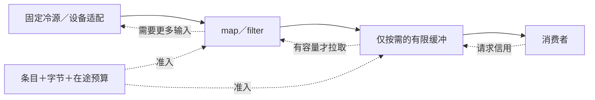
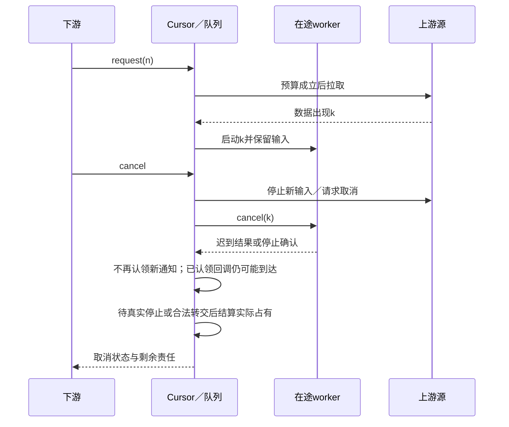
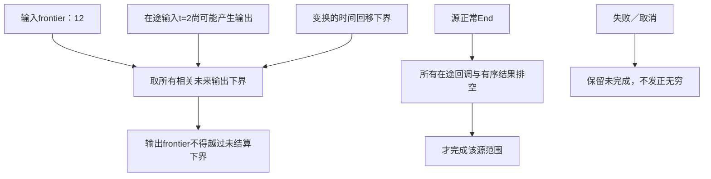
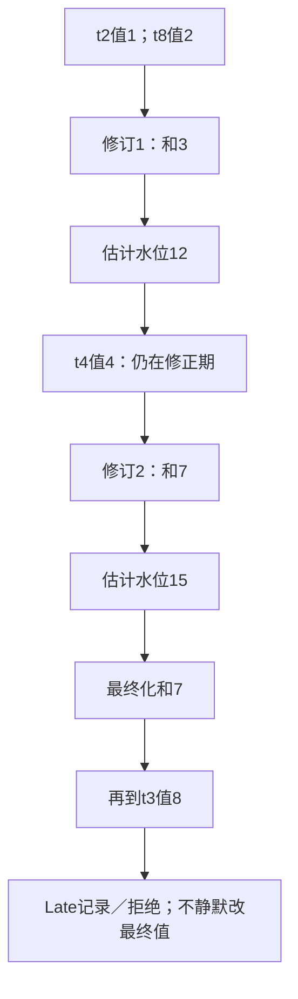

# 本地流、背压与事件时间

> **阅读范围**：采用范围内的设计规范；实现状态另查未决。

<details>
<summary>本页内容</summary>

- [作者模型与实际接口](#作者模型与实际接口)
- [信号、时间与源边界](#信号时间与源边界)
- [拉取、容量与背压的正向算法](#拉取容量与背压的正向算法)
- [并行、有序输出与进展标记](#并行有序输出与进展标记)
- [窗口归属、修正与最终结果](#窗口归属修正与最终结果)
- [更新、迁移与观察](#更新迁移与观察)
- [编译、目标与成熟实现](#编译目标与成熟实现)
- [硬期限的有限采用规则](#硬期限的有限采用规则)
- [与共同模块的接合及反向检查](#与共同模块的接合及反向检查)

</details>


本章拥有 `sec.stream/1` 的有限本地流合同：拉取、缓冲、定序、事件时间、窗口、迟到、取消、结果发布及对应目标。它服务于小工具、文件处理、音视频、设备采样和交互计算，不要求数据库、消息中间件或常驻工作流。基础语言、状态计时器和有限关系各自保持原合同；有限关系的一批变化不能直接替代持续流的边界。

## 作者模型与实际接口

普通库 `sec/stream` 生成可执行流描述，调用构造函数不立即读取文件或设备。`Stream<T>`描述一个类型化数据流；实际运行器创建 `Cursor<T>` 与资源占有。默认冷源、单消费者、按需求拉取；将同一描述打开两次是两次源运行，不是免费共享一次现场输入。要广播、重放或复用已取得内容，使用明确的组合与源能力。

有限接口如下。函数类型中的效果沿基础规范；表中的回调默认无外部效果，但出错和不终止仍然可能。

| 公开定义 | 输入与结果 | 确切规则 |
|---|---|---|
| `rows<T>` | `List<T> -> Stream<T>` | 固定顺序的有限源，完整消耗后才End |
| `map<T,U>` | `Stream<T>, (T)->U !{} -> Stream<U>` | 每个取得的数据出现计算一次，默认保持源序 |
| `filter<T>` | `Stream<T>, (T)->Bool !{} -> Stream<T>` | false丢弃，错误不是false；请求一个输出可能读取多个输入 |
| `buffer<T>` | 源、最大条目数、最大字节数、溢出政策 | 只有真正选择缓冲才额外建队列；两种预算都检查 |
| `mapOrdered<T,U>` | 源、回调、并发上限、缓冲限制 | 可并行计算，按输入序发布；在途数据计入预算 |
| `broadcast<T>` | 源、订阅范围、各支路容量与慢支路政策 | 读取一次后按显式政策给多路，取消一路不默认关闭全部 |
| `windowCount<T>` | 源、时间函数、Text键函数、窗口规格 | 输出明确的窗口变化，不隐含SQL或数据库 |
| `windowSumInt<T>` | 同上及`(T)->Int` | 精确整数求和，保留重复出现；协议重传和业务重复分开 |
| `tumblingNs` | 正窗口长度、原点、迟到余量、输出政策 -> `Result<WindowSpec,ConfigError>` | 构造半开时间窗口，单位固定纳秒 |
| `slidingNs` | 正长度、正步长、原点、迟到余量、输出政策 -> 同上 | 一项可进入多个窗口，成员数计入成本 |

`Stream<T>`、窗口规格和游标不允许通过普通记录伪造。解码器、设备与异步源由已有Provider提供；`open/read/cancel/close`是目标运行适配接口，不新增开发工具。用户可以封装这组操作或写自己的处理函数；超出本地有限画像的分布式frontier、完整消息协议和有状态流迁移另行选择。

### 一个可写的窗口计算

```sec
import "sec/stream" as st;

export type Sample = { timeNs: Int, sensor: Text, value: Int };

export fn sums(source: st.Stream<Sample>)
  -> Result<st.Stream<st.WindowChange>, st.ConfigError> =
  match st.tumblingNs(10, 0, 5, st.Output.Updates()) {
    case Result.Err(problem) => Result.Err(problem);
    case Result.Ok(spec) => Result.Ok(st.windowSumInt(
      source,
      (s: Sample) => s.timeNs,
      (s: Sample) => s.sensor,
      (s: Sample) => s.value,
      spec
    ));
  };
```

上例时间值属于源已声明的同一时间域，不解释成机器墙钟。窗口长10纳秒、原点0、修正余量5纳秒只是可复算示范，不是推荐所有设备使用的参数。未声明时间域的输入不能与另一源的数字直接比较。公开 `WindowChange` 包含键、起止、修订、当前值和是否最终；传输展开可有稳定引用，AI不必每次手填。

## 信号、时间与源边界

<a id="fig-stream-pull"></a>

### 图解：默认拉取链和信用反向传播

实线表示数据，虚线表示需求；顺序链可以融合为一个循环，没有每节点线程或数据库前置。



`Data<T>`带源运行身份、分区、出现序号和负载；只有事件时间能力启用时才解释时间。相同业务值出现两次仍是两次数据，除非显式去重。协议重试必须沿同一出现身份，不能与业务重复混同。

除数据外，源可以提供三类信号：

- **严格Frontier(t)**：在该源、分区、时间域和运行中，今后不会有时间小于t的数据。违反则源协议故障，不改成普通晚到。
- **WatermarkEstimate(t)**：源按已声明方法估计进展，可能还有更早数据；窗口按允许的迟到与修正规则处理。
- **End / Failed**：前者只表示该源本次完整正常结束；失败和取消不能被转换成正无穷frontier。

两类时间进展信号分别类型化，不能因为同叫“水位”自动将估计升级为证明。Beam也将watermark描述为完整性估计，并由窗口、触发和允许迟到共同确定输出；SEC采用该区别，不搬入整套分布式执行器。[Beam窗口与水位](https://beam.apache.org/documentation/programming-guide/#watermarks-and-late-data)

事件时间、接收时间和处理时钟分别保存。相对计时和重试deadline继续采用状态计时及宿主合同；重启后的单调时钟值不能直接延续另一启动周期。窗口默认只比较同一事件时间域；需要换域时采用明确映射及误差，不自行估算时区或时钟偏差。

## 拉取、容量与背压的正向算法

无额外缓冲的顺序链由下游拉取驱动：请求一个输出，逐层取得必要输入，完成当前处理后才拉取下一项。编译器可融合普通map/filter循环，不强迫每个节点成为任务、线程或队列。

真实异步适配器维护一个有限状态：源、未满足需求、就绪队列、在途工作、尚未结算资源、终止原因。它不是持久数据库。

1. `open`检查固定源配置、当前准入、能力和容量，建立唯一消费游标；没有权限不打开源。
2. 请求正数量的数据信用并累计尚未消费的额度；额度余额为零保持暂停，但这不表示request(0)是合法请求。request(n)要求n是正整数，零、负数或不合格整数是协议错误；不请求新信用不能撤回已经授予的额度。计数相加溢出不能绕成负数或悄悄变成无限。控制消息也消耗有界处理预算，不能通过无限watermark绕过容量。
3. 在读取或启动变换之前，预留输入、预期输出及在途工作所需空间。元素计数上限不能替代字节上限；实际展开超额进入定义的资源错误或获准的外存策略。
4. 拉取源并校验序号、类型和时间域；按契约运行回调。回调无效果不代表可忽略失败或无限等待。
5. 输出只在容量和信用允许时交付，数据交付数不超过需求；更新相应完成与资源计量。只读metadata可以共享，实际可变缓冲不能在消费者仍借用时复用。
6. 下游取消后停止新拉取、撤销未启动任务，向活动上游和工作者发送取消；等待实际停止、隔离或责任转交后清理。在途结果仍可能到达，但不得继续发布到已关闭消费者。
7. 上游End后先排完被接受的在途计算和有序结果，再发布本流End。任何必要项失败，不发布伪完整结果。

Reactive Streams规范明确需求上限、串行信号和取消最终生效；它不定义窗口和所有变换的含义，也不保证取消调用立即使物理工作停止。[Reactive Streams 1.0.4](https://github.com/reactive-streams/reactive-streams-jvm/blob/v1.0.4/README.md)

**信用接口适配与重入。** 正增量要求与Reactive Streams Subscription一致，不需要一个吞request(0)的特殊适配分支。已有正信用未消费完时，调用方想暂停可停止后续增量申请；要立即停止接受新通知则取消订阅并按实际停止合同结算，不能将request(0)解释为撤回历史信用。达到目标计数上界时，可在有界内部余额下按已消费进度分次申请，或明确拒绝不支持的请求；不从“可能很多”猜无限需求。流量准入仍受实际内存预算约束，协议可表示的最大计数不等于资源无限。

同步消费者可能在收到Data时再request或cancel。驱动将这些状态改变串行入队，由正在运行的排空者回到控制点后处理，不在持有状态锁时调用用户回调，也不让request→Data→request无限递归长栈。每次通知在短协调段认领发布资格后才在锁外调用消费者；cancel接纳后不再认领新通知，之前已经认领的那次通知可能随后到达或完成，按其实际先后结算。这个提交边界不承诺撤回已经交给下游的通知；需要更强物理停止时须等在途发布退出。排空者在“无工作—释放排空资格”处与新入队原子交接，避免新信用被丢唤醒；只有存在下一可发布项、许可、信用和预算时才继续。这个串行排空机制可同现有执行循环融合，不需要为每个算子新增线程。

### 不可暂停的源不能靠“阻塞”解决所有情况

文件或冷源可以暂不读取。热设备不能暂停时，配置必须在开始前选择可行的速率、容量和溢出政策：停止并报错，或明确丢旧/丢新并发出带范围的Loss观察。未经选择不能默默丢帧。丢失之后的结果必须保留对应质量范围，不能继续声称完整采样。

独占消费者默认不共享游标；广播慢支路的选择可以是所有支路共同背压、该支路报错退出或已接受的有损政策。有限内存、无限快源、永不消费的支路和无损永久继续不能同时保证。把这个冲突隐藏到线程池里不会使它消失。

## 并行、有序输出与进展标记

<a id="fig-stream-cancel"></a>

### 图解：流取消与资源停止的四方时序

取消后可以有迟到结果，结果不得向已取消消费者继续发布；输入缓冲在实际停止后释放。



`mapOrdered`为输入出现赋予顺序槽，结果可以乱序完成但只连续发布已完成前缀。最早一项未完成时，不能无限缓存后续结果；容量达到时停止新准入。选择无序输出必须采用另一明确合同，不因并行而默认改变顺序。

<a id="ordered-stream-control"></a>
### 有序并行的错误、水位和终结也有顺序

本节固定`mapOrdered`的有限默认：纯回调的数据与普通回调失败按输入出现序可观察，而不是只排成功值。改变成快速报错或无序模式属于另一明确方法合同；并发上限本身不能改变这个选择。source接受序是该算子本次运行的局部顺序，不冒充跨分区事件时间的全局顺序。

**O0 接受与登记。** 算子为每次接受的Data分配连续ordinal，槽状态为`Pending | Value | Fault | Published | Discarded`。先登记并预留条目/字节/在途预算再启动纯回调，允许回调同步完成。只允许在原流方法声明为可并行的无外部效果回调上预执行；`!{}`不证明不会失败或终止，额外计算成本仍计入预算。

**O1 普通失败占据自己的槽。** 回调k失败时，把Fault写入k，停止准入更晚数据，并请求停止已启动的k之后任务，但不能为抢先报错取消仍有资格发布的0…k-1。后续若更早j失败，终结边界缩到j。发布者只在已发布/已判无输出前缀后的下一个槽前进：Value有下游信用才发；Fault轮到头部时无需元素信用地发出终结，丢弃其后未发布结果并保留必要清理。失败后不再发Data或正常End。

**O2 不让控制信号越过数据。** Frontier、WatermarkEstimate和正常End接受时记录`cut=nextInputOrdinal`，表示它排在所有ordinal小于cut的已接受数据后。只有这些槽已合法发布/消费完成，才能把该信号向下游传递。 排空者到达每个ordinal边界时先处理该cut上的已接受控制信号，同cut保持接受序，再认领后面的Data；不能只禁止水位提前，却让后面的数据任意越过它。控制预算不足时暂停或按预算合同终止，不能绕过控制继续发Data；明确允许的同义水位合并仍须保持窗口和终结的可观察结果。控制信号不消耗数据信用，但有独立有界控制队列和处理预算，不能借“不是元素”无界入队。可合并的单调水位只能在保留每个水位对先前Data的约束后合并，不能将较晚水位移动到cut之前。若回调改变事件时间，除cut外还须有原TimeRule的时间下界保持依据；顺序正确不能代替时间映射正确。

**O3 原源正常与失败。** 源在已接受n项后正常End，占cut=n，排完所有合格输出与窗口最终输出才到下游End。源的有序数据失败也占该边界，但若前面某回调失败则采用更早的可观察故障。提供者协议违例、信用/资源上限、当前权限失效、宿主失联和调用方取消属于运行控制终止，可立即停止发布，不承诺把前缀补齐；报告它们自己的实际原因与已发布范围，不能冒充源的较早数据Fault或正常End。清理失败单独报告，不改写已经发布的历史。

**O4 等待不是泄漏或假完成。** 头部仍运行、后面已失败时保留前者到正常终结或本次实际截止；无信用时保留有界前缀而不越过它发后面的数据Fault。调用方可取消，或由实际预算结束，不能为了保证“按序”无限占用不受限资源。任务域负责强引用、晚到结果和未领取Own；不让后台回调在订阅终结后继续发布。请求取消不证明真实设备/进程已停止。

**O5 窗口输出排空。** 当前窗口结果是由Data更新产生的业务输出，同样占用下游信用与字节预算。多个窗口同时最终化时，以本画像的`(end,start,key)`固定次序排放，Text键按已选精确语义比较，不使用机器locale；如需其他排序须显式选定。容量不足就暂停上游并分批排出，不先释放窗口聚合后再决定是否有地方保存Final。正常有限End可以最终化此后不再有数据的剩余窗口；取消、Loss、源失败不能借End名义补发“完整最终值”。只有Final已经发布或被明确取消/丢弃策略结算后才回收相应状态。

**三个可复核顺序。** 0尚未完成、1先失败：等待0，若0给v则先v后Fault1；若0后来Fault0则只Fault0；若等待耗尽本次预算则BudgetExceeded并保留已经发出的前缀，不伪造Fault1提前发生。Data(t=2)后紧接Frontier(10)，其映射尚在运行：下游不能先收到10再把t=2判为迟到/违例。所有窗口已算出但下游零信用：保持有界Final待发，不能先发End再补Final。

**规模与优化。** 以并发c、缓冲字节b约束未发布槽与残余；水位/错误占用也计入控制预算。可先用c=1串行保持合同；优化到c>1需验证值、普通失败和cut均保持，吞吐提高不抵消改变错误次序。Reactive Streams仅作为信用与串行终结信号的机制参照，不提供本节的窗口或源序失败策略，依据见[信号和微分错误分层](../../依据/来源/对象流与微分.md#ordered-signal-and-ad-error-sources)。

时间函数并不自动继承源进展。`window*`中的timeOf把数据映射到该窗口的事件时间坐标；只有源合同与已解析时间映射能证明相应下界时，才把上游frontier转换为输出frontier。任意timeOf可能回移、放大或改变时基，不能仅因结果是Int就沿用原数值。基础入口允许没有该证明：有限源等待全部数据与正常End，持续源只给未最终化结果，不能伪造推进。

需要显式时间映射时，提供`windowCountWithTime`与`windowSumIntWithTime`；其时间参数为`TimeRule<T>`，替代普通timeOf，保存时间域、`timestamp:(T)->Int`、可选的进展下界规则及实际依据。下界规则必须说明适用源和变换，不由函数名或自由字符串取得可信资格。源时间是接收时间、负载timeOf却是事件时间时尤其不能直接转用。不同源的同名域也不证明物理同步，精确合并需要真实映射和范围。

输出frontier只能跨过不会再产生更早输出的在途工作。若变换可能将时间回移d，则采用已证明的下界；没有下界就保持frontier，直到相交工作结束。只取上游最新watermark、忽略仍在解码或运行的旧输入，会过早关闭窗口。

多输入合并默认要求同一时间域并保留每源顺序；跨源全序必须给真实比较与平局规则。空闲源若没有声明新的进展，不能因一段时间没发消息就被从严格frontier的最小值中移除；选择空闲推断属于估计政策，可能导致晚到，必须按该政策处理。

## 窗口归属、修正与最终结果

<a id="fig-watermark-hold"></a>

### 图解：输出水位必须等待在途旧数据

此图表示严格进展的下界；估计水位另按政策说明，不升级成世界完整性证明。



长度L、步长H均为正Int纳秒，原点O。窗口为 `[O+kH, O+kH+L)`，时间t属于满足起点≤t<终点的窗口。负时间使用数学向下取整，不使用截向零的整数除法直接计算k。滑动窗口成员数按L/H及边界实际计算，过多成员属于资源约束，不截断为少几个窗口。

输出政策区分：

**Updates**：每次被接受的数据批次更新当前值并增加该键窗口修订；消费者按窗口身份和修订替换，不把新总数当成新增数据重复累加。

**FinalOnly**：只在已声明最终化条件下发一次最终结果。若依据是估计水位加有限余量，所谓最终只针对该接收政策；之后更迟的数据转Late记录或拒绝，不宣称它在现实中不存在。

窗口end为e，修正余量为a≥0。处理估计水位w时，w≥e可发可修正观察；w≥e+a才按选择政策最终化并回收无需保留的窗口状态。水位事件与数据按到达序串行处理，因此处在阈值的同时间消息也有确定结果。严格frontier达到e时，可以按完整源保证最终化；不是因为a=0就自动获得严格保证。

晚到事件的可选结果为：仍在修正期则接受并更新；最终化后返回Late记录/报错，或在明确选择的可重开画像中形成新一代结果。默认有限画像不自动重开已经承诺不再变化的最终输出。实际统计完整率、drop数或隐私敏感计数按披露要求取得，不随诊断公开全部内容。

### 可独立核算的一条时间线

同一键、窗口 `[0,10)`：先到 `(t=2,value=1)`、`(t=8,value=2)`，当前和为3。随后估计水位到12，窗口已经到达名义结束但余量5尚未耗尽；再到 `(t=4,value=4)`，修正结果为7。水位到15时最终化。此后 `(t=3,value=8)`不能静默把已承诺最终值改为15；按已选Late政策返回。

若并行变换中`t=2`尚在运行，上游水位12不能越过它。取消输入源也不能发布正无穷，提前把未完成窗口标最终。完整有限源正常End，且所有在途项与回调完成后，才可以结束其相应源范围。

## 更新、迁移与观察

<a id="fig-window-timeline"></a>

### 图解：一个窗口的更新、修正与最终化

窗口为[0,10)，估计水位余量5；前两条样本属于同一闭合批次。这个最终状态属于明确接收政策，不证明现实不再出现迟到数据。



查询/窗口代码修改与运行数据到来是不同变化。窗口长度、时间函数、键规则或回调改变后，不能把旧窗口状态按同名继续解释。默认保留旧实例到关闭，新实例使用新定义；需要无损切换时固定输入切面、状态映射、重放能力和旧结果消费者。没有源快照或可重放输入，就准确说明无法重建的部分。

交互工具采用输入代际与输出代际：新输入取消或取代旧计算的发布资格，旧工作者仍有实际清理责任。观察保留队列长度、在途范围、当前进展和丢失/迟到条件；读取这些指标不等于诊断整个系统已满足期限。未请求完整数据时不返回所有元素，也不以抽样认证全流完整。

## 编译、目标与成熟实现

`StreamPlan`保存来源、变换区域、信用/容量、顺序、时间映射和终止合同；`CursorState`属于目标运行。编译查询不使用目标游标作为自身权威状态。不同计划可以生成普通循环、迭代器、异步迭代器或合格运行库，不必须生成常驻服务。顺序纯链默认融合；并行和窗口才增加相应有限工作区。

适配器的输入输出合同包括：能否暂停、发送者是否串行、最大条目/字节、在途上限、取消与真实停止、时间保证、完整结束与错误、是否可重复读取。采用现成流实现时逐项匹配；只提供背压的库不自动实现事件时间窗口。框架存在不代签具体设备。

## 硬期限的有限采用规则

当前可以设计离线或软实时管线，不把硬实时作为普遍前置。明确要求硬截止期时，固定最大输入、每段最坏执行界、调度政策、抢占与阻塞界、通信与设备完成界、内存池及过载政策；临界区采用可界定分配/锁行为。只有这些条件支持相应端到端期限才接纳该承诺。

平均值、P99、watermark进度和单个算子速度都不能替代最坏期限。证据不足时可以继续交付明确标记的一般程序，但不替用户取消硬要求；目标资格和任务满足保持未闭合。更强分布式时钟、完整实时调度分析与无损在线迁移仍按具体采用范围继续设计和核验。

## 与共同模块的接合及反向检查

workspace保存作者与参数，semantics检查流和时间关系，compiler保留计划并选择目标，execution只在运行时准入，目标driver拥有cursor、队列和资源。状态图可以接收流结果，但Done、活动停止与流End分别解释；关系维护可消费闭合批次，但水位和来源完整性由此流合同产生。

验收至少区分：零需求与大数据；一个元素解码膨胀；filter无输出但持续工作；有序早项卡住；控制消息无限增长；热源无法暂停；旧任务迟到；窗口负时间；相同阈值的消息顺序；源失败被误标End；最终结果之后的迟到；共享广播取消；跨boot时钟失配。相同结果不足以掩盖丢失、顺序、资源泄漏或不同来源。
