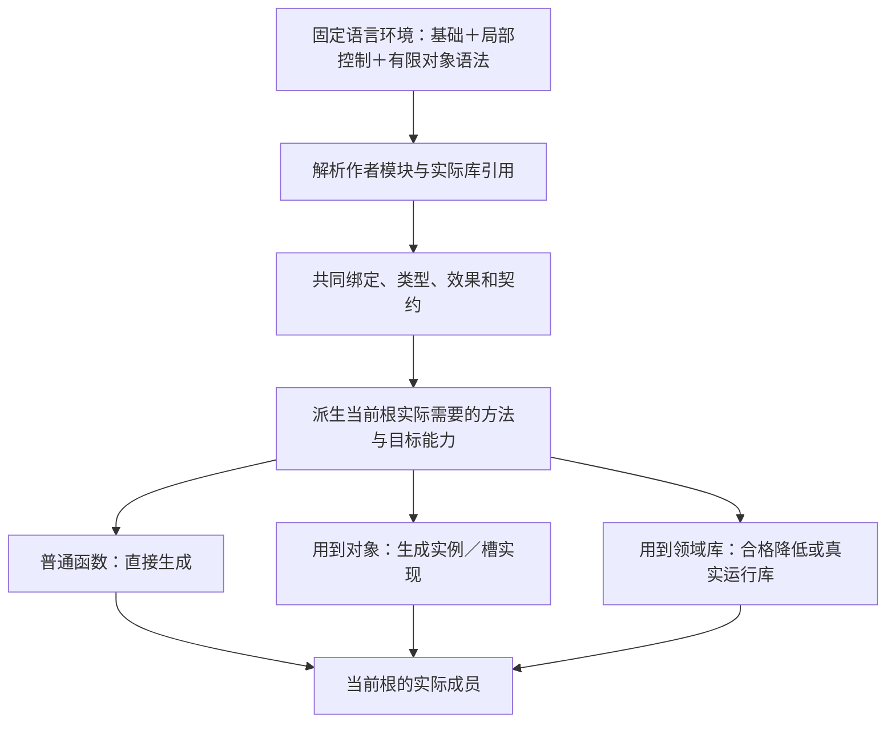

# 紧凑表示与程序范式

> **阅读范围**：计算语义与可选文本接口；不是主面前置 · [共同上下文](../../作者/可替换表示与适用范围.md)。

<details>
<summary>本页内容</summary>

- [简洁作者合同：复用值、推导类型、只写差异](#简洁作者合同复用值推导类型只写差异)
- [合同标识、默认语言组合与按需能力](#合同标识默认语言组合与按需能力)
- [当前语言风格与明确取舍](#当前语言风格与明确取舍)
- [第一份程序到完整模块](#第一份程序到完整模块)
- [作者文件、解释绑定与生成物](#作者文件解释绑定与生成物)
- [从AI接到任务到下一次修改](#从ai接到任务到下一次修改)
- [编译系统怎样由这套语言落地](#编译系统怎样由这套语言落地)
- [外部机制参照](#外部机制参照)
- [本语言规则如何交给首个实现](#本语言规则如何交给首个实现)

</details>


<a id="compact-author-contract"></a>
## 简洁作者合同：复用值、推导类型、只写差异

本节拥有明确选择`.sec`计算画像时的简洁形式及其确定解释：普通导入、函数值、函数定义和可推导信息省略。产品需求由[结构化模块](../../作者/结构化源码.md)承担；[可选design文本](../../../alternatives/文本意图/语法草案.md#intent-source-syntax)不是其语义拥有者或编译前置。没有嵌套SDK、强制GUI或另一份意图IR。工具信封、推导类型、节点身份和生成代码都不是作者需要维护的同义副本。

### 选定的正常写法

| 当前需求 | 正常作者内容 | 由工具承担的内容 |
|---|---|---|
| 已有整个入口满足要求 | 可直接选择锁定公开根；需要本地公开名时 `export let run = library.run;` | 固定真实导出、调用资格及目标入口；不另写同义算法 |
| 复用行为，只固定业务参数 | `export let pay = total => pricing.payable(total, {threshold: 500, discount: 20});` | 参数与返回的有限推导、名义记录检查、真实契约调用、目标函数 |
| 多项已有能力组成一条规则 | 普通调用和函数值表达结果关系 | 绑定、潜在效果、相交依赖与可保持的实现安排；不要求手建图 |
| 存在独特算法 | 带明确参数的普通 `fn`；有主体且结果可确定时省略返回类型 | 主体检查、返回与效果推导、目标生成 |
| 需要公开硬合同或类型不唯一 | 在原声明上显式写类型、`require/ensure`或合法控制 | 核对该约束；不从程序当前实现反向删除原要求 |

示例中的库名字仅指一份已解析定义，不能按拼写假定安装或合格。无体要求仍需实际供给才能生成。默认参数、占位式部分应用和通用流水线关键字**不在本次合同中**；未给必需实参仍然是错误，不通过“简洁”悄悄补业务政策。

### 导入可以省别名，不允许省准确绑定

`import "./pricing.sec";`等价于在该位置明确使用`pricing`别名；`import "sec/seq";`使用`seq`。算法仅从已经解码的模块定位字符串取路径的最后一段（末尾为空则不能派生别名）；文件形式只去掉一层`.sec`后缀，逻辑包路径直接使用末段。末段必须是本解释中的合法Ident、不是保留词、不是`_`，且不与模块现有可用顶层名字冲突。

末段为空、包含连字符或不受支持的后缀、路径含未定义的查询部分、默认名冲突，都要求在这条导入上显式`as`。不从包元数据、导入顺序、父目录或安装目录猜一个名字；`./index.sec`就得到`index`，不自动改成父目录名。显式`as`照旧，命名空间与公开范围没有变化。

源中未写`as`时，别名仍是派生语义事实，不需要再存入作者文件。移动被引用文件若改变默认名，保持性重构在调用方插入原别名或同时更新真实引用；不能因路径更名使全部使用者悄悄重绑定。没有请求格式整理时，不为统一风格给所有省略别名的导入加回`as`。

### 普通函数的返回类型可以推导

`export fn qualifies(score: Int, threshold: Int) = score >= threshold;`取得返回类型Bool。命名函数的参数类型与显式类型参数仍沿既有规则；没有函数体的声明必须写返回类型。接口方法、对象初始化器和当前对象方法签名继续采用它们自己的显式合同，不因本规则省略未设计的成员信息。

先收齐声明名、类型和显式签名，再根据实际依赖求出无递归歧义的返回类型。无正常后继的路径不参与正常结果合流；存在正常结果的路径按已有一致性规则合一，不自动新增union、Any、隐式数值转换或匿名名义类型。整个主体只有Never且没有可确定的公开结果时，允许作者显式写Never或预期结果，而不是猜一种返回值。

**有限递归规则：**函数/函数值签名依赖形成递归分量，且该分量仍含需要从主体求出的公开调用类型时，对这些声明要求显式类型。已闭合签名允许正常递归与现有多态递归检查。这个保守规则使递归缺类型不会引入无限推断搜索；其余分析仍服从输入与资源预算，不把所有递归函数都禁止，也不让运行样例决定类型。无循环的前向引用等待被引用签名后继续；未取得外部签名返回准确Needs，不按空类型处理。

显式返回类型继续是作者约束，不因为本次刚好能推导出同一类型就自动删除。公开推导签名与已接受接口比较；由Int变Text、效果扩大或公开类型身份变化均形成接口差异。推导只能描述候选，不能替作者接受兼容变化，也不能把隐藏的私有名义类型自动公开。

### 顶层函数值是被动定义，不是构建脚本

现有`export let`可以公开**已解析的普通函数引用，或静态环境下构造的lambda**。它使用同一个ConstDecl和lambda节点，不新增声明种类。没有业务差额的别名优先直接重导出或生成所需公开入口，不强制建立运行时转发对象。

静态构造捕获的是固定函数引用与有限不可变静态值；lambda主体中的调用在将来实际调用时发生，导入、类型推导和保存不执行它们。读取外部可变导出、getter、对象实例、资源句柄、宿主环境或有作用的顶层表达式，不取得这种资格；必须使用已经定义的运行入口或准确适配。顶层普通调用仍不因返回函数就获准执行。

类型推导先使用显式预期函数类型；没有预期时，单个未标注lambda参数建立一个当前定义内的单态类型变量，使用固定运算和实际被调签名约束它。例如`x => x + 1`得到Int参数，`total => pricing.payable(total, rule)`从已知payable参数取得Int。两个或更多未标注参数不借此新增文法，仍用原带类型参数列表。只写`x => x`且无预期，或只写`x => x.field`但没有可唯一确定的记录类型，返回局部注解需求；不搜索世界上哪个名义类型碰巧有field，也不自动全称泛化。直接引用带量化参数的函数时，若当前let所需单态实例不能确定，给出类型注解需求；需要继续公开任意类型参数时，使用已有公开重导出或显式`fn<T>`，不把本次简写偷换成新的多态值系统。

函数值创建效果与调用时的潜在效果分别计算。`export let f = x => log(x);`不在编译时执行log，但其调用必须保留已知log的效果和失败。普通局部闭包的可变捕获、逃逸和共享位置继续由[控制与寿命](../对象与控制/控制流与存储寿命.md#闭包存储依赖与外部效果投影)处理，不能为了顶层短写法把它们当成纯函数。

静态值依赖与lambda主体调用依赖分开。`let a = b; let b = a;`没有实际值来源，拒绝严格初始化环；lambda主体中的相互调用不在导入时执行，可以在显式类型足够、全部声明和静态捕获已就绪以后正常调用。构造描述中的函数引用使用确定声明/代码引用，不在编译期递归展开运行调用。存在尚未建立的数据捕获时不得运行半初始化模块。

效果推导与值类型推导分别闭合：参数和结果形状已知、潜在效果仍待传播的内部头，不属于公开可调用结果。尤其回调预期为纯时，要等对应效果约束获得结论后才能生成；不能先按空效果通过，再补一个日志说明。

通过函数值调用仍使用位置实参；形参显示名不是新具名调用承诺。直接别名保留被调定义的契约入口；固定参数lambda正常调用原函数，原`require/ensure`和错误次序不丢失，但不据此声称已自动证明或推导lambda的全部业务前置。需要独立公开契约时使用普通`fn`，不再生成一份同义要求表。

### 推导后的完整形式不回写为作者负担

文本中省略的类型、导入别名和实际捕获进入HeaderIndex/BodyAnalysis的派生表；原CST和字节继续是作者源。结构模式也允许相应推导槽省略，两种入口共用检查，解析后的内部结果必须完整才可调用或生成。

自动保存、格式化、图展开和代码生成不得把简短源永久改写成满注解`fn`、完整AST或配置表。请求“展开查看”可以显示派生形态；明确请求“固定签名”才把推导类型写入原声明，并把它作为新的硬约束检查。未知不能省成已通过；错误片段和未决定类型仍可保存，生成仅阻塞真正依赖它们的根。

本能力是解释修订的实际变化。`.sec`和既有外壳名称不变，精确语言/结构规则修订必须共同绑定；旧只接受显式as/返回类型的读取器返回不支持，不按关键词猜升级。无上下文旧工具默认保持原合同，初始化已采用本修订的工程后，客户端沿实际context工作，不逐函数选择版本。

### 当前范围的正常与失败判定

| 输入或变化 | 结果 |
|---|---|
| 两个文件同时新增；前一个导出结果类型待推导 | 收齐本批名字，先完成被依赖签名，再完成使用者，不按文件提交顺序决定 |
| 缺函数主体，却省略返回类型 | 保留草稿，要求声明注解；不把空白当Never或Any |
| lambda参数同时被要求Int与Text | TYPE_MISMATCH，定位两个约束来源，不任选其一 |
| 参数只参与恒等返回 | 无预期时ANNOTATION_REQUIRED；显式类型后沿同一规则继续 |
| 闭包体有I/O或不终止 | 构造不执行；调用合同保留相关条件，纯创建不代签纯调用 |
| 默认导入名冲突 | 本导入需要显式as，不重命名另一作者定义 |
| 输出根指向上述合格函数值 | 与普通fn同一CallableIndex，允许生成和已获准的compute-eval |
| 返回类型或库签名改变 | 重新推导真实依赖并显示公共接口变化，不偷偷改原要求 |
| 用户改生成代码的业务字面量 | 有对应时回写原lambda字面量，不强制展开完整函数 |
| 用户改生成代码的推导类型 | 找真实约束拥有者；不能唯一映射则保留冲突，不在原源臆造一个注解 |

这份简洁性由最短完整作者源码及其第二次修改检验；与使用同一库的成熟语言作公平比较。有限源码字符减少不等于实际AI时间、token、成功率和总生态成本已经取得收益。

### 需求精化与短作者形式同时保持

跨软件要求描述结果、结构、时间与保持条件；本章控制这些内容中真正需要写源时的表达。两者共同进入已有Requirement、作者候选和编译器，不是需求层替换了函数值、可省导入别名或返回推导。库已有的规则仍只引用一次，显式注解也不被以“能够推导”为由删除。

声明只取得类型形状时不对外发布为可调用；相交主体/效果闭合以后才封存HeaderIndex。缺项定位到实际声明与根。类型、捕获和派生约束留在分析结果中；执行一次关系变更或generated-edit不会把短源码保存成展开版本。真实算法体或新的独立要求仍由其原作者位置拥有。


## 合同标识、默认语言组合与按需能力

`sec.object/1`的准确含义是**SEC对象语义合同的第1兼容代**：`sec`给出命名范围，`object`给出语义族，`/1`给出合同代号。它不是`.object`扩展名、执行路径、对象实例版本、产品服务或要求作者填写的类参数。这里的“兼容代”只规定需要核对哪组公共规则，不单独证明任意两个实现兼容。

| 实际名称 | 角色和拥有者 | 作者何时需要接触 |
|---|---|---|
| `sec.semantic/1`、`sec.object/1` | 基础值/函数与对象语义合同；由同一个语言环境组合解释 | 初始化工程或解释升级的说明；日常写函数/类不逐项选择 |
| `sec/object`、`sec/stream`、`sec/relation` | 模块公开入口；提供有名字的类型、效果、函数或契约内在函数 | 确实使用其中的名字时导入；仅使用已具备的class语法不必导入对象模块 |
| `sec.object-body/1`、`sec.semantic-body/1` | 结构体编码合同，决定怎样读取和写回 | 结构适配器、交换和迁移；普通源码不手填 |
| `sec.ai-tools/2`、计算操作扩展 | 工具请求与结果合同 | 客户端首次协商和实际相交调用，不改变程序语义 |
| 文档修订、包发布版本、规则内容摘要、方法实现修订 | 文档、分发、精确解释和执行方法的不同身份 | 工具沿现有锁绑定；不能用`/1`或文件名代替精确内容 |

**计算画像选择：明确选用既有通用计算文本时**，使用固定组合，包含基础语义、有限局部控制和已定义对象语法。它只有一套名称、类型、效果、契约及模块检查，不要求每个成员再选画像；其解释在读取前由上下文绑定。该默认仅适用于选择了此计算入口的区域，不把所有新产品默认迁为`.sec`。未提供足够解释的旧请求按其确切协议报告缺项，不能按内容或扩展名猜一个新主面。

原先明确绑定基础专用解释的模块仍使用原规则。新默认不覆写已固定旧规则；采用新组合需形成明确的解释变更候选，核对新增上下文构造与原标识符、公开类型及消费者。`/1`名称相同但内容不同必须有不同的规则修订和内容身份。读不到当前精确规则时报告缺项，不选择最新，也不从普通import推断语言已经升级。

对象合同中的构造、引用相等和动态分派是同一语言的一个功能部分，不是第三种作者前端。状态、关系、流、微分通过当前普通库形式使用；它们的语义方法由相应定义绑定。事务声明等会增加语法的可选领域，只在确实选择它们的语言组合时解释，不因本地工具导入某个值库而改变文法。语言可见范围、库可用范围、后端支持、运行装配和当前权限分别由原责任承担，不能共用一个`enabled`布尔值。

### 已有公共字段怎样精确选择这份组合

当前不引入第三个语言入口名。`sourceLanguage:"sec.object/1"`解析到对象语言入口，其锁节点明确依赖本次精确的基础规则与对象增量；结构外壳可用`dialects: {s: {languageId:"sec.object", constraint:"1"}}`选择对应入口，再由锁固定真实revision/content。入口是一个组合的可寻址定义，不是第二个编译器。普通class和其内普通函数都由它解释。

新项目/会话的初始化器按已选默认建立这个context，客户端后续沿真实context自动带入解释，用户不对每个类重复选择。没有任何context或显式sourceLanguage的**旧v2裸source继续使用原sec.semantic/1默认**；不能在兼容协议里悄悄换含义。这样的裸请求若含class，应返回缺少对象解释的准确诊断及已支持的选择，不凭源词自动激活。客户端可通过既有context或一次显式sourceLanguage使用新组合；没有新增公共字段。这个区分使默认体验简洁，同时保留无上下文协议的准确性。

语言入口决定语法可见范围，所需方法与运行输出仍由实际根决定。`import "sec/object"`依然只取命名符号，不能代替上述上下文选择。文件名和`.sec`后缀不编码合同代号；请求、结构模块、项目清单和锁各自的准确字段见[实际存放与读取](../../作者/工程源/清单模块与绑定锁.md#合同标识的实际存放与读取顺序)。对象入口与其基础依赖都缺可读取内容时，保全作者输入并报告精确绑定缺项，不只记录一个/1就尝试生成。

### 一次固定解释，实际使用才引入成本

<a id="fig-language-composition"></a>

图表达解释、作者行为、派生需要与运行制品，不表达权限；没有从“支持class”到“必须启动对象服务”的边。



编译器从输出根、模块检查义务、导入、显式目标约束和实际表达式建立工作表；逐项取得所需方法及它新增的依赖，按精确角色去重，直到闭合或返回某个具体缺口。需要查询候选集合时记录集合依赖；已有固定实现直接使用。递归调用复用签名/方法，不把未来递归无限展开。展开器新增行为必须重新进入相交检查，不能复制旧的“已检查”标记。

检查阶段可能需要查看未被输出的声明以满足模块规则；这不要求把该声明的运行设施打包。反过来，公开ABI、初始化或完整发行根要求的成员，不能因没有普通调用边就删掉。显式无体声明按其既有允许范围保留；缺少当前必须的语义处理器是具体阶段缺项，不被猜成空效果或成功。

提供class语法不会使`fn twice(n: Int) -> Int = n * 2;`生成虚表、对象登记或数据库。普通对象也只按目标需要生成布局和方法，不产生SEC开发任务。解析器内可以共享已装载表；运行库和昂贵分析按实际使用选择，不能为了口号式“按需”每次反复卸载基本解析规则。

### 版本选择与兼容的有限保证

`/1`不是完整SemVer、代码提交或密码学摘要。合同代号用于查找一族解释；具体修订与内容用于确定本次实际含义；实现修订用于定位方法；目标工具及环境按它们的实际影响绑定。旧制品与当前工具不是因为标签相同就可互换。不同规则如果在本使用域被证明可替换，可以复用相应结果；否则新输入重算真实消费者。

成熟语言的edition机制说明，表面变化可以通过显式解释版本进入而不改写旧程序；它并不免除跨版本类型和ABI的接合。[Rust editions](https://doc.rust-lang.org/edition-guide/editions/)。SemVer要求先确定公共API再解释兼容变化，本合同代号不冒充一次实际发布或已获兼容证明。[SemVer](https://semver.org/)。

### 无新算法的工程不要求创建语义主体

语言定义哪些作者构造有意义，不规定每个目标输出必须由本工程的`.sec`函数体起步。已合格外部定义可通过精确导入视图提供公开签名，使用点选择直接调用和真实适配；已有主体则正常检查。源语言职责因此不扩大成重建全部标准库，缺实际供给也不能由一份声明代替。

对固定目标的完整复用工程，项目可只声明导入出口和目标，首要流程见[成熟能力到双目标工程](../../../examples/实现校准/成熟供给与计算工具.md#native-supply-product-example)。只有本项目确有新行为才需要新的作者主体；结构编码与文本不是强制包装外部库的两种方法。


## 当前语言风格与明确取舍

基础语言是**静态类型、词法作用域、按值求值、以表达式为中心、不可变值、显式效果端口、可递归的中立语言**。类型和函数签名可明确书写，局部信息可推导。`require/ensure`是行为合同，不是权限或自动实现器。

基础专用解释继续采用不可变表达式；当前通用组合另提供[局部控制与寿命](../对象与控制/控制流与存储寿命.md)：var/set、while及绑定到真实函数/循环的退出，既可直接写迭代，也可继续写递归。对象语义按需使用。隐式空值和任意脚本执行不因新增控制而开放；所有前端共用类型、效果、契约和目标保持。函数式基础便于解释某些变换，不构成让普通算法强制递归的理由。

| 内容 | 基础作者域中的状态 | 不能冒领的更强能力 |
|---|---|---|
| 函数、记录、和类型、递归、契约、模块封装 | 有具体文本与语义规则；opaque定义模块和客户端不同可见性 | 没有因此证明实现健全；隐藏表示不等于安全沙箱 |
| 高阶函数与显式签名泛型 | 有主体、效果、调用和目标策略合同 | 不是任意类型推断、类型类、依赖类型全部完成 |
| 状态数据、一步转换与有限层级反应 | 基础类型/函数、事务画像与[状态图库](../状态关系与流/层级状态与事件.md)各承担相应规则 | 状态图有有限作者/运行合同；不等于任意分布式事务、动态拓扑和硬实时已完成 |
| 外部端口 | 可声明类型与效果，由目标绑定实现 | 不等于写一个port便拥有数据库、线程或真实权限 |
| 异步、流、借用、时间、概率 | 已有对应领域设计，需明确启用与各自作者映射 | 不被本章18词文法自动接受 |
| 原生程序 | 按其原语言保全、分析与绑定 | 不承诺任意原生程序自动无损转成其他语言 |

不得把“可以编码成函数”当成高层工程表示已完成。若状态表、权限关系或事务组合是所选交付能力，就要为其提供实际作者映射、解释、错误、变更和目标义务；不能只新增一个名字。反过来，未请求这些高层表面的纯函数不被它们阻断。


## 第一份程序到完整模块

以下是设计范本，尚未执行；所有源码都用同一个基础文法，不再临时发明一套简写语法。

### 一个没有工程目录的函数

```sec
export fn twice(n: Int) -> Int = n * 2;
```

函数体是表达式，不是生成器返回的目标代码，也不是需要填入JSON的节点。无需`define/code/splice/emit`、项目身份、数据库或运行日志。默认只保存/检查候选；实际生成哪个目标，由工具或已冻结目标选择决定。

### 可复用规则与工程内实例

`model/pricing.sec`：

```sec
export type PriceRule = {
  threshold: Int,
  discount: Int
};

export fn payable(total: Int, rule: PriceRule) -> Int
  require total >= 0
  require 0 <= rule.discount && rule.discount <= rule.threshold
  ensure 0 <= result && result <= total
= if total >= rule.threshold
  then total - rule.discount
  else total;
```

`model/shop.sec`：

```sec
import "./pricing.sec" as pricing;

let retail: pricing.PriceRule = { threshold: 500, discount: 20 };

export fn pay(total: Int) -> Int
  require total >= 0
= pricing.payable(total, retail);
```

价格规则是公开名义记录；retail只是在本模块中的静态值，不是另一套全局治理实体。匿名记录在明确预期的`pricing.PriceRule`下构造该名义值；并不允许把其他同布局名义类型暗转成它。`require`第二条同时保证门槛不低于非负优惠；这不是作者必须额外写一遍目标语言检查代码。

普通调用就是组合和实例化。改本店优惠只改retail；改变所有使用者的算法则修改payable。是否把retail专门化成目标常量，由合法后端决定，不要求作者再编写生成器。

### 局部算法不是只能调用预装能力

```sec
export fn sum(xs: List<Int>) -> Int =
  match xs {
    case [] => 0;
    case [head, ..tail] => head + sum(tail);
  };
```

它不依赖官方“求和工具”注册。这个递归定义可能需要不同的目标栈策略；其朴素写法也不是性能最优保证。尾列表是逻辑分解，不规定每一步复制整个剩余列表。后端优化必须保持结果、失败、合同和对应资源承诺。

### 直接表达状态规则而不写生成代码

```sec
export type State = Open() | Closed(Text);
export type Event = Close(Text) | Reopen();
export type Failure = MissingReason() | Forbidden() | InvalidTransition();

export fn transition(
  state: State,
  event: Event,
  isAdmin: Bool
) -> Result<State, Failure> !{} =
  match event {
    case Event.Close(reason) =>
      if reason == ""
      then Result.Err(Failure.MissingReason())
      else match state {
        case State.Open() => Result.Ok(State.Closed(reason));
        case State.Closed(_) => Result.Err(Failure.InvalidTransition());
      };
    case Event.Reopen() =>
      if !isAdmin
      then Result.Err(Failure.Forbidden())
      else match state {
        case State.Open() => Result.Err(Failure.InvalidTransition());
        case State.Closed(_) => Result.Ok(State.Open());
      };
  };
```

这明确表达“状态值怎样转移”，不需要一个官方工单封装。错误优先级也由此代码决定：Close先检查原因，Reopen先检查角色，再检查状态，后端不能自行重排。

但`isAdmin`只是输入事实，不能由调用方伪造后自动成为真实授权。上述函数不会读取数据库、保存状态或发送通知；应用层必须从可信环境取得相应事实，并按目标并发与提交合同执行。纯状态转换有助于把规则与作用分离，不构成完整事务或可部署工单系统。当前范本只是基础语言用法；有限层级状态专用合同由[层级状态与事件反应](../状态关系与流/层级状态与事件.md)定义，不能互相代签完整事务。


## 作者文件、解释绑定与生成物

```text
project/
  src/
    pricing.sec
    shop.sec
  sec.project.json      # 持久工程的要求、范围与输出定位
  sec.lock.json         # 工具维护精确解析结果，不重复作者逻辑
  generated/           # 仅在要求写出目标源码时创建
```

小片段不需要这些目录。`sec.project.json`拥有源范围和所选输出根，`sec.lock.json`记录真正选定的解释与依赖；它们不镜像函数体，不签发权限。目标目录只在明确请求写回时存在；预览只返回内存产物也合法。

模块导入采用相对`.sec`路径或已锁定的包说明符；具体规则见下文。源码表达含义，manifest选择输出，backend选择合格表示。不要为每个函数建立一个文件或每个概念建立一个服务。

目录示例不决定模块语言、权限和包身份。`src/`可以同时放中立与原生作者源，按显式范围和解释区分；本章既有`model/`路径示例是合法映射，不是另一套默认目录。单文件可以直接位于根；完整规则由[渐进工程布局](../../作者/工程源/清单模块与绑定锁.md#渐进布局与最小持久工程)拥有。

### 两个目标的对照，不把输出写成作者条件

例如无契约的twice，在相应后端中可以生成以下设计候选。

TypeScript：

```ts
export function twice(n: bigint): bigint {
  return n * 2n;
}
```

Java：

```java
import java.math.BigInteger;

public final class Numbers {
    private Numbers() {}

    public static BigInteger twice(BigInteger n) {
        return n.multiply(BigInteger.valueOf(2));
    }
}
```

中立Int按精确整数表示；示例只承诺通过相应类型化边界传入合法值后的含义，不接受任意`null`、字符串或伪造原生对象。外部输入校验由已选ABI边界承担。类名、模块路径及包装由目标布局明确，而不是新增中立业务含义。Java类容器不证明中立语言引入了类；TypeScript代码也不自动需要SEC运行时。

带require/ensure的payable默认生成相应checked入口；若某项检查不能实现或没有合格消解依据，就明确限制产物资格，不能为了展示短输出省略条款。普通数学整数并不意味着有限机器没有资源上限。

两个源码片段是预期形态，是设计中的预期产物形态。第二目标用于检验公共语义有没有混入第一个宿主假设，不声称所有目标已经实现。


## 从AI接到任务到下一次修改

AI使用同一有限工具协议，而不是把类型检查、名字解析和版本选择写成多轮能力查询。

1. **建立候选。** 闭合小函数可直接preview；多模块可以用files输入形成同一候选，不逐文件制造无法互相引用的孤立对象。
2. **检查源。** 只请求types时，可以在没有后端时检查绑定、类型、效果和可判定的结构。
3. **预览目标。** 同一候选可产生TS、Java等各自绑定的产物，目标缺项不改业务含义。
4. **取得证据。** 目标类型检查与行为案例分别绑定实际artifact；案例由独立输入提供。
5. **按目的保存或应用。** save-source保存作者内容，write-output消费确切产物；实际目标、前像和权限另行提供。
6. **继续变化。** 基于明确候选修改，返回新候选；旧产物与证据不原地改标签。需要目标diff时显式compareTo。

以下是拟定调用示意；名字如c1、a1是服务实际产生的引用的占位，不是现有资源：

```text
sec.propose({
  files: {
    "model/pricing.sec": "上述pricing.sec原文",
    "model/shop.sec": "上述shop.sec原文"
  }
})
  → c1

sec.check({candidateRef: "c1", methods: ["types"]})

sec.preview({candidateRef: "c1", entry: "model/shop.sec", target: "typescript"})
  → c1，a1，目标源码及generated-unchecked

sec.preview({candidateRef: "c1", entry: "model/shop.sec", target: "java"})
  → c1，a1-java，目标源码或该目标缺项

sec.propose({
  base: "c1",
  edits: [{
    path: "model/shop.sec",
    old: "{ threshold: 500, discount: 20 }",
    new: "{ threshold: 1000, discount: 50 }"
  }]
})
  → c2

sec.preview({
  candidateRef: "c2", entry: "model/shop.sec",
  target: "typescript", return: "diff", compareTo: "a1"
})
  → a2与真实差异

sec.check({
  candidateRef: "c2", artifactRef: "a2",
  methods: ["types", "cases"], casesRef: "case-set"
})

sec.apply({
  candidateRef: "c2", artifactRef: "a2",
  mode: "write-output", targetRef: "workspace-output",
  base: "target-preimage", requestId: "write-2"
})
```

一个纯设计任务可以在候选、规格与差异交付处结束，不自动进入目标执行或物理应用。上面展示不同操作的含义，不是规定每次都要六次调用；已许可的编排可组合，但不得混淆对象和真实状态。

files只传原文及确实需要的路径，**不是另一份AST或类型树**；已有工程读取采用真实context。普通短函数仍只需source。创建、删除与文件替换的精确语义由操作章拥有，不能用源文件名作为覆盖权限。


## 编译系统怎样由这套语言落地

责任链为：
**保全原文与位置 → 解析本语言 → 绑定模块/符号 → 类型与效果 → 合同义务 → 目标无关程序 → 所选领域展开/降低 → 目标表示/布局 → 打印 → 所请求的独立检查。**

要求、调用和声明必须有可交接的对象；AST、索引与缓存是派生物。无依赖的新函数无需读取全部工程、全部能力或历史证据。已有原生语言复用其成熟前端；新增`.sec`本身仍要实现自己的读取与语义检查，不能只用TS parser换文件后缀。

第一实现默认模块化单体。输入/类型/诊断/目标边界先稳定，不把每类语义变成服务。当前使用TS写实现不要求源类型调用ts.Type，不要求将类型判定交回JavaScript，也不要求产品输出常驻SEC运行时。

最早实现闭合函数、跨模块规则、同一源的两个小目标及一次真实修改。每个被开放的构造同时具备解释、诊断、生成与组合检查；未开放的构造明确诊断，不建空壳声称支持。验证可以用针对合同的测试、独立解释或小范围差分，**本设计交付不据此自行开发这些程序**。


## 外部机制参照

[WebAssembly规范的语义阶段](https://webassembly.github.io/spec/core/intro/overview.html#semantic-phases)把读取、验证、实例化与调用区分；用于提醒本设计不能把语法、类型检查和实际执行混为一事，不要求采用其栈机和类型。
[Racket的语言机制](https://docs.racket-lang.org/guide/languages.html)区分reader与expander；用于表示与解释的分层，不证明SEC的语言或宏实现正确。
[MLIR Toy语言介绍](https://mlir.llvm.org/docs/Tutorials/Toy/Ch-1/)先说明数据、求值和作者程序，再说明AST；用于要求本产品先有能通读的作者范本，不要求复制Toy的领域及布局。
其余细节依据留在[资料边界](../../依据/来源/设计依据与资料边界.md)。来源定位不表示实际教程或完整实现已经验证。


## 本语言规则如何交给首个实现

实现采用[scanner、声明解析、局部双向检查与效果闭合](../../编译/内核/编译值服务.md#当前选定的首个编译实现方案)，这些方法实现本章含义，不能为顺手调用TypeScript而引入truthiness、结构名义混同、默认参数或JavaScript的BigInt一元加行为。

BodyAnalysis可以包含错误及poison供继续诊断，只有按当前模块/解释真正通过的部分才获得对应CheckedModule引用；高级构造尚无规则或目标实现时准确保全/拒绝该根。定义与函数值的契约入口仍由本章规定，目标降低不能在传参时自动换成未经检查的私有体。实现验证只覆盖所声明子域，不以TS目标检查代替中立语义检查。

源字节跨度、目标工具码元位置和用户显示坐标在[目标位置适配](../../编译/目标/具体降低与领域输出.md#源坐标转换与可复查错误)中定义其转换。本章不新增一种字符索引语义；这些是编辑与诊断元数据，不是业务Text操作。
