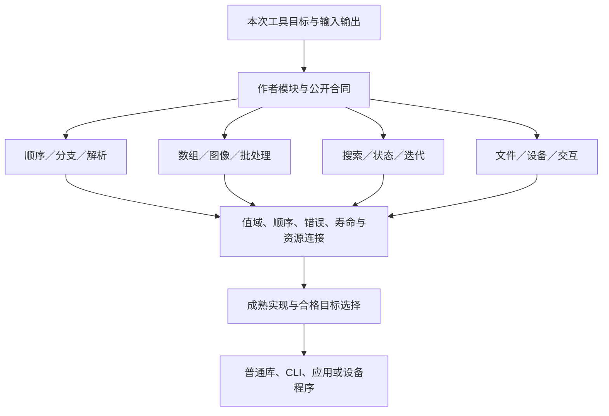
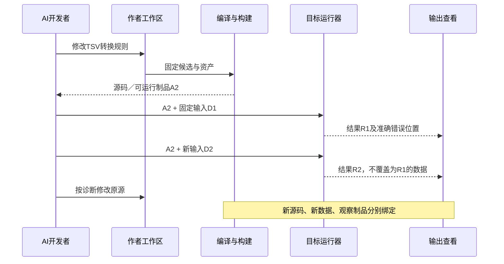

# 计算结构与算法实现设计

> **阅读范围**：计算语义与可选文本接口；不是主面前置。

<details>
<summary>本页内容</summary>

- [完整计算工程的当前总设计](#完整计算工程的当前总设计)
- [计算计划怎样从多个模块形成一个真实程序](#计算计划怎样从多个模块形成一个真实程序)
- [一个完整目标工程：本地图分析、布局与导出](#一个完整目标工程本地图分析布局与导出)
- [可观察、可调试、可交付也是计算成品的基础](#可观察可调试可交付也是计算成品的基础)
- [当前不考虑的部分怎样存放而不污染计算主线](#当前不考虑的部分怎样存放而不污染计算主线)
- [计算软件不是小型事务应用](#计算软件不是小型事务应用)
- [作者选择与可推导的实现分开](#作者选择与可推导的实现分开)
- [锐化例的作者成本与更高层表达义务](#锐化例的作者成本与更高层表达义务)
- [一个可完整书写的计算定义](#一个可完整书写的计算定义)
- [线性邻域计算的正向作者合同与实现](#线性邻域计算的正向作者合同与实现)
- [迭代、归约与稀疏计算的独立机制](#迭代归约与稀疏计算的独立机制)
- [数值、随机和微分不由后端隐式选择](#数值随机和微分不由后端隐式选择)
- [流、渲染、仿真和硬实时的状态处理](#流渲染仿真和硬实时的状态处理)
- [从单个计算核到完整消费者的契约接合](#从单个计算核到完整消费者的契约接合)
- [资源与故障的端到端控制](#资源与故障的端到端控制)
- [按需启用与不需要部分的真实消除](#按需启用与不需要部分的真实消除)
- [连续开发与有限验收](#连续开发与有限验收)
- [取舍与重新裁决](#取舍与重新裁决)
- [小工具对对象、流和微分的按需采用](#小工具对对象流和微分的按需采用)

</details>


本章拥有广义软件计算与工具工作的作者分解、算法及实现选择、输入输出和完整变更路径；数值密集计算只是其中一个子域。它与[事务应用](../状态关系与流/事务与交付.md)并列，不是事务系统的前置小例子。基础语法、函数、类型与效果继续由[语言体系](../../作者/可替换表示与适用范围.md)拥有；资源、目标生成和证明方法仍引用各自规范。本章不增加关键字、顶层工具、运行服务或另一份作者数据。

`sec/grid` 与 `sec/grid-linear` 定义网格及线性邻域的有限计算合同。它们与迭代、数值和完整程序组织共同使用；运行与实现支持范围由当前问题记录及实际工具绑定分别说明。

## 完整计算工程的当前总设计

当前优先完整工具与计算软件，涵盖小工具、普通业务规则、交互与复杂算法；中间件与数据库内部深化暂缓，其外部边界仍按相交要求设计。本章定义计算工程的横向结构和具体实现组织；网格、线性邻域、迭代与数值合同是其中的具体能力，不能由单个算子或库代表整个产品。

这一范围包括开发者能够创建、理解、组合、调试、剖析、交付并再次修改的计算程序。函数库、命令行工具、离线批处理、编译器/分析器、交互应用、数值求解和仿真都可成为完整成果；不同形态使用相交能力，不先接数据库、消息系统、多租户、分布式工作流或远程集群。与计算相交的文件保全、数据披露、内存/设备资源和真实执行准入仍由原合同承担。

“先要有大系统”在此意味着**总体对象、模块接合、正常工作过程、实现责任和不同行为类型有明确位置**，不是先把所有库写完，也不是预建所有服务。某个库支持不全要列明；共同架构已经确定的关系要实际复用，不能每完成一个算法就另起一套平台。

### 小工具、业务逻辑与计算密集程序的同一范围

“计算”在本产品的当前工作范围是广义软件行为，不是HPC标签。文本处理、进制与格式转换、校验、散列和密码工具、剪贴板/文件处理、图片音视频与文档工具、数据清理、正则调试、压缩解压、搜索比对、日程或业务规则、浏览器/桌面交互、自动化与批处理均可成为完整工程。是否小巧、是否CPU占用高、是否用于商业，都不决定它能否使用SEC。密码方案、安全协议等应复用真实合格库，不凭“工具很小”降低专业边界。

这些名称不是封闭清单。每个任务同时按**操作、对象、寿命、效果和交付**定位：转换/判断/组织/搜索/生成/交互等操作；字节/文本/记录/图/媒体/资源等对象；一次批次/交互会话/持续反应等寿命；纯计算/读取/本地写入/外部作用等边界；库结果/文件/包/显示/可执行产物等交付。新项目由真实组合定位；无法自然归类的机制回到目标与义务分析，不能强塞进既有十四行。

“批量改名”有文件前像和冲突，“进制转换”有数值域，“PDF拆分”有页范围与资源，“正则调试”有输入和时间预算，“账户规则计算”可能只作纯判断。这些义务来自行为，不因为名字包含业务就启用数据库，也不因为不部署中间件而忽略真实I/O和权限。下表继续拥有机制索引；目标应用的具体合同另按当前任务闭合。

### 一个非数值小工具的完整闭环

当前范本是固定方言的TSV转JSON数组，输入和输出是有限字节资产。选定UTF-8严格解码；制表符分列，行终止仅接受LF或CRLF，允许两者混合并记录实际字节位置，裸CR拒绝。双引号是普通字段字符，没有引用或转义语法，**不能使用引号包住嵌入换行/制表符**；这不是覆盖任意CSV或所有TSV扩展的承诺。仅文件起始的UTF-8 BOM可被解码器识别，其他U+FEFF保留为字段内容；空文件或只有BOM返回MissingHeader。读取第一物理行作表头；至少一个字段且每个表头非空、精确唯一，数据行列数必须一致。不去首尾空白、不规范化Unicode；空白表头只要非空就在本方言合法，要求禁止时另设明确约束。末尾一个行终止不增加空记录；数据中的其他空行按一列空字段解释，按实际列数检查。

默认所有单元格为Text，不推断数字，不去前导零，不去重。输入为两列`id`、`amount`且两行均为`001`、`12`时，结果是包含两份`{"id":"001","amount":"12"}`的数组，行次序和重数保持。JSON对象字段按表头顺序输出是本工具的字节布局选择；消费者若只关心JSON值相等，不能因此要求所有格式化字节相同。

实现分为三个普通模块合同：`decode(bytes,dialect) → Result<Table,InputProblem>`取得精确表头、行与位置；`convert(table,fieldPolicy) → Result<Records,ConversionProblem>`按明确映射选择字段和类型；`encode(records,layout) → Bytes`使用成熟JSON编码器并核输出预算。普通函数组合即可，不新增“转换器”关键字，不把结果JSON当SEC的作者语言。

本次未指定类型转换时，`fieldPolicy`继承全Text且保留全部列。以后要求amount改成Int，只改这一列的明确策略；必须规定空串、符号、前导零、超界和非法字符怎样处理。列中无法合法转换时，失败报告行/列与字段规则，输出根不发布半份成功JSON；若作者明确选择逐行部分结果，应成为不同结果合同，不能默认丢坏行。

程序源码、输入数据和输出目的分别固定。预览只生成程序；compute-run读取已给输入并产生隔离结果；保存结果才使用文件前像。取消不覆盖既有输出，旧会话结果不能显示为当前新输入。没有要求覆盖输入就不覆盖；输出同名冲突由真实保存协议决定，不靠自动加后缀冒称保持固定路径。超过字节/行/字段/输出预算返回相交资源结果，不启动数据库或上传原数据。

更大的输入可采用流式读取和写入隔离内容；在完整校验之前不把半份结果发布为完整输出。该路线是否减少内存，要同时计算当前记录、编码缓冲和已保留输出，不仅比较输入大小。真实格式库、编码器与工具状态属于实现和符合性工作，本例没有执行。

这条工具轨迹与数值、图和状态例共同检验公共基础。无需每种工具一套引擎，也不能用一个范本证明所有格式和业务已覆盖。

### 两个系统、三个阶段不能混成一张图

| 对象 | 实际保存/负责什么 | 不应因此发生什么 |
|---|---|---|
| SEC开发系统 | 作者源、独立要求、候选、编译绑定、资产、调试映射和获准工具操作 | 不把自己十个逻辑模块复制进每个输出程序 |
| 开发者的目标计算程序 | 模块、算法、数据表示、输入输出、工作状态、资源、界面或批处理入口 | 不把每个像素、搜索节点、帧和迭代变成SEC持久任务 |
| 编译阶段 | 检查有限程序与高层结构，选择合法实现，生成实际制品 | 不为看清数据依赖而默认执行作者程序或读完整运行数据 |
| 目标执行阶段 | 处理本次真实输入、动态控制流、迭代、缓冲与设备 | 不在每次调用时重新向AI解释作者意图或选择语言 |
| 观察/诊断阶段 | 对指定源码/产物/运行取得局部值、路径和成本 | 不把重新算出的值伪称原运行曾有的值，不自动修改程序 |

分别存在作者组合关系、编译依赖和运行先后关系。运行中的动态数据可以决定分支、输出数量与后续计算；编译器生成相应控制，而不是要求所有运行图在编译时完全展开。对适合静态数据并行的区域保留高层形状和访问关系，对控制密集区域保留顺序、分支和状态；二者通过实际值、作用与寿命合同组合。

### 总体计算能力：按机制组合，而不是按行业穷举

下表给出当前架构必须容纳的独立机制与采用决定。它是设计覆盖索引，不是把十四种能力全部加载给AI的工具表；具体实现支持与未定语义由问题登记承担。

| 计算形态与适用工作 | 直接作者含义与稳定接口 | 当前实现与组合方法 | 失败/反转条件 |
|---|---|---|---|
| 标量、位、字节、编码与压缩 | 数值域、位宽/溢出、字节序、格式、错误位置 | 普通函数及成熟格式库；流式分块须保存边界/字典状态 | 格式错误不填零；目标定宽不冒充数学Int；截断不作为完整输出 |
| 序列、集合、排序、扫描与归约 | 顺序、重复、相等、初值、关联条件 | 顺序基线；合格并行scan/reduce、索引或成熟库 | 纯函数也可出错/不终止；浮点重排和同键顺序需单独许可 |
| 稠密数组、张量、图像与网格 | 形状、轴、单位、边界、索引与输出关系 | 形状/访问分析；分块、向量化、缓冲复用和设备区域 | 动态形状不是非法程序；先选合格一般实现，特化失败不得截断 |
| 稀疏结构与图算法 | 缺项含义、重复边/坐标、可达、前沿和停止 | 邻接/CSR/索引、有限工作队列，分组算法及局部更新 | 缺项不等于未知；删边可能影响全图；自环/多边有明确政策 |
| 树、解析器、编译器与符号计算 | 作用域、绑定、语法错误恢复、改写和正常形 | 递归或显式栈、符号表、规则与阶段化分析 | 不把树节点当业务聚合；无界改写只限制该策略，不制造伪正规形 |
| 搜索、规划与组合优化 | 可行性、目标函数、剪枝依据、最优/近似要求 | 精确方法、小范围搜索或获准启发式；返回候选与界 | 没找到不是无解；最先返回不是最优；预算与算法结束不同 |
| 线性代数、方程组与数值求解 | 数制、矩阵性质、尺度、误差、残差/解误差条件 | 合格成熟求解器，稳定/预条件策略与明确收敛判据 | 小残差不自动保证小解误差；不改变矩阵性质迁就所选库 |
| 迭代、仿真与积分 | 初态、一步演化、采样/步长、停止及允许近似 | 显式迭代状态与时间尺度；同步旧值或已声明顺序更新 | 扫描顺序可改变模型；未收敛/发散/预算/取消分别返回 |
| 频域、信号、音视频流 | 采样率、时基、窗口、相位、格式与缺帧政策 | 成熟FFT/编码器、有限队列和缓冲；按需向量化 | 零填充、丢帧、重采样都属语义变化，不能作为隐式缓存淘汰 |
| 微分、优化与学习计算 | 原函数、导数定义、损失、随机/状态及梯度策略 | 合格AD/算子库、tape/重算/检查点；实际数值合同 | 不可微点、离散选择与随机估计不能靠一个grad名字解决；U041继续闭合 |
| 几何、渲染与场景处理 | 坐标系、拓扑、可见性、采样、色彩/精度和输出 | 数据结构/空间索引、渲染阶段、设备资源 | 色彩变换与几何尺度不混同；提交完成不等于呈现完成 |
| 交互与反应式计算 | 事件、当前模型、可见结果代际、取消和稳定更新 | 本地模型＋相关计算＋展示投影，复用必要有限状态 | 旧结果不能覆盖新输入；局部编辑可使全局分析失效；无需账号数据库 |
| 大输入批处理与外存 | 输入可重复性、分片、工作集、输出发布与临时空间许可 | 流式/外存算法、合法重算和有界缓冲，必要时单机多核 | 输入不能重读时不假设可重放；没有落盘许可不擅自spill |
| 嵌入、可执行、浏览器与设备宿主 | 导出入口、ABI、资源与环境合同 | 同一计算模块连接不同入口/目标；普通源码和成熟运行库 | 宿主缺线程/动态装载/精确类型时给该根具体缺项，不缩小所有公共语义 |

“一个架构能容纳”只证明接口与责任有位置，不证明表中每种专用算法和作者便利写法已经实现。未来发现新的机制不适配时，修改对应领域或公共接口，并追踪真实消费者；不因为表长就声称绝对穷尽。

### 开发者应当维护的结构，以及不该维护的结构

作者维护**任务中独特的行为、公开类型/接口、真正独立的要求、复用组合和主动固定的实现控制**。它们可以在同一文件或模型里，不是五份必填数据。常量、显式函数实参和已有库默认不重复写成一张意图表。大资产保留原内容或引用，不能为了统一作者面变成嵌套JSON。

机器派生绑定、类型、形状、访问域、资源寿命、合法实现、目标布局、必要依赖、源映射与诊断。只在确有新语义或独立变换需要时形成新的领域表示；任务摘要、图形布局和AI短视图不再成为一个“压缩IR”。

普通算法可以直接写`.sec`；已有组件可以通过类型化管脚组合；局部参数可以经已有`editRef`修改。没有现成高层定义时，开发者可以在同一体系定义函数或库，不回到官方业务目录排队。维护者修改私有算法与使用者设置公开参数是两个合法角色；框架不得阻止有权维护者读写自己的实现。

## 计算计划怎样从多个模块形成一个真实程序

<a id="fig-computation-types"></a>

### 图解：小工具与大型计算共享接合，不共享一种算法

边表示组合接口；顺序控制、规则数据并行、反馈和I/O各自保留含义，数据库不是共同前置。



本节给共同编译器的计算接合算法。所称边界摘要、目标计划、执行范围和观察记录，分别复用已有`BoundaryView`、`ImplementationBinding/TargetProgramIR`、宿主资源协议和来源/结果对象；**不新增必须持久化的四套表**。

### C0—C7：输入、关系、实现和产物

**C0 固定产品结果。**取得实际模块/源/资产、接受的行为与当前目标。分别列出库导出、CLI/应用入口、必要配置资源和检查要求；只选择本次需要的根。未指定数据库、消息或网络不创建它们。编译器需要固定代码与规则，不需要先读取所有未来运行输入。

**C1 连接计算边界。**链接公开类型、值域、形状、顺序、相等、立即/潜在效果、错误和资源寿命。单值、批值、连续流、持有资源的句柄分开；缺省由既有合同补入。一个转换必须说明输入前提、输出、成本和失败，不能靠图中一条线消掉编码、设备拷贝或数值误差。

**C2 保留不同计算区域。**顺序/分支区域保留激活；可证明独立的数据并行区域保存索引和读写关系；迭代区域保存初态、下一步和停止；外部I/O/设备区域形成真实作用边界。函数递归检查有限函数体，动态分支保留到运行；不因未知运行次数要求无限编译。区域是分析结果或已有领域构造，不要求作者手建另一张执行DAG。

**C3 选择完整实现。**先沿现有合格绑定；需要新选择时，使用目标可用实现和成熟库，保持硬要求，比较转换/工作集/编译/运行/冷启动等真正相关成本。没有实测先采用正确、可逆的一般策略。数据依赖输出长度、动态秩或不支持的设备核，可以使用同语义的普通目标程序；不能为某种JIT限制公共语言。没有任何合格目标时保留明确缺项，不假称原生逃生口已经实现。

**C4 安排表示与寿命。**为每条实际值边确定逻辑语义、物理位置、布局、拥有/借用、只读或写区、最后使用和完成栅栏。条件允许才复用缓冲。分支和循环之间的寿命取真实上界，不将两个同时活跃分支的空间简单取最大值。设备句柄、异步消费者与观察借读都参与最后使用；普通私有局部数据不需要全局资源登记。

**C5 形成执行安排。**只在数据/控制/效果条件允许时并行，设置有限队列和资源份额；独立计算可同时推进，依赖未就绪的任务挂起。迭代内修改共享状态采用明确同步或分区；不因源是不可变值，就无限复制所有历史状态。编译器自己的并行调度与目标程序运行调度不共用时序假设。

**C6 贡献并封存制品。**各模块贡献代码、公开符号、真实依赖和需要的资源；公共组合器处理名称、成员、初始化、布局及输出形态。完整包根要求全部必要成员；独立库根可以单独返回。生成物不携带SEC开发头、问题登记和完整证据图。

**C7 连接检查、运行和再次变化。**静态预览到产物即结束。实际构建、运行、观察需要相应请求和宿主；结果绑定真实代码与输入。下一次源或数据变化分别重算相交部分；运行中的旧代可结束或取消，但不得覆盖新代。支持的局部性由真实依赖决定，不许以“只能小改”掩盖全局算法影响。

### 动态数据不是必须先解决的编译输入

能够确定类型但不能确定长度的列表仍然可编译。静态尺寸优化可以另作受限特化，其守卫至少检查该优化真正依赖的形状、类型、布局、数值策略和工具/方法版本。守卫不成立时进入合格的一般目标路径，或返回该明确目标策略不支持；不得读取未初始化结果、裁剪数据或用之前某个尺寸的缓存。

特化集合有真实预算和淘汰策略。新输入不断产生新尺寸时，默认回到可用一般实现，不每次无限生成新代码；硬目标若只支持有限尺寸，就公开该限制。首次运行样本的取值不能成为编译事实，除非用户把它作为静态输入明确绑定。

JAX的官方资料说明特定JIT需要静态形状，且追踪不包含任意Python副作用。这是一个成熟工具的实际适用边界，不是所有计算编译器必须作出的选择。采用相应工具时核其约束，不把它的限制反向变成SEC全部程序的规定。[JAX边界](https://docs.jax.dev/en/latest/notebooks/thinking_in_jax.html) [追踪与作用](https://docs.jax.dev/en/latest/jit-compilation.html)。

### 五条正向实现默认

1. 普通短函数和不规则控制先保留普通目标函数、循环或明确递归；高层优化不强制展开全部调用。
2. 规则数组计算保留索引/形状到足以选择表示的阶段；能用成熟库就绑定它，不先降为数千无关联标量节点。
3. 需要可变内部工作区时由后端在明确拥有范围内使用可变缓冲；公开不可变值与源显式状态更新分别保持。
4. CPU/设备选择不改变公开精度、错误、边界、随机映射或必需的顺序。无法同时满足时报告冲突，不把近似藏进优化。
5. 运行库只带当前程序真正需要的函数/内存/格式/设备能力。一个普通CLI不启动SEC后台，不附带业务身份、分布式租约或数据库。

这些默认与Halide的算法/调度分离、MLIR的不同区域语义有机制上的联系，但不是复制它们全部实现，也不要求用户逐个选用这些项目。[Halide](https://halide-lang.org/) [MLIR区域](https://mlir.llvm.org/docs/LangRef/)。

## 一个完整目标工程：本地图分析、布局与导出

该工程用于检验整个产品，不把它升格为所有软件模板。它比一个算子完整，同时不需要任何中间件：读取图文件，检查结构，分析强连通分量，生成布局，渲染/导出，按输入变化更新；可作为库、批处理工具或带本地展示的应用。

### 输入、输出和当前选定行为

输入是有限的有向多重图：每个顶点有非空唯一Text ID；边的两端必须存在；自环和重复边合法并保留。ID按中立Text的精确相等判断，不从显示名猜同一顶点。标签和渲染样式不参与图连通性。输入超大、格式不完整、重复ID与悬空边分别返回准确错误；不会自动删除坏边换取成功。

输出有三种可独立请求的根：分析库结果、图形场景/SVG和包含规定资源的完整工具包。分析结果包含原顶点/边数量、连通分组和明确的节点到组映射。布局的基线不是“最美观”：分量按其最小顶点ID排序，分量内部按顶点ID排序；Text排序按Unicode标量码值逐项比较，真前缀中较短者在前，不用locale或隐式大小写/Unicode归一化。顶点放在组内列/组间行上，间距为正Int。其承诺是确定、无同坐标顶点和可解释的分组；不承诺无交叉、最短边或高质量力导向布局。

### 模块结构与公共合同

```text
project/
  model/         图、分析结果、布局、场景与输入问题的公开类型
  graph/         校验、邻接索引、强连通分量和图统计
  layout/        确定基线布局；以后可替换的迭代布局
  scene/         图形原语、样式、拾取和视口变换
  app/           组合入口、交互模型与最新结果发布
  io/            真实文件格式、导出与宿主入口
  assets/        字体/图标/样式及实际许可
  checks/        独立小输入、错误样本和准确预期
```

这是目标源码/作者责任结构，不要求每行一个包；小模块可合并。图形展示是用户目标软件的能力，**不是要求SEC首期开发人类图形编辑器**。这棵树不复制SEC自身的workspace/compiler/execution等模块。

| 模块入口 | 输入与产出 | 实现设计及保持 |
|---|---|---|
| model.validate | 原Graph与选项 → Result<ValidInput, InputError> | 在拥有ValidInput表示的模块内检查唯一ID、端点、参数后构造；允许空图；保留原输入和原行位置 |
| index | 合法图 → 顶点索引和邻接 | 用固定Text顺序建立顶点索引；保留边出现和反向访问；可使用CSR/列表，表不向外泄露可变别名 |
| components | 图索引 → 分量划分与成员 | 有限图的深度优先/SCC算法，显式栈避免把目标语言栈上限当图大小上限；计算结果再按明确公共顺序规范化 |
| place | 分量及spacing → 位置表 | 以组内/组间整数坐标生成；原始SCC弹栈号不直接成为稳定用户编号；spacing>0 |
| assemble | 图、位置与样式 → 场景值 | 一顶点一图元、一边出现一条连接；自环有明确SelfLoop原语，其他边用Straight原语；基线允许平行边几何重叠但保留各次出现，需视觉区分再选明确路由策略 |
| export | 场景/分析 → 目标字节 | 用成熟编码/序列化器，检查目标格式的坐标范围与转义；中立Int不无条件转换为有损Number |
| app.update | 当前应用输入及事件 → 新输入和相关计算请求 | 图变化、间距变化、样式变化各有依赖；最新代结果发布，不混用不同代的图和布局 |

核心作者组合可以保持为普通模块调用，不必手写完整计划树。下例调用的是**本项目自行定义、由上表规定合同的模块**，不是已经发行的神奇库；这些模块仍有实际算法和目标实现义务：

```sec
import "../model/types.sec" as model;
import "../graph/analysis.sec" as graph;
import "../layout/rows.sec" as layout;
import "../scene/build.sec" as scene;

export fn compose(input: model.Input)
  -> Result<model.Scene, model.InputError> =
  match model.validate(input) {
    case Result.Err(problem) => Result.Err(problem);
    case Result.Ok(valid) => {
      let indexed = graph.index(model.graphOf(valid));
      let groups = graph.components(indexed);
      let positions = layout.place(groups, model.spacingOf(valid));
      Result.Ok(scene.assemble(indexed, positions, model.styleOf(valid)))
    };
  };
```

`Input`是公开的未验证输入结构；`ValidInput`在model模块内隐藏表示，由`model.validate`检查后构造，失败返回具体InputError。graphOf/spacingOf/styleOf是该模块的已定义只读访问操作，不从别的模块直接读取opaque字段。它们分别返回具有已检查不变量的图视图、正间距与合法样式；index通过公开顶点/边访问操作取得数据。运行资源耗尽仍按计算错误处理，不伪装成正常输入错误。不能仅因名字带Valid就跳过真实入口校验。

### 整个程序怎样运行与修改

1. 取得明确输入文件及选项，先解码与校验；输入字节不因语义读取而改写。
2. 建立图索引并求分量。对V个顶点、E条边，索引和SCC主体可线性处理；公共Text排序另计比较次数和文本长度成本，不把所有总成本写成无条件O(V+E)。
3. 按确定分量和spacing产生位置，生成场景，再由请求选择展示、SVG或分析输出。数据结构转换、字体和输出编码都是实际消费者，不会在“核已算完”时自动完成。
4. 用户只改样式：复用仍有效的图索引、分量与位置，重生成场景/显示；不得悄悄重排顶点。
5. 用户改spacing：复用图和分量，更新位置与场景。改变算法为力导向时则采用独立的初值、随机、步进/停止和质量合同，不拿一次参数差异暗改算法。
6. 用户改图：重算真实受影响分析；一次边变化也可能使全部分量合并。允许全量正确路径，不保证所有图编辑都局部。
7. 在途旧计算取消或保留历史结果，但当前展示必须同时匹配图版本、布局请求及公开结果代际。GPU/worker迟到完成不覆盖新输入；资源仍要到实际停止后归还。
8. 请求导出时固定本次输入与已选结果。失败保留已有合法结果，未完成文件不标作完成导出。发布到磁盘采用既有文件协议，不为此建设一个应用数据库。

可独立核对的输入：顶点a、b、c、d；边a→b、b→a、b→c两条、c→d一条。分量为{a,b}、{c}、{d}；边数5。spacing=10时布局是a(0,0)、b(10,0)、c(0,10)、d(0,20)。spacing=20时仅位置和消费者改变。新增d→b后四个顶点都强连通，旧三分量不能继续当当前结果；重复b→c仍然作为两条边保留。上述为书面算法期望，未运行图算法或渲染程序。

场景中的SelfLoop由选定样式提供固定正半径与锚点，Straight读取两端坐标；坐标与半径满足SVG编码器实际值域后才输出。没有选定样式/编码器时保留相应缺项，不由实现者任意猜几何。基线只保证坐标不同和记录保全，不保证图元/标签不重叠；视觉质量要求另由布局/路由合同承担。SVG标签包含`<`或`&`时按内容转义，不能作为标签执行。需要字体、图标或目标格式不支持的坐标时，完整包根记录实际缺项；分析库根可以独立完整。输出图形可以先采用无交互CLI导出，交互入口不决定算法是否正确，也不成为纯库的必经条件。

### 用另外两类程序反查，而不是让图工具定义整个核心

**语言工具。**输入源文本，阶段是词法、语法、名称、类型、改写、代码输出和诊断；大量分支、树与递归必须以普通控制和作用域存在。它检验核心不能要求所有程序都有固定维数张量或静态数据DAG；错误恢复的进展和源位置是实际输出。

**数值迭代应用。**输入模型、初态、尺度与停止政策，执行一步计算、误差判断与迭代。它检验显式状态、动态停止、资源和观察；到达预算的近似可以仅在任务允许时返回，并标明状态。数值类型、算法稳定性和误差条件未闭合时，不声称当前基础Int语言已经完成全部仿真。

三个工程形态共同检验已有合同的适用性；不要求当前设计写出三套产品实现，更不要求先建微服务、远程缓存和工作流来“证明可扩展”。

## 可观察、可调试、可交付也是计算成品的基础

<a id="fig-tool-change"></a>

### 图解：同一小工具的程序、输入与运行代际

示例是文件格式工具；数据输入变化不等于源码修改，观察值只能指向产生它的实际运行。



只把源码编译成另一个文件，不能完成持续开发。当前最小可用能力应当同时覆盖：读取入口合同，查看相关计算结构，构建并运行精确产物，取得本次需要的输出或边界值，定位失败/耗时，再修改原作者源并重建。

### 观察按目的选择，不默认记录全部运行图

| 目的 | 默认取得什么 | 不取得/不得冒称什么 |
|---|---|---|
| 解释源 | 定义、有效参数、类型/形状/效果、已选实现及来源 | 不启动目标程序，不虚构运行值 |
| 查看计划 | 真正选中的区域、转换、工作集与未知成本 | 估计不是实测；无关领域不进入上下文 |
| 一次运行 | 选定输入、目标和正常/失败结果 | 进程exit=0不是所有任务要求通过 |
| 定点观察 | 选定边界或可定位值、顺序和有限样本 | 缺失值不重新执行getter或含作用函数来伪造 |
| 剖析 | 当前工具能实际取得的时间、计数、分配与设备范围 | 带探针结果不自动当作无探针程序性能 |
| 继续调试 | 固定运行与暂停代际的实际状态 | 不以旧停点句柄读取新栈，不默认开放修改内存或任意表达式执行 |

调试输出采用既有来源映射：精确作者修订和定义/出现，必要的变换路径，目标位置及对应运行。优化可融合或删除中间量；不存在或不可恢复的量返回`Unavailable/OptimizedOut`，不能用上一次观察补值。需要额外可观测性时，明确派生另一个观测制品并再次运行，保留与原制品关系，不改原作者算法。

LLVM调试规范指出，优化后的值位置不再可靠时应停止提供该值，避免组合出源程序中从未同时发生的状态。SEC复用这一责任区别，不承诺所有优化中间量都可见。[LLVM调试](https://llvm.org/docs/SourceLevelDebugging.html)。

### 观察方法与预算的具体字段责任

`ObservationPlan`沿已有检查/工具方法保存以下**按需**信息：精确产物与入口，允许的观测种类，源/边界选择器，实际值操作或采样方法，数量/字节/时间上限，敏感数据规则以及失败政策。查询或控制服务由上下文补入现有内容；用户只指定要观察的差异，不手填设备内存表。

默认不因观察预算结束改变目标算法结果：停止收集并标记范围。若观察被任务规定为必需条件，则在启动前确认能力与空间；运行中未取得足够观察只使该声明未满足。资源不足可能实际影响运行，要如实归类，不宣称探针绝对无扰动。观察异常不自动吞掉目标异常，也不重新执行目标作用。

大数组默认返回形状、类型和已有摘要；需要统计时把扫描作为真实额外计算计量。少量样本不能证明整个数组范围或没有NaN。展开值必须能安全读取：隐藏字段、私有资源、原生访问器与设备缓冲按实际能力取得，不能只凭属性名调用未知代码。

### 从实际结果回到正确修复位置

结果包含有效的源映射时，错误定位到作者表达、公开要求或具体目标转换；只能定位模块时就停在模块范围。API/ABI不匹配归目标或绑定；非法输入归解码/入口；正确运行但结果违反任务归任务与实现关系；观察工具失效归观察方法。

一次修复形成新的作者候选或实现控制，重新生成相交产物。没有权威要求改变时，工具不能改输入域/验收答案让错误消失。普通开发只需要该处的合同、反例和源码，不要求AI读取整个问题登记。

## 当前不考虑的部分怎样存放而不污染计算主线

数据库、SQL后端、消息投递、耐久工作流、多租户服务、远程集群和分布式编译本次均不作为开发前置。其已有规范保留为条件能力，不继续为了补完它们而阻挡计算工程总装。普通关系库仍可处理内存数据；有限状态仍可用于本地应用，不因剥离持久服务就删除这些计算用途。

文件读取/写出、依赖获取、目标构建、设备使用和数据披露仍有实际条件，采用已经设计的最小本地宿主；“先不做中间件”不解释为关闭这些保护。没有真实作用的设计和预览，不加载它们。已经发生的外部责任不因当前转移工作重心而删除。

本章负责计算工程的**总体结构、组合实现、完整例和观察入口责任**。对象、数值、时间流、微分等专有语义仍按准确支持范围推进；不能再把所有尚缺高层设计降为“以后实现就行”，也不能借未完成全部专有库把整个共同架构继续悬置。


## 计算软件不是小型事务应用

一个编译器、渲染器、音频处理器、数值求解器、压缩库或仿真器，可能有复杂状态和资源，却没有订单、租户、业务主键、数据库事务或消息投递义务。它们的首要对象是输入表示、计算关系、算法、精度、内存、调度、输出与可观察错误。功能数量、函数数量和代码行数不决定事务数量。

目标算法的工作队列、寄存器或缓冲状态；SEC保存候选与产物的开发状态；事务型应用的持久领域状态，分属三种含义。它们可以共享身份和依赖的基础概念，但不共用一张运行记录表。一个GPU线程、像素、音频样本、解析节点或搜索节点不自动获得持久Operation、审批、审计和恢复日志。

整个计算程序可以是完整的工程出口：从作者源到真实输入/输出、选定目标、资源条件、错误处理和后续修改均闭合，即不需要额外制造一个数据库案例来证明“已经成为工程”。反过来，只生成一个无消费者的函数，也不能直接证明整个计算软件已完成。

## 作者选择与可推导的实现分开

| 角色 | 作者或已接受合同保存什么 | 机器可以选择什么 | 不得偷偷改变什么 |
|---|---|---|---|
| 任务语义 | 输入域、输出意义、空间/时间边界、错误、精度、允许的随机性 | 满足这些条件的实现 | 缺样本当零、换边界、改变相等或错误策略 |
| 算法 | 必须采用的步骤/递推/搜索准则；未指定处保持实现自由 | 其他确实等价或明确允许近似的算法 | 将用户指定算法当偏好，或把未收敛当答案 |
| 数据结构 | 公开可观察的顺序、可变性、访问关系和接口 | 数组、链式、分块、稀疏存储、索引 | 用物理地址代替业务值相等；把稀疏缺项混成知识未知 |
| 执行安排 | 实际硬要求：设备、期限、峰值资源、精确或近似级别 | 分块、向量化、并行、融合、重算、合格库 | 以性能为理由丢约束、跨进程传敏感数据或偷偷落盘 |
| 目标绑定 | 精确后端、库、数值画像与已采纳的选择 | 可重建的内部布局和私有名 | 同一键内改变工具、随机映射或浮点规则 |

作者不必同时写算法、内存计划和调度表。能推导的计划是既有ImplementationBinding/TargetProgramIR的投影；显式要求则属于输入条件。没有选择依据时采用可逆的保守默认，不能声称已经找到全局最优。Halide将数组算法与顺序/局部性/存储安排分离，是这类条件设计的机制参照，不意味着任意程序都可以如此自由重排。[资料与范围](../../依据/来源/计算布局与数值.md#计算布局与数值)。

## 锐化例的作者成本与更高层表达义务

下文的逐点函数是一份可检查的细粒度含义见证，不因它能编译就指定为作者的最优默认。它仍要求作者写遍历位置、重复边界采样、三个局部读值和结果钳制；成熟数组/图像工具也已能表达这些内容。这里的正确性条款可以保留，但不能将条款数量当成产品收益。

对于已有规则背景，当前锐化的独特选择实际可表达为：同形状网格；水平三点权重`[-gain, 1 + 2*gain, -gain]`；整幅输入的最近边界延拓；读旧输入；输出限制到0—255；gain的已声明范围。输入值域若已由输入类型/边界合同承担，不重复写一份扫描要求。权重针对同一源值，不能先覆盖输入再计算邻点。该等价描述只针对本例的有限精确整数域；不能自动推广为浮点重结合许可。

该含义已由本章后文的`sec/grid-linear`有限合同具体承载；它不是已发行库。该合同说明位置、轴、核中心、边界、输入/输出关系、数值和失败，并与基础表达式建立可检查的对应。不能只把原长程序包成名为sharpen的黑箱，或者用一行自然语言迫使另一个模型重新推理全部实现。

从这样的结构可以推导访问半径、形状、相交区域和内部数值范围；分块、缓冲、向量化与设备属于满足合同后的目标选择。该有限线性结构的作者合同已经具体给出；实际实现、效果验证及更广计算结构仍有义务，不谎称已省掉真实模型调用。Halide已有索引表达和边界helper可作同领域基线；它们具有自己的数值和求值规则，比较需要匹配实际保证，而不是凭行数判断。

允许开发者直接写现有细程序，提供未预装算法的自由；不能强制所有任务都回到这层。若局部变化只改gain，不重写索引和边界；改边界是独立语义改变；换合法布局不改作者算法。真正的收益要看这些变化是否减少维护与错误，并把制作领域定义、检查器和后端的成本计入。

## 一个可完整书写的计算定义

下面的有限库沿基础语法提供五个函数和相应类型，不注册“锐化工具”或新的业务关键字。用户自己定义算法。示例采用整数范围便于逐目标保持，不借尚未定稿的浮点字面量语法写伪代码。

```sec
import "sec/grid" as grid;

export fn sharpen(source: grid.Grid<Int>, gain: Int) -> grid.Grid<Int>
  require 0 <= gain && gain <= 4
  require grid.all(source, (v: Int) => 0 <= v && v <= 255)
= grid.generate(grid.shape(source), (p: grid.Index2) => {
    let center = grid.at(source, p);
    let left = grid.sample(source,
      { row: p.row, col: p.col - 1 }, grid.Border.Clamp());
    let right = grid.sample(source,
      { row: p.row, col: p.col + 1 }, grid.Border.Clamp());
    let value = center + gain * (2 * center - left - right);
    if value < 0 then 0 else if value > 255 then 255 else value
  });
```

它表达的是二维有限灰度网格上的水平锐化：读同一输入网格中当前位置及左右邻居，以指定增益计算，最后钳制到0—255。边界延拓为最近合法列；不是环绕、镜像或隐式零填充。没有数据库、用户角色、aggregate、operation或subscription。读取图片文件、色彩解码、显示与输出编码由需要它们的外围模块承担；这个核不擅自执行I/O。

### sec/grid 的类型和值合同

`Grid<T>`的首个可实施参考表示使用已有具名记录、和类型和List，不假定基础语言已经实现一种不透明张量类型：

```sec
export type Shape2 = { rows: Int, cols: Int };
export type Index2 = { row: Int, col: Int };
export type Grid<T> = { shape: Shape2, cells: List<T> };
export type Border = Clamp();
```

合法Grid满足非负形状和`cells`逻辑长度等于`rows*cols`，cells按行优先解释；这是库的值域合同，不是仅写一个类型名就证明记录满足条件。每个库入口要求该值域；初次导入/构造进行实际检查或取得受信推导，随后只在同一不可变内容和解释下复用。非法记录返回契约违例，不是空网格；类型、检查与物理表示分别承担责任。名义类型需公开可解析，完整函数实现可以沿已有List/Int表达，专用目标优化是可选实现，不将“缺一个神奇原语”藏在库名里。

`Grid<T>`是有限、稠密、秩二的不可变逻辑值，其元素类型和形状进入类型化接口，但形状长度可以在运行时决定。它不是基础`List`的另一种手填JSON树，也不是一组持久实体。`Shape2`为名义记录`{ rows: Int, cols: Int }`，字段非负；`Index2`为名义记录`{ row: Int, col: Int }`，字段允许负值以描述边界采样。本合同v1公开名义和类型`Border = Clamp()`。常数、镜像、环绕在有需求时以版本化库导出扩展，不在当前例中借用未定义的策略或泛型变体。

`Grid<T>`的逻辑内容由形状和每个合法坐标的值决定。物理可采用平坦缓冲、跨步视图或分块；无论哪种形式，都需要证明边界、元素解释和寿命，且不能暴露未经声明的可变别名。字节数和步长不是公共值的默认身份；需要外部布局或零复制时通过目标接口显式约束。原生可变数组只有在有效的观察/复制/独占与存活合同下，才能成为该不可变输入；`readonly`字符串不能签发这种资格。

### sec/grid 的五个完整函数合同

| 函数 | 类型化角色 | 规定的行为和失败 |
|---|---|---|
| `shape(g)` | `Grid<T> -> Shape2` | 返回逻辑形状，不读取隐藏环境；不是分配全部内容 |
| `all(g,predicate)` | `(Grid<T>,(T)->Bool !{}) -> Bool` | 行优先、列递增检查，首个false停止；空网格为true。谓词错误/预算不足不是false；纯不证明总终止 |
| `at(g,p)` | `(Grid<T>,Index2) -> T` | 仅在合法坐标返回元素，越界是独立定义域违例；优化需证明合法，不能默认零 |
| `sample(g,p,border)` | `(Grid<T>,Index2,Border) -> T` | Clamp在非空两维上把坐标分别限制到合法区间；任一维为空时无可取样点，返回明确域错误，不除零或猜值 |
| `generate(shape,f)` | `(Shape2,(Index2)->T !{}) -> Grid<T>` | 非负形状；按行优先评价每个坐标一次；返回同形状值。零尺寸不调用f；负形状拒绝；资源不足与回调错误分别报告，不返回截断网格 |

这些类型签名是库接口说明，不是本包存在的实现。公有形状、索引及泛型类型由上述真实库声明并精确绑定；类型加载零执行，不因模块名存在而自动认定后端支持。此库只有上述接口被当前范本要求，不冒称完整图像、张量或科学计算标准库已经发行。

边界验证一次可以被后续同内容的检查合法复用，不能不看前提删除，也不强制每个像素重复完整扫描。将前置`all`与计算融合还需保留检查顺序、出错条件和未提交输出；不能边向外流出结果边最后发现输入不合法。

`generate`不能因回调写了`!{}`就默认并行；默认错误顺序和非终止仍有意义。能证明回调在有效域内总有定义且没有相互依赖，并且满足资源与观察合同后，才允许并行或融合；不能证明时保留顺序实现。这里sharpen在有效输入上只做有限精确整数运算和已合法的取样，算术/索引能够有界推导；有限机器的分配失败和执行预算仍不是语义自动证明。

### 从数学含义到实际缓冲

当`source`和`gain`满足前置条件时，`2*center-left-right`位于[-510,510]，乘积位于[-2040,2040]，最终未钳制值的紧界为[-2040,2295]。因此，合格后端可在已检查的入口使用带符号32位中间量，并以8位无符号表示输入/最终输出；不是把公共Int统一改成定宽整数。坐标、步长和`rows*cols`另行检查，不能因像素中间量有界就宣称整个地址计算不会溢出。

32位中间量与8位存储首先是内部实现选择。对外若已承诺TS的`bigint`元素或其他ABI，就在边界保持那个表示，不能直接把Uint8Array冒充原来的公开类型。显式像素ABI可以选择受检8位传输；该边界及转换成本进入Binding。公开的Grid记录和值序列操作仍须保持，后端不能以内部压缩为理由改变调用者观察。

顺序基线读取旧输入、写独立输出。物理分配可以被优化，但必须保持读写关系：即使调用方交出了输入的唯一所有权，仍可能在同一个算法内部需要尚未改写的旧值。所有权不能替代循环依赖分析。

书面反例：输入单行[10,20,30]、gain=1，按原网格取邻居得到[0,20,40]。从左至右直接覆盖原网格，会依次得到[0,30,30]，因为后续点读到已改写的左邻居。它变成了另一个算法。可以选择独立输出、正确滚动缓存、带有等价证明的原地策略或重新安排步骤，不能简单加一个`inplace=true`。

MLIR的bufferization根据真实使用、别名和读后写冲突决定复用或复制，且缓冲释放仍由另一生命周期机制处理；这说明不可变逻辑值可以有高效可变目标实现，但没有免费取得全部释放和并发正确性。[机制依据](https://mlir.llvm.org/docs/Bufferization/)。

### 分块、向量化与目标切换

分块的halo宽度由左右偏移推导为一；块只写自己不重叠的内部输出。块边缘采样继续使用整个源网格的边界，不在每块边缘重新Clamp，否则出现接缝。一个输出坐标恰好有一个写拥有者，重叠输入可共享读取。

CPU基线采用行优先循环与确定的边界处理；向量化可以剥离边缘，内部按连续访问处理。GPU候选需要真实可用设备、相同数值/边界合同、合法索引、主机到设备传输和完成同步；未满足时可以在用户允许的候选集合内选择CPU，不得违反必须GPU、隐私、期限或资源上限的硬约束。

切换合法块尺寸、线程安排和CPU/GPU，不改源函数；改变Clamp为零填充、改变算子、允许近似或原地新值迭代，是源含义变化，必须进入候选差异。默认不指定某个“最优”块宽，不凭一次快的实测写成跨设备常数。

已有`TargetProfile/ImplementationBinding`承担下面这些字段角色，不在六工具里新增任意`schedule`参数：硬性数值/别名/设备/传输/资源约束，合格策略与其精确版本，已选布局/分块/并行/重算安排，以及未决性能假设。字段按实际画像定义，机器可展示计划，但AI不手写一份与源重复的循环树。普通预览消费冻结context中的选择或既有target引用；没有GPU后端时返回对应缺项，不伪装为在CPU已运行。

### 输出结构与连续开发

可生成一个普通计算模块，内部包含局部循环和临时值；有GPU需要时增加确实被使用的设备核、参数传递和薄启动器。没有订单/事务服务，没有每像素日志，没有SEC常驻运行依赖。调试映射定位回源表达式及生成策略；详细性能解释按需读取，不默认把全部低层IR发给AI。

第一次输入域与算法确定；第二次修改增益仍从作者参数进入；第三次改边界意味着语义变化；第四次换块布局只改合法实现选择。每次检查实际相交闭包，不依赖手修生成物。若要求完整图像程序，解码/色彩/传输/编码也按其合同纳入消费者，不把单核通过扩大成整个应用正确。

## 线性邻域计算的正向作者合同与实现

`sec/grid-linear` 是复用现有表达式和 `sec/grid` 的可选线性邻域库，使用权重、原点、边界和输出范围表达计算。没有对应实现时保留定义并报告绑定缺项，或在原允许范围采用已具备的基础表达实现，不增加锐化专属内核。

### 输入、输出和合法域

公开类型`Bounds = { low: Int, high: Int }`，公开函数的接口设计为：

```text
apply(source: grid.Grid<Int>,
      weights: List<List<Int>>,
      anchor: grid.Index2,
      border: grid.Border,
      bounds: Option<Bounds>) -> grid.Grid<Int> !{}
```

`weights`是非空、行长相同且每行非空的有限整数矩阵。设其尺寸为K×L，anchor为(ar,ac)，要求0≤ar<K、0≤ac<L。源Grid沿已有形状/内容合同；bounds为Some时要求low≤high。v1边界只接受现有Clamp，不凭模块名称假设还有镜像或零填充。以后增加边界按库合同演进，不修改已有选项含义。

结果与源具有相同形状，是新的不可变逻辑值。输入与权重保持不变；物理可以共享只读存储，但对作者不暴露可变别名。运行前依次检查源结构、权重形状、anchor、边界和bounds；独立调用时结构非法属于相应契约错误，不是空结果。任一源维度为0时，在上述配置合法后返回同形空Grid，不取样也不调用数值核。

### 精确计算关系

对每个合法输出坐标(r,c)，按权重行优先次序计算

\[
s(r,c)=\sum_{i=0}^{K-1}\sum_{j=0}^{L-1}
w(i,j)\cdot sample(source,\ (r+i-ar,c+j-ac),\ border).
\]

累加初值为整数0，每个项按明确次序求值；选定Clamp在整幅源坐标上延拓。矩阵边缘与图像边缘不是同一边界。同一个输入格因Clamp被多次引用时，按每个权重项分别贡献，不按“相同地址”去重。

bounds=None时输出s；Some(low,high)时输出max(low,min(high,s))。公式中的整数是SEC精确Int，不静默采用浮点、饱和中间运算或目标溢出。源值与权重均不可变且无getter，合法有限域内没有用户回调改变顺序；资源失败仍按实际目标报告。

### 一份真正的高层作者源

```sec
import "sec/grid" as grid;
import "sec/grid-linear" as linear;

export fn sharpen(source: grid.Grid<Int>, gain: Int) -> grid.Grid<Int>
  require 0 <= gain && gain <= 4
  require grid.all(source, (v: Int) => 0 <= v && v <= 255)
= linear.apply(source, [[-gain, 1 + 2 * gain, -gain]],
    { row: 0, col: 1 }, grid.Border.Clamp(),
    Option.Some({ low: 0, high: 255 }));
```

同一个函数可表达其他有限核，新增权重不是新增“锐化能力”。已有字段和类型由解析器取得，不要求AI再次填写访问半径、循环层数和缓冲计划。细粒度的原sharpen仍作为该语义的参照表达，两者不是两份必须同步维护的作者源；实际采用哪一个要在该区域明确。

如果用户希望任意非线性采样关系，仍可用已有`grid.generate/sample`与普通函数自由定义。此库只封装真正重复的线性结构，不成为所有图像或数值算法必须使用的格式。

### 正确基线算法

先完成配置与值域校验；分配所选表示能够承载的输出；按r、c行优先访问输出坐标；在每个坐标上用局部整数累加器遍历i、j；通过全局边界函数取得旧输入值；累加后执行一次输出bounds；写入该输出位置；全部成功后发布输出Grid。源内存不作为输出直接覆盖。配置、分配或计算失败时不返回截断的完整Grid，未发布缓冲由当前调用拥有并释放。

这是确定的O(HWKL)项计算基线，H、W为源尺寸；保存完整输出需要相应HW元素空间，另有常数个循环与累加临时量。空间描述不包含已在调用前存在的输入、库/分配器开销，具体部署预算须累计所有实际驻留内容。任意精度整数的位运算成本另依数值位长增长，不能把O(HWKL)当作固定CPU时间。

### 目标优化具体怎样取得资格

**区间特化。**工具从权重和输入区间逐项求积区间，再求和并应用bounds。增益或权重是运行值时，用其已验证区间；没有证明则保持精确大整数表示或插入真实边界检查，不凭一次样本缩窄。当前sharpen未钳制范围为[-2040,2295]，可使用合格的32位内部运算；形状乘积、索引和公开ABI单独检查。

**分块。**访问域由(i-ar,j-ac)推导出上/下/左/右halo。每个块只拥有互不重叠的输出区域，读取全局源的相交halo。块外但图像内的数据仍是真实邻居，不能按块边缘Clamp。源已整体驻留时halo可以是受限视图，不必复制。

**内存计划。**完整输入输出已经在内存时，分块只减少临时工作集，不声称消除了二者驻留。需要流化时先确定输入端可重读/顺序访问、输出端是否允许延迟发布，以及前置检查能否在披露前完成。可使用有界行窗口或可重读输入，但不能未经允许改成先发送半幅输出再发现输入非法，也不能暗中写临时磁盘。

**并行与设备。**合法输出单元无写冲突，整数项均有定义且效果条件明确时，可以改变独立输出的计算安排；若环境将资源失败/诊断顺序作为可观察承诺，要保留对应行为或明确较窄保证。GPU方案计入输入/输出转换、传输、初始化和完成同步；只在目标允许范围内选择，不因内核更快就忽略全任务成本。

### 连续轨迹、失败与比较

源[10,20,30]、gain=1得到[0,20,40]；直接原地更新得到[0,30,30]，应被保持检查拒绝。gain改为2时结果为[0,20,50]，工具更新区间和相交目标，AI只改参数。weights从一行三列改为三行三列时，形状和halo自动重新推导；改anchor或border是语义变化，要更新相关案例。两份相同输入的不同合法分块应有相同整数结果。

畸形weights、越界anchor、反向bounds分别有确定拒绝位置；空源加合法配置得到空结果；巨大形状可能在分配前返回资源缺项。没有库实现时不能称已运行；本节公式、伪过程和例值只是设计及书面推导。与成熟同等合同的库比较时，也允许对方一次调用同类算子，不拿逐像素徒手代码当唯一基线。

## 迭代、归约与稀疏计算的独立机制

高层计算不能只有逐点map。以下是同一语言与库体系需要的其他合同角色，按用到的能力实现，不要求每个函数加载它们，也不声称这些接口已发布。

**顺序fold与并行reduce分开。**`fold(seed,step)`按明示顺序应用；`reduce`只有相应结合/单位/允许误差条件成立才改变树形。精确整数求和具有所需代数性质，但目标的定宽溢出策略仍要保持；浮点加法不能因为表达式形式相同就任意重排。空输入、初值参与次数、重复键归并和并行错误的顺序分别定义。

**迭代状态不是持久聚合。**有限迭代合同由初值、一步转移、停止谓词、最大步数与返回策略组成。最大步数是本次已接受的算法或执行限制，不和业务版本混用。收敛结果、达到步数但返回最后近似、数值异常、取消和资源耗尽分别返回；只有声明可以接受未收敛近似时才把它作为相应结果，不能称其为精确解或无解证明。残差阈值、绝对/相对尺度和误差保证来源独立，不以“差得很少”代替数学或物理意义。

**稀疏含义与存储压缩分开。**未存储项可表示约定的零，也可以是不存在；必须由该结构合同决定。重复坐标是拒绝、累加还是覆盖，以及归并次序都明确。压缩成CSR/CSC或排序索引是布局，不能悄悄更换逻辑重复项政策。动态图的邻接关系、访问前沿和已访问集合可以是普通内存状态，不要求图节点成为事务行。

**编译器和解析器有自己的结构。**源字节与编码、token跨度、作用域、图环、错误恢复和诊断序列属于程序任务语义；解析状态不是业务审批状态。增量观察、符号表和工作队列按实际依赖更新，不能套四声明的create/update/delete来解释每个token。编译器自身构建需要的检查也与目标程序运行状态分开。

**搜索程序保留启发式与完整性边界。**分支剪枝、启发式、随机打破平局和预算会影响探索；没有找到结果不自动意味着不存在。缓存键含实际状态及解释依赖；不把有限搜索成功推成所有问题可判定，也不为每个探索节点建立全平台证据对象。

## 数值、随机和微分不由后端隐式选择

精确计算、确定的浮点程序、允许误差的数值计算、统计估计和物理模型精度是不同合同。当前不设计一个通用`fast`按钮把它们合并。

浮点画像分别选择格式、舍入、FMA、次正规数、NaN/有符号零、超越函数及归约顺序。要求位级复现时绑定相交工具/设备/库条件；只要求误差时明确误差度量、域与允许分布，不能自动承诺逐位一致。GCC文档明确某些fast-math和重结合会改变标准规定的数值行为，因此它们只能在相应许可下作为策略，而不是普通编译默认安全优化。[依据](https://gcc.gnu.org/onlinedocs/gcc/Optimize-Options.html)。

随机源需要显式算法/版本、初始键、分流方法、采样点及样本逻辑身份。单个seed不保证改批次、改线程或改设备后逐项相同。JAX的显式键有实际优势，但其规范明确不保证顺序标量抽样与向量抽样的序列等价，不能借“用了显式key”扩大成普遍保证。[依据](https://docs.jax.dev/en/latest/random-numbers.html)。需要布局无关随机结果时固定按逻辑样本映射的方案；只要求统计性质时单独验证分布，不在同一结果标签里混用。

自动微分只有在实际要求时启用。导数定义、不可微点策略、离散分支、状态作用、前向/反向与检查点属于具体合同；优化不能把用户要求的梯度改成某个方便的近似。反向记录占用、重算、随机重放与外部调用需有明确预算；没有微分要求，不生成梯度、tape或检查点。完整作者语法仍属所选微分画像的设计义务，不由一个名为gradient的未知函数证明已完成。

## 流、渲染、仿真和硬实时的状态处理

这些方向不能被叫作“有状态所以使用aggregate”。每个方向保留当前默认和停止条件，不强制整个体系单路径化。

| 方向 | 当前机制设计 | 边界、失败及反转条件 |
|---|---|---|
| 音视频流与DSP | 帧/采样格式、序列和时间基；有界队列、环形缓冲、窗口与历史状态；背压默认 | 设备不能暂停时明确丢弃/采样/拒绝政策；丢样改变信号，不是普通缓存淘汰；没有可靠投递要求不加Outbox |
| 渲染与交互 | 帧内依赖、资源驻留、GPU完成栅栏和帧预算；输入事件与显示提交分开 | 完成提交不等于实际显示；掉帧、降分辨率是已允许策略才可选；不建立每帧数据库事务 |
| 连续模型仿真 | 模型、离散方案、步长、初始与边界条件、停止与事件定位 | 数值稳定、计算确定与物理正确分别证明；有限步未收敛不返回无解；自适应步改变采样与成本要记录 |
| 硬实时/设备控制 | 明确最大输入、最坏工作路径、预分配与目标调度；控制面在回路外 | 平均延迟/P99不能证明截止期；未知无界分配/GC/调用阻断对应实时承诺，不阻断离线算法生成 |
| 大数据/HPC | 分片、局部归约、通信布局、数据驻留及运行规模约束 | 全局同步与故障恢复按真实需求；不要求普通数组一定使用分布式调度；更换分区需保持顺序/误差/随机合同 |

高阶状态、复杂流图与时间画像的完整便捷写法仍需要独立规范。本章提供准确的机制分工和保守实现，不将“都能用函数编码”当成所有高层作者设计已完成。实际选中其中某项承诺时，必须补齐它的输入、语法或API、状态、目标与失败出口，再取得相应实施资格；无关方向只保留必要设计选择，不进入当前任务运行依赖。

## 从单个计算核到完整消费者的契约接合

单核返回正确值，只关闭这一核的局部承诺。连接解码、计算、编码或显示时，按[组合边界](../../作者/共同语义关系.md#组合边界摘要与义务闭合算法)检查每段实际值域、形状、单位、错误与生命周期。像素范围、行优先布局和色彩含义是不同维度；`两个Grid<Int>`并不因此采用相同的颜色或坐标解释。

对于明确要求“旧输入不变、增加亮度并饱和后编码8位”的任务，上游结果必须进入编码器0至255的接受域。提供者检查发现x+16能到271时，可以选择任务已规定的饱和实现，或指出必须补齐的源行为；不能悄悄改成8位环绕、删除非法像素或收紧外部输入。任务未决定饱和/报错时，先保留那项选择，不通过短操作名猜测。

正确性闭合后才比较表示与设备组合。独立核最快不等于整条链最快：设备驻留、格式转换、已存在缓冲、同步和共享初始化都构成下游可观察边界。内存与误差按[端到端预算](../../编译/查询增量与性能.md#端到端预算的组合规则)传播；局部区间证明与公共ABI保持分开，不能因内部缩窄更快而改变公开合同。

换合法的块布局或目标策略，源语义不变，但相交的资源、成本、转换和目标证据需要更新；改变算子、边界或允许误差则是任务/算法层的差异。当前Grid和grid-linear只承担已声明整数域，不用新章节伪造已经存在的浮点、图像编解码或设备库。

## 资源与故障的端到端控制

当前成本模型至少分为：作者与模型上下文，编译与特化，目标构建，输入转换，传输，计算，同步，输出转换，峰值内存和长期维护。加速核很快不证明包含上传/同步/下载的任务更快；共享一个helper很小也不证明内联全部实例的目标代码更小。

默认采用完整正确的顺序或现有成熟库实现，随后在相同正确性和资源要求下比较候选。内存不足时，可以选择已获准的分块/重算/流化；偷偷写临时磁盘会改变I/O、隐私和性能合同，不是无作用的自动优化。分块不能满足输入随机访问或输出承诺时，返回相交资源缺项。强制设备不可用则不擅自回退，未强制时可选已接受的等价目标。

分配前检查形状、尺寸乘法、容量和目标可寻址范围；释放依据真实最后使用与异步完成，取消请求不证明设备已停止读写。重用缓冲前确认此前使用者已结束；设备故障后不将未知写入的内存标成有效结果。没有持久作用的计算可以重新算，但固定随机性、非确定读取和外部效果仍须先分类。

算法诊断、崩溃栈、设备错误、输入缺失和数值失败分别记录到相应阶段。只在需要时生成细粒度性能数据，不能每样本写完整证明日志。运行日志/采样本身需要预算和数据披露条件；未启用观测不能被当成实际测过。

## 按需启用与不需要部分的真实消除

具体处置以[按请求裁剪与生命周期](../../演进/适用性与能力协商.md#不需要部分的处置与退出协议)为唯一规范。对本章纯计算核：事务库、身份平台、消息服务、审计表、备份流程、部署和全局调度默认不实例化、不导入目标、不生成空配置，也不为它们填成功状态。

目标机器实际执行仍消耗资源，编译服务读取文件或运行外部工具仍受当前任务权限；省掉的是无关的目标设施，不是取消真实安全与资源边界。GPU未启用、矩阵导数未请求、缓存未采用，也不意味着相关草案或库定义必须从用户工程删除。反之，已经运行的订阅、持久状态和恢复意图不能因这次输出是纯函数就被清空。

## 连续开发与有限验收

AI使用已有六工具和固定候选。预览读取本次`source/context`与选定target，返回代码或相应目标缺项；检查绑定具体artifact；改变算法回源，改变被允许的实现策略修改目标绑定，二者有不同差异。无需每次搜索全部算法库，标准名字已绑定就直接解析；第一次使用陌生边界合同才按需查询。

本章的计算出口检查：空尺寸、单点、边界、最大输入、非法增益、原生解码、全部输出与下次修改；顺序与分块等价，合法并行不重复写，旧值不被原地覆盖，数值与错误条件不变。正确参考来自独立规格/小域手算/差分关系，不能由同一个错误生成器同时创造期望并自证。

纯计算程序已经可以满足完整工程的结果、实现、资源与变化要求，不必再增加跨制品数量或外部事务来“升级成工程”。后续要求读写文件、设备、服务或发布时，把相交模块加入同一次真实任务；仍不加载全世界的控制机制。

## 取舍与重新裁决

本章选择可组合的计算结构、明确算法语义和独立的目标计划，不造按应用名称列举的算子目录，也不预建万能最优调度器。简单标量函数保持简单；高性能程序保留其形状、访问、局部性和数值信息，不能提前压成丢失这些关系的普通调用黑箱。

其代价是需要真实库合同、分析接口与目标映射；有数据依赖的算法不一定能自由重排，有隐藏原生作用时必须保守。把全部计算藏在一个预编译原生函数虽然可互操作，但不证明SEC作者能自由定义算法。零原生作者仍是所支持计算域的合法目标，缺后端属于实施缺项，不是计算天然只能留在原生区域。

若新的程序无法表达其不可绕过的含义，返回相交语言/库设计；若已能表达但生成低效，定位算法/数据结构/布局/代码生成/目标工具或宿主；若已合格但总任务不划算，缩小建模范围或采用更小实现。不要将所有问题统称“业务还没定义”，也不从一例正确推导全域最优。

## 小工具对对象、流和微分的按需采用

有身份的编辑会话、渐进输入与数值求导可以属于同一个本地工具，不要求先接数据库。[对象](../对象与控制/对象构造与分派.md)封装会话状态，[流](../状态关系与流/背压与事件时间.md)表达有限输入、窗口与停止，[微分](../数值/自动微分与线性化.md)表达独立导数量；无相交需求则全部不装载。

一条联合轨迹：会话选择函数与输入代际，流取得固定参数，计算器运行原值/导数，最新代输出只在完成时更新会话显示；旧代返回被隔离为旧结果，资源在真实停止后释放。修改显示参数不改导数规则；修改函数重编相交导数；修改窗口归属重建相交流状态。真实样本、结果和估计误差分开，不将计算成功当成用户数学目标已验证。

当前数值、图、文本和关系已有机制继续存在，不因新增这三个画像而改写为所有小工具的统一模板。


## 随机优化的联合语义

显式键和逻辑样本身份沿原随机合同使用；固定键的重复解释可以是可缓存纯值，但新独立样本不是同一请求。[性质保持](../../编译/性质保持与开放环境.md)要求区分支撑集、边际、联合分布和逐项可复现。两个独立公平比特被替成同一比特的两次引用，边际虽未变，联合关系已变，不能作为无条件公共子表达式优化。

有要求时同时核秘密输入、调度器、随机源与输出的依赖；同一个seed、重复样例或每条数值轨迹合法不能代签独立性。允许近似的具体距离与预算由原要求决定，选择统计方法仍受[探索确认](../../运行/验收/覆盖与收益判据.md#adaptive-confirmation)约束，不因采样更多就抹掉选择偏差。
