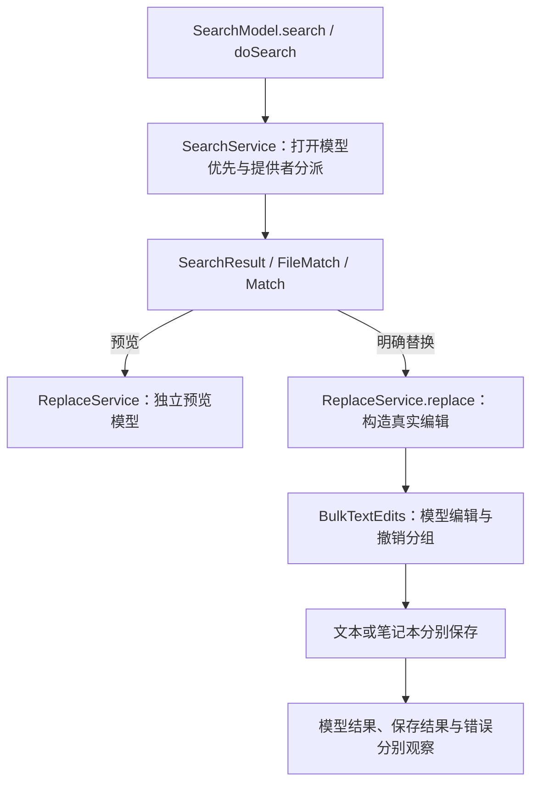
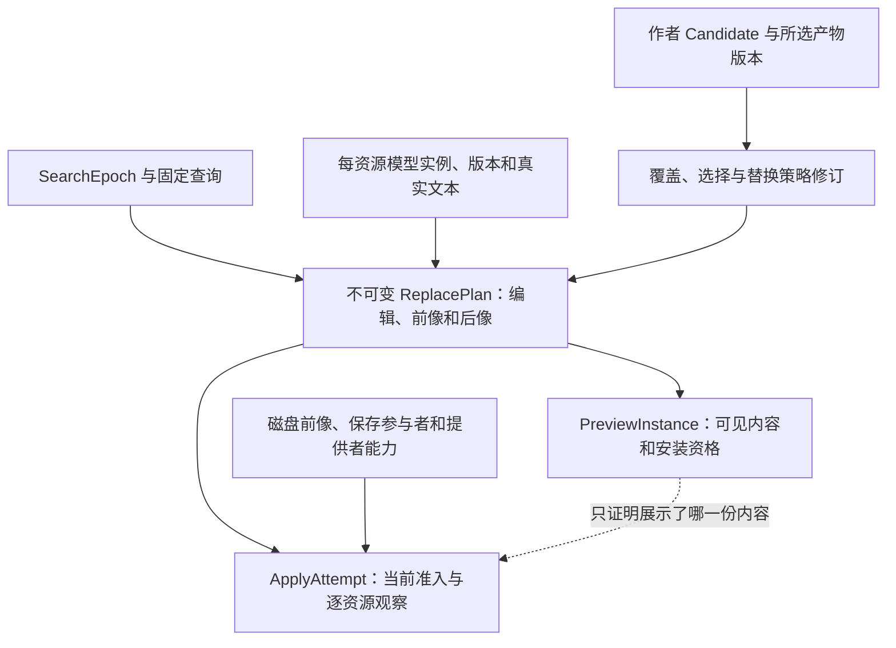
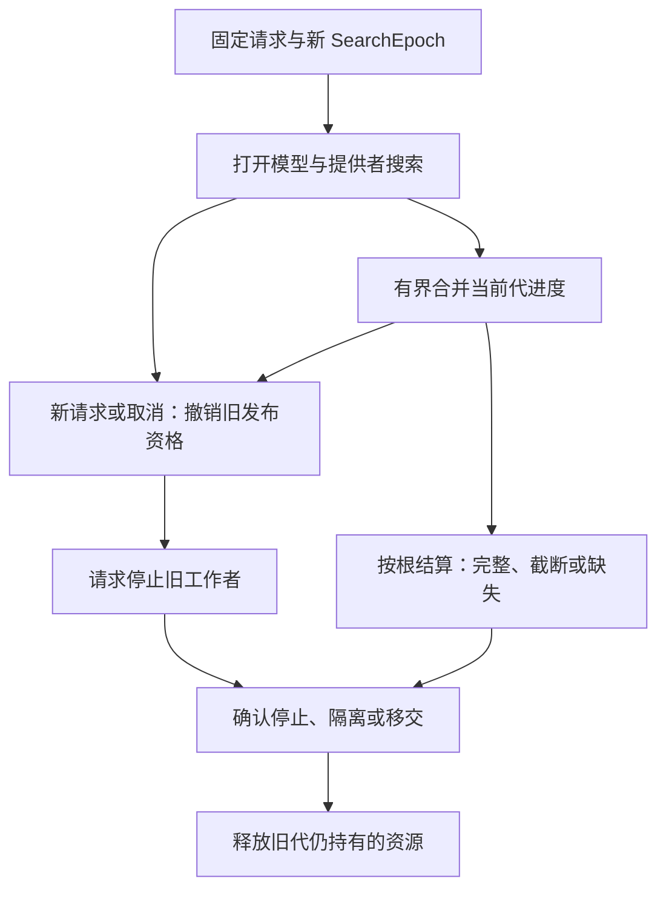
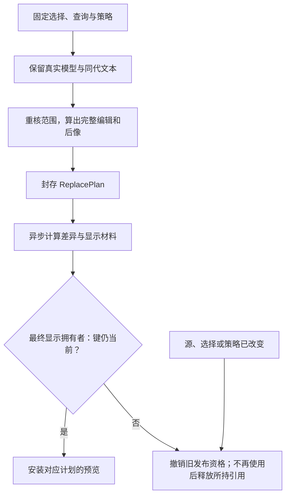
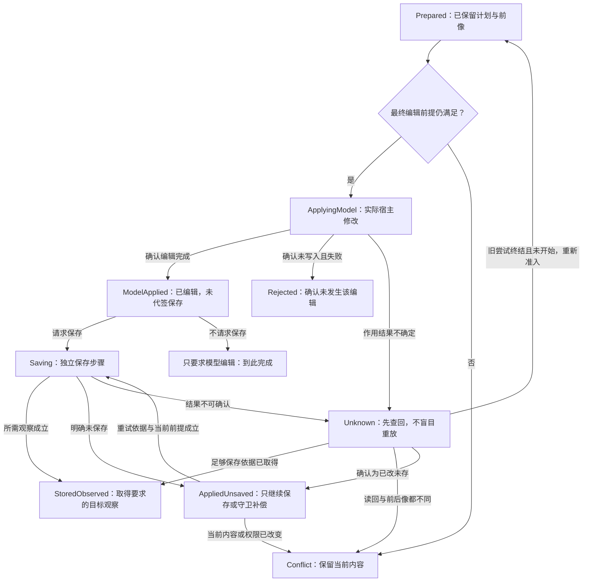
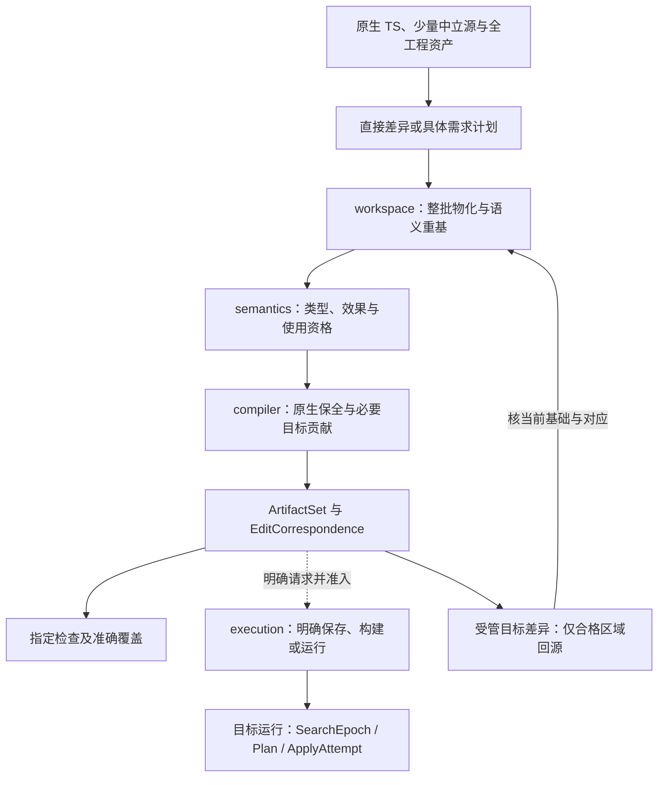

# Code-OSS跨文件搜索、替换预览与应用：完整开发面锚点

> **阅读范围**：原生维护专项；不是新产品前置。

<details>
<summary>本页内容</summary>

- [Code-OSS是什么，以及为什么它不是SEC的架构基础](#code-oss是什么以及为什么它不是sec的架构基础)
- [1. 范围、当前选择与不能偷换的“完整”](#1-范围当前选择与不能偷换的完整)
- [2. 固定源码与可复核的真实链路](#2-固定源码与可复核的真实链路)
- [3. 开发者最终维护什么](#3-开发者最终维护什么)
- [4. 数据、版本与唯一拥有者](#4-数据版本与唯一拥有者)
- [5. 搜索、选择与取消：结果完整性是一个独立维度](#5-搜索选择与取消结果完整性是一个独立维度)
- [6. 预览是准确计划的投影，不是可变结果树的别名](#6-预览是准确计划的投影不是可变结果树的别名)
- [7. 应用、保存与恢复：不能画成一个成功框](#7-应用保存与恢复不能画成一个成功框)
- [8. 谁实现这些接口，怎样接已有源码](#8-谁实现这些接口怎样接已有源码)
- [9. 两个端点之间的 SEC 开发主链](#9-两个端点之间的-sec-开发主链)
- [10. 可以照两端实施，但不能跳过这些接合](#10-可以照两端实施但不能跳过这些接合)
- [11. 固定验收输入与书面期望](#11-固定验收输入与书面期望)
- [12. 这条大工程锚点检验到哪里，下一类反例从哪里来](#12-这条大工程锚点检验到哪里下一类反例从哪里来)

</details>


本章拥有一个大型现有工程的具体开发范本：在保留 Code-OSS 原生工程的前提下，贯通跨文件搜索、命中选择、替换预览、模型编辑、保存、取消、失败恢复与下一次源码修改。公共工具、作者语法和编译算法仍由各自规范拥有；这里固定其真实对象、接合与验收，不创建第七工具、第二份意图语言或新的业务平台。

**两个端点已经具体化，产品运行尚未验证。** 开发端是实际作者文件、已有原生区域、少量独特决定和同源修改；目标端是下面固定版本的搜索/编辑服务与本章定义的增量行为。源码阅读证明被读范围存在；本章的新增合同、接口和算法是设计，不等于已改 Code-OSS、已编译 SEC、已导入全仓或已运行验收。

## Code-OSS是什么，以及为什么它不是SEC的架构基础

Code-OSS是微软与社区开发Visual Studio Code所使用的开源工程，公开仓库为`microsoft/vscode`，仓库源码采用MIT许可证。日常下载的微软Visual Studio Code是基于这个工程、加入微软定制内容的发行版，采用其产品许可证；两者不能把品牌、扩展、服务接入及许可一概视作完全相同。官方[仓库说明](https://github.com/microsoft/vscode#readme)和[仓库与发行版差异](https://github.com/microsoft/vscode/wiki/Differences-between-the-repository-and-Visual-Studio-Code)直接说明了这个区分。

本章选择它，是因为它提供真实的多文件、多入口、编辑器缓冲、异步取消、资源与目标工具协作情形。它不是SEC的新组件、作者语言、必装运行时，也不是要求把VS Code改成SEC界面。这里的搜索链是一个有明确边界的校准实例；其余SEC设计继续以[全工程总装](../../docs/架构/协作与状态边界.md#whole-system-assembly)与各领域规范为准。

<a id="scope"></a>
## 1. 范围、当前选择与不能偷换的“完整”

采用 **已有 TS 工程的深度维护＋必要的中立源或局部规则＋真实宿主适配**。不先把整个编辑器翻译成 `.sec`，不重写成熟搜索器、文本模型、差异编辑器和撤销系统。新的共同机制放回原十职责；针对搜索的具体行为只在目标工程及其适配中实现。

| 对象 | 本锚点要求的完整性 | 不被这个结果证明的内容 |
|---|---|---|
| 工程资产 | 获准捕获时，记录真实成员、忽略/未取得范围、原字节和所有者；源码之外的构建、配置、资源、许可证及说明有保全和变更路径 | 本章阅读了若干文件，不代表已经下载或逐项审计整个仓库 |
| 功能链 | 从一次明确查询到命中、选择、预览、应用与逐资源结果，包含错误、取消及再次修改 | 不代表整个 IDE 的调试、扩展市场、终端、协同等功能都完成语义导入 |
| 开发面 | 能定位原生源/中立源、改变真实内容、产生同一候选、检查、生成、回源并保存 | 显示一张架构图不等于编辑器或工具实现可用 |
| 实现范围 | 选定画像所需的读取器、映射、编译、组合、作用和恢复接口均有拥有者和停止条件 | 远程存储、笔记本、任意扩展、全部语言、强事务保证不因字段可存就已支持 |

所选目标行为保持普通搜索能力。为检验真实开发变化，额外固定一个**范本需求**：开发者能够辨别替换预览是否已过期，只对明确选定范围发起替换，区分编辑完成和保存结果，失败后不得盲目重放已发生的编辑。它是本例的设计约束，不伪称原 Code-OSS 已承诺跨文件事务，也不变成所有 SEC 工程的强制需求。

本例有两个兼容画像。`native-compatible` 保留原生命令和原错误/保存行为，不宣称新保证；`frozen-preview` 通过本章明确的计划边界提供来源绑定、陈旧检查和逐资源结算。后者没有实现、没有相应宿主能力或存在无法封闭的写竞争时，返回缺项或准确的较弱保证，不能悄悄退到前者仍称强保证成功。两个画像是同一适配的能力分支，不是两套平台。

**当前先做普通可写文本、多根目录和打开/未打开文件。** 笔记本、只读虚拟资源与远程提供者必须保全、可查询其真实能力，但只有对应编辑/保存合同就绪时才进入强替换路径。未支持项不被静默排除后称为“全部替换”。第二语言、远程编译、数据库和新 GUI 均不是本例前置。

<a id="source-evidence"></a>
## 2. 固定源码与可复核的真实链路

源码观察固定在 `microsoft/vscode` 的提交 `3e078a39dc95d262123da38f916225a126fb1ccf`；提交时间为 2026-09-09 16:47:47 UTC。这里是一个明确快照，不是“以后始终最新”的声明。所有路径以下面的提交永久链接为准，行范围是本章来源的实际读取范围；未读调用方不补成已确认事实。

| 来源 | 实际读取 | 直接支持的事实及设计用途 |
|---|---|---|
| [S1 searchModel.ts][s1] | 120—320 | `search` 取消原搜索、建立查询和替换模式；`doSearch` 组合普通文本和笔记本的同步/异步结果。用于区分搜索请求代与异步工作的寿命 |
| [S2 searchService.ts][s2] | 前部至 `searchWithProviders`；450—文件末尾 | 已打开模型先搜索；提供者按 scheme 分派；模型零命中也写入占位，使磁盘进度不能覆盖它。用于打开缓冲优先、身份及范围覆盖 |
| [S3 fileMatch.ts][s3] | 100—280 | 模型变更调度命中刷新；移除命中保留排除记录；单命中替换经队列再刷新。用于说明事件刷新不是提交前版本校验 |
| [S4 match.ts][s4] | 全文件 | 搜索位置转编辑器位置时加一；替换字符串经过完整命中、CRLF 归一、周边上下文等路径，仍可能采用回退模式。不能只拿截短展示串算替换 |
| [S5 replaceService.ts][s5] | 全文件 | 预览克隆源模型并在独立模型中应用编辑；真实替换先 `bulkEditorService.apply`，随后分别保存文本或笔记本；`createEdit` 在此调用处未填 `versionId` |
| [S6 bulkTextEdits.ts][s6] | 全文件，分段读取 | 可按版本核模型；未给版本时该版本门槛不生效；多模型逐任务编辑并共用撤销分组。分组撤销不等于多文件磁盘事务 |
| [S7 ripgrepTextSearchEngine.ts][s7] | 1—160 | 本地路径启动 ripgrep、报告进度、命中上限后取消；取消请求与进程 `close` 分开。用于真实停止和资源结算 |
| [S8 searchResult.ts][s8] | 1—190 | 批量替换对父/子重复选择作处理并调度实际对象；批量移除是结果树操作。不能将“移除搜索结果”解释为删除文件 |
| [S9 textSearchHeading.ts][s9] | 1—215 | 根目录/其他资源分组、URI身份比较、旧结果清理及查询变化。用于多根和结果集合生命周期 |
| [S10 searchActionsRemoveReplace.ts][s10] | 全文件，1—230与225—末尾 | 单项/文件/文件夹动作共用 `performReplace`，取得当前选择后调用 `batchReplace`；随后刷新树、处理焦点并按配置打开文件或替换预览。用于保留真实动作入口与可访问性行为 |

以上来源不是完整安全审计。尤其不能仅由 `createEdit` 未填版本推断整个产品已发生数据损坏；模型更新、其他入口、目标保存策略都可能影响可达性。可以确定的是：**新增的强版本保证不能只依靠下游存在可选检查，必须证明实际调用提供并消费了它。** 同理，Promise 完成、命中树消失、模型变为 clean，都不能单独证明磁盘字节与先前预览相同。

<a id="fig-codeoss-native-chain"></a>
### 图：实际服务层链路及不同作用边界

实线表示所示方法间的调用/数据交接；这是一条服务层视图，省略 UI 控件注册、插件激活细节与错误分支，后者见第 6—8 节。预览不经过真实保存，保存也不是 `bulkEdit` 内部的一次磁盘事务。



动作入口已有一组实际确认的接合：S10 的 `ReplaceAction`、文件 `ReplaceAllAction`、文件夹 `ReplaceAllInFolderAction` 均进入 `performReplace`，经 `getElementsToOperateOn` 取得选择后调用 S8 的 `batchReplace`，然后刷新树、恢复焦点并打开原文件或替换预览。`RemoveAction` 调用 `batchRemove`，不是文件删除。新强模式接在这些实际消费者与计划服务之间，保留快捷键上下文、焦点和只读条件；不能把“先预览”新增为原生兼容命令的隐含强制步骤。

这组入口不等于所有调用方已穷尽。搜索框提交、全工作区替换、其他搜索视图、命令注册加载与全部既有测试仍需同一固定快照的引用闭包；只读取目录和一份动作文件不能称“全 UI 接入已确认”。这项缺口阻止完整接入验收，不阻止服务合同与目标行为的设计。

<a id="developer-files"></a>
## 3. 开发者最终维护什么

### 3.1 原生工程不是中立模型的副本

原有 `src/vs/.../*.ts`、现有构建/依赖说明、资源和其他作者文件保持原角色。TS 源直接编辑时只维护 TS，不先生成一份可独立修改的 `.sec` 镜像。需要中立语义的独特部分才新增相应源；生成 TS 区域归该源和其生成方法，不再作为第二位作者手工维护。

| 内容 | 作者实际维护 | 机器负责 | 变化边界 |
|---|---|---|---|
| 搜索提供者、模型、差异编辑与撤销 | 现有原生源码及其原合同 | 读取真实类型/引用、定位影响、保全原字节 | 未纳入语义映射部分仍可保全与原生编辑，不假称完全理解 |
| 独特替换策略 | 一个已有策略槽；无槽时建立一个有真实消费者的函数或定义 | 推导可推导签名、绑定使用点、生成所选目标 | 只有实际决定写入作者源，推导树不回灌 |
| 独立任务要求 | 现有受信任务/规范中准确的要求引用 | 查相交要求、义务与差异 | 源码修改权不等于降低要求的权利 |
| 预览计划、分析索引、源映射 | 不手填 | 根据固定输入生成并按必要寿命保存 | 可重建分析与不可丢失的作者/恢复资料分开 |
| 配置、命令文本、测试期望 | 原文件或真实集中定义 | 检查被改内容的消费者、生成相交派生项 | 不将全工程格式化、重排或自动升级依赖混入功能修改 |

捕获实际仓库时，已有跟踪文件、未跟踪但已授权文件、显式忽略文件和不可读取范围分别列出。忽略构建产物不能隐含忽略作者资源；未取得子模块、Git LFS 内容或平台专有工具时标缺，不能将路径占位视为实际字节。这里只定义捕获合同，未宣称本轮已经完成全仓捕获。

### 3.2 一份完整、可继续修改的作者策略源

下面是本例确实需要的新策略之一：来源已过期则必须重建；来源仍有效时，完整范围允许批量应用；不完整范围只有准确选定子集才允许对该子集继续。是否有权写、是否只读、宿主能否实现受检编辑仍由实际适配负责，这个函数不签发权限。

拟定作者位置为 `search-policy/apply-scope.sec`；这是目标工程中的设计路径，不声称当前仓库已有该文件。

```sec
export type ScopeDecision = RebuildPreview() | SelectExplicitSubset() | ContinueSelected();

export fn chooseScope(sourceCurrent: Bool, scopeComplete: Bool, explicitSubset: Bool) =
  if !sourceCurrent then RebuildPreview()
  else if scopeComplete || explicitSubset then ContinueSelected()
  else SelectExplicitSubset();
```

这是完整函数体，不是 `safeReplace(...)` 名字后隐藏的一整套系统。已有类型推导允许省略返回类型；显式类型仍可保留。该函数只承担一个判定，不证明搜索完整、不处理磁盘，也不替代下面的计划与恢复算法。名字中的 `sourceCurrent` 是适配在准确版本上算出的布尔值，不允许开发 AI 自报为 true。

目标可采用常规 TS 判别联合表达三个分支，例如下列目标形状。具体私有布局由已选 TS 后端绑定，不能仅凭字段名认定已实现该后端。

```ts
export type ScopeDecision =
  | { readonly kind: "RebuildPreview" }
  | { readonly kind: "SelectExplicitSubset" }
  | { readonly kind: "ContinueSelected" };

export function chooseScope(
  sourceCurrent: boolean,
  scopeComplete: boolean,
  explicitSubset: boolean
): ScopeDecision {
  return !sourceCurrent
    ? { kind: "RebuildPreview" }
    : scopeComplete || explicitSubset
      ? { kind: "ContinueSelected" }
      : { kind: "SelectExplicitSubset" };
}
```

普通 TS 作者也可直接维护同义原生策略而不新增 `.sec`。选择中立源的理由是要使用其共同语义、目标生成或同源控制；只为把这个短函数变得“像 SEC”而新增生成依赖并不划算。此选项不改变全系统共同维护面：两种来源都经过同一候选、来源、作用与结果规则。

### 3.3 作者一次请求究竟写多少

自然语言任务可以是：“替换只使用本次预览的选中项；内容变化后先重建；保留现有搜索和取消行为；保存失败逐文件报告，不自动重放编辑。”开发 AI 根据已有范围、源码和准确合同形成具体差异。用户不必填本章全部字段；机器不能据此省掉其真实区分。

已捕获本例候选后，首次选择包含上面策略文件和必要原生修改的一个 `files` 批次，或直接从现有编辑器捕获成组变化。`files` 中未列路径不删除。不能用只新增该策略函数的候选冒充整个功能完成：原生计划生产者、预览消费点、应用和失败结果的相交修改必须同组进入。

明确改变策略为“即使明确选了子集，不完整搜索也一律先完成搜索”时，第二版完整作者文件如下。保留三参数签名让调用方可以继续提供原输入，但 `explicitSubset` 在新政策中不再授予继续资格；这不是把旧参数偷偷解释成另一种含义。

```sec
export type ScopeDecision = RebuildPreview() | CompleteSearchFirst() | ContinueSelected();

export fn chooseScope(sourceCurrent: Bool, scopeComplete: Bool, explicitSubset: Bool) =
  if !sourceCurrent then RebuildPreview()
  else if scopeComplete then ContinueSelected()
  else CompleteSearchFirst();
```

可用一个 `sec.propose({base, files, return: "diff"})` 请求提交完整文件及实际相交原生修改；`base` 必须是已返回的准确作者基础，`files` 是“真实路径→完整文本”的映射，不能把未列文件当删除。直接编辑 TS 路线也只维护其原源，不同时修改生成物。

该策略对应的完整 TS 判别与结果解释如下；说明用中文文案在真实接入时进入既有本地化拥有者，不建立第二套消息平台。这里固定新旧分支的意义，不能只改布尔表达式却继续提示用户选择同一个子集。前两个声明是策略的生成目标形状；`scopeMessage` 是需要由原生拥有者维护的消费者示例，不是编译器从策略函数凭空生成文案。目标私有参数名以 `_` 标明兼容保留但当前不用的输入，三参数调用形状不变。

```ts
export type ScopeDecision =
  | { readonly kind: "RebuildPreview" }
  | { readonly kind: "CompleteSearchFirst" }
  | { readonly kind: "ContinueSelected" };

export function chooseScope(
  sourceCurrent: boolean,
  scopeComplete: boolean,
  _explicitSubset: boolean
): ScopeDecision {
  return !sourceCurrent
    ? { kind: "RebuildPreview" }
    : scopeComplete
      ? { kind: "ContinueSelected" }
      : { kind: "CompleteSearchFirst" };
}

export function scopeMessage(decision: ScopeDecision): string {
  switch (decision.kind) {
    case "RebuildPreview": return "内容已变化，请重建替换预览。";
    case "CompleteSearchFirst": return "搜索范围尚未完成，请先完成搜索。";
    case "ContinueSelected": return "可继续处理本次明确选定的替换项。";
  }
}
```

这仍是设计源码与目标形状，不是已经编译的执行记录。一次共同候选需要包含真实策略消费点、联合分支的穷尽处理、相交文案和案例；实际消费者未取得时将该部分列为缺项，不伪造路径或宣称仅靠这段代码已完成接入。新语义是：来源失效仍重建；完整搜索仍可继续；不完整范围无论是否显式选中都先完成搜索。旧 `SelectExplicitSubset` 不再是新版合法返回；旧产物/旧计划保留原绑定，不能在恢复时按新政策重新解释。保留一个参数并不能提供持久协议兼容；实际持久化联合值有消费者时，按原版本迁移合同处理。

已明确的一处参数变更可以短；真实协议变化可能同时改变函数、调用方、消息和案例。简洁是消除重复输入，不是隐藏必须一起变化的内容。

<a id="identities"></a>
## 4. 数据、版本与唯一拥有者

以下是目标功能内部的值合同，不是新公开 SEC 协议，不要求每个用户填写。无需跨崩溃恢复的普通预览可只在内存保存；真实写入的恢复材料按照原保存合同留存。

| 对象 | 必要内容与拥有者 | 不能替代的对象 |
|---|---|---|
| `SearchRequest` | 准确查询和选项、工作区根、解释/提供者绑定；搜索协调者拥有 | 不等于一个结果树，更不等于已完成扫描 |
| `SearchEpoch` | 本会话中不可重复的请求身份；重启建立新会话命名空间 | 不用墙钟毫秒作为独一身份保证；不等于源码 Candidate |
| `ResourceKey` | URI scheme、authority、原始身份、宿主比较规则与其版本；资源适配产生 | `fsPath`、大小写归一串、显示名称不能普遍代替资源身份 |
| `TextSnapshot` | 真实文本、模型实例身份/版本、必要编码与换行合同；模型引用拥有者取得 | 相同版本数字在另一个模型实例上无同一含义；磁盘 ETag 也不是模型版本 |
| `ResultSet` | 请求代、分提供者/根覆盖、命中和排除；协调者维护快照 | 出现过进度不等于完整；被移除结果不等于文件消失 |
| `ReplacePlan` | 固定命中选择、每资源前像、计算后的替换文本、预期后像、策略/查询修订和能力；计划构造者封存 | 不继续读取可变 Match 对象，不把展示串作为正文 |
| `PreviewInstance` | 对应 Plan、显示内容、当前安装资格及保留引用；预览拥有者维护 | 预览显示完成不等于授权或真实编辑完成 |
| `ApplyAttempt` | 稳定请求身份、Plan、明确写范围、每资源状态、真实观察；作用执行者拥有 | 不等于同一个 HTTP 请求、一次函数调用或全部保存完成 |
| `AuthorCandidate / ArtifactSet / CheckRecord` | SEC 作者、产物、检查的原有身份 | 与运行时搜索代、文件模型和替换计划分别比较 |

### 4.1 位置和文本解释

本例内部源范围使用**一基行/列、UTF-16 代码单元列、左闭右开范围**，与所选编辑器适配明确转换。搜索提供者原范围、原文本中的字节偏移、展示截取中的范围分别标其坐标空间；不能只给四个整数而丢掉单位和基准。S4 的范围加一正说明适配边界真实存在。

CRLF、LF、多行匹配、代理对、组合字符、零宽匹配、正则捕获、转义和 preserve-case 不由通用“字符串替换”四字承担。原生匹配/替换计算继续复用固定版本的方法；跨引擎不相同的语义只在实际相交能力内提供。普通定位规则不做 Unicode 规范化。候选只保留截断预览、没有计算替换所需上下文时，先读准确快照或标缺，禁止用截断文本补写文件。

冻结计划时先对同一资源的编辑排序并检查相交。完全相同的同一命中选择可去重；同范围但不同替换文本是冲突。重叠范围、零宽同点的多项编辑必须采用明确的原生顺序合同，不能任意按哈希排序；没有该合同则拒绝该计划，不禁止所有正常不重叠编辑。内部自己物化文本时按固定前像的范围处理，不能应用第一项后继续把旧偏移解释为新文本的位置。

### 4.2 资源别名与权限

同 URI 的模型和磁盘属于同逻辑文件的不同状态层。不同 URI 也可能引用同物理文件；大小写、软链接、远端 authority、笔记本 cell 与父文档均可能改变关系。对提供者未保证的别名不能凭路径字符串宣称已排除重复写入；强模式须取得可靠比较规则、限制范围或返回相应不确定性。任意 `file://` 字符串不自动成为有权读取/写入的位置。

<a id="fig-codeoss-identities"></a>
### 图：各版本如何约束同一计划

边表示输入/约束依赖，不表示调用即授权；省略类型字段和存储格式。



<a id="query-lifecycle"></a>
## 5. 搜索、选择与取消：结果完整性是一个独立维度

### 5.1 准确查询

查询固定 pattern、literal/regexp、大小写、整词及 word-separator 解释、include/exclude、ignore 规则、根目录、打开编辑器范围、编码、文件/结果上限与所选提供者。省略值从实际冻结的宿主配置取得；不在查询途中读一次新的全局配置来解释旧结果。UI 改了替换文本通常不需要重做纯搜索，但使替换计划失效；改变 pattern、范围或真正影响匹配的配置则产生新搜索代。

选择以固定 ResultSet 的实际命中/文件/根成员展开。父与子同时选中不能重复作用，参考 S8 的原生行为；用户在结果树中移除的项目不再进入本次集合，不因此删除文件。为了找新命中而重新搜索后，旧选择不按列表下标迁移，只在准确身份和明确政策下重建。

### 5.2 搜索的正向协议

**Q0 固定请求。** 校验查询、允许根与提供者能力，建立 SearchEpoch 和有限资源预算。没有必要同步复制整个仓库；复制/保留实际读取文本与服务输入即可。非法正则、未知编码、没有可用提供者与空结果分别返回。

**Q1 建立打开模型覆盖。** 按真实身份枚举合格打开模型，用当前文本搜索。模型有零命中也保留“该资源已由模型负责”的记录，异步磁盘结果不得补回旧磁盘命中。不能只把有命中的打开模型加入去重集合。模型资格、untitled、git/只读/虚拟资源边界以实际适配为准，不把注释“dirty”扩张为只搜索 dirty 模型。

**Q2 启动提供者。** 以 scheme/authority/根分配已绑定提供者，保留每份请求、实际排除范围与完成信息。缺提供者或目录消失时记录对应范围，不能用另一个根成功为其代签。进度回调经搜索代核对后进入有界队列；大结果分块，超限保留已取得的结果并标明截断原因。

**Q3 合并。** 同资源以打开模型覆盖规则为准，保留各根的覆盖和必要警告。上限、取消、提供者失败、未支持及仍在搜索与命中数量分开。源文件在扫描过程中变化时，通常只得到各文件各时点的观察，而非整个工作区同一瞬间快照；不额外承诺全库瞬时一致性。

**Q4 完成或停止。** 所有本次启动者返回终态后结束搜索协调；缺失范围仍然缺失。只在所声明有限范围内、所有所需提供者完成且没有截断/遗漏时给 complete。对持续变化的目录，“全部文件”只在明确枚举/扫描语义下成立；新创建文件是否属于本轮由该语义决定，不用完成时间倒推所有文件都扫描过。

**Q5 取消与再搜索。** 新请求使旧代失去发布资格并请求取消，最新请求可接管可见结果。旧任务可能尚持有模型、缓冲或进程，只有真实停止、隔离或责任转交后释放。S7 已有 kill 请求和 close 事件的区分；不能把 UI 显示 canceled 当作进程/读者一定不存在。长期不停止者进入有界故障处置，不无限占用新请求预算。

### 5.3 完整范围与明确子集

`scopeComplete` 表示本次所声明的搜索范围在所选语义下完成，不表示整个文件系统没有其他命中。ResultSet 截断后，可以按照当前策略允许用户准确选择已列出的子集；结果应叫“所选 N 项”，不能叫“整个工作区全部替换”。对要求完整范围替换的请求，没有完整性就不准入；不能把限制悄悄改成部分成功以获得绿色。

搜索未命中可以正常成功，预览的有效选择为空可以返回明确 NoChange。Empty 与 Unknown 不同：提供者未返回、只读全部被忽略或搜索失败不能转成“零项，无需操作”。

<a id="fig-codeoss-query"></a>
### 图：搜索代与物理工作寿命

边是该搜索请求的控制转换；旧代结算不改变新代结果。细分错误见正文。



<a id="preview-contract"></a>
## 6. 预览是准确计划的投影，不是可变结果树的别名

### 6.1 `ReplacePlan` 的完整内部合同

计划包含 `planId`、准确搜索/查询绑定、选择成员与覆盖、替换文本/模式及策略绑定；每资源包含 ResourceKey、保留的 TextSnapshot、前像标识、计算完成的不重叠编辑、预期后像、只读/保存/比较能力，以及本次是否请求模型应用或连同保存。输入均已实际取得，不用未来引用填充一个“完成计划”。

`planId` 是本域身份；内容摘要用于比较和查回，不是签名或授权。命中对象可在 UI 中持续变化，因此计划只保存其经校验的值与来源，不在应用时再次读取 `match.replaceString`、当前替换框或 `fileMatch.matches()`。否则预览展示 P0、应用计算 P1，计划名字相同也已违反目标。

### 6.2 P0—P7：从选择到可见预览

**P0 绑定选择。** 将真实选择展开到固定命中集合，按父/子去重和只读政策处理。含不可写资源时，整体替换请求返回准确缺项；允许所选可写子集的请求形成不同、明确的选择，不能偷偷丢项。

**P1 取得快照。** 异步解析全部需要的模型引用后，记录每个模型的实例/版本、真实内容和必要上下文。读取内容过程中版本变化就重新捕获该资源或标冲突，不允许版本来自读取前、文本来自读取后的混合快照。没有保留能力的提供者使用准确复制或拒绝对应保证。

**P2 重核命中。** 对固定前像核原范围和匹配解释；存在延迟的命中刷新时不能等待事件“最终一致”来代替此次校验。内容已变化先重建计划/搜索；不把相同文本碰巧出现在别处视为原命中仍有效。允许的语义重定位必须另有明确规则与用户可见差异。

**P3 算编辑。** 复用已固定的原生替换计算，取得完整文本、捕获/上下文和新文本。检查范围、顺序、重叠与来源。原生回退行为可以在兼容画像中保留；强画像若不能确定精确替换含义，返回该项不支持，不伪造与原生完全等价的新正则实现。

**P4 物化预期后像。** 对每资源从同一前像构造私有后像，保留原资源不变。大文件可用 rope/分段变化或内容引用，不要求前后全文多次深复制；所需字节、文本长度与差异计算均计预算。必要完整后像无法建立时停止该计划，不用前几屏展示冒充全文件预览。

**P5 封存。** 绑定所有完成的资源、选择、查询、策略和能力为一个不可变计划。共同请求不能发布半个身份映射；独立资源可以有明确分项预览，但整次请求仍显示尚缺范围。

**P6 安装。** 预览协调者在实际可见状态拥有者处比较当前请求/选择/策略键后安装结果。若显示通知异步排队，消息携带键，最终消费者再次比较后才能安装；比较后再 await 或再入任意用户代码，需重新校验。旧结果可被缓存为历史，不可替换当前可见结果。

**P7 失效与释放。** 查询、真实源、选择或替换策略变化使受影响计划失效；普通窗口尺寸变化若不影响计算，仅使显示布局重做。关闭预览取消订阅并释放自己的模型引用；仍有应用/旧工作者使用的内容不随窗口关闭销毁。编辑源码得到新程序版本时，旧 Plan 不静默套用新策略。

有效预览不得写真实源模型、磁盘或改要求。预览内部模型的 undo 是重算方式之一，不是用户文件已经被撤销；S5 的独立模型正好提供此区分。

<a id="fig-codeoss-preview"></a>
### 图：预览构造与最后安装点

实线是数据/控制，失效分支退出当前计划；省略逐资源的循环与详细错误。



<a id="apply-recovery"></a>
## 7. 应用、保存与恢复：不能画成一个成功框

### 7.1 明确本次成功指什么

本例将“成功应用”拆成三个问题：选中的编辑是否进入模型；所要求的保存是否完成并取得相应观察；整次请求要求的全部资源是否均已结算。调用者只要求模型编辑时，不额外强制保存；原生命令原本包含保存时，兼容画像保留它，但必须显示准确的分项结果。强模式下保存可能被宿主能力阻挡，不能把“模型已改”包装为“保存成功”。

`modelApplied` 是目标文本模型在该次编辑边界之后的事实；`storedObserved` 是指定提供者处取得所要求的写入/读回观察；断电耐久性还需该提供者真实支持的 flush/同步/提交合同。普通 `save()` 返回、readback 相等、UI clean 三者都不能自动证明断电耐久。

文本保存可能经过格式化或保存参与者，导致最终字节不等于预览后像。当前设计选择：**预览只承诺所选编辑；保存参与者另有作用范围和结果。** 请求明确要求“保存字节必须与预览完全相同”时，须使用确实支持的无额外变换保存策略，或事先把参与者的确定结果纳入预览。没有这种能力就拒绝此强保存保证，不先保存后才补一句可能不一致。允许保存参与者的普通请求则记录其真实额外变换及最终结果，不把它们抹掉。

### 7.2 A0—A9：实际应用的操作顺序

**A0 准入与去重。** 解析真实 Plan 和所选模式，校验当前对象范围、主体及作用许可。稳定 requestId 在第一次发起前持有；同键、同意图且已有结果则查回，不同意图同键冲突。程序源码有写文件功能不是本次工具写权；持有 planId 不是许可。

**A1 固定准备范围。** 保留 Plan、所需模型/内容与每资源能力；必要异步解析和提供者准备先完成。来源/选择/策略已失效时返回 RebuildPreview；不把当前可变结果树自动转成一个不同的应用计划。

**A2 核共同前提。** 核完整范围或被明确接受的子集、所有必需资源是否可取得、readonly、编辑解释、保存策略和真实权限。原任务要求共同完成时，已知缺一个必要成员应在开始前停止，不故意做完其他成员后才宣布它一直不支持。前置检查不能阻止未来外部故障，后续仍保留部分结果。

**A3 形成版本化编辑。** 同资源全部编辑来自同一个模型实例/版本，实际 `ResourceTextEdit.versionId` 使用所保留的正确版本；禁止混合多个版本再由最后一项覆盖期待值。未打开文件经解析成为模型后，以该模型快照重新核 Plan，不能把磁盘 ETag 填进数值 modelVersion。不能取得强版本比较能力的资源不假装合格。

**A4 最后修改边界。** 在真正拥有文本变化的宿主边界核版本和被要求的前像，再执行该资源编辑。最后核对后不得无条件跨异步等待、任意回调或可重入修改窗口继续使用旧结论。外层一次 preflight 不能替代每个实际提交边界的检查。S6 的可选版本验证可以复用，但必须补证所选调用路径、是否可能重入及版本传递；仅改构造器的一个 undefined 不能获得无条件事务保证。

当前优先复用既有原子单模型编辑能力和有版本门槛的宿主入口；不为本例先给整个编辑器增加全局锁。若所选宿主没有“比较预期版本并编辑”在同一有效边界的保证，强模式返回能力缺项或只提供其明确较弱的检测保证；不得用文档假设将不存在的 CAS 当成现有 API。实现此能力需要改变宿主时，变更属于真实宿主适配工作并进入对应验收，不隐藏在一个空方法名后面。

**A5 记录模型结果。** 每资源记录未开始、版本冲突、已编辑及其实际后版本，必要时记录结果未知。多资源采用确定的计划次序并有限并发；有共同编辑观察要求时按真实能力执行。多模型撤销分组可复用，但不等于跨文件观察者看不到中间态。无法提供全有或全无时，先声明该限制，不能在逐文件循环外围写一个 transaction 标签。

**A6 保存。** 只保存本次请求的实际资源。模型编辑之后又有用户修改、撤销或保存参与者改变内容时，核最新模型状态与本次意图；不能把包含新增用户内容的保存称为原后像保存，也不能为了吻合旧后像覆盖新编辑。笔记本 cell 的保存对象是父笔记本，不对每个 cell 独立保存整本；同父文档的请求先按真实保存合同去重。

**A7 观察与结算。** 保存失败、只读、冲突、丢失、权限撤回、磁盘满、远端断开分别保留资源和原因。按要求取得当前模型/目标读回；只有观察到指定结果才标相应成功。有的资源已编辑未保存，有的已保存，有的尚未开始，全部留在同一分项结果中。不能仅用 Promise.all 的一个拒绝抹掉已发生的变化。

**A8 更新结果与撤销入口。** 用实际已作用范围刷新命中/装饰；未作用项保留。用户发起普通 Undo 时，沿宿主真实撤销能力、版本与历史；这不是任意历史时刻的安全补偿。已经被其他程序读取的内容不能被“撤销”抹去其历史观察。

**A9 释放与后续。** 清理仅属于本尝试的引用和临时预览；尚未停止或结果未知的作用仍由原 operation 拥有。允许的继续动作包括重新预览未应用资源、仅重试确实未保存的指定后像、查询未知结果或按守卫补偿。不得直接再次调用整份 replace 来“重试保存”。

### 7.3 分项状态与 B/A/X 恢复

此处把原[真实前后像恢复](../../docs/运行/持久化提交与恢复.md)具体化：B 是该作用前像，A 是该作用意图后像，X 是恢复时当前真实观察。模型和磁盘分别使用自己的 B/A/X；不能把模型 A 当成磁盘已写 A。

| 当前资源状态/观察 | 可以继续做什么 | 不允许做什么 |
|---|---|---|
| 尚未开始且前提仍成立 | 在当前许可下继续本次未执行步骤 | 因另一个资源成功就假设它已修改 |
| 模型仍为 B，确定未发生编辑 | 按当前版本重新准入编辑 | 将丢响应但未知的状态也认定为未发生 |
| 模型为 A，磁盘为 B，模型版本未被后续用户编辑改变 | 只重试请求中的保存，重新核磁盘冲突与保存策略 | 再做一次替换，导致新文本被再次替换 |
| 磁盘可确认已为 A | 报告已观察到所需后像；不再重复编辑 | 仅凭字节相等推定一定是本尝试写的，或授予新的许可 |
| 当前 X 不同于 B 和 A | 返回冲突/准确现场，重新决定未完成范围 | 自动覆盖为 A，或为了回滚覆盖为 B |
| 想撤回且 X 恰为 A、身份/版本与守卫仍合格 | 按宿主支持的逆变更/补偿将其恢复，记录新的作用 | 宣称外部观察、通知或其他作用也被撤销 |
| 失联、崩溃，无法读出 X | 保持结果未知；查回或使用有真实去重保证的恢复 | 重新分配新 requestId 后盲目重发不可重复作用 |
| 多文件已部分成功 | 逐项继续或有条件补偿；总任务仍为部分结算 | 自动宣布整个任务成功或整个世界已回滚 |

相同字节只是恢复证据的一部分：权限、资源身份、模型实例、版本与操作是否允许重复仍需核对。两个用户独立生成同样文本不说明是同一个操作。B→A→B 的 ABA 变化也不能只靠内容相等复活旧版本权利。

<a id="fig-codeoss-apply"></a>
### 图：单资源的编辑与保存状态

边是同一资源的合法后继；整次任务聚合分项结果，不把此图当跨文件事务。`Unknown` 是待查回状态，不等于失败前无作用。



<a id="host-contracts"></a>
## 8. 谁实现这些接口，怎样接已有源码

这些是目标适配的内部合同形状，不是新的公开 SDK。方法名本身不产生能力；表中每一项包含真实实现来源与必须补的责任。被调用者可以用现有服务实现同义工作，不能留一个永远成功的 stub。

| 内部接合 | 输入与输出 | 实际承担及失败 |
|---|---|---|
| `captureSearchScope` | 固定查询、授权根 → 打开模型覆盖＋分提供者请求＋实际缺项 | 接 S1/S2/S9 的范围和身份；补显式覆盖结果，缺提供者不为空成功 |
| `freezeReplacementPlan` | 固定结果选择、替换策略、真实模型快照 → Plan 或 stale/unsupported/invalid | 接 S3/S4 的准确文本与替换计算；执行 P0—P5。只拿 Match 可变引用不合格 |
| `presentReplacementPlan` | Plan、显示键、预算 → 精确预览或未安装/显示失败 | 接 S5 的独立模型/编辑器；执行 P6/P7，关闭不销毁其他读者 |
| `prepareVersionedEdits` | Plan、实际模型引用 → 同模型同版本的 ResourceTextEdit 组或冲突 | 改 S5 的编辑构造消费计划值与真实版本，不在应用时重读当前替换框 |
| `applyPreparedEdits` | 版本化编辑、当前许可、宿主能力 → 分项模型结果 | 复用 S6；证明最后版本检查与实际修改边界，必要时补适配。强能力缺失明确返回 |
| `saveAppliedResources` | 已编辑分项、准确保存意图 → 分项目标结果 | 接 S5 原文本/笔记本保存服务；同父对象去重，消费保存参与者和前像合同 |
| `reconcileApply` | 原 Attempt、B/A、当前观察和许可 → 继续保存/冲突/结果/有条件补偿 | 执行第 7.3 节；没有观察返回 Unknown，不重放整次 replace |

`SearchModel` 继续拥有当前查询与协调，`SearchResult`/`FileMatch` 继续拥有命中树及选择投影，`ReplaceService` 负责计划到预览/编辑的接合，真实模型和保存服务继续拥有实际内容。新增的 Plan 是这几者间的不可变交接值，不建立常驻“替换计划服务器”。普通小调用也不需要持久队列。

### 8.1 拟定文件级变化与消费者

| 目标位置 | 保持原有内容 | 本例需要的增量 |
|---|---|---|
| `searchTreeModel/searchModel.ts` | 普通/笔记本搜索组合、既有查询与取消行为 | 将准确搜索代和分项覆盖传给新计划入口；旧结果失效不能污染新预览 |
| `searchTreeModel/searchResult.ts` | 结果树、父/子选择去重及原操作 | 强模式取得固定选择；分项失败不删除未作用结果；所有入口使用同一语义 |
| `searchTreeModel/fileMatch.ts`、`match.ts` | 模型绑定、命中重算、范围与替换语义 | 提供冻结所需真实来源；异步刷新不能代替预提交校验；展示截断与正文分开 |
| `replaceService.ts` | 独立预览模型、编辑器打开、原生服务引用及兼容路径 | 分离冻结/呈现/应用；消费准确版本；编辑与保存分项返回；精确释放 |
| `bulkTextEdits.ts` 与其实际调用合同 | 普通模型编辑、既有撤销与片段行为 | 核真实版本传递和最后修改边界；不无依据重写整个编辑器或承诺全局事务 |
| 拟新增 `search-policy/apply-scope.sec` 或一个原生策略文件 | 无须复制所有搜索实现 | 承担第 3.2 节的独特策略；两种作者来源择一，不双写 |
| `searchActionsRemoveReplace.ts` 的 `performReplace` 及已确认动作 | 单项/文件/文件夹命令、键位上下文、焦点恢复、打开文件/预览、Dismiss | 强模式以固定选择进入共同 Plan；分项结果后再刷新；原兼容动作不被强制人审或预览 |
| 其余既有 UI/命令、消息与测试文件 | 原命令发现、可访问性、显示和测试资产 | 展示 stale/partial/applied-unsaved 等准确结果，逐入口接合；具体完整清单由固定仓库引用查询取得 |

最后一行是**实施前须取得的完整调用闭包**，不是已完成枚举。测试/命令/保存参与者的具体路径与版本必须从同一仓库快照解析；不能在此造出看似真实的文件名。固定十份源码不等于这条闭包已穷尽，缺口的影响是尚不能声明可直接合入目标仓库。

### 8.2 生命周期、取消和预算

预览差异计算与真实文件应用使用不同取消对象。停止预览不能取消一个另行获准且已开始的写入而不结算；停止应用则只阻止尚未开始步骤，已作用资源按照真实状态处理。每项资源有明确 owning reference，订阅、模型、预览副本与进程分别释放；窗口 dispose 不等于所有 work 停止。

预算来自当前宿主/任务画像，包括同时解析的模型数、所保留文本字节、命中数、排队事件数、差异计算工作量、同时保存数量及结束期限；本设计不伪造一组“万能最佳阈值”。初版用有限并发和结果截断标记，不要求全仓并行打开模型。有限输入、提供者和模型操作能结束、预算充足且输入最终稳定时，应当给出当前结果或明确错误；不断刷新相同 pending 而不完成不算符合。

搜索成本至少包含提供者实际扫描量和结果输出量；预览至少需要处理所选文本/编辑，差异算法可能更贵。持有旧模型、新预览和恢复前像可能同时占内存，不能用各阶段峰值的最大者冒充总峰值。先按真实保留关系计活跃字节，再做共享、惰性快照或分块优化；不能为省内存提前释放还有读者的前像。

<a id="sec-pipeline"></a>
## 9. 两个端点之间的 SEC 开发主链

### 9.1 十职责不重排为另一个系统

| SEC 模块 | 本锚点交付的真实内容 | 不得承担的内容 |
|---|---|---|
| `contracts` | 原六工具、候选/产物/操作引用、已定作者/目标合同；仅内部类型承载本例 Plan 关系 | 把搜索专有字段加入所有函数公共信封 |
| `workspace` | 捕获原生/中立源与资产、精确差异、不可变候选、整批重基及来源映射 | 擅自更新实际磁盘头；把未知文件转成假结构 |
| `semantics` | 原要求与程序含义、有限类型/效果、跨贡献义务和使用点资格 | 从 TS 签名猜出全部历史需求或假定外部调用纯 |
| `compiler` | 选中源根的生成、真实供给绑定、目标贡献、EditCorrespondence | 运行 Code-OSS 搜索/保存；调用外部 AI 补主体 |
| `assurance` | 对独立要求、源、目标和运行分别给检查范围；保持未执行状态 | 以生成成功或上游测试名字签发端到端通过 |
| `application` | 目的与依赖协调、按已有委派请求具体差异、按需调用原工具 | 每次局部修改强制完整规划或新人工审批 |
| `execution` | 获准保存作者、写产物、运行构建/案例；真实取消和结果结算 | 从待生成目标的写效果继承本次权限 |
| `adapters` | 原生 TS、文本模型/资源、目标打印、构建和运行合同 | 用任意插件名字代替实际供给和能力 |
| `entry` | CLI/API/AI 入口与按任务的 source/contract/origin/impact/state 投影 | 让 HTML 图册成为唯一编辑入口 |
| `bootstrap` | 固定语言/库/工具/目标/预算与受信装配 | 自动运行原生工程顶层、安装依赖或启用未知插件 |

### 9.2 一次开发会话的真实输入和停止位置

宿主捕获实际已授权的源码/资产后返回 `C0` 及当前上下文；这些是实际返回的引用，不由 AI 猜。开发者已经知道对象时直接编辑，无须为形式完整先 query 全仓。未知对应关系时查询相交的 source、origin、contract 或 impact，并明确返回覆盖。

| 次序 | 开发端行为 | 实际结果与停止边界 |
|---|---|---|
| D0 | 固定 Code-OSS 快照、作者范围、TS 解释、目标和原要求 | 原文件及缺项可定位；不执行搜索或构建 |
| D1 | 一批改策略、计划生产/消费和准确消息；不改无关资源 | C1 与诊断，普通错误草稿可保留；不是已应用 |
| D2 | `sec.check({candidateRef:C1, methods:["types"]})` | C1 上的真实源检查；未知外部行为不补 pure |
| D3 | 对明确目标 `preview` C1 | A1：仅实际所需目标贡献、原生保全成员、来源及未完成根 |
| D4 | 请求与 A1 对应的目标检查/案例 | 准确 CheckRecord；未获得执行授权时只交验证设计，不返回通过 |
| D5 | `apply(mode="save-source")` 或 `apply(mode="write-output")`，传各自真实基础、目标和 requestId | 分别保存作者或写指定产物；不默认 Git 提交、运行软件或部署 |
| D6 | 明确运行所选制品/案例时，沿原 `operation` 分支 | 运行中的 SearchEpoch/Plan/ApplyAttempt 属于目标功能，不与 SEC 开发候选混同 |
| D7 | 改策略或宿主合同，形成 C2，比较 A1→A2 | 原源码可继续编辑，旧结果不改贴新版本；相交失败回准确位置 |

准确 `preview` 差异形式如下：

```text
sec.preview({
  candidateRef: "实际的 C2", target: "已绑定的 TS 目标画像",
  compareTo: "实际的 A1", return: "diff"
})
```

保存作者的 `base` 是当前已观察写入目标的前像，不是随手用 C1 字符串代替。运行的 `artifactRef` 必须来自实际生成/构建；本章既没有签发它，也没有默许运行目标项目的脚本。

### 9.3 编译阶段与原生复用

同一个 `PreparedJob` 固定 C1、所选目标、实际依赖、语言与方法绑定。原生区域按原生读取/编辑合同保全，中立策略按声明种子→类型形状→主体约束→效果闭合→分项可调用头处理。策略无 I/O 不意味着它的消费者无 I/O，更不意味着整个搜索服务可以常量求值。

`selectedUses` 只提出选型；新增作者声明物化后取得真实来源，再在本代封存资格上建立 UseBinding。已有 Code-OSS 实现是原生作者资产或真实供给，不造一份空 `.sec` 主体假装已经翻译。生成器只生成必要策略及胶接差额；资源/构建/类型/导入/初始化由唯一目标组合器收齐。

一个新增方法改变了回调时序、错误联合、保存次数或资源寿命，即使 TS 类型相同，也必须复核原要求和消费者。`assurance` 分别核“只写选中资源”“旧预览不得替换当前预览”“保存失败不得重放编辑”“输入稳定且条件具备时最终退出”；循环假设和永远拒绝所有请求均不构成实现。

### 9.4 生成物回源与并发作者变化

受管 TS 的可编辑范围由准确 EditCorrespondence 指回 `.sec` 的参数、表达式、公共名或已有控制。源映射可定位不等于任意目标修改都可无损回源。对目标中的简单策略条件修改，先取得 A1 与 C1 的准确对应，再重基到当前作者 C2；当前 C2 若只改 README 或无关图标，保留它们。若 C2 改了 ScopeDecision 或保存语义，即使不重叠同一字节，也须重规划/冲突。

目标修改加入仅目标支持的副作用，若中立源不能表达或对应不唯一，则保留目标草稿、给出可回源范围与缺项。选择把该区域变成原生作者时必须显式移交所有权并停止原生成器覆盖，不能同时维护两份权威。合法回源不展开原省略类型、不抹注释、不重排无关原生源。

<a id="fig-codeoss-development"></a>
### 图：一次开发修改与目标运行是两条相接但不同的链

实线为开发数据依赖，虚线为明确获准后的作用；图不要求所有请求经过检查、保存或运行。



<a id="implementation-frontier"></a>
## 10. 可以照两端实施，但不能跳过这些接合

当前实现顺序以一条可持续的开发链为单位，不以“先完成所有 U 条目”或“先重写整个 VS Code”作为前置。

| 实施前沿 | 已经明确的设计输入 | 需要实际产出的东西 | 通过边界与失败出口 |
|---|---|---|---|
| F0 固定完整目标工程 | 仓库快照、授权范围、原文件/非源码保全规则 | 真实资产清单、构建输入、原生读取能力与未取得项 | 无变更往返原字节；缺 LFS/子模块/工具明确缺项 |
| F1 原生深维护 | 精确 edits/files、类型/引用与候选协议 | 原生导入、全资产候选、批次检查、保存前像 | 不要求迁写 `.sec`；未知区域保全，非法草稿可继续 |
| F2 计划与预览接合 | 第 4—6 节、S1—S5/S8/S9 | 实际冻结计划、选择/版本绑定、独立预览消费 | 旧代不覆盖当前，预览零真实写入；缺上下文准确返回 |
| F3 应用与分项恢复 | 第 7—8 节、S5/S6 与真实保存能力 | 版本化真实编辑、逐资源状态、保存与查回 | 没有宿主原子版本门槛不宣称有；部分结果不丢 |
| F4 中立作者与受管回源 | 原语言/编译合同、第 3.2/9 节 | 实际解析、类型/效果、TS 生成、对应与继续修改 | 不用只做一个函数的生成器代签 F0—F3；可先原生同义路线验证开发面 |
| F5 全入口/资产接入 | 固定版本的全部真实调用方、消息、测试与构建闭包 | 准确消费者清单、目标差异、全功能案例与无关功能回归 | 漏一个命令入口或保存参与者就不能称完整接入 |
| F6 扩能力和成本核验 | 已完成基线、独立压力/竞态案例与同等任务成本 | 按需笔记本/远程/其他目标、优化与实测结果 | 不依靠图数、包数或手写成本估计宣称更快更省 |

F0—F3 可以首先沿原生 TS 深维护闭合，F4 负责同时证明既定简洁中立作者与回源能力，不把两者互相替换。实际产品发布要求当前选定范围的共同依赖全部满足；按根成功不消除整次开发任务的 AND 要求。

本章已给出具体所有者、输入返回、正常/失败算法、资源和验收预期。尚需取得的**决定性宿主事实**包括：尚未读取的全工作区/其他视图入口与注册加载闭包；最后模型修改边界与重入保证；保存参与者、冲突/只读提供者和断电耐久范围；真实构建/测试依赖闭包；原生到中立的实际映射实现。这些不能用纸面断言补齐。它们不使已定设计失效，但决定哪些强能力可以宣布支持、哪些路径仍只能保全/预览。

<a id="validation-cases"></a>
## 11. 固定验收输入与书面期望

这些案例是可供实现者使用的验证设计，不是本轮执行成绩。期望来自本章合同、实际源码边界与明确手工推导，不取生成器的新输出当唯一真值。表中字符串采用普通 Unicode 文本；示例未注明 regexp 时都是字面量搜索。

| 编号 | 固定输入/切点 | 必须观察到的结果 |
|---|---|---|
| C01 | 文件 `a="cat cat"`、`b="cat"`；查 cat 换 dog，全选 | 预览 `a="dog dog"`、`b="dog"`；预览阶段原模型/磁盘仍未改 |
| C02 | C01 只选 a 的第二项 | 预览/应用 a 为 `cat dog`，b 不变；不是整文件替换 |
| C03 | 同时选择 a 及 a 内的一项 | 该项只编辑一次，遵循准确父/子展开 |
| C04 | 磁盘 a 为 cat，打开未保存模型 a 为 dog | 搜索 cat 时 a 不应被异步磁盘命中补回 |
| C05 | 打开模型 a 为 `cat cat`，磁盘 a 为 cat | 本次模型匹配两项，身份及模型版本来自真实缓冲 |
| C06 | 请求范围只有 A/B 两根，B 提供者不可用 | A 可返回结果；整体范围不是 complete，不将 B 当零命中 |
| C07 | 上限只展示两个，实际取得的提供者状态为 limitHit | 可显示两个与截断原因；请求“整个范围全部”不能按两个完成 |
| C08 | C07 准确选了一个，策略允许 explicitSubset | 只对这一项构造计划，结果标签保持子集，不声称全部 |
| C09 | 搜索正常完整但没有命中 | 正常空结果或 NoChange；不人为报错，也不新建写入操作 |
| C10 | invalid regexp / unknown encoding | 返回对应原因，不报告空结果成功 |
| C11 | 新搜索 Q1 完成后旧 Q0 回调到达 | Q0 不安装到 Q1；Q0 仍结算其引用 |
| C12 | 撤销旧发布资格后工作者尚未 close | 旧资源不可提前复用；新请求预算计入仍活跃内容 |
| C13 | 展示串被截短，完整匹配跨行 | 替换取完整快照/上下文，不把省略号写入文件 |
| C14 | 文本含 CRLF，regexp 含上下文或捕获 | 与已选固定原生语义对照；不能只通过简单字符串用例代签 |
| C15 | 行首有代理对字符，再有 cat | 范围按明确 UTF-16 坐标转换，不能当 UTF-8 字节列 |
| C16 | 同点零宽编辑两项，或两个范围相交 | 按已有确定合同处理；无合同报告冲突，不任意排序 |
| C17 | 替换文本从 dog 改为 fox，旧差异计算后到 | 新可见预览只对应 fox；旧计划不复活 |
| C18 | 预览 P0 后用户修改同一源模型 | 强路径拒绝过期来源并重建；不得在延迟刷新前沿旧 range 写入 |
| C19 | 只有窗口宽度改变，计算未消费宽度 | 只更新显示，不无理由使源语义/搜索重跑 |
| C20 | 预览 A/B；应用前 B 已知只读，请求两者共同完成 | 开始前返回 B 缺项，不故意先写 A |
| C21 | 同资源编辑混入版本 v1/v2 | 计划或准备拒绝，不能取最后一个版本当共同前提 |
| C22 | 最后预检查后存在可重入修改路径 | 证明宿主门槛或拒绝强能力；外层 preflight 不获得原子性证书 |
| C23 | A 已编辑且已保存；B 编辑失败 | 明确 A 成功、B 失败及总任务部分完成；无假全回滚 |
| C24 | cat→catcat，模型已编辑，保存失败后重试 | 只重试保存，不变成 catcatcatcat |
| C25 | 模型为 A 后用户又改成 X，再请求恢复 B | 保留 X 并冲突；不能擦掉用户新修改 |
| C26 | 保存返回丢失，但读回为 A | 记录已观察到后像；不重复替换，不凭同内容独断操作归属 |
| C27 | 远端失联无法读回 | Unknown；等待可查回或使用真正幂等合同，不盲发新意图 |
| C28 | 保存参与者会格式化，而请求保存字节严格等于预览 | 有准确无变换/预纳入能力才执行；否则事前标缺，不事后蒙混 |
| C29 | 两个 notebook cell 同属一份父文档 | 按父保存对象去重并保留 cell 来源；没有笔记本强编辑能力则明确缺项 |
| C30 | webview/AI只读命中、虚拟资源与可写文本混选 | 只读不能伪造可替换；子集改变必须明确，整体请求保留缺项 |
| C31 | 从结果树移除 a | 只移除结果或选择，不删除实际 a 文件 |
| C32 | 同名路径位于两个不同 authority | 不因显示路径相同误并；每次准入按实际资源 |
| C33 | 计划后作者只改 README/图标 | C1→C2 重基保留这些作者变化，不恢复旧资源 |
| C34 | 计划后另一个文件改变 ScopeDecision/保存合同 | 即使文本位置不重叠也触发相交重规划，不能按路径独立放行 |
| C35 | 目标回源只改合格策略条件 | 回到原短源，保留类型省略/注释，无第二份权威源码 |
| C36 | 目标回源加入无中立表示的宿主作用 | 保留目标草稿，报告不支持或明确转原生；不称无损回源 |
| C37 | 策略类型可推导，但导入调用效果未知 | 该调用资格未闭合；不把 UnknownImported 当 pure |
| C38 | 只新增 chooseScope，未接应用消费者 | 局部源可通过；完整需求仍未满足，不能算 F3/F5 完成 |
| C39 | 输入最终稳定、预算与提供者足够 | 最终出现当前结果或准确错误；一直拒绝/等待不是通过 |
| C40 | 同 requestId 重试不同 Plan | 请求冲突；相同 Plan 查原结果而非重复作用 |
| C41 | 不同程序/模型对象恰好有相同数字 version | 仍按对象/会话身份区分，不跨域复用旧资格 |
| C42 | 未取得 LFS 内容或平台工具，所有可读 TS 都已保全 | 准确列未取得工程成员；不能宣布完整构建输入已固定 |

单元层检查纯策略、范围和状态；宿主层检查模型版本、可重入、保存和退出；功能层检查全部入口；工程层检查原文件保全与连续编辑。相同输入的原生基线用于兼容差分，但强模式新增约束另用独立期望，不能将旧行为的一切输出自动视为正确。恶意/错误提供者、极大结果、断开、资源耗尽与取消穿插分别检验，不能只在顺利路径运行一次。

<a id="boundaries"></a>
## 12. 这条大工程锚点检验到哪里，下一类反例从哪里来

本例实质覆盖源/资产共同维护、外部成熟供给、异步流、当前结果发布、身份与版本、可变文本、预览/作用分离、部分成功、恢复和多文件消费者。它比一个孤立算法更能暴露工程接缝，但不能证明所有软件领域已经闭合。

| 未被本例充分检验的能力 | 与本例不同的机制 | 当前接法及触发下一设计的条件 |
|---|---|---|
| 原生 ABI、共享内存及硬件 | 物理布局、指针/别名、停止与设备责任 | 沿既有语言/资源合同；目标真实要求该能力时取得独立宿主锚点，不把文本缓冲模型照搬 |
| 持久业务事务和外部消息 | 隔离、原子提交、重复投递和外部不可逆观察 | 沿既有事务/恢复设计；搜索的逐文件结算不代签数据库 ACID |
| 长时流、事件时间和实时 | 水位、迟到、窗口、背压与截止约束 | 沿已有流/时间合同；当前“旧结果不发布”不足以处理事件时间语义 |
| GPU/自动微分/数值 | 表示、近似、误差、梯度、设备驻留与峰值 | 需要真实数值/设备目标才激活；普通文本结果一致不等于数值误差受控 |
| 开放插件与安全边界 | 动态加载、能力协商、来源/执行权限和非合作方 | 当前固定适配不等于任意扩展可信；动态调用变化重新取得影响闭包 |
| 全 IDE 支持与跨语言 | 构建体系、调试、终端、扩展与不同语言的真实含义 | 通过分能力支持矩阵递增，不因已有 AST 就声明全部语义往返 |

因此，“照两个端点实现”是可行的工程方法：把用户实际操作与目标真实观察都固定，中间每一段承担可检验的转换和失败处理。它不是只做两个好看的页面，也不是承诺初次设计之后永远没有架构变化。新的机制证据可以重开相交设计；已有正确短源、编译流程、模块和资产规则无需为了“重做”而丢弃。

[s1]: https://github.com/microsoft/vscode/blob/3e078a39dc95d262123da38f916225a126fb1ccf/src/vs/workbench/contrib/search/browser/searchTreeModel/searchModel.ts#L120-L320
[s2]: https://github.com/microsoft/vscode/blob/3e078a39dc95d262123da38f916225a126fb1ccf/src/vs/workbench/services/search/common/searchService.ts
[s3]: https://github.com/microsoft/vscode/blob/3e078a39dc95d262123da38f916225a126fb1ccf/src/vs/workbench/contrib/search/browser/searchTreeModel/fileMatch.ts#L100-L280
[s4]: https://github.com/microsoft/vscode/blob/3e078a39dc95d262123da38f916225a126fb1ccf/src/vs/workbench/contrib/search/browser/searchTreeModel/match.ts
[s5]: https://github.com/microsoft/vscode/blob/3e078a39dc95d262123da38f916225a126fb1ccf/src/vs/workbench/contrib/search/browser/replaceService.ts
[s6]: https://github.com/microsoft/vscode/blob/3e078a39dc95d262123da38f916225a126fb1ccf/src/vs/workbench/contrib/bulkEdit/browser/bulkTextEdits.ts
[s7]: https://github.com/microsoft/vscode/blob/3e078a39dc95d262123da38f916225a126fb1ccf/src/vs/workbench/services/search/node/ripgrepTextSearchEngine.ts#L1-L160
[s8]: https://github.com/microsoft/vscode/blob/3e078a39dc95d262123da38f916225a126fb1ccf/src/vs/workbench/contrib/search/browser/searchTreeModel/searchResult.ts#L1-L190
[s9]: https://github.com/microsoft/vscode/blob/3e078a39dc95d262123da38f916225a126fb1ccf/src/vs/workbench/contrib/search/browser/searchTreeModel/textSearchHeading.ts#L1-L215

[s10]: https://github.com/microsoft/vscode/blob/3e078a39dc95d262123da38f916225a126fb1ccf/src/vs/workbench/contrib/search/browser/searchActionsRemoveReplace.ts

### 恢复图的观察范围与共享协议

恢复图中的StoredObserved只表示该任务请求的存储观察，不能从相同字节反推唯一历史。Unknown中的原尝试可能仍在途时，沿[共同恢复判据](../../docs/运行/持久化提交与恢复.md#attempt-finality-and-retry)查回或等待；取得AppliedUnsaved也不自动授予新保存。引用失效取消发布资格，释放仍须等实际最后使用。这是上文状态与步骤的交叉核对，不新增Code-OSS专用恢复协议。
