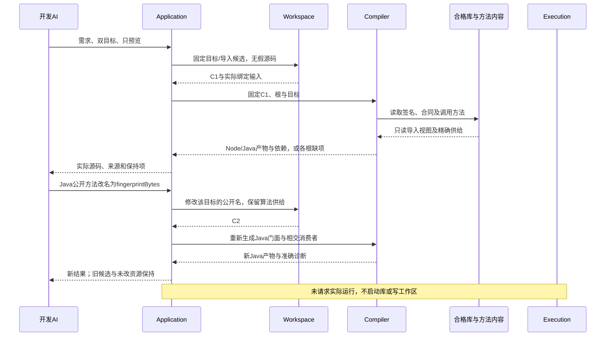

# 成熟供给与独立计算工具

> **阅读范围**：计算或实现校准范本；不是产品作者必写源。

<details>
<summary>本页内容</summary>

- [成熟能力到完整双目标工程：字节指纹工具](#成熟能力到完整双目标工程字节指纹工具)
- [完整计算应用的连续开发](#完整计算应用的连续开发)
- [一个完整需求的落地：离线整数区间整理工具](#一个完整需求的落地离线整数区间整理工具)

</details>


本篇拥有这些实际开发范本，不定义另一套产品协议；原共同规则沿正文引用定位。设计轨迹不代表产品已经运行。

<a id="native-supply-product-example"></a>
## 成熟能力到完整双目标工程：字节指纹工具

**条件范围：** 本节只在任务明确要求Node与Java两目标时使用；当前路线不以Java实现或此双目标例通过为前置。Node单目标仍可用作成熟供给直接复用的独立测试。所有下述“两个目标”的AND义务都属于本例，不外推首版。

### 本例的完整目标与边界

对调用方提供的有限字节序列，计算SHA-256，返回64个小写ASCII十六进制字符；不修改输入、不将输入解释为文本、不联网。输出为一个Node TypeScript函数和一个Java公开静态方法；允许依赖各自已声明的标准运行环境，不要求将算法和运行时源码嵌入文件。空输入合法，参数可以在运行时提供；不是构建时只能处理一个文件。

本例的输入借用合同要求调用期间稳定、不被并发修改，真实长度受平台容量和当前资源限额约束。普通单线程不共享的字节视图可以直接借读；不满足稳定条件时取得有同步依据的快照或独占交接。仅将Buffer/ByteBuffer变成另一个只读视图不冻结原后备存储；一边复制一边被其他线程写，也不自动取得某一时刻的原子快照。

这些要求不宣称SHA-256提供消息认证、无碰撞或来源真实性。此处只使用既定摘要算法，安全用途还需要它自己真实的任务合同。

### 真实供给与项目作者内容

现有合格语义合同可直接引用；如果首次接入，需要由提供者定义一次下表的公共合同，并实现两个目标调用规则。它们是本设计实际需实现的适配工作，不是已发布的`sec/hash`包，也不是由函数名称自动推得行为。应用不重写SHA-256、不移植散列常量、不创建三层转发库。

| 对象 | 这份设计明确的内容 | 保存责任 |
|---|---|---|
| 公共操作 | 稳定字节借用→SHA-256小写十六进制文本；空输入合法；目标能力与资源失败不伪造正常值 | 固定的可引用语义定义及其公开签名；可无SEC主体 |
| Node供给 | `node:crypto` 的 `createHash('sha256')`，按字节视图调用 `update`，`digest('hex')`结束 | Node目标的精确导出/调用规则及工具/环境绑定 |
| Java供给 | `MessageDigest.getInstance("SHA-256")`，`digest(byte[])`，`HexFormat.of().formatHex(...)` | Java目标的成员、调用/异常和格式规则；HexFormat要求JDK17+ |
| 生命周期 | 每次调用有独立的摘要上下文，代码可共享，状态不共享 | 目标调用规则；不建全局hash单例 |
| 应用公开面 | Node导出名fingerprint；Java类Fingerprints及静态fingerprint | 现有目标根和必要稀疏控制 |
| 数据资产 | 本次输入按运行引用提供；需要时保留图标、示例输入和人工README | 原资产与运行输入合同 |

Node官方文档规定Hash对象可以update后digest，digest后不可再使用该对象；本例不把它放入供给缓存。[Node22 Crypto](https://nodejs.org/docs/latest-v22.x/api/crypto.html)。Java文档规定digest结束并重置其状态，但共享可变实例仍需要并发与重入合同；本例同样选择每次创建独立实例。[MessageDigest](https://docs.oracle.com/en/java/javase/25/docs/api/java.base/java/security/MessageDigest.html)。`HexFormat.of()`默认小写且不带分隔，存在于17及以后；它是格式转换，不是另一份散列实现。[HexFormat](https://docs.oracle.com/en/java/javase/25/docs/api/java.base/java/util/HexFormat.html)。实际安装与当前运行权限另行取得，读取文档不证明本机已满足。

最小持久工程可以没有src目录：

```text
fingerprints/
  sec.project.json     两个输出目标、公开根及必要控制
  sec.lock.json        公共合同、两套调用规则、宿主与工具内容
  README.md            用户已有说明，未请求时不修改
  assets/              只有实际资源时存在
```

这不是把算法移入另一份手写配置：清单只引用原定义和目标，锁固定实际选择。共同合同与调用规则由适配提供者维护一次，任何项目使用它时不复制全套描述。具体清单/锁字段由[作者工程合同](../../docs/作者/工程源/清单模块与绑定锁.md#imported-output-roots)唯一维护。

<details>
<summary>查看：不含算法源码的清单形状与引用前提</summary>

```json
{
  "schema": "sec.project/1",
  "projectId": "demo-fingerprint-project",
  "sourceScopes": [],
  "modules": {},
  "targets": {
    "node-ts": {
      "profileRef": "demo-node-ts-target",
      "outputRoots": [{"moduleId":"demo-fingerprint-contract","export":"fingerprint"}]
    },
    "java": {
      "profileRef": "demo-java-target",
      "outputRoots": [{"moduleId":"demo-fingerprint-contract","export":"fingerprint"}]
    }
  }
}
```

`demo-*`是设计例的明确占位身份，不是可拿去执行的现存服务引用。首次实际创建要在同一候选中建立这些目标和导入位置的锁选择，并取得真实合同、方法与工具内容。未取得就返回准确Needs，不伪造revision、内容摘要、安装记录或锁文件。原输出根字段支持本地modules/明确绑定范围；此处是后者，不以知道某个moduleId代替公开性和读取许可。

</details>

### 候选怎样走到真实生成形态

**一，需求接受。** 已有合同与本任务相符则直接引用；未委派的输出大小写、字符串编码或安全目的差异必须保持。不存在需要补写的算法时，开发AI形成的是根/目标/绑定候选，不制造算法源。

**二，输入准备。** 固定公共定义和两目标规则，导入器取得实际模块/成员签名，准备标准类型与必要工具声明。只需生成时不启动crypto、MessageDigest或文件读写。缺Java工具不伪装成用户算法错误。

**三，共同检查。** P2链接ImportedModuleView；P3检查输入、结果与效果合同。没有作者函数体就没有虚构BodyAnalysis。P4每目标形成UseBinding，包含真实参数、接收者、状态工厂和格式转换；两目标的具体API不同，但都需要履行相同成功结果与调用边界。

**四，目标生成。** 下面的源码是本设计的目标形态，用于说明发射器应该产生什么；它们没有在本轮编译或运行，不另存为产品实现文件。

Node TypeScript：

```typescript
import { createHash } from "node:crypto";

export function fingerprint(data: Uint8Array): string {
  return createHash("sha256").update(data).digest("hex");
}
```

Java（目标JDK17+；公开方法明确声明能力选择失败）：

```java
import java.security.MessageDigest;
import java.security.NoSuchAlgorithmException;
import java.util.HexFormat;

public final class Fingerprints {
  private Fingerprints() {}

  public static String fingerprint(byte[] data)
      throws NoSuchAlgorithmException {
    return HexFormat.of().formatHex(
        MessageDigest.getInstance("SHA-256").digest(data));
  }
}
```

两段目标都不修改稳定输入；Node传入的是当前Uint8Array视图，不能改成传整个`data.buffer`，否则可能多计算前后字节。Java byte的有符号数值显示不改变其八位内容。上面入口采用已验证的非空参数合同；面向不可信动态调用方需要的解码、类型和空值错误，放到该真实边界，而不是把null当成空字节。资源耗尽与目标能力错误不转换为虚假64字符结果。

Java的`getInstance`还读取安全提供者顺序。所选目标必须固定或限定当前允许的提供者与其初始化行为；新注册、重排或替换提供者会重新影响调用资格。若目标要求指定提供者，则生成相应显式提供者调用及其缺失错误，而不是继续用默认查找假称精确绑定。标准JDK合同不证明任意用户安装提供者都不联网或满足算法。Node实际crypto构建和相关底层实现同样属于运行要求；不将文档页的默认环境当成每台机器事实。

示例允许不同目标用自身异常方式表达真实能力/运行失败，并在SEC运行边界归类；如果用户要求两边相同的公开Result形态，就生成对应错误适配和声明，不能声称这两段已经自动满足那项更强要求。Java平台规定支持的算法集合不能代替当前提供者和安全配置的实际可用性；Node静态import缺crypto时可能在模块装载阶段失败，该目标环境要求必须进入交付与运行准入，不能以调用内try假装已覆盖加载失败。

**五，完整成员。** Node目标需要本模块、TypeScript对应构建/声明输入和Node crypto运行能力；`node:crypto`不是需要从npm下载的包。Java目标需要源文件、合格JDK和相应java.base API。只有实际选择其他包工具、构建配置或资源时才加入成员。两者不带SEC的任务库、语义手册、Host总表或镜像算法。

**六，检查和使用。** 预览返回各自完整源根与准确依赖。明确check才生成针对该制品的CheckRecord，明确build/run才由execution取得实际结果。运行参数属于运行输入；新输入不要求重新创建根或重新设计算法。两个目标共同要求时，一边成功仍只代表那一边。

<a id="fig-supply-roundtrip"></a>
### 图解：无作者算法的首次生成与第二次修改

这是一条场景时序；每个返回都绑定精确基础，不代表所有任务必须先做目标运行。



### 后续变化与真正新增的作者内容

第二次任务只将Java公开方法名改为`fingerprintBytes`，不改Node导出、不改摘要或结果大小写。通过既有`control-change`给该准确根增加`target.public-name`要求；实际调用形状如下。`C1`和`Q-public-root`须由真实候选/查询产生，不能直接使用本例占位值执行。

```text
sec.propose({
  draft: {
    kind: "control-change",
    base: "C1",
    subject: "Q-public-root",
    target: "java",
    require: { "target.public-name": "fingerprintBytes" }
  }
})
```

它保存到项目既有`extensions["sec.controls/1"].records`中，target为java，subjectRef指向当前实际导出根，controlRef为已经锁定的公共名描述符，mode为require，value为该名字。目标组合器修改Java门面及真实内部引用；上游MessageDigest/HexFormat不改名，Node产物可以复用。若已有外部调用者依赖旧名，则按公开兼容要求保留适配或迁移，不能假称改名永远无外部影响。

若真正要求输出大写，这是公共结果变化，不能只改生成布局。可选已有明确的大写出口或在获准范围改公开格式政策；没有这样的可修改合同，就建立仅承担格式差额的项目定义。Node可对已知ASCII十六进制结果转换，Java可采用`withUpperCase`，但必须同步接受结果、调用规则与相关检查，不能保存一个无人消费的布尔字段便称已实现。摘要算法不因此重写。

添加“文件名＋冒号＋摘要”的报告时，新增项目私有的格式/排序政策与必要I/O组合，引用原摘要操作；不复制摘要算法。要忽略空白再散列，必须定义按字节还是按编码文本、哪些空白与错误政策；这是新输入语义，不能当成名字参数随意推导。对应政策可通过已有文本/格式供给实现，真正未覆盖才写自己的主体。

要求浏览器目标时，不能把Node模块名称换个字符串就当完成；需要浏览器实际供给与异步、类型、容量及权限合同。无合格映射就单独保留该目标缺项。要求完全不依赖任何运行时源码时，上述普通库调用并不满足，需另一种交付路线。

需要文件CLI时，入口适配读取所选路径、取得有保证的输入范围、调用、编码结果并按真实前像写出。输出不能默认覆盖输入；目录别名、并发变化、停止和迟到结果沿原宿主协议处理。很大文件且内存预算不足时可选择有资格的分块调用规则；不能以One-shot已设计宣称streaming读取、并发修改下快照与取消都已实现。

### 应主动核对的反例与有限验收

| 反例 | 必须保持的结果 |
|---|---|
| 对同一封闭字节序列两次调用 | 两份新上下文按同一公开合同得到同值，不复用已经digest的旧状态 |
| Uint8Array只是大缓冲的一段 | 只处理其byteOffset/byteLength覆盖的字节，不泄漏相邻数据 |
| 业务传入字符串、null或活动共享可写数组 | 准确边界处理，不隐式改成UTF-8/空值或假快照 |
| Node装载缺crypto、Java方法/算法不可用 | 能生成与能运行分别说明；能力失败不变成成功摘要 |
| 两目标格式不一致 | 目标方法不符合共同结果，修相交格式规则，不修改原需求 |
| 只有标准库声明、没有实际环境 | 不能从类型通过推导运行存在 |
| 取消等待而库仍在执行 | 不能回收被使用输入；同步黑盒需要相应隔离或完成保障 |
| 已保存候选，目的文件后来被修改 | 应用前检查真实前像；不能因产物合格就覆盖用户内容 |
| 只改Java公开名 | 旧产物保留，仅相交目标与真实消费者更新，不重写成熟算法 |

残余验证只针对本系统的根解析、输入视图、调用次序、格式、状态范围、依赖和输出关系；已有算法的上游保证按实际前提复用。不能只比较两套同错适配就证明算法正确，采用已知独立测试向量时记录其来源与实际运行范围。本例本身不提供运行证据。

## 完整计算应用的连续开发

完整算法、输入域、模块接口与书面结果由[本地图分析、布局与导出](../../docs/领域/计算基础/计算结构与算法.md#一个完整目标工程本地图分析布局与导出)唯一维护。本节只规定同一对象如何经过开发过程，避免复制另一套SCC或布局规格。

初始作者工程有模型、图分析、布局、场景、入口和实际assets。输入固定为四顶点五边的有向多重图，spacing=10；同一候选C1生成目标源码A-src及资源。原文件不因此写入、目标尚未执行。明确构建形成A-run，明确运行使用输入I1取得R1；分析和布局期望来自独立合同，不由进程退出码代签。

正常结果为{a,b}/{c}/{d}三个分量，以及a(0,0)、b(10,0)、c(0,10)、d(0,20)。只改spacing=20可以在同一产物上改变运行参数，或在它原本为作者静态参数时形成C2/A2；两种来源必须按实际定义处理，不能把运行参数变更全部记成源码修改。已固定SCC分析可复用，布局/场景重算；第三方控制台中缓存的旧位置不能当新结果。

新增d→b形成新的输入I2，四顶点变为同一个分量；当前头等待I2对应的布局，I1的迟到结果只能进入历史或合格缓存。若算法实现本身被修正，则产生新代码候选和产物，不能仅更新数据版本而复用旧语义结果。

用户希望看components输出，选择有限边界观察；Runner确实支持时取得该运行中的结果及范围。若目标优化已删除该中间值，先显示Unavailable，再明确生成观察制品或利用真实可恢复方法；不另跑一个可能不同的函数并把结果假装成原运行现场。给大图抽样只能说明抽样，取得全量分量数量需要相应完整计算。

最后导出SVG或应用包。标签/路径/资源分别用对应编码和引用规则；缺字体或目标坐标范围不满足时，分析根仍可完整，完整渲染根保留缺项。已有人工README与不相交图标保持；本次明确更新派生说明才修改相应区域。大系统的完整性体现为这条连续关系，而不是新建账号、数据库和事件总线。

工具扩展中的a-src/a-run/I1等必须来自实际内容服务和前一操作，不从本例复制占位符执行。设计请求到这里给出准确合同和反例即可；未取得实际权限时不运行或写出。

<a id="interval-product-example"></a>
## 一个完整需求的落地：离线整数区间整理工具

本例检验**完整需求按真实供给完成，并且仅在供给缺失时补写必要算法**，再连接目标、输入输出、保存与第二次修改。它不以“没有预装业务block”为由先重写标准算法。下列合同与结果是设计推导；所列主体只是无合格供给时的完整实现见证，不是需求面的默认输入。

### 接受要求与设计者的实现选择

用户任务设定为：输入有限个整数闭区间；允许乱序、重复、负数和单点区间；合并相交区间，默认不合并仅相邻区间；输出按起点、终点升序且不相交的区间；输入不变；空输入返回空。存在反向区间时，返回它在原输入中第一个零起始位置，不能偷偷交换端点或丢弃。要求离线执行，可返回TypeScript和Java源码；本例先预览，不写文件、不运行。

这些是本例的准确任务条件，不是所有项目的默认政策。排序算法、临时表、私有函数名及目标容器由设计者选。输出要合并相邻整数区间，是一个以后可改变的行为值；它不是必须先接的一根图线。

现有项目已经有同合同实现时直接复用。需要排序等通用供给时也先采用已绑定的合格库，不将本例设为重写成熟排序器的要求。下面特意给出不依赖未定义sortBy或区间插件的闭合主体，说明当相交供给缺失时开发AI究竟补什么，以及编译器怎样处理；它是可审查基线，不是每次使用都重新创作的入口。没有先注册“区间合并意图”、创建类或建立插件；独特工作也没有从作者成本中消失。

### 先决定本任务真正缺少什么

| 已取得的供给 | 当前处理 | 作者实际维护 |
|---|---|---|
| 已有区间归一化满足闭区间、相邻政策、原错误位置和输入不变 | 直接引用该定义／合格实现 | 本次输入、参数及独立要求 |
| 区间实现满足合并语义，但会原地修改或忽略非法项 | 先判断可否以必要的复制、原顺序验证保持合同；完整成本合格才采用 | 真实的行为差额与必要适配，不复制原算法 |
| 只有合格排序、容器与数值供给 | 复用它们，只补原顺序验证和区间扫描 | 此任务尚缺的组合／行为 |
| 当前允许供给没有合格排序或区间算法 | 在明确的当前范围选下方可移植主体 | 一份完整新主体；不由此推广为标准库移植计划 |
| 一个目标可用、另一个缺实现 | 返回合格根及具体缺项，按原共同交付判断 | 不自动要求作者把第三方库改写成另一语言 |

本表描述判定条件，不宣称已取得某个已安装的区间包。同名函数若把相邻区间也合并、将反向端点自动交换或只报告排序后位置，就不是直接替换。为了复用不可修改上游时，可在边界补差额；差额无法保持原要求或代价被禁止，就换方案。只有一份类型声明而缺行为依据时，先保留相交未知，不能将其当成完整供给。

排序等成熟能力不必具有`.sec`主体。项目模块可以引用已有公开定义，编译器绑定真实目标方法并生成导入。需要按目标提供不同依赖时依原合同处理，不能生成空的`intervals.sec`或猜测不存在的包来让示意图看起来完整。

<details>
<summary>展开：在当前没有合格供给时，完整可移植主体及其算法成本</summary>

### 完整项目主体：算法只维护一次

`src/intervals.sec`：

```sec
export type Interval = { lo: Int, hi: Int };
export type InputError = Reversed(Int);

type Parts = {
  left: List<Interval>,
  right: List<Interval>
};

fn validate(xs: List<Interval>, index: Int) -> Result<Unit, InputError> =
  match xs {
    case [] => Result.Ok(());
    case [head, ..tail] =>
      if head.lo <= head.hi
      then validate(tail, index + 1)
      else Result.Err(InputError.Reversed(index));
  };

fn split(xs: List<Interval>) -> Parts =
  match xs {
    case [] => { left: [], right: [] };
    case [a, ..tail] =>
      match tail {
        case [] => { left: [a], right: [] };
        case [b, ..rest] => {
          let parts = split(rest);
          { left: [a, ..parts.left], right: [b, ..parts.right] }
        };
      };
  };

fn before(a: Interval, b: Interval) -> Bool =
  a.lo < b.lo || (a.lo == b.lo && a.hi <= b.hi);

fn merge(a: List<Interval>, b: List<Interval>) -> List<Interval> =
  match a {
    case [] => b;
    case [x, ..xs] =>
      match b {
        case [] => a;
        case [y, ..ys] =>
          if before(x, y)
          then [x, ..merge(xs, b)]
          else [y, ..merge(a, ys)];
      };
  };

fn ordered(xs: List<Interval>) -> List<Interval> =
  match xs {
    case [] => [];
    case [head, ..tail] =>
      match tail {
        case [] => [head];
        case [next, ..rest] => {
          let parts = split(xs);
          merge(ordered(parts.left), ordered(parts.right))
        };
      };
  };

fn coalesce(
  current: Interval,
  rest: List<Interval>,
  adjacent: Bool
) -> List<Interval> =
  match rest {
    case [] => [current];
    case [head, ..tail] =>
      if head.lo <= current.hi
         || (adjacent && head.lo == current.hi + 1)
      then coalesce(
        {
          lo: current.lo,
          hi: if head.hi > current.hi then head.hi else current.hi
        },
        tail,
        adjacent
      )
      else [current, ..coalesce(head, tail, adjacent)];
  };

export fn normalize(
  items: List<Interval>,
  adjacent: Bool
) -> Result<List<Interval>, InputError> =
  match validate(items, 0) {
    case Result.Err(error) => Result.Err(error);
    case Result.Ok(_) =>
      match ordered(items) {
        case [] => Result.Ok([]);
        case [head, ..tail] =>
          Result.Ok(coalesce(head, tail, adjacent));
      };
  };
```

`src/main.sec`只维护本应用的选择：

```sec
import "./intervals.sec" as intervals;

export fn run(items: List<intervals.Interval>)
  -> Result<List<intervals.Interval>, intervals.InputError> =
  intervals.normalize(items, false);
```

`before`是本模块普通私有函数，不与其他库的同名符号混同。Parts是私有辅助值，Interval和InputError是公共合同；公开返回不泄漏Parts。默认不合并相邻区间由应用实参承担，不在源码、意图JSON和图里手动保存三次。

### 算法、不变量与资源

先按原位置验证端点，再排序，最后扫描。验证在排序前完成，才能返回第一个**原输入**错误位置。split每次处理零、一或至少两个元素；ordered只对至少两个元素继续拆分，左右长度均严格小于原长。merge每步移出一项，coalesce每步移出一项，因此有限合格输入有有限逻辑工作。

归并排序使用按(lo,hi)定义的全序；不依赖宿主对象比较和字典插入次序。扫描保持：已经输出的区间完整、递增且与当前区间分离；current是尚未输出的最后一个连通组的并；每次相交时只扩展其右界。遇到分离区间才发布旧current。若adjacent=true，离散整数的相邻边界也属于同一组。文本地址、运行对象ID或时间不参与次序。

令n为输入项数。比较次数为O(n log n)，扫描O(n)；任意精度端点比较与加法的位长成本另计。这个源范本的不可变列表归并可累计分配O(n log n)个列表节点，直接递归实现的栈可达O(n)。不得将它报成已测的零分配算法或任意规模常数栈保证。

首个目标实现可以按语言已有的栈策略生成显式工作栈；低额外内存要求激活时，合格方法可采用底层可变数组归并或其他已证明保持的实现。采用宿主原生递归而超出真实栈预算时返回资源失败，不能把宿主栈不足改成“输入区间不合法”。已经有O(n)内存或固定栈硬要求而该路线不满足时，不允许回退这个较弱实现。资源优化是后端／库实现义务，不让调用方重写排序。

</details>

### 可核对的结果与反例

| 输入及参数 | 规范结果 | 检查的区别 |
|---|---|---|
| `[]`, false | `Ok([])` | 空输入正常，不造一个零区间 |
| `[(5,7),(1,3),(2,4),(9,9)]`, false | `Ok([(1,4),(5,7),(9,9)])` | 排序、合并相交而不合并仅相邻 |
| 同一输入，true | `Ok([(1,7),(9,9)])` | 相邻政策改变结果，不称为性能优化 |
| `[(1,2),(2,5)]`, false | `Ok([(1,5)])` | 闭区间共享端点已经相交 |
| `[(1,5),(2,3),(1,5)]`, false | `Ok([(1,5)])` | 包含与重复不增加结果 |
| `[(2,1),(0,-1)]`, false | `Err(Reversed(0))` | 不排序后重报错误位置 |
| `[(1,2),(7,6)]`, false | `Err(Reversed(1))` | 不返回前缀成功 |
| 精确整数超出某目标普通数字域 | 精确表示或目标能力／资源缺项 | 不向浮点悄悄取整 |

性质检查可使用端点集合与并集关系、输出有序及重新归一化不变；这些是独立于某次生成器输出的预期。仅“输出互不相交”不够，因为错误返回空列表也满足它；还必须保留输入集合的并及所选政策的分组边界。

### 实际协议与目标产物

选择上述无供给主体路线时，首次创建经现有`sec.propose({files: ...})`传入两份完整原文，得到候选C1。选择复用路线时，候选只含实际调用、原要求及必要绑定／适配，不再同时提交这份算法主体。`files`内不接受这里用于叙述的省略号或文件引用字符串代替源码；没有实际调用，就没有真实C1。

已有C1以后，下列是完整的调用形状：

```text
sec.preview({candidateRef: "C1", target: "typescript", return: "code"})
sec.preview({candidateRef: "C1", target: "java", return: "code"})
sec.propose({base: "C1", edits: [{
  path: "src/main.sec",
  old: "intervals.normalize(items, false)",
  new: "intervals.normalize(items, true)"
}]})
```

typescript和java须为本次实际可解析的目标键。预览按候选的锁解释源，两个目标的产物分别有引用；缺少Java实现不否定C1或完整TS产物，但双目标任务尚未全部满足。图视图可以展示验证、排序和合并；作者不需要先手工创建这三个节点，编译也不依赖图是否打开。

TS目标采用精确整数表示、结果的可区分联合及模块导出；Java目标采用等价的大整数、公开值类型和入口。两个目标的私有布局可以不同，但必须分别满足数值、错误位置、输入不变与结果顺序。目标名为java不证明BigInteger适配、ABI或所有成员已经实现。

生成结果不包含SEC任务库、全部语言手册、未用状态机或数据库。生成的私有函数、辅助类型、实际用到的运行库和资产才属于所选根；目标代码不取得作者写权。检查请求使用该份artifactRef与事先给出的casesRef，不拿C1的绿色贴到后续C2。

### 文件入口与全工程资产

当任务增加“读取JSON文件并写JSON输出”时才接I/O。为精确整数，交换格式规定端点是规范十进制字符串：`0`，或负号可选且首位非零的十进制串；拒绝`-0`、前导零、小数和指数形式。根为数组，每项只含lo、hi两个字符串；重复键、缺字段、未知字段和非规范数值在边界诊断。输出无BOM、键顺序lo后hi、无多余空格，终尾一行LF。若要求普通JSON数字，要另外接受其解码和消费端精度合同，不能默认损失精度。

模块与资源安排为`src/intervals.sec`、`src/main.sec`、需要时的`src/io.sec`及已有项目清单与锁。图标、许可证、人工README只有确实存在和相交时进入成员集合；不因本例出现目录就给空工程创建全部文件。CLI适配复用现有构建／运行及文件能力，没有虚构一个已发布IO包。

I/O适配先取得允许读取的准确输入，按本契约解码，再调用run，再编码。输入错误不创建成功输出；输出先完整构造为内存内容或许可暂存，再按原前像和写入合同提交。默认输出不能覆盖输入或已有目的文件；同一路径、符号链接别名和并发替换由宿主准入核对。显式允许替换时仍需前像。多个无原子提交能力的文件不能被标成同一原子发行。

### 后续修改和收束

合并相邻是应用实参变化，原库、导入和未相交文件保持；改错误策略为自动交换端点则改变公共行为，需核原接受要求并修改validation，不伪装成格式化。改Java公开名只改该目标的稀疏控制；换图标只改资产；更换排序实现保留源合同和真实目标资格。

原请求并没有要求每个区间一份稳定工程ID、一个class或一个block。封装用于实际复用；库源码可按需求展开。若同一简单函数足够，就不再拆一个无消费者的门面。旧图、旧源码和旧检查均绑定原基础，不让旧任务结果覆盖新要求。

这个用例验收一次成功开发、错误修复、行为改变、实现替换、双目标、非源码和真实写入边界；它不把区间业务推广成全部产品的模型，也不凭一份源范本宣称完整生态已经验证。
