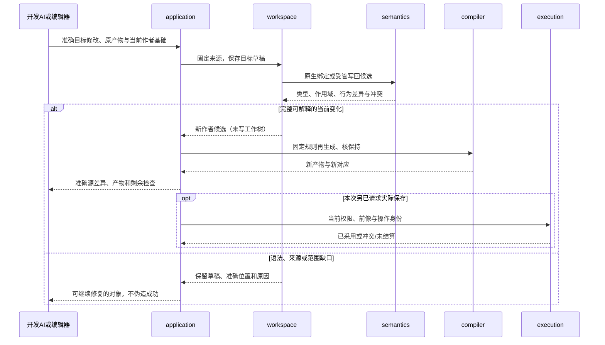

# 简洁作者与TS往返

> **阅读范围**：计算或实现校准范本；不是产品作者必写源。

<details>
<summary>本页内容</summary>

- [短写法与类型补全：复用、固定选择和实现交接](#短写法与类型补全复用固定选择和实现交接)
- [TS工程的导入、生成、逆向修改与再生成](#ts工程的导入生成逆向修改与再生成)
- [首次生成与直接在目标上修改](#首次生成与直接在目标上修改)

</details>


本篇拥有这些实际开发范本，不定义另一套产品协议；原共同规则沿正文引用定位。设计轨迹不代表产品已经运行。

<a id="compact-author-example"></a>
## 短写法与类型补全：复用、固定选择和实现交接

本例只验证函数值、参数复用、类型补全和短源保持；它不单独证明跨软件的需求关系、交互和开发操作已经抽象充分。已有正确库先引用；没有合格供给时，下面的库主体说明一次性定义的准确含义。两份文件共用当前[简洁作者合同](../../docs/领域/计算基础/紧凑表示与程序范式.md#compact-author-contract)。所有源码、目标和结果均是设计范本，未运行。

### 使用者维护的全部内容

`src/offer.sec`：

```sec
import "./pricing.sec";

export let pay = total =>
  pricing.payable(total, {threshold: 500, discount: 20});
```

这里唯一的业务实例选择是门槛500与优惠20。`pay`是实际输出名字；调用方不再抄返回类型、参数类型、导入别名、等义类或一份意图JSON。如果应用本来就要公开原来的双参数入口，可直接写`export let calculate = pricing.payable;`；它引用下面真实定义的函数，不另写转发主体。需要固定当前优惠时才用上面的单参数pay。已有完整供给也可以沿无算法源导入根使用。

工具必须从真实定义取得含义，而不是根据pricing或payable的名字猜测。下面给出完整相交定义；它属于库作者，不要求每次调用重新输入。现成供给满足同一合同就直接绑定，不以本例要求重写成熟功能。

### 对应库的完整内容

`src/pricing.sec`：

```sec
export type Rule = { threshold: Int, discount: Int };

export fn payable(total: Int, rule: Rule)
  require total >= 0
  require 0 <= rule.discount && rule.discount <= rule.threshold
= if total >= rule.threshold
  then total - rule.discount
  else total;
```

`Rule`是公开名义记录。工具先取得它和payable的参数合同，在库主体上确定返回Int；再由payable的第一个参数推得lambda的total为Int，在已知Rule预期下解释记录。名义身份、表示权限、require和调用顺序没有因省注解而消失。

pay的创建不执行payable。实际调用pay时才计算已写的参数并进入payable的契约入口。当前源没有声明一份重复的pay前置，不会自动伪造“已证明pay满足所有任务”；需要在pay上增加独立公开约束时改成普通fn声明，保留真实来源与前置次序。

### 真实数据、阶段和责任

| 输入或中间对象 | 实际所有者与行为 | 返回或失败 |
|---|---|---|
| 两份原文和固定语言修订 | workspace从缓冲或完整files批次取得同一基础 | Candidate及覆盖；不要求逐行先绿色 |
| 导入末段pricing、真实Rule和payable | 解析/链接只计算准确默认别名并解析引用 | 声明种子，或导入冲突/缺输入 |
| payable的待推导结果 | 检查if和两个Int分支 | 封存Int结果；不执行函数 |
| pay的单参数lambda | 单态参数变量受已知payable签名约束 | `(Int)->Int`及潜在效果、来源、真实被调合同 |
| SourceBody与既有UseBinding | compiler检查函数值根，处理调用并发出目标 | TS目标函数/合法别名，所用依赖；不生成框架解释器 |
| 原作者短写法与目标对应 | EditCorrespondence引用原CST，不用展开程序替代 | 回源仍修改原literal/绑定；歧义保持 |
| 可运行制品和实际输入 | 仅在已请求compute-eval/run时进入execution | 实际运行结果、失败与资源状态；本例没有执行 |

源保存时仍是四行offer文件和原库；推导签名及捕获表是可重建结果，不在项目里自动追加`pay-expanded.sec`、requirements.json或手填类型树。新工程只按需要保存现有清单和锁；普通改折扣不重写语言锁。

### 第二次修改只改真实差异

门槛不变，把优惠20改成30：直接将`discount: 20`改为`discount: 30`。已有定位时可以使用原短编辑；已经知道源码时不先查端点。文件工具可以连同测试预期或说明一起修改，捕获后按实际AND/OR根分析，不自动修改未选的Java或其他目标。

| 输入 | 优惠20的规范结果 | 优惠30的规范结果 |
|---|---:|---:|
| 499 | 499 | 499 |
| 500 | 480 | 470 |
| 800 | 780 | 770 |
| -1 | payable第一前置失败 | 同一前置失败；不是返回0或忽略原要求 |

相交TS发射可以保持普通`pay(total: bigint): bigint`及对payable的一次调用。`20n`出现在目标配置处时，合法generated-edit回到offer的20；没有在原源写出的参数/返回注解，不因目标上存在类型就凭空变成一个可随意修改的作者槽。内部推导仍要计实际处理成本；源码短并不证明运行更快。

### 同一主面处理其他真实变化

**最高分、同分最后。**已有Item类型与seq定义时，可以写一个返回推导的普通函数，主体直接是`seq.maxByKey(seq.filter(items, x => x.enabled), x => x.id, x => x.score, keep: "last")`；回调的Item来自已知输入，比较和顺序来自固定合同。无需编写手工递归扫描，也无需为整个调用再封装一层没有消费者的类。这个片段引用既有[完整取优合同](../../docs/作者/组合/模块封装与复用库.md)，不宣称库已安装。

**独特算法。**已有构造允许直接写`export fn qualifies(score: Int, threshold: Int) = score >= threshold;`。没有现成供给时仍要定义真正的新逻辑，不能用短函数名掩盖缺实现。

**只改目标公开名。**使用既有目标控制；源码函数体与其他目标不变。无需因为TS发射采用类容器就写一份语义不同的class。

**现有TS工程。**继续改TS原文，不为展示简洁性批量迁为本例。其推断和工具由实际宿主能力承担，SEC只处理既有相交责任。

**规则变成比例优惠。**这是真正新行为，必须定义精度、舍入和失败；不能将`"10%"`写进Int字段就宣布完成。

### 四类失败应当在同一入口修复

1. `total => total`没有预期签名：给该参数或声明一个类型即可；不得要求用户填写整个IR。
2. 导入从pricing.sec移动成rules.sec：保持性移动插入`as pricing`并更新准确路径；显式希望统一更名时，改真实引用而不字符串全库替换。
3. 上游Rule或payable签名改变：重新检查使用点与公开出口；当前源码无返回注解不等于接受任意新接口。
4. discount被写成Text或文件尚未写完：保留错误草稿与局部诊断；旧产物不重贴成当前结果，不自动恢复旧文。

本例的结束条件包含原文→类型补全→调用根→生成→正常调用/错误→第二次修改→回源仍保持短写法。仅完成无变化source map或编译一个满注解fn，不满足这条作者能力；全部生态和其他语言则不成为这个有限交付的前置。

<a id="ts-roundtrip-product-example"></a>
## TS工程的导入、生成、逆向修改与再生成

这个范本以简单阈值检验来源、联合修改和再生成的交接，不代表需求抽象只能细到比较运算，也不以这个小函数证明全部目标工程能力。当前任务：从既有TS工程或中立作者工程开始，保持准确的整数阈值、公开入口与未改资源；能在目标源码修改，再正确回到原作者并继续下一轮。原生读取与受管生成是两条有明确拥有者的入口，不要求用户先迁写项目，不把历史意图猜测当成事实。

### 实际工程和源拥有者

原生工程可以保持自己的`src/threshold.ts`、`tsconfig.json`、`package.json`、已有锁、README和assets。接入只建立实际快照、导入关系、类型与资产视图；不为了统一目录复制成一份`.sec`源码。文件内的普通新算法继续由TS拥有。

中立工程可以只有下列内容；控制/锁由既有工具形成，普通作者不手填完整节点树：

```text
project/
  src/threshold.sec       作者行为
  assets/                 真实资源存在时使用
  README.md               人工说明不默认改写
  sec.project.json        模块、当前TS输出及稀疏控制
  sec.lock.json           实际规则、供给与目标绑定
```

只复用外部实现而没有算法源的工程也继续合法：其公开名、适配和参数对应真实根/控制，不能因为导入没有body就伪造作者文件。直接修改外部实现内部，需要实际源码及权利；不存在时只保留可调用资格。

### 直接编辑多个文件，不把协议当开发语言

开发AI可以直接用已授权的编辑工具修改`src/threshold.sec`和引用它的模块，保留当前磁盘或未保存缓冲。修改期间暂时缺少导出是正常草稿。请求检查/预览时，工作区适配器一次取得版本化工作集和必要配置，构造同一候选；不要求每改一行就调用propose。

需通过远端工具传原文时，可用既有的完整文件分支。假定C0已绑定这两个作者路径，下列是一份完整请求范本，不是实际工具执行：

```text
sec.propose({base: "C0", files: {
  "src/limits.sec": "export fn threshold() -> Int = 12;",
  "src/filter.sec": "import \"./limits.sec\" as limits; export fn passes(n: Int) -> Bool = n >= limits.threshold();"
}})
```

两个文件收齐后一起建立声明和引用，形成新候选；未出现的路径保持。这个请求没有draft，也不自动编译、运行或写盘。相同方式可以承载更多文件，实际字节/内存预算仍成立；大本地工程优先读取固定内容而非重复运输全库。分批运输由实际有版本的缓冲/快照承担，不能把每批当成已完成的全工程。

已经保存的文件直接成为下一次观察基础，解析失败也不回滚；尚在工具内存中的候选只有实际采用时才apply。三文件写入中途失败时，不声称原子，也不拿候选事务的性质替文件系统担保。

下节较长的generated-edit仅用于“修改的是受管生成物”的情形；它需要知道生成时与当前两份作者基础。客户端可以从直接编辑后的目标文件自动取得这些字段，不要求开发者手输C0和A0。普通作者文本路径不绕行这个逆向分支。

## 首次生成与直接在目标上修改

`src/threshold.sec`的完整源码：

```sec
export fn passes(n: Int) -> Bool = n >= 10;
```

当前TS目标的完整发射范本：

```typescript
export function passes(n: bigint): boolean {
  return n >= 10n;
}
```

阈值来源是该函数中的一个整数出现，不是所有数值为10的字段。源保存为C0，产物为A0；编译器同时保存精确目标绑定、原文及可写对应。调用参数为9、10、11时的书面预期分别false、true、true。程序类型、实际运行和任务验收仍需各自依据。

用户提出“阈值改成12”，也可以直接在A0的代码上把10n改为12n。沿现有工具提交：

```text
sec.propose({draft: {
  kind: "generated-edit",
  base: "C0",
  artifactRef: "A0",
  edits: [{path: "out/threshold.ts", old: "10n", new: "12n"}]
}})
```

它是[正式定义的请求分支](../../docs/开发/工具协议/六工具与请求.md#generated-edit-request)，不是新的顶层工具。C0/A0是叙述中的假定工具结果，不是已执行引用。实际处理为：固定原目标与作者→解码bigint差异→取得唯一源槽→构造作者变化→核当前要求→再生成。新源码成为`n >= 12`，新目标成为`n >= 12n`；11和12的书面预期分别false与true。

随后源中改成15，再生成得到15n；不会用原来手改的12n覆盖新源，也不会丢失上一轮已采用的作者变化。若A0是原生作者文件而不是受管输出，差异直接修改原TS，根本不调用中立反编译。

### 共享来源、不同目标和并发修改

| 变化 | 精确处置 |
|---|---|
| 同一个源阈值被两个目标函数内联，只改其中一个 | 默认使用点范围，按来源建立合法私有特化或返回范围冲突；不能把两个函数一起悄改 |
| 明确要求所有使用者阈值改变 | definition范围提出共同候选，核所有真实消费者，不依据相同字面量扫描 |
| README或图标在C0之后改变 | 对当前C1重基，只加阈值变化；不覆盖这些不相交资产 |
| 当前源同一阈值已改为20，旧目标再改12 | 报同槽冲突并保留双方内容；不能按谁后返回覆盖 |
| 目标改为`12`而非`12n` | 类型/数制不符，不能把number与bigint默认为同义 |
| 删除函数的一行但暂时写出语法错误 | 保存目标草稿和准确诊断；原源和旧产物不被伪造更新 |
| 在未映射区域加入动态eval或作用调用 | 保留目标草稿，指出需要的语义/拥有者，不能归零效果或丢掉新代码 |
| 仅改目标公开名 | 映射到该目标的已有public-name控制；不改变业务类型和所有目标的名字 |
| 将公开名改成与已有导出冲突 | 返回准确冲突，不能自动删掉另一个导出 |
| 来源缓存被清空 | 按持久保留根恢复原内容；真正缺失时不猜source，只保全目标或明确原生接管 |

若C1已经采用新的生成器/语言规则，先用A0的规则理解原变化，再明确核对能否迁移到当前规则；不同规则的节点坐标不能混用。当前请求不暗中升级解释来迎合改动。

### 同一个开发任务的模块时序



图只表达本次编辑交接，未展示语言服务的内部线程和所有宿主错误。完整输入与失败联合由协议和I-R规范拥有；没有从compiler直接写磁盘或自行调用外部程序的箭头。

### 验收怎样判定真正完成

同一任务必须完成原生读改或受管回源、再生成、再次修改与冲突保存。只有一次source map定位、一次类型检查、一次生成或一个无变化往返，均不满足此完整闭环。检查结果要说明实际编辑类别和覆盖，不以“80%”之类无数据数字替代。

当前不需要第二语言参与这个任务。只有真实需求选择原生内核时，才使用相应合同；[窄C例](../../docs/运行/宿主生态与技术约束.md#native-kernel-boundary)只示范数值/缓冲/ABI，不预定下一目标。
