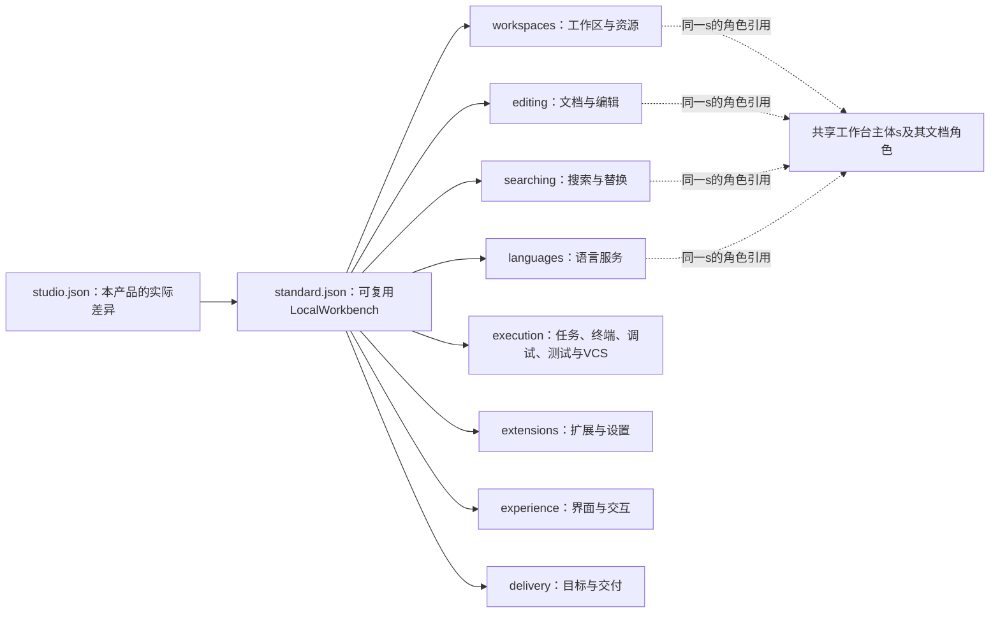

# 完整工作台意图源：从新产品要求到整套工程

> **阅读范围**：当前作者源范本；未运行产品。

本页内容

- [1. 全份作者内容已经作为文件交付](#1-全份作者内容已经作为文件交付)
- [2. 本例具体选择，以及没有偷换的范围](#2-本例具体选择以及没有偷换的范围)
- [3. s为什么不是预先写好的系统实现](#3-s为什么不是预先写好的系统实现)
- [4. 产品特有修改仍是需求修改](#4-产品特有修改仍是需求修改)
- [5. 按这套源实现编译器的准确输入输出](#5-按这套源实现编译器的准确输入输出)
- [6. 最重要的正反设计条件](#6-最重要的正反设计条件)
- [7. 当前结构源、两个工程文件和表示后继](#7-当前结构源两个工程文件和表示后继)
- [产品族：条件、全体与共同选择](#产品族条件全体与共同选择)
- [当前结构化源的定义展开图](#当前结构化源的定义展开图)

本范本先规定一个新建产品最终由作者维护的内容，再由它决定编译器/供给必须提供什么。不是逆向Code-OSS，不是临时修改流程，不是生成一批常规SEC函数后声称意图抽象完成。

## 1. 全份作者内容已经作为文件交付

产品入口是[studio.json](model/studio.json)。它引用[standard.json](model/standard.json)中的完整LocalWorkbench定义。后者由下表八个需求定义组成；这些源码同样全部交付，因此根名不是没有内涵的“makeIDE”调用。

| 文件 | 该片段确定的产品含义 |
|---|---|
| [workspaces.json](model/workspaces.json) | 多根/文件操作、开放模型优先及草稿恢复 |
| [editing.json](model/editing.json) | 文档、编码/坐标、多视图编辑、撤销和保存 |
| [searching.json](model/searching.json) | 全工作区搜索、冻结替换预览、过期条件及可用结果界面 |
| [languages.json](model/languages.json) | 语言能力、诊断、重构与辅助，绑定真实文档 |
| [execution.json](model/execution.json) | 任务、终端、调试、测试及版本集成 |
| [extensions.json](model/extensions.json) | 扩展、配置、联网与破坏性操作政策 |
| [experience.json](model/experience.json) | 真正用户界面的布局、命令、焦点、主题、消息与无障碍 |
| [delivery.json](model/delivery.json) | TS源、三个平台的独立输出、成员与来源、有界资源 |

分成十文件是为了把可复用定义也展开给编译器实现者看。正常应用作者可以只维护studio.json中的独特定义和自己的差异；不必为每个使用者复制这些定义，更不必写搜索循环、回调、锁、错误分发器或界面处理器。标准需求定义也可作为固定版本的普通库发布；本包没有伪造其发布版本、安装记录或内容锁。

每条结构化require的字段和值已经在[需求定义与供给合同](../../docs/作者/需求规则与供给合同.md)逐一规定。主语模型和规则不是从名字“猜出来”的；所有`sec/spec/*`引用的身份是**规范中已定义、实现尚未发布**。未来真实编译器从确切的Definition/ImportedModuleView读取，不把Markdown交给模型即时猜。

## 2. 本例具体选择，以及没有偷换的范围

这是一个本地、多根、多文档、可扩展的桌面开发工作台，带编辑、搜索替换、语言服务、运行/调试/测试、终端、版本集成、设置和真实UI；源输出为TypeScript，三个平台分别满足。它允许用户授权的联网操作，但未经许可不后台传输；云账号和商店不是本地使用前置。本例不包含多人实时协作与云同步，也不承诺完整兼容所有VS Code扩展或逐像素复刻VS Code。

这些是设计者用于全产品校准的明确选定范围，不是把SEC限制为IDE。只要需要被编译的产品范围足够明确，同样的结构编码/绑定/需求关系可以用于计算工具、服务、数据系统、设备或科学程序；新领域的真实观察和方法仍需其独立定义，不用一个IDE目录假装覆盖一切。

UI的标准主题、布局、消息、快捷键由固定DesktopBaseline1供给资产承担；这不是SEC本身改成必须图形化。对产品有精确品牌和视觉要求时，应增加真正的资产与约束，而不手写全部DOM/控件事件。没有实际UI供给则该产品根未完成，不把后端API集合冒充工作台。

## 3. s为什么不是预先写好的系统实现

s是一个被约束的逻辑产品主体，workspace/documents/search等是公开观察角色，不是已分配服务。搜索、替换、语言服务与编辑器使用同一个s.documents，编译器必须为这种同一性找到相容实现，而不是各自复制文本后称“一致”。一个成熟总成可以实现多个角色；同一角色也可以由多组件共同实现，只要约束允许。

结构条款的`use`引用LocalWorkbench并绑定实参，是共享主体上的需求合取，不执行工厂。结构化`require`引用search.Replace并绑定字段，规定用户批准的结果及失败边界，不指挥先运行哪个类。`prefer`只在合格方案内比较；未知代价不伪造，合格锁绑定不因普通构建而每次改选。

## 4. 产品特有修改仍是需求修改

studio.json目前传入`search.Reject`。将这个实参改为`search.RebuildThenConfirm`，要求旧预览过期时重新生成并显示，再次确认后才应用。作者只改这个产品决定；原预览计划不可写、旧接受不能批准新计划的规则仍成立，目标侧由M06改变相交状态和提示。它不是给用户一段代码差异让用户猜影响。

三个平台的列表同样是可观察交付要求；仅选Windows时改实参，而不是删除生成的另外两个输出目录来反推意图。硬条件变化重新约束供给，不能靠修改目标结果绕过根要求。

要求所有跨文件写入对任何外部观察者都全有或全无，会新增真实事务范围；普通文件提供者不具备时返回具体能力缺口。没有现成供给不让产品作者被迫重新写整套编辑器；需求源保持，差额成为实现供给侧的明确责任。

## 5. 按这套源实现编译器的准确输入输出

[需求根降低](../../docs/编译/内核/输入与阶段总览.md#intent-root-lowering)已给出与原P0—P7对应的输入、头、实例化、约束、实现绑定、生成和产物步骤，以及FrozenEdits的具体目标结构。

有语义主体及35种已写出合同不意味着有35种运行服务。每个输出根必须有需求到实际成员的对应；缺必需动作、UI、消息、资源、适配或宿主能力就不能给该根完整成功。源级解析/引用检查、语义判断、方法存在、实际生成、构建、运行与验收是不同结果。

本例给出作者形态及实现合同，不声明已运行SEC解析器、已选择第三方包锁、已生成IDE可执行文件或完成目标测试。目标树和方法职责是实现设计，不是源码观察。计算、协作、原生维护和恢复的有效机制仍保留在各自位置，不代替这一作者主面。

## 6. 最重要的正反设计条件

| 条件 | 应当得到什么 |
|---|---|
| 重排同一design内不具顺序语义的require | 不改变硬要求；不能把它变成启动顺序 |
| 两个片段共享s.documents | 保持同一模型身份/版本/坐标合同，不能独立选不相容模型 |
| 导入规则不存在、字段重复或值类型不符 | 具体源诊断；不按字符串猜含义 |
| 没有搜索实现，但源字段都确定 | 需求源仍完整；相交输出缺M05供给，不自动造空fn |
| 强制禁止未经授权联网，与扩展直接任意访问网络同时存在 | 冲突或要求真实隔离方法；不忽略外部依赖效果 |
| 三平台只完成其中一平台 | 该平台有限结果，不能宣称三平台根完成 |
| 全体安全要求但无正常工作能力 | 不能用总失败/总不运行实现冒充完整产品 |
| 目标优化改变私有结构但保持全部观察 | 允许换实现，不要求作者补目标结构细节 |
| 缺性能样本 | 保持软偏好与未知，不强造测量或阻止无关静态工作 |
| 使用者再次引用同一标准定义 | 复用语义与供给，不重复维护内部算法或展开源 |

结构与文本对照只用于这份已取得的有限范本；完整语义源以当前JSON、原字段合同及准确绑定为准。新的具体设计问题已写回原状态与理由。本例不声称覆盖未来所有未知需求，也没有把既有高级语言、ABI、实时或数值语义的真实缺项移除。

## 7. 当前结构源、两个工程文件和表示后继

当前实际源在[工作台结构源](sec.project.json)。`model/`十个文件直接使用原模块外壳；`contracts/`十三份固定目录是从[准确字段合同](../../docs/作者/需求规则与供给合同.md)派生的设计索引，不是已发布运行库；详细编码由[结构化意图](../../docs/作者/结构化源码.md)拥有。根Studio没有未绑定的运行参数，在其逻辑主体workbench上应用标准需求。参数s在复用定义中仍为同一主体引用，改名不改变实际共享。

[工程清单](sec.project.json)定位作者和设计目录；[绑定锁](sec.lock.json)只固定已经取得的结构/需求规范及目录的准确字节，不造后端、依赖包或宿主的成功绑定。targets为空，不代表删去TS/三平台的产品要求，而是尚未取得一个真实可调用的输出画像；源码可以保存/检查，生成相应产品仍需合格方法。

[完整后继Studio](后继示例/studio.reconfirm.json)只改变过期政策的名义值；这是替换初版的完整候选，不作为第二个同时加载的模块。根源本身的字段、接口与对象模式没有改成另一种格式。范本实测的静态展开保留34个硬要求和2个偏好，只有替换条款的该字段改变；这种结构核对不证明其新实现已产生或通过验证。

旧十份文本源仍在[文本候选入口](../../alternatives/文本意图/源/studio.sec)，只作为冻结的可选语法对照，不在当前project的源范围/模块索引中，也不继续随JSON编辑。它们和28模块计算范本保留正确的要求/行为信息，但都不强制产品作者写新文本语言。图形画布、文本投影或低层计算源码可以有各自用途，不得成为同一区域的竞争真源。

## 产品族：条件、全体与共同选择

[产品族.json](组合示例/产品族.json)是一个完整、独立的结构模块，导出`Independent`和`SharedDefault`。它复用主范本的LocalWorkbench及规则目录，展示两个工作台主体如何联合约束，而不是把搜索算法搬到作者源。它不在默认项目清单的modules与输出根中，因此不会在普通Studio构建时自动启用负例。

**读取上下文。** 有限校准以本模块字节，加上[现有清单](sec.project.json)定位的准确模块及[设计锁](sec.lock.json)绑定的解释和规则作为输入；moduleId为`studio:family`，不与十份主源重名。作为工程成员采用时，必须明确把组合示例范围纳入sourceScopes、登记这个模块并形成相交绑定，再选择所需公开根；不能仅因目录里存在JSON就扫描加载全部示例。这里没有添加虚构profileRef、运行后端或第二份产品配置。

### 两个根分别要求什么

`PolicyPair`声明primary和secondary两个逻辑工作台。作者固定两个**被选择的名义默认参数**分别是Reject与RebuildThenConfirm；这些参数继续传给同一LocalWorkbench定义，确定每个产品的替换政策。`CheckedVariant`在需求层比较selected与wanted：相等才应用准确工作台要求，否则施加空any（false）。这是对**作者固定值**的等式，不是按两个名字不同推导行为天然互斥。

`Independent`传入shared=false：对每个wanted成员，any在两个候选默认值中寻找相等的一项，再对对应的工作台应用完整需求，等价于“每项各有一个选择”。`SharedDefault`只把shared改成true：先exists选择一个共同默认值，再要求它满足全部wanted成员，等价于“存在一个值，全部项都用它”。两种嵌套不能交换。

在候选域恰为这两个已固定名义值时，前者能给primary选择Reject、给secondary选择RebuildThenConfirm；后者不可能让一个值同时等于两个不同值。这个有限矛盾来自源码中的等式与非空域，不来自求解预算、缺少运行库，或把search.Replace两种行为本身说成绝对互斥。一个实现能够同时支持两种行为，依然不能满足这里额外要求的单一默认参数相等；移除该等式约束或改为两个独立参数，才是准确需求变化。

**正常功能不由等式证明。** 选中名义值后仍有每个LocalWorkbench的完整硬要求、共享角色及实际供给责任。有限结构展开对Independent得到两个工作台各34个硬要求，另有4个共同范围的成本偏好；这只说明需求被保留，不证明68项已运行或存在完整目标。SharedDefault在到达供给搜索之前就能给出这两个固定值的范围内冲突；不把它称为任意工作台都不可实现。

### 优化条件与不被偷偷删除的目标

成本条款位于any/exists之外：forEach对两个产品提出priority=1的ResidentMemory偏好；已固定optimizeLatency为true时，再为各自提出priority=2的InteractiveLatency偏好。编译器不能通过换备选分支删掉不利的目标。把optimizeLatency改成false只撤销该已委派产品配置中的两条低层偏好，两个工作台的68项硬要求和内存目标不变；它不禁止低延迟实现，也不赋予省略正常功能的权利。

只写要求比写算法更少，并不使含义或接口消失。普通交互可以只改变shared或optimizeLatency这个实际参数；持久JSON中的引用和重复形状可由已有编辑工具管理，开发者无需手填求解路径、见证表、指标样本或生成状态机。

### 编译与持续修改的可检查边界

解析先检查所有分支、局部bind、实参、Rule和名义类型；静态条件不执行产品。P2保留公式与作用域，P4在允许选择处寻找完整见证，而不是把全部分支拼在一起。见证和方法固定后，P5—P7才生成目标与完整成员。缺实现保持需求；过期成本或新方法只重开相交选择；作者改变shared导致本来可满足的逻辑变冲突时，编译器说明冲突，不自动改回false。

外部动态工作区和运行用户输入不属于这里的有限设计列表。若产品希望对每个未来加入的工作区都适用某个策略，应声明动态成员与运行生命周期合同，并由对应方法实现；不能把此处两个主体的静态枚举当成动态全量保证。完整验收条件见[有限组合与统一实现案例](../../docs/运行/验收/作者与组合案例.md#finite-composition-cases)。

## 当前结构化源的定义展开图

本图只表示这些JSON作者文件中的复用与共享主体，不表示运行顺序、十个进程或十个必装服务。studio使用standard；standard把八组公开需求应用到同一个工作台主体s。图中工作区、编辑和搜索的文档引用必须解释为同一受约束角色，不由多条线复制状态。准确参数、字段和名义值以相邻model与contracts为源；图不形成第二份作者程序。

standard实际复用的是图中的八组文件；加上standard与studio共十份model文件。这里不把文件数写成需求原子数。execution内部的多项要求在其定义里展开；图没有列出每条require，不据此宣布遗漏项不存在。冻结文本方案不进入这条必要依赖链；计算实现范本只在需要方法内部行为时取得。
