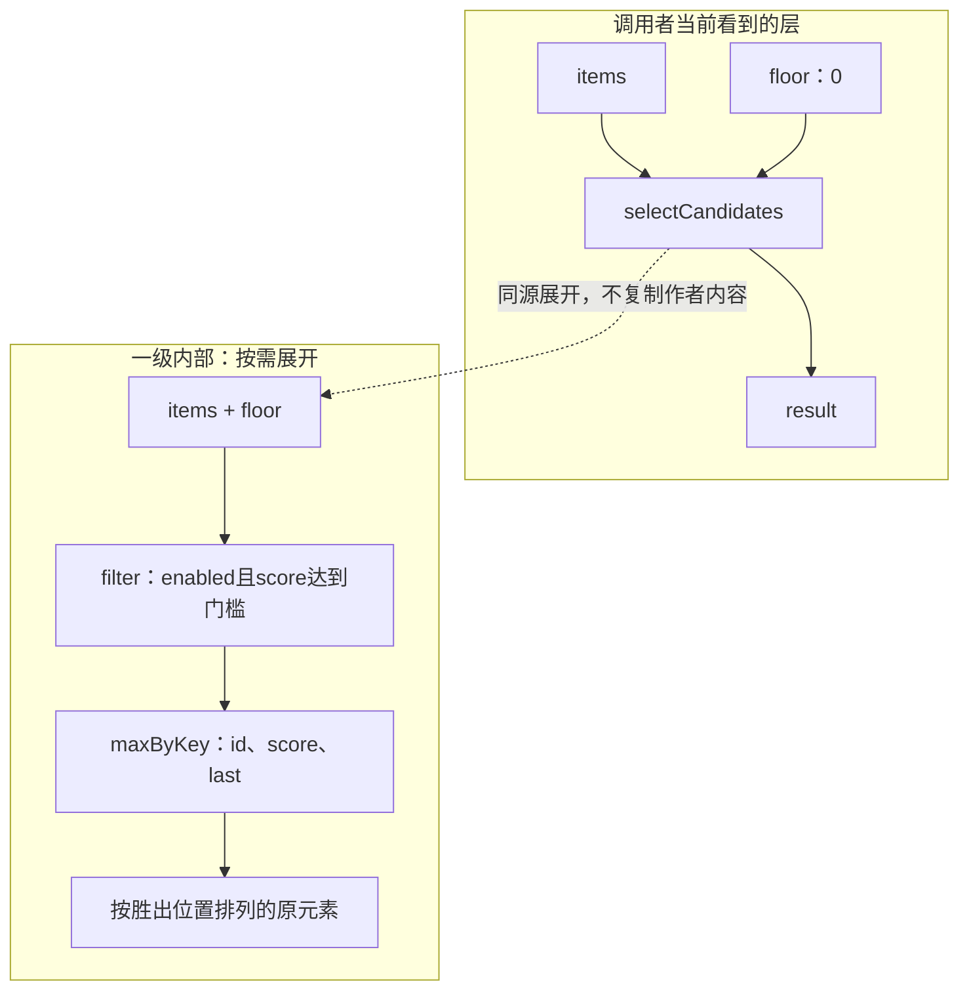

# 组合结构与任务轨迹

> **阅读范围**：有限设计范本；非已执行测试。

<details>
<summary>本页内容</summary>

- [已有定义的组合与局部连接示例](#已有定义的组合与局部连接示例)
- [同一作者源的复用与短操作轨迹](#同一作者源的复用与短操作轨迹)
- [当前完整范本：一个绑定正确的结构编辑闭环](#当前完整范本一个绑定正确的结构编辑闭环)
- [同一意图经过语义、库、全资产与再次修改](#同一意图经过语义库全资产与再次修改)
- [作者源从首次创建到下一次修改的固定会话](#作者源从首次创建到下一次修改的固定会话)
- [一次完整计算任务的要求保持与联合实现](#一次完整计算任务的要求保持与联合实现)
- [一段短代码从组合到具体源码](#一段短代码从组合到具体源码)

</details>


本篇拥有这些实际开发范本，不定义另一套产品协议；原共同规则沿正文引用定位。设计轨迹不代表产品已经运行。

<a id="block-authoring-example"></a>

<a id="芯片式组合的完整作者闭环"></a>
## 已有定义的组合与局部连接示例

这份范本只检验**已有组合需要参数或连接编辑**的任务，不是全产品固定操作顺序。它使用已经定义的`filter/maxByKey`，任务是“启用且不低于门槛；每ID取最高分；同分最后；按保留项原位置输出”。定义名不是新的官方业务原子或语言语法。

### 库维护者保存一次，调用者只写差异

`src/selection.sec`由库维护者或获准的开发AI维护；它是完整的复合定义，不是要求每个使用者重复提交的内容：

```sec
import "sec/seq" as seq;

export type Item = { id: Text, enabled: Bool, score: Int };

export fn selectCandidates(items: List<Item>, floor: Int) -> List<Item> !{} =
  seq.maxByKey(
    seq.filter(items, x => x.enabled && x.score >= floor),
    x => x.id,
    x => x.score,
    keep: "last"
  );
```

`src/app.sec`仅复用这一份定义：

```sec
import "./selection.sec" as s;

export fn selected(items: List<s.Item>) -> List<s.Item> !{} =
  s.selectCandidates(items, 0);
```

这两个文件是设计中的作者内容，没有执行结果。`sec/seq`按既有精确定义解析，并不是本次已安装的包。首次创建可以通过已有files提交完整原文；后续使用者只处理本模块的调用及真实变化，不重传库主体。

<a id="ai正常读取的是当前block层不是实现展开"></a>
### 本例只需读取当前调用与必要合同

| 对象 | 此次需要的内容 |
|---|---|
| 当前使用点 | `selected`调用已绑定的`selectCandidates` |
| 输入管脚 | `items: List<Item>`；`floor: Int = 当前实参0` |
| 输出管脚 | 新列表，保留原元素值；按胜出位置排序 |
| 公开规则 | 禁用或低于门槛不参与；每键最高分，同分最后 |
| 保持项 | 输入、原库定义、其他使用点、无关文件不变 |
| 实现 | 已有普通主体或合格特化；未请求时不展开循环和字典 |

表中的0是本使用点的实参，不是函数有默认实参；不存在调用者未写值、工具就任意补0的新增语言规则。库定义没有运行状态，实例使用点也不因此创建长寿命对象。

<a id="fig-block-example"></a>

两个框分别是当前使用点与打开一层后的同一定义。数据线不表示不同函数可以任意并行，`filter`仍须按原合同完成才调用后续阶段。



### 一次参数修改是实际源码差异

把门槛从0改成6，已知原文时使用原协议，不先查询全工程端点：

```text
sec.propose({
  base: "c1",
  edits: [{
    path: "src/app.sec",
    old: "s.selectCandidates(items, 0)",
    new: "s.selectCandidates(items, 6)"
  }]
})
```

`c1`必须由实际服务签发。原文只有一个对应出现时该编辑可以准确定位；不匹配或多义时拒绝请求，不改另外一个0。已经取得准确管脚引用时也可以用既有editRef或set-input，二者形成同一语义候选。短界面并不取消完整源的存在。

构造输入依次为A1=(A,true,9)、B1=(B,true,5)、A2=(A,true,7)、B2=(B,true,5)、D1=(D,false,100)。门槛0的规范结果是A1、B2；门槛6的结果是A1。它们是依据已有规则推导的预期，不是实际执行记录。D1从不参与，两个B仍按出现位置处理。

### 内部特殊要求怎样变成一个可复用的新边界

任务改成“让这个使用点自行决定参与条件”。它不是改变所有原调用者。先在应用范围建立私有`selectWith`，输入`eligible: (Item) -> Bool !{}`，主体仍先filter再maxByKey；原使用点传入`x => x.enabled && x.score >= 6`保持旧行为，再按获准的新要求修改该回调。该函数值在filter内按原次数调用，不在组合阶段执行；局部状态捕获服从已有位置／效果规则。

应用模块补充同一份`sec/seq`导入后，私有主体可直接写为：

```sec
fn selectWith(
  items: List<s.Item>,
  eligible: (s.Item) -> Bool !{}
) -> List<s.Item> !{} =
  seq.maxByKey(
    seq.filter(items, eligible),
    x => x.id,
    x => x.score,
    keep: "last"
  );
```

调用者用`selectWith(items, x => x.enabled && x.score >= 6)`恢复原要求。这里的`seq`是实际导入`sec/seq`的别名，`s`继续引用原`selection`模块；没有新增一种生成器或让运行数据在构建时执行。

有多个实际消费者需要这份可替换条件时，才将它明确导出或移入用户自己的库。其他场景继续调用原`selectCandidates`。更换需求不是给同一个接口增加无限布尔开关；也不是一出现差异就修改公共平台。

### 编译器具体承担什么

它从`selected`解析到固定的`selectCandidates`，收声明与实际参数，检查共享类型和传递合同，再处理filter与maxByKey的普通主体或已合格方法。已知floor可以用于特化；运行items不在编译期扫描。没有特化也能按原主体生成，可能生成普通函数、内联循环或目标容器，但都保留回调次数、阶段失败次序与原位置输出。

工具可以分析内部，而不把分析全部发给AI；也可以在明确合同足够时不重读私有实现。代码共用不合并实例，界面收起不截掉真实依赖，生成后请求预览即可结束，不自动运行或写文件。后端缺失与参数未定按实际根分别返回。

### 从小工具延伸到有状态与资源的组合

同一个文本转换工具可以由读取、解码、纯转换、编码、输出这些有合同的定义组成。读取与输出涉及实际文件时，其拥有、关闭、冲突与取消继续由资源／执行规范承担；在纯测试输入中可以直接提供已捕获字节，不需要启动文件服务。

会话block则由显式构造建立一次状态，多个调用共享该实例才共享状态；两个构造即使参数相同仍可独立。流block的端点还有拉取、缓冲和结束含义，不能把普通函数箭头复制过去就算设计完成。这些是同一组合接口的不同已定义模式，不是为每种业务建立新的顶层框架。

## 同一作者源的复用与短操作轨迹

本例覆盖同一个需求的参数、独特算法、目标形式和单点例外，不用更换语言解释其差别。这里的库与工具是已定义、仍需实现与符合性的合同；c1、e7等只是预期会由真实服务产生的引用，不是本次可执行句柄。输入为有限不可变列表，Text按精确标量序列相等，回调只读中立值，不允许将原生getter/Proxy当作同样的数据。

### 初始作者内容：用已有含义，不点名底层轮子

文件`src/select.sec`只维护一份定义。score字段从初始合同就存在，不借后续改算法偷偷升级数据格式。

```sec
import "sec/seq" as seq;

export type Item = { id: Text, enabled: Bool, score: Int };

export fn selected(items: List<Item>) -> List<Item> !{} =
  seq.distinctBy(
    seq.filter(items, (item: Item) => item.enabled),
    (item: Item) => item.id,
    keep: "first"
  );
```

所选合同是仅保留enabled项，按id去重，取first，并按被保留项在原输入中的位置输出；返回新列表，不要求深复制每个记录。用户没有选择TS集合库、Java类或新的运行框架。seq来源和语言环境按现有锁固定；直接生成普通循环或调用合格目标库，由既定实现选择负责。没有相交要求，不建立数据库、协议服务或对象实例。

新建时可以直接提交source/files。已有内容只改局部时用edits；只有上下文和定位已经取得、短句柄更合适时才用editRef。无论哪条输入，类型、调用、顺序和目标保持只有一份规则。

### 冷读与一次修改

需求明确改成取最后项，其他要求保持。已经取得c1相关内容的AI可以收到：

```text
对象 selected；基础 c1；keep = first；可选 first / last；编辑引用 e7。
保持：enabled过滤、精确id、被保留项原位置顺序、输入不变。
```

这是工具投影，不是另一种语言。实际修改为：

```text
sec.propose({editRef: "e7", value: "last"})
```

工具将值作为枚举读取，回写同一源中`keep: "last"`，形成c2；没有定位则直接提交相应文本差异，不强制先获取e7。改变first/last是行为变化，需要本任务确已允许；通过参数类型检查不能撤销另一处仍有效的first硬要求。新候选不自动成为工作区当前头。

### 独特规则：分数最高，同分才取最后

新增需求为“每个id取最高score，同分取最后一项，仍按被保留项的原位置输出”。它不是first/last的新拼写，也不能传一个未定义的`keep: "best"`。

该任务已经由“筛选＋按键取极值＋平局＋输出顺序”组成，不应默认要求应用作者自己发明二次扫描。当前优先使用已明确的普通序列定义；Item、导入和公开入口不变，主体为：

```sec
export fn selected(items: List<Item>) -> List<Item> !{} =
  seq.maxByKey(
    seq.filter(items, x => x.enabled),
    x => x.id,
    x => x.score,
    keep: "last"
  );
```

这是一项新增的有限库合同，不是已运行的软件或新的关键字。准确签名、回调求值、失败、基线算法和资源由[按键极值定义](../../docs/作者/组合/模块封装与复用库.md#有限可复用合同按键取极值并保留来源次序)唯一拥有。源码主要声明选择关系，编译器决定字典、扫描和目标表示；source/edits/editRef仍是原入口，没有新工具或另一份意图JSON。调用短也不证明SEC独占收益，成熟语言可提供同等抽象。

应用没有取得合格maxByKey定义时，库作者可以用普通语言实现它；需要立即表达新行为也可以使用下述通用程序。它是自由定义的见证，不是成熟需求面最短的示范。下面保留其完整算法和成本，避免用一个新名字隐藏未设计行为。

#### 无合格高层定义时的普通实现基线

```sec
fn hasHigher(xs: List<Item>, item: Item) -> Bool =
  match xs {
    case [] => false;
    case [head, ..tail] =>
      (head.id == item.id && head.score > item.score)
      || hasHigher(tail, item);
  };

export fn selected(items: List<Item>) -> List<Item> !{} = {
  let enabled = seq.filter(items, (x: Item) => x.enabled);
  let best = seq.filter(
    enabled, (x: Item) => !hasHigher(enabled, x)
  );
  seq.distinctBy(best, (x: Item) => x.id, keep: "last")
};
```

该基线完整定义了行为：先排除未启用项，留下每个键的全部最大分候选，再按已有last合同选同分最后项。它最坏需要二次规模的记录比较，递归深度可达有限输入长度；任意长度Text/Int的比较成本另计，不能将其标为整体线性或已性能合格。可以用已证明相容的键索引和扫描优化，但普通编译路径必须先正确；硬内存、时间或栈条件排除了当前策略时，需合格另一实现，不能悄悄忽略要求。没有实际运行或测量就不声称其收益。

固定输入位置A1、B1、A2、B2：A1=(A,true,9)，B1=(B,true,5)，A2=(A,true,7)，B2=(B,true,5)。这些名字只是说明输入位置，不新增运行身份。原first为[A1,B1]，last为[A2,B2]，最高分且同分取最后为[A1,B2]。再加入disabled且分数100的A记录，不应改变最后结果；若hasHigher错误读取未过滤列表，会把正确A1排除。这些都是书面期望，不是执行结果。

### 目标形式：不把值程序改成对象程序

在已存在java目标的候选c2上，要求公开Item在该目标中生成为`SelectedItem`类。请求只增加这两个真实控制：

```text
sec.propose({
  draft: {
    kind: "control-change", base: "c2",
    subject: "src/select.sec::Item", target: "java",
    require: {
      "java.declaration.form": "class",
      "target.public-name": "SelectedItem"
    }
  }
})
```

正常结果形成新候选c3，再通过`sec.preview({candidateRef: "c3", target: "java"})`取得所请求产物。Java生成器安排字段、构造与访问，保持Item的原值/相等/错误和已有公开边界；需要按原合同派生的相等或编解码不能改成任意引用比较。作者源没有因此新增class或可变实例。命名与已接受调用方冲突时需要适配或明确接口变更；一个拼写合法的类名不证明兼容。

完整记录及保存位置由[控制编码](../../docs/作者/组合/稀疏控制与目标限定.md#稀疏控制的持久编码)拥有。仅此Java控制不改变TS输出的语义，也不把Java互操作要求推广为TS可以代替。没有控制消费方法的后端返回准确缺项；能存JSON不等于能生成对应class。

撤销类外形覆盖使用同一draft的`reset: ["java.declaration.form"]`；它不删除另一个显式公开名，也不解除任务要求的JavaABI。需要连公开名一起恢复时，必须同批明确列出两项。复用默认后即使字节暂时不变，控制来源已经改变，未来默认升级的反应也不同。

### 同一个功能只有一个使用点要例外

默认先利用已有参数、可组合的高层定义或明确回调。它们不足以表达真正独特的规则时，才用普通主体形成私有实现，只重接那一个调用；其他使用者继续引用原公共定义。公共Item类型继续导入原门面，不能复制一个同布局新名义类型并声称身份未变。

源码确需从上游复制或提取时，记录准确上游基础和本地拥有内容；不再同时维护一份可独立修改的展开镜像。升级上游先判断本地是否仍满足需要继承的公共要求；有冲突就保留本地候选与具体差异，不按“新版本优先”覆盖。需要改变原公共行为的是有权需求修改，不是一个保持语义的自动优化。

### 上游和本地分别检查什么

成熟序列库和目标编译器可以复用。新增责任是选中正确作者位置、区分三种结果、保持最高分/平局顺序、实际履行目标控制、保存后恢复同一绑定，以及未改资产的保全。标准Map的插入顺序并不自动满足“保留项原位置”，类型通过不代签需求。已有精确合同与对应产物的有效结果可以复用，不强制重验全部上游。

### 错误与连续性

无体新要求但无合格实现时保存设计并指出缺项；不填空函数。短句柄过期时重新定位，不重建到latest。错误枚举不执行；控制未知、对象歧义、目标缺失与生成器忽略控制分别返回。源码算法可以作为错误草稿保存，但不得让旧通过产物取得新候选身份。真实save-source保存准确源与独立控制，write-output只写指定产物；二者均不因预览通过自动发生。

### 第一轮与后续成本比较

同等成熟语言也可以调用同一套序列抽象，因此初始源码短不构成SEC独占收益。独特算法需要必要逻辑，不承诺每种程序比成熟语言更短。评价包括库创建与维护、首次学习、实际读取、查询与重试、生成/适配、运行、调试以及第二次修改；短editRef只省重复运输，不替更长作者源辩护。本路线只有在共享含义、跨目标、资产联动和后续同步确实少做重复工作时，才产生相应额外价值。

## 当前完整范本：一个绑定正确的结构编辑闭环

范本使用现有基础语法，不需要未发布业务库：

```sec
export fn safeQuotient(x: Int) -> Int =
  if x == 0 then 0 else 10 / x;
```

文本作者直接创建这个函数。结构作者可使用[完整模块体例](../../docs/作者/组合/结构编辑与身份保持.md#一个完整的结构作者模块)直接创建同一基础行为，两者进入共同绑定、类型、效果和契约检查；结构路径不先打印文本再绕回解析器。此例及下述结果均为设计，不是已运行的语言或真实工具回执。

1. **首次结果。** x=0时结果0，x=2时结果5；不选除法分支时不执行除法。内部同义检查保留区域与绑定，不从数据边任意排列执行。
2. **局部修改。** query在候选c1中返回分子端点；set-input将10改为20。文本源只替换相应token，结构源只改该literal，形成c2。x=2变为10，x=0仍然0。已知文本的开发者也可直接edits，无额外发现调用。
3. **具体生成。** 在已选TS目标和Int→bigint合同下，预期函数采用`x === 0n ? 0n : 20n / x`一类保持短路与整数截断的结构；Java后端采用合格大整数判断与除法。只是给出预期形态，不由预期源码宣称所有目标已经实现。
4. **危险变换。** 把除法移到if之前，会在x=0上引入原无错误。明确要求改变行为时可以建立新的候选；自动重构不得把它称为保持行为。
5. **错误草稿。** 把分子改成未完成的`20 +`，文本作者保留新原文，结构作者在该槽保存带rawText的hole；对应产物不再合格。原c1/c2不被覆写，旧产物不贴给新草稿。
6. **恢复创作。** 从错误草稿继续将该槽改成30；语言/结构映射由真实来源重建；后端取得新产物，不要求重新读取全产品问题表。
7. **实际作用。** 请求只预览时，磁盘、图标、配置与旧作者版本保持。另行保存或写回才用当前许可与真实前像；外部已经改了这处内容则返回冲突，候选内容仍然可读。

同一任务的重命名反例是`fn sample(x: Int) -> Int = let y = 10; x + y;`。原输入3得到13；仅替换x为y会得到20而可能仍然类型正确。共同rename先模拟绑定，报告RENAME_CAPTURE；作者可选择另一个名字，或明确对内外绑定作联合重命名。字符串、注释与另一个同名局部不在默认改名范围。

这条闭环的产物是可实际实现的作者协议、输入体、算法和期望，不是新增并行平台或图形界面。支持范围内的文本和结构都可以是长期作者源；两种首次创建的独立谱系不要求内部ID逐字相同。跨会话、复杂抽取/移动和每个目标的真实符合性仍在原问题条目中保留。

## 同一意图经过语义、库、全资产与再次修改

本节是设计范本，使用原基础文法和已有的有限`sec/seq`库合同。它不是本包提供了可运行库，不声称实际执行过工具或目标。记录中的c1、a1是流程对象的示意名，不是当前可用资源。

### 固定范围、继承内容与本次差异

当前假设一个已有项目，作者已接受：公开函数名为selected；输入为有限不可变Item列表；id是按Unicode标量精确相等的Text；不作大小写或Unicode规范化；仅保留enabled为true的项；相同id保留第一个合格项；按被保留项的输入位置排列；返回新列表，记录值不深复制；整个计算不访问网络。实际数据结构和目标ABI需其边界满足，普通原生对象的getter/Proxy不凭readonly变成合格中立值。

本次任务要求生成可供已有调用方使用的库，更新明确拥有的使用说明区域；用户图标assets/logo.svg与人工设计理由保持原字节。不要求账户、数据库、消息、部署或目标程序实际运行。项目和库来源假定已固定并可读取；不满足时分别保留真正缺项。

作者内容复用[同一作者源的初始定义](#初始作者内容用已有含义不点名底层轮子)，本节只展开资产和多目标交接，不再维护第二份相同函数。初始score字段在当前first合同中不参与选择，仍作为记录数据保留。真实库合同与实现必须可取得；新增筛选行为仍通过正常中立函数完成。

### I0到产物的逐项接合

| 阶段 | 真实输入与产出 | 当前选择 | 分支 |
|---|---|---|---|
| 取得任务 | 原要求、固定源、语言/库版本和资产角色 | 只读取相交模块和说明区域 | 缺原图标不影响纯函数生成，但限制包含该图标的完整包 |
| 完成含义 | 候选源码与继承合同 | 已接受顺序直接继承；显式first不是未知 | 原要求同时必须保留last且未允许修改，则返回冲突 |
| 检查连接 | Item、两个纯回调和两个序列函数合同 | 按已声明顺序分析，输入与键定义域闭合 | 未知原生读取会影响重排，保留阶段或建立明确边界 |
| 选择实现 | 同一源语义与实际目标候选 | 默认生成标准目标循环和集合，无新第三方依赖 | 有相同合格结果的多个策略无需作者再决策；必须Java基类是另一硬要求 |
| 目标布局 | 公开selected、Item和模块入口 | 保留已有公开路径；私有结构按目标生成 | 目标需要而尚无Text/记录/序列等映射时仅该输出缺项 |
| 产物成员 | 所请求源码、必要导入/配置及说明区域候选 | 不生成空数据库、消息或检查成绩 | 说明区前像变化不覆盖人工新内容 |
| 检查或返回 | 精确产物与请求目的 | 未请求执行则仅generated-unchecked；源码和图标未写回 | 不把设计表里的期望当作已经运行 |
| 实际应用 | 若另有请求，选具体产物、目标前像和当前许可 | 只改明确写集并读回 | 中途失败按原意图恢复，不换成新算法 |

同一源可用于TypeScript或Java目标；相同中立含义不要求目标拥有同一class结构。若要使用任意原生消费者，值验证、错误和公开表示仍须正确连接。改变目标配置不改原业务合同，也不从一种目标通过推导另一种目标已通过。

### 四次变化怎样保持最小必要信息

参数、独特算法、目标class与控制reset的完整请求及书面结果，由[同一作者源的复用与短操作轨迹](#同一作者源的复用与短操作轨迹)唯一给出。本节对应的全资产规则是：参数变化检查相交说明与调用方；性能改进更新实际方法和依据而不改变业务；目标形式检查真实生成成员及ABI；新图标沿asset-change更新其内容和发行成员，不重新推导去重算法。

保持first/last差异的目标不能仅用Map覆盖值而沿第一次键顺序输出。结果来源改变但数值相同仍安装新读集。公开接口名称改变时，相交文档和调用方更新；算法不变不是跳过它们的理由。没有请求变更的人工理由和原生区域保持。

### 生态不足和需求不足不能互相冒充

任务只说“去重”，又没有当前合同或委派，就需要决定键、保留项和顺序。任务已明确而本地没有相应库，可在同一作者语言内定义算法，或根据获准策略取得实现；这不证明意图有歧义。原函数合格但整个发行缺少必要资源，仍不能说完整工程已交付。没有取得具体对象作者文法时，登记该缺项，不因基础函数可编码一切就宣布对象控制完备。

若新用例要求一种尚未提供的比较关系，项目可以定义明确的比较函数及新的局部组合。它一旦被选择就是作者资产，后续构建不再让AI每次随机重写。如果当前能力仍不足，先保存可复核设计和问题；不删要求、不默认强转、不要求库使用者永久维护生成物。

## 作者源从首次创建到下一次修改的固定会话

本节是当前AI作者面的**设计验收脚本**，不是已存在的服务调用或运行记录。选择一个可以独立理解的双模块计算库，不预设数据库、身份系统、远程能力搜索或原生业务实现。后续真实MVP仍需一个确实消费结果的工程；本节不把纸面范本当成实际消费者。

### 初始任务与作者资产

任务要求：输入value在0—255内，增加16后饱和到0—255；业务改变时从作者源修改；结果先输出TypeScript；只有任务明确选择Java时才对该共同子域作额外校准，不作为当前门禁。类型Int保持精确整数，不把输出超范围修复成缩小原输入域。

`logic/range.sec`：

```sec
export fn clamp(value: Int, low: Int, high: Int) -> Int
  require low <= high
= if value < low then low else if value > high then high else value;
```

`app/brightness.sec`：

```sec
import "../logic/range.sec" as range;

export fn brighten(value: Int) -> Int
  require 0 <= value && value <= 255
= range.clamp(value + 16, 0, 255);
```

clamp是这位作者自己定义的函数，不是必须预装的能力。它的签名、比较、顺序和返回由同一基础语义检查。Range名称没有动态反射或特殊后台实现。类型和导入不在另一个JSON树重复输入。

### 操作、结果与决定时点

| 序号 | AI做什么 | 服务必须产生什么 | 当前没有发生什么 |
|---|---|---|---|
| U0 | 获得实际宿主提供的语言/目标说明、读取范围和预算；无目录也可先内联函数 | 固定解释上下文或明确的公开默认，说明缺少的真实目标 | 不导入全局能力目录，不取得额外写权 |
| U1 | `propose(files={两个相对路径:各自原文})` | 同一个作者快照c1；声明/导入诊断；两模块能一起解析 | 不在用户磁盘创建同名文件，不比较产品文法候选 |
| U2 | `check(candidateRef=c1, methods=[types])` | c1上的源检查；正常关系与未确定合同区别可见 | 不执行brighten，不因此取得用户任务全域证明 |
| U3 | `preview(candidateRef=c1, entry="app/brightness.sec", target="typescript")` | a1-ts与实际源码；绑定候选、目标与产生方法 | 不重新选择任务、不会默认搜索GPU或新库 |
| U4 | 对实际产物请求所需类型/案例检查 | c1/a1-ts的结果和覆盖；期望来自独立任务 | 不用产物自己定义测试答案；没有执行就不返回运行通过 |
| U5 | 当前任务明确改为增加32；提交base=c1的唯一匹配差异 | c2指向新作者内容；c1与a1-ts保持历史含义 | 不将c1原地改名，也不只手改生成TS |
| U6 | 预览c2；需要目标diff时compareTo=a1-ts | 新a2-ts及准确差异；相交合同与产物资格更新 | 不要求多写一份新程序备选 |
| U7 | 用所选模式保存c2，或将a2-ts写入已观察目标 | 实际操作和读回；明确是save-source还是write-output | 不由保存推导模型采纳、Git提交或部署 |
| U8 | 后续新会话在实际保存范围中取得新context与当前版本 | 可继续读取源、生成和修改；必要上下文可重建 | 不依赖AI旧私密记忆；旧写权不复活 |

这里的c1、a1-ts、上下文与案例引用是位置记号。只有服务实际返回后才能使用；不存在的目标、案例或工作区前像不能由模型编造。接口的JSON只运输文件原文和操作选择，不要求作者手算摘要或抄写AST。

### 正向与失败轨迹

按声明的整数与饱和定义，增加16时输入`[0,240,255]`的期望为`[16,255,255]`；改为32后的期望为`[32,255,255]`。这只是独立手工期望。负输入触发本函数入口契约，不能为让测试通过把原任务输入改成其他范围。

若将函数体改为`value + true`，保存的是带定位类型错误的c3。c3不产生合格新目标；c2的旧产物不被改贴为c3。任务只是存草稿且权限允许时，可保存c3原文。修复后生成c4，不用旧有效AST覆盖当前原文。

若在c1之后外部目标已改变，`apply`比较实际目标base；冲突保留现场并返回可读差异，不能因c2源合法就覆盖。候选源的base与目标工作区的base是不同对象。取消在写入前阻止新作用；写入是否已发生按真实结果或原操作恢复协议判断。

若Java映射未实现，c2可继续用于TS与源检查；请求Java返回相应缺项，不把两个目标的结果合并成一个绿色。已有精确目标Binding的再次生成不触发新的产品方案选择或全域择优。

### 这个会话必须检验的价值与限制

本例给出作者形式、两个模块、共享定义、精确变更、诊断和结果选择的完整形状。它没有证明比同库TS写法更短，也没有证明完整领域抽象已经可用。MVP要把同一链用于一个真实消费者，再用已设计的结构计算或另一独立作者组合检查机器是否真的承担重复构造、合同传播与正确降低。若收益不足，修改相交作者/库设计；不能用本例通过替代产品采用比较。

## 一次完整计算任务的要求保持与联合实现

本例专门检查根接合，不新增领域语法或运行库。`sec/grid`沿已有规范；目标编码接口在本例中是假定需要绑定的消费者合同，不宣称当前已经发行。全部代码、输出与成本为设计及手工推导，没有运行SEC或目标程序。

### 输入和真正要交付的结果

假定当前任务已经接受：`输入为合法Grid<Int>`，每个值0至255；每个元素增加非负整数amount，再饱和至0至255；输出形状与顺序不变、源网格不变、不得有网络传输，完整结果能交给8位编码器。首次实例使用amount=16。编码器接受同形网格，元素须位于0至255；具体文件编码和目标库由已有绑定另行取得，只有前者通过不代表编解码已经完整。

这些要求可以由用户请求、现有接口与已接受源码合同共同提供。表述在这里是规范解释，不要求AI在每次调用里再复制一份同义表。

### 直接可修改的作者源

```sec
import "sec/grid" as grid;

fn saturate(value: Int) -> Int =
  if value < 0 then 0 else if value > 255 then 255 else value;

export fn brighten(source: grid.Grid<Int>, amount: Int) -> grid.Grid<Int>
  require amount >= 0
  require grid.all(source, (value: Int) => 0 <= value && value <= 255)
= grid.generate(grid.shape(source), (p: grid.Index2) =>
    saturate(grid.at(source, p) + amount)
  );
```

合法输入与amount=16时，单行`[0,240,255]`应输出`[16,255,255]`。这一结果来自明确整数算术与饱和定义，不来自生成器自造的测试期望。空Grid在配置/值域合法时返回同形空Grid，输入不变；负amount按前置合同失败，不能被自动改成0。

### 正常请求如何经过每个责任

**1. 固定任务。** 受信会话绑定接受的行为、目标禁令、实际源与所需消费者；工具完成必要引用，AI只提供源或变化。没有工程目录也可以构造本次内存候选。

**2. 分析源与局部摘要。** 原Grid库负责值域和访问；brighten的正常保证是同形状、值0至255、源不变。基础类型没有自动证明这些性质，分析须来自实际代码、已绑定库规则与所选方法；未证明则保留相应检查或保证状态。

**3. 连接编码器。** 将上游正常输出保证映射到编码器实际接受域；映射包含元素解释、形状、顺序、所有权、错误和目标表示。若需要转换数组表示，转换作为真实候选计入，不能只换类型名。

**4. 选择实现。** 先以正确顺序CPU路线为可执行设计基线。有GPU候选时，一并比较输入取得、驻留、后续编码、传输、同步与峰值内存，保留不同未来边界状态；目标被禁止联网时，远程编码器直接不合格。

**5. 生成与检查。** 对同一候选产生精确目标计划、源码与产物引用；目标工具检查的是实际产物。任务条件需要的行为与资源方法分别运行或保留为未执行，不能由类型通过推出整个任务完成。只请求设计/预览时，到对应结果结束，不写磁盘或启动编码器。

**6. 按需采用。** 真正写入或运行时，取得当前目标、权限、前像与资源，使用同一已选产物。失败若未发生外部作用，可以重新计算；效果可能发生时使用原操作意图读回/结算，而不是改源重做。

### 三次变化，三个不同影响范围

| 新变化 | 作者真正改什么 | 工具重新检查什么 | 保持什么 |
|---|---|---|---|
| amount从16改为32 | 实例参数 | 数值域、特化、目标与当前行为样例 | 原饱和、形状、源不变和禁止网络要求 |
| CPU实现换为合法GPU路线 | 被接受的目标/实现选择 | 接口转换、驻留、同步、资源、目标与相交证据 | 中立计算结果；原要求不因设备改变而放宽 |
| 用户要求改成溢出时报错 | 明确的要求及算法差异 | 下游错误处理、接受输入、目标、迁移与新验收 | 历史候选/旧结果身份不重贴新语义 |

第一种不是全工程重新设计；第二种不是业务变化；第三种是真实行为改变，不能藏成优化参数。只有第三种需要取得相应目标变更的接受依据，已有委派允许时仍可以自动完成，不一律新增人工流程。

### 修复不能通过缩小任务范围蒙混过关

反向修改候选：删除saturate，只保留`value+amount`。当value=255、amount=16时产生271，编码器前提不成立。此时工具应定位“生产者结果域超出消费者，且未实现当前任务的饱和要求”。把require改为value≤239，只证明较小域，不满足原任务；把期望改成271也不改变编码器合同。正确修复是恢复明确饱和，或提出获准的新目标及相应消费者设计。

两个函数都能解析、类型都为Int、两组局部测试都通过，也不足以通过这个连接。反过来，没有取得万能证明器并不阻止代码生成；结果明确停在实际层级，必要运行检查按调用合同保留。

### 选择成本与历史结果不混用

联合规划中的2/3/8/1 ms例子是人为代价模型，唯一用途是发现错误剪枝；不是brighten或任何设备的实测性能。未来真实比较要把编解码、数据传输和完整输入规模都计入。当前仅能结论“算法不得先删掉有不同下游边界的方案”，不能报告GPU已经更快。

检查组合时也保留独立反例：两个缓冲阶段的峰值可能同时出现；上游小误差被下游放大；原生编码器只接受一部分Int；新增插件改变全局初始化；旧执行器仍持有将被复用的设备内存。相应机制由[边界闭合](../../docs/作者/共同语义关系.md#组合边界摘要与义务闭合算法)、[联合搜索](../../docs/编译/实现选择与设计搜索.md#带边界状态的联合搜索与合法剪枝)、[预算组合](../../docs/编译/查询增量与性能.md#端到端预算的组合规则)承担，本例不另造算法或状态机。

## 一段短代码从组合到具体源码

本例是中立语义源到不同目标的设计说明，未实现或运行。本例不依赖Node、TS构建脚本或工程目录；目标TS只是一个输出，不是作者语义。

### 请求与精确含义

要求：从有限稠密Item值列表中取enabled为true的项，按Text类型id选择，默认保留第一个；修改为last时保留最后一个，并保持被保留项在原输入中的位置顺序。输入不改变；不隐式规范化id。返回值保留字段含义，不凭纯值合同保证所有宿主都有相同对象地址、构造器或可变别名。

原生接口若要求“返回相同对象引用”，必须另行声明身份/别名和边界解码合同。TS readonly并不是没有getter/Proxy或外部写者的证明。中立值合同与任意宿主对象访问不得混用。

### AI看到的定义不是全系统目录

固定画像提供List、Bool和Text；示例使用明确绑定的`sec/seq`库，固定其filter与Text键distinctBy合同。独立模块显式导入；只有context已明示短名绑定时，局部表达式才可省略限定名。新业务名称不增加语法或工具，常规名字解析由服务完成；陌生合同只查询相关内容。标准库不存在时准确报告缺项，也允许用普通函数直接定义，不以搜索全库为前置。

### 一次调用的设计形状

完整中立作者模块可以写为：

```sec
import "sec/seq" as seq;

export type Item = { id: Text, enabled: Bool };
export fn enabledUnique(items: List<Item>) -> List<Item> =
  seq.distinctBy(seq.filter(items, x => x.enabled), x => x.id, keep: "first");
```

没有`code`、`splice`、TS类型或生成器脚本。它直接是行为定义。已绑定上下文中可以只写表达式`seq.distinctBy(seq.filter(items, x => x.enabled), x => x.id, keep: "first")`，类型、身份和解释规则由同一上下文取得，不手填JSON语法树。

```text
sec.preview({source: "上述SEC作者文本", sourceLanguage: "sec.semantic/1", target: "typescript"})
  → candidateRef c1，artifactRef a-ts，所请求TS源码及必要诊断
sec.preview({candidateRef: "c1", target: "java"})
  → 同一语义候选，另一目标绑定与artifactRef a-java
```

所有名称和引用都是设计示意，不是当前安装接口；target别名在本次上下文中必须绑定精确后端。不存在Java后端时，第二请求返回目标能力缺项；不得改写c1为Java字符串，也不删除已经有效的TS结果。没有语言提示的新v2内联源采用固定中立画像；显式原生TS源仍走原生前端，不以内容猜语言。

### 目标源码的具体样子

在明确的中立值边界与纯谓词条件下，可以使用目标字符串集合形成一次遍历。下例仅是TS目标布局候选；真实生成还须绑定输入解码/信任条件和目标运行规范。

```ts
export type Item = { readonly id: string; readonly enabled: boolean };
export function enabledUnique(items: readonly Item[]): Item[] {
  const seen = new Set<string>();
  const out: Item[] = [];
  for (const item of items) {
    if (!item.enabled || seen.has(item.id)) continue;
    seen.add(item.id);
    out.push(item);
  }
  return out;
}
```

中立fn不定义JS函数的可构造性、prototype或词法this，因此可以按目标公开合同选择函数形式。原生TS箭头输入则必须保留自己的初始化与this/构造语义，不能借本例重新准许任意箭头与function互换。

Java目标可以采用公共Item值接口/类、返回List与局部Set；Python目标可以采用其声明的记录外观与列表；不能因为输出结构不同就改变键相等或顺序。Java类名、package、TS导入路径与Python模块属于目标布局，不回写成业务定义。

同一源的语义键不因目标选择而变化，实际绑定/制品/工具/来源键分别变化。不能把这些键人为强制相同来展示语言无关。需要可变原生对象身份、nullable字段或非标量字符串时，扩大对应边界合同而不是默用这份纯值降低。

### 返回给AI什么

短任务返回实际代码、候选与制品引用、准确阶段和必要诊断，不复制输入/完整IR/全部锁。generated-unchecked不是目标检查、行为验收或文件应用成功；不完备和未知须直接说明。多目标的检查和应用选择实际artifactRef，不能隐式拿最近一次生成物。

### 第二次变化与反例

在同一中立源上改为`seq.distinctBy(seq.filter(items, x => x.enabled), x => x.id, keep: "last")`。输入A1、B1、A2且均合格时，结果为B1、A2，而不是A2、B1。重复键的选择和结果顺序是两个必须同时保持的条件。

普通模块中不存在现成distinctBy时，用户可直接定义逻辑，无须修改核心或退回TS：

```sec
fn laterEnabled(xs: List<Item>, key: Text) -> Bool =
  match xs {
    case [] => false;
    case [h, ..t] => (h.enabled && h.id == key) || laterEnabled(t, key);
  };

export fn lastEnabled(xs: List<Item>) -> List<Item> =
  match xs {
    case [] => [];
    case [h, ..t] =>
      if h.enabled && !laterEnabled(t, h.id)
      then [h, ..lastEnabled(t)]
      else lastEnabled(t);
  };
```

这段递归例用于证明作者可定义不存在于库目录的行为，不宣称是最优算法；最坏时间二次方、栈和分配也需预算。带合法Eq/Hash的目标可选择经保持检查的一次或两次遍历实现；不把任意递归源码自动替换为看似相同的库调用。新业务的表达能力不依赖优化是否成功。

disabled的后项不能排除前面的合格项；空输入得到空值列表；不同调用不共享seen；原生getter或有作用回调不能套用純值融合规则。输入范围与谓词合同是决定条件，不从readonly推断。

### 从片段升为工程

保存为模块只增加必要长期身份、解释绑定和来源，不重写为某后端语言。单模块、库、应用布局按目标选择；保存和写回分别准入。已有HALO界面保持其原生消费者身份，中立计算生成或原生适配只接管有权的局部边界。生成物不需要SEC作者解释器或AI持续在线，但真实依赖仍明确列出。

完整源码布局由[目标源码策略](../../docs/编译/目标/成员布局与完整产物.md)拥有。
