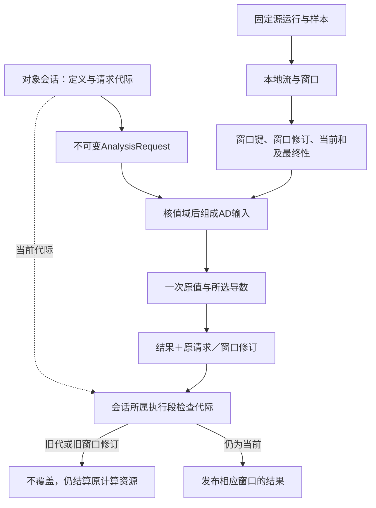
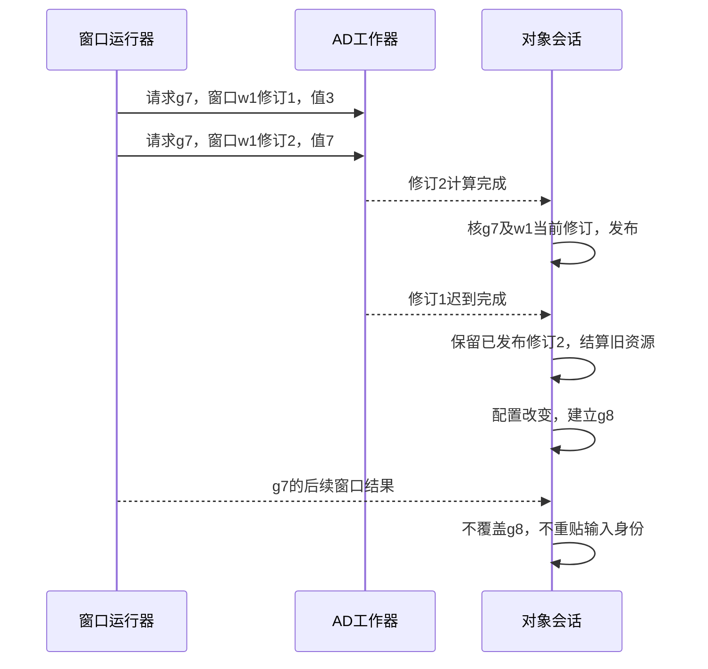

# 状态关系流与数值组合

> **阅读范围**：有限设计范本；非已执行测试。

本页内容

- [层级状态的完整开发与连续采用轨迹](#层级状态的完整开发与连续采用轨迹)
- [关系型资产报告的连续开发](#关系型资产报告的连续开发)
- [广义小工具与多前端的交叉核对](#广义小工具与多前端的交叉核对)
- [将现有算法抽成私有函数后继续修改](#将现有算法抽成私有函数后继续修改)
- [本地分析工具：对象会话、时间窗口与导数共同工作](#本地分析工具对象会话时间窗口与导数共同工作)

本篇拥有这些实际开发范本，不定义另一套产品协议；原共同规则沿正文引用定位。设计轨迹不代表产品已经运行。

## 层级状态的完整开发与连续采用轨迹

本例的唯一语言和算法定义在[状态规范](../../docs/领域/状态关系与流/层级状态与事件.md#3-作者如何写普通程序不增加关键词)。它组织一个图像导出准备过程，模型中render和inspect正交推进，active可以暂停后恢复；不是将计算任务重命名为工单。本例引用的库/提供者均是设计绑定。

AI创建普通`exportFlow()`及自己的工作函数；也可以对现有结构视图添加region或转移。workspace建立候选C1；semantics解析有限模型与回调；compiler调用域方法产生表、step函数、来源及所需库；未添加activity/timer时不产生任何网络、线程、数据库或Outbox。纯模型能在内存中处理模拟输入，不宣称真实渲染发生。

合法逻辑轨迹是idle → start → rendering/checking → render.done → rendered/checking → pause → paused → resume → rendered/checking → inspect.done → ready。只完成render不产生整体完成。更改deep为shallow后，恢复到rendering/checking，重新启动render是明确行为变化；移动画布则不是。

实际采用渲染活动时，绑定精确Provider与请求/回调映射，入口只接收对应activity激活的结果。暂停会取消旧活动；旧活动未停止时资源继续占用，独占槽的新启动排队。deep只恢复逻辑叶，不复活原句柄。原输出请求仍须固定所处理图像版本，否则同名检查结果不能证明新图片已被检查。

随后将inspected从“格式合法”改成“格式及签名合法”。新作者和目标可以生成，旧运行快照的同名final不能直接继承新保证。迁移选择重检/显式映射/固定旧模型继续，更新真正相关的资产和实例，不重新设计候选或权限模块。只要求设计/预览时到C2及产物候选结束，图上的start事件不会被设计工具自动发往真实运行程序。

## 关系型资产报告的连续开发

完整源码及有限库由[关系查询规范](../../docs/领域/状态关系与流/关系查询与维护.md)唯一维护。任务是：选出至少有一条release标签的资产，每个资产出现只计一次，再按kind求bytes和并明确排序。不是给SEC增加一个“资产报表业务”关键字。

固定输入：A=image/100、B=image/200、C=text/50；A有两条release、B一条release、C一条draft。采用semiJoin、groupBy、sumInt、orderBy得到唯一行image/300。错误改成普通join得到400，后面distinct不能修复已经倍增的总和。空输入产生零组，缺一个必需分片则是未完整而不是空数据。

第一次创建普通双模块或单模块候选；预览先生成无数据库依赖的目标库与对应产物。第二次只将release谓词改为prod，保留其他规则；已有运行ViewState必须以新查询身份重建或合格迁移，不等待未来插入才补算。第三次只增加一份相同标签，semiJoin结果不变但支持计数改变；删到最后一份标签时相应资产才从结果消失。第四次指定数据库后端，先检查数值、Text、快照与许可；不满足就继续合法本地路线或准确报告该目标缺项。

报表需要写CSV时再选择真实编码与输出所有权；README人工理由和图标未要求变化就保持。设计与预览不运行查询、不写文件；实际运行、读取及写报表沿原execution处理。当前全部输入与期望是书面设计，不是执行成绩。

## 广义小工具与多前端的交叉核对

[TSV工具](../../docs/领域/计算基础/计算结构与算法.md#一个非数值小工具的完整闭环)补入普通格式转换轨迹：输入两份相同行不去重，`001`默认保持Text，列缺失不自动填空；生成、实际运行和文件保存分别交接。该例没有数据库、数值加速或新增产品模块。

SDK没有进入当前作者方案；日常创建与参数修改直接使用前述`.sec`和结构局部操作。对“请比较某个技术”的请求，先形成方案判断，不能自动创建新包、语法或实现任务。

TSV例中的decoder可在公共合同保持时替换；披露、错误、值域和取消变化要重新检查。普通工具的完整交付不要求实现所有备选前端。

## 将现有算法抽成私有函数后继续修改

沿[完整抽取规格](../../docs/作者/组合/结构编辑与身份保持.md#私有函数抽取与局部内联)处理safeQuotient的else表达式：原出现留在else，新helper不导出，不增加require。工具给出一个联合候选；x=0仍不执行除法，x=2仍得到5。再把分子10改成20，修改helper中的字面量；结果x=2变10，这是明确的算法变化，不再把它称为单纯重构。

从局部复用到公共库需独立的公开接口检查，但不需要用户提醒“还要设计封装”才开始查消费者。正文、字段、来源和边界已经明确的部分直接复用；缺快捷工具不阻止普通files/edits表达同一个联合候选。

## 本地分析工具：对象会话、时间窗口与导数共同工作

本例检验三个领域的真实交接，不将它们作为所有工具的前置。目标是一个本地数据分析工具：持续取得带时间的整数样本，按键和窗口求和；对每个窗口值计算所选实函数的原值与梯度；当前会话显示最新有效结果。它不需要数据库、中间件、远程调用或持久工作流。

### 图解：三个领域共享数据合同，而不是共享状态库

实线表示实际输入和结果；虚线表示代际检查。会话对象、流窗口和AD残余各有自己的状态与寿命。

**会话合同：** Session拥有当前请求代际和已发布窗口结果。配置改变时先校验新函数、数值与窗口参数，再增加请求代际并形成不可变请求。一次检查并发布在会话的同一逻辑执行段中完成，中间不能await或允许未受控重入；这不是多线程共享对象自动原子。

**窗口合同：** 每个WindowChange保留源运行、时间域、窗口键、窗口修订、值和是否按接收政策最终。`Updates`的新值是替换当前窗口结果，不是要再次加到上一总和。修改窗口定义建立新实例或执行明确迁移，不把同名window接到旧索引上。

**微分合同：** 将窗口精确Int转换为F64时，先检查实际值能否精确表示；不能静默舍入。函数和捕获来自固定请求，AD只读取这些不可变输入。默认请求PointDerivative；遇到BoundaryUnresolved、NonDifferentiable或NumericFailure，在该窗口给出准确状态，不补零梯度。

**发布合同：** 结果必须同时匹配当前请求代际、源运行、查询定义以及该窗口当前接受的修订。只检查函数名或全局请求代际不够：同一请求内，窗口修订2的求导可能先完成，修订1随后到达。旧结果不得覆盖新结果；它仍须完成自己的tape和设备结算。

### 图解：同请求中的窗口修订也要防止迟到覆盖

消息是已经固定的值，不重新读取活动会话字段构造过去输入。图只描述两个修订乱序完成，不承诺通过取消立即停止旧计算。

若函数采用 `x²+3x`，窗口值3的数学原值18、导数9；修正到7时原值70、导数17。它们是明确输入和函数的推导，不是本包运行记录。到达顺序不得使界面在已经采用17后又显示旧的9并标为“当前”。

| 变化或失败 | 具体处理与保持 |
|---|---|
| 只改显示颜色 | 改相交资产/显示层，不重建输入流或导数规则 |
| 函数改为另一已定表达式 | 新请求代际，重建相交导数；不取消原作用记录 |
| 窗口结果从3修正到7 | 同请求内增加窗口修订，仅更新该窗口；不是新全工程作者版本 |
| 源发生丢失或估计水位后极迟到 | 显示对应覆盖和Late政策，不声称真实数据全量完整 |
| 求导返回错误 | 保留窗口原值和错误身份，不伪造成功梯度；其他独立窗口可继续 |
| 旧计算不响应取消 | 取消发布资格，保留其实际资源占有；采用隔离或等待停止 |
| 当前会话并发写无合格所有权 | 在对象边界报冲突或采用明确同步，不让普通set冒充事务 |

由这个过程产生的图表、界面与结果文件仍沿全资产合同。只预览软件设计时不打开源；构建和运行分别需要真实请求。完整计算可以是批处理，也可以带本地交互，二者不强制SEC开发界面图形化。
