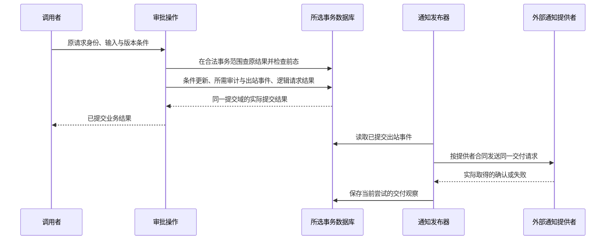

# 领域应用与算法细化

> **阅读范围**：有限设计范本；非已执行测试。

本页内容

- [科研数据流水线端到端工程设计](#科研数据流水线端到端工程设计)
- [订单审批端到端工程设计](#订单审批端到端工程设计)
- [首个真实消费者精确进制转换](#首个真实消费者精确进制转换)
- [大功能、独特算法与共同约束的组合示例](#大功能独特算法与共同约束的组合示例)
- [同一功能由简到详再复用](#同一功能由简到详再复用)

本篇拥有这些实际开发范本，不定义另一套产品协议；原共同规则沿正文引用定位。设计轨迹不代表产品已经运行。

## 科研数据流水线端到端工程设计

### 目标与独立性

该场景将不可变样本数据经过清洗、分组、计算和报告发布，用于审查 SEC 是否被订单/CRUD业务特化；本文是设计推演，不是已经取得的通用性证明。用户要求数据版本、参数、方法和不确定性可追溯；失败不能导致部分结果冒充完整研究结论。

### 工程模型

数据集由输入清单、内容摘要、许可与可见范围描述。PipelineStep包含方法revision、输入类型、参数、输出类型、环境和随机性约束。Artifact包含内容、来源、方法与覆盖。RunRecord包含已选择输入、实际动作、资源、故障和结果。ResearchClaim与运行结果分开，统计显著不自动等于因果解释或实际价值。

### 设计采纳

AI可以组织步骤、提出方法、发现数据缺口与生成分析候选；方法采用必须记录适用条件、排除规则和验证。不能因为看到结果不理想而静默改变筛选条件后复用旧结论。数据清洗规则变更属于模型revision，必须使相关结果失效。

### 编译与确定性

编译器根据严格完成前置构建可调度依赖，检查丢失输入、类型/单位不匹配和未绑定方法。迭代算法内部循环、反馈系统与单调分析固定点有自己的终止或持续运行合同，不因画出环就一律判为非法；只有缺少初始输入和求值语义的互等才拒绝。固定算法、数据与环境时可确定重建；数值库、硬件和并行归约存在差异时，结果合同指定字节等价、数值容差或统计等价，不能统称完全确定。随机种子及随机源revision进入真实依赖。

### 同一工程中的复合类型、流与原生计算

本设计选定一种有限路线：每条观测包含样本身份、带单位的数值、`Option<Text>`说明与采集时间；解析返回`Result<Observation,ParseError>`，解析失败不使用零值或None伪装成功。原始未知附加元数据留在可保全的载荷区；分析是否读取它由方法合同决定，不因显示时折叠就丢弃。

输入读取器由一个作用域拥有，暴露单订阅拉取流。默认遇到非法记录立即结束本次完整分析；选择“跳过并报告覆盖”是另一明确方法政策，改变分母与保证，不能由优化器为提速决定。缓冲同时限制条目数与字节数；超大记录要报错或走选定分片，不能用一条记录规避预算。

通用`map`的类型对输入/输出参数化，传播变换函数的效果和失败集合，不需要新增一个“科研专用map”内核分支。纯单位换算与原生数值库调用可以在同一管线共存；后者的浮点误差、数组布局、分配与释放由原生绑定合同承担。把有异常的变换移动到筛选之前，或把尚未使用的读取器提前打开，都可能改变观察结果，必须按优化前提判断。

本设计将计算包装为未启动Deferred；界面预览不会运行算法。实际获准启动后，任务域拥有读取器和子任务，关闭文件不早于最后使用；取消不等于原生计算已结束。输出结果暂存、完整校验与发布分别发生，清理失败保留责任，不删除已发布事实。

### 人和AI如何修改这条设计

人通过表格调整错误处理政策，AI基于同一方法修订修改对应类型、覆盖说明和验收条件。变化只要求设计时，返回语义差异与反例，不生成运行工程。用户把“非法记录终止”改成“跳过”时，工具必须指出统计覆盖与结果可比性改变；不能仅呈现一个配置布尔值变化。

同一轮中，另一个人只修改样本说明的排版：若该文字不进入分析且相关规则未变，可保留数值计算资格；若说明由文本分类器消费，必须更新它的实际依赖。两个后端返回相近数字，不代表错误政策或未知元数据保持；验收分别检查数值合同、覆盖、状态与信息保全。

### 内容与发布

中间产物写到内容寻址owned区域。全部必需步骤完成并读回后，发布一个完整结果manifest；某步骤失败可保留明确的部分产物供诊断，但报告首页不能标为完整研究结果。运行记录、数据引用和结果manifest在元数据事务中一致提交。

数据许可或隐私撤销影响可见性和允许传播，不等于修改旧数据摘要。缓存命中仍需当前读取/使用资格。删除义务通过墓碑与引用保留规则传播，旧备份恢复后不能复活已撤销公开数据。

### 增量与反证

新增无关数据分区不应失效明确不读取它的步骤；查询“全部符合条件样本”则目录成员/范围查询是负依赖，新增符合样本会失效。只记录现存文件摘要会遗漏这一条件。方法改变必须使其下游重算，报告渲染变化不应重算数值结果。

### 失败与资源

输入损坏、缺失、单位错误、非有限数字、极大分组、内存耗尽、临时磁盘满、节点超时、结果写入后确认丢失分别记录。重试只复用相同规范输入且可重入的计算，不能重复发外部费用任务或追加数据。缓存丢失只能增加成本；权威原始数据与恢复资产不属于普通缓存清理。

### 验证与权衡

使用手算小样本、独立实现、排列不变性质、数据分区变形、缺失/异常值、并行顺序和环境变化测试。固定容差必须来自方法误差模型，不任意写一个epsilon。高成本全量重算作为抽样对照验证增量结果；不能为省成本永久不验证缓存正确性。

统一DAG可减少重复调度，但不是所有研究都必须变成复杂平台。单脚本仍可作为受治理步骤；只有重复、并行、追溯与恢复收益超过维护成本时才细分更多步骤。核心的合同/依赖/效果/证据协议与订单场景相同，具体数据分析语义仍由科研领域模块拥有。

### 有限机制的验收设计

可以先检验队列、运行、成功、失败的有限生命周期，但不能把生命周期符合性等同于科学结果正确。

状态聚合规则可产生生命周期、审计和事件结构。这不自动执行科研算法、验证结果内容或重建完整数据流图。Worker报告与独立科学验证依旧分离；不能把有权登记succeeded解释为科研结论已证明。范围见[状态聚合生成纵向切片](../../docs/依据/来源/设计依据与资料边界.md)。

## 订单审批端到端工程设计

### 业务定义

租户中的审批者可以将处于待审批状态的订单推进到已批准。操作必须保留审批人、时间与依据，拒绝跨租户访问，检测陈旧版本，并产生待发送通知。该场景同时消费语义、数据、API、权限、事务、错误、消息、验证与恢复，不能以几个纯函数代表完整实现。

本场景选定的产品政策：重复同请求在当前结果披露许可内返回原审批结果；同幂等键不同输入拒绝；已批准订单以新请求重复批准返回明确的已处理结果而不再发新业务事件；待审批以外状态不可审批。取消订单与批准订单使用相同状态版本条件，竞争者最多一个成功。

### 模型与不变量

Order包含tenantId、orderId、state、version、amount、currency及业务数据。Approval包含审批操作身份、订单前后版本、主体、政策revision与结果。Idempotency包含tenant/principal/request、输入摘要及结果引用。Outbox包含eventId、订单revision、事件载荷、发送状态与重试信息。审计记录与审批结果不可用日志打印代替。

不变量：订单只能由当前授权主体在合法状态批准；金额与币种不能因审批改变；每个成功审批有一个审计和一个业务事件身份；版本严格推进；所有查询和唯一性键包含租户范围；审批响应不能先于事务提交。

### 编译输入与生成责任

AI/人组织实体、状态图、操作前后置、权限、幂等规则与目标数据库能力。领域规则生成类型、DTO校验、API合同、目标DDL、事务入口、条件更新、错误映射、outbox结构和验证义务。授权策略的真实接入、邮件发送Provider、组织身份数据与独特业务规则通过明确绑定进入，未绑定时不能标成完整可部署工程。

### 请求协议

请求包含订单ID、expectedVersion、requestId与审批理由；tenant/principal来自认证上下文，不能信任载荷冒充。读取订单时区分不存在、无权和存储不可用，响应披露按策略控制。业务时钟由受信时钟Provider提供，不能成为跨重放的业务请求身份。

### 事务线性化点

先认证并确定可信幂等命名空间；在当前读结果权限下查询已有操作；仅不存在时检查新写权限，并在提交事务内复查同键和前提，随后读取并验证订单与版本条件，执行`state=pending AND version=expected`的条件更新；写Approval、Audit、Outbox与幂等结果；原子提交。更新零行后重新分类状态漂移/已处理，不能猜成功。使用哪个隔离和条件更新机制由目标Provider合同决定，不能把通用伪SQL当全部数据库等价。

这是确实要求审计与可靠通知的事务示例正常轨迹，不是所有计算的模板。确认层级、响应丢失、重复发送和租约失效按交付协议处理；数据库提交与外部送达是两个事实。

### 外部通知与未知完成

审批事务不持有网络通知请求。发布器至少一次投递，消费者按eventId去重或使用Provider幂等键。网络响应丢失时不能宣称没发送；按Provider读回能力处理未知。若外部通道不提供去重或读回，不保证恰好一次通知，必须在产品合同中接受重复风险或换用更强通道。

通知失败不回滚已提交审批；它形成独立交付义务。补偿不是把历史审批事件删除。取消/撤销审批若属于业务能力，应定义新业务转换和权限。

### 故障与并发

事务提交前崩溃不产生已提交审批；提交后响应丢失通过requestId读回；两个相同请求并发只有一条幂等记录；不同主体使用相同文本requestId不互相混淆；审批与取消竞争通过相同版本前置；通知发送后登记失败可能重复投递；磁盘满、数据库不可用、权限撤销、政策revision变化和租户移交有明确阻断与再准入路径。

### 独立验证

至少测试跨租户读取、错误主体、非法状态、陈旧版本、同键异请求、双审批、批准取消竞争、提交前后崩溃、通知重复/超时、审计/outbox与订单同事务、直接数据库写绕过边界。手写验收表来自业务定义，不能由生成实现的分支自动抄出同一错误Oracle。

### 工程取舍

同步通知简化响应但扩大事务与外部故障耦合；事务outbox增加存储和投递维护却明确隔离提交与外部交付。事件溯源不是本场景必需：普通状态表、审计和outbox已可满足当前要求；若需要完整事件重放再采用独立决策，不因本设计有事件就强制全系统事件溯源。

### 完成边界

本例的业务合同与各参与者的支持范围分别判定。真实认证、网络监听、消息提供者、数据库迁移与部署，需要对应实现、环境与验收；一个本地状态例不能代签完整生产服务。

### 已处理状态与版本的裁决

新请求即使看到订单已经批准，也必须提交当前版本才能得到already-applied；陈旧版本仍返回StaleVersion。同一请求的重试返回原结果，不重新比较其旧expectedVersion，但必须通过当前结果披露授权。两种路径不产生额外审批事件。

### 连续演进的组合反例

下列情形延续同一个订单工程，是书面设计检查而非运行记录。工程中两个互相调用的分析节点A/B，原来通过一个可选远端诊断绑定取得network效果。开发者在S1候选中删除该唯一绑定。新方程只剩A/B之间传递，最小效果集合应为空；从旧结果只做并集会使network永远留下。按新的递归组件重新求解，不让已无远端调用的候选继续被迫请求网络许可。

另一人仅修改显示名称，AI基于S1提出批准流程的成组变化。S2将大额订单的批准政策正式改成需要另一有权角色，这是一项有版本的业务合同变化，不是无告知收紧原接口。即使Order字段没有变，新增规则也改变了审批应检查的条件。提交端检查规则选择目录，显示名可独立保存，相交业务组重新校验；旧批准不自动覆盖新政策。重连用固定快照和相应事件起点更新视图，不覆盖未保存文本。

随后获准的操作O已经提交但响应丢失。此时新审批写权撤销，结果读取仍允许；用原作用域、可信幂等主体和请求ID查O，只读回既有结果，不重新要求写权或发新业务事件。若读取权限也撤销，则不给出隐藏结果，已经发生的审批事实仍保留。

更晚控制库只能从早于O的备份恢复，一个离线副本还携带已删除定义。恢复先隔离，取得最新删除/授权前沿并查询O的真实结算；旧备份不能自证O未发生，也不能为旧副本恢复写权。所需最新依据不可得时保留草稿、历史解释及无相交作用的设计，敏感写入需要有权恢复；旧副本可以按新基础重新导入候选，不复活旧删除目标。

这条连续变化使用不同身份而不增加平行工程：作者定义、分析依据、模型代际、业务操作O、控制围栏、分页游标和恢复前沿各司其职。工具承担机械对应，开发者只处理真正改变业务含义或当前权利的决定。只要求设计时，全部到设计候选、影响与理由交付为止，不生成程序或运行这些故障。

## 首个真实消费者精确进制转换

### 为什么选这一边界

实际采用时选择可隔离且已有消费者的模块，读取其当前接口和检查范围，不接管全部应用。验证 AI 编写中立函数、经目标生成并被原生消费者使用的完整路径，不要求先实现全部未来语言。原生算法保全是另一条合法入口，透传不能代替中立编译能力。

定义一个用户可维护的“本地工具功能”组合：公开输入/输出与错误合同、算法实现引用、输入检查、调用连接、实际需要的注册与说明投影。进制转换实例只写名称、类型/选项、实现引用与必要政策。用户算法可直接保存为TypeScript源，精确整数/解析/分组由已选择实现承担；不能以原生类型合法冒称数值行为已正确。

组合定义必须生成有真实消费作用的源码，而不是只记录一行“引用了某函数”：输入约束产生相应运行检查，调用外观遵守结果和错误合同；实际注册元数据由现有注册机制消费或保持其原有拥有者。没有消费者的附加文件不生成。共享要求与算法分开但不重复：所需数值精度属于合同，实际签名从源码观察，算法源码只保存一份。

这是通用组合合同的一种局部定义，不是SEC内核新增HALO专用类型。首个定义和下一份独立定义用同一模块/实例/生成协议。将来选择结构化通用程序画像时可以替换算法作者方式，不能反过来要求现在先实现完整的自定义整数、循环和泛型编译器。

### 第一轮冻结的行为合同

| 对象 | 首版选择 | 边界与诊断 |
|---|---|---|
| 进制集合 | 现有消费者所需2、8、10、16；以作者数据而非核心枚举声明 | 其他进制先给不支持，不自动扩大为完整数值语言 |
| 输入 | 核心按给定策略检查整串；适配层可以明确执行既有trim | 空输入、非法数字、尾随垃圾不能只解析合法前缀；UI草稿不完整保留，不冒称合法数字 |
| 符号与前缀 | 首轮保持消费者已接受的符号/前缀政策；扩展负号或前缀是下一次显式设计变更 | 核心与UI政策必须相同；不能一边验证禁止一边转换允许而没有说明 |
| 数值 | 在资源允许范围内精确的整数，零规范化；超限有独立结果 | 不经浮点中转；不承诺无界物理资源，也不以静默截断换取继续 |
| 输出 | 各进制的规范数字文本，十六进制字母大小写由作者规则指定 | 业务结果与本地化展示分开；跨边界一直保留精确文本 |
| 分组 | 正整数分组宽度；符号与数字分开，分组仅作用数字部分 | 零或负宽度、不可表示宽度在循环前拒绝；错误不能无限占用UI线程 |
| 类型 | 明确结果记录与错误变体；若旧消费者使用null，以窄兼容外观映射 | 内部原因不全部丢掉；兼容外观不能改变核心的精度与完整输入规则 |

原生Base以有限number字面量传入时，验证其是受支持值；不要求为此强制转换成另一种全局Int对象。精确计算使用所选原生bigint或等价实现，跨消费者保持数字文本，外观按照合同映射结果/错误。算法正常保存在原生源码，生成的检查和连接承担组合定义约束；分别验收两者，不声称原生编译已经证明可选结构化语言实现。

原实现只是基线，不是唯一Oracle。实施前明确区分保持旧合法行为与修正已确认缺陷；故意改变输入接受集必须有业务选择，不以“优化”为名偷偷执行。未来增加2–36进制、其他前缀或分组政策，应只改作者包及相交消费者，不改编译器业务分支。

### 必须穿过消费者的精度反例

`9007199254740993`等于2的53次方加1。精确十六进制结果为`20000000000001`。源输入、转换结果、展示和复制四个位置都须保持该值。生产者改为精确整数，但消费端再用Number格式化十进制，仍会破坏用户结果；因此对应展示应采用精确文本分组或符合精确语义的格式化，不需要重写整个界面。

直接调用边界还要检查合法前缀后带非法字符；若界面已预验证，不能据此宣称用户界面必然暴露同样缺陷。分组宽度为零的反例针对公开函数合同；当前界面若固定传正值，需如实区分可达性。发现潜在边界问题不授权顺手修复其他应用。

### 独立验收与继续变化

解析的数学规格是对每个合法数字d在基数b中累计`n_next = n*b + d`，符号单独应用；格式化对非负绝对值反复除以b得到余数，倒序排列，零有明确特例。这是规格推导，不是用目标生成器再生成一份“期望答案”。测试可以采用预先固定的大整数用例、独立大整数实现与往返/规范化关系，多方法共享规则的错误仍须说明。

第一变化修正所支持输入域的精度并穿过显示/复制消费者；第二变化从共享定义/实例修改分组或前缀合同，并修改相交原生算法，重新生成运行检查与连接。第三变化由独立作者定义另一种有顺序列表处理或验证功能的组合，而不是只把现有模板改名。它们分别检查行为、跨产物同步、继续开发与开放定义；业务算法可用原生程序，不用新语言节点数量代替工程价值。

失败时保留旧作者资产与原生消费者，候选输出不覆盖生产文件。接受修复后再经过当前目标仓库的实际集成和发布条件；本例不借静态源码阅读宣称主分支CI通过、扩展已发布或AI已节省时间。

## 大功能、独特算法与共同约束的组合示例

“给订单加审批、审计与通知”不是一个无参数万能意图。AI先查询现有Order合同、状态、租户/授权边界和作用目标；已经有定义的内容引用，不重新抄一份。下面是候选设计的具体绑定视图，不是已发布协议或已运行程序：

| 组合实例中的决定 | 该值保存在哪里 | 由谁承担执行或检查 |
|---|---|---|
| 作用对象与状态 | 订单模块已有稳定定义；实例指定待审到已审的边 | 状态规则与目标更新逻辑 |
| 可接受输入、版本前提与错误 | 公共请求/结果合同及实例选择 | 生成输入检查与版本比较，消费者处理明确错误 |
| 谁可以审批 | 已接受的租户和角色政策引用 | 受限查询/当前授权适配，不把资料中角色名当权限 |
| 特殊业务判定 | `approvalPolicy`原生函数的作者资产及要求 | 成熟语言检查其实际类型，独立验收判断业务，不推断它天然纯 |
| 变更与审计如何一起持久化 | 同一事务范围、目标适配能力及审计结构 | 具有实际原子能力的目标；不支持时返回缺项 |
| 外部通知 | outbox投递合同、事件身份、幂等与重试选择 | 提交后投递与目标结算；不声称网络通知与数据库一起原子 |
| 需要的制品 | 请求/错误接口、必要的运行连接、已有测试/说明消费点 | 选定生成规则和现有工具；没有真实用途的不制造 |

已有功能定义可以组合“受控状态转移＋同事务审计＋提交后通知”，实例只补Order绑定、公开接口、规则函数和已决定参数。没有成熟定义时，AI用已有更小定义与原生源码创建本工程局部组合；不需要先请SEC开发者增加一个approveOrder核心分支。局部安排没有复用价值时也可以一直保持原生实现，不强行上架。

组合不是任意拼接。对象级授权可能需要先在租户边界内读取对象再判定；不能用一条“所有授权必须先于所有读取”的口号破坏真实协议。鉴权缓存需要主体/政策/数据适用范围，事务开始前的判断可能在提交前失效；通知重试需要目标或业务幂等。每项跨界前提放在真实承担它的机制中，不让外部组件名字代替证据。

AI修改金额阈值只改变所选规则与相交检查；新增审计字段改变共享合同及其消费者；把单次审批改为多人并行会改变状态与不变量，可能需要新的组合定义和迁移。这种实际结构变化不能承诺只改一个参数。架构提供可定位的变更边界，不消除业务自身的复杂度。

仅要求设计时交付上述定义、作用顺序、失败和替代后结束。获准实现才创建算法和生成规则，获准应用才影响真实目标。对照案例用于攻击设计，不作为已执行的运行事实。

## 同一功能由简到详再复用

本例检验抽象深度连续变化，不再创建一款演示软件。假定工程已有Ticket类型、当前角色政策、请求版本检查、同事务审计及提交后outbox的明确合格定义。以下是候选含义说明，不是已发布的新DSL，也不是已运行代码。

初始关闭功能只需绑定Ticket的Open/Processing→Closed转换、关闭原因非空、既有关闭权限、审计与提交后事件。共享定义承担真正重复的实现规则；系统不得省略决定了本功能含义的失败、幂等和权限前提，只是通过精确定义引用而不反复手写。

第一次新要求是“关闭时必须带至少一张图片”。若原定义已有附件谓词参数，就绑定现有图片判定；若没有，AI查看检查步骤的展开，从明确来源建立本实例拥有的局部谓词并组合入转换守卫。它可以是已有谓词组合、紧凑一般表达式或原生函数。外部请求与状态更新合同不因查看展开而变，提交前重核新增输入和前提；没有为这一句需求新增核心业务操作。

第二次要求是“图片必须通过异步审核才允许关闭”。这不是把一个布尔值换成长函数：PendingReview、审核结果、撤回/超时、最终关闭与事件顺序可能真实改变。AI在该功能的相交子定义形成新状态和作用协议，保留无关授权、审计和数据定义；目标不支持所需异步协议时，设计仍可保存，不能把审核发出去就报告已关闭。这里不承诺所有实质需求只改一行。

第三次，另一个模块也需要“附件审核后转换状态”。可以从已明确的共同部分提出一个参数化局部定义，保留Ticket和另一个对象各自独特的审核/失败政策。相同名字不证明等价；不得为了抽象统一删除差异。接受后两个实例引用该定义，旧局部实现按实际引用与恢复需要退役，而不是永远同时维护两份。

上游关闭定义升级时，原实例的精确绑定不自动变化。继续升级采用旧定义/本地具体化/新定义的相交比较；不再愿意承担升级耦合时，明确转为独立定义并保持当前合同。所谓可展开不是承诺永远能够任意改动后无冲突升级。

反例检查包括：看展开却增加大量作者文件；特殊条件只能让核心开发者加开关；改一个局部守卫覆盖另一实例；高层名字不变却省略异步失败；用AI生成的新期望给自己签发正确；修改派生源码后源模型仍被宣称完整；重新提取定义丢失副作用次数。以上仅为设计与未来验收条件，
